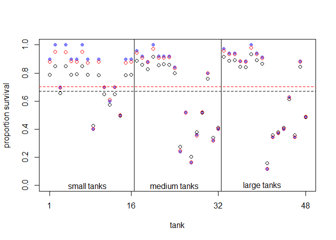
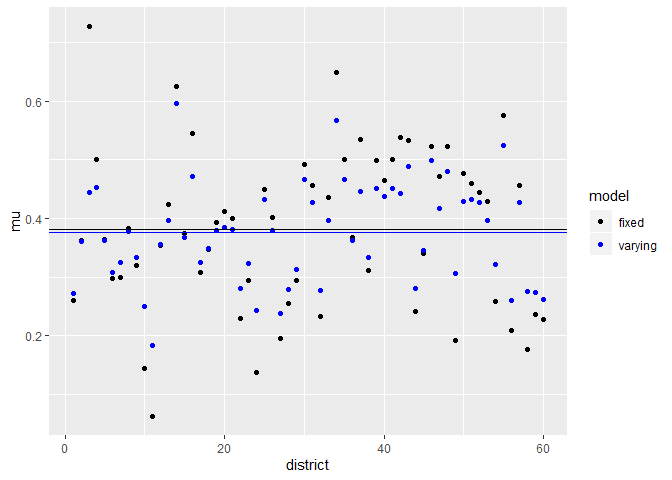
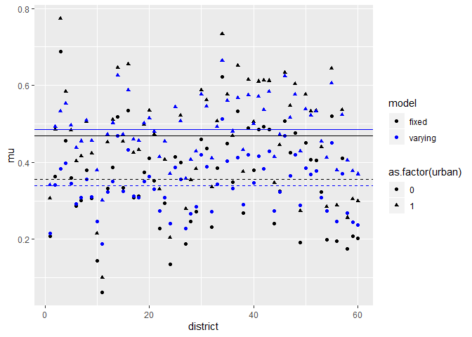

```r
library(tidyverse)
```

```
## -- Attaching packages ----------------------------------------------------------------------------------------------------------- tidyverse 1.3.0 --
```

```
## v ggplot2 3.2.1     v purrr   0.3.3
## v tibble  2.1.3     v dplyr   0.8.3
## v tidyr   1.0.0     v stringr 1.4.0
## v readr   1.3.1     v forcats 0.4.0
```

```
## -- Conflicts -------------------------------------------------------------------------------------------------------------- tidyverse_conflicts() --
## x dplyr::filter() masks stats::filter()
## x dplyr::lag()    masks stats::lag()
```

```r
library(rethinking)
```

```
## Loading required package: rstan
```

```
## Loading required package: StanHeaders
```

```
## rstan (Version 2.19.2, GitRev: 2e1f913d3ca3)
```

```
## For execution on a local, multicore CPU with excess RAM we recommend calling
## options(mc.cores = parallel::detectCores()).
## To avoid recompilation of unchanged Stan programs, we recommend calling
## rstan_options(auto_write = TRUE)
```

```
## For improved execution time, we recommend calling
## Sys.setenv(LOCAL_CPPFLAGS = '-march=native')
## although this causes Stan to throw an error on a few processors.
```

```
## 
## Attaching package: 'rstan'
```

```
## The following object is masked from 'package:tidyr':
## 
##     extract
```

```
## Loading required package: parallel
```

```
## Loading required package: dagitty
```

```
## rethinking (Version 1.93)
```

```
## 
## Attaching package: 'rethinking'
```

```
## The following object is masked from 'package:purrr':
## 
##     map
```

```
## The following object is masked from 'package:stats':
## 
##     rstudent
```

# Easy

### 12E1. Which of the following priors will produce more shrinkage in the estimates?

  __(a)__ $$\alpha_{tank} \sim Normal(0, 1) $$
  
  (b) $$\alpha_{tank} \sim Normal(0, 2) $$


```r
data(reedfrogs)
d <- reedfrogs
d$tank <- 1:nrow(d)

dat <- list(S = d$surv,
            N = d$density,
            tank = d$tank)

E12a <- ulam(
  alist(S ~ dbinom(N , p) ,
        logit(p) <- a[tank] ,
        a[tank] ~ dnorm(0 , 1)),
  data = dat ,
  chains = 1 ,
  cores = 4 ,
  log_lik = TRUE
)
```

```
## 
## SAMPLING FOR MODEL 'd66992d00dd5d3bbde9a4fddb67e4ca5' NOW (CHAIN 1).
## Chain 1: 
## Chain 1: Gradient evaluation took 0 seconds
## Chain 1: 1000 transitions using 10 leapfrog steps per transition would take 0 seconds.
## Chain 1: Adjust your expectations accordingly!
## Chain 1: 
## Chain 1: 
## Chain 1: Iteration:   1 / 1000 [  0%]  (Warmup)
## Chain 1: Iteration: 100 / 1000 [ 10%]  (Warmup)
## Chain 1: Iteration: 200 / 1000 [ 20%]  (Warmup)
## Chain 1: Iteration: 300 / 1000 [ 30%]  (Warmup)
## Chain 1: Iteration: 400 / 1000 [ 40%]  (Warmup)
## Chain 1: Iteration: 500 / 1000 [ 50%]  (Warmup)
## Chain 1: Iteration: 501 / 1000 [ 50%]  (Sampling)
## Chain 1: Iteration: 600 / 1000 [ 60%]  (Sampling)
## Chain 1: Iteration: 700 / 1000 [ 70%]  (Sampling)
## Chain 1: Iteration: 800 / 1000 [ 80%]  (Sampling)
## Chain 1: Iteration: 900 / 1000 [ 90%]  (Sampling)
## Chain 1: Iteration: 1000 / 1000 [100%]  (Sampling)
## Chain 1: 
## Chain 1:  Elapsed Time: 0.188 seconds (Warm-up)
## Chain 1:                0.231 seconds (Sampling)
## Chain 1:                0.419 seconds (Total)
## Chain 1:
```

```r
E12b <- ulam(
  alist(S ~ dbinom(N , p) ,
        logit(p) <- a[tank] ,
        a[tank] ~ dnorm(0 , 2)),
  data = dat ,
  chains = 1 ,
  cores = 4 ,
  log_lik = TRUE
)
```

```
## 
## SAMPLING FOR MODEL 'c41b4f757ac0c5f8e85e2fe6a6bf204a' NOW (CHAIN 1).
## Chain 1: 
## Chain 1: Gradient evaluation took 0 seconds
## Chain 1: 1000 transitions using 10 leapfrog steps per transition would take 0 seconds.
## Chain 1: Adjust your expectations accordingly!
## Chain 1: 
## Chain 1: 
## Chain 1: Iteration:   1 / 1000 [  0%]  (Warmup)
## Chain 1: Iteration: 100 / 1000 [ 10%]  (Warmup)
## Chain 1: Iteration: 200 / 1000 [ 20%]  (Warmup)
## Chain 1: Iteration: 300 / 1000 [ 30%]  (Warmup)
## Chain 1: Iteration: 400 / 1000 [ 40%]  (Warmup)
## Chain 1: Iteration: 500 / 1000 [ 50%]  (Warmup)
## Chain 1: Iteration: 501 / 1000 [ 50%]  (Sampling)
## Chain 1: Iteration: 600 / 1000 [ 60%]  (Sampling)
## Chain 1: Iteration: 700 / 1000 [ 70%]  (Sampling)
## Chain 1: Iteration: 800 / 1000 [ 80%]  (Sampling)
## Chain 1: Iteration: 900 / 1000 [ 90%]  (Sampling)
## Chain 1: Iteration: 1000 / 1000 [100%]  (Sampling)
## Chain 1: 
## Chain 1:  Elapsed Time: 0.206 seconds (Warm-up)
## Chain 1:                0.198 seconds (Sampling)
## Chain 1:                0.404 seconds (Total)
## Chain 1:
```

```r
# extract Stan samples
posta <- extract.samples(E12a)
postb <- extract.samples(E12b)

# compute median intercept for each tank
# also transform to probability with logistic
d$propsurv.A.est <- logistic(apply(posta$a , 2 , mean))
d$propsurv.B.est <- logistic(apply(postb$a , 2 , mean))

# display raw proportions surviving in each tank
plot(
  d$propsurv ,
  ylim = c(0, 1) ,
  pch = 16 ,
  xaxt = "n" ,
  xlab = "tank" ,
  ylab = "proportion survival" ,
  col = rangi2
)
axis( 1 , at=c(1,16,32,48) , labels=c(1,16,32,48) )

# overlay posterior means
points( d$propsurv.A.est, col = "black" )
points( d$propsurv.B.est, col = "red" )


# mark posterior mean probability across tanks
abline( h=mean(inv_logit(posta$a)) , lty=2, col = "black" )
abline( h=mean(inv_logit(postb$a)) , lty=2, col = "red" )

# draw vertical dividers between tank densities
abline( v=16.5 , lwd=0.5 )
abline( v=32.5 , lwd=0.5 )
text( 8 , 0 , "small tanks" )
text( 16+8 , 0 , "medium tanks" )
text( 32+8 , 0 , "large tanks" )
```

<!-- -->

```r
mean(d$propsurv.A.est - mean(inv_logit(posta$a)))
```

```
## [1] 0.006456486
```

```r
mean(d$propsurv.B.est - mean(inv_logit(postb$a)))
```

```
## [1] 0.01014504
```


### 12E2. Make the following model into a multilevel model.

$$
y_i \sim Binomial(1, p_i) \\
logit(p_i) = \alpha_{group[i]} + \beta x_i \\
\alpha_{group} \sim Normal(0, 10) \\
\beta \sim Normal(0, 1)
$$

$$
y_i \sim Binomial(1, p_i) \\
logit(p_i) = \alpha_{group[i]} + \beta x_i \\
\alpha_{group} \sim Normal(\bar\alpha, \sigma) \\
\bar\alpha \sim Normal(0, 10) \\
\sigma \sim Exponential(1) \\
\beta \sim Normal(0, 1)
$$

### 12E3. Make the following model into a multilevel model.

$$
y_i \sim Normal(\mu_i, \sigma) \\
\mu_i = \alpha_{group[i]} + \beta x_i \\
\alpha_{group} \sim Normal(0, 10) \\
\beta \sim Normal(0, 1) \\
\sigma \sim HalfCauchy(0, 2)
$$

$$
y_i \sim Normal(\mu_i, \sigma) \\
\mu_i = \alpha_{group[i]} + \beta x_i \\
\alpha_{group} \sim Normal(\bar\alpha, \sigma_\alpha) \\
\bar\alpha \sim Normal(0, 10) \\
\sigma_\alpha \sim Exponential(1) \\
\beta \sim Normal(0, 1) \\
\sigma \sim HalfCauchy(0, 2)
$$

### 12M1. Revisit the Reed frog survival data, data(reedfrogs), and add the predation and size treatment variables to the varying intercepts model. Consider models with either main effect alone, both main effects, as well as a model including both and their interaction. Instead of focusing on inferences about these two predictor variables, focus on the inferred variation across tanks. Explain why it changes as it does across models.


```r
d <- reedfrogs
d$tank <- 1:nrow(d)

dat <- list(S = d$surv,
            N = d$density,
            tank = d$tank)

m12.1 <- ulam(
  alist(
    S ~ dbinom(N , p),
    logit(p) <- a[tank],
    a[tank] ~ dnorm(a_bar , sigma),
    a_bar ~ dnorm(0 , 1.5),
    sigma ~ dexp(1)
  ),
  data = dat ,
  chains = 4,
  cores = 3,
  log_lik = TRUE,
  iter = 2500
)


dat2 <- list(
  S = d$surv,
  N = d$density,
  tank = d$tank,
  pred = ifelse(d$pred == "no", 0L, 1L)
)

m12.1a <- ulam(
  alist(
    S ~ dbinom(N , p) ,
    logit(p) <- a[tank] + bP * pred ,
    a[tank] ~ dnorm(a_bar , sigma) ,
    bP ~ dnorm(0 , 1), 
    a_bar ~ dnorm(0 , 1.5) ,
    sigma ~ dexp(1)
  ),
  data = dat2 ,
  chains = 4 ,
  cores = 3,
  log_lik = TRUE,
  iter = 2500
)

dat3 <- list(
  S = d$surv,
  N = d$density,
  tank = d$tank,
  sze = ifelse(d$size == "small", 0L, 1L)
)

m12.1b <- ulam(
  alist(
    S ~ dbinom(N , p) ,
    logit(p) <- a[tank] + bS * sze,
    a[tank] ~ dnorm(a_bar , sigma) ,
    a_bar ~ dnorm(0 , 1.5) ,
    bS ~ dnorm(0 , 1),
    sigma ~ dexp(1)
  ),
  data = dat3 ,
  chains = 4 ,
  cores = 3,
  log_lik = TRUE,
  iter = 2500
)

dat4 <- list(
  S = d$surv,
  N = d$density,
  tank = d$tank,
  pred = ifelse(d$pred == "no", 0L, 1L),
  sze = ifelse(d$size == "small", 0L, 1L)
)


m12.1c <- ulam(
  alist(
    S ~ dbinom(N , p) ,
    logit(p) <- a[tank] + bP * pred + bS * sze,
    a[tank] ~ dnorm(a_bar , sigma) ,
    a_bar ~ dnorm(0 , 1.5) ,
    c(bS,bP) ~ dnorm(0 , 1),
    sigma ~ dexp(1)
  ),
  data = dat4 ,
  chains = 4 ,
  cores = 3,
  log_lik = TRUE,
  iter = 2500
)

m12.1d <- ulam(
  alist(
    S ~ dbinom(N , p) ,
    logit(p) <- a[tank] + bP * pred + bS * sze + bPS * sze * pred,
    a[tank] ~ dnorm(a_bar , sigma) ,
    a_bar ~ dnorm(0 , 1.5) ,
    c(bS,bP,bPS) ~ dnorm(0 , 1),
    sigma ~ dexp(1)
  ),
  data = dat4 ,
  chains = 4 ,
  cores = 3,
  log_lik = TRUE,
  iter = 2500
)

compare(m12.1,m12.1a,m12.1b,m12.1c,m12.1d)
```

```
##            WAIC       SE     dWAIC      dSE    pWAIC    weight
## m12.1a 198.5620 8.816409 0.0000000       NA 18.95446 0.3706722
## m12.1d 199.1352 9.304484 0.5732156 3.301290 18.84018 0.2783030
## m12.1c 200.7140 8.738365 2.1520040 1.768402 19.45478 0.1263829
## m12.1b 200.8009 7.274219 2.2389254 5.453982 21.28009 0.1210078
## m12.1  201.1109 7.300006 2.5489028 5.235305 21.39830 0.1036341
```

```r
abc <- coeftab(m12.1,m12.1a,m12.1b,m12.1c,m12.1d)

abc@coefs %>% tail(5)
```

```
##       m12.1 m12.1a m12.1b m12.1c m12.1d
## a_bar  1.35   2.49   1.49   2.71   2.44
## sigma  1.62   0.83   1.62   0.78   0.74
## bP       NA  -2.36     NA  -2.39  -1.91
## bS       NA     NA  -0.29  -0.42   0.19
## bPS      NA     NA     NA     NA  -1.10
```

The variation across tanks is reduced when predation is added to the model. The effect does not seem to occur when only size is considered though.

### 12M2. Compare the models you fit just above, using WAIC. Can you reconcile the differences in WAIC with the posterior distributions of the models?


```r
compare(m12.1,m12.1a,m12.1b,m12.1c,m12.1d)
```

```
##            WAIC       SE     dWAIC      dSE    pWAIC    weight
## m12.1a 198.5620 8.816409 0.0000000       NA 18.95446 0.3706722
## m12.1d 199.1352 9.304484 0.5732156 3.301290 18.84018 0.2783030
## m12.1c 200.7140 8.738365 2.1520040 1.768402 19.45478 0.1263829
## m12.1b 200.8009 7.274219 2.2389254 5.453982 21.28009 0.1210078
## m12.1  201.1109 7.300006 2.5489028 5.235305 21.39830 0.1036341
```

They all look pretty equal despite the models containing predation having a lower tank to tank variance.


### 12H1. In 1980, a typical Bengali woman could have 5 or more children in her lifetime. By the year 200, a typical Bengali woman had only 2 or 3. You’re going to look at a historical set of data, when contraception was widely available but many families chose not to use it. These data reside in data(bangladesh) and come from the 1988 Bangladesh Fertility Survey. Each row is one of 1934 women. There are six variables, but you can focus on three of them for this practice problem:

  (1) district: ID number of administrative district each woman resided in
  (2) use.contraception: An indicator (0/1) of whether the woman was using contraception
  (3) urban: An indicator (0/1) of whether the woman lived in a city, as opposed to living in a rural area

### The first thing to do is ensure that the cluster variable, district, is a contiguous set of integers. Recall that these values will be index values inside the model. If there are gaps, you’ll have parameters for which there is no data to inform them. Worse, the model probably won’t run. Look at the unique values of the district variable:


```r
data(bangladesh)
d <- bangladesh
sort(unique(d$district))
```

```
##  [1]  1  2  3  4  5  6  7  8  9 10 11 12 13 14 15 16 17 18 19 20 21 22 23 24 25
## [26] 26 27 28 29 30 31 32 33 34 35 36 37 38 39 40 41 42 43 44 45 46 47 48 49 50
## [51] 51 52 53 55 56 57 58 59 60 61
```

### District 54 is absent. So district isn’t yet a good index variable, because it’s not contiguous. This is easy to fix. Just make a new variable that is contiguous. This is enough to do it:


```r
d$district_id <- as.integer(as.factor(d$district))
sort(unique(d$district_id))
```

```
##  [1]  1  2  3  4  5  6  7  8  9 10 11 12 13 14 15 16 17 18 19 20 21 22 23 24 25
## [26] 26 27 28 29 30 31 32 33 34 35 36 37 38 39 40 41 42 43 44 45 46 47 48 49 50
## [51] 51 52 53 54 55 56 57 58 59 60
```

### Now there are 60 values, contiguous integers 1 to 60.

### Now, focus on predicting use.contraception, clustered by district_id. Do not include urban just yet. Fit both (1) a traditional fixed-effects model that uses dummy variables for district and (2) a multilevel model with varying intercepts for district. Plot the predicted proportions of women in each district using contraception, for both the fixed-effects model and the varying-effects model. That is, make a plot in which district ID is on the horizontal axis and expected proportion using contraception is on the vertical. Make one plot for each model, or layer them on the same plot, as you prefer. How do the models disagree? Can you explain the pattern of disagreement? In particular, can you explain the most extreme cases of disagreement, both why they happen where they do and why the models reach different inferences?


```r
head(d)
```

```
##   woman district use.contraception living.children age.centered urban
## 1     1        1                 0               4      18.4400     1
## 2     2        1                 0               1      -5.5599     1
## 3     3        1                 0               3       1.4400     1
## 4     4        1                 0               4       8.4400     1
## 5     5        1                 0               1     -13.5590     1
## 6     6        1                 0               1     -11.5600     1
##   district_id
## 1           1
## 2           1
## 3           1
## 4           1
## 5           1
## 6           1
```

```r
dat <- list(
  did = d$district_id,
  concep = d$use.contraception
)

h12.1a <- ulam(
  alist(
    concep ~ dbinom(1, p),
    logit(p) <- a[did],
    a[did] ~ dnorm(0, 1.5)
  ), data = dat, cores = 3, chains = 4, iter = 2500, log_lik = TRUE
)

h12.1b <- ulam(
  alist(
    concep ~ dbinom(1, p),
    logit(p) <- a[did],
    a[did] ~ dnorm(a_bar, sigma),
    a_bar ~ dnorm(0, 1.5),
    sigma ~ dexp(1)
  ), data = dat, cores = 3, chains = 4, iter = 2500, log_lik = TRUE
)

precis(h12.1a, depth = 2)
```

```
##               mean        sd        5.5%        94.5%     n_eff      Rhat
## a[1]  -1.055069057 0.2160846 -1.40408769 -0.719580747 15861.345 0.9995303
## a[2]  -0.591845122 0.4528291 -1.31520449  0.114472344 11093.573 0.9997658
## a[3]   1.234580597 1.1512753 -0.56473186  3.108437018 12259.421 0.9996987
## a[4]   0.005128189 0.3540379 -0.56757305  0.581884908 12269.617 0.9995344
## a[5]  -0.570535340 0.3338789 -1.11069413 -0.043296541 10567.625 0.9996097
## a[6]  -0.870670264 0.2775460 -1.31638969 -0.425749122 14398.265 0.9995459
## a[7]  -0.901716489 0.5112393 -1.72941318 -0.119532789 11608.516 0.9996679
## a[8]  -0.490925914 0.3294791 -1.02819704  0.028857418 12430.121 0.9998352
## a[9]  -0.788477480 0.4334876 -1.49436397 -0.109992828 13229.615 0.9996141
## a[10] -1.970066979 0.7510129 -3.22994161 -0.879085025  8705.101 1.0007083
## a[11] -2.954202626 0.8115399 -4.37660167 -1.738214214 10566.630 0.9996568
## a[12] -0.621721805 0.3843874 -1.24469095 -0.009840105 11945.808 0.9993833
## a[13] -0.321293654 0.4123364 -0.96660399  0.334033601 12380.774 0.9997860
## a[14]  0.515766382 0.1908595  0.21899721  0.820597356 14018.571 0.9995501
## a[15] -0.533847279 0.4408914 -1.23233182  0.148219041 12392.712 0.9996709
## a[16]  0.185272136 0.4308925 -0.50399670  0.867307180 12401.010 0.9995634
## a[17] -0.845153147 0.4326376 -1.55011380 -0.170570589 12211.729 0.9995751
## a[18] -0.645425215 0.2965239 -1.12137098 -0.175906745 12724.192 0.9994342
## a[19] -0.447126797 0.3999752 -1.08773656  0.186045710 12258.084 0.9996215
## a[20] -0.380572800 0.5092762 -1.17093456  0.425556033 10633.636 0.9999990
## a[21] -0.429902030 0.4735107 -1.20520337  0.305252335 12959.967 0.9992219
## a[22] -1.286353870 0.5210827 -2.13276786 -0.487896492  9519.898 0.9994899
## a[23] -0.932379200 0.5521295 -1.81813060 -0.091450053 12685.491 0.9997096
## a[24] -2.015377427 0.7258631 -3.23598332 -0.957707736 11725.937 0.9994245
## a[25] -0.207033872 0.2432989 -0.60022494  0.180570333 13036.500 0.9995669
## a[26] -0.426038238 0.5434933 -1.29865203  0.434173050 13799.070 0.9995596
## a[27] -1.457119693 0.3973833 -2.11534259 -0.858621037 11733.888 0.9995601
## a[28] -1.097180482 0.3301021 -1.63006431 -0.590806378 11761.832 0.9995805
## a[29] -0.905016476 0.3906565 -1.54291313 -0.302800327 13031.539 0.9994761
## a[30] -0.033360511 0.2632526 -0.46419297  0.396356570 13452.080 0.9994239
## a[31] -0.177365449 0.3580962 -0.75037137  0.406344376 13665.679 0.9997603
## a[32] -1.253481768 0.4696630 -2.03681452 -0.532099762 12990.382 0.9992849
## a[33] -0.273520198 0.5231306 -1.12968029  0.543705888 12564.369 0.9993174
## a[34]  0.636044060 0.3477396  0.09673944  1.193155920 13219.819 0.9993619
## a[35]  0.003352880 0.2820995 -0.43934968  0.449123073 11989.320 0.9993354
## a[36] -0.573690620 0.4850144 -1.37524658  0.188898935 13213.911 0.9994582
## a[37]  0.146400350 0.5290320 -0.69219727  0.997984749 12622.828 0.9995193
## a[38] -0.847792709 0.5595835 -1.75766238  0.015852398 11939.223 0.9995692
## a[39] -0.001851651 0.3899486 -0.62544635  0.628154692 14340.073 0.9992832
## a[40] -0.142131418 0.3077505 -0.63662121  0.337895776 13977.925 0.9992654
## a[41]  0.001287344 0.3887060 -0.62356952  0.619125467 11987.446 0.9992724
## a[42]  0.169236683 0.5832281 -0.76786376  1.122181219 12534.311 0.9996031
## a[43]  0.133993241 0.2846979 -0.32058076  0.604662174 10988.377 0.9997708
## a[44] -1.194548339 0.4521035 -1.93628265 -0.484769315 11460.481 0.9996078
## a[45] -0.678127258 0.3351986 -1.21617142 -0.160163051 10563.386 0.9994722
## a[46]  0.092090494 0.2194387 -0.25335848  0.446465066 12812.686 0.9994142
## a[47] -0.120535882 0.4985374 -0.93306411  0.677297843 11648.972 0.9999392
## a[48]  0.092009120 0.2973501 -0.36782381  0.553604022 12955.676 0.9995727
## a[49] -1.714454192 1.0194572 -3.39550759 -0.183676787 12380.360 0.9993203
## a[50] -0.098319732 0.4465911 -0.80100097  0.603797488 12081.426 0.9995333
## a[51] -0.164235223 0.3286927 -0.69466364  0.363115961 14084.426 0.9995568
## a[52] -0.226254914 0.2593852 -0.63674817  0.194747854 13505.197 0.9993629
## a[53] -0.300700209 0.4638024 -1.03479845  0.437870232 12172.224 0.9994708
## a[54] -1.218431736 0.8604234 -2.65043830  0.094454741 10112.653 0.9994161
## a[55]  0.309255504 0.2959369 -0.15400683  0.789466918 12244.978 1.0000227
## a[56] -1.395842422 0.4662166 -2.16136200 -0.690095360 11503.543 0.9995956
## a[57] -0.180912449 0.3548458 -0.73226092  0.380098649 11796.770 0.9994249
## a[58] -1.716250435 0.7620711 -2.98814232 -0.567402461  9235.474 0.9995560
## a[59] -1.222113292 0.4151208 -1.90185731 -0.585940085 11391.701 0.9997050
## a[60] -1.252539484 0.3595400 -1.83852682 -0.703025095 11485.368 0.9993722
```

```r
precis(h12.1b, depth = 2)
```

```
##               mean         sd       5.5%       94.5%     n_eff      Rhat
## a[1]  -0.995454905 0.19267152 -1.3119061 -0.68869654  9267.496 0.9997844
## a[2]  -0.591576377 0.35499033 -1.1655341 -0.03699311  9715.985 0.9995844
## a[3]  -0.235930121 0.48938579 -1.0031266  0.55061499  7198.175 1.0002059
## a[4]  -0.189750374 0.30400928 -0.6770810  0.30094930 10260.000 0.9995550
## a[5]  -0.572354877 0.28167008 -1.0339189 -0.12551739  8810.897 0.9997911
## a[6]  -0.820299762 0.24180430 -1.2052397 -0.44063400  9363.525 0.9999865
## a[7]  -0.754555887 0.37283584 -1.3603288 -0.17510852  9676.724 0.9993711
## a[8]  -0.511751918 0.28182061 -0.9674927 -0.07574565  9320.959 0.9999321
## a[9]  -0.712777569 0.33826584 -1.2577202 -0.17849271 10678.546 0.9994200
## a[10] -1.149760625 0.43849356 -1.8915061 -0.49048972  6442.698 0.9996748
## a[11] -1.551876820 0.42980356 -2.2782996 -0.91214721  4235.477 1.0000634
## a[12] -0.610029722 0.30686376 -1.0973284 -0.12731422  8460.790 0.9997081
## a[13] -0.426756105 0.32662620 -0.9593045  0.09871691  9304.096 0.9996414
## a[14]  0.392962437 0.17481466  0.1160124  0.67350116  8353.817 0.9996693
## a[15] -0.559147961 0.33131613 -1.0958615 -0.03055806 10069.513 0.9997698
## a[16] -0.119651528 0.34692960 -0.6708331  0.44326941  7775.426 0.9999488
## a[17] -0.750353241 0.33943626 -1.2869287 -0.22262033  9906.531 0.9997030
## a[18] -0.634331586 0.26258918 -1.0528421 -0.22602837 10327.357 0.9995111
## a[19] -0.501153184 0.32377861 -1.0141993  0.01136085 11135.484 0.9994152
## a[20] -0.482464094 0.37912167 -1.0825991  0.11285417  9520.889 0.9994043
## a[21] -0.501393871 0.35765883 -1.0755932  0.05698770 10002.551 0.9995571
## a[22] -0.973835411 0.36930841 -1.5804760 -0.39803841  8093.193 0.9998092
## a[23] -0.766056112 0.38994067 -1.3946090 -0.14513856  8983.633 0.9996029
## a[24] -1.180358792 0.42439908 -1.8783429 -0.55615080  6046.670 1.0007121
## a[25] -0.277750756 0.22424595 -0.6374072  0.07968675 11951.630 0.9994011
## a[26] -0.511087911 0.38961928 -1.1313278  0.10040330  9707.801 0.9996591
## a[27] -1.182249077 0.29458978 -1.6651615 -0.71818950  7634.395 0.9992569
## a[28] -0.967222034 0.28025761 -1.4243646 -0.53068742  9421.775 0.9997704
## a[29] -0.805809829 0.31305190 -1.3137590 -0.32065994 11304.888 0.9997459
## a[30] -0.135638989 0.22984156 -0.4986286  0.22811235 10068.506 0.9996589
## a[31] -0.300297680 0.29210230 -0.7737830  0.16318046  8893.444 0.9996146
## a[32] -0.986216075 0.35484744 -1.5784459 -0.43828830  7647.532 0.9998019
## a[33] -0.430721623 0.38459634 -1.0437870  0.17821977 10656.020 0.9993534
## a[34]  0.277922523 0.29105555 -0.1813171  0.73673065  7250.050 1.0000677
## a[35] -0.133421325 0.25399587 -0.5319928  0.27057285  8389.186 0.9995076
## a[36] -0.580871315 0.37511589 -1.1905198  0.01527848  9803.752 0.9994421
## a[37] -0.226244501 0.38628632 -0.8244956  0.38869332  9483.382 0.9996195
## a[38] -0.717356156 0.38990303 -1.3569191 -0.10124568  9301.296 0.9994931
## a[39] -0.202176299 0.31964858 -0.7147467  0.31433495 10509.050 0.9994529
## a[40] -0.257640725 0.26929506 -0.6766832  0.16349732 10420.154 0.9996610
## a[41] -0.203411879 0.31307193 -0.7097117  0.29927310  9336.625 1.0000631
## a[42] -0.241563698 0.39192848 -0.8530510  0.39082267  8199.545 0.9996123
## a[43] -0.042329961 0.26481843 -0.4600212  0.37798046  9361.133 0.9995619
## a[44] -0.964697957 0.34663759 -1.5318323 -0.43207654  7998.399 1.0000950
## a[45] -0.654095883 0.28329948 -1.0999161 -0.20006015 10248.558 0.9997208
## a[46] -0.006232998 0.20038973 -0.3190938  0.31222072 10944.589 0.9996263
## a[47] -0.344641049 0.37305301 -0.9412973  0.24478719 10432.929 0.9995230
## a[48] -0.077881851 0.26923144 -0.5108478  0.35885640 11772.946 0.9996269
## a[49] -0.866797760 0.49006483 -1.6741097 -0.10815347  6032.104 0.9999228
## a[50] -0.297543531 0.34725181 -0.8610992  0.25358845  9319.532 0.9994456
## a[51] -0.275228749 0.27938512 -0.7265443  0.16266529  8829.193 0.9998486
## a[52] -0.295646084 0.22932047 -0.6693588  0.06502239  9837.314 0.9996438
## a[53] -0.431830504 0.35254448 -0.9971616  0.13094115 10132.178 0.9998129
## a[54] -0.780651315 0.45711091 -1.5169047 -0.07462054  7879.225 0.9995594
## a[55]  0.098217884 0.26450834 -0.3119482  0.53164743  8274.029 0.9994793
## a[56] -1.077697939 0.35485489 -1.6675520 -0.52778944  6707.903 1.0001813
## a[57] -0.299554192 0.29678105 -0.7781388  0.17132312 10902.112 0.9994194
## a[58] -1.008402546 0.44136572 -1.7383218 -0.33647086  6766.361 0.9993728
## a[59] -0.997746882 0.33288197 -1.5286494 -0.47222486  7501.314 0.9995586
## a[60] -1.058843397 0.29446900 -1.5501695 -0.58705239  8188.533 0.9996884
## a_bar -0.540150687 0.08727796 -0.6851377 -0.40454658  4641.342 0.9997351
## sigma  0.518848271 0.08304491  0.3969355  0.66098960  2202.984 1.0012789
```

```r
compare(h12.1a,h12.1b)
```

```
##            WAIC       SE    dWAIC      dSE    pWAIC      weight
## h12.1b 2513.918 25.08384  0.00000       NA 35.51668 0.996290415
## h12.1a 2525.104 28.94463 11.18624 7.692147 54.50788 0.003709585
```

```r
pred_dat <- data.frame(did = unique(d$district_id))
predsa <- link(h12.1a,pred_dat)
predsb <- link(h12.1b,pred_dat)

results <- data.frame(district = unique(d$district_id),
                      fixed = apply(predsa, 2, mean),
                      varying = apply(predsb, 2, mean)
                      )
head(results)
```

```
##   district     fixed   varying
## 1        1 0.2603878 0.2715030
## 2        2 0.3625065 0.3602368
## 3        3 0.7271603 0.4441203
## 4        4 0.5012158 0.4537236
## 5        5 0.3645572 0.3631756
## 6        6 0.2983159 0.3080639
```

```r
results <- results %>%
  gather(key = "model", value = "mu", fixed:varying)
head(results)
```

```
##   district model        mu
## 1        1 fixed 0.2603878
## 2        2 fixed 0.3625065
## 3        3 fixed 0.7271603
## 4        4 fixed 0.5012158
## 5        5 fixed 0.3645572
## 6        6 fixed 0.2983159
```

```r
ggplot(results, aes(x = district, y = mu, color = model)) +
  geom_point() +
  scale_color_manual(values=c('black','blue')) +
  geom_hline(yintercept = results %>%
               filter(model == "fixed") %>%
               select(mu) %>%
               summarise(mean = mean(mu)) %>%
               .$mean) +
  geom_hline(yintercept = results %>%
               filter(model == "varying") %>%
               select(mu) %>%
               summarise(mean = mean(mu)) %>%
               .$mean,
             color = 'blue'
             )
```

<!-- -->

```r
## Add in urban as a variable

dat2 <- list(
  did = d$district_id,
  concep = d$use.contraception,
  urban = d$urban
)

h12.1c <- ulam(
  alist(
    concep ~ dbinom(1, p),
    logit(p) <- a[did] + bU*urban,
    a[did] ~ dnorm(0, 1.5),
    bU ~ dnorm(0, 1)
  ), data = dat2, cores = 3, chains = 4, iter = 2500, log_lik = TRUE
)

h12.1d <- ulam(
  alist(
    concep ~ dbinom(1, p),
    logit(p) <- a[did] + bU*urban,
    a[did] ~ dnorm(a_bar, sigma),
    bU ~ dnorm(0, 1),
    a_bar ~ dnorm(0, 1.5),
    sigma ~ dexp(1)
  ), data = dat2, cores = 3, chains = 4, iter = 2500, log_lik = TRUE
)

precis(h12.1c, depth = 2)
```

```
##              mean        sd        5.5%        94.5%     n_eff      Rhat
## a[1]  -1.34901088 0.2189614 -1.69802626 -1.008853178  7171.087 0.9998464
## a[2]  -0.58953792 0.4580601 -1.34491139  0.121098148  9454.429 0.9993944
## a[3]   1.01132662 1.1651284 -0.78221401  2.932551029 11320.588 0.9992509
## a[4]  -0.17781643 0.3618109 -0.75790539  0.400243156 11216.968 0.9995669
## a[5]  -0.59444752 0.3215320 -1.10568373 -0.086347711  9144.689 1.0001012
## a[6]  -0.92730396 0.2709297 -1.36181562 -0.501350763 10984.190 0.9994865
## a[7]  -0.88825186 0.5113234 -1.72944778 -0.089758843 10591.281 0.9994940
## a[8]  -0.50791977 0.3360233 -1.05041166  0.026100225 13383.202 0.9997945
## a[9]  -0.85329870 0.4324524 -1.55413719 -0.161309011 10072.270 0.9996395
## a[10] -1.96908859 0.7442430 -3.21258755 -0.841893343  8875.329 0.9995631
## a[11] -2.97314330 0.8399200 -4.40693468 -1.741523379  7759.480 0.9994176
## a[12] -0.72609231 0.3870987 -1.35980438 -0.114474548 10186.709 0.9993770
## a[13] -0.48221051 0.4014932 -1.11615489  0.149670199 10546.151 0.9994544
## a[14]  0.07668848 0.2135009 -0.26224015  0.418139967  6273.889 0.9994767
## a[15] -0.71999428 0.4447702 -1.44795254 -0.019759115 10143.783 0.9996834
## a[16]  0.14230818 0.4395044 -0.55897137  0.826809420  9839.146 0.9995660
## a[17] -0.84585617 0.4360087 -1.57031284 -0.164347382 11596.278 0.9995222
## a[18] -0.80645941 0.3004488 -1.29583499 -0.337177447 10254.853 0.9994370
## a[19] -0.53381645 0.4014005 -1.19244699  0.103731081 10584.403 0.9997524
## a[20] -0.37951841 0.4928902 -1.16912148  0.386232265 11037.370 0.9993644
## a[21] -0.64227297 0.4731722 -1.40115858  0.091483435  9406.518 0.9995347
## a[22] -1.28730048 0.5296195 -2.17800220 -0.468920459 10106.639 0.9993317
## a[23] -0.93077571 0.5389533 -1.80199664 -0.085538144 10640.548 1.0001934
## a[24] -2.03643848 0.7435209 -3.30830594 -0.941428864  8799.058 0.9997772
## a[25] -0.34983247 0.2503387 -0.75399878  0.044681444  8639.220 0.9993753
## a[26] -0.43654330 0.5557408 -1.33403842  0.443011245 11529.860 0.9992601
## a[27] -1.50940677 0.3756923 -2.12483600 -0.914090501  7919.215 1.0004406
## a[28] -1.14455885 0.3186770 -1.66892905 -0.645068120 10251.545 0.9994102
## a[29] -1.01888781 0.3775130 -1.63840300 -0.433437512  9479.776 0.9997541
## a[30] -0.16522218 0.2655013 -0.58656278  0.256262361 11943.242 0.9994239
## a[31] -0.26752985 0.3448003 -0.82430729  0.279286395 11561.431 0.9995679
## a[32] -1.25047605 0.4680030 -2.01501456 -0.549276565 10989.024 0.9995022
## a[33] -0.49522247 0.5070557 -1.32600330  0.313851859 10403.839 0.9993583
## a[34]  0.51229835 0.3500097 -0.03869862  1.082546919  9335.486 0.9993936
## a[35] -0.21271346 0.2884518 -0.67176421  0.244497385  9392.916 0.9994327
## a[36] -0.66115794 0.5006541 -1.48031426  0.119508780 11268.278 0.9993856
## a[37]  0.14077248 0.5190146 -0.68907275  0.994002251 11305.940 0.9994725
## a[38] -1.07138132 0.5506461 -1.97285610 -0.209721397 11207.995 0.9994690
## a[39] -0.04180109 0.3907578 -0.66371660  0.585817361  9983.338 0.9996009
## a[40] -0.50287536 0.3170649 -1.00900792  0.007536146  8007.990 0.9995942
## a[41] -0.06193970 0.3843198 -0.67990301  0.557801981 10711.286 0.9993896
## a[42] -0.03355893 0.5863294 -0.97246674  0.870546868 11015.513 0.9993045
## a[43] -0.06060929 0.3028187 -0.53880716  0.428698803 10546.613 0.9995392
## a[44] -1.19382453 0.4380290 -1.91090780 -0.513428158  9796.374 0.9996590
## a[45] -0.75148301 0.3420738 -1.30363034 -0.207911491  8824.436 0.9998706
## a[46]  0.02606663 0.2212431 -0.33068965  0.378753951  9038.047 1.0000464
## a[47] -0.32313071 0.4999747 -1.12230200  0.468606231 11009.200 0.9993592
## a[48] -0.09845391 0.3121483 -0.59042449  0.404552547  9707.081 0.9996697
## a[49] -1.71530285 1.0207302 -3.40703680 -0.182381441  8918.206 0.9996417
## a[50] -0.20319385 0.4413779 -0.91778322  0.506759967 12170.724 0.9992977
## a[51] -0.39021913 0.3341638 -0.93189806  0.133006015  8940.480 0.9995361
## a[52] -0.38899276 0.2586708 -0.80637140  0.020597174 10156.027 0.9995208
## a[53] -0.78002232 0.4690135 -1.51797840 -0.020380091  9925.593 0.9995735
## a[54] -1.58686635 0.8340108 -2.97309056 -0.308459466  9377.728 1.0000097
## a[55]  0.07994620 0.3017512 -0.39627090  0.556217892 10475.040 0.9994310
## a[56] -1.47529826 0.4615689 -2.24611400 -0.754853498  8316.853 1.0000695
## a[57] -0.37580765 0.3507589 -0.93853255  0.180965735 11210.841 0.9995185
## a[58] -1.72716925 0.7611917 -3.01566415 -0.583592783  7377.314 1.0000421
## a[59] -1.38927379 0.4096450 -2.04925941 -0.758223151 10553.764 0.9994247
## a[60] -1.40495246 0.3627560 -2.00757405 -0.835042759  9752.906 0.9996359
## bU     0.52779758 0.1208915  0.34076564  0.726509462  4506.077 1.0002638
```

```r
precis(h12.1d, depth = 2)
```

```
##              mean         sd       5.5%        94.5%    n_eff      Rhat
## a[1]  -1.30242467 0.20567536 -1.6367070 -0.979310328 5116.034 1.0007209
## a[2]  -0.67439265 0.33366319 -1.2049475 -0.158867854 7249.229 0.9995796
## a[3]  -0.49952905 0.45382354 -1.2088285  0.231007395 7327.883 0.9994500
## a[4]  -0.42334363 0.28968481 -0.8866298  0.038935354 7566.202 0.9997462
## a[5]  -0.65322283 0.27335289 -1.0897398 -0.226861712 9081.592 0.9994228
## a[6]  -0.89622023 0.23727294 -1.2840727 -0.519857027 7814.752 0.9997431
## a[7]  -0.82685099 0.34841499 -1.3965858 -0.279186311 8602.038 0.9998903
## a[8]  -0.60200704 0.28320440 -1.0564323 -0.150382764 8382.508 0.9995886
## a[9]  -0.81885061 0.32638673 -1.3548269 -0.300442623 7457.406 1.0000991
## a[10] -1.15583526 0.40029658 -1.8146422 -0.546710069 4910.827 1.0008863
## a[11] -1.51565582 0.41340310 -2.2131821 -0.894134134 3673.344 1.0007041
## a[12] -0.75253270 0.30749367 -1.2458501 -0.264398738 6976.279 0.9999663
## a[13] -0.63022082 0.31790016 -1.1350578 -0.116600985 7845.522 0.9999385
## a[14] -0.12418710 0.20121828 -0.4413678  0.203119341 5384.544 1.0000149
## a[15] -0.75295673 0.32250891 -1.2790707 -0.234857990 7874.042 0.9993683
## a[16] -0.27848640 0.33898259 -0.8083271  0.267181840 7403.462 0.9993409
## a[17] -0.80732267 0.32032316 -1.3273436 -0.306365452 8061.656 0.9997628
## a[18] -0.82045029 0.26296830 -1.2442757 -0.402344506 8587.046 0.9993451
## a[19] -0.63296677 0.30481231 -1.1290873 -0.143421929 7542.531 0.9994505
## a[20] -0.58178461 0.34713956 -1.1515150 -0.022820408 8446.166 0.9999903
## a[21] -0.72354698 0.34135310 -1.2805375 -0.190728616 6990.695 0.9998907
## a[22] -1.00205626 0.36049791 -1.5973660 -0.442632852 6504.008 1.0005835
## a[23] -0.83352369 0.35002721 -1.4002627 -0.286738744 6820.109 1.0005161
## a[24] -1.19315856 0.40229470 -1.8620072 -0.587173145 5280.245 1.0003906
## a[25] -0.46381461 0.22068231 -0.8197503 -0.105697992 8396.585 0.9999720
## a[26] -0.61293734 0.35455005 -1.1840357 -0.052938856 8161.143 0.9997838
## a[27] -1.24156048 0.29868733 -1.7313832 -0.781393935 5152.248 1.0006530
## a[28] -1.02804770 0.26663409 -1.4698865 -0.615320017 7753.618 0.9998253
## a[29] -0.93544198 0.29386367 -1.4057935 -0.473896332 7187.398 1.0000562
## a[30] -0.32695863 0.23779309 -0.7052147  0.051875433 7690.875 1.0001405
## a[31] -0.45742154 0.27842505 -0.9135468 -0.022606169 8658.306 0.9994915
## a[32] -1.01191056 0.32457788 -1.5415208 -0.496000126 7457.132 0.9997464
## a[33] -0.66967620 0.36412947 -1.2602891 -0.085629356 8320.595 0.9992586
## a[34]  0.05366048 0.28892053 -0.4015684  0.520062629 6284.462 0.9999248
## a[35] -0.39871670 0.24897901 -0.8017518 -0.001758577 7189.362 0.9995238
## a[36] -0.72065979 0.34424236 -1.2766216 -0.177508120 6268.376 0.9996541
## a[37] -0.36164973 0.37058648 -0.9456403  0.233937005 7818.450 0.9996668
## a[38] -0.91940287 0.37235004 -1.5272926 -0.343229126 7280.560 1.0006236
## a[39] -0.33364998 0.30730394 -0.8150243  0.154835410 6996.048 0.9997960
## a[40] -0.64108128 0.26960300 -1.0723656 -0.208780455 7214.129 1.0000033
## a[41] -0.34588886 0.30046279 -0.8241752  0.132423399 9555.619 0.9995725
## a[42] -0.48983559 0.37662599 -1.0801736  0.115689305 7290.748 0.9994548
## a[43] -0.29422235 0.25347333 -0.6927510  0.113497101 8257.478 0.9997964
## a[44] -0.99607539 0.33365159 -1.5306125 -0.479638730 7350.908 1.0003359
## a[45] -0.75728911 0.27628412 -1.2033650 -0.318888415 9209.270 0.9996779
## a[46] -0.12722132 0.20532490 -0.4508605  0.199234364 7692.648 0.9994606
## a[47] -0.57343027 0.34748588 -1.1330169 -0.014747485 7743.233 0.9997136
## a[48] -0.32917433 0.26635665 -0.7508008  0.112331638 7558.511 0.9997241
## a[49] -0.94181400 0.44805300 -1.6733496 -0.256849186 6054.322 1.0003455
## a[50] -0.48144058 0.33574877 -1.0168185  0.053660558 7659.858 1.0002414
## a[51] -0.55028696 0.28182375 -1.0041140 -0.094795281 8753.139 1.0004549
## a[52] -0.50779074 0.22303038 -0.8655512 -0.152341888 8121.955 1.0000045
## a[53] -0.82714212 0.34341153 -1.3854325 -0.282753954 7257.860 1.0001390
## a[54] -1.01194498 0.42333725 -1.7056402 -0.363794393 6446.427 1.0002654
## a[55] -0.20425674 0.26163373 -0.6113566  0.221086741 7059.756 0.9997901
## a[56] -1.14415697 0.33982002 -1.6965804 -0.624404410 6782.983 0.9998217
## a[57] -0.54478798 0.29474393 -1.0181879 -0.077352565 7819.747 0.9995191
## a[58] -1.04532976 0.40584871 -1.7042635 -0.424710657 5747.889 0.9996544
## a[59] -1.15166223 0.31237674 -1.6630813 -0.676571817 5887.904 1.0002486
## a[60] -1.18747533 0.28882045 -1.6549710 -0.740093083 6157.326 1.0004955
## bU     0.64129547 0.11871666  0.4497177  0.831310040 3128.164 1.0007900
## a_bar -0.70209072 0.08919961 -0.8452286 -0.564742109 2378.293 1.0032742
## sigma  0.45925860 0.08268513  0.3356125  0.599854784 1677.498 1.0017312
```

```r
compare(h12.1c,h12.1d)
```

```
##            WAIC       SE    dWAIC      dSE    pWAIC      weight
## h12.1d 2491.224 26.65062  0.00000       NA 33.73890 0.997693991
## h12.1c 2503.364 29.67449 12.13986 8.688404 54.49217 0.002306009
```

```r
compare(h12.1a,h12.1b,h12.1c,h12.1d)
```

```
##            WAIC       SE    dWAIC       dSE    pWAIC       weight
## h12.1d 2491.224 26.65062  0.00000        NA 33.73890 9.976822e-01
## h12.1c 2503.364 29.67449 12.13986  8.688404 54.49217 2.305981e-03
## h12.1b 2513.918 25.08384 22.69368 11.049883 35.51668 1.177938e-05
## h12.1a 2525.104 28.94463 33.87992 13.781129 54.50788 4.385933e-08
```

```r
pred_dat2 <- data.frame(did = rep(unique(d$district_id), each = 2),
                       urban = rep(c(0,1), times = 60))
predsc <- link(h12.1c,pred_dat2)
predsd <- link(h12.1d,pred_dat2)

results2 <- data.frame(district = pred_dat2$did,
                      urban = pred_dat2$urban,
                      fixed = apply(predsc, 2, mean),
                      varying = apply(predsd, 2, mean)
                      )

head(results2)
```

```
##   district urban     fixed   varying
## 1        1     0 0.2083095 0.2157699
## 2        1     1 0.3073323 0.3419227
## 3        2     0 0.3632775 0.3413963
## 4        2     1 0.4856139 0.4920163
## 5        3     0 0.6888274 0.3828936
## 6        3     1 0.7733083 0.5335502
```

```r
results2 <- results2 %>%
  gather(key = "model", value = "mu", fixed:varying)
head(results2)
```

```
##   district urban model        mu
## 1        1     0 fixed 0.2083095
## 2        1     1 fixed 0.3073323
## 3        2     0 fixed 0.3632775
## 4        2     1 fixed 0.4856139
## 5        3     0 fixed 0.6888274
## 6        3     1 fixed 0.7733083
```

```r
ggplot(results2, aes(x = district, y = mu, color = model,shape = as.factor(urban))) +
  geom_point() +
  scale_color_manual(values=c('black','blue')) +
  geom_hline(yintercept = results2 %>%
               filter(model == "fixed" & urban == 1) %>%
               select(mu) %>%
               summarise(mean = mean(mu)) %>%
               .$mean) +
  geom_hline(yintercept = results2 %>%
               filter(model == "varying" & urban == 1) %>%
               select(mu) %>%
               summarise(mean = mean(mu)) %>%
               .$mean,
             color = 'blue'
             ) +
  geom_hline(yintercept = results2 %>%
               filter(model == "fixed" & urban == 0) %>%
               select(mu) %>%
               summarise(mean = mean(mu)) %>%
               .$mean,
             linetype = "dashed") +
  geom_hline(yintercept = results2 %>%
               filter(model == "varying" & urban == 0) %>%
               select(mu) %>%
               summarise(mean = mean(mu)) %>%
               .$mean,
             color = 'blue',
             linetype = "dashed"
             )
```

<!-- -->

