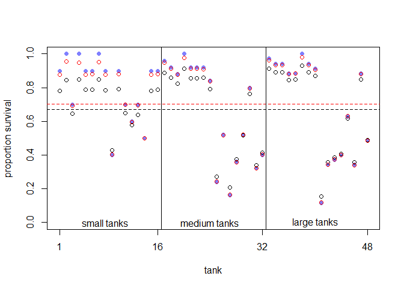

```r
library(tidyverse)
```

```
## -- Attaching packages -------------------------------------------------------- tidyverse 1.3.0 --
```

```
## v ggplot2 3.2.1     v purrr   0.3.3
## v tibble  2.1.3     v dplyr   0.8.3
## v tidyr   1.0.0     v stringr 1.4.0
## v readr   1.3.1     v forcats 0.4.0
```

```
## -- Conflicts ----------------------------------------------------------- tidyverse_conflicts() --
## x dplyr::filter() masks stats::filter()
## x dplyr::lag()    masks stats::lag()
```

```r
library(rethinking)
```

```
## Loading required package: rstan
```

```
## Loading required package: StanHeaders
```

```
## rstan (Version 2.19.2, GitRev: 2e1f913d3ca3)
```

```
## For execution on a local, multicore CPU with excess RAM we recommend calling
## options(mc.cores = parallel::detectCores()).
## To avoid recompilation of unchanged Stan programs, we recommend calling
## rstan_options(auto_write = TRUE)
```

```
## For improved execution time, we recommend calling
## Sys.setenv(LOCAL_CPPFLAGS = '-march=native')
## although this causes Stan to throw an error on a few processors.
```

```
## 
## Attaching package: 'rstan'
```

```
## The following object is masked from 'package:tidyr':
## 
##     extract
```

```
## Loading required package: parallel
```

```
## Loading required package: dagitty
```

```
## rethinking (Version 1.93)
```

```
## 
## Attaching package: 'rethinking'
```

```
## The following object is masked from 'package:purrr':
## 
##     map
```

```
## The following object is masked from 'package:stats':
## 
##     rstudent
```

# Easy

### 12E1. Which of the following priors will produce more shrinkage in the estimates?

  __(a)__ $$\alpha_{tank} \sim Normal(0, 1) $$
  
  (b) $$\alpha_{tank} \sim Normal(0, 2) $$


```r
data(reedfrogs)
d <- reedfrogs
d$tank <- 1:nrow(d)

dat <- list(S = d$surv,
            N = d$density,
            tank = d$tank)

E12a <- ulam(
  alist(S ~ dbinom(N , p) ,
        logit(p) <- a[tank] ,
        a[tank] ~ dnorm(0 , 1)),
  data = dat ,
  chains = 1 ,
  cores = 4 ,
  log_lik = TRUE
)
```

```
## 
## SAMPLING FOR MODEL 'd66992d00dd5d3bbde9a4fddb67e4ca5' NOW (CHAIN 1).
## Chain 1: 
## Chain 1: Gradient evaluation took 0 seconds
## Chain 1: 1000 transitions using 10 leapfrog steps per transition would take 0 seconds.
## Chain 1: Adjust your expectations accordingly!
## Chain 1: 
## Chain 1: 
## Chain 1: Iteration:   1 / 1000 [  0%]  (Warmup)
## Chain 1: Iteration: 100 / 1000 [ 10%]  (Warmup)
## Chain 1: Iteration: 200 / 1000 [ 20%]  (Warmup)
## Chain 1: Iteration: 300 / 1000 [ 30%]  (Warmup)
## Chain 1: Iteration: 400 / 1000 [ 40%]  (Warmup)
## Chain 1: Iteration: 500 / 1000 [ 50%]  (Warmup)
## Chain 1: Iteration: 501 / 1000 [ 50%]  (Sampling)
## Chain 1: Iteration: 600 / 1000 [ 60%]  (Sampling)
## Chain 1: Iteration: 700 / 1000 [ 70%]  (Sampling)
## Chain 1: Iteration: 800 / 1000 [ 80%]  (Sampling)
## Chain 1: Iteration: 900 / 1000 [ 90%]  (Sampling)
## Chain 1: Iteration: 1000 / 1000 [100%]  (Sampling)
## Chain 1: 
## Chain 1:  Elapsed Time: 0.111 seconds (Warm-up)
## Chain 1:                0.1 seconds (Sampling)
## Chain 1:                0.211 seconds (Total)
## Chain 1:
```

```r
E12b <- ulam(
  alist(S ~ dbinom(N , p) ,
        logit(p) <- a[tank] ,
        a[tank] ~ dnorm(0 , 2)),
  data = dat ,
  chains = 1 ,
  cores = 4 ,
  log_lik = TRUE
)
```

```
## 
## SAMPLING FOR MODEL 'c41b4f757ac0c5f8e85e2fe6a6bf204a' NOW (CHAIN 1).
## Chain 1: 
## Chain 1: Gradient evaluation took 0 seconds
## Chain 1: 1000 transitions using 10 leapfrog steps per transition would take 0 seconds.
## Chain 1: Adjust your expectations accordingly!
## Chain 1: 
## Chain 1: 
## Chain 1: Iteration:   1 / 1000 [  0%]  (Warmup)
## Chain 1: Iteration: 100 / 1000 [ 10%]  (Warmup)
## Chain 1: Iteration: 200 / 1000 [ 20%]  (Warmup)
## Chain 1: Iteration: 300 / 1000 [ 30%]  (Warmup)
## Chain 1: Iteration: 400 / 1000 [ 40%]  (Warmup)
## Chain 1: Iteration: 500 / 1000 [ 50%]  (Warmup)
## Chain 1: Iteration: 501 / 1000 [ 50%]  (Sampling)
## Chain 1: Iteration: 600 / 1000 [ 60%]  (Sampling)
## Chain 1: Iteration: 700 / 1000 [ 70%]  (Sampling)
## Chain 1: Iteration: 800 / 1000 [ 80%]  (Sampling)
## Chain 1: Iteration: 900 / 1000 [ 90%]  (Sampling)
## Chain 1: Iteration: 1000 / 1000 [100%]  (Sampling)
## Chain 1: 
## Chain 1:  Elapsed Time: 0.12 seconds (Warm-up)
## Chain 1:                0.1 seconds (Sampling)
## Chain 1:                0.22 seconds (Total)
## Chain 1:
```

```r
# extract Stan samples
posta <- extract.samples(E12a)
postb <- extract.samples(E12b)

# compute median intercept for each tank
# also transform to probability with logistic
d$propsurv.A.est <- logistic(apply(posta$a , 2 , mean))
d$propsurv.B.est <- logistic(apply(postb$a , 2 , mean))

# display raw proportions surviving in each tank
plot(
  d$propsurv ,
  ylim = c(0, 1) ,
  pch = 16 ,
  xaxt = "n" ,
  xlab = "tank" ,
  ylab = "proportion survival" ,
  col = rangi2
)
axis( 1 , at=c(1,16,32,48) , labels=c(1,16,32,48) )

# overlay posterior means
points( d$propsurv.A.est, col = "black" )
points( d$propsurv.B.est, col = "red" )


# mark posterior mean probability across tanks
abline( h=mean(inv_logit(posta$a)) , lty=2, col = "black" )
abline( h=mean(inv_logit(postb$a)) , lty=2, col = "red" )

# draw vertical dividers between tank densities
abline( v=16.5 , lwd=0.5 )
abline( v=32.5 , lwd=0.5 )
text( 8 , 0 , "small tanks" )
text( 16+8 , 0 , "medium tanks" )
text( 32+8 , 0 , "large tanks" )
```

<!-- -->

```r
mean(d$propsurv.A.est - mean(inv_logit(posta$a)))
```

```
## [1] 0.006684432
```

```r
mean(d$propsurv.B.est - mean(inv_logit(postb$a)))
```

```
## [1] 0.01014298
```


### 12E2. Make the following model into a multilevel model.

$$
y_i \sim Binomial(1, p_i) \\
logit(p_i) = \alpha_{group[i]} + \beta x_i \\
\alpha_{group} \sim Normal(0, 10) \\
\beta \sim Normal(0, 1)
$$

$$
y_i \sim Binomial(1, p_i) \\
logit(p_i) = \alpha_{group[i]} + \beta x_i \\
\alpha_{group} \sim Normal(\bar\alpha, \sigma) \\
\bar\alpha \sim Normal(0, 10) \\
\sigma \sim Exponential(1) \\
\beta \sim Normal(0, 1)
$$

### 12E3. Make the following model into a multilevel model.

$$
y_i \sim Normal(\mu_i, \sigma) \\
\mu_i = \alpha_{group[i]} + \beta x_i \\
\alpha_{group} \sim Normal(0, 10) \\
\beta \sim Normal(0, 1) \\
\sigma \sim HalfCauchy(0, 2)
$$

$$
y_i \sim Normal(\mu_i, \sigma) \\
\mu_i = \alpha_{group[i]} + \beta x_i \\
\alpha_{group} \sim Normal(\bar\alpha, \sigma_\alpha) \\
\bar\alpha \sim Normal(0, 10) \\
\sigma_\alpha \sim Exponential(1) \\
\beta \sim Normal(0, 1) \\
\sigma \sim HalfCauchy(0, 2)
$$

### 12M1. Revisit the Reed frog survival data, data(reedfrogs), and add the predation and size treatment variables to the varying intercepts model. Consider models with either main effect alone, both main effects, as well as a model including both and their interaction. Instead of focusing on inferences about these two predictor variables, focus on the inferred variation across tanks. Explain why it changes as it does across models.


```r
d <- reedfrogs
d$tank <- 1:nrow(d)

dat <- list(S = d$surv,
            N = d$density,
            tank = d$tank)

m12.1 <- ulam(
  alist(
    S ~ dbinom(N , p),
    logit(p) <- a[tank],
    a[tank] ~ dnorm(a_bar , sigma),
    a_bar ~ dnorm(0 , 1.5),
    sigma ~ dexp(1)
  ),
  data = dat ,
  chains = 4,
  cores = 3,
  log_lik = TRUE,
  iter = 2500
)


dat2 <- list(
  S = d$surv,
  N = d$density,
  tank = d$tank,
  pred = ifelse(d$pred == "no", 0L, 1L)
)

m12.1a <- ulam(
  alist(
    S ~ dbinom(N , p) ,
    logit(p) <- a[tank] + bP * pred ,
    a[tank] ~ dnorm(a_bar , sigma) ,
    bP ~ dnorm(0 , 1), 
    a_bar ~ dnorm(0 , 1.5) ,
    sigma ~ dexp(1)
  ),
  data = dat2 ,
  chains = 4 ,
  cores = 3,
  log_lik = TRUE,
  iter = 2500
)

dat3 <- list(
  S = d$surv,
  N = d$density,
  tank = d$tank,
  sze = ifelse(d$pred == "small", 0L, 1L)
)

m12.1b <- ulam(
  alist(
    S ~ dbinom(N , p) ,
    logit(p) <- a[tank] + bS * sze,
    a[tank] ~ dnorm(a_bar , sigma) ,
    a_bar ~ dnorm(0 , 1.5) ,
    bS ~ dnorm(0 , 1),
    sigma ~ dexp(1)
  ),
  data = dat3 ,
  chains = 4 ,
  cores = 3,
  log_lik = TRUE,
  iter = 2500
)
```

```
## Warning: Bulk Effective Samples Size (ESS) is too low, indicating posterior means and medians may be unreliable.
## Running the chains for more iterations may help. See
## http://mc-stan.org/misc/warnings.html#bulk-ess
```

```
## Warning: Tail Effective Samples Size (ESS) is too low, indicating posterior variances and tail quantiles may be unreliable.
## Running the chains for more iterations may help. See
## http://mc-stan.org/misc/warnings.html#tail-ess
```

```r
dat4 <- list(
  S = d$surv,
  N = d$density,
  tank = d$tank,
  pred = ifelse(d$pred == "no", 0L, 1L),
  sze = ifelse(d$pred == "small", 0L, 1L)
)


m12.1c <- ulam(
  alist(
    S ~ dbinom(N , p) ,
    logit(p) <- a[tank] + bP * pred + bS * sze,
    a[tank] ~ dnorm(a_bar , sigma) ,
    a_bar ~ dnorm(0 , 1.5) ,
    c(bS,bP) ~ dnorm(0 , 1),
    sigma ~ dexp(1)
  ),
  data = dat4 ,
  chains = 4 ,
  cores = 3,
  log_lik = TRUE,
  iter = 2500
)
```

```
## Warning: The largest R-hat is 1.05, indicating chains have not mixed.
## Running the chains for more iterations may help. See
## http://mc-stan.org/misc/warnings.html#r-hat
```

```
## Warning: Bulk Effective Samples Size (ESS) is too low, indicating posterior means and medians may be unreliable.
## Running the chains for more iterations may help. See
## http://mc-stan.org/misc/warnings.html#bulk-ess
```

```
## Warning: Tail Effective Samples Size (ESS) is too low, indicating posterior variances and tail quantiles may be unreliable.
## Running the chains for more iterations may help. See
## http://mc-stan.org/misc/warnings.html#tail-ess
```

```r
m12.1d <- ulam(
  alist(
    S ~ dbinom(N , p) ,
    logit(p) <- a[tank] + bP * pred + bS * sze + bPS * sze * pred,
    a[tank] ~ dnorm(a_bar , sigma) ,
    a_bar ~ dnorm(0 , 1.5) ,
    c(bS,bP,bPS) ~ dnorm(0 , 1),
    sigma ~ dexp(1)
  ),
  data = dat4 ,
  chains = 4 ,
  cores = 3,
  log_lik = TRUE,
  iter = 2500
)
```

```
## Warning: Bulk Effective Samples Size (ESS) is too low, indicating posterior means and medians may be unreliable.
## Running the chains for more iterations may help. See
## http://mc-stan.org/misc/warnings.html#bulk-ess

## Warning: Tail Effective Samples Size (ESS) is too low, indicating posterior variances and tail quantiles may be unreliable.
## Running the chains for more iterations may help. See
## http://mc-stan.org/misc/warnings.html#tail-ess
```

```r
compare(m12.1,m12.1a,m12.1b,m12.1c,m12.1d)
```

```
##            WAIC       SE     dWAIC       dSE    pWAIC    weight
## m12.1a 199.0610 8.913600 0.0000000        NA 19.27065 0.2579931
## m12.1d 199.2201 9.143167 0.1591637 0.7174893 19.23378 0.2382573
## m12.1c 199.2992 9.048731 0.2382425 0.6344876 19.34815 0.2290205
## m12.1b 200.1847 7.258678 1.1237043 5.4501739 20.98563 0.1470953
## m12.1  200.4685 7.198869 1.4075360 5.4554148 21.11055 0.1276338
```

```r
abc <- coeftab(m12.1,m12.1a,m12.1b,m12.1c,m12.1d)

abc@coefs %>% tail(5)
```

```
##       m12.1 m12.1a m12.1b m12.1c m12.1d
## a_bar  1.35   2.49   0.95   1.80   1.84
## sigma  1.62   0.83   1.62   0.83   0.82
## bP       NA  -2.36     NA  -2.41  -1.27
## bS       NA     NA   0.41   0.73   0.75
## bPS      NA     NA     NA     NA  -1.24
```

The variation across tanks is reduced when predation is added to the model. The effect does not seem to occur when only size is considered though.

### 12M2. Compare the models you fit just above, using WAIC. Can you reconcile the differences in WAIC with the posterior distributions of the models?


```r
compare(m12.1,m12.1a,m12.1b,m12.1c,m12.1d)
```

```
##            WAIC       SE     dWAIC       dSE    pWAIC    weight
## m12.1a 199.0610 8.913600 0.0000000        NA 19.27065 0.2579931
## m12.1d 199.2201 9.143167 0.1591637 0.7174893 19.23378 0.2382573
## m12.1c 199.2992 9.048731 0.2382425 0.6344876 19.34815 0.2290205
## m12.1b 200.1847 7.258678 1.1237043 5.4501739 20.98563 0.1470953
## m12.1  200.4685 7.198869 1.4075360 5.4554148 21.11055 0.1276338
```

They all look pretty equal despite the models containing predation having a lower tank to tank variance.


### 12H1. In 1980, a typical Bengali woman could have 5 or more children in her lifetime. By the year 200, a typical Bengali woman had only 2 or 3. You’re going to look at a historical set of data, when contraception was widely available but many families chose not to use it. These data reside in data(bangladesh) and come from the 1988 Bangladesh Fertility Survey. Each row is one of 1934 women. There are six variables, but you can focus on three of them for this practice problem:

  (1) district: ID number of administrative district each woman resided in
  (2) use.contraception: An indicator (0/1) of whether the woman was using contraception
  (3) urban: An indicator (0/1) of whether the woman lived in a city, as opposed to living in a rural area

### The first thing to do is ensure that the cluster variable, district, is a contiguous set of integers. Recall that these values will be index values inside the model. If there are gaps, you’ll have parameters for which there is no data to inform them. Worse, the model probably won’t run. Look at the unique values of the district variable:


```r
data(bangladesh)
d <- bangladesh
sort(unique(d$district))
```

```
##  [1]  1  2  3  4  5  6  7  8  9 10 11 12 13 14 15 16 17 18 19 20 21 22 23 24 25
## [26] 26 27 28 29 30 31 32 33 34 35 36 37 38 39 40 41 42 43 44 45 46 47 48 49 50
## [51] 51 52 53 55 56 57 58 59 60 61
```

### District 54 is absent. So district isn’t yet a good index variable, because it’s not contiguous. This is easy to fix. Just make a new variable that is contiguous. This is enough to do it:


```r
d$district_id <- as.integer(as.factor(d$district))
sort(unique(d$district_id))
```

```
##  [1]  1  2  3  4  5  6  7  8  9 10 11 12 13 14 15 16 17 18 19 20 21 22 23 24 25
## [26] 26 27 28 29 30 31 32 33 34 35 36 37 38 39 40 41 42 43 44 45 46 47 48 49 50
## [51] 51 52 53 54 55 56 57 58 59 60
```

### Now there are 60 values, contiguous integers 1 to 60.

### Now, focus on predicting use.contraception, clustered by district_id. Do not include urban just yet. Fit both (1) a traditional fixed-effects model that uses dummy variables for district and (2) a multilevel model with varying intercepts for district. Plot the predicted proportions of women in each district using contraception, for both the fixed-effects model and the varying-effects model. That is, make a plot in which district ID is on the horizontal axis and expected proportion using contraception is on the vertical. Make one plot for each model, or layer them on the same plot, as you prefer. How do the models disagree? Can you explain the pattern of disagreement? In particular, can you explain the most extreme cases of disagreement, both why they happen where they do and why the models reach different inferences?


```r
head(d)
```

```
##   woman district use.contraception living.children age.centered urban
## 1     1        1                 0               4      18.4400     1
## 2     2        1                 0               1      -5.5599     1
## 3     3        1                 0               3       1.4400     1
## 4     4        1                 0               4       8.4400     1
## 5     5        1                 0               1     -13.5590     1
## 6     6        1                 0               1     -11.5600     1
##   district_id
## 1           1
## 2           1
## 3           1
## 4           1
## 5           1
## 6           1
```

```r
dat <- list(
  did = d$district_id,
  concep = d$use.contraception
)

h12.1a <- ulam(
  alist(
    concep ~ dbinom(1, p),
    logit(p) <- a[did],
    a[did] ~ dnorm(0, 1.5)
  ), data = dat, cores = 3, chains = 4, iter = 2500, log_lik = TRUE
)

h12.1b <- ulam(
  alist(
    concep ~ dbinom(1, p),
    logit(p) <- a[did],
    a[did] ~ dnorm(a_bar, sigma),
    a_bar ~ dnorm(0, 1.5),
    sigma ~ dexp(1)
  ), data = dat, cores = 3, chains = 4, iter = 2500, log_lik = TRUE
)

precis(h12.1a, depth = 2)
```

```
##               mean        sd       5.5%       94.5%     n_eff      Rhat
## a[1]  -1.052695737 0.2056924 -1.3904254 -0.72524900 12316.254 0.9993685
## a[2]  -0.592296741 0.4482476 -1.3164075  0.10753154  9526.670 0.9995515
## a[3]   1.221709659 1.1036029 -0.4928327  2.99690600  9688.131 0.9994070
## a[4]  -0.005985512 0.3511393 -0.5591264  0.55694189 10115.380 0.9994490
## a[5]  -0.564765024 0.3276411 -1.0906264 -0.05148955 10194.324 0.9996025
## a[6]  -0.873055339 0.2811945 -1.3390407 -0.43826067  9667.006 0.9996139
## a[7]  -0.902405750 0.4967775 -1.7098597 -0.12394460 11078.860 0.9993741
## a[8]  -0.484027201 0.3318501 -1.0355899  0.04877874 10579.891 0.9995130
## a[9]  -0.784249462 0.4323036 -1.4841060 -0.11308138 12758.299 0.9997022
## a[10] -1.955828779 0.7260469 -3.1804991 -0.87198453  9759.456 0.9996775
## a[11] -2.985834057 0.8667584 -4.4973788 -1.72280869  8097.138 0.9996586
## a[12] -0.620070111 0.3801827 -1.2270539 -0.01710360 10967.632 0.9994862
## a[13] -0.324489793 0.3946879 -0.9486244  0.27809147 10374.808 0.9996553
## a[14]  0.515829392 0.1898565  0.2155558  0.82618141 11210.122 0.9996391
## a[15] -0.532198544 0.4472318 -1.2723956  0.15727842 10602.479 0.9995200
## a[16]  0.195246605 0.4407426 -0.4949795  0.91177782  9362.014 0.9996501
## a[17] -0.849549187 0.4400289 -1.5533443 -0.16092101 11779.425 0.9997383
## a[18] -0.647335173 0.3102224 -1.1412306 -0.15532248  9576.552 0.9995027
## a[19] -0.453228125 0.4007622 -1.0907775  0.17808117  9256.579 0.9997907
## a[20] -0.387445019 0.5111408 -1.2100895  0.42354650 10774.922 0.9994629
## a[21] -0.437074970 0.4713540 -1.1996194  0.31051533 10989.353 0.9996207
## a[22] -1.291030876 0.5340050 -2.1650466 -0.48249112 10605.997 1.0001917
## a[23] -0.933729639 0.5496211 -1.8236124 -0.09411341  9417.926 0.9998619
## a[24] -2.025215203 0.7200188 -3.2250977 -0.95851492  9255.157 0.9998805
## a[25] -0.207507518 0.2477002 -0.5999653  0.18388596  9669.440 0.9996311
## a[26] -0.431755131 0.5651405 -1.3518310  0.46442097 10400.284 0.9998692
## a[27] -1.451565421 0.3719454 -2.0657548 -0.89232858 10050.045 0.9996161
## a[28] -1.100491997 0.3169393 -1.6242150 -0.61699845 10176.222 0.9993359
## a[29] -0.909413022 0.3819947 -1.5288668 -0.32194858 11097.286 0.9996792
## a[30] -0.029460293 0.2570070 -0.4475004  0.37492744 10299.717 0.9993409
## a[31] -0.176713334 0.3402192 -0.7070145  0.35537427 11438.768 0.9995808
## a[32] -1.258368986 0.4616476 -2.0010959 -0.56466217  9547.524 0.9993451
## a[33] -0.266448648 0.5270952 -1.0881075  0.57965881 10581.566 0.9994531
## a[34]  0.634109999 0.3490795  0.0882595  1.20385852  8681.935 0.9996166
## a[35] -0.003788724 0.2871899 -0.4609718  0.45511586 11794.961 0.9993764
## a[36] -0.568722980 0.4883825 -1.3508191  0.19963906 11843.044 1.0000310
## a[37]  0.137968487 0.5287009 -0.7026846  0.99994020 13278.111 0.9997344
## a[38] -0.850687145 0.5571870 -1.7774934  0.01213161 10364.134 0.9993966
## a[39]  0.004914938 0.3952371 -0.6174782  0.64819132 14097.240 0.9994162
## a[40] -0.141786506 0.3082608 -0.6316565  0.34794249 10668.130 0.9997754
## a[41] -0.004383858 0.3827758 -0.6166121  0.59850472 10514.829 0.9995111
## a[42]  0.168918753 0.5688362 -0.7327963  1.08458407  9978.714 0.9998939
## a[43]  0.129326839 0.2921857 -0.3436651  0.60574218 11046.474 0.9997414
## a[44] -1.197130667 0.4377690 -1.9274989 -0.53324470 11352.519 0.9994470
## a[45] -0.671780022 0.3334868 -1.2205361 -0.15152039 12472.177 0.9994907
## a[46]  0.094337051 0.2120120 -0.2460668  0.43390167 11489.908 0.9995126
## a[47] -0.122717184 0.5070791 -0.9151442  0.67167525  9255.183 1.0001174
## a[48]  0.091143726 0.3047696 -0.3972208  0.58604608 10247.027 0.9993308
## a[49] -1.718446306 1.0051628 -3.4455589 -0.17175209 10709.035 0.9994988
## a[50] -0.100132729 0.4431537 -0.8153908  0.58793498  9604.779 0.9999754
## a[51] -0.163930085 0.3333545 -0.6977364  0.35343817 10266.608 0.9997637
## a[52] -0.228702959 0.2533622 -0.6406577  0.18191195 10181.224 0.9993850
## a[53] -0.306296043 0.4457623 -1.0242263  0.39982688 12270.699 0.9993078
## a[54] -1.229858525 0.8597995 -2.6409693  0.07231312 11741.740 0.9995665
## a[55]  0.306510576 0.3008586 -0.1771192  0.78893982 10851.559 0.9994809
## a[56] -1.395816982 0.4836168 -2.1925360 -0.65215497 10266.260 0.9994535
## a[57] -0.178527648 0.3383750 -0.7187435  0.34988073 10449.464 0.9993304
## a[58] -1.713983500 0.7563239 -2.9815417 -0.57993213  8916.970 0.9995266
## a[59] -1.222233780 0.4204669 -1.9215091 -0.56966356 12988.528 0.9996171
## a[60] -1.250753257 0.3585617 -1.8302355 -0.70874171 11263.288 0.9997785
```

```r
precis(h12.1b, depth = 2)
```

```
##               mean         sd       5.5%        94.5%     n_eff      Rhat
## a[1]  -0.990691197 0.19270421 -1.3012959 -0.680139052  9240.617 0.9994839
## a[2]  -0.587035381 0.33812376 -1.1294313 -0.063981538  9881.556 0.9995266
## a[3]  -0.236563964 0.49067646 -1.0257276  0.558369686  8024.627 0.9996906
## a[4]  -0.183153070 0.30159978 -0.6654029  0.300170912  9641.376 0.9994363
## a[5]  -0.570277992 0.27653789 -1.0241336 -0.138425981  9903.444 0.9995416
## a[6]  -0.809238409 0.23639621 -1.1873399 -0.436801440 10466.915 0.9998700
## a[7]  -0.754592528 0.36088933 -1.3521997 -0.204241648  7716.627 0.9998146
## a[8]  -0.513783083 0.27477198 -0.9485777 -0.076738086  8620.814 0.9994229
## a[9]  -0.704433727 0.34209637 -1.2616952 -0.159097337  9020.903 0.9996429
## a[10] -1.124432322 0.41425646 -1.8067903 -0.474475258  6022.495 1.0000227
## a[11] -1.535643305 0.42729279 -2.2462209 -0.895804278  4787.171 1.0004567
## a[12] -0.612470506 0.31151364 -1.1213832 -0.119403257  9294.946 0.9994076
## a[13] -0.424023356 0.33089500 -0.9461158  0.094264730  9983.848 0.9995741
## a[14]  0.390640067 0.17729844  0.1099799  0.676643425  8110.209 0.9994687
## a[15] -0.554778197 0.32731315 -1.0792685 -0.038168790  9646.655 0.9994650
## a[16] -0.128239608 0.34588208 -0.6703475  0.438416567  7778.595 0.9992811
## a[17] -0.746242017 0.32906714 -1.2818081 -0.232248249  8645.256 0.9997193
## a[18] -0.632401732 0.26419871 -1.0646742 -0.228385546 10808.366 0.9997079
## a[19] -0.504123133 0.32191981 -1.0253305  0.009454510  8666.638 0.9996413
## a[20] -0.487599018 0.37584153 -1.0945676  0.106267823  9897.758 0.9994590
## a[21] -0.502551109 0.34974590 -1.0717619  0.052063024  9172.215 0.9996261
## a[22] -0.954244615 0.36948999 -1.5694640 -0.374816331  7250.951 0.9996137
## a[23] -0.757352675 0.39158274 -1.4054617 -0.139815750  8770.794 0.9993621
## a[24] -1.164873489 0.42582496 -1.8736045 -0.510219741  6572.624 0.9997884
## a[25] -0.275925853 0.22267874 -0.6356782  0.083288487 10763.563 0.9996751
## a[26] -0.519962121 0.38687672 -1.1269807  0.074486827  9338.233 0.9994553
## a[27] -1.176855373 0.30386028 -1.6681996 -0.693153408  6854.137 1.0005015
## a[28] -0.964496089 0.28293534 -1.4159711 -0.531580404  8381.196 0.9998734
## a[29] -0.794468901 0.30760786 -1.2852945 -0.304936283  9325.206 0.9995595
## a[30] -0.140442696 0.23823114 -0.5171930  0.232952424  9302.644 1.0000279
## a[31] -0.300604878 0.28991248 -0.7697204  0.166565983  9134.968 0.9998614
## a[32] -0.968729777 0.34098401 -1.5157802 -0.436366023  7840.805 0.9996031
## a[33] -0.422665865 0.37622801 -1.0263683  0.176919077  9552.490 0.9993195
## a[34]  0.267022086 0.30241109 -0.2057854  0.770185483  8863.356 0.9996423
## a[35] -0.132524641 0.25513266 -0.5333360  0.280587581  9124.183 0.9996466
## a[36] -0.577909432 0.37000992 -1.1758846 -0.005232852 10414.728 1.0001108
## a[37] -0.228874176 0.38351123 -0.8353061  0.381305731  8824.982 1.0000876
## a[38] -0.706965429 0.37555106 -1.3111600 -0.111750068  8071.302 1.0000819
## a[39] -0.208155371 0.30631573 -0.6881199  0.278272049  9385.131 0.9996092
## a[40] -0.255289494 0.27108815 -0.6919006  0.172236837 10091.873 0.9995032
## a[41] -0.206663189 0.30737103 -0.6983619  0.287421945  9645.897 0.9993798
## a[42] -0.246703558 0.40640127 -0.8879421  0.395737323 10487.846 0.9997028
## a[43] -0.044446439 0.25977110 -0.4544427  0.374598142  8643.859 0.9995060
## a[44] -0.948731149 0.33401627 -1.4913705 -0.429883340  8094.909 0.9997901
## a[45] -0.652196976 0.28485728 -1.1148600 -0.208290177 11828.787 0.9998474
## a[46] -0.008510179 0.20212860 -0.3324252  0.316005617  8279.339 0.9997053
## a[47] -0.343646696 0.36604843 -0.9242106  0.228962055 10312.168 0.9993494
## a[48] -0.081541574 0.26202453 -0.4955322  0.336936379  9076.452 0.9995282
## a[49] -0.860584309 0.47834262 -1.6520136 -0.131057606  7222.778 0.9994815
## a[50] -0.306713884 0.33840561 -0.8426961  0.233854450 10406.919 0.9994141
## a[51] -0.277382001 0.27031505 -0.7073991  0.158387731  9948.890 0.9996551
## a[52] -0.298298800 0.23990849 -0.6834363  0.079552852  9781.794 0.9995128
## a[53] -0.420119291 0.33707945 -0.9624811  0.107557689  9014.993 0.9994345
## a[54] -0.787705336 0.44566789 -1.5298187 -0.096741364  8339.118 0.9993312
## a[55]  0.090173757 0.26325117 -0.3322681  0.499310486  8369.715 0.9998637
## a[56] -1.058190252 0.33550772 -1.6063987 -0.547872730  7533.925 0.9997171
## a[57] -0.302586170 0.28794266 -0.7629405  0.157906352  9692.731 0.9995829
## a[58] -0.997302947 0.43208938 -1.7110672 -0.350700585  6598.898 0.9997835
## a[59] -0.996489408 0.32624167 -1.5334882 -0.486408756  7631.027 0.9993098
## a[60] -1.046810327 0.29019472 -1.5287569 -0.596350717  7733.869 0.9994988
## a_bar -0.536015259 0.08715399 -0.6730861 -0.399787823  4525.772 0.9996453
## sigma  0.511688601 0.08166831  0.3902921  0.649979849  1728.561 1.0010903
```

```r
compare(h12.1a,h12.1b)
```

```
##            WAIC       SE    dWAIC      dSE    pWAIC      weight
## h12.1b 2513.762 24.90973  0.00000       NA 34.95735 0.993696056
## h12.1a 2523.882 28.93088 10.12051 7.859757 53.92588 0.006303944
```

```r
pred_dat <- data.frame(did = unique(d$district_id))
predsa <- link(h12.1a,pred_dat)
predsb <- link(h12.1b,pred_dat)

results <- data.frame(district = unique(d$district_id),
                      fixed = apply(predsa, 2, mean),
                      varying = apply(predsb, 2, mean)
                      )
head(results)
```

```
##   district     fixed   varying
## 1        1 0.2606433 0.2724392
## 2        2 0.3623617 0.3608970
## 3        3 0.7282216 0.4441161
## 4        4 0.4985535 0.4553219
## 5        5 0.3657583 0.3635787
## 6        6 0.2979281 0.3102980
```

```r
results <- results %>%
  gather(key = "model", value = "mu", fixed:varying)
head(results)
```

```
##   district model        mu
## 1        1 fixed 0.2606433
## 2        2 fixed 0.3623617
## 3        3 fixed 0.7282216
## 4        4 fixed 0.4985535
## 5        5 fixed 0.3657583
## 6        6 fixed 0.2979281
```

```r
ggplot(results, aes(x = district, y = mu, color = model)) +
  geom_point() +
  scale_color_manual(values=c('black','blue')) +
  geom_hline(yintercept = results %>%
               filter(model == "fixed") %>%
               select(mu) %>%
               summarise(mean = mean(mu)) %>%
               .$mean) +
  geom_hline(yintercept = results %>%
               filter(model == "varying") %>%
               select(mu) %>%
               summarise(mean = mean(mu)) %>%
               .$mean,
             color = 'blue'
             )
```

<!-- -->

```r
## Add in urban as a variable

dat2 <- list(
  did = d$district_id,
  concep = d$use.contraception,
  urban = d$urban
)

h12.1c <- ulam(
  alist(
    concep ~ dbinom(1, p),
    logit(p) <- a[did] + bU*urban,
    a[did] ~ dnorm(0, 1.5),
    bU ~ dnorm(0, 1)
  ), data = dat2, cores = 3, chains = 4, iter = 2500, log_lik = TRUE
)

h12.1d <- ulam(
  alist(
    concep ~ dbinom(1, p),
    logit(p) <- a[did] + bU*urban,
    a[did] ~ dnorm(a_bar, sigma),
    bU ~ dnorm(0, 1),
    a_bar ~ dnorm(0, 1.5),
    sigma ~ dexp(1)
  ), data = dat2, cores = 3, chains = 4, iter = 2500, log_lik = TRUE
)

precis(h12.1c, depth = 2)
```

```
##              mean        sd        5.5%        94.5%     n_eff      Rhat
## a[1]  -1.34711296 0.2244714 -1.70432900 -0.986607158  9337.666 0.9996108
## a[2]  -0.59479280 0.4694346 -1.35121578  0.150366965 12480.998 0.9999107
## a[3]   1.03284149 1.1643673 -0.74458164  2.975745035  9407.613 0.9999189
## a[4]  -0.18182269 0.3683241 -0.76600452  0.407801748  9388.985 0.9995762
## a[5]  -0.59654385 0.3310045 -1.12803523 -0.074082854 12526.673 0.9994445
## a[6]  -0.92955287 0.2741163 -1.37875163 -0.499827707 10544.162 0.9995212
## a[7]  -0.89233724 0.4915818 -1.68808261 -0.136041650 12145.143 0.9993741
## a[8]  -0.51500938 0.3258713 -1.03616272 -0.007227253 10228.924 0.9994303
## a[9]  -0.85585333 0.4323214 -1.56297485 -0.177407333 10417.871 0.9995010
## a[10] -1.96011215 0.7355006 -3.21716601 -0.866209027  8966.199 0.9996318
## a[11] -2.98502327 0.8135597 -4.35777127 -1.782349955  8410.384 0.9994953
## a[12] -0.72779452 0.3882909 -1.36877133 -0.119097922 11812.581 0.9996067
## a[13] -0.49192280 0.4023589 -1.13375960  0.145584804 10873.539 0.9994348
## a[14]  0.07536298 0.2153373 -0.26857743  0.414618029  7413.468 0.9996258
## a[15] -0.72161507 0.4389010 -1.41296138 -0.023247386 10504.757 0.9995125
## a[16]  0.13685536 0.4333065 -0.56471784  0.839679368 11471.011 0.9994962
## a[17] -0.84795284 0.4439372 -1.56706141 -0.151028350  8285.959 0.9998983
## a[18] -0.80063623 0.3093001 -1.30470234 -0.315498656 10726.499 0.9993524
## a[19] -0.53948799 0.4011522 -1.18445444  0.095661314 11254.449 0.9995904
## a[20] -0.37943535 0.5141990 -1.20195481  0.407351657 11781.695 0.9994158
## a[21] -0.63607693 0.4776715 -1.39320913  0.117918300 10930.088 0.9992751
## a[22] -1.28699464 0.5158603 -2.15608141 -0.493675628  9527.380 0.9995501
## a[23] -0.93947429 0.5419127 -1.82161382 -0.109575388 10395.579 0.9997470
## a[24] -2.02325455 0.7324124 -3.24077060 -0.919163051  8449.925 0.9995478
## a[25] -0.34595529 0.2510498 -0.74463701  0.056149872  9437.232 0.9994431
## a[26] -0.43915265 0.5419311 -1.33002754  0.426593671 11169.314 0.9996154
## a[27] -1.52290251 0.3903343 -2.16852428 -0.915235019  9976.400 0.9995197
## a[28] -1.14892070 0.3305707 -1.67190582 -0.630541707 10612.193 1.0001978
## a[29] -1.02021300 0.3837263 -1.65597343 -0.424430323  9849.854 0.9997288
## a[30] -0.16603114 0.2571143 -0.58074076  0.240221351  9948.018 0.9995958
## a[31] -0.26449645 0.3489101 -0.81501592  0.293514350 11048.305 0.9992906
## a[32] -1.25618010 0.4724908 -2.03874867 -0.520775451  9382.262 0.9997865
## a[33] -0.50674200 0.5294801 -1.36167111  0.331482697 12792.677 0.9994914
## a[34]  0.51816891 0.3470593 -0.02511055  1.085669292 10427.767 1.0001471
## a[35] -0.21009777 0.2923948 -0.66596914  0.267515076 10911.812 0.9997145
## a[36] -0.64754465 0.4852974 -1.43933615  0.122017367  9150.541 0.9996214
## a[37]  0.13777402 0.5426989 -0.74186849  1.007433803 10871.498 0.9994724
## a[38] -1.08962465 0.5675297 -2.02251133 -0.222710248  8701.539 0.9999129
## a[39] -0.03290093 0.3857876 -0.65084520  0.586222315 10452.149 0.9993322
## a[40] -0.50125971 0.3179946 -1.02914732  0.010816298  8207.525 0.9994016
## a[41] -0.05363537 0.3859795 -0.66206165  0.566896943 10493.063 0.9995194
## a[42] -0.03171101 0.5822694 -0.97124017  0.918958189 10900.284 0.9995746
## a[43] -0.05631522 0.3021193 -0.53701201  0.438576744  9450.402 0.9997185
## a[44] -1.18861132 0.4445748 -1.93695053 -0.497534402  8483.509 0.9998665
## a[45] -0.74481673 0.3245173 -1.27242021 -0.237041145  8791.549 0.9997045
## a[46]  0.02319032 0.2157710 -0.31497902  0.364830017 11591.300 0.9994945
## a[47] -0.31755672 0.5059177 -1.13688306  0.481759350  9904.238 0.9997841
## a[48] -0.09370686 0.3119366 -0.58548488  0.402985395 10945.887 0.9995963
## a[49] -1.72824776 1.0318697 -3.45222307 -0.176737414  8893.195 1.0007688
## a[50] -0.20245420 0.4466778 -0.91259523  0.503551704 10983.256 0.9995126
## a[51] -0.39579904 0.3322859 -0.93405444  0.135769711  9928.140 0.9994327
## a[52] -0.38858290 0.2611685 -0.79701032  0.024990664 11125.536 0.9996205
## a[53] -0.78243678 0.4598138 -1.52777467 -0.056949367  7927.047 0.9995247
## a[54] -1.58628559 0.8145102 -2.91389308 -0.332861468  8881.028 0.9995770
## a[55]  0.07866999 0.3094098 -0.41295683  0.574269929  8444.612 0.9994180
## a[56] -1.47379527 0.4775265 -2.25603092 -0.745880336 10537.891 0.9994482
## a[57] -0.37733140 0.3571360 -0.95399926  0.180694802 11334.041 0.9998764
## a[58] -1.70842317 0.7966346 -3.05710755 -0.531761897 10268.790 0.9996803
## a[59] -1.38012971 0.4041327 -2.04382419 -0.761757988  9660.646 0.9998614
## a[60] -1.40106786 0.3566751 -1.97161051 -0.851560185 12024.864 0.9993329
## bU     0.52667376 0.1214912  0.33313962  0.720678531  5030.025 0.9998221
```

```r
precis(h12.1d, depth = 2)
```

```
##              mean         sd       5.5%        94.5%    n_eff      Rhat
## a[1]  -1.30145547 0.20823393 -1.6396253 -0.975282379 4817.745 1.0000968
## a[2]  -0.67532918 0.32341015 -1.1963089 -0.164677048 6573.315 0.9999029
## a[3]  -0.50894410 0.43067583 -1.1833850  0.178087737 6045.114 1.0012817
## a[4]  -0.42196744 0.29510269 -0.8905400  0.049568062 6639.018 0.9994673
## a[5]  -0.64820749 0.27250151 -1.0876523 -0.218143918 7058.533 0.9996856
## a[6]  -0.89311278 0.23065705 -1.2743538 -0.534901144 6603.180 1.0000193
## a[7]  -0.81320573 0.34177883 -1.3720083 -0.275261048 7049.242 0.9997747
## a[8]  -0.59912645 0.28298068 -1.0507692 -0.140424168 6120.463 0.9996667
## a[9]  -0.81414500 0.32197018 -1.3443150 -0.314244671 7124.966 0.9996703
## a[10] -1.15474960 0.39069296 -1.7915257 -0.555729975 4657.988 0.9995081
## a[11] -1.50890443 0.40471649 -2.1686792 -0.896422828 3690.778 0.9998585
## a[12] -0.75441597 0.29598312 -1.2267208 -0.287141595 7262.010 0.9995908
## a[13] -0.62957651 0.31406020 -1.1388660 -0.129855177 6596.303 1.0003085
## a[14] -0.12234383 0.20019122 -0.4395438  0.203837373 4136.109 0.9996546
## a[15] -0.75769436 0.32579107 -1.2850196 -0.245133730 5896.568 1.0000648
## a[16] -0.28778876 0.32471140 -0.8005627  0.242451399 6538.542 1.0002377
## a[17] -0.80778321 0.33149941 -1.3384320 -0.290378869 6470.746 1.0003220
## a[18] -0.81658031 0.25529133 -1.2261132 -0.415459098 5618.431 0.9997089
## a[19] -0.63409187 0.30187263 -1.1326794 -0.155340973 7188.707 0.9996899
## a[20] -0.57701350 0.35626597 -1.1517733 -0.019397628 7349.864 0.9999854
## a[21] -0.71911487 0.33748584 -1.2588412 -0.182375078 7533.980 0.9999393
## a[22] -0.99811989 0.34507281 -1.5596325 -0.463569214 5301.138 1.0002117
## a[23] -0.83019948 0.35517704 -1.3956676 -0.286316721 6083.446 1.0001246
## a[24] -1.18794941 0.38745953 -1.8367291 -0.598324781 4582.790 0.9996314
## a[25] -0.45834157 0.21991177 -0.8062070 -0.110779448 5982.117 0.9997682
## a[26] -0.61659411 0.36205538 -1.1949358 -0.041631096 7670.355 0.9992598
## a[27] -1.23127981 0.29823237 -1.7169284 -0.772430624 5025.533 0.9996718
## a[28] -1.01872354 0.25842677 -1.4346286 -0.617293560 5178.415 0.9998199
## a[29] -0.92967966 0.28751749 -1.3927689 -0.489190374 6078.158 0.9997314
## a[30] -0.33054240 0.22806239 -0.6965968  0.034644376 5914.378 1.0001990
## a[31] -0.45875325 0.28701280 -0.9126611  0.003761781 6391.903 0.9996571
## a[32] -1.01221613 0.34054733 -1.5753482 -0.480034033 6407.175 1.0000477
## a[33] -0.66711348 0.34787370 -1.2249227 -0.121693962 6952.733 0.9997445
## a[34]  0.04595597 0.29906584 -0.4161474  0.536954807 4776.709 1.0000166
## a[35] -0.40282220 0.25475901 -0.8145611  0.006333092 6611.178 0.9999684
## a[36] -0.71756232 0.34857280 -1.2799164 -0.168849251 6980.461 0.9996710
## a[37] -0.36587766 0.35793745 -0.9295561  0.210291093 5655.019 1.0001085
## a[38] -0.92021739 0.36512796 -1.5265524 -0.364192335 5497.291 1.0000346
## a[39] -0.33390274 0.30345777 -0.8229562  0.148223538 6167.305 0.9998300
## a[40] -0.63592580 0.26979989 -1.0684307 -0.209636394 6039.046 0.9998246
## a[41] -0.34435533 0.30011883 -0.8242193  0.143977273 6725.828 1.0002217
## a[42] -0.48869080 0.37309737 -1.0717861  0.118708351 6186.630 0.9998218
## a[43] -0.29147374 0.26061631 -0.7036482  0.136466509 5636.296 0.9998758
## a[44] -0.98803632 0.32264741 -1.5069657 -0.479034052 5918.376 0.9996697
## a[45] -0.76209206 0.27573342 -1.1977538 -0.324789417 6857.809 0.9998697
## a[46] -0.13576168 0.19312568 -0.4384998  0.173048180 6000.757 0.9998062
## a[47] -0.57376051 0.36042401 -1.1319685  0.014440218 5596.084 1.0003002
## a[48] -0.32550187 0.25909861 -0.7443398  0.080727764 6207.109 1.0004318
## a[49] -0.94154783 0.44149897 -1.6591912 -0.245305569 5848.501 1.0000424
## a[50] -0.48196493 0.33299592 -1.0181614  0.049804183 6783.318 0.9992567
## a[51] -0.54823120 0.27269386 -0.9819096 -0.117283905 6286.873 0.9997678
## a[52] -0.50116276 0.22981009 -0.8718978 -0.133772256 6621.897 1.0002770
## a[53] -0.81899176 0.33573227 -1.3558987 -0.294308908 5676.570 0.9997108
## a[54] -1.00440838 0.41490839 -1.6893182 -0.369446171 5260.852 0.9999098
## a[55] -0.20527074 0.26118692 -0.6155736  0.223318521 5817.887 0.9997022
## a[56] -1.13969830 0.32694933 -1.6758187 -0.632005623 4675.090 0.9996444
## a[57] -0.54108541 0.28963352 -1.0040227 -0.085349136 5940.397 1.0000673
## a[58] -1.04464444 0.38686408 -1.6845775 -0.447115837 5416.138 0.9999153
## a[59] -1.14141541 0.30942101 -1.6434997 -0.664317697 5413.313 1.0007903
## a[60] -1.18159711 0.28131588 -1.6378784 -0.748083802 4476.650 1.0002866
## bU     0.63850071 0.11541054  0.4497712  0.822221291 2997.187 1.0004079
## a_bar -0.69857998 0.08682286 -0.8349003 -0.558990896 2609.170 1.0018355
## sigma  0.45444131 0.07906734  0.3368666  0.585542486 1359.367 1.0016097
```

```r
compare(h12.1c,h12.1d)
```

```
##            WAIC       SE    dWAIC      dSE    pWAIC      weight
## h12.1d 2490.577 26.55198  0.00000       NA 33.21361 0.998901635
## h12.1c 2504.203 29.69971 13.62567 8.803328 54.94053 0.001098365
```

```r
compare(h12.1a,h12.1b,h12.1c,h12.1d)
```

```
##            WAIC       SE    dWAIC       dSE    pWAIC       weight
## h12.1d 2490.577 26.55198  0.00000        NA 33.21361 9.988924e-01
## h12.1c 2504.203 29.69971 13.62567  8.803328 54.94053 1.098354e-03
## h12.1b 2513.762 24.90973 23.18480 10.986555 34.95735 9.225797e-06
## h12.1a 2523.882 28.93088 33.30531 13.795176 53.92588 5.852786e-08
```

```r
pred_dat2 <- data.frame(did = rep(unique(d$district_id), each = 2),
                       urban = rep(c(0,1), times = 60))
predsc <- link(h12.1c,pred_dat2)
predsd <- link(h12.1d,pred_dat2)

results2 <- data.frame(district = pred_dat2$did,
                      urban = pred_dat2$urban,
                      fixed = apply(predsc, 2, mean),
                      varying = apply(predsd, 2, mean)
                      )

head(results2)
```

```
##   district urban     fixed   varying
## 1        1     0 0.2087368 0.2159828
## 2        1     1 0.3076326 0.3415465
## 3        2     0 0.3623628 0.3409517
## 4        2     1 0.4840851 0.4910807
## 5        3     0 0.6919680 0.3803500
## 6        3     1 0.7761227 0.5308708
```

```r
results2 <- results2 %>%
  gather(key = "model", value = "mu", fixed:varying)
head(results2)
```

```
##   district urban model        mu
## 1        1     0 fixed 0.2087368
## 2        1     1 fixed 0.3076326
## 3        2     0 fixed 0.3623628
## 4        2     1 fixed 0.4840851
## 5        3     0 fixed 0.6919680
## 6        3     1 fixed 0.7761227
```

```r
ggplot(results2, aes(x = district, y = mu, color = model,shape = as.factor(urban))) +
  geom_point() +
  scale_color_manual(values=c('black','blue')) +
  geom_hline(yintercept = results2 %>%
               filter(model == "fixed" & urban == 1) %>%
               select(mu) %>%
               summarise(mean = mean(mu)) %>%
               .$mean) +
  geom_hline(yintercept = results2 %>%
               filter(model == "varying" & urban == 1) %>%
               select(mu) %>%
               summarise(mean = mean(mu)) %>%
               .$mean,
             color = 'blue'
             ) +
  geom_hline(yintercept = results2 %>%
               filter(model == "fixed" & urban == 0) %>%
               select(mu) %>%
               summarise(mean = mean(mu)) %>%
               .$mean,
             linetype = "dashed") +
  geom_hline(yintercept = results2 %>%
               filter(model == "varying" & urban == 0) %>%
               select(mu) %>%
               summarise(mean = mean(mu)) %>%
               .$mean,
             color = 'blue',
             linetype = "dashed"
             )
```

<!-- -->

