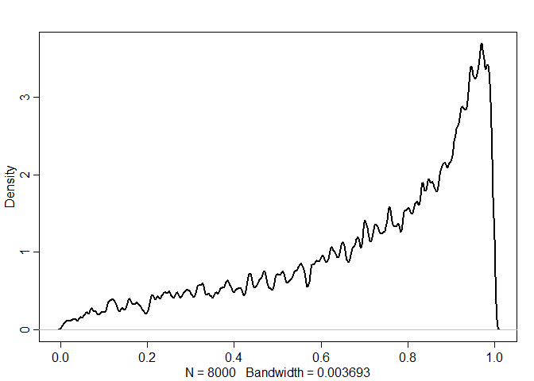

```r
library(tidyverse)
```

```
## -- Attaching packages -------------------------------------------------------- tidyverse 1.3.0 --
```

```
## v ggplot2 3.2.1     v purrr   0.3.3
## v tibble  2.1.3     v dplyr   0.8.3
## v tidyr   1.0.0     v stringr 1.4.0
## v readr   1.3.1     v forcats 0.4.0
```

```
## -- Conflicts ----------------------------------------------------------- tidyverse_conflicts() --
## x dplyr::filter() masks stats::filter()
## x dplyr::lag()    masks stats::lag()
```

```r
library(rethinking)
```

```
## Loading required package: rstan
```

```
## Loading required package: StanHeaders
```

```
## rstan (Version 2.19.2, GitRev: 2e1f913d3ca3)
```

```
## For execution on a local, multicore CPU with excess RAM we recommend calling
## options(mc.cores = parallel::detectCores()).
## To avoid recompilation of unchanged Stan programs, we recommend calling
## rstan_options(auto_write = TRUE)
```

```
## For improved execution time, we recommend calling
## Sys.setenv(LOCAL_CPPFLAGS = '-march=native')
## although this causes Stan to throw an error on a few processors.
```

```
## 
## Attaching package: 'rstan'
```

```
## The following object is masked from 'package:tidyr':
## 
##     extract
```

```
## Loading required package: parallel
```

```
## Loading required package: dagitty
```

```
## rethinking (Version 1.93)
```

```
## 
## Attaching package: 'rethinking'
```

```
## The following object is masked from 'package:purrr':
## 
##     map
```

```
## The following object is masked from 'package:stats':
## 
##     rstudent
```

```r
# options(mc.cores = parallel::detectCores())
# rstan_options(auto_write = TRUE)
# Sys.setenv(LOCAL_CPPFLAGS = '-march=native')
```

# 13 Models With Memory
## 13.1. Example: Multilevel tadpoles


```r
data(reedfrogs)
d <- reedfrogs
str(d)
```

```
## 'data.frame':	48 obs. of  5 variables:
##  $ density : int  10 10 10 10 10 10 10 10 10 10 ...
##  $ pred    : Factor w/ 2 levels "no","pred": 1 1 1 1 1 1 1 1 2 2 ...
##  $ size    : Factor w/ 2 levels "big","small": 1 1 1 1 2 2 2 2 1 1 ...
##  $ surv    : int  9 10 7 10 9 9 10 9 4 9 ...
##  $ propsurv: num  0.9 1 0.7 1 0.9 0.9 1 0.9 0.4 0.9 ...
```


```r
# make the tank cluster variable
d$tank <- 1:nrow(d)

dat <- list(S = d$surv,
            N = d$density,
            tank = d$tank)

# approximate posterior
m13.1 <- ulam(
  alist(S ~ dbinom(N , p) ,
        logit(p) <- a[tank] ,
        a[tank] ~ dnorm(0 , 1.5)),
  data = dat ,
  chains = 1 ,
  log_lik = TRUE
)
```

```
## 
## SAMPLING FOR MODEL 'cb3dfdd4abafffee16ea86593d6ba62d' NOW (CHAIN 1).
## Chain 1: 
## Chain 1: Gradient evaluation took 0 seconds
## Chain 1: 1000 transitions using 10 leapfrog steps per transition would take 0 seconds.
## Chain 1: Adjust your expectations accordingly!
## Chain 1: 
## Chain 1: 
## Chain 1: Iteration:   1 / 1000 [  0%]  (Warmup)
## Chain 1: Iteration: 100 / 1000 [ 10%]  (Warmup)
## Chain 1: Iteration: 200 / 1000 [ 20%]  (Warmup)
## Chain 1: Iteration: 300 / 1000 [ 30%]  (Warmup)
## Chain 1: Iteration: 400 / 1000 [ 40%]  (Warmup)
## Chain 1: Iteration: 500 / 1000 [ 50%]  (Warmup)
## Chain 1: Iteration: 501 / 1000 [ 50%]  (Sampling)
## Chain 1: Iteration: 600 / 1000 [ 60%]  (Sampling)
## Chain 1: Iteration: 700 / 1000 [ 70%]  (Sampling)
## Chain 1: Iteration: 800 / 1000 [ 80%]  (Sampling)
## Chain 1: Iteration: 900 / 1000 [ 90%]  (Sampling)
## Chain 1: Iteration: 1000 / 1000 [100%]  (Sampling)
## Chain 1: 
## Chain 1:  Elapsed Time: 0.119 seconds (Warm-up)
## Chain 1:                0.099 seconds (Sampling)
## Chain 1:                0.218 seconds (Total)
## Chain 1:
```


```r
precis(m13.1, depth = 2)
```

```
##              mean        sd         5.5%       94.5%     n_eff      Rhat
## a[1]   1.71336792 0.7933020  0.541250645  3.06375043 1128.8668 0.9983887
## a[2]   2.40473983 0.8831435  1.007087598  3.96693825 1349.4850 0.9994855
## a[3]   0.74818320 0.6479232 -0.187457408  1.78562673  645.5160 1.0023101
## a[4]   2.34880518 0.8072096  1.160423431  3.63174708 1349.4850 0.9979982
## a[5]   1.69417109 0.7370805  0.464849483  2.99013698 1088.3855 0.9993111
## a[6]   1.75154466 0.8042073  0.600670425  3.05547685 1276.6090 0.9981043
## a[7]   2.43793321 0.9069135  1.064469037  3.87303221  725.5527 0.9993625
## a[8]   1.72074330 0.7958739  0.577271355  3.08224560 1232.0469 0.9981305
## a[9]  -0.36956002 0.6034044 -1.294948331  0.61167585 1173.3820 0.9982158
## a[10]  1.72293465 0.7136636  0.601092422  2.84713852  751.1868 0.9999820
## a[11]  0.78948878 0.6068133 -0.180099362  1.74837853  934.5555 0.9980024
## a[12]  0.37590414 0.5820397 -0.569087254  1.33000824 1349.4850 0.9980538
## a[13]  0.77184030 0.6727317 -0.305496924  1.86259117 1147.7086 0.9982620
## a[14]  0.01072389 0.5627874 -0.925387643  0.92513621  763.5231 0.9983101
## a[15]  1.73193492 0.7357552  0.607279965  2.99764412 1349.4850 0.9981201
## a[16]  1.74872526 0.8138051  0.617855860  3.11636599  969.0758 0.9980778
## a[17]  2.53336768 0.6773038  1.474136285  3.66518337 1115.7261 0.9984733
## a[18]  2.12185032 0.5536729  1.246639955  3.04834096 1144.9965 0.9983670
## a[19]  1.81285965 0.5352004  1.031786594  2.73154649  775.4181 0.9984786
## a[20]  3.08792461 0.8534356  1.886785090  4.54396666  799.5375 0.9988859
## a[21]  2.14789367 0.6230051  1.260746295  3.18828609 1336.4793 0.9993351
## a[22]  2.13658576 0.5858138  1.254254476  3.09435615 1085.2219 1.0017055
## a[23]  2.13066034 0.6420966  1.163687851  3.22478972 1349.4850 0.9984814
## a[24]  1.55013925 0.4518000  0.870685743  2.31266030 1349.4850 0.9986833
## a[25] -1.10621009 0.4512756 -1.858852467 -0.38780852 1108.2681 0.9990874
## a[26]  0.09360943 0.3562310 -0.505879963  0.68269646 1349.4850 1.0012316
## a[27] -1.51759410 0.4693161 -2.315151481 -0.83245124 1060.9659 0.9988608
## a[28] -0.55826921 0.3748369 -1.127952146  0.01337973  955.0703 0.9985013
## a[29]  0.07030723 0.3955453 -0.548446412  0.68343954 1163.9988 0.9990251
## a[30]  1.31053445 0.4510485  0.653187959  2.06942994  894.9987 0.9982696
## a[31] -0.73032805 0.4200625 -1.405106034 -0.09603320  906.0966 1.0038053
## a[32] -0.39503245 0.3959389 -1.036073371  0.29301942  988.2679 0.9980927
## a[33]  2.81665672 0.6521320  1.850145194  3.95367387 1220.7798 0.9981841
## a[34]  2.45136219 0.5488094  1.585219429  3.38180758  793.4656 0.9983394
## a[35]  2.46005991 0.5675789  1.610118409  3.41438600 1349.4850 0.9986939
## a[36]  1.88120249 0.4217576  1.250955450  2.56570018  831.8889 0.9996030
## a[37]  1.92501569 0.5033833  1.182918532  2.79977235  952.2645 0.9983910
## a[38]  3.42003406 0.7396354  2.345900680  4.64174548 1062.7396 0.9987288
## a[39]  2.46959819 0.5872628  1.619329928  3.47608649  611.2909 0.9981212
## a[40]  2.16045785 0.5707222  1.330776742  3.14833831 1349.4850 1.0007814
## a[41] -1.89390988 0.4800393 -2.679549178 -1.15624554  656.7044 0.9980162
## a[42] -0.63221707 0.3396797 -1.181150458 -0.10862019 1306.4259 0.9985028
## a[43] -0.50811418 0.3267176 -1.035747874  0.04748456 1349.4850 0.9982531
## a[44] -0.40890848 0.3582638 -0.964799712  0.13077977 1128.1043 0.9979984
## a[45]  0.51069270 0.3188034  0.003179624  1.03333281 1023.8628 0.9995092
## a[46] -0.65161446 0.3653207 -1.230525843 -0.08161859  939.4750 0.9982506
## a[47]  1.90781356 0.4881004  1.167745897  2.65773339  650.2672 0.9994088
## a[48] -0.05117707 0.3314707 -0.549834176  0.47019460 1349.4850 0.9985101
```


```r
m13.2 <- ulam(
  alist(
    S ~ dbinom(N , p) ,
    logit(p) <- a[tank] ,
    a[tank] ~ dnorm(a_bar , sigma) ,
    a_bar ~ dnorm(0 , 1.5) ,
    sigma ~ dexp(1)
  ),
  data = dat ,
  chains = 1 ,
  log_lik = TRUE
)
```

```
## 
## SAMPLING FOR MODEL 'b657fd8d4fc97d5f194fdc27ef33e50f' NOW (CHAIN 1).
## Chain 1: 
## Chain 1: Gradient evaluation took 0 seconds
## Chain 1: 1000 transitions using 10 leapfrog steps per transition would take 0 seconds.
## Chain 1: Adjust your expectations accordingly!
## Chain 1: 
## Chain 1: 
## Chain 1: Iteration:   1 / 1000 [  0%]  (Warmup)
## Chain 1: Iteration: 100 / 1000 [ 10%]  (Warmup)
## Chain 1: Iteration: 200 / 1000 [ 20%]  (Warmup)
## Chain 1: Iteration: 300 / 1000 [ 30%]  (Warmup)
## Chain 1: Iteration: 400 / 1000 [ 40%]  (Warmup)
## Chain 1: Iteration: 500 / 1000 [ 50%]  (Warmup)
## Chain 1: Iteration: 501 / 1000 [ 50%]  (Sampling)
## Chain 1: Iteration: 600 / 1000 [ 60%]  (Sampling)
## Chain 1: Iteration: 700 / 1000 [ 70%]  (Sampling)
## Chain 1: Iteration: 800 / 1000 [ 80%]  (Sampling)
## Chain 1: Iteration: 900 / 1000 [ 90%]  (Sampling)
## Chain 1: Iteration: 1000 / 1000 [100%]  (Sampling)
## Chain 1: 
## Chain 1:  Elapsed Time: 0.147 seconds (Warm-up)
## Chain 1:                0.097 seconds (Sampling)
## Chain 1:                0.244 seconds (Total)
## Chain 1:
```


```r
precis(m13.2, depth = 2)
```

```
##              mean        sd        5.5%       94.5%     n_eff      Rhat
## a[1]   2.10620691 0.8974055  0.76312500  3.59544498 1114.9654 0.9983290
## a[2]   3.02617677 1.1189981  1.48305727  5.14924415  846.7379 0.9989601
## a[3]   1.01999592 0.6924879 -0.05549169  2.15389234  993.1107 0.9997005
## a[4]   3.03522254 1.1242560  1.51569849  5.03046108  708.3206 0.9981563
## a[5]   2.16748190 0.9080481  0.88831730  3.65012750  690.3351 0.9980447
## a[6]   2.15886553 0.8725368  0.81907146  3.63621875 1108.6199 0.9981443
## a[7]   3.00653725 1.0476982  1.45612687  4.64653787  741.8907 0.9991204
## a[8]   2.15108236 0.9163392  0.80820061  3.79705390 1188.6778 1.0012563
## a[9]  -0.16056858 0.5941833 -1.06298623  0.82286986  955.3392 0.9989473
## a[10]  2.18325440 0.8833296  0.88447533  3.65085579  720.5532 0.9982803
## a[11]  1.00001046 0.6035878  0.07519466  1.98532876 1219.3901 0.9986855
## a[12]  0.60007001 0.6209284 -0.37724891  1.60169310 1080.7250 0.9989157
## a[13]  0.99972182 0.6228194  0.04528474  2.05113584 1349.4850 0.9983116
## a[14]  0.20302602 0.5586804 -0.73800089  1.08034616 1349.4850 0.9987772
## a[15]  2.12438401 0.8620666  0.83523746  3.64126503  913.6454 0.9983282
## a[16]  2.12725590 0.8315356  0.90111677  3.56316465 1297.7568 0.9984831
## a[17]  2.87711651 0.7750708  1.76588372  4.17814523  919.5107 0.9980474
## a[18]  2.40190108 0.6986821  1.40873255  3.55428747 1349.4850 0.9980790
## a[19]  2.01033524 0.6868804  1.01629269  3.21397939 1263.8879 0.9985812
## a[20]  3.63810141 0.9779850  2.25407787  5.33067172  704.8607 0.9981939
## a[21]  2.40507632 0.7094789  1.35034959  3.62917279  856.7162 0.9986997
## a[22]  2.34942741 0.5726092  1.48915284  3.28106404 1349.4850 0.9980701
## a[23]  2.36918268 0.6361803  1.44108200  3.39467690  697.5159 0.9991581
## a[24]  1.68940230 0.4999706  0.96569677  2.49497313  722.3999 0.9979996
## a[25] -0.98733822 0.4469268 -1.69264732 -0.28479160 1165.2091 1.0001660
## a[26]  0.15593546 0.3916704 -0.45153228  0.79915011 1349.4850 1.0002169
## a[27] -1.43772794 0.4980313 -2.29550109 -0.67241787  743.3039 1.0037866
## a[28] -0.47057874 0.4137882 -1.13051367  0.13803273 1049.5728 0.9987256
## a[29]  0.14663212 0.3615762 -0.39099973  0.74810859  966.4802 0.9980311
## a[30]  1.43648805 0.4789764  0.68281754  2.22428523 1349.4850 0.9980410
## a[31] -0.64272452 0.3533168 -1.17358563 -0.10026536 1105.5776 0.9987683
## a[32] -0.30814095 0.3986622 -0.93364206  0.34074610 1349.4850 0.9981163
## a[33]  3.19560067 0.7201971  2.11102398  4.45705446  813.1874 0.9980244
## a[34]  2.69072009 0.6251647  1.79448612  3.76830756 1037.8150 0.9981406
## a[35]  2.72152475 0.6868639  1.76028607  3.88407219  499.2519 0.9984740
## a[36]  2.05734886 0.5399944  1.23536144  2.92836578 1349.4850 0.9983053
## a[37]  2.03136261 0.4913813  1.31654720  2.80821078 1171.3524 0.9982161
## a[38]  3.84124906 1.0248760  2.40016364  5.49806175 1301.2233 0.9984286
## a[39]  2.67314571 0.5810184  1.83451343  3.64947346 1349.4850 0.9980073
## a[40]  2.34935846 0.5909440  1.46015066  3.34618574 1349.4850 0.9996357
## a[41] -1.80473904 0.4673524 -2.55217241 -1.08372967 1143.8735 0.9998427
## a[42] -0.57138300 0.3868608 -1.19096355  0.00100706 1045.9079 0.9997984
## a[43] -0.45233350 0.3704043 -1.09077377  0.16607108 1349.4850 0.9982787
## a[44] -0.32314647 0.3240213 -0.83557854  0.14192022 1261.7217 0.9980361
## a[45]  0.57596761 0.3225950  0.05359469  1.08615802  965.2626 0.9980487
## a[46] -0.55458822 0.3368933 -1.10765744 -0.04286282 1349.4850 0.9984491
## a[47]  2.05784906 0.4962378  1.33494906  2.84371306  875.4265 0.9980213
## a[48]  0.01512837 0.3306192 -0.50327682  0.53806356 1169.3573 0.9989965
## a_bar  1.34309810 0.2387884  0.98184554  1.73042539  674.4321 0.9989103
## sigma  1.60622879 0.2153023  1.29012805  1.97568019  494.2740 0.9979980
```

```r
compare( m13.1 , m13.2 )
```

```
##           WAIC       SE   dWAIC      dSE    pWAIC      weight
## m13.2 198.5711 7.374254  0.0000       NA 20.12643 0.998198709
## m13.1 211.2060 4.603349 12.6349 4.195946 24.20625 0.001801291
```


```r
# extract Stan samples
post <- extract.samples(m13.2)

# compute median intercept for each tank
# also transform to probability with logistic
d$propsurv.est <- logistic(apply(post$a , 2 , mean))

# display raw proportions surviving in each tank
plot(
  d$propsurv ,
  ylim = c(0, 1) ,
  pch = 16 ,
  xaxt = "n" ,
  xlab = "tank" ,
  ylab = "proportion survival" ,
  col = rangi2
)
axis( 1 , at=c(1,16,32,48) , labels=c(1,16,32,48) )

# overlay posterior means
points( d$propsurv.est )

# mark posterior mean probability across tanks
abline( h=mean(inv_logit(post$a_bar)) , lty=2 )

# draw vertical dividers between tank densities
abline( v=16.5 , lwd=0.5 )
abline( v=32.5 , lwd=0.5 )
text( 8 , 0 , "small tanks" )
text( 16+8 , 0 , "medium tanks" )
text( 32+8 , 0 , "large tanks" )
```

<!-- -->


```r
# show first 100 populations in the posterior
plot(
  NULL ,
  xlim = c(-3, 4) ,
  ylim = c(0, 0.35) ,
  xlab = "log-odds survive" ,
  ylab = "Density"
)

for (i in 1:100)
  curve(dnorm(x, post$a_bar[i], post$sigma[i]) ,
        add = TRUE ,
        col = col.alpha("black", 0.2))
```

<!-- -->

```r
# sample 8000 imaginary tanks from the posterior distribution
sim_tanks <- rnorm(8000 , post$a_bar , post$sigma)

# transform to probability and visualize
dens(inv_logit(sim_tanks) , lwd = 2 , adj = 0.1)
```

<!-- -->

## 13.2. Varying effects and the underfitting/overfitting trade-off
### 13.2.1. The model
### 13.2.2. Assign values to the parameters


```r
a_bar <- 1.4
sigma <- 1.5
nponds <- 60
Ni <- as.integer( rep( c(5,10,25,35) , each=15 ) )
```


```r
set.seed(5005)
a_pond <- rnorm( nponds , mean=a_bar , sd=sigma )
a_pond
```

```
##  [1]  0.46673123  1.89002317 -0.23775688  1.75676651  3.81208800  1.85414869
##  [7]  1.38963805  2.42407196  2.07828010  1.94776578  2.64564559 -0.73722320
## [13]  2.93948315  1.80733694  3.44119394  0.55165674 -1.26943954  0.49568973
## [19]  0.28530177  0.92961242 -0.02965994  1.24936971  2.35730258 -0.15251326
## [25]  2.10677386  1.72918746  1.23997120  1.47233138  1.15467353  0.72663309
## [31]  2.55834264  1.98241191  1.40758907  0.76265946  0.12721714  4.51568929
## [37] -1.85144380 -1.13306026  0.13817747  5.25841158  3.74572461  1.71628755
## [43] -0.44267584  0.66111582 -1.65979666 -0.18456073  4.27882074  2.22597649
## [49]  1.68144089  1.76990933  1.48196519  0.05560642  1.40345864  4.39654575
## [55]  0.46518221  2.45806132  0.46742678  2.64606408  1.40422253  2.39737954
```


```r
dsim <- data.frame( pond=1:nponds , Ni=Ni , true_a=a_pond )
head(dsim)
```

```
##   pond Ni     true_a
## 1    1  5  0.4667312
## 2    2  5  1.8900232
## 3    3  5 -0.2377569
## 4    4  5  1.7567665
## 5    5  5  3.8120880
## 6    6  5  1.8541487
```

###  13.2.3. Simulate survivors


```r
dsim$Si <- rbinom( nponds , prob=logistic(dsim$true_a) , size=dsim$Ni )
head(dsim)
```

```
##   pond Ni     true_a Si
## 1    1  5  0.4667312  4
## 2    2  5  1.8900232  4
## 3    3  5 -0.2377569  1
## 4    4  5  1.7567665  5
## 5    5  5  3.8120880  5
## 6    6  5  1.8541487  5
```

### 13.2.4. Compute the no-pooling estimates


```r
dsim$p_nopool <- dsim$Si / dsim$Ni
head(dsim)
```

```
##   pond Ni     true_a Si p_nopool
## 1    1  5  0.4667312  4      0.8
## 2    2  5  1.8900232  4      0.8
## 3    3  5 -0.2377569  1      0.2
## 4    4  5  1.7567665  5      1.0
## 5    5  5  3.8120880  5      1.0
## 6    6  5  1.8541487  5      1.0
```

### 13.2.5. Compute the partial-pooling estimates


```r
dat <- list(Si = dsim$Si ,
            Ni = dsim$Ni ,
            pond = dsim$pond)

m13.3 <- ulam(
  alist(
    Si ~ dbinom(Ni , p),
    logit(p) <- a_pond[pond],
    a_pond[pond] ~ dnorm(a_bar , sigma),
    a_bar ~ dnorm(0 , 1.5),
    sigma ~ dexp(1)
  ),
  data = dat ,
  chains = 4,
  cores = 3
)

precis(m13.3 , depth = 2)
```

```
##                   mean        sd         5.5%       94.5%    n_eff      Rhat
## a_pond[1]   1.57112706 0.9735421  0.155970611  3.18558328 3373.409 0.9986248
## a_pond[2]   1.59185271 0.9823607  0.195161694  3.19991319 2998.333 0.9992188
## a_pond[3]  -0.56855096 0.8237842 -1.959346000  0.71956103 3403.109 1.0005954
## a_pond[4]   2.71063792 1.1719062  1.018557550  4.65552842 2217.781 0.9999671
## a_pond[5]   2.69604154 1.2093847  0.922030250  4.75778220 2591.007 0.9992799
## a_pond[6]   2.73556922 1.2231724  0.960426663  4.76905940 2483.401 0.9992026
## a_pond[7]   0.10207134 0.8929729 -1.281510514  1.50711455 3140.965 0.9987571
## a_pond[8]   2.72251222 1.1966017  0.958243922  4.77940738 2601.914 1.0007515
## a_pond[9]   0.76678588 0.9064560 -0.606380070  2.26643345 3044.443 0.9991176
## a_pond[10]  1.58812367 0.9975085  0.129564767  3.23525209 2405.129 1.0007864
## a_pond[11]  2.74768711 1.2443656  0.953443961  4.94121676 1845.500 0.9994010
## a_pond[12]  0.09728787 0.8134199 -1.199834848  1.36979116 3620.952 0.9982025
## a_pond[13]  2.72021414 1.2212294  0.878527479  4.83880441 2792.870 0.9994903
## a_pond[14]  2.74305134 1.2516543  0.929099244  4.81527991 2263.911 0.9988721
## a_pond[15]  2.74887720 1.2421233  0.994994578  4.82990674 1654.547 1.0010919
## a_pond[16]  1.53535489 0.7244814  0.463303744  2.73082050 3284.104 0.9996448
## a_pond[17] -1.39943759 0.7270335 -2.622403478 -0.31417770 2789.770 1.0005521
## a_pond[18]  1.06993344 0.7023557  0.001406402  2.25037623 3426.361 0.9991114
## a_pond[19] -0.89129483 0.6535094 -1.997150595  0.05531109 3568.187 0.9995117
## a_pond[20]  1.52318634 0.7123146  0.446834997  2.70474125 2823.474 0.9993446
## a_pond[21]  0.61376144 0.6341298 -0.364679925  1.64485287 3345.524 0.9982823
## a_pond[22]  2.18336595 0.8664354  0.938141560  3.63223295 2122.939 1.0010136
## a_pond[23]  3.12117161 1.0992815  1.563360777  4.97356398 2200.805 0.9994422
## a_pond[24]  0.60774383 0.6548694 -0.431840730  1.70367640 4442.729 0.9995726
## a_pond[25]  3.12091246 1.0992354  1.515298205  4.98741469 2468.554 0.9997044
## a_pond[26]  2.19854036 0.8711240  0.903276743  3.69580985 2407.830 0.9987722
## a_pond[27]  1.03092075 0.6445863  0.056441469  2.07863652 4419.284 0.9986038
## a_pond[28]  2.16176264 0.8675622  0.845962834  3.64824060 3005.736 0.9989592
## a_pond[29]  1.56048399 0.7850380  0.382613705  2.87203203 2684.566 0.9981756
## a_pond[30]  1.05144099 0.6688974  0.039098734  2.14290609 3803.877 0.9993031
## a_pond[31]  2.40483355 0.6406355  1.429940019  3.49107571 2616.761 0.9999767
## a_pond[32]  2.02051674 0.5806503  1.177026694  2.99739702 3049.712 0.9990586
## a_pond[33]  1.72961430 0.5207017  0.970218755  2.58908974 2963.594 0.9996045
## a_pond[34]  1.24473082 0.4660653  0.527312050  2.00794783 3339.964 0.9987181
## a_pond[35]  0.50290323 0.4081506 -0.136088232  1.15640281 3521.196 0.9995077
## a_pond[36]  3.71524038 1.0169439  2.281609379  5.46638763 1561.424 1.0012680
## a_pond[37] -0.96774875 0.4250640 -1.670325772 -0.32662028 4028.410 0.9988427
## a_pond[38] -1.16202043 0.4452196 -1.877317291 -0.48996026 3008.081 0.9991503
## a_pond[39]  0.67327520 0.4222418  0.007700521  1.35499491 2840.936 0.9989617
## a_pond[40]  3.69156161 1.0133767  2.243811012  5.44287598 1902.482 0.9991523
## a_pond[41]  2.93796132 0.7797467  1.830348308  4.25049271 2128.349 0.9983232
## a_pond[42]  2.03399447 0.5996903  1.133771554  3.03146819 2731.445 0.9999325
## a_pond[43] -0.13216294 0.3932138 -0.757706617  0.47884700 3002.025 0.9987082
## a_pond[44]  0.49690680 0.4072477 -0.158636189  1.13009521 3595.582 0.9998363
## a_pond[45] -1.41977699 0.5065406 -2.269487615 -0.63417610 3458.007 0.9989371
## a_pond[46] -0.10182764 0.3534190 -0.679138836  0.45200603 4298.047 0.9991768
## a_pond[47]  3.91092987 0.9817202  2.522528327  5.64036861 2339.533 1.0002860
## a_pond[48]  2.07714672 0.5095001  1.290863503  2.92129747 3601.641 0.9991716
## a_pond[49]  1.63361193 0.4334945  0.975231934  2.35378200 2648.874 0.9996937
## a_pond[50]  2.73094662 0.6455490  1.791336958  3.86454168 2331.921 1.0007387
## a_pond[51]  2.37010035 0.5839026  1.497750130  3.34952131 2779.419 0.9993060
## a_pond[52]  0.24698270 0.3336664 -0.276681041  0.79941154 3598.808 0.9999781
## a_pond[53]  2.07413115 0.5153018  1.309346529  2.95960813 3403.843 0.9984886
## a_pond[54]  3.91037521 0.9720010  2.526474905  5.64170477 1911.202 0.9993421
## a_pond[55]  0.98220546 0.3763372  0.427324894  1.61536083 3285.384 0.9990608
## a_pond[56]  2.72494054 0.6562127  1.763822070  3.88283111 2892.842 0.9998763
## a_pond[57]  0.59254984 0.3374096  0.055438478  1.15085065 3545.443 0.9988519
## a_pond[58]  3.18917169 0.7284617  2.157129786  4.45999767 2652.742 0.9998422
## a_pond[59]  1.44826974 0.4048225  0.851330678  2.10450408 3239.365 0.9987746
## a_pond[60]  2.36714406 0.5658595  1.507307983  3.32339056 3558.537 0.9997733
## a_bar       1.54991308 0.2400707  1.179510034  1.92826354 1764.976 0.9990186
## sigma       1.57269918 0.2176258  1.249880672  1.94660011  852.412 1.0048822
```


```r
post <- extract.samples( m13.3 )
dsim$p_partpool <- apply( inv_logit(post$a_pond) , 2 , mean )
```


```r
dsim$p_true <- inv_logit( dsim$true_a )
```


```r
nopool_error <- abs( dsim$p_nopool - dsim$p_true )
partpool_error <- abs( dsim$p_partpool - dsim$p_true )
nopool_avg <- aggregate(nopool_error,list(dsim$Ni),mean)
partpool_avg <- aggregate(partpool_error,list(dsim$Ni),mean)
```


```r
head(dsim)
```

```
##   pond Ni     true_a Si p_nopool p_partpool    p_true
## 1    1  5  0.4667312  4      0.8  0.7907262 0.6146098
## 2    2  5  1.8900232  4      0.8  0.7928397 0.8687582
## 3    3  5 -0.2377569  1      0.2  0.3794118 0.4408392
## 4    4  5  1.7567665  5      1.0  0.9046941 0.8528042
## 5    5  5  3.8120880  5      1.0  0.9013476 0.9783760
## 6    6  5  1.8541487  5      1.0  0.9035346 0.8646135
```


```r
plot(
  1:60 ,
  nopool_error ,
  xlab = "pond" ,
  ylab = "absolute error" ,
  col = rangi2 ,
  pch = 16
)
points(1:60 , partpool_error)
```

<!-- -->

### Overthinking: Repeating the pond simulation


```r
a <- 1.4
sigma <- 1.5
nponds <- 60
Ni <- as.integer(rep(c(5, 10, 25, 35) , each = 15))
a_pond <- rnorm(nponds , mean = a , sd = sigma)
dsim <- data.frame(pond = 1:nponds ,
                   Ni = Ni ,
                   true_a = a_pond)
dsim$Si <-
  rbinom(nponds, prob = inv_logit(dsim$true_a), size = dsim$Ni)
dsim$p_nopool <- dsim$Si / dsim$Ni
newdat <- list(Si = dsim$Si,
               Ni = dsim$Ni,
               pond = 1:nponds)
m13.3new <- stan(fit = m13.3@stanfit ,
                 data = newdat ,
                 chains = 1)
```

```
## 
## SAMPLING FOR MODEL 'dec18dc74da68fd44dec3f986f9d0eb6' NOW (CHAIN 1).
## Chain 1: 
## Chain 1: Gradient evaluation took 0 seconds
## Chain 1: 1000 transitions using 10 leapfrog steps per transition would take 0 seconds.
## Chain 1: Adjust your expectations accordingly!
## Chain 1: 
## Chain 1: 
## Chain 1: Iteration:    1 / 2000 [  0%]  (Warmup)
## Chain 1: Iteration:  200 / 2000 [ 10%]  (Warmup)
## Chain 1: Iteration:  400 / 2000 [ 20%]  (Warmup)
## Chain 1: Iteration:  600 / 2000 [ 30%]  (Warmup)
## Chain 1: Iteration:  800 / 2000 [ 40%]  (Warmup)
## Chain 1: Iteration: 1000 / 2000 [ 50%]  (Warmup)
## Chain 1: Iteration: 1001 / 2000 [ 50%]  (Sampling)
## Chain 1: Iteration: 1200 / 2000 [ 60%]  (Sampling)
## Chain 1: Iteration: 1400 / 2000 [ 70%]  (Sampling)
## Chain 1: Iteration: 1600 / 2000 [ 80%]  (Sampling)
## Chain 1: Iteration: 1800 / 2000 [ 90%]  (Sampling)
## Chain 1: Iteration: 2000 / 2000 [100%]  (Sampling)
## Chain 1: 
## Chain 1:  Elapsed Time: 0.254 seconds (Warm-up)
## Chain 1:                0.284 seconds (Sampling)
## Chain 1:                0.538 seconds (Total)
## Chain 1:
```

```r
post <- extract.samples(m13.3new)
dsim$p_partpool <- apply(inv_logit(post$a_pond) , 2 , mean)
dsim$p_true <- inv_logit(dsim$true_a)
nopool_error <- abs(dsim$p_nopool - dsim$p_true)
partpool_error <- abs(dsim$p_partpool - dsim$p_true)
plot(
  1:60 ,
  nopool_error ,
  xlab = "pond" ,
  ylab = "absolute error" ,
  col = rangi2 ,
  pch = 16
)
points(1:60 , partpool_error)
```

<!-- -->
