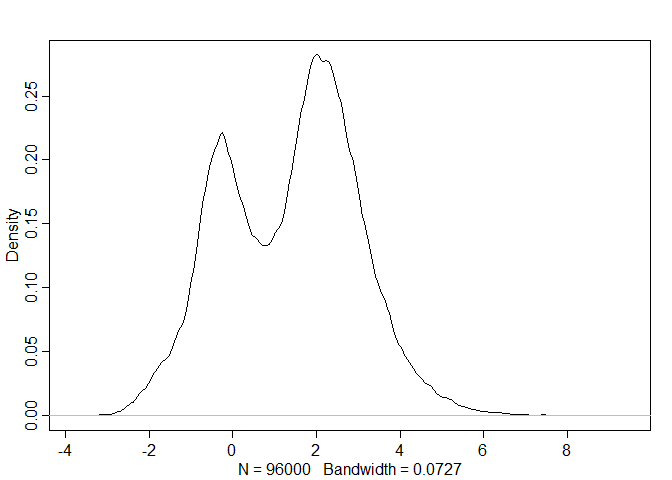
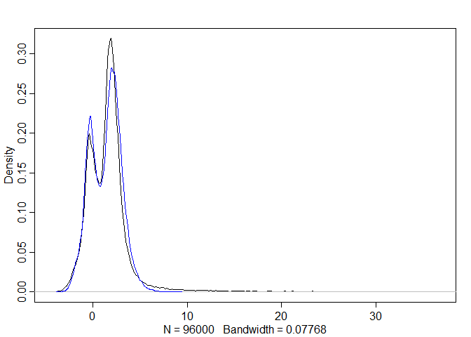
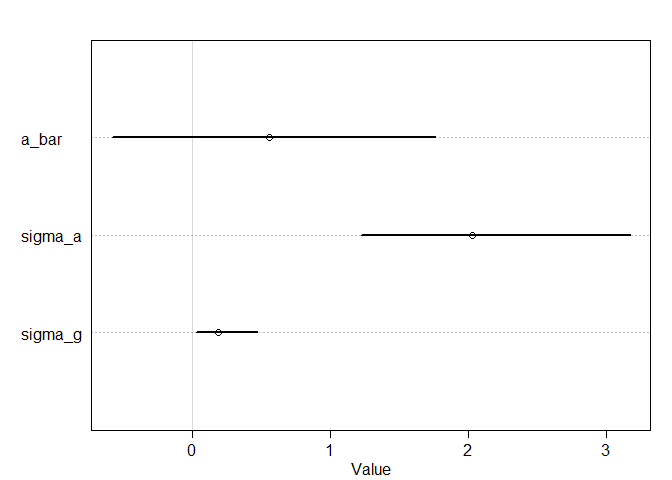
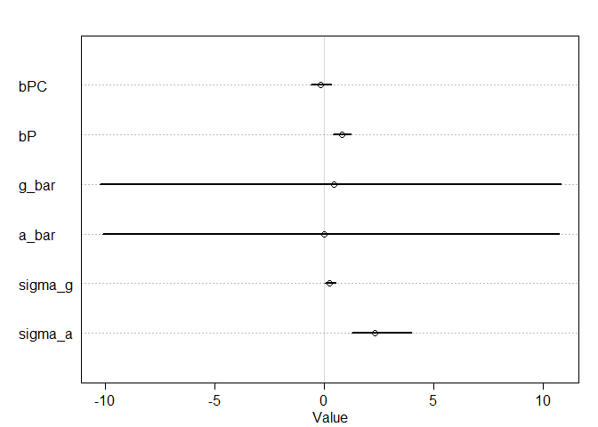
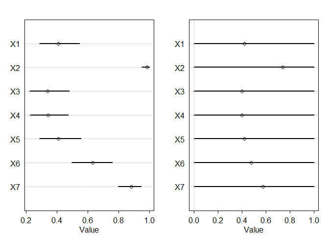
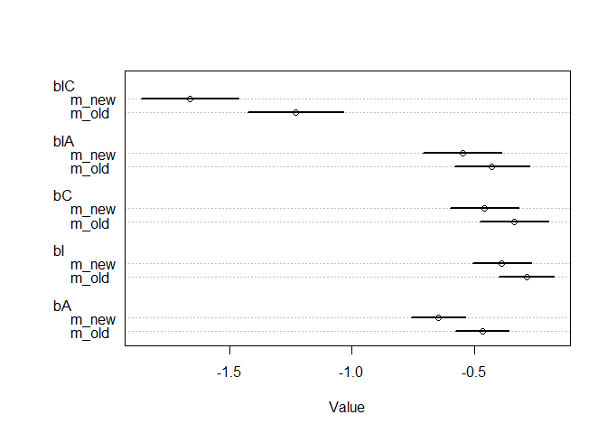
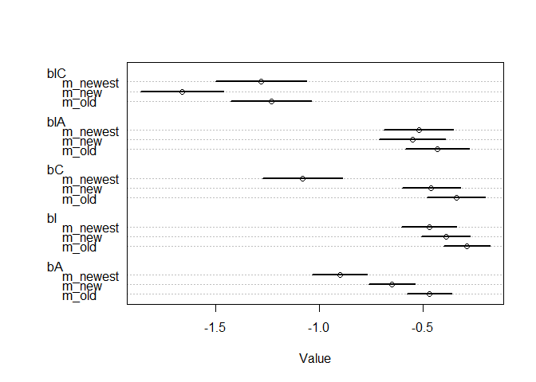

```r
library(tidyverse)
library(rethinking)
```

## Medium
### 12M3. Re-estimate the basic Reed frog varying intercept model, but now using a Cauchy distribution in place of the Gaussian distribution for the varying intercepts. That is, fit this model:
$$
   s_i \sim Binomial(n_i, p_i) \\
   logit(p_i) = \alpha_{TANK[i]} \\
   \alpha_{TANK} \sim Cauchy(\alpha, \sigma) \\
   \alpha \sim Normal(0, 1) \\
   \sigma \sim HalfCauchy(0, 1)
$$

### Compare the posterior means of the intercepts, αtank, to the posterior means produced in the chapter, using the customary Gaussian prior. Can you explain the pattern of differences?


```r
data(reedfrogs)
d <- reedfrogs
str(d)
```

```
## 'data.frame':	48 obs. of  5 variables:
##  $ density : int  10 10 10 10 10 10 10 10 10 10 ...
##  $ pred    : Factor w/ 2 levels "no","pred": 1 1 1 1 1 1 1 1 2 2 ...
##  $ size    : Factor w/ 2 levels "big","small": 1 1 1 1 2 2 2 2 1 1 ...
##  $ surv    : int  9 10 7 10 9 9 10 9 4 9 ...
##  $ propsurv: num  0.9 1 0.7 1 0.9 0.9 1 0.9 0.4 0.9 ...
```

```r
# make the tank cluster variable
d$tank <- 1:nrow(d)

dat <- list(S = d$surv,
            N = d$density,
            tank = d$tank)

# Original model
m_normal <- ulam(
  alist(
    S ~ dbinom(N , p) ,
    logit(p) <- a[tank] ,
    a[tank] ~ dnorm(a_bar , sigma) ,
    a_bar ~ dnorm(0 , 1.5) ,
    sigma ~ dexp(1)
  ),
  data = dat ,
  chains = 4 ,
  log_lik = TRUE,
  cores = 4
)

# Cauchy model
m_cauchy <- ulam(
  alist(
    S ~ dbinom(N , p) ,
    logit(p) <- a[tank] ,
    a[tank] ~ dcauchy(a_bar , sigma) ,
    a_bar ~ dnorm(0 , 1.5) ,
    sigma ~ dcauchy(0, 1)
  ),
  data = dat ,
  chains = 4 ,
  log_lik = TRUE,
  cores = 4
)
```

```
## Warning: There were 127 divergent transitions after warmup. Increasing adapt_delta above 0.95 may help. See
## http://mc-stan.org/misc/warnings.html#divergent-transitions-after-warmup
```

```
## Warning: Examine the pairs() plot to diagnose sampling problems
```

```
## Warning: Bulk Effective Samples Size (ESS) is too low, indicating posterior means and medians may be unreliable.
## Running the chains for more iterations may help. See
## http://mc-stan.org/misc/warnings.html#bulk-ess
```

```
## Warning: Tail Effective Samples Size (ESS) is too low, indicating posterior variances and tail quantiles may be unreliable.
## Running the chains for more iterations may help. See
## http://mc-stan.org/misc/warnings.html#tail-ess
```

```r
compare(m_normal,m_cauchy)
```

```
##              WAIC       SE    dWAIC      dSE    pWAIC    weight
## m_normal 200.1223 7.063687 0.000000       NA 20.88182 0.7793781
## m_cauchy 202.6464 8.290288 2.524091 2.182305 22.70504 0.2206219
```

```r
precis(m_normal)
```

```
## 48 vector or matrix parameters hidden. Use depth=2 to show them.
```

```
##           mean        sd      5.5%    94.5%    n_eff     Rhat
## a_bar 1.346235 0.2670196 0.9269314 1.785827 2372.525 1.000028
## sigma 1.624589 0.2166064 1.3180816 2.008483 1714.855 1.001511
```

```r
precis(m_cauchy)
```

```
## 48 vector or matrix parameters hidden. Use depth=2 to show them.
```

```
##           mean        sd      5.5%    94.5%    n_eff     Rhat
## a_bar 1.481390 0.3013041 0.9758642 1.946374 1127.241 1.001006
## sigma 1.006547 0.2262884 0.6697283 1.391742 1168.111 1.001041
```

```r
post_normal <- extract.samples(m_normal)
post_cauchy <- extract.samples(m_cauchy)

max(post_normal$a)
```

```
## [1] 9.242741
```

```r
max(post_cauchy$a)
```

```
## [1] 36.5848
```

```r
dens(post_normal$a)
```

<!-- -->

```r
dens(post_cauchy$a)

dens(post_cauchy$a)
dens(post_normal$a, add = T, col = 'blue')
```

<!-- -->

The cauchy distribution has a lot longer tails than the normal distribution making the range of estimates larger.

### 12M4. Fit the following cross-classified multilevel model to the chimpanzees data:
$$
L_i \sim Binomial(1, p_i) \\
logit(p_i) = \alpha_{actor[i]} + \alpha_{block[i]} + (\beta_P + \beta_{PC}C_i)P_i \\
\alpha_{actor} \sim Normal(\alpha, \sigma_{actor}) \\
\alpha_{block} \sim Normal(\gamma, \sigma_{block}) \\
\alpha, \gamma, \beta_P, \beta_{PC} \sim Normal(0, 10) \\
\sigma_{actor}, \sigma_{block} \sim HalfCauchy(0, 1)
$$

```r
data(chimpanzees)
d <- chimpanzees
d$treatment <- 1 + d$prosoc_left + 2 * d$condition
dat_list <- list(
  pulled_left = d$pulled_left,
  actor = d$actor,
  block_id = d$block,
  treatment = as.integer(d$treatment)
)

m_chapter <- ulam(
  alist(
    pulled_left ~ dbinom(1 , p) ,
    logit(p) <- a[actor] + g[block_id] + b[treatment],
    b[treatment] ~ dnorm(0 , 0.5),
    # adaptive priors
    a[actor] ~ dnorm(a_bar , sigma_a),
    g[block_id] ~ dnorm(0 , sigma_g),
    # hyper-priors
    a_bar ~ dnorm(0 , 1.5),
    sigma_a ~ dexp(1),
    sigma_g ~ dexp(1)
  ) ,
  data = dat_list ,
  chains = 4 ,
  cores = 4 ,
  log_lik = TRUE
)
```

```
## Warning: There were 8 divergent transitions after warmup. Increasing adapt_delta above 0.95 may help. See
## http://mc-stan.org/misc/warnings.html#divergent-transitions-after-warmup
```

```
## Warning: Examine the pairs() plot to diagnose sampling problems
```

```
## Warning: Bulk Effective Samples Size (ESS) is too low, indicating posterior means and medians may be unreliable.
## Running the chains for more iterations may help. See
## http://mc-stan.org/misc/warnings.html#bulk-ess
```

```
## Warning: Tail Effective Samples Size (ESS) is too low, indicating posterior variances and tail quantiles may be unreliable.
## Running the chains for more iterations may help. See
## http://mc-stan.org/misc/warnings.html#tail-ess
```

```r
dat_list2 <- list(
  pulled_left = d$pulled_left,
  actor = d$actor,
  block_id = d$block,
  prosocial = as.integer(d$prosoc_left),
  condition = as.integer(d$condition)
) 
m_problem <- ulam(
  alist(
    pulled_left ~ dbinom(1 , p) ,
    logit(p) <- a[actor] + g[block_id] + (bP + bPC * condition) * prosocial,
    # adaptive priors
    a[actor] ~ dnorm(a_bar , sigma_a),
    g[block_id] ~ dnorm(g_bar , sigma_g),
    # hyper-priors
    c(a_bar,g_bar,bP,bPC) ~ dnorm(0 , 10),
    c(sigma_a,sigma_g) ~ dcauchy(0,1)
  ) ,
  data = dat_list2 ,
  chains = 4 ,
  cores = 4 ,
  log_lik = TRUE
)
```

```
## Warning: There were 119 divergent transitions after warmup. Increasing adapt_delta above 0.95 may help. See
## http://mc-stan.org/misc/warnings.html#divergent-transitions-after-warmup
```

```
## Warning: There were 379 transitions after warmup that exceeded the maximum treedepth. Increase max_treedepth above 10. See
## http://mc-stan.org/misc/warnings.html#maximum-treedepth-exceeded
```

```
## Warning: Examine the pairs() plot to diagnose sampling problems
```

```
## Warning: Bulk Effective Samples Size (ESS) is too low, indicating posterior means and medians may be unreliable.
## Running the chains for more iterations may help. See
## http://mc-stan.org/misc/warnings.html#bulk-ess
```

```
## Warning: Tail Effective Samples Size (ESS) is too low, indicating posterior variances and tail quantiles may be unreliable.
## Running the chains for more iterations may help. See
## http://mc-stan.org/misc/warnings.html#tail-ess
```

```r
coeftab(m_chapter, m_problem)
```

```
##         m_chapter m_problem
## b[1]      -0.11        NA  
## b[2]       0.41        NA  
## b[3]      -0.46        NA  
## b[4]       0.29        NA  
## a[1]      -0.38     -1.17  
## a[2]       4.68      4.25  
## a[3]      -0.68     -1.47  
## a[4]      -0.68     -1.48  
## a[5]      -0.38     -1.18  
## a[6]       0.56     -0.22  
## a[7]       2.08      1.33  
## g[1]      -0.15      0.25  
## g[2]       0.04      0.50  
## g[3]       0.05      0.51  
## g[4]       0.02      0.45  
## g[5]      -0.02      0.42  
## g[6]       0.10      0.58  
## a_bar      0.56      0.00  
## sigma_a    2.03      2.30  
## sigma_g    0.19      0.25  
## bPC          NA     -0.14  
## bP           NA      0.83  
## g_bar        NA      0.45  
## nobs        504       504
```

```r
plot(m_chapter)
```

```
## 17 vector or matrix parameters hidden. Use depth=2 to show them.
```

<!-- -->

```r
plot(m_problem)
```

```
## 13 vector or matrix parameters hidden. Use depth=2 to show them.
```

<!-- -->

```r
post_c <- extract.samples(m_chapter)
post_p <- extract.samples(m_problem)
prob_c <- data.frame(inv_logit(post_c$a))
prob_p <- data.frame(inv_logit(post_p$a))
par(mfrow = c(1,2))
plot(precis(prob_c))
plot(precis(prob_p))
```

<!-- -->

```r
neff_c <- data.frame(neff_c = precis( m_chapter , depth=2 )[['n_eff']])
neff_c$param <- rownames(precis( m_chapter , depth=2 ))
neff_p <- data.frame(neff_p = precis( m_problem , depth=2 )[['n_eff']])
neff_p$param <- rownames(precis( m_problem , depth=2 ))

par_names <- unique(c(neff_c$param,neff_p$param))
neff_table <- data.frame(param = par_names)
neff_table <- left_join(neff_table,neff_c) %>%
  left_join(neff_p)
```

```
## Joining, by = "param"
```

```
## Warning: Column `param` joining factor and character vector, coercing into
## character vector
```

```
## Joining, by = "param"
```

```r
neff_table <- as.matrix(neff_table[,-1])
rownames(neff_table) <- par_names
round(t(neff_table))
```

```
##        b[1] b[2] b[3] b[4] a[1] a[2] a[3] a[4] a[5] a[6] a[7] g[1] g[2] g[3]
## neff_c  456  501  487  474  502  744  532  512  492  468  578  523 1037  782
## neff_p   NA   NA   NA   NA   98  120   97   98   98   98   98   99   98   98
##        g[4] g[5] g[6] a_bar sigma_a sigma_g bPC  bP g_bar
## neff_c  758 1170  605   974     886     229  NA  NA    NA
## neff_p   98   97   98   105     399     155 634 584    98
```

### Each of the parameters in those comma-separated lists gets the same independent prior. Compare the posterior distribution to that produced by the similar cross-classified model from the chapter. Also compare the number of effective samples. Can you explain the differences?

The formula from the homework has a lot less effective samples compared to the formula from the chapter. Also a lot of uncertainty in a_bar and g_bar leads the estimate for each chimp to be abysmal.

## Hard
### 12H2. Return to the Trolley data, `data(Trolley)`, from Chapter 12. Define and fit a varying intercepts model for these data. Cluster intercepts on individual participants, as indicated by the unique values in the `id` variable. Include `action`, `intention`, and `contact` as ordinary terms. Compare the varying intercepts model and a model that ignores individuals, using both WAIC and posterior predictions. What is the impact of individual variation in these data?


```r
data(Trolley)
d <- Trolley
head(Trolley)
```

```
##    case response order     id age male           edu action intention contact
## 1 cfaqu        4     2 96;434  14    0 Middle School      0         0       1
## 2 cfbur        3    31 96;434  14    0 Middle School      0         0       1
## 3 cfrub        4    16 96;434  14    0 Middle School      0         0       1
## 4 cibox        3    32 96;434  14    0 Middle School      0         1       1
## 5 cibur        3     4 96;434  14    0 Middle School      0         1       1
## 6 cispe        3     9 96;434  14    0 Middle School      0         1       1
##   story action2
## 1   aqu       1
## 2   bur       1
## 3   rub       1
## 4   box       1
## 5   bur       1
## 6   spe       1
```

```r
dat <- list(
  R = d$response,
  A = d$action,
  I = d$intention,
  C = d$contact,
  ID = as.numeric(d$id)
)

length(unique(dat$ID)) # 331 people
```

```
## [1] 331
```

```r
m_old <- ulam(
  alist(
    R ~ dordlogit(phi , cutpoints),
    phi <- bA * A + bC * C + BI * I ,
    BI <- bI + bIA * A + bIC * C ,
    c(bA, bI, bC, bIA, bIC) ~ dnorm(0 , 0.5),
    cutpoints ~ dnorm(0 , 1.5)
  ) ,
  data = dat ,
  chains = 4 ,
  cores = 4,
  log_lik = T
)

m_new <- ulam(
  alist(
    R ~ dordlogit(phi , cutpoints),
    phi <- a[ID] + bA * A + bC * C + BI * I ,
    BI <- bI + bIA * A + bIC * C ,
    c(bA, bI, bC, bIA, bIC) ~ dnorm(0 , 0.5),
    a[ID] ~ dnorm(a_bar,sigma_a),
    a_bar ~ dnorm(0,1.5),
    sigma_a ~ dexp(1),
    cutpoints ~ dnorm(0 , 1.5)
  ) ,
  data = dat ,
  chains = 4 ,
  cores = 4,
  log_lik = T
)
```

```
## Warning: There were 2 transitions after warmup that exceeded the maximum treedepth. Increase max_treedepth above 10. See
## http://mc-stan.org/misc/warnings.html#maximum-treedepth-exceeded
```

```
## Warning: Examine the pairs() plot to diagnose sampling problems
```

```
## Warning: The largest R-hat is 1.36, indicating chains have not mixed.
## Running the chains for more iterations may help. See
## http://mc-stan.org/misc/warnings.html#r-hat
```

```
## Warning: Bulk Effective Samples Size (ESS) is too low, indicating posterior means and medians may be unreliable.
## Running the chains for more iterations may help. See
## http://mc-stan.org/misc/warnings.html#bulk-ess
```

```
## Warning: Tail Effective Samples Size (ESS) is too low, indicating posterior variances and tail quantiles may be unreliable.
## Running the chains for more iterations may help. See
## http://mc-stan.org/misc/warnings.html#tail-ess
```

```r
precis(m_old)
```

```
## 6 vector or matrix parameters hidden. Use depth=2 to show them.
```

```
##           mean         sd       5.5%      94.5%    n_eff     Rhat
## bIC -1.2328956 0.09876851 -1.3917599 -1.0777096 900.5310 1.006435
## bIA -0.4316961 0.07841275 -0.5601135 -0.3077043 927.0568 1.007448
## bC  -0.3444072 0.07154993 -0.4563527 -0.2326156 976.1688 1.004813
## bI  -0.2930607 0.05693727 -0.3840226 -0.2018170 844.5105 1.008274
## bA  -0.4735748 0.05475895 -0.5580425 -0.3844774 847.1067 1.006063
```

```r
precis(m_new)
```

```
## 337 vector or matrix parameters hidden. Use depth=2 to show them.
```

```
##               mean         sd       5.5%      94.5%       n_eff      Rhat
## bIC     -1.6628751 0.10114072 -1.8243132 -1.5038050  654.935025 0.9995414
## bIA     -0.5535756 0.08135422 -0.6845932 -0.4221611  671.412446 1.0023364
## bC      -0.4569261 0.07109661 -0.5675322 -0.3386186  634.391987 1.0010598
## bI      -0.3900263 0.06047999 -0.4839953 -0.2911271  535.353068 1.0018146
## bA      -0.6512710 0.05639619 -0.7418190 -0.5624395  580.013911 1.0025605
## a_bar    0.5924865 0.47877809 -0.1847095  1.3254931    7.900689 1.3223213
## sigma_a  1.9152047 0.08100457  1.7929104  2.0393208 1231.019355 0.9989098
```

```r
compare(m_old,m_new)
```

```
##           WAIC        SE    dWAIC      dSE    pWAIC weight
## m_new 31056.15 179.38024    0.000       NA 355.4563      1
## m_old 36929.73  80.75151 5873.581 173.5411  11.1952      0
```

```r
coeftab(m_old,m_new)
```

```
##              m_old   m_new  
## bIC            -1.23   -1.66
## bIA            -0.43   -0.55
## bC             -0.34   -0.46
## bI             -0.29   -0.39
## bA             -0.47   -0.65
## cutpoints[1]   -2.64   -3.14
## cutpoints[2]   -1.94   -2.19
## cutpoints[3]   -1.34   -1.39
## cutpoints[4]   -0.31    0.11
## cutpoints[5]    0.36    1.16
## cutpoints[6]    1.27    2.57
## a[1]              NA       0
## a[2]              NA   -1.18
## a[3]              NA   -2.38
## a[4]              NA     0.2
## a[5]              NA   -2.88
## a[6]              NA     1.2
## a[7]              NA    0.11
## a[8]              NA    4.47
## a[9]              NA   -0.29
## a[10]             NA    1.34
## a[11]             NA    1.15
## a[12]             NA    2.99
## a[13]             NA    0.13
## a[14]             NA   -0.45
## a[15]             NA    2.19
## a[16]             NA   -1.27
## a[17]             NA    2.19
## a[18]             NA   -0.62
## a[19]             NA   -0.75
## a[20]             NA    0.07
## a[21]             NA   -1.57
## a[22]             NA    0.56
## a[23]             NA   -4.64
## a[24]             NA   -1.11
## a[25]             NA   -0.11
## a[26]             NA    1.51
## a[27]             NA    1.67
## a[28]             NA   -0.23
## a[29]             NA    1.76
## a[30]             NA    2.23
## a[31]             NA    4.37
## a[32]             NA   -0.17
## a[33]             NA    0.38
## a[34]             NA   -1.34
## a[35]             NA    1.96
## a[36]             NA    2.18
## a[37]             NA     1.7
## a[38]             NA    1.23
## a[39]             NA    1.76
## a[40]             NA    1.79
## a[41]             NA   -0.23
## a[42]             NA    2.28
## a[43]             NA    2.31
## a[44]             NA    0.73
## a[45]             NA    1.32
## a[46]             NA    2.54
## a[47]             NA    2.61
## a[48]             NA    2.96
## a[49]             NA   -1.41
## a[50]             NA    1.76
## a[51]             NA    0.17
## a[52]             NA     1.2
## a[53]             NA   -1.89
## a[54]             NA    0.11
## a[55]             NA    2.56
## a[56]             NA    4.43
## a[57]             NA    0.42
## a[58]             NA   -0.89
## a[59]             NA   -1.91
## a[60]             NA   -0.59
## a[61]             NA   -0.64
## a[62]             NA     0.9
## a[63]             NA      -1
## a[64]             NA    0.27
## a[65]             NA   -0.28
## a[66]             NA    5.22
## a[67]             NA    0.74
## a[68]             NA    2.86
## a[69]             NA    3.87
## a[70]             NA   -0.34
## a[71]             NA    1.03
## a[72]             NA    1.66
## a[73]             NA    2.52
## a[74]             NA    1.58
## a[75]             NA    1.29
## a[76]             NA    4.12
## a[77]             NA    0.62
## a[78]             NA    0.77
## a[79]             NA    1.57
## a[80]             NA    0.98
## a[81]             NA   -0.99
## a[82]             NA    1.66
## a[83]             NA   -3.43
## a[84]             NA    1.61
## a[85]             NA    1.94
## a[86]             NA   -0.75
## a[87]             NA    3.28
## a[88]             NA    0.37
## a[89]             NA   -0.57
## a[90]             NA    0.49
## a[91]             NA    1.31
## a[92]             NA    0.86
## a[93]             NA    5.71
## a[94]             NA    1.33
## a[95]             NA    2.68
## a[96]             NA    1.92
## a[97]             NA    1.72
## a[98]             NA   -0.66
## a[99]             NA    1.15
## a[100]            NA    0.12
## a[101]            NA   -1.26
## a[102]            NA     6.2
## a[103]            NA   -0.49
## a[104]            NA   -1.46
## a[105]            NA   -1.07
## a[106]            NA    0.73
## a[107]            NA   -0.24
## a[108]            NA    0.48
## a[109]            NA    0.31
## a[110]            NA    0.38
## a[111]            NA   -0.46
## a[112]            NA   -3.51
## a[113]            NA    2.39
## a[114]            NA    1.09
## a[115]            NA   -0.98
## a[116]            NA    1.45
## a[117]            NA    1.19
## a[118]            NA   -1.01
## a[119]            NA   -2.19
## a[120]            NA   -1.14
## a[121]            NA    0.34
## a[122]            NA   -0.32
## a[123]            NA    1.53
## a[124]            NA   -0.29
## a[125]            NA   -1.24
## a[126]            NA    0.16
## a[127]            NA    2.46
## a[128]            NA    1.28
## a[129]            NA   -0.85
## a[130]            NA   -0.55
## a[131]            NA    1.23
## a[132]            NA    1.96
## a[133]            NA    1.42
## a[134]            NA   -0.46
## a[135]            NA    0.86
## a[136]            NA   -0.29
## a[137]            NA    0.27
## a[138]            NA   -1.57
## a[139]            NA   -0.78
## a[140]            NA    0.99
## a[141]            NA    6.73
## a[142]            NA    1.07
## a[143]            NA   -3.17
## a[144]            NA   -2.38
## a[145]            NA    5.39
## a[146]            NA   -0.53
## a[147]            NA    5.17
## a[148]            NA    4.55
## a[149]            NA    0.65
## a[150]            NA    0.13
## a[151]            NA   -0.82
## a[152]            NA    2.42
## a[153]            NA    0.52
## a[154]            NA   -1.89
## a[155]            NA    3.17
## a[156]            NA   -1.08
## a[157]            NA    0.59
## a[158]            NA    1.63
## a[159]            NA   -0.34
## a[160]            NA    1.37
## a[161]            NA   -0.67
## a[162]            NA    1.48
## a[163]            NA   -1.08
## a[164]            NA     2.5
## a[165]            NA    3.69
## a[166]            NA    0.41
## a[167]            NA    1.37
## a[168]            NA    0.27
## a[169]            NA    0.64
## a[170]            NA    1.25
## a[171]            NA    0.93
## a[172]            NA    0.79
## a[173]            NA    0.04
## a[174]            NA     2.6
## a[175]            NA   -0.49
## a[176]            NA       0
## a[177]            NA    0.51
## a[178]            NA    1.79
## a[179]            NA    1.27
## a[180]            NA    2.86
## a[181]            NA   -0.83
## a[182]            NA    5.85
## a[183]            NA    0.07
## a[184]            NA    -0.2
## a[185]            NA    1.65
## a[186]            NA   -2.69
## a[187]            NA   -1.76
## a[188]            NA    1.97
## a[189]            NA    1.54
## a[190]            NA    1.97
## a[191]            NA   -0.02
## a[192]            NA    0.85
## a[193]            NA     2.6
## a[194]            NA   -0.78
## a[195]            NA    -1.3
## a[196]            NA   -1.12
## a[197]            NA    1.29
## a[198]            NA    1.99
## a[199]            NA   -0.18
## a[200]            NA   -0.34
## a[201]            NA    3.13
## a[202]            NA       3
## a[203]            NA     0.1
## a[204]            NA    0.47
## a[205]            NA   -0.19
## a[206]            NA   -1.42
## a[207]            NA   -1.61
## a[208]            NA   -0.02
## a[209]            NA    -0.2
## a[210]            NA    1.24
## a[211]            NA    0.81
## a[212]            NA    0.93
## a[213]            NA   -0.06
## a[214]            NA      -1
## a[215]            NA   -0.93
## a[216]            NA    1.05
## a[217]            NA    1.82
## a[218]            NA   -2.87
## a[219]            NA   -1.42
## a[220]            NA    1.06
## a[221]            NA    0.56
## a[222]            NA   -0.29
## a[223]            NA    6.75
## a[224]            NA   -0.68
## a[225]            NA    0.54
## a[226]            NA    1.62
## a[227]            NA   -1.14
## a[228]            NA    0.15
## a[229]            NA    0.26
## a[230]            NA   -0.38
## a[231]            NA   -2.26
## a[232]            NA     0.5
## a[233]            NA   -1.73
## a[234]            NA    0.48
## a[235]            NA    5.48
## a[236]            NA   -1.26
## a[237]            NA   -1.71
## a[238]            NA   -0.02
## a[239]            NA    0.27
## a[240]            NA   -0.34
## a[241]            NA   -0.43
## a[242]            NA    0.31
## a[243]            NA    2.53
## a[244]            NA   -0.77
## a[245]            NA    0.13
## a[246]            NA   -0.12
## a[247]            NA   -1.14
## a[248]            NA    0.08
## a[249]            NA   -0.69
## a[250]            NA    0.88
## a[251]            NA    0.48
## a[252]            NA   -2.04
## a[253]            NA    0.28
## a[254]            NA    1.02
## a[255]            NA    -1.1
## a[256]            NA   -0.56
## a[257]            NA   -3.64
## a[258]            NA   -3.61
## a[259]            NA   -0.43
## a[260]            NA    6.12
## a[261]            NA    -2.6
## a[262]            NA    0.27
## a[263]            NA   -2.31
## a[264]            NA    0.86
## a[265]            NA    1.99
## a[266]            NA    0.94
## a[267]            NA   -0.14
## a[268]            NA    1.39
## a[269]            NA    2.55
## a[270]            NA   -2.29
## a[271]            NA    1.74
## a[272]            NA    5.69
## a[273]            NA   -0.67
## a[274]            NA    1.07
## a[275]            NA    0.83
## a[276]            NA   -0.34
## a[277]            NA   -0.55
## a[278]            NA   -0.82
## a[279]            NA   -0.81
## a[280]            NA   -0.05
## a[281]            NA   -0.55
## a[282]            NA    0.17
## a[283]            NA    1.92
## a[284]            NA    2.72
## a[285]            NA   -0.34
## a[286]            NA   -2.91
## a[287]            NA   -0.33
## a[288]            NA   -1.46
## a[289]            NA    1.39
## a[290]            NA   -1.18
## a[291]            NA   -0.58
## a[292]            NA    2.44
## a[293]            NA    0.46
## a[294]            NA    4.48
## a[295]            NA   -0.15
## a[296]            NA    0.79
## a[297]            NA   -1.33
## a[298]            NA    0.25
## a[299]            NA    3.35
## a[300]            NA    1.57
## a[301]            NA     5.6
## a[302]            NA     0.9
## a[303]            NA    0.65
## a[304]            NA     0.2
## a[305]            NA    0.13
## a[306]            NA   -0.13
## a[307]            NA    0.24
## a[308]            NA    2.15
## a[309]            NA    0.52
## a[310]            NA    3.22
## a[311]            NA    1.63
## a[312]            NA    1.19
## a[313]            NA   -0.93
## a[314]            NA   -0.77
## a[315]            NA   -0.27
## a[316]            NA    2.07
## a[317]            NA   -0.22
## a[318]            NA   -0.25
## a[319]            NA    0.22
## a[320]            NA   -1.21
## a[321]            NA   -1.15
## a[322]            NA    4.61
## a[323]            NA    0.79
## a[324]            NA    6.72
## a[325]            NA   -0.62
## a[326]            NA     1.2
## a[327]            NA    0.28
## a[328]            NA    2.27
## a[329]            NA   -0.67
## a[330]            NA   -2.86
## a[331]            NA   -0.02
## a_bar             NA    0.59
## sigma_a           NA    1.92
## nobs            9930    9930
```

```r
par(mfrow = c(1,1))
plot(coeftab(m_old,m_new), pars = c("bIC","bIA","bC","bI","bA"))
```

<!-- -->

New model has a way lower WAIC


### 12H3. The Trolley data are also clustered by `story`, which indicates a unique narrative for each vignette. Define and fit a cross-classified varying intercepts model with both `id` and `story`. Use the same ordinary terms as in the previous problem. Compare this model to the previous models. What do you infer about the impact of different stories on responses?


```r
dat <- list(
  R = d$response,
  A = d$action,
  I = d$intention,
  C = d$contact,
  ID = as.numeric(d$id),
  S = as.numeric(d$story)
)

m_newest <- ulam(
  alist(
    R ~ dordlogit(phi , cutpoints),
    phi <- a[ID] + s[S] + bA * A + bC * C + BI * I ,
    BI <- bI + bIA * A + bIC * C ,
    c(bA, bI, bC, bIA, bIC) ~ dnorm(0 , 0.5),
    a[ID] ~ dnorm(a_bar,sigma_a),
    s[S] ~ dnorm(0, sigma_s),
    a_bar ~ dnorm(0,1.5),
    c(sigma_a, sigma_s) ~ dexp(1),
    cutpoints ~ dnorm(0 , 1.5)
  ) ,
  data = dat ,
  chains = 4 ,
  cores = 4,
  log_lik = T
)
```

```
## Warning: The largest R-hat is 2.26, indicating chains have not mixed.
## Running the chains for more iterations may help. See
## http://mc-stan.org/misc/warnings.html#r-hat
```

```
## Warning: Bulk Effective Samples Size (ESS) is too low, indicating posterior means and medians may be unreliable.
## Running the chains for more iterations may help. See
## http://mc-stan.org/misc/warnings.html#bulk-ess
```

```
## Warning: Tail Effective Samples Size (ESS) is too low, indicating posterior variances and tail quantiles may be unreliable.
## Running the chains for more iterations may help. See
## http://mc-stan.org/misc/warnings.html#tail-ess
```

```r
precis(m_newest)
```

```
## 349 vector or matrix parameters hidden. Use depth=2 to show them.
```

```
##               mean         sd       5.5%      94.5%      n_eff     Rhat
## bIC     -1.2841779 0.11124862 -1.4579339 -1.1025937  907.02805 1.000503
## bIA     -0.5230796 0.08482357 -0.6568658 -0.3825139 1045.38075 1.000659
## bC      -1.0838924 0.09860991 -1.2417414 -0.9278160  737.97980 1.004172
## bI      -0.4655717 0.06735727 -0.5739131 -0.3605758  855.71403 1.001087
## bA      -0.8998284 0.06742374 -1.0130521 -0.7937979  858.39098 1.002153
## a_bar    0.9665197 0.57681540  0.2274914  2.1975355    2.80579 2.491804
## sigma_s  0.5334356 0.12478794  0.3733975  0.7621255 1486.39190 1.001308
## sigma_a  1.9709315 0.08633340  1.8389140  2.1144961 1653.20276 1.001570
```

```r
compare(m_old,m_new,m_newest)
```

```
##              WAIC        SE     dWAIC       dSE    pWAIC        weight
## m_newest 30564.28 180.41897    0.0000        NA 364.4885  1.000000e+00
## m_new    31056.15 179.38024  491.8729  42.59364 355.4563 1.552948e-107
## m_old    36929.73  80.75151 6365.4540 175.34105  11.1952  0.000000e+00
```

```r
coeftab(m_old,m_new,m_newest)
```

```
##              m_old   m_new   m_newest
## bIC            -1.23   -1.66   -1.28 
## bIA            -0.43   -0.55   -0.52 
## bC             -0.34   -0.46   -1.08 
## bI             -0.29   -0.39   -0.47 
## bA             -0.47   -0.65   -0.90 
## cutpoints[1]   -2.64   -3.14   -3.08 
## cutpoints[2]   -1.94   -2.19   -2.10 
## cutpoints[3]   -1.34   -1.39   -1.27 
## cutpoints[4]   -0.31    0.11    0.28 
## cutpoints[5]    0.36    1.16    1.36 
## cutpoints[6]    1.27    2.57    2.81 
## a[1]              NA    0.00    0.38 
## a[2]              NA   -1.18   -0.77 
## a[3]              NA   -2.38   -2.09 
## a[4]              NA    0.20    0.55 
## a[5]              NA   -2.88   -2.58 
## a[6]              NA    1.20    1.62 
## a[7]              NA    0.11    0.53 
## a[8]              NA    4.47    4.91 
## a[9]              NA   -0.29    0.07 
## a[10]             NA    1.34    1.74 
## a[11]             NA    1.15    1.50 
## a[12]             NA    2.99    3.37 
## a[13]             NA    0.13    0.50 
## a[14]             NA   -0.45   -0.03 
## a[15]             NA    2.19    2.67 
## a[16]             NA   -1.27   -0.96 
## a[17]             NA    2.19    2.62 
## a[18]             NA   -0.62   -0.23 
## a[19]             NA   -0.75   -0.43 
## a[20]             NA    0.07    0.41 
## a[21]             NA   -1.57   -1.25 
## a[22]             NA    0.56    0.95 
## a[23]             NA   -4.64   -4.44 
## a[24]             NA   -1.11   -0.81 
## a[25]             NA   -0.11    0.26 
## a[26]             NA    1.51    1.86 
## a[27]             NA    1.67    2.04 
## a[28]             NA   -0.23    0.11 
## a[29]             NA    1.76    2.18 
## a[30]             NA    2.23    2.68 
## a[31]             NA    4.37    4.86 
## a[32]             NA   -0.17    0.22 
## a[33]             NA    0.38    0.75 
## a[34]             NA   -1.34   -1.04 
## a[35]             NA    1.96    2.36 
## a[36]             NA    2.18    2.60 
## a[37]             NA    1.70    2.07 
## a[38]             NA    1.23    1.64 
## a[39]             NA    1.76    2.19 
## a[40]             NA    1.79    2.21 
## a[41]             NA   -0.23    0.11 
## a[42]             NA    2.28    2.68 
## a[43]             NA    2.31    2.74 
## a[44]             NA    0.73    1.16 
## a[45]             NA    1.32    1.73 
## a[46]             NA    2.54    3.02 
## a[47]             NA    2.61    3.04 
## a[48]             NA    2.96    3.43 
## a[49]             NA   -1.41   -1.11 
## a[50]             NA    1.76    2.15 
## a[51]             NA    0.17    0.56 
## a[52]             NA    1.20    1.59 
## a[53]             NA   -1.89   -1.56 
## a[54]             NA    0.11    0.49 
## a[55]             NA    2.56    3.00 
## a[56]             NA    4.43    4.96 
## a[57]             NA    0.42    0.81 
## a[58]             NA   -0.89   -0.57 
## a[59]             NA   -1.91   -1.63 
## a[60]             NA   -0.59   -0.27 
## a[61]             NA   -0.64   -0.30 
## a[62]             NA    0.90    1.27 
## a[63]             NA    -1.0    -0.7 
## a[64]             NA    0.27    0.68 
## a[65]             NA   -0.28    0.10 
## a[66]             NA    5.22    5.76 
## a[67]             NA    0.74    1.14 
## a[68]             NA    2.86    3.30 
## a[69]             NA    3.87    4.32 
## a[70]             NA   -0.34   -0.01 
## a[71]             NA    1.03    1.43 
## a[72]             NA    1.66    2.05 
## a[73]             NA    2.52    2.94 
## a[74]             NA    1.58    1.98 
## a[75]             NA    1.29    1.69 
## a[76]             NA    4.12    4.60 
## a[77]             NA    0.62    1.02 
## a[78]             NA    0.77    1.14 
## a[79]             NA    1.57    1.96 
## a[80]             NA    0.98    1.40 
## a[81]             NA   -0.99   -0.66 
## a[82]             NA    1.66    2.09 
## a[83]             NA   -3.43   -3.17 
## a[84]             NA    1.61    2.02 
## a[85]             NA    1.94    2.26 
## a[86]             NA   -0.75   -0.43 
## a[87]             NA    3.28    3.71 
## a[88]             NA    0.37    0.73 
## a[89]             NA   -0.57   -0.21 
## a[90]             NA    0.49    0.88 
## a[91]             NA    1.31    1.67 
## a[92]             NA    0.86    1.22 
## a[93]             NA    5.71    6.20 
## a[94]             NA    1.33    1.73 
## a[95]             NA    2.68    3.10 
## a[96]             NA    1.92    2.35 
## a[97]             NA    1.72    2.15 
## a[98]             NA   -0.66   -0.33 
## a[99]             NA    1.15    1.54 
## a[100]            NA    0.12    0.47 
## a[101]            NA   -1.26   -0.92 
## a[102]            NA    6.20    6.77 
## a[103]            NA   -0.49   -0.15 
## a[104]            NA   -1.46   -1.15 
## a[105]            NA   -1.07   -0.79 
## a[106]            NA    0.73    1.11 
## a[107]            NA   -0.24    0.10 
## a[108]            NA    0.48    0.85 
## a[109]            NA    0.31    0.65 
## a[110]            NA    0.38    0.77 
## a[111]            NA   -0.46   -0.10 
## a[112]            NA   -3.51   -3.27 
## a[113]            NA    2.39    2.80 
## a[114]            NA    1.09    1.47 
## a[115]            NA   -0.98   -0.68 
## a[116]            NA    1.45    1.81 
## a[117]            NA    1.19    1.57 
## a[118]            NA   -1.01   -0.63 
## a[119]            NA   -2.19   -1.80 
## a[120]            NA   -1.14   -0.86 
## a[121]            NA    0.34    0.70 
## a[122]            NA   -0.32    0.04 
## a[123]            NA    1.53    1.95 
## a[124]            NA   -0.29    0.05 
## a[125]            NA   -1.24   -0.94 
## a[126]            NA    0.16    0.52 
## a[127]            NA    2.46    2.89 
## a[128]            NA    1.28    1.71 
## a[129]            NA   -0.85   -0.51 
## a[130]            NA   -0.55   -0.21 
## a[131]            NA    1.23    1.61 
## a[132]            NA    1.96    2.34 
## a[133]            NA    1.42    1.89 
## a[134]            NA   -0.46   -0.14 
## a[135]            NA    0.86    1.21 
## a[136]            NA   -0.29    0.05 
## a[137]            NA    0.27    0.62 
## a[138]            NA   -1.57   -1.25 
## a[139]            NA   -0.78   -0.42 
## a[140]            NA    0.99    1.38 
## a[141]            NA    6.73    7.29 
## a[142]            NA    1.07    1.46 
## a[143]            NA   -3.17   -2.91 
## a[144]            NA   -2.38   -2.07 
## a[145]            NA    5.39    5.88 
## a[146]            NA   -0.53   -0.24 
## a[147]            NA    5.17    5.65 
## a[148]            NA    4.55    5.00 
## a[149]            NA    0.65    1.02 
## a[150]            NA    0.13    0.49 
## a[151]            NA   -0.82   -0.44 
## a[152]            NA    2.42    2.84 
## a[153]            NA    0.52    0.93 
## a[154]            NA   -1.89   -1.55 
## a[155]            NA    3.17    3.60 
## a[156]            NA   -1.08   -0.76 
## a[157]            NA    0.59    0.95 
## a[158]            NA    1.63    2.04 
## a[159]            NA   -0.34    0.04 
## a[160]            NA    1.37    1.75 
## a[161]            NA   -0.67   -0.33 
## a[162]            NA    1.48    1.89 
## a[163]            NA   -1.08   -0.78 
## a[164]            NA    2.50    2.95 
## a[165]            NA    3.69    4.14 
## a[166]            NA    0.41    0.76 
## a[167]            NA    1.37    1.77 
## a[168]            NA    0.27    0.63 
## a[169]            NA    0.64    1.03 
## a[170]            NA    1.25    1.64 
## a[171]            NA    0.93    1.32 
## a[172]            NA    0.79    1.19 
## a[173]            NA    0.04    0.42 
## a[174]            NA    2.60    3.04 
## a[175]            NA   -0.49   -0.17 
## a[176]            NA    0.00    0.37 
## a[177]            NA    0.51    0.91 
## a[178]            NA    1.79    2.21 
## a[179]            NA    1.27    1.67 
## a[180]            NA    2.86    3.24 
## a[181]            NA   -0.83   -0.44 
## a[182]            NA    5.85    6.37 
## a[183]            NA    0.07    0.41 
## a[184]            NA   -0.20    0.14 
## a[185]            NA    1.65    2.04 
## a[186]            NA   -2.69   -2.42 
## a[187]            NA   -1.76   -1.50 
## a[188]            NA    1.97    2.38 
## a[189]            NA    1.54    2.00 
## a[190]            NA    1.97    2.37 
## a[191]            NA   -0.02    0.33 
## a[192]            NA    0.85    1.32 
## a[193]            NA    2.60    2.97 
## a[194]            NA   -0.78   -0.43 
## a[195]            NA   -1.30   -0.97 
## a[196]            NA   -1.12   -0.79 
## a[197]            NA    1.29    1.66 
## a[198]            NA    1.99    2.38 
## a[199]            NA   -0.18    0.16 
## a[200]            NA   -0.34    0.01 
## a[201]            NA    3.13    3.57 
## a[202]            NA    3.00    3.47 
## a[203]            NA    0.10    0.48 
## a[204]            NA    0.47    0.90 
## a[205]            NA   -0.19    0.16 
## a[206]            NA   -1.42   -1.06 
## a[207]            NA   -1.61   -1.32 
## a[208]            NA   -0.02    0.34 
## a[209]            NA   -0.20    0.12 
## a[210]            NA    1.24    1.62 
## a[211]            NA    0.81    1.21 
## a[212]            NA    0.93    1.34 
## a[213]            NA   -0.06    0.37 
## a[214]            NA   -1.00   -0.64 
## a[215]            NA   -0.93   -0.60 
## a[216]            NA    1.05    1.47 
## a[217]            NA    1.82    2.20 
## a[218]            NA   -2.87   -2.68 
## a[219]            NA   -1.42   -1.10 
## a[220]            NA    1.06    1.43 
## a[221]            NA    0.56    0.93 
## a[222]            NA   -0.29    0.03 
## a[223]            NA    6.75    7.26 
## a[224]            NA   -0.68   -0.24 
## a[225]            NA    0.54    0.81 
## a[226]            NA    1.62    1.98 
## a[227]            NA   -1.14   -0.87 
## a[228]            NA    0.15    0.51 
## a[229]            NA    0.26    0.62 
## a[230]            NA   -0.38   -0.04 
## a[231]            NA   -2.26   -1.98 
## a[232]            NA    0.50    0.82 
## a[233]            NA   -1.73   -1.45 
## a[234]            NA    0.48    0.80 
## a[235]            NA    5.48    6.03 
## a[236]            NA   -1.26   -0.94 
## a[237]            NA   -1.71   -1.41 
## a[238]            NA   -0.02    0.32 
## a[239]            NA    0.27    0.64 
## a[240]            NA   -0.34    0.01 
## a[241]            NA   -0.43   -0.07 
## a[242]            NA    0.31    0.69 
## a[243]            NA    2.53    2.97 
## a[244]            NA   -0.77   -0.38 
## a[245]            NA    0.13    0.51 
## a[246]            NA   -0.12    0.20 
## a[247]            NA   -1.14   -0.81 
## a[248]            NA    0.08    0.46 
## a[249]            NA   -0.69   -0.36 
## a[250]            NA    0.88    1.29 
## a[251]            NA    0.48    0.75 
## a[252]            NA   -2.04   -1.72 
## a[253]            NA    0.28    0.64 
## a[254]            NA    1.02    1.42 
## a[255]            NA   -1.10   -0.76 
## a[256]            NA   -0.56   -0.22 
## a[257]            NA   -3.64   -3.38 
## a[258]            NA   -3.61   -3.35 
## a[259]            NA   -0.43   -0.10 
## a[260]            NA    6.12    6.66 
## a[261]            NA   -2.60   -2.35 
## a[262]            NA    0.27    0.62 
## a[263]            NA   -2.31   -2.04 
## a[264]            NA    0.86    1.24 
## a[265]            NA    1.99    2.40 
## a[266]            NA    0.94    1.33 
## a[267]            NA   -0.14    0.20 
## a[268]            NA    1.39    1.75 
## a[269]            NA    2.55    2.93 
## a[270]            NA   -2.29   -2.02 
## a[271]            NA    1.74    2.20 
## a[272]            NA    5.69    6.25 
## a[273]            NA   -0.67   -0.28 
## a[274]            NA    1.07    1.43 
## a[275]            NA    0.83    1.23 
## a[276]            NA   -0.34   -0.01 
## a[277]            NA   -0.55   -0.17 
## a[278]            NA   -0.82   -0.47 
## a[279]            NA   -0.81   -0.48 
## a[280]            NA   -0.05    0.29 
## a[281]            NA   -0.55   -0.27 
## a[282]            NA    0.17    0.53 
## a[283]            NA    1.92    2.35 
## a[284]            NA    2.72    3.19 
## a[285]            NA   -0.34   -0.01 
## a[286]            NA   -2.91   -2.62 
## a[287]            NA   -0.33   -0.01 
## a[288]            NA   -1.46   -1.14 
## a[289]            NA    1.39    1.80 
## a[290]            NA   -1.18   -0.87 
## a[291]            NA   -0.58   -0.28 
## a[292]            NA    2.44    2.89 
## a[293]            NA    0.46    0.89 
## a[294]            NA    4.48    4.96 
## a[295]            NA   -0.15    0.22 
## a[296]            NA    0.79    1.21 
## a[297]            NA   -1.33   -1.05 
## a[298]            NA    0.25    0.60 
## a[299]            NA    3.35    3.79 
## a[300]            NA    1.57    1.97 
## a[301]            NA    5.60    6.11 
## a[302]            NA    0.90    1.32 
## a[303]            NA    0.65    1.06 
## a[304]            NA    0.20    0.55 
## a[305]            NA    0.13    0.49 
## a[306]            NA   -0.13    0.22 
## a[307]            NA    0.24    0.60 
## a[308]            NA    2.15    2.57 
## a[309]            NA    0.52    0.85 
## a[310]            NA    3.22    3.70 
## a[311]            NA    1.63    2.04 
## a[312]            NA    1.19    1.57 
## a[313]            NA   -0.93   -0.64 
## a[314]            NA   -0.77   -0.46 
## a[315]            NA   -0.27    0.06 
## a[316]            NA    2.07    2.50 
## a[317]            NA   -0.22    0.11 
## a[318]            NA   -0.25    0.12 
## a[319]            NA    0.22    0.56 
## a[320]            NA   -1.21   -0.86 
## a[321]            NA   -1.15   -0.85 
## a[322]            NA    4.61    5.08 
## a[323]            NA    0.79    1.12 
## a[324]            NA    6.72    7.28 
## a[325]            NA   -0.62   -0.25 
## a[326]            NA    1.20    1.59 
## a[327]            NA    0.28    0.65 
## a[328]            NA    2.27    2.68 
## a[329]            NA   -0.67   -0.34 
## a[330]            NA   -2.86   -2.59 
## a[331]            NA   -0.02    0.36 
## a_bar             NA    0.59    0.97 
## sigma_a           NA    1.92    1.97 
## s[1]              NA      NA    0.84 
## s[2]              NA      NA   -0.16 
## s[3]              NA      NA   -0.01 
## s[4]              NA      NA    0.53 
## s[5]              NA      NA   -0.06 
## s[6]              NA      NA    0.03 
## s[7]              NA      NA   -0.66 
## s[8]              NA      NA   -0.05 
## s[9]              NA      NA   -0.47 
## s[10]             NA      NA    0.78 
## s[11]             NA      NA   -0.36 
## s[12]             NA      NA   -0.34 
## sigma_s           NA      NA    0.53 
## nobs            9930    9930    9930
```

```r
par(mfrow = c(1,1))
plot(coeftab(m_old,m_new,m_newest), pars = c("bIC","bIA","bC","bI","bA"))
```

<!-- -->

The newest model appears to be the best, but it's estimates seem worse.
