```r
library(tidyverse)
```

```
## -- Attaching packages ----------------------------------------------- tidyverse 1.3.0 --
```

```
## v ggplot2 3.2.1     v purrr   0.3.3
## v tibble  2.1.3     v dplyr   0.8.3
## v tidyr   1.0.0     v stringr 1.4.0
## v readr   1.3.1     v forcats 0.4.0
```

```
## -- Conflicts -------------------------------------------------- tidyverse_conflicts() --
## x dplyr::filter() masks stats::filter()
## x dplyr::lag()    masks stats::lag()
```

```r
library(rethinking)
```

```
## Loading required package: rstan
```

```
## Loading required package: StanHeaders
```

```
## rstan (Version 2.19.2, GitRev: 2e1f913d3ca3)
```

```
## For execution on a local, multicore CPU with excess RAM we recommend calling
## options(mc.cores = parallel::detectCores()).
## To avoid recompilation of unchanged Stan programs, we recommend calling
## rstan_options(auto_write = TRUE)
```

```
## For improved execution time, we recommend calling
## Sys.setenv(LOCAL_CPPFLAGS = '-march=native')
## although this causes Stan to throw an error on a few processors.
```

```
## 
## Attaching package: 'rstan'
```

```
## The following object is masked from 'package:tidyr':
## 
##     extract
```

```
## Loading required package: parallel
```

```
## Loading required package: dagitty
```

```
## rethinking (Version 1.93)
```

```
## 
## Attaching package: 'rethinking'
```

```
## The following object is masked from 'package:purrr':
## 
##     map
```

```
## The following object is masked from 'package:stats':
## 
##     rstudent
```

# 13 Models With Memory
## 13.1. Example: Multilevel tadpoles


```r
data(reedfrogs)
d <- reedfrogs
str(d)
```

```
## 'data.frame':	48 obs. of  5 variables:
##  $ density : int  10 10 10 10 10 10 10 10 10 10 ...
##  $ pred    : Factor w/ 2 levels "no","pred": 1 1 1 1 1 1 1 1 2 2 ...
##  $ size    : Factor w/ 2 levels "big","small": 1 1 1 1 2 2 2 2 1 1 ...
##  $ surv    : int  9 10 7 10 9 9 10 9 4 9 ...
##  $ propsurv: num  0.9 1 0.7 1 0.9 0.9 1 0.9 0.4 0.9 ...
```


```r
# make the tank cluster variable
d$tank <- 1:nrow(d)

dat <- list(S = d$surv,
            N = d$density,
            tank = d$tank)

# approximate posterior
m13.1 <- ulam(
  alist(S ~ dbinom(N , p) ,
        logit(p) <- a[tank] ,
        a[tank] ~ dnorm(0 , 1.5)),
  data = dat ,
  chains = 1 ,
  log_lik = TRUE
)
```

```
## 
## SAMPLING FOR MODEL 'cb3dfdd4abafffee16ea86593d6ba62d' NOW (CHAIN 1).
## Chain 1: 
## Chain 1: Gradient evaluation took 0 seconds
## Chain 1: 1000 transitions using 10 leapfrog steps per transition would take 0 seconds.
## Chain 1: Adjust your expectations accordingly!
## Chain 1: 
## Chain 1: 
## Chain 1: Iteration:   1 / 1000 [  0%]  (Warmup)
## Chain 1: Iteration: 100 / 1000 [ 10%]  (Warmup)
## Chain 1: Iteration: 200 / 1000 [ 20%]  (Warmup)
## Chain 1: Iteration: 300 / 1000 [ 30%]  (Warmup)
## Chain 1: Iteration: 400 / 1000 [ 40%]  (Warmup)
## Chain 1: Iteration: 500 / 1000 [ 50%]  (Warmup)
## Chain 1: Iteration: 501 / 1000 [ 50%]  (Sampling)
## Chain 1: Iteration: 600 / 1000 [ 60%]  (Sampling)
## Chain 1: Iteration: 700 / 1000 [ 70%]  (Sampling)
## Chain 1: Iteration: 800 / 1000 [ 80%]  (Sampling)
## Chain 1: Iteration: 900 / 1000 [ 90%]  (Sampling)
## Chain 1: Iteration: 1000 / 1000 [100%]  (Sampling)
## Chain 1: 
## Chain 1:  Elapsed Time: 0.128 seconds (Warm-up)
## Chain 1:                0.1 seconds (Sampling)
## Chain 1:                0.228 seconds (Total)
## Chain 1:
```

```
## Warning: The largest R-hat is 1.05, indicating chains have not mixed.
## Running the chains for more iterations may help. See
## http://mc-stan.org/misc/warnings.html#r-hat
```


```r
precis(m13.1, depth = 2)
```

```
##              mean        sd        5.5%        94.5%     n_eff      Rhat
## a[1]   1.73426231 0.7622566  0.61081242  3.055736230 1349.4850 1.0035920
## a[2]   2.37806735 0.8605043  1.11669534  3.811133452 1308.7767 0.9981768
## a[3]   0.75035428 0.6678914 -0.27144736  1.918141365 1349.4850 0.9987839
## a[4]   2.39405683 0.8195853  1.13192971  3.820662979 1020.3613 0.9981483
## a[5]   1.70366152 0.7711856  0.55113128  3.061561844 1197.7942 0.9982742
## a[6]   1.68601915 0.7712050  0.54142777  2.997310649 1349.4850 0.9982323
## a[7]   2.43689227 0.8936164  1.15439815  3.967434955  836.8746 0.9989652
## a[8]   1.66857239 0.7871963  0.50302326  3.023651994  723.1504 1.0042717
## a[9]  -0.35080948 0.5961079 -1.35902053  0.562000032 1349.4850 0.9980980
## a[10]  1.72918585 0.8070041  0.53911203  3.001232252  858.2858 0.9997098
## a[11]  0.74938787 0.6777830 -0.33272085  1.807133881 1349.4850 0.9980232
## a[12]  0.34759503 0.6229620 -0.65445450  1.298748632 1329.8398 0.9985364
## a[13]  0.76091120 0.6384555 -0.21688830  1.823605302 1349.4850 0.9981912
## a[14]  0.03021024 0.5769747 -0.90311126  1.041761421  905.5126 0.9981203
## a[15]  1.69999731 0.6826434  0.65613158  2.869744667 1332.3736 0.9980276
## a[16]  1.73444675 0.7655241  0.54354848  2.900952427 1142.1093 0.9995684
## a[17]  2.54325263 0.6387055  1.66315061  3.745394565 1263.1043 0.9985282
## a[18]  2.11943850 0.5328299  1.29385680  2.967454790 1177.8006 1.0006730
## a[19]  1.79932408 0.5631156  0.97731860  2.732993154 1349.4850 1.0020110
## a[20]  3.09939024 0.8041737  1.93643638  4.333178871 1172.6880 1.0015925
## a[21]  2.15025611 0.6074273  1.28510575  3.203451717  696.0317 0.9980500
## a[22]  2.10911479 0.5594838  1.26805021  3.036180607  934.6965 0.9990944
## a[23]  2.14758528 0.6385300  1.27257860  3.193762158  784.9220 0.9981587
## a[24]  1.49196465 0.4678299  0.82142139  2.310245787 1132.8377 0.9981934
## a[25] -1.07931802 0.4830595 -1.84124407 -0.351132643 1349.4850 1.0008228
## a[26]  0.07911000 0.3934433 -0.54457414  0.729506250 1349.4850 1.0008648
## a[27] -1.54981603 0.5063340 -2.36566428 -0.763828697 1085.2734 0.9984941
## a[28] -0.55008074 0.4088595 -1.19239321  0.055721559  863.5932 1.0000754
## a[29]  0.10076391 0.4149111 -0.53186369  0.747267972  794.7754 0.9993726
## a[30]  1.30438203 0.4723545  0.59642017  2.028979163 1135.3341 1.0031488
## a[31] -0.72326072 0.4154864 -1.38826151 -0.136981547  668.9593 0.9997684
## a[32] -0.39636670 0.4042475 -1.05105760  0.195642042 1349.4850 0.9981788
## a[33]  2.80308588 0.6775857  1.80037741  3.941183126 1037.0304 0.9980353
## a[34]  2.44859114 0.5500391  1.59445413  3.333130298 1349.4850 0.9980130
## a[35]  2.45982273 0.5998752  1.53145952  3.486385934  740.1689 0.9981256
## a[36]  1.90304021 0.4868540  1.17349712  2.753774466 1311.4955 1.0009583
## a[37]  1.91243982 0.4263134  1.23604385  2.574908007 1077.1571 0.9986088
## a[38]  3.35554741 0.7771394  2.21342788  4.677252717  953.6650 1.0008677
## a[39]  2.46859858 0.5587244  1.62969806  3.402601159 1023.6366 0.9979980
## a[40]  2.17408718 0.5498817  1.38199315  3.100484767  745.8659 1.0018433
## a[41] -1.90642066 0.4905739 -2.71210612 -1.216736077 1040.0282 0.9982810
## a[42] -0.62540467 0.3484890 -1.18694399 -0.093408075  834.2735 0.9980821
## a[43] -0.49542667 0.3177822 -0.99585157  0.005146802  849.4466 0.9997060
## a[44] -0.38205543 0.3501282 -0.95213646  0.184691304 1349.4850 0.9980121
## a[45]  0.52144830 0.3390884 -0.02244738  1.115470741 1349.4850 0.9987642
## a[46] -0.64699016 0.3386825 -1.16315560 -0.134197828 1006.5359 1.0030863
## a[47]  1.93220108 0.5553084  1.11744674  2.880807560  639.0241 0.9982844
## a[48] -0.05620937 0.3276750 -0.57417966  0.478754077 1349.4850 0.9984317
```


```r
m13.2 <- ulam(
  alist(
    S ~ dbinom(N , p) ,
    logit(p) <- a[tank] ,
    a[tank] ~ dnorm(a_bar , sigma) ,
    a_bar ~ dnorm(0 , 1.5) ,
    sigma ~ dexp(1)
  ),
  data = dat ,
  chains = 1 ,
  log_lik = TRUE
)
```

```
## 
## SAMPLING FOR MODEL 'b657fd8d4fc97d5f194fdc27ef33e50f' NOW (CHAIN 1).
## Chain 1: 
## Chain 1: Gradient evaluation took 0 seconds
## Chain 1: 1000 transitions using 10 leapfrog steps per transition would take 0 seconds.
## Chain 1: Adjust your expectations accordingly!
## Chain 1: 
## Chain 1: 
## Chain 1: Iteration:   1 / 1000 [  0%]  (Warmup)
## Chain 1: Iteration: 100 / 1000 [ 10%]  (Warmup)
## Chain 1: Iteration: 200 / 1000 [ 20%]  (Warmup)
## Chain 1: Iteration: 300 / 1000 [ 30%]  (Warmup)
## Chain 1: Iteration: 400 / 1000 [ 40%]  (Warmup)
## Chain 1: Iteration: 500 / 1000 [ 50%]  (Warmup)
## Chain 1: Iteration: 501 / 1000 [ 50%]  (Sampling)
## Chain 1: Iteration: 600 / 1000 [ 60%]  (Sampling)
## Chain 1: Iteration: 700 / 1000 [ 70%]  (Sampling)
## Chain 1: Iteration: 800 / 1000 [ 80%]  (Sampling)
## Chain 1: Iteration: 900 / 1000 [ 90%]  (Sampling)
## Chain 1: Iteration: 1000 / 1000 [100%]  (Sampling)
## Chain 1: 
## Chain 1:  Elapsed Time: 0.171 seconds (Warm-up)
## Chain 1:                0.099 seconds (Sampling)
## Chain 1:                0.27 seconds (Total)
## Chain 1:
```


```r
precis(m13.2, depth = 2)
```

```
##              mean        sd        5.5%       94.5%     n_eff      Rhat
## a[1]   2.13262400 0.8584103  0.87781958  3.56455246  581.0071 0.9983660
## a[2]   3.07034329 1.1365257  1.56838012  5.02171045  302.5666 0.9984410
## a[3]   1.02105276 0.6565207 -0.01429509  2.19548675  709.1031 0.9984122
## a[4]   3.04139423 1.0359373  1.55925057  4.82771235  850.6970 0.9994561
## a[5]   2.11746339 0.8768618  0.89386751  3.56743217  600.6166 0.9983237
## a[6]   2.14312665 0.8924517  0.89119066  3.64682615  608.1264 0.9994194
## a[7]   3.10207880 1.0696663  1.49984518  4.92945023  445.7559 0.9983780
## a[8]   2.14063985 0.8131202  0.86896498  3.56695869  930.6848 0.9984949
## a[9]  -0.17070583 0.6253724 -1.20043322  0.75085783  727.9850 0.9999748
## a[10]  2.14789108 0.9002113  0.82538061  3.54121213  605.5610 0.9985108
## a[11]  0.98562247 0.6746176 -0.06347706  2.08296750 1098.4936 0.9983920
## a[12]  0.53056715 0.6413216 -0.45415185  1.57610099 1023.6048 0.9987207
## a[13]  0.99238223 0.6622389 -0.05540345  2.11037359  717.4753 0.9980126
## a[14]  0.20654005 0.6545031 -0.80478246  1.23380810  771.0824 0.9988380
## a[15]  2.10889638 0.8358135  0.93934660  3.42547610  945.7026 0.9985538
## a[16]  2.11437213 0.8648863  0.85231813  3.61870955  585.4034 0.9992899
## a[17]  2.93315804 0.8451198  1.73566804  4.30461062  564.2436 0.9981575
## a[18]  2.35036272 0.6551511  1.37849106  3.47682009  827.0312 1.0004206
## a[19]  1.97754494 0.5603214  1.16407532  2.92157024  665.5458 0.9979980
## a[20]  3.60209161 1.0089582  2.22969453  5.38957858  512.6155 0.9980039
## a[21]  2.45911226 0.7179807  1.42879432  3.72574955  578.8444 1.0001809
## a[22]  2.40576944 0.6965282  1.38638258  3.60307303  796.2181 1.0028456
## a[23]  2.38811185 0.6637721  1.37661676  3.50076180 1019.4706 0.9979986
## a[24]  1.72809926 0.5184370  0.89905590  2.61090950  694.2643 0.9982974
## a[25] -0.98492653 0.4401585 -1.70223251 -0.30109431  635.0422 1.0016772
## a[26]  0.18171585 0.3805876 -0.40461040  0.74049689  690.9438 0.9996650
## a[27] -1.45406623 0.5241014 -2.30981791 -0.68919762  793.3951 0.9989744
## a[28] -0.47327381 0.4151231 -1.14323749  0.20906358  875.0135 0.9984549
## a[29]  0.18815875 0.3985289 -0.44612600  0.77903326  734.1626 1.0012994
## a[30]  1.42401857 0.5058344  0.64034534  2.19801990  895.3831 0.9986739
## a[31] -0.66127477 0.4266736 -1.30609402 -0.01724141  459.7545 1.0032407
## a[32] -0.30521907 0.4272808 -1.00849468  0.36465618 1215.6795 0.9980225
## a[33]  3.20053707 0.8250914  2.04326782  4.67797861  865.5964 0.9985805
## a[34]  2.68590093 0.5797388  1.80252776  3.65725607  607.2039 0.9986470
## a[35]  2.69139798 0.6836949  1.75076114  3.85394144  832.0303 0.9996571
## a[36]  2.07567307 0.4889454  1.33739927  2.89729236  500.5634 0.9986961
## a[37]  2.04929710 0.4970958  1.29837189  2.87128255 1144.7826 0.9994087
## a[38]  3.84817525 1.0106346  2.36105180  5.57577942  763.7978 0.9982740
## a[39]  2.70229460 0.6616028  1.78983742  3.89967221  713.0621 0.9980076
## a[40]  2.35861145 0.5808535  1.49973736  3.36899281  974.1301 0.9999013
## a[41] -1.81169145 0.5081962 -2.62649939 -1.06042978  796.9881 0.9980228
## a[42] -0.57018261 0.3375203 -1.11512281 -0.04613357  820.0640 0.9980099
## a[43] -0.42318165 0.3187185 -0.95221351  0.09853647  575.9783 1.0020836
## a[44] -0.33203096 0.3425111 -0.90809604  0.21143507  696.7384 0.9999170
## a[45]  0.57909627 0.3216586  0.09734622  1.11674994  514.9876 0.9988774
## a[46] -0.56399723 0.3420208 -1.10871447 -0.04374390 1138.3291 0.9981635
## a[47]  2.08384926 0.5234747  1.31225928  2.98039370  691.8941 0.9981409
## a[48]  0.01366087 0.3800016 -0.59081534  0.59248492 1219.3721 0.9993792
## a_bar  1.34742415 0.2579237  0.93920829  1.78091184  572.7876 0.9980891
## sigma  1.61097565 0.2178350  1.31557372  1.99565126  339.4383 0.9999020
```

```r
compare( m13.1 , m13.2 )
```

```
##           WAIC       SE    dWAIC      dSE    pWAIC      weight
## m13.2 201.7239 7.615323  0.00000       NA 21.54995 0.997809667
## m13.1 213.9669 4.747801 12.24302 4.193668 25.21178 0.002190333
```


```r
# extract Stan samples
post <- extract.samples(m13.2)

# compute median intercept for each tank
# also transform to probability with logistic
d$propsurv.est <- logistic(apply(post$a , 2 , mean))

# display raw proportions surviving in each tank
plot(
  d$propsurv ,
  ylim = c(0, 1) ,
  pch = 16 ,
  xaxt = "n" ,
  xlab = "tank" ,
  ylab = "proportion survival" ,
  col = rangi2
)
axis( 1 , at=c(1,16,32,48) , labels=c(1,16,32,48) )

# overlay posterior means
points( d$propsurv.est )

# mark posterior mean probability across tanks
abline( h=mean(inv_logit(post$a_bar)) , lty=2 )

# draw vertical dividers between tank densities
abline( v=16.5 , lwd=0.5 )
abline( v=32.5 , lwd=0.5 )
text( 8 , 0 , "small tanks" )
text( 16+8 , 0 , "medium tanks" )
text( 32+8 , 0 , "large tanks" )
```

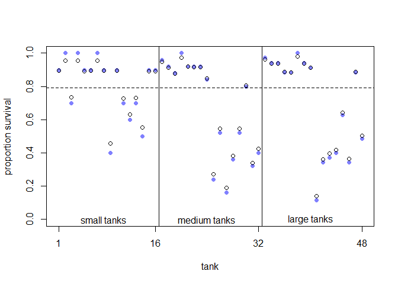<!-- -->


```r
# show first 100 populations in the posterior
plot(
  NULL ,
  xlim = c(-3, 4) ,
  ylim = c(0, 0.35) ,
  xlab = "log-odds survive" ,
  ylab = "Density"
)

for (i in 1:100)
  curve(dnorm(x, post$a_bar[i], post$sigma[i]) ,
        add = TRUE ,
        col = col.alpha("black", 0.2))
```

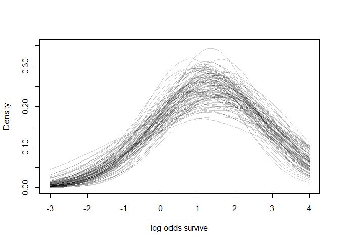<!-- -->

```r
# sample 8000 imaginary tanks from the posterior distribution
sim_tanks <- rnorm(8000 , post$a_bar , post$sigma)

# transform to probability and visualize
dens(inv_logit(sim_tanks) , lwd = 2 , adj = 0.1)
```

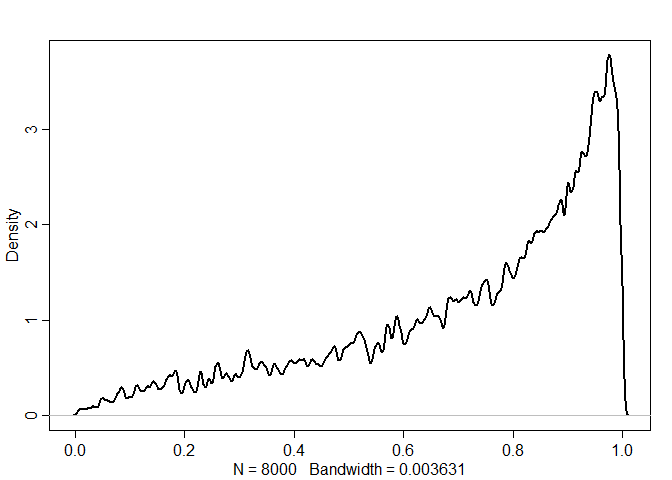<!-- -->

## 13.2. Varying effects and the underfitting/overfitting trade-off
### 13.2.1. The model
### 13.2.2. Assign values to the parameters


```r
a_bar <- 1.5
sigma <- 1.5
nponds <- 60
Ni <- as.integer( rep( c(5,10,25,35) , each=15 ) )
```


```r
set.seed(5005)
a_pond <- rnorm( nponds , mean=a_bar , sd=sigma )
a_pond
```

```
##  [1]  0.56673123  1.99002317 -0.13775688  1.85676651  3.91208800  1.95414869
##  [7]  1.48963805  2.52407196  2.17828010  2.04776578  2.74564559 -0.63722320
## [13]  3.03948315  1.90733694  3.54119394  0.65165674 -1.16943954  0.59568973
## [19]  0.38530177  1.02961242  0.07034006  1.34936971  2.45730258 -0.05251326
## [25]  2.20677386  1.82918746  1.33997120  1.57233138  1.25467353  0.82663309
## [31]  2.65834264  2.08241191  1.50758907  0.86265946  0.22721714  4.61568929
## [37] -1.75144380 -1.03306026  0.23817747  5.35841158  3.84572461  1.81628755
## [43] -0.34267584  0.76111582 -1.55979666 -0.08456073  4.37882074  2.32597649
## [49]  1.78144089  1.86990933  1.58196519  0.15560642  1.50345864  4.49654575
## [55]  0.56518221  2.55806132  0.56742678  2.74606408  1.50422253  2.49737954
```


```r
dsim <- data.frame( pond=1:nponds , Ni=Ni , true_a=a_pond )
head(dsim)
```

```
##   pond Ni     true_a
## 1    1  5  0.5667312
## 2    2  5  1.9900232
## 3    3  5 -0.1377569
## 4    4  5  1.8567665
## 5    5  5  3.9120880
## 6    6  5  1.9541487
```

###  13.2.3. Simulate survivors


```r
dsim$Si <- rbinom( nponds , prob=logistic(dsim$true_a) , size=dsim$Ni )
head(dsim)
```

```
##   pond Ni     true_a Si
## 1    1  5  0.5667312  4
## 2    2  5  1.9900232  5
## 3    3  5 -0.1377569  1
## 4    4  5  1.8567665  5
## 5    5  5  3.9120880  5
## 6    6  5  1.9541487  5
```

### 13.2.4. Compute the no-pooling estimates


```r
dsim$p_nopool <- dsim$Si / dsim$Ni
head(dsim)
```

```
##   pond Ni     true_a Si p_nopool
## 1    1  5  0.5667312  4      0.8
## 2    2  5  1.9900232  5      1.0
## 3    3  5 -0.1377569  1      0.2
## 4    4  5  1.8567665  5      1.0
## 5    5  5  3.9120880  5      1.0
## 6    6  5  1.9541487  5      1.0
```

### 13.2.5. Compute the partial-pooling estimates


```r
dat <- list(Si = dsim$Si ,
            Ni = dsim$Ni ,
            pond = dsim$pond)

m13.3 <- ulam(
  alist(
    Si ~ dbinom(Ni , p),
    logit(p) <- a_pond[pond],
    a_pond[pond] ~ dnorm(a_bar , sigma),
    a_bar ~ dnorm(0 , 1.5),
    sigma ~ dexp(1)
  ),
  data = dat ,
  chains = 4,
  cores = 3
)

precis(m13.3 , depth = 2)
```

```
##                   mean        sd        5.5%       94.5%    n_eff      Rhat
## a_pond[1]   1.66111570 1.0448881  0.08933258  3.40453189 3823.715 0.9991587
## a_pond[2]   2.87958020 1.2808424  0.99004749  5.09506236 3692.212 0.9993657
## a_pond[3]  -0.63555131 0.8939399 -2.12236714  0.74383763 2985.740 0.9990597
## a_pond[4]   2.91087532 1.3127237  0.97215848  5.09321856 2298.642 1.0006633
## a_pond[5]   2.87844145 1.2806454  0.97519040  5.11831352 2954.498 0.9984856
## a_pond[6]   2.87604271 1.2177439  1.05552647  4.95450364 3062.143 0.9989396
## a_pond[7]   0.06231492 0.8425360 -1.27496655  1.41827714 3981.753 0.9989013
## a_pond[8]   2.93179366 1.2916668  1.08083368  5.11292954 2910.188 0.9998007
## a_pond[9]   1.63334356 0.9950475  0.17640558  3.29276195 3474.367 0.9983910
## a_pond[10]  1.64861671 1.0040089  0.16519105  3.33273125 2605.818 1.0008102
## a_pond[11]  2.88598794 1.3076806  1.01516913  5.09907996 2163.977 1.0013677
## a_pond[12]  0.06623442 0.8785104 -1.29167006  1.47599347 4240.158 0.9991261
## a_pond[13]  2.87953142 1.2262030  1.02966507  4.99084176 3483.164 0.9992785
## a_pond[14]  2.89075141 1.3172357  0.98580266  5.22164843 2888.001 0.9984107
## a_pond[15]  2.90306382 1.2675318  1.07064629  4.98121233 3868.620 0.9985295
## a_pond[16]  1.57215593 0.7670109  0.42706474  2.86450371 4612.604 0.9991402
## a_pond[17] -1.45200492 0.7726461 -2.71095752 -0.32117871 3437.554 0.9996658
## a_pond[18]  1.03849743 0.6699546  0.01286656  2.12646504 4395.961 0.9994081
## a_pond[19] -0.96134473 0.6759301 -2.05768254  0.05227626 4125.470 0.9987436
## a_pond[20]  1.56311723 0.7499271  0.44031253  2.85632351 3468.821 0.9991852
## a_pond[21] -0.13169782 0.6216938 -1.12256060  0.85077219 5035.376 0.9988067
## a_pond[22]  2.26171642 0.9011584  0.93141415  3.75588475 3310.066 0.9992951
## a_pond[23]  3.27572901 1.1388764  1.59761496  5.30223784 3176.867 0.9992486
## a_pond[24]  0.62516495 0.6359365 -0.37879625  1.68166763 3081.801 1.0007483
## a_pond[25]  3.26177369 1.1681345  1.60133854  5.34474974 2867.195 1.0000737
## a_pond[26]  2.24616089 0.9142104  0.90120906  3.88044104 3351.673 0.9984271
## a_pond[27]  1.06638635 0.6799714  0.03902116  2.17660068 3694.038 0.9993702
## a_pond[28]  2.26438238 0.9158909  0.93203740  3.85879730 3198.481 0.9989781
## a_pond[29]  1.57214216 0.7462163  0.46734553  2.81728441 3746.944 0.9994346
## a_pond[30]  1.06144581 0.6724961  0.05183590  2.16873985 3708.475 0.9995238
## a_pond[31]  2.49332687 0.7091099  1.43861697  3.73893756 3241.822 0.9988718
## a_pond[32]  2.06757963 0.6119497  1.15188481  3.07687655 3472.907 0.9998570
## a_pond[33]  1.72256597 0.5296681  0.91800727  2.57583523 4397.741 0.9996637
## a_pond[34]  1.24483824 0.4682812  0.53264152  2.02028272 5662.890 0.9988005
## a_pond[35]  0.67084453 0.4230265 -0.01747554  1.35129636 4403.020 0.9988185
## a_pond[36]  3.83745075 1.0587493  2.32707766  5.60023153 2817.127 0.9988925
## a_pond[37] -1.00093881 0.4449205 -1.71686583 -0.30629806 4523.585 0.9986087
## a_pond[38] -1.20422248 0.4613374 -1.98338286 -0.52973732 4085.160 0.9989249
## a_pond[39]  0.65493061 0.4180371 -0.02123506  1.33034651 4090.468 0.9983756
## a_pond[40]  3.87085753 1.0941249  2.32182919  5.78524112 2144.358 0.9994880
## a_pond[41]  3.84917622 1.0749834  2.30996180  5.75636520 2814.172 1.0006371
## a_pond[42]  2.45707757 0.6869919  1.42652387  3.63326586 3633.217 0.9996922
## a_pond[43] -0.14420101 0.4252355 -0.83404005  0.53735452 4827.604 0.9985616
## a_pond[44]  0.67004554 0.4070127  0.02455681  1.32091576 4196.232 0.9994161
## a_pond[45] -1.19967748 0.4734029 -1.99407033 -0.45878364 4651.723 0.9991661
## a_pond[46]  0.01971671 0.3471006 -0.52447435  0.57036772 4115.986 0.9991126
## a_pond[47]  4.10115837 1.0041187  2.68349300  5.87945821 2393.377 1.0021396
## a_pond[48]  2.11039354 0.5121347  1.30047475  2.95419543 4740.663 0.9985320
## a_pond[49]  1.85396328 0.4765872  1.14494701  2.64978723 3865.599 1.0003692
## a_pond[50]  2.78463932 0.6883627  1.76151487  3.95546571 3139.144 0.9989716
## a_pond[51]  2.42380285 0.6352523  1.46670098  3.49313132 3614.454 0.9992378
## a_pond[52]  0.35855646 0.3574032 -0.18785188  0.94203774 5120.891 0.9989477
## a_pond[53]  2.10545047 0.5317848  1.30495749  3.02677638 3597.455 0.9992611
## a_pond[54]  4.05594127 0.9806303  2.68220677  5.76800764 3097.130 0.9988815
## a_pond[55]  1.12748554 0.3967074  0.52143452  1.76837243 4229.688 1.0000304
## a_pond[56]  2.77928986 0.6348048  1.83468342  3.84342633 3082.520 0.9987385
## a_pond[57]  0.71759874 0.3551279  0.14536668  1.29068631 5195.541 0.9984938
## a_pond[58]  4.10384840 1.0732020  2.64136699  6.04983451 1825.827 1.0002676
## a_pond[59]  1.64899980 0.4496064  0.96983831  2.40465146 3571.277 0.9991387
## a_pond[60]  2.40137063 0.5881841  1.53812158  3.43188666 3342.506 0.9988623
## a_bar       1.66838790 0.2470707  1.29247684  2.08262671 2290.941 0.9986284
## sigma       1.68731672 0.2391745  1.35471476  2.09247208 1070.199 1.0023916
```


```r
post <- extract.samples( m13.3 )
dsim$p_partpool <- apply( inv_logit(post$a_pond) , 2 , mean )
```


```r
dsim$p_true <- inv_logit( dsim$true_a )
```


```r
nopool_error <- abs( dsim$p_nopool - dsim$p_true )
partpool_error <- abs( dsim$p_partpool - dsim$p_true )
nopool_avg <- aggregate(nopool_error,list(dsim$Ni),mean)
partpool_avg <- aggregate(partpool_error,list(dsim$Ni),mean)
```


```r
head(dsim)
```

```
##   pond Ni     true_a Si p_nopool p_partpool    p_true
## 1    1  5  0.5667312  4      0.8  0.7987125 0.6380086
## 2    2  5  1.9900232  5      1.0  0.9109500 0.8797456
## 3    3  5 -0.1377569  1      0.2  0.3688441 0.4656151
## 4    4  5  1.8567665  5      1.0  0.9118009 0.8649196
## 5    5  5  3.9120880  5      1.0  0.9111342 0.9803934
## 6    6  5  1.9541487  5      1.0  0.9139780 0.8758983
```


```r
plot(
  1:60 ,
  nopool_error ,
  xlab = "pond" ,
  ylab = "absolute error" ,
  col = rangi2 ,
  pch = 16
)
points(1:60 , partpool_error)
```

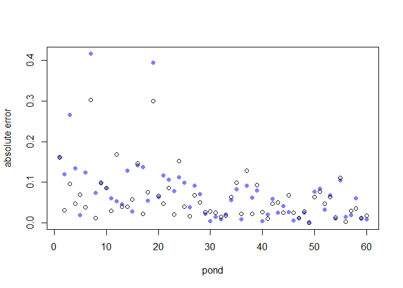<!-- -->

### Overthinking: Repeating the pond simulation


```r
a <- 1.4
sigma <- 1.5
nponds <- 60
Ni <- as.integer(rep(c(5, 10, 25, 35) , each = 15))
a_pond <- rnorm(nponds , mean = a , sd = sigma)
dsim <- data.frame(pond = 1:nponds ,
                   Ni = Ni ,
                   true_a = a_pond)
dsim$Si <-
  rbinom(nponds, prob = inv_logit(dsim$true_a), size = dsim$Ni)
dsim$p_nopool <- dsim$Si / dsim$Ni
newdat <- list(Si = dsim$Si,
               Ni = dsim$Ni,
               pond = 1:nponds)
m13.3new <- stan(fit = m13.3@stanfit ,
                 data = newdat ,
                 chains = 1)
```

```
## 
## SAMPLING FOR MODEL 'dec18dc74da68fd44dec3f986f9d0eb6' NOW (CHAIN 1).
## Chain 1: 
## Chain 1: Gradient evaluation took 0 seconds
## Chain 1: 1000 transitions using 10 leapfrog steps per transition would take 0 seconds.
## Chain 1: Adjust your expectations accordingly!
## Chain 1: 
## Chain 1: 
## Chain 1: Iteration:    1 / 2000 [  0%]  (Warmup)
## Chain 1: Iteration:  200 / 2000 [ 10%]  (Warmup)
## Chain 1: Iteration:  400 / 2000 [ 20%]  (Warmup)
## Chain 1: Iteration:  600 / 2000 [ 30%]  (Warmup)
## Chain 1: Iteration:  800 / 2000 [ 40%]  (Warmup)
## Chain 1: Iteration: 1000 / 2000 [ 50%]  (Warmup)
## Chain 1: Iteration: 1001 / 2000 [ 50%]  (Sampling)
## Chain 1: Iteration: 1200 / 2000 [ 60%]  (Sampling)
## Chain 1: Iteration: 1400 / 2000 [ 70%]  (Sampling)
## Chain 1: Iteration: 1600 / 2000 [ 80%]  (Sampling)
## Chain 1: Iteration: 1800 / 2000 [ 90%]  (Sampling)
## Chain 1: Iteration: 2000 / 2000 [100%]  (Sampling)
## Chain 1: 
## Chain 1:  Elapsed Time: 0.282 seconds (Warm-up)
## Chain 1:                0.295 seconds (Sampling)
## Chain 1:                0.577 seconds (Total)
## Chain 1:
```

```r
post <- extract.samples(m13.3new)
dsim$p_partpool <- apply(inv_logit(post$a_pond) , 2 , mean)
dsim$p_true <- inv_logit(dsim$true_a)
nopool_error <- abs(dsim$p_nopool - dsim$p_true)
partpool_error <- abs(dsim$p_partpool - dsim$p_true)
plot(
  1:60 ,
  nopool_error ,
  xlab = "pond" ,
  ylab = "absolute error" ,
  col = rangi2 ,
  pch = 16
)
points(1:60 , partpool_error)
```

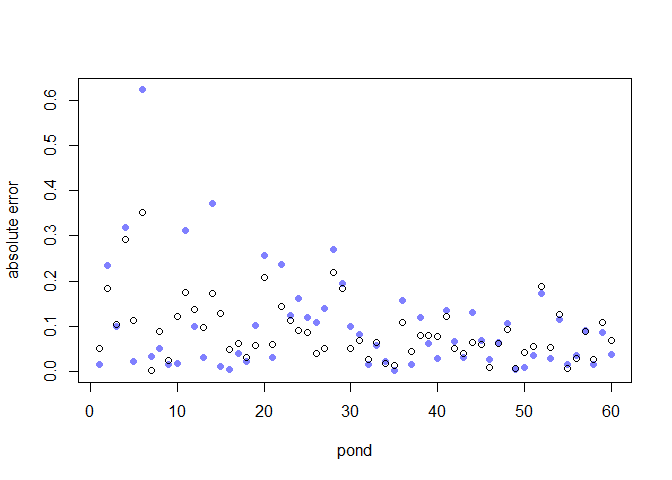<!-- -->

## 13.3. More than one type of cluster
### 13.3.1. Multilevel chimpanzees


```r
data(chimpanzees)
d <- chimpanzees
d$treatment <- 1 + d$prosoc_left + 2 * d$condition
dat_list <- list(
  pulled_left = d$pulled_left,
  actor = d$actor,
  block_id = d$block,
  treatment = as.integer(d$treatment)
)
set.seed(13)
m13.4 <- ulam(
  alist(
    pulled_left ~ dbinom(1 , p) ,
    logit(p) <- a[actor] + g[block_id] + b[treatment],
    b[treatment] ~ dnorm(0 , 0.5),
    # adaptive priors
    a[actor] ~ dnorm(a_bar , sigma_a),
    g[block_id] ~ dnorm(0 , sigma_g),
    # hyper-priors
    a_bar ~ dnorm(0 , 1.5),
    sigma_a ~ dexp(1),
    sigma_g ~ dexp(1)
  ) ,
  data = dat_list ,
  chains = 4 ,
  cores = 4 ,
  log_lik = TRUE
)
```

```
## Warning: There were 11 divergent transitions after warmup. Increasing adapt_delta above 0.95 may help. See
## http://mc-stan.org/misc/warnings.html#divergent-transitions-after-warmup
```

```
## Warning: Examine the pairs() plot to diagnose sampling problems
```

```
## Warning: Bulk Effective Samples Size (ESS) is too low, indicating posterior means and medians may be unreliable.
## Running the chains for more iterations may help. See
## http://mc-stan.org/misc/warnings.html#bulk-ess
```

```
## Warning: Tail Effective Samples Size (ESS) is too low, indicating posterior variances and tail quantiles may be unreliable.
## Running the chains for more iterations may help. See
## http://mc-stan.org/misc/warnings.html#tail-ess
```


```r
precis( m13.4 , depth=2 )
```

```
##                mean        sd        5.5%       94.5%     n_eff      Rhat
## b[1]    -0.13761618 0.2987937 -0.62833157  0.33071927  567.7040 1.0011162
## b[2]     0.40071566 0.3026024 -0.07237953  0.90551732  421.3460 1.0056491
## b[3]    -0.47442655 0.3048942 -0.95916029 -0.00654622  527.3930 1.0015492
## b[4]     0.27706364 0.3012795 -0.20433004  0.75929494  563.7789 1.0021560
## a[1]    -0.34854368 0.3467419 -0.91609719  0.20545685  588.6341 1.0005164
## a[2]     4.68078862 1.2853470  3.08817050  6.95669145  899.7642 1.0019876
## a[3]    -0.65920008 0.3589012 -1.23225609 -0.08968190  595.9737 1.0029643
## a[4]    -0.65913815 0.3595143 -1.24007083 -0.09874568  566.2565 1.0009148
## a[5]    -0.36005811 0.3518891 -0.91049407  0.20265273  546.2888 0.9999561
## a[6]     0.57625969 0.3575601  0.02712736  1.15195446  587.2871 0.9990601
## a[7]     2.10801207 0.4486378  1.40326278  2.83306775  721.8482 1.0005939
## g[1]    -0.15886334 0.2123627 -0.55054964  0.07158739  367.8906 1.0057993
## g[2]     0.03676385 0.1801673 -0.22813517  0.34695003 1118.6875 1.0054016
## g[3]     0.05388687 0.1763409 -0.17845318  0.36446259  864.7474 1.0044332
## g[4]     0.01253884 0.1745521 -0.24420042  0.31570446 1029.4997 1.0042573
## g[5]    -0.02656257 0.1776196 -0.31953977  0.22608688  766.0248 1.0036899
## g[6]     0.09956560 0.1918736 -0.13438675  0.44476526  652.9578 1.0088748
## a_bar    0.64796451 0.7223668 -0.47451515  1.77956702 1010.6937 1.0026922
## sigma_a  2.01393051 0.6575045  1.21221785  3.19478857  901.6711 1.0014803
## sigma_g  0.20104544 0.1641138  0.02086871  0.49725599  215.0521 1.0147900
```

```r
plot( precis(m13.4,depth=2) ) # also plot
```

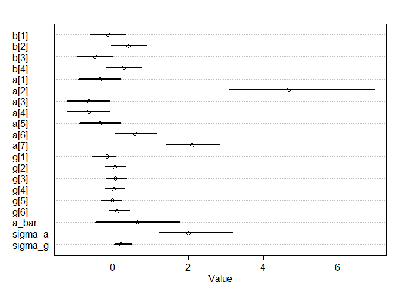<!-- -->


```r
set.seed(14)
m13.5 <- ulam(
  alist(
    pulled_left ~ dbinom(1 , p) ,
    logit(p) <- a[actor] + b[treatment] ,
    b[treatment] ~ dnorm(0 , 0.5),
    a[actor] ~ dnorm(a_bar , sigma_a),
    a_bar ~ dnorm(0 , 1.5),
    sigma_a ~ dexp(1)
  ) ,
  data = dat_list ,
  chains = 4 ,
  cores = 4 ,
  log_lik = TRUE
)

compare(m13.4, m13.5)
```

```
##           WAIC       SE     dWAIC      dSE    pWAIC    weight
## m13.5 531.2631 19.25395 0.0000000       NA  8.56021 0.5887742
## m13.4 531.9809 19.30496 0.7178007 1.569943 10.42258 0.4112258
```

### 13.3.2. Even more clusters


```r
set.seed(15)
m13.6 <- ulam(
  alist(
    pulled_left ~ dbinom(1 , p) ,
    logit(p) <- a[actor] + g[block_id] + b[treatment] ,
    b[treatment] ~ dnorm(0 , sigma_b),
    a[actor] ~ dnorm(a_bar , sigma_a),
    g[block_id] ~ dnorm(0 , sigma_g),
    a_bar ~ dnorm(0 , 1.5),
    sigma_a ~ dexp(1),
    sigma_g ~ dexp(1),
    sigma_b ~ dexp(1)
  ) ,
  data = dat_list ,
  chains = 4 ,
  cores = 4 ,
  log_lik = TRUE
)
```

```
## Warning: There were 9 divergent transitions after warmup. Increasing adapt_delta above 0.95 may help. See
## http://mc-stan.org/misc/warnings.html#divergent-transitions-after-warmup
```

```
## Warning: Examine the pairs() plot to diagnose sampling problems
```

```
## Warning: Bulk Effective Samples Size (ESS) is too low, indicating posterior means and medians may be unreliable.
## Running the chains for more iterations may help. See
## http://mc-stan.org/misc/warnings.html#bulk-ess
```

```
## Warning: Tail Effective Samples Size (ESS) is too low, indicating posterior variances and tail quantiles may be unreliable.
## Running the chains for more iterations may help. See
## http://mc-stan.org/misc/warnings.html#tail-ess
```

```r
coeftab(m13.4, m13.6)
```

```
##         m13.4   m13.6  
## b[1]      -0.14   -0.12
## b[2]       0.40    0.38
## b[3]      -0.47   -0.44
## b[4]       0.28    0.27
## a[1]      -0.35   -0.36
## a[2]       4.68    4.67
## a[3]      -0.66   -0.66
## a[4]      -0.66   -0.67
## a[5]      -0.36   -0.35
## a[6]       0.58    0.59
## a[7]       2.11    2.09
## g[1]      -0.16   -0.18
## g[2]       0.04    0.04
## g[3]       0.05    0.05
## g[4]       0.01    0.00
## g[5]      -0.03   -0.03
## g[6]       0.10    0.11
## a_bar      0.65    0.63
## sigma_a    2.01    2.00
## sigma_g    0.20    0.21
## sigma_b      NA    0.56
## nobs        504     504
```

## 13.4. Divergent transitions and non-centered priors
### 13.4.1. The Devil’s Funnel


```r
m13x <- ulam(
  alist(v ~ normal(0, 3),
        x ~ normal(0, exp(v))),
  data = list(N = 1),
  chains = 4)
```

```
## 
## SAMPLING FOR MODEL 'fff578696261a99633d3513a7b3dd058' NOW (CHAIN 1).
## Chain 1: 
## Chain 1: Gradient evaluation took 0 seconds
## Chain 1: 1000 transitions using 10 leapfrog steps per transition would take 0 seconds.
## Chain 1: Adjust your expectations accordingly!
## Chain 1: 
## Chain 1: 
## Chain 1: Iteration:   1 / 1000 [  0%]  (Warmup)
## Chain 1: Iteration: 100 / 1000 [ 10%]  (Warmup)
## Chain 1: Iteration: 200 / 1000 [ 20%]  (Warmup)
## Chain 1: Iteration: 300 / 1000 [ 30%]  (Warmup)
## Chain 1: Iteration: 400 / 1000 [ 40%]  (Warmup)
## Chain 1: Iteration: 500 / 1000 [ 50%]  (Warmup)
## Chain 1: Iteration: 501 / 1000 [ 50%]  (Sampling)
## Chain 1: Iteration: 600 / 1000 [ 60%]  (Sampling)
## Chain 1: Iteration: 700 / 1000 [ 70%]  (Sampling)
## Chain 1: Iteration: 800 / 1000 [ 80%]  (Sampling)
## Chain 1: Iteration: 900 / 1000 [ 90%]  (Sampling)
## Chain 1: Iteration: 1000 / 1000 [100%]  (Sampling)
## Chain 1: 
## Chain 1:  Elapsed Time: 0.035 seconds (Warm-up)
## Chain 1:                0.035 seconds (Sampling)
## Chain 1:                0.07 seconds (Total)
## Chain 1: 
## 
## SAMPLING FOR MODEL 'fff578696261a99633d3513a7b3dd058' NOW (CHAIN 2).
## Chain 2: 
## Chain 2: Gradient evaluation took 0 seconds
## Chain 2: 1000 transitions using 10 leapfrog steps per transition would take 0 seconds.
## Chain 2: Adjust your expectations accordingly!
## Chain 2: 
## Chain 2: 
## Chain 2: Iteration:   1 / 1000 [  0%]  (Warmup)
## Chain 2: Iteration: 100 / 1000 [ 10%]  (Warmup)
## Chain 2: Iteration: 200 / 1000 [ 20%]  (Warmup)
## Chain 2: Iteration: 300 / 1000 [ 30%]  (Warmup)
## Chain 2: Iteration: 400 / 1000 [ 40%]  (Warmup)
## Chain 2: Iteration: 500 / 1000 [ 50%]  (Warmup)
## Chain 2: Iteration: 501 / 1000 [ 50%]  (Sampling)
## Chain 2: Iteration: 600 / 1000 [ 60%]  (Sampling)
## Chain 2: Iteration: 700 / 1000 [ 70%]  (Sampling)
## Chain 2: Iteration: 800 / 1000 [ 80%]  (Sampling)
## Chain 2: Iteration: 900 / 1000 [ 90%]  (Sampling)
## Chain 2: Iteration: 1000 / 1000 [100%]  (Sampling)
## Chain 2: 
## Chain 2:  Elapsed Time: 0.031 seconds (Warm-up)
## Chain 2:                0.022 seconds (Sampling)
## Chain 2:                0.053 seconds (Total)
## Chain 2: 
## 
## SAMPLING FOR MODEL 'fff578696261a99633d3513a7b3dd058' NOW (CHAIN 3).
## Chain 3: 
## Chain 3: Gradient evaluation took 0 seconds
## Chain 3: 1000 transitions using 10 leapfrog steps per transition would take 0 seconds.
## Chain 3: Adjust your expectations accordingly!
## Chain 3: 
## Chain 3: 
## Chain 3: Iteration:   1 / 1000 [  0%]  (Warmup)
## Chain 3: Iteration: 100 / 1000 [ 10%]  (Warmup)
## Chain 3: Iteration: 200 / 1000 [ 20%]  (Warmup)
## Chain 3: Iteration: 300 / 1000 [ 30%]  (Warmup)
## Chain 3: Iteration: 400 / 1000 [ 40%]  (Warmup)
## Chain 3: Iteration: 500 / 1000 [ 50%]  (Warmup)
## Chain 3: Iteration: 501 / 1000 [ 50%]  (Sampling)
## Chain 3: Iteration: 600 / 1000 [ 60%]  (Sampling)
## Chain 3: Iteration: 700 / 1000 [ 70%]  (Sampling)
## Chain 3: Iteration: 800 / 1000 [ 80%]  (Sampling)
## Chain 3: Iteration: 900 / 1000 [ 90%]  (Sampling)
## Chain 3: Iteration: 1000 / 1000 [100%]  (Sampling)
## Chain 3: 
## Chain 3:  Elapsed Time: 0.062 seconds (Warm-up)
## Chain 3:                0.088 seconds (Sampling)
## Chain 3:                0.15 seconds (Total)
## Chain 3: 
## 
## SAMPLING FOR MODEL 'fff578696261a99633d3513a7b3dd058' NOW (CHAIN 4).
## Chain 4: 
## Chain 4: Gradient evaluation took 0 seconds
## Chain 4: 1000 transitions using 10 leapfrog steps per transition would take 0 seconds.
## Chain 4: Adjust your expectations accordingly!
## Chain 4: 
## Chain 4: 
## Chain 4: Iteration:   1 / 1000 [  0%]  (Warmup)
## Chain 4: Iteration: 100 / 1000 [ 10%]  (Warmup)
## Chain 4: Iteration: 200 / 1000 [ 20%]  (Warmup)
## Chain 4: Iteration: 300 / 1000 [ 30%]  (Warmup)
## Chain 4: Iteration: 400 / 1000 [ 40%]  (Warmup)
## Chain 4: Iteration: 500 / 1000 [ 50%]  (Warmup)
## Chain 4: Iteration: 501 / 1000 [ 50%]  (Sampling)
## Chain 4: Iteration: 600 / 1000 [ 60%]  (Sampling)
## Chain 4: Iteration: 700 / 1000 [ 70%]  (Sampling)
## Chain 4: Iteration: 800 / 1000 [ 80%]  (Sampling)
## Chain 4: Iteration: 900 / 1000 [ 90%]  (Sampling)
## Chain 4: Iteration: 1000 / 1000 [100%]  (Sampling)
## Chain 4: 
## Chain 4:  Elapsed Time: 0.033 seconds (Warm-up)
## Chain 4:                0.023 seconds (Sampling)
## Chain 4:                0.056 seconds (Total)
## Chain 4:
```

```
## Warning: There were 50 divergent transitions after warmup. Increasing adapt_delta above 0.95 may help. See
## http://mc-stan.org/misc/warnings.html#divergent-transitions-after-warmup
```

```
## Warning: Examine the pairs() plot to diagnose sampling problems
```

```
## Warning: The largest R-hat is 1.19, indicating chains have not mixed.
## Running the chains for more iterations may help. See
## http://mc-stan.org/misc/warnings.html#r-hat
```

```
## Warning: Bulk Effective Samples Size (ESS) is too low, indicating posterior means and medians may be unreliable.
## Running the chains for more iterations may help. See
## http://mc-stan.org/misc/warnings.html#bulk-ess
```

```
## Warning: Tail Effective Samples Size (ESS) is too low, indicating posterior variances and tail quantiles may be unreliable.
## Running the chains for more iterations may help. See
## http://mc-stan.org/misc/warnings.html#tail-ess
```

```r
precis(m13x)
```

```
##       mean         sd       5.5%     94.5%    n_eff     Rhat
## v 1.788473   1.790886  -1.101687  4.724127 22.74029 1.189305
## x 7.876515 133.234694 -48.204000 26.888076 82.68750 1.056487
```

```r
traceplot(m13x)
```

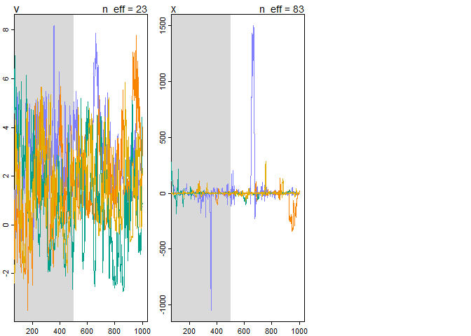<!-- -->


```r
m13y <- ulam(
  alist(v ~ normal(0, 3),
        z ~ normal(0, 1),
        gq> real[1]:x <<- z * exp(v)),
  data = list(N = 1) ,
  chains = 4
)
```

```
## 
## SAMPLING FOR MODEL '4a42b40d41299fdf0f9cfa79945a92b4' NOW (CHAIN 1).
## Chain 1: 
## Chain 1: Gradient evaluation took 0 seconds
## Chain 1: 1000 transitions using 10 leapfrog steps per transition would take 0 seconds.
## Chain 1: Adjust your expectations accordingly!
## Chain 1: 
## Chain 1: 
## Chain 1: Iteration:   1 / 1000 [  0%]  (Warmup)
## Chain 1: Iteration: 100 / 1000 [ 10%]  (Warmup)
## Chain 1: Iteration: 200 / 1000 [ 20%]  (Warmup)
## Chain 1: Iteration: 300 / 1000 [ 30%]  (Warmup)
## Chain 1: Iteration: 400 / 1000 [ 40%]  (Warmup)
## Chain 1: Iteration: 500 / 1000 [ 50%]  (Warmup)
## Chain 1: Iteration: 501 / 1000 [ 50%]  (Sampling)
## Chain 1: Iteration: 600 / 1000 [ 60%]  (Sampling)
## Chain 1: Iteration: 700 / 1000 [ 70%]  (Sampling)
## Chain 1: Iteration: 800 / 1000 [ 80%]  (Sampling)
## Chain 1: Iteration: 900 / 1000 [ 90%]  (Sampling)
## Chain 1: Iteration: 1000 / 1000 [100%]  (Sampling)
## Chain 1: 
## Chain 1:  Elapsed Time: 0.015 seconds (Warm-up)
## Chain 1:                0.01 seconds (Sampling)
## Chain 1:                0.025 seconds (Total)
## Chain 1: 
## 
## SAMPLING FOR MODEL '4a42b40d41299fdf0f9cfa79945a92b4' NOW (CHAIN 2).
## Chain 2: 
## Chain 2: Gradient evaluation took 0 seconds
## Chain 2: 1000 transitions using 10 leapfrog steps per transition would take 0 seconds.
## Chain 2: Adjust your expectations accordingly!
## Chain 2: 
## Chain 2: 
## Chain 2: Iteration:   1 / 1000 [  0%]  (Warmup)
## Chain 2: Iteration: 100 / 1000 [ 10%]  (Warmup)
## Chain 2: Iteration: 200 / 1000 [ 20%]  (Warmup)
## Chain 2: Iteration: 300 / 1000 [ 30%]  (Warmup)
## Chain 2: Iteration: 400 / 1000 [ 40%]  (Warmup)
## Chain 2: Iteration: 500 / 1000 [ 50%]  (Warmup)
## Chain 2: Iteration: 501 / 1000 [ 50%]  (Sampling)
## Chain 2: Iteration: 600 / 1000 [ 60%]  (Sampling)
## Chain 2: Iteration: 700 / 1000 [ 70%]  (Sampling)
## Chain 2: Iteration: 800 / 1000 [ 80%]  (Sampling)
## Chain 2: Iteration: 900 / 1000 [ 90%]  (Sampling)
## Chain 2: Iteration: 1000 / 1000 [100%]  (Sampling)
## Chain 2: 
## Chain 2:  Elapsed Time: 0.011 seconds (Warm-up)
## Chain 2:                0.009 seconds (Sampling)
## Chain 2:                0.02 seconds (Total)
## Chain 2: 
## 
## SAMPLING FOR MODEL '4a42b40d41299fdf0f9cfa79945a92b4' NOW (CHAIN 3).
## Chain 3: 
## Chain 3: Gradient evaluation took 0 seconds
## Chain 3: 1000 transitions using 10 leapfrog steps per transition would take 0 seconds.
## Chain 3: Adjust your expectations accordingly!
## Chain 3: 
## Chain 3: 
## Chain 3: Iteration:   1 / 1000 [  0%]  (Warmup)
## Chain 3: Iteration: 100 / 1000 [ 10%]  (Warmup)
## Chain 3: Iteration: 200 / 1000 [ 20%]  (Warmup)
## Chain 3: Iteration: 300 / 1000 [ 30%]  (Warmup)
## Chain 3: Iteration: 400 / 1000 [ 40%]  (Warmup)
## Chain 3: Iteration: 500 / 1000 [ 50%]  (Warmup)
## Chain 3: Iteration: 501 / 1000 [ 50%]  (Sampling)
## Chain 3: Iteration: 600 / 1000 [ 60%]  (Sampling)
## Chain 3: Iteration: 700 / 1000 [ 70%]  (Sampling)
## Chain 3: Iteration: 800 / 1000 [ 80%]  (Sampling)
## Chain 3: Iteration: 900 / 1000 [ 90%]  (Sampling)
## Chain 3: Iteration: 1000 / 1000 [100%]  (Sampling)
## Chain 3: 
## Chain 3:  Elapsed Time: 0.01 seconds (Warm-up)
## Chain 3:                0.009 seconds (Sampling)
## Chain 3:                0.019 seconds (Total)
## Chain 3: 
## 
## SAMPLING FOR MODEL '4a42b40d41299fdf0f9cfa79945a92b4' NOW (CHAIN 4).
## Chain 4: 
## Chain 4: Gradient evaluation took 0 seconds
## Chain 4: 1000 transitions using 10 leapfrog steps per transition would take 0 seconds.
## Chain 4: Adjust your expectations accordingly!
## Chain 4: 
## Chain 4: 
## Chain 4: Iteration:   1 / 1000 [  0%]  (Warmup)
## Chain 4: Iteration: 100 / 1000 [ 10%]  (Warmup)
## Chain 4: Iteration: 200 / 1000 [ 20%]  (Warmup)
## Chain 4: Iteration: 300 / 1000 [ 30%]  (Warmup)
## Chain 4: Iteration: 400 / 1000 [ 40%]  (Warmup)
## Chain 4: Iteration: 500 / 1000 [ 50%]  (Warmup)
## Chain 4: Iteration: 501 / 1000 [ 50%]  (Sampling)
## Chain 4: Iteration: 600 / 1000 [ 60%]  (Sampling)
## Chain 4: Iteration: 700 / 1000 [ 70%]  (Sampling)
## Chain 4: Iteration: 800 / 1000 [ 80%]  (Sampling)
## Chain 4: Iteration: 900 / 1000 [ 90%]  (Sampling)
## Chain 4: Iteration: 1000 / 1000 [100%]  (Sampling)
## Chain 4: 
## Chain 4:  Elapsed Time: 0.01 seconds (Warm-up)
## Chain 4:                0.009 seconds (Sampling)
## Chain 4:                0.019 seconds (Total)
## Chain 4:
```

```r
precis(m13y)
```

```
##           mean         sd       5.5%     94.5%    n_eff      Rhat
## v -0.004837237   2.986358  -4.721583  4.782778 1451.434 1.0002226
## z -0.026031294   1.020832  -1.641904  1.636944 1300.617 1.0002317
## x  0.079432313 280.013449 -23.859800 22.795624 1606.695 0.9994503
```

```r
traceplot(m13y)
```

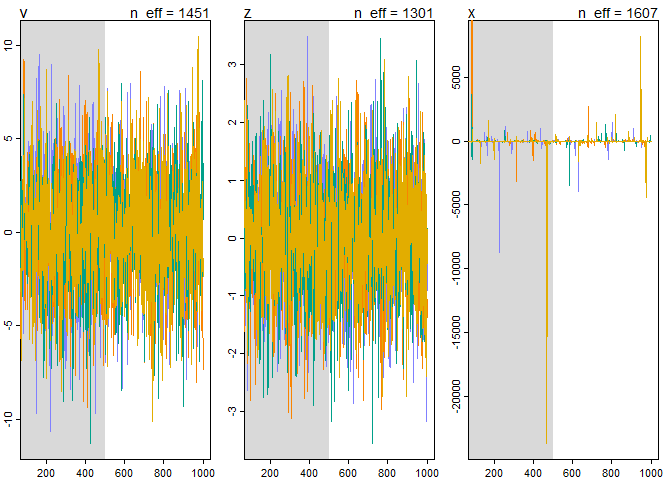<!-- -->

### 13.4.2. Non-centered chimpanzees


```r
set.seed(13)
m13.4b <- ulam( m13.4 , chains=4 , cores=4 , control=list(adapt_delta=0.99) )
```

```
## Warning: There were 1 divergent transitions after warmup. Increasing adapt_delta above 0.99 may help. See
## http://mc-stan.org/misc/warnings.html#divergent-transitions-after-warmup
```

```
## Warning: Examine the pairs() plot to diagnose sampling problems
```

```
## Warning: Bulk Effective Samples Size (ESS) is too low, indicating posterior means and medians may be unreliable.
## Running the chains for more iterations may help. See
## http://mc-stan.org/misc/warnings.html#bulk-ess
```

```
## Warning: Tail Effective Samples Size (ESS) is too low, indicating posterior variances and tail quantiles may be unreliable.
## Running the chains for more iterations may help. See
## http://mc-stan.org/misc/warnings.html#tail-ess
```

```r
divergent(m13.4b)
```

```
## [1] 1
```

```r
precis(m13.4b, depth = 2)
```

```
##                  mean        sd        5.5%        94.5%     n_eff     Rhat
## b[1]    -0.1515985824 0.3026394 -0.62689721  0.352811407  292.3896 1.008862
## b[2]     0.3743728602 0.3110571 -0.12426489  0.869730560  316.2988 1.008258
## b[3]    -0.4939249446 0.3087097 -0.97200008 -0.009282497  344.6304 1.010761
## b[4]     0.2533228050 0.3078217 -0.24741854  0.752636033  314.5790 1.009638
## a[1]    -0.3260706511 0.3632994 -0.90155241  0.267881456  366.1901 1.006649
## a[2]     4.6344495294 1.2520546  3.06489549  6.644391467  535.4254 1.006648
## a[3]    -0.6334353067 0.3726751 -1.25041351 -0.045220938  366.1440 1.005370
## a[4]    -0.6283635696 0.3729380 -1.21626274 -0.029932429  379.6565 1.005124
## a[5]    -0.3313207581 0.3740528 -0.93583402  0.270865174  330.9064 1.005583
## a[6]     0.5992923201 0.3674089  0.03052946  1.187865830  345.7580 1.007509
## a[7]     2.1156450958 0.4328084  1.42075719  2.832543703  530.5135 1.003415
## g[1]    -0.1471159784 0.2062091 -0.54450451  0.070984625  237.2519 1.019542
## g[2]     0.0309040300 0.1543602 -0.18812420  0.307502144 1080.6376 1.003327
## g[3]     0.0403444801 0.1612763 -0.19032609  0.321284646  868.8385 1.001643
## g[4]     0.0006422659 0.1525704 -0.24741082  0.243783656  985.2646 1.008071
## g[5]    -0.0272058397 0.1674482 -0.30321223  0.212531576  806.8402 1.003203
## g[6]     0.0965890689 0.1810305 -0.10808411  0.446489846  628.6468 1.003518
## a_bar    0.6243459997 0.6681623 -0.42052919  1.737675883 1041.9616 1.004547
## sigma_a  1.9857287436 0.6353009  1.20073436  3.126194231  799.8087 1.005578
## sigma_g  0.1866137158 0.1688486  0.01330048  0.491336721  136.5628 1.022608
```


```r
set.seed(13)
m13.4nc <- ulam(
  alist(
    pulled_left ~ dbinom(1 , p) ,
    logit(p) <- a_bar + z[actor] * sigma_a + # actor intercepts
      x[block_id] * sigma_g + # block intercepts
      b[treatment] ,
    b[treatment] ~ dnorm(0 , 0.5),
    z[actor] ~ dnorm(0 , 1),
    x[block_id] ~ dnorm(0 , 1),
    a_bar ~ dnorm(0 , 1.5),
    sigma_a ~ dexp(1),
    sigma_g ~ dexp(1)
  ) ,
  data = dat_list ,
  chains = 4 ,
  cores = 4
)
 precis(m13.4nc, depth = 2)
```

```
##                mean        sd        5.5%        94.5%     n_eff      Rhat
## b[1]    -0.12053356 0.2990875 -0.59722686  0.376433257 1221.3631 0.9998869
## b[2]     0.39896619 0.2952094 -0.08809433  0.873484216 1187.6774 1.0006576
## b[3]    -0.46941200 0.2980256 -0.94895427 -0.007375761 1232.6536 1.0001779
## b[4]     0.29205220 0.2942646 -0.16840703  0.767354924 1227.9127 1.0024441
## z[1]    -0.50568545 0.3882177 -1.16212201  0.069744704  524.0496 1.0045991
## z[2]     2.14755555 0.6578738  1.16907281  3.290180826  871.0187 1.0021725
## z[3]    -0.67668084 0.4087735 -1.37532537 -0.075935345  527.5824 1.0045750
## z[4]    -0.67219335 0.4068471 -1.37717254 -0.058091186  524.2787 1.0049087
## z[5]    -0.50670338 0.3811374 -1.15568982  0.064368775  525.0442 1.0037783
## z[6]     0.01468028 0.3706608 -0.57756841  0.624650893  553.4132 1.0064157
## z[7]     0.84985557 0.4721342  0.17416311  1.618201408  548.2956 1.0081345
## x[1]    -0.67411074 0.9552829 -2.18959702  0.929082736 1313.5751 0.9991543
## x[2]     0.16000162 0.8035935 -1.10774246  1.468149094 1754.3314 1.0006327
## x[3]     0.21444116 0.8529591 -1.17152517  1.529595401 2023.0290 0.9992749
## x[4]     0.03954227 0.8446737 -1.35331912  1.391965277 1873.7575 0.9995858
## x[5]    -0.11230452 0.8524690 -1.42158589  1.250839935 2086.0416 0.9994155
## x[6]     0.45287269 0.8895672 -1.00232607  1.852293001 1497.9394 1.0000295
## a_bar    0.55770979 0.7027752 -0.55933160  1.681843319  564.2117 1.0044594
## sigma_a  1.97481683 0.6173385  1.18881874  3.132977837  601.0006 1.0121117
## sigma_g  0.20267484 0.1699682  0.01325789  0.518540309  887.5431 1.0002383
```


```r
neff_c <- precis( m13.4 , depth=2 )[['n_eff']]
neff_nc <- precis( m13.4nc , depth=2 )[['n_eff']]
par_names <- rownames( precis( m13.4 , depth=2 ) )

neff_table <- cbind( neff_c , neff_nc )
rownames(neff_table) <- par_names
round(t(neff_table))
```

```
##         b[1] b[2] b[3] b[4] a[1] a[2] a[3] a[4] a[5] a[6] a[7] g[1] g[2] g[3]
## neff_c   568  421  527  564  589  900  596  566  546  587  722  368 1119  865
## neff_nc 1221 1188 1233 1228  524  871  528  524  525  553  548 1314 1754 2023
##         g[4] g[5] g[6] a_bar sigma_a sigma_g
## neff_c  1029  766  653  1011     902     215
## neff_nc 1874 2086 1498   564     601     888
```

## 13.5. Multilevel posterior predictions
### 13.5.1. Posterior prediction for same clusters


```r
chimp <- 2
d_pred <- list(
  actor = rep(chimp, 4),
  treatment = 1:4,
  block_id = rep(1, 4)
)
p <- link(m13.4 , data = d_pred)
p_mu <- apply(p , 2 , mean)
p_ci <- apply(p , 2 , PI)

p_mu
```

```
## [1] 0.9788215 0.9873816 0.9710826 0.9858573
```

```r
p_ci
```

```
##          [,1]      [,2]      [,3]      [,4]
## 5%  0.9403629 0.9642197 0.9176153 0.9613312
## 94% 0.9988730 0.9992970 0.9982282 0.9991940
```

```r
plot(
  NULL ,
  xlab = "treatment" ,
  ylab = "proportion pulled left" ,
  ylim = c(0, 1) ,
  xaxt = "n" ,
  xlim = c(1, 4)
)
axis(1 ,
     at = 1:4 ,
     labels = c("R/N", "L/N", "R/P", "L/P"))
lines(1:4 , p_mu)
shade(p_ci , 1:4)
```

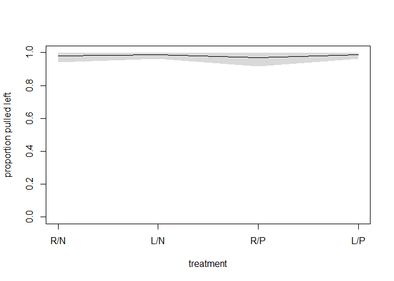<!-- -->


```r
post <- extract.samples(m13.4)
str(post)
```

```
## List of 6
##  $ b      : num [1:2000, 1:4] 0.0654 -0.1263 -0.2501 0.018 0.2719 ...
##  $ a      : num [1:2000, 1:7] -1.0212 -0.3754 -0.3763 0.0977 -0.6306 ...
##  $ g      : num [1:2000, 1:6] -0.17902 -0.27259 -0.29179 -0.78947 0.00538 ...
##  $ a_bar  : num [1:2000(1d)] 0.291 -1.092 0.408 1.677 1.969 ...
##  $ sigma_a: num [1:2000(1d)] 2.87 3.24 1.48 2.22 2.11 ...
##  $ sigma_g: num [1:2000(1d)] 0.1185 0.2833 0.2253 0.5568 0.0176 ...
##  - attr(*, "source")= chr "ulam posterior: 2000 samples from m13.4"
```


```r
dens( post$a[,5] )
```

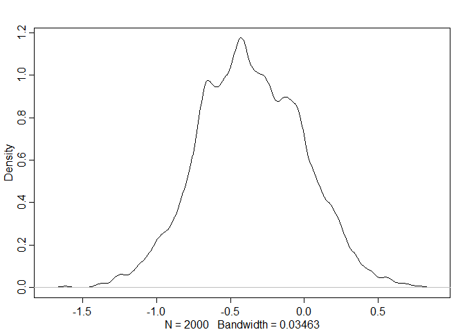<!-- -->

```r
dens( post$a[,2] )
```

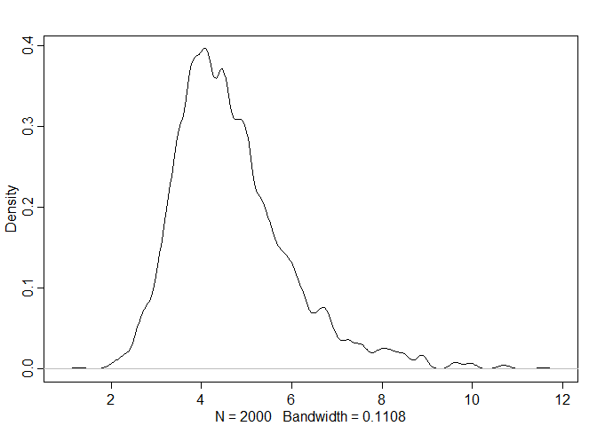<!-- -->

```r
dens( post$a[,7] )
```

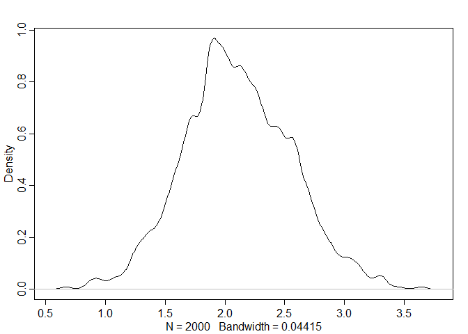<!-- -->

```r
par(mfrow = c(1,1))
```


```r
p_link <- function(treatment ,
                   actor = 1 ,
                   block_id = 1) {
  logodds <- with(post ,
                  a[, actor] + g[, block_id] + b[, treatment])
  return(inv_logit(logodds))
}
```


```r
p_raw <- sapply( 1:4 , function(i) p_link( i , actor=1 , block_id=1 ) )
p_mu <- apply( p_raw , 2 , mean )
p_ci <- apply( p_raw , 2 , PI )

p_mu
```

```
## [1] 0.3484657 0.4741125 0.2782940 0.4444892
```

```r
p_ci
```

```
##          [,1]      [,2]      [,3]      [,4]
## 5%  0.2254002 0.3375366 0.1719350 0.3067562
## 94% 0.4717464 0.6084619 0.3991107 0.5740247
```

```r
plot(
  NULL ,
  xlab = "treatment" ,
  ylab = "proportion pulled left" ,
  ylim = c(0, 1) ,
  xaxt = "n" ,
  xlim = c(1, 4)
)
axis(1 ,
     at = 1:4 ,
     labels = c("R/N", "L/N", "R/P", "L/P"))
lines(1:4 , p_mu)
shade(p_ci , 1:4)
```

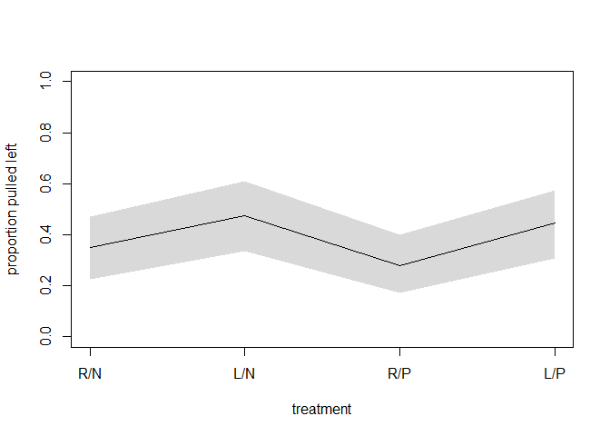<!-- -->

### 13.5.2. Posterior prediction for new clusters


```r
p_link_abar <- function(treatment) {
  logodds <- with(post , a_bar + b[, treatment])
  return(inv_logit(logodds))
}
```


```r
p_raw <- sapply(1:4 , function(i) p_link_abar(i))

p_mu <- apply(p_raw , 2 , mean)
p_ci <- apply(p_raw , 2 , PI)

plot(
  NULL ,
  xlab = "treatment" ,
  ylab = "proportion pulled left" ,
  ylim = c(0, 1) ,
  xaxt = "n" ,
  xlim = c(1, 4)
)
axis(1 ,
     at = 1:4 ,
     labels = c("R/N", "L/N", "R/P", "L/P"))
lines(1:4 , p_mu)
shade(p_ci , 1:4)
```

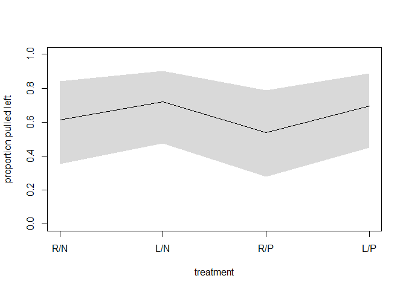<!-- -->


```r
a_sim <- with(post , rnorm(length(post$a_bar) , a_bar , sigma_a))
p_link_asim <- function(treatment) {
  logodds <- with(post , a_sim + b[, treatment])
  return(inv_logit(logodds))
}
p_raw_asim <- sapply(1:4 , function(i) p_link_asim(i))

p_mu_asim <- apply(p_raw_asim , 2 , mean)
p_ci_asim <- apply(p_raw_asim , 2 , PI)

plot(
  NULL ,
  xlab = "treatment" ,
  ylab = "proportion pulled left" ,
  ylim = c(0, 1) ,
  xaxt = "n" ,
  xlim = c(1, 4)
)
axis(1 ,
     at = 1:4 ,
     labels = c("R/N", "L/N", "R/P", "L/P"))
lines(1:4 , p_mu_asim)
shade(p_ci_asim , 1:4)
```

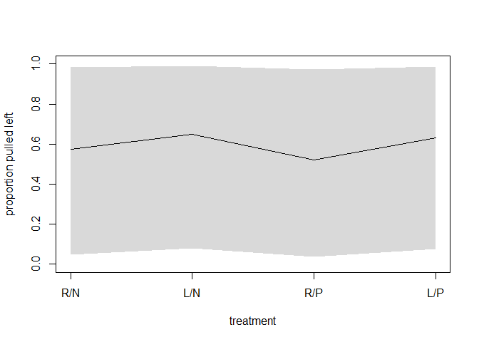<!-- -->


```r
plot(
  NULL ,
  xlab = "treatment" ,
  ylab = "proportion pulled left" ,
  ylim = c(0, 1) ,
  xaxt = "n" ,
  xlim = c(1, 4)
)
axis(1 ,
     at = 1:4 ,
     labels = c("R/N", "L/N", "R/P", "L/P"))
for (i in 1:100){
  lines(1:4 ,
        p_raw_asim[i, ] ,
        col = col.alpha("black", 0.25) ,
        lwd = 2)
}
```

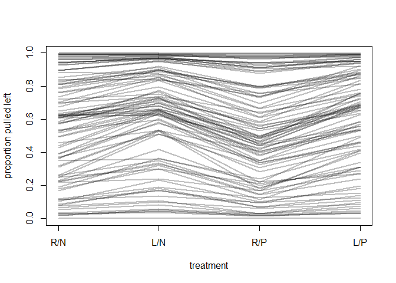<!-- -->

