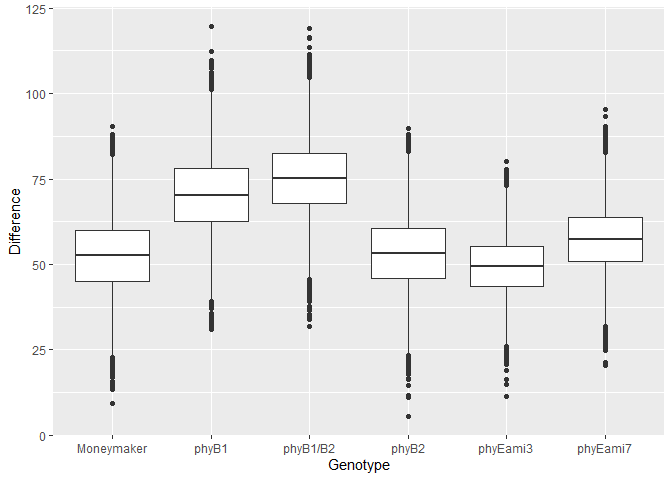

```r
library(tidyverse)
library(rethinking)
```

Please find attached csv.  This csv has measurements of tomato internodes and petioles from wildtype (Moneymaker) and various phytochrome mutant lines.  Measurements were made at 3 time points, 21, 28, and 35 days after germination under two treatments, simulated sun and simulated shade.

for today let's focus on day 35.  Also let's focus on total stem length.  So: first


```r
dat <- read.csv("figure4phyE.csv")
head(dat)
```

```
##   genotype treatment flat day   epi  int1  int2  int3  pet1  pet2  pet3  pet4
## 1 phyB1/B2     shade    1  21 24.03  3.18  0.00  0.00 14.11  4.88  0.00  0.00
## 2 phyB1/B2     shade    1  28 47.37 21.67 11.27  3.13 31.05 26.81 11.10  2.61
## 3 phyB1/B2     shade    1  35 58.83 40.60 72.29 52.70 42.15 49.60 49.58 30.49
## 4 phyB1/B2     shade    1  21 29.85  2.39  2.41  0.00 14.44 11.55  0.00  0.00
## 5 phyB1/B2     shade    1  28 59.69  3.36 25.52  6.62 35.10 29.15 20.05  9.39
## 6 phyB1/B2     shade    1  35 69.55  4.91 56.64 35.52 49.81 34.65 47.58 40.54
```


## Q1)

  a) subset the data for day 35
  

```r
dat_35 <- dat %>%
  filter(day == 35)
```

  b) create a new column "stem_length" that is the sum of epi, int1, int2, and int3
  

```r
dat_35$stem_length <- dat_35$epi + dat_35$int1 + dat_35$int2 + dat_35$int3
```

  c) although flats are listed as 1-6, flats in sun and shade are separate. Create a new column "flat2" that corrects for this.

Ultimately you want to know if any of the mutants have a different length from Moneymaker, in sun or in shade, or if the response to shade differs.


```r
dat_35$flat2 <- paste(dat_35$treatment, dat_35$flat, sep = "_")

dat_35_list <- list(
  G = as.integer(dat_35$genotype),
  T = ifelse(dat_35$treatment == "sun", 0L, 1L),
  F = as.integer(as.factor(dat_35$flat2)),
  L = dat_35$stem_length
)

str(dat_35_list)
```

```
## List of 4
##  $ G: int [1:88] 3 3 3 3 3 3 3 3 3 3 ...
##  $ T: int [1:88] 1 1 1 1 1 1 0 0 0 0 ...
##  $ F: int [1:88] 1 1 2 3 3 5 7 7 8 9 ...
##  $ L: num [1:88] 224 167 224 196 258 ...
```

```r
summary(dat_35)
```

```
##        genotype  treatment       flat            day          epi       
##  Moneymaker:12   shade:48   Min.   :1.000   Min.   :35   Min.   :10.94  
##  phyB1     :12   sun  :40   1st Qu.:2.000   1st Qu.:35   1st Qu.:29.08  
##  phyB1/B2  :12              Median :3.000   Median :35   Median :37.36  
##  phyB2     :12              Mean   :3.455   Mean   :35   Mean   :41.40  
##  phyEami3  :21              3rd Qu.:5.000   3rd Qu.:35   3rd Qu.:50.62  
##  phyEami7  :19              Max.   :6.000   Max.   :35   Max.   :87.74  
##       int1            int2             int3            pet1      
##  Min.   : 3.02   Min.   : 10.75   Min.   : 8.79   Min.   :32.52  
##  1st Qu.:28.01   1st Qu.: 23.95   1st Qu.:15.98   1st Qu.:51.14  
##  Median :35.12   Median : 36.20   Median :24.72   Median :60.62  
##  Mean   :36.50   Mean   : 38.50   Mean   :24.85   Mean   :60.26  
##  3rd Qu.:45.85   3rd Qu.: 48.99   3rd Qu.:31.67   3rd Qu.:68.91  
##  Max.   :71.27   Max.   :104.74   Max.   :56.70   Max.   :91.87  
##       pet2            pet3            pet4        stem_length    
##  Min.   : 0.00   Min.   :18.52   Min.   :10.83   Min.   : 51.71  
##  1st Qu.:53.29   1st Qu.:49.33   1st Qu.:27.41   1st Qu.: 96.17  
##  Median :65.34   Median :58.30   Median :34.99   Median :146.36  
##  Mean   :65.52   Mean   :60.12   Mean   :36.29   Mean   :141.24  
##  3rd Qu.:79.04   3rd Qu.:71.24   3rd Qu.:43.87   3rd Qu.:168.32  
##  Max.   :96.23   Max.   :98.57   Max.   :72.12   Max.   :264.39  
##     flat2          
##  Length:88         
##  Class :character  
##  Mode  :character  
##                    
##                    
## 
```


## Q2) Fit 3 models, all of which include genotype and treatment

  a) do not include flat


```r
m_1 <- ulam(
  alist(
    L ~ dnorm(mu, sigma),
    mu <- a[G] + bT*T + bGT[G]*T,
    a[G] ~ dnorm(145, 50),
    bT ~ dnorm(0, 25),
    bGT[G] ~ dnorm(0, 25),
    sigma ~ dexp(1)
  ),
  data = dat_35_list ,
  chains = 4 ,
  log_lik = TRUE,
  cores = 4
)
```

  b) include flat without pooling


```r
m_2 <- ulam(
  alist(
    L ~ dnorm(mu, sigma),
    mu <- a[G] + bT*T + bGT[G]*T + bF[F],
    a[G] ~ dnorm(145, 50),
    bT ~ dnorm(0, 25),
    bGT[G] ~ dnorm(0, 25),
    bF[F] ~ dnorm(0,2),
    sigma ~ dexp(1)
  ),
  data = dat_35_list ,
  chains = 4 ,
  log_lik = TRUE,
  cores = 4
)
```

  c) use a hierarchical model that allows partial pooling across flats


```r
m_3 <- ulam(
  alist(
    L ~ dnorm(mu, sigma),
    mu <- a[G] + bT*T + bGT[G]*T + bF[F],
    a[G] ~ dnorm(145, 50),
    bT ~ dnorm(0, 25),
    bGT[G] ~ dnorm(0, 25),
    bF[F] ~ dnorm(f_bar, sigma_f),
    f_bar ~ dnorm(0,2),
    sigma_f ~ dexp(1),
    sigma ~ dexp(1)
  ),
  data = dat_35_list ,
  chains = 4 ,
  log_lik = TRUE,
  cores = 4
)
```

```
## Warning: There were 65 divergent transitions after warmup. Increasing adapt_delta above 0.95 may help. See
## http://mc-stan.org/misc/warnings.html#divergent-transitions-after-warmup
```

```
## Warning: There were 1 chains where the estimated Bayesian Fraction of Missing Information was low. See
## http://mc-stan.org/misc/warnings.html#bfmi-low
```

```
## Warning: Examine the pairs() plot to diagnose sampling problems
```

```
## Warning: The largest R-hat is 1.13, indicating chains have not mixed.
## Running the chains for more iterations may help. See
## http://mc-stan.org/misc/warnings.html#r-hat
```

```
## Warning: Bulk Effective Samples Size (ESS) is too low, indicating posterior means and medians may be unreliable.
## Running the chains for more iterations may help. See
## http://mc-stan.org/misc/warnings.html#bulk-ess
```

```
## Warning: Tail Effective Samples Size (ESS) is too low, indicating posterior variances and tail quantiles may be unreliable.
## Running the chains for more iterations may help. See
## http://mc-stan.org/misc/warnings.html#tail-ess
```

Should probably make a different model


```r
m_4 <- ulam(
  alist(
    L ~ dnorm(mu, sigma),
    mu <- a[G] + bT*T + bGT[G]*T + bF[F],
    a[G] ~ dnorm(a_bar, sigma_a),
    bT ~ dnorm(0, 25),
    bGT[G] ~ dnorm(0, 25),
    bF[F] ~ dnorm(0, sigma_f),
    a_bar ~ dnorm(145,15),
    c(sigma_a, sigma_f) ~ dexp(1),
    sigma ~ dexp(1)
  ),
  data = dat_35_list ,
  chains = 4 ,
  log_lik = TRUE,
  cores = 4,
  iter = 5000
)
```

```
## Warning: There were 95 divergent transitions after warmup. Increasing adapt_delta above 0.95 may help. See
## http://mc-stan.org/misc/warnings.html#divergent-transitions-after-warmup
```

```
## Warning: There were 2 chains where the estimated Bayesian Fraction of Missing Information was low. See
## http://mc-stan.org/misc/warnings.html#bfmi-low
```

```
## Warning: Examine the pairs() plot to diagnose sampling problems
```

```
## Warning: Bulk Effective Samples Size (ESS) is too low, indicating posterior means and medians may be unreliable.
## Running the chains for more iterations may help. See
## http://mc-stan.org/misc/warnings.html#bulk-ess
```

```
## Warning: Tail Effective Samples Size (ESS) is too low, indicating posterior variances and tail quantiles may be unreliable.
## Running the chains for more iterations may help. See
## http://mc-stan.org/misc/warnings.html#tail-ess
```


## Q3) Compare the models, which is preferred?


```r
precis(m_1, depth = 2)
```

```
##              mean        sd       5.5%     94.5%    n_eff      Rhat
## a[1]    94.873402  8.266221  81.612829 107.62479 1849.363 1.0010115
## a[2]   167.546638  8.158462 154.665203 180.58805 1972.681 0.9994064
## a[3]   144.879707  8.238104 131.601546 157.79344 2447.872 0.9995521
## a[4]    95.696632  8.046057  82.417465 107.77215 2453.392 0.9985314
## a[5]    91.864047  6.841354  81.274825 102.87971 2421.878 0.9994846
## a[6]    85.125942  7.373248  73.725799  96.50531 2105.179 0.9992088
## bT      51.285735 10.142702  35.728622  67.64935 1066.567 1.0029518
## bGT[1]   5.578543 13.852004 -16.398336  27.42691 1450.151 1.0006239
## bGT[2]   9.007824 13.917683 -13.896265  31.01016 1315.498 1.0043525
## bGT[3]  17.501671 13.872968  -4.943196  39.65032 1371.488 1.0026494
## bGT[4]   6.180315 13.734417 -15.572712  27.43669 1334.893 1.0013654
## bGT[5]   2.699805 12.223007 -17.148115  22.45389 1472.153 1.0008043
## bGT[6]  12.476866 12.707370  -7.983450  32.29215 1356.171 1.0003245
## sigma   21.175174  1.477477  18.926292  23.78760 2128.509 1.0012825
```

```r
precis(m_2, depth = 2)
```

```
##               mean        sd       5.5%      94.5%    n_eff      Rhat
## a[1]    94.6998835  8.081224  81.966306 107.468104 3278.806 0.9987534
## a[2]   167.6419350  8.218235 154.491459 180.468981 2549.624 1.0006382
## a[3]   144.6960566  8.355199 131.279679 157.854307 2988.169 0.9997476
## a[4]    95.6197976  8.029699  83.168337 108.284941 2616.421 0.9986254
## a[5]    92.3039690  6.806644  81.251894 103.289536 2861.730 0.9994484
## a[6]    85.0142380  8.006223  72.803426  97.541990 3401.452 0.9991503
## bT      51.9945549 10.129293  36.324281  68.068523 1188.055 1.0042553
## bGT[1]   4.7253132 13.566084 -16.767798  26.464528 1621.450 1.0020213
## bGT[2]   8.2313919 13.906734 -14.720601  30.270552 1596.553 1.0026721
## bGT[3]  17.2213065 14.176864  -5.304415  40.116823 1674.855 1.0007172
## bGT[4]   5.6393983 13.514176 -15.939721  26.689726 1742.765 1.0012338
## bGT[5]   1.8729353 12.315945 -17.886646  20.752859 1483.753 1.0024303
## bGT[6]  11.6916933 12.881536  -8.270679  32.275078 1387.343 1.0038859
## bF[1]   -1.2079035  1.958951  -4.372386   1.864431 3591.051 0.9989661
## bF[2]   -0.4780457  1.894419  -3.372511   2.555056 2766.075 1.0019591
## bF[3]    0.7257812  1.855118  -2.115093   3.694994 3340.742 1.0001682
## bF[4]    1.0308120  1.884728  -2.013352   4.014933 3094.058 0.9994825
## bF[5]    0.8185502  1.888314  -2.190213   3.888946 3706.426 0.9998914
## bF[6]   -0.6143627  1.986331  -3.832042   2.578480 3034.501 0.9994917
## bF[7]   -0.1166713  1.980822  -3.205717   2.990318 3138.986 0.9989634
## bF[8]   -0.2935795  1.928252  -3.411684   2.842605 3430.552 0.9996456
## bF[9]    0.2822037  1.927287  -2.749955   3.354571 2980.370 0.9988159
## bF[10]   0.3578577  2.037418  -2.937655   3.658856 3113.308 0.9993752
## bF[11]   0.4498539  2.057914  -2.878308   3.739754 3616.176 0.9997780
## bF[12]  -1.3055425  2.026310  -4.565766   1.890305 3596.038 0.9987036
## sigma   20.9548232  1.469925  18.764385  23.391899 2203.845 0.9998867
```

```r
precis(m_3, depth = 2)
```

```
##                mean        sd        5.5%      94.5%      n_eff     Rhat
## a[1]     95.2786158  8.542978  81.3336110 109.196423  653.69744 1.004565
## a[2]    167.1372253  8.631659 152.8899190 180.974854  697.29788 1.003372
## a[3]    144.6178597  7.965122 132.1144102 157.246135 1001.38191 1.002044
## a[4]     96.6014484  8.627368  82.9419336 110.130039  894.06668 1.004693
## a[5]     93.2051346  7.227334  81.9473635 104.539019  922.18476 1.001376
## a[6]     85.7566649  8.007530  73.1435482  98.763356  981.79350 1.000163
## bT       51.6795178 10.627798  33.6770232  68.994522  560.55247 1.004451
## bGT[1]    4.9009441 13.463341 -17.2467230  26.061580  859.26902 1.004156
## bGT[2]    8.5545542 14.483259 -13.6617382  31.652122  402.30065 1.007652
## bGT[3]   17.7822748 13.586996  -4.5755994  39.579852  709.56540 1.004007
## bGT[4]    5.3312817 13.597920 -15.9964237  27.790572  757.29690 1.003387
## bGT[5]    1.5255525 12.753436 -18.4571004  21.776851  820.17747 1.003792
## bGT[6]   11.6262490 12.954967  -9.6563848  31.792707  653.20713 1.007878
## bF[1]    -2.8670901  4.782935 -12.0549923   2.823967  154.60634 1.028730
## bF[2]    -1.2215685  3.788687  -7.8218752   3.875505  478.36251 1.010204
## bF[3]     1.5729605  4.214917  -3.6957025   9.022373  271.51113 1.016777
## bF[4]     2.3644585  4.724652  -3.1839754  11.537090  196.52925 1.028212
## bF[5]     1.7703758  4.229650  -3.5351896   9.539631  238.33125 1.021243
## bF[6]    -1.5821701  3.802074  -8.4073166   3.484344  493.92193 1.007099
## bF[7]    -0.6192500  3.607672  -6.6859326   4.385546  800.28008 1.002281
## bF[8]    -0.9527620  3.818898  -7.5006280   4.207120  871.72824 1.005366
## bF[9]     0.3719158  3.632371  -4.8685750   6.387742  816.79687 1.001229
## bF[10]    0.8070251  3.837771  -4.3949606   7.285603  552.31243 1.006422
## bF[11]    0.7225251  3.795485  -4.3142146   7.266069  786.26277 1.005801
## bF[12]   -3.4780037  5.459199 -14.5495914   2.563218  156.04469 1.031584
## f_bar    -0.2023138  1.928241  -3.2695427   2.957956  538.46750 1.005680
## sigma_f   2.7956552  2.368007   0.3483875   7.350136   67.49195 1.075668
## sigma    20.5690345  1.510623  18.2408143  23.023483  445.86079 1.003936
```

```r
precis(m_4, depth = 2)
```

```
##                mean        sd        5.5%       94.5%     n_eff      Rhat
## a[1]     99.7515343  7.616148  87.4382011 111.9397198 6821.7122 1.0002965
## a[2]    155.1720713  8.370394 141.8330996 168.5280365 4865.1816 1.0011096
## a[3]    138.1737771  7.801514 125.4316192 150.5491738 4127.3602 1.0010627
## a[4]    100.6844046  7.542610  88.8693682 112.7720408 6121.7627 0.9998125
## a[5]     97.1213792  6.652114  86.6139225 107.7270176 4804.3923 1.0011970
## a[6]     91.7188494  7.439571  79.8617987 103.6644234 6706.8856 0.9998775
## bT       50.8829466 10.346620  34.4825004  67.5702475 2380.6346 1.0011365
## bGT[1]    1.5840239 13.209357 -19.5172810  22.5130910 3644.4080 1.0002039
## bGT[2]   19.3552860 13.680488  -2.2840298  41.1405958 3608.9856 1.0028229
## bGT[3]   24.2920282 13.489175   2.9100673  45.8650718 3350.7969 1.0001631
## bGT[4]    2.1660535 13.316261 -18.9569696  23.3758821 3012.0739 1.0004709
## bGT[5]   -1.5057411 12.484138 -21.1309003  18.3566015 2658.6423 1.0012641
## bGT[6]    6.2968997 12.572220 -14.0553902  26.3731301 3206.0737 1.0004168
## bF[1]    -2.9409935  4.604553 -12.5255083   1.2822260  472.9287 1.0149858
## bF[2]    -1.1120673  3.379882  -7.4746439   2.9362148 1986.4498 1.0058485
## bF[3]     1.8405075  3.848933  -2.2645919   9.3966887  927.8820 1.0069867
## bF[4]     2.7740725  4.606973  -1.4666415  12.1461433  489.7984 1.0132572
## bF[5]     2.0438726  3.938075  -1.9926228   9.8879930  779.4481 1.0073467
## bF[6]    -1.4539810  3.617717  -8.4799386   2.6065409 1461.4037 1.0062513
## bF[7]    -0.7507138  3.346466  -6.8082399   3.6381658 2817.5600 1.0036673
## bF[8]    -0.9088182  3.458809  -7.3872681   3.5237499 2268.3115 1.0026377
## bF[9]     0.2836196  3.192801  -4.4991406   5.5612957 6298.2908 1.0011642
## bF[10]    1.2917853  3.445363  -2.7610927   7.8216377 1484.2826 1.0048618
## bF[11]    1.2483359  3.596527  -3.0512057   7.9323081 1796.8022 1.0038442
## bF[12]   -3.9258198  5.716281 -15.7416217   0.9467592  408.2173 1.0167615
## a_bar   118.0032336  6.451582 107.9654664 128.5828063 5248.7344 0.9999286
## sigma_f   2.9832634  2.525121   0.2571983   7.7686557  229.9989 1.0299655
## sigma_a  14.5475319  2.547694  10.8135067  18.8175221 5917.1550 1.0005069
## sigma    21.0340731  1.686664  18.3937419  23.7802280 1153.8844 1.0061267
```

```r
compare(m_1, m_2, m_3, m_4)
```

```
##         WAIC       SE     dWAIC      dSE    pWAIC     weight
## m_3 820.0765 17.25262 0.0000000       NA 16.01598 0.46596890
## m_2 820.8444 17.22107 0.7679655 1.037336 14.41274 0.31739153
## m_4 822.8315 16.52792 2.7550142 4.735333 15.54930 0.11752039
## m_1 823.1721 17.44061 3.0955918 1.486134 14.10637 0.09911918
```

Model 3 is the best model based on WAIC, but it's pretty close. Error of m_4 is within WAIC of m_3

## Q4) Using the hierarchical model, make posterior predictions

  a) for average cluster
  

```r
post <- extract.samples(m_4)

link_abar <- function(treatment){
  pred <- with(post, a_bar + bT*treatment)
  return(pred)
}

raw <- sapply( 0:1 , function(i) link_abar( i ) )
mu <- apply( raw , 2 , mean )
ci <- apply( raw , 2 , PI )

plot( NULL , xlab="treatment" , ylab="stem length", ylim=c(0,300) , xaxt="n" , xlim=c(1,2) )
axis( 1 , at=1:2 , labels=c("Sun","Shade"))
lines( 1:2 , mu )
shade( ci , 1:2 )
```

<!-- -->

  b) for same clusters


```r
link_same <- function(treatment, genotype = 1, flat = 1) {
  pred <- with(post, a[,genotype] + bF[,flat] + bT*treatment)
  return(pred)
}
raw <- sapply(0:1 , function(i) link_same( i , genotype = 1 , flat = 1))
mu <- apply( raw , 2 , mean )
ci <- apply( raw , 2 , PI )

plot( NULL , xlab="treatment" , ylab="stem length", ylim=c(0,300) , xaxt="n" , xlim=c(1,2), main = "Money Maker")
axis( 1 , at=1:2 , labels=c("Sun","Shade"))
lines( 1:2 , mu )
shade( ci , 1:2 )
```

<!-- -->

  c) showing the "marginal" from cluster


```r
a_sim <- with( post , rnorm( length(post$a_bar) , a_bar , sigma_a ) )
link_asim <- function( treatment ) {
  pred <- with( post , a_sim + bT*treatment)
  return(pred)
}

raw <- sapply( 0:1 , function(i) link_asim( i ))
mu <- apply( raw , 2 , mean )
ci <- apply( raw , 2 , PI )

plot( NULL , xlab="treatment" , ylab="stem length", ylim=c(0,300) , xaxt="n" , xlim=c(1,2) )
axis( 1 , at=1:2 , labels=c("Sun","Shade"))
lines( 1:2 , mu )
shade( ci , 1:2 )
```

<!-- -->

  d) showing new clusters.


```r
plot( NULL , xlab="treatment" , ylab="stem length", ylim=c(0,300) , xaxt="n" , xlim=c(1,2) )
axis( 1 , at=1:2 , labels=c("Sun","Shade"))
for ( i in 1:100 ) lines( 1:2 , raw[i,] , col=col.alpha("black",0.25) , lwd=2 )
```

<!-- -->

## Q5) Reparameterize the model to help with divergent transitions (even if there aren't any)


```r
m_5 <- ulam(
  alist(
    L ~ dnorm(mu, sigma),
    mu <- a_bar + bG[G]*sigma_g + # genotype intercepts
          bT*T + # treatmet
          bGT[G]*sigma_g*T + # interaction
          bF[F]*sigma_f, # flat intercepts
    bG[G] ~ dnorm(0, 25),
    bT ~ dnorm(0, 25),
    bGT[G] ~ dnorm(0, 25),
    bF[F] ~ dnorm(0, 5),
    a_bar ~ dnorm(145,15),
    c(sigma_g, sigma_f) ~ dexp(1),
    sigma ~ dexp(1)
  ),
  data = dat_35_list ,
  chains = 4 ,
  log_lik = TRUE,
  cores = 4,
  iter = 5000
)

compare(m_1, m_2, m_3, m_4, m_5)
```

```
##         WAIC       SE     dWAIC      dSE    pWAIC      weight
## m_5 812.7920 15.96724  0.000000       NA 20.65671 0.946779097
## m_3 820.0765 17.25262  7.284502 5.836063 16.01598 0.024799286
## m_2 820.8444 17.22107  8.052467 6.627979 14.41274 0.016891864
## m_4 822.8315 16.52792 10.039516 6.224140 15.54930 0.006254541
## m_1 823.1721 17.44061 10.380094 7.161035 14.10637 0.005275213
```

No more divergent transitions. Also samples fast

## Q6--optional)

  a) Which genotypes differ from MoneyMaker in Sun conditions?
  

```r
sun_sample_means <- post$a
colnames(sun_sample_means) <- levels(dat_35$genotype)
sun_sample_means <- as.data.frame(sun_sample_means) %>%
  gather(key = "Genotype", value = "Stem_length", 1:6)

ggplot(sun_sample_means, aes(x = Genotype, y = Stem_length)) +
  geom_boxplot()
```

<!-- -->

```r
plot(precis(m_5, depth = 2),
     pars = c("bG[1]","bG[2]","bG[3]","bG[4]","bG[5]","bG[6]"),
     labels = levels(dat_35$genotype),
     main = "Genotype in Sun"
)
```

<!-- -->
  
  b) Which genotypes differ from MoneyMaker in Shade conditions?


```r
shade_sample_means <- post$a + post$bGT + matrix(rep(post$bT,6),ncol = 6)
colnames(shade_sample_means) <- levels(dat_35$genotype)
shade_sample_means <- as.data.frame(shade_sample_means) %>%
  gather(key = "Genotype", value = "Stem_length", 1:6)

ggplot(shade_sample_means, aes(x = Genotype, y = Stem_length)) +
  geom_boxplot()
```

<!-- -->

```r
plot(precis(m_5, depth = 2),
     pars = c("bGT[1]","bGT[2]","bGT[3]","bGT[4]","bGT[5]","bGT[6]"),
     labels = levels(dat_35$genotype),
     main = "Genotype by Treatment"
)
```

<!-- -->

  c) Which genotypes differ from MoneyMaker in their response to shade (difference in sun vs shade)?
  

```r
sun_sample_means$Treatment <- "Sun"
shade_sample_means$Treatment <- "Shade"
sample_means <- rbind(sun_sample_means,shade_sample_means)

ggplot(sample_means, aes(x = Genotype, y = Stem_length, color = Treatment)) +
  geom_boxplot()
```

<!-- -->

```r
diffs <- data.frame(Genotype = sun_sample_means$Genotype,
                    Difference = shade_sample_means$Stem_length - sun_sample_means$Stem_length
)

diff_summaries <- diffs %>%
  group_by(Genotype) %>%
  group_map(~ summary(.x))

diff_summaries <- as.data.frame(matrix(unlist(diff_summaries),6,6))
colnames(diff_summaries) <- levels(dat_35$genotype)
diff_summaries
```

```
##         Moneymaker            phyB1         phyB1/B2            phyB2
## 1 Min.   : 9.288   Min.   : 31.07   Min.   : 31.94   Min.   : 5.625  
## 2 1st Qu.:45.142   1st Qu.: 62.46   1st Qu.: 67.85   1st Qu.:45.849  
## 3 Median :52.632   Median : 70.21   Median : 75.26   Median :53.078  
## 4 Mean   :52.467   Mean   : 70.24   Mean   : 75.17   Mean   :53.049  
## 5 3rd Qu.:59.949   3rd Qu.: 77.94   3rd Qu.: 82.54   3rd Qu.:60.574  
## 6 Max.   :90.426   Max.   :119.57   Max.   :119.15   Max.   :89.666  
##          phyEami3        phyEami7
## 1 Min.   :11.36   Min.   :20.49  
## 2 1st Qu.:43.55   1st Qu.:50.95  
## 3 Median :49.48   Median :57.26  
## 4 Mean   :49.38   Mean   :57.18  
## 5 3rd Qu.:55.26   3rd Qu.:63.61  
## 6 Max.   :80.01   Max.   :95.26
```

```r
ggplot(diffs, aes(x = Genotype, y = Difference)) +
  geom_boxplot()
```

<!-- -->

