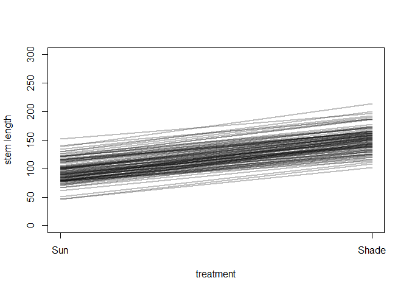

```r
library(tidyverse)
library(rethinking)
```

Please find attached csv.  This csv has measurements of tomato internodes and petioles from wildtype (Moneymaker) and various phytochrome mutant lines.  Measurements were made at 3 time points, 21, 28, and 35 days after germination under two treatments, simulated sun and simulated shade.

for today let's focus on day 35.  Also let's focus on total stem length.  So: first


```r
dat <- read.csv("figure4phyE.csv")
head(dat)
```

```
##   genotype treatment flat day   epi  int1  int2  int3  pet1  pet2  pet3  pet4
## 1 phyB1/B2     shade    1  21 24.03  3.18  0.00  0.00 14.11  4.88  0.00  0.00
## 2 phyB1/B2     shade    1  28 47.37 21.67 11.27  3.13 31.05 26.81 11.10  2.61
## 3 phyB1/B2     shade    1  35 58.83 40.60 72.29 52.70 42.15 49.60 49.58 30.49
## 4 phyB1/B2     shade    1  21 29.85  2.39  2.41  0.00 14.44 11.55  0.00  0.00
## 5 phyB1/B2     shade    1  28 59.69  3.36 25.52  6.62 35.10 29.15 20.05  9.39
## 6 phyB1/B2     shade    1  35 69.55  4.91 56.64 35.52 49.81 34.65 47.58 40.54
```

## Q1)

  a) subset the data for day 35
  

```r
dat_35 <- dat %>%
  filter(day == 35)
```

  b) create a new column "stem_length" that is the sum of epi, int1, int2, and int3
  

```r
dat_35$stem_length <- dat_35$epi + dat_35$int1 + dat_35$int2 + dat_35$int3
```

  c) although flats are listed as 1-6, flats in sun and shade are separate. Create a new column "flat2" that corrects for this.

Ultimately you want to know if any of the mutants have a different length from Moneymaker, in sun or in shade, or if the response to shade differs.


```r
dat_35$flat2 <- paste(dat_35$treatment, dat_35$flat, sep = "_")

dat_35_list <- list(
  G = as.integer(dat_35$genotype),
  T = ifelse(dat_35$treatment == "sun", 0L, 1L),
  F = as.integer(as.factor(dat_35$flat2)),
  L = dat_35$stem_length
)

str(dat_35_list)
```

```
## List of 4
##  $ G: int [1:88] 3 3 3 3 3 3 3 3 3 3 ...
##  $ T: int [1:88] 1 1 1 1 1 1 0 0 0 0 ...
##  $ F: int [1:88] 1 1 2 3 3 5 7 7 8 9 ...
##  $ L: num [1:88] 224 167 224 196 258 ...
```

```r
summary(dat_35)
```

```
##        genotype  treatment       flat            day          epi       
##  Moneymaker:12   shade:48   Min.   :1.000   Min.   :35   Min.   :10.94  
##  phyB1     :12   sun  :40   1st Qu.:2.000   1st Qu.:35   1st Qu.:29.08  
##  phyB1/B2  :12              Median :3.000   Median :35   Median :37.36  
##  phyB2     :12              Mean   :3.455   Mean   :35   Mean   :41.40  
##  phyEami3  :21              3rd Qu.:5.000   3rd Qu.:35   3rd Qu.:50.62  
##  phyEami7  :19              Max.   :6.000   Max.   :35   Max.   :87.74  
##       int1            int2             int3            pet1      
##  Min.   : 3.02   Min.   : 10.75   Min.   : 8.79   Min.   :32.52  
##  1st Qu.:28.01   1st Qu.: 23.95   1st Qu.:15.98   1st Qu.:51.14  
##  Median :35.12   Median : 36.20   Median :24.72   Median :60.62  
##  Mean   :36.50   Mean   : 38.50   Mean   :24.85   Mean   :60.26  
##  3rd Qu.:45.85   3rd Qu.: 48.99   3rd Qu.:31.67   3rd Qu.:68.91  
##  Max.   :71.27   Max.   :104.74   Max.   :56.70   Max.   :91.87  
##       pet2            pet3            pet4        stem_length    
##  Min.   : 0.00   Min.   :18.52   Min.   :10.83   Min.   : 51.71  
##  1st Qu.:53.29   1st Qu.:49.33   1st Qu.:27.41   1st Qu.: 96.17  
##  Median :65.34   Median :58.30   Median :34.99   Median :146.36  
##  Mean   :65.52   Mean   :60.12   Mean   :36.29   Mean   :141.24  
##  3rd Qu.:79.04   3rd Qu.:71.24   3rd Qu.:43.87   3rd Qu.:168.32  
##  Max.   :96.23   Max.   :98.57   Max.   :72.12   Max.   :264.39  
##     flat2          
##  Length:88         
##  Class :character  
##  Mode  :character  
##                    
##                    
## 
```


## Q2) Fit 3 models, all of which include genotype and treatment


```r
m_1 <- ulam(
  alist(
    L ~ dnorm(mu, sigma),
    mu <- a[G] + bT*T,
    a[G] ~ dnorm(145, 50),
    bT ~ dnorm(0, 25),
    sigma ~ dexp(1)
  ),
  data = dat_35_list,
  chains = 4,
  log_lik = TRUE,
  cores = 4
)
```


```r
m_2 <- ulam(
  alist(
    L ~ dnorm(mu, sigma),
    mu <- a[G] + bT*T + bF[F],
    a[G] ~ dnorm(145, 50),
    bT ~ dnorm(0, 25),
    bF[F] ~ dnorm(0, 5),
    sigma ~ dexp(1)
  ),
  data = dat_35_list ,
  chains = 4 ,
  log_lik = TRUE,
  cores = 4,
  iter = 5000
)
```


```r
m_3 <- ulam(
  alist(
    L ~ dnorm(mu, sigma),
    mu <- a[G] + bT*T + bF[F],
    a[G] ~ dnorm(145, 50),
    bT ~ dnorm(0, 25),
    bF[F] ~ dnorm(0, sigma_f),
    a_bar ~ dnorm(145,15),
    sigma_f ~ dexp(1),
    sigma ~ dexp(1)
  ),
  data = dat_35_list ,
  chains = 4 ,
  log_lik = TRUE,
  cores = 4,
  iter = 5000
)
```

```
## Warning: There were 70 divergent transitions after warmup. Increasing adapt_delta above 0.95 may help. See
## http://mc-stan.org/misc/warnings.html#divergent-transitions-after-warmup
```

```
## Warning: There were 4 chains where the estimated Bayesian Fraction of Missing Information was low. See
## http://mc-stan.org/misc/warnings.html#bfmi-low
```

```
## Warning: Examine the pairs() plot to diagnose sampling problems
```

```
## Warning: Bulk Effective Samples Size (ESS) is too low, indicating posterior means and medians may be unreliable.
## Running the chains for more iterations may help. See
## http://mc-stan.org/misc/warnings.html#bulk-ess
```

```
## Warning: Tail Effective Samples Size (ESS) is too low, indicating posterior variances and tail quantiles may be unreliable.
## Running the chains for more iterations may help. See
## http://mc-stan.org/misc/warnings.html#tail-ess
```


```r
m_4 <- ulam(
  alist(
    L ~ dnorm(mu, sigma),
    mu <- a[G] + bT*T + bF[F],
    a[G] ~ dnorm(a_bar, sigma_a),
    bT ~ dnorm(0, 25),
    bF[F] ~ dnorm(0, sigma_f),
    a_bar ~ dnorm(145,15),
    c(sigma_a, sigma_f) ~ dexp(1),
    sigma ~ dexp(1)
  ),
  data = dat_35_list ,
  chains = 4 ,
  log_lik = TRUE,
  cores = 4,
  iter = 5000
)
```

```
## Warning: There were 42 divergent transitions after warmup. Increasing adapt_delta above 0.95 may help. See
## http://mc-stan.org/misc/warnings.html#divergent-transitions-after-warmup
```

```
## Warning: There were 4 chains where the estimated Bayesian Fraction of Missing Information was low. See
## http://mc-stan.org/misc/warnings.html#bfmi-low
```

```
## Warning: Examine the pairs() plot to diagnose sampling problems
```

```
## Warning: Bulk Effective Samples Size (ESS) is too low, indicating posterior means and medians may be unreliable.
## Running the chains for more iterations may help. See
## http://mc-stan.org/misc/warnings.html#bulk-ess
```

```
## Warning: Tail Effective Samples Size (ESS) is too low, indicating posterior variances and tail quantiles may be unreliable.
## Running the chains for more iterations may help. See
## http://mc-stan.org/misc/warnings.html#tail-ess
```


```r
m_5 <- ulam(
  alist(
    L ~ dnorm(mu, sigma),
    mu <- a[G] + bT[G]*T + bF[F],
    a[G] ~ dnorm(145, 50),
    bT[G] ~ dnorm(0, 25),
    bF[F] ~ dnorm(0, 5),
    a_bar ~ dnorm(145,15),
    sigma ~ dexp(1)
  ),
  data = dat_35_list ,
  chains = 4 ,
  log_lik = TRUE,
  cores = 4,
  iter = 5000
)
```

## Q3) Compare the models, which is preferred?


```r
precis(m_1, depth = 2)
```

```
##            mean       sd      5.5%     94.5%    n_eff     Rhat
## a[1]   93.29888 6.508556  82.80714 103.33246 1875.513 1.002163
## a[2]  167.86269 6.394603 157.64933 178.17672 1847.277 1.000983
## a[3]  149.76152 6.738641 139.09454 160.27493 1825.158 1.000743
## a[4]   94.71245 6.233731  84.76608 104.82084 1540.379 1.002550
## a[5]   88.78928 5.277921  80.46292  97.27164 1558.724 1.001209
## a[6]   87.76794 5.753176  78.50348  96.57782 1426.888 1.001104
## bT     59.60446 4.524858  52.33131  67.05978 1100.465 1.004504
## sigma  21.02030 1.427936  18.92829  23.42112 1466.032 1.000036
```

```r
precis(m_2, depth = 2)
```

```
##               mean       sd       5.5%       94.5%     n_eff      Rhat
## a[1]    93.6675953 6.330001  83.584683 103.9956675 11795.601 0.9997937
## a[2]   167.1196037 6.509897 156.571565 177.4650911 12027.684 0.9999102
## a[3]   149.9625913 6.521984 139.541479 160.4394645 12657.440 0.9999772
## a[4]    95.6103338 6.299415  85.485956 105.6725995 11786.896 0.9999968
## a[5]    90.4806718 5.375102  81.964963  99.1071504 10012.567 0.9999006
## a[6]    87.9013801 5.618338  78.953208  96.8049098 11237.054 0.9999634
## bT      58.8420665 5.025121  50.881124  67.0143365  7445.259 1.0001225
## bF[1]   -5.8376160 4.215606 -12.460059   0.7851590 16909.834 0.9997352
## bF[2]   -1.9534668 4.208363  -8.595791   4.6920763 19243.286 0.9998182
## bF[3]    4.2680084 4.343484  -2.706073  11.2232127 17237.346 0.9996872
## bF[4]    5.3296176 4.203300  -1.324187  12.1481184 19755.086 0.9999063
## bF[5]    3.8485884 4.256573  -2.958986  10.6612326 19951.397 0.9997232
## bF[6]   -3.3120950 4.330599 -10.190019   3.6157209 16694.478 0.9998137
## bF[7]   -0.8408786 4.281546  -7.677111   6.0761559 15749.427 0.9997260
## bF[8]   -1.6005232 4.388481  -8.554161   5.4487358 14557.859 0.9998097
## bF[9]    0.6925291 4.307435  -6.128656   7.5164564 14833.351 0.9996972
## bF[10]   1.9439966 4.338231  -5.023611   8.8554011 16984.113 1.0000463
## bF[11]   2.3471370 4.533524  -4.948168   9.4802140 17681.970 1.0000812
## bF[12]  -6.6144706 4.318862 -13.506758   0.3068318 13491.086 0.9997831
## sigma   19.8245055 1.416797  17.673767  22.1714704 14109.834 0.9997585
```

```r
precis(m_3, depth = 2)
```

```
##                mean        sd       5.5%      94.5%     n_eff     Rhat
## a[1]     93.8430489  6.567607  83.096609 104.781368 1264.9091 1.004771
## a[2]    167.6488524  6.439838 157.331078 177.976397 6040.9958 1.000338
## a[3]    149.9870281  6.516502 139.709757 160.395972 1636.7388 1.003039
## a[4]     95.0438439  6.434740  84.707121 105.332650 5619.0275 1.001045
## a[5]     89.6926000  5.387738  81.284839  98.360320 2022.6215 1.002107
## a[6]     87.9133919  5.599409  79.029444  96.863493 3495.9452 1.000387
## bT       59.1001347  4.948683  50.822680  66.645851 1055.8066 1.004090
## bF[1]    -2.5238370  4.151975 -11.194013   1.297317  558.6922 1.008828
## bF[2]    -0.7975551  2.971650  -6.203289   2.952604 3107.0910 1.001955
## bF[3]     1.9351327  3.774927  -1.685991   9.375574  713.8377 1.007714
## bF[4]     2.3511582  4.085286  -1.387146  10.417857  570.7674 1.009216
## bF[5]     1.7455715  3.639297  -1.945718   8.826627  852.4499 1.007163
## bF[6]    -1.4237935  3.317463  -7.832054   2.210649 1090.9492 1.004811
## bF[7]    -0.4112028  2.971201  -5.528826   3.744332 5212.7679 1.001056
## bF[8]    -0.7435424  3.021692  -6.088454   3.091163 2668.8918 1.001778
## bF[9]     0.2466966  2.952822  -4.121850   5.101825 5998.1137 1.000896
## bF[10]    0.8102585  3.118177  -3.210230   6.428531 2958.2458 1.001588
## bF[11]    0.9976910  3.177524  -2.848717   6.970727 1736.9020 1.002334
## bF[12]   -2.9621028  4.726187 -12.774759   1.124611  453.5324 1.012901
## a_bar   144.9579601 15.121078 120.814336 169.258479 8748.5455 1.000221
## sigma_f   2.6480389  2.290840   0.267025   7.020607  257.7590 1.018189
## sigma    20.4836156  1.523569  18.170865  22.999897 1747.2223 1.001997
```

```r
precis(m_4, depth = 2)
```

```
##                 mean       sd        5.5%      94.5%     n_eff     Rhat
## a[1]     96.54483195 6.161958  86.5571161 106.310095 6591.7880 1.000062
## a[2]    162.35046402 6.404759 151.9847937 172.477888 6458.6766 1.000157
## a[3]    146.44864074 6.372038 136.1125231 156.591946 6115.9247 1.000063
## a[4]     97.78703076 6.291625  87.8706078 107.866526 5169.5899 1.000751
## a[5]     91.79335514 5.399857  83.2782569 100.536567 3400.0836 1.000721
## a[6]     90.38170801 5.535848  81.8818107  99.280642 4880.0722 1.000668
## bT       58.35271272 4.778780  50.5134153  65.857825 3539.6951 1.002122
## bF[1]    -2.49258309 4.135971 -10.9790833   1.262066  570.8315 1.006248
## bF[2]    -0.78997079 3.001777  -6.1791192   2.901347 2796.7043 1.000973
## bF[3]     1.87190558 3.730795  -1.6863760   9.420766  788.4484 1.004693
## bF[4]     2.51907469 4.257821  -1.2585893  11.372844  581.3849 1.006428
## bF[5]     1.64941227 3.423023  -1.8872851   8.594875  940.9437 1.004004
## bF[6]    -1.47774781 3.390423  -8.1785330   2.031179 1051.3488 1.002789
## bF[7]    -0.53853078 2.973338  -5.7729683   3.304205 3485.5235 1.000338
## bF[8]    -0.84547082 3.137118  -6.3952239   2.913248 2606.4290 1.002056
## bF[9]     0.09442235 2.939053  -4.5847434   4.862350 6180.4477 1.000240
## bF[10]    0.90150876 3.107696  -2.8426130   6.642480 2941.3370 1.000460
## bF[11]    1.01625705 3.219062  -2.7999137   7.155980 2011.2275 1.001172
## bF[12]   -3.17473704 5.032528 -13.4780225   1.038710  503.6888 1.006727
## a_bar   119.44325010 6.871001 108.6494905 130.617444 6440.7199 1.000042
## sigma_f   2.62309348 2.337989   0.2447612   7.169019  286.0362 1.012916
## sigma_a  16.40788628 2.452682  12.8221418  20.608421 6354.4225 1.000626
## sigma    20.66376968 1.576506  18.2294147  23.242042 1913.1776 1.001501
```

```r
precis(m_5, depth = 2)
```

```
##               mean        sd        5.5%      94.5%     n_eff      Rhat
## a[1]   100.6390918  8.170221  87.5601490 113.690355  8819.720 0.9997669
## a[2]   173.2274884  8.290570 160.2686963 186.427494 10144.253 1.0001487
## a[3]   150.4186222  8.250369 137.3042887 163.687672  9504.200 0.9997376
## a[4]   102.6934152  8.210614  89.6752568 115.793714 10373.053 0.9999102
## a[5]    98.5964610  6.932823  87.6693224 109.706020  8822.353 1.0000847
## a[6]    91.0687365  7.542229  79.2996468 103.297658  8154.181 0.9997976
## bT[1]   44.6791311 11.018284  26.9582834  62.125371  9488.973 0.9998218
## bT[2]   46.6412493 11.098057  28.6341729  64.241524 10261.760 1.0000895
## bT[3]   57.8208122 11.101362  40.0661221  75.444564  9936.995 0.9997354
## bT[4]   44.5997355 11.076645  26.8529111  62.029660 10531.477 1.0001430
## bT[5]   44.2373378  9.013001  29.9080097  58.573535  8190.571 0.9999118
## bT[6]   53.2736805  9.391227  38.3750755  68.234754  7527.570 0.9998143
## bF[1]   -4.0317191  4.334005 -10.8822182   2.919226 16629.407 0.9998008
## bF[2]   -0.4526892  4.366345  -7.4141731   6.610906 14394.830 0.9997319
## bF[3]    5.2976449  4.370594  -1.7544977  12.161355 17343.708 0.9998661
## bF[4]    6.8734069  4.371485  -0.2468247  13.911436 15347.812 0.9997048
## bF[5]    5.3957621  4.356913  -1.6711409  12.382783 18170.165 0.9996807
## bF[6]   -1.3383739  4.408790  -8.3909821   5.725425 15963.866 0.9998989
## bF[7]   -2.4702856  4.365854  -9.4113585   4.499479 14988.726 0.9999523
## bF[8]   -2.9785637  4.375642 -10.0102965   4.057046 15556.409 0.9998404
## bF[9]   -0.5215049  4.412556  -7.5931174   6.531242 13688.904 0.9999835
## bF[10]   0.2400522  4.443076  -6.9466302   7.314806 14335.749 0.9997746
## bF[11]   0.8398917  4.541087  -6.4334375   8.014424 16091.049 0.9996199
## bF[12]  -8.3417941  4.505091 -15.5954367  -1.147793 14566.145 0.9998295
## a_bar  144.9858550 14.963968 121.5281600 169.050697 18471.395 0.9997789
## sigma   20.4972594  1.532374  18.2076566  23.102680 10298.134 0.9998683
```

```r
compare(m_1, m_2, m_3, m_4, m_5)
```

```
##         WAIC       SE     dWAIC      dSE     pWAIC      weight
## m_2 807.9044 17.55198  0.000000       NA 12.589949 0.880827180
## m_3 813.3264 17.69511  5.422071 1.814367 11.751302 0.058546767
## m_4 814.3431 17.77250  6.438707 3.721633 11.172680 0.035216258
## m_1 815.2268 17.70768  7.322435 3.062247  9.389574 0.022638315
## m_5 819.4273 16.71249 11.522960 4.651151 16.707487 0.002771481
```

Model 2 is the best model based on WAIC.

## Q4) Using the hierarchical model, make posterior predictions

  a) for average cluster
  

```r
post <- extract.samples(m_2)
names(post)
```

```
## [1] "a"     "bT"    "bF"    "sigma"
```

```r
link_abar <- function(treatment){
  pred <- with(post, rowMeans(a) + bT*treatment)
  return(pred)
}

raw <- sapply( 0:1 , function(i) link_abar( i ) )
mu <- apply( raw , 2 , mean )
ci <- apply( raw , 2 , PI )

plot( NULL , xlab="treatment" , ylab="stem length", ylim=c(0,300) , xaxt="n" , xlim=c(1,2) )
axis( 1 , at=1:2 , labels=c("Sun","Shade"))
lines( 1:2 , mu )
shade( ci , 1:2 )
```

<!-- -->

  b) for same clusters


```r
link_same <- function(treatment, genotype = 1){
  pred <- with(post, a[,genotype] + bT*treatment + bF[,sample(1:12,1)])
  return(pred)
}
raw <- sapply(0:1 , function(i) link_same( i , genotype = 1))
mu <- apply( raw , 2 , mean )
ci <- apply( raw , 2 , PI )

plot( NULL , xlab="treatment" , ylab="stem length", ylim=c(0,300) , xaxt="n" , xlim=c(1,2), main = "Money Maker")
axis( 1 , at=1:2 , labels=c("Sun","Shade"))
lines( 1:2 , mu )
shade( ci , 1:2 )
```

<!-- -->

  c) showing the "marginal" from cluster


```r
a_sim <- with( post , rnorm( length(a), a, sigma ) )
link_asim <- function( treatment ) {
  pred <- with( post , a_sim + rep(bT*treatment, 6) + bF[,sample(1:12,1)])
  return(pred)
}

raw <- sapply( 0:1 , function(i) link_asim( i ))
mu <- apply( raw , 2 , mean )
ci <- apply( raw , 2 , PI )

plot( NULL , xlab="treatment" , ylab="stem length", ylim=c(0,300) , xaxt="n" , xlim=c(1,2) )
axis( 1 , at=1:2 , labels=c("Sun","Shade"))
lines( 1:2 , mu )
shade( ci , 1:2 )
```

<!-- -->

  d) showing new clusters.


```r
plot( NULL , xlab="treatment" , ylab="stem length", ylim=c(0,300) , xaxt="n" , xlim=c(1,2) )
axis( 1 , at=1:2 , labels=c("Sun","Shade"))
for ( i in 1:100 ) lines( 1:2 , raw[i,] , col=col.alpha("black",0.25) , lwd=2 )
```

<!-- -->

## Q5) Reparameterize the model to help with divergent transitions (even if there aren't any)


```r
m_6 <- ulam(
  alist(
    L ~ dnorm(mu, sigma),
    mu <- a_bar + bG[G]*sigma_g + # genotype intercepts
          bT*T + # treatmet
          bF[F]*sigma_f, # flat intercepts
    bG[G] ~ dnorm(0, 25),
    bT ~ dnorm(0, 25),
    bGT[G] ~ dnorm(0, 25),
    bF[F] ~ dnorm(0, 5),
    a_bar ~ dnorm(145,15),
    c(sigma_g, sigma_f) ~ dexp(1),
    sigma ~ dexp(1)
  ),
  data = dat_35_list ,
  chains = 4 ,
  log_lik = TRUE,
  cores = 4,
  iter = 5000
)

compare(m_1, m_2, m_3, m_4, m_5, m_6)
```

```
##         WAIC       SE     dWAIC      dSE     pWAIC       weight
## m_6 806.4963 16.92253  0.000000       NA 16.379822 0.6404137614
## m_2 807.9044 17.55198  1.408109 3.832439 12.589949 0.3167333324
## m_3 813.3264 17.69511  6.830180 5.546008 11.751302 0.0210526116
## m_4 814.3431 17.77250  7.846816 6.132701 11.172680 0.0126632817
## m_1 815.2268 17.70768  8.730544 6.749177  9.389574 0.0081404266
## m_5 819.4273 16.71249 12.931068 6.262538 16.707487 0.0009965863
```

No more divergent transitions. Also samples fast

## Q6--optional)

  a) Which genotypes differ from MoneyMaker in Sun conditions?
  

```r
sun_sample_means <- post$a
colnames(sun_sample_means) <- levels(dat_35$genotype)
sun_sample_means <- as.data.frame(sun_sample_means) %>%
  gather(key = "Genotype", value = "Stem_length", 1:6)

ggplot(sun_sample_means, aes(x = Genotype, y = Stem_length)) +
  geom_boxplot()
```

<!-- -->

```r
plot(precis(m_2, depth = 2),
     pars = c("a[1]","a[2]","a[3]","a[4]","a[5]","a[6]"),
     labels = levels(dat_35$genotype),
     main = "Genotype in Sun"
)
```

<!-- -->

# Megan's Data

I've attached some data from a common garden experiment, where plants from 15 different populations were planted out (locations are shown in Figure 1 here if you're curious). One goal for the experiment was to see if temperature of origin affected performance of plants in the common garden. Here are some practice questions, very similar to Julin's from last week. The data set is big-ish. I've already sub-sampled it, but there are still 3250 observations. The models are still running quickly on my computer, but if that's not the case for you, feel free to sub-sample it further. Please let me know if you have any questions.

### 1. Fit a simple model with effects of temperature difference (temperature_diff_fall) on November germination (nov_germ). Temperature difference is already centered and scaled (i.e., negative values are the smallest temperature differences). Make sure to use the appropriate likelihood for the germination data (0 = no germ, 1  = germ).


```r
dat <- read_csv("clarkia_transplant_data.csv")
```

```
## Parsed with column specification:
## cols(
##   temperature_diff_fall = col_double(),
##   blk = col_double(),
##   nov_germ = col_double(),
##   pop = col_character(),
##   dam = col_character(),
##   sire = col_character(),
##   nov_size = col_double(),
##   mar_surv = col_double(),
##   mar_size = col_double(),
##   fruit_count = col_double(),
##   total_est_seeds = col_double(),
##   temperature_diff_annual = col_double(),
##   precip_diff_spring = col_double(),
##   first_fl_julian = col_double(),
##   last_fl_julian = col_double()
## )
```

```r
head(dat)
```

```
## # A tibble: 6 x 15
##   temperature_dif~   blk nov_germ pop   dam   sire  nov_size mar_surv mar_size
##              <dbl> <dbl>    <dbl> <chr> <chr> <chr>    <dbl>    <dbl>    <dbl>
## 1            1.19      1        0 AY    AY29  AY44        NA        0       NA
## 2            1.19      3        1 AY    AY35  AY29         5        1        2
## 3            1.67      3        0 BB    BB44  BB37        NA        0       NA
## 4            1.94      3        1 BC    BC54  BC37         1        1        6
## 5           -1.49      3        1 AR    AR37  AR46         1        0       NA
## 6            0.697     4        1 AD    AD71~ AD75~        1        0       NA
## # ... with 6 more variables: fruit_count <dbl>, total_est_seeds <dbl>,
## #   temperature_diff_annual <dbl>, precip_diff_spring <dbl>,
## #   first_fl_julian <dbl>, last_fl_julian <dbl>
```

```r
dat_list <- list(
  Germ = as.integer(dat$nov_germ),
  TDiff = dat$temperature_diff_fall
)
  
m_1 <- ulam(
  alist(Germ ~ dbinom(1 , p) ,
        logit(p) <- a + bT*TDiff ,
        c(a, bT) ~ dnorm(0 , 1)
        ),
  data = dat_list,
  chains = 4,
  cores = 4,
  log_lik = TRUE
)
```


2. Simulate from your priors to see if you've chosen reasonable priors, adjust them if necessary.


```r
summary(dat)
```

```
##  temperature_diff_fall      blk           nov_germ        pop           
##  Min.   :-1.5923       Min.   :1.000   Min.   :0.00   Length:3250       
##  1st Qu.:-1.0963       1st Qu.:2.000   1st Qu.:0.00   Class :character  
##  Median : 0.3377       Median :3.000   Median :1.00   Mode  :character  
##  Mean   : 0.1945       Mean   :2.505   Mean   :0.54                     
##  3rd Qu.: 1.5434       3rd Qu.:4.000   3rd Qu.:1.00                     
##  Max.   : 1.9434       Max.   :4.000   Max.   :1.00                     
##                                                                         
##      dam                sire              nov_size        mar_surv     
##  Length:3250        Length:3250        Min.   :1.000   Min.   :0.0000  
##  Class :character   Class :character   1st Qu.:3.000   1st Qu.:0.0000  
##  Mode  :character   Mode  :character   Median :3.000   Median :0.0000  
##                                        Mean   :3.176   Mean   :0.2961  
##                                        3rd Qu.:4.000   3rd Qu.:1.0000  
##                                        Max.   :5.000   Max.   :1.0000  
##                                        NA's   :2249    NA's   :582     
##     mar_size       fruit_count      total_est_seeds    temperature_diff_annual
##  Min.   : 2.000   Min.   : 0.0000   Min.   :   0.000   Min.   :-1.4734        
##  1st Qu.: 6.000   1st Qu.: 0.0000   1st Qu.:   0.000   1st Qu.:-0.5820        
##  Median : 6.000   Median : 0.0000   Median :   0.000   Median : 0.2413        
##  Mean   : 7.317   Mean   : 0.2734   Mean   :   9.064   Mean   : 0.2957        
##  3rd Qu.:10.000   3rd Qu.: 0.0000   3rd Qu.:   0.000   3rd Qu.: 1.2411        
##  Max.   :18.000   Max.   :60.0000   Max.   :1794.000   Max.   : 1.8117        
##  NA's   :2477     NA's   :631       NA's   :631                               
##  precip_diff_spring first_fl_julian last_fl_julian 
##  Min.   : 0.8207    Min.   :149.0   Min.   :155.0  
##  1st Qu.:12.0278    1st Qu.:154.0   1st Qu.:159.0  
##  Median :18.5797    Median :159.0   Median :163.0  
##  Mean   :17.6746    Mean   :159.5   Mean   :168.5  
##  3rd Qu.:23.0091    3rd Qu.:161.0   3rd Qu.:176.0  
##  Max.   :31.9469    Max.   :181.0   Max.   :216.0  
##                     NA's   :3010    NA's   :3010
```

```r
ps <- extract.prior(m_1)
```

```
## 
## SAMPLING FOR MODEL '14d5e37f946f3f95ea33bcd8574cef88' NOW (CHAIN 1).
## Chain 1: 
## Chain 1: Gradient evaluation took 0 seconds
## Chain 1: 1000 transitions using 10 leapfrog steps per transition would take 0 seconds.
## Chain 1: Adjust your expectations accordingly!
## Chain 1: 
## Chain 1: 
## Chain 1: Iteration:    1 / 2000 [  0%]  (Warmup)
## Chain 1: Iteration:  200 / 2000 [ 10%]  (Warmup)
## Chain 1: Iteration:  400 / 2000 [ 20%]  (Warmup)
## Chain 1: Iteration:  600 / 2000 [ 30%]  (Warmup)
## Chain 1: Iteration:  800 / 2000 [ 40%]  (Warmup)
## Chain 1: Iteration: 1000 / 2000 [ 50%]  (Warmup)
## Chain 1: Iteration: 1001 / 2000 [ 50%]  (Sampling)
## Chain 1: Iteration: 1200 / 2000 [ 60%]  (Sampling)
## Chain 1: Iteration: 1400 / 2000 [ 70%]  (Sampling)
## Chain 1: Iteration: 1600 / 2000 [ 80%]  (Sampling)
## Chain 1: Iteration: 1800 / 2000 [ 90%]  (Sampling)
## Chain 1: Iteration: 2000 / 2000 [100%]  (Sampling)
## Chain 1: 
## Chain 1:  Elapsed Time: 1.814 seconds (Warm-up)
## Chain 1:                1.451 seconds (Sampling)
## Chain 1:                3.265 seconds (Total)
## Chain 1:
```

```r
preds <- link(m_1,
          post = ps,
          data = list(TDiff = seq(-2, 2, by = 0.10)))

colnames(preds) <- paste0("TDiff_",round(seq(-2, 2, by = 0.10),2))
preds <- as.data.frame(preds) %>%
  gather(key = "TDiff", value = "Prior") %>%
  mutate(Group = rep(1:1000,41),
         TDiff = factor(TDiff, levels = unique(TDiff))
  )
         

ggplot(preds, aes(x = as.factor(TDiff), y = Prior, group = Group)) + 
  geom_line() +
  theme(axis.text.x = element_text(angle = 90, hjust = 1))
```

<!-- -->


These blocks were set up in the field, and had differences in soil depth, slope, and competitive environment. So maybe a model that includes block will describe the data better.

3. Fit a model that includes an effect of block (blk), with no pooling.

4. Fit a model that includes block, and allows partial pooling.

The experiment included many individuals from each of the 15 populations. So, each individual is not an independent representative of a given temperature, but might be similar to other plants from that population for reasons besides temperature.

5. Build a model that accounts for this by including population (pop) and allowing partial pooling between populations A) without block, and B) with block included as in the model above. How does including population affect the temperature estimate?

6. Compare the five models you built using WAIC. Which fits best?

7. Plot effects of temperature difference for the average block, and also make a plot that includes the variability across blocks.

There are other complexities to this data. For example, there is also some family structure within populations (dam and sire) which could be included as hierarchical effects. There are also other response variables (November size, March survival and size, first flower date, last flower date, fruit number, estimated seed production) that might require different likelihoods (and in some cases treatment for over-dispersion or zero inflation). So if the above problems were too easy and you feel adventurous, you could try analyzing one of these responses instead of germination (you will need to filter out missing observations).
