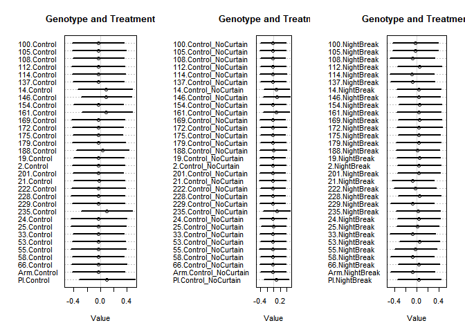

```r
library(tidyverse)
library(rethinking)
```

Here is your much-awaited dataset for our upcoming meeting on the 21st of February, 2020. The data came fresh off the greenhouse on 2/8/2020 from a night break experiment. Thirty-two accessions from a lettuce F6 recombinant inbred line population were planted in the same greenhouse under 10hr light/14hr dark diurnal cycles. Three treatments are implemented: 
1. "Nightbreak": the plants are grown on a bench surrounded by plastic blackout curtains. These plants receive a one-hour night break treatment at 12am every day (meaning the lights turn on in the middle of the night for an hour) in addition to the 10L/14D lighting. 
2. "Control": the plants are grown on a bench surrounded by plastic blackout curtains. 10L/14D lighting. 
3. "Control_NoCurtain": the plants are grown on a bench without any curtains. 10L/14D lighting. 

The goals of the experiment are:
a. to see if night break induces earlier flowering in lettuce;
b. if so, do different lettuce genotypes respond to night breaks differently; and 
c. which one(s) of the five candidate loci is/are associated with differential responses. 

How to interpret the phenotype:
Phenotype is recorded in the "Score" column. The different scores represent different developmental stages:
1: rosette 
2: bolted (elongation of the main stem)
3: budding
4: first flower
5: first mature seed head

Aaaaand finally here are your questions!

### Q1: 

  a. Load the dataset. Look for column "Score" for the response variable we are interested in. A developmental score of 1 or 2 indicates vegetative growth, while a score of 3, 4, or 5 indicates reproductive growth. Create a "Reproduction" column with values 0 and 1, where 0 indicates vegetative growth and 1 indicates reproductive growth. 


```r
dat <- read_csv("Nightbreak_02_08_20_Rclub.csv")
```

```
## Parsed with column specification:
## cols(
##   RIL = col_character(),
##   Treatment = col_character(),
##   Rep = col_double(),
##   Plot = col_double(),
##   Date = col_character(),
##   loc1 = col_character(),
##   loc2 = col_character(),
##   loc3 = col_character(),
##   loc4 = col_character(),
##   loc5 = col_character(),
##   Score = col_double()
## )
```

```r
dat$Reproduction <- ifelse(dat$Score < 3, 0, 1)
str(dat)
```

```
## Classes 'spec_tbl_df', 'tbl_df', 'tbl' and 'data.frame':	188 obs. of  12 variables:
##  $ RIL         : chr  "100" "2" "137" "172" ...
##  $ Treatment   : chr  "Control" "Control" "Control" "Control" ...
##  $ Rep         : num  1 1 1 1 1 1 1 1 1 1 ...
##  $ Plot        : num  1 2 3 4 5 6 7 8 9 10 ...
##  $ Date        : chr  "2/8/20" "2/8/20" "2/8/20" "2/8/20" ...
##  $ loc1        : chr  "P" "A" "P" "P" ...
##  $ loc2        : chr  "P" "P" "A" "P" ...
##  $ loc3        : chr  "A" "P" "P" "P" ...
##  $ loc4        : chr  "P" "A" "P" "A" ...
##  $ loc5        : chr  "A" "A" "A" "A" ...
##  $ Score       : num  2 2 1 2 2 3 1 2 3 1 ...
##  $ Reproduction: num  0 0 0 0 0 1 0 0 1 0 ...
##  - attr(*, "spec")=
##   .. cols(
##   ..   RIL = col_character(),
##   ..   Treatment = col_character(),
##   ..   Rep = col_double(),
##   ..   Plot = col_double(),
##   ..   Date = col_character(),
##   ..   loc1 = col_character(),
##   ..   loc2 = col_character(),
##   ..   loc3 = col_character(),
##   ..   loc4 = col_character(),
##   ..   loc5 = col_character(),
##   ..   Score = col_double()
##   .. )
```

```r
# RIL 188 Control_NoCurtain, RIL 188 Nightbreak, RIL 25 Control_NoCurtain, and RIL 25 Nightbreak have only one plant each
```

  b. (optional) Take a look at columns "loc1" through "loc5". The levels "A" or "P" indicate which parental allele the RIL has inherited. Can you think of a reason why there are 32 lines in this experiment? 

Probably has something to do with there being 5 loci of interest in the population and 2^5 == 32

### Q2: Using the "Reproduction" column you created in Q1a as the response variable, fit a simple model with effects of genotype ("RIL") and treatment ("Treatment") on the rate of transitioning to reproductive growth by 2/8/20. (Things you might want to consider: appropriate likelihood function, intersection term). 


```r
dat_list <- list(
  Reproduction = dat$Reproduction,
  Treatment = as.numeric(as.factor(dat$Treatment)),
  RIL = as.numeric(as.factor(dat$RIL)),
  RT = as.integer(interaction(dat$RIL, dat$Treatment, drop = T))
)

summary(dat)
```

```
##      RIL             Treatment              Rep             Plot      
##  Length:188         Length:188         Min.   :1.000   Min.   : 1.00  
##  Class :character   Class :character   1st Qu.:1.000   1st Qu.: 8.75  
##  Mode  :character   Mode  :character   Median :1.000   Median :16.50  
##                                        Mean   :1.495   Mean   :16.53  
##                                        3rd Qu.:2.000   3rd Qu.:25.00  
##                                        Max.   :2.000   Max.   :32.00  
##      Date               loc1               loc2               loc3          
##  Length:188         Length:188         Length:188         Length:188        
##  Class :character   Class :character   Class :character   Class :character  
##  Mode  :character   Mode  :character   Mode  :character   Mode  :character  
##                                                                             
##                                                                             
##                                                                             
##      loc4               loc5               Score        Reproduction   
##  Length:188         Length:188         Min.   :1.000   Min.   :0.0000  
##  Class :character   Class :character   1st Qu.:2.000   1st Qu.:0.0000  
##  Mode  :character   Mode  :character   Median :2.000   Median :0.0000  
##                                        Mean   :2.202   Mean   :0.3351  
##                                        3rd Qu.:3.000   3rd Qu.:1.0000  
##                                        Max.   :4.000   Max.   :1.0000
```

```r
# No interaction between genotype and treatment
model_1 <- ulam(
  alist(
    Reproduction ~ dbinom(1, p),
    logit(p) <- bG[RIL] + bT[Treatment],
    bG[RIL] ~ dnorm(0,0.25),
    bT[Treatment] ~ dnorm(0, 0.5)
    ),
  data = dat_list,
  cores = 4,
  chains = 4,
  log_lik = TRUE
)

precis(model_1, depth = 2)
```

```
##                mean        sd       5.5%      94.5%    n_eff      Rhat
## bG[1]  -0.075741711 0.2348481 -0.4488417  0.2965937 4402.775 0.9983802
## bG[2]  -0.075143229 0.2477528 -0.4659338  0.3250793 4767.190 0.9987472
## bG[3]  -0.135421708 0.2399787 -0.5141357  0.2509252 4898.585 0.9990427
## bG[4]  -0.011989941 0.2375527 -0.3897375  0.3705734 5046.923 0.9990685
## bG[5]  -0.131728962 0.2524946 -0.5357683  0.2640841 5417.521 0.9988228
## bG[6]  -0.132215498 0.2430156 -0.5179597  0.2479857 4513.791 0.9985354
## bG[7]   0.221721870 0.2442336 -0.1580149  0.6097222 5590.846 0.9981193
## bG[8]   0.216317604 0.2434652 -0.1791551  0.6056331 4225.445 0.9988675
## bG[9]  -0.011639304 0.2333019 -0.3913563  0.3611519 4629.990 0.9991200
## bG[10]  0.217409178 0.2440793 -0.1972999  0.5934751 4284.271 0.9993023
## bG[11] -0.015809199 0.2491785 -0.4107292  0.3862717 5261.794 0.9987173
## bG[12] -0.017015696 0.2507726 -0.4295937  0.3926950 6602.060 0.9981636
## bG[13] -0.018994150 0.2431584 -0.3989623  0.3694188 3676.316 0.9990967
## bG[14] -0.012789072 0.2357791 -0.3873177  0.3630932 4657.458 0.9985481
## bG[15]  0.044123195 0.2513700 -0.3609186  0.4521672 4607.972 0.9989934
## bG[16] -0.011654366 0.2466767 -0.3967817  0.3696813 4617.408 0.9989350
## bG[17] -0.009504131 0.2438897 -0.4012169  0.3806197 4707.150 0.9997360
## bG[18] -0.020092048 0.2358800 -0.3935879  0.3565554 5956.380 0.9988797
## bG[19] -0.129351949 0.2347659 -0.5097188  0.2501135 4706.482 0.9990356
## bG[20] -0.069126586 0.2548790 -0.4800110  0.3298227 3414.843 0.9986819
## bG[21] -0.017328009 0.2421941 -0.4014311  0.3797800 4867.495 0.9983500
## bG[22] -0.134771119 0.2436343 -0.5502145  0.2534705 4164.917 0.9983012
## bG[23]  0.222304403 0.2480641 -0.1747706  0.6156890 4961.535 0.9983963
## bG[24] -0.019141578 0.2375460 -0.4006631  0.3495812 4270.405 0.9984679
## bG[25] -0.023203959 0.2482127 -0.4205770  0.3689241 6108.433 0.9985337
## bG[26] -0.131581008 0.2362871 -0.5079442  0.2380522 3726.213 0.9988884
## bG[27] -0.010594323 0.2317239 -0.3768308  0.3613065 4603.512 0.9985094
## bG[28] -0.075909871 0.2406662 -0.4707170  0.3061161 5011.314 0.9983974
## bG[29] -0.136516671 0.2448997 -0.5557704  0.2472813 4341.992 0.9991170
## bG[30] -0.014199447 0.2404973 -0.3972099  0.3675466 5040.900 0.9982866
## bG[31] -0.133080323 0.2448805 -0.5208399  0.2538734 4878.511 0.9987077
## bG[32]  0.213411632 0.2390850 -0.1699573  0.6074442 5571.153 0.9983838
## bT[1]  -1.147353368 0.2536371 -1.5658193 -0.7485015 4951.085 0.9995557
## bT[2]  -1.186210314 0.2551315 -1.6077651 -0.7893686 4194.062 0.9988860
## bT[3]   0.602151032 0.2430539  0.2144284  1.0016808 5796.948 0.9989165
```

```r
model_2 <- ulam(
  alist(
    Reproduction ~ dbinom(1, p),
    logit(p) <- bG[RIL] + bT[Treatment] + bGT[RT],
    bG[RIL] ~ dnorm(0,0.25),
    bT[Treatment] ~ dnorm(0, 0.5),
    bGT[RT] ~ dnorm(0, 0.25)
    ),
  data = dat_list,
  cores = 4,
  chains = 4,
  log_lik = TRUE
)

precis(model_2, depth = 2)
```

```
##                mean        sd       5.5%      94.5%    n_eff      Rhat
## bG[1]   -0.06605886 0.2331073 -0.4309555  0.2943318 3251.318 0.9985318
## bG[2]   -0.07400943 0.2402092 -0.4537961  0.3182156 3509.275 0.9988849
## bG[3]   -0.12599051 0.2438746 -0.5145793  0.2570148 3858.288 1.0001529
## bG[4]   -0.01914959 0.2404909 -0.3957404  0.3605691 4089.448 0.9990234
## bG[5]   -0.12503259 0.2427712 -0.5052474  0.2674764 3325.408 0.9991905
## bG[6]   -0.13288375 0.2375150 -0.5126448  0.2457269 5057.011 0.9984176
## bG[7]    0.22071301 0.2579658 -0.1683867  0.6198128 4517.895 0.9991268
## bG[8]    0.21553719 0.2416802 -0.1741128  0.6068148 5084.710 0.9986773
## bG[9]   -0.01602381 0.2345263 -0.3814885  0.3620760 3357.267 0.9989527
## bG[10]   0.21291424 0.2427494 -0.1635859  0.5977100 5174.382 0.9989640
## bG[11]  -0.01568125 0.2435935 -0.3944007  0.3659940 2762.887 0.9985645
## bG[12]  -0.01168604 0.2381794 -0.3977384  0.3688678 4978.309 0.9985684
## bG[13]  -0.01883590 0.2544370 -0.4257736  0.3830041 3120.452 0.9996600
## bG[14]  -0.01325393 0.2543179 -0.4157618  0.3978826 4705.674 0.9995680
## bG[15]   0.03650015 0.2492821 -0.3748356  0.4355447 3472.534 0.9982789
## bG[16]  -0.01308856 0.2456624 -0.4001571  0.3854096 2540.579 1.0006298
## bG[17]  -0.01393760 0.2491307 -0.4144694  0.3855364 3930.549 0.9989785
## bG[18]  -0.02662226 0.2467330 -0.4204874  0.3627493 4079.535 0.9984053
## bG[19]  -0.13178808 0.2411982 -0.5239130  0.2502698 3981.987 0.9989482
## bG[20]  -0.07279229 0.2341205 -0.4429560  0.3053486 4374.332 0.9983009
## bG[21]  -0.01203786 0.2302972 -0.3772539  0.3582880 3387.080 0.9987249
## bG[22]  -0.12635349 0.2437169 -0.5128938  0.2672343 3282.842 0.9992549
## bG[23]   0.21182824 0.2375302 -0.1606664  0.5928885 3444.038 0.9989346
## bG[24]  -0.01353659 0.2400021 -0.4019320  0.3575139 3222.779 0.9996080
## bG[25]  -0.02176883 0.2484121 -0.4185075  0.3684616 3668.990 0.9990743
## bG[26]  -0.13054696 0.2500014 -0.5339047  0.2760163 3633.547 0.9983364
## bG[27]  -0.01466076 0.2398142 -0.4184198  0.3640059 3993.971 0.9990634
## bG[28]  -0.07410823 0.2477715 -0.4807198  0.3393333 3542.562 0.9993662
## bG[29]  -0.13161854 0.2395204 -0.5220089  0.2629534 3895.846 0.9994919
## bG[30]  -0.01369843 0.2479194 -0.3995352  0.3796645 3871.891 0.9991741
## bG[31]  -0.12735828 0.2446578 -0.5278854  0.2594115 2993.088 0.9986597
## bG[32]   0.21450891 0.2387832 -0.1697841  0.5926632 3409.758 0.9997335
## bT[1]   -1.15836699 0.2544251 -1.5768484 -0.7664252 3334.364 0.9988805
## bT[2]   -1.19592565 0.2679408 -1.6215222 -0.7721911 3569.108 0.9985823
## bT[3]    0.60887522 0.2424427  0.2152005  0.9933295 4204.284 0.9991929
## bGT[1]  -0.02843661 0.2481849 -0.4245673  0.3519495 3200.511 0.9993709
## bGT[2]  -0.02716579 0.2587319 -0.4265850  0.3845047 5705.491 0.9988375
## bGT[3]  -0.02906203 0.2380296 -0.4121311  0.3537872 4061.997 0.9987504
## bGT[4]  -0.02923126 0.2435462 -0.4301746  0.3646204 3984.366 1.0003033
## bGT[5]  -0.02805830 0.2463245 -0.4250114  0.3719086 3800.577 0.9987259
## bGT[6]  -0.03036808 0.2428799 -0.4093532  0.3533972 4000.895 0.9985992
## bGT[7]   0.08080543 0.2553236 -0.3383297  0.4826306 4356.363 0.9998851
## bGT[8]   0.08806156 0.2376307 -0.2858151  0.4704832 3827.972 0.9983119
## bGT[9]  -0.03294273 0.2401693 -0.4021940  0.3429661 3467.647 0.9988899
## bGT[10]  0.08750281 0.2348048 -0.2816045  0.4749120 3934.190 0.9989431
## bGT[11] -0.03103421 0.2492105 -0.4325178  0.3644566 3887.517 0.9993724
## bGT[12] -0.03391788 0.2428118 -0.4207421  0.3401881 2965.175 0.9994729
## bGT[13] -0.02922078 0.2411399 -0.4094315  0.3338251 3631.224 0.9987448
## bGT[14] -0.02751103 0.2514490 -0.4252973  0.3784768 5001.424 0.9988553
## bGT[15]  0.03389112 0.2471643 -0.3595351  0.4232994 3516.650 0.9995766
## bGT[16] -0.02833923 0.2397859 -0.4038257  0.3528367 3646.735 0.9982603
## bGT[17] -0.02919693 0.2501782 -0.4249994  0.3616241 3554.091 0.9989676
## bGT[18] -0.02670136 0.2438182 -0.4155849  0.3463237 3609.811 0.9988718
## bGT[19] -0.02320324 0.2424757 -0.4021924  0.3666939 3827.268 0.9987552
## bGT[20] -0.03225943 0.2515329 -0.4289724  0.3707559 3902.359 0.9984841
## bGT[21] -0.03123663 0.2525743 -0.4421920  0.3690190 3468.005 0.9992397
## bGT[22] -0.02757071 0.2486544 -0.4188834  0.3604447 3265.806 0.9991323
## bGT[23]  0.09320537 0.2415511 -0.2913782  0.4823119 3453.980 0.9986777
## bGT[24] -0.03222008 0.2589170 -0.4481549  0.3933685 4044.286 0.9984632
## bGT[25] -0.02885698 0.2577865 -0.4456320  0.3844948 4168.044 0.9985403
## bGT[26] -0.03077523 0.2375544 -0.4175138  0.3498535 3599.566 0.9982344
## bGT[27] -0.02420299 0.2441747 -0.4183861  0.3774148 3008.750 0.9998869
## bGT[28] -0.02416092 0.2500159 -0.4415978  0.3849945 3620.072 0.9987045
## bGT[29] -0.03072412 0.2414816 -0.4179986  0.3528294 3974.429 0.9993745
## bGT[30] -0.02620809 0.2610652 -0.4375164  0.3988278 5486.737 0.9984082
## bGT[31] -0.02695589 0.2486520 -0.4267714  0.3658537 4049.266 0.9983682
## bGT[32]  0.09895599 0.2557886 -0.3157518  0.5156341 3144.006 0.9989409
## bGT[33] -0.02642722 0.2472397 -0.4162579  0.3745344 4789.515 0.9990338
## bGT[34] -0.02880545 0.2484639 -0.4240632  0.3650079 4288.856 0.9999370
## bGT[35] -0.03158383 0.2389670 -0.4073482  0.3451539 3526.215 0.9990822
## bGT[36] -0.02993806 0.2422817 -0.4161887  0.3768204 2885.565 1.0002686
## bGT[37] -0.02283284 0.2564328 -0.4355284  0.3908556 4012.593 0.9987238
## bGT[38] -0.02055771 0.2504442 -0.4103488  0.3772800 3777.133 0.9991930
## bGT[39]  0.08849953 0.2453319 -0.2966630  0.4824222 3491.073 0.9988411
## bGT[40]  0.08904772 0.2544572 -0.3132397  0.4958625 4386.854 0.9986963
## bGT[41] -0.02796623 0.2496397 -0.4298429  0.3733313 4342.011 0.9986830
## bGT[42]  0.08481701 0.2472844 -0.3161065  0.4870336 3726.583 0.9993660
## bGT[43] -0.03141561 0.2429613 -0.4283964  0.3571100 2744.060 0.9991534
## bGT[44] -0.02641670 0.2520347 -0.4160980  0.3862203 4483.968 0.9991821
## bGT[45] -0.02808260 0.2405105 -0.4072033  0.3576011 4740.624 0.9984696
## bGT[46] -0.02194900 0.2493456 -0.4126630  0.3673817 4291.159 1.0004854
## bGT[47] -0.01170733 0.2498485 -0.4245307  0.3856035 2930.478 1.0000275
## bGT[48] -0.03182113 0.2465117 -0.4272581  0.3597475 3846.899 0.9991518
## bGT[49] -0.03062158 0.2560624 -0.4304556  0.3794602 3290.436 0.9993277
## bGT[50] -0.02885956 0.2404736 -0.4277643  0.3468113 4622.231 0.9986943
## bGT[51] -0.02755508 0.2561746 -0.4476951  0.3793103 4118.575 0.9987074
## bGT[52] -0.03289146 0.2454599 -0.4150870  0.3566358 4847.456 0.9997560
## bGT[53] -0.02818596 0.2481740 -0.4266430  0.3585542 2771.431 0.9988155
## bGT[54] -0.03305504 0.2427454 -0.4292912  0.3550121 3345.991 0.9986814
## bGT[55]  0.09407806 0.2462760 -0.3133506  0.4945794 3823.523 0.9986624
## bGT[56] -0.02879694 0.2533815 -0.4199225  0.3924630 5003.270 0.9988751
## bGT[57] -0.01139760 0.2365551 -0.3939598  0.3728386 3846.117 0.9989775
## bGT[58] -0.02371342 0.2533158 -0.4181853  0.3839020 3338.243 0.9986140
## bGT[59] -0.02526529 0.2478086 -0.4115181  0.3695357 5027.397 0.9986639
## bGT[60] -0.02990885 0.2588548 -0.4515271  0.3813430 3846.605 0.9991348
## bGT[61] -0.02071426 0.2521223 -0.4167034  0.3799246 5455.042 0.9988907
## bGT[62] -0.02885318 0.2531664 -0.4253102  0.3826367 5077.598 0.9982449
## bGT[63] -0.01876851 0.2480963 -0.4145719  0.3773961 3565.409 0.9986167
## bGT[64]  0.08747310 0.2388763 -0.3011882  0.4659995 2878.507 0.9984522
## bGT[65] -0.01910292 0.2550207 -0.4309208  0.3882343 4062.802 0.9983210
## bGT[66] -0.01805554 0.2652807 -0.4345954  0.3958984 3774.062 0.9992303
## bGT[67] -0.07655601 0.2559998 -0.4844410  0.3345980 3065.389 0.9990861
## bGT[68]  0.04795931 0.2479187 -0.3490352  0.4522201 3958.741 0.9983237
## bGT[69] -0.08088834 0.2541489 -0.4862630  0.3155552 4225.021 0.9984830
## bGT[70] -0.07529520 0.2520877 -0.4689179  0.3248158 4022.604 0.9983204
## bGT[71]  0.03499670 0.2518230 -0.3607068  0.4362467 4367.156 0.9989403
## bGT[72]  0.04021909 0.2487146 -0.3532884  0.4294942 2953.265 1.0020233
## bGT[73]  0.05340984 0.2427909 -0.3292851  0.4516185 3079.061 0.9990750
## bGT[74]  0.03564725 0.2511775 -0.3576055  0.4359601 2950.437 1.0005828
## bGT[75]  0.05058849 0.2444356 -0.3333617  0.4531636 4587.805 0.9987552
## bGT[76]  0.04232852 0.2495285 -0.3648899  0.4626717 3399.344 0.9984166
## bGT[77]  0.04298935 0.2440074 -0.3333744  0.4265921 3695.009 0.9988198
## bGT[78]  0.04582433 0.2491184 -0.3756361  0.4438643 4479.382 0.9985273
## bGT[79]  0.02055211 0.2463852 -0.3706158  0.4124705 3135.466 0.9991711
## bGT[80]  0.04776213 0.2430900 -0.3564519  0.4283510 3961.793 0.9985709
## bGT[81]  0.03816619 0.2438533 -0.3490206  0.4368486 3252.964 0.9995609
## bGT[82]  0.03622862 0.2464384 -0.3537984  0.4279234 3956.462 0.9985876
## bGT[83] -0.07372144 0.2430455 -0.4546262  0.3109945 3223.972 0.9994085
## bGT[84] -0.02166888 0.2453711 -0.4147846  0.3586688 4244.780 0.9991248
## bGT[85]  0.04686817 0.2463581 -0.3375800  0.4389913 2757.178 1.0001199
## bGT[86] -0.07395878 0.2457049 -0.4709810  0.3162482 3650.385 0.9983878
## bGT[87]  0.03078938 0.2439032 -0.3672007  0.4237090 3888.373 0.9984551
## bGT[88]  0.04141943 0.2393033 -0.3435735  0.4230133 3589.712 0.9987361
## bGT[89]  0.01776273 0.2407576 -0.3618198  0.4046369 3375.029 1.0006621
## bGT[90] -0.07296019 0.2548983 -0.4815388  0.3431453 3536.590 0.9988444
## bGT[91]  0.04717012 0.2364760 -0.3160137  0.4191268 4259.311 0.9997404
## bGT[92] -0.01682771 0.2419365 -0.3973926  0.3614300 3760.966 0.9986146
## bGT[93] -0.07834948 0.2379774 -0.4698870  0.3127158 4402.281 0.9984717
## bGT[94]  0.04058769 0.2390924 -0.3340157  0.4220802 4556.484 0.9987670
## bGT[95] -0.07701195 0.2447142 -0.4698728  0.3306828 4158.533 0.9991133
## bGT[96]  0.03981883 0.2485193 -0.3454131  0.4368200 4392.498 0.9999405
```

```r
compare(model_1, model_2)
```

```
##             WAIC       SE    dWAIC       dSE    pWAIC    weight
## model_2 187.3930 9.739292 0.000000        NA 5.050193 0.7914388
## model_1 190.0603 9.994738 2.667241 0.3337396 3.499866 0.2085612
```

```r
par(mfrow = c(1,3))
plot(precis(model_2, depth = 2),
     pars = c(paste0("bGT[", 1:32, "]")),
     labels = levels(interaction(dat$RIL, dat$Treatment, drop = T))[1:32],
     main = "Genotype and Treatment",
     xlim = c(-.5,.5)
)
plot(precis(model_2, depth = 2),
     pars = c(paste0("bGT[", 33:64, "]")),
     labels = levels(interaction(dat$RIL, dat$Treatment, drop = T))[33:64],
     main = "Genotype and Treatment",
     xlim = c(-.5,.5)
)
plot(precis(model_2, depth = 2),
     pars = c(paste0("bGT[", 65:96, "]")),
     labels = levels(interaction(dat$RIL, dat$Treatment, drop = T))[65:96],
     main = "Genotype and Treatment",
     xlim = c(-.5,.5)
)
```

<!-- -->

```r
model_3 <- ulam(
  alist(
    Reproduction ~ dbinom(1, p),
    logit(p) <- a + bT[Treatment] + bGT[RT],
    a ~ dnorm(0,0.25),
    bT[Treatment] ~ dnorm(0, 0.5),
    bGT[RT] ~ dnorm(0, 0.25)
    ),
  data = dat_list,
  cores = 4,
  chains = 4,
  log_lik = TRUE
)

precis(model_3, depth = 2)
```

```
##                 mean        sd       5.5%       94.5%    n_eff      Rhat
## a       -0.288087493 0.2001948 -0.6074171  0.03215707 1904.294 0.9996415
## bT[1]   -0.947208712 0.3049850 -1.4397295 -0.45486203 2642.605 1.0004053
## bT[2]   -0.981850929 0.2903641 -1.4559764 -0.52245479 2748.580 0.9986687
## bT[3]    0.806805791 0.2782694  0.3648384  1.24448219 2482.405 1.0006615
## bGT[1]  -0.027767237 0.2471496 -0.4331110  0.36727584 4274.445 0.9983737
## bGT[2]  -0.025188597 0.2462132 -0.4152127  0.36996315 3237.130 0.9982936
## bGT[3]  -0.025210622 0.2413277 -0.4137196  0.36705591 3318.912 0.9995128
## bGT[4]  -0.030562278 0.2462315 -0.4254260  0.36533378 4484.461 0.9997752
## bGT[5]  -0.034937559 0.2471662 -0.4273981  0.36415726 3093.795 0.9985538
## bGT[6]  -0.021947583 0.2489695 -0.4098544  0.37980696 3376.125 0.9990891
## bGT[7]   0.085736105 0.2513936 -0.3009254  0.49187648 3550.546 1.0000528
## bGT[8]   0.101530387 0.2429505 -0.2739636  0.49100401 3646.601 0.9985283
## bGT[9]  -0.027378222 0.2465593 -0.4141839  0.35850257 3953.884 1.0004686
## bGT[10]  0.096543040 0.2506877 -0.3036355  0.49890220 3727.894 0.9988611
## bGT[11] -0.029835502 0.2450296 -0.4277719  0.36494845 3763.332 1.0004966
## bGT[12] -0.023241019 0.2372689 -0.4156153  0.35862454 4116.599 0.9986485
## bGT[13] -0.036215371 0.2643181 -0.4595613  0.39559086 4654.998 0.9985553
## bGT[14] -0.029847400 0.2404684 -0.4167426  0.34932068 4359.085 0.9984392
## bGT[15]  0.033507352 0.2487134 -0.3748195  0.44325132 3854.711 0.9987016
## bGT[16] -0.024613389 0.2631208 -0.4425306  0.40520288 4593.869 0.9986495
## bGT[17] -0.031926580 0.2543361 -0.4334412  0.37275996 4561.672 0.9988055
## bGT[18] -0.023516228 0.2458961 -0.4076310  0.37001409 4036.292 0.9984691
## bGT[19] -0.021328451 0.2416044 -0.4130113  0.37084979 2878.200 0.9995814
## bGT[20] -0.026849497 0.2559324 -0.4346858  0.37834047 5069.698 0.9985882
## bGT[21] -0.029820195 0.2496564 -0.4376694  0.37553652 4915.419 0.9982924
## bGT[22] -0.018898200 0.2480047 -0.4346158  0.38175183 3368.750 0.9992101
## bGT[23]  0.096118204 0.2512055 -0.3091801  0.49807314 4186.393 0.9985326
## bGT[24] -0.028964463 0.2538890 -0.4195010  0.36799462 3997.894 0.9981582
## bGT[25] -0.022534998 0.2504817 -0.4248064  0.39034438 3612.589 0.9984930
## bGT[26] -0.033214491 0.2401696 -0.4272542  0.35250319 3916.292 0.9985231
## bGT[27] -0.027117542 0.2517992 -0.4139055  0.38344899 4474.014 0.9983480
## bGT[28] -0.023612697 0.2470109 -0.4271723  0.37056554 4218.429 0.9986165
## bGT[29] -0.035204567 0.2526449 -0.4379570  0.36566910 4417.945 0.9988256
## bGT[30] -0.033864287 0.2362908 -0.4124042  0.33396384 5082.288 0.9991404
## bGT[31] -0.031548270 0.2417738 -0.4217847  0.36043168 5338.787 0.9981374
## bGT[32]  0.095088695 0.2573815 -0.3246745  0.50810216 4427.636 1.0000497
## bGT[33] -0.024727600 0.2465051 -0.4038633  0.35904723 3752.724 0.9988788
## bGT[34] -0.030901259 0.2349646 -0.4133058  0.35795038 3376.583 0.9987863
## bGT[35] -0.036326111 0.2490352 -0.4340811  0.37414258 3914.844 1.0000424
## bGT[36] -0.033091748 0.2492443 -0.4372450  0.36611197 3374.564 0.9985654
## bGT[37] -0.026495459 0.2576900 -0.4212718  0.38911132 3987.675 0.9990726
## bGT[38] -0.027434123 0.2413043 -0.4165954  0.36009199 3450.745 1.0011814
## bGT[39]  0.095120586 0.2491645 -0.2993073  0.49530439 5126.196 0.9985469
## bGT[40]  0.095500976 0.2475734 -0.2907007  0.49827430 2993.750 0.9985703
## bGT[41] -0.031017934 0.2479711 -0.4342631  0.36866857 3592.191 0.9992743
## bGT[42]  0.091924145 0.2452143 -0.3010149  0.48461188 4038.378 0.9985917
## bGT[43] -0.022054942 0.2473278 -0.4142206  0.37110094 5117.493 0.9983886
## bGT[44] -0.030688244 0.2486078 -0.4288335  0.35947807 4418.879 0.9991830
## bGT[45] -0.027090323 0.2517125 -0.4239766  0.37295576 3206.119 0.9998596
## bGT[46] -0.024191402 0.2433891 -0.4106153  0.37207591 2895.694 0.9998741
## bGT[47] -0.007899597 0.2592329 -0.4360066  0.40659193 4438.734 0.9990412
## bGT[48] -0.029528957 0.2505760 -0.4236784  0.37086315 5556.966 0.9981823
## bGT[49] -0.024888349 0.2524499 -0.4286010  0.37533078 4263.039 0.9989012
## bGT[50] -0.032654669 0.2334522 -0.4112667  0.35336242 4035.493 0.9999803
## bGT[51] -0.029292591 0.2591532 -0.4387612  0.37252828 3845.053 0.9996838
## bGT[52] -0.030470426 0.2518639 -0.4224524  0.37976289 4277.076 0.9985558
## bGT[53] -0.033290138 0.2400802 -0.4274473  0.36835142 4422.359 0.9985008
## bGT[54] -0.030539842 0.2476176 -0.4379375  0.36457122 5004.113 0.9991067
## bGT[55]  0.095537787 0.2496843 -0.3064974  0.49646695 4454.471 0.9988212
## bGT[56] -0.028867996 0.2535669 -0.4457565  0.37497544 3473.715 0.9994147
## bGT[57] -0.019359642 0.2512207 -0.4298568  0.39015320 3378.535 0.9990777
## bGT[58] -0.031751326 0.2482620 -0.4369191  0.35642619 4279.232 0.9992566
## bGT[59] -0.021082844 0.2444222 -0.4165890  0.36672169 4153.159 0.9996541
## bGT[60] -0.027884942 0.2526328 -0.4283284  0.36992326 3875.200 0.9982949
## bGT[61] -0.029371663 0.2425322 -0.4144729  0.36059506 4764.329 0.9996762
## bGT[62] -0.030763946 0.2565683 -0.4359045  0.38138648 4410.879 0.9990567
## bGT[63] -0.022852727 0.2580443 -0.4282985  0.39352189 4267.032 0.9991814
## bGT[64]  0.094138689 0.2447318 -0.3052007  0.49521000 3322.092 0.9994368
## bGT[65] -0.019580327 0.2470062 -0.4267841  0.35697022 3761.984 0.9988300
## bGT[66] -0.015111839 0.2521110 -0.4166675  0.39756170 4365.127 0.9984637
## bGT[67] -0.077500197 0.2452203 -0.4850601  0.31516266 4186.553 0.9985110
## bGT[68]  0.046205106 0.2600779 -0.3694331  0.45036778 4320.645 0.9982714
## bGT[69] -0.073500080 0.2572542 -0.4949699  0.33715262 4592.582 0.9994533
## bGT[70] -0.079865090 0.2439285 -0.4724765  0.29794408 3112.367 0.9982992
## bGT[71]  0.041377680 0.2540201 -0.3651451  0.44569022 3246.186 0.9994839
## bGT[72]  0.048753361 0.2437865 -0.3290462  0.43437833 3760.539 0.9997692
## bGT[73]  0.048296439 0.2440376 -0.3426907  0.43816195 5474.631 0.9989422
## bGT[74]  0.042691220 0.2556920 -0.3618399  0.45997486 3046.433 1.0004342
## bGT[75]  0.048808710 0.2457755 -0.3405297  0.44454090 3800.904 0.9992329
## bGT[76]  0.048872679 0.2551674 -0.3495453  0.45845835 3529.139 1.0020444
## bGT[77]  0.043850016 0.2354099 -0.3313497  0.41708145 4535.610 0.9988950
## bGT[78]  0.048269822 0.2498899 -0.3496828  0.43250776 3971.553 0.9983440
## bGT[79]  0.029825845 0.2436609 -0.3637948  0.41814508 3981.229 1.0000358
## bGT[80]  0.044330243 0.2561121 -0.3650449  0.44298259 4586.254 0.9989329
## bGT[81]  0.045348427 0.2421810 -0.3338719  0.43487690 3364.558 1.0004331
## bGT[82]  0.043194776 0.2538468 -0.3381500  0.44285508 3957.515 0.9986891
## bGT[83] -0.084183046 0.2371012 -0.4581376  0.30318169 4257.411 0.9987487
## bGT[84] -0.014344845 0.2502531 -0.4041900  0.38582777 4348.465 0.9985902
## bGT[85]  0.043867393 0.2400002 -0.3430838  0.42791143 4739.523 0.9995161
## bGT[86] -0.071827734 0.2502417 -0.4887700  0.33909315 5132.981 0.9985932
## bGT[87]  0.046809688 0.2434027 -0.3498111  0.43668955 3270.883 0.9997345
## bGT[88]  0.047606491 0.2554456 -0.3765056  0.46217851 3152.218 0.9985222
## bGT[89]  0.027439267 0.2470347 -0.3705584  0.42934368 3495.280 0.9990575
## bGT[90] -0.076865369 0.2476848 -0.4711060  0.30726374 5024.873 0.9986665
## bGT[91]  0.043503558 0.2506574 -0.3595323  0.44399761 3499.269 0.9990412
## bGT[92] -0.013816558 0.2609042 -0.4249771  0.40009124 4038.163 0.9983694
## bGT[93] -0.079959819 0.2441375 -0.4711782  0.30466358 3504.461 0.9987405
## bGT[94]  0.048048210 0.2544869 -0.3603007  0.44870365 3512.307 0.9988556
## bGT[95] -0.077822070 0.2497598 -0.4673172  0.31680786 4964.634 0.9986047
## bGT[96]  0.047480942 0.2518712 -0.3509656  0.45590885 3605.311 0.9994646
```

```r
compare(model_1, model_2, model_3)
```

```
##             WAIC        SE    dWAIC       dSE    pWAIC    weight
## model_2 187.3930  9.739292 0.000000        NA 5.050193 0.7825223
## model_1 190.0603  9.994738 2.667241 0.3337396 3.499866 0.2062114
## model_3 195.8745 11.121487 8.481412 1.7898973 3.788180 0.0112663
```


### Q3: Because we are more interested in the effects of individual loci than the performance of specific genotypes, fit a model with additive effects of the five loci and effect of treatment.  


```r
dat_list <- list(
  Reproduction = dat$Reproduction,
  RIL = as.numeric(as.factor(dat$RIL)),
  Treatment = as.numeric(as.factor(dat$Treatment)),
  L1 = ifelse(dat$loc1 == "P", 1, 0),
  L2 = ifelse(dat$loc2 == "P", 1, 0),
  L3 = ifelse(dat$loc3 == "P", 1, 0),
  L4 = ifelse(dat$loc4 == "P", 1, 0),
  L5 = ifelse(dat$loc5 == "P", 1, 0)
)

model_4 <- ulam(
  alist(
    Reproduction ~ dbinom(1, p),
    logit(p) <- a + bT[Treatment] + b1*L1 + b2*L2 + b3*L3 + b4*L4 + b5*L5,
    a ~ dnorm(0, 0.25),
    bT[Treatment] ~ dnorm(0, 0.5),
    c(b1, b2, b3, b4, b5) ~ dnorm(0,0.25)
    ),
  data = dat_list,
  cores = 4,
  chains = 4,
  log_lik = TRUE
)

precis(model_4, depth = 2)
```

```
##             mean        sd        5.5%       94.5%    n_eff      Rhat
## a     -0.4055412 0.2183500 -0.73598377 -0.05401149 1927.818 1.0004124
## bT[1] -1.1061547 0.3113796 -1.60120884 -0.59984861 1660.497 1.0002815
## bT[2] -1.1534518 0.3214871 -1.66003835 -0.63502326 1910.966 0.9987047
## bT[3]  0.6550725 0.3056079  0.15879801  1.13845186 1884.540 1.0007255
## b5     0.2123688 0.1964169 -0.09834384  0.51970772 2528.777 0.9994652
## b4    -0.0292427 0.2060768 -0.36166994  0.29563092 2369.188 1.0002116
## b3     0.2798023 0.1970643 -0.03708452  0.58982468 2482.562 0.9989297
## b2     0.3378945 0.1882739  0.03719159  0.64087920 2425.064 0.9989155
## b1    -0.1533009 0.1899311 -0.46318594  0.14641029 2716.676 1.0000829
```

```r
compare(model_1, model_2, model_3, model_4)
```

```
##             WAIC        SE     dWAIC       dSE    pWAIC      weight
## model_2 187.3930  9.739292 0.0000000        NA 5.050193 0.451559409
## model_4 187.5240  9.971066 0.1309358 2.0535722 3.335136 0.422943688
## model_1 190.0603  9.994738 2.6672407 0.3337396 3.499866 0.118995612
## model_3 195.8745 11.121487 8.4814122 1.7898973 3.788180 0.006501292
```

```r
model_5 <- ulam(
  alist(
    Reproduction ~ dbinom(1, p),
    logit(p) <- bG[RIL] + bT[Treatment] + b1*L1 + b2*L2 + b3*L3 + b4*L4 + b5*L5,
    bG[RIL] ~ dnorm(0, 0.25),
    bT[Treatment] ~ dnorm(0, 0.5),
    c(b1, b2, b3, b4, b5) ~ dnorm(0,0.25)
    ),
  data = dat_list,
  cores = 4,
  chains = 4,
  log_lik = TRUE
)

precis(model_5, depth = 2)
```

```
##                mean        sd        5.5%      94.5%    n_eff      Rhat
## bG[1]  -0.061116185 0.2377279 -0.43387298  0.3189760 5279.995 0.9987210
## bG[2]  -0.057472581 0.2279021 -0.43207170  0.3050631 3466.349 0.9985016
## bG[3]  -0.136925606 0.2447355 -0.53237112  0.2425791 5291.275 0.9992366
## bG[4]   0.016296702 0.2367904 -0.36128519  0.3959617 4375.391 0.9987561
## bG[5]  -0.127321680 0.2406541 -0.51901750  0.2545659 4482.220 0.9994832
## bG[6]  -0.125447491 0.2450558 -0.50980187  0.2604959 5600.054 0.9981019
## bG[7]   0.176677648 0.2418107 -0.21211805  0.5721272 3888.853 0.9988379
## bG[8]   0.192017535 0.2341010 -0.18522067  0.5711701 4495.147 0.9988618
## bG[9]  -0.003365570 0.2384139 -0.38117622  0.3769530 5238.378 0.9991729
## bG[10]  0.204158086 0.2256678 -0.15669790  0.5592562 4250.541 0.9990133
## bG[11] -0.014107163 0.2461781 -0.40649478  0.3840006 5862.083 0.9983741
## bG[12] -0.025538411 0.2462083 -0.43496349  0.3683070 5985.647 0.9985767
## bG[13] -0.016509218 0.2455557 -0.41276452  0.3980484 5482.448 0.9988511
## bG[14] -0.044170686 0.2332283 -0.41190940  0.3248026 5216.702 0.9989761
## bG[15]  0.041923643 0.2413110 -0.33735894  0.4219885 5937.460 0.9985277
## bG[16] -0.004004821 0.2414480 -0.38973345  0.3799426 4729.213 0.9992519
## bG[17] -0.034182501 0.2425623 -0.42934622  0.3527949 4702.540 0.9983170
## bG[18] -0.015430279 0.2480720 -0.41731459  0.3737826 5983.606 0.9988398
## bG[19] -0.128743697 0.2555045 -0.53610880  0.2844487 5632.431 0.9995470
## bG[20] -0.076429789 0.2359979 -0.45053935  0.3004844 5967.986 0.9985728
## bG[21] -0.019987680 0.2349093 -0.38852694  0.3553662 5031.196 0.9980829
## bG[22] -0.146433265 0.2455305 -0.54055858  0.2496884 4962.740 0.9985076
## bG[23]  0.204463532 0.2371725 -0.17434697  0.5863314 6008.074 0.9987284
## bG[24] -0.016273426 0.2455553 -0.42172592  0.3636207 4292.006 0.9988346
## bG[25] -0.018248025 0.2313367 -0.38196357  0.3552687 4217.629 0.9985881
## bG[26] -0.134591354 0.2482342 -0.52207203  0.2547723 6091.683 0.9987810
## bG[27] -0.024163787 0.2489720 -0.42257109  0.3785159 6361.410 0.9993590
## bG[28] -0.071335941 0.2382004 -0.46056607  0.3123335 5359.631 0.9987384
## bG[29] -0.114669923 0.2503444 -0.52168073  0.2907421 5130.993 0.9993694
## bG[30] -0.028254680 0.2302900 -0.39904949  0.3474763 4926.352 0.9986729
## bG[31] -0.120039353 0.2435593 -0.51021022  0.2755767 5450.026 0.9985581
## bG[32]  0.202535134 0.2343627 -0.16473949  0.5773049 4736.752 0.9985223
## bT[1]  -1.298848479 0.2831005 -1.76001095 -0.8525117 2982.106 0.9990938
## bT[2]  -1.330007200 0.2889952 -1.78760271 -0.8689728 3506.783 0.9988258
## bT[3]   0.471476671 0.2693096  0.04922082  0.9152314 3331.794 0.9984637
## b5      0.145502270 0.1887617 -0.15236999  0.4505284 4586.814 0.9994698
## b4     -0.078143073 0.1903843 -0.38940405  0.2246487 4369.302 0.9990373
## b3      0.220004118 0.1965476 -0.08877165  0.5259975 4150.660 0.9992120
## b2      0.266118810 0.1969327 -0.03828932  0.5796595 5132.238 0.9988034
## b1     -0.198753954 0.1943123 -0.50485038  0.1036090 4708.841 0.9990269
```

```r
compare(model_1, model_2, model_3, model_4, model_5)
```

```
##             WAIC        SE     dWAIC      dSE    pWAIC      weight
## model_5 183.2254  9.104979  0.000000       NA 4.422845 0.783939436
## model_2 187.3930  9.739292  4.167643 2.125225 5.050193 0.097564181
## model_4 187.5240  9.971066  4.298578 1.329573 3.335136 0.091381452
## model_1 190.0603  9.994738  6.834883 2.270223 3.499866 0.025710259
## model_3 195.8745 11.121487 12.649055 3.484648 3.788180 0.001404673
```


Q4: 
Now let's look at some interaction terms. Can you fit a model that takes into account interaction effects between treatment and allele types at the five loci? How do you interpret the output? (I built a somewhat "ugly" model for this question. I'm excited to see what y'all's models look like.)


```r
model_3 <- ulam(
  alist(
    Reproduction ~ dbinom(1, p),
    logit(p) <- a + # Intercept
                bT[Treatment] + b1*L1 + b2*L2 + b3*L3 + b4*L4 + b5*L5 + # Additive
                i1[Treatment]*L1 + i2[Treatment]*L2 +i3[Treatment]*L3 +i4[Treatment]*L4 +i5[Treatment]*L5, # Interaction
    a ~ dnorm(0, 0.5),
    c(b1, b2, b3, b4, b5) ~ dnorm(0,0.5),
    bT[Treatment] ~ dnorm(0, 0.5),
    i1[Treatment] ~ dnorm(0, 0.5),
    i2[Treatment] ~ dnorm(0, 0.5),
    i3[Treatment] ~ dnorm(0, 0.5),
    i4[Treatment] ~ dnorm(0, 0.5),
    i5[Treatment] ~ dnorm(0, 0.5)
    ),
  data = dat_list,
  cores = 4,
  chains = 4,
  log_lik = TRUE
)

precis(model_3, depth = 2)
```


Q5:
By simplifying the developmental score phenotype into a binary variable that indicates whether a plant has entered reproductive growth, we run the risk of losing potentially important information. Re-fit your favorite model from Q4 with the ordered categorical outcome variable of "Score." Do you observe any changes in your results? If so, why do you think it happened?


```r
compare(model_1, model_2, model_3)

dat_list <- list(
  Score = dat$Score,
  Treatment = as.numeric(as.factor(dat$Treatment)),
  L1 = ifelse(dat$loc1 == "P", 1, 0),
  L2 = ifelse(dat$loc2 == "P", 1, 0),
  L3 = ifelse(dat$loc3 == "P", 1, 0),
  L4 = ifelse(dat$loc4 == "P", 1, 0),
  L5 = ifelse(dat$loc5 == "P", 1, 0)
)

model_4 <- ulam(
  alist(
    Score ~ dordlogit(phi, kappa), # change to ordered categorical
    phi <- a + # Intercept
                bT[Treatment] + b1*L1 + b2*L2 + b3*L3 + b4*L4 + b5*L5 + # Additive
                i1[Treatment]*L1 + i2[Treatment]*L2 +i3[Treatment]*L3 +i4[Treatment]*L4 +i5[Treatment]*L5, # Interaction
    a ~ dnorm(0, 0.5),
    c(b1, b2, b3, b4, b5) ~ dnorm(0,0.5),
    bT[Treatment] ~ dnorm(0, 0.5),
    i1[Treatment] ~ dnorm(0, 0.5),
    i2[Treatment] ~ dnorm(0, 0.5),
    i3[Treatment] ~ dnorm(0, 0.5),
    i4[Treatment] ~ dnorm(0, 0.5),
    i5[Treatment] ~ dnorm(0, 0.5),
    kappa ~ dnorm(0, 0.5)
    ),
  data = dat_list,
  cores = 4,
  chains = 4,
  log_lik = TRUE
)

precis(model_4, depth = 2)
compare(model_1, model_2, model_3, model_4)
```


Q6:
Each "Plot" # correspond to a specific spot on a bench. In other words, the same plot # indicates equivalent locations on their respective benches even across different treatments and replicates. Update your favorite model from Q4 or Q5 using hierarchical modeling that allow partial pooling across plots. Compare the models. What do they say and which model do you prefer?


```r
dat_list <- list(
  Reproduction = dat$Reproduction,
  Treatment = as.numeric(as.factor(dat$Treatment)),
  RIL = as.numeric(as.factor(dat$RIL)),
  Block = dat$Plot
)

model_5 <- ulam(
  alist(
    Reproduction ~ dbinom(1, p),
    logit(p) <- bG[RIL] + bT[Treatment] +bB[Block],
    a ~ dnorm(0, 0.5),
    bG[RIL] ~ dnorm(0, 0.5),
    bT[Treatment] ~ dnorm(0, 0.5),
    bB[Block] ~ dnorm(b_bar, sigma_b),
    b_bar ~ dnorm(0, 0.5),
    sigma_b ~ dexp(1)
    ),
  data = dat_list,
  cores = 4,
  chains = 4,
  log_lik = TRUE,
  iter = 5000
)

precis(model_5, depth = 2)
compare(model_1, model_2, model_3, model_4, model_5)
```


Q7 (optional):
a. What can we conclude regarding treatment effect?
b. What can we conclude regarding differential response to nightbreak treatment?
c. If we concluded that there are differential responses to nightbreak across genotypes, which genetic loci contributed to the differential responses, and which ones did not?
