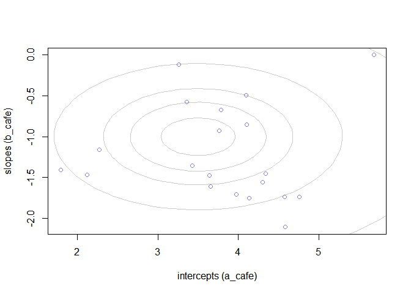
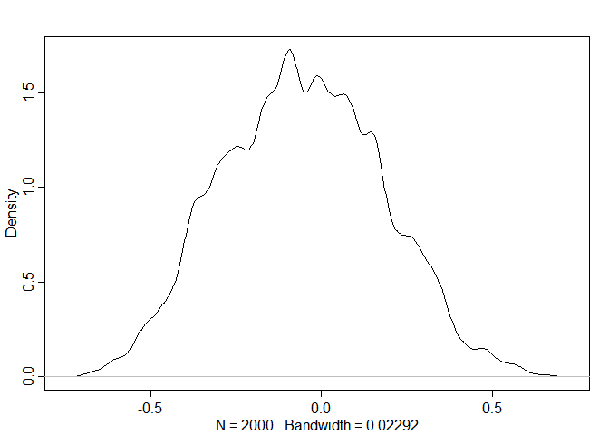
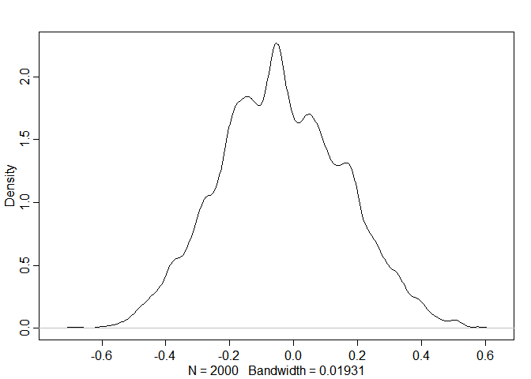

03\_06\_2020\_HW
================
John D.
3/6/2020

``` r
library(rethinking)
```

    ## Loading required package: rstan

    ## Loading required package: StanHeaders

    ## Loading required package: ggplot2

    ## rstan (Version 2.19.2, GitRev: 2e1f913d3ca3)

    ## For execution on a local, multicore CPU with excess RAM we recommend calling
    ## options(mc.cores = parallel::detectCores()).
    ## To avoid recompilation of unchanged Stan programs, we recommend calling
    ## rstan_options(auto_write = TRUE)

    ## For improved execution time, we recommend calling
    ## Sys.setenv(LOCAL_CPPFLAGS = '-march=native')
    ## although this causes Stan to throw an error on a few processors.

    ## Loading required package: parallel

    ## Loading required package: dagitty

    ## rethinking (Version 1.93)

    ## 
    ## Attaching package: 'rethinking'

    ## The following object is masked from 'package:stats':
    ## 
    ##     rstudent

``` r
library(tidyverse)
```

    ## -- Attaching packages ------------------------------------------------------------------------------- tidyverse 1.3.0 --

    ## v tibble  2.1.3     v dplyr   0.8.3
    ## v tidyr   1.0.0     v stringr 1.4.0
    ## v readr   1.3.1     v forcats 0.4.0
    ## v purrr   0.3.3

    ## -- Conflicts ---------------------------------------------------------------------------------- tidyverse_conflicts() --
    ## x tidyr::extract() masks rstan::extract()
    ## x dplyr::filter()  masks stats::filter()
    ## x dplyr::lag()     masks stats::lag()
    ## x purrr::map()     masks rethinking::map()

## 14E1. Add to the following model varying slopes on the predictor x.

  
![
y\_i \\sim Normal(\\mu\_i, \\sigma) \\\\
\\mu\_i = \\alpha\_{group\[i\]} + \\beta x\_i \\\\
\\alpha\_{group} \\sim Normal(\\alpha, \\sigma\_\\alpha) \\\\
\\alpha \\sim Normal(0, 10) \\\\
\\beta \\sim Normal(0, 1) \\\\
\\sigma \\sim HalfCauchy(0, 2) \\\\
\\sigma\_\\alpha \\sim HalfCauchy(0, 2)
](https://latex.codecogs.com/png.latex?%0Ay_i%20%5Csim%20Normal%28%5Cmu_i%2C%20%5Csigma%29%20%5C%5C%0A%5Cmu_i%20%3D%20%5Calpha_%7Bgroup%5Bi%5D%7D%20%2B%20%5Cbeta%20x_i%20%5C%5C%0A%5Calpha_%7Bgroup%7D%20%5Csim%20Normal%28%5Calpha%2C%20%5Csigma_%5Calpha%29%20%5C%5C%0A%5Calpha%20%5Csim%20Normal%280%2C%2010%29%20%5C%5C%0A%5Cbeta%20%5Csim%20Normal%280%2C%201%29%20%5C%5C%0A%5Csigma%20%5Csim%20HalfCauchy%280%2C%202%29%20%20%5C%5C%0A%5Csigma_%5Calpha%20%5Csim%20HalfCauchy%280%2C%202%29%0A
"
y_i \\sim Normal(\\mu_i, \\sigma) \\\\
\\mu_i = \\alpha_{group[i]} + \\beta x_i \\\\
\\alpha_{group} \\sim Normal(\\alpha, \\sigma_\\alpha) \\\\
\\alpha \\sim Normal(0, 10) \\\\
\\beta \\sim Normal(0, 1) \\\\
\\sigma \\sim HalfCauchy(0, 2)  \\\\
\\sigma_\\alpha \\sim HalfCauchy(0, 2)
")  
  
![
y\_i \\sim Normal(\\mu\_i, \\sigma) \\\\
\\mu\_i = \\alpha\_{group\[i\]} + \\beta\_{group} x\_i \\\\
\\left\[ {\\begin{array}{cc}
\\alpha\_{group} \\\\
\\beta\_{group}\\ \\\\
\\end{array} } \\right\] \\sim MVNormal(\\left\[ {\\begin{array}{cc}
\\alpha \\\\
\\beta\\ \\\\
\\end{array} } \\right\], S) \\\\
S = \\left\[ {\\begin{array}{cc}
\\sigma\_\\alpha & 0 \\\\
0 & \\sigma\_\\beta\\ \\\\
\\end{array} } \\right\]
R
\\left\[ {\\begin{array}{cc}
\\sigma\_\\alpha & 0 \\\\
0 & \\sigma\_\\beta\\ \\\\
\\end{array} } \\right\] \\\\ 
\\alpha \\sim Normal(0, 10) \\\\
\\beta \\sim Normal(0, 1) \\\\
\\sigma \\sim HalfCauchy(0, 2) \\\\
\\sigma\_\\alpha \\sim HalfCauchy(0, 2) \\\\
\\sigma\_\\beta \\sim HalfCauchy(0, 2) \\\\
R \\sim LKJcorr(2)
](https://latex.codecogs.com/png.latex?%0Ay_i%20%5Csim%20Normal%28%5Cmu_i%2C%20%5Csigma%29%20%5C%5C%0A%5Cmu_i%20%3D%20%5Calpha_%7Bgroup%5Bi%5D%7D%20%2B%20%5Cbeta_%7Bgroup%7D%20x_i%20%5C%5C%0A%5Cleft%5B%20%7B%5Cbegin%7Barray%7D%7Bcc%7D%0A%20%20%20%5Calpha_%7Bgroup%7D%20%5C%5C%0A%20%20%20%5Cbeta_%7Bgroup%7D%5C%20%5C%5C%0A%20%20%5Cend%7Barray%7D%20%7D%20%5Cright%5D%20%5Csim%20MVNormal%28%5Cleft%5B%20%7B%5Cbegin%7Barray%7D%7Bcc%7D%0A%20%20%20%5Calpha%20%5C%5C%0A%20%20%20%5Cbeta%5C%20%5C%5C%0A%20%20%5Cend%7Barray%7D%20%7D%20%5Cright%5D%2C%20S%29%20%5C%5C%0AS%20%3D%20%20%5Cleft%5B%20%7B%5Cbegin%7Barray%7D%7Bcc%7D%0A%20%20%20%5Csigma_%5Calpha%20%26%200%20%5C%5C%0A%20%20%200%20%26%20%5Csigma_%5Cbeta%5C%20%5C%5C%0A%20%20%5Cend%7Barray%7D%20%7D%20%5Cright%5D%0A%20%20R%0A%20%20%5Cleft%5B%20%7B%5Cbegin%7Barray%7D%7Bcc%7D%0A%20%20%20%5Csigma_%5Calpha%20%26%200%20%5C%5C%0A%20%20%200%20%26%20%5Csigma_%5Cbeta%5C%20%5C%5C%0A%20%20%5Cend%7Barray%7D%20%7D%20%5Cright%5D%20%5C%5C%20%0A%5Calpha%20%5Csim%20Normal%280%2C%2010%29%20%5C%5C%0A%5Cbeta%20%5Csim%20Normal%280%2C%201%29%20%5C%5C%0A%5Csigma%20%5Csim%20HalfCauchy%280%2C%202%29%20%20%5C%5C%0A%5Csigma_%5Calpha%20%5Csim%20HalfCauchy%280%2C%202%29%20%5C%5C%0A%5Csigma_%5Cbeta%20%5Csim%20HalfCauchy%280%2C%202%29%20%5C%5C%0AR%20%5Csim%20LKJcorr%282%29%0A
"
y_i \\sim Normal(\\mu_i, \\sigma) \\\\
\\mu_i = \\alpha_{group[i]} + \\beta_{group} x_i \\\\
\\left[ {\\begin{array}{cc}
   \\alpha_{group} \\\\
   \\beta_{group}\\ \\\\
  \\end{array} } \\right] \\sim MVNormal(\\left[ {\\begin{array}{cc}
   \\alpha \\\\
   \\beta\\ \\\\
  \\end{array} } \\right], S) \\\\
S =  \\left[ {\\begin{array}{cc}
   \\sigma_\\alpha & 0 \\\\
   0 & \\sigma_\\beta\\ \\\\
  \\end{array} } \\right]
  R
  \\left[ {\\begin{array}{cc}
   \\sigma_\\alpha & 0 \\\\
   0 & \\sigma_\\beta\\ \\\\
  \\end{array} } \\right] \\\\ 
\\alpha \\sim Normal(0, 10) \\\\
\\beta \\sim Normal(0, 1) \\\\
\\sigma \\sim HalfCauchy(0, 2)  \\\\
\\sigma_\\alpha \\sim HalfCauchy(0, 2) \\\\
\\sigma_\\beta \\sim HalfCauchy(0, 2) \\\\
R \\sim LKJcorr(2)
")  
\#\# 14E2. Think up a context in which varying intercepts will be
positively correlated with varying slopes. Provide a mechanistic
explanation for the correlation

Movie theaters and their attendence throughout the day. Popular theaters
will have a higher attendence at any time of the day compared to less
popular theaters. At peak times like night, both theaters will have
higher attendence with the more popular theater having a larger
increase.

## 14E3. When is it possible for a varying slopes model to have fewer effective parameters (as estimated by WAIC or DIC) than the corresponding model with fixed (unpooled) slopes? Explain.

Highly correlated groups

## 14M1. Repeat the café robot simulation from the beginning of the chapter. This time, set rho to zero, so that there is no correlation between intercepts and slopes. How does the posterior distribution of the correlation reflect this change in the underlying simulation?

``` r
a <- 3.5 # average morning wait time
b <- (-1) # average difference afternoon wait time
sigma_a <- 1 # std dev in intercepts
sigma_b <- 0.5 # std dev in slopes
rho <- (0) # correlation between intercepts and slopes
Mu <- c( a , b ) # Vector of means for multivariate
cov_ab <- sigma_a*sigma_b*rho # Create off diagonal value for 2X2 matrix
Sigma <- matrix( c(sigma_a^2,cov_ab,cov_ab,sigma_b^2) , ncol=2 ) # Make var-cov matrix
sigmas <- c(sigma_a,sigma_b) # standard deviations
N_cafes <- 20
library(MASS)
```

    ## 
    ## Attaching package: 'MASS'

    ## The following object is masked from 'package:dplyr':
    ## 
    ##     select

``` r
set.seed(5) # used to replicate example
vary_effects <- mvrnorm( N_cafes, Mu, Sigma)
a_cafe <- vary_effects[,1]
b_cafe <- vary_effects[,2]
plot(a_cafe, b_cafe, col = rangi2,
     xlab = "intercepts (a_cafe)",
     ylab = "slopes (b_cafe)")
# overlay population distribution
library(ellipse)
```

    ## Warning: package 'ellipse' was built under R version 3.6.3

    ## 
    ## Attaching package: 'ellipse'

    ## The following object is masked from 'package:rethinking':
    ## 
    ##     pairs

    ## The following object is masked from 'package:graphics':
    ## 
    ##     pairs

``` r
for (l in c(0.1, 0.3, 0.5, 0.8, 0.99))
  lines(ellipse(Sigma, centre = Mu, level = l), col = col.alpha("black", 0.2))
```

<!-- -->

``` r
set.seed(22)
N_visits <- 10
afternoon <- rep(0:1,N_visits*N_cafes/2)
cafe_id <- rep( 1:N_cafes , each=N_visits )
mu <- a_cafe[cafe_id] + b_cafe[cafe_id]*afternoon
sigma <- 0.5 # std dev within cafes
wait <- rnorm( N_visits*N_cafes , mu , sigma )
d <- data.frame( cafe=cafe_id , afternoon=afternoon , wait=wait )

m14.1M <- ulam(
  alist(
    wait ~ normal(mu , sigma),
    mu <- a_cafe[cafe] + b_cafe[cafe] * afternoon,
    c(a_cafe, b_cafe)[cafe] ~ multi_normal(c(a, b) , Rho , sigma_cafe),
    a ~ normal(5, 2),
    b ~ normal(-1, 0.5),
    sigma_cafe ~ exponential(1),
    sigma ~ exponential(1),
    Rho ~ lkj_corr(2)
  ) ,
  data = d,
  chains = 4,
  cores = 4
)

post <- extract.samples(m14.1M)
dens( post$Rho[,1,2] )
```

<!-- -->

It’s mostly around 0, but tails do extend past |0.5|

Trying again with stronger eta

``` r
m14.1Ma <- ulam(
  alist(
    wait ~ normal(mu , sigma),
    mu <- a_cafe[cafe] + b_cafe[cafe] * afternoon,
    c(a_cafe, b_cafe)[cafe] ~ multi_normal(c(a, b) , Rho , sigma_cafe),
    a ~ normal(5, 2),
    b ~ normal(-1, 0.5),
    sigma_cafe ~ exponential(1),
    sigma ~ exponential(1),
    Rho ~ lkj_corr(5)
  ) ,
  data = d,
  chains = 4,
  cores = 4
)

post <- extract.samples(m14.1Ma)
dens( post$Rho[,1,2] )
```

<!-- -->

look at correlation of posterior

``` r
tail(precis(m14.1M, depth = 3), 4)
```

    ##                 mean           sd       5.5%     94.5%    n_eff      Rhat
    ## Rho[1,1]  1.00000000 0.000000e+00  1.0000000 1.0000000      NaN       NaN
    ## Rho[1,2] -0.05484702 2.329309e-01 -0.4145996 0.3208136 1915.966 0.9998047
    ## Rho[2,1] -0.05484702 2.329309e-01 -0.4145996 0.3208136 1915.966 0.9998047
    ## Rho[2,2]  1.00000000 9.484872e-17  1.0000000 1.0000000 1980.732 0.9979980

``` r
tail(precis(m14.1Ma, depth = 3), 4)
```

    ##                 mean           sd       5.5%     94.5%    n_eff      Rhat
    ## Rho[1,1]  1.00000000 0.000000e+00  1.0000000 1.0000000      NaN       NaN
    ## Rho[1,2] -0.03803653 1.962536e-01 -0.3520513 0.2832866 2299.730 0.9988727
    ## Rho[2,1] -0.03803653 1.962536e-01 -0.3520513 0.2832866 2299.730 0.9988727
    ## Rho[2,2]  1.00000000 9.160789e-17  1.0000000 1.0000000 2023.002 0.9979980

Looks like a correlation is about 0

## 14M2. Fit this multilevel model to the simulated café data:

  
![
W\_i \\sim Normal(\\mu\_i, \\sigma) \\\\
\\mu\_i = \\alpha\_{cafe\[i\]} + \\beta\_{cafe\[i\]}A\_i \\\\
\\alpha\_{cafe} \\sim Normal(\\alpha, \\sigma\_\\alpha) \\\\
\\beta\_{cafe} \\sim Normal(\\beta, \\sigma\_\\beta) \\\\
\\alpha \\sim Normal(0, 10) \\\\
\\beta \\sim Normal(0, 10) \\\\
\\sigma \\sim HalfCauchy(0, 1) \\\\
\\sigma\_\\alpha \\sim HalfCauchy(0, 1) \\\\
\\sigma\_\\beta \\sim HalfCauchy(0, 1) \\\\
](https://latex.codecogs.com/png.latex?%0AW_i%20%5Csim%20Normal%28%5Cmu_i%2C%20%5Csigma%29%20%5C%5C%0A%5Cmu_i%20%3D%20%5Calpha_%7Bcafe%5Bi%5D%7D%20%2B%20%5Cbeta_%7Bcafe%5Bi%5D%7DA_i%20%5C%5C%0A%5Calpha_%7Bcafe%7D%20%5Csim%20Normal%28%5Calpha%2C%20%5Csigma_%5Calpha%29%20%5C%5C%0A%5Cbeta_%7Bcafe%7D%20%5Csim%20Normal%28%5Cbeta%2C%20%5Csigma_%5Cbeta%29%20%5C%5C%0A%5Calpha%20%5Csim%20Normal%280%2C%2010%29%20%5C%5C%0A%5Cbeta%20%5Csim%20Normal%280%2C%2010%29%20%20%5C%5C%0A%5Csigma%20%5Csim%20HalfCauchy%280%2C%201%29%20%5C%5C%0A%5Csigma_%5Calpha%20%5Csim%20HalfCauchy%280%2C%201%29%20%20%5C%5C%0A%5Csigma_%5Cbeta%20%5Csim%20HalfCauchy%280%2C%201%29%20%5C%5C%0A
"
W_i \\sim Normal(\\mu_i, \\sigma) \\\\
\\mu_i = \\alpha_{cafe[i]} + \\beta_{cafe[i]}A_i \\\\
\\alpha_{cafe} \\sim Normal(\\alpha, \\sigma_\\alpha) \\\\
\\beta_{cafe} \\sim Normal(\\beta, \\sigma_\\beta) \\\\
\\alpha \\sim Normal(0, 10) \\\\
\\beta \\sim Normal(0, 10)  \\\\
\\sigma \\sim HalfCauchy(0, 1) \\\\
\\sigma_\\alpha \\sim HalfCauchy(0, 1)  \\\\
\\sigma_\\beta \\sim HalfCauchy(0, 1) \\\\
")  

Use WAIC to compare this model to the model from the chapter, the one
that uses a multi-variate Gaussian prior. Explain the result.

``` r
# Bring original simulated data set in
a <- 3.5 # average morning wait time
b <- (-1) # average difference afternoon wait time
sigma_a <- 1 # std dev in intercepts
sigma_b <- 0.5 # std dev in slopes
rho <- (-0.7) # correlation between intercepts and slopes
Mu <- c( a , b ) # Vector of means for multivariate
cov_ab <- sigma_a*sigma_b*rho # Create off diagonal value for 2X2 matrix
Sigma <- matrix( c(sigma_a^2,cov_ab,cov_ab,sigma_b^2) , ncol=2 ) # Make var-cov matrix
sigmas <- c(sigma_a,sigma_b) # standard deviations
N_cafes <- 20
set.seed(5) # used to replicate example
vary_effects <- mvrnorm( N_cafes, Mu, Sigma)
a_cafe <- vary_effects[,1]
b_cafe <- vary_effects[,2]
set.seed(22)
N_visits <- 10
afternoon <- rep(0:1,N_visits*N_cafes/2)
cafe_id <- rep( 1:N_cafes , each=N_visits )
mu <- a_cafe[cafe_id] + b_cafe[cafe_id]*afternoon
sigma <- 0.5 # std dev within cafes
wait <- rnorm( N_visits*N_cafes , mu , sigma )
d <- data.frame( cafe=cafe_id , afternoon=afternoon , wait=wait )

# orignal model
m14.1 <- ulam(
  alist(
    wait ~ normal(mu , sigma),
    mu <- a_cafe[cafe] + b_cafe[cafe] * afternoon,
    c(a_cafe, b_cafe)[cafe] ~ multi_normal(c(a, b) , Rho , sigma_cafe),
    a ~ normal(5, 2),
    b ~ normal(-1, 0.5),
    sigma_cafe ~ exponential(1),
    sigma ~ exponential(1),
    Rho ~ lkj_corr(2)
  ) ,
  data = d,
  chains = 4,
  cores = 4,
  log_lik = T
)

# new model
m14.2 <- ulam(
  alist(
    wait ~ normal(mu , sigma),
    mu <- a_cafe[cafe] + b_cafe[cafe] * afternoon,
    a_cafe[cafe] ~ normal(a, sigma_a),
    b_cafe[cafe] ~ normal(b, sigma_b),
    a ~ normal(5, 2),
    b ~ normal(-1, 0.5),
    sigma ~ exponential(1),
    sigma_a ~ exponential(1),
    sigma_b ~ exponential(1)
  ) ,
  data = d,
  chains = 4,
  cores = 4,
  log_lik = T
)

compare(m14.1,m14.2)
```

    ##           WAIC       SE     dWAIC      dSE    pWAIC    weight
    ## m14.1 306.3813 17.81729 0.0000000       NA 33.47098 0.5176761
    ## m14.2 306.5228 18.09208 0.1414677 2.277068 32.48474 0.4823239

Basically the same except the varying intercepts and slopes model does
slightly better. New model had varying slopes and intercepts, just no
covariance.
