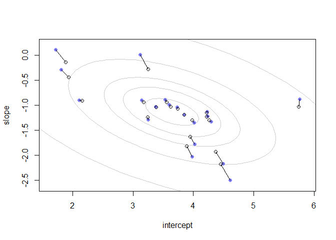

```r
library(tidyverse)
```

```
## -- Attaching packages ----------------------------------------------------------------------------------------- tidyverse 1.3.0 --
```

```
## v ggplot2 3.2.1     v purrr   0.3.3
## v tibble  2.1.3     v dplyr   0.8.4
## v tidyr   1.0.2     v stringr 1.4.0
## v readr   1.3.1     v forcats 0.5.0
```

```
## -- Conflicts -------------------------------------------------------------------------------------------- tidyverse_conflicts() --
## x dplyr::filter() masks stats::filter()
## x dplyr::lag()    masks stats::lag()
```

```r
library(rethinking)
```

```
## Loading required package: rstan
```

```
## Loading required package: StanHeaders
```

```
## rstan (Version 2.19.3, GitRev: 2e1f913d3ca3)
```

```
## For execution on a local, multicore CPU with excess RAM we recommend calling
## options(mc.cores = parallel::detectCores()).
## To avoid recompilation of unchanged Stan programs, we recommend calling
## rstan_options(auto_write = TRUE)
```

```
## For improved execution time, we recommend calling
## Sys.setenv(LOCAL_CPPFLAGS = '-march=corei7 -mtune=corei7')
## although this causes Stan to throw an error on a few processors.
```

```
## 
## Attaching package: 'rstan'
```

```
## The following object is masked from 'package:tidyr':
## 
##     extract
```

```
## Loading required package: parallel
```

```
## Loading required package: dagitty
```

```
## rethinking (Version 1.95)
```

```
## 
## Attaching package: 'rethinking'
```

```
## The following object is masked from 'package:purrr':
## 
##     map
```

```
## The following object is masked from 'package:stats':
## 
##     rstudent
```

# Ch.14 Adventures in Covariance
## 14.1. Varying slopes by construction
### 14.1.1. Simulate the population


```r
a <- 3.5 # average morning wait time
b <- (-1) # average difference afternoon wait time
sigma_a <- 1 # std dev in intercepts
sigma_b <- 0.5 # std dev in slopes
rho <- (-0.7) # correlation between intercepts and slopes
```


```r
Mu <- c( a , b ) # Vector of means for multivariate
```


```r
cov_ab <- sigma_a*sigma_b*rho # Create off diagonal value for 2X2 matrix
Sigma <- matrix( c(sigma_a^2,cov_ab,cov_ab,sigma_b^2) , ncol=2 ) # Make var-cov matrix
Sigma
```

```
##       [,1]  [,2]
## [1,]  1.00 -0.35
## [2,] -0.35  0.25
```


```r
matrix( c(1,2,3,4) , nrow=2 , ncol=2 ) # Showing R fills matrices column first by default
```

```
##      [,1] [,2]
## [1,]    1    3
## [2,]    2    4
```


```r
sigmas <- c(sigma_a,sigma_b) # standard deviations
Rho <- matrix( c(1,rho,rho,1) , nrow=2 ) # correlation matrix

diag(sigmas)
```

```
##      [,1] [,2]
## [1,]    1  0.0
## [2,]    0  0.5
```

```r
# now matrix multiply to get covariance matrix
Sigma <- diag(sigmas) %*% Rho %*% diag(sigmas)
Sigma
```

```
##       [,1]  [,2]
## [1,]  1.00 -0.35
## [2,] -0.35  0.25
```


```r
N_cafes <- 20
```


```r
library(MASS)
```

```
## 
## Attaching package: 'MASS'
```

```
## The following object is masked from 'package:dplyr':
## 
##     select
```

```r
set.seed(5) # used to replicate example
vary_effects <- mvrnorm( N_cafes, Mu, Sigma)
```


```r
head(vary_effects)
```

```
##          [,1]       [,2]
## [1,] 4.223962 -1.6093565
## [2,] 2.010498 -0.7517704
## [3,] 4.565811 -1.9482646
## [4,] 3.343635 -1.1926539
## [5,] 1.700971 -0.5855618
## [6,] 4.134373 -1.1444539
```

```r
# Split for convenience, first column is intercept and second is slope
a_cafe <- vary_effects[,1]
b_cafe <- vary_effects[,2]
```


```r
plot(a_cafe, b_cafe, col = rangi2,
     xlab = "intercepts (a_cafe)",
     ylab = "slopes (b_cafe)")
# overlay population distribution
library(ellipse)
```

```
## 
## Attaching package: 'ellipse'
```

```
## The following object is masked from 'package:rethinking':
## 
##     pairs
```

```
## The following object is masked from 'package:graphics':
## 
##     pairs
```

```r
for (l in c(0.1, 0.3, 0.5, 0.8, 0.99))
  lines(ellipse(Sigma, centre = Mu, level = l), col = col.alpha("black", 0.2))
```

<!-- -->

### 14.1.2. Simulate observations


```r
set.seed(22)
N_visits <- 10
afternoon <- rep(0:1,N_visits*N_cafes/2)
cafe_id <- rep( 1:N_cafes , each=N_visits )
mu <- a_cafe[cafe_id] + b_cafe[cafe_id]*afternoon
sigma <- 0.5 # std dev within cafes
wait <- rnorm( N_visits*N_cafes , mu , sigma )
d <- data.frame( cafe=cafe_id , afternoon=afternoon , wait=wait )
head(d)
```

```
##   cafe afternoon     wait
## 1    1         0 3.967893
## 2    1         1 3.857198
## 3    1         0 4.727875
## 4    1         1 2.761013
## 5    1         0 4.119483
## 6    1         1 3.543652
```

### 14.1.3. The varying slopes model.


```r
R <- rlkjcorr( 1e4 , K=2 , eta=2 )
dens( R[,1,2] , xlab="correlation" )
```

<!-- -->


```r
m14.1 <- ulam(
  alist(
    wait ~ normal(mu , sigma),
    mu <- a_cafe[cafe] + b_cafe[cafe] * afternoon,
    c(a_cafe, b_cafe)[cafe] ~ multi_normal(c(a, b) , Rho , sigma_cafe),
    a ~ normal(5, 2),
    b ~ normal(-1, 0.5),
    sigma_cafe ~ exponential(1),
    sigma ~ exponential(1),
    Rho ~ lkj_corr(2)
  ) ,
  data = d,
  chains = 4,
  cores = 4
)
```

```
## Warning: The largest R-hat is NA, indicating chains have not mixed.
## Running the chains for more iterations may help. See
## http://mc-stan.org/misc/warnings.html#r-hat
```

```
## Warning: Bulk Effective Samples Size (ESS) is too low, indicating posterior means and medians may be unreliable.
## Running the chains for more iterations may help. See
## http://mc-stan.org/misc/warnings.html#bulk-ess
```

```
## Warning: Tail Effective Samples Size (ESS) is too low, indicating posterior variances and tail quantiles may be unreliable.
## Running the chains for more iterations may help. See
## http://mc-stan.org/misc/warnings.html#tail-ess
```

```r
# Repeat for different nus
m14.1a <- ulam(
  alist(
    wait ~ normal(mu , sigma),
    mu <- a_cafe[cafe] + b_cafe[cafe] * afternoon,
    c(a_cafe, b_cafe)[cafe] ~ multi_normal(c(a, b) , Rho , sigma_cafe),
    a ~ normal(5, 2),
    b ~ normal(-1, 0.5),
    sigma_cafe ~ exponential(1),
    sigma ~ exponential(1),
    Rho ~ lkj_corr(1)
  ) ,
  data = d,
  chains = 4,
  cores = 4
)
```

```
## Warning: The largest R-hat is NA, indicating chains have not mixed.
## Running the chains for more iterations may help. See
## http://mc-stan.org/misc/warnings.html#r-hat
```

```
## Warning: Bulk Effective Samples Size (ESS) is too low, indicating posterior means and medians may be unreliable.
## Running the chains for more iterations may help. See
## http://mc-stan.org/misc/warnings.html#bulk-ess
```

```
## Warning: Tail Effective Samples Size (ESS) is too low, indicating posterior variances and tail quantiles may be unreliable.
## Running the chains for more iterations may help. See
## http://mc-stan.org/misc/warnings.html#tail-ess
```

```r
m14.1b <- ulam(
  alist(
    wait ~ normal(mu , sigma),
    mu <- a_cafe[cafe] + b_cafe[cafe] * afternoon,
    c(a_cafe, b_cafe)[cafe] ~ multi_normal(c(a, b) , Rho , sigma_cafe),
    a ~ normal(5, 2),
    b ~ normal(-1, 0.5),
    sigma_cafe ~ exponential(1),
    sigma ~ exponential(1),
    Rho ~ lkj_corr(4)
  ) ,
  data = d,
  chains = 4,
  cores = 4
)
```

```
## Warning: The largest R-hat is NA, indicating chains have not mixed.
## Running the chains for more iterations may help. See
## http://mc-stan.org/misc/warnings.html#r-hat
```

```
## Warning: Bulk Effective Samples Size (ESS) is too low, indicating posterior means and medians may be unreliable.
## Running the chains for more iterations may help. See
## http://mc-stan.org/misc/warnings.html#bulk-ess
```

```
## Warning: Tail Effective Samples Size (ESS) is too low, indicating posterior variances and tail quantiles may be unreliable.
## Running the chains for more iterations may help. See
## http://mc-stan.org/misc/warnings.html#tail-ess
```

```r
m14.1c <- ulam(
  alist(
    wait ~ normal(mu , sigma),
    mu <- a_cafe[cafe] + b_cafe[cafe] * afternoon,
    c(a_cafe, b_cafe)[cafe] ~ multi_normal(c(a, b) , Rho , sigma_cafe),
    a ~ normal(5, 2),
    b ~ normal(-1, 0.5),
    sigma_cafe ~ exponential(1),
    sigma ~ exponential(1),
    Rho ~ lkj_corr(5)
  ) ,
  data = d,
  chains = 4,
  cores = 4
)
```

```
## Warning: The largest R-hat is NA, indicating chains have not mixed.
## Running the chains for more iterations may help. See
## http://mc-stan.org/misc/warnings.html#r-hat
```

```
## Warning: Bulk Effective Samples Size (ESS) is too low, indicating posterior means and medians may be unreliable.
## Running the chains for more iterations may help. See
## http://mc-stan.org/misc/warnings.html#bulk-ess
```

```
## Warning: Tail Effective Samples Size (ESS) is too low, indicating posterior variances and tail quantiles may be unreliable.
## Running the chains for more iterations may help. See
## http://mc-stan.org/misc/warnings.html#tail-ess
```


```r
post <- extract.samples(m14.1)
dens( post$Rho[,1,2] )
post <- extract.samples(m14.1a)
dens( post$Rho[,1,2], add = T, col = "red")
post <- extract.samples(m14.1b)
dens( post$Rho[,1,2], add = T, col = "green")
post <- extract.samples(m14.1c)
dens( post$Rho[,1,2], add = T, col = "blue")
```

<!-- -->


```r
# compute unpooled estimates directly from data
a1 <- sapply( 1:N_cafes ,
function(i) mean(wait[cafe_id==i & afternoon==0]) )
b1 <- sapply( 1:N_cafes ,
function(i) mean(wait[cafe_id==i & afternoon==1]) ) - a1
# extract posterior means of partially pooled estimates
post <- extract.samples(m14.1)
a2 <- apply( post$a_cafe , 2 , mean )
b2 <- apply( post$b_cafe , 2 , mean )
# plot both and connect with lines
plot( a1 , b1 , xlab="intercept" , ylab="slope" ,
pch=16 , col=rangi2 , ylim=c( min(b1)-0.1 , max(b1)+0.1 ) ,
xlim=c( min(a1)-0.1 , max(a1)+0.1 ) )
points( a2 , b2 , pch=1 )
for ( i in 1:N_cafes ) lines( c(a1[i],a2[i]) , c(b1[i],b2[i]) )
# compute posterior mean bivariate Gaussian
Mu_est <- c( mean(post$a) , mean(post$b) )
rho_est <- mean( post$Rho[,1,2] )
sa_est <- mean( post$sigma_cafe[,1] )
sb_est <- mean( post$sigma_cafe[,2] )
cov_ab <- sa_est*sb_est*rho_est
Sigma_est <- matrix( c(sa_est^2,cov_ab,cov_ab,sb_est^2) , ncol=2 )
# draw contours
library(ellipse)
for ( l in c(0.1,0.3,0.5,0.8,0.99) )
lines(ellipse(Sigma_est,centre=Mu_est,level=l),
col=col.alpha("black",0.2))
```

<!-- -->


```r
# convert varying effects to waiting times
wait_morning_1 <- (a1)
wait_afternoon_1 <- (a1 + b1)
wait_morning_2 <- (a2)
wait_afternoon_2 <- (a2 + b2)
# plot both and connect with lines
plot( wait_morning_1 , wait_afternoon_1 , xlab="morning wait" ,
ylab="afternoon wait" , pch=16 , col=rangi2 ,
ylim=c( min(wait_afternoon_1)-0.1 , max(wait_afternoon_1)+0.1 ) ,
xlim=c( min(wait_morning_1)-0.1 , max(wait_morning_1)+0.1 ) )
points( wait_morning_2 , wait_afternoon_2 , pch=1 )
for ( i in 1:N_cafes )
lines( c(wait_morning_1[i],wait_morning_2[i]) ,
c(wait_afternoon_1[i],wait_afternoon_2[i]) )
abline( a=0 , b=1 , lty=2 )

# now shrinkage distribution by simulation
v <- mvrnorm( 1e4 , Mu_est , Sigma_est )
v[,2] <- v[,1] + v[,2] # calculate afternoon wait
Sigma_est2 <- cov(v)
Mu_est2 <- Mu_est
Mu_est2[2] <- Mu_est[1]+Mu_est[2]
# draw contours
library(ellipse)
for ( l in c(0.1,0.3,0.5,0.8,0.99) )
lines(ellipse(Sigma_est2,centre=Mu_est2,level=l),
col=col.alpha("black",0.5))
```

<!-- -->

