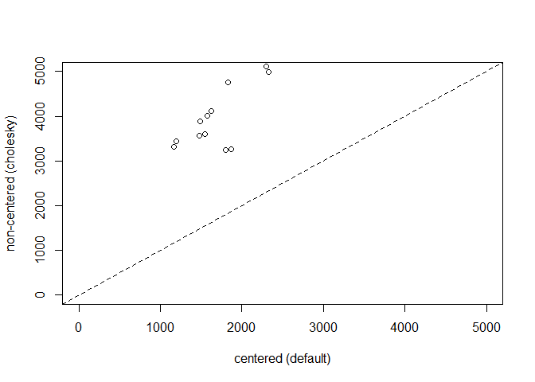
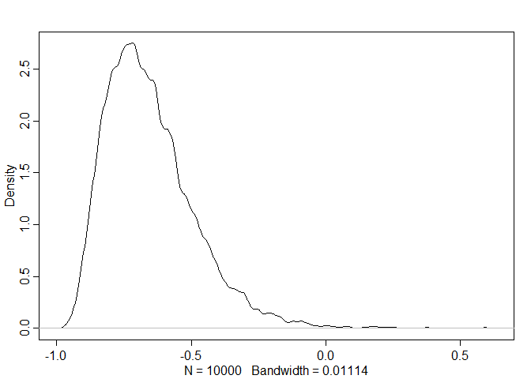
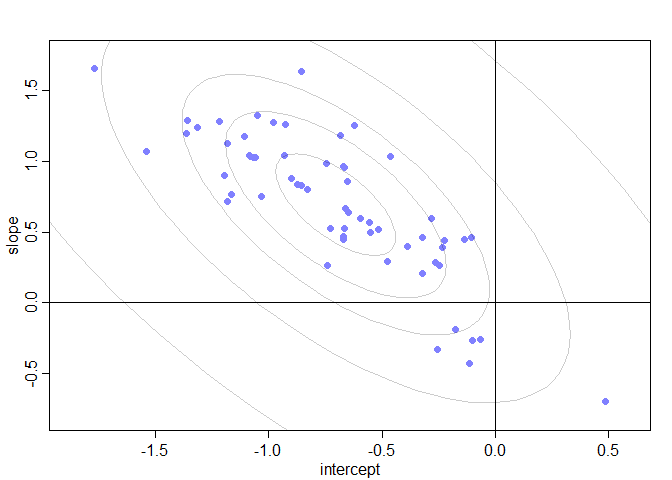
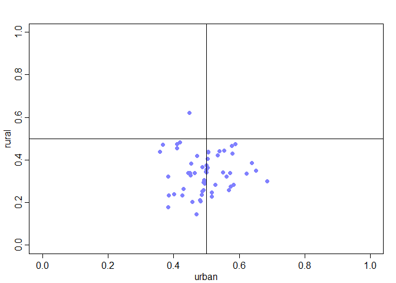
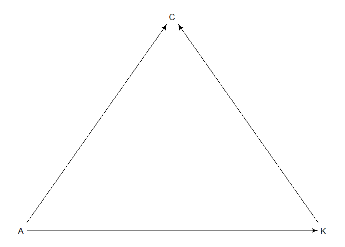

03\_13\_2020\_HW
================
John Davis
03\_13\_2020

``` r
library(rethinking)
library(tidyverse)
```

## 14M3. Re-estimate the varying slopes model for the UCBadmit data, now using a non-centered parameterization. Compare the efficiency of the forms of the model, using n\_eff. Which is better? Which chain sampled faster?

``` r
data(UCBadmit)
d <- UCBadmit

dat_list <- list(
  admit = d$admit,
  applications = d$applications,
  gender = ifelse(d$applicant.gender == "male" , 1 , 2),
  dept = rep(1:6, each = 2)
)

system.time(
  m14m3.centered <- ulam(
    alist(
      admit ~ dbinom(applications, p),
      logit(p) <- a[dept] + beta[gender, dept],
      # adaptive prior
      vector[6]:beta[gender] ~ multi_normal(0, Rho_gender, sigma_gender),
      # fixed priors
      a[dept] ~ dnorm(0, 1),
      sigma_gender ~ dexp(1),
      Rho_gender ~ dlkjcorr(4)
    ),
    data = dat_list,
    chains = 4,
    cores = 4,
    iter = 5000,
    log_lik = T
  )
)
```

    ## Warning: There were 272 divergent transitions after warmup. Increasing adapt_delta above 0.95 may help. See
    ## http://mc-stan.org/misc/warnings.html#divergent-transitions-after-warmup

    ## Warning: There were 4 transitions after warmup that exceeded the maximum treedepth. Increase max_treedepth above 10. See
    ## http://mc-stan.org/misc/warnings.html#maximum-treedepth-exceeded

    ## Warning: Examine the pairs() plot to diagnose sampling problems

    ##    user  system elapsed 
    ##    3.03    0.81  103.78

``` r
system.time(
  m14m3.noncentered <- ulam(
    alist(
      admit ~ dbinom(applications, p),
      logit(p) <- a[dept] + beta[gender, dept],
      # adaptive prior - non-centered
      transpars > matrix[gender, 6]:beta <-
        compose_noncentered(sigma_gender, L_Rho_gender, z_gender),
      matrix[6, gender]:z_gender ~ dnorm(0, 1),
      # fixed priors
      a[dept] ~ dnorm(0, 1),
      vector[6]:sigma_gender ~ dexp(1),
      cholesky_factor_corr[6]:L_Rho_gender ~ lkj_corr_cholesky(2),
      # compute ordinary correlation matrixes from Cholskey factors
      gq > matrix[6, 6]:Rho_gender <<-
        multiply_lower_tri_self_transpose(L_Rho_gender)
    ),
    data = dat_list,
    chains = 4,
    cores = 4,
    iter = 5000,
    log_lik = T
  )
)
```

    ## Warning: There were 11 divergent transitions after warmup. Increasing adapt_delta above 0.95 may help. See
    ## http://mc-stan.org/misc/warnings.html#divergent-transitions-after-warmup
    
    ## Warning: Examine the pairs() plot to diagnose sampling problems

    ##    user  system elapsed 
    ##    3.54    0.88   66.85

``` r
compare(m14m3.centered,m14m3.noncentered)
```

    ##                       WAIC       SE     dWAIC       dSE    pWAIC    weight
    ## m14m3.noncentered 86.78779 3.897608 0.0000000        NA 5.028720 0.5309513
    ## m14m3.centered    87.03572 3.906843 0.2479271 0.1983532 5.158859 0.4690487

``` r
neff_nc <- precis(m14m3.noncentered,pars=c("beta"), depth = 3)$n_eff
neff_c <- precis(m14m3.centered,pars=c("beta"), depth = 3)$n_eff
plot( neff_c , neff_nc , xlab="centered (default)" ,
ylab="non-centered (cholesky)" , lwd=1.5, xlim = c(0,5000), ylim = c(0,5000))
abline(a=0,b=1,lty=2)
```

<!-- -->

Non-centered model was twice as fast. Way more effective samples in the
non-centered model

# PDF

### 1\. Revisit the Bangladesh fertility data, `data(bangladesh)`. Fit a model with both varying intercepts by `district_id` and varying slopes of `urban` (as a 0/1 indicator variable) by `district_id`. You are still predicting `use.contraception`. Inspect the correlation between the slopes and the intercepts. Can you interpret this correlation in terms of what it tells you about the pattern of contraceptive use in the sample? It might help to play the varying effect estimates for both the intercepts and slops, by district. Then you can visualize the correlation and maybe more easily think throught what it means to have a particular correlation. Plotting predicted proportion of women using contraception, in each district, with urban women on one axis and rural on the other might also help/

``` r
data("bangladesh")
d <- bangladesh

dat_list <- list(
  district = as.integer(as.factor(d$district)),
  contraception = d$use.contraception,
  urban = d$urban
)

# Make it like the model m14.1
model1.1 <- ulam(
  alist(
    contraception ~ binomial(1,p),
    logit(p) <- alpha[district] + beta[district]*urban,
    c(alpha,beta)[district] ~ multi_normal(c(a,b), Rho, Sigma),
    a ~ dnorm(0,1),
    b ~ dnorm(0,1),
    Rho ~ lkj_corr(2),
    Sigma ~ dexp(1)
  ),
  data = dat_list,
  chains = 4,
  cores = 4,
  iter = 5000,
  log_lik = T
)

precis(model1.1, depth = 3, pars = c("a","b","Rho","Sigma"))
```

    ##                mean           sd       5.5%      94.5%    n_eff      Rhat
    ## a        -0.7042087 1.003563e-01 -0.8676785 -0.5490729 7321.695 1.0001208
    ## b         0.6931125 1.700225e-01  0.4252970  0.9664145 4946.196 1.0004695
    ## Rho[1,1]  1.0000000 0.000000e+00  1.0000000  1.0000000      NaN       NaN
    ## Rho[1,2] -0.6529403 1.668372e-01 -0.8652567 -0.3560667 1794.528 1.0028352
    ## Rho[2,1] -0.6529403 1.668372e-01 -0.8652567 -0.3560667 1794.528 1.0028352
    ## Rho[2,2]  1.0000000 5.899122e-17  1.0000000  1.0000000 8681.353 0.9995999
    ## Sigma[1]  0.5769478 9.927820e-02  0.4274560  0.7423236 2187.074 1.0013465
    ## Sigma[2]  0.7791280 2.077404e-01  0.4515016  1.1150400  972.965 1.0031446

``` r
post <- extract.samples(model1.1)

dens( post$Rho[,1,2] )
```

<!-- -->

``` r
a <- apply(post$alpha, 2, mean)
b <- apply(post$beta, 2, mean)
plot(
  a ,
  b ,
  xlab = "intercept" ,
  ylab = "slope" ,
  pch = 16 ,
  col = rangi2 ,
  ylim = c(min(b) - 0.1 , max(b) + 0.1) ,
  xlim = c(min(a) - 0.1 , max(a) + 0.1)
)

# compute posterior mean bivariate Gaussian
Mu_est <- c( mean(post$a) , mean(post$b) )
rho_est <- mean( post$Rho[,1,2] )
sa_est <- mean( post$Sigma[,1] )
sb_est <- mean( post$Sigma[,2] )
cov_ab <- sa_est*sb_est*rho_est
Sigma_est <- matrix( c(sa_est^2,cov_ab,cov_ab,sb_est^2) , ncol=2 )
# draw contours
library(ellipse)
```

    ## Warning: package 'ellipse' was built under R version 3.6.3

    ## 
    ## Attaching package: 'ellipse'

    ## The following object is masked from 'package:rethinking':
    ## 
    ##     pairs

    ## The following object is masked from 'package:graphics':
    ## 
    ##     pairs

``` r
for ( l in c(0.1,0.3,0.5,0.8,0.99) )
lines(ellipse(Sigma_est,centre=Mu_est,level=l),
col=col.alpha("black",0.2))
abline(h=0)
abline(v=0)
```

<!-- -->

``` r
rural <- inv_logit(a)
urban <- inv_logit(a + b)

plot(
  urban ,
  rural ,
  xlab = "urban" ,
  ylab = "rural" ,
  pch = 16 ,
  col = rangi2 ,
  ylim = c(0,1) ,
  xlim = c(0,1)
)

abline(h=0.5)
abline(v=0.5)
```

<!-- -->

Looks like being in an urban area increases probability of using
contraception. Negative correlation between alpha and beta though. Rural
use looks to be highly variable no matter what the urban use is.

### 2\. Now consider the predictor variables `age.centered` and `living.children`, also contained in `data(bangladesh)`. Suppose that age influences contraceptive use (changing attitudes) and number of children (older people have had more time to have kids). Number of children may also directly influence contraceptive use. Draw a DAG that reflects these hypothetical relationships. Then build models needed to evaulate the DAG. You will need at least two models. Retain `district` and `urban` as in Problem 1. What do you conclude about the causal influence of age and children?

``` r
library(dagitty)
dag2 <- dagitty( "dag {
K -> C
A -> C
A -> K
}")
coordinates(dag2) <- list( x=c(C=1,A=0,K=2) , y=c(C=0,A=1,K=1))
drawdag(dag2)
```

<!-- -->

``` r
dat_list <- list(
  district = as.integer(as.factor(d$district)),
  contraception = d$use.contraception,
  urban = d$urban,
  age = standardize(d$age.centered),
  kids = standardize(d$living.children)
)

m2.1 <- ulam(
  alist(
    contraception ~ binomial(1,p),
    logit(p) <- alpha[district] + betaD[district]*urban + betaA*age,
    c(alpha,betaD)[district] ~ multi_normal(c(a,b), Rho, Sigma),
    a ~ dnorm(0,1),
    b ~ dnorm(0,1),
    betaA ~ dnorm(0,1),
    Rho ~ lkj_corr(2),
    Sigma ~ dexp(1)
  ),
  data = dat_list,
  chains = 4,
  cores = 4,
  iter = 5000,
  log_lik = T
)
```

    ## Warning: There were 105 divergent transitions after warmup. Increasing adapt_delta above 0.95 may help. See
    ## http://mc-stan.org/misc/warnings.html#divergent-transitions-after-warmup

    ## Warning: There were 1 chains where the estimated Bayesian Fraction of Missing Information was low. See
    ## http://mc-stan.org/misc/warnings.html#bfmi-low

    ## Warning: Examine the pairs() plot to diagnose sampling problems

    ## Warning: Bulk Effective Samples Size (ESS) is too low, indicating posterior means and medians may be unreliable.
    ## Running the chains for more iterations may help. See
    ## http://mc-stan.org/misc/warnings.html#bulk-ess

    ## Warning: Tail Effective Samples Size (ESS) is too low, indicating posterior variances and tail quantiles may be unreliable.
    ## Running the chains for more iterations may help. See
    ## http://mc-stan.org/misc/warnings.html#tail-ess

``` r
precis(m2.1)
```

    ## 126 vector or matrix parameters hidden. Use depth=2 to show them.

    ##             mean         sd         5.5%      94.5%     n_eff      Rhat
    ## a     -0.7036076 0.09814828 -0.862530852 -0.5506474  5953.249 1.0008799
    ## b      0.6897459 0.16379346  0.429970977  0.9540394  4657.441 1.0006759
    ## betaA  0.0840236 0.04910697  0.005984648  0.1618628 12105.713 0.9999306

``` r
m2.2 <- ulam(
  alist(
    contraception ~ binomial(1,p),
    logit(p) <- alpha[district] + betaD[district]*urban + betaK*kids,
    c(alpha,betaD)[district] ~ multi_normal(c(a,b), Rho, Sigma),
    a ~ dnorm(0,1),
    b ~ dnorm(0,1),
    betaK ~ dnorm(0,1),
    Rho ~ lkj_corr(2),
    Sigma ~ dexp(1)
  ),
  data = dat_list,
  chains = 4,
  cores = 4,
  iter = 5000,
  log_lik = T
)

precis(m2.2)
```

    ## 126 vector or matrix parameters hidden. Use depth=2 to show them.

    ##             mean         sd       5.5%      94.5%     n_eff      Rhat
    ## a     -0.7312031 0.10404885 -0.8980363 -0.5681706  7645.072 0.9998467
    ## b      0.7304690 0.17020779  0.4633898  1.0079270  5172.932 1.0000086
    ## betaK  0.3330509 0.05104144  0.2517867  0.4150431 14386.584 0.9998419

``` r
m2.3 <- ulam(
  alist(
    contraception ~ binomial(1,p),
    logit(p) <- alpha[district] + betaD[district]*urban + betaA*age + betaK*kids,
    c(alpha,betaD)[district] ~ multi_normal(c(a,b), Rho, Sigma),
    a ~ dnorm(0,1),
    b ~ dnorm(0,1),
    betaA ~ dnorm(0,1),
    betaK ~ dnorm(0,1),
    Rho ~ lkj_corr(2),
    Sigma ~ dexp(1)
  ),
  data = dat_list,
  chains = 4,
  cores = 4,
  iter = 5000,
  log_lik = T
)

precis(m2.3)
```

    ## 126 vector or matrix parameters hidden. Use depth=2 to show them.

    ##             mean         sd       5.5%      94.5%     n_eff      Rhat
    ## a     -0.7405211 0.10460205 -0.9080552 -0.5736994  6521.977 0.9997527
    ## b      0.7541423 0.17052720  0.4867766  1.0304859  4767.853 1.0001177
    ## betaA -0.2740877 0.07104190 -0.3890335 -0.1617196 10708.644 0.9997661
    ## betaK  0.5249955 0.07251089  0.4095680  0.6413692 10897.236 0.9996729

Kids seem to be the deciding factor in contraception use. Having kids
makes you not want to have kids
