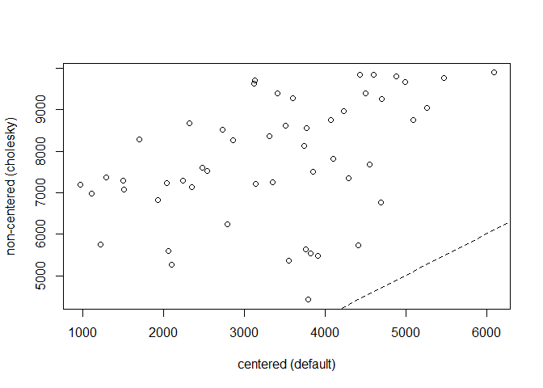
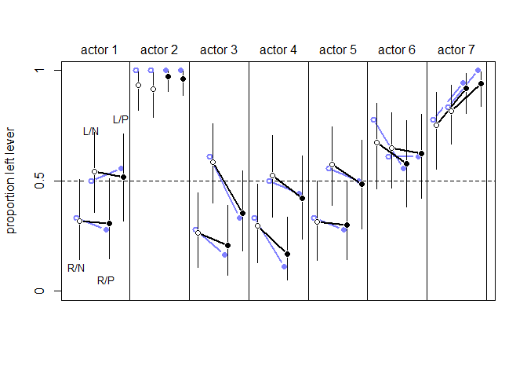
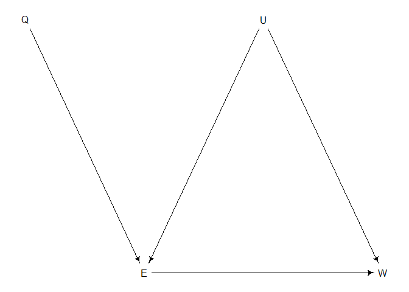

03\_13\_2020\_Notes
================
John D.
3/13/2020

``` r
library(rethinking)
```

    ## Loading required package: rstan

    ## Loading required package: StanHeaders

    ## Loading required package: ggplot2

    ## rstan (Version 2.19.3, GitRev: 2e1f913d3ca3)

    ## For execution on a local, multicore CPU with excess RAM we recommend calling
    ## options(mc.cores = parallel::detectCores()).
    ## To avoid recompilation of unchanged Stan programs, we recommend calling
    ## rstan_options(auto_write = TRUE)

    ## For improved execution time, we recommend calling
    ## Sys.setenv(LOCAL_CPPFLAGS = '-march=corei7 -mtune=corei7')
    ## although this causes Stan to throw an error on a few processors.

    ## Loading required package: parallel

    ## Loading required package: dagitty

    ## rethinking (Version 1.95)

    ## 
    ## Attaching package: 'rethinking'

    ## The following object is masked from 'package:stats':
    ## 
    ##     rstudent

``` r
library(tidyverse)
```

    ## -- Attaching packages ----------------------------------------------------------------------------------------- tidyverse 1.3.0 --

    ## v tibble  2.1.3     v dplyr   0.8.4
    ## v tidyr   1.0.2     v stringr 1.4.0
    ## v readr   1.3.1     v forcats 0.5.0
    ## v purrr   0.3.3

    ## -- Conflicts -------------------------------------------------------------------------------------------- tidyverse_conflicts() --
    ## x tidyr::extract() masks rstan::extract()
    ## x dplyr::filter()  masks stats::filter()
    ## x dplyr::lag()     masks stats::lag()
    ## x purrr::map()     masks rethinking::map()

# Ch.14 Adventures in Covariance

## 14.2. Advanced varying slopes

``` r
data(chimpanzees)
d <- chimpanzees
d$block_id <- d$block
d$treatment <- 1L + d$prosoc_left + 2L*d$condition
dat <- list(
L = d$pulled_left,
tid = d$treatment,
actor = d$actor,
block_id = as.integer(d$block_id) )
m14.2 <- ulam(
  alist(
    L ~ binomial(1, p),
    logit(p) <- g[tid] + alpha[actor, tid] + beta[block_id, tid],
    # adaptive priors
    vector[4]:alpha[actor] ~ multi_normal(0, Rho_actor, sigma_actor),
    vector[4]:beta[block_id] ~ multi_normal(0, Rho_block, sigma_block),
    # fixed priors
    g[tid] ~ dnorm(0, 1),
    sigma_actor ~ dexp(1),
    Rho_actor ~ dlkjcorr(4),
    sigma_block ~ dexp(1),
    Rho_block ~ dlkjcorr(4)
  ) ,
  data = dat ,
  chains = 4 ,
  cores = 4,
  iter = 5000,
  log_lik = TRUE
)
```

    ## Warning: There were 160 divergent transitions after warmup. Increasing adapt_delta above 0.95 may help. See
    ## http://mc-stan.org/misc/warnings.html#divergent-transitions-after-warmup

    ## Warning: Examine the pairs() plot to diagnose sampling problems

    ## Warning: The largest R-hat is NA, indicating chains have not mixed.
    ## Running the chains for more iterations may help. See
    ## http://mc-stan.org/misc/warnings.html#r-hat

    ## Warning: Bulk Effective Samples Size (ESS) is too low, indicating posterior means and medians may be unreliable.
    ## Running the chains for more iterations may help. See
    ## http://mc-stan.org/misc/warnings.html#bulk-ess

    ## Warning: Tail Effective Samples Size (ESS) is too low, indicating posterior variances and tail quantiles may be unreliable.
    ## Running the chains for more iterations may help. See
    ## http://mc-stan.org/misc/warnings.html#tail-ess

``` r
m14.3 <- ulam(
  alist(
    L ~ binomial(1, p),
    logit(p) <- g[tid] + alpha[actor, tid] + beta[block_id, tid],
    # adaptive priors - non-centered
    transpars > matrix[actor, 4]:alpha <-
      compose_noncentered(sigma_actor , L_Rho_actor , z_actor),
    transpars > matrix[block_id, 4]:beta <-
      compose_noncentered(sigma_block , L_Rho_block , z_block),
    matrix[4, actor]:z_actor ~ normal(0 , 1),
    matrix[4, block_id]:z_block ~ normal(0 , 1),
    # fixed priors
    g[tid] ~ normal(0, 1),
    vector[4]:sigma_actor ~ dexp(1),
    cholesky_factor_corr[4]:L_Rho_actor ~ lkj_corr_cholesky(2),
    vector[4]:sigma_block ~ dexp(1),
    cholesky_factor_corr[4]:L_Rho_block ~ lkj_corr_cholesky(2),
    # compute ordinary correlation matrixes from Cholesky factors
    gq > matrix[4, 4]:Rho_actor <<-
      multiply_lower_tri_self_transpose(L_Rho_actor),
    gq > matrix[4, 4]:Rho_block <<-
      multiply_lower_tri_self_transpose(L_Rho_block)
  ) ,
  data = dat ,
  chains = 4 ,
  cores = 4 ,
  iter = 5000,
  log_lik = TRUE
)
```

    ## Warning: The largest R-hat is NA, indicating chains have not mixed.
    ## Running the chains for more iterations may help. See
    ## http://mc-stan.org/misc/warnings.html#r-hat

    ## Warning: Bulk Effective Samples Size (ESS) is too low, indicating posterior means and medians may be unreliable.
    ## Running the chains for more iterations may help. See
    ## http://mc-stan.org/misc/warnings.html#bulk-ess

    ## Warning: Tail Effective Samples Size (ESS) is too low, indicating posterior variances and tail quantiles may be unreliable.
    ## Running the chains for more iterations may help. See
    ## http://mc-stan.org/misc/warnings.html#tail-ess

``` r
# extract n_eff values for each model
neff_nc <- precis(m14.3,3,pars=c("alpha","beta"))$n_eff
neff_c <- precis(m14.2,3,pars=c("alpha","beta"))$n_eff
plot( neff_c , neff_nc , xlab="centered (default)" ,
ylab="non-centered (cholesky)" , lwd=1.5 )
abline(a=0,b=1,lty=2)
```

<!-- -->

``` r
precis(m14.3,depth=3)
```

    ##                          mean           sd         5.5%       94.5%      n_eff
    ## z_actor[1,1]     -0.641763513 4.753516e-01 -1.423078272  0.07037573  4708.1717
    ## z_actor[1,2]      2.360890281 7.252509e-01  1.247401531  3.54439777  6133.5378
    ## z_actor[1,3]     -0.856644490 4.994750e-01 -1.699658859 -0.11023150  4128.1689
    ## z_actor[1,4]     -0.725670344 4.860151e-01 -1.538158416  0.01232946  4693.6142
    ## z_actor[1,5]     -0.646878907 4.772955e-01 -1.437895066  0.07887770  4973.0489
    ## z_actor[1,6]      0.599016522 4.829619e-01 -0.147067290  1.40394790  4804.0589
    ## z_actor[1,7]      0.958246941 5.669306e-01  0.107842749  1.91441522  4811.4745
    ## z_actor[2,1]     -0.359572121 6.411105e-01 -1.387305040  0.65640437  7433.8728
    ## z_actor[2,2]      1.390878282 9.351502e-01 -0.151344445  2.83329957  5194.2425
    ## z_actor[2,3]     -0.031543416 7.056155e-01 -1.146788712  1.09678598  5905.7556
    ## z_actor[2,4]     -0.440797628 6.898218e-01 -1.563347613  0.62927373  5976.6273
    ## z_actor[2,5]     -0.193962295 6.541964e-01 -1.227923479  0.84525346  6747.8485
    ## z_actor[2,6]     -0.362053243 6.604648e-01 -1.441734840  0.65792470  6779.0688
    ## z_actor[2,7]      0.760011941 8.209317e-01 -0.547347751  2.06336583  5880.1113
    ## z_actor[3,1]     -0.106063998 6.508177e-01 -1.113897700  0.95830347  7346.9002
    ## z_actor[3,2]      0.846980166 9.323839e-01 -0.656229974  2.32701525  8989.0334
    ## z_actor[3,3]     -0.510480771 6.928498e-01 -1.609358090  0.59520883  6775.2388
    ## z_actor[3,4]     -0.649023222 6.884339e-01 -1.717264633  0.45279471  7757.0502
    ## z_actor[3,5]     -0.180310992 6.445621e-01 -1.181850003  0.86065235  7221.7409
    ## z_actor[3,6]     -0.111627254 6.565935e-01 -1.152691556  0.91161786  7352.1170
    ## z_actor[3,7]      0.973473368 8.380069e-01 -0.380708657  2.27612317  6700.6448
    ## z_actor[4,1]      0.075822375 7.367647e-01 -1.100517299  1.25688736  9093.8059
    ## z_actor[4,2]      0.465843289 9.438804e-01 -1.068834000  1.97732444 12888.9283
    ## z_actor[4,3]     -0.398990076 7.755184e-01 -1.637352010  0.84295465  9197.8105
    ## z_actor[4,4]      0.030212013 7.648565e-01 -1.179511242  1.25694535  9013.3307
    ## z_actor[4,5]     -0.073818531 7.321586e-01 -1.249799424  1.09553428  9279.3175
    ## z_actor[4,6]     -0.310024521 7.726432e-01 -1.538436968  0.93610087  9041.9289
    ## z_actor[4,7]      0.833858080 9.151934e-01 -0.620159870  2.27477391 11144.0498
    ## z_block[1,1]     -0.270939583 8.313898e-01 -1.575071473  1.05114161 10867.8400
    ## z_block[1,2]      0.125516464 8.310290e-01 -1.221979409  1.42069446 10440.8771
    ## z_block[1,3]      0.659941791 8.583910e-01 -0.776005338  1.96809992  8313.3498
    ## z_block[1,4]      0.250470314 8.332207e-01 -1.095053603  1.53468064 10117.5961
    ## z_block[1,5]     -0.437538941 8.291800e-01 -1.739437934  0.89515799 10008.3985
    ## z_block[1,6]     -0.274568369 8.800829e-01 -1.672920707  1.15975194  9698.8623
    ## z_block[2,1]     -0.126548957 8.505275e-01 -1.466476670  1.24820743 10253.2934
    ## z_block[2,2]     -0.272720094 8.515697e-01 -1.641053979  1.07606345 10242.4147
    ## z_block[2,3]     -0.409564559 8.337018e-01 -1.755301363  0.93954032  9677.8833
    ## z_block[2,4]      0.244280478 8.442106e-01 -1.110864493  1.59255440 11123.5756
    ## z_block[2,5]      0.049355751 8.367797e-01 -1.292515402  1.36264751 10126.0664
    ## z_block[2,6]      0.768346236 8.931193e-01 -0.720563451  2.13594574  7557.0420
    ## z_block[3,1]     -0.124212949 9.722951e-01 -1.662783190  1.42114012 11879.2992
    ## z_block[3,2]      0.193777027 9.321264e-01 -1.288502471  1.68092627 13447.0452
    ## z_block[3,3]      0.027815688 9.184847e-01 -1.433796195  1.49144902 12748.1949
    ## z_block[3,4]     -0.250644350 9.231471e-01 -1.678247870  1.24025732 12241.4531
    ## z_block[3,5]      0.220507487 9.454918e-01 -1.303740629  1.70535678 13925.8459
    ## z_block[3,6]     -0.073721682 9.376923e-01 -1.559074198  1.43300340 12078.6465
    ## z_block[4,1]     -0.606982101 9.347473e-01 -2.070942861  0.93529788 10875.3474
    ## z_block[4,2]      0.243633915 8.923060e-01 -1.198695449  1.65621297 13316.0882
    ## z_block[4,3]      0.214512867 9.121941e-01 -1.255226835  1.63545039 14292.7988
    ## z_block[4,4]     -0.005247378 9.226096e-01 -1.462007783  1.46470947 14100.2294
    ## z_block[4,5]     -0.045105604 8.844813e-01 -1.449426120  1.36229264 11818.5393
    ## z_block[4,6]      0.445411633 9.315228e-01 -1.060783627  1.91347051 11867.5271
    ## g[1]              0.208553884 5.031957e-01 -0.594439181  1.00858672  3721.2267
    ## g[2]              0.640551909 4.106250e-01 -0.005709141  1.28455201  4739.4797
    ## g[3]             -0.016996994 5.791489e-01 -0.922688743  0.89647553  4818.1904
    ## g[4]              0.666639275 5.488631e-01 -0.201173070  1.53737581  6179.9731
    ## sigma_actor[1]    1.377528685 4.779149e-01  0.775209423  2.22070764  4044.7154
    ## sigma_actor[2]    0.913256308 3.961280e-01  0.418348819  1.62833565  5952.6652
    ## sigma_actor[3]    1.854539934 5.600590e-01  1.129839966  2.85213460  6856.2334
    ## sigma_actor[4]    1.573075419 5.907851e-01  0.841370944  2.62947110  7106.7397
    ## L_Rho_actor[1,1]  1.000000000 0.000000e+00  1.000000000  1.00000000        NaN
    ## L_Rho_actor[1,2]  0.000000000 0.000000e+00  0.000000000  0.00000000        NaN
    ## L_Rho_actor[1,3]  0.000000000 0.000000e+00  0.000000000  0.00000000        NaN
    ## L_Rho_actor[1,4]  0.000000000 0.000000e+00  0.000000000  0.00000000        NaN
    ## L_Rho_actor[2,1]  0.432059039 2.797519e-01 -0.067240991  0.82503011  5594.9455
    ## L_Rho_actor[2,2]  0.845355099 1.429983e-01  0.565088763  0.99784736  5313.1157
    ## L_Rho_actor[2,3]  0.000000000 0.000000e+00  0.000000000  0.00000000        NaN
    ## L_Rho_actor[2,4]  0.000000000 0.000000e+00  0.000000000  0.00000000        NaN
    ## L_Rho_actor[3,1]  0.526193523 2.493247e-01  0.073543891  0.86155955  5944.1643
    ## L_Rho_actor[3,2]  0.275223917 3.117131e-01 -0.266511307  0.73111673  4272.6756
    ## L_Rho_actor[3,3]  0.676156990 1.757130e-01  0.378743898  0.93620255  5763.1406
    ## L_Rho_actor[3,4]  0.000000000 0.000000e+00  0.000000000  0.00000000        NaN
    ## L_Rho_actor[4,1]  0.445523214 2.667224e-01 -0.029719541  0.81603828  6344.7117
    ## L_Rho_actor[4,2]  0.273703666 3.222065e-01 -0.281251395  0.75158151  4416.3303
    ## L_Rho_actor[4,3]  0.303320073 3.099022e-01 -0.228030293  0.75829016  5059.4503
    ## L_Rho_actor[4,4]  0.575100150 1.813428e-01  0.274860202  0.85815421  6231.7354
    ## sigma_block[1]    0.409163005 3.330167e-01  0.033998855  1.01557992  5617.6711
    ## sigma_block[2]    0.441478996 3.385140e-01  0.041879696  1.04720314  4896.7031
    ## sigma_block[3]    0.298264425 2.670521e-01  0.021354607  0.79075297  9321.7483
    ## sigma_block[4]    0.469506358 3.751690e-01  0.039881711  1.14302302  5820.2100
    ## L_Rho_block[1,1]  1.000000000 0.000000e+00  1.000000000  1.00000000        NaN
    ## L_Rho_block[1,2]  0.000000000 0.000000e+00  0.000000000  0.00000000        NaN
    ## L_Rho_block[1,3]  0.000000000 0.000000e+00  0.000000000  0.00000000        NaN
    ## L_Rho_block[1,4]  0.000000000 0.000000e+00  0.000000000  0.00000000        NaN
    ## L_Rho_block[2,1] -0.070127570 3.750997e-01 -0.658033127  0.54727045  9597.5080
    ## L_Rho_block[2,2]  0.918705837 1.018677e-01  0.711204541  0.99957776  5883.3184
    ## L_Rho_block[2,3]  0.000000000 0.000000e+00  0.000000000  0.00000000        NaN
    ## L_Rho_block[2,4]  0.000000000 0.000000e+00  0.000000000  0.00000000        NaN
    ## L_Rho_block[3,1] -0.010111605 3.831186e-01 -0.617154559  0.61380577 12970.6161
    ## L_Rho_block[3,2] -0.031649546 3.764934e-01 -0.622504254  0.57805019 11862.8168
    ## L_Rho_block[3,3]  0.830769204 1.422054e-01  0.553141813  0.98823933  4550.8855
    ## L_Rho_block[3,4]  0.000000000 0.000000e+00  0.000000000  0.00000000        NaN
    ## L_Rho_block[4,1]  0.050186107 3.702906e-01 -0.559476428  0.63107350  9634.2352
    ## L_Rho_block[4,2]  0.042155045 3.730592e-01 -0.575161112  0.63158131 10417.3244
    ## L_Rho_block[4,3]  0.019209201 3.803800e-01 -0.597672881  0.62505578  9478.6436
    ## L_Rho_block[4,4]  0.737889497 1.729806e-01  0.416435983  0.96106595  4250.3538
    ## Rho_block[1,1]    1.000000000 0.000000e+00  1.000000000  1.00000000        NaN
    ## Rho_block[1,2]   -0.070127570 3.750997e-01 -0.658033127  0.54727045  9597.5080
    ## Rho_block[1,3]   -0.010111605 3.831186e-01 -0.617154559  0.61380577 12970.6161
    ## Rho_block[1,4]    0.050186107 3.702906e-01 -0.559476428  0.63107350  9634.2352
    ## Rho_block[2,1]   -0.070127570 3.750997e-01 -0.658033127  0.54727045  9597.5080
    ## Rho_block[2,2]    1.000000000 8.648065e-17  1.000000000  1.00000000  8689.5098
    ## Rho_block[2,3]   -0.029044408 3.783936e-01 -0.632974440  0.58450626 10689.5372
    ## Rho_block[2,4]    0.040467306 3.711565e-01 -0.574526352  0.63042314  9547.0767
    ## Rho_block[3,1]   -0.010111605 3.831186e-01 -0.617154559  0.61380577 12970.6161
    ## Rho_block[3,2]   -0.029044408 3.783936e-01 -0.632974440  0.58450626 10689.5372
    ## Rho_block[3,3]    1.000000000 7.548261e-17  1.000000000  1.00000000  9680.8719
    ## Rho_block[3,4]    0.011459766 3.794277e-01 -0.602579137  0.61347823  7897.9432
    ## Rho_block[4,1]    0.050186107 3.702906e-01 -0.559476428  0.63107350  9634.2352
    ## Rho_block[4,2]    0.040467306 3.711565e-01 -0.574526352  0.63042314  9547.0767
    ## Rho_block[4,3]    0.011459766 3.794277e-01 -0.602579137  0.61347823  7897.9432
    ## Rho_block[4,4]    1.000000000 7.775121e-17  1.000000000  1.00000000  6207.3371
    ## Rho_actor[1,1]    1.000000000 0.000000e+00  1.000000000  1.00000000        NaN
    ## Rho_actor[1,2]    0.432059039 2.797519e-01 -0.067240991  0.82503011  5594.9455
    ## Rho_actor[1,3]    0.526193523 2.493247e-01  0.073543891  0.86155955  5944.1643
    ## Rho_actor[1,4]    0.445523214 2.667224e-01 -0.029719541  0.81603828  6344.7117
    ## Rho_actor[2,1]    0.432059039 2.797519e-01 -0.067240991  0.82503011  5594.9455
    ## Rho_actor[2,2]    1.000000000 7.792542e-17  1.000000000  1.00000000  9863.3275
    ## Rho_actor[2,3]    0.482505530 2.691058e-01 -0.004869602  0.84657657  7138.4241
    ## Rho_actor[2,4]    0.444275382 2.791791e-01 -0.053018905  0.83126021  6803.2493
    ## Rho_actor[3,1]    0.526193523 2.493247e-01  0.073543891  0.86155955  5944.1643
    ## Rho_actor[3,2]    0.482505530 2.691058e-01 -0.004869602  0.84657657  7138.4241
    ## Rho_actor[3,3]    1.000000000 5.232464e-17  1.000000000  1.00000000  8689.6310
    ## Rho_actor[3,4]    0.576443529 2.380514e-01  0.138706727  0.88312673  7240.2145
    ## Rho_actor[4,1]    0.445523214 2.667224e-01 -0.029719541  0.81603828  6344.7117
    ## Rho_actor[4,2]    0.444275382 2.791791e-01 -0.053018905  0.83126021  6803.2493
    ## Rho_actor[4,3]    0.576443529 2.380514e-01  0.138706727  0.88312673  7240.2145
    ## Rho_actor[4,4]    1.000000000 6.189741e-17  1.000000000  1.00000000   230.0352
    ## beta[1,1]        -0.127007496 3.501800e-01 -0.748428017  0.34115237  9771.2878
    ## beta[1,2]        -0.049856846 3.488219e-01 -0.623524897  0.48150399  9053.5525
    ## beta[1,3]        -0.049662159 2.876870e-01 -0.538628042  0.36344274  9836.8005
    ## beta[1,4]        -0.398649857 4.940985e-01 -1.354784647  0.12645981  7132.3481
    ## beta[2,1]         0.061356706 3.441108e-01 -0.446112227  0.63301354  9671.6270
    ## beta[2,2]        -0.134630010 3.588934e-01 -0.760061067  0.35896447  8972.7175
    ## beta[2,3]         0.084564386 3.102407e-01 -0.304635310  0.62915865  9285.5352
    ## beta[2,4]         0.162151287 3.811913e-01 -0.331277590  0.86156535  8288.2728
    ## beta[3,1]         0.322271638 4.380585e-01 -0.135303342  1.14904680  7285.5771
    ## beta[3,2]        -0.231352767 3.862214e-01 -0.939711681  0.24016299  8361.8874
    ## beta[3,3]         0.011988744 2.846887e-01 -0.434639102  0.47092834  9397.8498
    ## beta[3,4]         0.156282401 3.885821e-01 -0.354870738  0.86445437  8682.6766
    ## beta[4,1]         0.131932249 3.611125e-01 -0.339014648  0.79485862  8754.5473
    ## beta[4,2]         0.122965872 3.607036e-01 -0.366189529  0.76373518  7825.7255
    ## beta[4,3]        -0.117060635 3.013512e-01 -0.672732910  0.23971076  9403.8938
    ## beta[4,4]         0.014727414 3.935251e-01 -0.587914090  0.67816611  9893.3190
    ## beta[5,1]        -0.208170595 3.741567e-01 -0.897386743  0.23562406  8622.0233
    ## beta[5,2]         0.046316129 3.454140e-01 -0.475489195  0.61866143  8749.8333
    ## beta[5,3]         0.102497267 3.170403e-01 -0.280789767  0.66690863  9702.9787
    ## beta[5,4]        -0.030789781 3.504326e-01 -0.604437019  0.51198308  9628.3110
    ## beta[6,1]        -0.127668657 3.607255e-01 -0.759893247  0.35515155  9255.9395
    ## beta[6,2]         0.422515285 4.937794e-01 -0.102872705  1.33062527  5259.6174
    ## beta[6,3]        -0.041951174 2.961332e-01 -0.532159812  0.37467813  9809.0436
    ## beta[6,4]         0.318997371 4.651553e-01 -0.206619420  1.20805839  7233.4725
    ## alpha[1,1]       -0.827152053 6.114342e-01 -1.828317894  0.09030502  5360.6760
    ## alpha[1,2]       -0.506517301 4.826610e-01 -1.304927066  0.20262699  7345.6422
    ## alpha[1,3]       -0.960441986 7.148392e-01 -2.107114587  0.15153340  6230.6791
    ## alpha[1,4]       -0.557424468 6.463247e-01 -1.589734384  0.46508895  7242.7277
    ## alpha[2,1]        3.143327538 1.224333e+00  1.543722641  5.26036300  7682.5660
    ## alpha[2,2]        2.040843942 9.978041e-01  0.725279756  3.82942874  8553.7123
    ## alpha[2,3]        4.332257809 1.604304e+00  2.256774969  7.12047368  9848.9852
    ## alpha[2,4]        3.409239450 1.587316e+00  1.463947300  6.24054595  8524.5647
    ## alpha[3,1]       -1.097434250 6.271857e-01 -2.123658881 -0.15111315  5468.1193
    ## alpha[3,2]       -0.319407049 4.868044e-01 -1.072494848  0.45239502  7359.3694
    ## alpha[3,3]       -1.547728611 7.696897e-01 -2.821629513 -0.37987425  7074.2904
    ## alpha[3,4]       -1.273802795 6.649416e-01 -2.345889790 -0.25068549  7607.8829
    ## alpha[4,1]       -0.925523304 6.133922e-01 -1.933451931  0.01805926  5534.8687
    ## alpha[4,2]       -0.583561379 4.836272e-01 -1.391072040  0.13420025  6979.2344
    ## alpha[4,3]       -1.838388313 8.176251e-01 -3.200238566 -0.63590910  7500.5022
    ## alpha[4,4]       -0.971860444 6.590993e-01 -2.030882474  0.04801625  7215.2855
    ## alpha[5,1]       -0.831485531 6.164992e-01 -1.835084929  0.10588739  5624.5707
    ## alpha[5,2]       -0.377657368 4.790237e-01 -1.158930501  0.35951279  7202.4672
    ## alpha[5,3]       -0.987572460 7.160787e-01 -2.154043416  0.13195466  5760.1642
    ## alpha[5,4]       -0.693962426 6.460822e-01 -1.737439140  0.31792404  7518.9123
    ## alpha[6,1]        0.784311197 6.433135e-01 -0.180492434  1.84358396  4418.6192
    ## alpha[6,2]       -0.041099412 4.830795e-01 -0.825633472  0.69511845  6770.4579
    ## alpha[6,3]        0.255972171 6.894647e-01 -0.843334163  1.33891631  5593.5525
    ## alpha[6,4]       -0.092031095 6.482736e-01 -1.140164530  0.92791865  6829.5956
    ## alpha[7,1]        1.202065610 6.638128e-01  0.161638129  2.28267025  5734.3894
    ## alpha[7,2]        0.925493710 5.865738e-01  0.077077815  1.91877097  7298.5942
    ## alpha[7,3]        2.670788621 9.633710e-01  1.266276902  4.30287433  8120.0966
    ## alpha[7,4]        2.578962153 1.185198e+00  1.025560639  4.63182850  8264.6695
    ##                      Rhat4
    ## z_actor[1,1]     1.0003146
    ## z_actor[1,2]     1.0004211
    ## z_actor[1,3]     1.0007399
    ## z_actor[1,4]     1.0003711
    ## z_actor[1,5]     1.0002566
    ## z_actor[1,6]     1.0008912
    ## z_actor[1,7]     1.0009509
    ## z_actor[2,1]     0.9998181
    ## z_actor[2,2]     1.0004729
    ## z_actor[2,3]     1.0003831
    ## z_actor[2,4]     1.0004505
    ## z_actor[2,5]     0.9999482
    ## z_actor[2,6]     1.0003518
    ## z_actor[2,7]     0.9999839
    ## z_actor[3,1]     1.0006433
    ## z_actor[3,2]     0.9998111
    ## z_actor[3,3]     1.0005882
    ## z_actor[3,4]     1.0009933
    ## z_actor[3,5]     1.0001505
    ## z_actor[3,6]     0.9998590
    ## z_actor[3,7]     0.9997733
    ## z_actor[4,1]     0.9998946
    ## z_actor[4,2]     1.0002365
    ## z_actor[4,3]     0.9999439
    ## z_actor[4,4]     0.9998168
    ## z_actor[4,5]     1.0001297
    ## z_actor[4,6]     0.9997630
    ## z_actor[4,7]     0.9999588
    ## z_block[1,1]     1.0000901
    ## z_block[1,2]     0.9997497
    ## z_block[1,3]     1.0004100
    ## z_block[1,4]     0.9999657
    ## z_block[1,5]     0.9998975
    ## z_block[1,6]     0.9998647
    ## z_block[2,1]     0.9997465
    ## z_block[2,2]     1.0000987
    ## z_block[2,3]     0.9999646
    ## z_block[2,4]     1.0002320
    ## z_block[2,5]     0.9996366
    ## z_block[2,6]     0.9999987
    ## z_block[3,1]     1.0003100
    ## z_block[3,2]     0.9998199
    ## z_block[3,3]     0.9998791
    ## z_block[3,4]     0.9997908
    ## z_block[3,5]     0.9997941
    ## z_block[3,6]     0.9999862
    ## z_block[4,1]     0.9998332
    ## z_block[4,2]     0.9998318
    ## z_block[4,3]     0.9998835
    ## z_block[4,4]     0.9998430
    ## z_block[4,5]     0.9996939
    ## z_block[4,6]     0.9998164
    ## g[1]             1.0012906
    ## g[2]             1.0009970
    ## g[3]             1.0014821
    ## g[4]             1.0005029
    ## sigma_actor[1]   1.0004328
    ## sigma_actor[2]   1.0004822
    ## sigma_actor[3]   0.9998922
    ## sigma_actor[4]   0.9997650
    ## L_Rho_actor[1,1]       NaN
    ## L_Rho_actor[1,2]       NaN
    ## L_Rho_actor[1,3]       NaN
    ## L_Rho_actor[1,4]       NaN
    ## L_Rho_actor[2,1] 1.0000294
    ## L_Rho_actor[2,2] 1.0002005
    ## L_Rho_actor[2,3]       NaN
    ## L_Rho_actor[2,4]       NaN
    ## L_Rho_actor[3,1] 1.0003276
    ## L_Rho_actor[3,2] 1.0004454
    ## L_Rho_actor[3,3] 1.0010275
    ## L_Rho_actor[3,4]       NaN
    ## L_Rho_actor[4,1] 0.9999379
    ## L_Rho_actor[4,2] 1.0009107
    ## L_Rho_actor[4,3] 0.9998477
    ## L_Rho_actor[4,4] 0.9997725
    ## sigma_block[1]   1.0000763
    ## sigma_block[2]   1.0004173
    ## sigma_block[3]   1.0001616
    ## sigma_block[4]   1.0009648
    ## L_Rho_block[1,1]       NaN
    ## L_Rho_block[1,2]       NaN
    ## L_Rho_block[1,3]       NaN
    ## L_Rho_block[1,4]       NaN
    ## L_Rho_block[2,1] 0.9999883
    ## L_Rho_block[2,2] 1.0009870
    ## L_Rho_block[2,3]       NaN
    ## L_Rho_block[2,4]       NaN
    ## L_Rho_block[3,1] 1.0001859
    ## L_Rho_block[3,2] 1.0000282
    ## L_Rho_block[3,3] 1.0002943
    ## L_Rho_block[3,4]       NaN
    ## L_Rho_block[4,1] 1.0003108
    ## L_Rho_block[4,2] 0.9997689
    ## L_Rho_block[4,3] 0.9999329
    ## L_Rho_block[4,4] 1.0008662
    ## Rho_block[1,1]         NaN
    ## Rho_block[1,2]   0.9999883
    ## Rho_block[1,3]   1.0001859
    ## Rho_block[1,4]   1.0003108
    ## Rho_block[2,1]   0.9999883
    ## Rho_block[2,2]   0.9995999
    ## Rho_block[2,3]   0.9999658
    ## Rho_block[2,4]   0.9999241
    ## Rho_block[3,1]   1.0001859
    ## Rho_block[3,2]   0.9999658
    ## Rho_block[3,3]   0.9995999
    ## Rho_block[3,4]   0.9998999
    ## Rho_block[4,1]   1.0003108
    ## Rho_block[4,2]   0.9999241
    ## Rho_block[4,3]   0.9998999
    ## Rho_block[4,4]   0.9995999
    ## Rho_actor[1,1]         NaN
    ## Rho_actor[1,2]   1.0000294
    ## Rho_actor[1,3]   1.0003276
    ## Rho_actor[1,4]   0.9999379
    ## Rho_actor[2,1]   1.0000294
    ## Rho_actor[2,2]   0.9995999
    ## Rho_actor[2,3]   1.0002178
    ## Rho_actor[2,4]   1.0005186
    ## Rho_actor[3,1]   1.0003276
    ## Rho_actor[3,2]   1.0002178
    ## Rho_actor[3,3]   0.9995999
    ## Rho_actor[3,4]   0.9998671
    ## Rho_actor[4,1]   0.9999379
    ## Rho_actor[4,2]   1.0005186
    ## Rho_actor[4,3]   0.9998671
    ## Rho_actor[4,4]   0.9995999
    ## beta[1,1]        1.0000127
    ## beta[1,2]        0.9997522
    ## beta[1,3]        1.0005195
    ## beta[1,4]        0.9999888
    ## beta[2,1]        1.0000022
    ## beta[2,2]        1.0000099
    ## beta[2,3]        1.0004526
    ## beta[2,4]        0.9999924
    ## beta[3,1]        1.0001856
    ## beta[3,2]        0.9997454
    ## beta[3,3]        1.0003568
    ## beta[3,4]        1.0000293
    ## beta[4,1]        1.0000834
    ## beta[4,2]        0.9999831
    ## beta[4,3]        1.0000592
    ## beta[4,4]        0.9998979
    ## beta[5,1]        1.0000285
    ## beta[5,2]        0.9997676
    ## beta[5,3]        1.0000378
    ## beta[5,4]        0.9999934
    ## beta[6,1]        0.9996813
    ## beta[6,2]        1.0003636
    ## beta[6,3]        1.0002632
    ## beta[6,4]        0.9999139
    ## alpha[1,1]       1.0009212
    ## alpha[1,2]       1.0007043
    ## alpha[1,3]       1.0014857
    ## alpha[1,4]       1.0002707
    ## alpha[2,1]       0.9999143
    ## alpha[2,2]       1.0004263
    ## alpha[2,3]       1.0008108
    ## alpha[2,4]       0.9999352
    ## alpha[3,1]       1.0009593
    ## alpha[3,2]       1.0005667
    ## alpha[3,3]       1.0011217
    ## alpha[3,4]       1.0004352
    ## alpha[4,1]       1.0004674
    ## alpha[4,2]       1.0010090
    ## alpha[4,3]       1.0005403
    ## alpha[4,4]       1.0001834
    ## alpha[5,1]       1.0006384
    ## alpha[5,2]       1.0006025
    ## alpha[5,3]       1.0009585
    ## alpha[5,4]       1.0004064
    ## alpha[6,1]       1.0006063
    ## alpha[6,2]       1.0006610
    ## alpha[6,3]       1.0007780
    ## alpha[6,4]       1.0006390
    ## alpha[7,1]       1.0008230
    ## alpha[7,2]       1.0005112
    ## alpha[7,3]       1.0003874
    ## alpha[7,4]       1.0000386

``` r
WAIC(m14.3)
```

    ##       WAIC      lppd  penalty  std_err
    ## 1 544.7989 -245.5208 26.87863 19.69892

``` r
compare(m14.2, m14.3)
```

    ##           WAIC       SE    dWAIC       dSE    pWAIC    weight
    ## m14.3 544.7989 19.69892 0.000000        NA 26.87863 0.7836419
    ## m14.2 547.3730 19.65812 2.574035 0.6619215 27.81480 0.2163581

``` r
precis( m14.3 , depth=2 , pars=c("sigma_actor","sigma_block") )
```

    ##                     mean        sd       5.5%    94.5%    n_eff     Rhat4
    ## sigma_actor[1] 1.3775287 0.4779149 0.77520942 2.220708 4044.715 1.0004328
    ## sigma_actor[2] 0.9132563 0.3961280 0.41834882 1.628336 5952.665 1.0004822
    ## sigma_actor[3] 1.8545399 0.5600590 1.12983997 2.852135 6856.233 0.9998922
    ## sigma_actor[4] 1.5730754 0.5907851 0.84137094 2.629471 7106.740 0.9997650
    ## sigma_block[1] 0.4091630 0.3330167 0.03399885 1.015580 5617.671 1.0000763
    ## sigma_block[2] 0.4414790 0.3385140 0.04187970 1.047203 4896.703 1.0004173
    ## sigma_block[3] 0.2982644 0.2670521 0.02135461 0.790753 9321.748 1.0001616
    ## sigma_block[4] 0.4695064 0.3751690 0.03988171 1.143023 5820.210 1.0009648

``` r
# compute mean for each actor in each treatment
pl <- by( d$pulled_left , list( d$actor , d$treatment ) , mean )
# generate posterior predictions using link
datp <- list(
actor=rep(1:7,each=4) ,
tid=rep(1:4,times=7) ,
block_id=rep(5,times=4*7) )
p_post <- link( m14.3 , data=datp )
p_mu <- apply( p_post , 2 , mean )
p_ci <- apply( p_post , 2 , PI )
# set up plot
plot( NULL , xlim=c(1,28) , ylim=c(0,1) , xlab="" ,
ylab="proportion left lever" , xaxt="n" , yaxt="n" )
axis( 2 , at=c(0,0.5,1) , labels=c(0,0.5,1) )
abline( h=0.5 , lty=2 )
for ( j in 1:7 ) abline( v=(j-1)*4+4.5 , lwd=0.5 )
for ( j in 1:7 ) text( (j-1)*4+2.5 , 1.1 , concat("actor ",j) , xpd=TRUE )
xo <- 0.1 # offset distance to stagger raw data and predictions
# raw data
for ( j in (1:7)[-2] ) {
lines( (j-1)*4+c(1,3)-xo , pl[j,c(1,3)] , lwd=2 , col=rangi2 )
lines( (j-1)*4+c(2,4)-xo , pl[j,c(2,4)] , lwd=2 , col=rangi2 )
}
points( 1:28-xo , t(pl) , pch=16 , col="white" , cex=1.7 )
points( 1:28-xo , t(pl) , pch=c(1,1,16,16) , col=rangi2 , lwd=2 )
yoff <- 0.175
text( 1-xo , pl[1,1]-yoff , "R/N" , pos=1 , cex=0.8 )
text( 2-xo , pl[1,2]+yoff , "L/N" , pos=3 , cex=0.8 )
text( 3-xo , pl[1,3]-yoff , "R/P" , pos=1 , cex=0.8 )
text( 4-xo , pl[1,4]+yoff , "L/P" , pos=3 , cex=0.8 )
# posterior predictions
for ( j in (1:7)[-2] ) {
lines( (j-1)*4+c(1,3)+xo , p_mu[(j-1)*4+c(1,3)] , lwd=2 )
lines( (j-1)*4+c(2,4)+xo , p_mu[(j-1)*4+c(2,4)] , lwd=2 )
}
for ( i in 1:28 ) lines( c(i,i)+xo , p_ci[,i] , lwd=1 )
points( 1:28+xo , p_mu , pch=16 , col="white" , cex=1.3 )
points( 1:28+xo , p_mu , pch=c(1,1,16,16) )
```

<!-- -->

``` r
stancode(m14.3)
```

    ## data{
    ##     int L[504];
    ##     int block_id[504];
    ##     int actor[504];
    ##     int tid[504];
    ## }
    ## parameters{
    ##     matrix[4,7] z_actor;
    ##     matrix[4,6] z_block;
    ##     vector[4] g;
    ##     vector<lower=0>[4] sigma_actor;
    ##     cholesky_factor_corr[4] L_Rho_actor;
    ##     vector<lower=0>[4] sigma_block;
    ##     cholesky_factor_corr[4] L_Rho_block;
    ## }
    ## transformed parameters{
    ##     matrix[7,4] alpha;
    ##     matrix[6,4] beta;
    ##     beta = (diag_pre_multiply(sigma_block, L_Rho_block) * z_block)';
    ##     alpha = (diag_pre_multiply(sigma_actor, L_Rho_actor) * z_actor)';
    ## }
    ## model{
    ##     vector[504] p;
    ##     L_Rho_block ~ lkj_corr_cholesky( 2 );
    ##     sigma_block ~ exponential( 1 );
    ##     L_Rho_actor ~ lkj_corr_cholesky( 2 );
    ##     sigma_actor ~ exponential( 1 );
    ##     g ~ normal( 0 , 1 );
    ##     to_vector( z_block ) ~ normal( 0 , 1 );
    ##     to_vector( z_actor ) ~ normal( 0 , 1 );
    ##     for ( i in 1:504 ) {
    ##         p[i] = g[tid[i]] + alpha[actor[i], tid[i]] + beta[block_id[i], tid[i]];
    ##         p[i] = inv_logit(p[i]);
    ##     }
    ##     L ~ binomial( 1 , p );
    ## }
    ## generated quantities{
    ##     vector[504] log_lik;
    ##     vector[504] p;
    ##     matrix[4,4] Rho_actor;
    ##     matrix[4,4] Rho_block;
    ##     Rho_block = multiply_lower_tri_self_transpose(L_Rho_block);
    ##     Rho_actor = multiply_lower_tri_self_transpose(L_Rho_actor);
    ##     for ( i in 1:504 ) {
    ##         p[i] = g[tid[i]] + alpha[actor[i], tid[i]] + beta[block_id[i], tid[i]];
    ##         p[i] = inv_logit(p[i]);
    ##     }
    ##     for ( i in 1:504 ) log_lik[i] = binomial_lpmf( L[i] | 1 , p[i] );
    ## }

## 14.3. Instrumental variables and front doors

### 14.3.1. Instrumental variables

``` r
library(dagitty)
dag14.3.1 <- dagitty( "dag {
Q -> E
U -> E
E -> W
U -> W
}")
coordinates(dag14.3.1) <- list( x=c(Q=0,U=2,E=1,W=3) , y=c(Q=0,U=0,E=.5,W=.5) )
drawdag( dag14.3.1 )
```

<!-- -->

``` r
set.seed(73)
N <- 500
U_sim <- rnorm(N)
Q_sim <- sample(1:4 , size = N , replace = TRUE)
E_sim <- rnorm(N , U_sim + 1 * Q_sim)
W_sim <- rnorm(N , U_sim + 0 * E_sim)
dat_sim <- list(W = standardize(W_sim) ,
                E = standardize(E_sim) ,
                Q = standardize(Q_sim))
```

``` r
m14.4 <- ulam(
  alist(
    W ~ dnorm(mu , sigma),
    mu <- aW + bEW * E,
    aW ~ dnorm(0 , 0.2),
    bEW ~ dnorm(0 , 0.5),
    sigma ~ dexp(1)
  ) ,
  data = dat_sim ,
  chains = 4 ,
  cores = 4 ,
  log_lik = TRUE
)
precis(m14.4)
```

    ##              mean         sd        5.5%      94.5%    n_eff     Rhat4
    ## aW    0.001202152 0.04037652 -0.06347356 0.06607981 1706.487 1.0029059
    ## bEW   0.397292299 0.03973951  0.33541289 0.45833100 1786.064 1.0015440
    ## sigma 0.918847608 0.03116978  0.86996310 0.97097246 1846.831 0.9990899

``` r
m14.5 <- ulam(
  alist(
    c(W, E) ~ multi_normal(c(muW, muE) , Rho , Sigma),
    muW <- aW + bEW * E,
    muE <- aE + bQE * Q,
    c(aW, aE) ~ normal(0 , 0.2),
    c(bEW, bQE) ~ normal(0 , 0.5),
    Rho ~ lkj_corr(2),
    Sigma ~ exponential(1)
  ),
  data = dat_sim ,
  chains = 4 ,
  cores = 4
)
```

    ## Warning: The largest R-hat is NA, indicating chains have not mixed.
    ## Running the chains for more iterations may help. See
    ## http://mc-stan.org/misc/warnings.html#r-hat

    ## Warning: Bulk Effective Samples Size (ESS) is too low, indicating posterior means and medians may be unreliable.
    ## Running the chains for more iterations may help. See
    ## http://mc-stan.org/misc/warnings.html#bulk-ess

    ## Warning: Tail Effective Samples Size (ESS) is too low, indicating posterior variances and tail quantiles may be unreliable.
    ## Running the chains for more iterations may help. See
    ## http://mc-stan.org/misc/warnings.html#tail-ess

``` r
precis(m14.5 , depth = 3)
```

    ##                   mean           sd        5.5%      94.5%    n_eff     Rhat4
    ## aE        0.0011065983 3.519691e-02 -0.05575275 0.05933536 1435.229 1.0028418
    ## aW       -0.0002956069 4.403805e-02 -0.07123638 0.06833870 1451.300 1.0000175
    ## bQE       0.5918314365 3.688801e-02  0.53014230 0.64861304 1011.599 1.0002806
    ## bEW      -0.0433120378 7.611604e-02 -0.16896433 0.07387458 1019.948 0.9990778
    ## Rho[1,1]  1.0000000000 0.000000e+00  1.00000000 1.00000000      NaN       NaN
    ## Rho[1,2]  0.5382982602 5.203819e-02  0.45310201 0.61795342 1036.555 1.0001267
    ## Rho[2,1]  0.5382982602 5.203819e-02  0.45310201 0.61795342 1036.555 1.0001267
    ## Rho[2,2]  1.0000000000 7.992520e-17  1.00000000 1.00000000 1550.017 0.9979980
    ## Sigma[1]  1.0219012736 4.559317e-02  0.95382067 1.09897805 1067.331 0.9993765
    ## Sigma[2]  0.8093767584 2.449947e-02  0.77053831 0.84980781 1816.985 1.0007649

``` r
m14.4x <- ulam( m14.4 , data=dat_sim , chains=4 , cores=4 )
m14.5x <- ulam( m14.5 , data=dat_sim , chains=4 , cores=4 )
```

    ## Warning: The largest R-hat is NA, indicating chains have not mixed.
    ## Running the chains for more iterations may help. See
    ## http://mc-stan.org/misc/warnings.html#r-hat

    ## Warning: Bulk Effective Samples Size (ESS) is too low, indicating posterior means and medians may be unreliable.
    ## Running the chains for more iterations may help. See
    ## http://mc-stan.org/misc/warnings.html#bulk-ess

    ## Warning: Tail Effective Samples Size (ESS) is too low, indicating posterior variances and tail quantiles may be unreliable.
    ## Running the chains for more iterations may help. See
    ## http://mc-stan.org/misc/warnings.html#tail-ess

``` r
set.seed(73)
N <- 500
U_sim <- rnorm(N)
Q_sim <- sample(1:4 , size = N , replace = TRUE)
E_sim <- rnorm(N , U_sim + Q_sim)
W_sim <- rnorm(N ,-U_sim + 0.2 * E_sim)
dat_sim <- list(W = standardize(W_sim) ,
                E = standardize(E_sim) ,
                Q = standardize(Q_sim))
```

``` r
dagIV <- dagitty( "dag{
E -> W
E <- U -> W
Q -> E
}")
instrumentalVariables( dagIV , exposure="E" , outcome="W" )
```

    ##  Q

### 14.3.2. Front-door criterion
