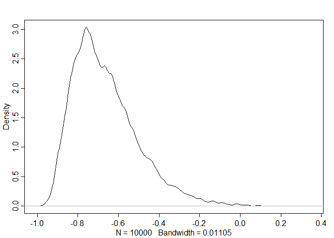
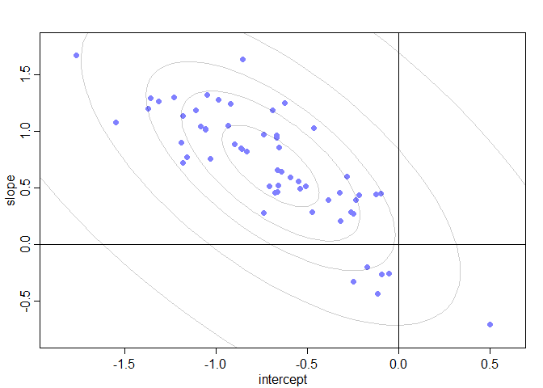
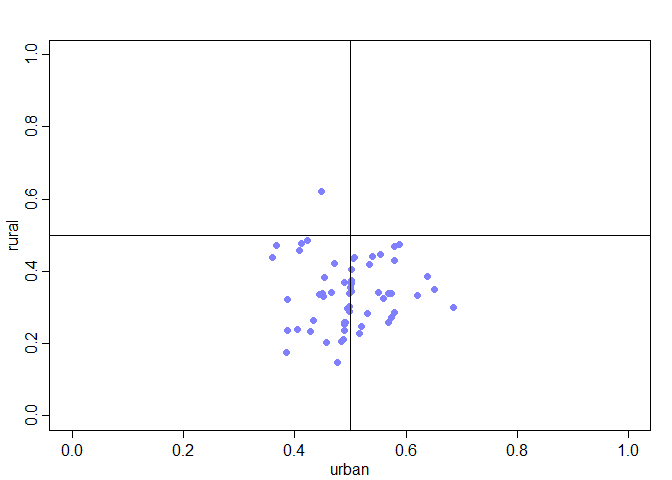
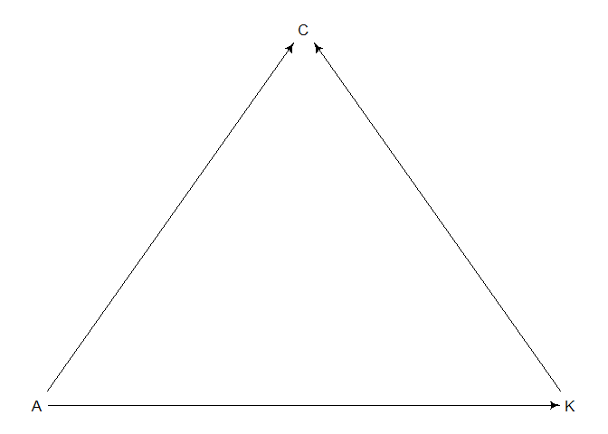

04\_03\_2020\_HW
================
John Davis
04\_03\_2020

``` r
library(rethinking)
library(tidyverse)
```

# PDF

### 1\. Revisit the Bangladesh fertility data, `data(bangladesh)`. Fit a model with both varying intercepts by `district_id` and varying slopes of `urban` (as a 0/1 indicator variable) by `district_id`. You are still predicting `use.contraception`. Inspect the correlation between the slopes and the intercepts. Can you interpret this correlation in terms of what it tells you about the pattern of contraceptive use in the sample? It might help to play the varying effect estimates for both the intercepts and slops, by district. Then you can visualize the correlation and maybe more easily think throught what it means to have a particular correlation. Plotting predicted proportion of women using contraception, in each district, with urban women on one axis and rural on the other might also help/

``` r
data("bangladesh")
d <- bangladesh

dat_list <- list(
  district = as.integer(as.factor(d$district)),
  contraception = d$use.contraception,
  urban = d$urban
)

# Make it like the model m14.1
model1.1 <- ulam(
  alist(
    contraception ~ binomial(1,p),
    logit(p) <- alpha[district] + beta[district]*urban,
    c(alpha,beta)[district] ~ multi_normal(c(a,b), Rho, Sigma),
    a ~ dnorm(0,1),
    b ~ dnorm(0,1),
    Rho ~ lkj_corr(2),
    Sigma ~ dexp(1)
  ),
  data = dat_list,
  chains = 4,
  cores = 4,
  iter = 5000,
  log_lik = T
)

precis(model1.1, depth = 3, pars = c("a","b","Rho","Sigma"))
```

    ##                mean           sd       5.5%      94.5%    n_eff      Rhat
    ## a        -0.7024741 1.005903e-01 -0.8643429 -0.5425409 7914.290 0.9998580
    ## b         0.6947940 1.677847e-01  0.4316256  0.9633558 5317.712 0.9998588
    ## Rho[1,1]  1.0000000 0.000000e+00  1.0000000  1.0000000      NaN       NaN
    ## Rho[1,2] -0.6636971 1.610884e-01 -0.8686333 -0.3699218 2118.029 1.0006357
    ## Rho[2,1] -0.6636971 1.610884e-01 -0.8686333 -0.3699218 2118.029 1.0006357
    ## Rho[2,2]  1.0000000 5.823408e-17  1.0000000  1.0000000 9847.206 0.9995999
    ## Sigma[1]  0.5785948 9.815779e-02  0.4311749  0.7455452 3234.535 1.0006245
    ## Sigma[2]  0.7838683 2.002735e-01  0.4803336  1.1144293 1118.603 1.0033324

``` r
post <- extract.samples(model1.1)

dens( post$Rho[,1,2] )
```

<!-- -->

``` r
a <- apply(post$alpha, 2, mean)
b <- apply(post$beta, 2, mean)
plot(
  a ,
  b ,
  xlab = "intercept" ,
  ylab = "slope" ,
  pch = 16 ,
  col = rangi2 ,
  ylim = c(min(b) - 0.1 , max(b) + 0.1) ,
  xlim = c(min(a) - 0.1 , max(a) + 0.1)
)

# compute posterior mean bivariate Gaussian
Mu_est <- c( mean(post$a) , mean(post$b) )
rho_est <- mean( post$Rho[,1,2] )
sa_est <- mean( post$Sigma[,1] )
sb_est <- mean( post$Sigma[,2] )
cov_ab <- sa_est*sb_est*rho_est
Sigma_est <- matrix( c(sa_est^2,cov_ab,cov_ab,sb_est^2) , ncol=2 )
# draw contours
library(ellipse)
```

    ## Warning: package 'ellipse' was built under R version 3.6.3

    ## 
    ## Attaching package: 'ellipse'

    ## The following object is masked from 'package:rethinking':
    ## 
    ##     pairs

    ## The following object is masked from 'package:graphics':
    ## 
    ##     pairs

``` r
for ( l in c(0.1,0.3,0.5,0.8,0.99) )
lines(ellipse(Sigma_est,centre=Mu_est,level=l),
col=col.alpha("black",0.2))
abline(h=0)
abline(v=0)
```

<!-- -->

``` r
rural <- inv_logit(a)
urban <- inv_logit(a + b)

plot(
  urban ,
  rural ,
  xlab = "urban" ,
  ylab = "rural" ,
  pch = 16 ,
  col = rangi2 ,
  ylim = c(0,1) ,
  xlim = c(0,1)
)

abline(h=0.5)
abline(v=0.5)
```

<!-- -->

Looks like being in an urban area increases probability of using
contraception. Negative correlation between alpha and beta though. Rural
use looks to be highly variable no matter what the urban use is.

### 2\. Now consider the predictor variables `age.centered` and `living.children`, also contained in `data(bangladesh)`. Suppose that age influences contraceptive use (changing attitudes) and number of children (older people have had more time to have kids). Number of children may also directly influence contraceptive use. Draw a DAG that reflects these hypothetical relationships. Then build models needed to evaulate the DAG. You will need at least two models. Retain `district` and `urban` as in Problem 1. What do you conclude about the causal influence of age and children?

``` r
library(dagitty)
dag2 <- dagitty( "dag {
K -> C
A -> C
A -> K
}")
coordinates(dag2) <- list( x=c(C=1,A=0,K=2) , y=c(C=0,A=1,K=1))
drawdag(dag2)
```

<!-- -->

``` r
dat_list <- list(
  district = as.integer(as.factor(d$district)),
  contraception = d$use.contraception,
  urban = d$urban,
  age = standardize(d$age.centered),
  kids = standardize(d$living.children)
)

m2.1 <- ulam(
  alist(
    contraception ~ binomial(1,p),
    logit(p) <- alpha[district] + betaD[district]*urban + betaA*age,
    c(alpha,betaD)[district] ~ multi_normal(c(a,b), Rho, Sigma),
    a ~ dnorm(0,1),
    b ~ dnorm(0,1),
    betaA ~ dnorm(0,1),
    Rho ~ lkj_corr(2),
    Sigma ~ dexp(1)
  ),
  data = dat_list,
  chains = 4,
  cores = 4,
  iter = 5000,
  log_lik = T
)
```

    ## Warning: There were 1 divergent transitions after warmup. Increasing adapt_delta above 0.95 may help. See
    ## http://mc-stan.org/misc/warnings.html#divergent-transitions-after-warmup

    ## Warning: Examine the pairs() plot to diagnose sampling problems

``` r
precis(m2.1)
```

    ## 126 vector or matrix parameters hidden. Use depth=2 to show them.

    ##              mean         sd        5.5%      94.5%     n_eff      Rhat
    ## a     -0.70658433 0.10038370 -0.86966994 -0.5486448  7102.678 0.9999446
    ## b      0.69402774 0.16916933  0.42482155  0.9621994  5158.645 1.0006932
    ## betaA  0.08426137 0.04873591  0.00697272  0.1624423 15855.877 0.9998220

``` r
m2.2 <- ulam(
  alist(
    contraception ~ binomial(1,p),
    logit(p) <- alpha[district] + betaD[district]*urban + betaK*kids,
    c(alpha,betaD)[district] ~ multi_normal(c(a,b), Rho, Sigma),
    a ~ dnorm(0,1),
    b ~ dnorm(0,1),
    betaK ~ dnorm(0,1),
    Rho ~ lkj_corr(2),
    Sigma ~ dexp(1)
  ),
  data = dat_list,
  chains = 4,
  cores = 4,
  iter = 5000,
  log_lik = T
)
```

    ## Warning: There were 20 divergent transitions after warmup. Increasing adapt_delta above 0.95 may help. See
    ## http://mc-stan.org/misc/warnings.html#divergent-transitions-after-warmup
    
    ## Warning: Examine the pairs() plot to diagnose sampling problems

``` r
precis(m2.2)
```

    ## 126 vector or matrix parameters hidden. Use depth=2 to show them.

    ##             mean        sd       5.5%      94.5%     n_eff      Rhat
    ## a     -0.7302734 0.1034337 -0.8987751 -0.5659064  6999.689 0.9999270
    ## b      0.7286717 0.1681269  0.4626999  0.9966468  4916.615 1.0000475
    ## betaK  0.3323501 0.0515247  0.2515087  0.4156185 14299.114 0.9998592

``` r
m2.3 <- ulam(
  alist(
    contraception ~ binomial(1,p),
    logit(p) <- alpha[district] + betaD[district]*urban + betaA*age + betaK*kids,
    c(alpha,betaD)[district] ~ multi_normal(c(a,b), Rho, Sigma),
    a ~ dnorm(0,1),
    b ~ dnorm(0,1),
    betaA ~ dnorm(0,1),
    betaK ~ dnorm(0,1),
    Rho ~ lkj_corr(2),
    Sigma ~ dexp(1)
  ),
  data = dat_list,
  chains = 4,
  cores = 4,
  iter = 5000,
  log_lik = T
)

precis(m2.3)
```

    ## 126 vector or matrix parameters hidden. Use depth=2 to show them.

    ##             mean         sd       5.5%      94.5%     n_eff      Rhat
    ## a     -0.7390978 0.10397740 -0.9033507 -0.5754922  6953.462 1.0001513
    ## b      0.7541528 0.16807417  0.4903468  1.0193526  4716.623 1.0002367
    ## betaA -0.2743886 0.07267361 -0.3898585 -0.1588974 10640.380 0.9998376
    ## betaK  0.5247555 0.07317075  0.4077739  0.6423826  9579.743 0.9997451

``` r
compare(m2.1,m2.2,m2.3)
```

    ##          WAIC       SE    dWAIC       dSE    pWAIC       weight
    ## m2.3 2412.372 30.66406  0.00000        NA 54.57642 9.990886e-01
    ## m2.2 2426.371 29.98949 13.99934  7.525879 54.18317 9.113519e-04
    ## m2.1 2467.581 28.20937 55.20873 14.508525 53.52095 1.026077e-12

Kids seem to be the deciding factor in contraception use. Having kids
makes you not want to have kids

### 3\. Modify any models from Problem 2 that contained that children variable and model the variable now as a monotonic ordered category, like education from the week we did ordered categories. Education in that example has 8 categories. Children here will have fewer (no on in the sample had 8 children). So modify the code appropriately. What do you conclude about the causal influence of each additional child on use of contraception?

``` r
dat_list <- list(
  district = as.integer(as.factor(d$district)),
  contraception = d$use.contraception,
  urban = d$urban,
  age = standardize(d$age.centered),
  kids = d$living.children,
  ALPHA = rep(2,3)
)

m2.2_ordered <- ulam(
  alist(
    contraception ~ binomial(1,p),
    logit(p) <- alpha[district] + betaD[district]*urban + betaK*sum(d_shell[1:kids]),
    c(alpha,betaD)[district] ~ multi_normal(c(a,b), Rho, Sigma),
    a ~ dnorm(0,1),
    b ~ dnorm(0,1),
    betaK ~ dnorm(0,1),
    Rho ~ lkj_corr(2),
    Sigma ~ dexp(1),
    vector[4]: d_shell <<- append_row(0,delta),
    simplex[3]: delta ~ dirichlet(ALPHA)
  ),
  data = dat_list,
  chains = 4,
  cores = 4,
  iter = 5000,
  log_lik = T
)

precis(m2.2_ordered)
```

    ## 129 vector or matrix parameters hidden. Use depth=2 to show them.

    ##             mean        sd       5.5%     94.5%    n_eff     Rhat
    ## a     -1.4182529 0.1410866 -1.6410437 -1.193582 3439.153 1.001159
    ## b      0.7421395 0.1698142  0.4714536  1.013018 5527.472 1.000365
    ## betaK  1.0045127 0.1261760  0.8018177  1.205661 3583.217 1.000828

``` r
precis(m2.2_ordered, depth = 3, pars = "delta")
```

    ##                mean         sd       5.5%     94.5%    n_eff      Rhat
    ## delta[1] 0.79397065 0.08126459 0.65447825 0.9111411 12044.68 1.0000359
    ## delta[2] 0.12850371 0.07334161 0.03027349 0.2596287 11322.62 1.0004140
    ## delta[3] 0.07752564 0.04889512 0.01591260 0.1672162 13873.45 0.9997706

``` r
m2.3_ordered <- ulam(
  alist(
    contraception ~ binomial(1,p),
    logit(p) <- alpha[district] + betaD[district]*urban + betaA*age + betaK*sum(d_shell[1:kids]),
    c(alpha,betaD)[district] ~ multi_normal(c(a,b), Rho, Sigma),
    a ~ dnorm(0,1),
    b ~ dnorm(0,1),
    betaA ~ dnorm(0,1),
    betaK ~ dnorm(0,1),
    Rho ~ lkj_corr(2),
    Sigma ~ dexp(1),
    vector[4]: d_shell <<- append_row(0,delta),
    simplex[3]: delta ~ dirichlet(ALPHA)
  ),
  data = dat_list,
  chains = 4,
  cores = 4,
  iter = 5000,
  log_lik = T
)

precis(m2.3_ordered)
```

    ## 129 vector or matrix parameters hidden. Use depth=2 to show them.

    ##             mean         sd       5.5%      94.5%    n_eff      Rhat
    ## a     -1.6426172 0.15263443 -1.8879024 -1.4016662 2246.475 1.0017257
    ## b      0.7524442 0.16546901  0.4886680  1.0154793 5260.631 0.9998804
    ## betaA -0.2542413 0.06673302 -0.3619128 -0.1482647 5493.208 1.0008001
    ## betaK  1.3678373 0.16320803  1.1096680  1.6307233 2287.927 1.0025021

``` r
precis(m2.3_ordered, depth = 3, pars = "delta")
```

    ##                mean         sd       5.5%     94.5%    n_eff      Rhat
    ## delta[1] 0.73287279 0.08150506 0.59755674 0.8581927 14251.23 0.9997272
    ## delta[2] 0.16723688 0.07707288 0.05406632 0.3010551 14221.48 0.9997801
    ## delta[3] 0.09989033 0.05406825 0.02615732 0.1971010 16406.89 0.9998984

``` r
compare(m2.2_ordered, m2.3_ordered)
```

    ##                  WAIC       SE    dWAIC      dSE    pWAIC      weight
    ## m2.3_ordered 2387.357 31.38211  0.00000       NA 55.13642 0.998021177
    ## m2.2_ordered 2399.804 30.96767 12.44654 7.326433 54.18944 0.001978823

Your second kid makes you not want to have kids anymore because you
already perfected having a child on your second attempt
