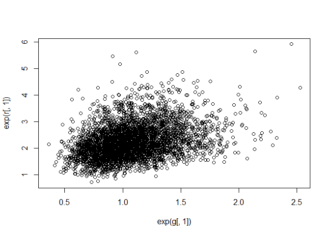

04\_03\_2020\_Notes
================
John Davis
04\_03\_2020

``` r
library(rethinking)
library(tidyverse)
```

## 14.4 Social relations as correlated varying effects

``` r
data(KosterLeckie)
```

``` r
plot(kl_dyads$giftsAB,kl_dyads$giftsBA)
abline(a=0,b=1)
```

<!-- -->

``` r
cor(kl_dyads$giftsAB, kl_dyads$giftsBA)
```

    ## [1] 0.2391549

``` r
kl_data <- list(
  N = nrow(kl_dyads),
  N_households = max(kl_dyads$hidB),
  did = kl_dyads$did,
  hidA = kl_dyads$hidA,
  hidB = kl_dyads$hidB,
  giftsAB = kl_dyads$giftsAB,
  giftsBA = kl_dyads$giftsBA
)

m14.4 <- ulam(
  alist(
    giftsAB ~ poisson( lambdaAB ), # A to B model
    giftsBA ~ poisson( lambdaBA ), # B to A model
    # A to B, give/receive coefficient + The dyad specific rate A to B
    log(lambdaAB) <- a + gr[hidA,1] + gr[hidB,2] + d[did,1],
    # B to A, give/receive coefficient + The dyad specific rate B to A
    log(lambdaBA) <- a + gr[hidB,1] + gr[hidA,2] + d[did,2],
    a ~ normal(0,1), # Average gift giving across all dyads
    
    ## gr matrix of varying effects
    # vector of 2, a give and receive for each house (25,2)
    vector[2]:gr[N_households] ~ multi_normal(0,Rho_gr,sigma_gr),
    # Expected almost no correlation between give and receive
    Rho_gr ~ lkj_corr(4),
    # variation
    sigma_gr ~ exponential(1),
    
    ## dyad effects
    # Noncentered parametized, sigma repeated twice due to same value in
    # both directions. Finding dyad specific effects, mirrored/doubled due
    # to being the same sigma. (300,2) 
    transpars> matrix[N,2]:d <- compose_noncentered( rep_vector(sigma_d,2) , L_Rho_d , z ),
    # matrix for z in noncentered model
    matrix[2,N]:z ~ normal( 0 , 1 ),
    # Almost no correlation prior
    cholesky_factor_corr[2]:L_Rho_d ~ lkj_corr_cholesky( 8 ),
    # shared sigma_d
    sigma_d ~ exponential(1),
    ## compute correlation matrix for dyads
    gq> matrix[2,2]:Rho_d <<- Chol_to_Corr( L_Rho_d )
    ),
  data = kl_data, chains=4, cores=4, iter=2000
  )
```

``` r
precis(m14.4, depth=3, pars=c("Rho_gr","sigma_gr"))
```

    ##                   mean           sd       5.5%       94.5%    n_eff      Rhat
    ## Rho_gr[1,1]  1.0000000 0.000000e+00  1.0000000  1.00000000      NaN       NaN
    ## Rho_gr[1,2] -0.4064334 1.983127e-01 -0.7033127 -0.06955103 1453.035 1.0005175
    ## Rho_gr[2,1] -0.4064334 1.983127e-01 -0.7033127 -0.06955103 1453.035 1.0005175
    ## Rho_gr[2,2]  1.0000000 8.134869e-17  1.0000000  1.00000000 3538.868 0.9989995
    ## sigma_gr[1]  0.8303732 1.368606e-01  0.6390907  1.06906293 2035.972 1.0015284
    ## sigma_gr[2]  0.4218628 9.098976e-02  0.2915449  0.57540474 1096.031 1.0035052

`Rho_gr` Correlation between gift giving and receiving is generally
negative, across all dyads if you give more, you receive less  
`sigma_gr[1]` = giving and `sigma_gr[2]` = receiving. Rates of giving
are more variable than receiving.

``` r
post <- extract.samples( m14.4 )
g <- sapply( 1:25 , function(i) post$a + post$gr[,i,1] )
r <- sapply( 1:25 , function(i) post$a + post$gr[,i,2] )
Eg_mu <- apply( exp(g) , 2 , mean )
Er_mu <- apply( exp(r) , 2 , mean )
```

``` r
plot(exp(g[,1]),exp(r[,1]))
```

<!-- -->

``` r
plot(
  NULL ,
  xlim = c(0, 8.6) ,
  ylim = c(0, 8.6) ,
  xlab = "generalized giving" ,
  ylab = "generalized receiving" ,
  lwd = 1.5
)
abline(a = 0, b = 1, lty = 2)
# ellipses
library(ellipse)
```

    ## Warning: package 'ellipse' was built under R version 3.6.3

    ## 
    ## Attaching package: 'ellipse'

    ## The following object is masked from 'package:rethinking':
    ## 
    ##     pairs

    ## The following object is masked from 'package:graphics':
    ## 
    ##     pairs

``` r
for (i in 1:25) {
  Sigma <- cov(cbind(g[, i] , r[, i]))
  Mu <- c(mean(g[, i]) , mean(r[, i]))
  for (l in c(0.5)) {
    el <- ellipse(Sigma , centre = Mu , level = l)
    lines(exp(el) , col = col.alpha("black", 0.5))
  }
}
# household means
points(Eg_mu ,
       Er_mu ,
       pch = 21 ,
       bg = "white" ,
       lwd = 1.5)
```

<!-- -->

``` r
precis( m14.4 , depth=3 , pars=c("Rho_d","sigma_d") )
```

    ##                 mean         sd      5.5%     94.5%    n_eff     Rhat
    ## Rho_d[1,1] 1.0000000 0.00000000 1.0000000 1.0000000      NaN      NaN
    ## Rho_d[1,2] 0.8792961 0.03456727 0.8196715 0.9294178 1029.301 1.005188
    ## Rho_d[2,1] 0.8792961 0.03456727 0.8196715 0.9294178 1029.301 1.005188
    ## Rho_d[2,2] 1.0000000 0.00000000 1.0000000 1.0000000      NaN      NaN
    ## sigma_d    1.1030267 0.05741682 1.0150848 1.1972332 1298.356 1.001767

Families that give to one family also receive from the same family more

``` r
dy1 <- apply( post$d[,,1] , 2 , mean )
dy2 <- apply( post$d[,,2] , 2 , mean )
plot( dy1 , dy2 )
```

<!-- -->

## 14.5. Continuous categories and the Gaussian process

### 14.5.1. Example: Spatial autocorrelation in Oceanic tools

``` r
# load the distance matrix
data(islandsDistMatrix)
# display (measured in thousands of km)
Dmat <- islandsDistMatrix
colnames(Dmat) <- c("Ml","Ti","SC","Ya","Fi","Tr","Ch","Mn","To","Ha")
round(Dmat,1)
```

    ##             Ml  Ti  SC  Ya  Fi  Tr  Ch  Mn  To  Ha
    ## Malekula   0.0 0.5 0.6 4.4 1.2 2.0 3.2 2.8 1.9 5.7
    ## Tikopia    0.5 0.0 0.3 4.2 1.2 2.0 2.9 2.7 2.0 5.3
    ## Santa Cruz 0.6 0.3 0.0 3.9 1.6 1.7 2.6 2.4 2.3 5.4
    ## Yap        4.4 4.2 3.9 0.0 5.4 2.5 1.6 1.6 6.1 7.2
    ## Lau Fiji   1.2 1.2 1.6 5.4 0.0 3.2 4.0 3.9 0.8 4.9
    ## Trobriand  2.0 2.0 1.7 2.5 3.2 0.0 1.8 0.8 3.9 6.7
    ## Chuuk      3.2 2.9 2.6 1.6 4.0 1.8 0.0 1.2 4.8 5.8
    ## Manus      2.8 2.7 2.4 1.6 3.9 0.8 1.2 0.0 4.6 6.7
    ## Tonga      1.9 2.0 2.3 6.1 0.8 3.9 4.8 4.6 0.0 5.0
    ## Hawaii     5.7 5.3 5.4 7.2 4.9 6.7 5.8 6.7 5.0 0.0

``` r
# linear
curve(exp(-1*x), from=0, to=4, lty=2,
       xlab="distance", ylab="correlation")
# squared
curve( exp(-1*x^2) , add=TRUE )
```

<!-- -->

``` r
data(Kline2) # load the ordinary data, now with coordinates
d <- Kline2
d$society <- 1:10 # index observations

dat_list <- list(
  T = d$total_tools,
  P = d$population,
  society = d$society,
  Dmat = islandsDistMatrix
)

m14.7 <- ulam(
  alist(
    T ~ dpois(lambda),
    lambda <- (a * P ^ b / g) * exp(k[society]),
    vector[10]:k ~ multi_normal(0, SIGMA),
    matrix[10, 10]:SIGMA <- cov_GPL2(Dmat, etasq, rhosq, 0.01),
    c(a, b, g) ~ dexp(1),
    etasq ~ dexp(2),
    rhosq ~ dexp(0.5)
  ),
  data = dat_list,
  chains = 4,
  cores = 4,
  iter = 2000
)
```

    ## Warning: Bulk Effective Samples Size (ESS) is too low, indicating posterior means and medians may be unreliable.
    ## Running the chains for more iterations may help. See
    ## http://mc-stan.org/misc/warnings.html#bulk-ess

``` r
precis( m14.7 , depth=3 )
```

    ##              mean        sd        5.5%      94.5%     n_eff     Rhat
    ## k[1]  -0.15551385 0.3200580 -0.67797175 0.33091575  418.7029 1.005437
    ## k[2]  -0.01243642 0.3098880 -0.49646953 0.46754317  327.4238 1.005630
    ## k[3]  -0.06675469 0.2968391 -0.53244446 0.39286251  334.5552 1.005527
    ## k[4]   0.35356812 0.2713709 -0.04145172 0.80805893  365.5428 1.002160
    ## k[5]   0.08670989 0.2747991 -0.31649610 0.53076543  427.2932 1.002933
    ## k[6]  -0.37161639 0.2854335 -0.83611318 0.05138859  425.5979 1.003913
    ## k[7]   0.14532321 0.2634083 -0.21443057 0.55721068  420.2154 1.002511
    ## k[8]  -0.19676513 0.2696658 -0.61938962 0.21003923  468.5248 1.003036
    ## k[9]   0.26828753 0.2552117 -0.09424136 0.65838151  507.0376 1.001506
    ## k[10] -0.15270059 0.3514389 -0.71770859 0.35567138  822.7226 1.002737
    ## g      0.60094390 0.5681856  0.07267616 1.68385572 1643.3698 1.002330
    ## b      0.27676497 0.0856693  0.14203411 0.41594685  931.6193 1.006448
    ## a      1.39750897 1.0319751  0.24046074 3.39763348 2373.1038 1.000346
    ## etasq  0.18944699 0.2124998  0.02644555 0.52580091  882.9768 1.004938
    ## rhosq  1.34416320 1.6309032  0.07830828 4.46735133 2064.1559 1.000855

``` r
post <- extract.samples(m14.7)
# plot the posterior median covariance function
plot(
  NULL ,
  xlab = "distance (thousand km)" ,
  ylab = "covariance" ,
  xlim = c(0, 10) ,
  ylim = c(0, 2)
)
# compute posterior mean covariance
x_seq <- seq(from = 0 ,
             to = 10 ,
             length.out = 100)
pmcov <-
  sapply(x_seq , function(x)
    post$etasq * exp(-post$rhosq * x ^ 2))
pmcov_mu <- apply(pmcov , 2 , mean)
lines(x_seq , pmcov_mu , lwd = 2)
# plot 60 functions sampled from posterior
for (i in 1:50)
  curve(post$etasq[i] * exp(-post$rhosq[i] * x ^ 2) ,
        add = TRUE ,
        col = col.alpha("black", 0.3))
```

<!-- -->

``` r
# compute posterior median covariance among societies
K <- matrix(0, nrow = 10, ncol = 10)
for (i in 1:10)
  for (j in 1:10)
    K[i, j] <- median(post$etasq) *
  exp(-median(post$rhosq) * islandsDistMatrix[i, j] ^ 2)
diag(K) <- median(post$etasq) + 0.01
K
```

    ##               [,1]         [,2]         [,3]         [,4]         [,5]
    ##  [1,] 1.362876e-01 1.075633e-01 9.514081e-02 1.663884e-07 4.275375e-02
    ##  [2,] 1.075633e-01 1.362876e-01 1.176819e-01 5.273718e-07 4.260379e-02
    ##  [3,] 9.514081e-02 1.176819e-01 1.362876e-01 3.170949e-06 2.286742e-02
    ##  [4,] 1.663884e-07 5.273718e-07 3.170949e-06 1.362876e-01 1.329540e-10
    ##  [5,] 4.275375e-02 4.260379e-02 2.286742e-02 1.329540e-10 1.362876e-01
    ##  [6,] 6.620021e-03 7.195774e-03 1.585639e-02 1.694152e-03 7.952481e-05
    ##  [7,] 9.583436e-05 3.503620e-04 1.077448e-03 2.261629e-02 1.235770e-06
    ##  [8,] 4.896843e-04 7.928851e-04 2.436197e-03 1.970923e-02 2.445980e-06
    ##  [9,] 1.078137e-02 8.102336e-03 3.140212e-03 2.957653e-13 8.346913e-02
    ## [10,] 1.387945e-11 3.018591e-10 1.231302e-10 1.532692e-17 5.406511e-09
    ##               [,6]         [,7]         [,8]         [,9]        [,10]
    ##  [1,] 6.620021e-03 9.583436e-05 4.896843e-04 1.078137e-02 1.387945e-11
    ##  [2,] 7.195774e-03 3.503620e-04 7.928851e-04 8.102336e-03 3.018591e-10
    ##  [3,] 1.585639e-02 1.077448e-03 2.436197e-03 3.140212e-03 1.231302e-10
    ##  [4,] 1.694152e-03 2.261629e-02 1.970923e-02 2.957653e-13 1.532692e-17
    ##  [5,] 7.952481e-05 1.235770e-06 2.445980e-06 8.346913e-02 5.406511e-09
    ##  [6,] 1.362876e-01 1.257179e-02 7.554000e-02 2.628887e-06 2.682233e-15
    ##  [7,] 1.257179e-02 1.362876e-01 4.434533e-02 1.039394e-08 5.706091e-12
    ##  [8,] 7.554000e-02 4.434533e-02 1.362876e-01 3.178823e-08 1.391285e-15
    ##  [9,] 2.628887e-06 1.039394e-08 3.178823e-08 1.362876e-01 1.836651e-09
    ## [10,] 2.682233e-15 5.706091e-12 1.391285e-15 1.836651e-09 1.362876e-01

``` r
# convert to correlation matrix
Rho <- round( cov2cor(K) , 2 )
# add row/col names for convenience
colnames(Rho) <- c("Ml","Ti","SC","Ya","Fi","Tr","Ch","Mn","To","Ha")
rownames(Rho) <- colnames(Rho)
Rho
```

    ##      Ml   Ti   SC   Ya   Fi   Tr   Ch   Mn   To Ha
    ## Ml 1.00 0.79 0.70 0.00 0.31 0.05 0.00 0.00 0.08  0
    ## Ti 0.79 1.00 0.86 0.00 0.31 0.05 0.00 0.01 0.06  0
    ## SC 0.70 0.86 1.00 0.00 0.17 0.12 0.01 0.02 0.02  0
    ## Ya 0.00 0.00 0.00 1.00 0.00 0.01 0.17 0.14 0.00  0
    ## Fi 0.31 0.31 0.17 0.00 1.00 0.00 0.00 0.00 0.61  0
    ## Tr 0.05 0.05 0.12 0.01 0.00 1.00 0.09 0.55 0.00  0
    ## Ch 0.00 0.00 0.01 0.17 0.00 0.09 1.00 0.33 0.00  0
    ## Mn 0.00 0.01 0.02 0.14 0.00 0.55 0.33 1.00 0.00  0
    ## To 0.08 0.06 0.02 0.00 0.61 0.00 0.00 0.00 1.00  0
    ## Ha 0.00 0.00 0.00 0.00 0.00 0.00 0.00 0.00 0.00  1

``` r
# scale point size to logpop
psize <- d$logpop / max(d$logpop)
psize <- exp(psize * 1.5) - 2
# plot raw data and labels
plot(
  d$lon2 ,
  d$lat ,
  xlab = "longitude" ,
  ylab = "latitude" ,
  col = rangi2 ,
  cex = psize ,
  pch = 16 ,
  xlim = c(-50, 30)
)
labels <- as.character(d$culture)
text(
  d$lon2 ,
  d$lat ,
  labels = labels ,
  cex = 0.7 ,
  pos = c(2, 4, 3, 3, 4, 1, 3, 2, 4, 2)
)
# overlay lines shaded by Rho
for (i in 1:10)
  for (j in 1:10)
    if (i < j)
      lines(
        c(d$lon2[i], d$lon2[j]) ,
        c(d$lat[i], d$lat[j]) ,
        lwd = 2 ,
        col = col.alpha("black", Rho[i, j] ^ 2)
      )
```

<!-- -->

``` r
# compute posterior median relationship, ignoring distance
logpop.seq <- seq(from = 6 ,
                  to = 14 ,
                  length.out = 30)
lambda <-
  sapply(logpop.seq , function(lp)
    exp(post$a + post$b * lp))
lambda.median <- apply(lambda , 2 , median)
lambda.PI80 <- apply(lambda , 2 , PI , prob = 0.8)
# plot raw data and labels
plot(
  d$logpop ,
  d$total_tools ,
  col = rangi2 ,
  cex = psize ,
  pch = 16 ,
  xlab = "log population" ,
  ylab = "total tools"
)
text(
  d$logpop ,
  d$total_tools ,
  labels = labels ,
  cex = 0.7 ,
  pos = c(4, 3, 4, 2, 2, 1, 4, 4, 4, 2)
)
# display posterior predictions
lines(logpop.seq , lambda.median , lty = 2)
lines(logpop.seq , lambda.PI80[1, ] , lty = 2)
lines(logpop.seq , lambda.PI80[2, ] , lty = 2)
# overlay correlations
for (i in 1:10)
  for (j in 1:10)
    if (i < j)
      lines(
        c(d$logpop[i], d$logpop[j]) ,
        c(d$total_tools[i], d$total_tools[j]) ,
        lwd = 2 ,
        col = col.alpha("black", Rho[i, j] ^ 2)
      )
```

<!-- -->

``` r
m14.7nc <- ulam(
  alist(
    T ~ dpois(lambda),
    lambda <- (a * P ^ b / g) * exp(k[society]),
    # non-centered Gaussian Process prior
    transpars > vector[10]:k <<- L_SIGMA * z,
    vector[10]:z ~ normal(0 , 1),
    transpars > matrix[10, 10]:L_SIGMA <<- cholesky_decompose(SIGMA),
    transpars > matrix[10, 10]:SIGMA <-
      cov_GPL2(Dmat , etasq , rhosq , 0.01),
    c(a, b, g) ~ dexp(1),
    etasq ~ dexp(2),
    rhosq ~ dexp(0.5)
  ),
  data = dat_list ,
  chains = 4 ,
  cores = 4 ,
  iter = 2000
)
```

### 14.5.2. Example: Phylogenetic distance

``` r
data(Primates301)
data(Primates301_nex)
# plot it using ape package - install.packages('ape') if needed
library(ape)
```

    ## Warning: package 'ape' was built under R version 3.6.3

    ## 
    ## Attaching package: 'ape'

    ## The following object is masked from 'package:dagitty':
    ## 
    ##     edges

``` r
plot(
  ladderize(Primates301_nex) ,
  type = "fan" ,
  font = 1 ,
  no.margin = TRUE ,
  label.offset = 1 ,
  cex = 0.5
)
```

<!-- -->

``` r
d <- Primates301
d$name <- as.character(d$name)
dstan <- d[ complete.cases( d$group_size , d$body , d$brain ) , ]
spp_obs <- dstan$name
```

``` r
dat_list <- list(
  N_spp = nrow(dstan),
  M = standardize(log(dstan$body)),
  B = standardize(log(dstan$brain)),
  G = standardize(log(dstan$group_size)),
  Imat = diag(nrow(dstan))
)

m14.8 <- ulam(
  alist(
    B ~ multi_normal(mu , SIGMA),
    mu <- a + bM * M + bG * G,
    matrix[N_spp, N_spp]:SIGMA <- Imat * sigma_sq,
    a ~ normal(0 , 1),
    c(bM, bG) ~ normal(0 , 0.5),
    sigma_sq ~ exponential(1)
  ),
  data = dat_list ,
  chains = 4 ,
  cores = 4
)

precis(m14.8)
```

    ##                   mean          sd        5.5%      94.5%    n_eff     Rhat
    ## a        -0.0002235397 0.017178838 -0.02780945 0.02736322 1865.009 1.000666
    ## bG        0.1238776368 0.022159890  0.08870459 0.15830632 1289.517 1.004583
    ## bM        0.8924914167 0.022354456  0.85671901 0.92847692 1231.501 1.004651
    ## sigma_sq  0.0473599270 0.005489953  0.03919081 0.05665836 1630.899 1.000268

``` r
tree_trimmed <- keep.tip( Primates301_nex, spp_obs )
Rbm <- corBrownian( phy=tree_trimmed )
V <- vcv(Rbm)
Dmat <- cophenetic( tree_trimmed )
plot( Dmat , V , xlab="phylogenetic distance" , ylab="covariance" )
```

<!-- -->

``` r
image(V)
```

<!-- -->

``` r
image(Dmat)
```

<!-- -->

``` r
# put species in right order
dat_list$V <- V[spp_obs , spp_obs]

# convert to correlation matrix
dat_list$R <- dat_list$V / max(V)

# Brownian motion model
m14.9 <- ulam(
  alist(
    B ~ multi_normal(mu , SIGMA),
    mu <- a + bM * M + bG * G,
    matrix[N_spp, N_spp]:SIGMA <- R * sigma_sq,
    a ~ normal(0 , 1),
    c(bM, bG) ~ normal(0 , 0.5),
    sigma_sq ~ exponential(1)
  ),
  data = dat_list ,
  chains = 4 ,
  cores = 4
)

precis(m14.9)
```

    ##                 mean         sd        5.5%      94.5%    n_eff      Rhat
    ## a        -0.19594330 0.16876471 -0.47185218 0.07840493 2090.914 1.0016292
    ## bG       -0.01244852 0.02066925 -0.04538641 0.02114778 2086.501 0.9994223
    ## bM        0.70093464 0.03840269  0.63927901 0.76134437 2205.183 0.9990629
    ## sigma_sq  0.16136171 0.01925558  0.13259418 0.19386637 1983.752 0.9995136

``` r
# add scaled and reordered distance matrix
dat_list$Dmat <- Dmat[spp_obs , spp_obs] / max(Dmat)

m14.10 <- ulam(
  alist(
    B ~ multi_normal(mu , SIGMA),
    mu <- a + bM * M + bG * G,
    matrix[N_spp, N_spp]:SIGMA <-
      cov_GPL1(Dmat , etasq , rhosq , 0.01),
    a ~ normal(0, 1),
    c(bM, bG) ~ normal(0, 0.5),
    etasq ~ half_normal(1, 0.25),
    rhosq ~ half_normal(3, 0.25)
  ),
  data = dat_list ,
  chains = 4 ,
  cores = 4
)

precis(m14.10)
```

    ##              mean          sd        5.5%      94.5%    n_eff      Rhat
    ## a     -0.06414882 0.077191534 -0.18776531 0.05620942 1874.134 0.9996281
    ## bG     0.04980490 0.023233904  0.01226439 0.08644947 2267.164 0.9993543
    ## bM     0.83455407 0.029101527  0.78819324 0.88111712 2006.418 0.9992256
    ## etasq  0.03486997 0.006529445  0.02561799 0.04589660 2172.558 1.0003839
    ## rhosq  2.79751225 0.247729486  2.39299804 3.19218358 2206.608 1.0015437

``` r
post <- extract.samples(m14.10)

plot(
  NULL ,
  xlim = c(0, max(dat_list$Dmat)) ,
  ylim = c(0, 1.5) ,
  xlab = "phylogenetic distance" ,
  ylab = "covariance"
)

# posterior
for (i in 1:30)
  curve(post$etasq[i] * exp(-post$rhosq[i] * x) ,
        add = TRUE ,
        col = rangi2)
# prior mean and 89% interval
eta <- abs(rnorm(1e3, 1, 0.25))
rho <- abs(rnorm(1e3, 3, 0.25))
d_seq <- seq(from = 0,
             to = 1,
             length.out = 50)
K <- sapply(d_seq , function(x)
  eta * exp(-rho * x))
lines(d_seq , colMeans(K) , lwd = 2)
shade(apply(K, 2, PI) , d_seq)
text(0.5 , 0.5 , "prior")
text(0.2 , 0.1 , "posterior" , col = rangi2)
```

<!-- -->
