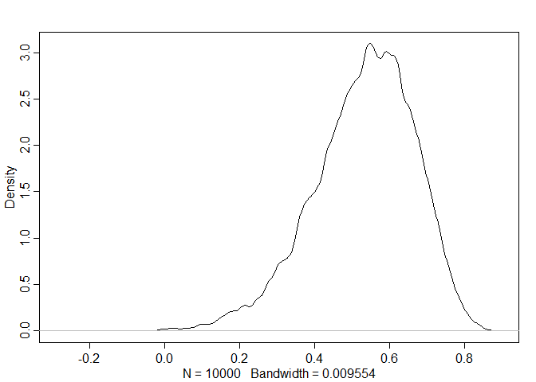

06\_29\_2020\_HW
================
John D.
6/29/2020

``` r
library(rethinking)
```

    ## Loading required package: rstan

    ## Loading required package: StanHeaders

    ## Loading required package: ggplot2

    ## rstan (Version 2.19.3, GitRev: 2e1f913d3ca3)

    ## For execution on a local, multicore CPU with excess RAM we recommend calling
    ## options(mc.cores = parallel::detectCores()).
    ## To avoid recompilation of unchanged Stan programs, we recommend calling
    ## rstan_options(auto_write = TRUE)

    ## For improved execution time, we recommend calling
    ## Sys.setenv(LOCAL_CPPFLAGS = '-march=corei7 -mtune=corei7')
    ## although this causes Stan to throw an error on a few processors.

    ## Loading required package: parallel

    ## Loading required package: dagitty

    ## rethinking (Version 1.95)

    ## 
    ## Attaching package: 'rethinking'

    ## The following object is masked from 'package:stats':
    ## 
    ##     rstudent

``` r
library(tidyverse)
```

    ## -- Attaching packages ------------------------------------------------------------------------------------- tidyverse 1.3.0 --

    ## v tibble  2.1.3     v dplyr   0.8.4
    ## v tidyr   1.0.2     v stringr 1.4.0
    ## v readr   1.3.1     v forcats 0.5.0
    ## v purrr   0.3.3

    ## -- Conflicts ---------------------------------------------------------------------------------------- tidyverse_conflicts() --
    ## x tidyr::extract() masks rstan::extract()
    ## x dplyr::filter()  masks stats::filter()
    ## x dplyr::lag()     masks stats::lag()
    ## x purrr::map()     masks rethinking::map()

``` r
library(ape)
```

    ## 
    ## Attaching package: 'ape'

    ## The following object is masked from 'package:dagitty':
    ## 
    ##     edges

## 14M5. Modify the phylogenetic distance example to use group size as the outcome and brain size as a predictor. Assuming brain size influences group size, what is your estimate of the effect? How does phylogeny influence the estimate?

``` r
## Data prep
data(Primates301)
data(Primates301_nex)
d <- Primates301
d$name <- as.character(d$name)
dstan <- d[ complete.cases( d$group_size , d$body , d$brain ) , ]
spp_obs <- dstan$name
dat_list <- list(
  N_spp = nrow(dstan),
  M = standardize(log(dstan$body)),
  B = standardize(log(dstan$brain)),
  G = standardize(log(dstan$group_size)),
  Imat = diag(nrow(dstan))
)
tree_trimmed <- keep.tip( Primates301_nex, spp_obs )
Rbm <- corBrownian( phy=tree_trimmed )
V <- vcv(Rbm)
```

    ## Warning in Initialize.corPhyl(phy, dummy.df): No covariate specified, species
    ## will be taken as ordered in the data frame. To avoid this message, specify a
    ## covariate containing the species names with the 'form' argument.

``` r
Dmat <- cophenetic( tree_trimmed )
dat_list$V <- V[spp_obs , spp_obs]
dat_list$R <- dat_list$V / max(V)
dat_list$Dmat <- Dmat[spp_obs , spp_obs] / max(Dmat)
```

``` r
# No phylo
model_14M5_no_phy <- ulam(
  alist(
    G ~ multi_normal(mu, SIGMA),
    mu <- a + bM*M + bB* B,
    matrix[N_spp, N_spp]:SIGMA <- Imat * sigma_sq,
    a ~ normal(0 , 1),
    c(bM, bB) ~ normal(0 , 0.5),
    sigma_sq ~ exponential(1)
  ),
  data = dat_list ,
  chains = 4 ,
  cores = 4
)

precis(model_14M5_no_phy)
```

    ##                  mean         sd        5.5%       94.5%     n_eff     Rhat4
    ## a        -0.001940987 0.06116301 -0.09686717 0.096286980  815.8482 1.0041366
    ## bB        0.999048543 0.20358421  0.67695823 1.325016680  721.9824 0.9999775
    ## bM       -0.332822432 0.20408942 -0.65081159 0.003048561  707.7846 0.9999185
    ## sigma_sq  0.522557665 0.06327669  0.43064568 0.632501669 1042.3905 1.0022844

``` r
# Phylo OU
model_14M5_ou <- ulam(
  alist(
    G ~ multi_normal(mu, SIGMA),
    mu <- a + bM*M + bB* B,
    matrix[N_spp,N_spp]: SIGMA <- cov_GPL1(Dmat , etasq , rhosq , 0.01),
    a ~ normal(0, 1),
    c(bM, bB) ~ normal(0, 0.5),
    etasq ~ half_normal(1, 0.25),
    rhosq ~ half_normal(3, 0.25)
  ),
  data = dat_list ,
  chains = 4 ,
  cores = 4
)

precis(model_14M5_ou)
```

    ##             mean        sd       5.5%       94.5%    n_eff     Rhat4
    ## a     -0.5182600 0.3427397 -1.0240597 -0.00552154 1581.205 0.9989958
    ## bB     0.1850856 0.2514445 -0.2218375  0.58735242 1251.785 0.9995217
    ## bM     0.1855123 0.2167705 -0.1556684  0.54229119 1317.266 0.9989846
    ## etasq  0.9284347 0.1212600  0.7470424  1.13284646 1448.755 1.0017852
    ## rhosq  3.0149613 0.2492356  2.6234466  3.42033318 1664.236 1.0004406

Without phylogenetic data brain size has a strong influence on group
size and body size has a slightly negative effect. Once phylogenetic
data is applied using OU, both brain size and body size appear to have
effects which overlap with 0 on group size

## 14H2. Varying effects models are useful for modeling time series, as well as spatial clustering. In a time series, the observations cluster by entities that have continuity through time, such as individuals. Since observations within individuals are likely highly correlated, the multilevel structure can help quite a lot. You’ll use the data in data(Oxboys), which is 234 height measurements on 26 boys from an Oxford Boys Club (I think these were like youth athletic leagues?), at 9 different ages (centered and standardized) per boy. You’ll be interested in predicting height, using age, clustered by Subject (individual boy). Fit a model with varying intercepts and slopes (on age), clustered by Subject. Present and interpret the parameter estimates. Which varying effect contributes more variation to the heights, the intercept or the slope?

``` r
data("Oxboys")
head(Oxboys)
```

    ##   Subject     age height Occasion
    ## 1       1 -1.0000  140.5        1
    ## 2       1 -0.7479  143.4        2
    ## 3       1 -0.4630  144.8        3
    ## 4       1 -0.1643  147.1        4
    ## 5       1 -0.0027  147.7        5
    ## 6       1  0.2466  150.2        6

``` r
d <- Oxboys
dat_list <- list(
  S = d$Subject,
  A = d$age,
  H = d$height,
  O = d$Occasion
)

summary(d)
```

    ##     Subject          age               height         Occasion
    ##  Min.   : 1.0   Min.   :-1.00000   Min.   :126.2   Min.   :1  
    ##  1st Qu.: 7.0   1st Qu.:-0.46300   1st Qu.:143.8   1st Qu.:3  
    ##  Median :13.5   Median :-0.00270   Median :149.5   Median :5  
    ##  Mean   :13.5   Mean   : 0.02263   Mean   :149.5   Mean   :5  
    ##  3rd Qu.:20.0   3rd Qu.: 0.55620   3rd Qu.:155.5   3rd Qu.:7  
    ##  Max.   :26.0   Max.   : 1.00550   Max.   :174.8   Max.   :9

``` r
model_14H2 <- ulam(
  alist(
    H ~ normal(mu, sigma),
    mu <- a[S] + bS[S] * A,
    c(a, bS)[S] ~ multi_normal(c(a_S, b_S) , Rho , sigma_S),
    a_S ~ normal(150, 7),
    b_S ~ normal(0, 1),
    sigma_S ~ exponential(1),
    sigma ~ exponential(1),
    Rho ~ lkj_corr(2)
  ),
  data = dat_list,
  chains = 4,
  cores = 4,
  log_lik = T,
  iter = 5000
)
```

    ## Warning: The largest R-hat is NA, indicating chains have not mixed.
    ## Running the chains for more iterations may help. See
    ## http://mc-stan.org/misc/warnings.html#r-hat

    ## Warning: Bulk Effective Samples Size (ESS) is too low, indicating posterior means and medians may be unreliable.
    ## Running the chains for more iterations may help. See
    ## http://mc-stan.org/misc/warnings.html#bulk-ess

    ## Warning: Tail Effective Samples Size (ESS) is too low, indicating posterior variances and tail quantiles may be unreliable.
    ## Running the chains for more iterations may help. See
    ## http://mc-stan.org/misc/warnings.html#tail-ess

``` r
precis(model_14H2, depth = 3, pars = c("a", "bS", "Rho", "sigma"))
```

    ##                 mean           sd        5.5%       94.5%     n_eff     Rhat4
    ## a[1]     148.1260334 2.227307e-01 147.7672158 148.4794215 20292.684 0.9999347
    ## a[2]     142.8644706 2.190424e-01 142.5137919 143.2193650 18754.644 0.9997379
    ## a[3]     155.6358027 2.261620e-01 155.2708133 155.9989898 22202.733 0.9997392
    ## a[4]     165.0634699 2.233364e-01 164.7065570 165.4210189 20133.092 0.9998415
    ## a[5]     151.4253726 2.225508e-01 151.0753784 151.7729693 21739.749 0.9997905
    ## a[6]     146.7842874 2.223062e-01 146.4292139 147.1368560 22199.111 0.9998693
    ## a[7]     146.1269465 2.184535e-01 145.7789493 146.4776555 23443.685 0.9997620
    ## a[8]     148.2953781 2.217827e-01 147.9378726 148.6465698 20036.260 0.9997552
    ## a[9]     138.1519244 2.258307e-01 137.7936331 138.5105115 23749.031 0.9996716
    ## a[10]    130.2775677 2.213146e-01 129.9240910 130.6324659 21626.855 0.9997145
    ## a[11]    150.0553026 2.199399e-01 149.7038237 150.4051174 21600.619 0.9999221
    ## a[12]    156.8011496 2.179555e-01 156.4533023 157.1484054 20837.949 0.9998158
    ## a[13]    156.0705296 2.250536e-01 155.7148969 156.4325553 20666.699 0.9999266
    ## a[14]    159.4700115 2.224200e-01 159.1175963 159.8219882 20791.611 0.9999301
    ## a[15]    144.2859420 2.257630e-01 143.9305575 144.6484658 23297.489 1.0001581
    ## a[16]    147.5393998 2.202249e-01 147.1906135 147.8907013 20417.657 0.9997855
    ## a[17]    142.9973840 2.154572e-01 142.6529215 143.3398172 22555.258 0.9997404
    ## a[18]    151.1759916 2.255733e-01 150.8156501 151.5378778 22004.001 0.9997995
    ## a[19]    164.5651766 2.214470e-01 164.2133463 164.9151987 21887.723 0.9997580
    ## a[20]    151.4572596 2.216079e-01 151.0998582 151.8087597 24150.309 0.9996815
    ## a[21]    150.5223996 2.189770e-01 150.1711845 150.8758678 20568.582 0.9999522
    ## a[22]    154.5679134 2.253090e-01 154.2024697 154.9261226 23313.908 0.9996889
    ## a[23]    151.0658739 2.231924e-01 150.7089385 151.4197664 22626.883 0.9997194
    ## a[24]    153.1382414 2.201107e-01 152.7866839 153.4892783 24266.793 0.9998322
    ## a[25]    139.2160682 2.229792e-01 138.8596364 139.5761299 22334.918 0.9999965
    ## a[26]    138.0066885 2.254979e-01 137.6433785 138.3633441 20621.147 0.9999032
    ## bS[1]      7.1060195 3.319348e-01   6.5776163   7.6367801 23468.812 0.9996850
    ## bS[2]      5.4314124 3.357261e-01   4.8967532   5.9736344 23462.072 0.9996566
    ## bS[3]      4.8877028 3.348369e-01   4.3522162   5.4231208 21544.300 0.9996958
    ## bS[4]      9.2880313 3.366563e-01   8.7409671   9.8237112 22791.961 0.9998725
    ## bS[5]      6.2488126 3.359068e-01   5.7065024   6.7852898 21713.750 0.9997317
    ## bS[6]      4.0587878 3.283086e-01   3.5301300   4.5881349 22231.742 1.0000729
    ## bS[7]      5.0316689 3.378347e-01   4.4901227   5.5731729 20772.254 0.9998333
    ## bS[8]      6.4353398 3.299667e-01   5.9114671   6.9528514 21655.715 0.9997338
    ## bS[9]      5.9317063 3.367883e-01   5.3996540   6.4610778 24146.876 0.9996455
    ## bS[10]     3.7212903 3.385500e-01   3.1798392   4.2664212 20935.391 0.9996697
    ## bS[11]     8.3711371 3.294328e-01   7.8445998   8.9026158 19549.425 0.9997650
    ## bS[12]     7.0133777 3.332646e-01   6.4748839   7.5543512 21395.889 0.9996593
    ## bS[13]     8.4017627 3.449274e-01   7.8476744   8.9600597 21323.030 0.9997668
    ## bS[14]     8.5948317 3.357916e-01   8.0538909   9.1353467 22519.825 0.9997564
    ## bS[15]     7.0293742 3.340351e-01   6.4940115   7.5679820 19263.028 0.9998359
    ## bS[16]     4.6167058 3.384638e-01   4.0752406   5.1510247 19330.859 0.9999074
    ## bS[17]     8.4192163 3.351789e-01   7.8830692   8.9488707 21962.508 0.9998987
    ## bS[18]     5.9788065 3.286445e-01   5.4558189   6.5030169 20305.081 0.9999386
    ## bS[19]     9.0044402 3.346831e-01   8.4709444   9.5376820 18739.864 0.9997590
    ## bS[20]     4.4807505 3.325716e-01   3.9555822   5.0226540 20150.519 0.9998830
    ## bS[21]     7.4245695 3.332546e-01   6.8840006   7.9531949 22363.825 0.9999258
    ## bS[22]     8.0061640 3.256627e-01   7.4867367   8.5241094 21558.531 0.9999478
    ## bS[23]     7.1317349 3.338042e-01   6.6008718   7.6612416 25763.006 0.9998141
    ## bS[24]     6.7522569 3.316336e-01   6.2226229   7.2876074 20702.628 0.9997047
    ## bS[25]     4.0663260 3.336378e-01   3.5386530   4.5970196 19909.255 0.9999959
    ## bS[26]     5.5364601 3.382628e-01   4.9951115   6.0769161 20879.718 0.9998667
    ## Rho[1,1]   1.0000000 0.000000e+00   1.0000000   1.0000000       NaN       NaN
    ## Rho[1,2]   0.5314566 1.353181e-01   0.2968462   0.7251400 11580.086 0.9999120
    ## Rho[2,1]   0.5314566 1.353181e-01   0.2968462   0.7251400 11580.086 0.9999120
    ## Rho[2,2]   1.0000000 7.760839e-17   1.0000000   1.0000000  9802.706 0.9995999
    ## sigma      0.6638789 3.547736e-02   0.6101095   0.7230559 11550.011 0.9998269

``` r
post <- extract.samples(model_14H2)
mean(post$a)
```

    ## [1] 149.3726

``` r
mean(var(post$a))
```

    ## [1] 0.001903893

``` r
mean(post$bS)
```

    ## [1] 6.498796

``` r
mean(var(post$bS))
```

    ## [1] 0.00428266

``` r
dens( post$Rho[,1,2] )
```

<!-- -->

## 14H3. Now consider the correlation between the varying intercepts and slopes. Can you explain its value? How would this estimated correlation influence your predictions about a new sample of boys?

Intercept and slope are correlated positively. Tall initial height leads
to faster growing rate
