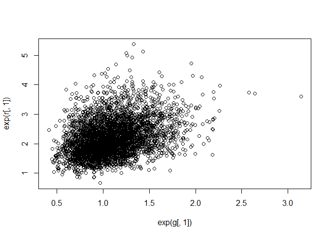
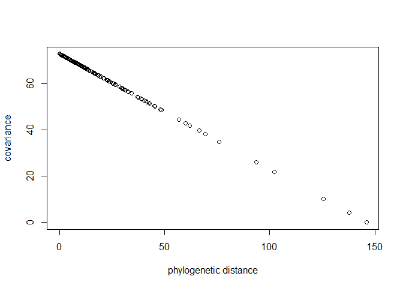

06\_29\_2020\_Notes
================
John D.
6/29/2020

``` r
library(rethinking)
```

    ## Loading required package: rstan

    ## Loading required package: StanHeaders

    ## Loading required package: ggplot2

    ## rstan (Version 2.19.3, GitRev: 2e1f913d3ca3)

    ## For execution on a local, multicore CPU with excess RAM we recommend calling
    ## options(mc.cores = parallel::detectCores()).
    ## To avoid recompilation of unchanged Stan programs, we recommend calling
    ## rstan_options(auto_write = TRUE)

    ## For improved execution time, we recommend calling
    ## Sys.setenv(LOCAL_CPPFLAGS = '-march=corei7 -mtune=corei7')
    ## although this causes Stan to throw an error on a few processors.

    ## Loading required package: parallel

    ## Loading required package: dagitty

    ## rethinking (Version 1.95)

    ## 
    ## Attaching package: 'rethinking'

    ## The following object is masked from 'package:stats':
    ## 
    ##     rstudent

``` r
library(tidyverse)
```

    ## -- Attaching packages ------------------------------------------------------------------------------------- tidyverse 1.3.0 --

    ## v tibble  2.1.3     v dplyr   0.8.4
    ## v tidyr   1.0.2     v stringr 1.4.0
    ## v readr   1.3.1     v forcats 0.5.0
    ## v purrr   0.3.3

    ## -- Conflicts ---------------------------------------------------------------------------------------- tidyverse_conflicts() --
    ## x tidyr::extract() masks rstan::extract()
    ## x dplyr::filter()  masks stats::filter()
    ## x dplyr::lag()     masks stats::lag()
    ## x purrr::map()     masks rethinking::map()

# Ch.14 Adventures in Covariance

## 14.2. Advanced varying slopes

``` r
data(chimpanzees)
d <- chimpanzees
d$block_id <- d$block
d$treatment <- 1L + d$prosoc_left + 2L*d$condition
dat <- list(
L = d$pulled_left,
tid = d$treatment,
actor = d$actor,
block_id = as.integer(d$block_id) )
m14.2 <- ulam(
  alist(
    L ~ binomial(1, p),
    logit(p) <- g[tid] + alpha[actor, tid] + beta[block_id, tid],
    # adaptive priors
    vector[4]:alpha[actor] ~ multi_normal(0, Rho_actor, sigma_actor),
    vector[4]:beta[block_id] ~ multi_normal(0, Rho_block, sigma_block),
    # fixed priors
    g[tid] ~ dnorm(0, 1),
    sigma_actor ~ dexp(1),
    Rho_actor ~ dlkjcorr(4),
    sigma_block ~ dexp(1),
    Rho_block ~ dlkjcorr(4)
  ) ,
  data = dat ,
  chains = 4 ,
  cores = 4,
  iter = 5000,
  log_lik = TRUE
)
```

    ## Warning: There were 1696 divergent transitions after warmup. Increasing adapt_delta above 0.95 may help. See
    ## http://mc-stan.org/misc/warnings.html#divergent-transitions-after-warmup

    ## Warning: Examine the pairs() plot to diagnose sampling problems

    ## Warning: The largest R-hat is NA, indicating chains have not mixed.
    ## Running the chains for more iterations may help. See
    ## http://mc-stan.org/misc/warnings.html#r-hat

    ## Warning: Bulk Effective Samples Size (ESS) is too low, indicating posterior means and medians may be unreliable.
    ## Running the chains for more iterations may help. See
    ## http://mc-stan.org/misc/warnings.html#bulk-ess

    ## Warning: Tail Effective Samples Size (ESS) is too low, indicating posterior variances and tail quantiles may be unreliable.
    ## Running the chains for more iterations may help. See
    ## http://mc-stan.org/misc/warnings.html#tail-ess

``` r
m14.3 <- ulam(
  alist(
    L ~ binomial(1, p),
    logit(p) <- g[tid] + alpha[actor, tid] + beta[block_id, tid],
    # adaptive priors - non-centered
    transpars > matrix[actor, 4]:alpha <-
      compose_noncentered(sigma_actor , L_Rho_actor , z_actor),
    transpars > matrix[block_id, 4]:beta <-
      compose_noncentered(sigma_block , L_Rho_block , z_block),
    matrix[4, actor]:z_actor ~ normal(0 , 1),
    matrix[4, block_id]:z_block ~ normal(0 , 1),
    # fixed priors
    g[tid] ~ normal(0, 1),
    vector[4]:sigma_actor ~ dexp(1),
    cholesky_factor_corr[4]:L_Rho_actor ~ lkj_corr_cholesky(2),
    vector[4]:sigma_block ~ dexp(1),
    cholesky_factor_corr[4]:L_Rho_block ~ lkj_corr_cholesky(2),
    # compute ordinary correlation matrixes from Cholesky factors
    gq > matrix[4, 4]:Rho_actor <<-
      multiply_lower_tri_self_transpose(L_Rho_actor),
    gq > matrix[4, 4]:Rho_block <<-
      multiply_lower_tri_self_transpose(L_Rho_block)
  ) ,
  data = dat ,
  chains = 4 ,
  cores = 4 ,
  iter = 5000,
  log_lik = TRUE
)
```

    ## Warning: The largest R-hat is NA, indicating chains have not mixed.
    ## Running the chains for more iterations may help. See
    ## http://mc-stan.org/misc/warnings.html#r-hat

    ## Warning: Bulk Effective Samples Size (ESS) is too low, indicating posterior means and medians may be unreliable.
    ## Running the chains for more iterations may help. See
    ## http://mc-stan.org/misc/warnings.html#bulk-ess

    ## Warning: Tail Effective Samples Size (ESS) is too low, indicating posterior variances and tail quantiles may be unreliable.
    ## Running the chains for more iterations may help. See
    ## http://mc-stan.org/misc/warnings.html#tail-ess

``` r
# extract n_eff values for each model
neff_nc <- precis(m14.3,3,pars=c("alpha","beta"))$n_eff
neff_c <- precis(m14.2,3,pars=c("alpha","beta"))$n_eff
plot( neff_c , neff_nc , xlab="centered (default)" ,
ylab="non-centered (cholesky)" , lwd=1.5 )
abline(a=0,b=1,lty=2)
```

<!-- -->

``` r
precis(m14.3,depth=3)
```

    ##                         mean           sd         5.5%       94.5%      n_eff
    ## z_actor[1,1]     -0.65259511 4.799900e-01 -1.444943583  0.06698602  4671.6613
    ## z_actor[1,2]      2.34228381 7.215625e-01  1.225701019  3.52754777  6666.8021
    ## z_actor[1,3]     -0.85453421 5.008479e-01 -1.696083881 -0.09325917  5090.8619
    ## z_actor[1,4]     -0.73596626 4.923213e-01 -1.562884395  0.00602713  4776.0899
    ## z_actor[1,5]     -0.65588934 4.797269e-01 -1.436225791  0.06110887  4538.9974
    ## z_actor[1,6]      0.58851559 4.809402e-01 -0.152110561  1.38447274  5473.4076
    ## z_actor[1,7]      0.93991162 5.641194e-01  0.098689397  1.89738081  4610.2916
    ## z_actor[2,1]     -0.35684773 6.468768e-01 -1.388617432  0.68248804  5991.3888
    ## z_actor[2,2]      1.40908063 9.421799e-01 -0.130257718  2.88464561  6329.2573
    ## z_actor[2,3]     -0.05931028 6.917916e-01 -1.154468213  1.03798635  6096.6754
    ## z_actor[2,4]     -0.44178212 6.901347e-01 -1.536146441  0.65236429  5796.6649
    ## z_actor[2,5]     -0.21068167 6.518139e-01 -1.230532046  0.82728595  6396.2914
    ## z_actor[2,6]     -0.36840677 6.537227e-01 -1.415091853  0.65072568  7166.1517
    ## z_actor[2,7]      0.77438710 8.248702e-01 -0.526298775  2.09629965  5447.3089
    ## z_actor[3,1]     -0.08962844 6.416629e-01 -1.094125329  0.94915553  6960.8374
    ## z_actor[3,2]      0.87768562 9.350237e-01 -0.639328946  2.33775532  8166.9367
    ## z_actor[3,3]     -0.51310116 6.907159e-01 -1.599574476  0.60586398  6689.1838
    ## z_actor[3,4]     -0.64578923 6.880849e-01 -1.723960604  0.44166665  6982.7024
    ## z_actor[3,5]     -0.16794852 6.518898e-01 -1.184750449  0.89998861  6974.0471
    ## z_actor[3,6]     -0.09844577 6.707411e-01 -1.173135596  0.93346934  6952.4424
    ## z_actor[3,7]      1.00502424 8.441798e-01 -0.363050593  2.31580916  6962.5256
    ## z_actor[4,1]      0.07812421 7.377059e-01 -1.089832889  1.26581972  8758.9658
    ## z_actor[4,2]      0.44803653 9.585113e-01 -1.088977428  1.97096003 12167.2753
    ## z_actor[4,3]     -0.39981155 7.860191e-01 -1.643653326  0.84903196  8552.7168
    ## z_actor[4,4]      0.02917938 7.677863e-01 -1.177410437  1.26555577  9285.1284
    ## z_actor[4,5]     -0.09527602 7.285206e-01 -1.252227407  1.09215422  8207.9576
    ## z_actor[4,6]     -0.30933469 7.693032e-01 -1.530936970  0.93245484  8530.4195
    ## z_actor[4,7]      0.80731049 9.098424e-01 -0.668267355  2.22988809 10261.6139
    ## z_block[1,1]     -0.27553037 8.501734e-01 -1.635303396  1.08559091 10130.1422
    ## z_block[1,2]      0.12625836 8.172381e-01 -1.181940853  1.41693676 10885.1246
    ## z_block[1,3]      0.65725501 8.654337e-01 -0.776948328  1.99723339  8759.9408
    ## z_block[1,4]      0.26821591 8.401147e-01 -1.090668835  1.58477172 10431.6216
    ## z_block[1,5]     -0.44444661 8.391087e-01 -1.753801860  0.91561274  8831.2220
    ## z_block[1,6]     -0.27494296 8.760989e-01 -1.643896008  1.14175493  8897.2938
    ## z_block[2,1]     -0.13815358 8.627176e-01 -1.521757191  1.23682003 10012.0746
    ## z_block[2,2]     -0.25213883 8.338059e-01 -1.565512563  1.09406360 10616.4091
    ## z_block[2,3]     -0.39313414 8.526344e-01 -1.745548218  0.96967795  9418.7714
    ## z_block[2,4]      0.25640524 8.313010e-01 -1.088903006  1.57034530 10789.6350
    ## z_block[2,5]      0.02131652 8.362267e-01 -1.320790974  1.33254245 11277.7344
    ## z_block[2,6]      0.77681383 9.157393e-01 -0.747502827  2.19175348  8808.9328
    ## z_block[3,1]     -0.12568635 9.612173e-01 -1.655418052  1.41076759 13010.3383
    ## z_block[3,2]      0.18778002 9.284898e-01 -1.300431363  1.67250995 12411.4798
    ## z_block[3,3]      0.03353861 9.299564e-01 -1.466546642  1.49886226 12611.9853
    ## z_block[3,4]     -0.24443227 9.331212e-01 -1.733562197  1.24723374 12658.6627
    ## z_block[3,5]      0.21994511 9.418522e-01 -1.306329883  1.72743545 13453.7234
    ## z_block[3,6]     -0.07090216 9.408319e-01 -1.573188868  1.44670381 11687.8582
    ## z_block[4,1]     -0.60920785 9.419476e-01 -2.080950082  0.91504617 10534.1913
    ## z_block[4,2]      0.22802062 9.037592e-01 -1.241342810  1.63476669 11641.7620
    ## z_block[4,3]      0.22747281 9.049823e-01 -1.229818419  1.64362694 11797.7312
    ## z_block[4,4]     -0.01868940 9.259535e-01 -1.491403384  1.46236606 12735.5426
    ## z_block[4,5]     -0.05169184 8.929464e-01 -1.496250736  1.35794673 11639.6985
    ## z_block[4,6]      0.44411075 9.229234e-01 -1.051289763  1.88355699 11579.6404
    ## g[1]              0.22385576 5.017934e-01 -0.564734365  1.02137474  3700.2245
    ## g[2]              0.64201928 4.090104e-01 -0.009128859  1.29599310  4780.1360
    ## g[3]             -0.02179667 5.783613e-01 -0.917374621  0.91202922  5439.8127
    ## g[4]              0.67110846 5.445279e-01 -0.193900379  1.53394039  5740.7571
    ## sigma_actor[1]    1.38152792 4.879660e-01  0.779865170  2.23936046  4141.0943
    ## sigma_actor[2]    0.90470706 3.944760e-01  0.410287713  1.59663210  6556.0874
    ## sigma_actor[3]    1.83219598 5.481683e-01  1.125095786  2.81003128  5954.8563
    ## sigma_actor[4]    1.57701195 5.984831e-01  0.841460386  2.65418996  6458.5844
    ## L_Rho_actor[1,1]  1.00000000 0.000000e+00  1.000000000  1.00000000        NaN
    ## L_Rho_actor[1,2]  0.00000000 0.000000e+00  0.000000000  0.00000000        NaN
    ## L_Rho_actor[1,3]  0.00000000 0.000000e+00  0.000000000  0.00000000        NaN
    ## L_Rho_actor[1,4]  0.00000000 0.000000e+00  0.000000000  0.00000000        NaN
    ## L_Rho_actor[2,1]  0.42710452 2.785438e-01 -0.060437076  0.82244717  6140.5384
    ## L_Rho_actor[2,2]  0.84839976 1.422066e-01  0.568841494  0.99808984  5589.3062
    ## L_Rho_actor[2,3]  0.00000000 0.000000e+00  0.000000000  0.00000000        NaN
    ## L_Rho_actor[2,4]  0.00000000 0.000000e+00  0.000000000  0.00000000        NaN
    ## L_Rho_actor[3,1]  0.52265403 2.481590e-01  0.070375440  0.85534757  6317.7829
    ## L_Rho_actor[3,2]  0.28479172 3.098186e-01 -0.250981809  0.74132502  4576.3939
    ## L_Rho_actor[3,3]  0.67632601 1.753793e-01  0.370536657  0.93857733  5592.2246
    ## L_Rho_actor[3,4]  0.00000000 0.000000e+00  0.000000000  0.00000000        NaN
    ## L_Rho_actor[4,1]  0.44022474 2.674128e-01 -0.037478290  0.81421565  6337.9692
    ## L_Rho_actor[4,2]  0.28238536 3.206887e-01 -0.270953264  0.75261290  4928.6083
    ## L_Rho_actor[4,3]  0.30773123 3.148293e-01 -0.240778774  0.76531917  4661.0760
    ## L_Rho_actor[4,4]  0.57045685 1.813930e-01  0.278622144  0.86205932  6304.1227
    ## sigma_block[1]    0.41264018 3.271028e-01  0.034628151  1.00101122  5183.3931
    ## sigma_block[2]    0.43921792 3.480734e-01  0.039944953  1.06448118  5055.3238
    ## sigma_block[3]    0.29665234 2.733165e-01  0.020462818  0.80697722  8727.5471
    ## sigma_block[4]    0.47414397 3.806063e-01  0.036789787  1.15258825  5549.6389
    ## L_Rho_block[1,1]  1.00000000 0.000000e+00  1.000000000  1.00000000        NaN
    ## L_Rho_block[1,2]  0.00000000 0.000000e+00  0.000000000  0.00000000        NaN
    ## L_Rho_block[1,3]  0.00000000 0.000000e+00  0.000000000  0.00000000        NaN
    ## L_Rho_block[1,4]  0.00000000 0.000000e+00  0.000000000  0.00000000        NaN
    ## L_Rho_block[2,1] -0.07486845 3.734291e-01 -0.657687028  0.54260987  7946.0932
    ## L_Rho_block[2,2]  0.91891380 1.027516e-01  0.709668710  0.99955486  5055.8116
    ## L_Rho_block[2,3]  0.00000000 0.000000e+00  0.000000000  0.00000000        NaN
    ## L_Rho_block[2,4]  0.00000000 0.000000e+00  0.000000000  0.00000000        NaN
    ## L_Rho_block[3,1] -0.01469536 3.790687e-01 -0.626829937  0.59665057 11715.3150
    ## L_Rho_block[3,2] -0.03420578 3.782680e-01 -0.639002101  0.58244799 12416.8160
    ## L_Rho_block[3,3]  0.83162546 1.423519e-01  0.551911387  0.98886421  4598.1708
    ## L_Rho_block[3,4]  0.00000000 0.000000e+00  0.000000000  0.00000000        NaN
    ## L_Rho_block[4,1]  0.04775530 3.697023e-01 -0.554522252  0.62712348  9634.0865
    ## L_Rho_block[4,2]  0.04107367 3.745262e-01 -0.571448279  0.62984613 10288.9608
    ## L_Rho_block[4,3]  0.01958692 3.773424e-01 -0.599077663  0.62060611  9408.6183
    ## L_Rho_block[4,4]  0.74009745 1.691519e-01  0.430187774  0.95900077  5328.0682
    ## Rho_block[1,1]    1.00000000 0.000000e+00  1.000000000  1.00000000        NaN
    ## Rho_block[1,2]   -0.07486845 3.734291e-01 -0.657687028  0.54260987  7946.0932
    ## Rho_block[1,3]   -0.01469536 3.790687e-01 -0.626829937  0.59665057 11715.3150
    ## Rho_block[1,4]    0.04775530 3.697023e-01 -0.554522252  0.62712348  9634.0865
    ## Rho_block[2,1]   -0.07486845 3.734291e-01 -0.657687028  0.54260987  7946.0932
    ## Rho_block[2,2]    1.00000000 8.729642e-17  1.000000000  1.00000000  9845.3706
    ## Rho_block[2,3]   -0.03510978 3.771181e-01 -0.636893799  0.57986354 10709.3295
    ## Rho_block[2,4]    0.03534603 3.724991e-01 -0.574268124  0.62303541  8874.6416
    ## Rho_block[3,1]   -0.01469536 3.790687e-01 -0.626829937  0.59665057 11715.3150
    ## Rho_block[3,2]   -0.03510978 3.771181e-01 -0.636893799  0.57986354 10709.3295
    ## Rho_block[3,3]    1.00000000 7.491707e-17  1.000000000  1.00000000  9256.7289
    ## Rho_block[3,4]    0.01730022 3.743575e-01 -0.587998401  0.61586079  8148.2687
    ## Rho_block[4,1]    0.04775530 3.697023e-01 -0.554522252  0.62712348  9634.0865
    ## Rho_block[4,2]    0.03534603 3.724991e-01 -0.574268124  0.62303541  8874.6416
    ## Rho_block[4,3]    0.01730022 3.743575e-01 -0.587998401  0.61586079  8148.2687
    ## Rho_block[4,4]    1.00000000 7.896259e-17  1.000000000  1.00000000  4318.5514
    ## Rho_actor[1,1]    1.00000000 0.000000e+00  1.000000000  1.00000000        NaN
    ## Rho_actor[1,2]    0.42710452 2.785438e-01 -0.060437076  0.82244717  6140.5384
    ## Rho_actor[1,3]    0.52265403 2.481590e-01  0.070375440  0.85534757  6317.7829
    ## Rho_actor[1,4]    0.44022474 2.674128e-01 -0.037478290  0.81421565  6337.9692
    ## Rho_actor[2,1]    0.42710452 2.785438e-01 -0.060437076  0.82244717  6140.5384
    ## Rho_actor[2,2]    1.00000000 7.867324e-17  1.000000000  1.00000000  9897.5136
    ## Rho_actor[2,3]    0.48583462 2.677526e-01  0.004795660  0.84940080  6752.2886
    ## Rho_actor[2,4]    0.44787798 2.786389e-01 -0.059750569  0.83161686  7099.0374
    ## Rho_actor[3,1]    0.52265403 2.481590e-01  0.070375440  0.85534757  6317.7829
    ## Rho_actor[3,2]    0.48583462 2.677526e-01  0.004795660  0.84940080  6752.2886
    ## Rho_actor[3,3]    1.00000000 5.243055e-17  1.000000000  1.00000000  9659.1612
    ## Rho_actor[3,4]    0.57879346 2.385187e-01  0.138328091  0.89113642  7249.6764
    ## Rho_actor[4,1]    0.44022474 2.674128e-01 -0.037478290  0.81421565  6337.9692
    ## Rho_actor[4,2]    0.44787798 2.786389e-01 -0.059750569  0.83161686  7099.0374
    ## Rho_actor[4,3]    0.57879346 2.385187e-01  0.138328091  0.89113642  7249.6764
    ## Rho_actor[4,4]    1.00000000 6.028311e-17  1.000000000  1.00000000   785.9406
    ## beta[1,1]        -0.12947666 3.626736e-01 -0.768231446  0.36486159 10344.4067
    ## beta[1,2]        -0.05147089 3.503200e-01 -0.637875593  0.47119671  9623.9711
    ## beta[1,3]        -0.05175986 2.921436e-01 -0.555358687  0.35444856  9832.0231
    ## beta[1,4]        -0.40376330 4.967642e-01 -1.338790446  0.13418767  6981.7744
    ## beta[2,1]         0.06128531 3.391349e-01 -0.444367396  0.62651112 10589.9773
    ## beta[2,2]        -0.12835611 3.558845e-01 -0.747309633  0.36237080  8814.5173
    ## beta[2,3]         0.08718398 3.063232e-01 -0.304607827  0.64086232  9378.9340
    ## beta[2,4]         0.16763020 3.831815e-01 -0.319773419  0.85438103  7903.7585
    ## beta[3,1]         0.32424926 4.352832e-01 -0.149091236  1.15768667  7044.7797
    ## beta[3,2]        -0.22184877 3.738776e-01 -0.899960652  0.24528102  7525.8869
    ## beta[3,3]         0.01464784 2.928866e-01 -0.436395945  0.48582356 10342.4434
    ## beta[3,4]         0.16398943 3.989595e-01 -0.358294002  0.88209173  7102.3510
    ## beta[4,1]         0.13134666 3.601225e-01 -0.347799479  0.78112976 10389.3623
    ## beta[4,2]         0.12748661 3.661509e-01 -0.362768342  0.76351628  8956.4287
    ## beta[4,3]        -0.11305000 3.035242e-01 -0.676246029  0.24521493  9667.3455
    ## beta[4,4]         0.01312014 4.032725e-01 -0.612052904  0.66099111  8523.5467
    ## beta[5,1]        -0.20989529 3.742185e-01 -0.896927652  0.25007034  7652.0623
    ## beta[5,2]         0.04249755 3.447092e-01 -0.471697442  0.62069474  9472.2439
    ## beta[5,3]         0.10336079 3.157454e-01 -0.282051267  0.67142016  8516.6135
    ## beta[5,4]        -0.02608024 3.583134e-01 -0.594394642  0.52874452  8949.8682
    ## beta[6,1]        -0.12721635 3.630700e-01 -0.765801775  0.36638660  9001.3736
    ## beta[6,2]         0.42442040 4.995217e-01 -0.102378846  1.36802969  6180.9493
    ## beta[6,3]        -0.04629999 3.013131e-01 -0.550103674  0.38232223 10291.5621
    ## beta[6,4]         0.32506723 4.812987e-01 -0.213380130  1.24524482  6390.6567
    ## alpha[1,1]       -0.84060941 6.215656e-01 -1.865206585  0.08896788  5317.7437
    ## alpha[1,2]       -0.50395769 4.907720e-01 -1.337016635  0.21108427  6395.1529
    ## alpha[1,3]       -0.94861088 7.184095e-01 -2.129454625  0.15223065  6759.6192
    ## alpha[1,4]       -0.56717206 6.529028e-01 -1.627302135  0.45482616  6829.5495
    ## alpha[2,1]        3.13109651 1.248650e+00  1.509256293  5.24966442  8244.1503
    ## alpha[2,2]        2.02114286 9.878406e-01  0.730846327  3.76039378  8518.0686
    ## alpha[2,3]        4.31197999 1.586251e+00  2.249313772  7.10006902  8728.2418
    ## alpha[2,4]        3.39770267 1.584966e+00  1.465690830  6.20536535  8629.2805
    ## alpha[3,1]       -1.10211818 6.411667e-01 -2.159925020 -0.12672725  5961.3434
    ## alpha[3,2]       -0.32865863 4.809466e-01 -1.080298571  0.44381528  6786.3781
    ## alpha[3,3]       -1.54293627 7.679646e-01 -2.821655257 -0.38159141  7107.8770
    ## alpha[3,4]       -1.28684775 6.789951e-01 -2.393272916 -0.25686351  7490.4257
    ## alpha[4,1]       -0.93961724 6.230194e-01 -1.961127133  0.00914716  5625.3429
    ## alpha[4,2]       -0.58343439 4.917674e-01 -1.394800723  0.16026098  6972.2264
    ## alpha[4,3]       -1.82155878 8.173117e-01 -3.180957175 -0.57762205  7544.5667
    ## alpha[4,4]       -0.97960574 6.638836e-01 -2.057434578  0.04269150  7458.8430
    ## alpha[5,1]       -0.84358531 6.198391e-01 -1.862892063  0.08733069  5088.8367
    ## alpha[5,2]       -0.38280451 4.719439e-01 -1.147207061  0.33818944  6684.4760
    ## alpha[5,3]       -0.97950770 7.254830e-01 -2.167032079  0.14018570  6424.5879
    ## alpha[5,4]       -0.70994101 6.434273e-01 -1.751286844  0.30256695  6981.5067
    ## alpha[6,1]        0.77192834 6.387753e-01 -0.197487155  1.81764980  4984.4391
    ## alpha[6,2]       -0.05045021 4.798962e-01 -0.836258525  0.70068198  6881.2878
    ## alpha[6,3]        0.25303868 6.911727e-01 -0.847372717  1.33607326  6496.5054
    ## alpha[6,4]       -0.10209445 6.554853e-01 -1.158776460  0.91805318  7189.6020
    ## alpha[7,1]        1.18748018 6.787424e-01  0.142094171  2.29316852  5364.4292
    ## alpha[7,2]        0.92063106 5.824357e-01  0.081734473  1.88679319  7497.4132
    ## alpha[7,3]        2.67481690 9.628407e-01  1.278898575  4.30827092  8068.7407
    ## alpha[7,4]        2.57532467 1.212912e+00  1.015069832  4.67205877  7779.1837
    ##                      Rhat4
    ## z_actor[1,1]     1.0004458
    ## z_actor[1,2]     0.9999606
    ## z_actor[1,3]     1.0001707
    ## z_actor[1,4]     1.0002602
    ## z_actor[1,5]     1.0006890
    ## z_actor[1,6]     1.0004755
    ## z_actor[1,7]     1.0000583
    ## z_actor[2,1]     1.0000787
    ## z_actor[2,2]     1.0002963
    ## z_actor[2,3]     1.0005059
    ## z_actor[2,4]     1.0007007
    ## z_actor[2,5]     0.9999943
    ## z_actor[2,6]     1.0001744
    ## z_actor[2,7]     1.0007707
    ## z_actor[3,1]     0.9999916
    ## z_actor[3,2]     1.0003084
    ## z_actor[3,3]     0.9999486
    ## z_actor[3,4]     0.9998760
    ## z_actor[3,5]     0.9998669
    ## z_actor[3,6]     1.0002272
    ## z_actor[3,7]     1.0002179
    ## z_actor[4,1]     1.0001237
    ## z_actor[4,2]     1.0001325
    ## z_actor[4,3]     1.0001878
    ## z_actor[4,4]     0.9997091
    ## z_actor[4,5]     0.9996942
    ## z_actor[4,6]     0.9998052
    ## z_actor[4,7]     0.9999163
    ## z_block[1,1]     0.9998335
    ## z_block[1,2]     0.9998196
    ## z_block[1,3]     0.9999377
    ## z_block[1,4]     1.0000390
    ## z_block[1,5]     1.0006587
    ## z_block[1,6]     0.9999636
    ## z_block[2,1]     1.0004465
    ## z_block[2,2]     1.0002907
    ## z_block[2,3]     0.9998842
    ## z_block[2,4]     1.0000238
    ## z_block[2,5]     0.9999045
    ## z_block[2,6]     0.9996689
    ## z_block[3,1]     0.9999533
    ## z_block[3,2]     0.9999345
    ## z_block[3,3]     0.9999002
    ## z_block[3,4]     0.9999375
    ## z_block[3,5]     1.0001677
    ## z_block[3,6]     0.9999713
    ## z_block[4,1]     0.9999152
    ## z_block[4,2]     0.9999342
    ## z_block[4,3]     0.9999258
    ## z_block[4,4]     0.9997857
    ## z_block[4,5]     0.9998490
    ## z_block[4,6]     1.0001713
    ## g[1]             1.0003296
    ## g[2]             1.0003125
    ## g[3]             1.0000906
    ## g[4]             1.0000480
    ## sigma_actor[1]   1.0004463
    ## sigma_actor[2]   1.0005291
    ## sigma_actor[3]   1.0001494
    ## sigma_actor[4]   1.0005146
    ## L_Rho_actor[1,1]       NaN
    ## L_Rho_actor[1,2]       NaN
    ## L_Rho_actor[1,3]       NaN
    ## L_Rho_actor[1,4]       NaN
    ## L_Rho_actor[2,1] 0.9998068
    ## L_Rho_actor[2,2] 1.0000639
    ## L_Rho_actor[2,3]       NaN
    ## L_Rho_actor[2,4]       NaN
    ## L_Rho_actor[3,1] 0.9998794
    ## L_Rho_actor[3,2] 1.0001992
    ## L_Rho_actor[3,3] 1.0000719
    ## L_Rho_actor[3,4]       NaN
    ## L_Rho_actor[4,1] 1.0000029
    ## L_Rho_actor[4,2] 1.0006322
    ## L_Rho_actor[4,3] 1.0004340
    ## L_Rho_actor[4,4] 1.0006917
    ## sigma_block[1]   1.0009778
    ## sigma_block[2]   1.0007281
    ## sigma_block[3]   1.0001970
    ## sigma_block[4]   0.9996630
    ## L_Rho_block[1,1]       NaN
    ## L_Rho_block[1,2]       NaN
    ## L_Rho_block[1,3]       NaN
    ## L_Rho_block[1,4]       NaN
    ## L_Rho_block[2,1] 0.9999897
    ## L_Rho_block[2,2] 0.9998930
    ## L_Rho_block[2,3]       NaN
    ## L_Rho_block[2,4]       NaN
    ## L_Rho_block[3,1] 0.9999786
    ## L_Rho_block[3,2] 1.0000562
    ## L_Rho_block[3,3] 1.0004301
    ## L_Rho_block[3,4]       NaN
    ## L_Rho_block[4,1] 1.0000546
    ## L_Rho_block[4,2] 1.0002166
    ## L_Rho_block[4,3] 0.9998744
    ## L_Rho_block[4,4] 1.0003752
    ## Rho_block[1,1]         NaN
    ## Rho_block[1,2]   0.9999897
    ## Rho_block[1,3]   0.9999786
    ## Rho_block[1,4]   1.0000546
    ## Rho_block[2,1]   0.9999897
    ## Rho_block[2,2]   0.9995999
    ## Rho_block[2,3]   0.9998882
    ## Rho_block[2,4]   1.0002988
    ## Rho_block[3,1]   0.9999786
    ## Rho_block[3,2]   0.9998882
    ## Rho_block[3,3]   0.9995999
    ## Rho_block[3,4]   1.0001755
    ## Rho_block[4,1]   1.0000546
    ## Rho_block[4,2]   1.0002988
    ## Rho_block[4,3]   1.0001755
    ## Rho_block[4,4]   0.9995999
    ## Rho_actor[1,1]         NaN
    ## Rho_actor[1,2]   0.9998068
    ## Rho_actor[1,3]   0.9998794
    ## Rho_actor[1,4]   1.0000029
    ## Rho_actor[2,1]   0.9998068
    ## Rho_actor[2,2]   0.9995999
    ## Rho_actor[2,3]   1.0001519
    ## Rho_actor[2,4]   1.0004109
    ## Rho_actor[3,1]   0.9998794
    ## Rho_actor[3,2]   1.0001519
    ## Rho_actor[3,3]   0.9995999
    ## Rho_actor[3,4]   1.0002265
    ## Rho_actor[4,1]   1.0000029
    ## Rho_actor[4,2]   1.0004109
    ## Rho_actor[4,3]   1.0002265
    ## Rho_actor[4,4]   0.9995999
    ## beta[1,1]        0.9998892
    ## beta[1,2]        0.9999420
    ## beta[1,3]        0.9999410
    ## beta[1,4]        0.9997776
    ## beta[2,1]        0.9998064
    ## beta[2,2]        1.0000383
    ## beta[2,3]        0.9999040
    ## beta[2,4]        1.0001544
    ## beta[3,1]        1.0002196
    ## beta[3,2]        1.0001066
    ## beta[3,3]        0.9997493
    ## beta[3,4]        0.9997652
    ## beta[4,1]        1.0001847
    ## beta[4,2]        1.0003088
    ## beta[4,3]        0.9998363
    ## beta[4,4]        0.9997874
    ## beta[5,1]        1.0002109
    ## beta[5,2]        0.9998571
    ## beta[5,3]        0.9999529
    ## beta[5,4]        0.9998494
    ## beta[6,1]        0.9999136
    ## beta[6,2]        1.0001054
    ## beta[6,3]        0.9999236
    ## beta[6,4]        1.0000351
    ## alpha[1,1]       1.0000945
    ## alpha[1,2]       1.0001355
    ## alpha[1,3]       0.9998695
    ## alpha[1,4]       0.9998653
    ## alpha[2,1]       1.0001209
    ## alpha[2,2]       0.9999876
    ## alpha[2,3]       0.9999015
    ## alpha[2,4]       0.9998827
    ## alpha[3,1]       1.0001934
    ## alpha[3,2]       1.0003679
    ## alpha[3,3]       0.9998370
    ## alpha[3,4]       0.9998386
    ## alpha[4,1]       1.0001112
    ## alpha[4,2]       1.0006783
    ## alpha[4,3]       0.9997535
    ## alpha[4,4]       0.9998909
    ## alpha[5,1]       1.0002334
    ## alpha[5,2]       1.0004588
    ## alpha[5,3]       0.9998200
    ## alpha[5,4]       0.9998226
    ## alpha[6,1]       1.0002822
    ## alpha[6,2]       1.0002480
    ## alpha[6,3]       0.9999347
    ## alpha[6,4]       0.9998845
    ## alpha[7,1]       0.9999628
    ## alpha[7,2]       1.0002951
    ## alpha[7,3]       1.0001544
    ## alpha[7,4]       1.0001949

``` r
WAIC(m14.3)
```

    ##       WAIC      lppd  penalty  std_err
    ## 1 545.0893 -245.5516 26.99309 19.68062

``` r
compare(m14.2, m14.3)
```

    ##           WAIC       SE    dWAIC      dSE    pWAIC    weight
    ## m14.3 545.0893 19.68062 0.000000       NA 26.99309 0.6595354
    ## m14.2 546.4118 19.81876 1.322449 2.377139 28.12897 0.3404646

``` r
precis( m14.3 , depth=2 , pars=c("sigma_actor","sigma_block") )
```

    ##                     mean        sd       5.5%     94.5%    n_eff    Rhat4
    ## sigma_actor[1] 1.3815279 0.4879660 0.77986517 2.2393605 4141.094 1.000446
    ## sigma_actor[2] 0.9047071 0.3944760 0.41028771 1.5966321 6556.087 1.000529
    ## sigma_actor[3] 1.8321960 0.5481683 1.12509579 2.8100313 5954.856 1.000149
    ## sigma_actor[4] 1.5770120 0.5984831 0.84146039 2.6541900 6458.584 1.000515
    ## sigma_block[1] 0.4126402 0.3271028 0.03462815 1.0010112 5183.393 1.000978
    ## sigma_block[2] 0.4392179 0.3480734 0.03994495 1.0644812 5055.324 1.000728
    ## sigma_block[3] 0.2966523 0.2733165 0.02046282 0.8069772 8727.547 1.000197
    ## sigma_block[4] 0.4741440 0.3806063 0.03678979 1.1525882 5549.639 0.999663

``` r
# compute mean for each actor in each treatment
pl <- by( d$pulled_left , list( d$actor , d$treatment ) , mean )
# generate posterior predictions using link
datp <- list(
actor=rep(1:7,each=4) ,
tid=rep(1:4,times=7) ,
block_id=rep(5,times=4*7) )
p_post <- link( m14.3 , data=datp )
p_mu <- apply( p_post , 2 , mean )
p_ci <- apply( p_post , 2 , PI )
# set up plot
plot( NULL , xlim=c(1,28) , ylim=c(0,1) , xlab="" ,
ylab="proportion left lever" , xaxt="n" , yaxt="n" )
axis( 2 , at=c(0,0.5,1) , labels=c(0,0.5,1) )
abline( h=0.5 , lty=2 )
for ( j in 1:7 ) abline( v=(j-1)*4+4.5 , lwd=0.5 )
for ( j in 1:7 ) text( (j-1)*4+2.5 , 1.1 , concat("actor ",j) , xpd=TRUE )
xo <- 0.1 # offset distance to stagger raw data and predictions
# raw data
for ( j in (1:7)[-2] ) {
lines( (j-1)*4+c(1,3)-xo , pl[j,c(1,3)] , lwd=2 , col=rangi2 )
lines( (j-1)*4+c(2,4)-xo , pl[j,c(2,4)] , lwd=2 , col=rangi2 )
}
points( 1:28-xo , t(pl) , pch=16 , col="white" , cex=1.7 )
points( 1:28-xo , t(pl) , pch=c(1,1,16,16) , col=rangi2 , lwd=2 )
yoff <- 0.175
text( 1-xo , pl[1,1]-yoff , "R/N" , pos=1 , cex=0.8 )
text( 2-xo , pl[1,2]+yoff , "L/N" , pos=3 , cex=0.8 )
text( 3-xo , pl[1,3]-yoff , "R/P" , pos=1 , cex=0.8 )
text( 4-xo , pl[1,4]+yoff , "L/P" , pos=3 , cex=0.8 )
# posterior predictions
for ( j in (1:7)[-2] ) {
lines( (j-1)*4+c(1,3)+xo , p_mu[(j-1)*4+c(1,3)] , lwd=2 )
lines( (j-1)*4+c(2,4)+xo , p_mu[(j-1)*4+c(2,4)] , lwd=2 )
}
for ( i in 1:28 ) lines( c(i,i)+xo , p_ci[,i] , lwd=1 )
points( 1:28+xo , p_mu , pch=16 , col="white" , cex=1.3 )
points( 1:28+xo , p_mu , pch=c(1,1,16,16) )
```

<!-- -->

``` r
stancode(m14.3)
```

    ## data{
    ##     int L[504];
    ##     int block_id[504];
    ##     int actor[504];
    ##     int tid[504];
    ## }
    ## parameters{
    ##     matrix[4,7] z_actor;
    ##     matrix[4,6] z_block;
    ##     vector[4] g;
    ##     vector<lower=0>[4] sigma_actor;
    ##     cholesky_factor_corr[4] L_Rho_actor;
    ##     vector<lower=0>[4] sigma_block;
    ##     cholesky_factor_corr[4] L_Rho_block;
    ## }
    ## transformed parameters{
    ##     matrix[7,4] alpha;
    ##     matrix[6,4] beta;
    ##     beta = (diag_pre_multiply(sigma_block, L_Rho_block) * z_block)';
    ##     alpha = (diag_pre_multiply(sigma_actor, L_Rho_actor) * z_actor)';
    ## }
    ## model{
    ##     vector[504] p;
    ##     L_Rho_block ~ lkj_corr_cholesky( 2 );
    ##     sigma_block ~ exponential( 1 );
    ##     L_Rho_actor ~ lkj_corr_cholesky( 2 );
    ##     sigma_actor ~ exponential( 1 );
    ##     g ~ normal( 0 , 1 );
    ##     to_vector( z_block ) ~ normal( 0 , 1 );
    ##     to_vector( z_actor ) ~ normal( 0 , 1 );
    ##     for ( i in 1:504 ) {
    ##         p[i] = g[tid[i]] + alpha[actor[i], tid[i]] + beta[block_id[i], tid[i]];
    ##         p[i] = inv_logit(p[i]);
    ##     }
    ##     L ~ binomial( 1 , p );
    ## }
    ## generated quantities{
    ##     vector[504] log_lik;
    ##     vector[504] p;
    ##     matrix[4,4] Rho_actor;
    ##     matrix[4,4] Rho_block;
    ##     Rho_block = multiply_lower_tri_self_transpose(L_Rho_block);
    ##     Rho_actor = multiply_lower_tri_self_transpose(L_Rho_actor);
    ##     for ( i in 1:504 ) {
    ##         p[i] = g[tid[i]] + alpha[actor[i], tid[i]] + beta[block_id[i], tid[i]];
    ##         p[i] = inv_logit(p[i]);
    ##     }
    ##     for ( i in 1:504 ) log_lik[i] = binomial_lpmf( L[i] | 1 , p[i] );
    ## }

## 14.3. Instrumental variables and front doors

### 14.3.1. Instrumental variables

``` r
library(dagitty)
dag14.3.1 <- dagitty( "dag {
Q -> E
U -> E
E -> W
U -> W
}")
coordinates(dag14.3.1) <- list( x=c(Q=0,U=2,E=1,W=3) , y=c(Q=0,U=0,E=.5,W=.5) )
drawdag( dag14.3.1 )
```

<!-- -->

``` r
set.seed(73)
N <- 500
U_sim <- rnorm(N)
Q_sim <- sample(1:4 , size = N , replace = TRUE)
E_sim <- rnorm(N , U_sim + 1 * Q_sim)
W_sim <- rnorm(N , U_sim + 0 * E_sim)
dat_sim <- list(W = standardize(W_sim) ,
                E = standardize(E_sim) ,
                Q = standardize(Q_sim))
```

``` r
m14.4 <- ulam(
  alist(
    W ~ dnorm(mu , sigma),
    mu <- aW + bEW * E,
    aW ~ dnorm(0 , 0.2),
    bEW ~ dnorm(0 , 0.5),
    sigma ~ dexp(1)
  ) ,
  data = dat_sim ,
  chains = 4 ,
  cores = 4 ,
  log_lik = TRUE
)
precis(m14.4)
```

    ##              mean         sd        5.5%      94.5%    n_eff     Rhat4
    ## aW    0.001202152 0.04037652 -0.06347356 0.06607981 1706.487 1.0029059
    ## bEW   0.397292299 0.03973951  0.33541289 0.45833100 1786.064 1.0015440
    ## sigma 0.918847608 0.03116978  0.86996310 0.97097246 1846.831 0.9990899

``` r
m14.5 <- ulam(
  alist(
    c(W, E) ~ multi_normal(c(muW, muE) , Rho , Sigma),
    muW <- aW + bEW * E,
    muE <- aE + bQE * Q,
    c(aW, aE) ~ normal(0 , 0.2),
    c(bEW, bQE) ~ normal(0 , 0.5),
    Rho ~ lkj_corr(2),
    Sigma ~ exponential(1)
  ),
  data = dat_sim ,
  chains = 4 ,
  cores = 4
)
```

    ## Warning: The largest R-hat is NA, indicating chains have not mixed.
    ## Running the chains for more iterations may help. See
    ## http://mc-stan.org/misc/warnings.html#r-hat

    ## Warning: Bulk Effective Samples Size (ESS) is too low, indicating posterior means and medians may be unreliable.
    ## Running the chains for more iterations may help. See
    ## http://mc-stan.org/misc/warnings.html#bulk-ess

    ## Warning: Tail Effective Samples Size (ESS) is too low, indicating posterior variances and tail quantiles may be unreliable.
    ## Running the chains for more iterations may help. See
    ## http://mc-stan.org/misc/warnings.html#tail-ess

``` r
precis(m14.5 , depth = 3)
```

    ##                   mean           sd        5.5%      94.5%    n_eff     Rhat4
    ## aE        0.0011065983 3.519691e-02 -0.05575275 0.05933536 1435.229 1.0028418
    ## aW       -0.0002956069 4.403805e-02 -0.07123638 0.06833870 1451.300 1.0000175
    ## bQE       0.5918314365 3.688801e-02  0.53014230 0.64861304 1011.599 1.0002806
    ## bEW      -0.0433120378 7.611604e-02 -0.16896433 0.07387458 1019.948 0.9990778
    ## Rho[1,1]  1.0000000000 0.000000e+00  1.00000000 1.00000000      NaN       NaN
    ## Rho[1,2]  0.5382982602 5.203819e-02  0.45310201 0.61795342 1036.555 1.0001267
    ## Rho[2,1]  0.5382982602 5.203819e-02  0.45310201 0.61795342 1036.555 1.0001267
    ## Rho[2,2]  1.0000000000 7.992520e-17  1.00000000 1.00000000 1550.017 0.9979980
    ## Sigma[1]  1.0219012736 4.559317e-02  0.95382067 1.09897805 1067.331 0.9993765
    ## Sigma[2]  0.8093767584 2.449947e-02  0.77053831 0.84980781 1816.985 1.0007649

``` r
m14.4x <- ulam( m14.4 , data=dat_sim , chains=4 , cores=4 )
m14.5x <- ulam( m14.5 , data=dat_sim , chains=4 , cores=4 )
```

    ## Warning: The largest R-hat is NA, indicating chains have not mixed.
    ## Running the chains for more iterations may help. See
    ## http://mc-stan.org/misc/warnings.html#r-hat

    ## Warning: Bulk Effective Samples Size (ESS) is too low, indicating posterior means and medians may be unreliable.
    ## Running the chains for more iterations may help. See
    ## http://mc-stan.org/misc/warnings.html#bulk-ess

    ## Warning: Tail Effective Samples Size (ESS) is too low, indicating posterior variances and tail quantiles may be unreliable.
    ## Running the chains for more iterations may help. See
    ## http://mc-stan.org/misc/warnings.html#tail-ess

``` r
set.seed(73)
N <- 500
U_sim <- rnorm(N)
Q_sim <- sample(1:4 , size = N , replace = TRUE)
E_sim <- rnorm(N , U_sim + Q_sim)
W_sim <- rnorm(N ,-U_sim + 0.2 * E_sim)
dat_sim <- list(W = standardize(W_sim) ,
                E = standardize(E_sim) ,
                Q = standardize(Q_sim))
```

``` r
dagIV <- dagitty( "dag{
E -> W
E <- U -> W
Q -> E
}")
instrumentalVariables( dagIV , exposure="E" , outcome="W" )
```

    ##  Q

### 14.3.2. Front-door criterion

## 14.4. Social relations as correlated varying effects

``` r
data(KosterLeckie)
```

``` r
kl_data <- list(
  N = nrow(kl_dyads),
  N_households = max(kl_dyads$hidB),
  did = kl_dyads$did,
  hidA = kl_dyads$hidA,
  hidB = kl_dyads$hidB,
  giftsAB = kl_dyads$giftsAB,
  giftsBA = kl_dyads$giftsBA
)
m14.4 <- ulam(
  alist(
    giftsAB ~ poisson(lambdaAB),
    giftsBA ~ poisson(lambdaBA),
    log(lambdaAB) <- a + gr[hidA, 1] + gr[hidB, 2] + d[did, 1] ,
    log(lambdaBA) <- a + gr[hidB, 1] + gr[hidA, 2] + d[did, 2] ,
    a ~ normal(0, 1),
    ## gr matrix of varying effects
    vector[2]:gr[N_households] ~ multi_normal(0, Rho_gr, sigma_gr),
    Rho_gr ~ lkj_corr(4),
    sigma_gr ~ exponential(1),
    ## dyad effects
    transpars > matrix[N, 2]:d <-
      compose_noncentered(rep_vector(sigma_d, 2) , L_Rho_d , z),
    matrix[2, N]:z ~ normal(0 , 1),
    cholesky_factor_corr[2]:L_Rho_d ~ lkj_corr_cholesky(8),
    sigma_d ~ exponential(1),
    ## compute correlation matrix for dyads
    gq > matrix[2, 2]:Rho_d <<- Chol_to_Corr(L_Rho_d)
  ),
  data = kl_data ,
  chains = 4 ,
  cores = 4 ,
  iter = 2000
)
```

    ## Warning: The largest R-hat is NA, indicating chains have not mixed.
    ## Running the chains for more iterations may help. See
    ## http://mc-stan.org/misc/warnings.html#r-hat

    ## Warning: Bulk Effective Samples Size (ESS) is too low, indicating posterior means and medians may be unreliable.
    ## Running the chains for more iterations may help. See
    ## http://mc-stan.org/misc/warnings.html#bulk-ess

    ## Warning: Tail Effective Samples Size (ESS) is too low, indicating posterior variances and tail quantiles may be unreliable.
    ## Running the chains for more iterations may help. See
    ## http://mc-stan.org/misc/warnings.html#tail-ess

``` r
precis( m14.4 , depth=3 , pars=c("Rho_gr","sigma_gr") )
```

    ##                   mean           sd       5.5%       94.5%    n_eff     Rhat4
    ## Rho_gr[1,1]  1.0000000 0.000000e+00  1.0000000  1.00000000      NaN       NaN
    ## Rho_gr[1,2] -0.4081336 1.969161e-01 -0.7026736 -0.07226763 1641.753 1.0022450
    ## Rho_gr[2,1] -0.4081336 1.969161e-01 -0.7026736 -0.07226763 1641.753 1.0022450
    ## Rho_gr[2,2]  1.0000000 8.215927e-17  1.0000000  1.00000000 3754.850 0.9989995
    ## sigma_gr[1]  0.8277065 1.347080e-01  0.6360550  1.06368791 2178.601 1.0003692
    ## sigma_gr[2]  0.4214376 9.141401e-02  0.2903422  0.58021103 1228.637 1.0035177

``` r
post <- extract.samples( m14.4 )
g <- sapply( 1:25 , function(i) post$a + post$gr[,i,1] )
r <- sapply( 1:25 , function(i) post$a + post$gr[,i,2] )
Eg_mu <- apply( exp(g) , 2 , mean )
Er_mu <- apply( exp(r) , 2 , mean )
```

``` r
plot(exp(g[,1]),exp(r[,1]))
```

<!-- -->

``` r
plot(
  NULL ,
  xlim = c(0, 8.6) ,
  ylim = c(0, 8.6) ,
  xlab = "generalized giving" ,
  ylab = "generalized receiving" ,
  lwd = 1.5
)
abline(a = 0, b = 1, lty = 2)
# ellipses
library(ellipse)
```

    ## 
    ## Attaching package: 'ellipse'

    ## The following object is masked from 'package:rethinking':
    ## 
    ##     pairs

    ## The following object is masked from 'package:graphics':
    ## 
    ##     pairs

``` r
for (i in 1:25) {
  Sigma <- cov(cbind(g[, i] , r[, i]))
  Mu <- c(mean(g[, i]) , mean(r[, i]))
  for (l in c(0.5)) {
    el <- ellipse(Sigma , centre = Mu , level = l)
    lines(exp(el) , col = col.alpha("black", 0.5))
  }
}
# household means
points(Eg_mu ,
       Er_mu ,
       pch = 21 ,
       bg = "white" ,
       lwd = 1.5)
```

<!-- -->

``` r
precis( m14.4 , depth=3 , pars=c("Rho_d","sigma_d") )
```

    ##                 mean         sd     5.5%     94.5%     n_eff    Rhat4
    ## Rho_d[1,1] 1.0000000 0.00000000 1.000000 1.0000000       NaN      NaN
    ## Rho_d[1,2] 0.8814032 0.03321208 0.823982 0.9285781  891.7823 1.004086
    ## Rho_d[2,1] 0.8814032 0.03321208 0.823982 0.9285781  891.7823 1.004086
    ## Rho_d[2,2] 1.0000000 0.00000000 1.000000 1.0000000       NaN      NaN
    ## sigma_d    1.1028984 0.05686087 1.014747 1.1966010 1255.5691 1.001973

``` r
dy1 <- apply( post$d[,,1] , 2 , mean )
dy2 <- apply( post$d[,,2] , 2 , mean )
plot( dy1 , dy2 )
```

<!-- -->

## 14.5. Continuous categories and the Gaussian process

### 14.5.1. Example: Spatial autocorrelation in Oceanic tools.

``` r
# load the distance matrix
library(rethinking)
data(islandsDistMatrix)
# display (measured in thousands of km)
Dmat <- islandsDistMatrix
colnames(Dmat) <- c("Ml","Ti","SC","Ya","Fi","Tr","Ch","Mn","To","Ha")
round(Dmat,1)
```

    ##             Ml  Ti  SC  Ya  Fi  Tr  Ch  Mn  To  Ha
    ## Malekula   0.0 0.5 0.6 4.4 1.2 2.0 3.2 2.8 1.9 5.7
    ## Tikopia    0.5 0.0 0.3 4.2 1.2 2.0 2.9 2.7 2.0 5.3
    ## Santa Cruz 0.6 0.3 0.0 3.9 1.6 1.7 2.6 2.4 2.3 5.4
    ## Yap        4.4 4.2 3.9 0.0 5.4 2.5 1.6 1.6 6.1 7.2
    ## Lau Fiji   1.2 1.2 1.6 5.4 0.0 3.2 4.0 3.9 0.8 4.9
    ## Trobriand  2.0 2.0 1.7 2.5 3.2 0.0 1.8 0.8 3.9 6.7
    ## Chuuk      3.2 2.9 2.6 1.6 4.0 1.8 0.0 1.2 4.8 5.8
    ## Manus      2.8 2.7 2.4 1.6 3.9 0.8 1.2 0.0 4.6 6.7
    ## Tonga      1.9 2.0 2.3 6.1 0.8 3.9 4.8 4.6 0.0 5.0
    ## Hawaii     5.7 5.3 5.4 7.2 4.9 6.7 5.8 6.7 5.0 0.0

``` r
# linear
curve( exp(-1*x) , from=0 , to=4 , lty=2 ,
xlab="distance" , ylab="correlation" )
# squared
curve( exp(-1*x^2) , add=TRUE )
```

<!-- -->

``` r
data(Kline2) # load the ordinary data, now with coordinates
d <- Kline2
d$society <- 1:10 # index observations
dat_list <- list(
  T = d$total_tools,
  P = d$population,
  society = d$society,
  Dmat = islandsDistMatrix
)
m14.7 <- ulam(
  alist(
    T ~ dpois(lambda),
    lambda <- (a * P ^ b / g) * exp(k[society]),
    vector[10]:k ~ multi_normal(0 , SIGMA),
    matrix[10, 10]:SIGMA <- cov_GPL2(Dmat , etasq , rhosq , 0.01),
    c(a, b, g) ~ dexp(1),
    etasq ~ dexp(2),
    rhosq ~ dexp(0.5)
  ),
  data = dat_list ,
  chains = 4 ,
  cores = 4 ,
  iter = 2000
)
```

``` r
precis( m14.7 , depth=3)
```

    ##              mean         sd        5.5%       94.5%     n_eff    Rhat4
    ## k[1]  -0.17786554 0.30995002 -0.66790626 0.286880152  628.3124 1.007934
    ## k[2]  -0.02816747 0.29524229 -0.48692299 0.422586088  520.9829 1.012345
    ## k[3]  -0.07335901 0.28773813 -0.52846762 0.356013708  530.5915 1.012338
    ## k[4]   0.34657037 0.26263376 -0.04046503 0.741137782  566.7136 1.010246
    ## k[5]   0.07203780 0.26277580 -0.31934008 0.461828244  514.3630 1.010785
    ## k[6]  -0.38827186 0.27991205 -0.83694267 0.003250367  642.9232 1.008806
    ## k[7]   0.14102225 0.25903922 -0.24349065 0.525342899  559.3345 1.013271
    ## k[8]  -0.21491991 0.26631954 -0.61545040 0.169120107  591.8385 1.009521
    ## k[9]   0.26627978 0.25176171 -0.11053196 0.637938869  541.6617 1.014104
    ## k[10] -0.14755065 0.35011637 -0.69171353 0.381075753  800.0610 1.007128
    ## g      0.58586993 0.54555542  0.07057243 1.652394332 1478.2950 1.002102
    ## b      0.27182199 0.08468113  0.13828007 0.409908816 1053.5100 1.003650
    ## a      1.43971176 1.08892485  0.25780402 3.427280678 2462.1581 1.000403
    ## etasq  0.19244577 0.20089936  0.03239212 0.530619042 1126.8699 1.000716
    ## rhosq  1.36091316 1.67330267  0.08808349 4.513224009 2138.4702 1.001439

``` r
post <- extract.samples(m14.7)
# plot the posterior median covariance function
plot(
  NULL ,
  xlab = "distance (thousand km)" ,
  ylab = "covariance" ,
  xlim = c(0, 10) ,
  ylim = c(0, 2)
)
# compute posterior mean covariance
x_seq <- seq(from = 0 ,
             to = 10 ,
             length.out = 100)
pmcov <-
  sapply(x_seq , function(x)
    post$etasq * exp(-post$rhosq * x ^ 2))
pmcov_mu <- apply(pmcov , 2 , mean)
lines(x_seq , pmcov_mu , lwd = 2)
# plot 60 functions sampled from posterior
for (i in 1:50)
  curve(post$etasq[i] * exp(-post$rhosq[i] * x ^ 2) ,
        add = TRUE ,
        col = col.alpha("black", 0.3))
```

<!-- -->

``` r
# compute posterior median covariance among societies
K <- matrix(0,nrow=10,ncol=10)
for ( i in 1:10 )
for ( j in 1:10 )
K[i,j] <- median(post$etasq) *
exp( -median(post$rhosq) * islandsDistMatrix[i,j]^2 )
diag(K) <- median(post$etasq) + 0.01
```

``` r
# convert to correlation matrix
Rho <- round( cov2cor(K) , 2 )
# add row/col names for convenience
colnames(Rho) <- c("Ml","Ti","SC","Ya","Fi","Tr","Ch","Mn","To","Ha")
rownames(Rho) <- colnames(Rho)
Rho
```

    ##      Ml   Ti   SC   Ya   Fi   Tr   Ch   Mn   To Ha
    ## Ml 1.00 0.79 0.69 0.00 0.30 0.04 0.00 0.00 0.07  0
    ## Ti 0.79 1.00 0.87 0.00 0.30 0.05 0.00 0.00 0.05  0
    ## SC 0.69 0.87 1.00 0.00 0.16 0.11 0.01 0.02 0.02  0
    ## Ya 0.00 0.00 0.00 1.00 0.00 0.01 0.16 0.14 0.00  0
    ## Fi 0.30 0.30 0.16 0.00 1.00 0.00 0.00 0.00 0.61  0
    ## Tr 0.04 0.05 0.11 0.01 0.00 1.00 0.09 0.55 0.00  0
    ## Ch 0.00 0.00 0.01 0.16 0.00 0.09 1.00 0.32 0.00  0
    ## Mn 0.00 0.00 0.02 0.14 0.00 0.55 0.32 1.00 0.00  0
    ## To 0.07 0.05 0.02 0.00 0.61 0.00 0.00 0.00 1.00  0
    ## Ha 0.00 0.00 0.00 0.00 0.00 0.00 0.00 0.00 0.00  1

``` r
# scale point size to logpop
psize <- d$logpop / max(d$logpop)
psize <- exp(psize*1.5)-2
# plot raw data and labels
plot( d$lon2 , d$lat , xlab="longitude" , ylab="latitude" ,
col=rangi2 , cex=psize , pch=16 , xlim=c(-50,30) )
labels <- as.character(d$culture)
text( d$lon2 , d$lat , labels=labels , cex=0.7 , pos=c(2,4,3,3,4,1,3,2,4,2) )
# overlay lines shaded by Rho
for( i in 1:10 )
for ( j in 1:10 )
if ( i < j )
lines( c( d$lon2[i],d$lon2[j] ) , c( d$lat[i],d$lat[j] ) ,
lwd=2 , col=col.alpha("black",Rho[i,j]^2) )
```

<!-- -->

``` r
# compute posterior median relationship, ignoring distance
logpop.seq <- seq(from = 6 ,
                  to = 14 ,
                  length.out = 30)
lambda <-
  sapply(logpop.seq , function(lp)
    exp(post$a + post$b * lp))
lambda.median <- apply(lambda , 2 , median)
lambda.PI80 <- apply(lambda , 2 , PI , prob = 0.8)
# plot raw data and labels
plot(
  d$logpop ,
  d$total_tools ,
  col = rangi2 ,
  cex = psize ,
  pch = 16 ,
  xlab = "log population" ,
  ylab = "total tools"
)
text(
  d$logpop ,
  d$total_tools ,
  labels = labels ,
  cex = 0.7 ,
  pos = c(4, 3, 4, 2, 2, 1, 4, 4, 4, 2)
)
# display posterior predictions
lines(logpop.seq , lambda.median , lty = 2)
lines(logpop.seq , lambda.PI80[1, ] , lty = 2)
lines(logpop.seq , lambda.PI80[2, ] , lty = 2)
# overlay correlations
for (i in 1:10)
  for (j in 1:10)
    if (i < j)
      lines(
        c(d$logpop[i], d$logpop[j]) ,
        c(d$total_tools[i], d$total_tools[j]) ,
        lwd = 2 ,
        col = col.alpha("black", Rho[i, j] ^ 2)
      )
```

<!-- -->

### 14.5.2. Example: Phylogenetic distance

``` r
library(rethinking)
data(Primates301)
data(Primates301_nex)
# plot it using ape package - install.packages('ape') if needed
library(ape)
```

    ## 
    ## Attaching package: 'ape'

    ## The following object is masked from 'package:dagitty':
    ## 
    ##     edges

``` r
plot( ladderize(Primates301_nex) , type="fan" , font=1 , no.margin=TRUE ,
label.offset=1 , cex=0.5 )
```

<!-- -->

``` r
d <- Primates301
d$name <- as.character(d$name)
dstan <- d[ complete.cases( d$group_size , d$body , d$brain ) , ]
spp_obs <- dstan$name
```

``` r
dat_list <- list(
  N_spp = nrow(dstan),
  M = standardize(log(dstan$body)),
  B = standardize(log(dstan$brain)),
  G = standardize(log(dstan$group_size)),
  Imat = diag(nrow(dstan))
)
m14.8 <- ulam(
  alist(
    B ~ multi_normal(mu , SIGMA),
    mu <- a + bM * M + bG * G,
    matrix[N_spp, N_spp]:SIGMA <- Imat * sigma_sq,
    a ~ normal(0 , 1),
    c(bM, bG) ~ normal(0 , 0.5),
    sigma_sq ~ exponential(1)
  ),
  data = dat_list ,
  chains = 4 ,
  cores = 4
)
precis(m14.8)
```

    ##                   mean          sd        5.5%      94.5%    n_eff     Rhat4
    ## a        -0.0005649305 0.017415454 -0.02920776 0.02736148 1778.136 1.0023703
    ## bG        0.1239340572 0.023080689  0.08637122 0.16142669 1563.538 0.9992943
    ## bM        0.8927804303 0.022856260  0.85647867 0.92947663 1462.230 1.0001836
    ## sigma_sq  0.0472986330 0.005540544  0.03908842 0.05646566 1718.946 0.9985601

``` r
library(ape)
tree_trimmed <- keep.tip( Primates301_nex, spp_obs )
Rbm <- corBrownian( phy=tree_trimmed )
V <- vcv(Rbm)
```

    ## Warning in Initialize.corPhyl(phy, dummy.df): No covariate specified, species
    ## will be taken as ordered in the data frame. To avoid this message, specify a
    ## covariate containing the species names with the 'form' argument.

``` r
Dmat <- cophenetic( tree_trimmed )
plot( Dmat , V , xlab="phylogenetic distance" , ylab="covariance" )
```

<!-- -->

``` r
image(V)
```

<!-- -->

``` r
# put species in right order
dat_list$V <- V[spp_obs , spp_obs]
# convert to correlation matrix
dat_list$R <- dat_list$V / max(V)
# Brownian motion model
m14.9 <- ulam(
  alist(
    B ~ multi_normal(mu , SIGMA),
    mu <- a + bM * M + bG * G,
    matrix[N_spp, N_spp]:SIGMA <- R * sigma_sq,
    a ~ normal(0 , 1),
    c(bM, bG) ~ normal(0 , 0.5),
    sigma_sq ~ exponential(1)
  ),
  data = dat_list ,
  chains = 4 ,
  cores = 4
)
precis(m14.9)
```

    ##                 mean         sd        5.5%      94.5%    n_eff     Rhat4
    ## a        -0.19835964 0.17518700 -0.48312720 0.08008151 2094.786 1.0008612
    ## bG       -0.01297524 0.02028035 -0.04524576 0.01907393 2096.044 0.9994823
    ## bM        0.70125605 0.03657870  0.64324086 0.76135571 2046.558 1.0014792
    ## sigma_sq  0.16163857 0.01966652  0.13354994 0.19475860 2401.117 0.9997596

``` r
# add scaled and reordered distance matrix
dat_list$Dmat <- Dmat[spp_obs , spp_obs] / max(Dmat)
m14.10 <- ulam(
  alist(
    B ~ multi_normal(mu , SIGMA),
    mu <- a + bM * M + bG * G,
    matrix[N_spp, N_spp]:SIGMA <-
      cov_GPL1(Dmat , etasq , rhosq , 0.01),
    a ~ normal(0, 1),
    c(bM, bG) ~ normal(0, 0.5),
    etasq ~ half_normal(1, 0.25),
    rhosq ~ half_normal(3, 0.25)
  ),
  data = dat_list ,
  chains = 4 ,
  cores = 4
)
precis(m14.10)
```

    ##              mean          sd        5.5%      94.5%    n_eff     Rhat4
    ## a     -0.06343516 0.076521485 -0.18347234 0.05689933 2068.296 1.0000996
    ## bG     0.05038973 0.023286139  0.01412072 0.08721948 2144.685 0.9988932
    ## bM     0.83388238 0.028715488  0.78837721 0.87829396 1853.923 0.9997188
    ## etasq  0.03480788 0.006576499  0.02546548 0.04627102 1934.690 0.9996928
    ## rhosq  2.80425144 0.248606393  2.41665477 3.21546830 2083.618 0.9988258

``` r
post <- extract.samples(m14.10)
plot(
  NULL ,
  xlim = c(0, max(dat_list$Dmat)) ,
  ylim = c(0, 1.5) ,
  xlab = "phylogenetic distance" ,
  ylab = "covariance"
)
# posterior
for (i in 1:30)
  curve(post$etasq[i] * exp(-post$rhosq[i] * x) ,
        add = TRUE ,
        col = rangi2)
# prior mean and 89% interval
eta <- abs(rnorm(1e3, 1, 0.25))
rho <- abs(rnorm(1e3, 3, 0.25))
d_seq <- seq(from = 0,
             to = 1,
             length.out = 50)
K <- sapply(d_seq , function(x)
  eta * exp(-rho * x))
lines(d_seq , colMeans(K) , lwd = 2)
shade(apply(K, 2, PI) , d_seq)
text(0.5 , 0.5 , "prior")
text(0.2 , 0.1 , "posterior" , col = rangi2)
```

<!-- -->
