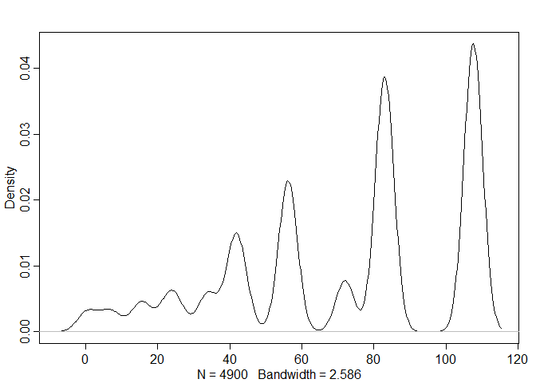

07\_06\_2020\_HW
================
John D.
7/06/2020

``` r
library(rethinking)
```

    ## Loading required package: rstan

    ## Warning: package 'rstan' was built under R version 3.6.3

    ## Loading required package: StanHeaders

    ## Loading required package: ggplot2

    ## Warning: package 'ggplot2' was built under R version 3.6.3

    ## rstan (Version 2.19.3, GitRev: 2e1f913d3ca3)

    ## For execution on a local, multicore CPU with excess RAM we recommend calling
    ## options(mc.cores = parallel::detectCores()).
    ## To avoid recompilation of unchanged Stan programs, we recommend calling
    ## rstan_options(auto_write = TRUE)

    ## For improved execution time, we recommend calling
    ## Sys.setenv(LOCAL_CPPFLAGS = '-march=corei7 -mtune=corei7')
    ## although this causes Stan to throw an error on a few processors.

    ## Loading required package: parallel

    ## Loading required package: dagitty

    ## rethinking (Version 1.93)

    ## 
    ## Attaching package: 'rethinking'

    ## The following object is masked from 'package:stats':
    ## 
    ##     rstudent

``` r
library(tidyverse)
```

    ## -- Attaching packages -------------------------------------------------------------------------------------------------------- tidyverse 1.3.0 --

    ## v tibble  3.0.1     v dplyr   0.8.5
    ## v tidyr   1.0.2     v stringr 1.4.0
    ## v readr   1.3.1     v forcats 0.5.0
    ## v purrr   0.3.4

    ## Warning: package 'tibble' was built under R version 3.6.3

    ## Warning: package 'tidyr' was built under R version 3.6.3

    ## Warning: package 'purrr' was built under R version 3.6.3

    ## Warning: package 'dplyr' was built under R version 3.6.3

    ## Warning: package 'forcats' was built under R version 3.6.3

    ## -- Conflicts ----------------------------------------------------------------------------------------------------------- tidyverse_conflicts() --
    ## x tidyr::extract() masks rstan::extract()
    ## x dplyr::filter()  masks stats::filter()
    ## x dplyr::lag()     masks stats::lag()
    ## x purrr::map()     masks rethinking::map()

``` r
library(ape)
```

    ## Warning: package 'ape' was built under R version 3.6.3

    ## 
    ## Attaching package: 'ape'

    ## The following object is masked from 'package:dagitty':
    ## 
    ##     edges

``` r
library(ade4)
```

    ## Warning: package 'ade4' was built under R version 3.6.3

## 1\. Load the data as follows:

``` r
data("carni70")
tre <- read.tree(text=carni70$tre)
d <- carni70$tab
```

``` r
head(d)
```

    ##                          size range
    ## Puma_concolor           37.01 36.00
    ## Herpailurus_yaguaroundi  2.59 24.00
    ## Leopardus_wiedii         3.20 21.75
    ## Leopardus_pardalis       7.90 24.50
    ## Oreailurus_jacobita      3.99  1.75
    ## Oncifelis_colocolo       2.99  6.25

## 2\. Note that the species name given in “rownames(d)” and in “tre$tip.label” do not match. Fix that (e.g. using str\_replace() )

``` r
rownames(d)
```

    ##  [1] "Puma_concolor"            "Herpailurus_yaguaroundi" 
    ##  [3] "Leopardus_wiedii"         "Leopardus_pardalis"      
    ##  [5] "Oreailurus_jacobita"      "Oncifelis_colocolo"      
    ##  [7] "Oncifelis_guigna"         "Oncifelis_geoffroyi"     
    ##  [9] "Leopardus_tigrinus"       "Lynx_rufus"              
    ## [11] "Lynx_canadensis"          "Panthera_onca"           
    ## [13] "Urocyon_cinereoargenteus" "Vulpes_velox"            
    ## [15] "Vulpes_vulpes"            "Speothos_venaticus"      
    ## [17] "Chrysocyon_brachyurus"    "Cerdocyon_thous"         
    ## [19] "Atelocynus_microtis"      "Pseudalopex_vetulus"     
    ## [21] "Pseudalopex_sechurae"     "Pseudalopex_gymnocercus" 
    ## [23] "Pseudalopex_griseus"      "Pseudalopex_culpaeus"    
    ## [25] "Canis_latrans"            "Canis_lupus"             
    ## [27] "Tremarctos_ornatus"       "Ursus_americanus"        
    ## [29] "Ursus_arctos"             "Potos_flavus"            
    ## [31] "Bassariscus_pauli"        "Bassariscus_lasius"      
    ## [33] "Bassariscus_gabbii"       "Bassariscus_beddardi"    
    ## [35] "Bassariscus_alleni"       "Bassariscus_sumichrasti" 
    ## [37] "Bassariscus_astutus"      "Nasuella_olivacea"       
    ## [39] "Nasua_nasua"              "Nasua_narica"            
    ## [41] "Procyon_lotor"            "Procyon_cancrivorus"     
    ## [43] "Spilogale_pygmaea"        "Spilogale_putorius"      
    ## [45] "Mephitis_mephitis"        "Mephitis_macroura"       
    ## [47] "Conepatus_semistriatus"   "Conepatus_humboldtti"    
    ## [49] "Conepatus_mesoleucus"     "Conepatus_leuconotus"    
    ## [51] "Conepatus_chinga"         "Pteronura_brasiliensis"  
    ## [53] "Lontra_canadensis"        "Lontra_longicaudis"      
    ## [55] "Lontra_provocax"          "Taxidea_taxus"           
    ## [57] "Lyncodon_patagonicus"     "Galictis_vittata"        
    ## [59] "Galictis_cuja"            "Eira_barbara"            
    ## [61] "Gulo_gulo"                "Martes_pennanti"         
    ## [63] "Martes_americana"         "Mustela_vison"           
    ## [65] "Mustela_felipei"          "Mustela_africana"        
    ## [67] "Mustela_nivalis"          "Mustela_frenata"         
    ## [69] "Mustela_erminea"          "Mustela_nigripes"

``` r
tre$tip.label
```

    ##  [1] "Puma.concolor"            "Herpailurus.yaguaroundi" 
    ##  [3] "Leopardus.wiedii"         "Leopardus.pardalis"      
    ##  [5] "Oreailurus.jacobita"      "Oncifelis.colocolo"      
    ##  [7] "Oncifelis.guigna"         "Oncifelis.geoffroyi"     
    ##  [9] "Leopardus.tigrinus"       "Lynx.rufus"              
    ## [11] "Lynx.canadensis"          "Panthera.onca"           
    ## [13] "Urocyon.cinereoargenteus" "Vulpes.velox"            
    ## [15] "Vulpes.vulpes"            "Speothos.venaticus"      
    ## [17] "Chrysocyon.brachyurus"    "Cerdocyon.thous"         
    ## [19] "Atelocynus.microtis"      "Pseudalopex.vetulus"     
    ## [21] "Pseudalopex.sechurae"     "Pseudalopex.gymnocercus" 
    ## [23] "Pseudalopex.griseus"      "Pseudalopex.culpaeus"    
    ## [25] "Canis.latrans"            "Canis.lupus"             
    ## [27] "Tremarctos.ornatus"       "Ursus.americanus"        
    ## [29] "Ursus.arctos"             "Potos.flavus"            
    ## [31] "Bassariscus.pauli"        "Bassariscus.lasius"      
    ## [33] "Bassariscus.gabbii"       "Bassariscus.beddardi"    
    ## [35] "Bassariscus.alleni"       "Bassariscus.sumichrasti" 
    ## [37] "Bassariscus.astutus"      "Nasuella.olivacea"       
    ## [39] "Nasua.nasua"              "Nasua.narica"            
    ## [41] "Procyon.lotor"            "Procyon.cancrivorus"     
    ## [43] "Spilogale.pygmaea"        "Spilogale.putorius"      
    ## [45] "Mephitis.mephitis"        "Mephitis.macroura"       
    ## [47] "Conepatus.semistriatus"   "Conepatus.humboldtti"    
    ## [49] "Conepatus.mesoleucus"     "Conepatus.leuconotus"    
    ## [51] "Conepatus.chinga"         "Pteronura.brasiliensis"  
    ## [53] "Lontra.canadensis"        "Lontra.longicaudis"      
    ## [55] "Lontra.provocax"          "Taxidea.taxus"           
    ## [57] "Lyncodon.patagonicus"     "Galictis.vittata"        
    ## [59] "Galictis.cuja"            "Eira.barbara"            
    ## [61] "Gulo.gulo"                "Martes.pennanti"         
    ## [63] "Martes.americana"         "Mustela.vison"           
    ## [65] "Mustela.felipei"          "Mustela.africana"        
    ## [67] "Mustela.nivalis"          "Mustela.frenata"         
    ## [69] "Mustela.erminea"          "Mustela.nigripes"

``` r
tre$tip.label <- str_replace(pattern = "\\.",
                             replacement =  "_",
                             string = tre$tip.label)
all.equal(rownames(d), tre$tip.label)
```

    ## [1] TRUE

## 3\. Should either range or size be transformed?

``` r
d
```

    ##                            size range
    ## Puma_concolor             37.01 36.00
    ## Herpailurus_yaguaroundi    2.59 24.00
    ## Leopardus_wiedii           3.20 21.75
    ## Leopardus_pardalis         7.90 24.50
    ## Oreailurus_jacobita        3.99  1.75
    ## Oncifelis_colocolo         2.99  6.25
    ## Oncifelis_guigna           2.23  1.25
    ## Oncifelis_geoffroyi        3.80  4.75
    ## Leopardus_tigrinus         2.19 20.25
    ## Lynx_rufus                11.20 13.50
    ## Lynx_canadensis           10.10 15.50
    ## Panthera_onca             90.03 25.25
    ## Urocyon_cinereoargenteus   3.69 14.25
    ## Vulpes_velox               3.00  4.00
    ## Vulpes_vulpes              5.60 27.00
    ## Speothos_venaticus         6.00 16.50
    ## Chrysocyon_brachyurus     23.74  5.50
    ## Cerdocyon_thous            5.80 15.50
    ## Atelocynus_microtis        7.00  6.00
    ## Pseudalopex_vetulus        2.75  2.25
    ## Pseudalopex_sechurae       2.19  0.25
    ## Pseudalopex_gymnocercus    4.75  1.00
    ## Pseudalopex_griseus        3.90  3.75
    ## Pseudalopex_culpaeus       7.39  2.00
    ## Canis_latrans             12.75 27.00
    ## Canis_lupus               43.25 27.70
    ## Tremarctos_ornatus       199.98  1.50
    ## Ursus_americanus          77.50 17.75
    ## Ursus_arctos             266.50 16.75
    ## Potos_flavus               2.99 14.50
    ## Bassariscus_pauli          1.58  0.12
    ## Bassariscus_lasius         1.58  0.12
    ## Bassariscus_gabbii         1.25  0.75
    ## Bassariscus_beddardi       1.25  1.00
    ## Bassariscus_alleni         1.25  5.75
    ## Bassariscus_sumichrasti    1.05  1.25
    ## Bassariscus_astutus        0.92  6.00
    ## Nasuella_olivacea          1.38  0.50
    ## Nasua_nasua                4.05 19.75
    ## Nasua_narica               8.81  4.50
    ## Procyon_lotor              6.30 17.00
    ## Procyon_cancrivorus        8.80 21.00
    ## Spilogale_pygmaea          0.57  0.25
    ## Spilogale_putorius         0.57  6.50
    ## Mephitis_mephitis          2.30 19.75
    ## Mephitis_macroura          0.96  3.50
    ## Conepatus_semistriatus     3.99  4.50
    ## Conepatus_humboldtti       0.54  1.25
    ## Conepatus_mesoleucus       2.80  3.00
    ## Conepatus_leuconotus       1.80  0.50
    ## Conepatus_chinga           1.85  3.50
    ## Pteronura_brasiliensis    26.50 14.50
    ## Lontra_canadensis          9.35 17.00
    ## Lontra_longicaudis         5.80 18.75
    ## Lontra_provocax            4.21  1.75
    ## Taxidea_taxus              7.65 12.25
    ## Lyncodon_patagonicus       1.05  0.75
    ## Galictis_vittata           3.20 17.75
    ## Galictis_cuja              1.60  5.50
    ## Eira_barbara               3.90 20.00
    ## Gulo_gulo                 20.75 15.00
    ## Martes_pennanti            3.37  5.50
    ## Martes_americana           0.63 16.75
    ## Mustela_vison              1.07 21.50
    ## Mustela_felipei            0.38  0.25
    ## Mustela_africana           0.22  5.25
    ## Mustela_nivalis            0.04 15.75
    ## Mustela_frenata            0.21 20.00
    ## Mustela_erminea            0.09 20.25
    ## Mustela_nigripes           0.51  3.50

``` r
summary(d)
```

    ##       size             range       
    ##  Min.   :  0.040   Min.   : 0.120  
    ##  1st Qu.:  1.282   1st Qu.: 2.062  
    ##  Median :  3.200   Median : 6.125  
    ##  Mean   : 14.288   Mean   :10.721  
    ##  3rd Qu.:  7.293   3rd Qu.:17.750  
    ##  Max.   :266.500   Max.   :36.000

``` r
# size in kg and range in km
```

Size definitely looks like it should be transformed given the large
range and relatively small median size. I am going to transform both for
now though

``` r
dat_list <- list(
  N_spp = nrow(d),
  S = standardize(log(d$size)),
  R = standardize(log(d$range)),
  Imat = diag(nrow(d))
)
```

## 4\. Does size predict range? Evaluate this question without and with accounting for phylogenetic relationships.

### No phylogenic data

``` r
no_phylo <- ulam(
  alist(
    R ~ multi_normal(mu , SIGMA),
    mu <- a + bS * S,
    matrix[N_spp, N_spp]:SIGMA <- Imat * sigma_sq,
    a ~ normal(0 , 1),
    bS ~ normal(0 , 0.5),
    sigma_sq ~ exponential(1)
  ),
  data = dat_list,
  chains = 4,
  cores = 4
)
precis(no_phylo)
```

    ##                  mean        sd       5.5%     94.5%    n_eff      Rhat
    ## a        0.0002686478 0.1174018 -0.1772986 0.1817307 1737.419 0.9990426
    ## bS       0.2873558825 0.1157883  0.1099687 0.4789366 1853.613 0.9986588
    ## sigma_sq 0.9470739513 0.1636769  0.7154109 1.2472341 2118.124 0.9990624

### With phylo

``` r
spp_obs <- rownames(d)
Brown <- corBrownian(phy = tre)
V <- vcv(Brown)
dat_list$V <- V[spp_obs, spp_obs]
dat_list$R <- dat_list$V / max(V)
Dmat <- cophenetic(tre)
dat_list$Dmat <- Dmat[spp_obs , spp_obs] / max(Dmat)
```

``` r
# Brownian

phylo_Brown <- ulam(
  alist(
    R ~ multi_normal(mu, SIGMA),
    mu <- a + bS*S,
    matrix[N_spp,N_spp]: SIGMA <- R * sigma_sq,
    a ~ normal(0 , 1),
    c(bS) ~ normal(0 , 0.5),
    sigma_sq ~ exponential(1)
  ),
  data = dat_list ,
  chains = 4 ,
  cores = 4
)

precis(phylo_Brown)
```

    ##                  mean           sd         5.5%        94.5%     n_eff     Rhat
    ## a         0.273498404 0.0062539335  0.263582407  0.283556056  989.9884 1.000496
    ## bS       -0.002326906 0.0007866356 -0.003549504 -0.001043721 2001.5569 1.001106
    ## sigma_sq  0.010384530 0.0002169901  0.010038022  0.010732020  684.0952 1.003813

``` r
# OU

phylo_OU <- ulam(
  alist(
    R ~ multi_normal(mu, SIGMA),
    mu <- a + bS*S,
    matrix[N_spp,N_spp]: SIGMA <- cov_GPL1(Dmat , etasq , rhosq , 0.01),
    a ~ normal(0, 1),
    bS ~ normal(0, 0.5),
    etasq ~ half_normal(1, 0.25),
    rhosq ~ half_normal(3, 0.25)
  ),
  data = dat_list,
  chains = 4,
  cores = 4
)

precis(phylo_OU)
```

    ##               mean          sd        5.5%       94.5%     n_eff     Rhat
    ## a      0.282146778 0.041342356  0.21881966  0.34953462  848.0495 1.007663
    ## bS    -0.009722153 0.002530832 -0.01384925 -0.00564438 1883.3725 1.001664
    ## etasq  0.133982481 0.021934415  0.10298049  0.17120764  644.7030 1.000840
    ## rhosq  0.190008991 0.031915804  0.14302372  0.24340605  549.5800 1.000991

``` r
dens(Dmat)
```

<!-- -->

## 5\. Discuss your findings.

Looks like adding phylogenetic data increased the effect of size on
range in the OU model. I am currently concerned with how Dmat looks
though. Something isn’t right and I should probably fix it.
