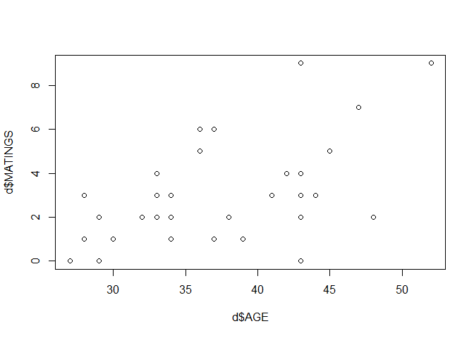

07\_13\_2020\_HW
================
John D.
7/13/2020

``` r
library(rethinking)
```

    ## Loading required package: rstan

    ## Warning: package 'rstan' was built under R version 3.6.3

    ## Loading required package: StanHeaders

    ## Loading required package: ggplot2

    ## Warning: package 'ggplot2' was built under R version 3.6.3

    ## rstan (Version 2.19.3, GitRev: 2e1f913d3ca3)

    ## For execution on a local, multicore CPU with excess RAM we recommend calling
    ## options(mc.cores = parallel::detectCores()).
    ## To avoid recompilation of unchanged Stan programs, we recommend calling
    ## rstan_options(auto_write = TRUE)

    ## For improved execution time, we recommend calling
    ## Sys.setenv(LOCAL_CPPFLAGS = '-march=corei7 -mtune=corei7')
    ## although this causes Stan to throw an error on a few processors.

    ## Loading required package: parallel

    ## Loading required package: dagitty

    ## rethinking (Version 1.93)

    ## 
    ## Attaching package: 'rethinking'

    ## The following object is masked from 'package:stats':
    ## 
    ##     rstudent

``` r
library(tidyverse)
```

    ## -- Attaching packages ------------------------- tidyverse 1.3.0 --

    ## v tibble  3.0.1     v dplyr   0.8.5
    ## v tidyr   1.0.2     v stringr 1.4.0
    ## v readr   1.3.1     v forcats 0.5.0
    ## v purrr   0.3.4

    ## Warning: package 'tibble' was built under R version 3.6.3

    ## Warning: package 'tidyr' was built under R version 3.6.3

    ## Warning: package 'purrr' was built under R version 3.6.3

    ## Warning: package 'dplyr' was built under R version 3.6.3

    ## Warning: package 'forcats' was built under R version 3.6.3

    ## -- Conflicts ---------------------------- tidyverse_conflicts() --
    ## x tidyr::extract() masks rstan::extract()
    ## x dplyr::filter()  masks stats::filter()
    ## x dplyr::lag()     masks stats::lag()
    ## x purrr::map()     masks rethinking::map()

## 15E1 Rewrite the Oceanic tools model (from Chapter 11) below so that it assumes measured error on the log population sizes of each society.

  
 \\\\
log\\ µ_i = α + β\\ log\\ P_i \\\\
α ∼ Normal(0, 10) \\\\
β ∼ Normal(0, 1)
")  
  
 \\\\
log\\ µ_i = α + β\\ log\\ P_{true_i} \\\\
P_{obs_i} \\sim Normal(P_{true_i}, PSE_i) \\\\
P_{true_i} \\sim Normal(0,10) \\\\
α ∼ Normal(0, 10) \\\\
β ∼ Normal(0, 1)
")  

## 15E2 Rewrite the same model so that it allows imputation of missing values for log population. There aren’t any missing values in the variable, but you can still write down a model formula that would imply imputation, if any values were missing

  
 \\\\
log\\ µ_i = α + β\\ log\\ P_{imp_i} \\\\
P_{imp_i} \\sim Normal(\\nu, \\sigma_p) \\\\
c(α, \\nu) ∼ Normal(0, 10) \\\\
β ∼ Normal(0, 1) \\\\
\\sigma_p \\sim exp(1)
")  

## 15M3 Repeat the divorce data measurement error models, but this time double the standard errors. Can you explain how doubling the standard errors impacts inference?

``` r
data(WaffleDivorce)
d <- WaffleDivorce
```

### First model

``` r
#original
dlist <- list(
  D_obs = standardize(d$Divorce),
  D_sd = d$Divorce.SE / sd(d$Divorce),
  M = standardize(d$Marriage),
  A = standardize(d$MedianAgeMarriage),
  N = nrow(d)
)

m15.1 <- ulam(
  alist(
    D_obs ~ dnorm(D_true , D_sd),
    vector[N]:D_true ~ dnorm(mu , sigma),
    mu <- a + bA * A + bM * M,
    a ~ dnorm(0, 0.2),
    bA ~ dnorm(0, 0.5),
    bM ~ dnorm(0, 0.5),
    sigma ~ dexp(1)
  ) ,
  data = dlist ,
  chains = 4 ,
  cores = 4
)
```

``` r
#double
dublist <- list(
  D_obs = standardize(d$Divorce),
  D_sd = (2*d$Divorce.SE) / sd(d$Divorce),
  M = standardize(d$Marriage),
  A = standardize(d$MedianAgeMarriage),
  N = nrow(d)
)

m15.1dub <- ulam(
  alist(
    D_obs ~ dnorm(D_true , D_sd),
    vector[N]:D_true ~ dnorm(mu , sigma),
    mu <- a + bA * A + bM * M,
    a ~ dnorm(0, 0.2),
    bA ~ dnorm(0, 0.5),
    bM ~ dnorm(0, 0.5),
    sigma ~ dexp(1)
  ) ,
  data = dublist ,
  chains = 4 ,
  cores = 4
)
```

    ## recompiling to avoid crashing R session

    ## Warning: There were 26 divergent transitions after warmup. Increasing adapt_delta above 0.95 may help. See
    ## http://mc-stan.org/misc/warnings.html#divergent-transitions-after-warmup

    ## Warning: There were 4 chains where the estimated Bayesian Fraction of Missing Information was low. See
    ## http://mc-stan.org/misc/warnings.html#bfmi-low

    ## Warning: Examine the pairs() plot to diagnose sampling problems

    ## Warning: The largest R-hat is 1.12, indicating chains have not mixed.
    ## Running the chains for more iterations may help. See
    ## http://mc-stan.org/misc/warnings.html#r-hat

    ## Warning: Bulk Effective Samples Size (ESS) is too low, indicating posterior means and medians may be unreliable.
    ## Running the chains for more iterations may help. See
    ## http://mc-stan.org/misc/warnings.html#bulk-ess

    ## Warning: Tail Effective Samples Size (ESS) is too low, indicating posterior variances and tail quantiles may be unreliable.
    ## Running the chains for more iterations may help. See
    ## http://mc-stan.org/misc/warnings.html#tail-ess

``` r
precis( m15.1)
```

    ## 50 vector or matrix parameters hidden. Use depth=2 to show them.

    ##              mean         sd       5.5%       94.5%     n_eff      Rhat
    ## a     -0.05414561 0.09341621 -0.1982874  0.09681026 1530.6353 1.0015779
    ## bA    -0.60610065 0.16084208 -0.8564955 -0.35444845 1194.3121 1.0000430
    ## bM     0.06413473 0.16806897 -0.2036244  0.33204255 1080.0351 0.9992523
    ## sigma  0.58379054 0.10601832  0.4304365  0.75558272  649.8589 1.0047111

``` r
precis( m15.1dub)
```

    ## 50 vector or matrix parameters hidden. Use depth=2 to show them.

    ##             mean         sd        5.5%       94.5%     n_eff     Rhat
    ## a     -0.1368380 0.10069244 -0.29127752  0.02191259  45.34257 1.094989
    ## bA    -0.6402096 0.17083866 -0.93224336 -0.37823180 130.36413 1.026770
    ## bM     0.1734701 0.19150520 -0.14148955  0.45744529  80.57682 1.072380
    ## sigma  0.1482613 0.08637865  0.05757912  0.32058693  52.30810 1.106567

### Second model

``` r
# original
dlist <- list(
  D_obs = standardize(d$Divorce),
  D_sd = d$Divorce.SE / sd(d$Divorce),
  M_obs = standardize(d$Marriage),
  M_sd = d$Marriage.SE / sd(d$Marriage),
  A = standardize(d$MedianAgeMarriage),
  N = nrow(d)
)

m15.2 <- ulam(
  alist(
    D_obs ~ dnorm(D_est , D_sd),
    vector[N]:D_est ~ dnorm(mu , sigma),
    mu <- a + bA * A + bM * M_est[i],
    M_obs ~ dnorm(M_est , M_sd),
    vector[N]:M_est ~ dnorm(0 , 1),
    a ~ dnorm(0, 0.2),
    bA ~ dnorm(0, 0.5),
    bM ~ dnorm(0, 0.5),
    sigma ~ dexp(1)
  ) ,
  data = dlist ,
  chains = 4 ,
  cores = 4
)
```

``` r
# Double
dublist <- list(
  D_obs = standardize(d$Divorce),
  D_sd = (2*d$Divorce.SE) / sd(d$Divorce),
  M_obs = standardize(d$Marriage),
  M_sd = (2*d$Marriage.SE )/ sd(d$Marriage),
  A = standardize(d$MedianAgeMarriage),
  N = nrow(d)
)

m15.2dub <- ulam(
  alist(
    D_obs ~ dnorm(D_est , D_sd),
    vector[N]:D_est ~ dnorm(mu , sigma),
    mu <- a + bA * A + bM * M_est[i],
    M_obs ~ dnorm(M_est , M_sd),
    vector[N]:M_est ~ dnorm(0 , 1),
    a ~ dnorm(0, 0.2),
    bA ~ dnorm(0, 0.5),
    bM ~ dnorm(0, 0.5),
    sigma ~ dexp(1)
  ) ,
  data = dublist ,
  chains = 4 ,
  cores = 4
)
```

    ## recompiling to avoid crashing R session

    ## Warning: There were 101 divergent transitions after warmup. Increasing adapt_delta above 0.95 may help. See
    ## http://mc-stan.org/misc/warnings.html#divergent-transitions-after-warmup

    ## Warning: There were 4 chains where the estimated Bayesian Fraction of Missing Information was low. See
    ## http://mc-stan.org/misc/warnings.html#bfmi-low

    ## Warning: Examine the pairs() plot to diagnose sampling problems

    ## Warning: The largest R-hat is 1.3, indicating chains have not mixed.
    ## Running the chains for more iterations may help. See
    ## http://mc-stan.org/misc/warnings.html#r-hat

    ## Warning: Bulk Effective Samples Size (ESS) is too low, indicating posterior means and medians may be unreliable.
    ## Running the chains for more iterations may help. See
    ## http://mc-stan.org/misc/warnings.html#bulk-ess

    ## Warning: Tail Effective Samples Size (ESS) is too low, indicating posterior variances and tail quantiles may be unreliable.
    ## Running the chains for more iterations may help. See
    ## http://mc-stan.org/misc/warnings.html#tail-ess

``` r
precis(m15.2)
```

    ## 100 vector or matrix parameters hidden. Use depth=2 to show them.

    ##              mean        sd       5.5%      94.5%     n_eff      Rhat
    ## a     -0.03832675 0.0952741 -0.1925755  0.1166497 1845.9608 0.9995032
    ## bA    -0.54156674 0.1607186 -0.7938858 -0.2830904  793.8155 1.0016528
    ## bM     0.20689550 0.2032572 -0.1151126  0.5481407  486.2493 1.0037957
    ## sigma  0.55532084 0.1078815  0.3934524  0.7340629  589.6221 1.0037562

``` r
precis(m15.2dub)
```

    ## 100 vector or matrix parameters hidden. Use depth=2 to show them.

    ##              mean        sd        5.5%       94.5%     n_eff     Rhat
    ## a     -0.08537699 0.1059862 -0.26063617  0.08375975 438.88656 1.005074
    ## bA    -0.60095786 0.1600444 -0.84795526 -0.35513597 105.40131 1.048212
    ## bM     0.32386652 0.1929879  0.02508164  0.62955556 157.93232 1.034843
    ## sigma  0.17693278 0.1118843  0.03428634  0.39547585  13.53534 1.280275

In the first model, doubling the SE increased the effect of bM while
also decreasing sigma. In the second model it also increased the effect
of bM and decreased sigma.

## 15H1 The data in data(elephants) are counts of matings observed for bull elephants of differing ages. There is a strong positive relationship between age and matings. However, age is not always assessed accurately. First, fit a Poisson model predicting MATINGS with AGE as a predictor. Second, assume that the observed AGE values are uncertain and have a standard error of ±5 years. Re-estimate the relationship between MATINGS and AGE, incorporating this measurement error. Compare the inferences of the two models.

``` r
data(elephants)
d <- elephants
summary(d)
```

    ##       AGE           MATINGS     
    ##  Min.   :27.00   Min.   :0.000  
    ##  1st Qu.:29.00   1st Qu.:1.000  
    ##  Median :34.00   Median :2.000  
    ##  Mean   :35.85   Mean   :2.683  
    ##  3rd Qu.:42.00   3rd Qu.:3.000  
    ##  Max.   :52.00   Max.   :9.000

``` r
plot(d$AGE,d$MATINGS)
```

<!-- -->

``` r
cor(d$AGE,d$MATINGS)
```

    ## [1] 0.5856932

``` r
dat_list <- list(
  Age = standardize(d$AGE),
  Matings = d$MATINGS
)

# First
m15H1.1 <- ulam(
  alist(
    Matings ~ dpois(lambda),
    lambda <- alpha + bA * Age,
    alpha ~ dnorm(0,1),
    bA ~ dnorm(0,1)
  ),
  data = dat_list,
  chains = 4,
  cores = 4
)
```

    ## Warning: There were 1 divergent transitions after warmup. Increasing adapt_delta above 0.95 may help. See
    ## http://mc-stan.org/misc/warnings.html#divergent-transitions-after-warmup

    ## Warning: Examine the pairs() plot to diagnose sampling problems

``` r
# Second

dat_list <- list(
  Age_obs = standardize(d$AGE),
  Matings = d$MATINGS,
  N = nrow(d)
)

m15H1.2 <- ulam(
  alist(
    Matings ~ dpois(lambda),
    lambda <- alpha + bA * Age_true[i],
    Age_obs ~ dnorm(Age_true, 5),
    vector[N]:Age_true ~ dnorm(0, 1),
    alpha ~ dnorm(0,1),
    bA ~ dnorm(0,1)
  ),
  data = dat_list,
  chains = 4,
  cores = 4
)
```

    ## Warning: There were 1687 divergent transitions after warmup. Increasing adapt_delta above 0.95 may help. See
    ## http://mc-stan.org/misc/warnings.html#divergent-transitions-after-warmup
    
    ## Warning: Examine the pairs() plot to diagnose sampling problems

    ## Warning: The largest R-hat is 1.33, indicating chains have not mixed.
    ## Running the chains for more iterations may help. See
    ## http://mc-stan.org/misc/warnings.html#r-hat

    ## Warning: Bulk Effective Samples Size (ESS) is too low, indicating posterior means and medians may be unreliable.
    ## Running the chains for more iterations may help. See
    ## http://mc-stan.org/misc/warnings.html#bulk-ess

    ## Warning: Tail Effective Samples Size (ESS) is too low, indicating posterior variances and tail quantiles may be unreliable.
    ## Running the chains for more iterations may help. See
    ## http://mc-stan.org/misc/warnings.html#tail-ess

``` r
precis(m15H1.1)
```

    ##           mean        sd      5.5%    94.5%    n_eff     Rhat
    ## alpha 2.547676 0.2189237 2.2104677 2.918071 943.5141 1.005816
    ## bA    1.166585 0.2467177 0.7870341 1.561873 999.9050 1.002890

``` r
precis(m15H1.2)
```

    ## 41 vector or matrix parameters hidden. Use depth=2 to show them.

    ##            mean        sd      5.5%    94.5%      n_eff     Rhat
    ## alpha 2.5159755 0.2701609  2.090146 2.970678 109.082347 1.033238
    ## bA    0.3354682 0.9745203 -1.302288 1.397492   3.990139 1.553214

The effect of age is being washed away.

## 15H2 Repeat the model fitting problem above, now increasing the assumed standard error on AGE. How large does the standard error have to get before the posterior mean for the coefficient on AGE reaches zero?

``` r
m15H2 <- ulam(
  alist(
    Matings ~ dpois(lambda),
    lambda <- alpha + bA * Age_true[i],
    Age_obs ~ dnorm(Age_true, 15),
    vector[N]:Age_true ~ dnorm(0, 1),
    alpha ~ dnorm(0,1),
    bA ~ dnorm(0,1)
  ),
  data = dat_list,
  chains = 4,
  cores = 4,
  iter = 5000,
  control=list(adapt_delta=0.99)
)
```

    ## Warning: There were 9212 divergent transitions after warmup. Increasing adapt_delta above 0.99 may help. See
    ## http://mc-stan.org/misc/warnings.html#divergent-transitions-after-warmup

    ## Warning: There were 39 transitions after warmup that exceeded the maximum treedepth. Increase max_treedepth above 10. See
    ## http://mc-stan.org/misc/warnings.html#maximum-treedepth-exceeded

    ## Warning: Examine the pairs() plot to diagnose sampling problems

    ## Warning: The largest R-hat is 1.06, indicating chains have not mixed.
    ## Running the chains for more iterations may help. See
    ## http://mc-stan.org/misc/warnings.html#r-hat

    ## Warning: Bulk Effective Samples Size (ESS) is too low, indicating posterior means and medians may be unreliable.
    ## Running the chains for more iterations may help. See
    ## http://mc-stan.org/misc/warnings.html#bulk-ess

    ## Warning: Tail Effective Samples Size (ESS) is too low, indicating posterior variances and tail quantiles may be unreliable.
    ## Running the chains for more iterations may help. See
    ## http://mc-stan.org/misc/warnings.html#tail-ess

``` r
precis(m15H2)
```

    ## 41 vector or matrix parameters hidden. Use depth=2 to show them.

    ##             mean        sd      5.5%    94.5%     n_eff     Rhat
    ## alpha  2.4963743 0.2891448  2.052244 2.969639 266.88380 1.022788
    ## bA    -0.1246422 1.0443179 -1.451003 1.299390  56.42747 1.079993

15 seems too have centered it near zero.
