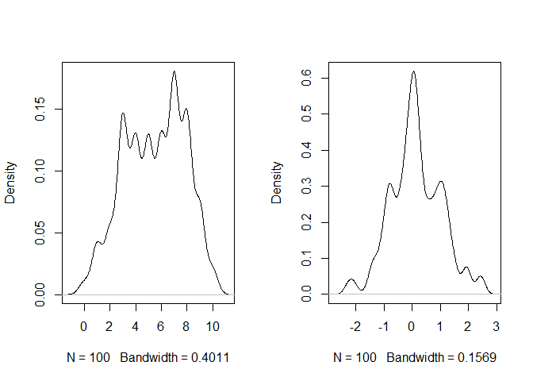

07\_13\_2020\_Notes
================
John D.
7/13/2020

``` r
library(rethinking)
```

    ## Loading required package: rstan

    ## Warning: package 'rstan' was built under R version 3.6.3

    ## Loading required package: StanHeaders

    ## Loading required package: ggplot2

    ## Warning: package 'ggplot2' was built under R version 3.6.3

    ## rstan (Version 2.19.3, GitRev: 2e1f913d3ca3)

    ## For execution on a local, multicore CPU with excess RAM we recommend calling
    ## options(mc.cores = parallel::detectCores()).
    ## To avoid recompilation of unchanged Stan programs, we recommend calling
    ## rstan_options(auto_write = TRUE)

    ## For improved execution time, we recommend calling
    ## Sys.setenv(LOCAL_CPPFLAGS = '-march=corei7 -mtune=corei7')
    ## although this causes Stan to throw an error on a few processors.

    ## Loading required package: parallel

    ## Loading required package: dagitty

    ## rethinking (Version 1.93)

    ## 
    ## Attaching package: 'rethinking'

    ## The following object is masked from 'package:stats':
    ## 
    ##     rstudent

``` r
library(tidyverse)
```

    ## -- Attaching packages ------------------------- tidyverse 1.3.0 --

    ## v tibble  3.0.1     v dplyr   0.8.5
    ## v tidyr   1.0.2     v stringr 1.4.0
    ## v readr   1.3.1     v forcats 0.5.0
    ## v purrr   0.3.4

    ## Warning: package 'tibble' was built under R version 3.6.3

    ## Warning: package 'tidyr' was built under R version 3.6.3

    ## Warning: package 'purrr' was built under R version 3.6.3

    ## Warning: package 'dplyr' was built under R version 3.6.3

    ## Warning: package 'forcats' was built under R version 3.6.3

    ## -- Conflicts ---------------------------- tidyverse_conflicts() --
    ## x tidyr::extract() masks rstan::extract()
    ## x dplyr::filter()  masks stats::filter()
    ## x dplyr::lag()     masks stats::lag()
    ## x purrr::map()     masks rethinking::map()

# 15 Missing Data and Other Opportunities

``` r
# simulate a pancake and return randomly ordered sides
sim_pancake <- function() {
pancake <- sample(1:3,1)
sides <- matrix(c(1,1,1,0,0,0),2,3)[,pancake]
sample(sides)
}
# sim 10,000 pancakes
pancakes <- replicate( 1e4 , sim_pancake() )
up <- pancakes[1,]
down <- pancakes[2,]
# compute proportion 1/1 (BB) out of all 1/1 and 1/0
num_11_10 <- sum( up==1 )
num_11 <- sum( up==1 & down==1 )
num_11/num_11_10
```

    ## [1] 0.6621059

## 15.1. Measurement error

``` r
data(WaffleDivorce)
d <- WaffleDivorce
# points
plot(
  d$Divorce ~ d$MedianAgeMarriage ,
  ylim = c(4, 15) ,
  xlab = "Median age marriage" ,
  ylab = "Divorce rate"
)
# standard errors
for (i in 1:nrow(d)) {
  ci <- d$Divorce[i] + c(-1, 1) * d$Divorce.SE[i]
  x <- d$MedianAgeMarriage[i]
  lines(c(x, x) , ci)
}
```

<!-- -->

### 15.1.1. Error on the outcome

``` r
dlist <- list(
  D_obs = standardize(d$Divorce),
  D_sd = d$Divorce.SE / sd(d$Divorce),
  M = standardize(d$Marriage),
  A = standardize(d$MedianAgeMarriage),
  N = nrow(d)
)
m15.1 <- ulam(
  alist(
    D_obs ~ dnorm(D_true , D_sd),
    vector[N]:D_true ~ dnorm(mu , sigma),
    mu <- a + bA * A + bM * M,
    a ~ dnorm(0, 0.2),
    bA ~ dnorm(0, 0.5),
    bM ~ dnorm(0, 0.5),
    sigma ~ dexp(1)
  ) ,
  data = dlist ,
  chains = 4 ,
  cores = 4
)
```

``` r
precis( m15.1 , depth=2 )
```

    ##                    mean         sd        5.5%        94.5%     n_eff      Rhat
    ## D_true[1]   1.171210162 0.36624224  0.60411086  1.773167279 2348.2699 0.9994648
    ## D_true[2]   0.657244730 0.54826529 -0.16321220  1.563432385 2078.4799 0.9990757
    ## D_true[3]   0.429460915 0.34561363 -0.11662601  0.992636519 2371.4469 0.9985819
    ## D_true[4]   1.409775342 0.46530464  0.64963906  2.190209320 1944.1100 0.9997669
    ## D_true[5]  -0.900210617 0.12656309 -1.10543107 -0.692365913 2484.9631 1.0006510
    ## D_true[6]   0.662207790 0.39952770  0.01748739  1.297602774 2229.1438 1.0002022
    ## D_true[7]  -1.379532549 0.34412596 -1.94331616 -0.831937615 1772.4544 1.0006208
    ## D_true[8]  -0.349557536 0.48415619 -1.13657735  0.411975772 2244.6238 0.9982911
    ## D_true[9]  -1.883802546 0.58496483 -2.82198276 -0.970530991 1291.6530 1.0007879
    ## D_true[10] -0.621787617 0.15605755 -0.87349428 -0.378508093 2790.9525 1.0004565
    ## D_true[11]  0.763554417 0.27699230  0.31638828  1.210634697 2226.4080 1.0000371
    ## D_true[12] -0.546975201 0.48601393 -1.31585724  0.247368037 1668.6117 1.0008334
    ## D_true[13]  0.168641600 0.49066893 -0.62439821  0.947737299 1185.0630 0.9997603
    ## D_true[14] -0.867687694 0.22482246 -1.21836392 -0.508231065 2769.5230 0.9988868
    ## D_true[15]  0.560816149 0.29530880  0.09046981  1.022780712 2119.1111 0.9991305
    ## D_true[16]  0.275371015 0.38382083 -0.32268641  0.918516884 2977.7346 0.9995651
    ## D_true[17]  0.484776070 0.42896787 -0.19543963  1.179525250 2594.0577 0.9991040
    ## D_true[18]  1.254231620 0.34195200  0.72746122  1.787821412 2212.7143 0.9991440
    ## D_true[19]  0.417177544 0.36690758 -0.15075090  1.009127122 2772.3780 0.9995223
    ## D_true[20]  0.404094188 0.54419411 -0.44295727  1.289020302 1761.4312 1.0006654
    ## D_true[21] -0.547722038 0.31884101 -1.06638733 -0.036669990 2793.5157 1.0003700
    ## D_true[22] -1.094707523 0.26311707 -1.51293787 -0.670690666 2391.8718 0.9993246
    ## D_true[23] -0.273504142 0.25070175 -0.67186810  0.124944378 2402.0531 0.9992328
    ## D_true[24] -0.998383090 0.29977319 -1.48937621 -0.522958905 2591.0404 1.0009610
    ## D_true[25]  0.421864834 0.40451026 -0.21856059  1.082418540 2538.2812 1.0023306
    ## D_true[26] -0.036861481 0.31846956 -0.54215343  0.467643524 2915.7653 0.9993055
    ## D_true[27] -0.007342486 0.50193884 -0.80456338  0.762772198 2200.9366 0.9990233
    ## D_true[28] -0.150844535 0.38958214 -0.77243748  0.455077545 2449.7779 0.9986435
    ## D_true[29] -0.271380102 0.49185265 -1.02900558  0.528686369 2027.9843 1.0008372
    ## D_true[30] -1.800037871 0.22981202 -2.16668815 -1.439519099 2935.0941 1.0012946
    ## D_true[31]  0.168801757 0.43291655 -0.51489425  0.854858324 2457.2267 0.9993259
    ## D_true[32] -1.658950028 0.15937741 -1.90928378 -1.401654836 2506.5652 0.9996121
    ## D_true[33]  0.123392700 0.24117504 -0.26046085  0.515050305 2577.2998 1.0005988
    ## D_true[34] -0.071544309 0.51936236 -0.92333306  0.733981174 1454.8294 0.9991672
    ## D_true[35] -0.121350248 0.22015373 -0.47259563  0.224173795 3067.9949 0.9999176
    ## D_true[36]  1.291661686 0.41665366  0.62657899  1.964587121 1763.9607 0.9984444
    ## D_true[37]  0.222003024 0.34449978 -0.30976109  0.788647508 2335.9255 0.9998414
    ## D_true[38] -1.021648224 0.22433106 -1.37719165 -0.662124861 2314.2270 1.0001361
    ## D_true[39] -0.923526795 0.54009119 -1.73380963 -0.008696277 2137.1653 0.9992727
    ## D_true[40] -0.670194801 0.33471158 -1.20681705 -0.137856587 2419.9080 1.0005678
    ## D_true[41]  0.221218469 0.56107661 -0.66917251  1.109729543 2509.6091 0.9989619
    ## D_true[42]  0.741783352 0.33082089  0.21208679  1.279864684 1963.9520 1.0013610
    ## D_true[43]  0.195288597 0.18082762 -0.09220349  0.490374278 2587.0186 0.9991764
    ## D_true[44]  0.800780306 0.43886479  0.08682708  1.513717624 1585.3247 0.9985828
    ## D_true[45] -0.411324230 0.51046322 -1.22265358  0.395227500 2408.6713 1.0007827
    ## D_true[46] -0.397509509 0.24876146 -0.79157542 -0.010570245 2976.3747 0.9994163
    ## D_true[47]  0.128316947 0.30749413 -0.37236840  0.611001651 2725.7706 0.9995128
    ## D_true[48]  0.558453702 0.45226337 -0.15101419  1.310909674 1747.5460 0.9999187
    ## D_true[49] -0.636611227 0.27634490 -1.08022299 -0.192890011 2677.1530 0.9997100
    ## D_true[50]  0.847977599 0.59667063 -0.08168539  1.780762952 1585.4844 1.0006564
    ## a          -0.056589432 0.09361646 -0.20083201  0.093230898 1492.4915 0.9998449
    ## bA         -0.611752266 0.15726419 -0.86135674 -0.366782187  944.4910 1.0024575
    ## bM          0.054360473 0.16434784 -0.21059900  0.315885568  914.6228 1.0026389
    ## sigma       0.585469726 0.10430008  0.42897412  0.759929096  670.6235 1.0035235

### 15.1.2. Error on both outcome and predictor

``` r
dlist <- list(
  D_obs = standardize(d$Divorce),
  D_sd = d$Divorce.SE / sd(d$Divorce),
  M_obs = standardize(d$Marriage),
  M_sd = d$Marriage.SE / sd(d$Marriage),
  A = standardize(d$MedianAgeMarriage),
  N = nrow(d)
)

m15.2 <- ulam(
  alist(
    D_obs ~ dnorm(D_est , D_sd),
    vector[N]:D_est ~ dnorm(mu , sigma),
    mu <- a + bA * A + bM * M_est[i],
    M_obs ~ dnorm(M_est , M_sd),
    vector[N]:M_est ~ dnorm(0 , 1),
    a ~ dnorm(0, 0.2),
    bA ~ dnorm(0, 0.5),
    bM ~ dnorm(0, 0.5),
    sigma ~ dexp(1)
  ) ,
  data = dlist ,
  chains = 4 ,
  cores = 4
)
```

``` r
precis(m15.2,depth = 2)
```

    ##                   mean         sd        5.5%        94.5%     n_eff      Rhat
    ## D_est[1]   1.142181784 0.36376476  0.56954178  1.734773874 1986.9480 1.0007999
    ## D_est[2]   0.763819447 0.55483817 -0.10586503  1.634218101 1990.9725 0.9988948
    ## D_est[3]   0.427312952 0.33864701 -0.11379269  1.000418732 2134.7159 1.0007794
    ## D_est[4]   1.453282633 0.46467119  0.75257861  2.205061873 2106.3888 0.9993603
    ## D_est[5]  -0.898163090 0.13358931 -1.11463100 -0.683308736 2725.6375 0.9986085
    ## D_est[6]   0.694296890 0.38391891  0.07628981  1.307909730 2232.8703 0.9989276
    ## D_est[7]  -1.361446286 0.34795547 -1.92105251 -0.835502585 1989.1016 0.9987642
    ## D_est[8]  -0.274913020 0.46980984 -1.02696058  0.489049454 2021.6803 0.9993035
    ## D_est[9]  -1.746305755 0.60996286 -2.71017741 -0.775471207 1516.7763 1.0008782
    ## D_est[10] -0.623392679 0.17049742 -0.89540615 -0.348330269 2868.1228 0.9988750
    ## D_est[11]  0.783537528 0.27757402  0.35991419  1.247207617 1772.1806 1.0003948
    ## D_est[12] -0.428351107 0.47756750 -1.18925512  0.331568685 1720.4180 0.9993529
    ## D_est[13]  0.207192181 0.46588021 -0.55831284  0.935336226 1152.4580 1.0046338
    ## D_est[14] -0.860556046 0.22649618 -1.21605568 -0.504582738 2572.3313 0.9995151
    ## D_est[15]  0.537418564 0.30231808  0.05327435  1.027475705 2262.1253 1.0019139
    ## D_est[16]  0.287042402 0.37483091 -0.31372514  0.881124741 2593.3074 0.9983171
    ## D_est[17]  0.498507338 0.43286663 -0.20737664  1.193314342 2137.3687 0.9991372
    ## D_est[18]  1.243138386 0.33680024  0.72055371  1.777909160 2206.5563 0.9996210
    ## D_est[19]  0.430024564 0.35582874 -0.15067563  0.993386404 2732.7727 0.9989169
    ## D_est[20]  0.250127307 0.53107666 -0.57879890  1.128362088 1356.3412 1.0054995
    ## D_est[21] -0.547891765 0.31536826 -1.07272809 -0.059341668 2562.4504 0.9990623
    ## D_est[22] -1.103838012 0.26245730 -1.51359299 -0.671992170 2189.2665 0.9998182
    ## D_est[23] -0.293682746 0.26104687 -0.70434244  0.119285129 2482.5433 0.9987289
    ## D_est[24] -1.026641058 0.28257060 -1.48868520 -0.573970060 2042.1595 1.0013268
    ## D_est[25]  0.398767286 0.40441855 -0.23584917  1.063108738 1988.8778 1.0001726
    ## D_est[26] -0.061040418 0.29994388 -0.53840571  0.414631771 2439.3822 1.0009392
    ## D_est[27] -0.043988497 0.50077683 -0.84018060  0.758294158 2790.3160 0.9991701
    ## D_est[28] -0.167078931 0.37484222 -0.76828636  0.422228614 2476.3314 0.9984223
    ## D_est[29] -0.293276575 0.48102079 -1.03774275  0.488253571 1820.4106 1.0011437
    ## D_est[30] -1.803715690 0.23952324 -2.19045548 -1.408306530 2439.3252 0.9989212
    ## D_est[31]  0.166299841 0.39890198 -0.43630517  0.783450440 2515.3656 1.0011662
    ## D_est[32] -1.653566226 0.17168605 -1.93026172 -1.376299115 2558.8583 0.9995760
    ## D_est[33]  0.115849573 0.24049443 -0.26783368  0.499458256 2162.9796 0.9999651
    ## D_est[34]  0.001036537 0.49294247 -0.77331080  0.762401693 1523.9759 1.0015151
    ## D_est[35] -0.145982541 0.23458931 -0.50923952  0.229066113 3240.4894 0.9984219
    ## D_est[36]  1.286091508 0.42827868  0.61689596  1.987637969 2296.8043 0.9988709
    ## D_est[37]  0.207275480 0.35594735 -0.34892159  0.763469599 2354.2509 1.0006758
    ## D_est[38] -1.044697050 0.22647558 -1.39778204 -0.696951387 2144.0600 1.0002370
    ## D_est[39] -0.914262628 0.54893721 -1.76863692  0.006960475 1977.2310 1.0010290
    ## D_est[40] -0.686631115 0.32521129 -1.19898610 -0.162523788 2210.8576 0.9985324
    ## D_est[41]  0.236731978 0.54961685 -0.64398033  1.125550669 2273.6797 0.9990942
    ## D_est[42]  0.702816725 0.33927098  0.18702332  1.263009485 2538.1392 0.9998813
    ## D_est[43]  0.197451869 0.18145808 -0.09565180  0.488956997 2810.9962 0.9989479
    ## D_est[44]  0.885822401 0.43322325  0.18028921  1.578068253 1422.0392 1.0014091
    ## D_est[45] -0.426946886 0.52774369 -1.24607065  0.425132075 2103.9429 0.9985642
    ## D_est[46] -0.375741012 0.25497288 -0.78849223  0.031957281 2717.3967 0.9994158
    ## D_est[47]  0.151806291 0.29905820 -0.34880496  0.623806704 2810.7755 0.9994300
    ## D_est[48]  0.582318209 0.45794303 -0.13326737  1.296530059 2396.4395 1.0008954
    ## D_est[49] -0.655757967 0.25880406 -1.05936615 -0.240619162 2804.3251 0.9997756
    ## D_est[50]  0.852426583 0.56611821 -0.08337927  1.712731476 2051.5152 0.9996916
    ## M_est[1]   0.084600391 0.31612134 -0.41332175  0.576977487 2715.8216 0.9994782
    ## M_est[2]   1.028614737 0.58063300  0.09672333  1.991784335 2758.3281 0.9998709
    ## M_est[3]   0.061602697 0.23968657 -0.32575810  0.459153347 1565.0521 1.0013800
    ## M_est[4]   1.437935586 0.40747499  0.79469530  2.090627216 2241.4001 1.0011683
    ## M_est[5]  -0.268967931 0.10477613 -0.43292175 -0.105124558 2972.7202 1.0003944
    ## M_est[6]   0.820544363 0.30084688  0.33566983  1.294339340 3385.1462 0.9993736
    ## M_est[7]  -0.763729012 0.25072294 -1.17136043 -0.360950234 2436.0672 0.9989762
    ## M_est[8]   0.465665900 0.59964892 -0.48914186  1.439339516 2653.3864 0.9993824
    ## M_est[9]  -0.460348164 0.53614346 -1.31461300  0.376220071 1974.9183 0.9987435
    ## M_est[10] -0.805239143 0.14752739 -1.04625005 -0.575080746 3080.3683 0.9993570
    ## M_est[11]  0.520811934 0.20578473  0.18742820  0.840142419 2378.2395 0.9994805
    ## M_est[12]  0.808593594 0.54474999 -0.05930077  1.693814549 2782.4522 0.9997234
    ## M_est[13]  1.047411581 0.46416534  0.33131964  1.767763273 1939.0570 0.9987023
    ## M_est[14] -0.574848444 0.14866132 -0.80913073 -0.332581973 2442.7012 0.9992536
    ## M_est[15] -0.071564918 0.20593720 -0.38855640  0.247832466 3448.8392 0.9988434
    ## M_est[16]  0.315630146 0.36759281 -0.27986612  0.890485953 2404.5143 1.0014469
    ## M_est[17]  0.447656769 0.36395928 -0.12791454  1.020754520 2679.3614 1.0020676
    ## M_est[18]  0.536992758 0.27800969  0.07379973  0.978843826 2623.1740 0.9996584
    ## M_est[19]  0.132230405 0.31204215 -0.35926361  0.639795831 3357.9914 0.9999289
    ## M_est[20] -1.468228882 0.34827778 -2.03136232 -0.919455763 2459.0932 0.9996542
    ## M_est[21] -0.435891399 0.25958860 -0.84439768 -0.017569844 3063.4480 0.9990006
    ## M_est[22] -1.090153195 0.17899890 -1.38244781 -0.805370206 2796.4815 0.9982908
    ## M_est[23] -0.918047072 0.17773442 -1.19734482 -0.633425132 2746.0306 1.0008288
    ## M_est[24] -1.236688223 0.20373559 -1.56529698 -0.912543134 2593.4680 0.9994546
    ## M_est[25] -0.148098346 0.36763236 -0.72499358  0.443498195 2896.9008 0.9986952
    ## M_est[26] -0.386460497 0.20094778 -0.70276088 -0.057451429 3080.4999 1.0005001
    ## M_est[27] -0.327251512 0.51156508 -1.16614019  0.495341622 2627.6673 0.9983998
    ## M_est[28] -0.154004393 0.34970916 -0.70951666  0.399950726 2112.6966 0.9997746
    ## M_est[29] -0.720310728 0.42372141 -1.36909857 -0.035440256 2171.4576 0.9993286
    ## M_est[30] -1.376768585 0.15853841 -1.63204421 -1.132526004 2765.4417 1.0002293
    ## M_est[31]  0.077591545 0.44018063 -0.60753709  0.794408708 2515.1505 0.9990462
    ## M_est[32] -0.867906069 0.12254248 -1.05820773 -0.666860802 3395.1545 0.9989229
    ## M_est[33]  0.071841197 0.24225942 -0.31790401  0.442503210 2834.2391 0.9985292
    ## M_est[34]  0.940050752 0.62073782 -0.07016778  1.902460647 2057.3853 1.0035090
    ## M_est[35] -0.821073294 0.16000228 -1.08144892 -0.567617680 2630.5694 1.0011867
    ## M_est[36]  0.903198166 0.33047192  0.38802431  1.428149246 2297.1814 1.0002999
    ## M_est[37] -0.281669559 0.27646232 -0.71402701  0.162929037 3066.3059 0.9997212
    ## M_est[38] -1.198092553 0.12701172 -1.40347483 -0.996811596 2389.4454 1.0010753
    ## M_est[39] -0.962728715 0.47808058 -1.71098254 -0.198716213 2750.7743 0.9999531
    ## M_est[40] -0.503503242 0.30126995 -0.98384805 -0.021783454 3045.4850 0.9993994
    ## M_est[41] -0.013483554 0.57773549 -0.95693113  0.905401824 2450.9652 0.9996735
    ## M_est[42] -0.162275416 0.22816945 -0.53351214  0.210269999 2733.4738 0.9991675
    ## M_est[43]  0.353354420 0.16287831  0.09529613  0.615909784 2863.1522 0.9991461
    ## M_est[44]  1.971245231 0.42156949  1.28644141  2.637692457 2233.0531 0.9989539
    ## M_est[45] -0.693990314 0.53544214 -1.56394177  0.162213702 2412.3369 0.9987315
    ## M_est[46]  0.088878654 0.20769981 -0.24854648  0.430322580 2486.1597 0.9990347
    ## M_est[47]  0.316675666 0.25160660 -0.08104388  0.714087658 2195.1497 0.9998592
    ## M_est[48]  0.460196508 0.42651042 -0.22336218  1.143155290 2280.3968 0.9993004
    ## M_est[49] -0.744747139 0.20821476 -1.06844247 -0.408707362 2188.6828 0.9986870
    ## M_est[50]  1.291607662 0.72176954  0.15741359  2.390124098 2091.3370 0.9990708
    ## a         -0.036854419 0.09803388 -0.19568401  0.119498318 1157.0845 1.0039895
    ## bA        -0.536350304 0.16467878 -0.79478653 -0.269680702 1084.2355 1.0013246
    ## bM         0.207860488 0.20613516 -0.12414764  0.539461095  810.1981 1.0041123
    ## sigma      0.561383790 0.10844884  0.39861355  0.741152180  530.3117 1.0125489

``` r
post <- extract.samples(m15.2)
D_est <- apply(post$D_est , 2 , mean)
M_est <- apply(post$M_est , 2 , mean)
plot(
  dlist$M_obs ,
  dlist$D_obs ,
  pch = 16 ,
  col = rangi2 ,
  xlab = "marriage rate (std)" ,
  ylab = "divorce rate (std)"
)
points(M_est , D_est)
for (i in 1:nrow(d))
  lines(c(dlist$M_obs[i] , M_est[i]) , c(dlist$D_obs[i] , D_est[i]))
```

<!-- -->

### 15.1.3. Measurement terrors

``` r
N <- 500
A <- rnorm(N)
M <- rnorm(N,-A)
D <- rnorm(N,A)
A_obs <- rnorm(N,A)
A_obs
```

    ##   [1] -0.459903678  0.030542014 -0.228669210 -0.101034819  2.291171776
    ##   [6] -1.344100544 -2.095401417 -1.191909172  0.576754091  2.018504292
    ##  [11]  1.526189102  0.090335253  0.120022511 -1.610215316 -1.025212077
    ##  [16]  0.774701606  1.028486033  0.673575126 -0.322567223 -1.683447632
    ##  [21] -0.795060435 -3.800132351 -1.000519790  1.115066229 -3.017960167
    ##  [26] -4.092277249 -2.166515094 -0.521985914 -0.811167850  0.002225456
    ##  [31]  0.167333646  1.124814595 -4.666167849 -1.993352608 -1.011319185
    ##  [36]  2.374709083  0.396656973  1.792269202  1.442853668  1.740720568
    ##  [41] -0.300535055 -1.953691679  0.031935020  0.634953273 -1.845058419
    ##  [46]  3.283367369 -1.035081668  0.836268153 -0.008788332  0.454751458
    ##  [51]  0.238132241  0.781756465  1.612448734  1.186180197  0.640507403
    ##  [56] -2.484632874  0.616132444  0.855542854  0.966807353 -0.345340822
    ##  [61]  0.383851114 -0.888667467 -0.816994438  1.130532879 -0.211151792
    ##  [66] -1.944504430 -0.052551435 -2.608991778 -1.087824869  0.295551545
    ##  [71]  1.092744640  0.079721148 -1.226996537 -0.798624189 -1.013026236
    ##  [76]  1.421917679  1.184409282 -0.047008303 -1.722316075  1.184122463
    ##  [81]  0.073552808  0.833304700  1.226226738 -2.863578228 -0.907646838
    ##  [86]  0.283477523 -0.158285588 -0.711131940 -1.961240818 -0.614517846
    ##  [91]  3.759330882  1.345915471  0.340052615 -0.396139356  3.425759849
    ##  [96] -1.759989821 -0.979121426 -1.163420199  2.098419405 -1.436809999
    ## [101] -1.249792007  0.677284223 -0.060779254  0.380775436 -0.427741100
    ## [106]  0.442516859 -1.645892051 -0.558192161 -0.774598619  0.388953464
    ## [111]  1.670828266 -1.041521770 -0.849002901 -2.410110603  0.413276420
    ## [116]  0.599503247  0.478226720  0.479101939  0.789011437  0.037194393
    ## [121]  0.420643409 -1.754286185  1.575635661  1.531146583 -3.081441673
    ## [126] -1.000909787  0.240046211 -1.234054215 -1.261868567 -1.564837763
    ## [131]  0.281709297  1.199516422  1.755116299 -0.863419796  0.427749622
    ## [136]  1.635594762 -0.214540825  1.570083421 -0.107155030 -0.700313591
    ## [141] -1.078336760  1.909988591  1.506079288  2.631576090 -0.822556008
    ## [146] -0.317714694  1.103145858 -0.365859327 -1.656174806 -0.333775906
    ## [151]  0.332178986 -0.072918807 -1.474372838  0.335329432 -2.228536699
    ## [156]  0.850904069  0.269158655 -0.018362104 -2.231791486  0.561052939
    ## [161] -0.193386907 -1.243097427  1.846828654 -2.010228221  0.211603168
    ## [166] -0.434330751 -0.769694521  1.210048405 -1.589650989  3.482861110
    ## [171]  2.515099745 -1.182100589 -0.426560421  0.811580219  1.285842677
    ## [176]  0.094308781 -1.631840282 -0.557858288  1.349767607  1.129755932
    ## [181] -0.053342476 -0.947909708 -2.240890933  0.858571256  0.219742087
    ## [186] -0.818400019 -0.376287054  2.055134075 -2.704116548 -2.390637163
    ## [191] -0.392269061 -0.965765596  0.079089231  0.556921078  3.435119447
    ## [196] -1.355778647 -0.568848965 -0.285713161 -1.674290303  0.883294155
    ## [201] -1.107141547 -1.549630316  2.539968406 -1.485348632 -0.943772908
    ## [206] -0.340737879 -2.576737888  1.278812991  0.348076268  1.815616793
    ## [211]  0.900618668  2.129633533 -0.557323715 -0.903273353  0.881235513
    ## [216] -0.429564123  0.332160520  1.802440221  0.822575004  0.078966108
    ## [221]  0.744323602  2.150299967  0.007096845 -0.174749477  0.251285439
    ## [226]  0.900494982  2.294144579 -0.511310331  0.087209831 -0.425692646
    ## [231]  1.598202751  0.487798970  0.788478472 -0.566811013 -1.309738782
    ## [236]  2.477234064 -3.365094487  0.607493147  0.528983158 -0.746360263
    ## [241]  0.762705663  0.545377484  0.244688246  1.644953417  2.980400767
    ## [246] -1.087770819 -0.366092981  0.585009946  0.925496928 -1.905973105
    ## [251] -0.946274563 -1.619260484 -1.718314489 -1.821778052 -3.899717590
    ## [256] -2.868673182  2.593415040 -3.073951052 -0.852287122  0.638578711
    ## [261] -0.906781490 -0.351540817  1.548107910 -0.804935545  0.714635138
    ## [266]  0.155525308 -0.631933058 -0.546302502  0.383556251 -0.572625650
    ## [271]  0.247191638 -0.354304085  1.762720060  1.410402681  1.128509614
    ## [276]  0.959351602 -1.198705073  0.130366373 -0.545977971 -1.616771614
    ## [281] -1.223537005  0.530269819  1.426798064  1.257415491  0.862221419
    ## [286]  0.572275674 -0.854538889  1.329997631  1.106076592 -0.355668077
    ## [291] -1.033038954 -0.663286279  0.884227524 -0.188934398  1.263583899
    ## [296] -0.078411523  0.475874773  1.161125990  0.056225307 -0.003301981
    ## [301]  2.224827195 -0.080535908 -0.599622850 -1.826796963 -1.076998541
    ## [306] -1.154485495  0.929337651  0.210406491  1.368493688  0.803398078
    ## [311]  1.647068259 -1.068706644  1.691116302  0.974704838  1.901162641
    ## [316] -0.131915051 -1.879824024 -1.076961034 -0.972627674 -1.264677488
    ## [321] -0.011191100  0.686294468 -0.209376942  0.702654168  1.104798870
    ## [326] -1.275159954  1.145793668 -0.029458593 -0.958708791  0.632629627
    ## [331] -1.423706667  0.540153551  0.509681272 -0.349474131  0.096942778
    ## [336] -0.161832436  0.354648723 -3.344558479  0.271485404 -0.978189782
    ## [341]  0.128511822  0.092368979 -1.509139776  1.045375290 -0.944740551
    ## [346] -1.073342081 -0.785049532  0.205180776  1.385108333  2.372772035
    ## [351] -0.768659099  1.116702426 -1.140728902  1.104588890 -1.116901635
    ## [356]  0.724593498 -0.386591681  0.328812305  1.693985825 -0.237116264
    ## [361] -1.426018892  0.428083396 -3.051050768  1.760403843  1.931414622
    ## [366] -0.871969141 -0.384662708  0.627161184 -0.720133305 -0.708937944
    ## [371] -1.159926457 -0.754722736  1.453817924 -0.700806457 -0.864030654
    ## [376] -0.456531590 -1.868630323  0.578193973 -1.148431264  0.775360007
    ## [381] -0.521812540  0.293481794 -0.112827201  1.845223420 -2.343005386
    ## [386]  0.210487685  1.646788757 -2.048760350  1.710390843  1.968630463
    ## [391]  0.021506366  0.240694330 -0.819496454  1.010556700  1.183754160
    ## [396] -1.109464007 -1.739261953  0.712065924  0.401439290  2.689851538
    ## [401] -0.038038719  0.359945542  0.965880408  2.110160500 -2.331181064
    ## [406] -1.651099934  0.370102204  1.518782567  0.105828208 -0.292397576
    ## [411] -2.821801877 -0.910848977  0.818663628 -0.025496956  1.963666154
    ## [416]  2.805956730 -1.283660113  1.301860032  1.845252219 -2.157714269
    ## [421]  0.394709784 -0.038470007  0.531746357  0.656232395 -1.945342492
    ## [426] -0.113571467  0.262354354  0.719190711  0.211158867 -0.890403345
    ## [431] -0.242810482  3.327744701 -1.902748817 -0.846186206  0.913093646
    ## [436]  0.192312676  0.621672498 -1.959524374  1.936924514  1.483687584
    ## [441] -2.292534643  2.380388897  0.664195825  1.530075415  2.506010183
    ## [446]  1.530031846  0.171108893 -0.168358244 -1.432088574 -0.266990750
    ## [451] -0.819776892  0.732555299 -1.875819940 -1.102788672  1.526688937
    ## [456] -1.475871239 -0.844588937  0.709082671  0.591915597  1.332928632
    ## [461] -1.783144944  1.150492283  1.235103952  0.411590392  1.614906120
    ## [466]  0.490604615 -1.071045059  0.250459224  0.193352944  0.632653586
    ## [471]  1.618111397 -0.993984752  0.458589886 -0.981716971 -0.296752077
    ## [476] -2.144343512  0.381620035  1.064351518 -0.780412457 -0.654266889
    ## [481] -0.668756075 -1.412479263  1.904487061 -0.291163241  1.959295452
    ## [486]  1.460881169 -0.462792902 -1.266935332 -1.467174643 -2.378545903
    ## [491] -0.073940212  1.529715311  2.258113140  0.600495897  0.935010439
    ## [496]  2.171622451  0.518548095 -0.367903848 -0.452298343  0.032667095

## 15.2. Missing data

### 15.2.1. DAG ate my homework

``` r
N <- 100
S <- rnorm( N )
H <- rbinom( N , size=10 , inv_logit(S) )
par(mfrow=c(1,2))
dens(H)
dens(S)
```

<!-- -->

``` r
par(mfrow = c(1,1))
```

``` r
D <- rbern( N ) # dogs completely random
Hm <- H
Hm[D==1] <- NA
```

``` r
D <- ifelse( S > 0 , 1 , 0 )
Hm <- H
Hm[D==1] <- NA
Hm
```

    ##   [1]  7 NA NA  5 NA NA  2  4 NA  1 NA NA  1  5  2  4 NA NA  4 NA NA NA  3  5  5
    ##  [26] NA NA NA NA  5 NA  3 NA NA NA NA  6 NA  4 NA  3  2 NA  6 NA NA  3  3  3  6
    ##  [51] NA NA NA NA NA NA NA  4  6 NA  2 NA NA NA NA NA  3 NA NA  5 NA  4 NA NA  7
    ##  [76] NA  3 NA NA NA NA  0  3  5  2  1 NA  7 NA NA  1 NA  4  3 NA NA NA  3 NA  4

``` r
set.seed(501)
N <- 1000
X <- rnorm(N)
S <- rnorm(N)
H <- rbinom( N , size=10 , inv_logit( 2 + S - 2*X ) )
D <- ifelse( X > 1 , 1 , 0 )
Hm <- H
Hm[D==1] <- NA
Hm
```

    ##    [1] 10  7  9  8 10 10 10  8  7 NA  7  5  9  5  8  8  9 NA 10  5 NA 10  8  4
    ##   [25] 10  9 NA  9 10  6  9  9  2  7 NA  9  7  6  9  8 10  8 NA  7  8 NA NA  8
    ##   [49] 10 NA NA 10 10 NA 10 10  5 10 NA 10 10 NA  5  6 NA 10  5  5 NA NA  7  8
    ##   [73] 10 10  7 NA 10 10 10  8  9  5  7  6  9 NA  8 NA  7  7  7  8  5 10 10  9
    ##   [97]  5 10  9  7 10  9  8  7 10 NA 10  1 10  8 10 10 10  8 NA NA  9  8 10  8
    ##  [121]  7 10 10 NA NA 10  7  9 10  9  9  5 NA 10  6  8  9 10  9  7  9  4  9 10
    ##  [145]  5 NA 10 10  5 10 10  5 NA NA 10  4  3  7  3  4  2 NA NA 10 10  6 NA  7
    ##  [169]  5 10  9 10 10 NA NA NA 10 10 NA  5 10  9  8  9 NA NA  9  9 10  9  9 10
    ##  [193]  9 10  9 NA 10  9  8  3 10 10  7 10  6 NA 10  8  8 10 NA NA NA  8 NA  9
    ##  [217] 10  8  5  6 10 NA NA  7  2 10 10 10 10  4 10  4 10  8  5 10 10  9  8  8
    ##  [241]  9  9  9 10  6 NA  9 10  9 10 10  9  9  9 10  9  8  5  7 NA  6  8  8  9
    ##  [265]  9 10  9 10  7  7  8  6  4 NA 10 10 NA NA  9 10 NA  7 10 NA 10 NA  8  9
    ##  [289] 10  9 NA  4 10  4  9  7  6  5 10  5  7 NA  5 10  9  9 NA 10 10  4  9 10
    ##  [313] 10 10 10 10 NA  6 NA  4 10 10  7  5 NA 10 10  9 NA 10  8 10  5 10 10 10
    ##  [337] 10 NA  6 10 NA 10 10  8  0 10 10  9  9  6  8 10 10  9 NA  8 10  7 10  7
    ##  [361] 10 NA 10  7 10 NA  7 10 NA  9  7 NA 10  4  6  8 10 NA 10  3  9 10  9 10
    ##  [385] 10  8 10  9  8 10 10 NA 10 10  9  9 10 10  8 NA 10  9 NA  7  7 NA NA  3
    ##  [409] 10 10  7 10  5 NA  5 NA NA NA 10 10 10  9  4 NA 10 10 10 NA  9  9 10 NA
    ##  [433] NA NA  9 10  9  6  7  9  2  8 10  7 NA 10 10 10  9 NA NA 10 10  8 10  8
    ##  [457] 10  6  8  8  2  9  6 10 10 10 10  8 10 10 NA NA NA  8  8 NA  4  8 NA  8
    ##  [481]  9 NA NA  6  9  8  9  9  7 NA NA 10  7  4  7 10  3  4  9 10 NA 10  9  9
    ##  [505] 10 10 10 NA  9  7  9  8 NA  8 10 10  9 NA 10  9 NA  7  9  9 NA  9  9  9
    ##  [529] 10 10 NA  6  8  4  8 NA  9 10 10  5 10 NA 10  9  7  6  4 10 10  9  6  9
    ##  [553] NA  5 10  7  7  9 10 NA  9  8 NA 10  9 10  9  8 NA  5  8  9  9 10 10 10
    ##  [577]  9 10 10  7 NA 10  8 10  6  9 NA 10 NA  9 10 10 NA  9  2 10 NA NA 10  7
    ##  [601]  6  5  4 NA  7  8 10  0  9 NA  4  7  9  9  4 10 10 10 10  9 NA 10 10 NA
    ##  [625] NA 10  8 10  6 10  6 NA  9  8  9  8 NA  8  3 10 10  8 NA 10 10  9 10 NA
    ##  [649]  8 10  9  9 10  4 10  8  9 NA  8  8 10  5  9  9  8  9 10 10  8  5 10 NA
    ##  [673] 10  6  9 10 10 NA NA 10  7 NA 10  9 10 10 NA  9 10 NA NA 10  7 10  8  8
    ##  [697] 10  1  9  9 NA 10 10  9  8  8  7 10 10  5 10  7  8 NA 10 NA 10  4  9 NA
    ##  [721] NA  8 10  7  9  9 10  7  7 NA  9  9  9  9 10  8  5 10 NA  8 10 10 NA 10
    ##  [745] NA NA 10 NA 10 10 10 NA  9 10  9  9 10  8  3  9 NA 10  6 10 10  9  7  7
    ##  [769] 10 10  6  7 10  8  9 10 10 NA NA 10 NA NA  9  9  5  9 10 NA 10  9 10  9
    ##  [793]  9 10 10 10  9 NA  7 10  4 NA 10 NA  2  5 10 10  6 10  9 10 10 10 10  8
    ##  [817]  9  9 10 NA 10  9  9  6  9 10 10  9  7  3 NA NA  9  8  9 10 NA 10  9  8
    ##  [841] 10  9 NA NA 10 10 10  9 10 10 NA  7  9 10  9  8  9  6 10  8  4  9  7  9
    ##  [865] NA NA  9 10 10  6  9 10 NA  8 10  8  9  8 10  5 10 10  9  9  6  6  0  9
    ##  [889] 10  2  4 10  8  5 10  5 NA 10 NA  9  9 10 NA 10 10  9 10 NA  8  4 10 NA
    ##  [913]  5 10 10  9  7  9  9 10 10 10 10 10  8 NA  9  2 NA  8 10  8 10  9  7 10
    ##  [937]  9  9 10  8  3 NA  8 10  9 10 NA NA  6  8 NA 10  4  8 NA  6 10 10 10 NA
    ##  [961]  9 10  3 10 10  8  7 10 10  9 10  0  9 10 NA  8  9  7 NA  9 10 10 10  7
    ##  [985] 10 10  8 NA NA  9  6  0  7  8 NA  1  7  6  8 NA

``` r
dat_list <- list(H = H,
                 S = S)
m15.3 <- ulam(
  alist(
    H ~ binomial(10 , p),
    logit(p) <- a + bS * S,
    a ~ normal(0 , 1),
    bS ~ normal(0 , 0.5)
  ),
  data = dat_list ,
  chains = 4
)
```

    ## 
    ## SAMPLING FOR MODEL '23aa98f3ed8699c2ba8ae951caa2fdf8' NOW (CHAIN 1).
    ## Chain 1: 
    ## Chain 1: Gradient evaluation took 0 seconds
    ## Chain 1: 1000 transitions using 10 leapfrog steps per transition would take 0 seconds.
    ## Chain 1: Adjust your expectations accordingly!
    ## Chain 1: 
    ## Chain 1: 
    ## Chain 1: Iteration:   1 / 1000 [  0%]  (Warmup)
    ## Chain 1: Iteration: 100 / 1000 [ 10%]  (Warmup)
    ## Chain 1: Iteration: 200 / 1000 [ 20%]  (Warmup)
    ## Chain 1: Iteration: 300 / 1000 [ 30%]  (Warmup)
    ## Chain 1: Iteration: 400 / 1000 [ 40%]  (Warmup)
    ## Chain 1: Iteration: 500 / 1000 [ 50%]  (Warmup)
    ## Chain 1: Iteration: 501 / 1000 [ 50%]  (Sampling)
    ## Chain 1: Iteration: 600 / 1000 [ 60%]  (Sampling)
    ## Chain 1: Iteration: 700 / 1000 [ 70%]  (Sampling)
    ## Chain 1: Iteration: 800 / 1000 [ 80%]  (Sampling)
    ## Chain 1: Iteration: 900 / 1000 [ 90%]  (Sampling)
    ## Chain 1: Iteration: 1000 / 1000 [100%]  (Sampling)
    ## Chain 1: 
    ## Chain 1:  Elapsed Time: 0.457 seconds (Warm-up)
    ## Chain 1:                0.459 seconds (Sampling)
    ## Chain 1:                0.916 seconds (Total)
    ## Chain 1: 
    ## 
    ## SAMPLING FOR MODEL '23aa98f3ed8699c2ba8ae951caa2fdf8' NOW (CHAIN 2).
    ## Chain 2: 
    ## Chain 2: Gradient evaluation took 0 seconds
    ## Chain 2: 1000 transitions using 10 leapfrog steps per transition would take 0 seconds.
    ## Chain 2: Adjust your expectations accordingly!
    ## Chain 2: 
    ## Chain 2: 
    ## Chain 2: Iteration:   1 / 1000 [  0%]  (Warmup)
    ## Chain 2: Iteration: 100 / 1000 [ 10%]  (Warmup)
    ## Chain 2: Iteration: 200 / 1000 [ 20%]  (Warmup)
    ## Chain 2: Iteration: 300 / 1000 [ 30%]  (Warmup)
    ## Chain 2: Iteration: 400 / 1000 [ 40%]  (Warmup)
    ## Chain 2: Iteration: 500 / 1000 [ 50%]  (Warmup)
    ## Chain 2: Iteration: 501 / 1000 [ 50%]  (Sampling)
    ## Chain 2: Iteration: 600 / 1000 [ 60%]  (Sampling)
    ## Chain 2: Iteration: 700 / 1000 [ 70%]  (Sampling)
    ## Chain 2: Iteration: 800 / 1000 [ 80%]  (Sampling)
    ## Chain 2: Iteration: 900 / 1000 [ 90%]  (Sampling)
    ## Chain 2: Iteration: 1000 / 1000 [100%]  (Sampling)
    ## Chain 2: 
    ## Chain 2:  Elapsed Time: 0.516 seconds (Warm-up)
    ## Chain 2:                0.459 seconds (Sampling)
    ## Chain 2:                0.975 seconds (Total)
    ## Chain 2: 
    ## 
    ## SAMPLING FOR MODEL '23aa98f3ed8699c2ba8ae951caa2fdf8' NOW (CHAIN 3).
    ## Chain 3: 
    ## Chain 3: Gradient evaluation took 0 seconds
    ## Chain 3: 1000 transitions using 10 leapfrog steps per transition would take 0 seconds.
    ## Chain 3: Adjust your expectations accordingly!
    ## Chain 3: 
    ## Chain 3: 
    ## Chain 3: Iteration:   1 / 1000 [  0%]  (Warmup)
    ## Chain 3: Iteration: 100 / 1000 [ 10%]  (Warmup)
    ## Chain 3: Iteration: 200 / 1000 [ 20%]  (Warmup)
    ## Chain 3: Iteration: 300 / 1000 [ 30%]  (Warmup)
    ## Chain 3: Iteration: 400 / 1000 [ 40%]  (Warmup)
    ## Chain 3: Iteration: 500 / 1000 [ 50%]  (Warmup)
    ## Chain 3: Iteration: 501 / 1000 [ 50%]  (Sampling)
    ## Chain 3: Iteration: 600 / 1000 [ 60%]  (Sampling)
    ## Chain 3: Iteration: 700 / 1000 [ 70%]  (Sampling)
    ## Chain 3: Iteration: 800 / 1000 [ 80%]  (Sampling)
    ## Chain 3: Iteration: 900 / 1000 [ 90%]  (Sampling)
    ## Chain 3: Iteration: 1000 / 1000 [100%]  (Sampling)
    ## Chain 3: 
    ## Chain 3:  Elapsed Time: 0.506 seconds (Warm-up)
    ## Chain 3:                0.45 seconds (Sampling)
    ## Chain 3:                0.956 seconds (Total)
    ## Chain 3: 
    ## 
    ## SAMPLING FOR MODEL '23aa98f3ed8699c2ba8ae951caa2fdf8' NOW (CHAIN 4).
    ## Chain 4: 
    ## Chain 4: Gradient evaluation took 0 seconds
    ## Chain 4: 1000 transitions using 10 leapfrog steps per transition would take 0 seconds.
    ## Chain 4: Adjust your expectations accordingly!
    ## Chain 4: 
    ## Chain 4: 
    ## Chain 4: Iteration:   1 / 1000 [  0%]  (Warmup)
    ## Chain 4: Iteration: 100 / 1000 [ 10%]  (Warmup)
    ## Chain 4: Iteration: 200 / 1000 [ 20%]  (Warmup)
    ## Chain 4: Iteration: 300 / 1000 [ 30%]  (Warmup)
    ## Chain 4: Iteration: 400 / 1000 [ 40%]  (Warmup)
    ## Chain 4: Iteration: 500 / 1000 [ 50%]  (Warmup)
    ## Chain 4: Iteration: 501 / 1000 [ 50%]  (Sampling)
    ## Chain 4: Iteration: 600 / 1000 [ 60%]  (Sampling)
    ## Chain 4: Iteration: 700 / 1000 [ 70%]  (Sampling)
    ## Chain 4: Iteration: 800 / 1000 [ 80%]  (Sampling)
    ## Chain 4: Iteration: 900 / 1000 [ 90%]  (Sampling)
    ## Chain 4: Iteration: 1000 / 1000 [100%]  (Sampling)
    ## Chain 4: 
    ## Chain 4:  Elapsed Time: 0.509 seconds (Warm-up)
    ## Chain 4:                0.543 seconds (Sampling)
    ## Chain 4:                1.052 seconds (Total)
    ## Chain 4:

``` r
precis(m15.3)
```

    ##         mean         sd      5.5%     94.5%     n_eff     Rhat
    ## a  1.1138049 0.02579002 1.0732201 1.1554344  940.5712 1.001608
    ## bS 0.6895852 0.02603040 0.6484871 0.7301994 1035.3165 1.003775

``` r
dat_list0 <- list(H = H[D == 0],
                  S = S[D == 0])
m15.4 <- ulam(
  alist(
    H ~ binomial(10 , p),
    logit(p) <- a + bS * S,
    a ~ normal(0 , 1),
    bS ~ normal(0 , 0.5)
  ),
  data = dat_list0 ,
  chains = 4
)
```

    ## 
    ## SAMPLING FOR MODEL 'b0ffcbbcd522526a2407e59b1b1b4f2c' NOW (CHAIN 1).
    ## Chain 1: 
    ## Chain 1: Gradient evaluation took 0.001 seconds
    ## Chain 1: 1000 transitions using 10 leapfrog steps per transition would take 10 seconds.
    ## Chain 1: Adjust your expectations accordingly!
    ## Chain 1: 
    ## Chain 1: 
    ## Chain 1: Iteration:   1 / 1000 [  0%]  (Warmup)
    ## Chain 1: Iteration: 100 / 1000 [ 10%]  (Warmup)
    ## Chain 1: Iteration: 200 / 1000 [ 20%]  (Warmup)
    ## Chain 1: Iteration: 300 / 1000 [ 30%]  (Warmup)
    ## Chain 1: Iteration: 400 / 1000 [ 40%]  (Warmup)
    ## Chain 1: Iteration: 500 / 1000 [ 50%]  (Warmup)
    ## Chain 1: Iteration: 501 / 1000 [ 50%]  (Sampling)
    ## Chain 1: Iteration: 600 / 1000 [ 60%]  (Sampling)
    ## Chain 1: Iteration: 700 / 1000 [ 70%]  (Sampling)
    ## Chain 1: Iteration: 800 / 1000 [ 80%]  (Sampling)
    ## Chain 1: Iteration: 900 / 1000 [ 90%]  (Sampling)
    ## Chain 1: Iteration: 1000 / 1000 [100%]  (Sampling)
    ## Chain 1: 
    ## Chain 1:  Elapsed Time: 0.389 seconds (Warm-up)
    ## Chain 1:                0.377 seconds (Sampling)
    ## Chain 1:                0.766 seconds (Total)
    ## Chain 1: 
    ## 
    ## SAMPLING FOR MODEL 'b0ffcbbcd522526a2407e59b1b1b4f2c' NOW (CHAIN 2).
    ## Chain 2: 
    ## Chain 2: Gradient evaluation took 0 seconds
    ## Chain 2: 1000 transitions using 10 leapfrog steps per transition would take 0 seconds.
    ## Chain 2: Adjust your expectations accordingly!
    ## Chain 2: 
    ## Chain 2: 
    ## Chain 2: Iteration:   1 / 1000 [  0%]  (Warmup)
    ## Chain 2: Iteration: 100 / 1000 [ 10%]  (Warmup)
    ## Chain 2: Iteration: 200 / 1000 [ 20%]  (Warmup)
    ## Chain 2: Iteration: 300 / 1000 [ 30%]  (Warmup)
    ## Chain 2: Iteration: 400 / 1000 [ 40%]  (Warmup)
    ## Chain 2: Iteration: 500 / 1000 [ 50%]  (Warmup)
    ## Chain 2: Iteration: 501 / 1000 [ 50%]  (Sampling)
    ## Chain 2: Iteration: 600 / 1000 [ 60%]  (Sampling)
    ## Chain 2: Iteration: 700 / 1000 [ 70%]  (Sampling)
    ## Chain 2: Iteration: 800 / 1000 [ 80%]  (Sampling)
    ## Chain 2: Iteration: 900 / 1000 [ 90%]  (Sampling)
    ## Chain 2: Iteration: 1000 / 1000 [100%]  (Sampling)
    ## Chain 2: 
    ## Chain 2:  Elapsed Time: 0.437 seconds (Warm-up)
    ## Chain 2:                0.353 seconds (Sampling)
    ## Chain 2:                0.79 seconds (Total)
    ## Chain 2: 
    ## 
    ## SAMPLING FOR MODEL 'b0ffcbbcd522526a2407e59b1b1b4f2c' NOW (CHAIN 3).
    ## Chain 3: 
    ## Chain 3: Gradient evaluation took 0 seconds
    ## Chain 3: 1000 transitions using 10 leapfrog steps per transition would take 0 seconds.
    ## Chain 3: Adjust your expectations accordingly!
    ## Chain 3: 
    ## Chain 3: 
    ## Chain 3: Iteration:   1 / 1000 [  0%]  (Warmup)
    ## Chain 3: Iteration: 100 / 1000 [ 10%]  (Warmup)
    ## Chain 3: Iteration: 200 / 1000 [ 20%]  (Warmup)
    ## Chain 3: Iteration: 300 / 1000 [ 30%]  (Warmup)
    ## Chain 3: Iteration: 400 / 1000 [ 40%]  (Warmup)
    ## Chain 3: Iteration: 500 / 1000 [ 50%]  (Warmup)
    ## Chain 3: Iteration: 501 / 1000 [ 50%]  (Sampling)
    ## Chain 3: Iteration: 600 / 1000 [ 60%]  (Sampling)
    ## Chain 3: Iteration: 700 / 1000 [ 70%]  (Sampling)
    ## Chain 3: Iteration: 800 / 1000 [ 80%]  (Sampling)
    ## Chain 3: Iteration: 900 / 1000 [ 90%]  (Sampling)
    ## Chain 3: Iteration: 1000 / 1000 [100%]  (Sampling)
    ## Chain 3: 
    ## Chain 3:  Elapsed Time: 0.384 seconds (Warm-up)
    ## Chain 3:                0.356 seconds (Sampling)
    ## Chain 3:                0.74 seconds (Total)
    ## Chain 3: 
    ## 
    ## SAMPLING FOR MODEL 'b0ffcbbcd522526a2407e59b1b1b4f2c' NOW (CHAIN 4).
    ## Chain 4: 
    ## Chain 4: Gradient evaluation took 0 seconds
    ## Chain 4: 1000 transitions using 10 leapfrog steps per transition would take 0 seconds.
    ## Chain 4: Adjust your expectations accordingly!
    ## Chain 4: 
    ## Chain 4: 
    ## Chain 4: Iteration:   1 / 1000 [  0%]  (Warmup)
    ## Chain 4: Iteration: 100 / 1000 [ 10%]  (Warmup)
    ## Chain 4: Iteration: 200 / 1000 [ 20%]  (Warmup)
    ## Chain 4: Iteration: 300 / 1000 [ 30%]  (Warmup)
    ## Chain 4: Iteration: 400 / 1000 [ 40%]  (Warmup)
    ## Chain 4: Iteration: 500 / 1000 [ 50%]  (Warmup)
    ## Chain 4: Iteration: 501 / 1000 [ 50%]  (Sampling)
    ## Chain 4: Iteration: 600 / 1000 [ 60%]  (Sampling)
    ## Chain 4: Iteration: 700 / 1000 [ 70%]  (Sampling)
    ## Chain 4: Iteration: 800 / 1000 [ 80%]  (Sampling)
    ## Chain 4: Iteration: 900 / 1000 [ 90%]  (Sampling)
    ## Chain 4: Iteration: 1000 / 1000 [100%]  (Sampling)
    ## Chain 4: 
    ## Chain 4:  Elapsed Time: 0.411 seconds (Warm-up)
    ## Chain 4:                0.419 seconds (Sampling)
    ## Chain 4:                0.83 seconds (Total)
    ## Chain 4:

``` r
precis(m15.4)
```

    ##         mean         sd      5.5%     94.5%     n_eff     Rhat
    ## a  1.7959583 0.03507498 1.7393783 1.8524947 1034.9354 1.000515
    ## bS 0.8286333 0.03541430 0.7738497 0.8862532  993.2018 1.001287

``` r
D <- ifelse( abs(X) < 1 , 1 , 0 )
dat_list0a <- list(H = H[D == 0],
                  S = S[D == 0])
m15.4a <- ulam(
  alist(
    H ~ binomial(10 , p),
    logit(p) <- a + bS * S,
    a ~ normal(0 , 1),
    bS ~ normal(0 , 0.5)
  ),
  data = dat_list0a ,
  chains = 4
)
```

    ## 
    ## SAMPLING FOR MODEL 'f408018888959dab608470cd9d3c60d6' NOW (CHAIN 1).
    ## Chain 1: 
    ## Chain 1: Gradient evaluation took 0 seconds
    ## Chain 1: 1000 transitions using 10 leapfrog steps per transition would take 0 seconds.
    ## Chain 1: Adjust your expectations accordingly!
    ## Chain 1: 
    ## Chain 1: 
    ## Chain 1: Iteration:   1 / 1000 [  0%]  (Warmup)
    ## Chain 1: Iteration: 100 / 1000 [ 10%]  (Warmup)
    ## Chain 1: Iteration: 200 / 1000 [ 20%]  (Warmup)
    ## Chain 1: Iteration: 300 / 1000 [ 30%]  (Warmup)
    ## Chain 1: Iteration: 400 / 1000 [ 40%]  (Warmup)
    ## Chain 1: Iteration: 500 / 1000 [ 50%]  (Warmup)
    ## Chain 1: Iteration: 501 / 1000 [ 50%]  (Sampling)
    ## Chain 1: Iteration: 600 / 1000 [ 60%]  (Sampling)
    ## Chain 1: Iteration: 700 / 1000 [ 70%]  (Sampling)
    ## Chain 1: Iteration: 800 / 1000 [ 80%]  (Sampling)
    ## Chain 1: Iteration: 900 / 1000 [ 90%]  (Sampling)
    ## Chain 1: Iteration: 1000 / 1000 [100%]  (Sampling)
    ## Chain 1: 
    ## Chain 1:  Elapsed Time: 0.194 seconds (Warm-up)
    ## Chain 1:                0.186 seconds (Sampling)
    ## Chain 1:                0.38 seconds (Total)
    ## Chain 1: 
    ## 
    ## SAMPLING FOR MODEL 'f408018888959dab608470cd9d3c60d6' NOW (CHAIN 2).
    ## Chain 2: 
    ## Chain 2: Gradient evaluation took 0 seconds
    ## Chain 2: 1000 transitions using 10 leapfrog steps per transition would take 0 seconds.
    ## Chain 2: Adjust your expectations accordingly!
    ## Chain 2: 
    ## Chain 2: 
    ## Chain 2: Iteration:   1 / 1000 [  0%]  (Warmup)
    ## Chain 2: Iteration: 100 / 1000 [ 10%]  (Warmup)
    ## Chain 2: Iteration: 200 / 1000 [ 20%]  (Warmup)
    ## Chain 2: Iteration: 300 / 1000 [ 30%]  (Warmup)
    ## Chain 2: Iteration: 400 / 1000 [ 40%]  (Warmup)
    ## Chain 2: Iteration: 500 / 1000 [ 50%]  (Warmup)
    ## Chain 2: Iteration: 501 / 1000 [ 50%]  (Sampling)
    ## Chain 2: Iteration: 600 / 1000 [ 60%]  (Sampling)
    ## Chain 2: Iteration: 700 / 1000 [ 70%]  (Sampling)
    ## Chain 2: Iteration: 800 / 1000 [ 80%]  (Sampling)
    ## Chain 2: Iteration: 900 / 1000 [ 90%]  (Sampling)
    ## Chain 2: Iteration: 1000 / 1000 [100%]  (Sampling)
    ## Chain 2: 
    ## Chain 2:  Elapsed Time: 0.213 seconds (Warm-up)
    ## Chain 2:                0.17 seconds (Sampling)
    ## Chain 2:                0.383 seconds (Total)
    ## Chain 2: 
    ## 
    ## SAMPLING FOR MODEL 'f408018888959dab608470cd9d3c60d6' NOW (CHAIN 3).
    ## Chain 3: 
    ## Chain 3: Gradient evaluation took 0 seconds
    ## Chain 3: 1000 transitions using 10 leapfrog steps per transition would take 0 seconds.
    ## Chain 3: Adjust your expectations accordingly!
    ## Chain 3: 
    ## Chain 3: 
    ## Chain 3: Iteration:   1 / 1000 [  0%]  (Warmup)
    ## Chain 3: Iteration: 100 / 1000 [ 10%]  (Warmup)
    ## Chain 3: Iteration: 200 / 1000 [ 20%]  (Warmup)
    ## Chain 3: Iteration: 300 / 1000 [ 30%]  (Warmup)
    ## Chain 3: Iteration: 400 / 1000 [ 40%]  (Warmup)
    ## Chain 3: Iteration: 500 / 1000 [ 50%]  (Warmup)
    ## Chain 3: Iteration: 501 / 1000 [ 50%]  (Sampling)
    ## Chain 3: Iteration: 600 / 1000 [ 60%]  (Sampling)
    ## Chain 3: Iteration: 700 / 1000 [ 70%]  (Sampling)
    ## Chain 3: Iteration: 800 / 1000 [ 80%]  (Sampling)
    ## Chain 3: Iteration: 900 / 1000 [ 90%]  (Sampling)
    ## Chain 3: Iteration: 1000 / 1000 [100%]  (Sampling)
    ## Chain 3: 
    ## Chain 3:  Elapsed Time: 0.189 seconds (Warm-up)
    ## Chain 3:                0.158 seconds (Sampling)
    ## Chain 3:                0.347 seconds (Total)
    ## Chain 3: 
    ## 
    ## SAMPLING FOR MODEL 'f408018888959dab608470cd9d3c60d6' NOW (CHAIN 4).
    ## Chain 4: 
    ## Chain 4: Gradient evaluation took 0 seconds
    ## Chain 4: 1000 transitions using 10 leapfrog steps per transition would take 0 seconds.
    ## Chain 4: Adjust your expectations accordingly!
    ## Chain 4: 
    ## Chain 4: 
    ## Chain 4: Iteration:   1 / 1000 [  0%]  (Warmup)
    ## Chain 4: Iteration: 100 / 1000 [ 10%]  (Warmup)
    ## Chain 4: Iteration: 200 / 1000 [ 20%]  (Warmup)
    ## Chain 4: Iteration: 300 / 1000 [ 30%]  (Warmup)
    ## Chain 4: Iteration: 400 / 1000 [ 40%]  (Warmup)
    ## Chain 4: Iteration: 500 / 1000 [ 50%]  (Warmup)
    ## Chain 4: Iteration: 501 / 1000 [ 50%]  (Sampling)
    ## Chain 4: Iteration: 600 / 1000 [ 60%]  (Sampling)
    ## Chain 4: Iteration: 700 / 1000 [ 70%]  (Sampling)
    ## Chain 4: Iteration: 800 / 1000 [ 80%]  (Sampling)
    ## Chain 4: Iteration: 900 / 1000 [ 90%]  (Sampling)
    ## Chain 4: Iteration: 1000 / 1000 [100%]  (Sampling)
    ## Chain 4: 
    ## Chain 4:  Elapsed Time: 0.185 seconds (Warm-up)
    ## Chain 4:                0.148 seconds (Sampling)
    ## Chain 4:                0.333 seconds (Total)
    ## Chain 4:

``` r
precis(m15.4a)
```

    ##         mean         sd      5.5%     94.5%    n_eff      Rhat
    ## a  0.3436143 0.03582350 0.2866653 0.4007793 1308.894 0.9995044
    ## bS 0.4916364 0.04067449 0.4266081 0.5574461 1256.455 1.0014431

``` r
N <- 100
S <- rnorm(N)
H <- rbinom( N , size=10 , inv_logit(S) )
D <- ifelse( H < 5 , 1 , 0 )
Hm <- H
Hm[D==1] <- NA
```

``` r
dat_list <- list(H = H,
                 S = S)
m15.4b <- ulam(
  alist(
    H ~ binomial(10 , p),
    logit(p) <- a + bS * S,
    a ~ normal(0 , 1),
    bS ~ normal(0 , 0.5)
  ),
  data = dat_list ,
  chains = 4
)
```

    ## 
    ## SAMPLING FOR MODEL 'e570847cec564d8b29447f7c60e8cf07' NOW (CHAIN 1).
    ## Chain 1: 
    ## Chain 1: Gradient evaluation took 0 seconds
    ## Chain 1: 1000 transitions using 10 leapfrog steps per transition would take 0 seconds.
    ## Chain 1: Adjust your expectations accordingly!
    ## Chain 1: 
    ## Chain 1: 
    ## Chain 1: Iteration:   1 / 1000 [  0%]  (Warmup)
    ## Chain 1: Iteration: 100 / 1000 [ 10%]  (Warmup)
    ## Chain 1: Iteration: 200 / 1000 [ 20%]  (Warmup)
    ## Chain 1: Iteration: 300 / 1000 [ 30%]  (Warmup)
    ## Chain 1: Iteration: 400 / 1000 [ 40%]  (Warmup)
    ## Chain 1: Iteration: 500 / 1000 [ 50%]  (Warmup)
    ## Chain 1: Iteration: 501 / 1000 [ 50%]  (Sampling)
    ## Chain 1: Iteration: 600 / 1000 [ 60%]  (Sampling)
    ## Chain 1: Iteration: 700 / 1000 [ 70%]  (Sampling)
    ## Chain 1: Iteration: 800 / 1000 [ 80%]  (Sampling)
    ## Chain 1: Iteration: 900 / 1000 [ 90%]  (Sampling)
    ## Chain 1: Iteration: 1000 / 1000 [100%]  (Sampling)
    ## Chain 1: 
    ## Chain 1:  Elapsed Time: 0.068 seconds (Warm-up)
    ## Chain 1:                0.062 seconds (Sampling)
    ## Chain 1:                0.13 seconds (Total)
    ## Chain 1: 
    ## 
    ## SAMPLING FOR MODEL 'e570847cec564d8b29447f7c60e8cf07' NOW (CHAIN 2).
    ## Chain 2: 
    ## Chain 2: Gradient evaluation took 0 seconds
    ## Chain 2: 1000 transitions using 10 leapfrog steps per transition would take 0 seconds.
    ## Chain 2: Adjust your expectations accordingly!
    ## Chain 2: 
    ## Chain 2: 
    ## Chain 2: Iteration:   1 / 1000 [  0%]  (Warmup)
    ## Chain 2: Iteration: 100 / 1000 [ 10%]  (Warmup)
    ## Chain 2: Iteration: 200 / 1000 [ 20%]  (Warmup)
    ## Chain 2: Iteration: 300 / 1000 [ 30%]  (Warmup)
    ## Chain 2: Iteration: 400 / 1000 [ 40%]  (Warmup)
    ## Chain 2: Iteration: 500 / 1000 [ 50%]  (Warmup)
    ## Chain 2: Iteration: 501 / 1000 [ 50%]  (Sampling)
    ## Chain 2: Iteration: 600 / 1000 [ 60%]  (Sampling)
    ## Chain 2: Iteration: 700 / 1000 [ 70%]  (Sampling)
    ## Chain 2: Iteration: 800 / 1000 [ 80%]  (Sampling)
    ## Chain 2: Iteration: 900 / 1000 [ 90%]  (Sampling)
    ## Chain 2: Iteration: 1000 / 1000 [100%]  (Sampling)
    ## Chain 2: 
    ## Chain 2:  Elapsed Time: 0.057 seconds (Warm-up)
    ## Chain 2:                0.05 seconds (Sampling)
    ## Chain 2:                0.107 seconds (Total)
    ## Chain 2: 
    ## 
    ## SAMPLING FOR MODEL 'e570847cec564d8b29447f7c60e8cf07' NOW (CHAIN 3).
    ## Chain 3: 
    ## Chain 3: Gradient evaluation took 0 seconds
    ## Chain 3: 1000 transitions using 10 leapfrog steps per transition would take 0 seconds.
    ## Chain 3: Adjust your expectations accordingly!
    ## Chain 3: 
    ## Chain 3: 
    ## Chain 3: Iteration:   1 / 1000 [  0%]  (Warmup)
    ## Chain 3: Iteration: 100 / 1000 [ 10%]  (Warmup)
    ## Chain 3: Iteration: 200 / 1000 [ 20%]  (Warmup)
    ## Chain 3: Iteration: 300 / 1000 [ 30%]  (Warmup)
    ## Chain 3: Iteration: 400 / 1000 [ 40%]  (Warmup)
    ## Chain 3: Iteration: 500 / 1000 [ 50%]  (Warmup)
    ## Chain 3: Iteration: 501 / 1000 [ 50%]  (Sampling)
    ## Chain 3: Iteration: 600 / 1000 [ 60%]  (Sampling)
    ## Chain 3: Iteration: 700 / 1000 [ 70%]  (Sampling)
    ## Chain 3: Iteration: 800 / 1000 [ 80%]  (Sampling)
    ## Chain 3: Iteration: 900 / 1000 [ 90%]  (Sampling)
    ## Chain 3: Iteration: 1000 / 1000 [100%]  (Sampling)
    ## Chain 3: 
    ## Chain 3:  Elapsed Time: 0.062 seconds (Warm-up)
    ## Chain 3:                0.062 seconds (Sampling)
    ## Chain 3:                0.124 seconds (Total)
    ## Chain 3: 
    ## 
    ## SAMPLING FOR MODEL 'e570847cec564d8b29447f7c60e8cf07' NOW (CHAIN 4).
    ## Chain 4: 
    ## Chain 4: Gradient evaluation took 0 seconds
    ## Chain 4: 1000 transitions using 10 leapfrog steps per transition would take 0 seconds.
    ## Chain 4: Adjust your expectations accordingly!
    ## Chain 4: 
    ## Chain 4: 
    ## Chain 4: Iteration:   1 / 1000 [  0%]  (Warmup)
    ## Chain 4: Iteration: 100 / 1000 [ 10%]  (Warmup)
    ## Chain 4: Iteration: 200 / 1000 [ 20%]  (Warmup)
    ## Chain 4: Iteration: 300 / 1000 [ 30%]  (Warmup)
    ## Chain 4: Iteration: 400 / 1000 [ 40%]  (Warmup)
    ## Chain 4: Iteration: 500 / 1000 [ 50%]  (Warmup)
    ## Chain 4: Iteration: 501 / 1000 [ 50%]  (Sampling)
    ## Chain 4: Iteration: 600 / 1000 [ 60%]  (Sampling)
    ## Chain 4: Iteration: 700 / 1000 [ 70%]  (Sampling)
    ## Chain 4: Iteration: 800 / 1000 [ 80%]  (Sampling)
    ## Chain 4: Iteration: 900 / 1000 [ 90%]  (Sampling)
    ## Chain 4: Iteration: 1000 / 1000 [100%]  (Sampling)
    ## Chain 4: 
    ## Chain 4:  Elapsed Time: 0.07 seconds (Warm-up)
    ## Chain 4:                0.056 seconds (Sampling)
    ## Chain 4:                0.126 seconds (Total)
    ## Chain 4:

``` r
precis(m15.4b)
```

    ##          mean         sd        5.5%     94.5%    n_eff      Rhat
    ## a  0.02189106 0.06838724 -0.08980878 0.1295662 1430.804 0.9991207
    ## bS 0.97862916 0.08362895  0.84937978 1.1088250 1458.583 1.0009928

### 15.2.2. Imputing primates

``` r
data(milk)
d <- milk
d$neocortex.prop <- d$neocortex.perc / 100
d$logmass <- log(d$mass)
```

``` r
dat_list <- list(
  K = standardize(d$kcal.per.g),
  B = standardize(d$neocortex.prop),
  M = standardize(d$logmass)
)
m15.3 <- ulam(
  alist(
    K ~ dnorm(mu , sigma),
    mu <- a + bB * B + bM * M,
    B ~ dnorm(nu , sigma_B),
    c(a, nu) ~ dnorm(0 , 0.5),
    c(bB, bM) ~ dnorm(0, 0.5),
    sigma_B ~ dexp(1),
    sigma ~ dexp(1)
  ) ,
  data = dat_list ,
  chains = 4 ,
  cores = 4
)
```

    ## Found 12 NA values in B and attempting imputation.

``` r
precis( m15.3 , depth=2 )
```

    ##                     mean        sd        5.5%      94.5%     n_eff      Rhat
    ## nu           -0.05074204 0.2158689 -0.39041584  0.2990739 1835.2060 1.0007824
    ## a             0.02581696 0.1669294 -0.24322673  0.2965422 1996.4014 1.0000179
    ## bM           -0.54110810 0.2072756 -0.85560723 -0.2061190 1164.9073 1.0032364
    ## bB            0.49279094 0.2417619  0.09349814  0.8635821  856.2206 1.0042520
    ## sigma_B       1.01700109 0.1773063  0.77395348  1.3259927 1097.1627 1.0026383
    ## sigma         0.84642270 0.1486007  0.63913337  1.1046241 1065.3936 1.0020455
    ## B_impute[1]  -0.58367706 0.9169482 -1.97590130  0.8522214 2132.0872 0.9992910
    ## B_impute[2]  -0.70985953 0.9440984 -2.17196880  0.8171735 2189.0677 0.9993615
    ## B_impute[3]  -0.69566537 1.0036592 -2.23367992  0.8614307 1899.8600 0.9997167
    ## B_impute[4]  -0.29592332 0.8911606 -1.71908124  1.1190991 2623.7482 0.9985485
    ## B_impute[5]   0.45347106 0.9002026 -0.98515433  1.8522534 2497.4351 0.9991945
    ## B_impute[6]  -0.17495302 0.8891554 -1.59303902  1.2339633 3065.5376 0.9992798
    ## B_impute[7]   0.18880367 0.9309568 -1.32855529  1.6792829 2815.3321 1.0010691
    ## B_impute[8]   0.24334770 0.9205282 -1.18364773  1.7262865 2487.1438 0.9998002
    ## B_impute[9]   0.50780613 0.9231087 -0.99149098  1.9614203 2681.6133 0.9996279
    ## B_impute[10] -0.44546999 0.9235626 -1.85584483  1.0738067 1570.5217 1.0025400
    ## B_impute[11] -0.31483856 0.8929273 -1.70216533  1.0898962 2693.4529 0.9987242
    ## B_impute[12]  0.13516438 0.9368897 -1.42004041  1.5715399 2333.3413 0.9992333

``` r
obs_idx <- which(!is.na(d$neocortex.prop))
dat_list_obs <- list(K = dat_list$K[obs_idx],
                     B = dat_list$B[obs_idx],
                     M = dat_list$M[obs_idx])
m15.4 <- ulam(
  alist(
    K ~ dnorm(mu , sigma),
    mu <- a + bB * B + bM * M,
    B ~ dnorm(nu , sigma_B),
    c(a, nu) ~ dnorm(0 , 0.5),
    c(bB, bM) ~ dnorm(0, 0.5),
    sigma_B ~ dexp(1),
    sigma ~ dexp(1)
  ) ,
  data = dat_list_obs ,
  chains = 4 ,
  cores = 4
)
precis(m15.4)
```

    ##                 mean        sd       5.5%      94.5%     n_eff     Rhat
    ## nu      -0.004782221 0.2281847 -0.3719248  0.3544668 1559.1584 1.000962
    ## a        0.105622800 0.1954568 -0.2084104  0.4111540 1675.7686 1.000078
    ## bM      -0.642177909 0.2482874 -1.0161997 -0.2295781  891.9868 1.001524
    ## bB       0.606904457 0.2776701  0.1335543  1.0325186  857.6352 1.002819
    ## sigma_B  1.031447289 0.1853693  0.7808830  1.3731551 1580.1951 1.000902
    ## sigma    0.871165705 0.1818987  0.6266391  1.2054425 1168.6513 1.002003

``` r
plot( coeftab(m15.3,m15.4) , pars=c("bB","bM") )
```

<!-- -->

``` r
post <- extract.samples(m15.3)
B_impute_mu <- apply(post$B_impute , 2 , mean)
B_impute_ci <- apply(post$B_impute , 2 , PI)
# B vs K
plot(
  dat_list$B ,
  dat_list$K ,
  pch = 16 ,
  col = rangi2 ,
  xlab = "neocortex percent (std)" ,
  ylab = "kcal milk (std)"
)
miss_idx <- which(is.na(dat_list$B))
Ki <- dat_list$K[miss_idx]
points(B_impute_mu , Ki)
for (i in 1:12)
  lines(B_impute_ci[, i] , rep(Ki[i], 2))
```

<!-- -->

``` r
# M vs B
plot(
  dat_list$M ,
  dat_list$B ,
  pch = 16 ,
  col = rangi2 ,
  ylab = "neocortex percent (std)" ,
  xlab = "log body mass (std)"
)
Mi <- dat_list$M[miss_idx]
points(Mi , B_impute_mu)
for (i in 1:12)
  lines(rep(Mi[i], 2) , B_impute_ci[, i])
```

<!-- -->

``` r
m15.5 <- ulam(
  alist(
    # K as function of B and M
    K ~ dnorm(mu , sigma),
    mu <- a + bB * B_merge + bM * M,
    # M and B correlation
    MB ~ multi_normal(c(muM, muB) , Rho_BM , Sigma_BM),
    matrix[29, 2]:MB <<- append_col(M , B_merge),
    # define B_merge as mix of observed and imputed values
    vector[29]:B_merge <- merge_missing(B , B_impute),
    # priors
    c(a, muB, muM) ~ dnorm(0 , 0.5),
    c(bB, bM) ~ dnorm(0, 0.5),
    sigma ~ dexp(1),
    Rho_BM ~ lkj_corr(2),
    Sigma_BM ~ exponential(1)
  ) ,
  data = dat_list ,
  chains = 4 ,
  cores = 4
)
```

    ## Warning: The largest R-hat is NA, indicating chains have not mixed.
    ## Running the chains for more iterations may help. See
    ## http://mc-stan.org/misc/warnings.html#r-hat

    ## Warning: Bulk Effective Samples Size (ESS) is too low, indicating posterior means and medians may be unreliable.
    ## Running the chains for more iterations may help. See
    ## http://mc-stan.org/misc/warnings.html#bulk-ess

    ## Warning: Tail Effective Samples Size (ESS) is too low, indicating posterior variances and tail quantiles may be unreliable.
    ## Running the chains for more iterations may help. See
    ## http://mc-stan.org/misc/warnings.html#tail-ess

``` r
precis(m15.5 , depth = 3 , pars = c("bM", "bB", "Rho_BM"))
```

    ##                   mean           sd       5.5%      94.5%     n_eff     Rhat
    ## bM          -0.6443083 2.138602e-01 -0.9835579 -0.2915786  983.8080 1.000658
    ## bB           0.5852741 2.491587e-01  0.1613663  0.9609199  768.9842 1.003696
    ## Rho_BM[1,1]  1.0000000 0.000000e+00  1.0000000  1.0000000       NaN      NaN
    ## Rho_BM[1,2]  0.6112829 1.297166e-01  0.3794740  0.7894871 1475.7641 1.000508
    ## Rho_BM[2,1]  0.6112829 1.297166e-01  0.3794740  0.7894871 1475.7641 1.000508
    ## Rho_BM[2,2]  1.0000000 6.818510e-17  1.0000000  1.0000000 1754.6538 0.997998

``` r
post <- extract.samples(m15.5)
B_impute_mu <- apply(post$B_impute , 2 , mean)
B_impute_ci <- apply(post$B_impute , 2 , PI)
# B vs K
plot(
  dat_list$B ,
  dat_list$K ,
  pch = 16 ,
  col = rangi2 ,
  xlab = "neocortex percent (std)" ,
  ylab = "kcal milk (std)"
)
miss_idx <- which(is.na(dat_list$B))
Ki <- dat_list$K[miss_idx]
points(B_impute_mu , Ki)
for (i in 1:12)
  lines(B_impute_ci[, i] , rep(Ki[i], 2))
```

<!-- -->

``` r
# M vs B
plot(
  dat_list$M ,
  dat_list$B ,
  pch = 16 ,
  col = rangi2 ,
  ylab = "neocortex percent (std)" ,
  xlab = "log body mass (std)"
)
Mi <- dat_list$M[miss_idx]
points(Mi , B_impute_mu)
for (i in 1:12)
  lines(rep(Mi[i], 2) , B_impute_ci[, i])
```

<!-- -->

``` r
stancode(m15.3)
```

    ## functions{
    ## 
    ## 
    ##     vector merge_missing( int[] miss_indexes , vector x_obs , vector x_miss ) {
    ##         int N = dims(x_obs)[1];
    ##         int N_miss = dims(x_miss)[1];
    ##         vector[N] merged;
    ##         merged = x_obs;
    ##         for ( i in 1:N_miss )
    ##             merged[ miss_indexes[i] ] = x_miss[i];
    ##         return merged;
    ##     }
    ## }
    ## data{
    ##     vector[29] K;
    ##     vector[29] M;
    ##     vector[29] B;
    ##     int B_missidx[12];
    ## }
    ## parameters{
    ##     real nu;
    ##     real a;
    ##     real bM;
    ##     real bB;
    ##     real<lower=0> sigma_B;
    ##     real<lower=0> sigma;
    ##     vector[12] B_impute;
    ## }
    ## model{
    ##     vector[29] mu;
    ##     vector[29] B_merge;
    ##     sigma ~ exponential( 1 );
    ##     sigma_B ~ exponential( 1 );
    ##     bB ~ normal( 0 , 0.5 );
    ##     bM ~ normal( 0 , 0.5 );
    ##     a ~ normal( 0 , 0.5 );
    ##     nu ~ normal( 0 , 0.5 );
    ##     B_merge = merge_missing(B_missidx, to_vector(B), B_impute);
    ##     B_merge ~ normal( nu , sigma_B );
    ##     for ( i in 1:29 ) {
    ##         mu[i] = a + bB * B_merge[i] + bM * M[i];
    ##     }
    ##     K ~ normal( mu , sigma );
    ## }
