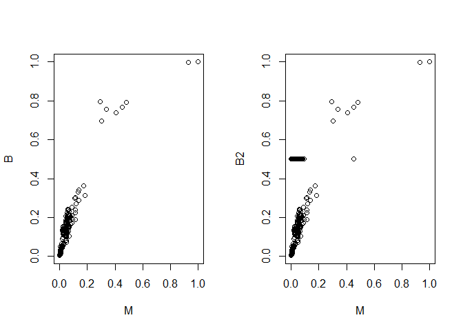
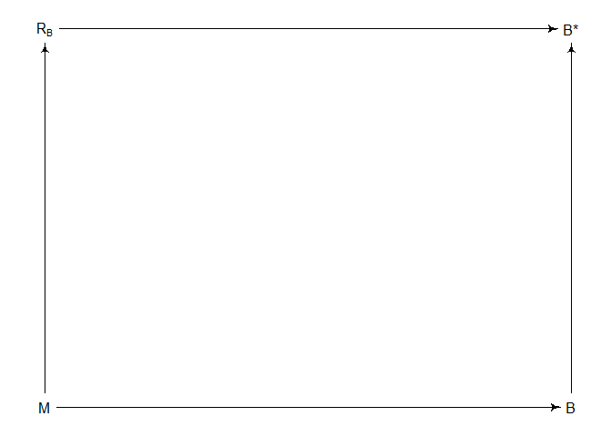
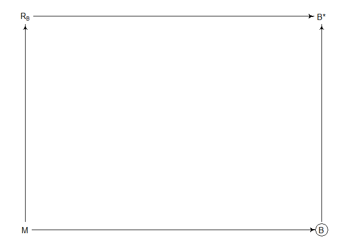
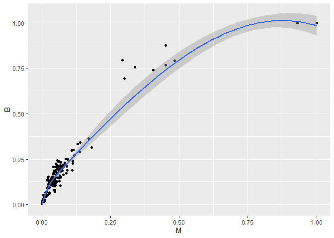
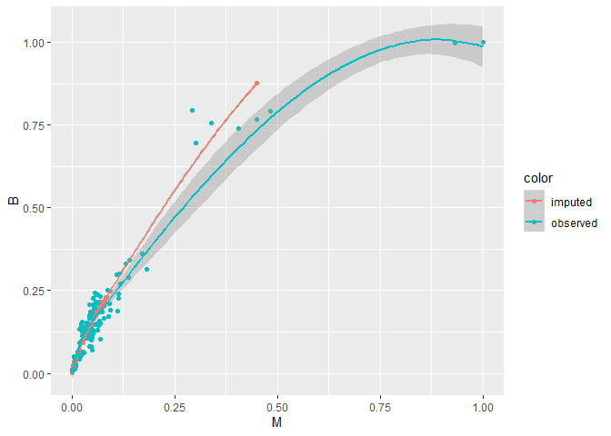

07\_20\_2020\_HW
================
John D.
7/20/2020

``` r
library(rethinking)
```

    ## Loading required package: rstan

    ## Loading required package: StanHeaders

    ## Loading required package: ggplot2

    ## rstan (Version 2.19.3, GitRev: 2e1f913d3ca3)

    ## For execution on a local, multicore CPU with excess RAM we recommend calling
    ## options(mc.cores = parallel::detectCores()).
    ## To avoid recompilation of unchanged Stan programs, we recommend calling
    ## rstan_options(auto_write = TRUE)

    ## For improved execution time, we recommend calling
    ## Sys.setenv(LOCAL_CPPFLAGS = '-march=corei7 -mtune=corei7')
    ## although this causes Stan to throw an error on a few processors.

    ## Loading required package: parallel

    ## Loading required package: dagitty

    ## rethinking (Version 1.95)

    ## 
    ## Attaching package: 'rethinking'

    ## The following object is masked from 'package:stats':
    ## 
    ##     rstudent

``` r
library(tidyverse)
```

    ## -- Attaching packages ------------------------------------------------------------------------------------ tidyverse 1.3.0 --

    ## v tibble  2.1.3     v dplyr   0.8.4
    ## v tidyr   1.0.2     v stringr 1.4.0
    ## v readr   1.3.1     v forcats 0.5.0
    ## v purrr   0.3.3

    ## -- Conflicts --------------------------------------------------------------------------------------- tidyverse_conflicts() --
    ## x tidyr::extract() masks rstan::extract()
    ## x dplyr::filter()  masks stats::filter()
    ## x dplyr::lag()     masks stats::lag()
    ## x purrr::map()     masks rethinking::map()

## 1\. Consider the relationship between brain volume `(brain)` and body mass `(body)` in the `data(Primates301)`. These values are presented as single values for each species. However, there is always a range of sizes in a species, and some of these measurements are taken from very small samples. So these values are measured with some unknown error.

## We don’t have the raw measurements to work with, that would be best. But we can imagine what might happen if we had them. Suppose error is proportional to the measurement. This makes sense, because larger animals have larger variation. As a consequence, the uncertainty is not uniform across the values and this could mean trouble.

## Let’s make up some standard errors for these measurements, to see what might happen. Load the data and scale the measurements so the maxium is 1 in both cases:

``` r
data("Primates301")
d <- Primates301
cc <- complete.cases(d$brain, d$body)

B <- d$brain[cc]
M <- d$body[cc]
B <- B / max(B)
M <- M / max(M)
```

## Now I’ll make up some standard errors for B and M, assuming error is 10%% of the measurement.

``` r
Bse <- B*0.1
Mse <- M*0.1
```

Let’s model these variables with this relationship:

  
 \\\\
\\mu_i = \\alpha + \\beta logM_i
")  

## This says that brain volume is a log-normal variable, and the mean on the log scale is given by . What this model implies is that the expected value of B is:

  
 = exp(\\alpha)M^\\beta_i ")  

## So this is a standard allometic scaling relationship, incredibly common in biology. Ignoring measurement error, the corresponding `ulam` model is:

``` r
dat_list <- list(
  B = B,
  M = M
)

m1.1 <- ulam(
  alist(
    B ~ dlnorm(mu, sigma),
    mu <- a + b*log(M),
    a ~ normal(0,1),
    b ~ normal(0,1),
    sigma ~ exponential(1)
  ), data = dat_list, log_lik = T, cores = 4
)
```

    ## 
    ## SAMPLING FOR MODEL '09a4efe803be46fb4328e9d647050be9' NOW (CHAIN 1).
    ## Chain 1: 
    ## Chain 1: Gradient evaluation took 0 seconds
    ## Chain 1: 1000 transitions using 10 leapfrog steps per transition would take 0 seconds.
    ## Chain 1: Adjust your expectations accordingly!
    ## Chain 1: 
    ## Chain 1: 
    ## Chain 1: Iteration:   1 / 1000 [  0%]  (Warmup)
    ## Chain 1: Iteration: 100 / 1000 [ 10%]  (Warmup)
    ## Chain 1: Iteration: 200 / 1000 [ 20%]  (Warmup)
    ## Chain 1: Iteration: 300 / 1000 [ 30%]  (Warmup)
    ## Chain 1: Iteration: 400 / 1000 [ 40%]  (Warmup)
    ## Chain 1: Iteration: 500 / 1000 [ 50%]  (Warmup)
    ## Chain 1: Iteration: 501 / 1000 [ 50%]  (Sampling)
    ## Chain 1: Iteration: 600 / 1000 [ 60%]  (Sampling)
    ## Chain 1: Iteration: 700 / 1000 [ 70%]  (Sampling)
    ## Chain 1: Iteration: 800 / 1000 [ 80%]  (Sampling)
    ## Chain 1: Iteration: 900 / 1000 [ 90%]  (Sampling)
    ## Chain 1: Iteration: 1000 / 1000 [100%]  (Sampling)
    ## Chain 1: 
    ## Chain 1:  Elapsed Time: 0.173 seconds (Warm-up)
    ## Chain 1:                0.132 seconds (Sampling)
    ## Chain 1:                0.305 seconds (Total)
    ## Chain 1:

    ## Warning: Bulk Effective Samples Size (ESS) is too low, indicating posterior means and medians may be unreliable.
    ## Running the chains for more iterations may help. See
    ## http://mc-stan.org/misc/warnings.html#bulk-ess

## Your job is to add the measurement errors to this model. Use the divorce/marriage example in the chapter as a guide. It might help to initialize the unobserved true values of B and M using the observed values, by adding a list like this to `ulam`:

``` r
start(list(M_true = dat_list$M, B_true = dat_list$B))
```

## Compare the inference of the measurement error model to those of m1.1 above. Has anything changed? Why or why not

``` r
dat_list$N_spp <- sum(cc)
dat_list$Mse <- Mse
dat_list$Bse <- Bse

m1.2 <- ulam(
  alist(
    B ~ dnorm(B_true, Bse),
    vector[N_spp]:B_true ~ dlnorm(mu , sigma),
    mu <- a + b*log(M_true[i]),
    M ~ dnorm(M_true, Mse),
    vector[N_spp]:M_true ~ dnorm(0.25, 1),
    a ~ normal(0,1),
    b ~ normal(0,1),
    sigma ~ exponential(1)
  ),
  data = dat_list,
  start = list(M_true = dat_list$M, B_true = dat_list$B),
  cores = 4,
  log_lik = T
)
```

    ## 
    ## SAMPLING FOR MODEL '47614d87079b51b7491d561937b75d35' NOW (CHAIN 1).
    ## Chain 1: 
    ## Chain 1: Gradient evaluation took 0 seconds
    ## Chain 1: 1000 transitions using 10 leapfrog steps per transition would take 0 seconds.
    ## Chain 1: Adjust your expectations accordingly!
    ## Chain 1: 
    ## Chain 1: 
    ## Chain 1: Iteration:   1 / 1000 [  0%]  (Warmup)
    ## Chain 1: Iteration: 100 / 1000 [ 10%]  (Warmup)
    ## Chain 1: Iteration: 200 / 1000 [ 20%]  (Warmup)
    ## Chain 1: Iteration: 300 / 1000 [ 30%]  (Warmup)
    ## Chain 1: Iteration: 400 / 1000 [ 40%]  (Warmup)
    ## Chain 1: Iteration: 500 / 1000 [ 50%]  (Warmup)
    ## Chain 1: Iteration: 501 / 1000 [ 50%]  (Sampling)
    ## Chain 1: Iteration: 600 / 1000 [ 60%]  (Sampling)
    ## Chain 1: Iteration: 700 / 1000 [ 70%]  (Sampling)
    ## Chain 1: Iteration: 800 / 1000 [ 80%]  (Sampling)
    ## Chain 1: Iteration: 900 / 1000 [ 90%]  (Sampling)
    ## Chain 1: Iteration: 1000 / 1000 [100%]  (Sampling)
    ## Chain 1: 
    ## Chain 1:  Elapsed Time: 24.474 seconds (Warm-up)
    ## Chain 1:                31.926 seconds (Sampling)
    ## Chain 1:                56.4 seconds (Total)
    ## Chain 1:

    ## Warning: There were 496 transitions after warmup that exceeded the maximum treedepth. Increase max_treedepth above 10. See
    ## http://mc-stan.org/misc/warnings.html#maximum-treedepth-exceeded

    ## Warning: Examine the pairs() plot to diagnose sampling problems

``` r
precis(m1.1)
```

    ##            mean         sd      5.5%     94.5%    n_eff    Rhat4
    ## a     0.4288909 0.05615252 0.3370987 0.5171349 105.6946 1.009674
    ## b     0.7834753 0.01343032 0.7619157 0.8051339 120.7075 1.005178
    ## sigma 0.2924672 0.01612269 0.2693519 0.3200687 177.1755 1.000807

``` r
precis(m1.2)
```

    ## 364 vector or matrix parameters hidden. Use depth=2 to show them.

    ##            mean         sd      5.5%     94.5%    n_eff     Rhat4
    ## a     0.4163900 0.06157600 0.3201089 0.5146150 592.5477 0.9998967
    ## b     0.7832991 0.01480514 0.7605272 0.8078481 588.5996 1.0007961
    ## sigma 0.2630901 0.01815932 0.2352265 0.2911346 591.3429 0.9980009

``` r
compare(m1.1,m1.2)
```

    ##               WAIC           SE        dWAIC         dSE        pWAIC weight
    ## m1.1 -8.696221e+02 3.783697e+01 0.000000e+00          NA 2.493791e+00      1
    ## m1.2  1.817599e+13 9.249853e+12 1.817599e+13 9.27537e+12 9.087796e+12      0

They’re bassically the same a and b values. The 5.5% and 94.5% ranges
moved slightly

## 2\. Now consider the missing values, this data is lousy with them. You can ignore measurement error in this problem. Let’s get a quick idea of the missing values by counting them in each variable.

``` r
colSums(is.na(d))
```

    ##                name               genus             species          subspecies 
    ##                   0                   0                   0                 267 
    ##              spp_id            genus_id     social_learning     research_effort 
    ##                   0                   0                  98                 115 
    ##               brain                body          group_size           gestation 
    ##                 117                  63                 114                 161 
    ##             weaning           longevity        sex_maturity maternal_investment 
    ##                 185                 181                 194                 197

## We’ll continue to focus just on brain and body, to stave off insanity. Consider only those species with measured body masses

``` r
cc <- complete.cases(d$body)
M <- d$body[cc]
M <- M / max(M)
B <- d$brain[cc]
B <- B / max(B, na.rm = T)
```

## You should end up with 238 species and 56 missing brain values among them. First, consider whether there is a pattern to the missing values. Does it look like missing values are associated with particular values of body mass? Draw a DAG that represents how missingness works in this case. Which type (MCAR, MAR, MNAR) is this?

``` r
B2 <- B
B2[is.na(B2)] <- 0.5
par(mfrow = c(1,2))
plot(M,B)
plot(M,B2)
```

<!-- -->

``` r
par(mfrow = c(1,1))
```

This is not missing completely at random. The missingness is associated
with smaller body masses.

``` r
library(dagitty)
dag <- dagitty(
'dag{
  M -> R_B 
  R_B -> "B*"
  B -> "B*"
  M -> B
}'
)

coordinates(dag) <- list(x = c(M = 0, B = 1, R_B = 0, "B*" = 1),
                         y = c(M = 1, B = 1, R_B = 0, "B*" = 0))

drawdag(dag)
```

<!-- -->

``` r
drawdag(dag, shapes = list(B = "c"))
```

<!-- -->

## Second. impute missing values for brain size. It might help to initialize the 56 imputed variables to a valid value:

``` r
start=list(B_impute=rep(0.5,56))
```

## This just helps the chain get started. Compare the inferences to an analysis that drops all missing values. Has anything changed? Why or why not? Hint: Consider the density of the data in the ranges where there are missing values. You might want to plot the imputed brain sizes together with the observed values.

``` r
dat_list <- list(
  B = B,
  M = M
)

m2.1 <- ulam(
  alist(
    B ~ dlnorm(mu, sigma),
    mu <- a + b*log(M),
    a ~ normal(0,1),
    b ~ normal(0,1),
    sigma ~ exponential(1)
  ), 
  data = dat_list,
  cores = 4,
  start=list(B_impute=rep(0.5,56))
)
```

    ## Found 56 NA values in B and attempting imputation.

    ## 
    ## SAMPLING FOR MODEL 'c8d224697c78e96350b1931a0e2da52d' NOW (CHAIN 1).
    ## Chain 1: 
    ## Chain 1: Gradient evaluation took 0 seconds
    ## Chain 1: 1000 transitions using 10 leapfrog steps per transition would take 0 seconds.
    ## Chain 1: Adjust your expectations accordingly!
    ## Chain 1: 
    ## Chain 1: 
    ## Chain 1: Iteration:   1 / 1000 [  0%]  (Warmup)
    ## Chain 1: Iteration: 100 / 1000 [ 10%]  (Warmup)
    ## Chain 1: Iteration: 200 / 1000 [ 20%]  (Warmup)
    ## Chain 1: Iteration: 300 / 1000 [ 30%]  (Warmup)
    ## Chain 1: Iteration: 400 / 1000 [ 40%]  (Warmup)
    ## Chain 1: Iteration: 500 / 1000 [ 50%]  (Warmup)
    ## Chain 1: Iteration: 501 / 1000 [ 50%]  (Sampling)
    ## Chain 1: Iteration: 600 / 1000 [ 60%]  (Sampling)
    ## Chain 1: Iteration: 700 / 1000 [ 70%]  (Sampling)
    ## Chain 1: Iteration: 800 / 1000 [ 80%]  (Sampling)
    ## Chain 1: Iteration: 900 / 1000 [ 90%]  (Sampling)
    ## Chain 1: Iteration: 1000 / 1000 [100%]  (Sampling)
    ## Chain 1: 
    ## Chain 1:  Elapsed Time: 6.193 seconds (Warm-up)
    ## Chain 1:                1.707 seconds (Sampling)
    ## Chain 1:                7.9 seconds (Total)
    ## Chain 1:

    ## Warning: The largest R-hat is 1.07, indicating chains have not mixed.
    ## Running the chains for more iterations may help. See
    ## http://mc-stan.org/misc/warnings.html#r-hat

    ## Warning: Bulk Effective Samples Size (ESS) is too low, indicating posterior means and medians may be unreliable.
    ## Running the chains for more iterations may help. See
    ## http://mc-stan.org/misc/warnings.html#bulk-ess

    ## Warning: Tail Effective Samples Size (ESS) is too low, indicating posterior variances and tail quantiles may be unreliable.
    ## Running the chains for more iterations may help. See
    ## http://mc-stan.org/misc/warnings.html#tail-ess

``` r
precis(m1.1)
```

    ##            mean         sd      5.5%     94.5%    n_eff    Rhat4
    ## a     0.4288909 0.05615252 0.3370987 0.5171349 105.6946 1.009674
    ## b     0.7834753 0.01343032 0.7619157 0.8051339 120.7075 1.005178
    ## sigma 0.2924672 0.01612269 0.2693519 0.3200687 177.1755 1.000807

``` r
precis(m1.2)
```

    ## 364 vector or matrix parameters hidden. Use depth=2 to show them.

    ##            mean         sd      5.5%     94.5%    n_eff     Rhat4
    ## a     0.4163900 0.06157600 0.3201089 0.5146150 592.5477 0.9998967
    ## b     0.7832991 0.01480514 0.7605272 0.8078481 588.5996 1.0007961
    ## sigma 0.2630901 0.01815932 0.2352265 0.2911346 591.3429 0.9980009

``` r
precis(m2.1)
```

    ## 56 vector or matrix parameters hidden. Use depth=2 to show them.

    ##            mean         sd      5.5%     94.5%    n_eff    Rhat4
    ## a     0.4244795 0.05637597 0.3383992 0.5225270 168.2390 1.003825
    ## b     0.7828704 0.01353575 0.7603913 0.8057123 172.1294 1.005280
    ## sigma 0.2924570 0.01622475 0.2682631 0.3187088 182.6817 1.017466

Pretty much still the same.

``` r
dat_list <- list(
  B = B,
  M = M
)

m2.1 <- ulam(
  alist(
    B ~ dlnorm(mu, sigma),
    mu <- a + b*log(M),
    a ~ normal(0,1),
    b ~ normal(0,1),
    sigma ~ exponential(1)
  ), 
  data = dat_list,
  cores = 4,
  start=list(B_impute=rep(0.5,56))
)
```

    ## Found 56 NA values in B and attempting imputation.

    ## recompiling to avoid crashing R session

    ## 
    ## SAMPLING FOR MODEL 'c8d224697c78e96350b1931a0e2da52d' NOW (CHAIN 1).
    ## Chain 1: 
    ## Chain 1: Gradient evaluation took 0 seconds
    ## Chain 1: 1000 transitions using 10 leapfrog steps per transition would take 0 seconds.
    ## Chain 1: Adjust your expectations accordingly!
    ## Chain 1: 
    ## Chain 1: 
    ## Chain 1: Iteration:   1 / 1000 [  0%]  (Warmup)
    ## Chain 1: Iteration: 100 / 1000 [ 10%]  (Warmup)
    ## Chain 1: Iteration: 200 / 1000 [ 20%]  (Warmup)
    ## Chain 1: Iteration: 300 / 1000 [ 30%]  (Warmup)
    ## Chain 1: Iteration: 400 / 1000 [ 40%]  (Warmup)
    ## Chain 1: Iteration: 500 / 1000 [ 50%]  (Warmup)
    ## Chain 1: Iteration: 501 / 1000 [ 50%]  (Sampling)
    ## Chain 1: Iteration: 600 / 1000 [ 60%]  (Sampling)
    ## Chain 1: Iteration: 700 / 1000 [ 70%]  (Sampling)
    ## Chain 1: Iteration: 800 / 1000 [ 80%]  (Sampling)
    ## Chain 1: Iteration: 900 / 1000 [ 90%]  (Sampling)
    ## Chain 1: Iteration: 1000 / 1000 [100%]  (Sampling)
    ## Chain 1: 
    ## Chain 1:  Elapsed Time: 5.099 seconds (Warm-up)
    ## Chain 1:                1.362 seconds (Sampling)
    ## Chain 1:                6.461 seconds (Total)
    ## Chain 1:

``` r
precis(m1.1)
```

    ##            mean         sd      5.5%     94.5%    n_eff    Rhat4
    ## a     0.4288909 0.05615252 0.3370987 0.5171349 105.6946 1.009674
    ## b     0.7834753 0.01343032 0.7619157 0.8051339 120.7075 1.005178
    ## sigma 0.2924672 0.01612269 0.2693519 0.3200687 177.1755 1.000807

``` r
precis(m1.2)
```

    ## 364 vector or matrix parameters hidden. Use depth=2 to show them.

    ##            mean         sd      5.5%     94.5%    n_eff     Rhat4
    ## a     0.4163900 0.06157600 0.3201089 0.5146150 592.5477 0.9998967
    ## b     0.7832991 0.01480514 0.7605272 0.8078481 588.5996 1.0007961
    ## sigma 0.2630901 0.01815932 0.2352265 0.2911346 591.3429 0.9980009

``` r
precis(m2.1)
```

    ## 56 vector or matrix parameters hidden. Use depth=2 to show them.

    ##            mean         sd      5.5%     94.5%    n_eff     Rhat4
    ## a     0.4243707 0.06307836 0.3264792 0.5253509 222.0425 0.9993877
    ## b     0.7825962 0.01515253 0.7580278 0.8070545 205.4582 1.0005393
    ## sigma 0.2939126 0.01559640 0.2697484 0.3210312 454.0174 1.0002227

``` r
post <- extract.samples(m2.1)
imputed <- apply(post$B_impute, 2, mean)
dat <- data.frame(M = M, B = B)
dat$color <- ifelse(is.na(dat$B), "imputed", "observed")
dat$B[is.na(dat$B)] <- imputed

par(mfrow = c(1,2))
ggplot(dat[,-3], aes(x = M, y = B)) +
  geom_point() +
  geom_smooth()
```

    ## `geom_smooth()` using method = 'loess' and formula 'y ~ x'

<!-- -->

``` r
ggplot(dat, aes(x = M, y = B, color = color)) +
  geom_point() +
  geom_smooth()
```

    ## `geom_smooth()` using method = 'loess' and formula 'y ~ x'

<!-- -->
