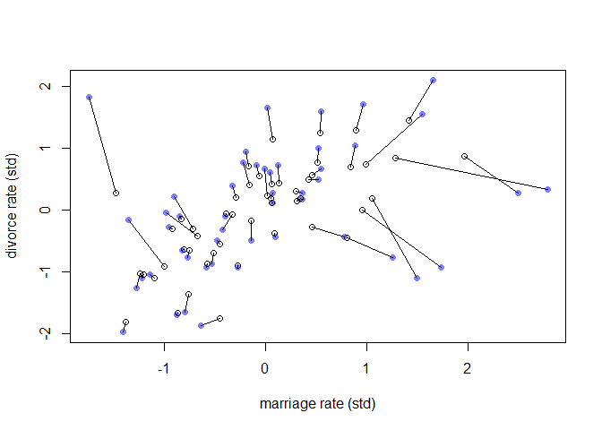
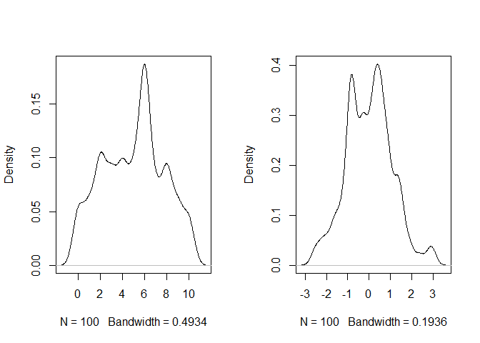
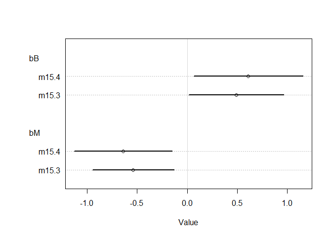
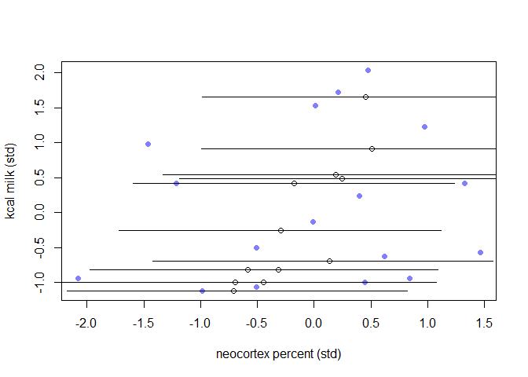
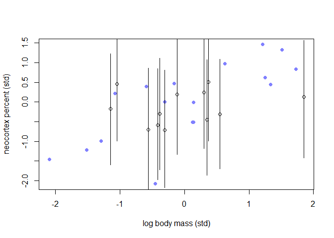
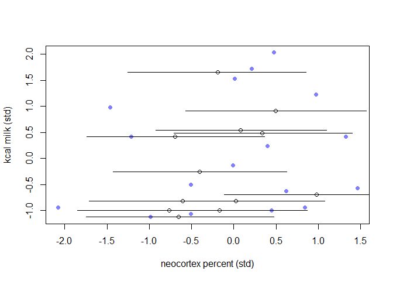
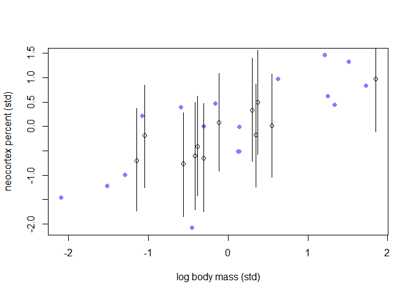

07\_20\_2020\_Notes
================
John D.
7/20/2020

``` r
library(rethinking)
```

    ## Loading required package: rstan

    ## Warning: package 'rstan' was built under R version 3.6.3

    ## Loading required package: StanHeaders

    ## Loading required package: ggplot2

    ## Warning: package 'ggplot2' was built under R version 3.6.3

    ## rstan (Version 2.19.3, GitRev: 2e1f913d3ca3)

    ## For execution on a local, multicore CPU with excess RAM we recommend calling
    ## options(mc.cores = parallel::detectCores()).
    ## To avoid recompilation of unchanged Stan programs, we recommend calling
    ## rstan_options(auto_write = TRUE)

    ## For improved execution time, we recommend calling
    ## Sys.setenv(LOCAL_CPPFLAGS = '-march=corei7 -mtune=corei7')
    ## although this causes Stan to throw an error on a few processors.

    ## Loading required package: parallel

    ## Loading required package: dagitty

    ## rethinking (Version 1.93)

    ## 
    ## Attaching package: 'rethinking'

    ## The following object is masked from 'package:stats':
    ## 
    ##     rstudent

``` r
library(tidyverse)
```

    ## -- Attaching packages -------------------------------------------------------------------------------------------------- tidyverse 1.3.0 --

    ## v tibble  3.0.1     v dplyr   0.8.5
    ## v tidyr   1.0.2     v stringr 1.4.0
    ## v readr   1.3.1     v forcats 0.5.0
    ## v purrr   0.3.4

    ## Warning: package 'tibble' was built under R version 3.6.3

    ## Warning: package 'tidyr' was built under R version 3.6.3

    ## Warning: package 'purrr' was built under R version 3.6.3

    ## Warning: package 'dplyr' was built under R version 3.6.3

    ## Warning: package 'forcats' was built under R version 3.6.3

    ## -- Conflicts ----------------------------------------------------------------------------------------------------- tidyverse_conflicts() --
    ## x tidyr::extract() masks rstan::extract()
    ## x dplyr::filter()  masks stats::filter()
    ## x dplyr::lag()     masks stats::lag()
    ## x purrr::map()     masks rethinking::map()

# 15 Missing Data and Other Opportunities

``` r
# simulate a pancake and return randomly ordered sides
sim_pancake <- function() {
pancake <- sample(1:3,1)
sides <- matrix(c(1,1,1,0,0,0),2,3)[,pancake]
sample(sides)
}
# sim 10,000 pancakes
pancakes <- replicate( 1e4 , sim_pancake() )
up <- pancakes[1,]
down <- pancakes[2,]
# compute proportion 1/1 (BB) out of all 1/1 and 1/0
num_11_10 <- sum( up==1 )
num_11 <- sum( up==1 & down==1 )
num_11/num_11_10
```

    ## [1] 0.6714403

## 15.1. Measurement error

``` r
data(WaffleDivorce)
d <- WaffleDivorce
# points
plot(
  d$Divorce ~ d$MedianAgeMarriage ,
  ylim = c(4, 15) ,
  xlab = "Median age marriage" ,
  ylab = "Divorce rate"
)
# standard errors
for (i in 1:nrow(d)) {
  ci <- d$Divorce[i] + c(-1, 1) * d$Divorce.SE[i]
  x <- d$MedianAgeMarriage[i]
  lines(c(x, x) , ci)
}
```

<!-- -->

### 15.1.1. Error on the outcome

``` r
dlist <- list(
  D_obs = standardize(d$Divorce),
  D_sd = d$Divorce.SE / sd(d$Divorce),
  M = standardize(d$Marriage),
  A = standardize(d$MedianAgeMarriage),
  N = nrow(d)
)
m15.1 <- ulam(
  alist(
    D_obs ~ dnorm(D_true , D_sd),
    vector[N]:D_true ~ dnorm(mu , sigma),
    mu <- a + bA * A + bM * M,
    a ~ dnorm(0, 0.2),
    bA ~ dnorm(0, 0.5),
    bM ~ dnorm(0, 0.5),
    sigma ~ dexp(1)
  ) ,
  data = dlist ,
  chains = 4 ,
  cores = 4
)
```

``` r
precis( m15.1 , depth=2 )
```

    ##                   mean        sd        5.5%        94.5%     n_eff      Rhat
    ## D_true[1]   1.16804280 0.3684816  0.59190210  1.770425832 1721.1201 0.9986424
    ## D_true[2]   0.67403989 0.5613486 -0.21323597  1.586491093 1969.6984 0.9991670
    ## D_true[3]   0.43076902 0.3434210 -0.11791200  0.971689727 1643.3051 1.0022255
    ## D_true[4]   1.41565820 0.4613052  0.65962245  2.153482181 2065.6930 0.9985024
    ## D_true[5]  -0.89993879 0.1260194 -1.10176327 -0.701800358 2778.8527 0.9985023
    ## D_true[6]   0.66731446 0.3900959  0.04604708  1.327220446 1806.1275 1.0009086
    ## D_true[7]  -1.36432843 0.3390444 -1.90747172 -0.825534022 2090.1742 0.9984533
    ## D_true[8]  -0.34283877 0.4948485 -1.12776337  0.463661166 2969.4734 0.9997459
    ## D_true[9]  -1.89719845 0.6079392 -2.85385184 -0.893873089 1709.2145 0.9993304
    ## D_true[10] -0.61949492 0.1636181 -0.89365991 -0.354152228 2784.5322 0.9994481
    ## D_true[11]  0.75655329 0.2860751  0.30961511  1.228263722 2255.2846 0.9982835
    ## D_true[12] -0.56119984 0.4801366 -1.34349463  0.185497154 2231.8857 0.9996595
    ## D_true[13]  0.16348996 0.4856154 -0.62715487  0.905153666  920.7155 1.0019599
    ## D_true[14] -0.87027780 0.2269359 -1.22883670 -0.510576921 2711.7267 1.0005737
    ## D_true[15]  0.55874644 0.3074627  0.07095437  1.046057871 2259.0162 1.0014109
    ## D_true[16]  0.27768190 0.3823040 -0.33501095  0.900058416 2988.6263 0.9989272
    ## D_true[17]  0.49835445 0.4277134 -0.19086266  1.206434347 3802.2838 0.9982665
    ## D_true[18]  1.25954588 0.3457253  0.70293802  1.827143557 2017.2367 1.0004407
    ## D_true[19]  0.42697480 0.3807154 -0.17900762  1.046556061 1982.9309 1.0008589
    ## D_true[20]  0.40441987 0.5420234 -0.43304607  1.286331058 1267.6744 1.0013614
    ## D_true[21] -0.55351940 0.3202046 -1.06008810 -0.049906364 2633.3138 0.9997121
    ## D_true[22] -1.10350477 0.2518532 -1.49467071 -0.695632299 2525.8909 0.9995409
    ## D_true[23] -0.27137934 0.2664502 -0.68975043  0.155798903 3131.3765 0.9994112
    ## D_true[24] -1.01166757 0.2862899 -1.47334573 -0.558296745 2071.7303 0.9997739
    ## D_true[25]  0.43414538 0.4077270 -0.21007613  1.086639115 2361.7180 1.0001023
    ## D_true[26] -0.02239033 0.3034692 -0.50281785  0.454517781 2648.8244 0.9997073
    ## D_true[27] -0.02425409 0.5020755 -0.83502902  0.759609370 2203.3074 0.9993152
    ## D_true[28] -0.14113292 0.3831851 -0.76473468  0.453487672 2663.9023 1.0006391
    ## D_true[29] -0.27648903 0.5140977 -1.04820000  0.565811518 2290.8846 0.9997497
    ## D_true[30] -1.79684164 0.2385294 -2.19416266 -1.425765543 2174.9591 1.0010990
    ## D_true[31]  0.17697723 0.4266925 -0.50341387  0.852352259 2845.9606 0.9993334
    ## D_true[32] -1.66032847 0.1651620 -1.92254950 -1.396601135 3123.2838 0.9990539
    ## D_true[33]  0.11587251 0.2411595 -0.27495902  0.500126463 3058.0192 0.9995353
    ## D_true[34] -0.05680264 0.5278480 -0.89599132  0.788249136 2047.2783 0.9987297
    ## D_true[35] -0.12802920 0.2233595 -0.48659227  0.241533083 2874.4769 0.9985727
    ## D_true[36]  1.26616651 0.4036303  0.63510691  1.933062231 2396.2328 1.0002253
    ## D_true[37]  0.23033841 0.3539251 -0.32916082  0.798157471 2087.7792 0.9999368
    ## D_true[38] -1.02981213 0.2198052 -1.38186334 -0.679565706 2781.5514 0.9996918
    ## D_true[39] -0.91988486 0.5373284 -1.75579449 -0.029436186 2025.1891 0.9996834
    ## D_true[40] -0.68104833 0.3199143 -1.19295479 -0.198209708 2484.5759 0.9986392
    ## D_true[41]  0.23991281 0.5587375 -0.66022132  1.103664556 3170.3038 0.9982915
    ## D_true[42]  0.74380517 0.3574200  0.18627028  1.331430811 2111.4227 1.0007289
    ## D_true[43]  0.19245204 0.1871224 -0.10579103  0.493104945 3093.2936 0.9989086
    ## D_true[44]  0.79390313 0.4316365  0.10748489  1.454019272 1793.3625 0.9991504
    ## D_true[45] -0.41155580 0.5197232 -1.22429677  0.433921921 2235.5331 0.9984939
    ## D_true[46] -0.38414824 0.2447652 -0.76780543 -0.005387189 2801.2083 0.9999071
    ## D_true[47]  0.13266327 0.3091205 -0.35789688  0.623192920 2461.7910 0.9991854
    ## D_true[48]  0.56310821 0.4635961 -0.16850054  1.306467449 2337.5136 0.9983166
    ## D_true[49] -0.63290520 0.2836788 -1.08781834 -0.192530303 2498.1912 0.9994958
    ## D_true[50]  0.83171500 0.5758011 -0.07821014  1.737451000 1916.6138 0.9991186
    ## a          -0.05614849 0.1003934 -0.21008049  0.107014240 1680.4948 0.9994057
    ## bA         -0.61808329 0.1652646 -0.88081757 -0.354321847 1157.5120 1.0003947
    ## bM          0.04405375 0.1704746 -0.22557766  0.319432149 1090.1700 1.0006713
    ## sigma       0.58715869 0.1100442  0.42371042  0.766848077  453.3145 1.0042725

### 15.1.2. Error on both outcome and predictor

``` r
dlist <- list(
  D_obs = standardize(d$Divorce),
  D_sd = d$Divorce.SE / sd(d$Divorce),
  M_obs = standardize(d$Marriage),
  M_sd = d$Marriage.SE / sd(d$Marriage),
  A = standardize(d$MedianAgeMarriage),
  N = nrow(d)
)

m15.2 <- ulam(
  alist(
    D_obs ~ dnorm(D_est , D_sd),
    vector[N]:D_est ~ dnorm(mu , sigma),
    mu <- a + bA * A + bM * M_est[i],
    M_obs ~ dnorm(M_est , M_sd),
    vector[N]:M_est ~ dnorm(0 , 1),
    a ~ dnorm(0, 0.2),
    bA ~ dnorm(0, 0.5),
    bM ~ dnorm(0, 0.5),
    sigma ~ dexp(1)
  ) ,
  data = dlist ,
  chains = 4 ,
  cores = 4
)
```

``` r
precis(m15.2,depth = 2)
```

    ##                   mean         sd        5.5%       94.5%     n_eff      Rhat
    ## D_est[1]   1.140221288 0.37399371  0.53130786  1.73923276 1695.6565 1.0026213
    ## D_est[2]   0.746680113 0.54713056 -0.12149332  1.60649561 2193.7955 0.9988780
    ## D_est[3]   0.420106687 0.34923852 -0.13399477  0.98392707 2585.8830 0.9998424
    ## D_est[4]   1.452541282 0.44034747  0.76315186  2.16470284 1919.8275 1.0003724
    ## D_est[5]  -0.895011453 0.12777897 -1.09078195 -0.68645974 3233.0643 0.9990490
    ## D_est[6]   0.701272358 0.39738581  0.08423060  1.32705025 2405.7536 0.9993213
    ## D_est[7]  -1.357906981 0.32812214 -1.90043056 -0.84256566 2046.6474 1.0016438
    ## D_est[8]  -0.273005692 0.49403610 -1.03340839  0.49569454 2402.6429 1.0011897
    ## D_est[9]  -1.745665631 0.60183090 -2.68521495 -0.74386694 1455.5171 1.0010691
    ## D_est[10] -0.628353410 0.16846275 -0.89590263 -0.37030523 2685.3998 0.9989479
    ## D_est[11]  0.774166162 0.29275176  0.30185924  1.25392010 1981.1682 0.9994847
    ## D_est[12] -0.451752062 0.48340886 -1.24479810  0.31332379 1845.0736 0.9992759
    ## D_est[13]  0.187532235 0.50353809 -0.64676065  0.95294936 1170.8596 1.0024193
    ## D_est[14] -0.869018195 0.22295403 -1.21625789 -0.51037018 3355.4989 0.9986048
    ## D_est[15]  0.546609832 0.29648645  0.07726562  1.01125292 2992.6818 0.9996924
    ## D_est[16]  0.302233472 0.37137787 -0.28625395  0.89764379 2598.6495 1.0005879
    ## D_est[17]  0.499546833 0.41784560 -0.14530576  1.19827177 2862.5345 1.0006787
    ## D_est[18]  1.249232148 0.33796020  0.71753983  1.78051020 2346.9498 1.0007099
    ## D_est[19]  0.430130538 0.39243382 -0.18209129  1.05787655 2663.7275 0.9989898
    ## D_est[20]  0.270354788 0.55616146 -0.58367606  1.18087106 1145.4286 1.0032536
    ## D_est[21] -0.553088134 0.31012317 -1.04322222 -0.05615372 2638.7663 1.0010393
    ## D_est[22] -1.100371326 0.25932130 -1.51706090 -0.68852750 2466.9055 0.9992614
    ## D_est[23] -0.297311708 0.25583296 -0.70604044  0.10765391 2555.9449 0.9985312
    ## D_est[24] -1.031851304 0.30056364 -1.51913647 -0.53919220 2205.1393 0.9990429
    ## D_est[25]  0.410532865 0.41772353 -0.25763453  1.09150491 2136.7733 0.9989671
    ## D_est[26] -0.055109041 0.30683528 -0.53728225  0.42460075 2342.4531 1.0018078
    ## D_est[27] -0.063181950 0.51226238 -0.87478645  0.72965462 2514.6086 1.0001253
    ## D_est[28] -0.168905692 0.37557676 -0.76772900  0.42264169 2980.3967 0.9991559
    ## D_est[29] -0.301759826 0.51477729 -1.09640737  0.54445740 2245.8470 0.9992469
    ## D_est[30] -1.810056399 0.23018451 -2.17712873 -1.44290971 2259.2247 1.0015718
    ## D_est[31]  0.186871702 0.42474643 -0.49034169  0.85888338 2745.1212 0.9994201
    ## D_est[32] -1.655212245 0.16942128 -1.91052217 -1.38524511 2672.8810 1.0007237
    ## D_est[33]  0.121933623 0.24167019 -0.24239238  0.50938845 3716.0856 0.9987289
    ## D_est[34] -0.002906742 0.50191319 -0.80573608  0.78423256 1712.6405 0.9997074
    ## D_est[35] -0.148528639 0.23309306 -0.52343434  0.22780466 2686.7624 0.9988472
    ## D_est[36]  1.292707454 0.41356560  0.63376876  1.94392608 3348.6964 0.9989179
    ## D_est[37]  0.203347536 0.36128445 -0.37505412  0.79479279 2484.6720 1.0002826
    ## D_est[38] -1.038902226 0.22238357 -1.38504206 -0.69312231 3314.0788 0.9997292
    ## D_est[39] -0.916540407 0.55281527 -1.76307611  0.01268982 1734.5884 0.9994603
    ## D_est[40] -0.685658569 0.31457286 -1.18605164 -0.19119508 2617.2802 1.0005676
    ## D_est[41]  0.234625316 0.56641925 -0.66837500  1.16251704 2745.7283 0.9997188
    ## D_est[42]  0.709176221 0.33968428  0.17578576  1.26269861 2830.8904 1.0008735
    ## D_est[43]  0.195528498 0.18159634 -0.09945846  0.48562713 2884.2136 0.9986588
    ## D_est[44]  0.870688147 0.43272163  0.14632041  1.54870094 1237.5507 1.0046455
    ## D_est[45] -0.420658915 0.51425742 -1.21630537  0.42455211 2165.6637 0.9989535
    ## D_est[46] -0.375446842 0.25755097 -0.78883298  0.04077500 3470.4801 0.9986582
    ## D_est[47]  0.146049191 0.30367150 -0.34952008  0.63450348 3293.1786 0.9990249
    ## D_est[48]  0.561678695 0.49815244 -0.22989646  1.37168308 3183.2686 0.9986919
    ## D_est[49] -0.651267271 0.28341145 -1.10672711 -0.19169171 3055.4240 0.9993988
    ## D_est[50]  0.844141629 0.55090359 -0.06829555  1.72159586 1958.3449 1.0000141
    ## M_est[1]   0.076613442 0.32109603 -0.42594602  0.58182135 2681.5487 0.9991848
    ## M_est[2]   0.990426231 0.62516641 -0.03449119  1.99671871 3235.1731 0.9989031
    ## M_est[3]   0.064047795 0.25377334 -0.34084223  0.47466966 3245.1387 0.9992006
    ## M_est[4]   1.416123570 0.41833915  0.74128743  2.08124627 2684.4705 1.0001377
    ## M_est[5]  -0.267756719 0.10591149 -0.43683779 -0.09818577 2763.3462 0.9992320
    ## M_est[6]   0.840178531 0.31006768  0.35523425  1.32967177 3155.1291 0.9996891
    ## M_est[7]  -0.758888432 0.26357145 -1.17576822 -0.34157376 2882.6148 0.9985955
    ## M_est[8]   0.464132019 0.62437483 -0.49921883  1.47027618 3419.6386 0.9992336
    ## M_est[9]  -0.445832223 0.53399158 -1.30909917  0.40116868 3142.3998 0.9998009
    ## M_est[10] -0.800689003 0.15488844 -1.04522398 -0.55523081 3047.6054 0.9986832
    ## M_est[11]  0.520946786 0.21219399  0.17562191  0.87059931 3898.6154 0.9998905
    ## M_est[12]  0.811030793 0.56542164 -0.09716084  1.71778851 2635.7662 1.0006673
    ## M_est[13]  1.056600906 0.45957642  0.29800579  1.77460403 1518.2576 1.0019310
    ## M_est[14] -0.574483534 0.14968005 -0.80938589 -0.33339560 2571.7351 1.0006860
    ## M_est[15] -0.062273378 0.20899332 -0.40430549  0.27433493 2650.2378 0.9998074
    ## M_est[16]  0.303443163 0.36142126 -0.26816169  0.85512169 2747.4798 0.9999116
    ## M_est[17]  0.432035910 0.35193959 -0.12483225  0.99271331 3538.4329 1.0004186
    ## M_est[18]  0.540583110 0.28013944  0.07417278  0.98923630 2939.1117 0.9984225
    ## M_est[19]  0.136001425 0.28837259 -0.32380280  0.60181965 2755.1173 0.9989611
    ## M_est[20] -1.475874381 0.35266190 -2.03426079 -0.92495001 3003.4875 0.9993814
    ## M_est[21] -0.444706934 0.25875266 -0.85655938 -0.02979974 3050.0365 0.9993755
    ## M_est[22] -1.090710418 0.17944234 -1.38284219 -0.79950098 2657.2684 0.9986789
    ## M_est[23] -0.914467022 0.18133824 -1.19725116 -0.63301868 3364.2473 0.9998247
    ## M_est[24] -1.231416337 0.20033202 -1.55564900 -0.91260930 2947.6338 0.9994057
    ## M_est[25] -0.158870017 0.38678359 -0.79734049  0.44483322 2686.3370 0.9999627
    ## M_est[26] -0.386031816 0.20807389 -0.71765636 -0.04994446 3044.8111 1.0003600
    ## M_est[27] -0.326926165 0.50040189 -1.11903602  0.50643189 3106.6945 0.9992908
    ## M_est[28] -0.137693703 0.35425410 -0.72356793  0.43487241 3148.4501 0.9989556
    ## M_est[29] -0.715292190 0.42564225 -1.38916823 -0.03903366 2829.9431 0.9993976
    ## M_est[30] -1.378774200 0.15761676 -1.63712784 -1.12503323 3222.5423 1.0002040
    ## M_est[31]  0.059136174 0.44529988 -0.62653808  0.78172485 2942.6376 0.9986575
    ## M_est[32] -0.864161900 0.12204983 -1.06167889 -0.67205574 3043.3492 0.9999514
    ## M_est[33]  0.065235828 0.24678129 -0.32822645  0.44543861 2805.8892 0.9994332
    ## M_est[34]  0.962316611 0.61369012 -0.04783168  1.94225101 2633.9195 0.9986549
    ## M_est[35] -0.825609533 0.16236893 -1.09083953 -0.56419597 3190.2970 0.9985090
    ## M_est[36]  0.896478963 0.31268521  0.40207341  1.39202043 3591.0979 0.9991982
    ## M_est[37] -0.284383592 0.27679513 -0.73252339  0.15134010 3096.1365 0.9998762
    ## M_est[38] -1.195761920 0.12203368 -1.39332018 -1.00306248 2476.6795 0.9989794
    ## M_est[39] -0.994414856 0.46975684 -1.74555695 -0.23548674 2716.1215 1.0001324
    ## M_est[40] -0.507400258 0.29465034 -0.97562278 -0.02986624 2711.8172 0.9982898
    ## M_est[41]  0.022705004 0.56242616 -0.83244543  0.88113957 2169.2029 0.9996779
    ## M_est[42] -0.161974866 0.21752312 -0.49510853  0.18420365 2931.3972 0.9983098
    ## M_est[43]  0.349190957 0.15584356  0.09930091  0.59942092 2956.1391 0.9993925
    ## M_est[44]  1.963385807 0.43325972  1.26006015  2.66760890 2592.7262 1.0007332
    ## M_est[45] -0.669640834 0.53263000 -1.52268419  0.18901039 2467.1005 1.0000834
    ## M_est[46]  0.091192039 0.21527028 -0.25133148  0.43875467 3491.1911 0.9982874
    ## M_est[47]  0.317148323 0.25562404 -0.09466314  0.72522968 3498.1238 0.9993438
    ## M_est[48]  0.467753142 0.39238090 -0.18397525  1.08839871 2599.3255 0.9989274
    ## M_est[49] -0.744580362 0.19562568 -1.04812565 -0.43510340 2682.2811 0.9996554
    ## M_est[50]  1.290270629 0.69238194  0.22259506  2.40498015 2840.7572 0.9993425
    ## a         -0.039715832 0.09731301 -0.19185906  0.11246805 1800.1722 1.0002044
    ## bA        -0.537819391 0.16744143 -0.81408714 -0.27115797  881.3285 1.0024256
    ## bM         0.201250266 0.21328541 -0.14031327  0.54351320  679.4003 1.0042964
    ## sigma      0.565811732 0.11402065  0.39450199  0.75170017  475.7906 1.0103402

``` r
post <- extract.samples(m15.2)
D_est <- apply(post$D_est , 2 , mean)
M_est <- apply(post$M_est , 2 , mean)
plot(
  dlist$M_obs ,
  dlist$D_obs ,
  pch = 16 ,
  col = rangi2 ,
  xlab = "marriage rate (std)" ,
  ylab = "divorce rate (std)"
)
points(M_est , D_est)
for (i in 1:nrow(d))
  lines(c(dlist$M_obs[i] , M_est[i]) , c(dlist$D_obs[i] , D_est[i]))
```

<!-- -->

### 15.1.3. Measurement terrors

``` r
N <- 500
A <- rnorm(N)
M <- rnorm(N,-A)
D <- rnorm(N,A)
A_obs <- rnorm(N,A)
A_obs
```

    ##   [1]  1.208711783 -0.003598463  4.349938400  2.503003976 -1.770318621
    ##   [6] -1.794517530 -0.937911120 -0.399791711  2.246884289  1.836863377
    ##  [11] -0.016887600 -0.289742303  0.122836359 -0.881080920  1.582110751
    ##  [16]  0.243017369 -2.191075185 -0.343543110 -1.369160153 -2.194283463
    ##  [21] -0.799933567 -1.325362764  1.348647658  0.223464037  0.341752471
    ##  [26]  1.057373162 -3.311657099 -2.390553370  0.089238936 -0.735234035
    ##  [31]  3.751395838 -0.514475908  0.214265544 -2.647328850  0.113193788
    ##  [36]  0.175926230 -1.752502200  0.972108951  2.375683237 -1.070435122
    ##  [41]  1.009734921 -0.910550049  0.559352127  0.117057926 -0.163278923
    ##  [46]  1.665592043 -0.549806543 -0.363133320  0.249228966  2.686470081
    ##  [51]  0.702040410  0.591964309  2.007695870  0.961713726  1.540201904
    ##  [56]  0.877080202 -0.305465431  0.802071052  0.657626655 -0.323554693
    ##  [61] -1.626655780  0.573773700 -2.631551755  0.658650813  0.033686770
    ##  [66]  0.696318837  0.653506026 -0.476181259  1.858339393 -1.163826314
    ##  [71] -1.269318154 -0.828649149 -1.122165748 -0.682669677 -0.285057668
    ##  [76] -0.396442338 -0.245797241 -0.489113008  0.894376234 -1.726322138
    ##  [81]  2.545271072 -0.803181439  2.738213508 -2.823372622 -0.704881251
    ##  [86]  1.717134669 -0.314051632  0.909430505 -1.392364387 -2.756220100
    ##  [91] -0.596176820 -0.311841194  0.970799584  1.106401438 -2.545054403
    ##  [96]  0.432697771 -1.266988974  0.196273697 -2.312544980 -0.713056951
    ## [101] -0.238220123 -1.347948778  1.952398377 -0.602281157  0.471009243
    ## [106]  0.021546297 -0.923454769  1.461240079 -0.741862095 -1.435986598
    ## [111]  1.147361422 -1.315132816 -0.154490761  0.655788998 -1.942639299
    ## [116]  0.885157329  0.463062366  0.196980202 -2.239766318  1.897246593
    ## [121]  2.350499459 -1.915529227  1.016173432  1.405874477 -1.686178184
    ## [126]  0.955282072  1.143529678  0.311932149 -1.318334839 -0.755378556
    ## [131]  1.158144472 -0.492613452 -1.940971363  1.605039562  0.792775740
    ## [136] -0.281145951  2.198648118  0.583539573  0.711128747 -0.714145733
    ## [141]  0.609021738 -1.145787937  1.624668130 -0.443935059  2.947081849
    ## [146] -1.882214150 -0.230624379  2.719236129  1.284917897  0.451363518
    ## [151] -0.732139086 -0.350682780 -1.736604081  1.693243335  2.467716863
    ## [156]  3.058853811  0.528131254  0.581943888  3.451357622  0.351344243
    ## [161]  0.693760888  2.214596919 -0.859087325  0.696639753  0.396540011
    ## [166] -0.647777516  3.318111645  0.772078147 -1.215574170  0.265549078
    ## [171]  0.518915291 -1.329004949 -0.873287444 -0.160993051 -1.541644151
    ## [176]  0.055333060  0.218525807 -3.043892438  0.023819379  0.574900958
    ## [181]  0.150608550 -0.754529764  1.856878659  1.951641019 -2.504423391
    ## [186]  0.450628818 -1.602007955 -1.244558067 -1.158750219  0.798627430
    ## [191] -0.335803069  0.894602046 -0.045976268 -3.930208105 -1.827422112
    ## [196] -2.040769902 -0.225718378 -1.999251513  0.028649776 -2.016590239
    ## [201]  0.065793664  0.414937065  0.129703722 -2.867672045 -0.005307697
    ## [206] -2.543898472  0.187030308 -1.890357310  0.503651507  1.773461511
    ## [211] -0.551540297  0.521080521  0.735060196  0.790721739 -1.545459906
    ## [216] -1.051298747  1.571822223  0.718629890 -0.795617306  1.896211094
    ## [221] -0.728153178 -1.396472157 -2.520030686 -1.490277365 -0.199039939
    ## [226] -0.615280203 -0.741416347  0.721611310 -0.548748709 -0.579038828
    ## [231]  0.689363530  0.079803160  1.050936838  1.486460847  1.150845418
    ## [236]  1.188822990 -1.967750656  1.013774448  1.933689591  0.453731434
    ## [241] -1.729830881  0.606425321  0.871200112  0.137281822  3.051794741
    ## [246] -2.516581983  1.241401214 -0.815737019  0.412810195  0.242745333
    ## [251]  0.529249172  0.797127001  0.699365308  1.500245437  0.603456375
    ## [256] -0.979954696 -0.146015149  1.150922249  0.056987485  1.773279594
    ## [261]  0.382877315 -0.282767947  0.880448453 -0.980681101  0.661705280
    ## [266]  0.725219170 -0.904488437 -0.258640790 -1.783206955  1.797056214
    ## [271]  0.188129352  0.240386963  1.718535139  0.338340415  3.659921641
    ## [276]  0.818881607  0.055416319  0.456675369 -0.285693202 -1.153859926
    ## [281]  2.235791865  2.174746149 -2.351632399 -1.249766050  0.955571081
    ## [286] -0.284116049  2.400125529  0.926383895 -0.451316583 -0.013271048
    ## [291]  1.205266343  1.761953820  0.350777828  1.040964605 -0.450543809
    ## [296] -0.582326328 -0.200712889  1.035640257  0.753061025 -2.694751053
    ## [301]  1.733600741  1.954286851  2.375914885  0.952537804  1.244914934
    ## [306]  1.490772752  1.610949094 -0.787881043  3.284123418  0.111372312
    ## [311] -0.429573387  2.688238690  0.354446743  0.101091081 -0.691888168
    ## [316] -0.708785229 -1.725993209 -0.738937206 -2.898985794  0.929392081
    ## [321]  1.390640418 -0.697365849  0.197058449  1.341406788 -1.018246737
    ## [326]  0.947459711  1.559187913 -1.139246019 -2.329192808  2.716840080
    ## [331] -0.383493363  1.032730170  1.006659040 -0.720413189 -0.516901697
    ## [336] -0.165217828 -0.797638344 -0.610252737  1.066622903  0.443002640
    ## [341]  1.626509935 -0.753523715  0.259711432 -0.266431859 -1.276460625
    ## [346] -0.405762395  1.352811334 -0.100350303 -3.734296718 -0.374826029
    ## [351]  1.028682510 -2.457069989  0.934164594  0.289897298  2.304344833
    ## [356] -0.658516841 -0.268879246 -0.439626005  2.371864993 -1.426089368
    ## [361] -0.772186151 -0.924722937 -0.660037418 -0.067659446  0.758917227
    ## [366] -0.687995887 -0.616007499 -0.060624408 -1.058050752  0.290834648
    ## [371]  2.843041222  0.328607663 -0.714356608  0.787653817  1.632940177
    ## [376]  1.078011654  0.704543709 -0.509892596 -0.339607368  0.753199597
    ## [381] -1.000947039  2.990740873 -0.397344191  1.747026737 -0.328459963
    ## [386] -0.211275992  1.027834923 -1.888814149  0.085081300 -1.680935190
    ## [391] -3.739643214  1.414760754  1.200846318 -0.219605682  1.085430218
    ## [396]  0.211382048  0.021251465  0.508791018 -2.392635023  1.206153954
    ## [401] -0.664377058 -1.033461621 -0.536542347  1.546310730  0.828791708
    ## [406] -1.343287029 -0.430181697  0.613341219  1.135605360 -0.787416699
    ## [411] -1.392503591 -0.480189587  0.166845824  1.878606359  0.727391189
    ## [416]  0.367052517 -1.772720495  1.396396314  2.362144069  0.383256845
    ## [421]  0.467718010  1.751171069  1.420873718 -0.830761099  0.042014758
    ## [426] -0.483418427  3.212940833  0.032200016 -2.645504775  0.529960830
    ## [431] -1.419829253  1.255983256  2.771801154 -1.000077366 -1.204130810
    ## [436] -0.149854477 -2.516307997 -0.704947718  0.542368336 -0.031892901
    ## [441]  0.215071432  2.549445487 -1.928341674  0.586635560  1.507998223
    ## [446] -0.271770164 -1.509209967 -1.678740210  0.580857686 -0.590182151
    ## [451]  0.144868761  0.855029869 -0.810851296  0.992371097 -1.521945367
    ## [456]  0.258078359  1.213108696 -1.584437831  1.020970749 -1.764100613
    ## [461]  1.743432359 -0.915695104  1.376302467 -0.533016375  1.196657639
    ## [466] -1.325576950 -2.398839281  0.186493393  0.149809069  0.677199532
    ## [471]  0.837902044  0.057733878  3.119848587 -1.196081015 -2.470895791
    ## [476]  0.548614342 -0.590496476 -0.315861476 -0.451530112 -0.268278384
    ## [481]  0.554954578 -0.606329684 -1.982425092 -0.546640277 -2.037275002
    ## [486]  0.547688501 -1.117376747  2.189700541  0.539133016  2.302498197
    ## [491] -1.580385144 -0.033079154  0.851566083  1.102334951 -0.202105939
    ## [496]  1.079564105  2.266120727 -0.602997226  2.010995367 -2.133458247

## 15.2. Missing data

### 15.2.1. DAG ate my homework

``` r
N <- 100
S <- rnorm( N )
H <- rbinom( N , size=10 , inv_logit(S) )
par(mfrow=c(1,2))
dens(H)
dens(S)
```

<!-- -->

``` r
par(mfrow = c(1,1))
```

``` r
D <- rbern( N ) # dogs completely random
Hm <- H
Hm[D==1] <- NA
```

``` r
D <- ifelse( S > 0 , 1 , 0 )
Hm <- H
Hm[D==1] <- NA
Hm
```

    ##   [1]  2  3 NA NA NA  2 NA NA  5 NA NA NA  3  2  0 NA  4  0  4  2  4 NA  2 NA  5
    ##  [26] NA  2  1  5  2 NA NA NA NA NA  0 NA  2  1 NA NA NA NA NA NA  5  0  3  1 NA
    ##  [51]  2 NA  7  3  4 NA  1  5  2 NA NA NA  1  3 NA NA  3 NA NA  4  6  6 NA NA  4
    ##  [76] NA NA NA  0 NA  4  2 NA NA  6 NA  3  1 NA NA NA  3 NA NA  0  6 NA NA NA NA

``` r
set.seed(501)
N <- 1000
X <- rnorm(N)
S <- rnorm(N)
H <- rbinom( N , size=10 , inv_logit( 2 + S - 2*X ) )
D <- ifelse( X > 1 , 1 , 0 )
Hm <- H
Hm[D==1] <- NA
Hm
```

    ##    [1] 10  7  9  8 10 10 10  8  7 NA  7  5  9  5  8  8  9 NA 10  5 NA 10  8  4
    ##   [25] 10  9 NA  9 10  6  9  9  2  7 NA  9  7  6  9  8 10  8 NA  7  8 NA NA  8
    ##   [49] 10 NA NA 10 10 NA 10 10  5 10 NA 10 10 NA  5  6 NA 10  5  5 NA NA  7  8
    ##   [73] 10 10  7 NA 10 10 10  8  9  5  7  6  9 NA  8 NA  7  7  7  8  5 10 10  9
    ##   [97]  5 10  9  7 10  9  8  7 10 NA 10  1 10  8 10 10 10  8 NA NA  9  8 10  8
    ##  [121]  7 10 10 NA NA 10  7  9 10  9  9  5 NA 10  6  8  9 10  9  7  9  4  9 10
    ##  [145]  5 NA 10 10  5 10 10  5 NA NA 10  4  3  7  3  4  2 NA NA 10 10  6 NA  7
    ##  [169]  5 10  9 10 10 NA NA NA 10 10 NA  5 10  9  8  9 NA NA  9  9 10  9  9 10
    ##  [193]  9 10  9 NA 10  9  8  3 10 10  7 10  6 NA 10  8  8 10 NA NA NA  8 NA  9
    ##  [217] 10  8  5  6 10 NA NA  7  2 10 10 10 10  4 10  4 10  8  5 10 10  9  8  8
    ##  [241]  9  9  9 10  6 NA  9 10  9 10 10  9  9  9 10  9  8  5  7 NA  6  8  8  9
    ##  [265]  9 10  9 10  7  7  8  6  4 NA 10 10 NA NA  9 10 NA  7 10 NA 10 NA  8  9
    ##  [289] 10  9 NA  4 10  4  9  7  6  5 10  5  7 NA  5 10  9  9 NA 10 10  4  9 10
    ##  [313] 10 10 10 10 NA  6 NA  4 10 10  7  5 NA 10 10  9 NA 10  8 10  5 10 10 10
    ##  [337] 10 NA  6 10 NA 10 10  8  0 10 10  9  9  6  8 10 10  9 NA  8 10  7 10  7
    ##  [361] 10 NA 10  7 10 NA  7 10 NA  9  7 NA 10  4  6  8 10 NA 10  3  9 10  9 10
    ##  [385] 10  8 10  9  8 10 10 NA 10 10  9  9 10 10  8 NA 10  9 NA  7  7 NA NA  3
    ##  [409] 10 10  7 10  5 NA  5 NA NA NA 10 10 10  9  4 NA 10 10 10 NA  9  9 10 NA
    ##  [433] NA NA  9 10  9  6  7  9  2  8 10  7 NA 10 10 10  9 NA NA 10 10  8 10  8
    ##  [457] 10  6  8  8  2  9  6 10 10 10 10  8 10 10 NA NA NA  8  8 NA  4  8 NA  8
    ##  [481]  9 NA NA  6  9  8  9  9  7 NA NA 10  7  4  7 10  3  4  9 10 NA 10  9  9
    ##  [505] 10 10 10 NA  9  7  9  8 NA  8 10 10  9 NA 10  9 NA  7  9  9 NA  9  9  9
    ##  [529] 10 10 NA  6  8  4  8 NA  9 10 10  5 10 NA 10  9  7  6  4 10 10  9  6  9
    ##  [553] NA  5 10  7  7  9 10 NA  9  8 NA 10  9 10  9  8 NA  5  8  9  9 10 10 10
    ##  [577]  9 10 10  7 NA 10  8 10  6  9 NA 10 NA  9 10 10 NA  9  2 10 NA NA 10  7
    ##  [601]  6  5  4 NA  7  8 10  0  9 NA  4  7  9  9  4 10 10 10 10  9 NA 10 10 NA
    ##  [625] NA 10  8 10  6 10  6 NA  9  8  9  8 NA  8  3 10 10  8 NA 10 10  9 10 NA
    ##  [649]  8 10  9  9 10  4 10  8  9 NA  8  8 10  5  9  9  8  9 10 10  8  5 10 NA
    ##  [673] 10  6  9 10 10 NA NA 10  7 NA 10  9 10 10 NA  9 10 NA NA 10  7 10  8  8
    ##  [697] 10  1  9  9 NA 10 10  9  8  8  7 10 10  5 10  7  8 NA 10 NA 10  4  9 NA
    ##  [721] NA  8 10  7  9  9 10  7  7 NA  9  9  9  9 10  8  5 10 NA  8 10 10 NA 10
    ##  [745] NA NA 10 NA 10 10 10 NA  9 10  9  9 10  8  3  9 NA 10  6 10 10  9  7  7
    ##  [769] 10 10  6  7 10  8  9 10 10 NA NA 10 NA NA  9  9  5  9 10 NA 10  9 10  9
    ##  [793]  9 10 10 10  9 NA  7 10  4 NA 10 NA  2  5 10 10  6 10  9 10 10 10 10  8
    ##  [817]  9  9 10 NA 10  9  9  6  9 10 10  9  7  3 NA NA  9  8  9 10 NA 10  9  8
    ##  [841] 10  9 NA NA 10 10 10  9 10 10 NA  7  9 10  9  8  9  6 10  8  4  9  7  9
    ##  [865] NA NA  9 10 10  6  9 10 NA  8 10  8  9  8 10  5 10 10  9  9  6  6  0  9
    ##  [889] 10  2  4 10  8  5 10  5 NA 10 NA  9  9 10 NA 10 10  9 10 NA  8  4 10 NA
    ##  [913]  5 10 10  9  7  9  9 10 10 10 10 10  8 NA  9  2 NA  8 10  8 10  9  7 10
    ##  [937]  9  9 10  8  3 NA  8 10  9 10 NA NA  6  8 NA 10  4  8 NA  6 10 10 10 NA
    ##  [961]  9 10  3 10 10  8  7 10 10  9 10  0  9 10 NA  8  9  7 NA  9 10 10 10  7
    ##  [985] 10 10  8 NA NA  9  6  0  7  8 NA  1  7  6  8 NA

``` r
dat_list <- list(H = H,
                 S = S)
m15.3 <- ulam(
  alist(
    H ~ binomial(10 , p),
    logit(p) <- a + bS * S,
    a ~ normal(0 , 1),
    bS ~ normal(0 , 0.5)
  ),
  data = dat_list ,
  chains = 4
)
```

    ## 
    ## SAMPLING FOR MODEL '23aa98f3ed8699c2ba8ae951caa2fdf8' NOW (CHAIN 1).
    ## Chain 1: 
    ## Chain 1: Gradient evaluation took 0 seconds
    ## Chain 1: 1000 transitions using 10 leapfrog steps per transition would take 0 seconds.
    ## Chain 1: Adjust your expectations accordingly!
    ## Chain 1: 
    ## Chain 1: 
    ## Chain 1: Iteration:   1 / 1000 [  0%]  (Warmup)
    ## Chain 1: Iteration: 100 / 1000 [ 10%]  (Warmup)
    ## Chain 1: Iteration: 200 / 1000 [ 20%]  (Warmup)
    ## Chain 1: Iteration: 300 / 1000 [ 30%]  (Warmup)
    ## Chain 1: Iteration: 400 / 1000 [ 40%]  (Warmup)
    ## Chain 1: Iteration: 500 / 1000 [ 50%]  (Warmup)
    ## Chain 1: Iteration: 501 / 1000 [ 50%]  (Sampling)
    ## Chain 1: Iteration: 600 / 1000 [ 60%]  (Sampling)
    ## Chain 1: Iteration: 700 / 1000 [ 70%]  (Sampling)
    ## Chain 1: Iteration: 800 / 1000 [ 80%]  (Sampling)
    ## Chain 1: Iteration: 900 / 1000 [ 90%]  (Sampling)
    ## Chain 1: Iteration: 1000 / 1000 [100%]  (Sampling)
    ## Chain 1: 
    ## Chain 1:  Elapsed Time: 0.521 seconds (Warm-up)
    ## Chain 1:                0.49 seconds (Sampling)
    ## Chain 1:                1.011 seconds (Total)
    ## Chain 1: 
    ## 
    ## SAMPLING FOR MODEL '23aa98f3ed8699c2ba8ae951caa2fdf8' NOW (CHAIN 2).
    ## Chain 2: 
    ## Chain 2: Gradient evaluation took 0.001 seconds
    ## Chain 2: 1000 transitions using 10 leapfrog steps per transition would take 10 seconds.
    ## Chain 2: Adjust your expectations accordingly!
    ## Chain 2: 
    ## Chain 2: 
    ## Chain 2: Iteration:   1 / 1000 [  0%]  (Warmup)
    ## Chain 2: Iteration: 100 / 1000 [ 10%]  (Warmup)
    ## Chain 2: Iteration: 200 / 1000 [ 20%]  (Warmup)
    ## Chain 2: Iteration: 300 / 1000 [ 30%]  (Warmup)
    ## Chain 2: Iteration: 400 / 1000 [ 40%]  (Warmup)
    ## Chain 2: Iteration: 500 / 1000 [ 50%]  (Warmup)
    ## Chain 2: Iteration: 501 / 1000 [ 50%]  (Sampling)
    ## Chain 2: Iteration: 600 / 1000 [ 60%]  (Sampling)
    ## Chain 2: Iteration: 700 / 1000 [ 70%]  (Sampling)
    ## Chain 2: Iteration: 800 / 1000 [ 80%]  (Sampling)
    ## Chain 2: Iteration: 900 / 1000 [ 90%]  (Sampling)
    ## Chain 2: Iteration: 1000 / 1000 [100%]  (Sampling)
    ## Chain 2: 
    ## Chain 2:  Elapsed Time: 0.573 seconds (Warm-up)
    ## Chain 2:                0.484 seconds (Sampling)
    ## Chain 2:                1.057 seconds (Total)
    ## Chain 2: 
    ## 
    ## SAMPLING FOR MODEL '23aa98f3ed8699c2ba8ae951caa2fdf8' NOW (CHAIN 3).
    ## Chain 3: 
    ## Chain 3: Gradient evaluation took 0 seconds
    ## Chain 3: 1000 transitions using 10 leapfrog steps per transition would take 0 seconds.
    ## Chain 3: Adjust your expectations accordingly!
    ## Chain 3: 
    ## Chain 3: 
    ## Chain 3: Iteration:   1 / 1000 [  0%]  (Warmup)
    ## Chain 3: Iteration: 100 / 1000 [ 10%]  (Warmup)
    ## Chain 3: Iteration: 200 / 1000 [ 20%]  (Warmup)
    ## Chain 3: Iteration: 300 / 1000 [ 30%]  (Warmup)
    ## Chain 3: Iteration: 400 / 1000 [ 40%]  (Warmup)
    ## Chain 3: Iteration: 500 / 1000 [ 50%]  (Warmup)
    ## Chain 3: Iteration: 501 / 1000 [ 50%]  (Sampling)
    ## Chain 3: Iteration: 600 / 1000 [ 60%]  (Sampling)
    ## Chain 3: Iteration: 700 / 1000 [ 70%]  (Sampling)
    ## Chain 3: Iteration: 800 / 1000 [ 80%]  (Sampling)
    ## Chain 3: Iteration: 900 / 1000 [ 90%]  (Sampling)
    ## Chain 3: Iteration: 1000 / 1000 [100%]  (Sampling)
    ## Chain 3: 
    ## Chain 3:  Elapsed Time: 0.532 seconds (Warm-up)
    ## Chain 3:                0.447 seconds (Sampling)
    ## Chain 3:                0.979 seconds (Total)
    ## Chain 3: 
    ## 
    ## SAMPLING FOR MODEL '23aa98f3ed8699c2ba8ae951caa2fdf8' NOW (CHAIN 4).
    ## Chain 4: 
    ## Chain 4: Gradient evaluation took 0 seconds
    ## Chain 4: 1000 transitions using 10 leapfrog steps per transition would take 0 seconds.
    ## Chain 4: Adjust your expectations accordingly!
    ## Chain 4: 
    ## Chain 4: 
    ## Chain 4: Iteration:   1 / 1000 [  0%]  (Warmup)
    ## Chain 4: Iteration: 100 / 1000 [ 10%]  (Warmup)
    ## Chain 4: Iteration: 200 / 1000 [ 20%]  (Warmup)
    ## Chain 4: Iteration: 300 / 1000 [ 30%]  (Warmup)
    ## Chain 4: Iteration: 400 / 1000 [ 40%]  (Warmup)
    ## Chain 4: Iteration: 500 / 1000 [ 50%]  (Warmup)
    ## Chain 4: Iteration: 501 / 1000 [ 50%]  (Sampling)
    ## Chain 4: Iteration: 600 / 1000 [ 60%]  (Sampling)
    ## Chain 4: Iteration: 700 / 1000 [ 70%]  (Sampling)
    ## Chain 4: Iteration: 800 / 1000 [ 80%]  (Sampling)
    ## Chain 4: Iteration: 900 / 1000 [ 90%]  (Sampling)
    ## Chain 4: Iteration: 1000 / 1000 [100%]  (Sampling)
    ## Chain 4: 
    ## Chain 4:  Elapsed Time: 0.5 seconds (Warm-up)
    ## Chain 4:                0.518 seconds (Sampling)
    ## Chain 4:                1.018 seconds (Total)
    ## Chain 4:

``` r
precis(m15.3)
```

    ##         mean         sd      5.5%     94.5%     n_eff     Rhat
    ## a  1.1138049 0.02579002 1.0732201 1.1554344  940.5712 1.001608
    ## bS 0.6895852 0.02603040 0.6484871 0.7301994 1035.3165 1.003775

``` r
dat_list0 <- list(H = H[D == 0],
                  S = S[D == 0])
m15.4 <- ulam(
  alist(
    H ~ binomial(10 , p),
    logit(p) <- a + bS * S,
    a ~ normal(0 , 1),
    bS ~ normal(0 , 0.5)
  ),
  data = dat_list0 ,
  chains = 4
)
```

    ## 
    ## SAMPLING FOR MODEL 'b0ffcbbcd522526a2407e59b1b1b4f2c' NOW (CHAIN 1).
    ## Chain 1: 
    ## Chain 1: Gradient evaluation took 0 seconds
    ## Chain 1: 1000 transitions using 10 leapfrog steps per transition would take 0 seconds.
    ## Chain 1: Adjust your expectations accordingly!
    ## Chain 1: 
    ## Chain 1: 
    ## Chain 1: Iteration:   1 / 1000 [  0%]  (Warmup)
    ## Chain 1: Iteration: 100 / 1000 [ 10%]  (Warmup)
    ## Chain 1: Iteration: 200 / 1000 [ 20%]  (Warmup)
    ## Chain 1: Iteration: 300 / 1000 [ 30%]  (Warmup)
    ## Chain 1: Iteration: 400 / 1000 [ 40%]  (Warmup)
    ## Chain 1: Iteration: 500 / 1000 [ 50%]  (Warmup)
    ## Chain 1: Iteration: 501 / 1000 [ 50%]  (Sampling)
    ## Chain 1: Iteration: 600 / 1000 [ 60%]  (Sampling)
    ## Chain 1: Iteration: 700 / 1000 [ 70%]  (Sampling)
    ## Chain 1: Iteration: 800 / 1000 [ 80%]  (Sampling)
    ## Chain 1: Iteration: 900 / 1000 [ 90%]  (Sampling)
    ## Chain 1: Iteration: 1000 / 1000 [100%]  (Sampling)
    ## Chain 1: 
    ## Chain 1:  Elapsed Time: 0.382 seconds (Warm-up)
    ## Chain 1:                0.37 seconds (Sampling)
    ## Chain 1:                0.752 seconds (Total)
    ## Chain 1: 
    ## 
    ## SAMPLING FOR MODEL 'b0ffcbbcd522526a2407e59b1b1b4f2c' NOW (CHAIN 2).
    ## Chain 2: 
    ## Chain 2: Gradient evaluation took 0.001 seconds
    ## Chain 2: 1000 transitions using 10 leapfrog steps per transition would take 10 seconds.
    ## Chain 2: Adjust your expectations accordingly!
    ## Chain 2: 
    ## Chain 2: 
    ## Chain 2: Iteration:   1 / 1000 [  0%]  (Warmup)
    ## Chain 2: Iteration: 100 / 1000 [ 10%]  (Warmup)
    ## Chain 2: Iteration: 200 / 1000 [ 20%]  (Warmup)
    ## Chain 2: Iteration: 300 / 1000 [ 30%]  (Warmup)
    ## Chain 2: Iteration: 400 / 1000 [ 40%]  (Warmup)
    ## Chain 2: Iteration: 500 / 1000 [ 50%]  (Warmup)
    ## Chain 2: Iteration: 501 / 1000 [ 50%]  (Sampling)
    ## Chain 2: Iteration: 600 / 1000 [ 60%]  (Sampling)
    ## Chain 2: Iteration: 700 / 1000 [ 70%]  (Sampling)
    ## Chain 2: Iteration: 800 / 1000 [ 80%]  (Sampling)
    ## Chain 2: Iteration: 900 / 1000 [ 90%]  (Sampling)
    ## Chain 2: Iteration: 1000 / 1000 [100%]  (Sampling)
    ## Chain 2: 
    ## Chain 2:  Elapsed Time: 0.414 seconds (Warm-up)
    ## Chain 2:                0.354 seconds (Sampling)
    ## Chain 2:                0.768 seconds (Total)
    ## Chain 2: 
    ## 
    ## SAMPLING FOR MODEL 'b0ffcbbcd522526a2407e59b1b1b4f2c' NOW (CHAIN 3).
    ## Chain 3: 
    ## Chain 3: Gradient evaluation took 0 seconds
    ## Chain 3: 1000 transitions using 10 leapfrog steps per transition would take 0 seconds.
    ## Chain 3: Adjust your expectations accordingly!
    ## Chain 3: 
    ## Chain 3: 
    ## Chain 3: Iteration:   1 / 1000 [  0%]  (Warmup)
    ## Chain 3: Iteration: 100 / 1000 [ 10%]  (Warmup)
    ## Chain 3: Iteration: 200 / 1000 [ 20%]  (Warmup)
    ## Chain 3: Iteration: 300 / 1000 [ 30%]  (Warmup)
    ## Chain 3: Iteration: 400 / 1000 [ 40%]  (Warmup)
    ## Chain 3: Iteration: 500 / 1000 [ 50%]  (Warmup)
    ## Chain 3: Iteration: 501 / 1000 [ 50%]  (Sampling)
    ## Chain 3: Iteration: 600 / 1000 [ 60%]  (Sampling)
    ## Chain 3: Iteration: 700 / 1000 [ 70%]  (Sampling)
    ## Chain 3: Iteration: 800 / 1000 [ 80%]  (Sampling)
    ## Chain 3: Iteration: 900 / 1000 [ 90%]  (Sampling)
    ## Chain 3: Iteration: 1000 / 1000 [100%]  (Sampling)
    ## Chain 3: 
    ## Chain 3:  Elapsed Time: 0.379 seconds (Warm-up)
    ## Chain 3:                0.37 seconds (Sampling)
    ## Chain 3:                0.749 seconds (Total)
    ## Chain 3: 
    ## 
    ## SAMPLING FOR MODEL 'b0ffcbbcd522526a2407e59b1b1b4f2c' NOW (CHAIN 4).
    ## Chain 4: 
    ## Chain 4: Gradient evaluation took 0 seconds
    ## Chain 4: 1000 transitions using 10 leapfrog steps per transition would take 0 seconds.
    ## Chain 4: Adjust your expectations accordingly!
    ## Chain 4: 
    ## Chain 4: 
    ## Chain 4: Iteration:   1 / 1000 [  0%]  (Warmup)
    ## Chain 4: Iteration: 100 / 1000 [ 10%]  (Warmup)
    ## Chain 4: Iteration: 200 / 1000 [ 20%]  (Warmup)
    ## Chain 4: Iteration: 300 / 1000 [ 30%]  (Warmup)
    ## Chain 4: Iteration: 400 / 1000 [ 40%]  (Warmup)
    ## Chain 4: Iteration: 500 / 1000 [ 50%]  (Warmup)
    ## Chain 4: Iteration: 501 / 1000 [ 50%]  (Sampling)
    ## Chain 4: Iteration: 600 / 1000 [ 60%]  (Sampling)
    ## Chain 4: Iteration: 700 / 1000 [ 70%]  (Sampling)
    ## Chain 4: Iteration: 800 / 1000 [ 80%]  (Sampling)
    ## Chain 4: Iteration: 900 / 1000 [ 90%]  (Sampling)
    ## Chain 4: Iteration: 1000 / 1000 [100%]  (Sampling)
    ## Chain 4: 
    ## Chain 4:  Elapsed Time: 0.427 seconds (Warm-up)
    ## Chain 4:                0.405 seconds (Sampling)
    ## Chain 4:                0.832 seconds (Total)
    ## Chain 4:

``` r
precis(m15.4)
```

    ##         mean         sd      5.5%     94.5%     n_eff     Rhat
    ## a  1.7959583 0.03507498 1.7393783 1.8524947 1034.9354 1.000515
    ## bS 0.8286333 0.03541430 0.7738497 0.8862532  993.2018 1.001287

``` r
D <- ifelse( abs(X) < 1 , 1 , 0 )
dat_list0a <- list(H = H[D == 0],
                  S = S[D == 0])
m15.4a <- ulam(
  alist(
    H ~ binomial(10 , p),
    logit(p) <- a + bS * S,
    a ~ normal(0 , 1),
    bS ~ normal(0 , 0.5)
  ),
  data = dat_list0a ,
  chains = 4
)
```

    ## 
    ## SAMPLING FOR MODEL 'f408018888959dab608470cd9d3c60d6' NOW (CHAIN 1).
    ## Chain 1: 
    ## Chain 1: Gradient evaluation took 0 seconds
    ## Chain 1: 1000 transitions using 10 leapfrog steps per transition would take 0 seconds.
    ## Chain 1: Adjust your expectations accordingly!
    ## Chain 1: 
    ## Chain 1: 
    ## Chain 1: Iteration:   1 / 1000 [  0%]  (Warmup)
    ## Chain 1: Iteration: 100 / 1000 [ 10%]  (Warmup)
    ## Chain 1: Iteration: 200 / 1000 [ 20%]  (Warmup)
    ## Chain 1: Iteration: 300 / 1000 [ 30%]  (Warmup)
    ## Chain 1: Iteration: 400 / 1000 [ 40%]  (Warmup)
    ## Chain 1: Iteration: 500 / 1000 [ 50%]  (Warmup)
    ## Chain 1: Iteration: 501 / 1000 [ 50%]  (Sampling)
    ## Chain 1: Iteration: 600 / 1000 [ 60%]  (Sampling)
    ## Chain 1: Iteration: 700 / 1000 [ 70%]  (Sampling)
    ## Chain 1: Iteration: 800 / 1000 [ 80%]  (Sampling)
    ## Chain 1: Iteration: 900 / 1000 [ 90%]  (Sampling)
    ## Chain 1: Iteration: 1000 / 1000 [100%]  (Sampling)
    ## Chain 1: 
    ## Chain 1:  Elapsed Time: 0.16 seconds (Warm-up)
    ## Chain 1:                0.151 seconds (Sampling)
    ## Chain 1:                0.311 seconds (Total)
    ## Chain 1: 
    ## 
    ## SAMPLING FOR MODEL 'f408018888959dab608470cd9d3c60d6' NOW (CHAIN 2).
    ## Chain 2: 
    ## Chain 2: Gradient evaluation took 0 seconds
    ## Chain 2: 1000 transitions using 10 leapfrog steps per transition would take 0 seconds.
    ## Chain 2: Adjust your expectations accordingly!
    ## Chain 2: 
    ## Chain 2: 
    ## Chain 2: Iteration:   1 / 1000 [  0%]  (Warmup)
    ## Chain 2: Iteration: 100 / 1000 [ 10%]  (Warmup)
    ## Chain 2: Iteration: 200 / 1000 [ 20%]  (Warmup)
    ## Chain 2: Iteration: 300 / 1000 [ 30%]  (Warmup)
    ## Chain 2: Iteration: 400 / 1000 [ 40%]  (Warmup)
    ## Chain 2: Iteration: 500 / 1000 [ 50%]  (Warmup)
    ## Chain 2: Iteration: 501 / 1000 [ 50%]  (Sampling)
    ## Chain 2: Iteration: 600 / 1000 [ 60%]  (Sampling)
    ## Chain 2: Iteration: 700 / 1000 [ 70%]  (Sampling)
    ## Chain 2: Iteration: 800 / 1000 [ 80%]  (Sampling)
    ## Chain 2: Iteration: 900 / 1000 [ 90%]  (Sampling)
    ## Chain 2: Iteration: 1000 / 1000 [100%]  (Sampling)
    ## Chain 2: 
    ## Chain 2:  Elapsed Time: 0.161 seconds (Warm-up)
    ## Chain 2:                0.148 seconds (Sampling)
    ## Chain 2:                0.309 seconds (Total)
    ## Chain 2: 
    ## 
    ## SAMPLING FOR MODEL 'f408018888959dab608470cd9d3c60d6' NOW (CHAIN 3).
    ## Chain 3: 
    ## Chain 3: Gradient evaluation took 0 seconds
    ## Chain 3: 1000 transitions using 10 leapfrog steps per transition would take 0 seconds.
    ## Chain 3: Adjust your expectations accordingly!
    ## Chain 3: 
    ## Chain 3: 
    ## Chain 3: Iteration:   1 / 1000 [  0%]  (Warmup)
    ## Chain 3: Iteration: 100 / 1000 [ 10%]  (Warmup)
    ## Chain 3: Iteration: 200 / 1000 [ 20%]  (Warmup)
    ## Chain 3: Iteration: 300 / 1000 [ 30%]  (Warmup)
    ## Chain 3: Iteration: 400 / 1000 [ 40%]  (Warmup)
    ## Chain 3: Iteration: 500 / 1000 [ 50%]  (Warmup)
    ## Chain 3: Iteration: 501 / 1000 [ 50%]  (Sampling)
    ## Chain 3: Iteration: 600 / 1000 [ 60%]  (Sampling)
    ## Chain 3: Iteration: 700 / 1000 [ 70%]  (Sampling)
    ## Chain 3: Iteration: 800 / 1000 [ 80%]  (Sampling)
    ## Chain 3: Iteration: 900 / 1000 [ 90%]  (Sampling)
    ## Chain 3: Iteration: 1000 / 1000 [100%]  (Sampling)
    ## Chain 3: 
    ## Chain 3:  Elapsed Time: 0.162 seconds (Warm-up)
    ## Chain 3:                0.145 seconds (Sampling)
    ## Chain 3:                0.307 seconds (Total)
    ## Chain 3: 
    ## 
    ## SAMPLING FOR MODEL 'f408018888959dab608470cd9d3c60d6' NOW (CHAIN 4).
    ## Chain 4: 
    ## Chain 4: Gradient evaluation took 0 seconds
    ## Chain 4: 1000 transitions using 10 leapfrog steps per transition would take 0 seconds.
    ## Chain 4: Adjust your expectations accordingly!
    ## Chain 4: 
    ## Chain 4: 
    ## Chain 4: Iteration:   1 / 1000 [  0%]  (Warmup)
    ## Chain 4: Iteration: 100 / 1000 [ 10%]  (Warmup)
    ## Chain 4: Iteration: 200 / 1000 [ 20%]  (Warmup)
    ## Chain 4: Iteration: 300 / 1000 [ 30%]  (Warmup)
    ## Chain 4: Iteration: 400 / 1000 [ 40%]  (Warmup)
    ## Chain 4: Iteration: 500 / 1000 [ 50%]  (Warmup)
    ## Chain 4: Iteration: 501 / 1000 [ 50%]  (Sampling)
    ## Chain 4: Iteration: 600 / 1000 [ 60%]  (Sampling)
    ## Chain 4: Iteration: 700 / 1000 [ 70%]  (Sampling)
    ## Chain 4: Iteration: 800 / 1000 [ 80%]  (Sampling)
    ## Chain 4: Iteration: 900 / 1000 [ 90%]  (Sampling)
    ## Chain 4: Iteration: 1000 / 1000 [100%]  (Sampling)
    ## Chain 4: 
    ## Chain 4:  Elapsed Time: 0.179 seconds (Warm-up)
    ## Chain 4:                0.13 seconds (Sampling)
    ## Chain 4:                0.309 seconds (Total)
    ## Chain 4:

``` r
precis(m15.4a)
```

    ##         mean         sd      5.5%     94.5%    n_eff      Rhat
    ## a  0.3436143 0.03582350 0.2866653 0.4007793 1308.894 0.9995044
    ## bS 0.4916364 0.04067449 0.4266081 0.5574461 1256.455 1.0014431

``` r
N <- 100
S <- rnorm(N)
H <- rbinom( N , size=10 , inv_logit(S) )
D <- ifelse( H < 5 , 1 , 0 )
Hm <- H
Hm[D==1] <- NA
```

``` r
dat_list <- list(H = H,
                 S = S)
m15.4b <- ulam(
  alist(
    H ~ binomial(10 , p),
    logit(p) <- a + bS * S,
    a ~ normal(0 , 1),
    bS ~ normal(0 , 0.5)
  ),
  data = dat_list ,
  chains = 4
)
```

    ## 
    ## SAMPLING FOR MODEL 'e570847cec564d8b29447f7c60e8cf07' NOW (CHAIN 1).
    ## Chain 1: 
    ## Chain 1: Gradient evaluation took 0 seconds
    ## Chain 1: 1000 transitions using 10 leapfrog steps per transition would take 0 seconds.
    ## Chain 1: Adjust your expectations accordingly!
    ## Chain 1: 
    ## Chain 1: 
    ## Chain 1: Iteration:   1 / 1000 [  0%]  (Warmup)
    ## Chain 1: Iteration: 100 / 1000 [ 10%]  (Warmup)
    ## Chain 1: Iteration: 200 / 1000 [ 20%]  (Warmup)
    ## Chain 1: Iteration: 300 / 1000 [ 30%]  (Warmup)
    ## Chain 1: Iteration: 400 / 1000 [ 40%]  (Warmup)
    ## Chain 1: Iteration: 500 / 1000 [ 50%]  (Warmup)
    ## Chain 1: Iteration: 501 / 1000 [ 50%]  (Sampling)
    ## Chain 1: Iteration: 600 / 1000 [ 60%]  (Sampling)
    ## Chain 1: Iteration: 700 / 1000 [ 70%]  (Sampling)
    ## Chain 1: Iteration: 800 / 1000 [ 80%]  (Sampling)
    ## Chain 1: Iteration: 900 / 1000 [ 90%]  (Sampling)
    ## Chain 1: Iteration: 1000 / 1000 [100%]  (Sampling)
    ## Chain 1: 
    ## Chain 1:  Elapsed Time: 0.058 seconds (Warm-up)
    ## Chain 1:                0.061 seconds (Sampling)
    ## Chain 1:                0.119 seconds (Total)
    ## Chain 1: 
    ## 
    ## SAMPLING FOR MODEL 'e570847cec564d8b29447f7c60e8cf07' NOW (CHAIN 2).
    ## Chain 2: 
    ## Chain 2: Gradient evaluation took 0 seconds
    ## Chain 2: 1000 transitions using 10 leapfrog steps per transition would take 0 seconds.
    ## Chain 2: Adjust your expectations accordingly!
    ## Chain 2: 
    ## Chain 2: 
    ## Chain 2: Iteration:   1 / 1000 [  0%]  (Warmup)
    ## Chain 2: Iteration: 100 / 1000 [ 10%]  (Warmup)
    ## Chain 2: Iteration: 200 / 1000 [ 20%]  (Warmup)
    ## Chain 2: Iteration: 300 / 1000 [ 30%]  (Warmup)
    ## Chain 2: Iteration: 400 / 1000 [ 40%]  (Warmup)
    ## Chain 2: Iteration: 500 / 1000 [ 50%]  (Warmup)
    ## Chain 2: Iteration: 501 / 1000 [ 50%]  (Sampling)
    ## Chain 2: Iteration: 600 / 1000 [ 60%]  (Sampling)
    ## Chain 2: Iteration: 700 / 1000 [ 70%]  (Sampling)
    ## Chain 2: Iteration: 800 / 1000 [ 80%]  (Sampling)
    ## Chain 2: Iteration: 900 / 1000 [ 90%]  (Sampling)
    ## Chain 2: Iteration: 1000 / 1000 [100%]  (Sampling)
    ## Chain 2: 
    ## Chain 2:  Elapsed Time: 0.056 seconds (Warm-up)
    ## Chain 2:                0.045 seconds (Sampling)
    ## Chain 2:                0.101 seconds (Total)
    ## Chain 2: 
    ## 
    ## SAMPLING FOR MODEL 'e570847cec564d8b29447f7c60e8cf07' NOW (CHAIN 3).
    ## Chain 3: 
    ## Chain 3: Gradient evaluation took 0 seconds
    ## Chain 3: 1000 transitions using 10 leapfrog steps per transition would take 0 seconds.
    ## Chain 3: Adjust your expectations accordingly!
    ## Chain 3: 
    ## Chain 3: 
    ## Chain 3: Iteration:   1 / 1000 [  0%]  (Warmup)
    ## Chain 3: Iteration: 100 / 1000 [ 10%]  (Warmup)
    ## Chain 3: Iteration: 200 / 1000 [ 20%]  (Warmup)
    ## Chain 3: Iteration: 300 / 1000 [ 30%]  (Warmup)
    ## Chain 3: Iteration: 400 / 1000 [ 40%]  (Warmup)
    ## Chain 3: Iteration: 500 / 1000 [ 50%]  (Warmup)
    ## Chain 3: Iteration: 501 / 1000 [ 50%]  (Sampling)
    ## Chain 3: Iteration: 600 / 1000 [ 60%]  (Sampling)
    ## Chain 3: Iteration: 700 / 1000 [ 70%]  (Sampling)
    ## Chain 3: Iteration: 800 / 1000 [ 80%]  (Sampling)
    ## Chain 3: Iteration: 900 / 1000 [ 90%]  (Sampling)
    ## Chain 3: Iteration: 1000 / 1000 [100%]  (Sampling)
    ## Chain 3: 
    ## Chain 3:  Elapsed Time: 0.06 seconds (Warm-up)
    ## Chain 3:                0.057 seconds (Sampling)
    ## Chain 3:                0.117 seconds (Total)
    ## Chain 3: 
    ## 
    ## SAMPLING FOR MODEL 'e570847cec564d8b29447f7c60e8cf07' NOW (CHAIN 4).
    ## Chain 4: 
    ## Chain 4: Gradient evaluation took 0 seconds
    ## Chain 4: 1000 transitions using 10 leapfrog steps per transition would take 0 seconds.
    ## Chain 4: Adjust your expectations accordingly!
    ## Chain 4: 
    ## Chain 4: 
    ## Chain 4: Iteration:   1 / 1000 [  0%]  (Warmup)
    ## Chain 4: Iteration: 100 / 1000 [ 10%]  (Warmup)
    ## Chain 4: Iteration: 200 / 1000 [ 20%]  (Warmup)
    ## Chain 4: Iteration: 300 / 1000 [ 30%]  (Warmup)
    ## Chain 4: Iteration: 400 / 1000 [ 40%]  (Warmup)
    ## Chain 4: Iteration: 500 / 1000 [ 50%]  (Warmup)
    ## Chain 4: Iteration: 501 / 1000 [ 50%]  (Sampling)
    ## Chain 4: Iteration: 600 / 1000 [ 60%]  (Sampling)
    ## Chain 4: Iteration: 700 / 1000 [ 70%]  (Sampling)
    ## Chain 4: Iteration: 800 / 1000 [ 80%]  (Sampling)
    ## Chain 4: Iteration: 900 / 1000 [ 90%]  (Sampling)
    ## Chain 4: Iteration: 1000 / 1000 [100%]  (Sampling)
    ## Chain 4: 
    ## Chain 4:  Elapsed Time: 0.064 seconds (Warm-up)
    ## Chain 4:                0.052 seconds (Sampling)
    ## Chain 4:                0.116 seconds (Total)
    ## Chain 4:

``` r
precis(m15.4b)
```

    ##          mean         sd        5.5%     94.5%    n_eff      Rhat
    ## a  0.02189106 0.06838724 -0.08980878 0.1295662 1430.804 0.9991207
    ## bS 0.97862916 0.08362895  0.84937978 1.1088250 1458.583 1.0009928

### 15.2.2. Imputing primates

``` r
data(milk)
d <- milk
d$neocortex.prop <- d$neocortex.perc / 100
d$logmass <- log(d$mass)
```

``` r
dat_list <- list(
  K = standardize(d$kcal.per.g),
  B = standardize(d$neocortex.prop),
  M = standardize(d$logmass)
)
m15.3 <- ulam(
  alist(
    K ~ dnorm(mu , sigma),
    mu <- a + bB * B + bM * M,
    B ~ dnorm(nu , sigma_B),
    c(a, nu) ~ dnorm(0 , 0.5),
    c(bB, bM) ~ dnorm(0, 0.5),
    sigma_B ~ dexp(1),
    sigma ~ dexp(1)
  ) ,
  data = dat_list ,
  chains = 4 ,
  cores = 4
)
```

    ## Found 12 NA values in B and attempting imputation.

``` r
precis( m15.3 , depth=2 )
```

    ##                     mean        sd        5.5%      94.5%     n_eff      Rhat
    ## nu           -0.05074204 0.2158689 -0.39041584  0.2990739 1835.2060 1.0007824
    ## a             0.02581696 0.1669294 -0.24322673  0.2965422 1996.4014 1.0000179
    ## bM           -0.54110810 0.2072756 -0.85560723 -0.2061190 1164.9073 1.0032364
    ## bB            0.49279094 0.2417619  0.09349814  0.8635821  856.2206 1.0042520
    ## sigma_B       1.01700109 0.1773063  0.77395348  1.3259927 1097.1627 1.0026383
    ## sigma         0.84642270 0.1486007  0.63913337  1.1046241 1065.3936 1.0020455
    ## B_impute[1]  -0.58367706 0.9169482 -1.97590130  0.8522214 2132.0872 0.9992910
    ## B_impute[2]  -0.70985953 0.9440984 -2.17196880  0.8171735 2189.0677 0.9993615
    ## B_impute[3]  -0.69566537 1.0036592 -2.23367992  0.8614307 1899.8600 0.9997167
    ## B_impute[4]  -0.29592332 0.8911606 -1.71908124  1.1190991 2623.7482 0.9985485
    ## B_impute[5]   0.45347106 0.9002026 -0.98515433  1.8522534 2497.4351 0.9991945
    ## B_impute[6]  -0.17495302 0.8891554 -1.59303902  1.2339633 3065.5376 0.9992798
    ## B_impute[7]   0.18880367 0.9309568 -1.32855529  1.6792829 2815.3321 1.0010691
    ## B_impute[8]   0.24334770 0.9205282 -1.18364773  1.7262865 2487.1438 0.9998002
    ## B_impute[9]   0.50780613 0.9231087 -0.99149098  1.9614203 2681.6133 0.9996279
    ## B_impute[10] -0.44546999 0.9235626 -1.85584483  1.0738067 1570.5217 1.0025400
    ## B_impute[11] -0.31483856 0.8929273 -1.70216533  1.0898962 2693.4529 0.9987242
    ## B_impute[12]  0.13516438 0.9368897 -1.42004041  1.5715399 2333.3413 0.9992333

``` r
obs_idx <- which(!is.na(d$neocortex.prop))
dat_list_obs <- list(K = dat_list$K[obs_idx],
                     B = dat_list$B[obs_idx],
                     M = dat_list$M[obs_idx])
m15.4 <- ulam(
  alist(
    K ~ dnorm(mu , sigma),
    mu <- a + bB * B + bM * M,
    B ~ dnorm(nu , sigma_B),
    c(a, nu) ~ dnorm(0 , 0.5),
    c(bB, bM) ~ dnorm(0, 0.5),
    sigma_B ~ dexp(1),
    sigma ~ dexp(1)
  ) ,
  data = dat_list_obs ,
  chains = 4 ,
  cores = 4
)
precis(m15.4)
```

    ##                 mean        sd       5.5%      94.5%     n_eff     Rhat
    ## nu      -0.004782221 0.2281847 -0.3719248  0.3544668 1559.1584 1.000962
    ## a        0.105622800 0.1954568 -0.2084104  0.4111540 1675.7686 1.000078
    ## bM      -0.642177909 0.2482874 -1.0161997 -0.2295781  891.9868 1.001524
    ## bB       0.606904457 0.2776701  0.1335543  1.0325186  857.6352 1.002819
    ## sigma_B  1.031447289 0.1853693  0.7808830  1.3731551 1580.1951 1.000902
    ## sigma    0.871165705 0.1818987  0.6266391  1.2054425 1168.6513 1.002003

``` r
plot( coeftab(m15.3,m15.4) , pars=c("bB","bM") )
```

<!-- -->

``` r
post <- extract.samples(m15.3)
B_impute_mu <- apply(post$B_impute , 2 , mean)
B_impute_ci <- apply(post$B_impute , 2 , PI)
# B vs K
plot(
  dat_list$B ,
  dat_list$K ,
  pch = 16 ,
  col = rangi2 ,
  xlab = "neocortex percent (std)" ,
  ylab = "kcal milk (std)"
)
miss_idx <- which(is.na(dat_list$B))
Ki <- dat_list$K[miss_idx]
points(B_impute_mu , Ki)
for (i in 1:12)
  lines(B_impute_ci[, i] , rep(Ki[i], 2))
```

<!-- -->

``` r
# M vs B
plot(
  dat_list$M ,
  dat_list$B ,
  pch = 16 ,
  col = rangi2 ,
  ylab = "neocortex percent (std)" ,
  xlab = "log body mass (std)"
)
Mi <- dat_list$M[miss_idx]
points(Mi , B_impute_mu)
for (i in 1:12)
  lines(rep(Mi[i], 2) , B_impute_ci[, i])
```

<!-- -->

``` r
m15.5 <- ulam(
  alist(
    # K as function of B and M
    K ~ dnorm(mu , sigma),
    mu <- a + bB * B_merge + bM * M,
    # M and B correlation
    MB ~ multi_normal(c(muM, muB) , Rho_BM , Sigma_BM),
    matrix[29, 2]:MB <<- append_col(M , B_merge),
    # define B_merge as mix of observed and imputed values
    vector[29]:B_merge <- merge_missing(B , B_impute),
    # priors
    c(a, muB, muM) ~ dnorm(0 , 0.5),
    c(bB, bM) ~ dnorm(0, 0.5),
    sigma ~ dexp(1),
    Rho_BM ~ lkj_corr(2),
    Sigma_BM ~ exponential(1)
  ) ,
  data = dat_list ,
  chains = 4 ,
  cores = 4
)
```

    ## Warning: The largest R-hat is NA, indicating chains have not mixed.
    ## Running the chains for more iterations may help. See
    ## http://mc-stan.org/misc/warnings.html#r-hat

    ## Warning: Bulk Effective Samples Size (ESS) is too low, indicating posterior means and medians may be unreliable.
    ## Running the chains for more iterations may help. See
    ## http://mc-stan.org/misc/warnings.html#bulk-ess

    ## Warning: Tail Effective Samples Size (ESS) is too low, indicating posterior variances and tail quantiles may be unreliable.
    ## Running the chains for more iterations may help. See
    ## http://mc-stan.org/misc/warnings.html#tail-ess

``` r
precis(m15.5 , depth = 3 , pars = c("bM", "bB", "Rho_BM"))
```

    ##                   mean           sd       5.5%      94.5%     n_eff     Rhat
    ## bM          -0.6443083 2.138602e-01 -0.9835579 -0.2915786  983.8080 1.000658
    ## bB           0.5852741 2.491587e-01  0.1613663  0.9609199  768.9842 1.003696
    ## Rho_BM[1,1]  1.0000000 0.000000e+00  1.0000000  1.0000000       NaN      NaN
    ## Rho_BM[1,2]  0.6112829 1.297166e-01  0.3794740  0.7894871 1475.7641 1.000508
    ## Rho_BM[2,1]  0.6112829 1.297166e-01  0.3794740  0.7894871 1475.7641 1.000508
    ## Rho_BM[2,2]  1.0000000 6.818510e-17  1.0000000  1.0000000 1754.6538 0.997998

``` r
post <- extract.samples(m15.5)
B_impute_mu <- apply(post$B_impute , 2 , mean)
B_impute_ci <- apply(post$B_impute , 2 , PI)
# B vs K
plot(
  dat_list$B ,
  dat_list$K ,
  pch = 16 ,
  col = rangi2 ,
  xlab = "neocortex percent (std)" ,
  ylab = "kcal milk (std)"
)
miss_idx <- which(is.na(dat_list$B))
Ki <- dat_list$K[miss_idx]
points(B_impute_mu , Ki)
for (i in 1:12)
  lines(B_impute_ci[, i] , rep(Ki[i], 2))
```

<!-- -->

``` r
# M vs B
plot(
  dat_list$M ,
  dat_list$B ,
  pch = 16 ,
  col = rangi2 ,
  ylab = "neocortex percent (std)" ,
  xlab = "log body mass (std)"
)
Mi <- dat_list$M[miss_idx]
points(Mi , B_impute_mu)
for (i in 1:12)
  lines(rep(Mi[i], 2) , B_impute_ci[, i])
```

<!-- -->

``` r
stancode(m15.3)
```

    ## functions{
    ## 
    ## 
    ##     vector merge_missing( int[] miss_indexes , vector x_obs , vector x_miss ) {
    ##         int N = dims(x_obs)[1];
    ##         int N_miss = dims(x_miss)[1];
    ##         vector[N] merged;
    ##         merged = x_obs;
    ##         for ( i in 1:N_miss )
    ##             merged[ miss_indexes[i] ] = x_miss[i];
    ##         return merged;
    ##     }
    ## }
    ## data{
    ##     vector[29] K;
    ##     vector[29] M;
    ##     vector[29] B;
    ##     int B_missidx[12];
    ## }
    ## parameters{
    ##     real nu;
    ##     real a;
    ##     real bM;
    ##     real bB;
    ##     real<lower=0> sigma_B;
    ##     real<lower=0> sigma;
    ##     vector[12] B_impute;
    ## }
    ## model{
    ##     vector[29] mu;
    ##     vector[29] B_merge;
    ##     sigma ~ exponential( 1 );
    ##     sigma_B ~ exponential( 1 );
    ##     bB ~ normal( 0 , 0.5 );
    ##     bM ~ normal( 0 , 0.5 );
    ##     a ~ normal( 0 , 0.5 );
    ##     nu ~ normal( 0 , 0.5 );
    ##     B_merge = merge_missing(B_missidx, to_vector(B), B_impute);
    ##     B_merge ~ normal( nu , sigma_B );
    ##     for ( i in 1:29 ) {
    ##         mu[i] = a + bB * B_merge[i] + bM * M[i];
    ##     }
    ##     K ~ normal( mu , sigma );
    ## }

### 15.2.3. Where is your god now?

``` r
data(Moralizing_gods)
str(Moralizing_gods)
```

    ## 'data.frame':    864 obs. of  5 variables:
    ##  $ polity         : Factor w/ 30 levels "Big Island Hawaii",..: 1 1 1 1 1 1 1 1 1 2 ...
    ##  $ year           : int  1000 1100 1200 1300 1400 1500 1600 1700 1800 -600 ...
    ##  $ population     : num  3.73 3.73 3.6 4.03 4.31 ...
    ##  $ moralizing_gods: int  NA NA NA NA NA NA NA NA 1 NA ...
    ##  $ writing        : int  0 0 0 0 0 0 0 0 0 0 ...

``` r
table( Moralizing_gods$moralizing_gods , useNA="always" )
```

    ## 
    ##    0    1 <NA> 
    ##   17  319  528

``` r
symbol <- ifelse( Moralizing_gods$moralizing_gods==1 , 16 , 1 )
symbol <- ifelse( is.na(Moralizing_gods$moralizing_gods) , 4 , symbol )
color <- ifelse( is.na(Moralizing_gods$moralizing_gods) , "black" , rangi2 )
plot( Moralizing_gods$year , Moralizing_gods$population , pch=symbol ,
col=color , xlab="Time (year)" , ylab="Population size" , lwd=1.5 )
```

<!-- -->

``` r
dmg <- Moralizing_gods
table( gods=dmg$moralizing_gods , literacy=dmg$writing , useNA="always" )
```

    ##       literacy
    ## gods     0   1 <NA>
    ##   0     16   1    0
    ##   1      9 310    0
    ##   <NA> 442  86    0

``` r
dmg <- Moralizing_gods
haw <- which( dmg$polity=="Big Island Hawaii" )
t( dmg[ haw , c("year","population","writing","moralizing_gods") ] )
```

    ##                           1           2          3          4           5
    ## year            1000.000000 1100.000000 1200.00000 1300.00000 1400.000000
    ## population         3.729643    3.729643    3.59834    4.02624    4.311767
    ## writing            0.000000    0.000000    0.00000    0.00000    0.000000
    ## moralizing_gods          NA          NA         NA         NA          NA
    ##                           6          7           8           9
    ## year            1500.000000 1600.00000 1700.000000 1800.000000
    ## population         4.205113    4.37396    5.157593    4.997439
    ## writing            0.000000    0.00000    0.000000    0.000000
    ## moralizing_gods          NA         NA          NA    1.000000

## 15.3. Categorical errors and discrete absences

### 15.3.1. Discrete cats

``` r
set.seed(9)
N_houses <- 100L
alpha <- 5
beta <- (-3)
k <- 0.5
r <- 0.2
cat <- rbern( N_houses , k )
notes <- rpois( N_houses , alpha + beta*cat )
R_C <- rbern( N_houses , r )
cat_obs <- cat
cat_obs[R_C==1] <- (-9L)
cat_obs
```

    ##   [1] -9  0  0 -9  0  0  0  0  1  1  0  0  1 -9  0  1  0  1  0  0  1 -9  0  0  1
    ##  [26] -9  0 -9 -9 -9  0 -9  0  1  0  1  1  1  0  1 -9  1  1  0  0 -9 -9 -9  0  1
    ##  [51]  1  1 -9  1 -9  1  1  1 -9 -9  0  0  0  0 -9 -9  1  0  1  1  0  0  1  1  0
    ##  [76]  0  1  1  1  0 -9  0 -9 -9  0  0  1  0  1  1  0 -9  0  1  0  1  0  1  0 -9

``` r
dat <- list(
  notes = notes,
  cat = cat_obs,
  RC = R_C,
  N = as.integer(N_houses)
)
```

``` r
m15.6 <- ulam(
  alist(
    # singing bird model
    ## cat known present/absent:
    notes | RC == 0 ~ poisson(lambda),
    log(lambda) <- a + b * cat,
    ## cat NA:
    notes | RC == 1 ~ custom(log_sum_exp(
      log(k) + poisson_lpmf(notes | exp(a + b)),
      log(1 - k) + poisson_lpmf(notes | exp(a))
    )),
    # priors
    a ~ normal(0, 1),
    b ~ normal(0, 0.5),
    # sneaking cat model
    cat | RC == 0 ~ bernoulli(k),
    k ~ beta(2, 2)
  ),
  data = dat,
  chains = 4,
  cores = 4
)
precis(m15.6)
```

    ##         mean         sd       5.5%      94.5%    n_eff      Rhat
    ## a  1.6065684 0.06253717  1.5051730  1.7069034 1334.194 0.9994578
    ## b -0.7963207 0.11645153 -0.9858555 -0.6178590 1350.469 1.0021709
    ## k  0.4619135 0.05278555  0.3791726  0.5470623 1679.410 0.9985862

``` r
m15.7 <- ulam(
  alist(
    # singing bird model
    notes | RC == 0 ~ poisson(lambda),
    notes | RC == 1 ~ custom(log_sum_exp(
      log(k) + poisson_lpmf(notes | exp(a + b)),
      log(1 - k) + poisson_lpmf(notes | exp(a))
    )),
    log(lambda) <- a + b * cat,
    a ~ normal(0, 1),
    b ~ normal(0, 0.5),
    # sneaking cat model
    cat | RC == 0 ~ bernoulli(k),
    k ~ beta(2, 2),
    # imputed values
    gq > vector[N]:PrC1 <- exp(lpC1) / (exp(lpC1) + exp(lpC0)),
    gq > vector[N]:lpC1 <- log(k) + poisson_lpmf(notes[i] | exp(a + b)),
    gq > vector[N]:lpC0 <- log(1 - k) + poisson_lpmf(notes[i] | exp(a))
  ),
  data = dat,
  chains = 4,
  cores = 4
)
precis(m15.7)
```

    ## 300 vector or matrix parameters hidden. Use depth=2 to show them.

    ##         mean         sd       5.5%      94.5%    n_eff     Rhat
    ## a  1.6066146 0.06399024  1.5058858  1.7058324 1280.550 1.006901
    ## b -0.7964650 0.12172411 -0.9841080 -0.6007011 1185.570 1.004574
    ## k  0.4579723 0.05292406  0.3754045  0.5466525 1544.056 1.002985

### 15.3.2. Discrete error
