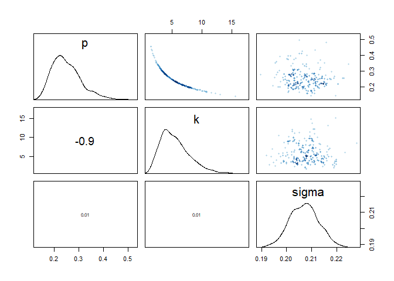
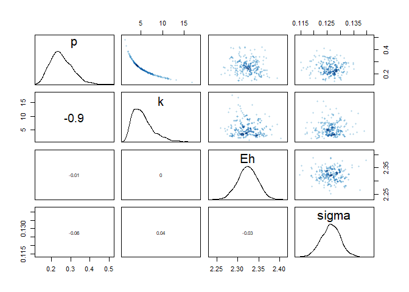

08\_03\_2020\_HW
================
John D.
8/3/2020

``` r
library(rethinking)
```

    ## Loading required package: rstan

    ## Warning: package 'rstan' was built under R version 3.6.3

    ## Loading required package: StanHeaders

    ## Loading required package: ggplot2

    ## Warning: package 'ggplot2' was built under R version 3.6.3

    ## rstan (Version 2.19.3, GitRev: 2e1f913d3ca3)

    ## For execution on a local, multicore CPU with excess RAM we recommend calling
    ## options(mc.cores = parallel::detectCores()).
    ## To avoid recompilation of unchanged Stan programs, we recommend calling
    ## rstan_options(auto_write = TRUE)

    ## For improved execution time, we recommend calling
    ## Sys.setenv(LOCAL_CPPFLAGS = '-march=corei7 -mtune=corei7')
    ## although this causes Stan to throw an error on a few processors.

    ## Loading required package: parallel

    ## Loading required package: dagitty

    ## rethinking (Version 1.93)

    ## 
    ## Attaching package: 'rethinking'

    ## The following object is masked from 'package:stats':
    ## 
    ##     rstudent

``` r
library(tidyverse)
```

    ## -- Attaching packages -------------------------------------------------------------------------------------------------- tidyverse 1.3.0 --

    ## v tibble  3.0.1     v dplyr   0.8.5
    ## v tidyr   1.0.2     v stringr 1.4.0
    ## v readr   1.3.1     v forcats 0.5.0
    ## v purrr   0.3.4

    ## Warning: package 'tibble' was built under R version 3.6.3

    ## Warning: package 'tidyr' was built under R version 3.6.3

    ## Warning: package 'purrr' was built under R version 3.6.3

    ## Warning: package 'dplyr' was built under R version 3.6.3

    ## Warning: package 'forcats' was built under R version 3.6.3

    ## -- Conflicts ----------------------------------------------------------------------------------------------------- tidyverse_conflicts() --
    ## x tidyr::extract() masks rstan::extract()
    ## x dplyr::filter()  masks stats::filter()
    ## x dplyr::lag()     masks stats::lag()
    ## x purrr::map()     masks rethinking::map()

## 16M1. Modify the cylinder height model, m16.1, so that the exponent 3 on height is instead a free parameter. Do you recover the value of 3 or not? Plot the posterior predictions for the new model. How do they differ from those of m16.1?

``` r
## Load data
data(Howell1)
d <- Howell1
# scale observed variables
d$w <- d$weight / mean(d$weight)
d$h <- d$height / mean(d$height)
```

``` r
## Original Model
m16.1a <- ulam(
  alist(
    w ~ dlnorm(mu , sigma),
    exp(mu) <- 3.141593 * k * p ^ 2 * h ^ 3,
    p ~ beta(2 , 18),
    k ~ exponential(0.5),
    sigma ~ exponential(1)
  ),
  data = d ,
  chains = 4 ,
  cores = 4,
  log_lik = T
)
```

    ## Warning: Bulk Effective Samples Size (ESS) is too low, indicating posterior means and medians may be unreliable.
    ## Running the chains for more iterations may help. See
    ## http://mc-stan.org/misc/warnings.html#bulk-ess

    ## Warning: Tail Effective Samples Size (ESS) is too low, indicating posterior variances and tail quantiles may be unreliable.
    ## Running the chains for more iterations may help. See
    ## http://mc-stan.org/misc/warnings.html#tail-ess

``` r
precis(m16.1a)
```

    ##            mean          sd      5.5%      94.5%    n_eff     Rhat
    ## p     0.2517248 0.060211978 0.1721307  0.3639156 329.9949 1.015505
    ## k     5.5630019 2.518713517 2.2832027 10.1518833 428.4080 1.009558
    ## sigma 0.2070639 0.005852414 0.1980889  0.2163873 739.5409 1.005520

``` r
## New Model
m16.1b <- ulam(
  alist(
    w ~ dlnorm(mu , sigma),
    exp(mu) <- 3.141593 * k * p ^ 2 * h ^ Eh,
    p ~ beta(2 , 18),
    k ~ exponential(0.5),
    Eh ~ exponential(0.5),
    sigma ~ exponential(1)
  ),
  data = d ,
  chains = 4 ,
  cores = 4,
  log_lik = T
)
```

    ## Warning: There were 107 transitions after warmup that exceeded the maximum treedepth. Increase max_treedepth above 10. See
    ## http://mc-stan.org/misc/warnings.html#maximum-treedepth-exceeded

    ## Warning: Examine the pairs() plot to diagnose sampling problems

``` r
precis(m16.1b)
```

    ##            mean          sd      5.5%      94.5%     n_eff      Rhat
    ## p     0.2512206 0.057237640 0.1687049  0.3491563  661.5537 1.0086733
    ## k     5.4730553 2.567988616 2.4335659 10.4201155  738.5031 1.0112659
    ## Eh    2.3237372 0.023803478 2.2847455  2.3607121 1099.8490 1.0016537
    ## sigma 0.1263703 0.003740173 0.1204418  0.1321198 1067.5654 0.9999969

``` r
## Another New Model
m16.1c <- ulam(
  alist(
    w ~ dlnorm(mu , sigma),
    exp(mu) <- 3.141593 * k * p ^ 2 * h ^ Eh,
    p ~ beta(2 , 18),
    k ~ exponential(0.5),
    Eh ~ exponential(1),
    sigma ~ exponential(1)
  ),
  data = d ,
  chains = 4 ,
  cores = 4,
  log_lik = T
)
```

    ## Warning: There were 16 transitions after warmup that exceeded the maximum treedepth. Increase max_treedepth above 10. See
    ## http://mc-stan.org/misc/warnings.html#maximum-treedepth-exceeded

    ## Warning: Examine the pairs() plot to diagnose sampling problems

``` r
precis(m16.1c)
```

    ##            mean          sd      5.5%      94.5%     n_eff     Rhat
    ## p     0.2476321 0.057160022 0.1700603  0.3482451  535.8402 1.003097
    ## k     5.6467943 2.683431415 2.4357626 10.2584831  513.4808 1.003652
    ## Eh    2.3239558 0.022067721 2.2866931  2.3588594 1335.5203 1.005234
    ## sigma 0.1263214 0.003858231 0.1201024  0.1328191  891.4315 1.002275

``` r
## Yet Another New Model
m16.1d <- ulam(
  alist(
    w ~ dlnorm(mu , sigma),
    exp(mu) <- 3.141593 * k * p ^ 2 * h ^ Eh,
    p ~ beta(2 , 18),
    k ~ exponential(0.5),
    Eh ~ normal(0, 2),
    sigma ~ exponential(1)
  ),
  data = d ,
  chains = 4 ,
  cores = 4,
  log_lik = T
)
```

    ## Warning: There were 14 transitions after warmup that exceeded the maximum treedepth. Increase max_treedepth above 10. See
    ## http://mc-stan.org/misc/warnings.html#maximum-treedepth-exceeded

    ## Warning: Examine the pairs() plot to diagnose sampling problems

``` r
precis(m16.1d)
```

    ##            mean          sd      5.5%      94.5%     n_eff     Rhat
    ## p     0.2485984 0.059449330 0.1667801  0.3513017  647.9015 1.005213
    ## k     5.6573559 2.771295340 2.4041397 10.6300573  755.2114 1.004444
    ## Eh    2.3229951 0.021937253 2.2891437  2.3588417 1227.5661 1.001718
    ## sigma 0.1265336 0.003841366 0.1206535  0.1329997  990.1033 1.004740

``` r
compare(m16.1a, m16.1b, m16.1c, m16.1d)
```

    ##             WAIC       SE        dWAIC        dSE    pWAIC        weight
    ## m16.1d -845.6805 36.81803   0.00000000         NA 3.386634  3.502294e-01
    ## m16.1c -845.6537 36.87470   0.02676618  0.1933745 3.425393  3.455735e-01
    ## m16.1b -845.3986 36.83972   0.28182476  0.1850370 3.601137  3.041971e-01
    ## m16.1a -310.7397 44.06396 534.94073411 54.5470677 3.535243 2.417954e-117

``` r
pairs(m16.1a)
```

<!-- -->

``` r
pairs(m16.1b)
```

<!-- -->

``` r
par(mfrow = c(1,2))
h_seq <- seq( from=0 , to=max(d$h) , length.out=30 )
w_sim <- sim( m16.1a , data=list(h=h_seq) )
mu_mean <- apply( w_sim , 2 , mean )
w_CI <- apply( w_sim , 2 , PI )
plot( d$h , d$w , xlim=c(0,max(d$h)) , ylim=c(0,max(d$w)) , col=rangi2 ,
lwd=2 , xlab="height (scaled)" , ylab="weight (scaled)" )
lines( h_seq , mu_mean )
shade( w_CI , h_seq )

h_seq <- seq( from=0 , to=max(d$h) , length.out=30 )
w_sim <- sim( m16.1b , data=list(h=h_seq) )
mu_mean <- apply( w_sim , 2 , mean )
w_CI <- apply( w_sim , 2 , PI )
plot( d$h , d$w , xlim=c(0,max(d$h)) , ylim=c(0,max(d$w)) , col=rangi2 ,
lwd=2 , xlab="height (scaled)" , ylab="weight (scaled)" )
lines( h_seq , mu_mean )
shade( w_CI , h_seq )
```

<!-- -->

Did not get 3 back but a value closer to 2.32. It also appears to handle
the short values better and tall values worse. This model probably needs
to factor in age or be splines for different height rangles.

## 16M2. Conduct a prior predictive simulation for the cylinder height model. Begin with the priors in the chapter. Do these produce reasonable prior height distributions? If not, which modifications do you suggest?

This part is coveredi n 16.3.2 of the book

``` r
par(mfrow = c(1,2))
N <- 1e4
p <- rbeta(N, 2 , 18)
k <- rexp(N, 0.5)

# Prior relative height to weight curve
plot(
  d$h,
  d$w,
  xlim = c(0, max(d$h)) ,
  ylim = c(0, max(d$w)),
  xlab = "height (scaled)",
  ylab = "weight (scaled)"
)
for (i in 1:100)
  curve(
    exp(log(k[i]) + log(3.141593) + 2*log(p[i]) + 3*log(x)),
    add = TRUE ,
    col = grau() ,
    lwd = 1.5
    
  )
```

    ## Warning in log(x): NaNs produced
    
    ## Warning in log(x): NaNs produced
    
    ## Warning in log(x): NaNs produced
    
    ## Warning in log(x): NaNs produced
    
    ## Warning in log(x): NaNs produced
    
    ## Warning in log(x): NaNs produced
    
    ## Warning in log(x): NaNs produced
    
    ## Warning in log(x): NaNs produced
    
    ## Warning in log(x): NaNs produced
    
    ## Warning in log(x): NaNs produced
    
    ## Warning in log(x): NaNs produced
    
    ## Warning in log(x): NaNs produced
    
    ## Warning in log(x): NaNs produced
    
    ## Warning in log(x): NaNs produced
    
    ## Warning in log(x): NaNs produced
    
    ## Warning in log(x): NaNs produced
    
    ## Warning in log(x): NaNs produced
    
    ## Warning in log(x): NaNs produced
    
    ## Warning in log(x): NaNs produced
    
    ## Warning in log(x): NaNs produced
    
    ## Warning in log(x): NaNs produced
    
    ## Warning in log(x): NaNs produced
    
    ## Warning in log(x): NaNs produced
    
    ## Warning in log(x): NaNs produced
    
    ## Warning in log(x): NaNs produced
    
    ## Warning in log(x): NaNs produced
    
    ## Warning in log(x): NaNs produced
    
    ## Warning in log(x): NaNs produced
    
    ## Warning in log(x): NaNs produced
    
    ## Warning in log(x): NaNs produced
    
    ## Warning in log(x): NaNs produced
    
    ## Warning in log(x): NaNs produced
    
    ## Warning in log(x): NaNs produced
    
    ## Warning in log(x): NaNs produced
    
    ## Warning in log(x): NaNs produced
    
    ## Warning in log(x): NaNs produced
    
    ## Warning in log(x): NaNs produced
    
    ## Warning in log(x): NaNs produced
    
    ## Warning in log(x): NaNs produced
    
    ## Warning in log(x): NaNs produced
    
    ## Warning in log(x): NaNs produced
    
    ## Warning in log(x): NaNs produced
    
    ## Warning in log(x): NaNs produced
    
    ## Warning in log(x): NaNs produced
    
    ## Warning in log(x): NaNs produced
    
    ## Warning in log(x): NaNs produced
    
    ## Warning in log(x): NaNs produced
    
    ## Warning in log(x): NaNs produced
    
    ## Warning in log(x): NaNs produced
    
    ## Warning in log(x): NaNs produced
    
    ## Warning in log(x): NaNs produced
    
    ## Warning in log(x): NaNs produced
    
    ## Warning in log(x): NaNs produced
    
    ## Warning in log(x): NaNs produced
    
    ## Warning in log(x): NaNs produced
    
    ## Warning in log(x): NaNs produced
    
    ## Warning in log(x): NaNs produced
    
    ## Warning in log(x): NaNs produced
    
    ## Warning in log(x): NaNs produced
    
    ## Warning in log(x): NaNs produced
    
    ## Warning in log(x): NaNs produced
    
    ## Warning in log(x): NaNs produced
    
    ## Warning in log(x): NaNs produced
    
    ## Warning in log(x): NaNs produced
    
    ## Warning in log(x): NaNs produced
    
    ## Warning in log(x): NaNs produced
    
    ## Warning in log(x): NaNs produced
    
    ## Warning in log(x): NaNs produced
    
    ## Warning in log(x): NaNs produced
    
    ## Warning in log(x): NaNs produced
    
    ## Warning in log(x): NaNs produced
    
    ## Warning in log(x): NaNs produced
    
    ## Warning in log(x): NaNs produced
    
    ## Warning in log(x): NaNs produced
    
    ## Warning in log(x): NaNs produced
    
    ## Warning in log(x): NaNs produced
    
    ## Warning in log(x): NaNs produced
    
    ## Warning in log(x): NaNs produced
    
    ## Warning in log(x): NaNs produced
    
    ## Warning in log(x): NaNs produced
    
    ## Warning in log(x): NaNs produced
    
    ## Warning in log(x): NaNs produced
    
    ## Warning in log(x): NaNs produced
    
    ## Warning in log(x): NaNs produced
    
    ## Warning in log(x): NaNs produced
    
    ## Warning in log(x): NaNs produced
    
    ## Warning in log(x): NaNs produced
    
    ## Warning in log(x): NaNs produced
    
    ## Warning in log(x): NaNs produced
    
    ## Warning in log(x): NaNs produced
    
    ## Warning in log(x): NaNs produced
    
    ## Warning in log(x): NaNs produced
    
    ## Warning in log(x): NaNs produced
    
    ## Warning in log(x): NaNs produced
    
    ## Warning in log(x): NaNs produced
    
    ## Warning in log(x): NaNs produced
    
    ## Warning in log(x): NaNs produced
    
    ## Warning in log(x): NaNs produced
    
    ## Warning in log(x): NaNs produced
    
    ## Warning in log(x): NaNs produced

``` r
# Posterior relative height to weight curve
h_seq <- seq( from=0 , to=max(d$h) , length.out=30 )
w_sim <- sim( m16.1a , data=list(h=h_seq) )
mu_mean <- apply( w_sim , 2 , mean )
w_CI <- apply( w_sim , 2 , PI )
plot( d$h , d$w , xlim=c(0,max(d$h)) , ylim=c(0,max(d$w)) , col=rangi2 ,
lwd=2 , xlab="height (scaled)" , ylab="weight (scaled)" )
lines( h_seq , mu_mean )
shade( w_CI , h_seq )
```

<!-- -->

Probably larger k

``` r
par(mfrow = c(1,2))
N <- 1e4
p <- rbeta(N, 2 , 18)
k <- rexp(N, 0.1)

# Prior relative height to weight curve
plot(
  d$h,
  d$w,
  xlim = c(0, max(d$h)) ,
  ylim = c(0, max(d$w)),
  xlab = "height (scaled)",
  ylab = "weight (scaled)"
)
for (i in 1:100)
  curve(
    exp(log(k[i]) + log(3.141593) + 2*log(p[i]) + 3*log(x)),
    add = TRUE ,
    col = grau() ,
    lwd = 1.5
    
  )
```

    ## Warning in log(x): NaNs produced
    
    ## Warning in log(x): NaNs produced
    
    ## Warning in log(x): NaNs produced
    
    ## Warning in log(x): NaNs produced
    
    ## Warning in log(x): NaNs produced
    
    ## Warning in log(x): NaNs produced
    
    ## Warning in log(x): NaNs produced
    
    ## Warning in log(x): NaNs produced
    
    ## Warning in log(x): NaNs produced
    
    ## Warning in log(x): NaNs produced
    
    ## Warning in log(x): NaNs produced
    
    ## Warning in log(x): NaNs produced
    
    ## Warning in log(x): NaNs produced
    
    ## Warning in log(x): NaNs produced
    
    ## Warning in log(x): NaNs produced
    
    ## Warning in log(x): NaNs produced
    
    ## Warning in log(x): NaNs produced
    
    ## Warning in log(x): NaNs produced
    
    ## Warning in log(x): NaNs produced
    
    ## Warning in log(x): NaNs produced
    
    ## Warning in log(x): NaNs produced
    
    ## Warning in log(x): NaNs produced
    
    ## Warning in log(x): NaNs produced
    
    ## Warning in log(x): NaNs produced
    
    ## Warning in log(x): NaNs produced
    
    ## Warning in log(x): NaNs produced
    
    ## Warning in log(x): NaNs produced
    
    ## Warning in log(x): NaNs produced
    
    ## Warning in log(x): NaNs produced
    
    ## Warning in log(x): NaNs produced
    
    ## Warning in log(x): NaNs produced
    
    ## Warning in log(x): NaNs produced
    
    ## Warning in log(x): NaNs produced
    
    ## Warning in log(x): NaNs produced
    
    ## Warning in log(x): NaNs produced
    
    ## Warning in log(x): NaNs produced
    
    ## Warning in log(x): NaNs produced
    
    ## Warning in log(x): NaNs produced
    
    ## Warning in log(x): NaNs produced
    
    ## Warning in log(x): NaNs produced
    
    ## Warning in log(x): NaNs produced
    
    ## Warning in log(x): NaNs produced
    
    ## Warning in log(x): NaNs produced
    
    ## Warning in log(x): NaNs produced
    
    ## Warning in log(x): NaNs produced
    
    ## Warning in log(x): NaNs produced
    
    ## Warning in log(x): NaNs produced
    
    ## Warning in log(x): NaNs produced
    
    ## Warning in log(x): NaNs produced
    
    ## Warning in log(x): NaNs produced
    
    ## Warning in log(x): NaNs produced
    
    ## Warning in log(x): NaNs produced
    
    ## Warning in log(x): NaNs produced
    
    ## Warning in log(x): NaNs produced
    
    ## Warning in log(x): NaNs produced
    
    ## Warning in log(x): NaNs produced
    
    ## Warning in log(x): NaNs produced
    
    ## Warning in log(x): NaNs produced
    
    ## Warning in log(x): NaNs produced
    
    ## Warning in log(x): NaNs produced
    
    ## Warning in log(x): NaNs produced
    
    ## Warning in log(x): NaNs produced
    
    ## Warning in log(x): NaNs produced
    
    ## Warning in log(x): NaNs produced
    
    ## Warning in log(x): NaNs produced
    
    ## Warning in log(x): NaNs produced
    
    ## Warning in log(x): NaNs produced
    
    ## Warning in log(x): NaNs produced
    
    ## Warning in log(x): NaNs produced
    
    ## Warning in log(x): NaNs produced
    
    ## Warning in log(x): NaNs produced
    
    ## Warning in log(x): NaNs produced
    
    ## Warning in log(x): NaNs produced
    
    ## Warning in log(x): NaNs produced
    
    ## Warning in log(x): NaNs produced
    
    ## Warning in log(x): NaNs produced
    
    ## Warning in log(x): NaNs produced
    
    ## Warning in log(x): NaNs produced
    
    ## Warning in log(x): NaNs produced
    
    ## Warning in log(x): NaNs produced
    
    ## Warning in log(x): NaNs produced
    
    ## Warning in log(x): NaNs produced
    
    ## Warning in log(x): NaNs produced
    
    ## Warning in log(x): NaNs produced
    
    ## Warning in log(x): NaNs produced
    
    ## Warning in log(x): NaNs produced
    
    ## Warning in log(x): NaNs produced
    
    ## Warning in log(x): NaNs produced
    
    ## Warning in log(x): NaNs produced
    
    ## Warning in log(x): NaNs produced
    
    ## Warning in log(x): NaNs produced
    
    ## Warning in log(x): NaNs produced
    
    ## Warning in log(x): NaNs produced
    
    ## Warning in log(x): NaNs produced
    
    ## Warning in log(x): NaNs produced
    
    ## Warning in log(x): NaNs produced
    
    ## Warning in log(x): NaNs produced
    
    ## Warning in log(x): NaNs produced
    
    ## Warning in log(x): NaNs produced
    
    ## Warning in log(x): NaNs produced

``` r
# Posterior relative height to weight curve
h_seq <- seq( from=0 , to=max(d$h) , length.out=30 )
w_sim <- sim( m16.1a , data=list(h=h_seq) )
mu_mean <- apply( w_sim , 2 , mean )
w_CI <- apply( w_sim , 2 , PI )
plot( d$h , d$w , xlim=c(0,max(d$h)) , ylim=c(0,max(d$w)) , col=rangi2 ,
lwd=2 , xlab="height (scaled)" , ylab="weight (scaled)" )
lines( h_seq , mu_mean )
shade( w_CI , h_seq )
```

<!-- -->

Larger for both

``` r
par(mfrow = c(1,2))
N <- 1e4
p <- rbeta(N, 2 , 5)
k <- rexp(N, 0.2)

# Prior relative height to weight curve
plot(
  d$h,
  d$w,
  xlim = c(0, max(d$h)) ,
  ylim = c(0, max(d$w)),
  xlab = "height (scaled)",
  ylab = "weight (scaled)"
)
for (i in 1:100)
  curve(
    exp(log(k[i]) + log(3.141593) + 2*log(p[i]) + 3*log(x)),
    add = TRUE ,
    col = grau() ,
    lwd = 1.5
    
  )
```

    ## Warning in log(x): NaNs produced
    
    ## Warning in log(x): NaNs produced
    
    ## Warning in log(x): NaNs produced
    
    ## Warning in log(x): NaNs produced
    
    ## Warning in log(x): NaNs produced
    
    ## Warning in log(x): NaNs produced
    
    ## Warning in log(x): NaNs produced
    
    ## Warning in log(x): NaNs produced
    
    ## Warning in log(x): NaNs produced
    
    ## Warning in log(x): NaNs produced
    
    ## Warning in log(x): NaNs produced
    
    ## Warning in log(x): NaNs produced
    
    ## Warning in log(x): NaNs produced
    
    ## Warning in log(x): NaNs produced
    
    ## Warning in log(x): NaNs produced
    
    ## Warning in log(x): NaNs produced
    
    ## Warning in log(x): NaNs produced
    
    ## Warning in log(x): NaNs produced
    
    ## Warning in log(x): NaNs produced
    
    ## Warning in log(x): NaNs produced
    
    ## Warning in log(x): NaNs produced
    
    ## Warning in log(x): NaNs produced
    
    ## Warning in log(x): NaNs produced
    
    ## Warning in log(x): NaNs produced
    
    ## Warning in log(x): NaNs produced
    
    ## Warning in log(x): NaNs produced
    
    ## Warning in log(x): NaNs produced
    
    ## Warning in log(x): NaNs produced
    
    ## Warning in log(x): NaNs produced
    
    ## Warning in log(x): NaNs produced
    
    ## Warning in log(x): NaNs produced
    
    ## Warning in log(x): NaNs produced
    
    ## Warning in log(x): NaNs produced
    
    ## Warning in log(x): NaNs produced
    
    ## Warning in log(x): NaNs produced
    
    ## Warning in log(x): NaNs produced
    
    ## Warning in log(x): NaNs produced
    
    ## Warning in log(x): NaNs produced
    
    ## Warning in log(x): NaNs produced
    
    ## Warning in log(x): NaNs produced
    
    ## Warning in log(x): NaNs produced
    
    ## Warning in log(x): NaNs produced
    
    ## Warning in log(x): NaNs produced
    
    ## Warning in log(x): NaNs produced
    
    ## Warning in log(x): NaNs produced
    
    ## Warning in log(x): NaNs produced
    
    ## Warning in log(x): NaNs produced
    
    ## Warning in log(x): NaNs produced
    
    ## Warning in log(x): NaNs produced
    
    ## Warning in log(x): NaNs produced
    
    ## Warning in log(x): NaNs produced
    
    ## Warning in log(x): NaNs produced
    
    ## Warning in log(x): NaNs produced
    
    ## Warning in log(x): NaNs produced
    
    ## Warning in log(x): NaNs produced
    
    ## Warning in log(x): NaNs produced
    
    ## Warning in log(x): NaNs produced
    
    ## Warning in log(x): NaNs produced
    
    ## Warning in log(x): NaNs produced
    
    ## Warning in log(x): NaNs produced
    
    ## Warning in log(x): NaNs produced
    
    ## Warning in log(x): NaNs produced
    
    ## Warning in log(x): NaNs produced
    
    ## Warning in log(x): NaNs produced
    
    ## Warning in log(x): NaNs produced
    
    ## Warning in log(x): NaNs produced
    
    ## Warning in log(x): NaNs produced
    
    ## Warning in log(x): NaNs produced
    
    ## Warning in log(x): NaNs produced
    
    ## Warning in log(x): NaNs produced
    
    ## Warning in log(x): NaNs produced
    
    ## Warning in log(x): NaNs produced
    
    ## Warning in log(x): NaNs produced
    
    ## Warning in log(x): NaNs produced
    
    ## Warning in log(x): NaNs produced
    
    ## Warning in log(x): NaNs produced
    
    ## Warning in log(x): NaNs produced
    
    ## Warning in log(x): NaNs produced
    
    ## Warning in log(x): NaNs produced
    
    ## Warning in log(x): NaNs produced
    
    ## Warning in log(x): NaNs produced
    
    ## Warning in log(x): NaNs produced
    
    ## Warning in log(x): NaNs produced
    
    ## Warning in log(x): NaNs produced
    
    ## Warning in log(x): NaNs produced
    
    ## Warning in log(x): NaNs produced
    
    ## Warning in log(x): NaNs produced
    
    ## Warning in log(x): NaNs produced
    
    ## Warning in log(x): NaNs produced
    
    ## Warning in log(x): NaNs produced
    
    ## Warning in log(x): NaNs produced
    
    ## Warning in log(x): NaNs produced
    
    ## Warning in log(x): NaNs produced
    
    ## Warning in log(x): NaNs produced
    
    ## Warning in log(x): NaNs produced
    
    ## Warning in log(x): NaNs produced
    
    ## Warning in log(x): NaNs produced
    
    ## Warning in log(x): NaNs produced
    
    ## Warning in log(x): NaNs produced
    
    ## Warning in log(x): NaNs produced

``` r
# Posterior relative height to weight curve
h_seq <- seq( from=0 , to=max(d$h) , length.out=30 )
w_sim <- sim( m16.1a , data=list(h=h_seq) )
mu_mean <- apply( w_sim , 2 , mean )
w_CI <- apply( w_sim , 2 , PI )
plot( d$h , d$w , xlim=c(0,max(d$h)) , ylim=c(0,max(d$w)) , col=rangi2 ,
lwd=2 , xlab="height (scaled)" , ylab="weight (scaled)" )
lines( h_seq , mu_mean )
shade( w_CI , h_seq )
```

<!-- -->
