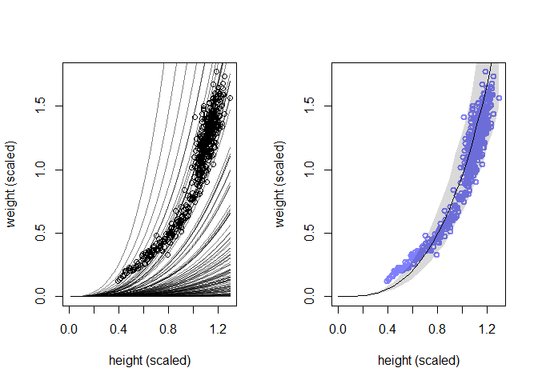

08\_03\_2020\_HW
================
John D.
8/3/2020

``` r
library(rethinking)
```

    ## Loading required package: rstan

    ## Warning: package 'rstan' was built under R version 3.6.3

    ## Loading required package: StanHeaders

    ## Loading required package: ggplot2

    ## Warning: package 'ggplot2' was built under R version 3.6.3

    ## rstan (Version 2.19.3, GitRev: 2e1f913d3ca3)

    ## For execution on a local, multicore CPU with excess RAM we recommend calling
    ## options(mc.cores = parallel::detectCores()).
    ## To avoid recompilation of unchanged Stan programs, we recommend calling
    ## rstan_options(auto_write = TRUE)

    ## For improved execution time, we recommend calling
    ## Sys.setenv(LOCAL_CPPFLAGS = '-march=corei7 -mtune=corei7')
    ## although this causes Stan to throw an error on a few processors.

    ## Loading required package: parallel

    ## Loading required package: dagitty

    ## rethinking (Version 1.93)

    ## 
    ## Attaching package: 'rethinking'

    ## The following object is masked from 'package:stats':
    ## 
    ##     rstudent

``` r
library(tidyverse)
```

    ## -- Attaching packages ------------------------- tidyverse 1.3.0 --

    ## v tibble  3.0.1     v dplyr   0.8.5
    ## v tidyr   1.0.2     v stringr 1.4.0
    ## v readr   1.3.1     v forcats 0.5.0
    ## v purrr   0.3.4

    ## Warning: package 'tibble' was built under R version 3.6.3

    ## Warning: package 'tidyr' was built under R version 3.6.3

    ## Warning: package 'purrr' was built under R version 3.6.3

    ## Warning: package 'dplyr' was built under R version 3.6.3

    ## Warning: package 'forcats' was built under R version 3.6.3

    ## -- Conflicts ---------------------------- tidyverse_conflicts() --
    ## x tidyr::extract() masks rstan::extract()
    ## x dplyr::filter()  masks stats::filter()
    ## x dplyr::lag()     masks stats::lag()
    ## x purrr::map()     masks rethinking::map()

## 16M1. Modify the cylinder height model, m16.1, so that the exponent 3 on height is instead a free parameter. Do you recover the value of 3 or not? Plot the posterior predictions for the new model. How do they differ from those of m16.1?

``` r
## Load data
data(Howell1)
d <- Howell1
# scale observed variables
d$w <- d$weight / mean(d$weight)
d$h <- d$height / mean(d$height)
```

``` r
## Original Model
m16.1a <- ulam(
  alist(
    w ~ dlnorm(mu , sigma),
    exp(mu) <- 3.141593 * k * p ^ 2 * h ^ 3,
    p ~ beta(2 , 18),
    k ~ exponential(0.5),
    sigma ~ exponential(1)
  ),
  data = d ,
  chains = 4 ,
  cores = 4,
  log_lik = T
)

precis(m16.1a)
```

    ##            mean          sd      5.5%      94.5%    n_eff     Rhat
    ## p     0.2458750 0.056986164 0.1696906  0.3511003 420.9069 1.004787
    ## k     5.8050780 2.657309362 2.4543822 10.4825218 454.5429 1.005936
    ## sigma 0.2068889 0.006386222 0.1969255  0.2172512 548.6233 1.002671

``` r
## New Model
m16.1b <- ulam(
  alist(
    w ~ dlnorm(mu , sigma),
    exp(mu) <- 3.141593 * k * p ^ 2 * h ^ Eh,
    p ~ beta(2 , 18),
    k ~ exponential(0.5),
    Eh ~ exponential(0.5),
    sigma ~ exponential(1)
  ),
  data = d ,
  chains = 4 ,
  cores = 4,
  log_lik = T
)
```

    ## Warning: There were 15 transitions after warmup that exceeded the maximum treedepth. Increase max_treedepth above 10. See
    ## http://mc-stan.org/misc/warnings.html#maximum-treedepth-exceeded

    ## Warning: Examine the pairs() plot to diagnose sampling problems

``` r
precis(m16.1b)
```

    ##            mean          sd      5.5%      94.5%     n_eff      Rhat
    ## p     0.2458340 0.058855468 0.1663551  0.3507966  626.6805 1.0040073
    ## k     5.7699020 2.712879866 2.4232536 10.7189993  716.9759 1.0032956
    ## Eh    2.3237990 0.022856738 2.2850112  2.3583368 1038.2539 1.0010011
    ## sigma 0.1263028 0.003971492 0.1199798  0.1326773 1145.1409 0.9998621

``` r
## Another New Model
m16.1c <- ulam(
  alist(
    w ~ dlnorm(mu , sigma),
    exp(mu) <- 3.141593 * k * p ^ 2 * h ^ Eh,
    p ~ beta(2 , 18),
    k ~ exponential(0.5),
    Eh ~ exponential(1),
    sigma ~ exponential(1)
  ),
  data = d ,
  chains = 4 ,
  cores = 4,
  log_lik = T
)
```

    ## Warning: There were 34 transitions after warmup that exceeded the maximum treedepth. Increase max_treedepth above 10. See
    ## http://mc-stan.org/misc/warnings.html#maximum-treedepth-exceeded

    ## Warning: Examine the pairs() plot to diagnose sampling problems

``` r
precis(m16.1c)
```

    ##            mean          sd      5.5%      94.5%     n_eff      Rhat
    ## p     0.2500603 0.059916600 0.1678862  0.3569617  644.0098 1.0006884
    ## k     5.6054446 2.748356251 2.3198719 10.5439846  698.0102 1.0006771
    ## Eh    2.3240401 0.022206052 2.2880793  2.3587853 1197.2941 1.0001666
    ## sigma 0.1264851 0.003849381 0.1204690  0.1327094 1294.0916 0.9995698

``` r
## Yet Another New Model
m16.1d <- ulam(
  alist(
    w ~ dlnorm(mu , sigma),
    exp(mu) <- 3.141593 * k * p ^ 2 * h ^ Eh,
    p ~ beta(2 , 18),
    k ~ exponential(0.5),
    Eh ~ normal(0, 2),
    sigma ~ exponential(1)
  ),
  data = d ,
  chains = 4 ,
  cores = 4,
  log_lik = T
)
```

    ## Warning: There were 15 transitions after warmup that exceeded the maximum treedepth. Increase max_treedepth above 10. See
    ## http://mc-stan.org/misc/warnings.html#maximum-treedepth-exceeded

    ## Warning: Examine the pairs() plot to diagnose sampling problems

``` r
precis(m16.1d)
```

    ##            mean          sd      5.5%      94.5%     n_eff     Rhat
    ## p     0.2430031 0.057043054 0.1668069  0.3451401  751.3756 1.004341
    ## k     5.8381976 2.621179101 2.4831826 10.6922828  758.8265 1.007767
    ## Eh    2.3251626 0.022469473 2.2893991  2.3601594 1237.9835 1.000090
    ## sigma 0.1262684 0.003876096 0.1202861  0.1327021 1068.8557 1.005049

``` r
compare(m16.1a, m16.1b, m16.1c, m16.1d)
```

    ##             WAIC       SE        dWAIC        dSE    pWAIC        weight
    ## m16.1d -845.5910 36.87240 0.000000e+00         NA 3.486775  3.458667e-01
    ## m16.1c -845.5899 36.80748 1.105125e-03  0.2637544 3.457730  3.456757e-01
    ## m16.1b -845.3621 36.89606 2.289385e-01  0.2414280 3.593050  3.084576e-01
    ## m16.1a -310.1414 44.26250 5.354496e+02 54.5178039 3.974019 1.851404e-117

``` r
pairs(m16.1a)
```

<!-- -->

``` r
pairs(m16.1b)
```

<!-- -->

``` r
par(mfrow = c(1,2))
h_seq <- seq( from=0 , to=max(d$h) , length.out=30 )
w_sim <- sim( m16.1a , data=list(h=h_seq) )
mu_mean <- apply( w_sim , 2 , mean )
w_CI <- apply( w_sim , 2 , PI )
plot( d$h , d$w , xlim=c(0,max(d$h)) , ylim=c(0,max(d$w)) , col=rangi2 ,
lwd=2 , xlab="height (scaled)" , ylab="weight (scaled)" )
lines( h_seq , mu_mean )
shade( w_CI , h_seq )

h_seq <- seq( from=0 , to=max(d$h) , length.out=30 )
w_sim <- sim( m16.1b , data=list(h=h_seq) )
mu_mean <- apply( w_sim , 2 , mean )
w_CI <- apply( w_sim , 2 , PI )
plot( d$h , d$w , xlim=c(0,max(d$h)) , ylim=c(0,max(d$w)) , col=rangi2 ,
lwd=2 , xlab="height (scaled)" , ylab="weight (scaled)" )
lines( h_seq , mu_mean )
shade( w_CI , h_seq )
```

<!-- -->

Did not get 3 back but a value closer to 2.32. It also appears to handle
the short values better and tall values worse. This model probably needs
to factor in age or be splines for different height rangles.

## 16M2. Conduct a prior predictive simulation for the cylinder height model. Begin with the priors in the chapter. Do these produce reasonable prior height distributions? If not, which modifications do you suggest?

This part is coveredi n 16.3.2 of the book

``` r
N <- 1e4
p <- rbeta(N, 2 , 18)
k <- rexp(N, 0.5)

# Prior relative height to weight curve
plot(
  d$h,
  d$w,
  xlim = c(0, max(d$h)) ,
  ylim = c(0, max(d$w)),
  xlab = "height (scaled)",
  ylab = "weight (scaled)"
)
for (i in 1:100)
  curve(
    exp(log(k[i]) + log(3.141593) + 2*log(p[i]) + 3*log(x)),
    add = TRUE ,
    col = grau() ,
    lwd = 1.5
    
  )
```

    ## Warning in log(x): NaNs produced
    
    ## Warning in log(x): NaNs produced
    
    ## Warning in log(x): NaNs produced
    
    ## Warning in log(x): NaNs produced
    
    ## Warning in log(x): NaNs produced
    
    ## Warning in log(x): NaNs produced
    
    ## Warning in log(x): NaNs produced
    
    ## Warning in log(x): NaNs produced
    
    ## Warning in log(x): NaNs produced
    
    ## Warning in log(x): NaNs produced
    
    ## Warning in log(x): NaNs produced
    
    ## Warning in log(x): NaNs produced
    
    ## Warning in log(x): NaNs produced
    
    ## Warning in log(x): NaNs produced
    
    ## Warning in log(x): NaNs produced
    
    ## Warning in log(x): NaNs produced
    
    ## Warning in log(x): NaNs produced
    
    ## Warning in log(x): NaNs produced
    
    ## Warning in log(x): NaNs produced
    
    ## Warning in log(x): NaNs produced
    
    ## Warning in log(x): NaNs produced
    
    ## Warning in log(x): NaNs produced
    
    ## Warning in log(x): NaNs produced
    
    ## Warning in log(x): NaNs produced
    
    ## Warning in log(x): NaNs produced
    
    ## Warning in log(x): NaNs produced
    
    ## Warning in log(x): NaNs produced
    
    ## Warning in log(x): NaNs produced
    
    ## Warning in log(x): NaNs produced
    
    ## Warning in log(x): NaNs produced
    
    ## Warning in log(x): NaNs produced
    
    ## Warning in log(x): NaNs produced
    
    ## Warning in log(x): NaNs produced
    
    ## Warning in log(x): NaNs produced
    
    ## Warning in log(x): NaNs produced
    
    ## Warning in log(x): NaNs produced
    
    ## Warning in log(x): NaNs produced
    
    ## Warning in log(x): NaNs produced
    
    ## Warning in log(x): NaNs produced
    
    ## Warning in log(x): NaNs produced
    
    ## Warning in log(x): NaNs produced
    
    ## Warning in log(x): NaNs produced
    
    ## Warning in log(x): NaNs produced
    
    ## Warning in log(x): NaNs produced
    
    ## Warning in log(x): NaNs produced
    
    ## Warning in log(x): NaNs produced
    
    ## Warning in log(x): NaNs produced
    
    ## Warning in log(x): NaNs produced
    
    ## Warning in log(x): NaNs produced
    
    ## Warning in log(x): NaNs produced
    
    ## Warning in log(x): NaNs produced
    
    ## Warning in log(x): NaNs produced
    
    ## Warning in log(x): NaNs produced
    
    ## Warning in log(x): NaNs produced
    
    ## Warning in log(x): NaNs produced
    
    ## Warning in log(x): NaNs produced
    
    ## Warning in log(x): NaNs produced
    
    ## Warning in log(x): NaNs produced
    
    ## Warning in log(x): NaNs produced
    
    ## Warning in log(x): NaNs produced
    
    ## Warning in log(x): NaNs produced
    
    ## Warning in log(x): NaNs produced
    
    ## Warning in log(x): NaNs produced
    
    ## Warning in log(x): NaNs produced
    
    ## Warning in log(x): NaNs produced
    
    ## Warning in log(x): NaNs produced
    
    ## Warning in log(x): NaNs produced
    
    ## Warning in log(x): NaNs produced
    
    ## Warning in log(x): NaNs produced
    
    ## Warning in log(x): NaNs produced
    
    ## Warning in log(x): NaNs produced
    
    ## Warning in log(x): NaNs produced
    
    ## Warning in log(x): NaNs produced
    
    ## Warning in log(x): NaNs produced
    
    ## Warning in log(x): NaNs produced
    
    ## Warning in log(x): NaNs produced
    
    ## Warning in log(x): NaNs produced
    
    ## Warning in log(x): NaNs produced
    
    ## Warning in log(x): NaNs produced
    
    ## Warning in log(x): NaNs produced
    
    ## Warning in log(x): NaNs produced
    
    ## Warning in log(x): NaNs produced
    
    ## Warning in log(x): NaNs produced
    
    ## Warning in log(x): NaNs produced
    
    ## Warning in log(x): NaNs produced
    
    ## Warning in log(x): NaNs produced
    
    ## Warning in log(x): NaNs produced
    
    ## Warning in log(x): NaNs produced
    
    ## Warning in log(x): NaNs produced
    
    ## Warning in log(x): NaNs produced
    
    ## Warning in log(x): NaNs produced
    
    ## Warning in log(x): NaNs produced
    
    ## Warning in log(x): NaNs produced
    
    ## Warning in log(x): NaNs produced
    
    ## Warning in log(x): NaNs produced
    
    ## Warning in log(x): NaNs produced
    
    ## Warning in log(x): NaNs produced
    
    ## Warning in log(x): NaNs produced
    
    ## Warning in log(x): NaNs produced
    
    ## Warning in log(x): NaNs produced

<!-- -->

``` r
# Posterior relative height to weight curve
h_seq <- seq( from=0 , to=max(d$h) , length.out=30 )
w_sim <- sim( m16.1a , data=list(h=h_seq) )
mu_mean <- apply( w_sim , 2 , mean )
w_CI <- apply( w_sim , 2 , PI )
plot( d$h , d$w , xlim=c(0,max(d$h)) , ylim=c(0,max(d$w)) , col=rangi2 ,
lwd=2 , xlab="height (scaled)" , ylab="weight (scaled)" )
lines( h_seq , mu_mean )
shade( w_CI , h_seq )
```

<!-- -->

Probably larger k

``` r
N <- 1e4
p <- rbeta(N, 2 , 18)
k <- rexp(N, 0.1)

# Prior relative height to weight curve
plot(
  d$h,
  d$w,
  xlim = c(0, max(d$h)) ,
  ylim = c(0, max(d$w)),
  xlab = "height (scaled)",
  ylab = "weight (scaled)"
)
for (i in 1:100)
  curve(
    exp(log(k[i]) + log(3.141593) + 2*log(p[i]) + 3*log(x)),
    add = TRUE ,
    col = grau() ,
    lwd = 1.5
    
  )
```

    ## Warning in log(x): NaNs produced
    
    ## Warning in log(x): NaNs produced
    
    ## Warning in log(x): NaNs produced
    
    ## Warning in log(x): NaNs produced
    
    ## Warning in log(x): NaNs produced
    
    ## Warning in log(x): NaNs produced
    
    ## Warning in log(x): NaNs produced
    
    ## Warning in log(x): NaNs produced
    
    ## Warning in log(x): NaNs produced
    
    ## Warning in log(x): NaNs produced
    
    ## Warning in log(x): NaNs produced
    
    ## Warning in log(x): NaNs produced
    
    ## Warning in log(x): NaNs produced
    
    ## Warning in log(x): NaNs produced
    
    ## Warning in log(x): NaNs produced
    
    ## Warning in log(x): NaNs produced
    
    ## Warning in log(x): NaNs produced
    
    ## Warning in log(x): NaNs produced
    
    ## Warning in log(x): NaNs produced
    
    ## Warning in log(x): NaNs produced
    
    ## Warning in log(x): NaNs produced
    
    ## Warning in log(x): NaNs produced
    
    ## Warning in log(x): NaNs produced
    
    ## Warning in log(x): NaNs produced
    
    ## Warning in log(x): NaNs produced
    
    ## Warning in log(x): NaNs produced
    
    ## Warning in log(x): NaNs produced
    
    ## Warning in log(x): NaNs produced
    
    ## Warning in log(x): NaNs produced
    
    ## Warning in log(x): NaNs produced
    
    ## Warning in log(x): NaNs produced
    
    ## Warning in log(x): NaNs produced
    
    ## Warning in log(x): NaNs produced
    
    ## Warning in log(x): NaNs produced
    
    ## Warning in log(x): NaNs produced
    
    ## Warning in log(x): NaNs produced
    
    ## Warning in log(x): NaNs produced
    
    ## Warning in log(x): NaNs produced
    
    ## Warning in log(x): NaNs produced
    
    ## Warning in log(x): NaNs produced
    
    ## Warning in log(x): NaNs produced
    
    ## Warning in log(x): NaNs produced
    
    ## Warning in log(x): NaNs produced
    
    ## Warning in log(x): NaNs produced
    
    ## Warning in log(x): NaNs produced
    
    ## Warning in log(x): NaNs produced
    
    ## Warning in log(x): NaNs produced
    
    ## Warning in log(x): NaNs produced
    
    ## Warning in log(x): NaNs produced
    
    ## Warning in log(x): NaNs produced
    
    ## Warning in log(x): NaNs produced
    
    ## Warning in log(x): NaNs produced
    
    ## Warning in log(x): NaNs produced
    
    ## Warning in log(x): NaNs produced
    
    ## Warning in log(x): NaNs produced
    
    ## Warning in log(x): NaNs produced
    
    ## Warning in log(x): NaNs produced
    
    ## Warning in log(x): NaNs produced
    
    ## Warning in log(x): NaNs produced
    
    ## Warning in log(x): NaNs produced
    
    ## Warning in log(x): NaNs produced
    
    ## Warning in log(x): NaNs produced
    
    ## Warning in log(x): NaNs produced
    
    ## Warning in log(x): NaNs produced
    
    ## Warning in log(x): NaNs produced
    
    ## Warning in log(x): NaNs produced
    
    ## Warning in log(x): NaNs produced
    
    ## Warning in log(x): NaNs produced
    
    ## Warning in log(x): NaNs produced
    
    ## Warning in log(x): NaNs produced
    
    ## Warning in log(x): NaNs produced
    
    ## Warning in log(x): NaNs produced
    
    ## Warning in log(x): NaNs produced
    
    ## Warning in log(x): NaNs produced
    
    ## Warning in log(x): NaNs produced
    
    ## Warning in log(x): NaNs produced
    
    ## Warning in log(x): NaNs produced
    
    ## Warning in log(x): NaNs produced
    
    ## Warning in log(x): NaNs produced
    
    ## Warning in log(x): NaNs produced
    
    ## Warning in log(x): NaNs produced
    
    ## Warning in log(x): NaNs produced
    
    ## Warning in log(x): NaNs produced
    
    ## Warning in log(x): NaNs produced
    
    ## Warning in log(x): NaNs produced
    
    ## Warning in log(x): NaNs produced
    
    ## Warning in log(x): NaNs produced
    
    ## Warning in log(x): NaNs produced
    
    ## Warning in log(x): NaNs produced
    
    ## Warning in log(x): NaNs produced
    
    ## Warning in log(x): NaNs produced
    
    ## Warning in log(x): NaNs produced
    
    ## Warning in log(x): NaNs produced
    
    ## Warning in log(x): NaNs produced
    
    ## Warning in log(x): NaNs produced
    
    ## Warning in log(x): NaNs produced
    
    ## Warning in log(x): NaNs produced
    
    ## Warning in log(x): NaNs produced
    
    ## Warning in log(x): NaNs produced
    
    ## Warning in log(x): NaNs produced

<!-- -->

``` r
# Posterior relative height to weight curve
h_seq <- seq( from=0 , to=max(d$h) , length.out=30 )
w_sim <- sim( m16.1a , data=list(h=h_seq) )
mu_mean <- apply( w_sim , 2 , mean )
w_CI <- apply( w_sim , 2 , PI )
plot( d$h , d$w , xlim=c(0,max(d$h)) , ylim=c(0,max(d$w)) , col=rangi2 ,
lwd=2 , xlab="height (scaled)" , ylab="weight (scaled)" )
lines( h_seq , mu_mean )
shade( w_CI , h_seq )
```

<!-- -->
