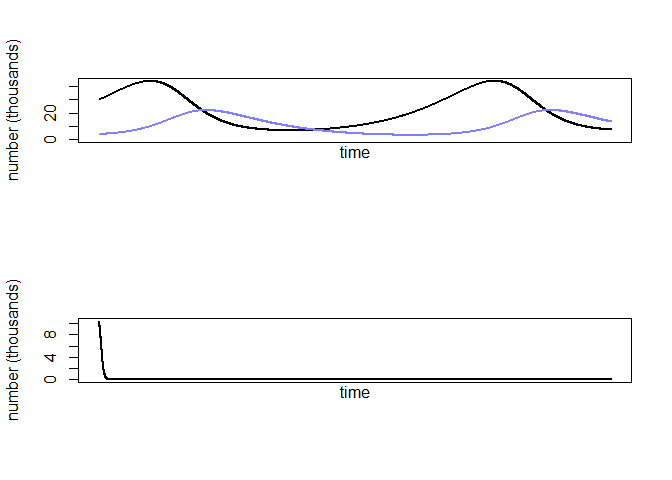
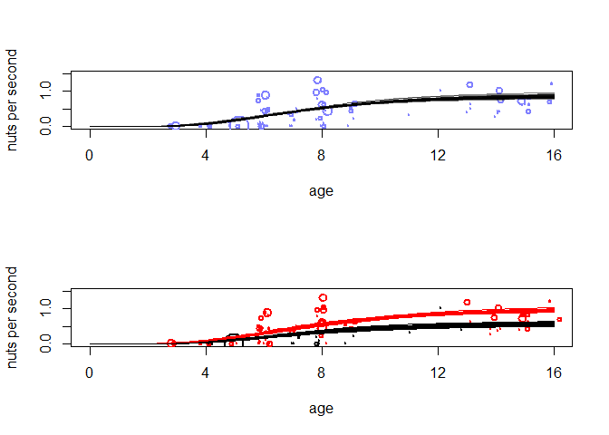

08\_10\_2020\_HW
================
John D.
8/10/2020

``` r
library(rethinking)
```

    ## Loading required package: rstan

    ## Warning: package 'rstan' was built under R version 3.6.3

    ## Loading required package: StanHeaders

    ## Loading required package: ggplot2

    ## Warning: package 'ggplot2' was built under R version 3.6.3

    ## rstan (Version 2.19.3, GitRev: 2e1f913d3ca3)

    ## For execution on a local, multicore CPU with excess RAM we recommend calling
    ## options(mc.cores = parallel::detectCores()).
    ## To avoid recompilation of unchanged Stan programs, we recommend calling
    ## rstan_options(auto_write = TRUE)

    ## For improved execution time, we recommend calling
    ## Sys.setenv(LOCAL_CPPFLAGS = '-march=corei7 -mtune=corei7')
    ## although this causes Stan to throw an error on a few processors.

    ## Loading required package: parallel

    ## Loading required package: dagitty

    ## rethinking (Version 1.93)

    ## 
    ## Attaching package: 'rethinking'

    ## The following object is masked from 'package:stats':
    ## 
    ##     rstudent

``` r
library(tidyverse)
```

    ## -- Attaching packages ------------------------- tidyverse 1.3.0 --

    ## v tibble  3.0.3     v dplyr   1.0.1
    ## v tidyr   1.1.1     v stringr 1.4.0
    ## v readr   1.3.1     v forcats 0.5.0
    ## v purrr   0.3.4

    ## Warning: package 'tibble' was built under R version 3.6.3

    ## Warning: package 'tidyr' was built under R version 3.6.3

    ## Warning: package 'purrr' was built under R version 3.6.3

    ## Warning: package 'dplyr' was built under R version 3.6.3

    ## Warning: package 'forcats' was built under R version 3.6.3

    ## -- Conflicts ---------------------------- tidyverse_conflicts() --
    ## x tidyr::extract() masks rstan::extract()
    ## x dplyr::filter()  masks stats::filter()
    ## x dplyr::lag()     masks stats::lag()
    ## x purrr::map()     masks rethinking::map()

## 16M3. Use prior predictive simulations to investigate the Lynx-hare model. Begin with the priors in the chapter. Which population dynamics do these produce? Can you suggest any improvements to the priors, on the basis of your simulations?

``` r
data("Lynx_Hare")
d <- Lynx_Hare

sim_lynx_hare <- function(n_steps , init , theta , dt = 0.002) {
  L <- rep(NA, n_steps)
  H <- rep(NA, n_steps)
  L[1] <- init[1]
  H[1] <- init[2]
  for (i in 2:n_steps) {
    H[i] <- H[i - 1] + dt * H[i - 1] * (theta[1] - theta[2] * L[i - 1])
    L[i] <- L[i - 1] + dt * L[i - 1] * (theta[3] * H[i - 1] - theta[4])
  }
  return(cbind(L, H))
}

theta <- c(0.5 , 0.05 , 0.025 , 0.5)
z <- sim_lynx_hare(1e4 , as.numeric(Lynx_Hare[1, 2:3]) , theta)

z_pred <- sim_lynx_hare(n_steps = 1e4,
                        init = c(
                          rlnorm(1, log(10)), #hare
                          rlnorm(1, log(10)) # lynx
                        ),
                        theta = c(abs(rnorm(1, 1, 0.5)),
                                  abs(rnorm(1, 0.05, 0.05)),
                                  abs(rnorm(1, 1, 0.5)),
                                  abs(rnorm(1, 0.05, 0.05))),
                        dt = 0.002
)
```

``` r
par(mfrow=c(2,1))
plot(
  z[, 2] ,
  type = "l" ,
  ylim = c(0, max(z[, 2], na.rm = T)) ,
  lwd = 2 ,
  xaxt = "n" ,
  ylab = "number (thousands)" ,
  xlab = ""
)
lines(z[, 1] , col = rangi2 , lwd = 2)
mtext("time" , 1)

plot(
  z_pred[, 2] ,
  type = "l" ,
  ylim = c(0, max(z_pred[, 2], na.rm = T)) ,
  lwd = 2 ,
  xaxt = "n" ,
  ylab = "number (thousands)" ,
  xlab = ""
)
lines(z_pred[, 1] , col = rangi2 , lwd = 2)
mtext("time" , 1)
```

<!-- -->

Something ain’t right

## 16H1. Modify the Panda nut opening model so that male and female chimpanzees have different maximum adult body mass. The sex variable in data(Panda\_nuts) provides the information you need. Be sure to incorporate the fact that you know, prior to seeing the data, that males are on average larger than females at maturity.

``` r
data(Panda_nuts)
dat_list <- list(
  n = as.integer(Panda_nuts$nuts_opened),
  age = Panda_nuts$age / max(Panda_nuts$age),
  seconds = Panda_nuts$seconds,
  sex = Panda_nuts$sex
)

m16.4 <- ulam(
  alist(
    n ~ poisson(lambda),
    lambda <- seconds * phi * (1 - exp(-k * age)) ^ theta,
    phi ~ lognormal(log(1) , 0.1),
    k ~ lognormal(log(2) , 0.25),
    theta ~ lognormal(log(5) , 0.25)
  ),
  data = dat_list ,
  chains = 4,
  log_lik = T
) 
```

    ## 
    ## SAMPLING FOR MODEL '8d6c0630e303e98c2638b0e5097ece2e' NOW (CHAIN 1).
    ## Chain 1: 
    ## Chain 1: Gradient evaluation took 0 seconds
    ## Chain 1: 1000 transitions using 10 leapfrog steps per transition would take 0 seconds.
    ## Chain 1: Adjust your expectations accordingly!
    ## Chain 1: 
    ## Chain 1: 
    ## Chain 1: Iteration:   1 / 1000 [  0%]  (Warmup)
    ## Chain 1: Iteration: 100 / 1000 [ 10%]  (Warmup)
    ## Chain 1: Iteration: 200 / 1000 [ 20%]  (Warmup)
    ## Chain 1: Iteration: 300 / 1000 [ 30%]  (Warmup)
    ## Chain 1: Iteration: 400 / 1000 [ 40%]  (Warmup)
    ## Chain 1: Iteration: 500 / 1000 [ 50%]  (Warmup)
    ## Chain 1: Iteration: 501 / 1000 [ 50%]  (Sampling)
    ## Chain 1: Iteration: 600 / 1000 [ 60%]  (Sampling)
    ## Chain 1: Iteration: 700 / 1000 [ 70%]  (Sampling)
    ## Chain 1: Iteration: 800 / 1000 [ 80%]  (Sampling)
    ## Chain 1: Iteration: 900 / 1000 [ 90%]  (Sampling)
    ## Chain 1: Iteration: 1000 / 1000 [100%]  (Sampling)
    ## Chain 1: 
    ## Chain 1:  Elapsed Time: 0.314 seconds (Warm-up)
    ## Chain 1:                0.288 seconds (Sampling)
    ## Chain 1:                0.602 seconds (Total)
    ## Chain 1: 
    ## 
    ## SAMPLING FOR MODEL '8d6c0630e303e98c2638b0e5097ece2e' NOW (CHAIN 2).
    ## Chain 2: 
    ## Chain 2: Gradient evaluation took 0 seconds
    ## Chain 2: 1000 transitions using 10 leapfrog steps per transition would take 0 seconds.
    ## Chain 2: Adjust your expectations accordingly!
    ## Chain 2: 
    ## Chain 2: 
    ## Chain 2: Iteration:   1 / 1000 [  0%]  (Warmup)
    ## Chain 2: Iteration: 100 / 1000 [ 10%]  (Warmup)
    ## Chain 2: Iteration: 200 / 1000 [ 20%]  (Warmup)
    ## Chain 2: Iteration: 300 / 1000 [ 30%]  (Warmup)
    ## Chain 2: Iteration: 400 / 1000 [ 40%]  (Warmup)
    ## Chain 2: Iteration: 500 / 1000 [ 50%]  (Warmup)
    ## Chain 2: Iteration: 501 / 1000 [ 50%]  (Sampling)
    ## Chain 2: Iteration: 600 / 1000 [ 60%]  (Sampling)
    ## Chain 2: Iteration: 700 / 1000 [ 70%]  (Sampling)
    ## Chain 2: Iteration: 800 / 1000 [ 80%]  (Sampling)
    ## Chain 2: Iteration: 900 / 1000 [ 90%]  (Sampling)
    ## Chain 2: Iteration: 1000 / 1000 [100%]  (Sampling)
    ## Chain 2: 
    ## Chain 2:  Elapsed Time: 0.351 seconds (Warm-up)
    ## Chain 2:                0.304 seconds (Sampling)
    ## Chain 2:                0.655 seconds (Total)
    ## Chain 2: 
    ## 
    ## SAMPLING FOR MODEL '8d6c0630e303e98c2638b0e5097ece2e' NOW (CHAIN 3).
    ## Chain 3: 
    ## Chain 3: Gradient evaluation took 0 seconds
    ## Chain 3: 1000 transitions using 10 leapfrog steps per transition would take 0 seconds.
    ## Chain 3: Adjust your expectations accordingly!
    ## Chain 3: 
    ## Chain 3: 
    ## Chain 3: Iteration:   1 / 1000 [  0%]  (Warmup)
    ## Chain 3: Iteration: 100 / 1000 [ 10%]  (Warmup)
    ## Chain 3: Iteration: 200 / 1000 [ 20%]  (Warmup)
    ## Chain 3: Iteration: 300 / 1000 [ 30%]  (Warmup)
    ## Chain 3: Iteration: 400 / 1000 [ 40%]  (Warmup)
    ## Chain 3: Iteration: 500 / 1000 [ 50%]  (Warmup)
    ## Chain 3: Iteration: 501 / 1000 [ 50%]  (Sampling)
    ## Chain 3: Iteration: 600 / 1000 [ 60%]  (Sampling)
    ## Chain 3: Iteration: 700 / 1000 [ 70%]  (Sampling)
    ## Chain 3: Iteration: 800 / 1000 [ 80%]  (Sampling)
    ## Chain 3: Iteration: 900 / 1000 [ 90%]  (Sampling)
    ## Chain 3: Iteration: 1000 / 1000 [100%]  (Sampling)
    ## Chain 3: 
    ## Chain 3:  Elapsed Time: 0.368 seconds (Warm-up)
    ## Chain 3:                0.319 seconds (Sampling)
    ## Chain 3:                0.687 seconds (Total)
    ## Chain 3: 
    ## 
    ## SAMPLING FOR MODEL '8d6c0630e303e98c2638b0e5097ece2e' NOW (CHAIN 4).
    ## Chain 4: 
    ## Chain 4: Gradient evaluation took 0 seconds
    ## Chain 4: 1000 transitions using 10 leapfrog steps per transition would take 0 seconds.
    ## Chain 4: Adjust your expectations accordingly!
    ## Chain 4: 
    ## Chain 4: 
    ## Chain 4: Iteration:   1 / 1000 [  0%]  (Warmup)
    ## Chain 4: Iteration: 100 / 1000 [ 10%]  (Warmup)
    ## Chain 4: Iteration: 200 / 1000 [ 20%]  (Warmup)
    ## Chain 4: Iteration: 300 / 1000 [ 30%]  (Warmup)
    ## Chain 4: Iteration: 400 / 1000 [ 40%]  (Warmup)
    ## Chain 4: Iteration: 500 / 1000 [ 50%]  (Warmup)
    ## Chain 4: Iteration: 501 / 1000 [ 50%]  (Sampling)
    ## Chain 4: Iteration: 600 / 1000 [ 60%]  (Sampling)
    ## Chain 4: Iteration: 700 / 1000 [ 70%]  (Sampling)
    ## Chain 4: Iteration: 800 / 1000 [ 80%]  (Sampling)
    ## Chain 4: Iteration: 900 / 1000 [ 90%]  (Sampling)
    ## Chain 4: Iteration: 1000 / 1000 [100%]  (Sampling)
    ## Chain 4: 
    ## Chain 4:  Elapsed Time: 0.311 seconds (Warm-up)
    ## Chain 4:                0.24 seconds (Sampling)
    ## Chain 4:                0.551 seconds (Total)
    ## Chain 4:

``` r
m16.4.sex <- ulam(
  alist(
    n ~ poisson(lambda),
    lambda <- seconds * phi[sex] * (1 - exp(-k * age)) ^ theta,
    phi[sex] ~ lognormal(log(1) , 0.1),
    k ~ lognormal(log(2) , 0.25),
    theta ~ lognormal(log(5) , 0.25)
  ),
  data = dat_list ,
  chains = 4,
  log_lik = T
)
```

    ## 
    ## SAMPLING FOR MODEL '5c2f4e56a2904eafe17c8cd65278251a' NOW (CHAIN 1).
    ## Chain 1: 
    ## Chain 1: Gradient evaluation took 0 seconds
    ## Chain 1: 1000 transitions using 10 leapfrog steps per transition would take 0 seconds.
    ## Chain 1: Adjust your expectations accordingly!
    ## Chain 1: 
    ## Chain 1: 
    ## Chain 1: Iteration:   1 / 1000 [  0%]  (Warmup)
    ## Chain 1: Iteration: 100 / 1000 [ 10%]  (Warmup)
    ## Chain 1: Iteration: 200 / 1000 [ 20%]  (Warmup)
    ## Chain 1: Iteration: 300 / 1000 [ 30%]  (Warmup)
    ## Chain 1: Iteration: 400 / 1000 [ 40%]  (Warmup)
    ## Chain 1: Iteration: 500 / 1000 [ 50%]  (Warmup)
    ## Chain 1: Iteration: 501 / 1000 [ 50%]  (Sampling)
    ## Chain 1: Iteration: 600 / 1000 [ 60%]  (Sampling)
    ## Chain 1: Iteration: 700 / 1000 [ 70%]  (Sampling)
    ## Chain 1: Iteration: 800 / 1000 [ 80%]  (Sampling)
    ## Chain 1: Iteration: 900 / 1000 [ 90%]  (Sampling)
    ## Chain 1: Iteration: 1000 / 1000 [100%]  (Sampling)
    ## Chain 1: 
    ## Chain 1:  Elapsed Time: 0.464 seconds (Warm-up)
    ## Chain 1:                0.432 seconds (Sampling)
    ## Chain 1:                0.896 seconds (Total)
    ## Chain 1: 
    ## 
    ## SAMPLING FOR MODEL '5c2f4e56a2904eafe17c8cd65278251a' NOW (CHAIN 2).
    ## Chain 2: 
    ## Chain 2: Gradient evaluation took 0 seconds
    ## Chain 2: 1000 transitions using 10 leapfrog steps per transition would take 0 seconds.
    ## Chain 2: Adjust your expectations accordingly!
    ## Chain 2: 
    ## Chain 2: 
    ## Chain 2: Iteration:   1 / 1000 [  0%]  (Warmup)
    ## Chain 2: Iteration: 100 / 1000 [ 10%]  (Warmup)
    ## Chain 2: Iteration: 200 / 1000 [ 20%]  (Warmup)
    ## Chain 2: Iteration: 300 / 1000 [ 30%]  (Warmup)
    ## Chain 2: Iteration: 400 / 1000 [ 40%]  (Warmup)
    ## Chain 2: Iteration: 500 / 1000 [ 50%]  (Warmup)
    ## Chain 2: Iteration: 501 / 1000 [ 50%]  (Sampling)
    ## Chain 2: Iteration: 600 / 1000 [ 60%]  (Sampling)
    ## Chain 2: Iteration: 700 / 1000 [ 70%]  (Sampling)
    ## Chain 2: Iteration: 800 / 1000 [ 80%]  (Sampling)
    ## Chain 2: Iteration: 900 / 1000 [ 90%]  (Sampling)
    ## Chain 2: Iteration: 1000 / 1000 [100%]  (Sampling)
    ## Chain 2: 
    ## Chain 2:  Elapsed Time: 0.431 seconds (Warm-up)
    ## Chain 2:                0.353 seconds (Sampling)
    ## Chain 2:                0.784 seconds (Total)
    ## Chain 2: 
    ## 
    ## SAMPLING FOR MODEL '5c2f4e56a2904eafe17c8cd65278251a' NOW (CHAIN 3).
    ## Chain 3: 
    ## Chain 3: Gradient evaluation took 0 seconds
    ## Chain 3: 1000 transitions using 10 leapfrog steps per transition would take 0 seconds.
    ## Chain 3: Adjust your expectations accordingly!
    ## Chain 3: 
    ## Chain 3: 
    ## Chain 3: Iteration:   1 / 1000 [  0%]  (Warmup)
    ## Chain 3: Iteration: 100 / 1000 [ 10%]  (Warmup)
    ## Chain 3: Iteration: 200 / 1000 [ 20%]  (Warmup)
    ## Chain 3: Iteration: 300 / 1000 [ 30%]  (Warmup)
    ## Chain 3: Iteration: 400 / 1000 [ 40%]  (Warmup)
    ## Chain 3: Iteration: 500 / 1000 [ 50%]  (Warmup)
    ## Chain 3: Iteration: 501 / 1000 [ 50%]  (Sampling)
    ## Chain 3: Iteration: 600 / 1000 [ 60%]  (Sampling)
    ## Chain 3: Iteration: 700 / 1000 [ 70%]  (Sampling)
    ## Chain 3: Iteration: 800 / 1000 [ 80%]  (Sampling)
    ## Chain 3: Iteration: 900 / 1000 [ 90%]  (Sampling)
    ## Chain 3: Iteration: 1000 / 1000 [100%]  (Sampling)
    ## Chain 3: 
    ## Chain 3:  Elapsed Time: 0.432 seconds (Warm-up)
    ## Chain 3:                0.432 seconds (Sampling)
    ## Chain 3:                0.864 seconds (Total)
    ## Chain 3: 
    ## 
    ## SAMPLING FOR MODEL '5c2f4e56a2904eafe17c8cd65278251a' NOW (CHAIN 4).
    ## Chain 4: 
    ## Chain 4: Gradient evaluation took 0 seconds
    ## Chain 4: 1000 transitions using 10 leapfrog steps per transition would take 0 seconds.
    ## Chain 4: Adjust your expectations accordingly!
    ## Chain 4: 
    ## Chain 4: 
    ## Chain 4: Iteration:   1 / 1000 [  0%]  (Warmup)
    ## Chain 4: Iteration: 100 / 1000 [ 10%]  (Warmup)
    ## Chain 4: Iteration: 200 / 1000 [ 20%]  (Warmup)
    ## Chain 4: Iteration: 300 / 1000 [ 30%]  (Warmup)
    ## Chain 4: Iteration: 400 / 1000 [ 40%]  (Warmup)
    ## Chain 4: Iteration: 500 / 1000 [ 50%]  (Warmup)
    ## Chain 4: Iteration: 501 / 1000 [ 50%]  (Sampling)
    ## Chain 4: Iteration: 600 / 1000 [ 60%]  (Sampling)
    ## Chain 4: Iteration: 700 / 1000 [ 70%]  (Sampling)
    ## Chain 4: Iteration: 800 / 1000 [ 80%]  (Sampling)
    ## Chain 4: Iteration: 900 / 1000 [ 90%]  (Sampling)
    ## Chain 4: Iteration: 1000 / 1000 [100%]  (Sampling)
    ## Chain 4: 
    ## Chain 4:  Elapsed Time: 0.451 seconds (Warm-up)
    ## Chain 4:                0.366 seconds (Sampling)
    ## Chain 4:                0.817 seconds (Total)
    ## Chain 4:

``` r
#phi is max rate, so I guess change max rate based on sex

compare(m16.4, m16.4.sex)
```

    ##               WAIC       SE    dWAIC      dSE    pWAIC       weight
    ## m16.4.sex 764.9406 85.41002  0.00000       NA 21.58417 1.000000e+00
    ## m16.4     819.5877 99.10805 54.64716 26.32048 18.13081 1.359942e-12

``` r
precis(m16.4)
```

    ##            mean         sd      5.5%      94.5%    n_eff     Rhat
    ## phi   0.8671223 0.03859566 0.8071118  0.9294077 768.0820 1.003093
    ## k     5.9480137 0.53020331 5.1036132  6.7931002 608.0721 1.008374
    ## theta 9.7495770 1.89831230 7.0343932 12.8644198 619.4905 1.009994

``` r
levels(Panda_nuts$sex)
```

    ## [1] "f" "m"

``` r
precis(m16.4.sex, depth = 2)
```

    ##             mean         sd      5.5%      94.5%     n_eff      Rhat
    ## phi[1] 0.5910832 0.04705762 0.5174991  0.6688081 1117.8078 0.9983666
    ## phi[2] 0.9963029 0.05176243 0.9203662  1.0809043  783.8620 0.9993560
    ## k      5.2013611 0.62765816 4.1690897  6.1669769  619.4046 1.0012974
    ## theta  7.6943557 1.78850729 5.1521312 10.6601812  666.0513 1.0006496

``` r
par(mfrow = c(2, 1))
post <- extract.samples(m16.4)
plot(
  NULL ,
  xlim = c(0, 1) ,
  ylim = c(0, 1.5) ,
  xlab = "age" ,
  ylab = "nuts per second" ,
  xaxt = "n"
)
at <- c(0, 0.25, 0.5, 0.75, 1, 1.25, 1.5)
axis(1 , at = at , labels = round(at * max(Panda_nuts$age)))
# raw data
pts <- dat_list$n / dat_list$seconds
point_size <- normalize(dat_list$seconds)
points(
  jitter(dat_list$age) ,
  pts ,
  col = rangi2 ,
  lwd = 2 ,
  cex = point_size * 3
)
# 30 posterior curves
for (i in 1:30)
  with(post ,
       curve(phi[i] * (1 - exp(-k[i] * x)) ^ theta[i] , add = TRUE , col = grau()))

post <- extract.samples(m16.4.sex)
plot(
  NULL ,
  xlim = c(0, 1) ,
  ylim = c(0, 1.5) ,
  xlab = "age" ,
  ylab = "nuts per second" ,
  xaxt = "n"
)
at <- c(0, 0.25, 0.5, 0.75, 1, 1.25, 1.5)
axis(1 , at = at , labels = round(at * max(Panda_nuts$age)))
# raw data
pts <- dat_list$n / dat_list$seconds
point_size <- normalize(dat_list$seconds)
points(
  jitter(dat_list$age) ,
  pts ,
  col = Panda_nuts$sex ,
  lwd = 2 ,
  cex = point_size * 3,
)
# 30 posterior curves
for (i in 1:30) {
  with(post ,
       curve(phi[i, 2] * (1 - exp(-k[i] * x)) ^ theta[i] , add = TRUE , col = "red"))
  with(post ,
       curve(phi[i, 1] * (1 - exp(-k[i] * x)) ^ theta[i] , add = TRUE , col = "black"))
}
```

<!-- -->

I assume this sets the female max rate lower than male.

## 16H2. Now return to the Panda nut model and try to incorporate individual differences. There are two parameters, ϕ and k, which plausibly vary by individual. Pick one of these, allow it to vary by individual, and use partial pooling to avoid overfitting. The variable chimpanzee in data(Panda\_nuts) tells you which observations belong to which individuals.

``` r
dat_list <- list(
  n = as.integer(Panda_nuts$nuts_opened),
  age = Panda_nuts$age / max(Panda_nuts$age),
  seconds = Panda_nuts$seconds,
  sex = Panda_nuts$sex,
  ind = Panda_nuts$chimpanzee
)
m16.4.ind <- ulam(
  alist(
    n ~ poisson(lambda),
    lambda <- seconds * phi[ind] * (1 - exp(-k * age)) ^ theta,
    phi[ind] ~ lognormal(log(1) , 0.1),
    k ~ lognormal(log(2) , 0.25),
    theta ~ lognormal(log(5) , 0.25)
  ),
  data = dat_list ,
  chains = 4,
  log_lik = T
)
```

    ## 
    ## SAMPLING FOR MODEL 'c06ce5de0e874c01e4d2b5c79e3dd7d8' NOW (CHAIN 1).
    ## Chain 1: 
    ## Chain 1: Gradient evaluation took 0 seconds
    ## Chain 1: 1000 transitions using 10 leapfrog steps per transition would take 0 seconds.
    ## Chain 1: Adjust your expectations accordingly!
    ## Chain 1: 
    ## Chain 1: 
    ## Chain 1: Iteration:   1 / 1000 [  0%]  (Warmup)
    ## Chain 1: Iteration: 100 / 1000 [ 10%]  (Warmup)
    ## Chain 1: Iteration: 200 / 1000 [ 20%]  (Warmup)
    ## Chain 1: Iteration: 300 / 1000 [ 30%]  (Warmup)
    ## Chain 1: Iteration: 400 / 1000 [ 40%]  (Warmup)
    ## Chain 1: Iteration: 500 / 1000 [ 50%]  (Warmup)
    ## Chain 1: Iteration: 501 / 1000 [ 50%]  (Sampling)
    ## Chain 1: Iteration: 600 / 1000 [ 60%]  (Sampling)
    ## Chain 1: Iteration: 700 / 1000 [ 70%]  (Sampling)
    ## Chain 1: Iteration: 800 / 1000 [ 80%]  (Sampling)
    ## Chain 1: Iteration: 900 / 1000 [ 90%]  (Sampling)
    ## Chain 1: Iteration: 1000 / 1000 [100%]  (Sampling)
    ## Chain 1: 
    ## Chain 1:  Elapsed Time: 0.603 seconds (Warm-up)
    ## Chain 1:                0.523 seconds (Sampling)
    ## Chain 1:                1.126 seconds (Total)
    ## Chain 1: 
    ## 
    ## SAMPLING FOR MODEL 'c06ce5de0e874c01e4d2b5c79e3dd7d8' NOW (CHAIN 2).
    ## Chain 2: 
    ## Chain 2: Gradient evaluation took 0 seconds
    ## Chain 2: 1000 transitions using 10 leapfrog steps per transition would take 0 seconds.
    ## Chain 2: Adjust your expectations accordingly!
    ## Chain 2: 
    ## Chain 2: 
    ## Chain 2: Iteration:   1 / 1000 [  0%]  (Warmup)
    ## Chain 2: Iteration: 100 / 1000 [ 10%]  (Warmup)
    ## Chain 2: Iteration: 200 / 1000 [ 20%]  (Warmup)
    ## Chain 2: Iteration: 300 / 1000 [ 30%]  (Warmup)
    ## Chain 2: Iteration: 400 / 1000 [ 40%]  (Warmup)
    ## Chain 2: Iteration: 500 / 1000 [ 50%]  (Warmup)
    ## Chain 2: Iteration: 501 / 1000 [ 50%]  (Sampling)
    ## Chain 2: Iteration: 600 / 1000 [ 60%]  (Sampling)
    ## Chain 2: Iteration: 700 / 1000 [ 70%]  (Sampling)
    ## Chain 2: Iteration: 800 / 1000 [ 80%]  (Sampling)
    ## Chain 2: Iteration: 900 / 1000 [ 90%]  (Sampling)
    ## Chain 2: Iteration: 1000 / 1000 [100%]  (Sampling)
    ## Chain 2: 
    ## Chain 2:  Elapsed Time: 0.64 seconds (Warm-up)
    ## Chain 2:                0.525 seconds (Sampling)
    ## Chain 2:                1.165 seconds (Total)
    ## Chain 2: 
    ## 
    ## SAMPLING FOR MODEL 'c06ce5de0e874c01e4d2b5c79e3dd7d8' NOW (CHAIN 3).
    ## Chain 3: 
    ## Chain 3: Gradient evaluation took 0 seconds
    ## Chain 3: 1000 transitions using 10 leapfrog steps per transition would take 0 seconds.
    ## Chain 3: Adjust your expectations accordingly!
    ## Chain 3: 
    ## Chain 3: 
    ## Chain 3: Iteration:   1 / 1000 [  0%]  (Warmup)
    ## Chain 3: Iteration: 100 / 1000 [ 10%]  (Warmup)
    ## Chain 3: Iteration: 200 / 1000 [ 20%]  (Warmup)
    ## Chain 3: Iteration: 300 / 1000 [ 30%]  (Warmup)
    ## Chain 3: Iteration: 400 / 1000 [ 40%]  (Warmup)
    ## Chain 3: Iteration: 500 / 1000 [ 50%]  (Warmup)
    ## Chain 3: Iteration: 501 / 1000 [ 50%]  (Sampling)
    ## Chain 3: Iteration: 600 / 1000 [ 60%]  (Sampling)
    ## Chain 3: Iteration: 700 / 1000 [ 70%]  (Sampling)
    ## Chain 3: Iteration: 800 / 1000 [ 80%]  (Sampling)
    ## Chain 3: Iteration: 900 / 1000 [ 90%]  (Sampling)
    ## Chain 3: Iteration: 1000 / 1000 [100%]  (Sampling)
    ## Chain 3: 
    ## Chain 3:  Elapsed Time: 0.675 seconds (Warm-up)
    ## Chain 3:                0.534 seconds (Sampling)
    ## Chain 3:                1.209 seconds (Total)
    ## Chain 3: 
    ## 
    ## SAMPLING FOR MODEL 'c06ce5de0e874c01e4d2b5c79e3dd7d8' NOW (CHAIN 4).
    ## Chain 4: 
    ## Chain 4: Gradient evaluation took 0.001 seconds
    ## Chain 4: 1000 transitions using 10 leapfrog steps per transition would take 10 seconds.
    ## Chain 4: Adjust your expectations accordingly!
    ## Chain 4: 
    ## Chain 4: 
    ## Chain 4: Iteration:   1 / 1000 [  0%]  (Warmup)
    ## Chain 4: Iteration: 100 / 1000 [ 10%]  (Warmup)
    ## Chain 4: Iteration: 200 / 1000 [ 20%]  (Warmup)
    ## Chain 4: Iteration: 300 / 1000 [ 30%]  (Warmup)
    ## Chain 4: Iteration: 400 / 1000 [ 40%]  (Warmup)
    ## Chain 4: Iteration: 500 / 1000 [ 50%]  (Warmup)
    ## Chain 4: Iteration: 501 / 1000 [ 50%]  (Sampling)
    ## Chain 4: Iteration: 600 / 1000 [ 60%]  (Sampling)
    ## Chain 4: Iteration: 700 / 1000 [ 70%]  (Sampling)
    ## Chain 4: Iteration: 800 / 1000 [ 80%]  (Sampling)
    ## Chain 4: Iteration: 900 / 1000 [ 90%]  (Sampling)
    ## Chain 4: Iteration: 1000 / 1000 [100%]  (Sampling)
    ## Chain 4: 
    ## Chain 4:  Elapsed Time: 0.649 seconds (Warm-up)
    ## Chain 4:                0.532 seconds (Sampling)
    ## Chain 4:                1.181 seconds (Total)
    ## Chain 4:

``` r
compare(m16.4, m16.4.ind)
```

    ##               WAIC       SE    dWAIC      dSE    pWAIC       weight
    ## m16.4.ind 636.5786 59.47746   0.0000       NA 24.42630 1.000000e+00
    ## m16.4     819.5877 99.10805 183.0092 49.91684 18.13081 1.819972e-40

``` r
precis(m16.4.ind, depth = 2)
```

    ##              mean         sd      5.5%     94.5%     n_eff      Rhat
    ## phi[1]  0.9856870 0.10004182 0.8372227 1.1538527 2249.3465 0.9993169
    ## phi[2]  0.9552952 0.09582429 0.8064268 1.1079968 2708.9152 0.9986933
    ## phi[3]  0.9128882 0.08522099 0.7868498 1.0530215 3519.9233 0.9999617
    ## phi[4]  0.9149697 0.08827062 0.7842861 1.0617218 2847.2643 0.9993173
    ## phi[5]  0.9855648 0.09046037 0.8488912 1.1354230 2703.4403 0.9989793
    ## phi[6]  0.9974850 0.07056378 0.8890111 1.1142374 2410.9568 0.9986216
    ## phi[7]  0.8844107 0.08168221 0.7631325 1.0196031 3182.4029 1.0001145
    ## phi[8]  0.9702278 0.09638477 0.8252314 1.1257745 3090.6666 0.9992628
    ## phi[9]  2.0146620 0.12789801 1.8133254 2.2237071 1696.6350 0.9988040
    ## phi[10] 0.9487408 0.07832172 0.8294656 1.0761283 2508.9812 0.9996197
    ## phi[11] 0.9511531 0.09507157 0.8086614 1.1112302 3635.3336 0.9992568
    ## phi[12] 1.1625848 0.10682653 1.0030411 1.3410295 2979.7289 0.9987927
    ## phi[13] 0.9127844 0.08475060 0.7872098 1.0492481 2824.6262 0.9993412
    ## phi[14] 1.0370267 0.09903644 0.8889428 1.1996477 2768.3615 1.0001871
    ## phi[15] 1.0618102 0.10406902 0.9056206 1.2383744 3149.0279 0.9996523
    ## phi[16] 0.8828481 0.08088194 0.7605128 1.0155330 2948.2313 0.9994929
    ## phi[17] 0.8743669 0.08197369 0.7519845 1.0107228 2511.7854 0.9992682
    ## phi[18] 0.9779037 0.09592135 0.8295293 1.1341530 2379.4590 0.9985932
    ## phi[19] 1.1949071 0.09046700 1.0510784 1.3417740 1944.1895 1.0004180
    ## phi[20] 0.8767302 0.05414603 0.7928740 0.9641241 1738.2226 1.0007750
    ## phi[21] 0.9633154 0.09175309 0.8239434 1.1184080 3029.0772 1.0000059
    ## phi[22] 0.9672931 0.10089811 0.8182522 1.1343333 2381.9998 0.9998698
    ## k       3.4991133 0.33760931 2.9976624 4.0480397  857.8943 1.0024192
    ## theta   5.2755272 0.82463900 4.1290965 6.6653414  980.4671 1.0024018

## 16H3. The chapter asserts that a typical, geocentric time series model might be one that uses lag variables. Here you’ll fit such a model and compare it to ODE model in the chapter. An autoregressive time series uses earlier values of the state variables to predict new values of the same variables. These earlier values are called lag variables. You can construct the lag variables here with:

``` r
data(Lynx_Hare)
dat_ar1 <- list(
  L = Lynx_Hare$Lynx[2:21],
  L_lag1 = Lynx_Hare$Lynx[1:20],
  H = Lynx_Hare$Hare[2:21],
  H_lag1 = Lynx_Hare$Hare[1:20]
)
```

## Now you can use L\_lag1 and H\_lag1 as predictors of the outcomes L and H. Like this:

  
 \\\\
\\mu_{L,t} = \\alpha_L + \\beta_{LL}L_{t-1} + \\beta_{LH}H_{t-1} \\\\
H_t \\sim LogNormal(log \\mu_{H,t}, \\sigma_H) \\\\
\\mu_{H,t} = \\alpha_H + \\beta_{HH}H_{t-1} + \\beta_{HL}L_{t-1}
")  
\#\# where Lt−1 and Ht−1 are the lag variables. Use ulam() to fit this
model. Be careful of the priors of the α and β parameters. Compare the
posterior predictions of the autoregressive model to the ODE model in
the chapter. How do the predictions differ? Can you explain why, using
the structures of the models?

``` r
data(Lynx_Hare_model)
dat_list <- list(N = nrow(Lynx_Hare),
                 pelts = Lynx_Hare[, 2:3])

m16.5 <-
  stan(
    model_code = Lynx_Hare_model ,
    data = dat_list ,
    chains = 3 ,
    cores = 3 ,
    control = list(adapt_delta = 0.95)
  )
```

``` r
m16.5.new <- ulam(
  alist(
    Lt ~ lognormal(log(mu_Lt), sigma_L),
    Ht ~ lognormal(log(mu_Ht), sigma_H),
    mu_Lt <- alpha_L + beta_LL * L_lag1 + beta_LH * H_lag1,
    mu_Ht <- alpha_H + beta_HH * H_lag1 + beta_HL * L_lag1,
    c(sigma_L, sigma_H) ~ exponential(1),
    c(alpha_L, alpha_H) ~ normal(10, 1),
    c(beta_LL, beta_LH, beta_HH, beta_HL) ~ normal(0, 0.5)
  ),
  data = dat_ar1,
  cores = 4,
  chain = 4
)
```

    ## Warning: There were 1099 divergent transitions after warmup. Increasing adapt_delta above 0.95 may help. See
    ## http://mc-stan.org/misc/warnings.html#divergent-transitions-after-warmup

    ## Warning: There were 886 transitions after warmup that exceeded the maximum treedepth. Increase max_treedepth above 10. See
    ## http://mc-stan.org/misc/warnings.html#maximum-treedepth-exceeded

    ## Warning: Examine the pairs() plot to diagnose sampling problems

    ## Warning: The largest R-hat is 3.89, indicating chains have not mixed.
    ## Running the chains for more iterations may help. See
    ## http://mc-stan.org/misc/warnings.html#r-hat

    ## Warning: Bulk Effective Samples Size (ESS) is too low, indicating posterior means and medians may be unreliable.
    ## Running the chains for more iterations may help. See
    ## http://mc-stan.org/misc/warnings.html#bulk-ess

    ## Warning: Tail Effective Samples Size (ESS) is too low, indicating posterior variances and tail quantiles may be unreliable.
    ## Running the chains for more iterations may help. See
    ## http://mc-stan.org/misc/warnings.html#tail-ess

``` r
precis(m16.5, depth = 2)
```

    ## 84 matrix parameters hidden. Use depth=3 to show them.

    ##                     mean           sd         5.5%        94.5%    n_eff
    ## theta[1]    5.306309e-01 6.238637e-02 4.375431e-01 6.353415e-01 1221.011
    ## theta[2]    4.726825e-03 9.915527e-04 3.318174e-03 6.420477e-03 1337.400
    ## theta[3]    8.109667e-01 9.397193e-02 6.722454e-01 9.664540e-01 1223.789
    ## theta[4]    4.341399e-03 9.051468e-04 3.087076e-03 5.933793e-03 1235.503
    ## pop_init[1] 3.681521e+01 6.486282e+00 2.763962e+01 4.837115e+01 1942.289
    ## pop_init[2] 1.413344e+02 2.311987e+01 1.082654e+02 1.813092e+02 1714.511
    ## sigma[1]    2.641087e-01 4.675227e-02 2.025285e-01 3.483768e-01 2426.867
    ## sigma[2]    2.530481e-01 4.493624e-02 1.926867e-01 3.297443e-01 2090.925
    ## p[1]        1.740068e-01 2.441301e-02 1.368327e-01 2.163684e-01 1972.869
    ## p[2]        1.798922e-01 2.451051e-02 1.424709e-01 2.208951e-01 1626.860
    ##                  Rhat
    ## theta[1]    1.0022762
    ## theta[2]    1.0016017
    ## theta[3]    1.0015362
    ## theta[4]    1.0017658
    ## pop_init[1] 1.0015705
    ## pop_init[2] 1.0008318
    ## sigma[1]    0.9994878
    ## sigma[2]    1.0000679
    ## p[1]        1.0019562
    ## p[2]        1.0013318

``` r
precis(m16.5.new, depth = 2)
```

    ##                 mean          sd           5.5%        94.5%    n_eff
    ## Lt       0.109437364  0.07413891   2.623214e-02 2.293785e-01 2.003574
    ## Ht       0.381529940  0.58537838  1.095189e-307 1.392039e+00      NaN
    ## sigma_H 39.252994531 64.09699056   5.890476e-05 1.503346e+02 2.002007
    ## sigma_L  1.243767795  1.48186208   1.579489e-03 3.931701e+00 2.030902
    ## alpha_H  2.460306764  0.84414707   1.390340e+00 3.751766e+00 2.003893
    ## alpha_L  1.108338467  1.04580743   2.622434e-02 2.235653e+00 2.003762
    ## beta_HL -0.065462093  0.09831279  -2.343678e-01 4.602683e-03 2.011866
    ## beta_HH  0.135161394  0.25766982  -2.868360e-02 5.810497e-01 2.002326
    ## beta_LH -0.010726332  0.01153380  -2.867088e-02 3.168764e-06 2.022306
    ## beta_LL -0.002953557  0.01355802  -2.463088e-02 1.818170e-02 2.262945
    ##               Rhat
    ## Lt       63.109890
    ## Ht      704.459642
    ## sigma_H 990.040224
    ## sigma_L  16.605228
    ## alpha_H  35.083972
    ## alpha_L  46.521156
    ## beta_HL  15.589479
    ## beta_HH  89.604649
    ## beta_LH  13.614060
    ## beta_LL   3.381831

## 16H4. Adapt the autoregressive model to use a two-step lag variable. This means that Lt−2 and Ht−2, in addition to Lt−1 and Ht−1, will appear in the equation for µ. This implies that prediction depends upon not only what happened just before now, but also on what happened two time steps ago. How does this model perform, compared to the ODE model?

## 16H5. Population dynamic models are typically very difficult to fit to empirical data. The Lynx-hare example in the chapter was easy, partly because the data are unusually simple and partly because the chapter did the difficult prior selection for you. Here’s another data set that will impress upon you both how hard the task can be and how badly Lotka-Volterra fits empirical data in general. The data in data(Mites) are numbers of predator and prey mites living on fruit.222 Model these data using the same Lotka-Volterra ODE system from the chapter. These data are actual counts of individuals, not just their pelts. You will need to adapt the Stan code in data(Lynx\_Hare\_model). Note that the priors will need to be rescaled, because the outcome variables are on a different scale. Prior predictive simulation will help. Keep in mind as well that the time variable and the birth and death parameters go together. If you rescale the time dimension, that implies you must also rescale the parameters.
