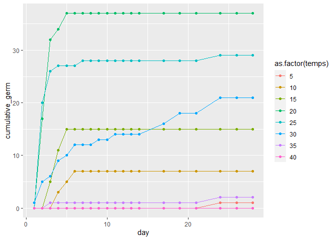
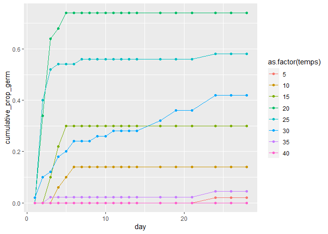

08\_31\_2020\_HW
================
John D.
08\_31\_2020

``` r
library(rethinking)
```

    ## Loading required package: rstan

    ## Warning: package 'rstan' was built under R version 3.6.3

    ## Loading required package: StanHeaders

    ## Loading required package: ggplot2

    ## Warning: package 'ggplot2' was built under R version 3.6.3

    ## rstan (Version 2.19.3, GitRev: 2e1f913d3ca3)

    ## For execution on a local, multicore CPU with excess RAM we recommend calling
    ## options(mc.cores = parallel::detectCores()).
    ## To avoid recompilation of unchanged Stan programs, we recommend calling
    ## rstan_options(auto_write = TRUE)

    ## For improved execution time, we recommend calling
    ## Sys.setenv(LOCAL_CPPFLAGS = '-march=corei7 -mtune=corei7')
    ## although this causes Stan to throw an error on a few processors.

    ## Loading required package: parallel

    ## Loading required package: dagitty

    ## rethinking (Version 1.93)

    ## 
    ## Attaching package: 'rethinking'

    ## The following object is masked from 'package:stats':
    ## 
    ##     rstudent

``` r
library(tidyverse)
```

    ## -- Attaching packages ------------------------- tidyverse 1.3.0 --

    ## v tibble  3.0.3     v dplyr   1.0.1
    ## v tidyr   1.1.1     v stringr 1.4.0
    ## v readr   1.3.1     v forcats 0.5.0
    ## v purrr   0.3.4

    ## Warning: package 'tibble' was built under R version 3.6.3

    ## Warning: package 'tidyr' was built under R version 3.6.3

    ## Warning: package 'purrr' was built under R version 3.6.3

    ## Warning: package 'dplyr' was built under R version 3.6.3

    ## Warning: package 'forcats' was built under R version 3.6.3

    ## -- Conflicts ---------------------------- tidyverse_conflicts() --
    ## x tidyr::extract() masks rstan::extract()
    ## x dplyr::filter()  masks stats::filter()
    ## x dplyr::lag()     masks stats::lag()
    ## x purrr::map()     masks rethinking::map()

``` r
library(mefa)
```

    ## Warning: package 'mefa' was built under R version 3.6.3

    ## mefa 3.2-7    2016-01-11

``` r
dat <- read_csv("light_round1_tall.csv")
```

    ## Parsed with column specification:
    ## cols(
    ##   pops = col_character(),
    ##   temps = col_double(),
    ##   wps = col_double(),
    ##   date = col_character(),
    ##   total_seeds = col_double(),
    ##   germ = col_double(),
    ##   start_date = col_date(format = ""),
    ##   census_date = col_date(format = ""),
    ##   day = col_double(),
    ##   cumulative_germ = col_double(),
    ##   cumulative_prop_germ = col_double()
    ## )

``` r
head(dat)
```

    ## # A tibble: 6 x 11
    ##   pops  temps   wps date  total_seeds  germ start_date census_date   day
    ##   <chr> <dbl> <dbl> <chr>       <dbl> <dbl> <date>     <date>      <dbl>
    ## 1 CAAM      5  -0.6 June~          50     0 2020-06-05 2020-06-06      1
    ## 2 CAAM      5  -0.6 June~          50     0 2020-06-05 2020-06-07      2
    ## 3 CAAM      5  -0.6 June~          50     0 2020-06-05 2020-06-08      3
    ## 4 CAAM      5  -0.6 June~          50     0 2020-06-05 2020-06-09      4
    ## 5 CAAM      5  -0.6 June~          50     0 2020-06-05 2020-06-10      5
    ## 6 CAAM      5  -0.6 June~          50     0 2020-06-05 2020-06-11      6
    ## # ... with 2 more variables: cumulative_germ <dbl>, cumulative_prop_germ <dbl>

### 1\. Subset the data to only include wps==0. We may look at water potential in a future week.

``` r
dat.small <- dat %>%
  filter(wps == 0)
head(dat.small)
```

    ## # A tibble: 6 x 11
    ##   pops  temps   wps date  total_seeds  germ start_date census_date   day
    ##   <chr> <dbl> <dbl> <chr>       <dbl> <dbl> <date>     <date>      <dbl>
    ## 1 CAAM      5     0 June~          50     0 2020-06-05 2020-06-06      1
    ## 2 CAAM      5     0 June~          50     0 2020-06-05 2020-06-07      2
    ## 3 CAAM      5     0 June~          50     0 2020-06-05 2020-06-08      3
    ## 4 CAAM      5     0 June~          50     0 2020-06-05 2020-06-09      4
    ## 5 CAAM      5     0 June~          50     0 2020-06-05 2020-06-10      5
    ## 6 CAAM      5     0 June~          50     0 2020-06-05 2020-06-11      6
    ## # ... with 2 more variables: cumulative_germ <dbl>, cumulative_prop_germ <dbl>

### 2\. Let’s start with a single pop “STDI”. Evaluate models relate germination rate to temperature. Explain your model choice and prior choice. Try to do this both with ulam and brm.

``` r
dat.smaller <- dat.small %>%
  filter(pops == "STDI")
head(dat.smaller)
```

    ## # A tibble: 6 x 11
    ##   pops  temps   wps date  total_seeds  germ start_date census_date   day
    ##   <chr> <dbl> <dbl> <chr>       <dbl> <dbl> <date>     <date>      <dbl>
    ## 1 STDI      5     0 June~          50     0 2020-06-05 2020-06-06      1
    ## 2 STDI      5     0 June~          50     0 2020-06-05 2020-06-07      2
    ## 3 STDI      5     0 June~          50     0 2020-06-05 2020-06-08      3
    ## 4 STDI      5     0 June~          50     0 2020-06-05 2020-06-09      4
    ## 5 STDI      5     0 June~          50     0 2020-06-05 2020-06-10      5
    ## 6 STDI      5     0 June~          50     0 2020-06-05 2020-06-11      6
    ## # ... with 2 more variables: cumulative_germ <dbl>, cumulative_prop_germ <dbl>

``` r
ggplot(dat.smaller, aes(x = day, y = cumulative_germ, color = as.factor(temps))) +
  geom_line() +
  geom_point()
```

<!-- -->

``` r
ggplot(dat.smaller, aes(x = day, y = cumulative_prop_germ, color = as.factor(temps))) +
  geom_line() +
  geom_point()
```

<!-- -->

Following the cat model. Probability of no germination conditional on
the observation time so far.

Need to make each seed a single event

``` r
# Add germinated
germs.dat <- data.frame(matrix(ncol = 11, nrow = 0))
colnames(germs.dat) <- colnames(dat.smaller)
germs <- dat.smaller %>%
  filter(germ != 0)

for(i in 1:nrow(germs)){
  germs.dat <- rbind(germs.dat, rep(germs[i,], germs[[i,6]]))
}
germs.dat$germ <- 1

# Add ungerminated

no.germs.dat <- data.frame(matrix(ncol = 11, nrow = 0))
colnames(no.germs.dat) <- colnames(dat.smaller)

no.germs <- dat.smaller %>% group_by(temps) %>%
  summarize(germs = sum(germ),
            nogerm = max(total_seeds) - germs) %>%
  pull(nogerm)
```

    ## `summarise()` ungrouping output (override with `.groups` argument)

``` r
nogerms <- dat.smaller %>% 
  group_by(temps) %>%
  filter(day == max(dat.smaller$day))

for(i in 1:nrow(nogerms)){
  no.germs.dat <- rbind(no.germs.dat, rep(nogerms[i,], no.germs[i]))
}
no.germs.dat$germ <- 0

new.dat <- rbind(germs.dat,no.germs.dat)
```

Group by temp, days will parameter

``` r
dat_list <- list(
  Germ = new.dat$germ,
  Days = new.dat$day,
  Temp = as.numeric(as.factor(new.dat$temps))
)

model.1 <- ulam(
  alist(
    Days|Germ==1 ~ exponential(lambda),
    Days|Germ==0 ~ custom(exponential_lccdf( !Y | lambda)),
    lambda <- 1.0/mu,
    log(mu) <- a[Temp],
    a[Temp] ~ normal(0,1)
  ), data = dat_list, chains = 4, cores = 4
)
precis(model.1, depth = 2)
```

    ##          mean        sd     5.5%    94.5%    n_eff      Rhat
    ## a[1] 5.440440 0.3826940 4.869198 6.072355 2889.763 0.9996713
    ## a[2] 4.700390 0.2836626 4.263287 5.184506 2928.809 1.0000172
    ## a[3] 4.021442 0.2178424 3.681501 4.383604 2608.355 0.9988303
    ## a[4] 2.481992 0.1542472 2.246061 2.733037 2826.384 0.9982734
    ## a[5] 3.076133 0.1736978 2.806525 3.365655 2550.118 0.9985262
    ## a[6] 3.735997 0.1963662 3.430822 4.061290 3451.968 0.9981604
    ## a[7] 5.194483 0.3555773 4.658360 5.781272 2413.245 0.9986634
    ## a[8] 5.622122 0.3859986 5.044251 6.258420 2414.828 1.0009821

``` r
post <- extract.samples( model.1 )
post$D <- exp(post$a)
precis( post , 2 )
```

    ##            mean          sd       5.5%      94.5%
    ## a[1]   5.440440   0.3826940   4.869198   6.072355
    ## a[2]   4.700390   0.2836626   4.263287   5.184506
    ## a[3]   4.021442   0.2178424   3.681501   4.383604
    ## a[4]   2.481992   0.1542472   2.246061   2.733037
    ## a[5]   3.076133   0.1736978   2.806525   3.365655
    ## a[6]   3.735997   0.1963662   3.430822   4.061290
    ## a[7]   5.194483   0.3555773   4.658360   5.781272
    ## a[8]   5.622122   0.3859986   5.044251   6.258420
    ## D[1] 248.801416 105.9700078 130.216471 433.700895
    ## D[2] 114.665473  35.1079377  71.043106 178.485260
    ## D[3]  57.144971  12.9497407  39.705946  80.126328
    ## D[4]  12.110264   1.9229784   9.450437  15.379519
    ## D[5]  22.009932   3.9728367  16.552291  28.952443
    ## D[6]  42.755189   8.6313118  30.902025  58.049141
    ## D[7] 192.572416  76.2213704 105.462988 324.171264
    ## D[8] 298.711851 126.5790085 155.128050 522.392774
    ##                                                                                                                     histogram
    ## a[1] <U+2581><U+2581><U+2581><U+2582><U+2587><U+2587><U+2587><U+2585><U+2583><U+2582><U+2581><U+2581><U+2581><U+2581><U+2581>
    ## a[2]                                 <U+2581><U+2581><U+2582><U+2587><U+2587><U+2585><U+2582><U+2581><U+2581><U+2581><U+2581>
    ## a[3]                                                 <U+2581><U+2581><U+2583><U+2587><U+2587><U+2583><U+2581><U+2581><U+2581>
    ## a[4]                         <U+2581><U+2581><U+2581><U+2582><U+2585><U+2587><U+2585><U+2583><U+2582><U+2581><U+2581><U+2581>
    ## a[5]                                                         <U+2581><U+2581><U+2585><U+2587><U+2582><U+2581><U+2581><U+2581>
    ## a[6]                                                         <U+2581><U+2581><U+2583><U+2587><U+2585><U+2582><U+2581><U+2581>
    ## a[7] <U+2581><U+2581><U+2581><U+2581><U+2582><U+2585><U+2587><U+2587><U+2583><U+2582><U+2581><U+2581><U+2581><U+2581><U+2581>
    ## a[8] <U+2581><U+2581><U+2581><U+2581><U+2583><U+2587><U+2587><U+2587><U+2585><U+2583><U+2582><U+2581><U+2581><U+2581><U+2581>
    ## D[1]                         <U+2581><U+2587><U+2587><U+2583><U+2581><U+2581><U+2581><U+2581><U+2581><U+2581><U+2581><U+2581>
    ## D[2]                                                                         <U+2587><U+2587><U+2582><U+2581><U+2581><U+2581>
    ## D[3]                 <U+2581><U+2581><U+2585><U+2587><U+2583><U+2582><U+2581><U+2581><U+2581><U+2581><U+2581><U+2581><U+2581>
    ## D[4]                                                 <U+2581><U+2582><U+2587><U+2585><U+2582><U+2581><U+2581><U+2581><U+2581>
    ## D[5]                                                 <U+2581><U+2585><U+2587><U+2582><U+2581><U+2581><U+2581><U+2581><U+2581>
    ## D[6]                                                         <U+2581><U+2587><U+2587><U+2582><U+2581><U+2581><U+2581><U+2581>
    ## D[7]                                                         <U+2581><U+2587><U+2583><U+2581><U+2581><U+2581><U+2581><U+2581>
    ## D[8]                         <U+2581><U+2583><U+2587><U+2583><U+2582><U+2581><U+2581><U+2581><U+2581><U+2581><U+2581><U+2581>

``` r
days.seq <- rep(seq(from = 1, to = 28), 8)
temps.seq <- rep(seq(from = 1, to = 8), 28)
mu <- link(model.1, data = data.frame(Days = days.seq, Temp = temps.seq))
```
