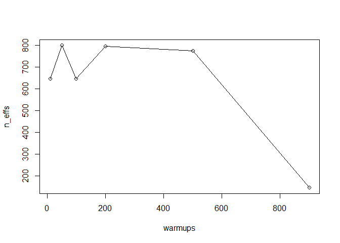
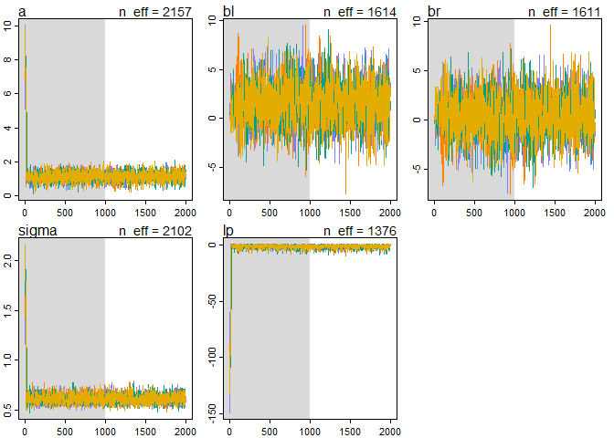
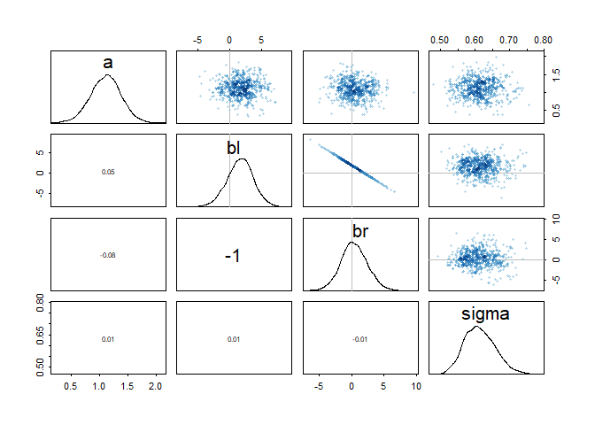
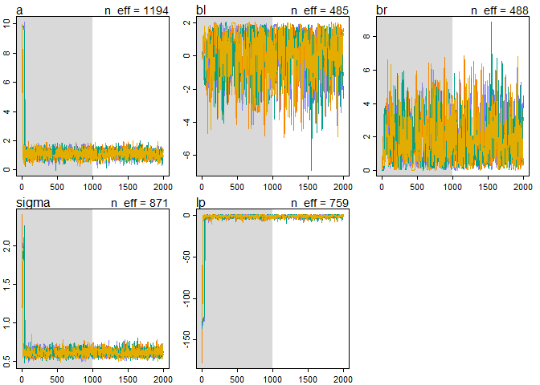
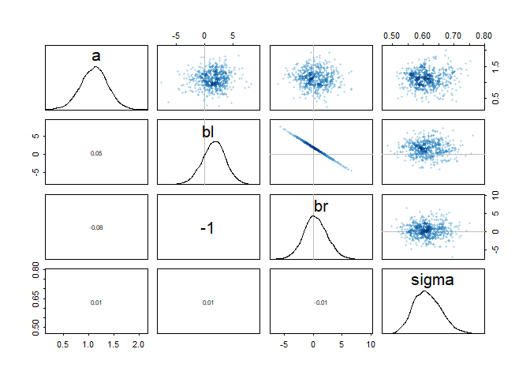
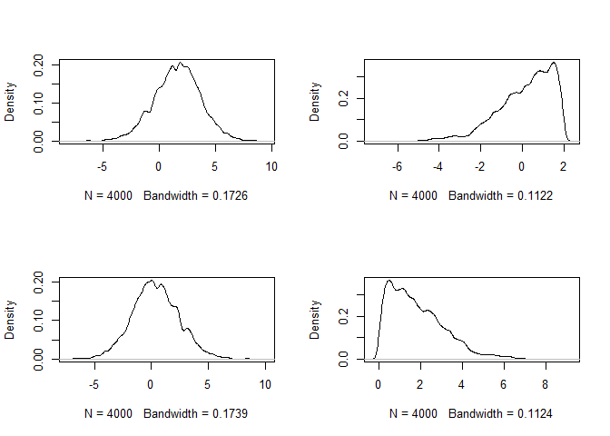

```r
library(tidyverse)
```

```
## -- Attaching packages ---------------------------------------------------------- tidyverse 1.2.1 --
```

```
## v ggplot2 3.2.1     v purrr   0.3.2
## v tibble  2.1.3     v dplyr   0.8.3
## v tidyr   0.8.3     v stringr 1.4.0
## v readr   1.3.1     v forcats 0.4.0
```

```
## -- Conflicts ------------------------------------------------------------- tidyverse_conflicts() --
## x dplyr::filter() masks stats::filter()
## x dplyr::lag()    masks stats::lag()
```

```r
library(rethinking)
```

```
## Loading required package: rstan
```

```
## Loading required package: StanHeaders
```

```
## rstan (Version 2.19.2, GitRev: 2e1f913d3ca3)
```

```
## For execution on a local, multicore CPU with excess RAM we recommend calling
## options(mc.cores = parallel::detectCores()).
## To avoid recompilation of unchanged Stan programs, we recommend calling
## rstan_options(auto_write = TRUE)
```

```
## For improved execution time, we recommend calling
## Sys.setenv(LOCAL_CPPFLAGS = '-march=native')
## although this causes Stan to throw an error on a few processors.
```

```
## 
## Attaching package: 'rstan'
```

```
## The following object is masked from 'package:tidyr':
## 
##     extract
```

```
## Loading required package: parallel
```

```
## Loading required package: dagitty
```

```
## rethinking (Version 1.90)
```

```
## 
## Attaching package: 'rethinking'
```

```
## The following object is masked from 'package:purrr':
## 
##     map
```

```
## The following object is masked from 'package:stats':
## 
##     rstudent
```

```r
options(mc.cores = parallel::detectCores())
rstan_options(auto_write = TRUE)
Sys.setenv(LOCAL_CPPFLAGS = '-march=native')
```

## 8E4. Explain the difference between the effective number of samples, n_eff as calculated by Stan, and the actual number of samples.

The effective number of samples is an estimate of the number of independent samples from the posterior distribution and the actual number of samples is the raw count.

## 8M3. Re-estimate one of the Stan models from the chapter, but at different numbers of warmup iterations. Be sure to use the same number of sampling iterations in each case. Compare the n_eff values. How much warmup is enough?


```r
# data prep
data(rugged)
d <- rugged
d$log_gdp <- log(d$rgdppc_2000)
dd <- d[ complete.cases(d$rgdppc_2000) , ]
dd$log_gdp_std <- dd$log_gdp / mean(dd$log_gdp)
dd$rugged_std <- dd$rugged / max(dd$rugged)
dd$cid <- ifelse( dd$cont_africa==1 , 1 , 2 )
dat_slim <- list(
  log_gdp_std = dd$log_gdp_std,
  rugged_std = dd$rugged_std,
  cid = as.integer( dd$cid )
)
```


```r
m9.1.10 <- ulam(
  alist(
    log_gdp_std ~ dnorm( mu , sigma ) ,
    mu <- a[cid] + b[cid]*( rugged_std - 0.215 ) ,
    a[cid] ~ dnorm( 1 , 0.1 ) ,
    b[cid] ~ dnorm( 0 , 0.3 ) ,
    sigma ~ dexp( 1 )
    ) ,
data=dat_slim , chains=1, iter = 1000, warmup = 10, log_lik = T)
```

```
## 
## SAMPLING FOR MODEL 'bdaed75a9993557c6ccccabd1899b8a7' NOW (CHAIN 1).
## Chain 1: 
## Chain 1: Gradient evaluation took 0 seconds
## Chain 1: 1000 transitions using 10 leapfrog steps per transition would take 0 seconds.
## Chain 1: Adjust your expectations accordingly!
## Chain 1: 
## Chain 1: 
## Chain 1: WARNING: No variance estimation is
## Chain 1:          performed for num_warmup < 20
## Chain 1: 
## Chain 1: Iteration:   1 / 1000 [  0%]  (Warmup)
## Chain 1: Iteration:  11 / 1000 [  1%]  (Sampling)
## Chain 1: Iteration: 110 / 1000 [ 11%]  (Sampling)
## Chain 1: Iteration: 210 / 1000 [ 21%]  (Sampling)
## Chain 1: Iteration: 310 / 1000 [ 31%]  (Sampling)
## Chain 1: Iteration: 410 / 1000 [ 41%]  (Sampling)
## Chain 1: Iteration: 510 / 1000 [ 51%]  (Sampling)
## Chain 1: Iteration: 610 / 1000 [ 61%]  (Sampling)
## Chain 1: Iteration: 710 / 1000 [ 71%]  (Sampling)
## Chain 1: Iteration: 810 / 1000 [ 81%]  (Sampling)
## Chain 1: Iteration: 910 / 1000 [ 91%]  (Sampling)
## Chain 1: Iteration: 1000 / 1000 [100%]  (Sampling)
## Chain 1: 
## Chain 1:  Elapsed Time: 0.002 seconds (Warm-up)
## Chain 1:                0.25 seconds (Sampling)
## Chain 1:                0.252 seconds (Total)
## Chain 1:
```

```
## Warning: There were 1 chains where the estimated Bayesian Fraction of Missing Information was low. See
## http://mc-stan.org/misc/warnings.html#bfmi-low
```

```
## Warning: Examine the pairs() plot to diagnose sampling problems
```

```r
m9.1.50 <- ulam(
  alist(
    log_gdp_std ~ dnorm( mu , sigma ) ,
    mu <- a[cid] + b[cid]*( rugged_std - 0.215 ) ,
    a[cid] ~ dnorm( 1 , 0.1 ) ,
    b[cid] ~ dnorm( 0 , 0.3 ) ,
    sigma ~ dexp( 1 )
    ) ,
data=dat_slim , chains=1, iter = 1000, warmup = 50, log_lik = T)
```

```
## recompiling to avoid crashing R session
```

```
## 
## SAMPLING FOR MODEL 'bdaed75a9993557c6ccccabd1899b8a7' NOW (CHAIN 1).
## Chain 1: 
## Chain 1: Gradient evaluation took 0 seconds
## Chain 1: 1000 transitions using 10 leapfrog steps per transition would take 0 seconds.
## Chain 1: Adjust your expectations accordingly!
## Chain 1: 
## Chain 1: 
## Chain 1: WARNING: There aren't enough warmup iterations to fit the
## Chain 1:          three stages of adaptation as currently configured.
## Chain 1:          Reducing each adaptation stage to 15%/75%/10% of
## Chain 1:          the given number of warmup iterations:
## Chain 1:            init_buffer = 7
## Chain 1:            adapt_window = 38
## Chain 1:            term_buffer = 5
## Chain 1: 
## Chain 1: Iteration:   1 / 1000 [  0%]  (Warmup)
## Chain 1: Iteration:  51 / 1000 [  5%]  (Sampling)
## Chain 1: Iteration: 150 / 1000 [ 15%]  (Sampling)
## Chain 1: Iteration: 250 / 1000 [ 25%]  (Sampling)
## Chain 1: Iteration: 350 / 1000 [ 35%]  (Sampling)
## Chain 1: Iteration: 450 / 1000 [ 45%]  (Sampling)
## Chain 1: Iteration: 550 / 1000 [ 55%]  (Sampling)
## Chain 1: Iteration: 650 / 1000 [ 65%]  (Sampling)
## Chain 1: Iteration: 750 / 1000 [ 75%]  (Sampling)
## Chain 1: Iteration: 850 / 1000 [ 85%]  (Sampling)
## Chain 1: Iteration: 950 / 1000 [ 95%]  (Sampling)
## Chain 1: Iteration: 1000 / 1000 [100%]  (Sampling)
## Chain 1: 
## Chain 1:  Elapsed Time: 0.009 seconds (Warm-up)
## Chain 1:                0.181 seconds (Sampling)
## Chain 1:                0.19 seconds (Total)
## Chain 1:
```

```r
m9.1.100 <- ulam(
  alist(
    log_gdp_std ~ dnorm( mu , sigma ) ,
    mu <- a[cid] + b[cid]*( rugged_std - 0.215 ) ,
    a[cid] ~ dnorm( 1 , 0.1 ) ,
    b[cid] ~ dnorm( 0 , 0.3 ) ,
    sigma ~ dexp( 1 )
    ) ,
data=dat_slim , chains=1, iter = 1000, warmup = 100, log_lik = T)
```

```
## recompiling to avoid crashing R session
```

```
## 
## SAMPLING FOR MODEL 'bdaed75a9993557c6ccccabd1899b8a7' NOW (CHAIN 1).
## Chain 1: 
## Chain 1: Gradient evaluation took 0 seconds
## Chain 1: 1000 transitions using 10 leapfrog steps per transition would take 0 seconds.
## Chain 1: Adjust your expectations accordingly!
## Chain 1: 
## Chain 1: 
## Chain 1: WARNING: There aren't enough warmup iterations to fit the
## Chain 1:          three stages of adaptation as currently configured.
## Chain 1:          Reducing each adaptation stage to 15%/75%/10% of
## Chain 1:          the given number of warmup iterations:
## Chain 1:            init_buffer = 15
## Chain 1:            adapt_window = 75
## Chain 1:            term_buffer = 10
## Chain 1: 
## Chain 1: Iteration:   1 / 1000 [  0%]  (Warmup)
## Chain 1: Iteration: 100 / 1000 [ 10%]  (Warmup)
## Chain 1: Iteration: 101 / 1000 [ 10%]  (Sampling)
## Chain 1: Iteration: 200 / 1000 [ 20%]  (Sampling)
## Chain 1: Iteration: 300 / 1000 [ 30%]  (Sampling)
## Chain 1: Iteration: 400 / 1000 [ 40%]  (Sampling)
## Chain 1: Iteration: 500 / 1000 [ 50%]  (Sampling)
## Chain 1: Iteration: 600 / 1000 [ 60%]  (Sampling)
## Chain 1: Iteration: 700 / 1000 [ 70%]  (Sampling)
## Chain 1: Iteration: 800 / 1000 [ 80%]  (Sampling)
## Chain 1: Iteration: 900 / 1000 [ 90%]  (Sampling)
## Chain 1: Iteration: 1000 / 1000 [100%]  (Sampling)
## Chain 1: 
## Chain 1:  Elapsed Time: 0.018 seconds (Warm-up)
## Chain 1:                0.176 seconds (Sampling)
## Chain 1:                0.194 seconds (Total)
## Chain 1:
```

```r
m9.1.200 <- ulam(
  alist(
    log_gdp_std ~ dnorm( mu , sigma ) ,
    mu <- a[cid] + b[cid]*( rugged_std - 0.215 ) ,
    a[cid] ~ dnorm( 1 , 0.1 ) ,
    b[cid] ~ dnorm( 0 , 0.3 ) ,
    sigma ~ dexp( 1 )
    ) ,
data=dat_slim , chains=1, iter = 1000, warmup = 200, log_lik = T)
```

```
## recompiling to avoid crashing R session
```

```
## 
## SAMPLING FOR MODEL 'bdaed75a9993557c6ccccabd1899b8a7' NOW (CHAIN 1).
## Chain 1: 
## Chain 1: Gradient evaluation took 0 seconds
## Chain 1: 1000 transitions using 10 leapfrog steps per transition would take 0 seconds.
## Chain 1: Adjust your expectations accordingly!
## Chain 1: 
## Chain 1: 
## Chain 1: Iteration:   1 / 1000 [  0%]  (Warmup)
## Chain 1: Iteration: 100 / 1000 [ 10%]  (Warmup)
## Chain 1: Iteration: 200 / 1000 [ 20%]  (Warmup)
## Chain 1: Iteration: 201 / 1000 [ 20%]  (Sampling)
## Chain 1: Iteration: 300 / 1000 [ 30%]  (Sampling)
## Chain 1: Iteration: 400 / 1000 [ 40%]  (Sampling)
## Chain 1: Iteration: 500 / 1000 [ 50%]  (Sampling)
## Chain 1: Iteration: 600 / 1000 [ 60%]  (Sampling)
## Chain 1: Iteration: 700 / 1000 [ 70%]  (Sampling)
## Chain 1: Iteration: 800 / 1000 [ 80%]  (Sampling)
## Chain 1: Iteration: 900 / 1000 [ 90%]  (Sampling)
## Chain 1: Iteration: 1000 / 1000 [100%]  (Sampling)
## Chain 1: 
## Chain 1:  Elapsed Time: 0.023 seconds (Warm-up)
## Chain 1:                0.064 seconds (Sampling)
## Chain 1:                0.087 seconds (Total)
## Chain 1:
```

```r
m9.1.500 <- ulam(
  alist(
    log_gdp_std ~ dnorm( mu , sigma ) ,
    mu <- a[cid] + b[cid]*( rugged_std - 0.215 ) ,
    a[cid] ~ dnorm( 1 , 0.1 ) ,
    b[cid] ~ dnorm( 0 , 0.3 ) ,
    sigma ~ dexp( 1 )
    ) ,
data=dat_slim , chains=1, iter = 1000, warmup = 500, log_lik = T)
```

```
## recompiling to avoid crashing R session
```

```
## 
## SAMPLING FOR MODEL 'bdaed75a9993557c6ccccabd1899b8a7' NOW (CHAIN 1).
## Chain 1: 
## Chain 1: Gradient evaluation took 0 seconds
## Chain 1: 1000 transitions using 10 leapfrog steps per transition would take 0 seconds.
## Chain 1: Adjust your expectations accordingly!
## Chain 1: 
## Chain 1: 
## Chain 1: Iteration:   1 / 1000 [  0%]  (Warmup)
## Chain 1: Iteration: 100 / 1000 [ 10%]  (Warmup)
## Chain 1: Iteration: 200 / 1000 [ 20%]  (Warmup)
## Chain 1: Iteration: 300 / 1000 [ 30%]  (Warmup)
## Chain 1: Iteration: 400 / 1000 [ 40%]  (Warmup)
## Chain 1: Iteration: 500 / 1000 [ 50%]  (Warmup)
## Chain 1: Iteration: 501 / 1000 [ 50%]  (Sampling)
## Chain 1: Iteration: 600 / 1000 [ 60%]  (Sampling)
## Chain 1: Iteration: 700 / 1000 [ 70%]  (Sampling)
## Chain 1: Iteration: 800 / 1000 [ 80%]  (Sampling)
## Chain 1: Iteration: 900 / 1000 [ 90%]  (Sampling)
## Chain 1: Iteration: 1000 / 1000 [100%]  (Sampling)
## Chain 1: 
## Chain 1:  Elapsed Time: 0.053 seconds (Warm-up)
## Chain 1:                0.038 seconds (Sampling)
## Chain 1:                0.091 seconds (Total)
## Chain 1:
```

```r
m9.1.900 <- ulam(
  alist(
    log_gdp_std ~ dnorm( mu , sigma ) ,
    mu <- a[cid] + b[cid]*( rugged_std - 0.215 ) ,
    a[cid] ~ dnorm( 1 , 0.1 ) ,
    b[cid] ~ dnorm( 0 , 0.3 ) ,
    sigma ~ dexp( 1 )
    ) ,
data=dat_slim , chains=1, iter = 1000, warmup = 900, log_lik = T)
```

```
## recompiling to avoid crashing R session
```

```
## 
## SAMPLING FOR MODEL 'bdaed75a9993557c6ccccabd1899b8a7' NOW (CHAIN 1).
## Chain 1: 
## Chain 1: Gradient evaluation took 0 seconds
## Chain 1: 1000 transitions using 10 leapfrog steps per transition would take 0 seconds.
## Chain 1: Adjust your expectations accordingly!
## Chain 1: 
## Chain 1: 
## Chain 1: Iteration:   1 / 1000 [  0%]  (Warmup)
## Chain 1: Iteration: 100 / 1000 [ 10%]  (Warmup)
## Chain 1: Iteration: 200 / 1000 [ 20%]  (Warmup)
## Chain 1: Iteration: 300 / 1000 [ 30%]  (Warmup)
## Chain 1: Iteration: 400 / 1000 [ 40%]  (Warmup)
## Chain 1: Iteration: 500 / 1000 [ 50%]  (Warmup)
## Chain 1: Iteration: 600 / 1000 [ 60%]  (Warmup)
## Chain 1: Iteration: 700 / 1000 [ 70%]  (Warmup)
## Chain 1: Iteration: 800 / 1000 [ 80%]  (Warmup)
## Chain 1: Iteration: 900 / 1000 [ 90%]  (Warmup)
## Chain 1: Iteration: 901 / 1000 [ 90%]  (Sampling)
## Chain 1: Iteration: 1000 / 1000 [100%]  (Sampling)
## Chain 1: 
## Chain 1:  Elapsed Time: 0.089 seconds (Warm-up)
## Chain 1:                0.007 seconds (Sampling)
## Chain 1:                0.096 seconds (Total)
## Chain 1:
```

```
## Warning: The largest R-hat is 1.06, indicating chains have not mixed.
## Running the chains for more iterations may help. See
## http://mc-stan.org/misc/warnings.html#r-hat
```

```
## Warning: Bulk Effective Samples Size (ESS) is too low, indicating posterior means and medians may be unreliable.
## Running the chains for more iterations may help. See
## http://mc-stan.org/misc/warnings.html#bulk-ess
```

```
## Warning: Tail Effective Samples Size (ESS) is too low, indicating posterior variances and tail quantiles may be unreliable.
## Running the chains for more iterations may help. See
## http://mc-stan.org/misc/warnings.html#tail-ess
```

```r
warmups <- c(10,50,100,200,500,900)
n_effs <- c(mean(precis(m9.1.10,depth = 2)[,5]),
            mean(precis(m9.1.50,depth = 2)[,5]),
            mean(precis(m9.1.100,depth = 2)[,5]),
            mean(precis(m9.1.200,depth = 2)[,5]),
            mean(precis(m9.1.500,depth = 2)[,5]),
            mean(precis(m9.1.900,depth = 2)[,5]))
n_effs
```

```
## [1] 646.4114 799.6172 646.7522 796.2118 775.9503 144.8032
```

```r
plot(x = warmups, y = n_effs)
lines(x = warmups, y = n_effs)
```

<!-- -->
In this case it looks like using 200 iterations produced the largest number of effective samples

## 8H3. Sometimes changing a prior for one parameter has unanticipated effects on other parameters. This is because when a parameter is highly correlated with another parameter in the posterior, the prior influences both parameters. Here’s an example to work and think through. ### Go back to the leg length example in Chapter 5. Here is the code again, which simulates height and leg lengths for 100 imagined individuals:


```r
N <- 100 # number of individuals
height <- rnorm(N,10,2) # sim total height of each
leg_prop <- runif(N,0.4,0.5) # leg as proportion of height
leg_left <- leg_prop*height + # sim left leg as proportion + error
  rnorm( N , 0 , 0.02 )
leg_right <- leg_prop*height + # sim right leg as proportion + error
  rnorm( N , 0 , 0.02 )
# combine into data frame
d <- data.frame(height,leg_left,leg_right)
head(d)
```

```
##      height leg_left leg_right
## 1  8.278506 4.061428  4.067437
## 2 11.330952 4.749025  4.787413
## 3  7.375357 3.076078  3.053537
## 4  7.776736 3.297154  3.288312
## 5 12.269635 5.923139  5.975391
## 6 11.902169 5.777320  5.779287
```


```r
m5.8s <- map2stan(
  alist(
    height ~ dnorm( mu , sigma ) ,
    mu <- a + bl*leg_left + br*leg_right ,
    a ~ dnorm( 10 , 100 ) ,
    bl ~ dnorm( 2 , 10 ) ,
    br ~ dnorm( 2 , 10 ) ,
    sigma ~ dcauchy( 0 , 1 )
  ) ,
  data=d, chains=4, cores = 4,
  start=list(a=10,bl=0,br=0,sigma=1) )
```

```
## Warning: There were 1645 transitions after warmup that exceeded the maximum treedepth. Increase max_treedepth above 10. See
## http://mc-stan.org/misc/warnings.html#maximum-treedepth-exceeded
```

```
## Warning: Examine the pairs() plot to diagnose sampling problems
```

```
## Computing WAIC
```


```r
m5.8s2 <- map2stan(
  alist(
    height ~ dnorm( mu , sigma ) ,
    mu <- a + bl*leg_left + br*leg_right ,
    a ~ dnorm( 10 , 100 ) ,
    bl ~ dnorm( 2 , 10 ) ,
    br ~ dnorm( 2 , 10 ) & T[0,] ,
    sigma ~ dcauchy( 0 , 1 )
  ) ,
  data=d, chains=4, cores = 4,
  start=list(a=10,bl=0,br=0,sigma=1) )
```

```
## Warning: There were 1727 divergent transitions after warmup. Increasing adapt_delta above 0.95 may help. See
## http://mc-stan.org/misc/warnings.html#divergent-transitions-after-warmup
```

```
## Warning: There were 68 transitions after warmup that exceeded the maximum treedepth. Increase max_treedepth above 10. See
## http://mc-stan.org/misc/warnings.html#maximum-treedepth-exceeded
```

```
## Warning: Examine the pairs() plot to diagnose sampling problems
```

```
## Computing WAIC
```

```
## Warning in map2stan(alist(height ~ dnorm(mu, sigma), mu <- a + bl * leg_left + : There were 1727 divergent iterations during sampling.
## Check the chains (trace plots, n_eff, Rhat) carefully to ensure they are valid.
```


```r
plot(m5.8s)
precis(m5.8s, depth = 2)
```

```
##            mean         sd       5.5%     94.5%    n_eff     Rhat
## a     1.1148981 0.26957320  0.6804710 1.5383965 2156.895 1.002469
## bl    1.5994835 2.04891805 -1.6902433 4.7896509 1614.464 1.001955
## br    0.3686688 2.05459555 -2.8535259 3.6695656 1611.219 1.001928
## sigma 0.6138389 0.04496085  0.5471552 0.6894687 2101.550 1.001918
```

```r
pairs(m5.8s)
```

<!-- --><!-- -->

```r
plot(m5.8s2)
precis(m5.8s2, depth = 2)
```

```
##            mean         sd       5.5%     94.5%     n_eff     Rhat
## a     1.0957792 0.26543869  0.6695845 1.5179781 1193.6948 1.002465
## bl    0.1592248 1.30941290 -2.1561870 1.7544271  485.4804 1.005856
## br    1.8148289 1.31200833  0.2144009 4.1301340  488.4591 1.005779
## sigma 0.6152934 0.04386751  0.5503278 0.6864161  870.8188 1.004766
```

```r
pairs(m5.8s)
```

<!-- --><!-- -->

```r
coeftab(m5.8s, m5.8s2)
```

```
##       m5.8s   m5.8s2 
## a        1.11    1.10
## bl       1.60    0.16
## br       0.37    1.81
## sigma    0.61    0.62
## nobs      100     100
```

```r
compare(m5.8s, m5.8s2)
```

```
##            WAIC    pWAIC     dWAIC    weight       SE     dSE
## m5.8s2 187.7054 2.652726 0.0000000 0.5927677 9.719987      NA
## m5.8s  188.4562 3.244372 0.7508372 0.4072323 9.757985 1.38267
```


```r
samples1 <- data.frame(extract.samples(m5.8s)) %>%
  mutate(Model = 1)
samples2 <- data.frame(extract.samples(m5.8s2)) %>%
  mutate(Model = 2)
mean(samples1$bl + samples1$br)
```

```
## [1] 1.968152
```

```r
mean(samples2$bl + samples2$br)
```

```
## [1] 1.974054
```

```r
par(mfrow = c(2,2))
dens(samples1$bl)
dens(samples2$bl)
dens(samples1$br)
dens(samples2$br)
```

<!-- -->

By making br always positive, it forced bl to be always negative. Originally both were centered around 0, but now both distributions are on opposite sides of 0. They still carry the same sum though.

## 8H4. For the two models fit in the previous problem, use DIC or WAIC to compare the effective numbers of parameters for each model. Which model has more effective parameters? Why?


```r
compare(m5.8s,m5.8s2)
```

```
##            WAIC    pWAIC     dWAIC    weight       SE     dSE
## m5.8s2 187.7054 2.652726 0.0000000 0.5927677 9.719987      NA
## m5.8s  188.4562 3.244372 0.7508372 0.4072323 9.757985 1.38267
```

The effective number of parameters is smalller in the second model. This is most likely due to us constraining the br parameter thus reducing its variance and therefore reducing pWAIC
