```r
library(tidyverse)
```

```
## -- Attaching packages ---------------------------------------------------------- tidyverse 1.2.1 --
```

```
## v ggplot2 3.2.1     v purrr   0.3.2
## v tibble  2.1.3     v dplyr   0.8.3
## v tidyr   0.8.3     v stringr 1.4.0
## v readr   1.3.1     v forcats 0.4.0
```

```
## -- Conflicts ------------------------------------------------------------- tidyverse_conflicts() --
## x dplyr::filter() masks stats::filter()
## x dplyr::lag()    masks stats::lag()
```

```r
library(rethinking)
```

```
## Loading required package: rstan
```

```
## Loading required package: StanHeaders
```

```
## rstan (Version 2.19.2, GitRev: 2e1f913d3ca3)
```

```
## For execution on a local, multicore CPU with excess RAM we recommend calling
## options(mc.cores = parallel::detectCores()).
## To avoid recompilation of unchanged Stan programs, we recommend calling
## rstan_options(auto_write = TRUE)
```

```
## For improved execution time, we recommend calling
## Sys.setenv(LOCAL_CPPFLAGS = '-march=native')
## although this causes Stan to throw an error on a few processors.
```

```
## 
## Attaching package: 'rstan'
```

```
## The following object is masked from 'package:tidyr':
## 
##     extract
```

```
## Loading required package: parallel
```

```
## Loading required package: dagitty
```

```
## rethinking (Version 1.90)
```

```
## 
## Attaching package: 'rethinking'
```

```
## The following object is masked from 'package:purrr':
## 
##     map
```

```
## The following object is masked from 'package:stats':
## 
##     rstudent
```

```r
options(mc.cores = parallel::detectCores())
rstan_options(auto_write = TRUE)
Sys.setenv(LOCAL_CPPFLAGS = '-march=native')
```

# 9 Markov Chain Monte Carlo
## 9.1. Good King Markov and His island kingdom


```r
num_weeks <- 100
positions <- rep(0,num_weeks)
current <- 10
for ( i in 1:num_weeks ) {
  # record current position
  positions[i] <- current
  # flip coin to generate proposal
  proposal <- current + sample( c(-1,1) , size=1 )
  # now make sure he loops around the archipelago
  if ( proposal < 1 ) proposal <- 10
  if ( proposal > 10 ) proposal <- 1
  # move?
  prob_move <- proposal/current
  current <- ifelse( runif(1) < prob_move , proposal , current )
}
df <- cbind.data.frame(island = positions, week = seq(1,100))
ggplot(df, aes(x=week, y=island)) +
  geom_line()
```

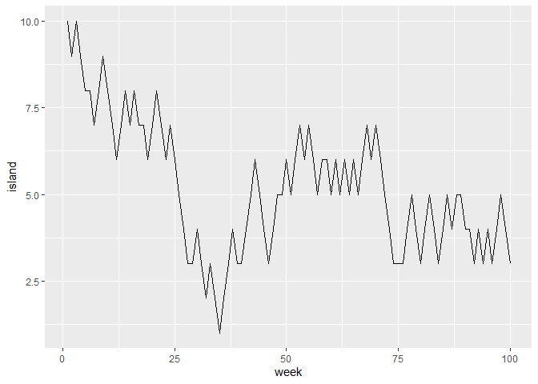<!-- -->

```r
num_weeks <- 1e5
positions <- rep(0,num_weeks)
current <- 10
for ( i in 1:num_weeks ) {
  # record current position
  positions[i] <- current
  # flip coin to generate proposal
  proposal <- current + sample( c(-1,1) , size=1 )
  # now make sure he loops around the archipelago
  if ( proposal < 1 ) proposal <- 10
  if ( proposal > 10 ) proposal <- 1
  # move?
  prob_move <- proposal/current
  current <- ifelse( runif(1) < prob_move , proposal , current )
}
df <- cbind.data.frame(island = positions, week = seq(1,1e5))
ggplot(df, aes(x=island)) +
  geom_histogram()
```

```
## `stat_bin()` using `bins = 30`. Pick better value with `binwidth`.
```

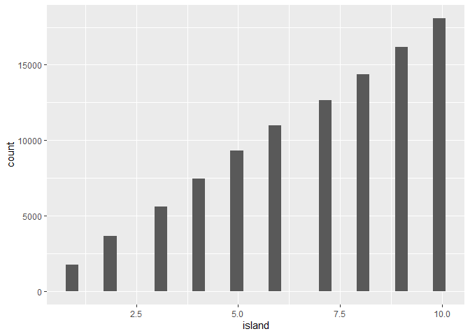<!-- -->


```r
## Any island
num_weeks <- 100
positions <- rep(0,num_weeks)
current <- 10
islands <- 1:10
for ( i in 1:num_weeks ) {
  # record current position
  positions[i] <- current
  # flip coin to generate proposal
  proposal <- sample(islands[-current], size=1 )
  # move?
  prob_move <- proposal/current
  current <- ifelse( runif(1) < prob_move , proposal , current )
}
df <- cbind.data.frame(island = positions, week = seq(1,100))
ggplot(df, aes(x=week, y=island)) +
  geom_point()
```

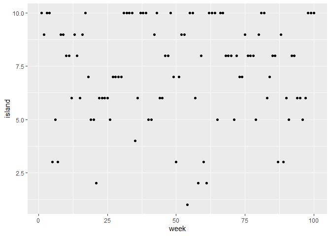<!-- -->

```r
num_weeks <- 1e5
positions <- rep(0,num_weeks)
current <- 10
islands <- 1:10
for ( i in 1:num_weeks ) {
  # record current position
  positions[i] <- current
  # flip coin to generate proposal
  proposal <- sample(islands[-current], size=1 )
  # move?
  prob_move <- proposal/current
  current <- ifelse( runif(1) < prob_move , proposal , current )
}
df <- cbind.data.frame(island = positions, week = seq(1,1e5))
ggplot(df, aes(x=island)) +
  geom_histogram(bins=10)
```

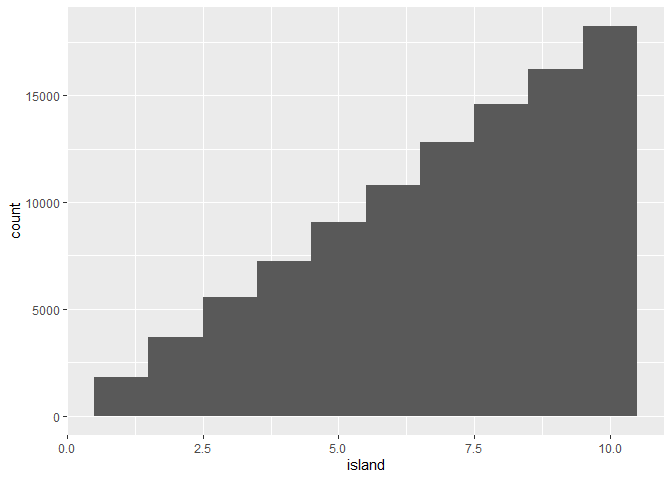<!-- -->

## 9.2. Metropolis, Gibbs, and Sadness
### 9.2.1. Gibbs sampling
### 9.2.2. High-dimensional sadness


```r
D <- 10
T <- 1e3
Y <- rmvnorm(T,rep(0,D),diag(D))
rad_dist <- function( Y ) sqrt( sum(Y^2) )
Rd <- sapply( 1:T , function(i) rad_dist( Y[i,] ) )
dens( Rd )
```

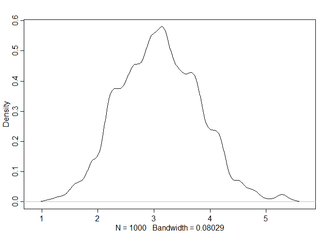<!-- -->

## 9.3. Hamiltonian Monte Carlo
### 9.3.1. Another parable
### 9.3.2. Particles in space
#### Overthinking: Hamiltonian Monte Carlo in the raw


```r
# U needs to return neg-log-probability
myU4 <- function( q , a=0 , b=1 , k=0 , d=1 ) {
  muy <- q[1]
  mux <- q[2]
  U <- sum( dnorm(y,muy,1,log=TRUE) ) + sum( dnorm(x,mux,1,log=TRUE) ) +
    dnorm(muy,a,b,log=TRUE) + dnorm(mux,k,d,log=TRUE)
  return( -U )
}
```


```r
# gradient function
# need vector of partial derivatives of U with respect to vector q
myU_grad4 <- function( q , a=0 , b=1 , k=0 , d=1 ) {
  muy <- q[1]
  mux <- q[2]
  G1 <- sum( y - muy ) + (a - muy)/b^2 #dU/dmuy
  G2 <- sum( x - mux ) + (k - mux)/d^2 #dU/dmuy
  return( c( -G1 , -G2 ) ) # negative bc energy is neg-log-prob
}
# test data
set.seed(7)
y <- rnorm(50)
x <- rnorm(50)
x <- as.numeric(scale(x))
y <- as.numeric(scale(y))
```


```r
library(shape) # for fancy arrows
Q <- list()
Q$q <- c(-0.1,0.2)
pr <- 0.3
plot( NULL , ylab="muy" , xlab="mux" , xlim=c(-pr,pr) , ylim=c(-pr,pr) )
step <- 0.03
L <- 11 # 0.03/28 for U-turns --- 11 for working example
n_samples <- 4
path_col <- col.alpha("black",0.5)
points( Q$q[1] , Q$q[2] , pch=4 , col="black" )
for ( i in 1:n_samples ) {
  Q <- HMC2( myU4 , myU_grad4 , step , L , Q$q )
  if ( n_samples < 10 ) {
    for ( j in 1:L ) {
      K0 <- sum(Q$ptraj[j,]^2)/2 # kinetic energy
      lines( Q$traj[j:(j+1),1] , Q$traj[j:(j+1),2] , col=path_col , lwd=1+2*K0 )
    }
    points( Q$traj[1:L+1,] , pch=16 , col="white" , cex=0.35 )
    Arrows( Q$traj[L,1] , Q$traj[L,2] , Q$traj[L+1,1] , Q$traj[L+1,2] ,
            arr.length=0.35 , arr.adj = 0.7 )
    text( Q$traj[L+1,1] , Q$traj[L+1,2] , i , cex=0.8 , pos=4 , offset=0.4 )
  }
  points( Q$traj[L+1,1] , Q$traj[L+1,2] , pch=ifelse( Q$accept==1 , 16 , 1 ), 
          col=ifelse( abs(Q$dH)>0.1 , "red" , "black" ) )
}
```

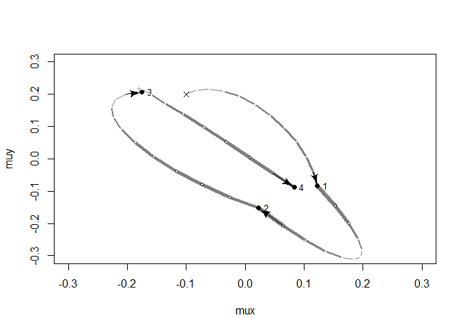<!-- -->


```r
# HMC2 <- function (U, grad_U, epsilon, L, current_q) {
# q = current_q
# p = rnorm(length(q),0,1) # random flick - p is momentum.
# current_p = p
# # Make a half step for momentum at the beginning
# p = p - epsilon * grad_U(q) / 2
# # initialize bookkeeping - saves trajectory
# qtraj <- matrix(NA,nrow=L+1,ncol=length(q))
# ptraj <- qtraj
# qtraj[1,] <- current_q
# ptraj[1,] <- p
# Alternate full steps for position and momentum
# for ( i in 1:L ) {
# q = q + epsilon * p # Full step for the position
# # Make a full step for the momentum, except at end of trajectory
# if ( i!=L ) {
# p = p - epsilon * grad_U(q)
# ptraj[i+1,] <- p
# }
# qtraj[i+1,] <- q
# }
# # Make a half step for momentum at the end
# p = p - epsilon * grad_U(q) / 2
# ptraj[L+1,] <- p
# # Negate momentum at end of trajectory to make the proposal symmetric
# p = -p
# # Evaluate potential and kinetic energies at start and end of trajectory
# current_U = U(current_q)
# current_K = sum(current_p^2) / 2
# proposed_U = U(q)
# proposed_K = sum(p^2) / 2
# # Accept or reject the state at end of trajectory, returning either
# # the position at the end of the trajectory or the initial position
# accept <- 0
# if (runif(1) < exp(current_U-proposed_U+current_K-proposed_K)) {
# new_q <- q # accept
# accept <- 1
# } else new_q <- current_q # reject
# return(list( q=new_q, traj=qtraj, ptraj=ptraj, accept=accept ))
# }
```

### 9.3.3. Limitations
## 9.4. Easy HMC: ulam


```r
library(rethinking)
data(rugged)
d <- rugged
d$log_gdp <- log(d$rgdppc_2000)
dd <- d[ complete.cases(d$rgdppc_2000) , ]
dd$log_gdp_std <- dd$log_gdp / mean(dd$log_gdp)
dd$rugged_std <- dd$rugged / max(dd$rugged)
dd$cid <- ifelse( dd$cont_africa==1 , 1 , 2 )
```


```r
m8.5 <- quap(
  alist(
    log_gdp_std ~ dnorm( mu , sigma ) ,
    mu <- a[cid] + b[cid]*( rugged_std - 0.215 ) ,
    a[cid] ~ dnorm( 1 , 0.1 ) ,
    b[cid] ~ dnorm( 0 , 0.3 ) ,
    sigma ~ dexp( 1 )
    ),
data=dd )
precis( m8.5 , depth=2 )
```

```
##             mean          sd        5.5%       94.5%
## a[1]   0.8865640 0.015674552  0.86151302  0.91161495
## a[2]   1.0505666 0.009935872  1.03468714  1.06644602
## b[1]   0.1324981 0.074199237  0.01391344  0.25108286
## b[2]  -0.1426057 0.054745410 -0.23009945 -0.05511197
## sigma  0.1094859 0.005934188  0.10000194  0.11896990
```

### 9.4.1. Preparation


```r
dat_slim <- list(
  log_gdp_std = dd$log_gdp_std,
  rugged_std = dd$rugged_std,
  cid = as.integer( dd$cid )
)
str(dat_slim)
```

```
## List of 3
##  $ log_gdp_std: num [1:170] 0.88 0.965 1.166 1.104 0.915 ...
##  $ rugged_std : num [1:170] 0.138 0.553 0.124 0.125 0.433 ...
##  $ cid        : int [1:170] 1 2 2 2 2 2 2 2 2 1 ...
```

### 9.4.2. Sampling from the posterior


```r
m9.1 <- ulam(
  alist(
    log_gdp_std ~ dnorm( mu , sigma ) ,
    mu <- a[cid] + b[cid]*( rugged_std - 0.215 ) ,
    a[cid] ~ dnorm( 1 , 0.1 ) ,
    b[cid] ~ dnorm( 0 , 0.3 ) ,
    sigma ~ dexp( 1 )
    ) ,
data=dat_slim , chains=1)
```

```
## 
## SAMPLING FOR MODEL '4e638bc82c4247257e76c1202e0a46c7' NOW (CHAIN 1).
## Chain 1: 
## Chain 1: Gradient evaluation took 0 seconds
## Chain 1: 1000 transitions using 10 leapfrog steps per transition would take 0 seconds.
## Chain 1: Adjust your expectations accordingly!
## Chain 1: 
## Chain 1: 
## Chain 1: Iteration:   1 / 1000 [  0%]  (Warmup)
## Chain 1: Iteration: 100 / 1000 [ 10%]  (Warmup)
## Chain 1: Iteration: 200 / 1000 [ 20%]  (Warmup)
## Chain 1: Iteration: 300 / 1000 [ 30%]  (Warmup)
## Chain 1: Iteration: 400 / 1000 [ 40%]  (Warmup)
## Chain 1: Iteration: 500 / 1000 [ 50%]  (Warmup)
## Chain 1: Iteration: 501 / 1000 [ 50%]  (Sampling)
## Chain 1: Iteration: 600 / 1000 [ 60%]  (Sampling)
## Chain 1: Iteration: 700 / 1000 [ 70%]  (Sampling)
## Chain 1: Iteration: 800 / 1000 [ 80%]  (Sampling)
## Chain 1: Iteration: 900 / 1000 [ 90%]  (Sampling)
## Chain 1: Iteration: 1000 / 1000 [100%]  (Sampling)
## Chain 1: 
## Chain 1:  Elapsed Time: 0.05 seconds (Warm-up)
## Chain 1:                0.032 seconds (Sampling)
## Chain 1:                0.082 seconds (Total)
## Chain 1:
```


```r
precis( m9.1 , depth=2 )
```

```
##             mean          sd       5.5%       94.5%    n_eff      Rhat
## a[1]   0.8860276 0.015017334  0.8610820  0.90935448 611.9029 0.9992640
## a[2]   1.0507103 0.009962509  1.0346462  1.06597616 758.1026 0.9983919
## b[1]   0.1283696 0.069453611  0.0178113  0.23858296 383.5598 0.9991305
## b[2]  -0.1441684 0.054272764 -0.2330822 -0.05543733 651.4452 0.9987844
## sigma  0.1110400 0.005960409  0.1021757  0.12117579 693.2185 0.9997997
```


```r
stancode(m9.1)
```

```
## data{
##     vector[170] log_gdp_std;
##     vector[170] rugged_std;
##     int cid[170];
## }
## parameters{
##     vector[2] a;
##     vector[2] b;
##     real<lower=0> sigma;
## }
## model{
##     vector[170] mu;
##     sigma ~ exponential( 1 );
##     b ~ normal( 0 , 0.3 );
##     a ~ normal( 1 , 0.1 );
##     for ( i in 1:170 ) {
##         mu[i] = a[cid[i]] + b[cid[i]] * (rugged_std[i] - 0.215);
##     }
##     log_gdp_std ~ normal( mu , sigma );
## }
```

### 9.4.3. Sampling again, in parallel


```r
m9.1 <- ulam(
  alist(
    log_gdp_std ~ dnorm( mu , sigma ) ,
    mu <- a[cid] + b[cid]*( rugged_std - 0.215 ) ,
    a[cid] ~ dnorm( 1 , 0.1 ) ,
    b[cid] ~ dnorm( 0 , 0.3 ) ,
    sigma ~ dexp( 1 )
    ) ,
data=dat_slim , chains=4 , cores=4 , iter=1000)
```

```
## recompiling to avoid crashing R session
```


```r
precis( m9.1 , depth=2 )
```

```
##             mean          sd         5.5%       94.5%    n_eff      Rhat
## a[1]   0.8864428 0.016284165  0.859943580  0.91291113 2632.242 0.9986519
## a[2]   1.0507178 0.010446356  1.034351525  1.06743151 2894.188 1.0000595
## b[1]   0.1316973 0.077286606  0.004242543  0.25560170 2333.190 0.9998321
## b[2]  -0.1426273 0.056011176 -0.229962049 -0.05168892 2801.616 1.0007067
## sigma  0.1117562 0.006122426  0.102490248  0.12173577 2010.857 0.9996732
```


```r
stancode(m9.1)
```

```
## data{
##     vector[170] log_gdp_std;
##     vector[170] rugged_std;
##     int cid[170];
## }
## parameters{
##     vector[2] a;
##     vector[2] b;
##     real<lower=0> sigma;
## }
## model{
##     vector[170] mu;
##     sigma ~ exponential( 1 );
##     b ~ normal( 0 , 0.3 );
##     a ~ normal( 1 , 0.1 );
##     for ( i in 1:170 ) {
##         mu[i] = a[cid[i]] + b[cid[i]] * (rugged_std[i] - 0.215);
##     }
##     log_gdp_std ~ normal( mu , sigma );
## }
```


```r
show( m9.1 )
```

```
## Hamiltonian Monte Carlo approximation
## 2000 samples from 4 chains
## 
## Sampling durations (seconds):
##         warmup sample total
## chain:1   0.07   0.04  0.11
## chain:2   0.09   0.04  0.13
## chain:3   0.07   0.05  0.12
## chain:4   0.07   0.05  0.12
## 
## Formula:
## log_gdp_std ~ dnorm(mu, sigma)
## mu <- a[cid] + b[cid] * (rugged_std - 0.215)
## a[cid] ~ dnorm(1, 0.1)
## b[cid] ~ dnorm(0, 0.3)
## sigma ~ dexp(1)
```

### 9.4.4. Visualization


```r
pairs( m9.1 )
```

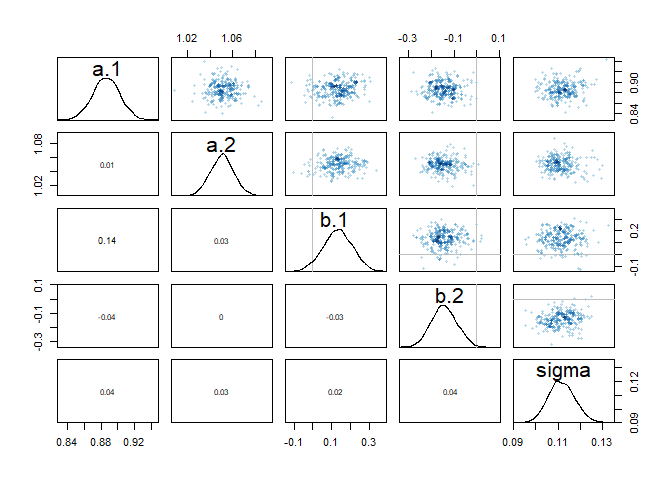<!-- -->

### 9.4.5. Checking the chain


```r
traceplot( m9.1 )
trankplot( m9.1 , n_cols=2 )
```

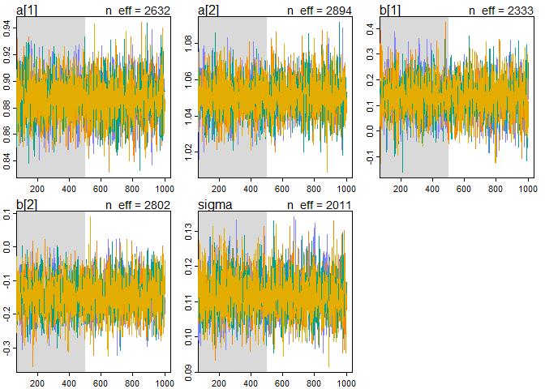<!-- -->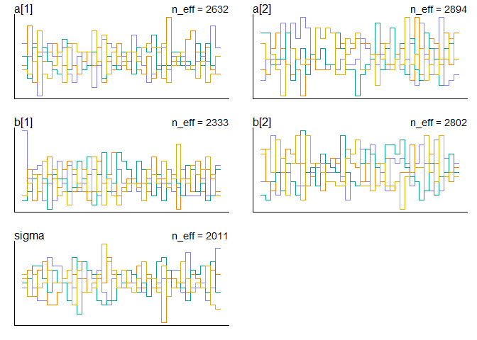<!-- -->

## 9.5. Care and feeding of your Markov chain
### 9.5.1. How many samples do you need?
### 9.5.2. How many chains do you need?
### 9.5.3. Taming a wild chain

```r
y <- c(-1.00000000001, 1.000000001)
set.seed(11)
m9.2 <- ulam(
  alist(
    y ~ dnorm(mu , sigma),
    mu <- alpha,
    alpha ~ dnorm(0, 1000),
    sigma ~ dexp(0.0001)
    ),
  data = list(y = y), chains = 2
)
```

```
## 
## SAMPLING FOR MODEL 'd26c527083e7eda89b17a8c2eccd6019' NOW (CHAIN 1).
## Chain 1: 
## Chain 1: Gradient evaluation took 0 seconds
## Chain 1: 1000 transitions using 10 leapfrog steps per transition would take 0 seconds.
## Chain 1: Adjust your expectations accordingly!
## Chain 1: 
## Chain 1: 
## Chain 1: Iteration:   1 / 1000 [  0%]  (Warmup)
## Chain 1: Iteration: 100 / 1000 [ 10%]  (Warmup)
## Chain 1: Iteration: 200 / 1000 [ 20%]  (Warmup)
## Chain 1: Iteration: 300 / 1000 [ 30%]  (Warmup)
## Chain 1: Iteration: 400 / 1000 [ 40%]  (Warmup)
## Chain 1: Iteration: 500 / 1000 [ 50%]  (Warmup)
## Chain 1: Iteration: 501 / 1000 [ 50%]  (Sampling)
## Chain 1: Iteration: 600 / 1000 [ 60%]  (Sampling)
## Chain 1: Iteration: 700 / 1000 [ 70%]  (Sampling)
## Chain 1: Iteration: 800 / 1000 [ 80%]  (Sampling)
## Chain 1: Iteration: 900 / 1000 [ 90%]  (Sampling)
## Chain 1: Iteration: 1000 / 1000 [100%]  (Sampling)
## Chain 1: 
## Chain 1:  Elapsed Time: 0.032 seconds (Warm-up)
## Chain 1:                0.025 seconds (Sampling)
## Chain 1:                0.057 seconds (Total)
## Chain 1: 
## 
## SAMPLING FOR MODEL 'd26c527083e7eda89b17a8c2eccd6019' NOW (CHAIN 2).
## Chain 2: 
## Chain 2: Gradient evaluation took 0 seconds
## Chain 2: 1000 transitions using 10 leapfrog steps per transition would take 0 seconds.
## Chain 2: Adjust your expectations accordingly!
## Chain 2: 
## Chain 2: 
## Chain 2: Iteration:   1 / 1000 [  0%]  (Warmup)
## Chain 2: Iteration: 100 / 1000 [ 10%]  (Warmup)
## Chain 2: Iteration: 200 / 1000 [ 20%]  (Warmup)
## Chain 2: Iteration: 300 / 1000 [ 30%]  (Warmup)
## Chain 2: Iteration: 400 / 1000 [ 40%]  (Warmup)
## Chain 2: Iteration: 500 / 1000 [ 50%]  (Warmup)
## Chain 2: Iteration: 501 / 1000 [ 50%]  (Sampling)
## Chain 2: Iteration: 600 / 1000 [ 60%]  (Sampling)
## Chain 2: Iteration: 700 / 1000 [ 70%]  (Sampling)
## Chain 2: Iteration: 800 / 1000 [ 80%]  (Sampling)
## Chain 2: Iteration: 900 / 1000 [ 90%]  (Sampling)
## Chain 2: Iteration: 1000 / 1000 [100%]  (Sampling)
## Chain 2: 
## Chain 2:  Elapsed Time: 0.093 seconds (Warm-up)
## Chain 2:                0.008 seconds (Sampling)
## Chain 2:                0.101 seconds (Total)
## Chain 2:
```

```
## Warning: There were 278 divergent transitions after warmup. Increasing adapt_delta above 0.95 may help. See
## http://mc-stan.org/misc/warnings.html#divergent-transitions-after-warmup
```

```
## Warning: Examine the pairs() plot to diagnose sampling problems
```

```
## Warning: The largest R-hat is 1.37, indicating chains have not mixed.
## Running the chains for more iterations may help. See
## http://mc-stan.org/misc/warnings.html#r-hat
```

```
## Warning: Bulk Effective Samples Size (ESS) is too low, indicating posterior means and medians may be unreliable.
## Running the chains for more iterations may help. See
## http://mc-stan.org/misc/warnings.html#bulk-ess
```

```
## Warning: Tail Effective Samples Size (ESS) is too low, indicating posterior variances and tail quantiles may be unreliable.
## Running the chains for more iterations may help. See
## http://mc-stan.org/misc/warnings.html#tail-ess
```

```r
precis(m9.2)
```

```
##            mean        sd        5.5%     94.5%     n_eff     Rhat
## alpha  25.76235  354.0627 -497.219457  572.3256 122.23175 1.004826
## sigma 506.74461 1337.2069    9.479005 2044.6988  66.26004 1.056247
```

```r
pairs( m9.2@stanfit )
```

```
## Warning in KernSmooth::bkde2D(x, bandwidth = bandwidth, gridsize = nbin, :
## Binning grid too coarse for current (small) bandwidth: consider increasing
## 'gridsize'
```

```
## Warning in KernSmooth::bkde2D(x, bandwidth = bandwidth, gridsize = nbin, :
## Binning grid too coarse for current (small) bandwidth: consider increasing
## 'gridsize'

## Warning in KernSmooth::bkde2D(x, bandwidth = bandwidth, gridsize = nbin, :
## Binning grid too coarse for current (small) bandwidth: consider increasing
## 'gridsize'

## Warning in KernSmooth::bkde2D(x, bandwidth = bandwidth, gridsize = nbin, :
## Binning grid too coarse for current (small) bandwidth: consider increasing
## 'gridsize'

## Warning in KernSmooth::bkde2D(x, bandwidth = bandwidth, gridsize = nbin, :
## Binning grid too coarse for current (small) bandwidth: consider increasing
## 'gridsize'
```

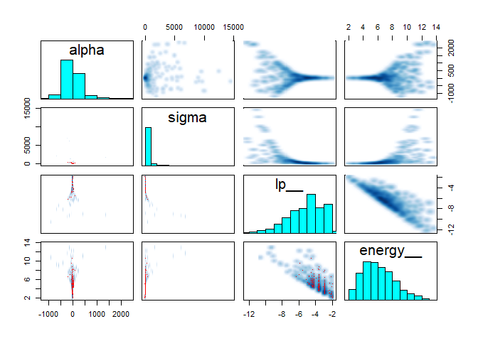<!-- -->

```r
traceplot(m9.2)
```

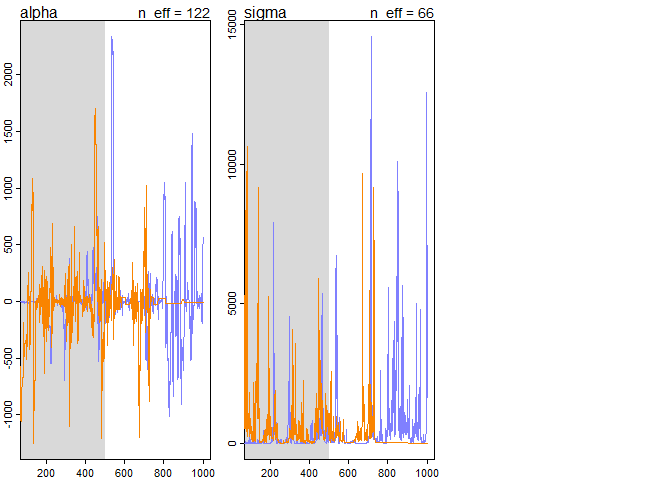<!-- -->


```r
set.seed(11)
m9.3 <- ulam(
    alist(
        y ~ dnorm( mu , sigma ) ,
        mu <- alpha ,
        alpha ~ dnorm( 1 , 10 ) ,
        sigma ~ dexp( 1 )
    ) ,
    data=list(y=y) , chains=2 )
```

```
## 
## SAMPLING FOR MODEL '593afb1307e5b69f89a21ad207f22894' NOW (CHAIN 1).
## Chain 1: 
## Chain 1: Gradient evaluation took 0 seconds
## Chain 1: 1000 transitions using 10 leapfrog steps per transition would take 0 seconds.
## Chain 1: Adjust your expectations accordingly!
## Chain 1: 
## Chain 1: 
## Chain 1: Iteration:   1 / 1000 [  0%]  (Warmup)
## Chain 1: Iteration: 100 / 1000 [ 10%]  (Warmup)
## Chain 1: Iteration: 200 / 1000 [ 20%]  (Warmup)
## Chain 1: Iteration: 300 / 1000 [ 30%]  (Warmup)
## Chain 1: Iteration: 400 / 1000 [ 40%]  (Warmup)
## Chain 1: Iteration: 500 / 1000 [ 50%]  (Warmup)
## Chain 1: Iteration: 501 / 1000 [ 50%]  (Sampling)
## Chain 1: Iteration: 600 / 1000 [ 60%]  (Sampling)
## Chain 1: Iteration: 700 / 1000 [ 70%]  (Sampling)
## Chain 1: Iteration: 800 / 1000 [ 80%]  (Sampling)
## Chain 1: Iteration: 900 / 1000 [ 90%]  (Sampling)
## Chain 1: Iteration: 1000 / 1000 [100%]  (Sampling)
## Chain 1: 
## Chain 1:  Elapsed Time: 0.016 seconds (Warm-up)
## Chain 1:                0.015 seconds (Sampling)
## Chain 1:                0.031 seconds (Total)
## Chain 1: 
## 
## SAMPLING FOR MODEL '593afb1307e5b69f89a21ad207f22894' NOW (CHAIN 2).
## Chain 2: 
## Chain 2: Gradient evaluation took 0 seconds
## Chain 2: 1000 transitions using 10 leapfrog steps per transition would take 0 seconds.
## Chain 2: Adjust your expectations accordingly!
## Chain 2: 
## Chain 2: 
## Chain 2: Iteration:   1 / 1000 [  0%]  (Warmup)
## Chain 2: Iteration: 100 / 1000 [ 10%]  (Warmup)
## Chain 2: Iteration: 200 / 1000 [ 20%]  (Warmup)
## Chain 2: Iteration: 300 / 1000 [ 30%]  (Warmup)
## Chain 2: Iteration: 400 / 1000 [ 40%]  (Warmup)
## Chain 2: Iteration: 500 / 1000 [ 50%]  (Warmup)
## Chain 2: Iteration: 501 / 1000 [ 50%]  (Sampling)
## Chain 2: Iteration: 600 / 1000 [ 60%]  (Sampling)
## Chain 2: Iteration: 700 / 1000 [ 70%]  (Sampling)
## Chain 2: Iteration: 800 / 1000 [ 80%]  (Sampling)
## Chain 2: Iteration: 900 / 1000 [ 90%]  (Sampling)
## Chain 2: Iteration: 1000 / 1000 [100%]  (Sampling)
## Chain 2: 
## Chain 2:  Elapsed Time: 0.017 seconds (Warm-up)
## Chain 2:                0.015 seconds (Sampling)
## Chain 2:                0.032 seconds (Total)
## Chain 2:
```

```r
precis( m9.3 )
```

```
##            mean        sd       5.5%    94.5%    n_eff     Rhat
## alpha 0.1117823 1.1137601 -1.5702892 1.965278 364.0059 1.002072
## sigma 1.5203961 0.7227999  0.6420888 2.863324 316.5358 1.005488
```

```r
pairs( m9.3@stanfit )
```

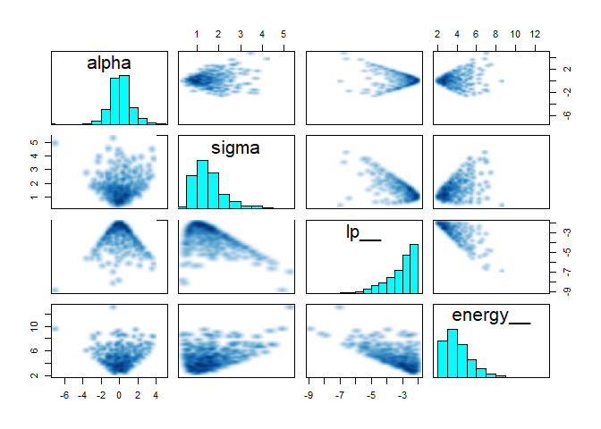<!-- -->

```r
traceplot(m9.3)
```

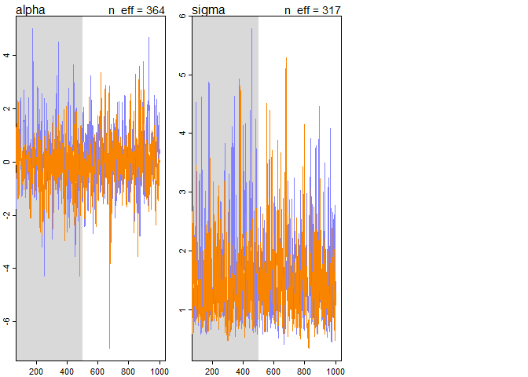<!-- -->

### 9.5.4. Non-identifiable parameters


```r
set.seed(41)
y <- rnorm( 100 , mean=0 , sd=1 )
m9.4 <- ulam(
  alist(
    y ~ dnorm( mu , sigma ) ,
    mu <- a1 + a2 ,
    a1 ~ dnorm( 0 , 1000 ),
    a2 ~ dnorm( 0 , 1000 ),
    sigma ~ dexp( 1 )
  ) ,
  data=list(y=y) , chains=2 , cores = 2)
```

```
## Warning: There were 850 transitions after warmup that exceeded the maximum treedepth. Increase max_treedepth above 10. See
## http://mc-stan.org/misc/warnings.html#maximum-treedepth-exceeded
```

```
## Warning: Examine the pairs() plot to diagnose sampling problems
```

```
## Warning: The largest R-hat is 1.44, indicating chains have not mixed.
## Running the chains for more iterations may help. See
## http://mc-stan.org/misc/warnings.html#r-hat
```

```
## Warning: Bulk Effective Samples Size (ESS) is too low, indicating posterior means and medians may be unreliable.
## Running the chains for more iterations may help. See
## http://mc-stan.org/misc/warnings.html#bulk-ess
```

```
## Warning: Tail Effective Samples Size (ESS) is too low, indicating posterior variances and tail quantiles may be unreliable.
## Running the chains for more iterations may help. See
## http://mc-stan.org/misc/warnings.html#tail-ess
```

```r
precis( m9.4 )
```

```
##              mean           sd          5.5%       94.5%    n_eff     Rhat
## a1    -647.972890 246.15123408 -1031.3053795 -289.083627 1.977311 1.641353
## a2     648.165109 246.15155921   289.2819267 1031.524094 1.977290 1.641338
## sigma    1.026928   0.07054863     0.9272982    1.165109 4.069786 1.444470
```

```r
traceplot(m9.4)
```

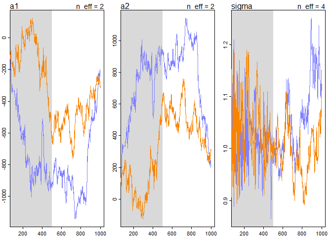<!-- -->


```r
m9.5 <- ulam(
alist(
y ~ dnorm( mu , sigma ) ,
mu <- a1 + a2 ,
a1 ~ dnorm( 0 , 10 ),
a2 ~ dnorm( 0 , 10 ),
sigma ~ dexp( 1 )
) ,
data=list(y=y) , chains=2 , cores = 2)
precis( m9.5 )
```

```
##             mean         sd        5.5%     94.5%    n_eff     Rhat
## a1    -0.1732192 6.60247335  -9.9217363 10.194911 310.3517 1.000681
## a2     0.3618399 6.60570189 -10.0035768 10.097991 310.4873 1.000600
## sigma  1.0300695 0.07024613   0.9256849  1.145826 389.2798 1.002508
```

```r
traceplot(m9.5)
```

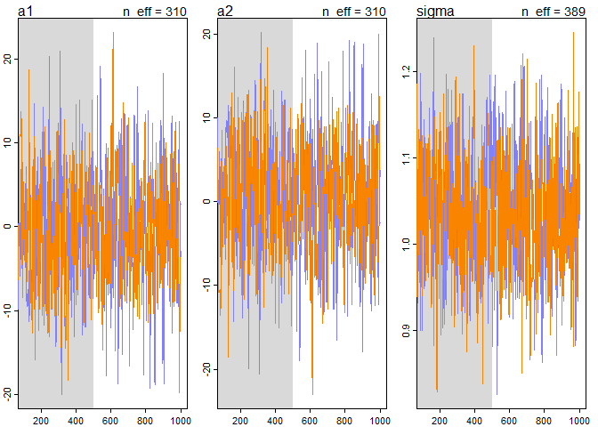<!-- -->


8E4
8M3
8H3
8H4
