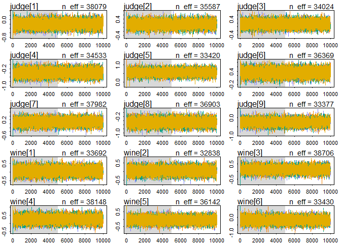
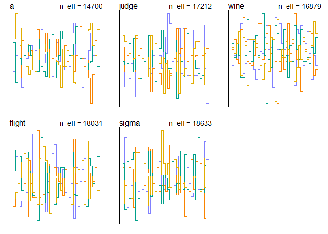
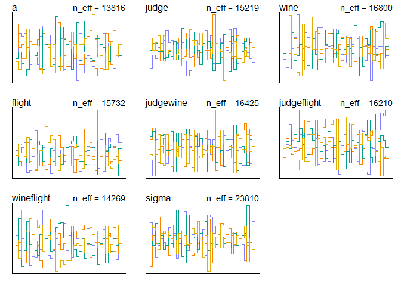

  


```r
library(tidyverse)
```

```
## -- Attaching packages ---------------------------------------------------------------------------------------------------- tidyverse 1.2.1 --
```

```
## v ggplot2 3.2.1     v purrr   0.3.2
## v tibble  2.1.3     v dplyr   0.8.3
## v tidyr   0.8.3     v stringr 1.4.0
## v readr   1.3.1     v forcats 0.4.0
```

```
## -- Conflicts ------------------------------------------------------------------------------------------------------- tidyverse_conflicts() --
## x dplyr::filter() masks stats::filter()
## x dplyr::lag()    masks stats::lag()
```

```r
library(rethinking)
```

```
## Loading required package: rstan
```

```
## Loading required package: StanHeaders
```

```
## rstan (Version 2.19.2, GitRev: 2e1f913d3ca3)
```

```
## For execution on a local, multicore CPU with excess RAM we recommend calling
## options(mc.cores = parallel::detectCores()).
## To avoid recompilation of unchanged Stan programs, we recommend calling
## rstan_options(auto_write = TRUE)
```

```
## For improved execution time, we recommend calling
## Sys.setenv(LOCAL_CPPFLAGS = '-march=native')
## although this causes Stan to throw an error on a few processors.
```

```
## 
## Attaching package: 'rstan'
```

```
## The following object is masked from 'package:tidyr':
## 
##     extract
```

```
## Loading required package: parallel
```

```
## Loading required package: dagitty
```

```
## rethinking (Version 1.90)
```

```
## 
## Attaching package: 'rethinking'
```

```
## The following object is masked from 'package:purrr':
## 
##     map
```

```
## The following object is masked from 'package:stats':
## 
##     rstudent
```

```r
options(mc.cores = parallel::detectCores())
rstan_options(auto_write = TRUE)
Sys.setenv(LOCAL_CPPFLAGS = '-march=native')
```

# 1. Consider the data(Wines2012) data table. These data are expert ratings of 20 different French and American wines by 9 different French and American judges. Your goal is to model _score_, the subjective rating assigned by each judge to each wine. I recommend standardizing.  

In this first problem, consider only variation among judges and wines. Construct index vaiables of _judge_ and _wine_ and then use these index variables to construct a linear regression model. Justify your priors. You should end up with 9 judge parameters and 20 wine parameters. Use _ulam_ instead of quap to build this model, and be sure to check the chains for convergence. If you'd rather build and model directly in Stan or PyMC3, go ahead. I just want you to use Hamiltonian Monte Carlo instead of quadratic approximation.  

How do you interprest the variation among individual judges and invidual wines? Do you notice any patterns, just by plotting differences? Which judges gave the highest/lowest ratings? Which wines were rated worst/best on average?


```r
#?Wines2012
data("Wines2012")
dat <- Wines2012
head(dat)
```

```
##             judge flight wine score wine.amer judge.amer
## 1 Jean-M Cardebat  white   A1    10         1          0
## 2 Jean-M Cardebat  white   B1    13         1          0
## 3 Jean-M Cardebat  white   C1    14         0          0
## 4 Jean-M Cardebat  white   D1    15         0          0
## 5 Jean-M Cardebat  white   E1     8         1          0
## 6 Jean-M Cardebat  white   F1    13         1          0
```

```r
summary(dat)
```

```
##              judge      flight        wine         score     
##  Daniele Meulder:20   red  :90   A1     :  9   Min.   : 7.0  
##  Francis Schott :20   white:90   A2     :  9   1st Qu.:12.0  
##  Jamal Rayyis   :20              B1     :  9   Median :14.5  
##  Jean-M Cardebat:20              B2     :  9   Mean   :14.2  
##  John Foy       :20              C1     :  9   3rd Qu.:16.0  
##  Linda Murphy   :20              C2     :  9   Max.   :19.5  
##  (Other)        :60              (Other):126                 
##    wine.amer     judge.amer    
##  Min.   :0.0   Min.   :0.0000  
##  1st Qu.:0.0   1st Qu.:0.0000  
##  Median :1.0   Median :1.0000  
##  Mean   :0.6   Mean   :0.5556  
##  3rd Qu.:1.0   3rd Qu.:1.0000  
##  Max.   :1.0   Max.   :1.0000  
## 
```

```r
dat_slim <- list(
j = as.integer(as.factor(dat$judge)),
w = as.integer(as.factor((dat$wine))),
score_std = (dat$score - mean(dat$score)) / sd(dat$score) 
)

model_1 <- ulam(
alist(
score_std ~ dnorm(mu, sigma),
mu <- judge[j] + wine[w],
judge[j] ~ dnorm(0, 0.25),
wine[w] ~ dnorm(0, 0.25),
sigma ~ dexp(1)
),
data = dat_slim, chains = 4, iter = 10000, cores = 4, log_lik = T
)

precis(model_1, depth = 2)
```

```
##                  mean         sd        5.5%        94.5%    n_eff
<<<<<<< HEAD
## judge[1] -0.200818979 0.15739081 -0.45420522  0.050480577 34642.19
## judge[2]  0.152091146 0.15536617 -0.09679826  0.400581530 34210.78
## judge[3]  0.145359606 0.15635813 -0.10471046  0.394165361 33343.50
## judge[4] -0.386782632 0.15760981 -0.63738297 -0.134726487 34055.68
## judge[5]  0.569394196 0.15726859  0.31683874  0.821170287 32904.75
## judge[6]  0.340131381 0.15706508  0.08867240  0.591262105 32504.66
## judge[7]  0.092762787 0.15541863 -0.15730873  0.340734406 34092.01
## judge[8] -0.470155329 0.15888656 -0.72477133 -0.215107295 37003.16
## judge[9] -0.247775761 0.15473664 -0.49337944  0.000905801 33889.84
## wine[1]   0.066464234 0.18879269 -0.23445458  0.367930372 32810.89
## wine[2]   0.047687543 0.19020421 -0.25667985  0.352784320 34101.88
## wine[3]   0.129802466 0.19039224 -0.17397641  0.433132146 36491.09
## wine[4]   0.264785659 0.19084066 -0.04015781  0.566527932 34106.39
## wine[5]  -0.059874662 0.18753694 -0.36146563  0.241182399 31768.57
## wine[6]  -0.175300393 0.18972801 -0.47989855  0.129756359 33708.10
## wine[7]   0.138534717 0.19053621 -0.16307665  0.443940796 34486.45
## wine[8]   0.130653245 0.19025801 -0.17454084  0.434245354 34553.91
## wine[9]   0.041359070 0.18905635 -0.25580981  0.345524198 34974.57
## wine[10]  0.057621260 0.18946192 -0.24735526  0.360002390 33104.39
## wine[11] -0.003404430 0.18987778 -0.30808695  0.297352976 33367.05
## wine[12] -0.014820828 0.18836542 -0.31620386  0.284144913 36449.26
## wine[13] -0.050324533 0.18778745 -0.34971000  0.247483664 35921.92
## wine[14]  0.003086298 0.18843743 -0.29672516  0.305998312 34362.62
## wine[15] -0.104177328 0.18995143 -0.40739642  0.197651763 33761.88
## wine[16] -0.094375456 0.19194206 -0.39830643  0.213822178 34805.74
## wine[17] -0.068134609 0.18922069 -0.37000972  0.231716932 33929.50
## wine[18] -0.408450093 0.19295230 -0.71747725 -0.099771277 34690.16
## wine[19] -0.075050794 0.19061069 -0.37860076  0.230443846 34856.80
## wine[20]  0.183436422 0.18887753 -0.11798633  0.483414209 34985.82
## sigma     0.865525732 0.04951808  0.78981822  0.947962691 27891.60
##               Rhat
## judge[1] 0.9998963
## judge[2] 0.9999026
## judge[3] 0.9999111
## judge[4] 0.9998442
## judge[5] 0.9998565
## judge[6] 0.9998946
## judge[7] 0.9998926
## judge[8] 0.9998683
## judge[9] 0.9999893
## wine[1]  0.9999792
## wine[2]  0.9998709
## wine[3]  0.9999256
## wine[4]  0.9998621
## wine[5]  0.9998495
## wine[6]  0.9999628
## wine[7]  0.9998819
## wine[8]  1.0000419
## wine[9]  0.9998580
## wine[10] 0.9998996
## wine[11] 0.9998989
## wine[12] 0.9998668
## wine[13] 0.9998514
## wine[14] 0.9999004
## wine[15] 0.9999159
## wine[16] 0.9998287
## wine[17] 0.9998572
## wine[18] 0.9998397
## wine[19] 0.9998849
## wine[20] 0.9998381
## sigma    1.0002530
=======
## judge[1] -0.201028713 0.15694092 -0.44935719  0.050605426 40414.58
## judge[2]  0.152494394 0.15634351 -0.09539867  0.405247211 39632.14
## judge[3]  0.147822205 0.15503807 -0.10325976  0.393643056 39295.16
## judge[4] -0.387333679 0.15868242 -0.64249665 -0.132290926 39819.27
## judge[5]  0.570124092 0.15630154  0.32097868  0.817807169 38411.87
## judge[6]  0.339778765 0.15801448  0.09000066  0.591720042 39315.35
## judge[7]  0.093853040 0.15495266 -0.15465381  0.344523595 33922.34
## judge[8] -0.468059020 0.15550344 -0.71424688 -0.216449667 39323.48
## judge[9] -0.247275489 0.15642256 -0.49737284  0.003534901 37758.33
## wine[1]   0.066677320 0.19031767 -0.23269044  0.373589035 41525.75
## wine[2]   0.047069380 0.19049592 -0.25913727  0.350489187 38727.56
## wine[3]   0.128745986 0.19089451 -0.17793767  0.434167584 42306.70
## wine[4]   0.264892604 0.19061629 -0.03978893  0.566514392 40281.08
## wine[5]  -0.059397141 0.18988129 -0.36095897  0.245561322 42054.07
## wine[6]  -0.175347090 0.19145833 -0.48113951  0.129900096 41997.63
## wine[7]   0.137067363 0.19219553 -0.16558080  0.445794873 42541.32
## wine[8]   0.130204517 0.19285802 -0.18051736  0.438470379 43303.84
## wine[9]   0.039734003 0.18813834 -0.25840136  0.339916425 40617.43
## wine[10]  0.058497578 0.18862964 -0.23919632  0.358455873 40003.48
## wine[11] -0.005951960 0.18848143 -0.30746886  0.293193615 37523.29
## wine[12] -0.015692079 0.18967611 -0.31910891  0.288079446 40849.70
## wine[13] -0.050542783 0.18895586 -0.35199758  0.251487499 39563.12
## wine[14]  0.003961854 0.19121641 -0.30045688  0.310029404 40254.81
## wine[15] -0.104885445 0.19290696 -0.41383314  0.203662927 41662.18
## wine[16] -0.093664056 0.19036298 -0.39917020  0.212538889 43392.08
## wine[17] -0.067356917 0.19062011 -0.36739669  0.239296613 40343.66
## wine[18] -0.410428744 0.19064927 -0.71331703 -0.106605164 40361.12
## wine[19] -0.078671394 0.18832057 -0.38173358  0.221455579 39762.31
## wine[20]  0.183259061 0.19227034 -0.12390067  0.488877446 43449.31
## sigma     0.866086612 0.04929055  0.79055400  0.947424201 32379.82
##               Rhat
## judge[1] 0.9999107
## judge[2] 0.9999927
## judge[3] 0.9998965
## judge[4] 0.9998956
## judge[5] 0.9998567
## judge[6] 0.9998725
## judge[7] 0.9999335
## judge[8] 0.9999481
## judge[9] 0.9999700
## wine[1]  0.9998597
## wine[2]  0.9998664
## wine[3]  0.9998879
## wine[4]  0.9999523
## wine[5]  0.9999336
## wine[6]  0.9998242
## wine[7]  0.9998799
## wine[8]  1.0000185
## wine[9]  0.9998670
## wine[10] 0.9998309
## wine[11] 0.9998967
## wine[12] 0.9999901
## wine[13] 0.9998984
## wine[14] 0.9998934
## wine[15] 0.9998537
## wine[16] 0.9998681
## wine[17] 0.9998981
## wine[18] 0.9999013
## wine[19] 0.9999540
## wine[20] 0.9998325
## sigma    0.9999328
>>>>>>> fc4f05e334f1d3e57459cc464a0f582e55bf9197
```

```r
traceplot(model_1)
```

```
## Waiting to draw page 2 of 2
```

<!-- --><!-- -->

```r
trankplot(model_1)
```

```
## Waiting to draw page 2 of 2
```

<!-- --><!-- -->

```r
par(mfrow = c(1,1))
plot(precis(model_1, depth = 2))
```

<!-- -->

The judges clearly vary with some always giving bad, some always giving average, and some always giving good scores. The wines were all pretty much centered around uniforms except wine 18 which received bad scores.

# 2. Now consider three features of the wines and judges:  
1. `flight`: Whether the wine is red or white  
2. `wine.amer`: Indicator variable for American wines
3. `judge.amer`: Indictor variable for American judges

Use the indicator or index variables to model the influence of these features on the scores. Omit the individual judges and wine index variables from Problem 1. Do not include interaction effects yet. Again use `ulam`, justify your priors, and be sure to check the chains. What do you conclude about the differences among the wines and judges? Try to relate the results to the inferences in Problem 1.


```r
dat_slim_2 <- list(
f = ifelse(dat$flight == "white", 0L, 1L),
j = dat$judge.amer,
w = dat$wine.amer,
score_std = (dat$score - mean(dat$score)) / sd(dat$score)
)
dat_slim_2
```

```
## $f
##   [1] 0 0 0 0 0 0 0 0 0 0 0 0 0 0 0 0 0 0 0 0 0 0 0 0 0 0 0 0 0 0 0 0 0 0 0
##  [36] 0 0 0 0 0 0 0 0 0 0 0 0 0 0 0 0 0 0 0 0 0 0 0 0 0 0 0 0 0 0 0 0 0 0 0
##  [71] 0 0 0 0 0 0 0 0 0 0 0 0 0 0 0 0 0 0 0 0 1 1 1 1 1 1 1 1 1 1 1 1 1 1 1
## [106] 1 1 1 1 1 1 1 1 1 1 1 1 1 1 1 1 1 1 1 1 1 1 1 1 1 1 1 1 1 1 1 1 1 1 1
## [141] 1 1 1 1 1 1 1 1 1 1 1 1 1 1 1 1 1 1 1 1 1 1 1 1 1 1 1 1 1 1 1 1 1 1 1
## [176] 1 1 1 1 1
## 
## $j
##   [1] 0 0 0 0 0 0 0 0 0 0 1 1 1 1 1 1 1 1 1 1 1 1 1 1 1 1 1 1 1 1 0 0 0 0 0
##  [36] 0 0 0 0 0 1 1 1 1 1 1 1 1 1 1 1 1 1 1 1 1 1 1 1 1 0 0 0 0 0 0 0 0 0 0
##  [71] 0 0 0 0 0 0 0 0 0 0 1 1 1 1 1 1 1 1 1 1 0 0 0 0 0 0 0 0 0 0 1 1 1 1 1
## [106] 1 1 1 1 1 1 1 1 1 1 1 1 1 1 1 0 0 0 0 0 0 0 0 0 0 1 1 1 1 1 1 1 1 1 1
## [141] 1 1 1 1 1 1 1 1 1 1 0 0 0 0 0 0 0 0 0 0 0 0 0 0 0 0 0 0 0 0 1 1 1 1 1
## [176] 1 1 1 1 1
## 
## $w
##   [1] 1 1 0 0 1 1 1 0 1 0 1 1 0 0 1 1 1 0 1 0 1 1 0 0 1 1 1 0 1 0 1 1 0 0 1
##  [36] 1 1 0 1 0 1 1 0 0 1 1 1 0 1 0 1 1 0 0 1 1 1 0 1 0 1 1 0 0 1 1 1 0 1 0
##  [71] 1 1 0 0 1 1 1 0 1 0 1 1 0 0 1 1 1 0 1 0 0 0 1 1 1 1 0 1 1 0 0 0 1 1 1
## [106] 1 0 1 1 0 0 0 1 1 1 1 0 1 1 0 0 0 1 1 1 1 0 1 1 0 0 0 1 1 1 1 0 1 1 0
## [141] 0 0 1 1 1 1 0 1 1 0 0 0 1 1 1 1 0 1 1 0 0 0 1 1 1 1 0 1 1 0 0 0 1 1 1
## [176] 1 0 1 1 0
## 
## $score_std
##   [1] -1.57660412 -0.45045832 -0.07507639  0.30030555 -2.32736799
##   [6] -0.45045832  0.30030555 -1.20122219 -1.95198605 -0.82584025
##  [11]  0.67568748 -0.07507639 -0.07507639  0.67568748 -0.82584025
##  [16] -1.20122219 -1.20122219 -0.07507639 -1.20122219 -0.07507639
##  [21]  0.67568748  1.05106941  0.67568748  0.30030555  0.11261458
##  [26]  0.11261458  0.67568748  1.05106941  0.30030555  1.23876038
##  [31] -0.07507639  1.80183328 -0.82584025 -1.57660412  1.80183328
##  [36]  1.42645135  1.05106941  0.67568748  1.42645135 -0.07507639
##  [41]  1.05106941 -1.20122219 -0.45045832 -0.07507639 -0.07507639
##  [46] -1.57660412 -1.95198605 -1.95198605 -1.57660412 -1.57660412
##  [51]  0.48799651  0.30030555  1.05106941  1.42645135  0.67568748
##  [56]  1.05106941  0.30030555 -0.07507639  0.67568748  1.05106941
##  [61] -1.57660412  0.30030555 -0.82584025 -0.82584025  0.30030555
##  [66] -0.07507639  0.30030555 -0.82584025  0.30030555 -0.82584025
##  [71]  0.67568748  0.30030555  0.11261458  1.23876038  0.86337845
##  [76] -0.07507639 -0.82584025  0.30030555 -0.45045832 -0.82584025
##  [81]  1.05106941  0.67568748 -0.82584025  1.42645135  0.30030555
##  [86]  0.67568748  0.30030555 -0.07507639  1.05106941  0.30030555
##  [91]  0.30030555 -1.20122219 -0.82584025  0.67568748 -0.07507639
##  [96] -1.20122219  0.11261458 -0.45045832 -1.57660412  0.11261458
## [101] -0.07507639 -1.20122219  0.67568748 -0.82584025 -0.07507639
## [106] -0.45045832 -0.07507639 -0.82584025 -0.45045832 -1.20122219
## [111]  1.23876038  1.80183328  1.42645135  1.42645135  0.30030555
## [116]  0.67568748  1.42645135  1.42645135  1.05106941  1.23876038
## [121] -1.57660412  1.05106941 -1.95198605 -0.07507639  1.80183328
## [126] -0.82584025  0.30030555 -1.57660412 -1.20122219  1.42645135
## [131] -0.45045832  1.05106941 -0.45045832  0.67568748 -0.82584025
## [136]  0.30030555 -1.57660412 -0.82584025 -2.32736799 -1.20122219
## [141] -0.45045832 -0.07507639  1.05106941  0.67568748  0.30030555
## [146]  1.05106941 -0.07507639  0.48799651 -0.45045832  1.42645135
## [151] -0.07507639  0.67568748 -1.20122219  0.67568748 -0.07507639
## [156]  0.30030555 -0.45045832 -1.20122219 -1.57660412  0.30030555
## [161]  0.30030555  1.98952425 -0.07507639 -0.82584025 -0.45045832
## [166]  0.67568748  0.11261458  0.30030555  0.67568748  0.67568748
## [171]  1.80183328  1.42645135 -2.32736799  0.30030555  0.30030555
## [176] -0.82584025  0.30030555  0.67568748 -2.70274992  1.05106941
```

```r
model_2 <- ulam(
alist(
score_std ~ dnorm(mu, sigma),
mu <- a + flight*f + wine*w + judge*j,
a ~ dnorm(0, 0.25),
judge ~ dnorm(0, 0.25),
wine ~ dnorm(0, 0.25),
flight ~ dnorm(0, 0.25),
sigma ~ dexp(1)
),
data = dat_slim_2, chains = 4, iter = 10000, cores = 4, log_lik = T
)

precis(model_2, depth = 2)
```

```
<<<<<<< HEAD
##                mean         sd        5.5%      94.5%    n_eff      Rhat
## a      -0.011122115 0.12436426 -0.20717100 0.18718492 14867.23 1.0000240
## judge   0.180688937 0.12388509 -0.01763664 0.37669134 17964.54 1.0000965
## wine   -0.143950173 0.12493172 -0.34227000 0.05366155 17349.91 0.9999407
## flight -0.003925721 0.12500667 -0.20415311 0.19571424 18023.63 0.9999304
## sigma   0.998341254 0.05237066  0.91896716 1.08399705 18553.85 1.0000037
=======
##               mean         sd       5.5%      94.5%    n_eff      Rhat
## a      -0.01227402 0.12651239 -0.2136656 0.18957014 14192.04 0.9999299
## judge   0.18308876 0.12512859 -0.0165964 0.38486086 17574.57 1.0000891
## wine   -0.14465782 0.12379131 -0.3421095 0.05253385 16896.25 1.0000574
## flight -0.00328568 0.12484107 -0.2031236 0.19616237 17231.76 0.9998873
## sigma   0.99855258 0.05290355  0.9180001 1.08655380 18284.68 0.9998659
>>>>>>> fc4f05e334f1d3e57459cc464a0f582e55bf9197
```

```r
traceplot(model_2)
trankplot(model_2)
```

<!-- -->

```r
par(mfrow = c(1,1))
```

<!-- -->

```r
plot(precis(model_2, depth = 2))
```

<!-- -->

American judges give higher scores and American wines score lower. Red vs White showed basically no difference in scoring.

# 3. Now consider two-way interactions among the three features. You should end up with three different interaction terms in your model. These will be easier to build, if you use indicator varaibles. Again use `ulam`, justify your priors, and be sure to check the chains. Explain what each interaction means. Be sure to interpret the model's predicitons on the outcome scale (mu, the expected score), not on the scale of individual parameters. You can use `link` to help with this, or just use your knowledge of linear model instead.  What do you conclude about the features and the scores? Can you relate the results of your model(s) to the individual judge and wine inferences from Problem 1?
  

```r
model_3 <- ulam(
  alist(
    score_std ~ dnorm(mu, sigma),
    mu <- a + flight*f + wine*w + judge*j + judgewine*w*j + judgeflight*j*f + wineflight*w**f,
    a ~ dnorm(0, 0.25),
    judge ~ dnorm(0, 0.25),
    wine ~ dnorm(0, 0.25),
    flight ~ dnorm(0, 0.25),
    judgewine ~ dnorm(0, 0.25),
    judgeflight ~ dnorm(0, 0.25),
    wineflight ~ dnorm(0, 0.25),
    sigma ~ dexp(1)
  ),
  data = dat_slim_2, chains = 4, iter = 10000, cores = 4, log_lik = T
)

precis(model_3, depth = 2)
```

```
##                    mean         sd        5.5%      94.5%    n_eff
<<<<<<< HEAD
## a            0.10006300 0.15363338 -0.14429696 0.34790443 13596.17
## judge        0.19149495 0.15503315 -0.05537946 0.43937685 15017.72
## wine        -0.04667454 0.15867675 -0.30005946 0.20777159 15054.00
## flight      -0.06309759 0.14588688 -0.29612999 0.16980054 14460.19
## judgewine   -0.01410976 0.17029194 -0.28431708 0.25754355 15625.38
## judgeflight  0.03314188 0.17473097 -0.24704302 0.31362090 14806.19
## wineflight  -0.20060755 0.16309185 -0.46134601 0.06058737 13944.77
## sigma        0.99538277 0.05321402  0.91359345 1.08328785 21184.92
##                  Rhat
## a           1.0003261
## judge       0.9998655
## wine        1.0000183
## flight      1.0002767
## judgewine   0.9998773
## judgeflight 1.0001822
## wineflight  1.0001889
## sigma       1.0001444
=======
## a            0.09827829 0.15464326 -0.14692716 0.34445658 12585.64
## judge        0.19228880 0.15219199 -0.04934258 0.43528852 14471.12
## wine        -0.04835609 0.15565486 -0.29783482 0.19778429 16013.15
## flight      -0.06131419 0.14440989 -0.29297890 0.17034759 14602.67
## judgewine   -0.01461766 0.16973401 -0.28741970 0.25870896 15786.30
## judgeflight  0.03224464 0.17109970 -0.23950334 0.30541381 15350.97
## wineflight  -0.19775806 0.16281263 -0.45899535 0.05913674 12970.86
## sigma        0.99483475 0.05315993  0.91350120 1.08373739 19395.83
##                  Rhat
## a           1.0001020
## judge       1.0000534
## wine        0.9999820
## flight      1.0001821
## judgewine   0.9999336
## judgeflight 0.9999874
## wineflight  0.9999377
## sigma       1.0001218
>>>>>>> fc4f05e334f1d3e57459cc464a0f582e55bf9197
```

```r
traceplot(model_3)
trankplot(model_3)
```

<!-- -->

```r
par(mfrow = c(1,1))
```

<!-- -->

```r
plot(precis(model_3, depth = 2))
```

<!-- -->

```r
pred_dat <- data.frame(
  w = rep(0:1, times = 4),
  j = rep(0:1, each = 4),
  f = rep(c(0,0,1,1), 2)
)

preds <- link(model_3, pred_dat)

row_labels <- paste(ifelse(pred_dat$w == 1, "American_Wine","French_Wine"),
                    ifelse(pred_dat$j == 1, "American_Judge","French_Judge"),
                    ifelse(pred_dat$f == 1, "Red_Wine","White_Wine"), sep = "-")
row_labels
```

```
## [1] "French_Wine-French_Judge-White_Wine"    
## [2] "American_Wine-French_Judge-White_Wine"  
## [3] "French_Wine-French_Judge-Red_Wine"      
## [4] "American_Wine-French_Judge-Red_Wine"    
## [5] "French_Wine-American_Judge-White_Wine"  
## [6] "American_Wine-American_Judge-White_Wine"
## [7] "French_Wine-American_Judge-Red_Wine"    
## [8] "American_Wine-American_Judge-Red_Wine"
```

```r
plot(precis(list(mu = preds), depth = 2), labels = row_labels)
```

<!-- -->

French judges do not appear to like American red wine. American judges really like French red wine.


```r
<<<<<<< HEAD
dat_slim_3 <- list(
f = ifelse(dat$flight == "white", 1L, 2L),
j = dat$judge.amer + 1L,
w = dat$wine.amer + 1L,
score_std = (dat$score - mean(dat$score)) / sd(dat$score)
)
dat_slim_3
```

```
## $f
##   [1] 1 1 1 1 1 1 1 1 1 1 1 1 1 1 1 1 1 1 1 1 1 1 1 1 1 1 1 1 1 1 1 1 1 1 1
##  [36] 1 1 1 1 1 1 1 1 1 1 1 1 1 1 1 1 1 1 1 1 1 1 1 1 1 1 1 1 1 1 1 1 1 1 1
##  [71] 1 1 1 1 1 1 1 1 1 1 1 1 1 1 1 1 1 1 1 1 2 2 2 2 2 2 2 2 2 2 2 2 2 2 2
## [106] 2 2 2 2 2 2 2 2 2 2 2 2 2 2 2 2 2 2 2 2 2 2 2 2 2 2 2 2 2 2 2 2 2 2 2
## [141] 2 2 2 2 2 2 2 2 2 2 2 2 2 2 2 2 2 2 2 2 2 2 2 2 2 2 2 2 2 2 2 2 2 2 2
## [176] 2 2 2 2 2
## 
## $j
##   [1] 1 1 1 1 1 1 1 1 1 1 2 2 2 2 2 2 2 2 2 2 2 2 2 2 2 2 2 2 2 2 1 1 1 1 1
##  [36] 1 1 1 1 1 2 2 2 2 2 2 2 2 2 2 2 2 2 2 2 2 2 2 2 2 1 1 1 1 1 1 1 1 1 1
##  [71] 1 1 1 1 1 1 1 1 1 1 2 2 2 2 2 2 2 2 2 2 1 1 1 1 1 1 1 1 1 1 2 2 2 2 2
## [106] 2 2 2 2 2 2 2 2 2 2 2 2 2 2 2 1 1 1 1 1 1 1 1 1 1 2 2 2 2 2 2 2 2 2 2
## [141] 2 2 2 2 2 2 2 2 2 2 1 1 1 1 1 1 1 1 1 1 1 1 1 1 1 1 1 1 1 1 2 2 2 2 2
## [176] 2 2 2 2 2
## 
## $w
##   [1] 2 2 1 1 2 2 2 1 2 1 2 2 1 1 2 2 2 1 2 1 2 2 1 1 2 2 2 1 2 1 2 2 1 1 2
##  [36] 2 2 1 2 1 2 2 1 1 2 2 2 1 2 1 2 2 1 1 2 2 2 1 2 1 2 2 1 1 2 2 2 1 2 1
##  [71] 2 2 1 1 2 2 2 1 2 1 2 2 1 1 2 2 2 1 2 1 1 1 2 2 2 2 1 2 2 1 1 1 2 2 2
## [106] 2 1 2 2 1 1 1 2 2 2 2 1 2 2 1 1 1 2 2 2 2 1 2 2 1 1 1 2 2 2 2 1 2 2 1
## [141] 1 1 2 2 2 2 1 2 2 1 1 1 2 2 2 2 1 2 2 1 1 1 2 2 2 2 1 2 2 1 1 1 2 2 2
## [176] 2 1 2 2 1
## 
## $score_std
##   [1] -1.57660412 -0.45045832 -0.07507639  0.30030555 -2.32736799
##   [6] -0.45045832  0.30030555 -1.20122219 -1.95198605 -0.82584025
##  [11]  0.67568748 -0.07507639 -0.07507639  0.67568748 -0.82584025
##  [16] -1.20122219 -1.20122219 -0.07507639 -1.20122219 -0.07507639
##  [21]  0.67568748  1.05106941  0.67568748  0.30030555  0.11261458
##  [26]  0.11261458  0.67568748  1.05106941  0.30030555  1.23876038
##  [31] -0.07507639  1.80183328 -0.82584025 -1.57660412  1.80183328
##  [36]  1.42645135  1.05106941  0.67568748  1.42645135 -0.07507639
##  [41]  1.05106941 -1.20122219 -0.45045832 -0.07507639 -0.07507639
##  [46] -1.57660412 -1.95198605 -1.95198605 -1.57660412 -1.57660412
##  [51]  0.48799651  0.30030555  1.05106941  1.42645135  0.67568748
##  [56]  1.05106941  0.30030555 -0.07507639  0.67568748  1.05106941
##  [61] -1.57660412  0.30030555 -0.82584025 -0.82584025  0.30030555
##  [66] -0.07507639  0.30030555 -0.82584025  0.30030555 -0.82584025
##  [71]  0.67568748  0.30030555  0.11261458  1.23876038  0.86337845
##  [76] -0.07507639 -0.82584025  0.30030555 -0.45045832 -0.82584025
##  [81]  1.05106941  0.67568748 -0.82584025  1.42645135  0.30030555
##  [86]  0.67568748  0.30030555 -0.07507639  1.05106941  0.30030555
##  [91]  0.30030555 -1.20122219 -0.82584025  0.67568748 -0.07507639
##  [96] -1.20122219  0.11261458 -0.45045832 -1.57660412  0.11261458
## [101] -0.07507639 -1.20122219  0.67568748 -0.82584025 -0.07507639
## [106] -0.45045832 -0.07507639 -0.82584025 -0.45045832 -1.20122219
## [111]  1.23876038  1.80183328  1.42645135  1.42645135  0.30030555
## [116]  0.67568748  1.42645135  1.42645135  1.05106941  1.23876038
## [121] -1.57660412  1.05106941 -1.95198605 -0.07507639  1.80183328
## [126] -0.82584025  0.30030555 -1.57660412 -1.20122219  1.42645135
## [131] -0.45045832  1.05106941 -0.45045832  0.67568748 -0.82584025
## [136]  0.30030555 -1.57660412 -0.82584025 -2.32736799 -1.20122219
## [141] -0.45045832 -0.07507639  1.05106941  0.67568748  0.30030555
## [146]  1.05106941 -0.07507639  0.48799651 -0.45045832  1.42645135
## [151] -0.07507639  0.67568748 -1.20122219  0.67568748 -0.07507639
## [156]  0.30030555 -0.45045832 -1.20122219 -1.57660412  0.30030555
## [161]  0.30030555  1.98952425 -0.07507639 -0.82584025 -0.45045832
## [166]  0.67568748  0.11261458  0.30030555  0.67568748  0.67568748
## [171]  1.80183328  1.42645135 -2.32736799  0.30030555  0.30030555
## [176] -0.82584025  0.30030555  0.67568748 -2.70274992  1.05106941
```

```r
model_4 <- ulam(
  alist(
  score_std ~ dnorm(mu, sigma),
  mu <- W[f,j,w],
  real['2,2,2']:W ~ normal(0,0.5),
  sigma ~ dexp(1)
  ), data = dat_slim_3, chains = 4, iter = 10000, cores = 4)

preds <- link(model_4, pred_dat)
plot(precis(list(mu = preds), depth = 2), labels = row_labels)
```

<!-- -->
=======
# dat_slim_3 <- list(
# f = ifelse(dat$flight == "white", 1L, 2L),
# j = dat$judge.amer + 1L,
# w = dat$wine.amer + 1L,
# score_std = (dat$score - mean(dat$score)) / sd(dat$score)
# )
# dat_slim_3
# 
# model_4 <- ulam(
#   alist(
#    score_std ~ dnorm(mu, sigma),
#     mu <- w[f,j,w],
#   real['2,2,2']:w ~ normal(0,0.5),
#   sigma ~ dexp(1)
#   ), data = dat_slim_3, chains = 4, iter = 10000, cores = 4, log_lik = T
# ) 
```
>>>>>>> fc4f05e334f1d3e57459cc464a0f582e55bf9197

