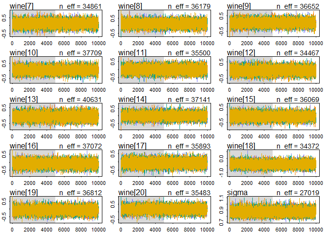
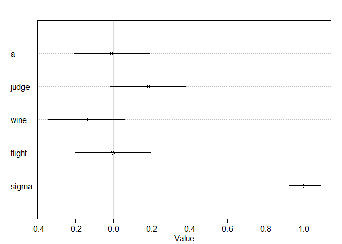

  


```r
library(tidyverse)
```

```
## -- Attaching packages ---------------------------------------------------------------------------------------------------- tidyverse 1.2.1 --
```

```
## v ggplot2 3.2.1     v purrr   0.3.2
## v tibble  2.1.3     v dplyr   0.8.3
## v tidyr   0.8.3     v stringr 1.4.0
## v readr   1.3.1     v forcats 0.4.0
```

```
## -- Conflicts ------------------------------------------------------------------------------------------------------- tidyverse_conflicts() --
## x dplyr::filter() masks stats::filter()
## x dplyr::lag()    masks stats::lag()
```

```r
library(rethinking)
```

```
## Loading required package: rstan
```

```
## Loading required package: StanHeaders
```

```
## rstan (Version 2.19.2, GitRev: 2e1f913d3ca3)
```

```
## For execution on a local, multicore CPU with excess RAM we recommend calling
## options(mc.cores = parallel::detectCores()).
## To avoid recompilation of unchanged Stan programs, we recommend calling
## rstan_options(auto_write = TRUE)
```

```
## For improved execution time, we recommend calling
## Sys.setenv(LOCAL_CPPFLAGS = '-march=native')
## although this causes Stan to throw an error on a few processors.
```

```
## 
## Attaching package: 'rstan'
```

```
## The following object is masked from 'package:tidyr':
## 
##     extract
```

```
## Loading required package: parallel
```

```
## Loading required package: dagitty
```

```
## rethinking (Version 1.90)
```

```
## 
## Attaching package: 'rethinking'
```

```
## The following object is masked from 'package:purrr':
## 
##     map
```

```
## The following object is masked from 'package:stats':
## 
##     rstudent
```

```r
options(mc.cores = parallel::detectCores())
rstan_options(auto_write = TRUE)
Sys.setenv(LOCAL_CPPFLAGS = '-march=native')
```

# 1. Consider the data(Wines2012) data table. These data are expert ratings of 20 different French and American wines by 9 different French and American judges. Your goal is to model _score_, the subjective rating assigned by each judge to each wine. I recommend standardizing.  

In this first problem, consider only variation among judges and wines. Construct index vaiables of _judge_ and _wine_ and then use these index variables to construct a linear regression model. Justify your priors. You should end up with 9 judge parameters and 20 wine parameters. Use _ulam_ instead of quap to build this model, and be sure to check the chains for convergence. If you'd rather build and model directly in Stan or PyMC3, go ahead. I just want you to use Hamiltonian Monte Carlo instead of quadratic approximation.  

How do you interprest the variation among individual judges and invidual wines? Do you notice any patterns, just by plotting differences? Which judges gave the highest/lowest ratings? Which wines were rated worst/best on average?


```r
#?Wines2012
data("Wines2012")
dat <- Wines2012
head(dat)
```

```
##             judge flight wine score wine.amer judge.amer
## 1 Jean-M Cardebat  white   A1    10         1          0
## 2 Jean-M Cardebat  white   B1    13         1          0
## 3 Jean-M Cardebat  white   C1    14         0          0
## 4 Jean-M Cardebat  white   D1    15         0          0
## 5 Jean-M Cardebat  white   E1     8         1          0
## 6 Jean-M Cardebat  white   F1    13         1          0
```

```r
summary(dat)
```

```
##              judge      flight        wine         score     
##  Daniele Meulder:20   red  :90   A1     :  9   Min.   : 7.0  
##  Francis Schott :20   white:90   A2     :  9   1st Qu.:12.0  
##  Jamal Rayyis   :20              B1     :  9   Median :14.5  
##  Jean-M Cardebat:20              B2     :  9   Mean   :14.2  
##  John Foy       :20              C1     :  9   3rd Qu.:16.0  
##  Linda Murphy   :20              C2     :  9   Max.   :19.5  
##  (Other)        :60              (Other):126                 
##    wine.amer     judge.amer    
##  Min.   :0.0   Min.   :0.0000  
##  1st Qu.:0.0   1st Qu.:0.0000  
##  Median :1.0   Median :1.0000  
##  Mean   :0.6   Mean   :0.5556  
##  3rd Qu.:1.0   3rd Qu.:1.0000  
##  Max.   :1.0   Max.   :1.0000  
## 
```

```r
dat_slim <- list(
j = as.integer(as.factor(dat$judge)),
w = as.integer(as.factor((dat$wine))),
score_std = (dat$score - mean(dat$score)) / sd(dat$score) 
)

model_1 <- ulam(
alist(
score_std ~ dnorm(mu, sigma),
mu <- judge[j] + wine[w],
judge[j] ~ dnorm(0, 0.25),
wine[w] ~ dnorm(0, 0.25),
sigma ~ dexp(1)
),
data = dat_slim, chains = 4, iter = 10000, cores = 4, log_lik = T
)

precis(model_1, depth = 2)
```

```
##                  mean         sd        5.5%         94.5%    n_eff
## judge[1] -0.198623577 0.15438170 -0.44572506  0.0468359948 38079.38
## judge[2]  0.153316304 0.15522445 -0.09577910  0.4014543369 35587.27
## judge[3]  0.145656628 0.15570566 -0.10228394  0.3967431220 34023.91
## judge[4] -0.387879365 0.15453109 -0.63265714 -0.1384163726 34532.72
## judge[5]  0.568247817 0.15772140  0.31586778  0.8191741001 33420.28
## judge[6]  0.340306269 0.15458054  0.09313750  0.5865225028 36369.03
## judge[7]  0.095499595 0.15630964 -0.15530544  0.3477012095 37982.03
## judge[8] -0.469408585 0.15706277 -0.71815762 -0.2194824938 36902.72
## judge[9] -0.247204491 0.15613470 -0.49755189  0.0008575025 33376.64
## wine[1]   0.067439371 0.19010238 -0.23756478  0.3721990779 33691.90
## wine[2]   0.049464345 0.18875434 -0.25567134  0.3502419846 32838.45
## wine[3]   0.127404972 0.18861373 -0.17272113  0.4305252684 38705.73
## wine[4]   0.262480348 0.19112649 -0.04191628  0.5663923315 38148.30
## wine[5]  -0.060365384 0.19081120 -0.36407405  0.2462379467 36142.38
## wine[6]  -0.175685504 0.18922637 -0.47818654  0.1285271228 33429.91
## wine[7]   0.139110714 0.18960764 -0.16587887  0.4410658837 34860.89
## wine[8]   0.127937104 0.19204378 -0.17940481  0.4379714627 36179.31
## wine[9]   0.038979194 0.18953474 -0.26433984  0.3427271090 36652.46
## wine[10]  0.056703386 0.19091559 -0.24629470  0.3606951440 37708.75
## wine[11] -0.004082157 0.19136527 -0.31169834  0.3014727007 35499.76
## wine[12] -0.015125062 0.18866806 -0.31692071  0.2872480806 34467.02
## wine[13] -0.048469071 0.19376350 -0.35791647  0.2607723299 40630.91
## wine[14]  0.004161853 0.19165876 -0.30317965  0.3098554192 37141.32
## wine[15] -0.101753246 0.18838334 -0.40746188  0.1981231229 36068.92
## wine[16] -0.096201985 0.19270744 -0.40408431  0.2128185115 37071.53
## wine[17] -0.068101538 0.18797006 -0.37130540  0.2337248210 35893.13
## wine[18] -0.409708340 0.18987766 -0.71080595 -0.1043091608 34371.56
## wine[19] -0.077055987 0.19281490 -0.38195769  0.2316078555 36812.44
## wine[20]  0.183380642 0.18998487 -0.12025000  0.4865135170 35482.64
## sigma     0.865767407 0.04937112  0.79178395  0.9480320535 27018.71
##               Rhat
## judge[1] 0.9998421
## judge[2] 0.9998597
## judge[3] 0.9999278
## judge[4] 0.9998884
## judge[5] 0.9999312
## judge[6] 0.9998409
## judge[7] 0.9998265
## judge[8] 0.9998205
## judge[9] 0.9998652
## wine[1]  0.9998776
## wine[2]  0.9999080
## wine[3]  0.9998975
## wine[4]  0.9999302
## wine[5]  0.9999054
## wine[6]  0.9998781
## wine[7]  0.9999323
## wine[8]  0.9998823
## wine[9]  1.0000499
## wine[10] 0.9999348
## wine[11] 0.9999246
## wine[12] 1.0000173
## wine[13] 1.0000188
## wine[14] 0.9998812
## wine[15] 0.9999895
## wine[16] 0.9998661
## wine[17] 0.9999017
## wine[18] 0.9998497
## wine[19] 0.9998650
## wine[20] 0.9998751
## sigma    0.9999258
```

```r
traceplot(model_1)
```

```
## Waiting to draw page 2 of 2
```

<!-- --><!-- -->

```r
trankplot(model_1)
```

```
## Waiting to draw page 2 of 2
```

<!-- --><!-- -->

```r
par(mfrow = c(1,1))
plot(precis(model_1, depth = 2))
```

<!-- -->

The judges clearly vary with some always giving bad, some always giving average, and some always giving good scores. The wines were all pretty much centered around uniforms except wine 18 which received bad scores.

# 2. Now consider three features of the wines and judges:  
1. `flight`: Whether the wine is red or white  
2. `wine.amer`: Indicator variable for American wines
3. `judge.amer`: Indictor variable for American judges

Use the indicator or index variables to model the influence of these features on the scores. Omit the individual judges and wine index variables from Problem 1. Do not include interaction effects yet. Again use `ulam`, justify your priors, and be sure to check the chains. What do you conclude about the differences among the wines and judges? Try to relate the results to the inferences in Problem 1.


```r
dat_slim_2 <- list(
f = ifelse(dat$flight == "white", 0L, 1L),
j = dat$judge.amer,
w = dat$wine.amer,
score_std = (dat$score - mean(dat$score)) / sd(dat$score)
)
dat_slim_2
```

```
## $f
##   [1] 0 0 0 0 0 0 0 0 0 0 0 0 0 0 0 0 0 0 0 0 0 0 0 0 0 0 0 0 0 0 0 0 0 0 0
##  [36] 0 0 0 0 0 0 0 0 0 0 0 0 0 0 0 0 0 0 0 0 0 0 0 0 0 0 0 0 0 0 0 0 0 0 0
##  [71] 0 0 0 0 0 0 0 0 0 0 0 0 0 0 0 0 0 0 0 0 1 1 1 1 1 1 1 1 1 1 1 1 1 1 1
## [106] 1 1 1 1 1 1 1 1 1 1 1 1 1 1 1 1 1 1 1 1 1 1 1 1 1 1 1 1 1 1 1 1 1 1 1
## [141] 1 1 1 1 1 1 1 1 1 1 1 1 1 1 1 1 1 1 1 1 1 1 1 1 1 1 1 1 1 1 1 1 1 1 1
## [176] 1 1 1 1 1
## 
## $j
##   [1] 0 0 0 0 0 0 0 0 0 0 1 1 1 1 1 1 1 1 1 1 1 1 1 1 1 1 1 1 1 1 0 0 0 0 0
##  [36] 0 0 0 0 0 1 1 1 1 1 1 1 1 1 1 1 1 1 1 1 1 1 1 1 1 0 0 0 0 0 0 0 0 0 0
##  [71] 0 0 0 0 0 0 0 0 0 0 1 1 1 1 1 1 1 1 1 1 0 0 0 0 0 0 0 0 0 0 1 1 1 1 1
## [106] 1 1 1 1 1 1 1 1 1 1 1 1 1 1 1 0 0 0 0 0 0 0 0 0 0 1 1 1 1 1 1 1 1 1 1
## [141] 1 1 1 1 1 1 1 1 1 1 0 0 0 0 0 0 0 0 0 0 0 0 0 0 0 0 0 0 0 0 1 1 1 1 1
## [176] 1 1 1 1 1
## 
## $w
##   [1] 1 1 0 0 1 1 1 0 1 0 1 1 0 0 1 1 1 0 1 0 1 1 0 0 1 1 1 0 1 0 1 1 0 0 1
##  [36] 1 1 0 1 0 1 1 0 0 1 1 1 0 1 0 1 1 0 0 1 1 1 0 1 0 1 1 0 0 1 1 1 0 1 0
##  [71] 1 1 0 0 1 1 1 0 1 0 1 1 0 0 1 1 1 0 1 0 0 0 1 1 1 1 0 1 1 0 0 0 1 1 1
## [106] 1 0 1 1 0 0 0 1 1 1 1 0 1 1 0 0 0 1 1 1 1 0 1 1 0 0 0 1 1 1 1 0 1 1 0
## [141] 0 0 1 1 1 1 0 1 1 0 0 0 1 1 1 1 0 1 1 0 0 0 1 1 1 1 0 1 1 0 0 0 1 1 1
## [176] 1 0 1 1 0
## 
## $score_std
##   [1] -1.57660412 -0.45045832 -0.07507639  0.30030555 -2.32736799
##   [6] -0.45045832  0.30030555 -1.20122219 -1.95198605 -0.82584025
##  [11]  0.67568748 -0.07507639 -0.07507639  0.67568748 -0.82584025
##  [16] -1.20122219 -1.20122219 -0.07507639 -1.20122219 -0.07507639
##  [21]  0.67568748  1.05106941  0.67568748  0.30030555  0.11261458
##  [26]  0.11261458  0.67568748  1.05106941  0.30030555  1.23876038
##  [31] -0.07507639  1.80183328 -0.82584025 -1.57660412  1.80183328
##  [36]  1.42645135  1.05106941  0.67568748  1.42645135 -0.07507639
##  [41]  1.05106941 -1.20122219 -0.45045832 -0.07507639 -0.07507639
##  [46] -1.57660412 -1.95198605 -1.95198605 -1.57660412 -1.57660412
##  [51]  0.48799651  0.30030555  1.05106941  1.42645135  0.67568748
##  [56]  1.05106941  0.30030555 -0.07507639  0.67568748  1.05106941
##  [61] -1.57660412  0.30030555 -0.82584025 -0.82584025  0.30030555
##  [66] -0.07507639  0.30030555 -0.82584025  0.30030555 -0.82584025
##  [71]  0.67568748  0.30030555  0.11261458  1.23876038  0.86337845
##  [76] -0.07507639 -0.82584025  0.30030555 -0.45045832 -0.82584025
##  [81]  1.05106941  0.67568748 -0.82584025  1.42645135  0.30030555
##  [86]  0.67568748  0.30030555 -0.07507639  1.05106941  0.30030555
##  [91]  0.30030555 -1.20122219 -0.82584025  0.67568748 -0.07507639
##  [96] -1.20122219  0.11261458 -0.45045832 -1.57660412  0.11261458
## [101] -0.07507639 -1.20122219  0.67568748 -0.82584025 -0.07507639
## [106] -0.45045832 -0.07507639 -0.82584025 -0.45045832 -1.20122219
## [111]  1.23876038  1.80183328  1.42645135  1.42645135  0.30030555
## [116]  0.67568748  1.42645135  1.42645135  1.05106941  1.23876038
## [121] -1.57660412  1.05106941 -1.95198605 -0.07507639  1.80183328
## [126] -0.82584025  0.30030555 -1.57660412 -1.20122219  1.42645135
## [131] -0.45045832  1.05106941 -0.45045832  0.67568748 -0.82584025
## [136]  0.30030555 -1.57660412 -0.82584025 -2.32736799 -1.20122219
## [141] -0.45045832 -0.07507639  1.05106941  0.67568748  0.30030555
## [146]  1.05106941 -0.07507639  0.48799651 -0.45045832  1.42645135
## [151] -0.07507639  0.67568748 -1.20122219  0.67568748 -0.07507639
## [156]  0.30030555 -0.45045832 -1.20122219 -1.57660412  0.30030555
## [161]  0.30030555  1.98952425 -0.07507639 -0.82584025 -0.45045832
## [166]  0.67568748  0.11261458  0.30030555  0.67568748  0.67568748
## [171]  1.80183328  1.42645135 -2.32736799  0.30030555  0.30030555
## [176] -0.82584025  0.30030555  0.67568748 -2.70274992  1.05106941
```

```r
model_2 <- ulam(
alist(
score_std ~ dnorm(mu, sigma),
mu <- a + flight*f + wine*w + judge*j,
a ~ dnorm(0, 0.25),
judge ~ dnorm(0, 0.25),
wine ~ dnorm(0, 0.25),
flight ~ dnorm(0, 0.25),
sigma ~ dexp(1)
),
data = dat_slim_2, chains = 4, iter = 10000, cores = 4, log_lik = T
)

precis(model_2, depth = 2)
```

```
##               mean         sd        5.5%     94.5%    n_eff      Rhat
## a      -0.01081503 0.12442918 -0.20801340 0.1902822 14700.05 0.9999328
## judge   0.18185408 0.12466219 -0.01748579 0.3809450 17212.29 0.9999684
## wine   -0.14385534 0.12655805 -0.34385934 0.0589492 16878.71 0.9999412
## flight -0.00577630 0.12343149 -0.20296169 0.1935620 18030.71 0.9999456
## sigma   0.99847803 0.05271274  0.91822315 1.0864819 18632.77 1.0002628
```

```r
traceplot(model_2)
trankplot(model_2)
```

<!-- -->

```r
par(mfrow = c(1,1))
```

<!-- -->

```r
plot(precis(model_2, depth = 2))
```

<!-- -->

American judges give higher scores and American wines score lower. Red vs White showed basically no difference in scoring.

# 3. Now consider two-way interactions among the three features. You should end up with three different interaction terms in your model. These will be easier to build, if you use indicator varaibles. Again use `ulam`, justify your priors, and be sure to check the chains. Explain what each interaction means. Be sure to interpret the model's predicitons on the outcome scale (mu, the expected score), not on the scale of individual parameters. You can use `link` to help with this, or just use your knowledge of linear model instead.  What do you conclude about the features and the scores? Can you relate the results of your model(s) to the individual judge and wine inferences from Problem 1?
  

```r
model_3 <- ulam(
  alist(
    score_std ~ dnorm(mu, sigma),
    mu <- a + flight*f + wine*w + judge*j + judgewine*w*j + judgeflight*j*f + wineflight*w**f,
    a ~ dnorm(0, 0.25),
    judge ~ dnorm(0, 0.25),
    wine ~ dnorm(0, 0.25),
    flight ~ dnorm(0, 0.25),
    judgewine ~ dnorm(0, 0.25),
    judgeflight ~ dnorm(0, 0.25),
    wineflight ~ dnorm(0, 0.25),
    sigma ~ dexp(1)
  ),
  data = dat_slim_2, chains = 4, iter = 10000, cores = 4, log_lik = T
)

precis(model_3, depth = 2)
```

```
##                    mean         sd        5.5%      94.5%    n_eff
## a            0.09745979 0.15478878 -0.14887285 0.34357563 13816.40
## judge        0.19284300 0.15274341 -0.04852746 0.43831243 15218.99
## wine        -0.04626167 0.15857790 -0.30104831 0.20798528 16800.45
## flight      -0.06233719 0.14493035 -0.29263798 0.16962999 15731.61
## judgewine   -0.01583721 0.17240109 -0.28985844 0.25855650 16424.91
## judgeflight  0.03360493 0.17345988 -0.24342283 0.31065509 16210.48
## wineflight  -0.19779348 0.16288328 -0.45840917 0.06260068 14269.34
## sigma        0.99563450 0.05343293  0.91403159 1.08441245 23809.62
##                  Rhat
## a           1.0002202
## judge       1.0000170
## wine        0.9999526
## flight      1.0000986
## judgewine   0.9999556
## judgeflight 0.9998445
## wineflight  1.0000651
## sigma       1.0001063
```

```r
traceplot(model_3)
trankplot(model_3)
```

<!-- -->

```r
par(mfrow = c(1,1))
```

<!-- -->

```r
plot(precis(model_3, depth = 2))
```

<!-- -->

```r
pred_dat <- data.frame(
  w = rep(0:1, times = 4),
  j = rep(0:1, each = 4),
  f = rep(c(0,0,1,1), 2)
)

preds <- link(model_3, pred_dat)

row_labels <- paste(ifelse(pred_dat$w == 1, "American_Wine","French_Wine"),
                    ifelse(pred_dat$j == 1, "American_Judge","French_Judge"),
                    ifelse(pred_dat$f == 1, "Red_Wine","White_Wine"), sep = "-")
row_labels
```

```
## [1] "French_Wine-French_Judge-White_Wine"    
## [2] "American_Wine-French_Judge-White_Wine"  
## [3] "French_Wine-French_Judge-Red_Wine"      
## [4] "American_Wine-French_Judge-Red_Wine"    
## [5] "French_Wine-American_Judge-White_Wine"  
## [6] "American_Wine-American_Judge-White_Wine"
## [7] "French_Wine-American_Judge-Red_Wine"    
## [8] "American_Wine-American_Judge-Red_Wine"
```

```r
plot(precis(list(mu = preds), depth = 2), labels = row_labels)
```

<!-- -->

French judges do not appear to like American red wine. American judges really like French red wine.


```r
dat_slim_3 <- list(
f = ifelse(dat$flight == "white", 1L, 2L),
j = dat$judge.amer + 1L,
w = dat$wine.amer + 1L,
score_std = (dat$score - mean(dat$score)) / sd(dat$score)
)
dat_slim_3
```

```
## $f
##   [1] 1 1 1 1 1 1 1 1 1 1 1 1 1 1 1 1 1 1 1 1 1 1 1 1 1 1 1 1 1 1 1 1 1 1 1
##  [36] 1 1 1 1 1 1 1 1 1 1 1 1 1 1 1 1 1 1 1 1 1 1 1 1 1 1 1 1 1 1 1 1 1 1 1
##  [71] 1 1 1 1 1 1 1 1 1 1 1 1 1 1 1 1 1 1 1 1 2 2 2 2 2 2 2 2 2 2 2 2 2 2 2
## [106] 2 2 2 2 2 2 2 2 2 2 2 2 2 2 2 2 2 2 2 2 2 2 2 2 2 2 2 2 2 2 2 2 2 2 2
## [141] 2 2 2 2 2 2 2 2 2 2 2 2 2 2 2 2 2 2 2 2 2 2 2 2 2 2 2 2 2 2 2 2 2 2 2
## [176] 2 2 2 2 2
## 
## $j
##   [1] 1 1 1 1 1 1 1 1 1 1 2 2 2 2 2 2 2 2 2 2 2 2 2 2 2 2 2 2 2 2 1 1 1 1 1
##  [36] 1 1 1 1 1 2 2 2 2 2 2 2 2 2 2 2 2 2 2 2 2 2 2 2 2 1 1 1 1 1 1 1 1 1 1
##  [71] 1 1 1 1 1 1 1 1 1 1 2 2 2 2 2 2 2 2 2 2 1 1 1 1 1 1 1 1 1 1 2 2 2 2 2
## [106] 2 2 2 2 2 2 2 2 2 2 2 2 2 2 2 1 1 1 1 1 1 1 1 1 1 2 2 2 2 2 2 2 2 2 2
## [141] 2 2 2 2 2 2 2 2 2 2 1 1 1 1 1 1 1 1 1 1 1 1 1 1 1 1 1 1 1 1 2 2 2 2 2
## [176] 2 2 2 2 2
## 
## $w
##   [1] 2 2 1 1 2 2 2 1 2 1 2 2 1 1 2 2 2 1 2 1 2 2 1 1 2 2 2 1 2 1 2 2 1 1 2
##  [36] 2 2 1 2 1 2 2 1 1 2 2 2 1 2 1 2 2 1 1 2 2 2 1 2 1 2 2 1 1 2 2 2 1 2 1
##  [71] 2 2 1 1 2 2 2 1 2 1 2 2 1 1 2 2 2 1 2 1 1 1 2 2 2 2 1 2 2 1 1 1 2 2 2
## [106] 2 1 2 2 1 1 1 2 2 2 2 1 2 2 1 1 1 2 2 2 2 1 2 2 1 1 1 2 2 2 2 1 2 2 1
## [141] 1 1 2 2 2 2 1 2 2 1 1 1 2 2 2 2 1 2 2 1 1 1 2 2 2 2 1 2 2 1 1 1 2 2 2
## [176] 2 1 2 2 1
## 
## $score_std
##   [1] -1.57660412 -0.45045832 -0.07507639  0.30030555 -2.32736799
##   [6] -0.45045832  0.30030555 -1.20122219 -1.95198605 -0.82584025
##  [11]  0.67568748 -0.07507639 -0.07507639  0.67568748 -0.82584025
##  [16] -1.20122219 -1.20122219 -0.07507639 -1.20122219 -0.07507639
##  [21]  0.67568748  1.05106941  0.67568748  0.30030555  0.11261458
##  [26]  0.11261458  0.67568748  1.05106941  0.30030555  1.23876038
##  [31] -0.07507639  1.80183328 -0.82584025 -1.57660412  1.80183328
##  [36]  1.42645135  1.05106941  0.67568748  1.42645135 -0.07507639
##  [41]  1.05106941 -1.20122219 -0.45045832 -0.07507639 -0.07507639
##  [46] -1.57660412 -1.95198605 -1.95198605 -1.57660412 -1.57660412
##  [51]  0.48799651  0.30030555  1.05106941  1.42645135  0.67568748
##  [56]  1.05106941  0.30030555 -0.07507639  0.67568748  1.05106941
##  [61] -1.57660412  0.30030555 -0.82584025 -0.82584025  0.30030555
##  [66] -0.07507639  0.30030555 -0.82584025  0.30030555 -0.82584025
##  [71]  0.67568748  0.30030555  0.11261458  1.23876038  0.86337845
##  [76] -0.07507639 -0.82584025  0.30030555 -0.45045832 -0.82584025
##  [81]  1.05106941  0.67568748 -0.82584025  1.42645135  0.30030555
##  [86]  0.67568748  0.30030555 -0.07507639  1.05106941  0.30030555
##  [91]  0.30030555 -1.20122219 -0.82584025  0.67568748 -0.07507639
##  [96] -1.20122219  0.11261458 -0.45045832 -1.57660412  0.11261458
## [101] -0.07507639 -1.20122219  0.67568748 -0.82584025 -0.07507639
## [106] -0.45045832 -0.07507639 -0.82584025 -0.45045832 -1.20122219
## [111]  1.23876038  1.80183328  1.42645135  1.42645135  0.30030555
## [116]  0.67568748  1.42645135  1.42645135  1.05106941  1.23876038
## [121] -1.57660412  1.05106941 -1.95198605 -0.07507639  1.80183328
## [126] -0.82584025  0.30030555 -1.57660412 -1.20122219  1.42645135
## [131] -0.45045832  1.05106941 -0.45045832  0.67568748 -0.82584025
## [136]  0.30030555 -1.57660412 -0.82584025 -2.32736799 -1.20122219
## [141] -0.45045832 -0.07507639  1.05106941  0.67568748  0.30030555
## [146]  1.05106941 -0.07507639  0.48799651 -0.45045832  1.42645135
## [151] -0.07507639  0.67568748 -1.20122219  0.67568748 -0.07507639
## [156]  0.30030555 -0.45045832 -1.20122219 -1.57660412  0.30030555
## [161]  0.30030555  1.98952425 -0.07507639 -0.82584025 -0.45045832
## [166]  0.67568748  0.11261458  0.30030555  0.67568748  0.67568748
## [171]  1.80183328  1.42645135 -2.32736799  0.30030555  0.30030555
## [176] -0.82584025  0.30030555  0.67568748 -2.70274992  1.05106941
```

```r
model_4 <- ulam(
  alist(
  score_std ~ dnorm(mu, sigma),
  mu <- W[f,j,w],
  real['2,2,2']:W ~ normal(0,0.5),
  sigma ~ dexp(1)
  ), data = dat_slim_3, chains = 4, iter = 10000, cores = 4)

preds <- link(model_4, pred_dat)
plot(precis(list(mu = preds), depth = 2), labels = row_labels)
```

<!-- -->

