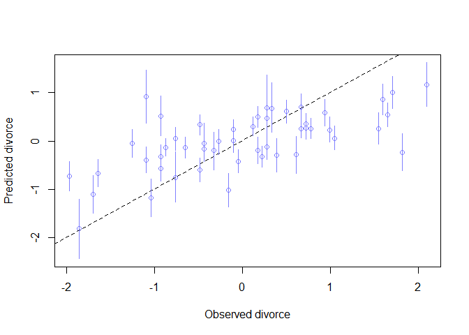
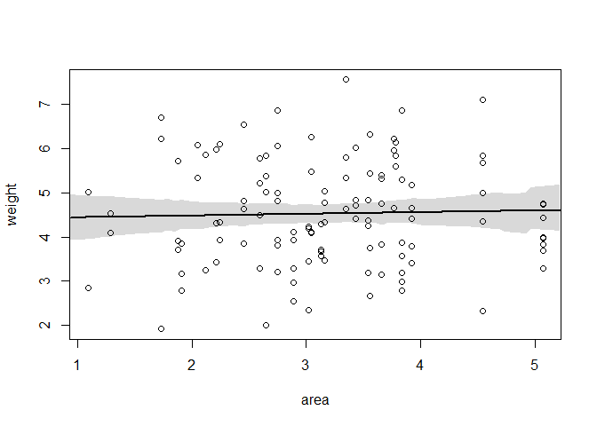
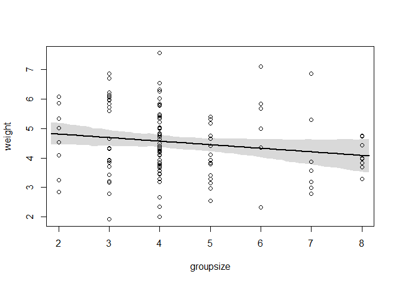
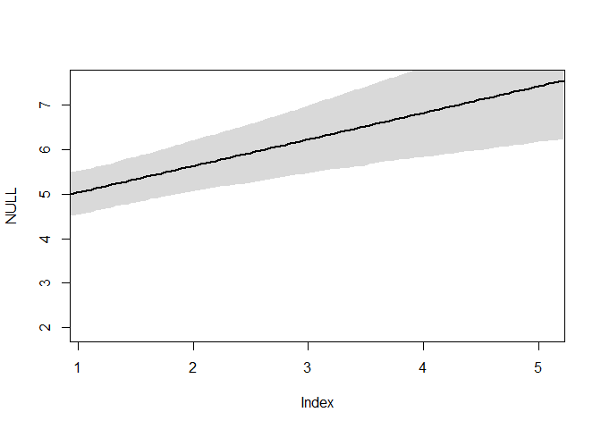
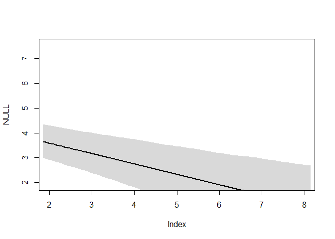
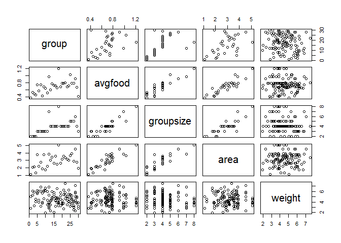

## Easy

### 5E1. Which of the linear models below are multiple linear regressions?
  (1) µi = α + βxi
  (2) µi = βxxi + βzzi
  (3) µi = α + β(xi − zi)
  (4) µi = α + βxxi + βzz
  
2 and 4

### 5E3. Write down a multiple regression to evaluate the claim: Neither amount of funding nor size of laboratory is by itself a good predictor of time to PhD degree; but together these variables are both positively associated with time to degree. Write down the model definition and indicate which side of zero each slope parameter should be on.

$$
time2phd_i \sim (\mu_i, \sigma) \\
mu_i = \alpha + \beta Funding*Funding_i + \beta Size*Size_i \\
\alpha \sim Norm(0,0.2) \\
\beta Funding \sim Norm(0,0.5) \\
\beta Size \sim Norm(0,0.5 \\
\sigma \sim exp(1) \\
$$

## Medium

### 5M2. Invent your own example of a masked relationship. An outcome variable should be correlated with both predictor variables, but in opposite directions. And the two predictor variables should be correlated with one another.

Win rate at a video game is influenced by amount of time played and time of day

More time played leads to winning more

During evening better players come online making winning harder

If you play more you will probaby also play at later times of the day

### 5M3. It is sometimes observed that the best predictor of fire risk is the presence of firefighters—States and localities with many firefighters also have more fires. Presumably firefighters do not cause fires. Nevertheless, this is not a spurious correlation. Instead fires cause firefighters. Consider the same reversal of causal inference in the context of the divorce and marriage data. How might a high divorce rate cause a higher marriage rate? Can you think of a way to evaluate this relationship, using multiple regression?

More people getting divorced leads to more single people which leads to more people available to get married.

$$
MariageRate \sim DivorceRate + AgeAtMarriage
$$

### 5M4. In the divorce data, States with high numbers of Mormons (members of The Church of Jesus Christ of Latter-day Saints, LDS) have much lower divorce rates than the regression models expected. Find a list of LDS population by State and use those numbers as a predictor variable, predicting divorce rate using marriage rate, median age at marriage, and percent LDS population (possibly standardized). You may want to consider transformations of the raw percent LDS variable.


```r
library(XML)
library(RCurl)
```

```
## Loading required package: bitops
```

```r
library(rlist)
library(tidyverse)
```

```
## -- Attaching packages ---------------------------------- tidyverse 1.2.1 --
```

```
## v ggplot2 3.1.0       v purrr   0.3.2  
## v tibble  2.1.1       v dplyr   0.8.0.1
## v tidyr   0.8.3       v stringr 1.4.0  
## v readr   1.3.1       v forcats 0.4.0
```

```
## -- Conflicts ------------------------------------- tidyverse_conflicts() --
## x tidyr::complete() masks RCurl::complete()
## x dplyr::filter()   masks stats::filter()
## x dplyr::lag()      masks stats::lag()
```

```r
library(rethinking)
```

```
## Loading required package: rstan
```

```
## Loading required package: StanHeaders
```

```
## rstan (Version 2.18.2, GitRev: 2e1f913d3ca3)
```

```
## For execution on a local, multicore CPU with excess RAM we recommend calling
## options(mc.cores = parallel::detectCores()).
## To avoid recompilation of unchanged Stan programs, we recommend calling
## rstan_options(auto_write = TRUE)
```

```
## For improved execution time, we recommend calling
## Sys.setenv(LOCAL_CPPFLAGS = '-march=native')
## although this causes Stan to throw an error on a few processors.
```

```
## 
## Attaching package: 'rstan'
```

```
## The following object is masked from 'package:tidyr':
## 
##     extract
```

```
## Loading required package: parallel
```

```
## rethinking (Version 1.88)
```

```
## 
## Attaching package: 'rethinking'
```

```
## The following object is masked from 'package:purrr':
## 
##     map
```

```r
data("WaffleDivorce")
d <- WaffleDivorce
theurl <- getURL("https://www.worldatlas.com/articles/mormon-population-by-state.html",.opts = list(ssl.verifypeer = FALSE) )
tables <- readHTMLTable(theurl)
tables <- list.clean(tables, fun = is.null, recursive = FALSE)
n.rows <- unlist(lapply(tables, function(t) dim(t)[1]))
mormons <- tables[[which.max(n.rows)]]
colnames(mormons) <- c("Rank","State","Trash","Trash2","Pct")
str(mormons)
```

```
## 'data.frame':	51 obs. of  5 variables:
##  $ Rank  : Factor w/ 51 levels "1","10","11",..: 1 12 23 34 45 48 49 50 51 2 ...
##  $ State : Factor w/ 51 levels "Alabama","Alaska",..: 45 13 51 29 3 12 27 2 48 38 ...
##  $ Trash : Factor w/ 51 levels "10,450","10,978",..: 10 34 42 9 30 45 38 22 17 6 ...
##  $ Trash2: Factor w/ 51 levels "1,042,520","1,056,426",..: 22 6 35 17 41 5 1 45 44 27 ...
##  $ Pct   : Factor w/ 44 levels "0.37%","0.39%",..: 44 35 33 43 42 41 40 39 38 37 ...
```

```r
mormons <- mormons[,c(2,5)]
mormons$State <- as.character(mormons$State)
mormons$Pct <- as.numeric(sub("%","",as.character(mormons$Pct)))
str(mormons)
```

```
## 'data.frame':	51 obs. of  2 variables:
##  $ State: chr  "Utah" "Idaho" "Wyoming" "Nevada" ...
##  $ Pct  : num  67.7 26.42 11.53 6.21 6.1 ...
```

```r
d <- left_join(d,mormons, by = c("Location" = "State"))
```

```
## Warning: Column `Location`/`State` joining factor and character vector,
## coercing into character vector
```

```r
dstd <- d %>%
  mutate(MedianAgeMarriage = scale(MedianAgeMarriage),
         Pct = scale(log(Pct)),
         Marriage = scale(Marriage),
         Divorce = scale(Divorce))
head(dstd)
```

```
##     Location Loc Population MedianAgeMarriage    Marriage Marriage.SE
## 1    Alabama  AL       4.78        -0.6062895  0.02264406        1.27
## 2     Alaska  AK       0.71        -0.6866993  1.54980162        2.93
## 3    Arizona  AZ       6.33        -0.2042408  0.04897436        0.98
## 4   Arkansas  AR       2.92        -1.4103870  1.65512283        1.70
## 5 California  CA      37.25         0.5998567 -0.26698927        0.39
## 6   Colorado  CO       5.03        -0.2846505  0.89154405        1.24
##      Divorce Divorce.SE WaffleHouses South Slaves1860 Population1860
## 1  1.6542053       0.79          128     1     435080         964201
## 2  1.5443643       2.05            0     0          0              0
## 3  0.6107159       0.74           18     0          0              0
## 4  2.0935693       1.22           41     1     111115         435450
## 5 -0.9270579       0.24            0     0          0         379994
## 6  1.0500799       0.94           11     0          0          34277
##   PropSlaves1860        Pct
## 1           0.45 -0.3990136
## 2           0.00  1.2002356
## 3           0.00  1.4618484
## 4           0.26 -0.1374391
## 5           0.00  0.4456160
## 6           0.00  0.7422568
```


```r
fit <- quap(
  alist(
    Divorce ~ dnorm(mu, sigma),
    mu <- a + bA*MedianAgeMarriage + bM*Marriage +bP*Pct,
    a ~ dnorm(0,0.5),
    bA ~ dnorm(0,0.5),
    bM ~ dnorm(0,0.5),
    bP ~ dnorm(0,0.5),
    sigma ~ dexp(1)),
  data = dstd)
precis(fit)
```

```
##                mean         sd       5.5%       94.5%
## a      5.981789e-09 0.10401286 -0.1662326  0.16623265
## bA    -6.999044e-01 0.15142404 -0.9419092 -0.45789949
## bM     7.232552e-02 0.16204004 -0.1866458  0.33129681
## bP    -2.908555e-01 0.14914430 -0.5292169 -0.05249412
## sigma  7.519317e-01 0.07470961  0.6325314  0.87133214
```


```r
# call link without specifying new data
# so it uses original data
mu <- link( fit )
# summarize samples across cases
mu_mean <- apply( mu , 2 , mean )
mu_PI <- apply( mu , 2 , PI )
# simulate observations
# again no new data, so uses original data
D_sim <- sim( fit , n=1e4 )
D_PI <- apply( D_sim , 2 , PI )

plot( mu_mean ~ dstd$Divorce , col=rangi2 , ylim=range(mu_PI) ,
xlab="Observed divorce" , ylab="Predicted divorce" )
abline( a=0 , b=1 , lty=2 )
for ( i in 1:nrow(d) ) lines( rep(dstd$Divorce[i],2) , mu_PI[,i] , col=rangi2 )
```

<!-- -->


## Hard

```r
data(foxes)
d <- foxes
str(d)
```

```
## 'data.frame':	116 obs. of  5 variables:
##  $ group    : int  1 1 2 2 3 3 4 4 5 5 ...
##  $ avgfood  : num  0.37 0.37 0.53 0.53 0.49 0.49 0.45 0.45 0.74 0.74 ...
##  $ groupsize: int  2 2 2 2 2 2 2 2 3 3 ...
##  $ area     : num  1.09 1.09 2.05 2.05 2.12 2.12 1.29 1.29 3.78 3.78 ...
##  $ weight   : num  5.02 2.84 5.33 6.07 5.85 3.25 4.53 4.09 6.13 5.59 ...
```

```r
summary(d)
```

```
##      group          avgfood         groupsize          area      
##  Min.   : 1.00   Min.   :0.3700   Min.   :2.000   Min.   :1.090  
##  1st Qu.:11.75   1st Qu.:0.6600   1st Qu.:3.000   1st Qu.:2.590  
##  Median :18.00   Median :0.7350   Median :4.000   Median :3.130  
##  Mean   :17.21   Mean   :0.7517   Mean   :4.345   Mean   :3.169  
##  3rd Qu.:24.00   3rd Qu.:0.8000   3rd Qu.:5.000   3rd Qu.:3.772  
##  Max.   :30.00   Max.   :1.2100   Max.   :8.000   Max.   :5.070  
##      weight     
##  Min.   :1.920  
##  1st Qu.:3.720  
##  Median :4.420  
##  Mean   :4.530  
##  3rd Qu.:5.375  
##  Max.   :7.550
```

### 5H1. Fit two bivariate Gaussian regressions, using quap: (1) body weight as a linear function of territory size (area), and (2) body weight as a linear function of groupsize. Plot the results of these regressions, displaying the MAP regression line and the 95% interval of the mean. Is either variable important for predicting fox body weight?


```r
H511 <- quap(
  alist(
    weight ~ dnorm(mu, sigma),
    mu <- a + bA*area,
    a ~ dnorm(3,2),
    bA ~ dnorm(0,1),
    sigma ~ dexp(1)),
  data = d
)
precis(H511)
```

```
##             mean         sd      5.5%     94.5%
## a     4.39974542 0.37948714  3.793252 5.0062392
## bA    0.03968263 0.11506097 -0.144207 0.2235723
## sigma 1.17285724 0.07643496  1.050699 1.2950151
```

```r
xseq <- seq( from=min(d$area)-0.15 , to=max(d$area)+0.15 , length.out=100 )
mu <- link( H511 , data=list(area=xseq) )
mu_mean <- apply(mu,2,mean)
mu_PI <- apply(mu,2,HPDI, .95)
plot( weight ~ area , data=d )
lines( xseq , mu_mean , lwd=2 )
shade( mu_PI , xseq )
```

<!-- -->
 


```r
H512 <- quap(
  alist(
    weight ~ dnorm(mu, sigma),
    mu <- a + bS*groupsize,
    a ~ dnorm(4,3),
    bS ~ dnorm(0,1),
    sigma ~ dexp(1)),
  data = d
)
precis(H512)
```

```
##             mean         sd       5.5%        94.5%
## a      5.0525966 0.32071196  4.5400369  5.565156245
## bS    -0.1206817 0.06964019 -0.2319801 -0.009383201
## sigma  1.1576723 0.07543323  1.0371155  1.278229214
```


```r
xseq <- seq( from=min(d$groupsize)-0.15 , to=max(d$groupsize)+0.15 , length.out=100 )
mu <- link( H512 , data=list(groupsize=xseq) )
mu_mean <- apply(mu,2,mean)
mu_PI <- apply(mu,2,HPDI, .95)
plot( weight ~ groupsize , data=d )
lines( xseq , mu_mean , lwd=2 )
shade( mu_PI , xseq )
```

<!-- -->

Maybe groupsize

### 5H2. Now fit a multiple linear regression with weight as the outcome and both area and groupsize as predictor variables. Plot the predictions of the model for each predictor, holding the other predictor constant at its mean. What does this model say about the importance of each variable? Why do you get different results than you got in the exercise just above?


```r
H521 <- quap(
  alist(
    weight ~ dnorm(mu, sigma),
    mu <- a + bA*area + bS*groupsize,
    a ~ dnorm(3,2),
    bA ~ dnorm(0,1),
    bS ~ dnorm(0,1),
    sigma ~ dexp(1)),
  data = d
)
precis(H521)
```

```
##             mean         sd       5.5%      94.5%
## a      4.4254227 0.36107473  3.8483555  5.0024898
## bA     0.6002513 0.19355848  0.2909075  0.9095951
## bS    -0.4147144 0.11781973 -0.6030131 -0.2264157
## sigma  1.1132492 0.07258378  0.9972463  1.2292521
```


```r
xseq <- seq( from=min(d$area)-0.15 , to=max(d$area)+0.15 , length.out=100 )
mu <- link( H521 , data=data.frame( area=xseq , groupsize=0 ) )
mu_mean <- apply(mu,2,mean)
mu_PI <- apply(mu,2,PI)
plot( NULL , xlim=range(d$area) , ylim=range(d$weight) )
lines( xseq , mu_mean , lwd=2 )
shade( mu_PI , xseq )
```

<!-- -->

```r
xseq <- seq( from=min(d$groupsize)-0.15 , to=max(d$groupsize)+0.15 , length.out=100 )
mu <- link( H521 , data=data.frame( area=0 , groupsize=xseq ) )
mu_mean <- apply(mu,2,mean)
mu_PI <- apply(mu,2,PI)
plot( NULL , xlim=range(d$groupsize) , ylim=range(d$weight) )
lines( xseq , mu_mean , lwd=2 )
shade( mu_PI , xseq )
```

<!-- -->

Opposite directions


```r
pairs(d)
```

<!-- -->

