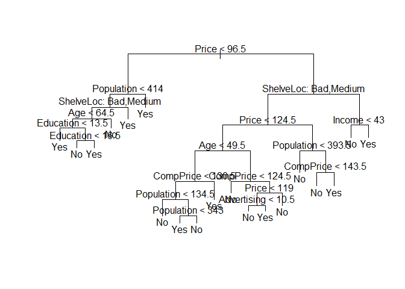
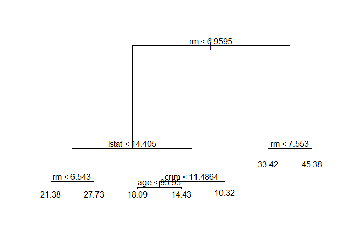
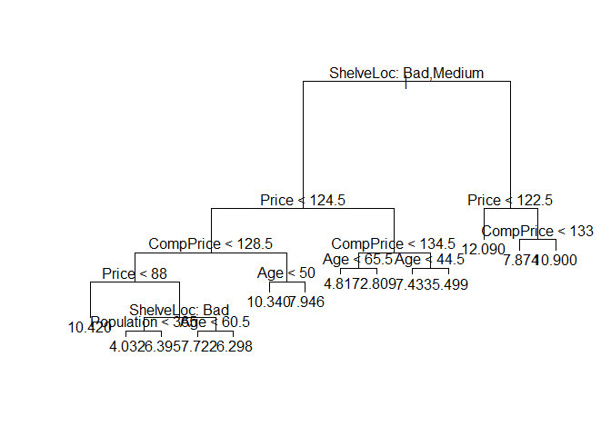
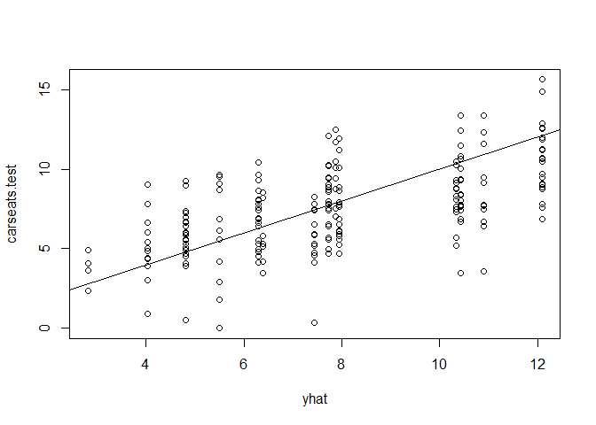
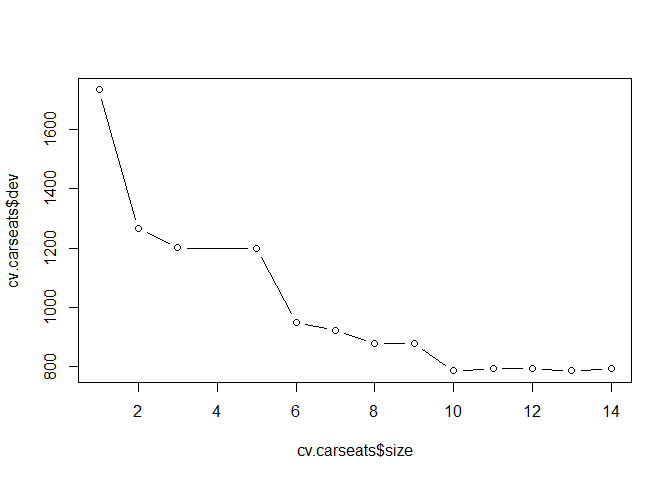
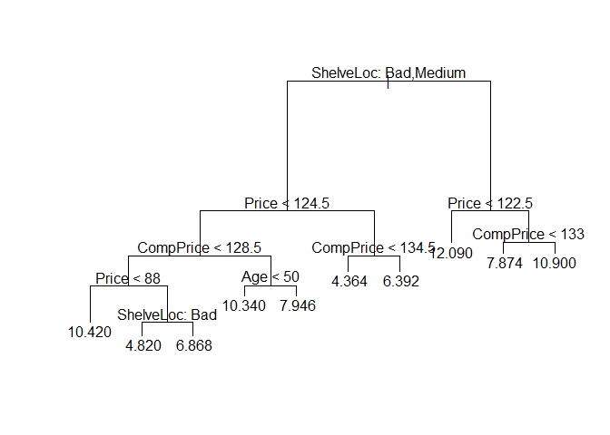
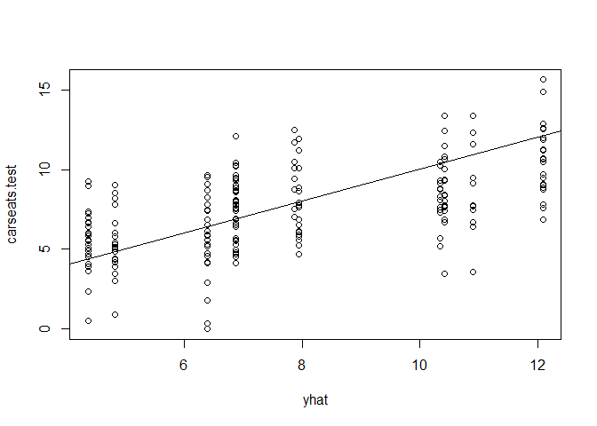

Decision Trees
================

``` r
library(ISLR)
library(tree)
```

# 8.3 Lab: Decision Trees

## 8.3.1 Fitting classification trees

``` r
library(tree)
```

``` r
library(ISLR)
attach(Carseats)
High <- ifelse(Sales <= 8, "No", "Yes")
```

``` r
Carseats <- data.frame(Carseats,High)
```

``` r
tree.carseats <- tree(High~. -Sales, Carseats)
```

``` r
summary(tree.carseats)
```

    ## 
    ## Classification tree:
    ## tree(formula = High ~ . - Sales, data = Carseats)
    ## Variables actually used in tree construction:
    ## [1] "ShelveLoc"   "Price"       "Income"      "CompPrice"   "Population" 
    ## [6] "Advertising" "Age"         "US"         
    ## Number of terminal nodes:  27 
    ## Residual mean deviance:  0.4575 = 170.7 / 373 
    ## Misclassification error rate: 0.09 = 36 / 400

``` r
plot(tree.carseats)
text(tree.carseats, pretty = 0)
```

<!-- -->

``` r
tree.carseats
```

    ## node), split, n, deviance, yval, (yprob)
    ##       * denotes terminal node
    ## 
    ##   1) root 400 541.500 No ( 0.59000 0.41000 )  
    ##     2) ShelveLoc: Bad,Medium 315 390.600 No ( 0.68889 0.31111 )  
    ##       4) Price < 92.5 46  56.530 Yes ( 0.30435 0.69565 )  
    ##         8) Income < 57 10  12.220 No ( 0.70000 0.30000 )  
    ##          16) CompPrice < 110.5 5   0.000 No ( 1.00000 0.00000 ) *
    ##          17) CompPrice > 110.5 5   6.730 Yes ( 0.40000 0.60000 ) *
    ##         9) Income > 57 36  35.470 Yes ( 0.19444 0.80556 )  
    ##          18) Population < 207.5 16  21.170 Yes ( 0.37500 0.62500 ) *
    ##          19) Population > 207.5 20   7.941 Yes ( 0.05000 0.95000 ) *
    ##       5) Price > 92.5 269 299.800 No ( 0.75465 0.24535 )  
    ##        10) Advertising < 13.5 224 213.200 No ( 0.81696 0.18304 )  
    ##          20) CompPrice < 124.5 96  44.890 No ( 0.93750 0.06250 )  
    ##            40) Price < 106.5 38  33.150 No ( 0.84211 0.15789 )  
    ##              80) Population < 177 12  16.300 No ( 0.58333 0.41667 )  
    ##               160) Income < 60.5 6   0.000 No ( 1.00000 0.00000 ) *
    ##               161) Income > 60.5 6   5.407 Yes ( 0.16667 0.83333 ) *
    ##              81) Population > 177 26   8.477 No ( 0.96154 0.03846 ) *
    ##            41) Price > 106.5 58   0.000 No ( 1.00000 0.00000 ) *
    ##          21) CompPrice > 124.5 128 150.200 No ( 0.72656 0.27344 )  
    ##            42) Price < 122.5 51  70.680 Yes ( 0.49020 0.50980 )  
    ##              84) ShelveLoc: Bad 11   6.702 No ( 0.90909 0.09091 ) *
    ##              85) ShelveLoc: Medium 40  52.930 Yes ( 0.37500 0.62500 )  
    ##               170) Price < 109.5 16   7.481 Yes ( 0.06250 0.93750 ) *
    ##               171) Price > 109.5 24  32.600 No ( 0.58333 0.41667 )  
    ##                 342) Age < 49.5 13  16.050 Yes ( 0.30769 0.69231 ) *
    ##                 343) Age > 49.5 11   6.702 No ( 0.90909 0.09091 ) *
    ##            43) Price > 122.5 77  55.540 No ( 0.88312 0.11688 )  
    ##              86) CompPrice < 147.5 58  17.400 No ( 0.96552 0.03448 ) *
    ##              87) CompPrice > 147.5 19  25.010 No ( 0.63158 0.36842 )  
    ##               174) Price < 147 12  16.300 Yes ( 0.41667 0.58333 )  
    ##                 348) CompPrice < 152.5 7   5.742 Yes ( 0.14286 0.85714 ) *
    ##                 349) CompPrice > 152.5 5   5.004 No ( 0.80000 0.20000 ) *
    ##               175) Price > 147 7   0.000 No ( 1.00000 0.00000 ) *
    ##        11) Advertising > 13.5 45  61.830 Yes ( 0.44444 0.55556 )  
    ##          22) Age < 54.5 25  25.020 Yes ( 0.20000 0.80000 )  
    ##            44) CompPrice < 130.5 14  18.250 Yes ( 0.35714 0.64286 )  
    ##              88) Income < 100 9  12.370 No ( 0.55556 0.44444 ) *
    ##              89) Income > 100 5   0.000 Yes ( 0.00000 1.00000 ) *
    ##            45) CompPrice > 130.5 11   0.000 Yes ( 0.00000 1.00000 ) *
    ##          23) Age > 54.5 20  22.490 No ( 0.75000 0.25000 )  
    ##            46) CompPrice < 122.5 10   0.000 No ( 1.00000 0.00000 ) *
    ##            47) CompPrice > 122.5 10  13.860 No ( 0.50000 0.50000 )  
    ##              94) Price < 125 5   0.000 Yes ( 0.00000 1.00000 ) *
    ##              95) Price > 125 5   0.000 No ( 1.00000 0.00000 ) *
    ##     3) ShelveLoc: Good 85  90.330 Yes ( 0.22353 0.77647 )  
    ##       6) Price < 135 68  49.260 Yes ( 0.11765 0.88235 )  
    ##        12) US: No 17  22.070 Yes ( 0.35294 0.64706 )  
    ##          24) Price < 109 8   0.000 Yes ( 0.00000 1.00000 ) *
    ##          25) Price > 109 9  11.460 No ( 0.66667 0.33333 ) *
    ##        13) US: Yes 51  16.880 Yes ( 0.03922 0.96078 ) *
    ##       7) Price > 135 17  22.070 No ( 0.64706 0.35294 )  
    ##        14) Income < 46 6   0.000 No ( 1.00000 0.00000 ) *
    ##        15) Income > 46 11  15.160 Yes ( 0.45455 0.54545 ) *

``` r
set.seed(2)
train <- sample(1:nrow(Carseats), 200)
Carseats.test <- Carseats[-train,]
High.test <- High[-train]
tree.carseats <- tree(High~.-Sales, Carseats, subset = train)
tree.pred <- predict(tree.carseats, Carseats.test, type = "class")
table(tree.pred, High.test)
```

    ##          High.test
    ## tree.pred  No Yes
    ##       No  104  33
    ##       Yes  13  50

``` r
(104+50)/200
```

    ## [1] 0.77

``` r
set.seed(3)
cv.carseats <- cv.tree(tree.carseats, FUN=prune.misclass)
names(cv.carseats)
```

    ## [1] "size"   "dev"    "k"      "method"

``` r
cv.carseats
```

    ## $size
    ## [1] 21 19 14  9  8  5  3  2  1
    ## 
    ## $dev
    ## [1] 74 76 81 81 75 77 78 85 81
    ## 
    ## $k
    ## [1] -Inf  0.0  1.0  1.4  2.0  3.0  4.0  9.0 18.0
    ## 
    ## $method
    ## [1] "misclass"
    ## 
    ## attr(,"class")
    ## [1] "prune"         "tree.sequence"

``` r
par(mfrow=c(1,2))
plot(cv.carseats$size, cv.carseats$dev, type = "b")
plot(cv.carseats$k, cv.carseats$dev, type ="b")
```

<!-- -->

``` r
prune.carseats <- prune.misclass(tree.carseats, best = 9)
par(mfrow = c(1,1))
plot(prune.carseats)
text(prune.carseats, pretty = 0)
```

<!-- -->

``` r
tree.pred <- predict(prune.carseats, Carseats.test, type = "class")
table(tree.pred, High.test)
```

    ##          High.test
    ## tree.pred No Yes
    ##       No  97  25
    ##       Yes 20  58

``` r
(97+58)/200
```

    ## [1] 0.775

``` r
prune.carseats <- prune.misclass(tree.carseats, best = 15)
plot(prune.carseats)
text(prune.carseats, pretty = 0)
```

<!-- -->

``` r
tree.pred <- predict(prune.carseats, Carseats.test, type = "class")
table(tree.pred, High.test)
```

    ##          High.test
    ## tree.pred  No Yes
    ##       No  102  30
    ##       Yes  15  53

``` r
(102+53)/200
```

    ## [1] 0.775

## 8.3.2 Fitting Regression Trees

``` r
library(MASS)
set.seed(1)
train <- sample(1:nrow(Boston), nrow(Boston)/2)
tree.boston <- tree(medv~ ., data = Boston, subset = train)
summary(tree.boston)
```

    ## 
    ## Regression tree:
    ## tree(formula = medv ~ ., data = Boston, subset = train)
    ## Variables actually used in tree construction:
    ## [1] "rm"    "lstat" "crim"  "age"  
    ## Number of terminal nodes:  7 
    ## Residual mean deviance:  10.38 = 2555 / 246 
    ## Distribution of residuals:
    ##     Min.  1st Qu.   Median     Mean  3rd Qu.     Max. 
    ## -10.1800  -1.7770  -0.1775   0.0000   1.9230  16.5800

``` r
plot(tree.boston)
text(tree.boston, pretty = 0)
```

<!-- -->

``` r
cv.boston <- cv.tree(tree.boston)
plot(cv.boston$size, cv.boston$dev, type = "b")
```

<!-- -->

``` r
prune.boston <- prune.tree(tree.boston, best = 5)
plot(prune.boston)
text(prune.boston, pretty = 0)
```

<!-- -->

``` r
yhat <- predict(tree.boston, newdata = Boston[-train,])
boston.test <- Boston[-train, "medv"]
plot(yhat, boston.test)
abline(0,1)
```

<!-- -->

``` r
mean((yhat-boston.test)^2)
```

    ## [1] 35.28688

# Exercises

## Exercise 8a: Split the data into a training set and a test set

``` r
Carseats$High <- NULL
set.seed(1111)
index <- sample(1:nrow(Carseats), nrow(Carseats)/2)
```

## Exercise 8b: Fit a regression tree to the training set. Plot the tree, and interpret the results. What test MSE did you obtain?

``` r
tree.carseats <- tree(Sales~., Carseats, subset = train)
summary(tree.carseats)
```

    ## 
    ## Regression tree:
    ## tree(formula = Sales ~ ., data = Carseats, subset = train)
    ## Variables actually used in tree construction:
    ## [1] "ShelveLoc"  "Price"      "CompPrice"  "Population" "Age"       
    ## Number of terminal nodes:  14 
    ## Residual mean deviance:  2.246 = 404.2 / 180 
    ## Distribution of residuals:
    ##     Min.  1st Qu.   Median     Mean  3rd Qu.     Max. 
    ## -3.25600 -0.95650  0.02697  0.00000  1.07300  4.17700

``` r
plot(tree.carseats)
text(tree.carseats, pretty = 0)
```

<!-- -->

``` r
yhat <- predict(tree.carseats, newdata=Carseats[-train,])
carseats.test <- Carseats[-train, "Sales"]
plot(yhat, carseats.test)
abline(0,1)
```

<!-- -->

``` r
mean((yhat - carseats.test)^2)
```

    ## [1] 5.788809

The initial splits are made on shelf location followed by price. After
that comes competitor prices. I got a MSE of 5.79

## 8c: Use cross-validation in order to determin the optimal level of tree complexity. Does pruning the tree improve the test MSE

``` r
cv.carseats <- cv.tree(tree.carseats)
plot(cv.carseats$size, cv.carseats$dev, type = "b")
```

<!-- -->

``` r
# 10 looks like it could be better
prune.carseats <- prune.tree(tree.carseats, best = 10)
plot(prune.carseats)
text(prune.carseats, pretty = 0)
```

<!-- -->

``` r
yhat <- predict(prune.carseats, newdata=Carseats[-train,])
carseats.test <- Carseats[-train, "Sales"]
plot(yhat, carseats.test)
abline(0,1)
```

<!-- -->

``` r
mean((yhat - carseats.test)^2)
```

    ## [1] 5.744403

Very slightly reduced the MSE by pruning from 5.79 to 5.74
