```r
library(tidyverse)
```

```
## -- Attaching packages -------------------------------------------------------------------------------------------------------------- tidyverse 1.2.1 --
```

```
## v ggplot2 3.2.1     v purrr   0.3.3
## v tibble  2.1.3     v dplyr   0.8.3
## v tidyr   1.0.0     v stringr 1.4.0
## v readr   1.3.1     v forcats 0.4.0
```

```
## -- Conflicts ----------------------------------------------------------------------------------------------------------------- tidyverse_conflicts() --
## x dplyr::filter() masks stats::filter()
## x dplyr::lag()    masks stats::lag()
```

```r
library(rethinking)
```

```
## Loading required package: rstan
```

```
## Loading required package: StanHeaders
```

```
## rstan (Version 2.19.2, GitRev: 2e1f913d3ca3)
```

```
## For execution on a local, multicore CPU with excess RAM we recommend calling
## options(mc.cores = parallel::detectCores()).
## To avoid recompilation of unchanged Stan programs, we recommend calling
## rstan_options(auto_write = TRUE)
```

```
## For improved execution time, we recommend calling
## Sys.setenv(LOCAL_CPPFLAGS = '-march=native')
## although this causes Stan to throw an error on a few processors.
```

```
## 
## Attaching package: 'rstan'
```

```
## The following object is masked from 'package:tidyr':
## 
##     extract
```

```
## Loading required package: parallel
```

```
## Loading required package: dagitty
```

```
## rethinking (Version 1.91)
```

```
## 
## Attaching package: 'rethinking'
```

```
## The following object is masked from 'package:purrr':
## 
##     map
```

```
## The following object is masked from 'package:stats':
## 
##     rstudent
```

```r
options(mc.cores = parallel::detectCores())
rstan_options(auto_write = TRUE)
Sys.setenv(LOCAL_CPPFLAGS = '-march=native')
```

### 10H3. The data contained in library(MASS);data(eagles) are records of salmon pirating attempts by Bald Eagles in Washington State. See ?eagles for details. While one eagle feeds, sometimes another will swoop in and try to steal the salmon from it. Call the feeding eagle the “victim” and the thief the “pirate.” Use the available data to build a binomial GLM of successful pirating attempts.  

a. Consider the following model:  

$$
y_i ∼ Binomial(n_i, p_i) \\
log \frac{p_i}{1 − p_i} = \alpha + \beta_PP_i + \beta_VV_i + \beta_AA_i \\
\alpha ∼ Normal(0, 10) \\
\beta_P ∼ Normal(0, 5) \\
\beta_V ∼ Normal(0, 5) \\
\beta_A ∼ Normal(0, 5)
$$
where y is the number of successful attempts, n is the total number of attempts, P is a dummy variable indicating whether or not the pirate had large body size, V is a dummy variable indicating whether or not the victim had large body size, and finally A is a dummy variable indicating whether or not the pirate was an adult. Fit the model above to the eagles data, using both map and map2stan. Is the quadratic approximation okay?  


```r
library(MASS)
```

```
## 
## Attaching package: 'MASS'
```

```
## The following object is masked from 'package:dplyr':
## 
##     select
```

```r
data(eagles)
d <- eagles
d
```

```
##    y  n P A V
## 1 17 24 L A L
## 2 29 29 L A S
## 3 17 27 L I L
## 4 20 20 L I S
## 5  1 12 S A L
## 6 15 16 S A S
## 7  0 28 S I L
## 8  1  4 S I S
```

```r
d$P <- ifelse(d$P == "S", 0L, 1L)
d$A <- ifelse(d$A == "I", 0L, 1L)
d$V <- ifelse(d$V == "S", 0L, 1L)
d
```

```
##    y  n P A V
## 1 17 24 1 1 1
## 2 29 29 1 1 0
## 3 17 27 1 0 1
## 4 20 20 1 0 0
## 5  1 12 0 1 1
## 6 15 16 0 1 0
## 7  0 28 0 0 1
## 8  1  4 0 0 0
```

```r
m_quap <- quap(
  alist(
    y ~ dbinom(n, p),
    logit(p) <- a + Bp*P + Bv*V + Ba*A,
    a ~ dnorm(0,10),
    c(Bp,Bv,Ba) ~ dnorm(0,5)
  ), data = d
)

m_ulam <- ulam(
  alist(
    y ~ dbinom(n, p),
    logit(p) <- a + Bp*P + Bv*V + Ba*A,
    a ~ dnorm(0,10),
    c(Bp,Bv,Ba) ~ dnorm(0,5)
  ), data = d, chains = 4, cores = 4, log_lik = T
)

compare(m_quap, m_ulam)
```

```
## Warning in compare(m_quap, m_ulam): Not all model fits of same class.
## This is usually a bad idea, because it implies they were fit by different algorithms.
## Check yourself, before you wreck yourself.
```

```
##            WAIC    pWAIC    dWAIC       weight       SE      dSE
## m_ulam 30.93357 5.292905  0.00000 1.000000e+00  7.87288       NA
## m_quap 98.55837 3.725517 67.62479 2.067581e-15 12.47227 37.33101
```

```r
precis(m_quap, depth = 2)
```

```
##          mean        sd       5.5%     94.5%
## a   0.5915418 0.6622747 -0.4669010  1.649985
## Bp  4.2418152 0.8960158  2.8098089  5.673821
## Bv -4.5926027 0.9613926 -6.1290938 -3.056112
## Ba  1.0814222 0.5339217  0.2281122  1.934732
```

```r
precis(m_ulam, depth = 2)
```

```
##          mean        sd       5.5%     94.5%    n_eff     Rhat
## a   0.6899249 0.7243359 -0.3995285  1.886913 729.8086 1.000278
## Ba  1.1206946 0.5640455  0.2297600  2.010730 923.9079 1.002030
## Bv -5.0558466 1.0751555 -6.9198892 -3.505893 570.4346 1.008568
## Bp  4.6121613 0.9777933  3.2126570  6.331305 753.4317 1.012047
```

```r
pairs(m_quap)
```

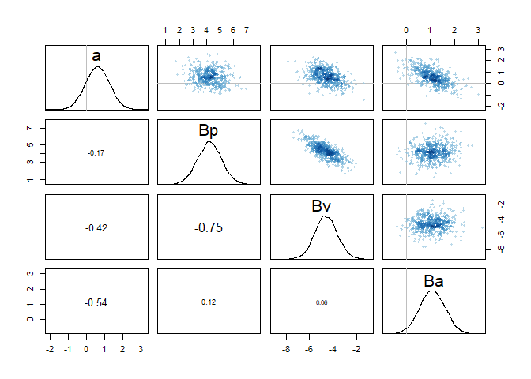<!-- -->

```r
pairs(m_ulam)
```

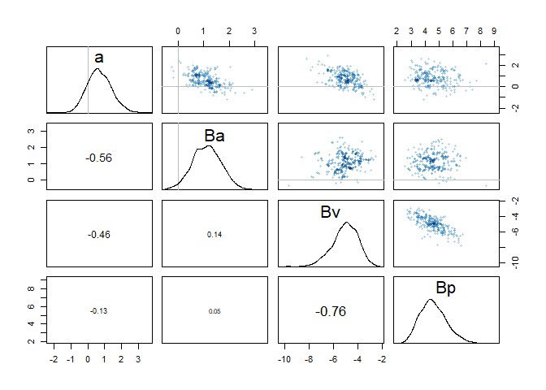<!-- -->

```r
plot(coeftab(m_quap, m_ulam))
```

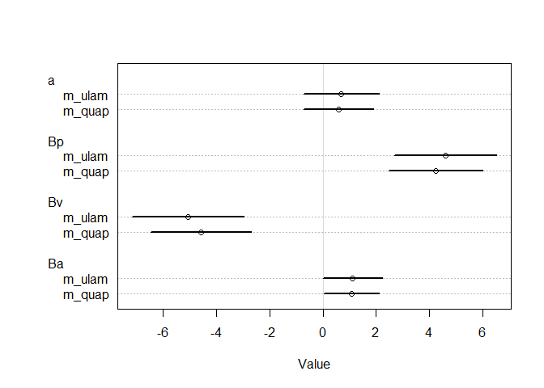<!-- -->

Looking at the coefficients, the two models look similar. In the pairs plot there appears to be a higher correlation of coefficients in the quadratic model compared to the stan model.

b. Now interpret the estimates. If the quadratic approximation turned out okay, then it’s okay to use the map estimates. Otherwise stick to map2stan estimates. Then plot the posterior predictions. Compute and display both (1) the predicted probability of success and its 89% interval for each row (i) in the data, as well as (2) the predicted success count and its 89% interval. What different information does each type of posterior prediction provide?  


```r
precis(m_ulam, depth = 2)
```

```
##          mean        sd       5.5%     94.5%    n_eff     Rhat
## a   0.6899249 0.7243359 -0.3995285  1.886913 729.8086 1.000278
## Ba  1.1206946 0.5640455  0.2297600  2.010730 923.9079 1.002030
## Bv -5.0558466 1.0751555 -6.9198892 -3.505893 570.4346 1.008568
## Bp  4.6121613 0.9777933  3.2126570  6.331305 753.4317 1.012047
```

```r
post <- extract.samples(m_ulam)
mean(inv_logit(post$a)) # success when pirate and victim both small and pirate not an adult
```

```
## [1] 0.6492957
```

```r
mean(inv_logit(post$a + post$Bp)) # success when pirate is big and young and victim is small
```

```
## [1] 0.991557
```

```r
pred_dat <- d[,2:5]
pred_dat
```

```
##    n P A V
## 1 24 1 1 1
## 2 29 1 1 0
## 3 27 1 0 1
## 4 20 1 0 0
## 5 12 0 1 1
## 6 16 0 1 0
## 7 28 0 0 1
## 8  4 0 0 0
```

```r
preds <- link(m_ulam, data = pred_dat)

head(preds)
```

```
##           [,1]      [,2]      [,3]      [,4]        [,5]      [,6]        [,7]
## [1,] 0.8047792 0.9988503 0.5252994 0.9957305 0.039376550 0.8962553 0.010883493
## [2,] 0.7169522 0.9962238 0.5004038 0.9905052 0.093028329 0.9144054 0.038978541
## [3,] 0.7726883 0.9994885 0.5021132 0.9982779 0.006342473 0.7858218 0.001890117
## [4,] 0.7830518 0.9974661 0.5174436 0.9915216 0.034987316 0.7981491 0.010656275
## [5,] 0.6404152 0.9992244 0.4585024 0.9983700 0.018666718 0.9322483 0.008962442
## [6,] 0.8197801 0.9985656 0.6037823 0.9957303 0.052979656 0.8954136 0.018396607
##           [,8]
## [1,] 0.6987051
## [2,] 0.8085898
## [3,] 0.5211925
## [4,] 0.5401705
## [5,] 0.8674054
## [6,] 0.7414779
```

```r
summary(preds)
```

```
##        V1               V2               V3               V4        
##  Min.   :0.4250   Min.   :0.9728   Min.   :0.2429   Min.   :0.9115  
##  1st Qu.:0.7386   1st Qu.:0.9965   1st Qu.:0.4992   1st Qu.:0.9890  
##  Median :0.7944   Median :0.9983   Median :0.5600   Median :0.9945  
##  Mean   :0.7868   Mean   :0.9973   Mean   :0.5592   Mean   :0.9916  
##  3rd Qu.:0.8425   3rd Qu.:0.9992   3rd Qu.:0.6215   3rd Qu.:0.9975  
##  Max.   :0.9628   Max.   :1.0000   Max.   :0.8519   Max.   :1.0000  
##        V5                  V6               V7                  V8         
##  Min.   :0.0003942   Min.   :0.5112   Min.   :0.0001473   Min.   :0.09813  
##  1st Qu.:0.0209822   1st Qu.:0.7992   1st Qu.:0.0068536   1st Qu.:0.54966  
##  Median :0.0410331   Median :0.8554   Median :0.0136788   Median :0.65458  
##  Mean   :0.0532568   Mean   :0.8439   Mean   :0.0185137   Mean   :0.64930  
##  3rd Qu.:0.0738395   3rd Qu.:0.8993   3rd Qu.:0.0251151   3rd Qu.:0.76100  
##  Max.   :0.4138620   Max.   :0.9832   Max.   :0.1281162   Max.   :0.97233
```

```r
# pred mean prob
mu <- apply(preds, 2, mean)
ci <- apply(preds, 2, HPDI)
labels <- paste("PVA:", paste0(pred_dat$P,pred_dat$V,pred_dat$A))
obs_succ <- d$y/d$n
pred_df <- data.frame(
  Mean = mu,
  Lower_89 = ci[1,],
  Upper_89 = ci[2,],
  Case = labels,
  Observed = obs_succ
)

ggplot(pred_df, aes(x = Case, y = Mean)) +
  geom_pointrange(aes(ymin = Lower_89, ymax = Upper_89)) +
  geom_point(aes(y = Observed), color = "blue") +
  theme(axis.text.x = element_text(angle = 90, hjust = 0)) +
  ylab("Predicted probability")
```

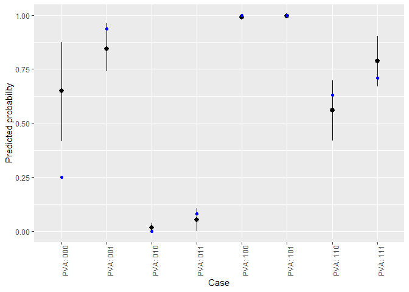<!-- -->

```r
# pred mean success
pred_df$n <- d$n
pred_df$y <- d$y
pred_df$Predicted <- pred_df$Mean*pred_df$n 
pred_df
```

```
##         Mean     Lower_89   Upper_89     Case   Observed  n  y  Predicted
## 1 0.78681121 0.6698812805 0.90297110 PVA: 111 0.70833333 24 17 18.8834691
## 2 0.99727759 0.9939664782 0.99998842 PVA: 101 1.00000000 29 29 28.9210501
## 3 0.55918167 0.4181321023 0.69764295 PVA: 110 0.62962963 27 17 15.0979050
## 4 0.99155702 0.9815944973 0.99998036 PVA: 100 1.00000000 20 20 19.8311404
## 5 0.05325678 0.0003942224 0.10873819 PVA: 011 0.08333333 12  1  0.6390814
## 6 0.84390971 0.7401348642 0.96332436 PVA: 001 0.93750000 16 15 13.5025553
## 7 0.01851375 0.0001473165 0.03903994 PVA: 010 0.00000000 28  0  0.5183850
## 8 0.64929573 0.4154642566 0.87645151 PVA: 000 0.25000000  4  1  2.5971829
```

```r
ggplot(pred_df, aes(x = Case, y = Predicted)) +
  geom_pointrange(aes(ymin = Lower_89*n, ymax = Upper_89*n)) +
  geom_point(aes(y = y), color = "blue") +
  theme(axis.text.x = element_text(angle = 90, hjust = 0)) +
  ylab("Predicted successful")
```

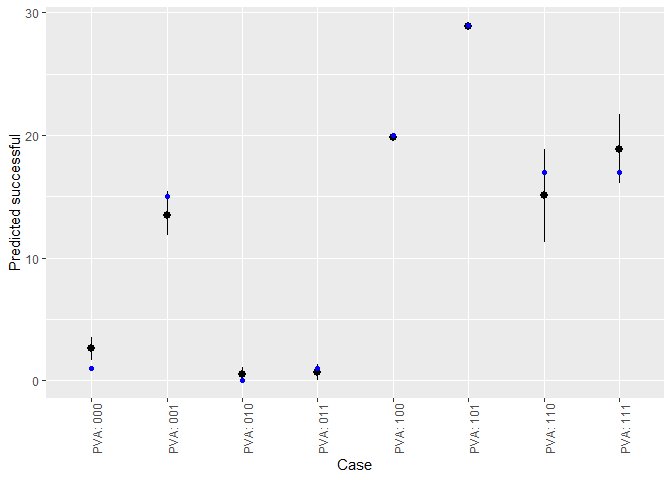<!-- -->


c. Now try to improve the model. Consider an interaction between the pirate’s size and age (immature or adult). Compare this model to the previous one, using WAIC. Interpret.


```r
m_ulam_int <- ulam(
  alist(
    y ~ dbinom(n, p),
    logit(p) <- a + Bp*P + Bv*V + Ba*A + Bpa*P*A,
    a ~ dnorm(0,10),
    c(Bp,Bv,Ba,Bpa) ~ dnorm(0,5)
  ), data = d, chains = 4, cores = 4, log_lik = T
)

compare(m_ulam,m_ulam_int)
```

```
##                WAIC    pWAIC   dWAIC      weight      SE      dSE
## m_ulam_int 21.16283 2.228769 0.00000 0.992500341 5.67036       NA
## m_ulam     30.93357 5.292905 9.77074 0.007499659 7.87288 3.480169
```

On face value it looks like the interaction model works better based on WAIC

### 11E3. When count data are zero-inflated, using a model that ignores zero-inflation will tend to induce which kind of inferential error?

It will cause us to think the rate is lower than it really is since zeros are arising due the event being impossible to take place

### 11E4. Over-dispersion is common in count data. Give an example of a natural process that might produce over-dispersed counts. Can you also give an example of a process that might produce underdispersed counts?

The rate of germination for seeds in a wooded area could be overdispersed in you do not take into account the amount of sunlight hitting each area being observed.  

When autocorrelation is occurring due to groups experiencing a similar effect causing them to be more similar than chance. I don't maybe using a fertilizer which maximizes growth in every condition so all samples look the same due to the fertilizer.


### 11M3. Can you modify the derivation of the zero-inflated Poisson distribution (ZIPoisson) from the chapter to construct a zero-inflated binomial distribution?

PASS

### 11H1. In 2014, a paper was published that was entitled “Female hurricanes are deadlier than male hurricanes.”  As the title suggests, the paper claimed that hurricanes with female names have caused greater loss of life, and the explanation given is that people unconsciously rate female hurricanes as less dangerous and so are less likely to evacuate.
### Statisticians severely criticized the paper after publication. Here, you’ll explore the complete data used in the paper and consider the hypothesis that hurricanes with female names are deadlier. Load the data with:


```r
data(Hurricanes)
d <- Hurricanes
d
```

```
##         name year deaths category min_pressure damage_norm female femininity
## 1       Easy 1950      2        3          960        1590      1    6.77778
## 2       King 1950      4        3          955        5350      0    1.38889
## 3       Able 1952      3        1          985         150      0    3.83333
## 4    Barbara 1953      1        1          987          58      1    9.83333
## 5   Florence 1953      0        1          985          15      1    8.33333
## 6      Carol 1954     60        3          960       19321      1    8.11111
## 7       Edna 1954     20        3          954        3230      1    8.55556
## 8      Hazel 1954     20        4          938       24260      1    9.44444
## 9     Connie 1955      0        3          962        2030      1    8.50000
## 10     Diane 1955    200        1          987       14730      1    9.88889
## 11      Ione 1955      7        3          960        6200      0    5.94444
## 12    Flossy 1956     15        2          975        1540      1    7.00000
## 13    Helene 1958      1        3          946         540      1    9.88889
## 14     Debra 1959      0        1          984         430      1    9.88889
## 15    Gracie 1959     22        3          950         510      1    9.77778
## 16     Donna 1960     50        4          930       53270      1    9.27778
## 17     Ethel 1960      0        1          981          35      1    8.72222
## 18     Carla 1961     46        4          931       15850      1    9.50000
## 19     Cindy 1963      3        1          996         300      1    9.94444
## 20      Cleo 1964      3        2          968        6450      1    7.94444
## 21      Dora 1964      5        2          966       16260      1    9.33333
## 22     Hilda 1964     37        3          950        2770      1    8.83333
## 23    Isbell 1964      3        2          974         800      1    9.44444
## 24     Betsy 1965     75        3          948       20000      1    8.33333
## 25      Alma 1966      6        2          982         730      1    8.77778
## 26      Inez 1966      3        1          983          99      1    8.27778
## 27    Beulah 1967     15        3          950        5060      1    7.27778
## 28    Gladys 1968      3        2          977         800      1    8.94444
## 29   Camille 1969    256        5          909       23040      1    9.05556
## 30     Celia 1970     22        3          945        6870      1    9.44444
## 31     Edith 1971      0        2          978         300      1    8.50000
## 32      Fern 1971      2        1          979         500      1    7.38889
## 33    Ginger 1971      0        1          995         200      1   10.00000
## 34     Agnes 1972    117        1          980       20430      1    8.66667
## 35    Carmen 1974      1        3          952        1180      1    8.72222
## 36    Eloise 1975     21        3          955        6190      1    8.94444
## 37     Belle 1976      5        1          980         570      1   10.44444
## 38      Babe 1977      0        1          995          66      1    6.88889
## 39       Bob 1979      1        1          986          70      0    1.66667
## 40     David 1979     15        2          970        2700      0    1.72222
## 41  Frederic 1979      5        3          946       12770      0    2.50000
## 42     Allen 1980      2        3          945        2130      0    2.66667
## 43    Alicia 1983     21        3          962       10400      1    9.83333
## 44     Diana 1984      3        2          949         410      1    9.94444
## 45       Bob 1985      0        1         1003         130      0    1.66667
## 46     Danny 1985      1        1          987         160      0    2.22222
## 47     Elena 1985      4        3          959        4180      1    9.72222
## 48    Gloria 1985      8        3          942        3020      1    9.50000
## 49      Juan 1985     12        1          971        4730      0    1.94444
## 50      Kate 1985      5        2          967        1310      1    9.66667
## 51    Bonnie 1986      3        1          990           6      1    9.38889
## 52   Charley 1986      5        1          990          58      0    2.88889
## 53     Floyd 1987      0        1          993           1      0    1.83333
## 54  Florence 1988      1        1          984           4      1    8.33333
## 55   Chantal 1989     13        1          986         290      1    9.05556
## 56      Hugo 1989     21        4          934       20020      0    2.88889
## 57     Jerry 1989      3        1          983         230      0    2.33333
## 58       Bob 1991     15        2          962        3620      0    1.66667
## 59    Andrew 1992     62        5          922       66730      0    2.22222
## 60     Emily 1993      3        3          961          96      1    9.83333
## 61      Erin 1995      6        2          973        1650      1    7.22222
## 62      Opal 1995      9        3          942        7550      1    8.50000
## 63    Bertha 1996      8        2          974         700      1    8.50000
## 64      Fran 1996     26        3          954        8260      1    7.16667
## 65     Danny 1997     10        1          984         200      0    2.22222
## 66    Bonnie 1998      3        2          964        1650      1    9.38889
## 67      Earl 1998      3        1          987         160      0    1.88889
## 68   Georges 1998      1        2          964        3870      0    2.27778
## 69      Bret 1999      0        3          951          94      0    2.33333
## 70     Floyd 1999     56        2          956        8130      0    1.83333
## 71     Irene 1999      8        1          964        1430      1    9.27778
## 72      Lili 2002      2        1          963        1260      1   10.33333
## 73 Claudette 2003      3        1          979         250      1    9.16667
## 74    Isabel 2003     51        2          957        4980      1    9.38889
## 75      Alex 2004      1        1          972           5      0    4.16667
## 76   Charley 2004     10        4          941       20510      0    2.88889
## 77   Frances 2004      7        2          960       12620      1    6.00000
## 78    Gaston 2004      8        1          985         170      0    2.66667
## 79      Ivan 2004     25        3          946       18590      0    1.05556
## 80    Jeanne 2004      5        3          950       10210      1    8.50000
## 81     Cindy 2005      1        1          991         350      1    9.94444
## 82    Dennis 2005     15        3          946        2650      0    2.44444
## 83   Ophelia 2005      1        1          982          91      1    9.16667
## 84      Rita 2005     62        3          937       10690      1    9.50000
## 85     Wilma 2005      5        3          950       25960      1    8.61111
## 86  Humberto 2007      1        1          985          51      0    2.38889
## 87     Dolly 2008      1        1          967        1110      1    9.83333
## 88    Gustav 2008     52        2          954        4360      0    1.72222
## 89       Ike 2008     84        2          950       20370      0    1.88889
## 90     Irene 2011     41        1          952        7110      1    9.27778
## 91     Isaac 2012      5        1          966       24000      0    1.94444
## 92     Sandy 2012    159        2          942       75000      1    9.00000
```

```r
summary(d)
```

```
##        name         year          deaths          category      min_pressure   
##  Bob     : 3   Min.   :1950   Min.   :  0.00   Min.   :1.000   Min.   : 909.0  
##  Bonnie  : 2   1st Qu.:1965   1st Qu.:  2.00   1st Qu.:1.000   1st Qu.: 950.0  
##  Charley : 2   Median :1985   Median :  5.00   Median :2.000   Median : 964.0  
##  Cindy   : 2   Mean   :1982   Mean   : 20.65   Mean   :2.087   Mean   : 964.9  
##  Danny   : 2   3rd Qu.:1999   3rd Qu.: 20.25   3rd Qu.:3.000   3rd Qu.: 982.2  
##  Florence: 2   Max.   :2012   Max.   :256.00   Max.   :5.000   Max.   :1003.0  
##  (Other) :79                                                                   
##   damage_norm        female         femininity    
##  Min.   :    1   Min.   :0.0000   Min.   : 1.056  
##  1st Qu.:  245   1st Qu.:0.0000   1st Qu.: 2.667  
##  Median : 1650   Median :1.0000   Median : 8.500  
##  Mean   : 7270   Mean   :0.6739   Mean   : 6.781  
##  3rd Qu.: 8162   3rd Qu.:1.0000   3rd Qu.: 9.389  
##  Max.   :75000   Max.   :1.0000   Max.   :10.444  
## 
```

### Acquaint yourself with the columns by inspecting the help `?Hurricanes`
### In this problem, you’ll focus on predicting deaths using femininity of each hurricane’s name. Fit and interpret the simplest possible model, a Poisson model of deaths using femininity as a predictor. You can use map or map2stan. Compare the model to an intercept-only Poisson model of deaths. How strong is the association between femininity of name and deaths? Which storms does the model fit (retrodict) well? Which storms does it fit poorly?


```r
ggplot(d, aes(femininity,deaths)) +
  geom_point()
```

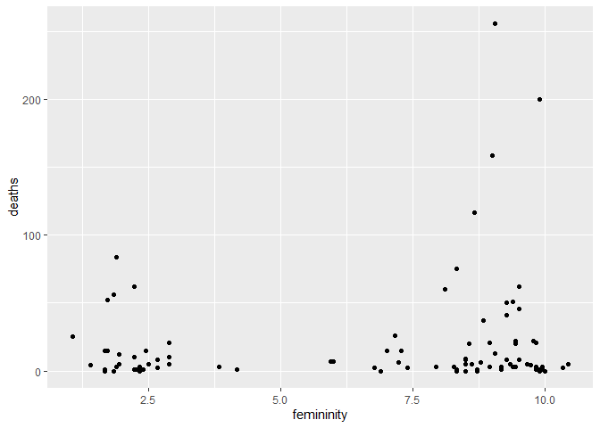<!-- -->

```r
# 2 clear peaks

# possible intercepts

curve( dlnorm( x , 0 , 10 ) , from=0 , to=100 , n=200, col = "black")
curve( dlnorm( x , 3 , 0.5 ) , from=0 , to=100 , n=200, col = "blue", add = T)
curve( dlnorm( x , 3 , 1 ) , from=0 , to=100 , n=200, col = "red", add = T)
curve( dlnorm( x , 3 , 0.25 ) , from=0 , to=100 , n=200, col = "purple", add = T)
curve( dlnorm( x , 4 , 1 ) , from=0 , to=100 , n=200, col = "green", add = T)
```

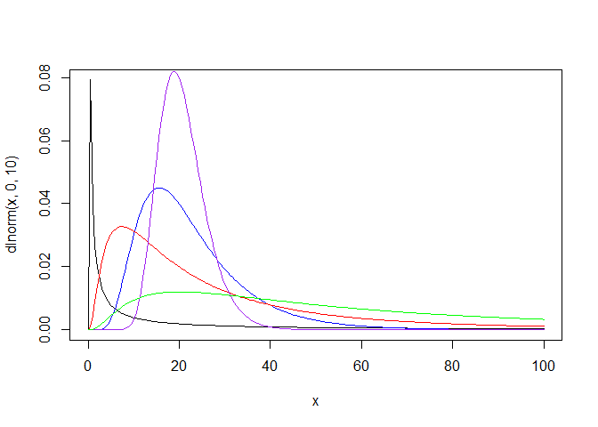<!-- -->

```r
basic <- ulam(
  alist(
    deaths ~ dpois(lambda),
    log(lambda) <- a,
    a ~ dnorm(3,1)
  ), data = d, chains = 4, cores = 4, log_lik = T
)
```

```
## Removing one or more character or factor variables:
```

```
## name
```

```r
precis(basic)
```

```
##       mean         sd     5.5%    94.5%    n_eff     Rhat
## a 3.026563 0.02251045 2.990092 3.063845 657.9538 1.002387
```

```r
traceplot(basic)
par(mfrow=c(1,1))
```

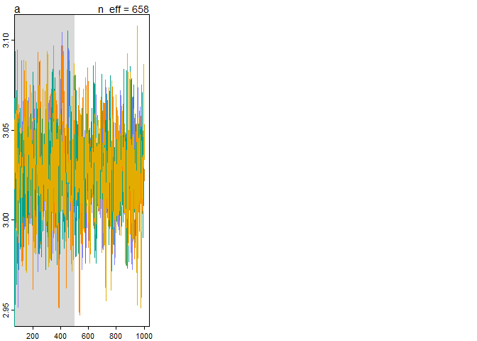<!-- -->

```r
post <- extract.samples(basic)
mean(exp(mean(post$a)))
```

```
## [1] 20.62622
```

```r
# intercept is pretty close to the mean of the dataset

N <- 100
a <- rnorm(N , 3 , 1)
b <- rnorm(N , 0 , 10)
plot(NULL , xlim = c(-2, 2) , ylim = c(0, 100))
for (i in 1:N){
  curve(exp(a[i] + b[i] * x) , add = TRUE , col = col.alpha("black", 0.5))
}

a <- rnorm(N , 3 , 1)
b <- rnorm(N , 0 , 1)
for (i in 1:N){
  curve(exp(a[i] + b[i] * x) , add = TRUE , col = col.alpha("blue", 0.5))
}

a <- rnorm(N , 3 , 1)
b <- rnorm(N , 0 , 0.5)
for (i in 1:N){
  curve(exp(a[i] + b[i] * x) , add = TRUE , col = col.alpha("red", 0.5))
}

a <- rnorm(N , 3 , 1)
b <- rnorm(N , 0 , 0.2)
for (i in 1:N){
  curve(exp(a[i] + b[i] * x) , add = TRUE , col = col.alpha("green", 0.5))
}
```

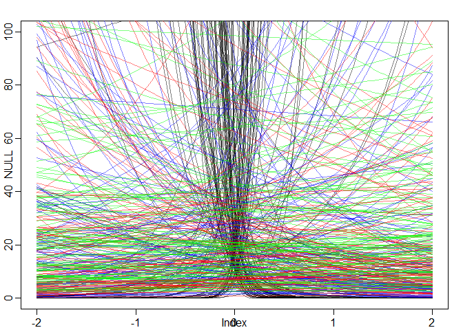<!-- -->

```r
a <- rnorm(N , 3 , 1)
b <- rnorm(N , 0 , 0.1)
plot(NULL , xlim = c(-2, 2) , ylim = c(0, 100))
for (i in 1:N){
  curve(exp(a[i] + b[i] * x), add = TRUE)
}
```

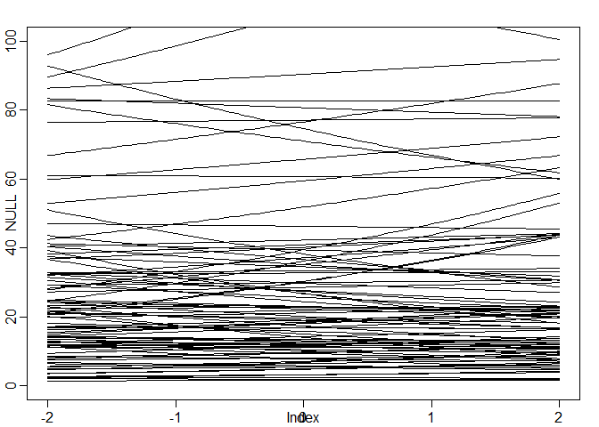<!-- -->

```r
# pick last one

advanced <- ulam(
  alist(
    deaths ~ dpois(lambda),
    log(lambda) <- a + Bf*femininity,
    a ~ dnorm(3,1),
    Bf ~ dnorm(0,0.1)
  ), data = d, chains = 4, cores = 4, log_lik = T
)
```

```
## Removing one or more character or factor variables:
## name
```

```r
compare(basic,advanced)
```

```
##              WAIC    pWAIC   dWAIC       weight        SE      dSE
## advanced 4391.524 126.0381  0.0000 1.000000e+00  989.1448       NA
## basic    4442.650  77.1186 51.1257 7.910341e-12 1072.8487 145.4536
```

```r
#WAICs are slightly different, but all the weight goes to the model that includes femininity

precis(advanced)
```

```
##          mean         sd       5.5%      94.5%    n_eff     Rhat
## a  2.50939182 0.06099825 2.41094559 2.60812644 391.1085 1.004244
## Bf 0.07259073 0.00758909 0.06022102 0.08449988 411.2538 1.003357
```

```r
# Bf has a very low effect, but its still positive
traceplot(advanced)
par(mfrow=c(1,1))
```

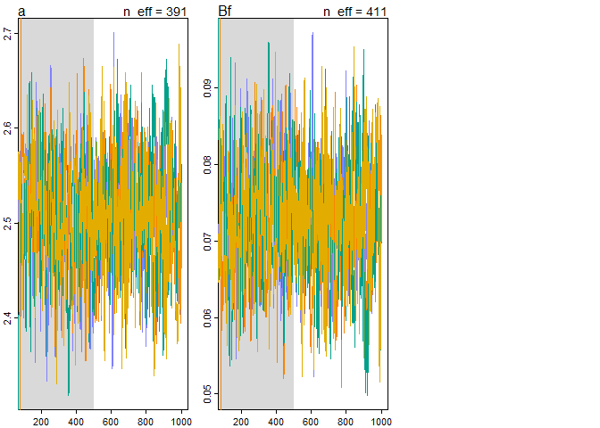<!-- -->

```r
par(ask = F)
postcheck(advanced)
```

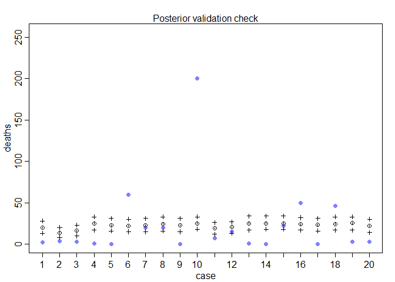<!-- -->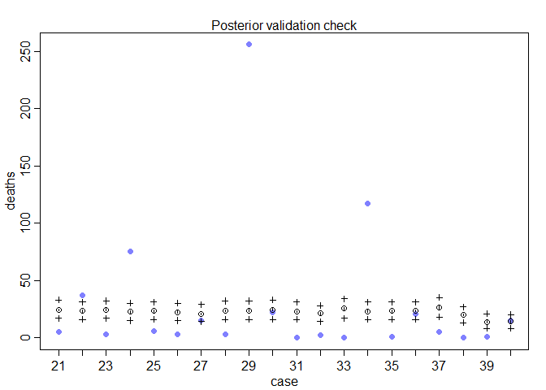<!-- -->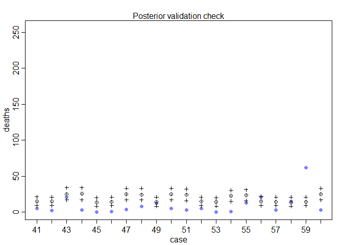<!-- -->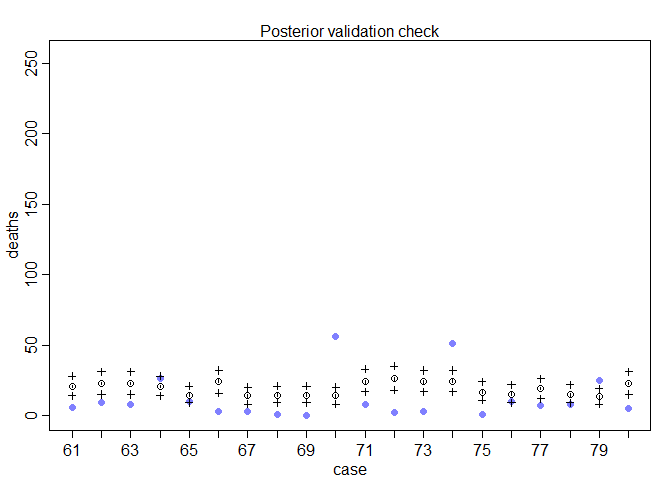<!-- -->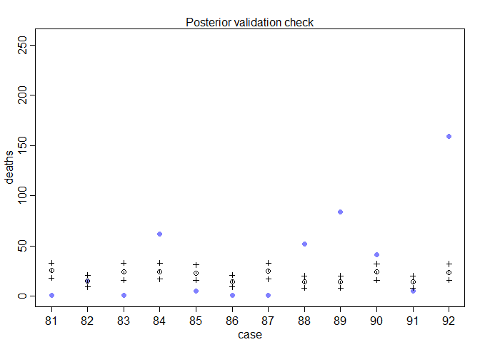<!-- -->

```r
ggplot(d, aes(femininity,deaths, color = as.factor(female))) +
  geom_point()
```

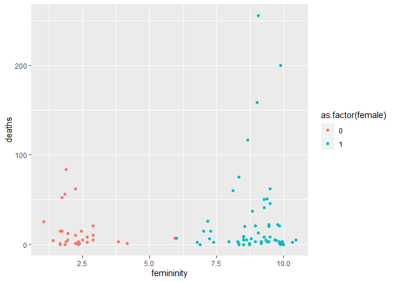<!-- -->

The effect of femininity is there, but it is extremely low. Model is only good at predicting average hurricanes, completely misses the really deadly ones.


### 11H2. Counts are nearly always over-dispersed relative to Poisson. So fit a gamma-Poisson (aka negative-binomial) model to predict deaths using femininity. Show that the over-dispersed model no longer shows as precise a positive association between femininity and deaths, with an 89% interval that overlaps zero. Can you explain why the association diminished in strength?


```r
over <- ulam(
  alist(
    deaths ~ dgampois(lambda, phi),
    log(lambda) <- a + Bf*femininity,
    a ~ dnorm(3,1),
    Bf ~ dnorm(0,0.1),
    phi ~ dexp(1)
  ), data = d, chains = 4, cores = 4, log_lik = T
)
```

```
## Removing one or more character or factor variables:
```

```
## name
```

```r
compare(basic,advanced,over)
```

```
##               WAIC      pWAIC    dWAIC weight         SE       dSE
## over      709.2018   3.335964    0.000      1   31.95614        NA
## advanced 4391.5242 126.038083 3682.322      0  989.14482  972.7523
## basic    4442.6499  77.118598 3733.448      0 1072.84874 1057.3063
```

```r
precis(over)
```

```
##           mean         sd        5.5%     94.5%    n_eff     Rhat
## a   2.67688774 0.33380378  2.15594802 3.2235072 897.2174 1.001629
## Bf  0.05221867 0.04289448 -0.01519032 0.1203519 849.4971 1.002307
## phi 0.45272561 0.06239183  0.35782696 0.5556832 940.5440 1.000853
```

```r
# Bf now sits on both sides of 0
traceplot(over)
```

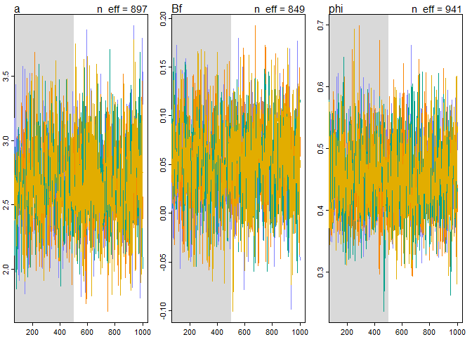<!-- -->

```r
par(mfrow=c(1,1))
```

The association diminished in strength since now the model can compensate for the variance. It is now less certain about the effect of femininity now

### 11H6. The data in data(Fish) are records of visits to a national park. See ?Fish for details. The question of interest is how many fish an average visitor takes per hour, when fishing. The problem is that not everyone tried to fish, so the fish_caught numbers are zero-inflated. As with the monks example in the chapter, there is a process that determines who is fishing (working) and another process that determines fish per hour (manuscripts per day), conditional on fishing (working). We want to model both. Otherwise we’ll end up with an underestimate of rate of fish extraction from the park. You will model these data using zero-inflated Poisson GLMs. Predict fish_caught as a function of any of the other variables you think are relevant. One thing you must do, however, is use a proper Poisson offset/exposure in the Poisson portion of the zero-inflated model. Then use the hours variable to construct the offset. This will adjust the model for the differing amount of time individuals spent in the park.


```r
data(Fish)
d <- Fish
d$log_hours <- log(d$hours)
summary(d)
```

```
##   fish_caught         livebait         camper         persons     
##  Min.   :  0.000   Min.   :0.000   Min.   :0.000   Min.   :1.000  
##  1st Qu.:  0.000   1st Qu.:1.000   1st Qu.:0.000   1st Qu.:2.000  
##  Median :  0.000   Median :1.000   Median :1.000   Median :2.000  
##  Mean   :  3.296   Mean   :0.864   Mean   :0.588   Mean   :2.528  
##  3rd Qu.:  2.000   3rd Qu.:1.000   3rd Qu.:1.000   3rd Qu.:4.000  
##  Max.   :149.000   Max.   :1.000   Max.   :1.000   Max.   :4.000  
##      child           hours           log_hours      
##  Min.   :0.000   Min.   : 0.0040   Min.   :-5.5215  
##  1st Qu.:0.000   1st Qu.: 0.2865   1st Qu.:-1.2516  
##  Median :0.000   Median : 1.8315   Median : 0.6051  
##  Mean   :0.684   Mean   : 5.5260   Mean   : 0.2525  
##  3rd Qu.:1.000   3rd Qu.: 7.3427   3rd Qu.: 1.9932  
##  Max.   :3.000   Max.   :71.0360   Max.   : 4.2632
```

```r
# assuming less than 10% of people at park fish

fishing <- ulam(
  alist(
    fish_caught ~ dzipois(p,lambda),
    logit(p) <- ap,
    log(lambda) <- a + log_hours + Bp*persons + Bb*livebait,
    ap ~ dnorm(-2, 1),
    a ~ dnorm(3,1),
    Bp ~ dnorm(0, .2),
    Bb ~ dnorm(0, .1)
  ), data = d, chains = 4, cores = 4, log_lik = T
)

precis(fishing)
```

```
##          mean         sd       5.5%      94.5%    n_eff     Rhat
## ap -1.3882377 0.25079639 -1.7797025 -1.0115270 1334.532 1.001443
## a  -2.4333117 0.15149256 -2.6702013 -2.1946276  997.193 1.002407
## Bp  0.6545477 0.03768818  0.5934907  0.7128010 1080.272 1.003929
## Bb  0.2866044 0.08202934  0.1546328  0.4180041 1373.030 1.000961
```

```r
traceplot(fishing)

inv_logit(-1.39) # assumes ~20% fish
```

```
## [1] 0.1994078
```

```r
exp(-2.43) #0.09 fish caught an hour by default
```

```
## [1] 0.08803683
```

```r
exp(-2.43 + 4*.65 + .29) # 1.58 fish an hour if 4 people using live bait
```

```
## [1] 1.584074
```

```r
preds <- link(fishing, data = d[,c(1,2,4,7)])
pred_caught <- colMeans(preds$lambda*preds$p[,1])

plot(d$fish_caught,pred_caught)
abline(1,1)
```

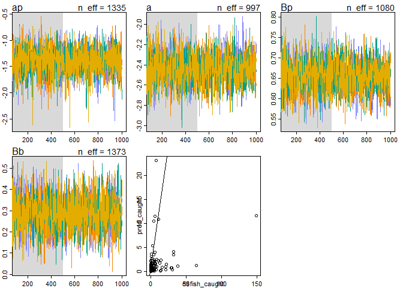<!-- -->

