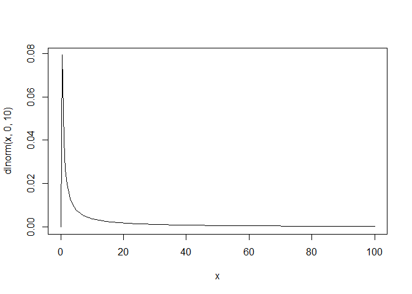
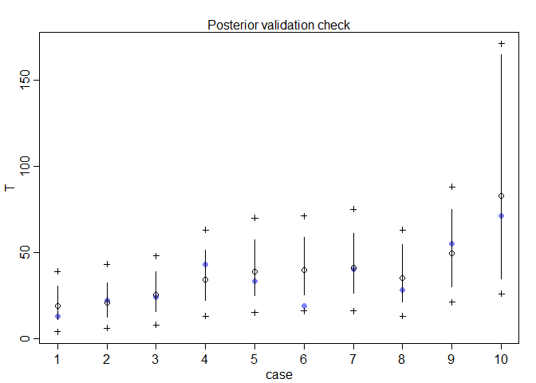

```r
library(tidyverse)
```

```
## -- Attaching packages ---------------------------------------------------------- tidyverse 1.2.1 --
```

```
## v ggplot2 3.2.1     v purrr   0.3.3
## v tibble  2.1.3     v dplyr   0.8.3
## v tidyr   1.0.0     v stringr 1.4.0
## v readr   1.3.1     v forcats 0.4.0
```

```
## -- Conflicts ------------------------------------------------------------- tidyverse_conflicts() --
## x dplyr::filter() masks stats::filter()
## x dplyr::lag()    masks stats::lag()
```

```r
library(rethinking)
```

```
## Loading required package: rstan
```

```
## Loading required package: StanHeaders
```

```
## rstan (Version 2.19.2, GitRev: 2e1f913d3ca3)
```

```
## For execution on a local, multicore CPU with excess RAM we recommend calling
## options(mc.cores = parallel::detectCores()).
## To avoid recompilation of unchanged Stan programs, we recommend calling
## rstan_options(auto_write = TRUE)
```

```
## For improved execution time, we recommend calling
## Sys.setenv(LOCAL_CPPFLAGS = '-march=native')
## although this causes Stan to throw an error on a few processors.
```

```
## 
## Attaching package: 'rstan'
```

```
## The following object is masked from 'package:tidyr':
## 
##     extract
```

```
## Loading required package: parallel
```

```
## Loading required package: dagitty
```

```
## rethinking (Version 1.91)
```

```
## 
## Attaching package: 'rethinking'
```

```
## The following object is masked from 'package:purrr':
## 
##     map
```

```
## The following object is masked from 'package:stats':
## 
##     rstudent
```

```r
options(mc.cores = parallel::detectCores())
rstan_options(auto_write = TRUE)
Sys.setenv(LOCAL_CPPFLAGS = '-march=native')
```

# 11 God Spiked the Integers
## 11.1. Binomial regression
### 11.1.1. Logistic regression: Prosocial chimpanzees


```r
data(chimpanzees)
d <- chimpanzees
d$treatment <- 1 + d$prosoc_left + 2 * d$condition
xtabs(~ treatment + prosoc_left + condition , d)
```

```
## , , condition = 0
## 
##          prosoc_left
## treatment   0   1
##         1 126   0
##         2   0 126
##         3   0   0
##         4   0   0
## 
## , , condition = 1
## 
##          prosoc_left
## treatment   0   1
##         1   0   0
##         2   0   0
##         3 126   0
##         4   0 126
```


```r
m11.1 <- quap(alist(pulled_left ~ dbinom(1 , p) ,
                    logit(p) <- a ,
                    a ~ dnorm(0 , 10)) , data = d)

set.seed(1999)
prior <- extract.prior(m11.1 , n = 1e4)
p <- inv_logit(prior$a)
dens(p , adj = 0.1)

m11.1 <- quap(alist(pulled_left ~ dbinom(1 , p) ,
                    logit(p) <- a ,
                    a ~ dnorm(0 , 1.5)) , data = d)

set.seed(1999)
prior <- extract.prior(m11.1 , n = 1e4)
p <- inv_logit(prior$a)
dens(p , adj = 0.1, add = T, col = "blue")
```

<!-- -->


```r
m11.2 <- quap(alist(
  pulled_left ~ dbinom(1 , p) ,
  logit(p) <- a + b[treatment] ,
  a ~ dnorm(0 , 1.5),
  b[treatment] ~ dnorm(0 , 10)
) ,
data = d)

set.seed(1999)
prior <- extract.prior(m11.2 , n = 1e4)
p <- sapply(1:4 , function(k)
  inv_logit(prior$a + prior$b[, k]))
dens(abs(p[, 1] - p[, 2]) , adj = 0.1)

m11.3 <- quap(alist(
  pulled_left ~ dbinom(1 , p) ,
  logit(p) <- a + b[treatment] ,
  a ~ dnorm(0 , 1.5),
  b[treatment] ~ dnorm(0 , 0.5)
) ,
data = d)
set.seed(1999)
prior <- extract.prior(m11.3 , n = 1e4)
p <- sapply(1:4 , function(k)
  inv_logit(prior$a + prior$b[, k]))
dens(abs(p[, 1] - p[, 2]) ,
     adj = 0.1,
     add = T,
     col = "blue")
```

<!-- -->

```r
mean(abs(p[, 1] - p[, 2]))
```

```
## [1] 0.09838663
```

```r
mean(abs(p[, 1] - p[, 3]))
```

```
## [1] 0.09791694
```

```r
mean(abs(p[, 1] - p[, 4]))
```

```
## [1] 0.09856087
```

```r
mean(abs(p[, 2] - p[, 3]))
```

```
## [1] 0.09879503
```

```r
mean(abs(p[, 2] - p[, 4]))
```

```
## [1] 0.0985305
```

```r
mean(abs(p[, 3] - p[, 4]))
```

```
## [1] 0.09815794
```


```r
# prior trimmed data list
dat_list <- list(
  pulled_left = d$pulled_left,
  actor = d$actor,
  treatment = as.integer(d$treatment)
)
# particles in 11-dimensional space
m11.4 <- ulam(
  alist(
    pulled_left ~ dbinom(1 , p) ,
    logit(p) <- a[actor] + b[treatment] ,
    a[actor] ~ dnorm(0 , 1.5),
    b[treatment] ~ dnorm(0 , 0.5)
  ) ,
  data = dat_list,
  chains = 4,
  log_lik=TRUE
)
```

```
## 
## SAMPLING FOR MODEL '80e2b6267e3dc4ff0c2916d0cf0879e8' NOW (CHAIN 1).
## Chain 1: 
## Chain 1: Gradient evaluation took 0 seconds
## Chain 1: 1000 transitions using 10 leapfrog steps per transition would take 0 seconds.
## Chain 1: Adjust your expectations accordingly!
## Chain 1: 
## Chain 1: 
## Chain 1: Iteration:   1 / 1000 [  0%]  (Warmup)
## Chain 1: Iteration: 100 / 1000 [ 10%]  (Warmup)
## Chain 1: Iteration: 200 / 1000 [ 20%]  (Warmup)
## Chain 1: Iteration: 300 / 1000 [ 30%]  (Warmup)
## Chain 1: Iteration: 400 / 1000 [ 40%]  (Warmup)
## Chain 1: Iteration: 500 / 1000 [ 50%]  (Warmup)
## Chain 1: Iteration: 501 / 1000 [ 50%]  (Sampling)
## Chain 1: Iteration: 600 / 1000 [ 60%]  (Sampling)
## Chain 1: Iteration: 700 / 1000 [ 70%]  (Sampling)
## Chain 1: Iteration: 800 / 1000 [ 80%]  (Sampling)
## Chain 1: Iteration: 900 / 1000 [ 90%]  (Sampling)
## Chain 1: Iteration: 1000 / 1000 [100%]  (Sampling)
## Chain 1: 
## Chain 1:  Elapsed Time: 0.66 seconds (Warm-up)
## Chain 1:                0.747 seconds (Sampling)
## Chain 1:                1.407 seconds (Total)
## Chain 1: 
## 
## SAMPLING FOR MODEL '80e2b6267e3dc4ff0c2916d0cf0879e8' NOW (CHAIN 2).
## Chain 2: 
## Chain 2: Gradient evaluation took 0 seconds
## Chain 2: 1000 transitions using 10 leapfrog steps per transition would take 0 seconds.
## Chain 2: Adjust your expectations accordingly!
## Chain 2: 
## Chain 2: 
## Chain 2: Iteration:   1 / 1000 [  0%]  (Warmup)
## Chain 2: Iteration: 100 / 1000 [ 10%]  (Warmup)
## Chain 2: Iteration: 200 / 1000 [ 20%]  (Warmup)
## Chain 2: Iteration: 300 / 1000 [ 30%]  (Warmup)
## Chain 2: Iteration: 400 / 1000 [ 40%]  (Warmup)
## Chain 2: Iteration: 500 / 1000 [ 50%]  (Warmup)
## Chain 2: Iteration: 501 / 1000 [ 50%]  (Sampling)
## Chain 2: Iteration: 600 / 1000 [ 60%]  (Sampling)
## Chain 2: Iteration: 700 / 1000 [ 70%]  (Sampling)
## Chain 2: Iteration: 800 / 1000 [ 80%]  (Sampling)
## Chain 2: Iteration: 900 / 1000 [ 90%]  (Sampling)
## Chain 2: Iteration: 1000 / 1000 [100%]  (Sampling)
## Chain 2: 
## Chain 2:  Elapsed Time: 0.73 seconds (Warm-up)
## Chain 2:                0.7 seconds (Sampling)
## Chain 2:                1.43 seconds (Total)
## Chain 2: 
## 
## SAMPLING FOR MODEL '80e2b6267e3dc4ff0c2916d0cf0879e8' NOW (CHAIN 3).
## Chain 3: 
## Chain 3: Gradient evaluation took 0 seconds
## Chain 3: 1000 transitions using 10 leapfrog steps per transition would take 0 seconds.
## Chain 3: Adjust your expectations accordingly!
## Chain 3: 
## Chain 3: 
## Chain 3: Iteration:   1 / 1000 [  0%]  (Warmup)
## Chain 3: Iteration: 100 / 1000 [ 10%]  (Warmup)
## Chain 3: Iteration: 200 / 1000 [ 20%]  (Warmup)
## Chain 3: Iteration: 300 / 1000 [ 30%]  (Warmup)
## Chain 3: Iteration: 400 / 1000 [ 40%]  (Warmup)
## Chain 3: Iteration: 500 / 1000 [ 50%]  (Warmup)
## Chain 3: Iteration: 501 / 1000 [ 50%]  (Sampling)
## Chain 3: Iteration: 600 / 1000 [ 60%]  (Sampling)
## Chain 3: Iteration: 700 / 1000 [ 70%]  (Sampling)
## Chain 3: Iteration: 800 / 1000 [ 80%]  (Sampling)
## Chain 3: Iteration: 900 / 1000 [ 90%]  (Sampling)
## Chain 3: Iteration: 1000 / 1000 [100%]  (Sampling)
## Chain 3: 
## Chain 3:  Elapsed Time: 0.666 seconds (Warm-up)
## Chain 3:                0.656 seconds (Sampling)
## Chain 3:                1.322 seconds (Total)
## Chain 3: 
## 
## SAMPLING FOR MODEL '80e2b6267e3dc4ff0c2916d0cf0879e8' NOW (CHAIN 4).
## Chain 4: 
## Chain 4: Gradient evaluation took 0 seconds
## Chain 4: 1000 transitions using 10 leapfrog steps per transition would take 0 seconds.
## Chain 4: Adjust your expectations accordingly!
## Chain 4: 
## Chain 4: 
## Chain 4: Iteration:   1 / 1000 [  0%]  (Warmup)
## Chain 4: Iteration: 100 / 1000 [ 10%]  (Warmup)
## Chain 4: Iteration: 200 / 1000 [ 20%]  (Warmup)
## Chain 4: Iteration: 300 / 1000 [ 30%]  (Warmup)
## Chain 4: Iteration: 400 / 1000 [ 40%]  (Warmup)
## Chain 4: Iteration: 500 / 1000 [ 50%]  (Warmup)
## Chain 4: Iteration: 501 / 1000 [ 50%]  (Sampling)
## Chain 4: Iteration: 600 / 1000 [ 60%]  (Sampling)
## Chain 4: Iteration: 700 / 1000 [ 70%]  (Sampling)
## Chain 4: Iteration: 800 / 1000 [ 80%]  (Sampling)
## Chain 4: Iteration: 900 / 1000 [ 90%]  (Sampling)
## Chain 4: Iteration: 1000 / 1000 [100%]  (Sampling)
## Chain 4: 
## Chain 4:  Elapsed Time: 0.658 seconds (Warm-up)
## Chain 4:                0.568 seconds (Sampling)
## Chain 4:                1.226 seconds (Total)
## Chain 4:
```

```r
precis(m11.4 , depth = 2)
```

```
##             mean        sd        5.5%       94.5%     n_eff     Rhat
## a[1] -0.44662951 0.3212620 -0.95066238  0.06345093  646.1365 1.006385
## a[2]  3.92555845 0.7748581  2.79870885  5.19339940 1272.0420 1.001519
## a[3] -0.75580528 0.3381962 -1.30777047 -0.21802458  782.1167 1.006893
## a[4] -0.75012741 0.3297006 -1.27397722 -0.22916035  674.1171 1.006087
## a[5] -0.44065330 0.3140066 -0.94178658  0.06137972  800.5656 1.006077
## a[6]  0.48443470 0.3259878 -0.03715598  1.01053287  826.2722 1.006794
## a[7]  1.95778498 0.4181679  1.30450901  2.62047870  965.5209 1.003335
## b[1] -0.04355881 0.2783216 -0.51699325  0.36488910  715.0729 1.011344
## b[2]  0.47616555 0.2839300  0.01648295  0.93302454  735.5020 1.004997
## b[3] -0.38455012 0.2809016 -0.84347442  0.04779866  720.9321 1.006081
## b[4]  0.37235142 0.2766925 -0.07208403  0.81423277  664.8869 1.010324
```

```r
post <- extract.samples(m11.4)
p_left <- inv_logit(post$a)
row_labels <- paste("Chimpanzee", 1:7)
plot(precis(as.data.frame(p_left)) , xlim = c(0, 1), labels = row_labels)
```

<!-- -->


```r
labs <- c("R/N","L/N","R/P","L/P")
plot( precis( m11.4 , depth=2 , pars="b" ) , labels=labs )
```

<!-- -->


```r
diffs <- list(db13 = post$b[, 1] - post$b[, 3],
              db24 = post$b[, 2] - post$b[, 4])
labs <- c("Right Differences", "Left Differences")
plot(precis(diffs), labels = labs)
```

<!-- -->


```r
pl <- by( d$pulled_left , list( d$actor , d$treatment ) , mean )
pl[1,]
```

```
##         1         2         3         4 
## 0.3333333 0.5000000 0.2777778 0.5555556
```


```r
plot(NULL,
     xlim=c(1,28),
     ylim=c(0,1),
     xlab="" ,
     ylab="proportion left lever",
     xaxt="n",
     yaxt="n" )
axis(2, at=c(0,0.5,1), labels=c(0,0.5,1))
abline( h=0.5 , lty=2 )
for ( j in 1:7 ){
  abline( v=(j-1)*4+4.5 , lwd=0.5 )
}
for ( j in 1:7 ){
  text((j-1)*4+2.5 , 1.1 , concat("actor ",j) , xpd=TRUE )
}
for ( j in (1:7)[-2] ) {
  lines( (j-1)*4+c(1,3) , pl[j,c(1,3)] , lwd=2 , col=rangi2 )
  lines( (j-1)*4+c(2,4) , pl[j,c(2,4)] , lwd=2 , col=rangi2 )
}
points( 1:28 , t(pl) , pch=16 , col="white" , cex=1.7 )
points( 1:28 , t(pl) , pch=c(1,1,16,16) , col=rangi2 , lwd=2 )
yoff <- 0.01
text( 1 , pl[1,1]-yoff , "R/N" , pos=1 , cex=0.8 )
text( 2 , pl[1,2]+yoff , "L/N" , pos=3 , cex=0.8 )
text( 3 , pl[1,3]-yoff , "R/P" , pos=1 , cex=0.8 )
text( 4 , pl[1,4]+yoff , "L/P" , pos=3 , cex=0.8 )
mtext( "observed Proportions\n" )


dat <- list( actor=rep(1:7,each=4) , treatment=rep(1:4,times=7) )
p_post <- link_ulam( m11.4 , data=dat )
p_mu <- apply( p_post , 2 , mean )
p_ci <- apply( p_post , 2 , PI )
p_post <- colMeans(p_post)

for ( j in 1:7) {
  lines( (j-1)*4+c(1,3) , p_post[(j-1)*4+c(1,3)] , lwd=2 , col="black" )
  lines( (j-1)*4+c(2,4) , p_post[(j-1)*4+c(2,4)] , lwd=2 , col="black" )
}
points( 1:28 , p_post[1:28] , pch=16 , col="white" , cex=1.7 )
points( 1:28 , p_post[1:28] , pch=c(1,1,16,16) , col="black" , lwd=2 )
```

<!-- -->


```r
d$side <- d$prosoc_left + 1 # right 1, left 2
d$cond <- d$condition + 1 # no partner 1, partner 2

dat_list2 <- list(
  pulled_left = d$pulled_left,
  actor = d$actor,
  side = d$side,
  cond = d$cond )

m11.5 <- ulam(
  alist(
    pulled_left ~ dbinom( 1 , p ) ,
    logit(p) <- a[actor] + bs[side] + bc[cond] ,
    a[actor] ~ dnorm( 0 , 1.5 ),
    bs[side] ~ dnorm( 0 , 0.5 ),
    bc[cond] ~ dnorm( 0 , 0.5 )
) ,
data=dat_list2 , chains=4 , log_lik=TRUE )
```

```
## 
## SAMPLING FOR MODEL '1e8ca8c75419cf9bc49e27f99cb338e6' NOW (CHAIN 1).
## Chain 1: 
## Chain 1: Gradient evaluation took 0 seconds
## Chain 1: 1000 transitions using 10 leapfrog steps per transition would take 0 seconds.
## Chain 1: Adjust your expectations accordingly!
## Chain 1: 
## Chain 1: 
## Chain 1: Iteration:   1 / 1000 [  0%]  (Warmup)
## Chain 1: Iteration: 100 / 1000 [ 10%]  (Warmup)
## Chain 1: Iteration: 200 / 1000 [ 20%]  (Warmup)
## Chain 1: Iteration: 300 / 1000 [ 30%]  (Warmup)
## Chain 1: Iteration: 400 / 1000 [ 40%]  (Warmup)
## Chain 1: Iteration: 500 / 1000 [ 50%]  (Warmup)
## Chain 1: Iteration: 501 / 1000 [ 50%]  (Sampling)
## Chain 1: Iteration: 600 / 1000 [ 60%]  (Sampling)
## Chain 1: Iteration: 700 / 1000 [ 70%]  (Sampling)
## Chain 1: Iteration: 800 / 1000 [ 80%]  (Sampling)
## Chain 1: Iteration: 900 / 1000 [ 90%]  (Sampling)
## Chain 1: Iteration: 1000 / 1000 [100%]  (Sampling)
## Chain 1: 
## Chain 1:  Elapsed Time: 1.126 seconds (Warm-up)
## Chain 1:                1.051 seconds (Sampling)
## Chain 1:                2.177 seconds (Total)
## Chain 1: 
## 
## SAMPLING FOR MODEL '1e8ca8c75419cf9bc49e27f99cb338e6' NOW (CHAIN 2).
## Chain 2: 
## Chain 2: Gradient evaluation took 0 seconds
## Chain 2: 1000 transitions using 10 leapfrog steps per transition would take 0 seconds.
## Chain 2: Adjust your expectations accordingly!
## Chain 2: 
## Chain 2: 
## Chain 2: Iteration:   1 / 1000 [  0%]  (Warmup)
## Chain 2: Iteration: 100 / 1000 [ 10%]  (Warmup)
## Chain 2: Iteration: 200 / 1000 [ 20%]  (Warmup)
## Chain 2: Iteration: 300 / 1000 [ 30%]  (Warmup)
## Chain 2: Iteration: 400 / 1000 [ 40%]  (Warmup)
## Chain 2: Iteration: 500 / 1000 [ 50%]  (Warmup)
## Chain 2: Iteration: 501 / 1000 [ 50%]  (Sampling)
## Chain 2: Iteration: 600 / 1000 [ 60%]  (Sampling)
## Chain 2: Iteration: 700 / 1000 [ 70%]  (Sampling)
## Chain 2: Iteration: 800 / 1000 [ 80%]  (Sampling)
## Chain 2: Iteration: 900 / 1000 [ 90%]  (Sampling)
## Chain 2: Iteration: 1000 / 1000 [100%]  (Sampling)
## Chain 2: 
## Chain 2:  Elapsed Time: 1.108 seconds (Warm-up)
## Chain 2:                1.071 seconds (Sampling)
## Chain 2:                2.179 seconds (Total)
## Chain 2: 
## 
## SAMPLING FOR MODEL '1e8ca8c75419cf9bc49e27f99cb338e6' NOW (CHAIN 3).
## Chain 3: 
## Chain 3: Gradient evaluation took 0 seconds
## Chain 3: 1000 transitions using 10 leapfrog steps per transition would take 0 seconds.
## Chain 3: Adjust your expectations accordingly!
## Chain 3: 
## Chain 3: 
## Chain 3: Iteration:   1 / 1000 [  0%]  (Warmup)
## Chain 3: Iteration: 100 / 1000 [ 10%]  (Warmup)
## Chain 3: Iteration: 200 / 1000 [ 20%]  (Warmup)
## Chain 3: Iteration: 300 / 1000 [ 30%]  (Warmup)
## Chain 3: Iteration: 400 / 1000 [ 40%]  (Warmup)
## Chain 3: Iteration: 500 / 1000 [ 50%]  (Warmup)
## Chain 3: Iteration: 501 / 1000 [ 50%]  (Sampling)
## Chain 3: Iteration: 600 / 1000 [ 60%]  (Sampling)
## Chain 3: Iteration: 700 / 1000 [ 70%]  (Sampling)
## Chain 3: Iteration: 800 / 1000 [ 80%]  (Sampling)
## Chain 3: Iteration: 900 / 1000 [ 90%]  (Sampling)
## Chain 3: Iteration: 1000 / 1000 [100%]  (Sampling)
## Chain 3: 
## Chain 3:  Elapsed Time: 1.201 seconds (Warm-up)
## Chain 3:                1.02 seconds (Sampling)
## Chain 3:                2.221 seconds (Total)
## Chain 3: 
## 
## SAMPLING FOR MODEL '1e8ca8c75419cf9bc49e27f99cb338e6' NOW (CHAIN 4).
## Chain 4: 
## Chain 4: Gradient evaluation took 0 seconds
## Chain 4: 1000 transitions using 10 leapfrog steps per transition would take 0 seconds.
## Chain 4: Adjust your expectations accordingly!
## Chain 4: 
## Chain 4: 
## Chain 4: Iteration:   1 / 1000 [  0%]  (Warmup)
## Chain 4: Iteration: 100 / 1000 [ 10%]  (Warmup)
## Chain 4: Iteration: 200 / 1000 [ 20%]  (Warmup)
## Chain 4: Iteration: 300 / 1000 [ 30%]  (Warmup)
## Chain 4: Iteration: 400 / 1000 [ 40%]  (Warmup)
## Chain 4: Iteration: 500 / 1000 [ 50%]  (Warmup)
## Chain 4: Iteration: 501 / 1000 [ 50%]  (Sampling)
## Chain 4: Iteration: 600 / 1000 [ 60%]  (Sampling)
## Chain 4: Iteration: 700 / 1000 [ 70%]  (Sampling)
## Chain 4: Iteration: 800 / 1000 [ 80%]  (Sampling)
## Chain 4: Iteration: 900 / 1000 [ 90%]  (Sampling)
## Chain 4: Iteration: 1000 / 1000 [100%]  (Sampling)
## Chain 4: 
## Chain 4:  Elapsed Time: 1.155 seconds (Warm-up)
## Chain 4:                1.003 seconds (Sampling)
## Chain 4:                2.158 seconds (Total)
## Chain 4:
```


```r
compare( m11.5 , m11.4 , func=LOO )
```

```
##           PSIS pPSIS    dPSIS    weight       SE      dSE
## m11.5 530.9591     0 0.000000 0.6449408 19.11233       NA
## m11.4 532.1528     0 1.193748 0.3550592 18.96732 1.314614
```

### Overthinkingg: Adding log-probability calculations to a Stan model


```r
post <- extract.samples( m11.4 , clean=FALSE )
str(post)
```

```
## List of 4
##  $ log_lik: num [1:2000, 1:504] -0.37 -0.455 -0.71 -0.5 -0.497 ...
##  $ a      : num [1:2000, 1:7] -0.649 -0.186 -0.169 -0.181 -0.687 ...
##  $ b      : num [1:2000, 1:4] -0.155 -0.365 0.203 -0.252 0.246 ...
##  $ lp__   : num [1:2000(1d)] -266 -269 -267 -264 -269 ...
##  - attr(*, "source")= chr "ulam posterior: 2000 samples from m11.4"
```

```r
stancode(m11.4)
```

```
## data{
##     int pulled_left[504];
##     int treatment[504];
##     int actor[504];
## }
## parameters{
##     vector[7] a;
##     vector[4] b;
## }
## model{
##     vector[504] p;
##     b ~ normal( 0 , 0.5 );
##     a ~ normal( 0 , 1.5 );
##     for ( i in 1:504 ) {
##         p[i] = a[actor[i]] + b[treatment[i]];
##         p[i] = inv_logit(p[i]);
##     }
##     pulled_left ~ binomial( 1 , p );
## }
## generated quantities{
##     vector[504] log_lik;
##     vector[504] p;
##     for ( i in 1:504 ) {
##         p[i] = a[actor[i]] + b[treatment[i]];
##         p[i] = inv_logit(p[i]);
##     }
##     for ( i in 1:504 ) log_lik[i] = binomial_lpmf( pulled_left[i] | 1 , p[i] );
## }
```

```r
m11.4_stan_code <- stancode(m11.4)
```

```
## data{
##     int pulled_left[504];
##     int treatment[504];
##     int actor[504];
## }
## parameters{
##     vector[7] a;
##     vector[4] b;
## }
## model{
##     vector[504] p;
##     b ~ normal( 0 , 0.5 );
##     a ~ normal( 0 , 1.5 );
##     for ( i in 1:504 ) {
##         p[i] = a[actor[i]] + b[treatment[i]];
##         p[i] = inv_logit(p[i]);
##     }
##     pulled_left ~ binomial( 1 , p );
## }
## generated quantities{
##     vector[504] log_lik;
##     vector[504] p;
##     for ( i in 1:504 ) {
##         p[i] = a[actor[i]] + b[treatment[i]];
##         p[i] = inv_logit(p[i]);
##     }
##     for ( i in 1:504 ) log_lik[i] = binomial_lpmf( pulled_left[i] | 1 , p[i] );
## }
```

```r
m11.4_stan <- stan( model_code=m11.4_stan_code , data=dat_list , chains=4 )
```

```
## recompiling to avoid crashing R session
```

```r
compare( m11.4_stan , m11.4 )
```

```
## Warning in compare(m11.4_stan, m11.4): Not all model fits of same class.
## This is usually a bad idea, because it implies they were fit by different algorithms.
## Check yourself, before you wreck yourself.
```

```
##                WAIC    pWAIC      dWAIC    weight       SE       dSE
## m11.4_stan 532.0159 8.374586 0.00000000 0.5092235 18.91315        NA
## m11.4      532.0897 8.431695 0.07379669 0.4907765 18.94519 0.1364307
```

### 11.1.2. Relative shark and absolute penguin


```r
post <- extract.samples(m11.4)
mean( exp(post$b[,4]-post$b[,2]) )
```

```
## [1] 0.9360553
```

### 11.1.3. Aggregated binomial: Chimpanzees again, condensed


```r
d <- chimpanzees
d$treatment <- 1 + d$prosoc_left + 2*d$condition
d$side <- d$prosoc_left + 1 # right 1, left 2
d$cond <- d$condition + 1 # no partner 1, partner 2
d_aggregated <- aggregate(
  d$pulled_left ,
  list( treatment=d$treatment,
        actor=d$actor,
        side=d$side,
        cond=d$cond ) ,
  sum )
colnames(d_aggregated)[5] <- "left_pulls"
head(d_aggregated,8)
```

```
##   treatment actor side cond left_pulls
## 1         1     1    1    1          6
## 2         1     2    1    1         18
## 3         1     3    1    1          5
## 4         1     4    1    1          6
## 5         1     5    1    1          6
## 6         1     6    1    1         14
## 7         1     7    1    1         14
## 8         2     1    2    1          9
```


```r
dat <- with(
  d_aggregated ,
  list(
    left_pulls = left_pulls,
    treatment = treatment,
    actor = actor,
    side = side,
    cond = cond
    )
  )
dat
```

```
## $left_pulls
##  [1]  6 18  5  6  6 14 14  9 18 11  9 10 11 15  5 18  3  2  5 10 17 10 18  6  8
## [26]  9 11 18
## 
## $treatment
##  [1] 1 1 1 1 1 1 1 2 2 2 2 2 2 2 3 3 3 3 3 3 3 4 4 4 4 4 4 4
## 
## $actor
##  [1] 1 2 3 4 5 6 7 1 2 3 4 5 6 7 1 2 3 4 5 6 7 1 2 3 4 5 6 7
## 
## $side
##  [1] 1 1 1 1 1 1 1 2 2 2 2 2 2 2 1 1 1 1 1 1 1 2 2 2 2 2 2 2
## 
## $cond
##  [1] 1 1 1 1 1 1 1 1 1 1 1 1 1 1 2 2 2 2 2 2 2 2 2 2 2 2 2 2
```

```r
m11.6 <- ulam(
  alist(
    left_pulls ~ dbinom(18 , p) ,
    logit(p) <- a[actor] + b[treatment] ,
    a[actor] ~ dnorm(0 , 1.5) ,
    b[treatment] ~ dnorm(0 , 0.5)
    ),
  data = dat ,
  chains = 4 ,
  log_lik = TRUE
  )
```

```
## 
## SAMPLING FOR MODEL 'fe7afceed303d5d7dc6e181ecdd9c372' NOW (CHAIN 1).
## Chain 1: 
## Chain 1: Gradient evaluation took 0 seconds
## Chain 1: 1000 transitions using 10 leapfrog steps per transition would take 0 seconds.
## Chain 1: Adjust your expectations accordingly!
## Chain 1: 
## Chain 1: 
## Chain 1: Iteration:   1 / 1000 [  0%]  (Warmup)
## Chain 1: Iteration: 100 / 1000 [ 10%]  (Warmup)
## Chain 1: Iteration: 200 / 1000 [ 20%]  (Warmup)
## Chain 1: Iteration: 300 / 1000 [ 30%]  (Warmup)
## Chain 1: Iteration: 400 / 1000 [ 40%]  (Warmup)
## Chain 1: Iteration: 500 / 1000 [ 50%]  (Warmup)
## Chain 1: Iteration: 501 / 1000 [ 50%]  (Sampling)
## Chain 1: Iteration: 600 / 1000 [ 60%]  (Sampling)
## Chain 1: Iteration: 700 / 1000 [ 70%]  (Sampling)
## Chain 1: Iteration: 800 / 1000 [ 80%]  (Sampling)
## Chain 1: Iteration: 900 / 1000 [ 90%]  (Sampling)
## Chain 1: Iteration: 1000 / 1000 [100%]  (Sampling)
## Chain 1: 
## Chain 1:  Elapsed Time: 0.077 seconds (Warm-up)
## Chain 1:                0.074 seconds (Sampling)
## Chain 1:                0.151 seconds (Total)
## Chain 1: 
## 
## SAMPLING FOR MODEL 'fe7afceed303d5d7dc6e181ecdd9c372' NOW (CHAIN 2).
## Chain 2: 
## Chain 2: Gradient evaluation took 0 seconds
## Chain 2: 1000 transitions using 10 leapfrog steps per transition would take 0 seconds.
## Chain 2: Adjust your expectations accordingly!
## Chain 2: 
## Chain 2: 
## Chain 2: Iteration:   1 / 1000 [  0%]  (Warmup)
## Chain 2: Iteration: 100 / 1000 [ 10%]  (Warmup)
## Chain 2: Iteration: 200 / 1000 [ 20%]  (Warmup)
## Chain 2: Iteration: 300 / 1000 [ 30%]  (Warmup)
## Chain 2: Iteration: 400 / 1000 [ 40%]  (Warmup)
## Chain 2: Iteration: 500 / 1000 [ 50%]  (Warmup)
## Chain 2: Iteration: 501 / 1000 [ 50%]  (Sampling)
## Chain 2: Iteration: 600 / 1000 [ 60%]  (Sampling)
## Chain 2: Iteration: 700 / 1000 [ 70%]  (Sampling)
## Chain 2: Iteration: 800 / 1000 [ 80%]  (Sampling)
## Chain 2: Iteration: 900 / 1000 [ 90%]  (Sampling)
## Chain 2: Iteration: 1000 / 1000 [100%]  (Sampling)
## Chain 2: 
## Chain 2:  Elapsed Time: 0.082 seconds (Warm-up)
## Chain 2:                0.077 seconds (Sampling)
## Chain 2:                0.159 seconds (Total)
## Chain 2: 
## 
## SAMPLING FOR MODEL 'fe7afceed303d5d7dc6e181ecdd9c372' NOW (CHAIN 3).
## Chain 3: 
## Chain 3: Gradient evaluation took 0 seconds
## Chain 3: 1000 transitions using 10 leapfrog steps per transition would take 0 seconds.
## Chain 3: Adjust your expectations accordingly!
## Chain 3: 
## Chain 3: 
## Chain 3: Iteration:   1 / 1000 [  0%]  (Warmup)
## Chain 3: Iteration: 100 / 1000 [ 10%]  (Warmup)
## Chain 3: Iteration: 200 / 1000 [ 20%]  (Warmup)
## Chain 3: Iteration: 300 / 1000 [ 30%]  (Warmup)
## Chain 3: Iteration: 400 / 1000 [ 40%]  (Warmup)
## Chain 3: Iteration: 500 / 1000 [ 50%]  (Warmup)
## Chain 3: Iteration: 501 / 1000 [ 50%]  (Sampling)
## Chain 3: Iteration: 600 / 1000 [ 60%]  (Sampling)
## Chain 3: Iteration: 700 / 1000 [ 70%]  (Sampling)
## Chain 3: Iteration: 800 / 1000 [ 80%]  (Sampling)
## Chain 3: Iteration: 900 / 1000 [ 90%]  (Sampling)
## Chain 3: Iteration: 1000 / 1000 [100%]  (Sampling)
## Chain 3: 
## Chain 3:  Elapsed Time: 0.077 seconds (Warm-up)
## Chain 3:                0.078 seconds (Sampling)
## Chain 3:                0.155 seconds (Total)
## Chain 3: 
## 
## SAMPLING FOR MODEL 'fe7afceed303d5d7dc6e181ecdd9c372' NOW (CHAIN 4).
## Chain 4: 
## Chain 4: Gradient evaluation took 0 seconds
## Chain 4: 1000 transitions using 10 leapfrog steps per transition would take 0 seconds.
## Chain 4: Adjust your expectations accordingly!
## Chain 4: 
## Chain 4: 
## Chain 4: Iteration:   1 / 1000 [  0%]  (Warmup)
## Chain 4: Iteration: 100 / 1000 [ 10%]  (Warmup)
## Chain 4: Iteration: 200 / 1000 [ 20%]  (Warmup)
## Chain 4: Iteration: 300 / 1000 [ 30%]  (Warmup)
## Chain 4: Iteration: 400 / 1000 [ 40%]  (Warmup)
## Chain 4: Iteration: 500 / 1000 [ 50%]  (Warmup)
## Chain 4: Iteration: 501 / 1000 [ 50%]  (Sampling)
## Chain 4: Iteration: 600 / 1000 [ 60%]  (Sampling)
## Chain 4: Iteration: 700 / 1000 [ 70%]  (Sampling)
## Chain 4: Iteration: 800 / 1000 [ 80%]  (Sampling)
## Chain 4: Iteration: 900 / 1000 [ 90%]  (Sampling)
## Chain 4: Iteration: 1000 / 1000 [100%]  (Sampling)
## Chain 4: 
## Chain 4:  Elapsed Time: 0.068 seconds (Warm-up)
## Chain 4:                0.065 seconds (Sampling)
## Chain 4:                0.133 seconds (Total)
## Chain 4:
```

```r
precis(m11.6 , depth = 2)
```

```
##             mean        sd        5.5%       94.5%     n_eff      Rhat
## a[1] -0.45745676 0.3314664 -0.98680324  0.06419554  592.8025 1.0059529
## a[2]  3.86605267 0.7294958  2.79772542  5.11674739 1733.7392 0.9999622
## a[3] -0.76303324 0.3408584 -1.32035676 -0.21667341  589.9681 1.0050884
## a[4] -0.76949902 0.3350897 -1.29967881 -0.24568299  669.7883 1.0029279
## a[5] -0.45938049 0.3289562 -0.97938990  0.07860387  588.7039 1.0053732
## a[6]  0.46086590 0.3398136 -0.08104086  1.00059228  582.4290 1.0051772
## a[7]  1.93606809 0.4057894  1.30934069  2.58989747  727.4677 1.0025725
## b[1] -0.02423391 0.2882233 -0.49405637  0.43921755  555.0294 1.0052108
## b[2]  0.49068530 0.2887773  0.03128720  0.95544878  495.2557 1.0051519
## b[3] -0.36544476 0.2806085 -0.80902186  0.08868942  526.9678 1.0036052
## b[4]  0.37877732 0.2904949 -0.07809569  0.83175454  498.7829 1.0054118
```

```r
precis(m11.4 , depth = 2)
```

```
##             mean        sd        5.5%       94.5%     n_eff     Rhat
## a[1] -0.44662951 0.3212620 -0.95066238  0.06345093  646.1365 1.006385
## a[2]  3.92555845 0.7748581  2.79870885  5.19339940 1272.0420 1.001519
## a[3] -0.75580528 0.3381962 -1.30777047 -0.21802458  782.1167 1.006893
## a[4] -0.75012741 0.3297006 -1.27397722 -0.22916035  674.1171 1.006087
## a[5] -0.44065330 0.3140066 -0.94178658  0.06137972  800.5656 1.006077
## a[6]  0.48443470 0.3259878 -0.03715598  1.01053287  826.2722 1.006794
## a[7]  1.95778498 0.4181679  1.30450901  2.62047870  965.5209 1.003335
## b[1] -0.04355881 0.2783216 -0.51699325  0.36488910  715.0729 1.011344
## b[2]  0.47616555 0.2839300  0.01648295  0.93302454  735.5020 1.004997
## b[3] -0.38455012 0.2809016 -0.84347442  0.04779866  720.9321 1.006081
## b[4]  0.37235142 0.2766925 -0.07208403  0.81423277  664.8869 1.010324
```


```r
compare( m11.6 , m11.4 , func=LOO )
```

```
## Warning in compare(m11.6, m11.4, func = LOO): Different numbers of observations found for at least two models.
## Information criteria only valid for comparing models fit to exactly same observations.
## Number of observations for each model:
## m11.6 28 
## m11.4 504
```

```
## Warning: Some Pareto k diagnostic values are slightly high. See help('pareto-k-diagnostic') for details.
```

```
## Warning in xcheckLOOk(loo_list$diagnostics$pareto_k): Some Pareto k values are
## high (>0.5). Use PSISk to inspect individual points.
```

```
##           PSIS pPSIS   dPSIS       weight        SE      dSE
## m11.6 113.7118     0   0.000 1.000000e+00  8.426122       NA
## m11.4 532.1528     0 418.441 1.369902e-91 18.967322 9.453018
```


```r
# deviance of aggregated 6-in-9
-2*dbinom(6,9,0.2,log=TRUE)
```

```
## [1] 11.79048
```

```r
# deviance of dis-aggregated
-2*sum(dbern(c(1,1,1,1,1,1,0,0,0),0.2,log=TRUE))
```

```
## [1] 20.65212
```


```r
( k <- PSISk(m11.6) )
```

```
## Warning: Some Pareto k diagnostic values are slightly high. See help('pareto-k-diagnostic') for details.
```

```
## Warning in xcheckLOOk(loo_list$diagnostics$pareto_k): Some Pareto k values are
## high (>0.5). Use PSISk to inspect individual points.
```

```
##  [1] 0.15 0.24 0.31 0.19 0.47 0.52 0.50 0.25 0.14 0.61 0.29 0.33 0.56 0.21 0.35
## [16] 0.43 0.51 0.46 0.43 0.36 0.66 0.42 0.11 0.42 0.27 0.39 0.42 0.38
```

### 11.1.4. Aggregated binomial: Graduate school admissions


```r
data(UCBadmit)
d <- UCBadmit

d
```

```
##    dept applicant.gender admit reject applications
## 1     A             male   512    313          825
## 2     A           female    89     19          108
## 3     B             male   353    207          560
## 4     B           female    17      8           25
## 5     C             male   120    205          325
## 6     C           female   202    391          593
## 7     D             male   138    279          417
## 8     D           female   131    244          375
## 9     E             male    53    138          191
## 10    E           female    94    299          393
## 11    F             male    22    351          373
## 12    F           female    24    317          341
```

```r
d$gid <- ifelse( d$applicant.gender=="male" , 1 , 2 )

m11.7 <- quap(
  alist(
    admit ~ dbinom( applications , p ) ,
    logit(p) <- a[gid] ,
    a[gid] ~ dnorm( 0 , 1.5 )
    ),
  data=d )

precis( m11.7 , depth=2 )
```

```
##            mean         sd       5.5%      94.5%
## a[1] -0.2199869 0.03877483 -0.2819566 -0.1580173
## a[2] -0.8295337 0.05073355 -0.9106157 -0.7484517
```

```r
post <- extract.samples(m11.7)
diff_a <- post$a[,1] - post$a[,2]
diff_p <- inv_logit(post$a[,1]) - inv_logit(post$a[,2])
precis( list( diff_a=diff_a , diff_p=diff_p ) )
```

```
##             mean         sd      5.5%     94.5%
## diff_a 0.6107983 0.06422783 0.5067806 0.7115698
## diff_p 0.1416792 0.01445623 0.1181295 0.1642145
##                                                                                               histogram
## diff_a         <U+2581><U+2581><U+2581><U+2583><U+2587><U+2587><U+2585><U+2582><U+2581><U+2581><U+2581>
## diff_p <U+2581><U+2581><U+2581><U+2582><U+2583><U+2587><U+2587><U+2585><U+2582><U+2581><U+2581><U+2581>
```

# Deaggregating data for fun

```r
df <- d[rep(seq(1, nrow(d)), d$applications),]
result <- c()
for (i in 1:nrow(d)) result <- c(result, rep(1,d$admit[i]), rep(0,d$reject[i]))
df$result <- result
df$dept_id <- as.integer(df$dept)

d_slim <- list(admit = df$result,
               gid = df$gid,
               dept_id = df$dept_id
)
d_slim
```

```
## $admit
##    [1] 1 1 1 1 1 1 1 1 1 1 1 1 1 1 1 1 1 1 1 1 1 1 1 1 1 1 1 1 1 1 1 1 1 1 1 1 1
##   [38] 1 1 1 1 1 1 1 1 1 1 1 1 1 1 1 1 1 1 1 1 1 1 1 1 1 1 1 1 1 1 1 1 1 1 1 1 1
##   [75] 1 1 1 1 1 1 1 1 1 1 1 1 1 1 1 1 1 1 1 1 1 1 1 1 1 1 1 1 1 1 1 1 1 1 1 1 1
##  [112] 1 1 1 1 1 1 1 1 1 1 1 1 1 1 1 1 1 1 1 1 1 1 1 1 1 1 1 1 1 1 1 1 1 1 1 1 1
##  [149] 1 1 1 1 1 1 1 1 1 1 1 1 1 1 1 1 1 1 1 1 1 1 1 1 1 1 1 1 1 1 1 1 1 1 1 1 1
##  [186] 1 1 1 1 1 1 1 1 1 1 1 1 1 1 1 1 1 1 1 1 1 1 1 1 1 1 1 1 1 1 1 1 1 1 1 1 1
##  [223] 1 1 1 1 1 1 1 1 1 1 1 1 1 1 1 1 1 1 1 1 1 1 1 1 1 1 1 1 1 1 1 1 1 1 1 1 1
##  [260] 1 1 1 1 1 1 1 1 1 1 1 1 1 1 1 1 1 1 1 1 1 1 1 1 1 1 1 1 1 1 1 1 1 1 1 1 1
##  [297] 1 1 1 1 1 1 1 1 1 1 1 1 1 1 1 1 1 1 1 1 1 1 1 1 1 1 1 1 1 1 1 1 1 1 1 1 1
##  [334] 1 1 1 1 1 1 1 1 1 1 1 1 1 1 1 1 1 1 1 1 1 1 1 1 1 1 1 1 1 1 1 1 1 1 1 1 1
##  [371] 1 1 1 1 1 1 1 1 1 1 1 1 1 1 1 1 1 1 1 1 1 1 1 1 1 1 1 1 1 1 1 1 1 1 1 1 1
##  [408] 1 1 1 1 1 1 1 1 1 1 1 1 1 1 1 1 1 1 1 1 1 1 1 1 1 1 1 1 1 1 1 1 1 1 1 1 1
##  [445] 1 1 1 1 1 1 1 1 1 1 1 1 1 1 1 1 1 1 1 1 1 1 1 1 1 1 1 1 1 1 1 1 1 1 1 1 1
##  [482] 1 1 1 1 1 1 1 1 1 1 1 1 1 1 1 1 1 1 1 1 1 1 1 1 1 1 1 1 1 1 1 0 0 0 0 0 0
##  [519] 0 0 0 0 0 0 0 0 0 0 0 0 0 0 0 0 0 0 0 0 0 0 0 0 0 0 0 0 0 0 0 0 0 0 0 0 0
##  [556] 0 0 0 0 0 0 0 0 0 0 0 0 0 0 0 0 0 0 0 0 0 0 0 0 0 0 0 0 0 0 0 0 0 0 0 0 0
##  [593] 0 0 0 0 0 0 0 0 0 0 0 0 0 0 0 0 0 0 0 0 0 0 0 0 0 0 0 0 0 0 0 0 0 0 0 0 0
##  [630] 0 0 0 0 0 0 0 0 0 0 0 0 0 0 0 0 0 0 0 0 0 0 0 0 0 0 0 0 0 0 0 0 0 0 0 0 0
##  [667] 0 0 0 0 0 0 0 0 0 0 0 0 0 0 0 0 0 0 0 0 0 0 0 0 0 0 0 0 0 0 0 0 0 0 0 0 0
##  [704] 0 0 0 0 0 0 0 0 0 0 0 0 0 0 0 0 0 0 0 0 0 0 0 0 0 0 0 0 0 0 0 0 0 0 0 0 0
##  [741] 0 0 0 0 0 0 0 0 0 0 0 0 0 0 0 0 0 0 0 0 0 0 0 0 0 0 0 0 0 0 0 0 0 0 0 0 0
##  [778] 0 0 0 0 0 0 0 0 0 0 0 0 0 0 0 0 0 0 0 0 0 0 0 0 0 0 0 0 0 0 0 0 0 0 0 0 0
##  [815] 0 0 0 0 0 0 0 0 0 0 0 1 1 1 1 1 1 1 1 1 1 1 1 1 1 1 1 1 1 1 1 1 1 1 1 1 1
##  [852] 1 1 1 1 1 1 1 1 1 1 1 1 1 1 1 1 1 1 1 1 1 1 1 1 1 1 1 1 1 1 1 1 1 1 1 1 1
##  [889] 1 1 1 1 1 1 1 1 1 1 1 1 1 1 1 1 1 1 1 1 1 1 1 1 1 1 0 0 0 0 0 0 0 0 0 0 0
##  [926] 0 0 0 0 0 0 0 0 1 1 1 1 1 1 1 1 1 1 1 1 1 1 1 1 1 1 1 1 1 1 1 1 1 1 1 1 1
##  [963] 1 1 1 1 1 1 1 1 1 1 1 1 1 1 1 1 1 1 1 1 1 1 1 1 1 1 1 1 1 1 1 1 1 1 1 1 1
## [1000] 1 1 1 1 1 1 1 1 1 1 1 1 1 1 1 1 1 1 1 1 1 1 1 1 1 1 1 1 1 1 1 1 1 1 1 1 1
## [1037] 1 1 1 1 1 1 1 1 1 1 1 1 1 1 1 1 1 1 1 1 1 1 1 1 1 1 1 1 1 1 1 1 1 1 1 1 1
## [1074] 1 1 1 1 1 1 1 1 1 1 1 1 1 1 1 1 1 1 1 1 1 1 1 1 1 1 1 1 1 1 1 1 1 1 1 1 1
## [1111] 1 1 1 1 1 1 1 1 1 1 1 1 1 1 1 1 1 1 1 1 1 1 1 1 1 1 1 1 1 1 1 1 1 1 1 1 1
## [1148] 1 1 1 1 1 1 1 1 1 1 1 1 1 1 1 1 1 1 1 1 1 1 1 1 1 1 1 1 1 1 1 1 1 1 1 1 1
## [1185] 1 1 1 1 1 1 1 1 1 1 1 1 1 1 1 1 1 1 1 1 1 1 1 1 1 1 1 1 1 1 1 1 1 1 1 1 1
## [1222] 1 1 1 1 1 1 1 1 1 1 1 1 1 1 1 1 1 1 1 1 1 1 1 1 1 1 1 1 1 1 1 1 1 1 1 1 1
## [1259] 1 1 1 1 1 1 1 1 1 1 1 1 1 1 1 1 1 1 1 1 1 1 1 1 1 1 1 1 0 0 0 0 0 0 0 0 0
## [1296] 0 0 0 0 0 0 0 0 0 0 0 0 0 0 0 0 0 0 0 0 0 0 0 0 0 0 0 0 0 0 0 0 0 0 0 0 0
## [1333] 0 0 0 0 0 0 0 0 0 0 0 0 0 0 0 0 0 0 0 0 0 0 0 0 0 0 0 0 0 0 0 0 0 0 0 0 0
## [1370] 0 0 0 0 0 0 0 0 0 0 0 0 0 0 0 0 0 0 0 0 0 0 0 0 0 0 0 0 0 0 0 0 0 0 0 0 0
## [1407] 0 0 0 0 0 0 0 0 0 0 0 0 0 0 0 0 0 0 0 0 0 0 0 0 0 0 0 0 0 0 0 0 0 0 0 0 0
## [1444] 0 0 0 0 0 0 0 0 0 0 0 0 0 0 0 0 0 0 0 0 0 0 0 0 0 0 0 0 0 0 0 0 0 0 0 0 0
## [1481] 0 0 0 0 0 0 0 0 0 0 0 0 0 1 1 1 1 1 1 1 1 1 1 1 1 1 1 1 1 1 0 0 0 0 0 0 0
## [1518] 0 1 1 1 1 1 1 1 1 1 1 1 1 1 1 1 1 1 1 1 1 1 1 1 1 1 1 1 1 1 1 1 1 1 1 1 1
## [1555] 1 1 1 1 1 1 1 1 1 1 1 1 1 1 1 1 1 1 1 1 1 1 1 1 1 1 1 1 1 1 1 1 1 1 1 1 1
## [1592] 1 1 1 1 1 1 1 1 1 1 1 1 1 1 1 1 1 1 1 1 1 1 1 1 1 1 1 1 1 1 1 1 1 1 1 1 1
## [1629] 1 1 1 1 1 1 1 1 1 1 0 0 0 0 0 0 0 0 0 0 0 0 0 0 0 0 0 0 0 0 0 0 0 0 0 0 0
## [1666] 0 0 0 0 0 0 0 0 0 0 0 0 0 0 0 0 0 0 0 0 0 0 0 0 0 0 0 0 0 0 0 0 0 0 0 0 0
## [1703] 0 0 0 0 0 0 0 0 0 0 0 0 0 0 0 0 0 0 0 0 0 0 0 0 0 0 0 0 0 0 0 0 0 0 0 0 0
## [1740] 0 0 0 0 0 0 0 0 0 0 0 0 0 0 0 0 0 0 0 0 0 0 0 0 0 0 0 0 0 0 0 0 0 0 0 0 0
## [1777] 0 0 0 0 0 0 0 0 0 0 0 0 0 0 0 0 0 0 0 0 0 0 0 0 0 0 0 0 0 0 0 0 0 0 0 0 0
## [1814] 0 0 0 0 0 0 0 0 0 0 0 0 0 0 0 0 0 0 0 0 0 0 0 0 0 0 0 0 0 0 1 1 1 1 1 1 1
## [1851] 1 1 1 1 1 1 1 1 1 1 1 1 1 1 1 1 1 1 1 1 1 1 1 1 1 1 1 1 1 1 1 1 1 1 1 1 1
## [1888] 1 1 1 1 1 1 1 1 1 1 1 1 1 1 1 1 1 1 1 1 1 1 1 1 1 1 1 1 1 1 1 1 1 1 1 1 1
## [1925] 1 1 1 1 1 1 1 1 1 1 1 1 1 1 1 1 1 1 1 1 1 1 1 1 1 1 1 1 1 1 1 1 1 1 1 1 1
## [1962] 1 1 1 1 1 1 1 1 1 1 1 1 1 1 1 1 1 1 1 1 1 1 1 1 1 1 1 1 1 1 1 1 1 1 1 1 1
## [1999] 1 1 1 1 1 1 1 1 1 1 1 1 1 1 1 1 1 1 1 1 1 1 1 1 1 1 1 1 1 1 1 1 1 1 1 1 1
## [2036] 1 1 1 1 1 1 1 1 1 1 0 0 0 0 0 0 0 0 0 0 0 0 0 0 0 0 0 0 0 0 0 0 0 0 0 0 0
## [2073] 0 0 0 0 0 0 0 0 0 0 0 0 0 0 0 0 0 0 0 0 0 0 0 0 0 0 0 0 0 0 0 0 0 0 0 0 0
## [2110] 0 0 0 0 0 0 0 0 0 0 0 0 0 0 0 0 0 0 0 0 0 0 0 0 0 0 0 0 0 0 0 0 0 0 0 0 0
## [2147] 0 0 0 0 0 0 0 0 0 0 0 0 0 0 0 0 0 0 0 0 0 0 0 0 0 0 0 0 0 0 0 0 0 0 0 0 0
## [2184] 0 0 0 0 0 0 0 0 0 0 0 0 0 0 0 0 0 0 0 0 0 0 0 0 0 0 0 0 0 0 0 0 0 0 0 0 0
## [2221] 0 0 0 0 0 0 0 0 0 0 0 0 0 0 0 0 0 0 0 0 0 0 0 0 0 0 0 0 0 0 0 0 0 0 0 0 0
## [2258] 0 0 0 0 0 0 0 0 0 0 0 0 0 0 0 0 0 0 0 0 0 0 0 0 0 0 0 0 0 0 0 0 0 0 0 0 0
## [2295] 0 0 0 0 0 0 0 0 0 0 0 0 0 0 0 0 0 0 0 0 0 0 0 0 0 0 0 0 0 0 0 0 0 0 0 0 0
## [2332] 0 0 0 0 0 0 0 0 0 0 0 0 0 0 0 0 0 0 0 0 0 0 0 0 0 0 0 0 0 0 0 0 0 0 0 0 0
## [2369] 0 0 0 0 0 0 0 0 0 0 0 0 0 0 0 0 0 0 0 0 0 0 0 0 0 0 0 0 0 0 0 0 0 0 0 0 0
## [2406] 0 0 0 0 0 0 0 0 0 0 0 0 0 0 0 0 0 0 0 0 0 0 0 0 0 0 0 0 0 0 0 1 1 1 1 1 1
## [2443] 1 1 1 1 1 1 1 1 1 1 1 1 1 1 1 1 1 1 1 1 1 1 1 1 1 1 1 1 1 1 1 1 1 1 1 1 1
## [2480] 1 1 1 1 1 1 1 1 1 1 1 1 1 1 1 1 1 1 1 1 1 1 1 1 1 1 1 1 1 1 1 1 1 1 1 1 1
## [2517] 1 1 1 1 1 1 1 1 1 1 1 1 1 1 1 1 1 1 1 1 1 1 1 1 1 1 1 1 1 1 1 1 1 1 1 1 1
## [2554] 1 1 1 1 1 1 1 1 1 1 1 1 1 1 1 1 1 1 1 1 1 0 0 0 0 0 0 0 0 0 0 0 0 0 0 0 0
## [2591] 0 0 0 0 0 0 0 0 0 0 0 0 0 0 0 0 0 0 0 0 0 0 0 0 0 0 0 0 0 0 0 0 0 0 0 0 0
## [2628] 0 0 0 0 0 0 0 0 0 0 0 0 0 0 0 0 0 0 0 0 0 0 0 0 0 0 0 0 0 0 0 0 0 0 0 0 0
## [2665] 0 0 0 0 0 0 0 0 0 0 0 0 0 0 0 0 0 0 0 0 0 0 0 0 0 0 0 0 0 0 0 0 0 0 0 0 0
## [2702] 0 0 0 0 0 0 0 0 0 0 0 0 0 0 0 0 0 0 0 0 0 0 0 0 0 0 0 0 0 0 0 0 0 0 0 0 0
## [2739] 0 0 0 0 0 0 0 0 0 0 0 0 0 0 0 0 0 0 0 0 0 0 0 0 0 0 0 0 0 0 0 0 0 0 0 0 0
## [2776] 0 0 0 0 0 0 0 0 0 0 0 0 0 0 0 0 0 0 0 0 0 0 0 0 0 0 0 0 0 0 0 0 0 0 0 0 0
## [2813] 0 0 0 0 0 0 0 0 0 0 0 0 0 0 0 0 0 0 0 0 0 0 0 0 0 0 0 0 0 0 0 0 0 0 0 0 0
## [2850] 0 0 0 0 1 1 1 1 1 1 1 1 1 1 1 1 1 1 1 1 1 1 1 1 1 1 1 1 1 1 1 1 1 1 1 1 1
## [2887] 1 1 1 1 1 1 1 1 1 1 1 1 1 1 1 1 1 1 1 1 1 1 1 1 1 1 1 1 1 1 1 1 1 1 1 1 1
## [2924] 1 1 1 1 1 1 1 1 1 1 1 1 1 1 1 1 1 1 1 1 1 1 1 1 1 1 1 1 1 1 1 1 1 1 1 1 1
## [2961] 1 1 1 1 1 1 1 1 1 1 1 1 1 1 1 1 1 1 1 1 1 1 1 1 0 0 0 0 0 0 0 0 0 0 0 0 0
## [2998] 0 0 0 0 0 0 0 0 0 0 0 0 0 0 0 0 0 0 0 0 0 0 0 0 0 0 0 0 0 0 0 0 0 0 0 0 0
## [3035] 0 0 0 0 0 0 0 0 0 0 0 0 0 0 0 0 0 0 0 0 0 0 0 0 0 0 0 0 0 0 0 0 0 0 0 0 0
## [3072] 0 0 0 0 0 0 0 0 0 0 0 0 0 0 0 0 0 0 0 0 0 0 0 0 0 0 0 0 0 0 0 0 0 0 0 0 0
## [3109] 0 0 0 0 0 0 0 0 0 0 0 0 0 0 0 0 0 0 0 0 0 0 0 0 0 0 0 0 0 0 0 0 0 0 0 0 0
## [3146] 0 0 0 0 0 0 0 0 0 0 0 0 0 0 0 0 0 0 0 0 0 0 0 0 0 0 0 0 0 0 0 0 0 0 0 0 0
## [3183] 0 0 0 0 0 0 0 0 0 0 0 0 0 0 0 0 0 0 0 0 0 0 0 0 0 0 0 0 0 0 0 0 0 0 0 0 0
## [3220] 0 0 0 0 0 0 0 0 0 1 1 1 1 1 1 1 1 1 1 1 1 1 1 1 1 1 1 1 1 1 1 1 1 1 1 1 1
## [3257] 1 1 1 1 1 1 1 1 1 1 1 1 1 1 1 1 1 1 1 1 1 1 1 1 1 0 0 0 0 0 0 0 0 0 0 0 0
## [3294] 0 0 0 0 0 0 0 0 0 0 0 0 0 0 0 0 0 0 0 0 0 0 0 0 0 0 0 0 0 0 0 0 0 0 0 0 0
## [3331] 0 0 0 0 0 0 0 0 0 0 0 0 0 0 0 0 0 0 0 0 0 0 0 0 0 0 0 0 0 0 0 0 0 0 0 0 0
## [3368] 0 0 0 0 0 0 0 0 0 0 0 0 0 0 0 0 0 0 0 0 0 0 0 0 0 0 0 0 0 0 0 0 0 0 0 0 0
## [3405] 0 0 0 0 0 0 0 0 0 0 0 0 0 0 0 1 1 1 1 1 1 1 1 1 1 1 1 1 1 1 1 1 1 1 1 1 1
## [3442] 1 1 1 1 1 1 1 1 1 1 1 1 1 1 1 1 1 1 1 1 1 1 1 1 1 1 1 1 1 1 1 1 1 1 1 1 1
## [3479] 1 1 1 1 1 1 1 1 1 1 1 1 1 1 1 1 1 1 1 1 1 1 1 1 1 1 1 1 1 1 1 1 1 1 1 0 0
## [3516] 0 0 0 0 0 0 0 0 0 0 0 0 0 0 0 0 0 0 0 0 0 0 0 0 0 0 0 0 0 0 0 0 0 0 0 0 0
## [3553] 0 0 0 0 0 0 0 0 0 0 0 0 0 0 0 0 0 0 0 0 0 0 0 0 0 0 0 0 0 0 0 0 0 0 0 0 0
## [3590] 0 0 0 0 0 0 0 0 0 0 0 0 0 0 0 0 0 0 0 0 0 0 0 0 0 0 0 0 0 0 0 0 0 0 0 0 0
## [3627] 0 0 0 0 0 0 0 0 0 0 0 0 0 0 0 0 0 0 0 0 0 0 0 0 0 0 0 0 0 0 0 0 0 0 0 0 0
## [3664] 0 0 0 0 0 0 0 0 0 0 0 0 0 0 0 0 0 0 0 0 0 0 0 0 0 0 0 0 0 0 0 0 0 0 0 0 0
## [3701] 0 0 0 0 0 0 0 0 0 0 0 0 0 0 0 0 0 0 0 0 0 0 0 0 0 0 0 0 0 0 0 0 0 0 0 0 0
## [3738] 0 0 0 0 0 0 0 0 0 0 0 0 0 0 0 0 0 0 0 0 0 0 0 0 0 0 0 0 0 0 0 0 0 0 0 0 0
## [3775] 0 0 0 0 0 0 0 0 0 0 0 0 0 0 0 0 0 0 0 0 0 0 0 0 0 0 0 0 0 0 0 0 0 0 0 0 0
## [3812] 0 1 1 1 1 1 1 1 1 1 1 1 1 1 1 1 1 1 1 1 1 1 1 0 0 0 0 0 0 0 0 0 0 0 0 0 0
## [3849] 0 0 0 0 0 0 0 0 0 0 0 0 0 0 0 0 0 0 0 0 0 0 0 0 0 0 0 0 0 0 0 0 0 0 0 0 0
## [3886] 0 0 0 0 0 0 0 0 0 0 0 0 0 0 0 0 0 0 0 0 0 0 0 0 0 0 0 0 0 0 0 0 0 0 0 0 0
## [3923] 0 0 0 0 0 0 0 0 0 0 0 0 0 0 0 0 0 0 0 0 0 0 0 0 0 0 0 0 0 0 0 0 0 0 0 0 0
## [3960] 0 0 0 0 0 0 0 0 0 0 0 0 0 0 0 0 0 0 0 0 0 0 0 0 0 0 0 0 0 0 0 0 0 0 0 0 0
## [3997] 0 0 0 0 0 0 0 0 0 0 0 0 0 0 0 0 0 0 0 0 0 0 0 0 0 0 0 0 0 0 0 0 0 0 0 0 0
## [4034] 0 0 0 0 0 0 0 0 0 0 0 0 0 0 0 0 0 0 0 0 0 0 0 0 0 0 0 0 0 0 0 0 0 0 0 0 0
## [4071] 0 0 0 0 0 0 0 0 0 0 0 0 0 0 0 0 0 0 0 0 0 0 0 0 0 0 0 0 0 0 0 0 0 0 0 0 0
## [4108] 0 0 0 0 0 0 0 0 0 0 0 0 0 0 0 0 0 0 0 0 0 0 0 0 0 0 0 0 0 0 0 0 0 0 0 0 0
## [4145] 0 0 0 0 0 0 0 0 0 0 0 0 0 0 0 0 0 0 0 0 0 0 0 0 0 0 0 0 0 0 0 0 0 0 0 0 0
## [4182] 0 0 0 0 1 1 1 1 1 1 1 1 1 1 1 1 1 1 1 1 1 1 1 1 1 1 1 1 0 0 0 0 0 0 0 0 0
## [4219] 0 0 0 0 0 0 0 0 0 0 0 0 0 0 0 0 0 0 0 0 0 0 0 0 0 0 0 0 0 0 0 0 0 0 0 0 0
## [4256] 0 0 0 0 0 0 0 0 0 0 0 0 0 0 0 0 0 0 0 0 0 0 0 0 0 0 0 0 0 0 0 0 0 0 0 0 0
## [4293] 0 0 0 0 0 0 0 0 0 0 0 0 0 0 0 0 0 0 0 0 0 0 0 0 0 0 0 0 0 0 0 0 0 0 0 0 0
## [4330] 0 0 0 0 0 0 0 0 0 0 0 0 0 0 0 0 0 0 0 0 0 0 0 0 0 0 0 0 0 0 0 0 0 0 0 0 0
## [4367] 0 0 0 0 0 0 0 0 0 0 0 0 0 0 0 0 0 0 0 0 0 0 0 0 0 0 0 0 0 0 0 0 0 0 0 0 0
## [4404] 0 0 0 0 0 0 0 0 0 0 0 0 0 0 0 0 0 0 0 0 0 0 0 0 0 0 0 0 0 0 0 0 0 0 0 0 0
## [4441] 0 0 0 0 0 0 0 0 0 0 0 0 0 0 0 0 0 0 0 0 0 0 0 0 0 0 0 0 0 0 0 0 0 0 0 0 0
## [4478] 0 0 0 0 0 0 0 0 0 0 0 0 0 0 0 0 0 0 0 0 0 0 0 0 0 0 0 0 0 0 0 0 0 0 0 0 0
## [4515] 0 0 0 0 0 0 0 0 0 0 0 0
## 
## $gid
##    [1] 1 1 1 1 1 1 1 1 1 1 1 1 1 1 1 1 1 1 1 1 1 1 1 1 1 1 1 1 1 1 1 1 1 1 1 1 1
##   [38] 1 1 1 1 1 1 1 1 1 1 1 1 1 1 1 1 1 1 1 1 1 1 1 1 1 1 1 1 1 1 1 1 1 1 1 1 1
##   [75] 1 1 1 1 1 1 1 1 1 1 1 1 1 1 1 1 1 1 1 1 1 1 1 1 1 1 1 1 1 1 1 1 1 1 1 1 1
##  [112] 1 1 1 1 1 1 1 1 1 1 1 1 1 1 1 1 1 1 1 1 1 1 1 1 1 1 1 1 1 1 1 1 1 1 1 1 1
##  [149] 1 1 1 1 1 1 1 1 1 1 1 1 1 1 1 1 1 1 1 1 1 1 1 1 1 1 1 1 1 1 1 1 1 1 1 1 1
##  [186] 1 1 1 1 1 1 1 1 1 1 1 1 1 1 1 1 1 1 1 1 1 1 1 1 1 1 1 1 1 1 1 1 1 1 1 1 1
##  [223] 1 1 1 1 1 1 1 1 1 1 1 1 1 1 1 1 1 1 1 1 1 1 1 1 1 1 1 1 1 1 1 1 1 1 1 1 1
##  [260] 1 1 1 1 1 1 1 1 1 1 1 1 1 1 1 1 1 1 1 1 1 1 1 1 1 1 1 1 1 1 1 1 1 1 1 1 1
##  [297] 1 1 1 1 1 1 1 1 1 1 1 1 1 1 1 1 1 1 1 1 1 1 1 1 1 1 1 1 1 1 1 1 1 1 1 1 1
##  [334] 1 1 1 1 1 1 1 1 1 1 1 1 1 1 1 1 1 1 1 1 1 1 1 1 1 1 1 1 1 1 1 1 1 1 1 1 1
##  [371] 1 1 1 1 1 1 1 1 1 1 1 1 1 1 1 1 1 1 1 1 1 1 1 1 1 1 1 1 1 1 1 1 1 1 1 1 1
##  [408] 1 1 1 1 1 1 1 1 1 1 1 1 1 1 1 1 1 1 1 1 1 1 1 1 1 1 1 1 1 1 1 1 1 1 1 1 1
##  [445] 1 1 1 1 1 1 1 1 1 1 1 1 1 1 1 1 1 1 1 1 1 1 1 1 1 1 1 1 1 1 1 1 1 1 1 1 1
##  [482] 1 1 1 1 1 1 1 1 1 1 1 1 1 1 1 1 1 1 1 1 1 1 1 1 1 1 1 1 1 1 1 1 1 1 1 1 1
##  [519] 1 1 1 1 1 1 1 1 1 1 1 1 1 1 1 1 1 1 1 1 1 1 1 1 1 1 1 1 1 1 1 1 1 1 1 1 1
##  [556] 1 1 1 1 1 1 1 1 1 1 1 1 1 1 1 1 1 1 1 1 1 1 1 1 1 1 1 1 1 1 1 1 1 1 1 1 1
##  [593] 1 1 1 1 1 1 1 1 1 1 1 1 1 1 1 1 1 1 1 1 1 1 1 1 1 1 1 1 1 1 1 1 1 1 1 1 1
##  [630] 1 1 1 1 1 1 1 1 1 1 1 1 1 1 1 1 1 1 1 1 1 1 1 1 1 1 1 1 1 1 1 1 1 1 1 1 1
##  [667] 1 1 1 1 1 1 1 1 1 1 1 1 1 1 1 1 1 1 1 1 1 1 1 1 1 1 1 1 1 1 1 1 1 1 1 1 1
##  [704] 1 1 1 1 1 1 1 1 1 1 1 1 1 1 1 1 1 1 1 1 1 1 1 1 1 1 1 1 1 1 1 1 1 1 1 1 1
##  [741] 1 1 1 1 1 1 1 1 1 1 1 1 1 1 1 1 1 1 1 1 1 1 1 1 1 1 1 1 1 1 1 1 1 1 1 1 1
##  [778] 1 1 1 1 1 1 1 1 1 1 1 1 1 1 1 1 1 1 1 1 1 1 1 1 1 1 1 1 1 1 1 1 1 1 1 1 1
##  [815] 1 1 1 1 1 1 1 1 1 1 1 2 2 2 2 2 2 2 2 2 2 2 2 2 2 2 2 2 2 2 2 2 2 2 2 2 2
##  [852] 2 2 2 2 2 2 2 2 2 2 2 2 2 2 2 2 2 2 2 2 2 2 2 2 2 2 2 2 2 2 2 2 2 2 2 2 2
##  [889] 2 2 2 2 2 2 2 2 2 2 2 2 2 2 2 2 2 2 2 2 2 2 2 2 2 2 2 2 2 2 2 2 2 2 2 2 2
##  [926] 2 2 2 2 2 2 2 2 1 1 1 1 1 1 1 1 1 1 1 1 1 1 1 1 1 1 1 1 1 1 1 1 1 1 1 1 1
##  [963] 1 1 1 1 1 1 1 1 1 1 1 1 1 1 1 1 1 1 1 1 1 1 1 1 1 1 1 1 1 1 1 1 1 1 1 1 1
## [1000] 1 1 1 1 1 1 1 1 1 1 1 1 1 1 1 1 1 1 1 1 1 1 1 1 1 1 1 1 1 1 1 1 1 1 1 1 1
## [1037] 1 1 1 1 1 1 1 1 1 1 1 1 1 1 1 1 1 1 1 1 1 1 1 1 1 1 1 1 1 1 1 1 1 1 1 1 1
## [1074] 1 1 1 1 1 1 1 1 1 1 1 1 1 1 1 1 1 1 1 1 1 1 1 1 1 1 1 1 1 1 1 1 1 1 1 1 1
## [1111] 1 1 1 1 1 1 1 1 1 1 1 1 1 1 1 1 1 1 1 1 1 1 1 1 1 1 1 1 1 1 1 1 1 1 1 1 1
## [1148] 1 1 1 1 1 1 1 1 1 1 1 1 1 1 1 1 1 1 1 1 1 1 1 1 1 1 1 1 1 1 1 1 1 1 1 1 1
## [1185] 1 1 1 1 1 1 1 1 1 1 1 1 1 1 1 1 1 1 1 1 1 1 1 1 1 1 1 1 1 1 1 1 1 1 1 1 1
## [1222] 1 1 1 1 1 1 1 1 1 1 1 1 1 1 1 1 1 1 1 1 1 1 1 1 1 1 1 1 1 1 1 1 1 1 1 1 1
## [1259] 1 1 1 1 1 1 1 1 1 1 1 1 1 1 1 1 1 1 1 1 1 1 1 1 1 1 1 1 1 1 1 1 1 1 1 1 1
## [1296] 1 1 1 1 1 1 1 1 1 1 1 1 1 1 1 1 1 1 1 1 1 1 1 1 1 1 1 1 1 1 1 1 1 1 1 1 1
## [1333] 1 1 1 1 1 1 1 1 1 1 1 1 1 1 1 1 1 1 1 1 1 1 1 1 1 1 1 1 1 1 1 1 1 1 1 1 1
## [1370] 1 1 1 1 1 1 1 1 1 1 1 1 1 1 1 1 1 1 1 1 1 1 1 1 1 1 1 1 1 1 1 1 1 1 1 1 1
## [1407] 1 1 1 1 1 1 1 1 1 1 1 1 1 1 1 1 1 1 1 1 1 1 1 1 1 1 1 1 1 1 1 1 1 1 1 1 1
## [1444] 1 1 1 1 1 1 1 1 1 1 1 1 1 1 1 1 1 1 1 1 1 1 1 1 1 1 1 1 1 1 1 1 1 1 1 1 1
## [1481] 1 1 1 1 1 1 1 1 1 1 1 1 1 2 2 2 2 2 2 2 2 2 2 2 2 2 2 2 2 2 2 2 2 2 2 2 2
## [1518] 2 1 1 1 1 1 1 1 1 1 1 1 1 1 1 1 1 1 1 1 1 1 1 1 1 1 1 1 1 1 1 1 1 1 1 1 1
## [1555] 1 1 1 1 1 1 1 1 1 1 1 1 1 1 1 1 1 1 1 1 1 1 1 1 1 1 1 1 1 1 1 1 1 1 1 1 1
## [1592] 1 1 1 1 1 1 1 1 1 1 1 1 1 1 1 1 1 1 1 1 1 1 1 1 1 1 1 1 1 1 1 1 1 1 1 1 1
## [1629] 1 1 1 1 1 1 1 1 1 1 1 1 1 1 1 1 1 1 1 1 1 1 1 1 1 1 1 1 1 1 1 1 1 1 1 1 1
## [1666] 1 1 1 1 1 1 1 1 1 1 1 1 1 1 1 1 1 1 1 1 1 1 1 1 1 1 1 1 1 1 1 1 1 1 1 1 1
## [1703] 1 1 1 1 1 1 1 1 1 1 1 1 1 1 1 1 1 1 1 1 1 1 1 1 1 1 1 1 1 1 1 1 1 1 1 1 1
## [1740] 1 1 1 1 1 1 1 1 1 1 1 1 1 1 1 1 1 1 1 1 1 1 1 1 1 1 1 1 1 1 1 1 1 1 1 1 1
## [1777] 1 1 1 1 1 1 1 1 1 1 1 1 1 1 1 1 1 1 1 1 1 1 1 1 1 1 1 1 1 1 1 1 1 1 1 1 1
## [1814] 1 1 1 1 1 1 1 1 1 1 1 1 1 1 1 1 1 1 1 1 1 1 1 1 1 1 1 1 1 1 2 2 2 2 2 2 2
## [1851] 2 2 2 2 2 2 2 2 2 2 2 2 2 2 2 2 2 2 2 2 2 2 2 2 2 2 2 2 2 2 2 2 2 2 2 2 2
## [1888] 2 2 2 2 2 2 2 2 2 2 2 2 2 2 2 2 2 2 2 2 2 2 2 2 2 2 2 2 2 2 2 2 2 2 2 2 2
## [1925] 2 2 2 2 2 2 2 2 2 2 2 2 2 2 2 2 2 2 2 2 2 2 2 2 2 2 2 2 2 2 2 2 2 2 2 2 2
## [1962] 2 2 2 2 2 2 2 2 2 2 2 2 2 2 2 2 2 2 2 2 2 2 2 2 2 2 2 2 2 2 2 2 2 2 2 2 2
## [1999] 2 2 2 2 2 2 2 2 2 2 2 2 2 2 2 2 2 2 2 2 2 2 2 2 2 2 2 2 2 2 2 2 2 2 2 2 2
## [2036] 2 2 2 2 2 2 2 2 2 2 2 2 2 2 2 2 2 2 2 2 2 2 2 2 2 2 2 2 2 2 2 2 2 2 2 2 2
## [2073] 2 2 2 2 2 2 2 2 2 2 2 2 2 2 2 2 2 2 2 2 2 2 2 2 2 2 2 2 2 2 2 2 2 2 2 2 2
## [2110] 2 2 2 2 2 2 2 2 2 2 2 2 2 2 2 2 2 2 2 2 2 2 2 2 2 2 2 2 2 2 2 2 2 2 2 2 2
## [2147] 2 2 2 2 2 2 2 2 2 2 2 2 2 2 2 2 2 2 2 2 2 2 2 2 2 2 2 2 2 2 2 2 2 2 2 2 2
## [2184] 2 2 2 2 2 2 2 2 2 2 2 2 2 2 2 2 2 2 2 2 2 2 2 2 2 2 2 2 2 2 2 2 2 2 2 2 2
## [2221] 2 2 2 2 2 2 2 2 2 2 2 2 2 2 2 2 2 2 2 2 2 2 2 2 2 2 2 2 2 2 2 2 2 2 2 2 2
## [2258] 2 2 2 2 2 2 2 2 2 2 2 2 2 2 2 2 2 2 2 2 2 2 2 2 2 2 2 2 2 2 2 2 2 2 2 2 2
## [2295] 2 2 2 2 2 2 2 2 2 2 2 2 2 2 2 2 2 2 2 2 2 2 2 2 2 2 2 2 2 2 2 2 2 2 2 2 2
## [2332] 2 2 2 2 2 2 2 2 2 2 2 2 2 2 2 2 2 2 2 2 2 2 2 2 2 2 2 2 2 2 2 2 2 2 2 2 2
## [2369] 2 2 2 2 2 2 2 2 2 2 2 2 2 2 2 2 2 2 2 2 2 2 2 2 2 2 2 2 2 2 2 2 2 2 2 2 2
## [2406] 2 2 2 2 2 2 2 2 2 2 2 2 2 2 2 2 2 2 2 2 2 2 2 2 2 2 2 2 2 2 2 1 1 1 1 1 1
## [2443] 1 1 1 1 1 1 1 1 1 1 1 1 1 1 1 1 1 1 1 1 1 1 1 1 1 1 1 1 1 1 1 1 1 1 1 1 1
## [2480] 1 1 1 1 1 1 1 1 1 1 1 1 1 1 1 1 1 1 1 1 1 1 1 1 1 1 1 1 1 1 1 1 1 1 1 1 1
## [2517] 1 1 1 1 1 1 1 1 1 1 1 1 1 1 1 1 1 1 1 1 1 1 1 1 1 1 1 1 1 1 1 1 1 1 1 1 1
## [2554] 1 1 1 1 1 1 1 1 1 1 1 1 1 1 1 1 1 1 1 1 1 1 1 1 1 1 1 1 1 1 1 1 1 1 1 1 1
## [2591] 1 1 1 1 1 1 1 1 1 1 1 1 1 1 1 1 1 1 1 1 1 1 1 1 1 1 1 1 1 1 1 1 1 1 1 1 1
## [2628] 1 1 1 1 1 1 1 1 1 1 1 1 1 1 1 1 1 1 1 1 1 1 1 1 1 1 1 1 1 1 1 1 1 1 1 1 1
## [2665] 1 1 1 1 1 1 1 1 1 1 1 1 1 1 1 1 1 1 1 1 1 1 1 1 1 1 1 1 1 1 1 1 1 1 1 1 1
## [2702] 1 1 1 1 1 1 1 1 1 1 1 1 1 1 1 1 1 1 1 1 1 1 1 1 1 1 1 1 1 1 1 1 1 1 1 1 1
## [2739] 1 1 1 1 1 1 1 1 1 1 1 1 1 1 1 1 1 1 1 1 1 1 1 1 1 1 1 1 1 1 1 1 1 1 1 1 1
## [2776] 1 1 1 1 1 1 1 1 1 1 1 1 1 1 1 1 1 1 1 1 1 1 1 1 1 1 1 1 1 1 1 1 1 1 1 1 1
## [2813] 1 1 1 1 1 1 1 1 1 1 1 1 1 1 1 1 1 1 1 1 1 1 1 1 1 1 1 1 1 1 1 1 1 1 1 1 1
## [2850] 1 1 1 1 2 2 2 2 2 2 2 2 2 2 2 2 2 2 2 2 2 2 2 2 2 2 2 2 2 2 2 2 2 2 2 2 2
## [2887] 2 2 2 2 2 2 2 2 2 2 2 2 2 2 2 2 2 2 2 2 2 2 2 2 2 2 2 2 2 2 2 2 2 2 2 2 2
## [2924] 2 2 2 2 2 2 2 2 2 2 2 2 2 2 2 2 2 2 2 2 2 2 2 2 2 2 2 2 2 2 2 2 2 2 2 2 2
## [2961] 2 2 2 2 2 2 2 2 2 2 2 2 2 2 2 2 2 2 2 2 2 2 2 2 2 2 2 2 2 2 2 2 2 2 2 2 2
## [2998] 2 2 2 2 2 2 2 2 2 2 2 2 2 2 2 2 2 2 2 2 2 2 2 2 2 2 2 2 2 2 2 2 2 2 2 2 2
## [3035] 2 2 2 2 2 2 2 2 2 2 2 2 2 2 2 2 2 2 2 2 2 2 2 2 2 2 2 2 2 2 2 2 2 2 2 2 2
## [3072] 2 2 2 2 2 2 2 2 2 2 2 2 2 2 2 2 2 2 2 2 2 2 2 2 2 2 2 2 2 2 2 2 2 2 2 2 2
## [3109] 2 2 2 2 2 2 2 2 2 2 2 2 2 2 2 2 2 2 2 2 2 2 2 2 2 2 2 2 2 2 2 2 2 2 2 2 2
## [3146] 2 2 2 2 2 2 2 2 2 2 2 2 2 2 2 2 2 2 2 2 2 2 2 2 2 2 2 2 2 2 2 2 2 2 2 2 2
## [3183] 2 2 2 2 2 2 2 2 2 2 2 2 2 2 2 2 2 2 2 2 2 2 2 2 2 2 2 2 2 2 2 2 2 2 2 2 2
## [3220] 2 2 2 2 2 2 2 2 2 1 1 1 1 1 1 1 1 1 1 1 1 1 1 1 1 1 1 1 1 1 1 1 1 1 1 1 1
## [3257] 1 1 1 1 1 1 1 1 1 1 1 1 1 1 1 1 1 1 1 1 1 1 1 1 1 1 1 1 1 1 1 1 1 1 1 1 1
## [3294] 1 1 1 1 1 1 1 1 1 1 1 1 1 1 1 1 1 1 1 1 1 1 1 1 1 1 1 1 1 1 1 1 1 1 1 1 1
## [3331] 1 1 1 1 1 1 1 1 1 1 1 1 1 1 1 1 1 1 1 1 1 1 1 1 1 1 1 1 1 1 1 1 1 1 1 1 1
## [3368] 1 1 1 1 1 1 1 1 1 1 1 1 1 1 1 1 1 1 1 1 1 1 1 1 1 1 1 1 1 1 1 1 1 1 1 1 1
## [3405] 1 1 1 1 1 1 1 1 1 1 1 1 1 1 1 2 2 2 2 2 2 2 2 2 2 2 2 2 2 2 2 2 2 2 2 2 2
## [3442] 2 2 2 2 2 2 2 2 2 2 2 2 2 2 2 2 2 2 2 2 2 2 2 2 2 2 2 2 2 2 2 2 2 2 2 2 2
## [3479] 2 2 2 2 2 2 2 2 2 2 2 2 2 2 2 2 2 2 2 2 2 2 2 2 2 2 2 2 2 2 2 2 2 2 2 2 2
## [3516] 2 2 2 2 2 2 2 2 2 2 2 2 2 2 2 2 2 2 2 2 2 2 2 2 2 2 2 2 2 2 2 2 2 2 2 2 2
## [3553] 2 2 2 2 2 2 2 2 2 2 2 2 2 2 2 2 2 2 2 2 2 2 2 2 2 2 2 2 2 2 2 2 2 2 2 2 2
## [3590] 2 2 2 2 2 2 2 2 2 2 2 2 2 2 2 2 2 2 2 2 2 2 2 2 2 2 2 2 2 2 2 2 2 2 2 2 2
## [3627] 2 2 2 2 2 2 2 2 2 2 2 2 2 2 2 2 2 2 2 2 2 2 2 2 2 2 2 2 2 2 2 2 2 2 2 2 2
## [3664] 2 2 2 2 2 2 2 2 2 2 2 2 2 2 2 2 2 2 2 2 2 2 2 2 2 2 2 2 2 2 2 2 2 2 2 2 2
## [3701] 2 2 2 2 2 2 2 2 2 2 2 2 2 2 2 2 2 2 2 2 2 2 2 2 2 2 2 2 2 2 2 2 2 2 2 2 2
## [3738] 2 2 2 2 2 2 2 2 2 2 2 2 2 2 2 2 2 2 2 2 2 2 2 2 2 2 2 2 2 2 2 2 2 2 2 2 2
## [3775] 2 2 2 2 2 2 2 2 2 2 2 2 2 2 2 2 2 2 2 2 2 2 2 2 2 2 2 2 2 2 2 2 2 2 2 2 2
## [3812] 2 1 1 1 1 1 1 1 1 1 1 1 1 1 1 1 1 1 1 1 1 1 1 1 1 1 1 1 1 1 1 1 1 1 1 1 1
## [3849] 1 1 1 1 1 1 1 1 1 1 1 1 1 1 1 1 1 1 1 1 1 1 1 1 1 1 1 1 1 1 1 1 1 1 1 1 1
## [3886] 1 1 1 1 1 1 1 1 1 1 1 1 1 1 1 1 1 1 1 1 1 1 1 1 1 1 1 1 1 1 1 1 1 1 1 1 1
## [3923] 1 1 1 1 1 1 1 1 1 1 1 1 1 1 1 1 1 1 1 1 1 1 1 1 1 1 1 1 1 1 1 1 1 1 1 1 1
## [3960] 1 1 1 1 1 1 1 1 1 1 1 1 1 1 1 1 1 1 1 1 1 1 1 1 1 1 1 1 1 1 1 1 1 1 1 1 1
## [3997] 1 1 1 1 1 1 1 1 1 1 1 1 1 1 1 1 1 1 1 1 1 1 1 1 1 1 1 1 1 1 1 1 1 1 1 1 1
## [4034] 1 1 1 1 1 1 1 1 1 1 1 1 1 1 1 1 1 1 1 1 1 1 1 1 1 1 1 1 1 1 1 1 1 1 1 1 1
## [4071] 1 1 1 1 1 1 1 1 1 1 1 1 1 1 1 1 1 1 1 1 1 1 1 1 1 1 1 1 1 1 1 1 1 1 1 1 1
## [4108] 1 1 1 1 1 1 1 1 1 1 1 1 1 1 1 1 1 1 1 1 1 1 1 1 1 1 1 1 1 1 1 1 1 1 1 1 1
## [4145] 1 1 1 1 1 1 1 1 1 1 1 1 1 1 1 1 1 1 1 1 1 1 1 1 1 1 1 1 1 1 1 1 1 1 1 1 1
## [4182] 1 1 1 1 2 2 2 2 2 2 2 2 2 2 2 2 2 2 2 2 2 2 2 2 2 2 2 2 2 2 2 2 2 2 2 2 2
## [4219] 2 2 2 2 2 2 2 2 2 2 2 2 2 2 2 2 2 2 2 2 2 2 2 2 2 2 2 2 2 2 2 2 2 2 2 2 2
## [4256] 2 2 2 2 2 2 2 2 2 2 2 2 2 2 2 2 2 2 2 2 2 2 2 2 2 2 2 2 2 2 2 2 2 2 2 2 2
## [4293] 2 2 2 2 2 2 2 2 2 2 2 2 2 2 2 2 2 2 2 2 2 2 2 2 2 2 2 2 2 2 2 2 2 2 2 2 2
## [4330] 2 2 2 2 2 2 2 2 2 2 2 2 2 2 2 2 2 2 2 2 2 2 2 2 2 2 2 2 2 2 2 2 2 2 2 2 2
## [4367] 2 2 2 2 2 2 2 2 2 2 2 2 2 2 2 2 2 2 2 2 2 2 2 2 2 2 2 2 2 2 2 2 2 2 2 2 2
## [4404] 2 2 2 2 2 2 2 2 2 2 2 2 2 2 2 2 2 2 2 2 2 2 2 2 2 2 2 2 2 2 2 2 2 2 2 2 2
## [4441] 2 2 2 2 2 2 2 2 2 2 2 2 2 2 2 2 2 2 2 2 2 2 2 2 2 2 2 2 2 2 2 2 2 2 2 2 2
## [4478] 2 2 2 2 2 2 2 2 2 2 2 2 2 2 2 2 2 2 2 2 2 2 2 2 2 2 2 2 2 2 2 2 2 2 2 2 2
## [4515] 2 2 2 2 2 2 2 2 2 2 2 2
## 
## $dept_id
##    [1] 1 1 1 1 1 1 1 1 1 1 1 1 1 1 1 1 1 1 1 1 1 1 1 1 1 1 1 1 1 1 1 1 1 1 1 1 1
##   [38] 1 1 1 1 1 1 1 1 1 1 1 1 1 1 1 1 1 1 1 1 1 1 1 1 1 1 1 1 1 1 1 1 1 1 1 1 1
##   [75] 1 1 1 1 1 1 1 1 1 1 1 1 1 1 1 1 1 1 1 1 1 1 1 1 1 1 1 1 1 1 1 1 1 1 1 1 1
##  [112] 1 1 1 1 1 1 1 1 1 1 1 1 1 1 1 1 1 1 1 1 1 1 1 1 1 1 1 1 1 1 1 1 1 1 1 1 1
##  [149] 1 1 1 1 1 1 1 1 1 1 1 1 1 1 1 1 1 1 1 1 1 1 1 1 1 1 1 1 1 1 1 1 1 1 1 1 1
##  [186] 1 1 1 1 1 1 1 1 1 1 1 1 1 1 1 1 1 1 1 1 1 1 1 1 1 1 1 1 1 1 1 1 1 1 1 1 1
##  [223] 1 1 1 1 1 1 1 1 1 1 1 1 1 1 1 1 1 1 1 1 1 1 1 1 1 1 1 1 1 1 1 1 1 1 1 1 1
##  [260] 1 1 1 1 1 1 1 1 1 1 1 1 1 1 1 1 1 1 1 1 1 1 1 1 1 1 1 1 1 1 1 1 1 1 1 1 1
##  [297] 1 1 1 1 1 1 1 1 1 1 1 1 1 1 1 1 1 1 1 1 1 1 1 1 1 1 1 1 1 1 1 1 1 1 1 1 1
##  [334] 1 1 1 1 1 1 1 1 1 1 1 1 1 1 1 1 1 1 1 1 1 1 1 1 1 1 1 1 1 1 1 1 1 1 1 1 1
##  [371] 1 1 1 1 1 1 1 1 1 1 1 1 1 1 1 1 1 1 1 1 1 1 1 1 1 1 1 1 1 1 1 1 1 1 1 1 1
##  [408] 1 1 1 1 1 1 1 1 1 1 1 1 1 1 1 1 1 1 1 1 1 1 1 1 1 1 1 1 1 1 1 1 1 1 1 1 1
##  [445] 1 1 1 1 1 1 1 1 1 1 1 1 1 1 1 1 1 1 1 1 1 1 1 1 1 1 1 1 1 1 1 1 1 1 1 1 1
##  [482] 1 1 1 1 1 1 1 1 1 1 1 1 1 1 1 1 1 1 1 1 1 1 1 1 1 1 1 1 1 1 1 1 1 1 1 1 1
##  [519] 1 1 1 1 1 1 1 1 1 1 1 1 1 1 1 1 1 1 1 1 1 1 1 1 1 1 1 1 1 1 1 1 1 1 1 1 1
##  [556] 1 1 1 1 1 1 1 1 1 1 1 1 1 1 1 1 1 1 1 1 1 1 1 1 1 1 1 1 1 1 1 1 1 1 1 1 1
##  [593] 1 1 1 1 1 1 1 1 1 1 1 1 1 1 1 1 1 1 1 1 1 1 1 1 1 1 1 1 1 1 1 1 1 1 1 1 1
##  [630] 1 1 1 1 1 1 1 1 1 1 1 1 1 1 1 1 1 1 1 1 1 1 1 1 1 1 1 1 1 1 1 1 1 1 1 1 1
##  [667] 1 1 1 1 1 1 1 1 1 1 1 1 1 1 1 1 1 1 1 1 1 1 1 1 1 1 1 1 1 1 1 1 1 1 1 1 1
##  [704] 1 1 1 1 1 1 1 1 1 1 1 1 1 1 1 1 1 1 1 1 1 1 1 1 1 1 1 1 1 1 1 1 1 1 1 1 1
##  [741] 1 1 1 1 1 1 1 1 1 1 1 1 1 1 1 1 1 1 1 1 1 1 1 1 1 1 1 1 1 1 1 1 1 1 1 1 1
##  [778] 1 1 1 1 1 1 1 1 1 1 1 1 1 1 1 1 1 1 1 1 1 1 1 1 1 1 1 1 1 1 1 1 1 1 1 1 1
##  [815] 1 1 1 1 1 1 1 1 1 1 1 1 1 1 1 1 1 1 1 1 1 1 1 1 1 1 1 1 1 1 1 1 1 1 1 1 1
##  [852] 1 1 1 1 1 1 1 1 1 1 1 1 1 1 1 1 1 1 1 1 1 1 1 1 1 1 1 1 1 1 1 1 1 1 1 1 1
##  [889] 1 1 1 1 1 1 1 1 1 1 1 1 1 1 1 1 1 1 1 1 1 1 1 1 1 1 1 1 1 1 1 1 1 1 1 1 1
##  [926] 1 1 1 1 1 1 1 1 2 2 2 2 2 2 2 2 2 2 2 2 2 2 2 2 2 2 2 2 2 2 2 2 2 2 2 2 2
##  [963] 2 2 2 2 2 2 2 2 2 2 2 2 2 2 2 2 2 2 2 2 2 2 2 2 2 2 2 2 2 2 2 2 2 2 2 2 2
## [1000] 2 2 2 2 2 2 2 2 2 2 2 2 2 2 2 2 2 2 2 2 2 2 2 2 2 2 2 2 2 2 2 2 2 2 2 2 2
## [1037] 2 2 2 2 2 2 2 2 2 2 2 2 2 2 2 2 2 2 2 2 2 2 2 2 2 2 2 2 2 2 2 2 2 2 2 2 2
## [1074] 2 2 2 2 2 2 2 2 2 2 2 2 2 2 2 2 2 2 2 2 2 2 2 2 2 2 2 2 2 2 2 2 2 2 2 2 2
## [1111] 2 2 2 2 2 2 2 2 2 2 2 2 2 2 2 2 2 2 2 2 2 2 2 2 2 2 2 2 2 2 2 2 2 2 2 2 2
## [1148] 2 2 2 2 2 2 2 2 2 2 2 2 2 2 2 2 2 2 2 2 2 2 2 2 2 2 2 2 2 2 2 2 2 2 2 2 2
## [1185] 2 2 2 2 2 2 2 2 2 2 2 2 2 2 2 2 2 2 2 2 2 2 2 2 2 2 2 2 2 2 2 2 2 2 2 2 2
## [1222] 2 2 2 2 2 2 2 2 2 2 2 2 2 2 2 2 2 2 2 2 2 2 2 2 2 2 2 2 2 2 2 2 2 2 2 2 2
## [1259] 2 2 2 2 2 2 2 2 2 2 2 2 2 2 2 2 2 2 2 2 2 2 2 2 2 2 2 2 2 2 2 2 2 2 2 2 2
## [1296] 2 2 2 2 2 2 2 2 2 2 2 2 2 2 2 2 2 2 2 2 2 2 2 2 2 2 2 2 2 2 2 2 2 2 2 2 2
## [1333] 2 2 2 2 2 2 2 2 2 2 2 2 2 2 2 2 2 2 2 2 2 2 2 2 2 2 2 2 2 2 2 2 2 2 2 2 2
## [1370] 2 2 2 2 2 2 2 2 2 2 2 2 2 2 2 2 2 2 2 2 2 2 2 2 2 2 2 2 2 2 2 2 2 2 2 2 2
## [1407] 2 2 2 2 2 2 2 2 2 2 2 2 2 2 2 2 2 2 2 2 2 2 2 2 2 2 2 2 2 2 2 2 2 2 2 2 2
## [1444] 2 2 2 2 2 2 2 2 2 2 2 2 2 2 2 2 2 2 2 2 2 2 2 2 2 2 2 2 2 2 2 2 2 2 2 2 2
## [1481] 2 2 2 2 2 2 2 2 2 2 2 2 2 2 2 2 2 2 2 2 2 2 2 2 2 2 2 2 2 2 2 2 2 2 2 2 2
## [1518] 2 3 3 3 3 3 3 3 3 3 3 3 3 3 3 3 3 3 3 3 3 3 3 3 3 3 3 3 3 3 3 3 3 3 3 3 3
## [1555] 3 3 3 3 3 3 3 3 3 3 3 3 3 3 3 3 3 3 3 3 3 3 3 3 3 3 3 3 3 3 3 3 3 3 3 3 3
## [1592] 3 3 3 3 3 3 3 3 3 3 3 3 3 3 3 3 3 3 3 3 3 3 3 3 3 3 3 3 3 3 3 3 3 3 3 3 3
## [1629] 3 3 3 3 3 3 3 3 3 3 3 3 3 3 3 3 3 3 3 3 3 3 3 3 3 3 3 3 3 3 3 3 3 3 3 3 3
## [1666] 3 3 3 3 3 3 3 3 3 3 3 3 3 3 3 3 3 3 3 3 3 3 3 3 3 3 3 3 3 3 3 3 3 3 3 3 3
## [1703] 3 3 3 3 3 3 3 3 3 3 3 3 3 3 3 3 3 3 3 3 3 3 3 3 3 3 3 3 3 3 3 3 3 3 3 3 3
## [1740] 3 3 3 3 3 3 3 3 3 3 3 3 3 3 3 3 3 3 3 3 3 3 3 3 3 3 3 3 3 3 3 3 3 3 3 3 3
## [1777] 3 3 3 3 3 3 3 3 3 3 3 3 3 3 3 3 3 3 3 3 3 3 3 3 3 3 3 3 3 3 3 3 3 3 3 3 3
## [1814] 3 3 3 3 3 3 3 3 3 3 3 3 3 3 3 3 3 3 3 3 3 3 3 3 3 3 3 3 3 3 3 3 3 3 3 3 3
## [1851] 3 3 3 3 3 3 3 3 3 3 3 3 3 3 3 3 3 3 3 3 3 3 3 3 3 3 3 3 3 3 3 3 3 3 3 3 3
## [1888] 3 3 3 3 3 3 3 3 3 3 3 3 3 3 3 3 3 3 3 3 3 3 3 3 3 3 3 3 3 3 3 3 3 3 3 3 3
## [1925] 3 3 3 3 3 3 3 3 3 3 3 3 3 3 3 3 3 3 3 3 3 3 3 3 3 3 3 3 3 3 3 3 3 3 3 3 3
## [1962] 3 3 3 3 3 3 3 3 3 3 3 3 3 3 3 3 3 3 3 3 3 3 3 3 3 3 3 3 3 3 3 3 3 3 3 3 3
## [1999] 3 3 3 3 3 3 3 3 3 3 3 3 3 3 3 3 3 3 3 3 3 3 3 3 3 3 3 3 3 3 3 3 3 3 3 3 3
## [2036] 3 3 3 3 3 3 3 3 3 3 3 3 3 3 3 3 3 3 3 3 3 3 3 3 3 3 3 3 3 3 3 3 3 3 3 3 3
## [2073] 3 3 3 3 3 3 3 3 3 3 3 3 3 3 3 3 3 3 3 3 3 3 3 3 3 3 3 3 3 3 3 3 3 3 3 3 3
## [2110] 3 3 3 3 3 3 3 3 3 3 3 3 3 3 3 3 3 3 3 3 3 3 3 3 3 3 3 3 3 3 3 3 3 3 3 3 3
## [2147] 3 3 3 3 3 3 3 3 3 3 3 3 3 3 3 3 3 3 3 3 3 3 3 3 3 3 3 3 3 3 3 3 3 3 3 3 3
## [2184] 3 3 3 3 3 3 3 3 3 3 3 3 3 3 3 3 3 3 3 3 3 3 3 3 3 3 3 3 3 3 3 3 3 3 3 3 3
## [2221] 3 3 3 3 3 3 3 3 3 3 3 3 3 3 3 3 3 3 3 3 3 3 3 3 3 3 3 3 3 3 3 3 3 3 3 3 3
## [2258] 3 3 3 3 3 3 3 3 3 3 3 3 3 3 3 3 3 3 3 3 3 3 3 3 3 3 3 3 3 3 3 3 3 3 3 3 3
## [2295] 3 3 3 3 3 3 3 3 3 3 3 3 3 3 3 3 3 3 3 3 3 3 3 3 3 3 3 3 3 3 3 3 3 3 3 3 3
## [2332] 3 3 3 3 3 3 3 3 3 3 3 3 3 3 3 3 3 3 3 3 3 3 3 3 3 3 3 3 3 3 3 3 3 3 3 3 3
## [2369] 3 3 3 3 3 3 3 3 3 3 3 3 3 3 3 3 3 3 3 3 3 3 3 3 3 3 3 3 3 3 3 3 3 3 3 3 3
## [2406] 3 3 3 3 3 3 3 3 3 3 3 3 3 3 3 3 3 3 3 3 3 3 3 3 3 3 3 3 3 3 3 4 4 4 4 4 4
## [2443] 4 4 4 4 4 4 4 4 4 4 4 4 4 4 4 4 4 4 4 4 4 4 4 4 4 4 4 4 4 4 4 4 4 4 4 4 4
## [2480] 4 4 4 4 4 4 4 4 4 4 4 4 4 4 4 4 4 4 4 4 4 4 4 4 4 4 4 4 4 4 4 4 4 4 4 4 4
## [2517] 4 4 4 4 4 4 4 4 4 4 4 4 4 4 4 4 4 4 4 4 4 4 4 4 4 4 4 4 4 4 4 4 4 4 4 4 4
## [2554] 4 4 4 4 4 4 4 4 4 4 4 4 4 4 4 4 4 4 4 4 4 4 4 4 4 4 4 4 4 4 4 4 4 4 4 4 4
## [2591] 4 4 4 4 4 4 4 4 4 4 4 4 4 4 4 4 4 4 4 4 4 4 4 4 4 4 4 4 4 4 4 4 4 4 4 4 4
## [2628] 4 4 4 4 4 4 4 4 4 4 4 4 4 4 4 4 4 4 4 4 4 4 4 4 4 4 4 4 4 4 4 4 4 4 4 4 4
## [2665] 4 4 4 4 4 4 4 4 4 4 4 4 4 4 4 4 4 4 4 4 4 4 4 4 4 4 4 4 4 4 4 4 4 4 4 4 4
## [2702] 4 4 4 4 4 4 4 4 4 4 4 4 4 4 4 4 4 4 4 4 4 4 4 4 4 4 4 4 4 4 4 4 4 4 4 4 4
## [2739] 4 4 4 4 4 4 4 4 4 4 4 4 4 4 4 4 4 4 4 4 4 4 4 4 4 4 4 4 4 4 4 4 4 4 4 4 4
## [2776] 4 4 4 4 4 4 4 4 4 4 4 4 4 4 4 4 4 4 4 4 4 4 4 4 4 4 4 4 4 4 4 4 4 4 4 4 4
## [2813] 4 4 4 4 4 4 4 4 4 4 4 4 4 4 4 4 4 4 4 4 4 4 4 4 4 4 4 4 4 4 4 4 4 4 4 4 4
## [2850] 4 4 4 4 4 4 4 4 4 4 4 4 4 4 4 4 4 4 4 4 4 4 4 4 4 4 4 4 4 4 4 4 4 4 4 4 4
## [2887] 4 4 4 4 4 4 4 4 4 4 4 4 4 4 4 4 4 4 4 4 4 4 4 4 4 4 4 4 4 4 4 4 4 4 4 4 4
## [2924] 4 4 4 4 4 4 4 4 4 4 4 4 4 4 4 4 4 4 4 4 4 4 4 4 4 4 4 4 4 4 4 4 4 4 4 4 4
## [2961] 4 4 4 4 4 4 4 4 4 4 4 4 4 4 4 4 4 4 4 4 4 4 4 4 4 4 4 4 4 4 4 4 4 4 4 4 4
## [2998] 4 4 4 4 4 4 4 4 4 4 4 4 4 4 4 4 4 4 4 4 4 4 4 4 4 4 4 4 4 4 4 4 4 4 4 4 4
## [3035] 4 4 4 4 4 4 4 4 4 4 4 4 4 4 4 4 4 4 4 4 4 4 4 4 4 4 4 4 4 4 4 4 4 4 4 4 4
## [3072] 4 4 4 4 4 4 4 4 4 4 4 4 4 4 4 4 4 4 4 4 4 4 4 4 4 4 4 4 4 4 4 4 4 4 4 4 4
## [3109] 4 4 4 4 4 4 4 4 4 4 4 4 4 4 4 4 4 4 4 4 4 4 4 4 4 4 4 4 4 4 4 4 4 4 4 4 4
## [3146] 4 4 4 4 4 4 4 4 4 4 4 4 4 4 4 4 4 4 4 4 4 4 4 4 4 4 4 4 4 4 4 4 4 4 4 4 4
## [3183] 4 4 4 4 4 4 4 4 4 4 4 4 4 4 4 4 4 4 4 4 4 4 4 4 4 4 4 4 4 4 4 4 4 4 4 4 4
## [3220] 4 4 4 4 4 4 4 4 4 5 5 5 5 5 5 5 5 5 5 5 5 5 5 5 5 5 5 5 5 5 5 5 5 5 5 5 5
## [3257] 5 5 5 5 5 5 5 5 5 5 5 5 5 5 5 5 5 5 5 5 5 5 5 5 5 5 5 5 5 5 5 5 5 5 5 5 5
## [3294] 5 5 5 5 5 5 5 5 5 5 5 5 5 5 5 5 5 5 5 5 5 5 5 5 5 5 5 5 5 5 5 5 5 5 5 5 5
## [3331] 5 5 5 5 5 5 5 5 5 5 5 5 5 5 5 5 5 5 5 5 5 5 5 5 5 5 5 5 5 5 5 5 5 5 5 5 5
## [3368] 5 5 5 5 5 5 5 5 5 5 5 5 5 5 5 5 5 5 5 5 5 5 5 5 5 5 5 5 5 5 5 5 5 5 5 5 5
## [3405] 5 5 5 5 5 5 5 5 5 5 5 5 5 5 5 5 5 5 5 5 5 5 5 5 5 5 5 5 5 5 5 5 5 5 5 5 5
## [3442] 5 5 5 5 5 5 5 5 5 5 5 5 5 5 5 5 5 5 5 5 5 5 5 5 5 5 5 5 5 5 5 5 5 5 5 5 5
## [3479] 5 5 5 5 5 5 5 5 5 5 5 5 5 5 5 5 5 5 5 5 5 5 5 5 5 5 5 5 5 5 5 5 5 5 5 5 5
## [3516] 5 5 5 5 5 5 5 5 5 5 5 5 5 5 5 5 5 5 5 5 5 5 5 5 5 5 5 5 5 5 5 5 5 5 5 5 5
## [3553] 5 5 5 5 5 5 5 5 5 5 5 5 5 5 5 5 5 5 5 5 5 5 5 5 5 5 5 5 5 5 5 5 5 5 5 5 5
## [3590] 5 5 5 5 5 5 5 5 5 5 5 5 5 5 5 5 5 5 5 5 5 5 5 5 5 5 5 5 5 5 5 5 5 5 5 5 5
## [3627] 5 5 5 5 5 5 5 5 5 5 5 5 5 5 5 5 5 5 5 5 5 5 5 5 5 5 5 5 5 5 5 5 5 5 5 5 5
## [3664] 5 5 5 5 5 5 5 5 5 5 5 5 5 5 5 5 5 5 5 5 5 5 5 5 5 5 5 5 5 5 5 5 5 5 5 5 5
## [3701] 5 5 5 5 5 5 5 5 5 5 5 5 5 5 5 5 5 5 5 5 5 5 5 5 5 5 5 5 5 5 5 5 5 5 5 5 5
## [3738] 5 5 5 5 5 5 5 5 5 5 5 5 5 5 5 5 5 5 5 5 5 5 5 5 5 5 5 5 5 5 5 5 5 5 5 5 5
## [3775] 5 5 5 5 5 5 5 5 5 5 5 5 5 5 5 5 5 5 5 5 5 5 5 5 5 5 5 5 5 5 5 5 5 5 5 5 5
## [3812] 5 6 6 6 6 6 6 6 6 6 6 6 6 6 6 6 6 6 6 6 6 6 6 6 6 6 6 6 6 6 6 6 6 6 6 6 6
## [3849] 6 6 6 6 6 6 6 6 6 6 6 6 6 6 6 6 6 6 6 6 6 6 6 6 6 6 6 6 6 6 6 6 6 6 6 6 6
## [3886] 6 6 6 6 6 6 6 6 6 6 6 6 6 6 6 6 6 6 6 6 6 6 6 6 6 6 6 6 6 6 6 6 6 6 6 6 6
## [3923] 6 6 6 6 6 6 6 6 6 6 6 6 6 6 6 6 6 6 6 6 6 6 6 6 6 6 6 6 6 6 6 6 6 6 6 6 6
## [3960] 6 6 6 6 6 6 6 6 6 6 6 6 6 6 6 6 6 6 6 6 6 6 6 6 6 6 6 6 6 6 6 6 6 6 6 6 6
## [3997] 6 6 6 6 6 6 6 6 6 6 6 6 6 6 6 6 6 6 6 6 6 6 6 6 6 6 6 6 6 6 6 6 6 6 6 6 6
## [4034] 6 6 6 6 6 6 6 6 6 6 6 6 6 6 6 6 6 6 6 6 6 6 6 6 6 6 6 6 6 6 6 6 6 6 6 6 6
## [4071] 6 6 6 6 6 6 6 6 6 6 6 6 6 6 6 6 6 6 6 6 6 6 6 6 6 6 6 6 6 6 6 6 6 6 6 6 6
## [4108] 6 6 6 6 6 6 6 6 6 6 6 6 6 6 6 6 6 6 6 6 6 6 6 6 6 6 6 6 6 6 6 6 6 6 6 6 6
## [4145] 6 6 6 6 6 6 6 6 6 6 6 6 6 6 6 6 6 6 6 6 6 6 6 6 6 6 6 6 6 6 6 6 6 6 6 6 6
## [4182] 6 6 6 6 6 6 6 6 6 6 6 6 6 6 6 6 6 6 6 6 6 6 6 6 6 6 6 6 6 6 6 6 6 6 6 6 6
## [4219] 6 6 6 6 6 6 6 6 6 6 6 6 6 6 6 6 6 6 6 6 6 6 6 6 6 6 6 6 6 6 6 6 6 6 6 6 6
## [4256] 6 6 6 6 6 6 6 6 6 6 6 6 6 6 6 6 6 6 6 6 6 6 6 6 6 6 6 6 6 6 6 6 6 6 6 6 6
## [4293] 6 6 6 6 6 6 6 6 6 6 6 6 6 6 6 6 6 6 6 6 6 6 6 6 6 6 6 6 6 6 6 6 6 6 6 6 6
## [4330] 6 6 6 6 6 6 6 6 6 6 6 6 6 6 6 6 6 6 6 6 6 6 6 6 6 6 6 6 6 6 6 6 6 6 6 6 6
## [4367] 6 6 6 6 6 6 6 6 6 6 6 6 6 6 6 6 6 6 6 6 6 6 6 6 6 6 6 6 6 6 6 6 6 6 6 6 6
## [4404] 6 6 6 6 6 6 6 6 6 6 6 6 6 6 6 6 6 6 6 6 6 6 6 6 6 6 6 6 6 6 6 6 6 6 6 6 6
## [4441] 6 6 6 6 6 6 6 6 6 6 6 6 6 6 6 6 6 6 6 6 6 6 6 6 6 6 6 6 6 6 6 6 6 6 6 6 6
## [4478] 6 6 6 6 6 6 6 6 6 6 6 6 6 6 6 6 6 6 6 6 6 6 6 6 6 6 6 6 6 6 6 6 6 6 6 6 6
## [4515] 6 6 6 6 6 6 6 6 6 6 6 6
```

```r
m11.7a <- ulam(
  alist(
    admit ~ dbinom( 1 , p ) ,
    logit(p) <- a[gid] ,
    a[gid] ~ dnorm( 0 , 1.5 )
    ),
  data=d_slim, chains = 4, cores = 4, log_lik = T )

precis( m11.7a , depth=2 )
```

```
##            mean         sd       5.5%      94.5%    n_eff     Rhat
## a[1] -0.2209017 0.03827397 -0.2831973 -0.1601913 1365.191 1.000573
## a[2] -0.8323684 0.05129014 -0.9140164 -0.7528672 1532.684 1.000409
```

```r
post <- extract.samples(m11.7a)
diff_a <- post$a[,1] - post$a[,2]
diff_p <- inv_logit(post$a[,1]) - inv_logit(post$a[,2])
precis( list( diff_a=diff_a , diff_p=diff_p ) )
```

```
##             mean         sd      5.5%     94.5%
## diff_a 0.6114667 0.06394617 0.5111227 0.7142875
## diff_p 0.1417642 0.01436225 0.1193041 0.1646976
##                                                                                       histogram
## diff_a                 <U+2581><U+2581><U+2583><U+2587><U+2587><U+2585><U+2582><U+2581><U+2581>
## diff_p <U+2581><U+2581><U+2582><U+2585><U+2587><U+2587><U+2585><U+2582><U+2581><U+2581><U+2581>
```


```r
postcheck( m11.7 , n=1e4 )
# draw lines connecting points from same dept
d$dept_id <- rep( 1:6 , each=2 )
for ( i in 1:6 ) {
  x <- 1 + 2*(i-1)
  y1 <- d$admit[x]/d$applications[x]
  y2 <- d$admit[x+1]/d$applications[x+1]
  lines( c(x,x+1) , c(y1,y2) , col=rangi2 , lwd=2 )
  text( x+0.5 , (y1+y2)/2 + 0.05 , d$dept[x] , cex=0.8 , col=rangi2 )
}
```

<!-- -->


```r
m11.8 <- quap(
  alist(
    admit ~ dbinom(applications , p) ,
    logit(p) <- a[gid] + delta[dept_id] ,
    a[gid] ~ dnorm(0 , 1.5) ,
    delta[dept_id] ~ dnorm(0 , 1.5)
    ),
  data = d)
precis(m11.8 , depth = 2)
```

```
##                mean        sd       5.5%      94.5%
## a[1]     -0.5279049 0.5322783 -1.3785885  0.3227786
## a[2]     -0.4312173 0.5330873 -1.2831937  0.4207592
## delta[1]  1.1080129 0.5350322  0.2529280  1.9630978
## delta[2]  1.0632171 0.5371968  0.2046729  1.9217614
## delta[3] -0.1502444 0.5347763 -1.0049202  0.7044315
## delta[4] -0.1826610 0.5350901 -1.0378384  0.6725164
## delta[5] -0.6246514 0.5378490 -1.4842379  0.2349352
## delta[6] -2.1727121 0.5468628 -3.0467044 -1.2987198
```


```r
post <- extract.samples(m11.8)
diff_a <- post$a[,1] - post$a[,2]
diff_p <- inv_logit(post$a[,1]) - inv_logit(post$a[,2])
precis( list( diff_a=diff_a , diff_p=diff_p ) )
```

```
##               mean         sd        5.5%      94.5%
## diff_a -0.09766076 0.08092259 -0.22698251 0.03294214
## diff_p -0.02186870 0.01848006 -0.05191785 0.00714219
##                                                                                                       histogram
## diff_a <U+2581><U+2581><U+2581><U+2581><U+2582><U+2585><U+2587><U+2587><U+2585><U+2582><U+2581><U+2581><U+2581>
## diff_p                                 <U+2581><U+2581><U+2581><U+2582><U+2587><U+2587><U+2582><U+2581><U+2581>
```


```r
pg <- sapply( 1:6 , function(k)
  d$applications[d$dept_id==k]/sum(d$applications[d$dept_id==k]) )
rownames(pg) <- c("male","female")
colnames(pg) <- unique(d$dept)
round( pg , 2 )
```

```
##           A    B    C    D    E    F
## male   0.88 0.96 0.35 0.53 0.33 0.52
## female 0.12 0.04 0.65 0.47 0.67 0.48
```


```r
postcheck(m11.8)
```

<!-- -->

```r
pairs(m11.8)
```

<!-- -->

### 11.1.5. Multinomial and categorical models


```r
# simulate career choices among 500 individuals
N <- 500 # number of individuals
income <- 1:3 # expected income of each career
score <- 0.5*income # scores for each career, based on income
# next line converts scores to probabilities
p <- softmax(score[1],score[2],score[3])
# now simulate choice
# outcome career holds event type values, not counts
career <- rep(NA,N) # empty vector of choices for each individual
# sample chosen career for each individual
for ( i in 1:N ) career[i] <- sample( 1:3 , size=1 , prob=p )

career
```

```
##   [1] 2 3 3 2 2 1 2 2 2 2 2 2 2 3 3 3 2 2 2 2 2 3 3 2 3 3 3 3 1 3 1 2 2 3 3 2 3
##  [38] 1 3 1 3 3 2 2 2 3 2 3 3 3 2 3 3 2 3 1 3 2 3 2 3 3 3 1 2 1 1 3 1 3 1 3 2 3
##  [75] 3 2 2 1 2 2 3 1 3 2 3 1 2 1 2 3 3 3 2 3 1 2 2 1 2 3 3 3 3 1 3 2 2 1 3 2 3
## [112] 3 3 1 3 3 2 3 3 1 1 2 1 3 3 3 3 2 2 3 2 3 3 3 3 2 3 3 1 1 2 3 2 1 3 3 3 1
## [149] 3 3 3 1 1 3 2 1 3 3 1 2 1 3 3 2 3 1 3 2 3 3 3 3 1 3 3 1 3 2 3 2 2 3 1 3 3
## [186] 3 2 3 3 1 3 2 3 2 3 3 3 1 2 1 1 1 3 1 3 3 3 2 3 3 3 2 2 1 3 3 3 3 3 2 3 2
## [223] 3 1 1 3 3 2 3 3 3 3 3 3 2 2 3 1 3 3 3 3 3 2 1 1 1 3 3 3 3 3 2 3 3 2 2 1 2
## [260] 3 1 3 2 1 3 2 3 3 1 1 1 1 1 2 3 3 2 3 3 3 2 2 3 3 1 2 3 2 2 3 1 3 3 3 3 3
## [297] 1 3 2 2 1 1 3 3 2 1 3 2 1 1 2 3 1 2 2 3 2 1 2 1 2 1 3 2 2 3 2 1 2 3 3 1 1
## [334] 3 3 2 3 1 1 3 1 2 2 3 2 3 3 1 3 3 3 2 2 2 3 2 2 1 3 3 2 3 2 2 2 2 1 3 2 3
## [371] 2 1 2 3 2 3 2 2 2 2 3 3 1 3 2 2 3 3 2 2 3 2 2 3 2 2 3 2 3 3 3 3 2 2 2 2 3
## [408] 1 1 1 3 2 3 3 3 1 3 3 3 2 2 3 3 2 3 3 3 3 1 1 3 2 3 3 3 3 2 2 2 3 3 1 3 1
## [445] 3 3 1 3 3 3 2 3 1 2 3 1 3 2 3 1 2 3 1 3 3 3 3 2 3 1 3 2 1 2 1 3 1 3 2 1 2
## [482] 2 2 3 3 1 1 1 2 3 3 2 2 2 1 3 2 2 3 1
```

```r
# fit the model, using dcategorical and softmax link
m10.16 <- map(
  alist(
    career ~ dcategorical( softmax(0,s2,s3) ),
    s2 <- b*2, # linear model for event type 2
    s3 <- b*3, # linear model for event type 3
    b ~ dnorm(0,5)
    ),
  data=list(career=career))

precis(m10.16, depth = 2)
```

```
##        mean         sd      5.5%     94.5%
## b 0.2828549 0.04017926 0.2186406 0.3470691
```


```r
N <- 100
# simulate family incomes for each individual
family_income <- runif(N)
# assign a unique coefficient for each type of event
b <- (1:-1)
career <- rep(NA,N) # empty vector of choices for each individual
for ( i in 1:N ) {
  score <- 0.5*(1:3) + b*family_income[i]
  p <- softmax(score[1],score[2],score[3])
  career[i] <- sample( 1:3 , size=1 , prob=p )
  }

m10.17 <- map(
  alist(
    career ~ dcategorical( softmax(0,s2,s3) ),
    s2 <- a2 + b2*family_income,
    s3 <- a3 + b3*family_income,
    c(a2,a3,b2,b3) ~ dnorm(0,5)
    ),
  data=list(career=career,family_income=family_income)
  )

precis(m10.17, depth = 2)
```

```
##          mean        sd       5.5%      94.5%
## a2  0.2776892 0.5478107 -0.5978181  1.1531964
## a3  1.3453475 0.4785095  0.5805968  2.1100982
## b2 -0.8899088 0.8827666 -2.3007404  0.5209227
## b3 -2.1924549 0.8190869 -3.5015140 -0.8833957
```

## 11.2. Poisson regression


```r
y <- rbinom(1e5,1000,1/1000)
c( mean(y) , var(y) )
```

```
## [1] 1.001520 1.003388
```

### 11.2.1. Example: Oceanic tool complexity


```r
data(Kline)
d <- Kline
d$P <- scale( log(d$population) )
d$contact_id <- ifelse( d$contact=="high" , 2 , 1 )
d
```

```
##       culture population contact total_tools mean_TU            P contact_id
## 1    Malekula       1100     low          13     3.2 -1.291473310          1
## 2     Tikopia       1500     low          22     4.7 -1.088550750          1
## 3  Santa Cruz       3600     low          24     4.0 -0.515764892          1
## 4         Yap       4791    high          43     5.0 -0.328773359          2
## 5    Lau Fiji       7400    high          33     5.0 -0.044338980          2
## 6   Trobriand       8000    high          19     4.0  0.006668287          2
## 7       Chuuk       9200    high          40     3.8  0.098109204          2
## 8       Manus      13000     low          28     6.6  0.324317564          1
## 9       Tonga      17500    high          55     5.4  0.518797917          2
## 10     Hawaii     275000     low          71     6.6  2.321008320          1
```


```r
curve( dlnorm( x , 0 , 10 ) , from=0 , to=100 , n=200 )
```

<!-- -->

```r
a <- rnorm(1e4,0,10)
lambda <- exp(a)
mean( lambda )
```

```
## [1] 2.404627e+13
```


```r
curve( dlnorm( x , 0 , 10 ) , from=0 , to=100 , n=200, col = "black")
curve( dlnorm( x , 3 , 0.5 ) , from=0 , to=100 , n=200, col = "blue", add = T)
curve( dlnorm( x , 3 , 1 ) , from=0 , to=100 , n=200, col = "red", add = T)
curve( dlnorm( x , 3 , 0.25 ) , from=0 , to=100 , n=200, col = "purple", add = T)
curve( dlnorm( x , 4 , 1 ) , from=0 , to=100 , n=200, col = "green", add = T)
```

<!-- -->


```r
N <- 100
a <- rnorm(N , 3 , 0.5)
b <- rnorm(N , 0 , 10)
plot(NULL , xlim = c(-2, 2) , ylim = c(0, 100))
for (i in 1:N){
  curve(exp(a[i] + b[i] * x) , add = TRUE , col = col.alpha("black", 0.5))
}

a <- rnorm(N , 3 , 0.5)
b <- rnorm(N , 0 , 1)
for (i in 1:N){
  curve(exp(a[i] + b[i] * x) , add = TRUE , col = col.alpha("blue", 0.5))
}

a <- rnorm(N , 3 , 0.5)
b <- rnorm(N , 0 , 0.5)
for (i in 1:N){
  curve(exp(a[i] + b[i] * x) , add = TRUE , col = col.alpha("red", 0.5))
}

a <- rnorm(N , 3 , 0.5)
b <- rnorm(N , 0 , 0.2)
for (i in 1:N){
  curve(exp(a[i] + b[i] * x) , add = TRUE , col = col.alpha("green", 0.5))
}
```

<!-- -->


```r
x_seq <- seq( from=log(100) , to=log(200000) , length.out=100 )
lambda <- sapply( x_seq , function(x) exp( a + b*x ) )
par(mfrow = c(1,2))
plot( NULL , xlim=range(x_seq) , ylim=c(0,500) , xlab="log population" , ylab="total tools" )
for ( i in 1:N ){
  lines( x_seq , lambda[i,] , col=col.alpha("black",0.5) , lwd=1.5 )
}
plot( NULL , xlim=range(exp(x_seq)) , ylim=c(0,500) , xlab="population" , ylab="total tools" )
for ( i in 1:N ){
  lines( exp(x_seq) , lambda[i,] , col=col.alpha("black",0.5) , lwd=1.5 )
}
```

<!-- -->


```r
dat <- list(T = d$total_tools ,
            P = d$P ,
            cid = d$contact_id)
# intercept only
m11.9 <- ulam(
  alist(
    T ~ dpois(lambda),
    log(lambda) <- a,
    a ~ dnorm(3, 0.5)
    ), data = dat, chains = 4, log_lik = TRUE
)
```

```
## 
## SAMPLING FOR MODEL '1016dad00d71412e9dffb1c8f58132a3' NOW (CHAIN 1).
## Chain 1: 
## Chain 1: Gradient evaluation took 0 seconds
## Chain 1: 1000 transitions using 10 leapfrog steps per transition would take 0 seconds.
## Chain 1: Adjust your expectations accordingly!
## Chain 1: 
## Chain 1: 
## Chain 1: Iteration:   1 / 1000 [  0%]  (Warmup)
## Chain 1: Iteration: 100 / 1000 [ 10%]  (Warmup)
## Chain 1: Iteration: 200 / 1000 [ 20%]  (Warmup)
## Chain 1: Iteration: 300 / 1000 [ 30%]  (Warmup)
## Chain 1: Iteration: 400 / 1000 [ 40%]  (Warmup)
## Chain 1: Iteration: 500 / 1000 [ 50%]  (Warmup)
## Chain 1: Iteration: 501 / 1000 [ 50%]  (Sampling)
## Chain 1: Iteration: 600 / 1000 [ 60%]  (Sampling)
## Chain 1: Iteration: 700 / 1000 [ 70%]  (Sampling)
## Chain 1: Iteration: 800 / 1000 [ 80%]  (Sampling)
## Chain 1: Iteration: 900 / 1000 [ 90%]  (Sampling)
## Chain 1: Iteration: 1000 / 1000 [100%]  (Sampling)
## Chain 1: 
## Chain 1:  Elapsed Time: 0.009 seconds (Warm-up)
## Chain 1:                0.011 seconds (Sampling)
## Chain 1:                0.02 seconds (Total)
## Chain 1: 
## 
## SAMPLING FOR MODEL '1016dad00d71412e9dffb1c8f58132a3' NOW (CHAIN 2).
## Chain 2: 
## Chain 2: Gradient evaluation took 0 seconds
## Chain 2: 1000 transitions using 10 leapfrog steps per transition would take 0 seconds.
## Chain 2: Adjust your expectations accordingly!
## Chain 2: 
## Chain 2: 
## Chain 2: Iteration:   1 / 1000 [  0%]  (Warmup)
## Chain 2: Iteration: 100 / 1000 [ 10%]  (Warmup)
## Chain 2: Iteration: 200 / 1000 [ 20%]  (Warmup)
## Chain 2: Iteration: 300 / 1000 [ 30%]  (Warmup)
## Chain 2: Iteration: 400 / 1000 [ 40%]  (Warmup)
## Chain 2: Iteration: 500 / 1000 [ 50%]  (Warmup)
## Chain 2: Iteration: 501 / 1000 [ 50%]  (Sampling)
## Chain 2: Iteration: 600 / 1000 [ 60%]  (Sampling)
## Chain 2: Iteration: 700 / 1000 [ 70%]  (Sampling)
## Chain 2: Iteration: 800 / 1000 [ 80%]  (Sampling)
## Chain 2: Iteration: 900 / 1000 [ 90%]  (Sampling)
## Chain 2: Iteration: 1000 / 1000 [100%]  (Sampling)
## Chain 2: 
## Chain 2:  Elapsed Time: 0.009 seconds (Warm-up)
## Chain 2:                0.008 seconds (Sampling)
## Chain 2:                0.017 seconds (Total)
## Chain 2: 
## 
## SAMPLING FOR MODEL '1016dad00d71412e9dffb1c8f58132a3' NOW (CHAIN 3).
## Chain 3: 
## Chain 3: Gradient evaluation took 0 seconds
## Chain 3: 1000 transitions using 10 leapfrog steps per transition would take 0 seconds.
## Chain 3: Adjust your expectations accordingly!
## Chain 3: 
## Chain 3: 
## Chain 3: Iteration:   1 / 1000 [  0%]  (Warmup)
## Chain 3: Iteration: 100 / 1000 [ 10%]  (Warmup)
## Chain 3: Iteration: 200 / 1000 [ 20%]  (Warmup)
## Chain 3: Iteration: 300 / 1000 [ 30%]  (Warmup)
## Chain 3: Iteration: 400 / 1000 [ 40%]  (Warmup)
## Chain 3: Iteration: 500 / 1000 [ 50%]  (Warmup)
## Chain 3: Iteration: 501 / 1000 [ 50%]  (Sampling)
## Chain 3: Iteration: 600 / 1000 [ 60%]  (Sampling)
## Chain 3: Iteration: 700 / 1000 [ 70%]  (Sampling)
## Chain 3: Iteration: 800 / 1000 [ 80%]  (Sampling)
## Chain 3: Iteration: 900 / 1000 [ 90%]  (Sampling)
## Chain 3: Iteration: 1000 / 1000 [100%]  (Sampling)
## Chain 3: 
## Chain 3:  Elapsed Time: 0.008 seconds (Warm-up)
## Chain 3:                0.007 seconds (Sampling)
## Chain 3:                0.015 seconds (Total)
## Chain 3: 
## 
## SAMPLING FOR MODEL '1016dad00d71412e9dffb1c8f58132a3' NOW (CHAIN 4).
## Chain 4: 
## Chain 4: Gradient evaluation took 0 seconds
## Chain 4: 1000 transitions using 10 leapfrog steps per transition would take 0 seconds.
## Chain 4: Adjust your expectations accordingly!
## Chain 4: 
## Chain 4: 
## Chain 4: Iteration:   1 / 1000 [  0%]  (Warmup)
## Chain 4: Iteration: 100 / 1000 [ 10%]  (Warmup)
## Chain 4: Iteration: 200 / 1000 [ 20%]  (Warmup)
## Chain 4: Iteration: 300 / 1000 [ 30%]  (Warmup)
## Chain 4: Iteration: 400 / 1000 [ 40%]  (Warmup)
## Chain 4: Iteration: 500 / 1000 [ 50%]  (Warmup)
## Chain 4: Iteration: 501 / 1000 [ 50%]  (Sampling)
## Chain 4: Iteration: 600 / 1000 [ 60%]  (Sampling)
## Chain 4: Iteration: 700 / 1000 [ 70%]  (Sampling)
## Chain 4: Iteration: 800 / 1000 [ 80%]  (Sampling)
## Chain 4: Iteration: 900 / 1000 [ 90%]  (Sampling)
## Chain 4: Iteration: 1000 / 1000 [100%]  (Sampling)
## Chain 4: 
## Chain 4:  Elapsed Time: 0.008 seconds (Warm-up)
## Chain 4:                0.005 seconds (Sampling)
## Chain 4:                0.013 seconds (Total)
## Chain 4:
```

```r
# interaction model
m11.10 <- ulam(
  alist(
    T ~ dpois(lambda),
    log(lambda) <- a[cid] + b[cid] * P,
    a[cid] ~ dnorm(3 , 0.5),
    b[cid] ~ dnorm(0 , 0.2)
  ), data = dat, chains = 4, log_lik = TRUE
)
```

```
## 
## SAMPLING FOR MODEL '764b6f1d9a7aa55a03b1520aed83f315' NOW (CHAIN 1).
## Chain 1: 
## Chain 1: Gradient evaluation took 0 seconds
## Chain 1: 1000 transitions using 10 leapfrog steps per transition would take 0 seconds.
## Chain 1: Adjust your expectations accordingly!
## Chain 1: 
## Chain 1: 
## Chain 1: Iteration:   1 / 1000 [  0%]  (Warmup)
## Chain 1: Iteration: 100 / 1000 [ 10%]  (Warmup)
## Chain 1: Iteration: 200 / 1000 [ 20%]  (Warmup)
## Chain 1: Iteration: 300 / 1000 [ 30%]  (Warmup)
## Chain 1: Iteration: 400 / 1000 [ 40%]  (Warmup)
## Chain 1: Iteration: 500 / 1000 [ 50%]  (Warmup)
## Chain 1: Iteration: 501 / 1000 [ 50%]  (Sampling)
## Chain 1: Iteration: 600 / 1000 [ 60%]  (Sampling)
## Chain 1: Iteration: 700 / 1000 [ 70%]  (Sampling)
## Chain 1: Iteration: 800 / 1000 [ 80%]  (Sampling)
## Chain 1: Iteration: 900 / 1000 [ 90%]  (Sampling)
## Chain 1: Iteration: 1000 / 1000 [100%]  (Sampling)
## Chain 1: 
## Chain 1:  Elapsed Time: 0.021 seconds (Warm-up)
## Chain 1:                0.019 seconds (Sampling)
## Chain 1:                0.04 seconds (Total)
## Chain 1: 
## 
## SAMPLING FOR MODEL '764b6f1d9a7aa55a03b1520aed83f315' NOW (CHAIN 2).
## Chain 2: 
## Chain 2: Gradient evaluation took 0 seconds
## Chain 2: 1000 transitions using 10 leapfrog steps per transition would take 0 seconds.
## Chain 2: Adjust your expectations accordingly!
## Chain 2: 
## Chain 2: 
## Chain 2: Iteration:   1 / 1000 [  0%]  (Warmup)
## Chain 2: Iteration: 100 / 1000 [ 10%]  (Warmup)
## Chain 2: Iteration: 200 / 1000 [ 20%]  (Warmup)
## Chain 2: Iteration: 300 / 1000 [ 30%]  (Warmup)
## Chain 2: Iteration: 400 / 1000 [ 40%]  (Warmup)
## Chain 2: Iteration: 500 / 1000 [ 50%]  (Warmup)
## Chain 2: Iteration: 501 / 1000 [ 50%]  (Sampling)
## Chain 2: Iteration: 600 / 1000 [ 60%]  (Sampling)
## Chain 2: Iteration: 700 / 1000 [ 70%]  (Sampling)
## Chain 2: Iteration: 800 / 1000 [ 80%]  (Sampling)
## Chain 2: Iteration: 900 / 1000 [ 90%]  (Sampling)
## Chain 2: Iteration: 1000 / 1000 [100%]  (Sampling)
## Chain 2: 
## Chain 2:  Elapsed Time: 0.077 seconds (Warm-up)
## Chain 2:                0.038 seconds (Sampling)
## Chain 2:                0.115 seconds (Total)
## Chain 2: 
## 
## SAMPLING FOR MODEL '764b6f1d9a7aa55a03b1520aed83f315' NOW (CHAIN 3).
## Chain 3: 
## Chain 3: Gradient evaluation took 0.001 seconds
## Chain 3: 1000 transitions using 10 leapfrog steps per transition would take 10 seconds.
## Chain 3: Adjust your expectations accordingly!
## Chain 3: 
## Chain 3: 
## Chain 3: Iteration:   1 / 1000 [  0%]  (Warmup)
## Chain 3: Iteration: 100 / 1000 [ 10%]  (Warmup)
## Chain 3: Iteration: 200 / 1000 [ 20%]  (Warmup)
## Chain 3: Iteration: 300 / 1000 [ 30%]  (Warmup)
## Chain 3: Iteration: 400 / 1000 [ 40%]  (Warmup)
## Chain 3: Iteration: 500 / 1000 [ 50%]  (Warmup)
## Chain 3: Iteration: 501 / 1000 [ 50%]  (Sampling)
## Chain 3: Iteration: 600 / 1000 [ 60%]  (Sampling)
## Chain 3: Iteration: 700 / 1000 [ 70%]  (Sampling)
## Chain 3: Iteration: 800 / 1000 [ 80%]  (Sampling)
## Chain 3: Iteration: 900 / 1000 [ 90%]  (Sampling)
## Chain 3: Iteration: 1000 / 1000 [100%]  (Sampling)
## Chain 3: 
## Chain 3:  Elapsed Time: 0.027 seconds (Warm-up)
## Chain 3:                0.027 seconds (Sampling)
## Chain 3:                0.054 seconds (Total)
## Chain 3: 
## 
## SAMPLING FOR MODEL '764b6f1d9a7aa55a03b1520aed83f315' NOW (CHAIN 4).
## Chain 4: 
## Chain 4: Gradient evaluation took 0 seconds
## Chain 4: 1000 transitions using 10 leapfrog steps per transition would take 0 seconds.
## Chain 4: Adjust your expectations accordingly!
## Chain 4: 
## Chain 4: 
## Chain 4: Iteration:   1 / 1000 [  0%]  (Warmup)
## Chain 4: Iteration: 100 / 1000 [ 10%]  (Warmup)
## Chain 4: Iteration: 200 / 1000 [ 20%]  (Warmup)
## Chain 4: Iteration: 300 / 1000 [ 30%]  (Warmup)
## Chain 4: Iteration: 400 / 1000 [ 40%]  (Warmup)
## Chain 4: Iteration: 500 / 1000 [ 50%]  (Warmup)
## Chain 4: Iteration: 501 / 1000 [ 50%]  (Sampling)
## Chain 4: Iteration: 600 / 1000 [ 60%]  (Sampling)
## Chain 4: Iteration: 700 / 1000 [ 70%]  (Sampling)
## Chain 4: Iteration: 800 / 1000 [ 80%]  (Sampling)
## Chain 4: Iteration: 900 / 1000 [ 90%]  (Sampling)
## Chain 4: Iteration: 1000 / 1000 [100%]  (Sampling)
## Chain 4: 
## Chain 4:  Elapsed Time: 0.029 seconds (Warm-up)
## Chain 4:                0.026 seconds (Sampling)
## Chain 4:                0.055 seconds (Total)
## Chain 4:
```

```r
compare( m11.9 , m11.10 , func=LOO )
```

```
## Warning: Some Pareto k diagnostic values are too high. See help('pareto-k-diagnostic') for details.
```

```
## Warning in xcheckLOOk(loo_list$diagnostics$pareto_k): Some Pareto k values are
## high (>0.5). Use PSISk to inspect individual points.
```

```
## Warning: Some Pareto k diagnostic values are too high. See help('pareto-k-diagnostic') for details.
```

```
## Warning in xcheckLOOk(loo_list$diagnostics$pareto_k): Some Pareto k values are
## very high (>1). Use PSISk to inspect individual points.
```

```
##             PSIS pPSIS    dPSIS       weight       SE      dSE
## m11.10  84.82252     0  0.00000 1.000000e+00 13.14124       NA
## m11.9  141.35741     0 56.53489 5.291824e-13 33.78965 33.45892
```


```r
par(mfrow=c(1,1))
k <- PSISk(m11.10)
```

```
## Warning: Some Pareto k diagnostic values are too high. See help('pareto-k-diagnostic') for details.
```

```
## Warning in xcheckLOOk(loo_list$diagnostics$pareto_k): Some Pareto k values are
## very high (>1). Use PSISk to inspect individual points.
```

```r
plot(
  dat$P ,
  dat$T ,
  xlab = "log population (std)" ,
  ylab = "total tools" ,
  col = rangi2 ,
  pch = ifelse(dat$cid == 1 , 1 , 16) ,
  lwd = 2 ,
  ylim = c(0, 75) ,
  cex = 1 + normalize(k)
)
# set up the horizontal axis values to compute predictions at
ns <- 100
P_seq <- seq(from = -1.4 ,
             to = 3 ,
             length.out = ns)
# predictions for cid=1 (low contact)
lambda <- link(m11.10 , data = data.frame(P = P_seq , cid = 1))
lmu <- apply(lambda , 2 , mean)
lci <- apply(lambda , 2 , PI)
lines(P_seq , lmu , lty = 2 , lwd = 1.5)
shade(lci , P_seq , xpd = TRUE)
# predictions for cid=2 (high contact)
lambda <- link(m11.10 , data = data.frame(P = P_seq , cid = 2))
lmu <- apply(lambda , 2 , mean)
lci <- apply(lambda , 2 , PI)
lines(P_seq , lmu , lty = 1 , lwd = 1.5)
shade(lci , P_seq , xpd = TRUE)
```

<!-- -->


```r
plot(
  d$population ,
  d$total_tools ,
  xlab = "population" ,
  ylab = "total tools" ,
  col = rangi2 ,
  pch = ifelse(dat$cid == 1 , 1 , 16) ,
  lwd = 2 ,
  ylim = c(0, 75) ,
  cex = 1 + normalize(k)
)
ns <- 100
P_seq <- seq(from = -5 ,
             to = 3 ,
             length.out = ns)
# 1.53 is sd of log(population)
# 9 is mean of log(population)
pop_seq <- exp(P_seq * 1.53 + 9)
lambda <- link(m11.10 , data = data.frame(P = P_seq , cid = 1))
lmu <- apply(lambda , 2 , mean)
lci <- apply(lambda , 2 , PI)
lines(pop_seq , lmu , lty = 2 , lwd = 1.5)
shade(lci , pop_seq , xpd = TRUE)
lambda <- link(m11.10 , data = data.frame(P = P_seq , cid = 2))
lmu <- apply(lambda , 2 , mean)
lci <- apply(lambda , 2 , PI)
lines(pop_seq , lmu , lty = 1 , lwd = 1.5)
shade(lci , pop_seq , xpd = TRUE)
```

<!-- -->

### Overthinking: Modeling tool innovation

```r
dat2 <-
  list(
    T = d$total_tools,
    P = d$population,
    cid = d$contact_id
  )

m11.11 <- ulam(
  alist(
    T ~ dpois(lambda),
    lambda <- exp(a[cid]) * P^b[cid]/g,
    a[cid] ~ dnorm(1, 1),
    b[cid] ~ dexp(1),
    g ~ dexp(1)
  ),
  data = dat2 ,
  chains = 4 ,
  log_lik = TRUE
)
```

```
## 
## SAMPLING FOR MODEL '1d9bfc94a8db83d885271311e6e47d39' NOW (CHAIN 1).
## Chain 1: 
## Chain 1: Gradient evaluation took 0 seconds
## Chain 1: 1000 transitions using 10 leapfrog steps per transition would take 0 seconds.
## Chain 1: Adjust your expectations accordingly!
## Chain 1: 
## Chain 1: 
## Chain 1: Iteration:   1 / 1000 [  0%]  (Warmup)
## Chain 1: Iteration: 100 / 1000 [ 10%]  (Warmup)
## Chain 1: Iteration: 200 / 1000 [ 20%]  (Warmup)
## Chain 1: Iteration: 300 / 1000 [ 30%]  (Warmup)
## Chain 1: Iteration: 400 / 1000 [ 40%]  (Warmup)
## Chain 1: Iteration: 500 / 1000 [ 50%]  (Warmup)
## Chain 1: Iteration: 501 / 1000 [ 50%]  (Sampling)
## Chain 1: Iteration: 600 / 1000 [ 60%]  (Sampling)
## Chain 1: Iteration: 700 / 1000 [ 70%]  (Sampling)
## Chain 1: Iteration: 800 / 1000 [ 80%]  (Sampling)
## Chain 1: Iteration: 900 / 1000 [ 90%]  (Sampling)
## Chain 1: Iteration: 1000 / 1000 [100%]  (Sampling)
## Chain 1: 
## Chain 1:  Elapsed Time: 0.38 seconds (Warm-up)
## Chain 1:                0.295 seconds (Sampling)
## Chain 1:                0.675 seconds (Total)
## Chain 1: 
## 
## SAMPLING FOR MODEL '1d9bfc94a8db83d885271311e6e47d39' NOW (CHAIN 2).
## Chain 2: 
## Chain 2: Gradient evaluation took 0 seconds
## Chain 2: 1000 transitions using 10 leapfrog steps per transition would take 0 seconds.
## Chain 2: Adjust your expectations accordingly!
## Chain 2: 
## Chain 2: 
## Chain 2: Iteration:   1 / 1000 [  0%]  (Warmup)
## Chain 2: Iteration: 100 / 1000 [ 10%]  (Warmup)
## Chain 2: Iteration: 200 / 1000 [ 20%]  (Warmup)
## Chain 2: Iteration: 300 / 1000 [ 30%]  (Warmup)
## Chain 2: Iteration: 400 / 1000 [ 40%]  (Warmup)
## Chain 2: Iteration: 500 / 1000 [ 50%]  (Warmup)
## Chain 2: Iteration: 501 / 1000 [ 50%]  (Sampling)
## Chain 2: Iteration: 600 / 1000 [ 60%]  (Sampling)
## Chain 2: Iteration: 700 / 1000 [ 70%]  (Sampling)
## Chain 2: Iteration: 800 / 1000 [ 80%]  (Sampling)
## Chain 2: Iteration: 900 / 1000 [ 90%]  (Sampling)
## Chain 2: Iteration: 1000 / 1000 [100%]  (Sampling)
## Chain 2: 
## Chain 2:  Elapsed Time: 0.461 seconds (Warm-up)
## Chain 2:                0.44 seconds (Sampling)
## Chain 2:                0.901 seconds (Total)
## Chain 2: 
## 
## SAMPLING FOR MODEL '1d9bfc94a8db83d885271311e6e47d39' NOW (CHAIN 3).
## Chain 3: 
## Chain 3: Gradient evaluation took 0 seconds
## Chain 3: 1000 transitions using 10 leapfrog steps per transition would take 0 seconds.
## Chain 3: Adjust your expectations accordingly!
## Chain 3: 
## Chain 3: 
## Chain 3: Iteration:   1 / 1000 [  0%]  (Warmup)
## Chain 3: Iteration: 100 / 1000 [ 10%]  (Warmup)
## Chain 3: Iteration: 200 / 1000 [ 20%]  (Warmup)
## Chain 3: Iteration: 300 / 1000 [ 30%]  (Warmup)
## Chain 3: Iteration: 400 / 1000 [ 40%]  (Warmup)
## Chain 3: Iteration: 500 / 1000 [ 50%]  (Warmup)
## Chain 3: Iteration: 501 / 1000 [ 50%]  (Sampling)
## Chain 3: Iteration: 600 / 1000 [ 60%]  (Sampling)
## Chain 3: Iteration: 700 / 1000 [ 70%]  (Sampling)
## Chain 3: Iteration: 800 / 1000 [ 80%]  (Sampling)
## Chain 3: Iteration: 900 / 1000 [ 90%]  (Sampling)
## Chain 3: Iteration: 1000 / 1000 [100%]  (Sampling)
## Chain 3: 
## Chain 3:  Elapsed Time: 0.682 seconds (Warm-up)
## Chain 3:                0.345 seconds (Sampling)
## Chain 3:                1.027 seconds (Total)
## Chain 3: 
## 
## SAMPLING FOR MODEL '1d9bfc94a8db83d885271311e6e47d39' NOW (CHAIN 4).
## Chain 4: 
## Chain 4: Gradient evaluation took 0 seconds
## Chain 4: 1000 transitions using 10 leapfrog steps per transition would take 0 seconds.
## Chain 4: Adjust your expectations accordingly!
## Chain 4: 
## Chain 4: 
## Chain 4: Iteration:   1 / 1000 [  0%]  (Warmup)
## Chain 4: Iteration: 100 / 1000 [ 10%]  (Warmup)
## Chain 4: Iteration: 200 / 1000 [ 20%]  (Warmup)
## Chain 4: Iteration: 300 / 1000 [ 30%]  (Warmup)
## Chain 4: Iteration: 400 / 1000 [ 40%]  (Warmup)
## Chain 4: Iteration: 500 / 1000 [ 50%]  (Warmup)
## Chain 4: Iteration: 501 / 1000 [ 50%]  (Sampling)
## Chain 4: Iteration: 600 / 1000 [ 60%]  (Sampling)
## Chain 4: Iteration: 700 / 1000 [ 70%]  (Sampling)
## Chain 4: Iteration: 800 / 1000 [ 80%]  (Sampling)
## Chain 4: Iteration: 900 / 1000 [ 90%]  (Sampling)
## Chain 4: Iteration: 1000 / 1000 [100%]  (Sampling)
## Chain 4: 
## Chain 4:  Elapsed Time: 0.379 seconds (Warm-up)
## Chain 4:                0.336 seconds (Sampling)
## Chain 4:                0.715 seconds (Total)
## Chain 4:
```

```
## Warning: There were 1 divergent transitions after warmup. Increasing adapt_delta above 0.95 may help. See
## http://mc-stan.org/misc/warnings.html#divergent-transitions-after-warmup
```

```
## Warning: Examine the pairs() plot to diagnose sampling problems
```

```r
k <- PSISk(m11.11)
```

```
## Warning: Some Pareto k diagnostic values are too high. See help('pareto-k-diagnostic') for details.
```

```
## Warning in xcheckLOOk(loo_list$diagnostics$pareto_k): Some Pareto k values are
## high (>0.5). Use PSISk to inspect individual points.
```

```r
plot(
  d$population ,
  d$total_tools ,
  xlab = "population" ,
  ylab = "total tools" ,
  col = rangi2 ,
  pch = ifelse(dat2$cid == 1 , 1 , 16) ,
  lwd = 2 ,
  ylim = c(0, 75) ,
  cex = 1 + normalize(k)
)
ns <- 100
P_seq <- seq(from = -5 ,
             to = 3 ,
             length.out = ns)
# 1.53 is sd of log(population)
# 9 is mean of log(population)
pop_seq <- exp(P_seq * 1.53 + 9)
lambda <- link(m11.11 , data = data.frame(P = pop_seq , cid = 1))
lmu <- apply(lambda , 2 , mean)
lci <- apply(lambda , 2 , PI)
lines(pop_seq , lmu , lty = 2 , lwd = 1.5)
shade(lci , pop_seq , xpd = TRUE)
lambda <- link(m11.11 , data = data.frame(P = pop_seq , cid = 2))
lmu <- apply(lambda , 2 , mean)
lci <- apply(lambda , 2 , PI)
lines(pop_seq , lmu , lty = 1 , lwd = 1.5)
shade(lci , pop_seq , xpd = TRUE)
```

<!-- -->

### 11.2.2. Negative binomial (gamma-Poisson) models
### 11.2.3. Example: Exposure and the offset


```r
num_days <- 30
y <- rpois( num_days , 1.5 )
y
```

```
##  [1] 1 0 1 1 1 0 1 1 1 4 0 1 2 2 3 2 1 2 3 5 2 0 1 1 1 1 2 1 1 1
```

```r
num_weeks <- 4
y_new <- rpois( num_weeks , 0.5*7 )
y_new
```

```
## [1] 0 5 4 2
```

```r
y_all <- c( y , y_new )
y_all
```

```
##  [1] 1 0 1 1 1 0 1 1 1 4 0 1 2 2 3 2 1 2 3 5 2 0 1 1 1 1 2 1 1 1 0 5 4 2
```

```r
exposure <- c( rep(1,30) , rep(7,4) )
monastery <- c( rep(0,30) , rep(1,4) )
d <- data.frame( y=y_all , days=exposure , monastery=monastery )
d
```

```
##    y days monastery
## 1  1    1         0
## 2  0    1         0
## 3  1    1         0
## 4  1    1         0
## 5  1    1         0
## 6  0    1         0
## 7  1    1         0
## 8  1    1         0
## 9  1    1         0
## 10 4    1         0
## 11 0    1         0
## 12 1    1         0
## 13 2    1         0
## 14 2    1         0
## 15 3    1         0
## 16 2    1         0
## 17 1    1         0
## 18 2    1         0
## 19 3    1         0
## 20 5    1         0
## 21 2    1         0
## 22 0    1         0
## 23 1    1         0
## 24 1    1         0
## 25 1    1         0
## 26 1    1         0
## 27 2    1         0
## 28 1    1         0
## 29 1    1         0
## 30 1    1         0
## 31 0    7         1
## 32 5    7         1
## 33 4    7         1
## 34 2    7         1
```

```r
# compute the offset
d$log_days <- log( d$days )
# fit the model

m11.12.1 <- quap(
  alist(
    y ~ dpois( lambda ),
    log(lambda) <- log_days + a + b*monastery,
    a ~ dnorm( 0 , 1 ),
    b ~ dnorm( 0 , 1 )
    ),
  data=d)

m11.12 <- ulam(
  alist(
    y ~ dpois( lambda ),
    log(lambda) <- log_days + a + b*monastery,
    a ~ dnorm( 0 , 1 ),
    b ~ dnorm( 0 , 1 )
    ),
  data=d[,-2], chains = 4, cores = 4, log_lik = T )

post <- extract.samples( m11.12.1 )
lambda_old <- exp( post$a )
lambda_new <- exp( post$a + post$b )
precis( data.frame( lambda_old , lambda_new ) )
```

```
##                 mean        sd      5.5%     94.5%
## lambda_old 1.3984788 0.2127551 1.0845328 1.7612346
## lambda_new 0.4488589 0.1253914 0.2770326 0.6704917
##                                                                                           histogram
## lambda_old         <U+2581><U+2581><U+2583><U+2587><U+2587><U+2582><U+2581><U+2581><U+2581><U+2581>
## lambda_new <U+2581><U+2582><U+2587><U+2587><U+2583><U+2582><U+2581><U+2581><U+2581><U+2581><U+2581>
```

```r
post <- extract.samples( m11.12 )
lambda_old <- exp( post$a )
lambda_new <- exp( post$a + post$b )
precis( data.frame( lambda_old , lambda_new ) )
```

```
##                 mean        sd      5.5%     94.5%
## lambda_old 1.3747372 0.2141921 1.0574426 1.7294322
## lambda_new 0.4366779 0.1213555 0.2645415 0.6424372
##                                                                           histogram
## lambda_old         <U+2581><U+2583><U+2587><U+2587><U+2582><U+2581><U+2581><U+2581>
## lambda_new <U+2581><U+2582><U+2587><U+2587><U+2583><U+2582><U+2581><U+2581><U+2581>
```

```r
compare(m11.12, m11.12.1)
```

```
## Warning in compare(m11.12, m11.12.1): Not all model fits of same class.
## This is usually a bad idea, because it implies they were fit by different algorithms.
## Check yourself, before you wreck yourself.
```

```
##              WAIC    pWAIC      dWAIC    weight       SE       dSE
## m11.12   108.0807 2.217152 0.00000000 0.5090062 9.801953        NA
## m11.12.1 108.1527 2.232234 0.07205753 0.4909938 9.721367 0.5081972
```
### 11.2.4. Multinomial in disguise as Poisson


```r
data(UCBadmit)
d <- UCBadmit

# binomial model of overall admission probability
set.seed(100)
m_binom <- ulam(
  alist(
    admit ~ dbinom(applications,p),
    logit(p) <- a,
    a ~ dnorm(0,100)
    ),
  data=d[,c(3,5)])
```

```
## 
## SAMPLING FOR MODEL 'aa20e1dfeadcab7050ba17e973eb57ed' NOW (CHAIN 1).
## Chain 1: 
## Chain 1: Gradient evaluation took 0 seconds
## Chain 1: 1000 transitions using 10 leapfrog steps per transition would take 0 seconds.
## Chain 1: Adjust your expectations accordingly!
## Chain 1: 
## Chain 1: 
## Chain 1: Iteration:   1 / 1000 [  0%]  (Warmup)
## Chain 1: Iteration: 100 / 1000 [ 10%]  (Warmup)
## Chain 1: Iteration: 200 / 1000 [ 20%]  (Warmup)
## Chain 1: Iteration: 300 / 1000 [ 30%]  (Warmup)
## Chain 1: Iteration: 400 / 1000 [ 40%]  (Warmup)
## Chain 1: Iteration: 500 / 1000 [ 50%]  (Warmup)
## Chain 1: Iteration: 501 / 1000 [ 50%]  (Sampling)
## Chain 1: Iteration: 600 / 1000 [ 60%]  (Sampling)
## Chain 1: Iteration: 700 / 1000 [ 70%]  (Sampling)
## Chain 1: Iteration: 800 / 1000 [ 80%]  (Sampling)
## Chain 1: Iteration: 900 / 1000 [ 90%]  (Sampling)
## Chain 1: Iteration: 1000 / 1000 [100%]  (Sampling)
## Chain 1: 
## Chain 1:  Elapsed Time: 0.008 seconds (Warm-up)
## Chain 1:                0.008 seconds (Sampling)
## Chain 1:                0.016 seconds (Total)
## Chain 1:
```

```r
# Poisson model of overall admission rate and rejection rate
d$rej <- d$reject # 'reject' is a reserved word
m_pois <- ulam(
  alist(
    admit ~ dpois(lambda1),
    rej ~ dpois(lambda2),
    log(lambda1) <- a1,
    log(lambda2) <- a2,
    c(a1,a2) ~ dnorm(0,100)
    ),
  data=d[,c(3,5,6)] , chains=4 , cores=4 )

logistic(coef(m_binom))
```

```
##      mean 
## 0.3887148
```

```r
precis(m_pois, depth = 2)
```

```
##        mean         sd     5.5%    94.5%    n_eff      Rhat
## a2 5.442353 0.01872077 5.412646 5.472871 1284.655 0.9998105
## a1 4.984244 0.02267658 4.947257 5.019313 1557.606 1.0000988
```

```r
coef(m_pois)
```

```
##       a2       a1 
## 5.442353 4.984244
```

```r
k <- as.numeric(coef(m_pois))
k
```

```
## [1] 5.442353 4.984244
```

```r
exp(k[2])/(exp(k[2])+exp(k[1]))
```

```
## [1] 0.3874346
```
### Overthinking: Multinomial-Poisson transformation

## 11.3. Censoring and survival
### Overthinking: Generative models for exponential and gamma distributions


```r
N <- 5
x <- replicate( 1e5 , min(runif(N,1,100)) )
dens(x, col = "blue")
N <- 2
x <- replicate( 1e5 , min(runif(N,1,100)) )
dens(x, add = T)
```

<!-- -->

```r
N <- 10
M <- 2
x <- replicate( 1e5 , sort(runif(N,1,100))[M])
dens(x)
N <- 10
M <- 5
x <- replicate( 1e5 , sort(runif(N,1,100))[M])
dens(x, col = "blue", add = T)
```

<!-- -->

### 11.3.1. Simulated cats
### 11.3.2. Actual cats


```r
data(AustinCats)
d <- AustinCats
d$adopt <- ifelse(d$out_event == "Adoption" , 1L , 0L)
dat <- list(
  days_to_event = as.numeric(d$days_to_event),
  color_id = ifelse(d$color == "Black" , 1L , 2L) ,
  adopted = d$adopt
)
m11.14 <- ulam(
  alist(
    days_to_event | adopted == 1 ~ exponential(lambda),
    days_to_event | adopted == 0 ~ custom(exponential_lccdf(!Y |
                                                              lambda)),
    lambda <- 1.0 / mu,
    log(mu) <- a[color_id],
    a[color_id] ~ normal(0, 1)
  ),
  data = dat ,
  chains = 4 ,
  cores = 4
)
precis(m11.14 , 2)
```

```
##          mean          sd     5.5%    94.5%    n_eff     Rhat
## a[1] 4.048651 0.027216771 4.006962 4.091598 1073.662 1.004511
## a[2] 3.879998 0.009869466 3.864109 3.895997 1400.518 1.002371
```

```r
post <- extract.samples( m11.14 )
post$D <- exp(post$a)
precis( post , 2 )
```

```
##           mean          sd      5.5%     94.5%
## a[1]  4.048651 0.027216771  4.006962  4.091598
## a[2]  3.879998 0.009869466  3.864109  3.895997
## D[1] 57.341342 1.562621944 54.979565 59.835407
## D[2] 48.426498 0.478062063 47.660767 49.205101
##                                                                                                             histogram
## a[1]                                 <U+2581><U+2581><U+2583><U+2587><U+2587><U+2585><U+2582><U+2581><U+2581><U+2581>
## a[2] <U+2581><U+2581><U+2581><U+2582><U+2583><U+2585><U+2587><U+2587><U+2585><U+2583><U+2582><U+2581><U+2581><U+2581>
## D[1]                 <U+2581><U+2581><U+2581><U+2585><U+2587><U+2587><U+2585><U+2583><U+2581><U+2581><U+2581><U+2581>
## D[2]                                                 <U+2581><U+2581><U+2583><U+2587><U+2587><U+2582><U+2581><U+2581>
```

### Overthinking: Custom distributions in Stan


```r
# lccdf = log complementary cumulative density function
# lpdf = log probability density function
stancode(m11.14)
```

```
## data{
##     int adopted[22356];
##     int days_to_event[22356];
##     int color_id[22356];
## }
## parameters{
##     vector[2] a;
## }
## model{
##     vector[22356] lambda;
##     vector[22356] mu;
##     a ~ normal( 0 , 1 );
##     for ( i in 1:22356 ) {
##         mu[i] = a[color_id[i]];
##         mu[i] = exp(mu[i]);
##     }
##     for ( i in 1:22356 ) {
##         lambda[i] = 1/mu[i];
##     }
##     for ( i in 1:22356 ) 
##         if ( adopted[i] == 0 ) target += exponential_lccdf(days_to_event[i] | lambda[i]);
##     for ( i in 1:22356 ) 
##         if ( adopted[i] == 1 ) days_to_event[i] ~ exponential( lambda[i] );
## }
```


## 11.4. Summary

# 12 Monsters and Mixtures
## 12.1. Over-dispersed outcomes
### 12.1.1. Beta-binomial


```r
pbar <- 0.5
theta <- 5
curve( dbeta2(x,pbar,theta) , from=0 , to=1 ,
xlab="probability" , ylab="Density" )

theta <- 2
curve( dbeta2(x,pbar,theta) , from=0 , to=1 ,
xlab="probability" , ylab="Density", add = T, col = "red")

theta <- 1
curve( dbeta2(x,pbar,theta) , from=0 , to=1 ,
xlab="probability" , ylab="Density", add = T, col = "blue")

theta <- 10
curve( dbeta2(x,pbar,theta) , from=0 , to=1 ,
xlab="probability" , ylab="Density", add = T, col = "green")

theta <- 0.5
curve( dbeta2(x,pbar,theta) , from=0 , to=1 ,
xlab="probability" , ylab="Density", add = T, col = "purple")
```

<!-- -->

```r
pbar <- 0.1
theta <- 5
curve( dbeta2(x,pbar,theta) , from=0 , to=1 ,
xlab="probability" , ylab="Density" )

theta <- 2
curve( dbeta2(x,pbar,theta) , from=0 , to=1 ,
xlab="probability" , ylab="Density", add = T, col = "red")

theta <- 1
curve( dbeta2(x,pbar,theta) , from=0 , to=1 ,
xlab="probability" , ylab="Density", add = T, col = "blue")

theta <- 10
curve( dbeta2(x,pbar,theta) , from=0 , to=1 ,
xlab="probability" , ylab="Density", add = T, col = "green")

theta <- 0.5
curve( dbeta2(x,pbar,theta) , from=0 , to=1 ,
xlab="probability" , ylab="Density", add = T, col = "purple")
```

<!-- -->


```r
data(UCBadmit)
d <- UCBadmit
d$gid <- ifelse( d$applicant.gender=="male" , 1L , 2L )
dat <- list(A=d$admit,
            N=d$applications,
            gid=d$gid)

m12.1 <- ulam(
  alist(
    A ~ dbetabinom( N , pbar , theta ),
    logit(pbar) <- a[gid],
    a[gid] ~ dnorm( 0 , 1.5 ),
    theta ~ dexp(1)
    ), data=dat, cores = 4, chains=4 )

post <- extract.samples(m12.1)
post$da <- post$a[, 1] - post$a[, 2]
precis(post, depth = 2)
```

```
##              mean        sd       5.5%     94.5%
## a[1]  -0.39302343 0.4418871 -1.0990081 0.3130416
## a[2]  -0.29815880 0.4387457 -0.9839272 0.3923830
## theta  2.65104380 0.8964157  1.4017755 4.2183046
## da    -0.09486464 0.6032983 -1.0771098 0.8591445
##                                                                                                      histogram
## a[1]                                  <U+2581><U+2581><U+2581><U+2581><U+2585><U+2587><U+2582><U+2581><U+2581>
## a[2]                                                  <U+2581><U+2581><U+2585><U+2587><U+2583><U+2581><U+2581>
## theta <U+2581><U+2582><U+2585><U+2587><U+2587><U+2585><U+2582><U+2581><U+2581><U+2581><U+2581><U+2581><U+2581>
## da                            <U+2581><U+2581><U+2581><U+2583><U+2587><U+2587><U+2582><U+2581><U+2581><U+2581>
```


```r
gid <- 2
# draw posterior mean beta distribution
curve(
  dbeta2(x,mean(logistic(post$a[,gid])),mean(post$theta)),
  from=0,
  to=1,
  ylab="Density",
  xlab="probability admit",
  ylim=c(0,3),
  lwd=2 )
# draw 50 beta distributions sampled from posterior
for ( i in 1:50 ) {
p <- logistic( post$a[i,gid] )
theta <- post$theta[i]
curve( dbeta2(x,p,theta) , add=TRUE , col=col.alpha("black",0.2) )
}
mtext( "distribution of female admission rates" )
```

<!-- -->

```r
postcheck(m12.1)
```

<!-- -->

### 12.1.2. Negative-binomial or gamma-Poisson


```r
data(Kline)
d <- Kline
d$P <- standardize( log(d$population) )
d$contact_id <- ifelse( d$contact=="high" , 2L , 1L )
dat2 <- list(
  T = d$total_tools,
  P = d$population,
  cid = d$contact_id )

m12.3 <- ulam(
  alist(
    T ~ dgampois( lambda, phi),
    lambda <- exp(a[cid])*P^b[cid]/g,
    a[cid] ~ dnorm(1,1),
    b[cid] ~ dexp(1),
    g ~ dexp(1),
    phi ~ dexp(1)
    ),
  data = dat2, chains = 4, cores = 4, log_lik = TRUE)

postcheck(m12.3)
```

<!-- -->

### 12.1.3. Over-dispersion, entropy, and information criteria
### Overthinking: Continuous mixtures

## 12.2. Zero-inflated outcomes
### 12.2.1. Example: Zero-inflated Poisson


```r
# define parameters
prob_drink <- 0.2 # 20% of days
rate_work <- 1 # average 1 manuscript per day

# sample one year of production
N <- 365

# simulate days monks drink
set.seed(365)
drink <- rbinom( N , 1 , prob_drink )
drink
```

```
##   [1] 0 0 0 0 0 0 0 1 0 0 0 0 0 0 1 1 1 1 0 1 0 0 1 0 0 0 0 0 0 1 0 0 0 0 0 0 1
##  [38] 1 0 0 0 0 0 1 0 1 1 1 0 0 0 0 1 0 0 0 0 1 0 0 0 0 0 0 0 0 0 0 0 0 0 0 0 1
##  [75] 0 0 0 0 0 1 0 0 1 0 0 0 1 0 1 1 0 1 0 0 0 0 0 0 0 0 1 0 0 0 0 0 1 0 0 0 0
## [112] 0 0 0 0 0 1 1 0 0 0 0 0 0 0 0 0 0 0 0 0 0 1 0 0 0 0 1 0 0 0 1 0 1 0 0 0 0
## [149] 0 0 0 0 0 0 0 0 0 1 0 0 0 0 0 1 0 0 0 1 0 0 0 1 0 0 0 0 0 0 0 0 0 1 0 0 1
## [186] 0 0 0 0 0 1 0 0 0 0 0 0 1 0 0 1 0 0 1 0 0 0 1 0 0 1 1 0 0 0 0 0 0 1 0 0 0
## [223] 0 0 0 0 0 0 0 0 0 0 0 0 0 1 0 0 0 0 1 0 0 0 1 0 0 1 0 1 1 0 0 1 1 1 0 0 0
## [260] 1 0 0 0 0 0 0 0 0 1 0 0 0 0 0 0 0 0 0 1 0 1 0 1 0 0 0 0 0 1 0 0 0 0 0 0 1
## [297] 1 1 0 0 1 0 0 0 0 0 0 0 0 0 0 1 0 0 0 0 1 0 0 0 0 0 1 0 0 0 0 0 0 0 0 1 0
## [334] 0 0 1 0 0 1 0 0 0 0 0 0 1 0 0 1 1 1 0 0 1 0 0 0 0 0 0 0 0 0 0 0
```

```r
# simulate manuscripts completed
y <- (1-drink)*rpois( N , rate_work )

simplehist( y , xlab="manuscripts completed" , lwd=4 )
zeros_drink <- sum(drink)
zeros_work <- sum(y==0 & drink==0)
zeros_total <- sum(y==0)
lines( c(0,0) , c(zeros_work,zeros_total) , lwd=4 , col=rangi2 )
```

<!-- -->


```r
m12.4 <- ulam(
  alist(
    y ~ dzipois(p, lambda),
    logit(p) <- ap,
    log(lambda) <- al,
    ap ~ dnorm(-1.5, 1),
    al ~ dnorm(1, 0.5)
    ),
  data=list(y=as.integer(y)), chains=4 )
```

```
## 
## SAMPLING FOR MODEL '093bf5868db629d3ec8886eb28c1a9d1' NOW (CHAIN 1).
## Chain 1: 
## Chain 1: Gradient evaluation took 0 seconds
## Chain 1: 1000 transitions using 10 leapfrog steps per transition would take 0 seconds.
## Chain 1: Adjust your expectations accordingly!
## Chain 1: 
## Chain 1: 
## Chain 1: Iteration:   1 / 1000 [  0%]  (Warmup)
## Chain 1: Iteration: 100 / 1000 [ 10%]  (Warmup)
## Chain 1: Iteration: 200 / 1000 [ 20%]  (Warmup)
## Chain 1: Iteration: 300 / 1000 [ 30%]  (Warmup)
## Chain 1: Iteration: 400 / 1000 [ 40%]  (Warmup)
## Chain 1: Iteration: 500 / 1000 [ 50%]  (Warmup)
## Chain 1: Iteration: 501 / 1000 [ 50%]  (Sampling)
## Chain 1: Iteration: 600 / 1000 [ 60%]  (Sampling)
## Chain 1: Iteration: 700 / 1000 [ 70%]  (Sampling)
## Chain 1: Iteration: 800 / 1000 [ 80%]  (Sampling)
## Chain 1: Iteration: 900 / 1000 [ 90%]  (Sampling)
## Chain 1: Iteration: 1000 / 1000 [100%]  (Sampling)
## Chain 1: 
## Chain 1:  Elapsed Time: 0.506 seconds (Warm-up)
## Chain 1:                0.388 seconds (Sampling)
## Chain 1:                0.894 seconds (Total)
## Chain 1: 
## 
## SAMPLING FOR MODEL '093bf5868db629d3ec8886eb28c1a9d1' NOW (CHAIN 2).
## Chain 2: 
## Chain 2: Gradient evaluation took 0 seconds
## Chain 2: 1000 transitions using 10 leapfrog steps per transition would take 0 seconds.
## Chain 2: Adjust your expectations accordingly!
## Chain 2: 
## Chain 2: 
## Chain 2: Iteration:   1 / 1000 [  0%]  (Warmup)
## Chain 2: Iteration: 100 / 1000 [ 10%]  (Warmup)
## Chain 2: Iteration: 200 / 1000 [ 20%]  (Warmup)
## Chain 2: Iteration: 300 / 1000 [ 30%]  (Warmup)
## Chain 2: Iteration: 400 / 1000 [ 40%]  (Warmup)
## Chain 2: Iteration: 500 / 1000 [ 50%]  (Warmup)
## Chain 2: Iteration: 501 / 1000 [ 50%]  (Sampling)
## Chain 2: Iteration: 600 / 1000 [ 60%]  (Sampling)
## Chain 2: Iteration: 700 / 1000 [ 70%]  (Sampling)
## Chain 2: Iteration: 800 / 1000 [ 80%]  (Sampling)
## Chain 2: Iteration: 900 / 1000 [ 90%]  (Sampling)
## Chain 2: Iteration: 1000 / 1000 [100%]  (Sampling)
## Chain 2: 
## Chain 2:  Elapsed Time: 0.563 seconds (Warm-up)
## Chain 2:                0.431 seconds (Sampling)
## Chain 2:                0.994 seconds (Total)
## Chain 2: 
## 
## SAMPLING FOR MODEL '093bf5868db629d3ec8886eb28c1a9d1' NOW (CHAIN 3).
## Chain 3: 
## Chain 3: Gradient evaluation took 0 seconds
## Chain 3: 1000 transitions using 10 leapfrog steps per transition would take 0 seconds.
## Chain 3: Adjust your expectations accordingly!
## Chain 3: 
## Chain 3: 
## Chain 3: Iteration:   1 / 1000 [  0%]  (Warmup)
## Chain 3: Iteration: 100 / 1000 [ 10%]  (Warmup)
## Chain 3: Iteration: 200 / 1000 [ 20%]  (Warmup)
## Chain 3: Iteration: 300 / 1000 [ 30%]  (Warmup)
## Chain 3: Iteration: 400 / 1000 [ 40%]  (Warmup)
## Chain 3: Iteration: 500 / 1000 [ 50%]  (Warmup)
## Chain 3: Iteration: 501 / 1000 [ 50%]  (Sampling)
## Chain 3: Iteration: 600 / 1000 [ 60%]  (Sampling)
## Chain 3: Iteration: 700 / 1000 [ 70%]  (Sampling)
## Chain 3: Iteration: 800 / 1000 [ 80%]  (Sampling)
## Chain 3: Iteration: 900 / 1000 [ 90%]  (Sampling)
## Chain 3: Iteration: 1000 / 1000 [100%]  (Sampling)
## Chain 3: 
## Chain 3:  Elapsed Time: 0.449 seconds (Warm-up)
## Chain 3:                0.387 seconds (Sampling)
## Chain 3:                0.836 seconds (Total)
## Chain 3: 
## 
## SAMPLING FOR MODEL '093bf5868db629d3ec8886eb28c1a9d1' NOW (CHAIN 4).
## Chain 4: 
## Chain 4: Gradient evaluation took 0 seconds
## Chain 4: 1000 transitions using 10 leapfrog steps per transition would take 0 seconds.
## Chain 4: Adjust your expectations accordingly!
## Chain 4: 
## Chain 4: 
## Chain 4: Iteration:   1 / 1000 [  0%]  (Warmup)
## Chain 4: Iteration: 100 / 1000 [ 10%]  (Warmup)
## Chain 4: Iteration: 200 / 1000 [ 20%]  (Warmup)
## Chain 4: Iteration: 300 / 1000 [ 30%]  (Warmup)
## Chain 4: Iteration: 400 / 1000 [ 40%]  (Warmup)
## Chain 4: Iteration: 500 / 1000 [ 50%]  (Warmup)
## Chain 4: Iteration: 501 / 1000 [ 50%]  (Sampling)
## Chain 4: Iteration: 600 / 1000 [ 60%]  (Sampling)
## Chain 4: Iteration: 700 / 1000 [ 70%]  (Sampling)
## Chain 4: Iteration: 800 / 1000 [ 80%]  (Sampling)
## Chain 4: Iteration: 900 / 1000 [ 90%]  (Sampling)
## Chain 4: Iteration: 1000 / 1000 [100%]  (Sampling)
## Chain 4: 
## Chain 4:  Elapsed Time: 0.503 seconds (Warm-up)
## Chain 4:                0.394 seconds (Sampling)
## Chain 4:                0.897 seconds (Total)
## Chain 4:
```

```r
precis( m12.4 )
```

```
##           mean         sd       5.5%      94.5%    n_eff     Rhat
## ap -1.27555731 0.35365513 -1.8893135 -0.7905834 656.5848 1.001745
## al  0.01332671 0.09141209 -0.1391286  0.1595870 758.6212 1.000953
```

```r
inv_logit(-1.28) # probability drink
```

```
## [1] 0.2175502
```

```r
exp(0.01) # rate finish manuscripts, when not drinking
```

```
## [1] 1.01005
```

### Overthinking: Zero-inflated Poisson calculations in Stan


```r
m12.4_alt <- ulam(
  alist(
    y|y>0 ~ custom( log1m(p) + poisson_lpmf(y|lambda) ),
    y|y==0 ~ custom( log_mix( p , 0 , poisson_lpmf(0|lambda) ) ),
    logit(p) <- ap,
    log(lambda) <- al,
    ap ~ dnorm(-1.5,1),
    al ~ dnorm(1,0.5)
    ),
  data=list(y=as.integer(y)) , chains=4, cores = 4 )

stancode(m12.4_alt)
```

```
## data{
##     int y[365];
## }
## parameters{
##     real ap;
##     real al;
## }
## model{
##     real p;
##     real lambda;
##     al ~ normal( 1 , 0.5 );
##     ap ~ normal( -1.5 , 1 );
##     lambda = al;
##     lambda = exp(lambda);
##     p = ap;
##     p = inv_logit(p);
##     for ( i in 1:365 ) 
##         if ( y[i] == 0 ) target += log_mix(p, 0, poisson_lpmf(0 | lambda));
##     for ( i in 1:365 ) 
##         if ( y[i] > 0 ) target += log1m(p) + poisson_lpmf(y[i] | lambda);
## }
```

