```r
library(ISLR)
```

```
## Warning: package 'ISLR' was built under R version 4.0.3
```

```r
library(tree)
```

```
## Warning: package 'tree' was built under R version 4.0.3
```

```r
library(randomForest)
```

```
## Warning: package 'randomForest' was built under R version 4.0.3
```

```
## randomForest 4.6-14
```

```
## Type rfNews() to see new features/changes/bug fixes.
```

```r
library(MASS)
library(gbm)
```

```
## Warning: package 'gbm' was built under R version 4.0.3
```

```
## Loaded gbm 2.1.8
```

```r
library(dplyr)
```

```
## 
## Attaching package: 'dplyr'
```

```
## The following object is masked from 'package:MASS':
## 
##     select
```

```
## The following object is masked from 'package:randomForest':
## 
##     combine
```

```
## The following objects are masked from 'package:stats':
## 
##     filter, lag
```

```
## The following objects are masked from 'package:base':
## 
##     intersect, setdiff, setequal, union
```

# 8.3 Lab: Decision Trees
## 8.3.3 Bagging and Random Forests


```r
library(randomForest)
set.seed(1)
train <-  sample(1:nrow(Boston), nrow(Boston)/2)
boston.test=Boston[-train ,"medv"]
set.seed(1)
bag.boston <- randomForest(medv ~ ., data=Boston, subset=train, mtry=13,importance =TRUE)
bag.boston
```

```
## 
## Call:
##  randomForest(formula = medv ~ ., data = Boston, mtry = 13, importance = TRUE,      subset = train) 
##                Type of random forest: regression
##                      Number of trees: 500
## No. of variables tried at each split: 13
## 
##           Mean of squared residuals: 11.39601
##                     % Var explained: 85.17
```


```r
yhat.bag <- predict(bag.boston, newdata = Boston[-train ,])
plot(yhat.bag, boston.test)
abline (0,1)
```

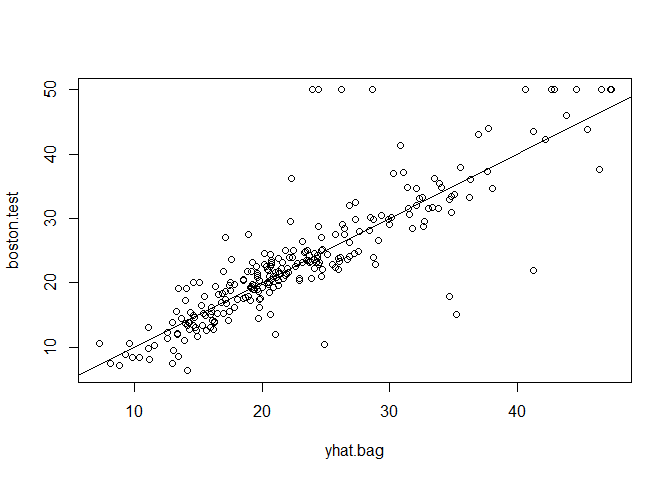<!-- -->

```r
mean((yhat.bag - boston.test)^2)
```

```
## [1] 23.59273
```


```r
bag.boston <- randomForest(medv ~ ., data=Boston, subset=train, mtry=13, ntree=25)
yhat.bag <- predict(bag.boston, newdata = Boston[-train,])
mean((yhat.bag - boston.test)^2)
```

```
## [1] 23.66716
```


```r
set.seed(1)
rf.boston <- randomForest(medv ~ ., data = Boston, subset=train, mtry=6, importance =TRUE)
yhat.rf <- predict(rf.boston, newdata=Boston[-train ,])
mean((yhat.rf-boston.test)^2)
```

```
## [1] 19.62021
```


```r
importance(rf.boston)
```

```
##           %IncMSE IncNodePurity
## crim    16.697017    1076.08786
## zn       3.625784      88.35342
## indus    4.968621     609.53356
## chas     1.061432      52.21793
## nox     13.518179     709.87339
## rm      32.343305    7857.65451
## age     13.272498     612.21424
## dis      9.032477     714.94674
## rad      2.878434      95.80598
## tax      9.118801     364.92479
## ptratio  8.467062     823.93341
## black    7.579482     275.62272
## lstat   27.129817    6027.63740
```


```r
varImpPlot(rf.boston)
```

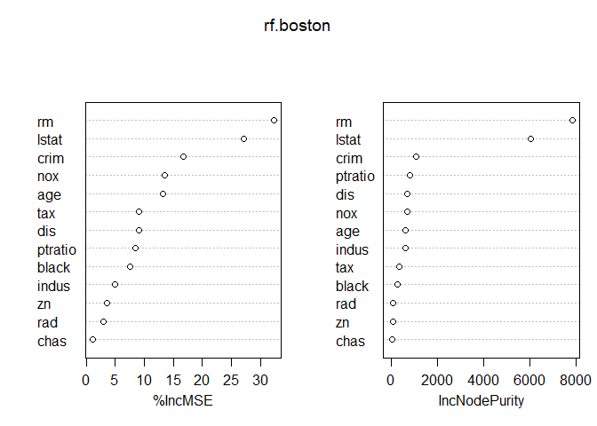<!-- -->

## 8.3.4 Boosting


```r
set.seed(1)
boost.boston <- gbm(medv ~ ., data=Boston[train,], distribution = "gaussian", n.trees=5000, interaction.depth = 4)
summary(boost.boston)
```

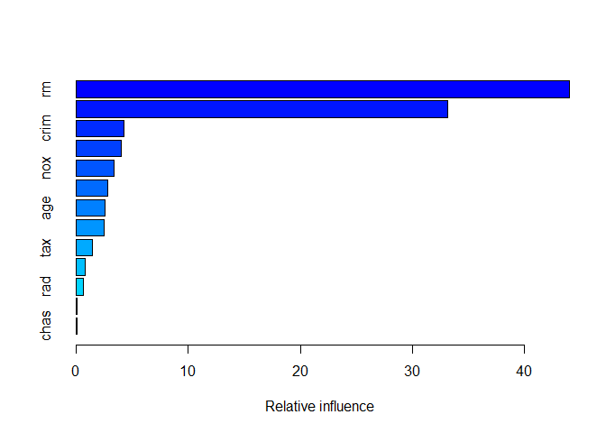<!-- -->

```
##             var    rel.inf
## rm           rm 43.9919329
## lstat     lstat 33.1216941
## crim       crim  4.2604167
## dis         dis  4.0111090
## nox         nox  3.4353017
## black     black  2.8267554
## age         age  2.6113938
## ptratio ptratio  2.5403035
## tax         tax  1.4565654
## indus     indus  0.8008740
## rad         rad  0.6546400
## zn           zn  0.1446149
## chas       chas  0.1443986
```


```r
par(mfrow=c(1,2))
plot(boost.boston, i= "rm")
```

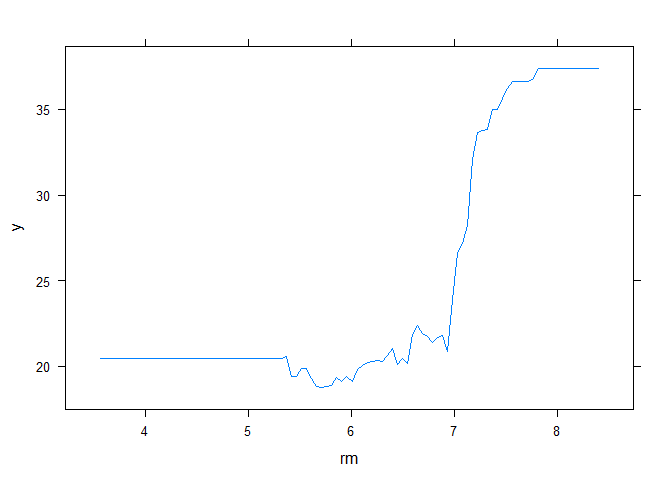<!-- -->

```r
plot(boost.boston, i= "lstat")
```

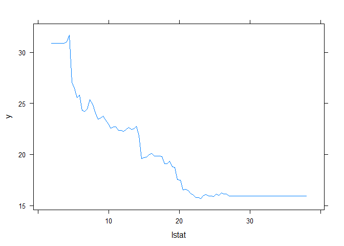<!-- -->


```r
par(mfrow=c(1,1))
yhat.boost <- predict(boost.boston, newdata = Boston[-train ,], n.trees=5000)
mean((yhat.boost - boston.test)^2)
```

```
## [1] 18.84709
```


```r
boost.boston=gbm(medv ~ ., data=Boston[train ,], distribution= "gaussian", n.trees =5000, interaction.depth = 4, shrinkage = 0.2, verbose=F)
yhat.boost <- predict(boost.boston, newdata = Boston[-train ,], n.trees=5000)
mean((yhat.boost - boston.test)^2)
```

```
## [1] 18.33455
```

# Exercises
## Exercise 8
### 8a: Split the data into a training set and a test set


```r
dat <- Carseats
set.seed(1)
train <- sample(1:nrow(dat), nrow(dat)/2)
```

### 8b: Fit a regression tree to the training set. Plot the tree, and interpret the results. What test MSE did you obtain?


```r
tree.carseats <- tree(Sales ~ ., dat, subset = train)
summary(tree.carseats)
```

```
## 
## Regression tree:
## tree(formula = Sales ~ ., data = dat, subset = train)
## Variables actually used in tree construction:
## [1] "ShelveLoc"   "Price"       "Age"         "Advertising" "CompPrice"  
## [6] "US"         
## Number of terminal nodes:  18 
## Residual mean deviance:  2.167 = 394.3 / 182 
## Distribution of residuals:
##     Min.  1st Qu.   Median     Mean  3rd Qu.     Max. 
## -3.88200 -0.88200 -0.08712  0.00000  0.89590  4.09900
```

```r
plot(tree.carseats)
text(tree.carseats, pretty = 0)
```

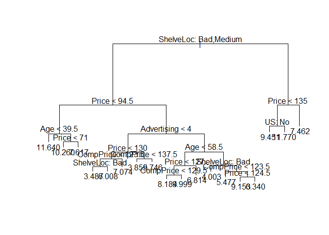<!-- -->


```r
yhat <- predict(tree.carseats, newdata=dat[-train,])
carseats.test <- dat[-train, "Sales"]
plot(yhat, carseats.test)
abline(0,1)
```

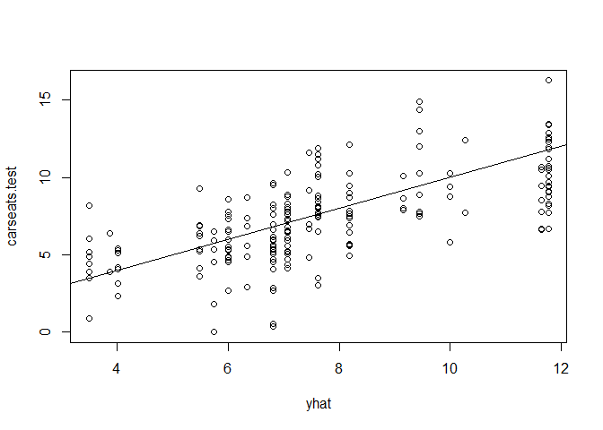<!-- -->

```r
mean((yhat - carseats.test)^2)
```

```
## [1] 4.922039
```
The initial splits are made on shelf location followed by price. After that comes competitor prices. I got a MSE of 4.92

### 8c: Use cross-validation in order to determin the optimal level of tree complexity. Does pruning the tree improve the test MSE


```r
cv.carseats <- cv.tree(tree.carseats)
plot(cv.carseats$size, cv.carseats$dev, type = "b")
```

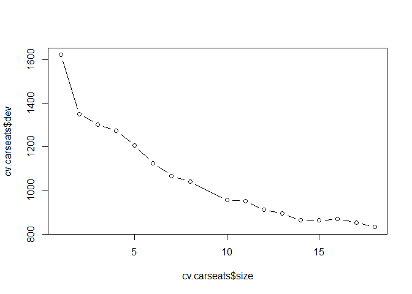<!-- -->

```r
# 10 looks like it could be better
prune.carseats <- prune.tree(tree.carseats, best = 10)
plot(prune.carseats)
text(prune.carseats, pretty = 0)
```

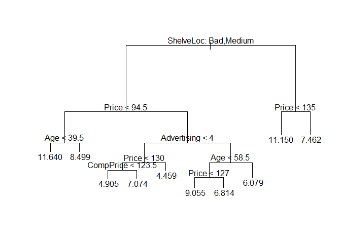<!-- -->


```r
yhat <- predict(prune.carseats, newdata=dat[-train,])
plot(yhat, carseats.test)
abline(0,1)
```

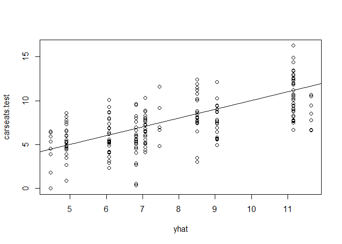<!-- -->

```r
mean((yhat - carseats.test)^2)
```

```
## [1] 4.918134
```

Very slightly reduced the MSE by pruning from 4.922 to 4.918

### 8d: Use the bagging approach in order to analyze this data. What test MSE do you obtain? Use the importance() function to determine which variables are most important


```r
set.seed(1)
bag.carseats <- randomForest(Sales ~ ., data=dat, subset=train, mtry=10,importance =TRUE)
bag.carseats
```

```
## 
## Call:
##  randomForest(formula = Sales ~ ., data = dat, mtry = 10, importance = TRUE,      subset = train) 
##                Type of random forest: regression
##                      Number of trees: 500
## No. of variables tried at each split: 10
## 
##           Mean of squared residuals: 2.889221
##                     % Var explained: 63.26
```

```r
yhat <- predict(bag.carseats, newdata=dat[-train,])
plot(yhat, carseats.test)
abline(0,1)
```

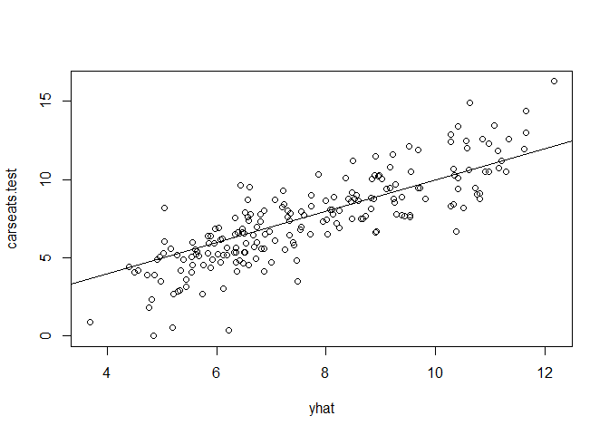<!-- -->

```r
mean((yhat - carseats.test)^2)
```

```
## [1] 2.605253
```

```r
importance(bag.carseats)
```

```
##                %IncMSE IncNodePurity
## CompPrice   24.8888481    170.182937
## Income       4.7121131     91.264880
## Advertising 12.7692401     97.164338
## Population  -1.8074075     58.244596
## Price       56.3326252    502.903407
## ShelveLoc   48.8886689    380.032715
## Age         17.7275460    157.846774
## Education    0.5962186     44.598731
## Urban        0.1728373      9.822082
## US           4.2172102     18.073863
```

```r
varImpPlot(bag.carseats)
```

<!-- -->

MSE is now 2.61. Shelf location and price appear to be the two most important variables.

### 8e: Use random forests to analyze this data. What test MSE do you obtain? Use the importance() function to determine which variables are most important. Describe the effect of m, the number of variables considered at each split, on the error rate obtained.


```r
rf.carseats <- randomForest(Sales ~ ., data = dat, subset = train, importance = TRUE)
rf.carseats
```

```
## 
## Call:
##  randomForest(formula = Sales ~ ., data = dat, importance = TRUE,      subset = train) 
##                Type of random forest: regression
##                      Number of trees: 500
## No. of variables tried at each split: 3
## 
##           Mean of squared residuals: 3.42931
##                     % Var explained: 56.39
```

```r
yhat <- predict(rf.carseats, newdata = dat[-train,])
plot(yhat, carseats.test)
abline(0,1)
```

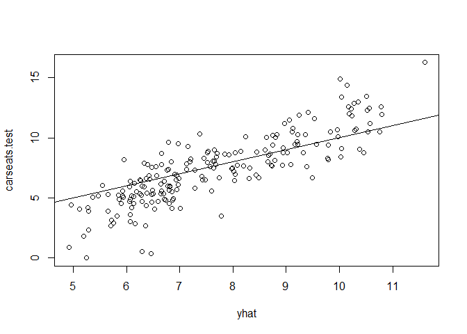<!-- -->

```r
mean((yhat - carseats.test)^2)
```

```
## [1] 3.054306
```

```r
importance(rf.carseats)
```

```
##                %IncMSE IncNodePurity
## CompPrice   12.9540442     157.53376
## Income       2.1683293     129.18612
## Advertising  8.7289900     111.38250
## Population  -2.5290493     102.78681
## Price       33.9482500     393.61313
## ShelveLoc   34.1358807     289.28756
## Age         12.0804387     172.03776
## Education    0.2213600      72.02479
## Urban        0.9793293      14.73763
## US           4.1072742      33.91622
```

```r
varImpPlot(rf.carseats)
```

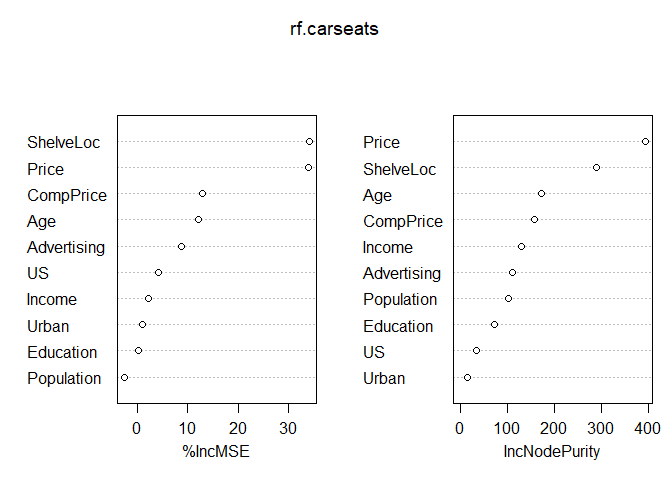<!-- -->

m was equal to 3 in this case 10/3. 
MSE is now 3.05 which is an increase.
Shelf location and price appear to be the two most important variables.

## Exercise 9
### 9a: Create a training set containing a random sample of 800 observations, and a test set containing the remaining observations.


```r
dat <- OJ
summary(dat)
```

```
##  Purchase WeekofPurchase     StoreID        PriceCH         PriceMM     
##  CH:653   Min.   :227.0   Min.   :1.00   Min.   :1.690   Min.   :1.690  
##  MM:417   1st Qu.:240.0   1st Qu.:2.00   1st Qu.:1.790   1st Qu.:1.990  
##           Median :257.0   Median :3.00   Median :1.860   Median :2.090  
##           Mean   :254.4   Mean   :3.96   Mean   :1.867   Mean   :2.085  
##           3rd Qu.:268.0   3rd Qu.:7.00   3rd Qu.:1.990   3rd Qu.:2.180  
##           Max.   :278.0   Max.   :7.00   Max.   :2.090   Max.   :2.290  
##      DiscCH            DiscMM         SpecialCH        SpecialMM     
##  Min.   :0.00000   Min.   :0.0000   Min.   :0.0000   Min.   :0.0000  
##  1st Qu.:0.00000   1st Qu.:0.0000   1st Qu.:0.0000   1st Qu.:0.0000  
##  Median :0.00000   Median :0.0000   Median :0.0000   Median :0.0000  
##  Mean   :0.05186   Mean   :0.1234   Mean   :0.1477   Mean   :0.1617  
##  3rd Qu.:0.00000   3rd Qu.:0.2300   3rd Qu.:0.0000   3rd Qu.:0.0000  
##  Max.   :0.50000   Max.   :0.8000   Max.   :1.0000   Max.   :1.0000  
##     LoyalCH          SalePriceMM     SalePriceCH      PriceDiff       Store7   
##  Min.   :0.000011   Min.   :1.190   Min.   :1.390   Min.   :-0.6700   No :714  
##  1st Qu.:0.325257   1st Qu.:1.690   1st Qu.:1.750   1st Qu.: 0.0000   Yes:356  
##  Median :0.600000   Median :2.090   Median :1.860   Median : 0.2300            
##  Mean   :0.565782   Mean   :1.962   Mean   :1.816   Mean   : 0.1465            
##  3rd Qu.:0.850873   3rd Qu.:2.130   3rd Qu.:1.890   3rd Qu.: 0.3200            
##  Max.   :0.999947   Max.   :2.290   Max.   :2.090   Max.   : 0.6400            
##    PctDiscMM        PctDiscCH       ListPriceDiff       STORE      
##  Min.   :0.0000   Min.   :0.00000   Min.   :0.000   Min.   :0.000  
##  1st Qu.:0.0000   1st Qu.:0.00000   1st Qu.:0.140   1st Qu.:0.000  
##  Median :0.0000   Median :0.00000   Median :0.240   Median :2.000  
##  Mean   :0.0593   Mean   :0.02731   Mean   :0.218   Mean   :1.631  
##  3rd Qu.:0.1127   3rd Qu.:0.00000   3rd Qu.:0.300   3rd Qu.:3.000  
##  Max.   :0.4020   Max.   :0.25269   Max.   :0.440   Max.   :4.000
```

```r
dim(dat)
```

```
## [1] 1070   18
```

```r
set.seed(1)
train <- sample(1:nrow(dat), 800)
dat.train <- dat[train,]
dat.test <- dat[-train,]
```

### 9b: Fit a tree to the training data, with Purchase as the response and the other variables as predictors. Use the summary() function to produce summary statistics about the tree, and describe the results obtained. What is the training error rate? How many terminal nodes does the tree have?


```r
tree.oj <- tree(Purchase ~ ., dat.train)
summary(tree.oj)
```

```
## 
## Classification tree:
## tree(formula = Purchase ~ ., data = dat.train)
## Variables actually used in tree construction:
## [1] "LoyalCH"       "PriceDiff"     "SpecialCH"     "ListPriceDiff"
## [5] "PctDiscMM"    
## Number of terminal nodes:  9 
## Residual mean deviance:  0.7432 = 587.8 / 791 
## Misclassification error rate: 0.1588 = 127 / 800
```

15.88% training error rate and 9 terminal nodes. only 5 of the possible 17 variables were uses in constructing the tree.

### 9c: Type in the name of the tree object in order to get a detailed text output. Pick one of the terminal nodes, and interpret the information displayed.


```r
tree.oj
```

```
## node), split, n, deviance, yval, (yprob)
##       * denotes terminal node
## 
##  1) root 800 1073.00 CH ( 0.60625 0.39375 )  
##    2) LoyalCH < 0.5036 365  441.60 MM ( 0.29315 0.70685 )  
##      4) LoyalCH < 0.280875 177  140.50 MM ( 0.13559 0.86441 )  
##        8) LoyalCH < 0.0356415 59   10.14 MM ( 0.01695 0.98305 ) *
##        9) LoyalCH > 0.0356415 118  116.40 MM ( 0.19492 0.80508 ) *
##      5) LoyalCH > 0.280875 188  258.00 MM ( 0.44149 0.55851 )  
##       10) PriceDiff < 0.05 79   84.79 MM ( 0.22785 0.77215 )  
##         20) SpecialCH < 0.5 64   51.98 MM ( 0.14062 0.85938 ) *
##         21) SpecialCH > 0.5 15   20.19 CH ( 0.60000 0.40000 ) *
##       11) PriceDiff > 0.05 109  147.00 CH ( 0.59633 0.40367 ) *
##    3) LoyalCH > 0.5036 435  337.90 CH ( 0.86897 0.13103 )  
##      6) LoyalCH < 0.764572 174  201.00 CH ( 0.73563 0.26437 )  
##       12) ListPriceDiff < 0.235 72   99.81 MM ( 0.50000 0.50000 )  
##         24) PctDiscMM < 0.196197 55   73.14 CH ( 0.61818 0.38182 ) *
##         25) PctDiscMM > 0.196197 17   12.32 MM ( 0.11765 0.88235 ) *
##       13) ListPriceDiff > 0.235 102   65.43 CH ( 0.90196 0.09804 ) *
##      7) LoyalCH > 0.764572 261   91.20 CH ( 0.95785 0.04215 ) *
```

7) LoyalCH > 0.764572 261   91.20 CH ( 0.95785 0.04215 ) *

This is node 7, the split was on LoyalCH > 0.76, it included 261 samples which were > 0.76, the deviance was 91.20, the yval was CH, the probability of being CH is .958, and it is a terminal node.

### 9d: Create a plot of the tree, and interpret the results.


```r
plot(tree.oj)
text(tree.oj, pretty = 0)
```

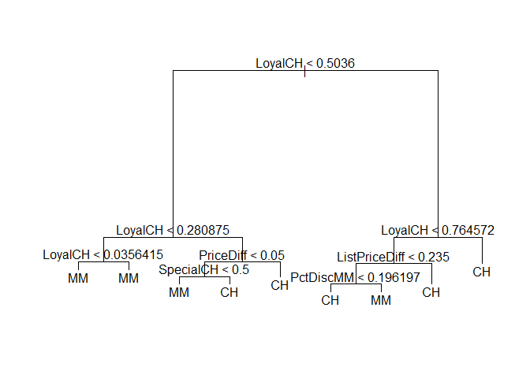<!-- -->

Yup it's a tree

### 9e: Predict the response on the test data, and produce a confusion matrix comparing the test labels to the predicted test labels. What is the test error rate?


```r
yhat <- predict(tree.oj, dat.test, type = "class")
table(yhat, dat.test$Purchase)
```

```
##     
## yhat  CH  MM
##   CH 160  38
##   MM   8  64
```

```r
(160+64)/270 #82.96% Correct
```

```
## [1] 0.8296296
```

```r
(8+38)/270 #17.04% Wrong
```

```
## [1] 0.1703704
```

### 9f:  Apply the cv.tree() function to the training set in order to determine the optimal tree size.


```r
cv.oj <- cv.tree(tree.oj, FUN=prune.misclass)
cv.oj
```

```
## $size
## [1] 9 8 7 4 2 1
## 
## $dev
## [1] 150 150 149 158 172 315
## 
## $k
## [1]       -Inf   0.000000   3.000000   4.333333  10.500000 151.000000
## 
## $method
## [1] "misclass"
## 
## attr(,"class")
## [1] "prune"         "tree.sequence"
```


### 9g: Produce a plot with tree size on the x-axis and cross-validated classification error rate on the y-axis.


```r
plot(cv.oj)
```

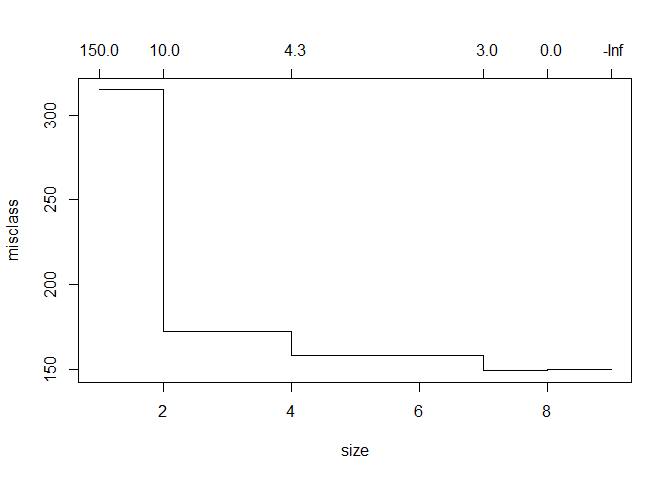<!-- -->

```r
plot(cv.oj$size, cv.oj$dev, type = "b")
```

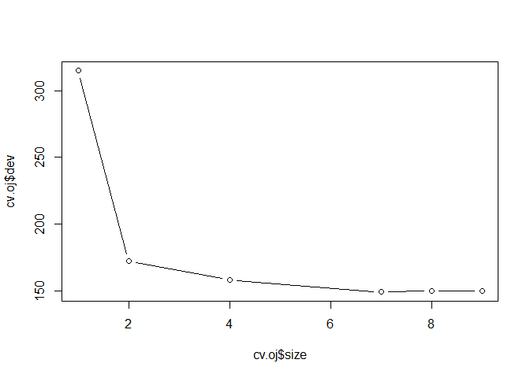<!-- -->


### 9h: Which tree size corresponds to the lowest cross-validated classification error rate?

7 corresponds to the lowest error rate, 

### 9i: Produce a pruned tree corresponding to the optimal tree size obtained using cross-validation. If cross-validation does not lead to selection of a pruned tree, then create a pruned tree with five terminal nodes.


```r
prune.oj <- prune.misclass(tree.oj, best = 7)
plot(prune.oj)
text(prune.oj, pretty = 0)
```

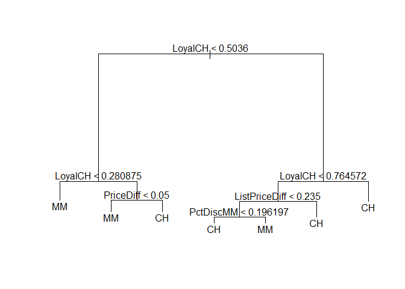<!-- -->

### 9j: Compare the training error rates between the pruned and unpruned trees. Which is higher?


```r
yhat <- predict(prune.oj, dat.train, type = "class")
table(yhat, dat.train$Purchase)
```

```
##     
## yhat  CH  MM
##   CH 441  86
##   MM  44 229
```

```r
(44+86)/800 # 16.25% error rate on pruned training
```

```
## [1] 0.1625
```

```r
yhat <- predict(tree.oj, dat.train, type = "class")
table(yhat, dat.train$Purchase)
```

```
##     
## yhat  CH  MM
##   CH 450  92
##   MM  35 223
```

```r
(35+92)/800 # 15.88% error rate on the unpruned training
```

```
## [1] 0.15875
```

Error rate of the pruned tree was higher

### 9k: Compare the test error rates between the pruned and unpruned trees. Which is higher?


```r
yhat <- predict(prune.oj, dat.test, type = "class")
table(yhat, dat.test$Purchase)
```

```
##     
## yhat  CH  MM
##   CH 160  36
##   MM   8  66
```

```r
(8+36)/270 # 16.30% error rate on pruned test
```

```
## [1] 0.162963
```

```r
yhat <- predict(tree.oj, dat.test, type = "class")
table(yhat, dat.test$Purchase)
```

```
##     
## yhat  CH  MM
##   CH 160  38
##   MM   8  64
```

```r
(8+38)/270 # 17.04% error rate on unpruned test
```

```
## [1] 0.1703704
```

Error rate of the pruned tree was lower

## Exercise 10

### 10a: Remove the observations for whom the salary information is unknown, and then log-transform the salaries.

```r
dat <- Hitters %>%
  filter(!is.na(Salary)) %>%
  mutate(Salary = log(Salary))
```

### 10b: Create a training set consisting of the first 200 observations, and a test set consisting of the remaining observations


```r
train <- 1:200
dat.train <- dat[train,]
dat.test <- dat[-train,]
```

### 10c:  Perform boosting on the training set with 1,000 trees for a range of values of the shrinkage parameter λ. Produce a plot with different shrinkage values on the x-axis and the corresponding training set MSE on the y-axis


```r
set.seed(1)
shrink <- seq(0.0001, 0.10, length.out = 10)
train.mse <- double(10)
for (i in 1:10) {
  boost.hitters <-
    gbm(
      Salary ~ .,
      data = dat.train,
      distribution = "gaussian",
      n.trees = 1000,
      shrinkage = shrink[i],
      interaction.depth = 4
    )
  yhat.boost <-
    predict(boost.hitters, newdata = dat.train, n.trees = 1000)
  train.mse[i] <- mean((yhat.boost - dat.train$Salary) ^ 2)
}
plot(shrink,train.mse, type="b")
```

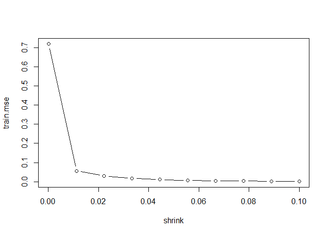<!-- -->

### 10d: Produce a plot with different shrinkage values on the x-axis and the corresponding test set MSE on the y-axis


```r
test.mse <- double(10)
for (i in 1:10) {
  boost.hitters <-
    gbm(
      Salary ~ .,
      data = dat.train,
      distribution = "gaussian",
      n.trees = 1000,
      shrinkage = shrink[i],
      interaction.depth = 4
    )
  yhat.boost <-
    predict(boost.hitters, newdata = dat.test, n.trees = 1000)
  test.mse[i] <- mean((yhat.boost - dat.test$Salary) ^ 2)
}
matplot(shrink, cbind(train.mse, test.mse), pch = 19, col = c("blue", "red", type = "b", ylab = "Mean Squared Error"))
legend("topright",legend=c("Train MSE", "Test MSE"), pch = 19, col = c("blue","red"))
```

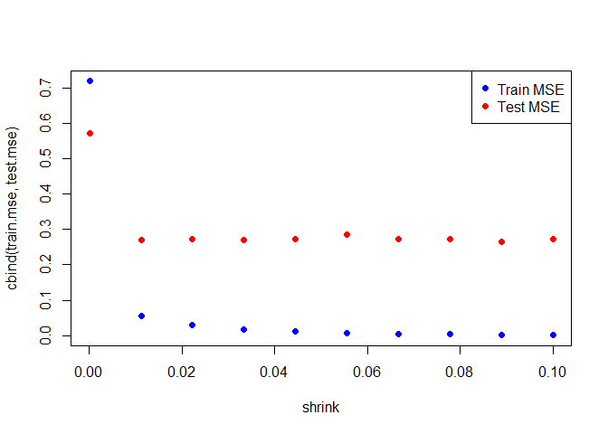<!-- -->

### 10e: Compare the test MSE of boosting to the test MSE that results from applying two of the regression approaches seen in Chapters 3 and 6

Skip

### 10f: Which variables appear to be the most important predictors in the boosted model


```r
boost.hitters <-
    gbm(
      Salary ~ .,
      data = dat.train,
      distribution = "gaussian",
      n.trees = 1000,
      interaction.depth = 4
    )
summary(boost.hitters)
```

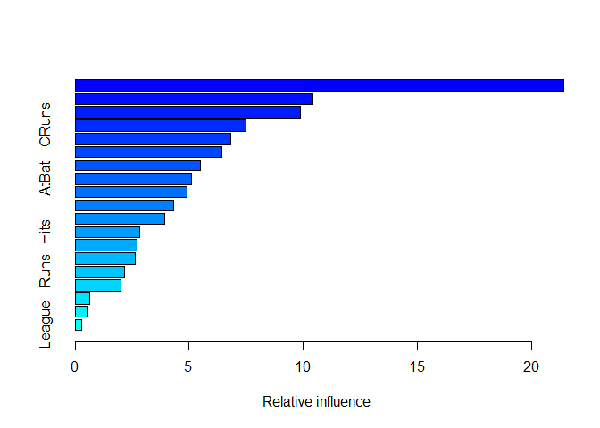<!-- -->

```
##                 var    rel.inf
## CAtBat       CAtBat 21.4237646
## CHits         CHits 10.4072437
## CWalks       CWalks  9.8841696
## CRuns         CRuns  7.4952477
## PutOuts     PutOuts  6.8214152
## Walks         Walks  6.4445653
## CRBI           CRBI  5.4775966
## AtBat         AtBat  5.1160830
## Years         Years  4.8917511
## Assists     Assists  4.3024161
## CHmRun       CHmRun  3.9268122
## Hits           Hits  2.8115541
## HmRun         HmRun  2.7199818
## RBI             RBI  2.6349893
## Runs           Runs  2.1502774
## Errors       Errors  2.0007349
## NewLeague NewLeague  0.6498793
## Division   Division  0.5591886
## League       League  0.2823299
```

Number of times at bat and number of hits across their career

### 10g: Now apply bagging to the training set. What is the test set MSE for this approach?


```r
set.seed(1)
bag.hitters <- randomForest(Salary ~ ., data=dat.train, mtry=19,importance =TRUE)
bag.hitters
```

```
## 
## Call:
##  randomForest(formula = Salary ~ ., data = dat.train, mtry = 19,      importance = TRUE) 
##                Type of random forest: regression
##                      Number of trees: 500
## No. of variables tried at each split: 19
## 
##           Mean of squared residuals: 0.2178554
##                     % Var explained: 73.82
```

```r
yhat <- predict(bag.hitters, newdata=dat.test)
plot(yhat, dat.test$Salary)
abline(0,1)
```

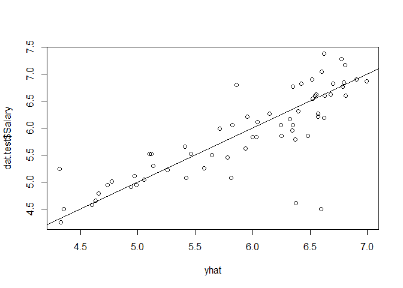<!-- -->

```r
mean((yhat - dat.test$Salary)^2)
```

```
## [1] 0.2301184
```

```r
importance(bag.hitters)
```

```
##               %IncMSE IncNodePurity
## AtBat     10.36037677    7.59899089
## Hits       6.69476752    4.61244229
## HmRun      0.45962166    1.67420019
## Runs       5.19809979    2.58312025
## RBI        3.21835382    3.02919843
## Walks      9.49509870    7.25161868
## Years      7.94438982    1.78466935
## CAtBat    34.61473697   85.80782159
## CHits      7.80595151   11.13937572
## CHmRun     9.87901114    4.95951018
## CRuns     12.33865863   13.49631939
## CRBI      11.44789911    9.52385064
## CWalks     5.96869309    5.70105949
## League    -0.25504777    0.09686047
## Division  -2.56240113    0.15964731
## PutOuts    1.72924797    2.69742165
## Assists   -0.02584561    1.36241940
## Errors     1.83362063    1.16664726
## NewLeague  0.99642182    0.21617428
```

```r
varImpPlot(bag.hitters)
```

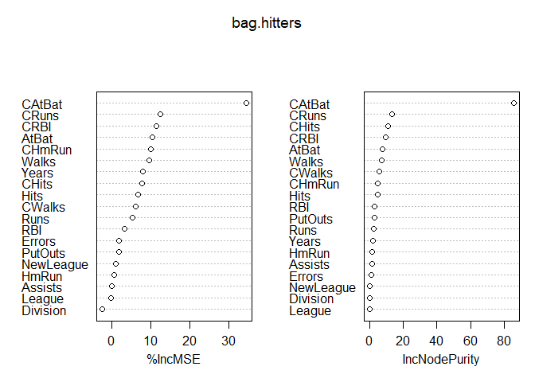<!-- -->

MSE is 0.2301184

## Exercise 11
### 11a: Create a training set consisting of the first 1,000 observations, and a test set consisting of the remaining observations.


```r
dat <- Caravan %>%
  mutate(Purchase = ifelse(Purchase == "Yes", 1, 0))
train <- 1:1000
dat.train <- dat[train,]
dat.test <- dat[-train,]
```


### 11b: Fit a boosting model to the training set with Purchase as the response and the other variables as predictors. Use 1,000 trees, and a shrinkage value of 0.01. Which predictors appear to be the most important?


```r
set.seed(1)
boost.caravan <- gbm(
  Purchase ~ .,
  data = dat.train,
  distribution = "bernoulli",
  n.trees = 1000,
  interaction.depth = 4,
  shrinkage = 0.01
)
```

```
## Warning in gbm.fit(x = x, y = y, offset = offset, distribution = distribution, :
## variable 50: PVRAAUT has no variation.
```

```
## Warning in gbm.fit(x = x, y = y, offset = offset, distribution = distribution, :
## variable 71: AVRAAUT has no variation.
```

```r
summary(boost.caravan)
```

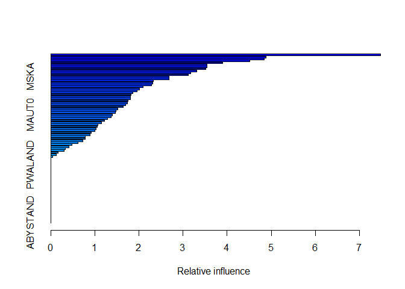<!-- -->

```
##               var     rel.inf
## PPERSAUT PPERSAUT 7.480819014
## MOPLHOOG MOPLHOOG 4.882054338
## MGODGE     MGODGE 4.838869962
## MKOOPKLA MKOOPKLA 4.507280400
## MOSTYPE   MOSTYPE 3.902338079
## MGODPR     MGODPR 3.547892360
## PBRAND     PBRAND 3.539487907
## MBERMIDD MBERMIDD 3.518082698
## MBERARBG MBERARBG 3.309004843
## MINK3045 MINK3045 3.175313873
## MSKC         MSKC 3.123008472
## MSKA         MSKA 2.685844523
## MAUT2       MAUT2 2.685548007
## MAUT1       MAUT1 2.322786246
## PWAPART   PWAPART 2.316252267
## MSKB1       MSKB1 2.279820190
## MRELOV     MRELOV 2.092410309
## MFWEKIND MFWEKIND 2.017651081
## MBERHOOG MBERHOOG 1.961378700
## MBERARBO MBERARBO 1.862074416
## MRELGE     MRELGE 1.815276446
## MINK7512 MINK7512 1.812894054
## MINKM30   MINKM30 1.808781053
## MOPLMIDD MOPLMIDD 1.757784665
## MFGEKIND MFGEKIND 1.741172971
## MGODOV     MGODOV 1.701539077
## MZFONDS   MZFONDS 1.641658796
## MFALLEEN MFALLEEN 1.517763739
## MSKB2       MSKB2 1.480397941
## MINK4575 MINK4575 1.466410983
## MAUT0       MAUT0 1.403097259
## ABRAND     ABRAND 1.375696683
## MHHUUR     MHHUUR 1.287672857
## MINKGEM   MINKGEM 1.216351643
## MHKOOP     MHKOOP 1.154970948
## MGEMLEEF MGEMLEEF 1.068800262
## MGODRK     MGODRK 1.056066524
## MRELSA     MRELSA 1.025383382
## MZPART     MZPART 0.999705745
## MSKD         MSKD 0.917077921
## MGEMOMV   MGEMOMV 0.893757812
## MBERZELF MBERZELF 0.788935429
## APERSAUT APERSAUT 0.784652995
## MOPLLAAG MOPLLAAG 0.732210597
## MOSHOOFD MOSHOOFD 0.618703929
## PMOTSCO   PMOTSCO 0.481824116
## PLEVEN     PLEVEN 0.410808274
## PBYSTAND PBYSTAND 0.326851643
## MBERBOER MBERBOER 0.311571820
## MINK123M MINK123M 0.169710044
## MAANTHUI MAANTHUI 0.122660387
## ALEVEN     ALEVEN 0.051158218
## PAANHANG PAANHANG 0.006040057
## PFIETS     PFIETS 0.004694048
## PWABEDR   PWABEDR 0.000000000
## PWALAND   PWALAND 0.000000000
## PBESAUT   PBESAUT 0.000000000
## PVRAAUT   PVRAAUT 0.000000000
## PTRACTOR PTRACTOR 0.000000000
## PWERKT     PWERKT 0.000000000
## PBROM       PBROM 0.000000000
## PPERSONG PPERSONG 0.000000000
## PGEZONG   PGEZONG 0.000000000
## PWAOREG   PWAOREG 0.000000000
## PZEILPL   PZEILPL 0.000000000
## PPLEZIER PPLEZIER 0.000000000
## PINBOED   PINBOED 0.000000000
## AWAPART   AWAPART 0.000000000
## AWABEDR   AWABEDR 0.000000000
## AWALAND   AWALAND 0.000000000
## ABESAUT   ABESAUT 0.000000000
## AMOTSCO   AMOTSCO 0.000000000
## AVRAAUT   AVRAAUT 0.000000000
## AAANHANG AAANHANG 0.000000000
## ATRACTOR ATRACTOR 0.000000000
## AWERKT     AWERKT 0.000000000
## ABROM       ABROM 0.000000000
## APERSONG APERSONG 0.000000000
## AGEZONG   AGEZONG 0.000000000
## AWAOREG   AWAOREG 0.000000000
## AZEILPL   AZEILPL 0.000000000
## APLEZIER APLEZIER 0.000000000
## AFIETS     AFIETS 0.000000000
## AINBOED   AINBOED 0.000000000
## ABYSTAND ABYSTAND 0.000000000
```

Contribution car policies (PPERSAUT) and High level education (MOPLHOOG ) appear to be the most important variables

### 11c:  Use the boosting model to predict the response on the test data. Predict that a person will make a purchase if the estimated probability of purchase is greater than 20 %. Form a confusion matrix. What fraction of the people predicted to make a purchase do in fact make one? How does this compare with the results obtained from applying KNN or logistic regression to this data set?


```r
yhat.boost <- predict(boost.caravan, dat.test, n.trees = 1000, type = "response")

yhat.boost <- ifelse(yhat.boost > .20, 1, 0)
table(predicted=yhat.boost, observed =dat.test$Purchase)
```

```
##          observed
## predicted    0    1
##         0 4336  258
##         1  197   31
```

```r
31/(197+31)
```

```
## [1] 0.1359649
```

13.60% People predicted to purchase do
