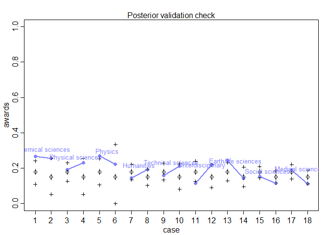

```r
library(tidyverse)
```

```
## -- Attaching packages ------------------------------------------------------------------------------------------------------- tidyverse 1.2.1 --
```

```
## v ggplot2 3.2.1     v purrr   0.3.3
## v tibble  2.1.3     v dplyr   0.8.3
## v tidyr   1.0.0     v stringr 1.4.0
## v readr   1.3.1     v forcats 0.4.0
```

```
## -- Conflicts ---------------------------------------------------------------------------------------------------------- tidyverse_conflicts() --
## x dplyr::filter() masks stats::filter()
## x dplyr::lag()    masks stats::lag()
```

```r
library(rethinking)
```

```
## Loading required package: rstan
```

```
## Loading required package: StanHeaders
```

```
## rstan (Version 2.19.2, GitRev: 2e1f913d3ca3)
```

```
## For execution on a local, multicore CPU with excess RAM we recommend calling
## options(mc.cores = parallel::detectCores()).
## To avoid recompilation of unchanged Stan programs, we recommend calling
## rstan_options(auto_write = TRUE)
```

```
## For improved execution time, we recommend calling
## Sys.setenv(LOCAL_CPPFLAGS = '-march=native')
## although this causes Stan to throw an error on a few processors.
```

```
## 
## Attaching package: 'rstan'
```

```
## The following object is masked from 'package:tidyr':
## 
##     extract
```

```
## Loading required package: parallel
```

```
## Loading required package: dagitty
```

```
## rethinking (Version 1.90)
```

```
## 
## Attaching package: 'rethinking'
```

```
## The following object is masked from 'package:purrr':
## 
##     map
```

```
## The following object is masked from 'package:stats':
## 
##     rstudent
```

```r
options(mc.cores = parallel::detectCores())
rstan_options(auto_write = TRUE)
Sys.setenv(LOCAL_CPPFLAGS = '-march=native')
```

## 10E1. If an event has probability 0.35, what are the log-odds of this event?


```r
logit(0.35)
```

```
## [1] -0.6190392
```

## 10E2. If an event has log-odds 3.2, what is the probability of this event?


```r
inv_logit(3.2)
```

```
## [1] 0.9608343
```

## 10E3. Suppose that a coefficient in a logistic regression has value 1.7. What does this imply about the proportional change in odds of the outcome?

A one unit change in the variable while have a 1.7 unit change in the log of the odds.

## 10M1. As explained in the chapter, binomial data can be organized in aggregated and disaggregated forms, without any impact on inference. But the likelihood of the data does change when the data are converted between the two formats. Can you explain why?

The multiplicity in the aggregated data causes the aggregated data likelihood to be different from the disaggregated data likelihood. Looking at counts vs individual trials.

### 1. The data in data(NWOGrants) are outcomes for scientific funding applications for the Netherlands Organization for Scientific Research (NWO) from 2010-2012. These data have a very similar structure to the UCBAdmit data discussed in Chapter 11. I want you to consider a similar question: What are the total and indirect causal effects of gender on grant awards? Consider a mediation path (a pipe) through `discipline`. Draw the corresponding DAG and then use one or more binomial GLMs to answer the question. What is your causal interpretation? If NWO's goal is to equilize rates of funding between the genders, what type of intervention would be most effective?


```r
library(dagitty)
data("NWOGrants")
d <- NWOGrants
head(d)
```

```
##          discipline gender applications awards
## 1 Chemical sciences      m           83     22
## 2 Chemical sciences      f           39     10
## 3 Physical sciences      m          135     26
## 4 Physical sciences      f           39      9
## 5           Physics      m           67     18
## 6           Physics      f            9      2
```

```r
summary(d)
```

```
##                discipline gender  applications        awards     
##  Chemical sciences  :2    f:9    Min.   :  9.00   Min.   : 2.00  
##  Earth/life sciences:2    m:9    1st Qu.: 69.75   1st Qu.:14.00  
##  Humanities         :2           Median :130.50   Median :24.00  
##  Interdisciplinary  :2           Mean   :156.83   Mean   :25.94  
##  Medical sciences   :2           3rd Qu.:219.75   3rd Qu.:32.75  
##  Physical sciences  :2           Max.   :425.00   Max.   :65.00  
##  (Other)            :6
```

```r
# Build DAG
dag <- dagitty( "dag {
                G -> A
                G -> D
                D -> A
                }")
coordinates(dag) <- list(x = c(G=0,D=0.5,A=1), y = c(G=0,D=-0.5,A=0))
plot(dag)
```

<!-- -->

```r
# Model 1 without conditioning on discipline
dat_slim <- list(
  awards = d$awards,
  gender = ifelse(d$gender == "m", 1L,2L),
  applications = d$applications
)

dat_slim
```

```
## $awards
##  [1] 22 10 26  9 18  2 33 32 30 13 12 17 38 18 65 47 46 29
## 
## $gender
##  [1] 1 2 1 2 1 2 1 2 1 2 1 2 1 2 1 2 1 2
## 
## $applications
##  [1]  83  39 135  39  67   9 230 166 189  62 105  78 156 126 425 409 245
## [18] 260
```

```r
model_1 <- ulam(
  alist(
    awards ~ dbinom(applications, p),
    logit(p) <- a[gender],
    a[gender] ~ dnorm(0 , 1.5)
  ), data = dat_slim, cores = 4, chains = 4, iter = 5000
)

traceplot(model_1)
precis(model_1, depth = 2)
```

```
##           mean         sd      5.5%     94.5%    n_eff     Rhat
## a[1] -1.533864 0.06515918 -1.637895 -1.429904 7319.480 1.000462
## a[2] -1.739566 0.08159639 -1.870401 -1.611259 6142.741 1.000074
```

```r
post <- extract.samples(model_1)
diff_a <- post$a[,1] - post$a[,2]
diff_p <- inv_logit(post$a[,1]) - inv_logit(post$a[,2])
precis(list(diff_a = diff_a , diff_p = diff_p))
```

```
##              mean         sd        5.5%     94.5%
## diff_a 0.20570132 0.10376566 0.040025131 0.3731836
## diff_p 0.02796433 0.01397764 0.005485052 0.0502633
##                                                                                       histogram
## diff_a                         <U+2581><U+2581><U+2582><U+2587><U+2587><U+2583><U+2581><U+2581>
## diff_p <U+2581><U+2581><U+2581><U+2582><U+2585><U+2587><U+2587><U+2583><U+2581><U+2581><U+2581>
```

```r
par(mfrow=c(1,1))
```

<!-- -->

```r
postcheck( model_1 , n=1e4)
# draw lines connecting points from same dept
d$disc_id <- rep( 1:9 , each=2 )
for ( i in 1:9 ) {
  x <- 1 + 2*(i-1)
  y1 <- d$awards[x]/d$applications[x]
  y2 <- d$awards[x+1]/d$applications[x+1]
  lines( c(x,x+1) , c(y1,y2) , col=rangi2 , lwd=2)
  text( x+0.5 , (y1+y2)/2 + 0.05 , d$discipline[x] , cex=0.8 , col=rangi2 )
}
```

<!-- -->

```r
# Model 2, condition on discipline

dat_slim2 <- list(
  awards = d$awards,
  gender = ifelse(d$gender == "m", 1L,2L),
  applications = d$applications,
  discipline = d$disc_id
)

model_2 <- ulam(
  alist(
    awards ~ dbinom(applications, p),
    logit(p) <- a[gender] + d[discipline],
    a[gender] ~ dnorm(0 , 1.5),
    d[discipline] ~ dnorm(0, 1.5)
  ), data = dat_slim2, cores = 4, chains = 4, iter = 5000
)

traceplot(model_2)
precis(model_2, depth = 2)
```

```
##            mean        sd       5.5%      94.5%     n_eff     Rhat
## a[1] -1.1484561 0.4686631 -1.8948248 -0.4143677  862.8980 1.002777
## a[2] -1.2865681 0.4716705 -2.0343750 -0.5415109  887.1033 1.002961
## d[1]  0.1445554 0.4992059 -0.6445545  0.9371745  974.7166 1.002505
## d[2] -0.2086157 0.4971766 -0.9915784  0.5785063  980.0759 1.002351
## d[3]  0.1199180 0.5206304 -0.7021754  0.9447227 1045.3976 1.002464
## d[4] -0.4256685 0.4809633 -1.1752331  0.3360938  902.7388 1.002684
## d[5] -0.4017509 0.4900545 -1.1784003  0.3770358  947.4425 1.002251
## d[6] -0.4698659 0.5008343 -1.2682654  0.3245439  980.5889 1.002407
## d[7] -0.1912380 0.4843394 -0.9429742  0.5877520  914.9170 1.002273
## d[8] -0.6493129 0.4758809 -1.3996422  0.1053277  893.6566 1.002745
## d[9] -0.5303974 0.4807845 -1.2879496  0.2298207  899.2176 1.003061
```

```r
post <- extract.samples(model_2)
diff_a <- post$a[,1] - post$a[,2]
diff_p <- inv_logit(post$a[,1]) - inv_logit(post$a[,2])
precis(list(diff_a = diff_a , diff_p = diff_p))
```

```
##              mean         sd         5.5%      94.5%
## diff_a 0.13811200 0.10614359 -0.030495418 0.30791734
## diff_p 0.02398189 0.01964835 -0.005221623 0.05714927
##                                                                       histogram
## diff_a <U+2581><U+2581><U+2582><U+2585><U+2587><U+2583><U+2581><U+2581><U+2581>
## diff_p <U+2581><U+2581><U+2582><U+2587><U+2587><U+2583><U+2581><U+2581><U+2581>
```

```r
par(mfrow=c(1,1))
```

<!-- -->

```r
postcheck( model_2 , n=1e4)
# draw lines connecting points from same dept
d$disc_id <- rep( 1:9 , each=2 )
for ( i in 1:9 ) {
  x <- 1 + 2*(i-1)
  y1 <- d$awards[x]/d$applications[x]
  y2 <- d$awards[x+1]/d$applications[x+1]
  lines( c(x,x+1) , c(y1,y2) , col=rangi2 , lwd=2)
  text( x+0.5 , (y1+y2)/2 + 0.05 , d$discipline[x] , cex=0.8 , col=rangi2 )
}
```

<!-- -->

```r
pg <- sapply( 1:9 , function(k)
  d$applications[d$disc_id==k]/sum(d$applications[d$disc_id==k]))

ag <- sapply( 1:9 , function(k)
  d$awards[d$disc_id==k]/sum(d$awards[d$disc_id==k]))

all <- d %>%
  cbind(., awarded = as.vector(ag[1:18]), applied = as.vector(pg[1:18]))

all %>% gather(key = Type, value = Value, awarded:applied) %>%
  mutate(Combination = paste0(gender,"_",Type)) %>%
  ggplot(., aes(x = discipline, y = Value, fill = Combination)) +
  geom_bar(stat = "identity", position = "dodge")
```

<!-- -->

Males have a higher award rate on average. When factoring discipline in, males still have an advantage over females. 


## 2. Suppose that the NWO Grants sample has an unobserved confound that influences both choice of discipline and the probability of an award. One example of such a confound could be the career stage of each applicant. Suppose that in some disciplines, junior scholars apply for most of the grants. In other disciplines, scholars from all career stages compete. As a result, career stage influences discipline as well as the probability of being awarded a grant. Add theses influences to your DAG from Problem 1. What happens now when you condition on discipline? Does it provide an un-confounded estimate of the direct path from gender to an award? Why or why not? Justify your answer with the back-door criterion. Hint: This is structually a lot like the grandparents-parents-children-neighborhoods example from a previous week. If you have trouble thinking this through, try simulating fake data, assuming your DAG is true. Then analyze it using the model from Problem 1. What do you conclude? Is it possible for gender to have a real direct causal influence but for a regression conditioning on both gender and discipline to suggest zero influence?


```r
# Build DAG
dag <- dagitty( "dag {
                G -> A
                G -> D
                D -> A
                S -> D
                S -> A
                }")
coordinates(dag) <- list(x = c(G=0,D=0.5,A=0.5,S=1), y = c(G=0,D=0,A=-0.5,S=0))
plot(dag)
```

<!-- -->

```r
# Sim the effect of Stage

set.seed(452)
N <- 10000
G <- rbinom(N,1,0.5) # 50% chance male or female
S <- rbinom(N,1,0.5) # 50% chance junior or senior
D <- rbinom(N,1, inv_logit(G + 1.5*S)) # 2 disciplines, higher your stage the higher department level, gender also a factor
A <- rbinom(N,1, inv_logit(0.75*D + 0.50*S - 1.25)) # max = .73; min = .22 Discipline plays major role along
dat_slim <- list(
  A = A,
  D = D,
  G = G
)

model_3 <- ulam(
  alist(
    A ~ dbinom(1,p),
    logit(p) <- a + d*D + g*G,
    a ~ dnorm(0,.5),
    d ~ dnorm(0,.5),
    g ~ dnorm(0,.5)
  ), data = dat_slim, chains = 4, cores = 4, iter = 5000
)

traceplot(model_3)
```

<!-- -->

```r
precis(model_3, depth = 2)
```

```
##          mean         sd        5.5%       94.5%    n_eff     Rhat
## a -1.13809877 0.04620345 -1.21244057 -1.06446047 4356.263 1.000829
## d  0.93821922 0.04994024  0.85839882  1.01780255 4495.751 1.000549
## g -0.00819201 0.04230278 -0.07621765  0.05875342 5609.654 1.000113
```

```r
inv_logit(2.5) - inv_logit(1.5)
```

```
## [1] 0.1065673
```

Gender now appears to have a no influence on being awarded, but it does affect your discipline choice which heavily affects your chance of receiving an award
