```r
library(tidyverse)
```

```
## -- Attaching packages ---------------------------------------------------------- tidyverse 1.2.1 --
```

```
## v ggplot2 3.2.1     v purrr   0.3.3
## v tibble  2.1.3     v dplyr   0.8.3
## v tidyr   1.0.0     v stringr 1.4.0
## v readr   1.3.1     v forcats 0.4.0
```

```
## -- Conflicts ------------------------------------------------------------- tidyverse_conflicts() --
## x dplyr::filter() masks stats::filter()
## x dplyr::lag()    masks stats::lag()
```

```r
library(rethinking)
```

```
## Loading required package: rstan
```

```
## Loading required package: StanHeaders
```

```
## rstan (Version 2.19.2, GitRev: 2e1f913d3ca3)
```

```
## For execution on a local, multicore CPU with excess RAM we recommend calling
## options(mc.cores = parallel::detectCores()).
## To avoid recompilation of unchanged Stan programs, we recommend calling
## rstan_options(auto_write = TRUE)
```

```
## For improved execution time, we recommend calling
## Sys.setenv(LOCAL_CPPFLAGS = '-march=native')
## although this causes Stan to throw an error on a few processors.
```

```
## 
## Attaching package: 'rstan'
```

```
## The following object is masked from 'package:tidyr':
## 
##     extract
```

```
## Loading required package: parallel
```

```
## Loading required package: dagitty
```

```
## rethinking (Version 1.91)
```

```
## 
## Attaching package: 'rethinking'
```

```
## The following object is masked from 'package:purrr':
## 
##     map
```

```
## The following object is masked from 'package:stats':
## 
##     rstudent
```

```r
options(mc.cores = parallel::detectCores())
rstan_options(auto_write = TRUE)
Sys.setenv(LOCAL_CPPFLAGS = '-march=native')
```

## 10E4. Why do Poisson regressions sometimes require the use of an offset? Provide an example.

Poisson regressions sometimes require the use of an offset because counts are sometimes recorded using different time intervals. For example you may want to know which TV network has a higher rate of new episodes. One network may report their number of new episodes on a daily basis while the other reports their number on a monthly basis. To compare the two networks you will have to include an offset in your model.

## 10M2. If a coefficient in a Poisson regression has value 1.7, what does this imply about the change in the outcome?


```r
exp(1.7)
```

```
## [1] 5.473947
```

A 1 unit change in the predictor variable will lead to a rate change of ~5.47 meaning an increase in the rate of event occurances.

## 10M3. Explain why the logit link is appropriate for a binomial generalized linear model.

Binomial generalized linear models use probabilities as one of their parameters. Logging the probability allows you to place a value on the real number line thus allowing you to create a linear model.

## 10M4. Explain why the log link is appropriate for a Poisson generalized linear model.

Poisson generalized linear models are models based on counts. Counts can range from 0 to Inf, but they cannot be zero. A log link exponentiates the linear predictors thus bounding them from 0 to Inf so you cannot predict negative counts

## 10H4. The data contained in data(salamanders) are counts of salamanders (Plethodon elongatus) from 47 different 49-m^2 plots in northern California. The column SALAMAN is the count in each plot, and the columns PCTCOVER and FORESTAGE are percent of ground cover and age of trees in the plot, respectively. You will model SALAMAN as a Poisson variable.


```r
data(salamanders)
d <- salamanders
head(salamanders)
```

```
##   SITE SALAMAN PCTCOVER FORESTAGE
## 1    1      13       85       316
## 2    2      11       86        88
## 3    3      11       90       548
## 4    4       9       88        64
## 5    5       8       89        43
## 6    6       7       83       368
```

```r
# Standardize PCTCOVER
d$std_cov <- scale(d$PCTCOVER)
head(d)
```

```
##   SITE SALAMAN PCTCOVER FORESTAGE   std_cov
## 1    1      13       85       316 0.7273231
## 2    2      11       86        88 0.7552742
## 3    3      11       90       548 0.8670786
## 4    4       9       88        64 0.8111764
## 5    5       8       89        43 0.8391275
## 6    6       7       83       368 0.6714209
```

```r
summary(d)
```

```
##       SITE         SALAMAN          PCTCOVER       FORESTAGE    
##  Min.   : 1.0   Min.   : 0.000   Min.   : 0.00   Min.   :  0.0  
##  1st Qu.:12.5   1st Qu.: 0.000   1st Qu.:18.00   1st Qu.: 29.5  
##  Median :24.0   Median : 1.000   Median :83.00   Median : 64.0  
##  Mean   :24.0   Mean   : 2.468   Mean   :58.98   Mean   :168.8  
##  3rd Qu.:35.5   3rd Qu.: 3.000   3rd Qu.:88.00   3rd Qu.:266.5  
##  Max.   :47.0   Max.   :13.000   Max.   :93.00   Max.   :675.0  
##       std_cov.V1     
##  Min.   :-1.6485197  
##  1st Qu.:-1.1454001  
##  Median : 0.6714209  
##  Mean   : 0.0000000  
##  3rd Qu.: 0.8111764  
##  Max.   : 0.9509318
```


  a. Model the relationship between density and percent cover, using a log-link (same as the example in the book and lecture). Use weakly informative priors of your choosing. Check the quadratic approximation again, by comparing map to map2stan. Then plot the expected counts and their 89% interval against percent cover. In which ways does the model do a good job? In which ways does it do a bad job?


```r
summary(d)
```

```
##       SITE         SALAMAN          PCTCOVER       FORESTAGE    
##  Min.   : 1.0   Min.   : 0.000   Min.   : 0.00   Min.   :  0.0  
##  1st Qu.:12.5   1st Qu.: 0.000   1st Qu.:18.00   1st Qu.: 29.5  
##  Median :24.0   Median : 1.000   Median :83.00   Median : 64.0  
##  Mean   :24.0   Mean   : 2.468   Mean   :58.98   Mean   :168.8  
##  3rd Qu.:35.5   3rd Qu.: 3.000   3rd Qu.:88.00   3rd Qu.:266.5  
##  Max.   :47.0   Max.   :13.000   Max.   :93.00   Max.   :675.0  
##       std_cov.V1     
##  Min.   :-1.6485197  
##  1st Qu.:-1.1454001  
##  Median : 0.6714209  
##  Mean   : 0.0000000  
##  3rd Qu.: 0.8111764  
##  Max.   : 0.9509318
```

```r
# Find appropriate intercept

curve( dlnorm(x, 1, 0.5 ) , from=0 , to=100 , n=200 )
```

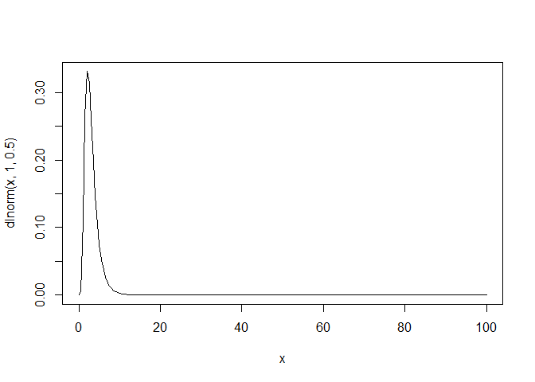<!-- -->

```r
a <- rnorm(1e4,1,0.5)
lambda <- exp(a)
mean( lambda )
```

```
## [1] 3.103197
```

```r
dens(lambda)
```

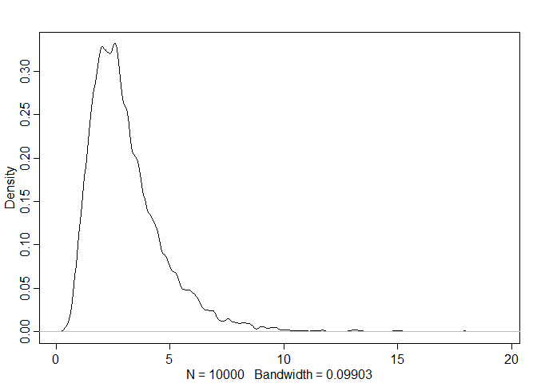<!-- -->

```r
max(lambda)
```

```
## [1] 19.29742
```

```r
# Seems appropriate enough

# Find appriorate slope prior
# Assuming more coverage means more salamanders

N <- 100
a <- rnorm(N , 1 , 0.5)
b <- rnorm(N , 0 , 0.4)
plot(NULL , xlim = c(-2, 1.5) , ylim = c(0, 40))
for (i in 1:N){
  curve(exp(a[i] + b[i] * x) , add = TRUE , col = col.alpha("black", 0.5))
}
```

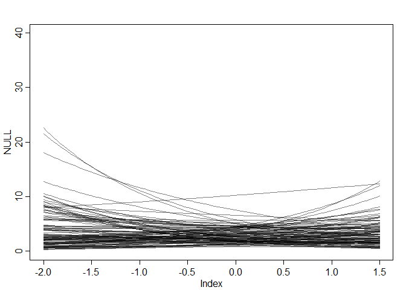<!-- -->

```r
# Looks like a good range for priors

h10.4a <- ulam(
  alist(
    SALAMAN ~ dpois(lambda),
    log(lambda) <- a + bc*std_cov,
    a ~ dnorm(1 , 0.5),
    bc ~ dnorm(0 , 0.4)
  ), data = d, chains = 4, cores = 4, log_lik = TRUE
)

precis(h10.4a, depth = 2)
```

```
##         mean        sd      5.5%     94.5%    n_eff     Rhat
## a  0.5670675 0.1230973 0.3659758 0.7625663 758.3218 1.003899
## bc 0.9548206 0.1408752 0.7358286 1.1853925 700.7236 1.004719
```

```r
pairs(h10.4a)
```

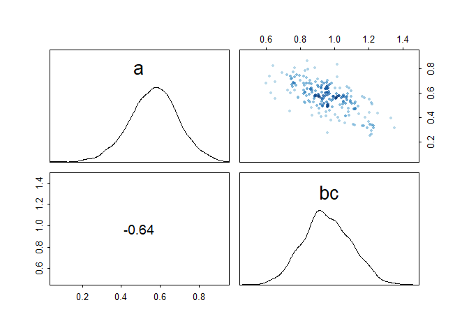<!-- -->

```r
plot(d$std_cov, d$SALAMAN,
  xlab = "percent coverage (std)" ,
  ylab = "total salamanders" ,
  col = rangi2 ,
  lwd = 2 ,
  ylim = c(0, 30)
  )

# set up the horizontal axis values to compute predictions at
ns <- 100
SALAMAN_seq <- seq(from = -2 ,
             to = 2 ,
             length.out = ns)
# predictions for cid=1 (low contact)
lambda <- link(h10.4a , data = data.frame(std_cov = SALAMAN_seq))
lmu <- apply(lambda , 2 , mean)
lci <- apply(lambda , 2 , PI)
lines(SALAMAN_seq , lmu , lty = 2 , lwd = 1.5)
shade(lci , SALAMAN_seq , xpd = TRUE)
```

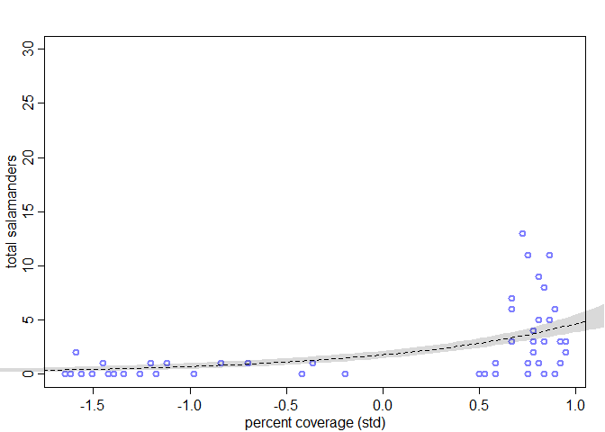<!-- -->

It looks decent at low levels of coverage where there are very few salamanders. Around a Z-score of .75 the prediction starts to break down as the number of salamanders jumps higher, while also having low numbers

  b. Can you improve the model by using the other predictor, FORESTAGE? Try any models you
think useful. Can you explain why FORESTAGE helps or does not help with prediction?


```r
head(d)
```

```
##   SITE SALAMAN PCTCOVER FORESTAGE   std_cov
## 1    1      13       85       316 0.7273231
## 2    2      11       86        88 0.7552742
## 3    3      11       90       548 0.8670786
## 4    4       9       88        64 0.8111764
## 5    5       8       89        43 0.8391275
## 6    6       7       83       368 0.6714209
```

```r
dens(d$FORESTAGE)
```

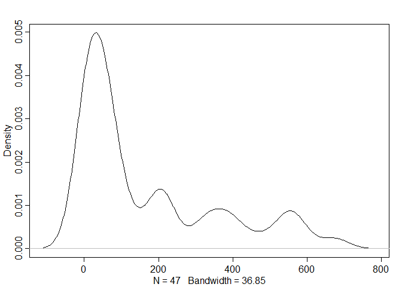<!-- -->

```r
# 4 clear peaks of age with 200 year gap, need to transform
# Some ages are 0 need to account for that in transformation
d$std_age <- scale(log(d$FORESTAGE + 1))
summary(d)
```

```
##       SITE         SALAMAN          PCTCOVER       FORESTAGE    
##  Min.   : 1.0   Min.   : 0.000   Min.   : 0.00   Min.   :  0.0  
##  1st Qu.:12.5   1st Qu.: 0.000   1st Qu.:18.00   1st Qu.: 29.5  
##  Median :24.0   Median : 1.000   Median :83.00   Median : 64.0  
##  Mean   :24.0   Mean   : 2.468   Mean   :58.98   Mean   :168.8  
##  3rd Qu.:35.5   3rd Qu.: 3.000   3rd Qu.:88.00   3rd Qu.:266.5  
##  Max.   :47.0   Max.   :13.000   Max.   :93.00   Max.   :675.0  
##       std_cov.V1           std_age.V1     
##  Min.   :-1.6485197   Min.   :-2.4936535  
##  1st Qu.:-1.1454001   1st Qu.:-0.4552284  
##  Median : 0.6714209   Median :-0.0038376  
##  Mean   : 0.0000000   Mean   : 0.0000000  
##  3rd Qu.: 0.8111764   3rd Qu.: 0.8295895  
##  Max.   : 0.9509318   Max.   : 1.3929340
```

```r
h10.4b <- ulam(
  alist(
    SALAMAN ~ dpois(lambda),
    log(lambda) <- a + bc*std_cov + ba*std_age,
    a ~ dnorm(1 , 0.5),
    c(bc,ba) ~ dnorm(0 , 0.4)
  ), data = d, chains = 4, cores = 4, log_lik = TRUE
)

plot(precis(h10.4b, depth = 2))
```

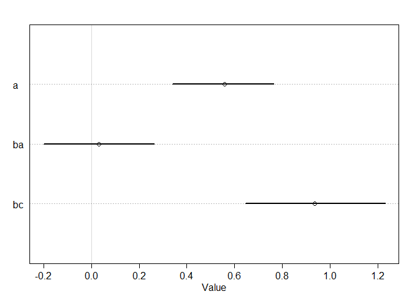<!-- -->

```r
pairs(h10.4b)
```

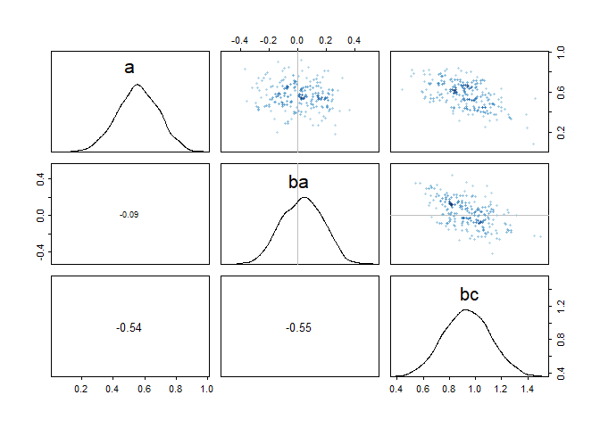<!-- -->

```r
# Age does not seem to add to the model

plot(d$std_cov,d$std_age)
```

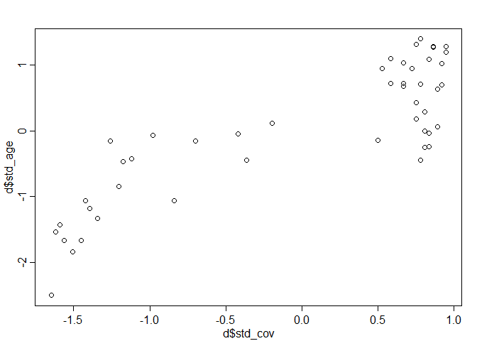<!-- -->

```r
compare(h10.4a,h10.4b)
```

```
##            WAIC    pWAIC    dWAIC    weight       SE      dSE
## h10.4a 213.9713 4.372398 0.000000 0.8278956 26.08561       NA
## h10.4b 217.1128 6.331720 3.141572 0.1721044 26.55983 1.043354
```

```r
coeftab(h10.4a,h10.4b)
```

```
##      h10.4a  h10.4b 
## a       0.57    0.56
## bc      0.95    0.94
## ba        NA    0.03
## nobs      47      47
```

Forest age and coverage are so highly correlated that adding forest age to the model did not make a difference.

# Week6 PDF # 3 

## The data in `data(Primates301)` were first introduced at the end of Chapter 7. In this problem, you will consider how brain size is associated with social learning. There are three parts

1. First, model the number of observations of `social_learning` for each species as a function of the log `brain` size. Use a Poisson distribution for the `social_learning` outcome variable. Interpret the resulting posterior.  


```r
data(Primates301)
d <- Primates301
head(d)
```

```
##                          name          genus      species subspecies
## 1 Allenopithecus_nigroviridis Allenopithecus nigroviridis       <NA>
## 2         Allocebus_trichotis      Allocebus    trichotis       <NA>
## 3           Alouatta_belzebul       Alouatta     belzebul       <NA>
## 4             Alouatta_caraya       Alouatta       caraya       <NA>
## 5            Alouatta_guariba       Alouatta      guariba       <NA>
## 6           Alouatta_palliata       Alouatta     palliata       <NA>
##   spp_id genus_id social_learning research_effort brain    body group_size
## 1      1        1               0               6 58.02 4655.00       40.0
## 2      2        2               0               6    NA   78.09        1.0
## 3      3        3               0              15 52.84 6395.00        7.4
## 4      4        3               0              45 52.63 5383.00        8.9
## 5      5        3               0              37 51.70 5175.00        7.4
## 6      6        3               3              79 49.88 6250.00       13.1
##   gestation weaning longevity sex_maturity maternal_investment
## 1        NA  106.15     276.0           NA                  NA
## 2        NA      NA        NA           NA                  NA
## 3        NA      NA        NA           NA                  NA
## 4    185.92  323.16     243.6      1276.72              509.08
## 5        NA      NA        NA           NA                  NA
## 6    185.42  495.60     300.0      1578.42              681.02
```

```r
dat <- list(R = d$research_effort,
            L = d$social_learning,
            B = scale(log(d$brain))
)

summary(dat)
```

```
##   Length Class  Mode   
## R 301    -none- numeric
## L 301    -none- numeric
## B 301    -none- numeric
```

```r
sum(is.na(dat$R))
```

```
## [1] 115
```

```r
sum(is.na(dat$L))
```

```
## [1] 98
```

```r
sum(is.na(dat$B))
```

```
## [1] 117
```

```r
d <- d[complete.cases(d$research_effort, d$social_learning, d$brain),]
dat <- list(R = log(d$research_effort),
            L = d$social_learning,
            B = scale(log(d$brain))
)

summary(dat)
```

```
##   Length Class  Mode   
## R 150    -none- numeric
## L 150    -none- numeric
## B 150    -none- numeric
```

```r
sum(is.na(dat$R))
```

```
## [1] 0
```

```r
sum(is.na(dat$L))
```

```
## [1] 0
```

```r
sum(is.na(dat$B))
```

```
## [1] 0
```

```r
m.1 <- ulam(
  alist(
    L ~ dpois(lambda),
    log(lambda) <- a + bb*B,
    c(a,bb) ~ dnorm(0,1)
    ), data = dat, chains = 4, cores = 4, log_lik = T, iter = 5000
)

precis(m.1)
```

```
##         mean         sd      5.5%     94.5%    n_eff     Rhat
## bb  2.809671 0.07631264  2.686777  2.931389 2271.767 1.001454
## a  -1.245988 0.12075427 -1.441679 -1.050938 2256.001 1.001714
```

```r
postcheck(m.1, window=25) # 6 windows
```

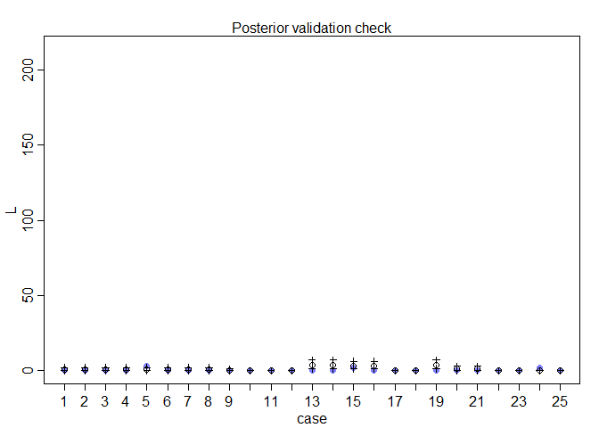<!-- -->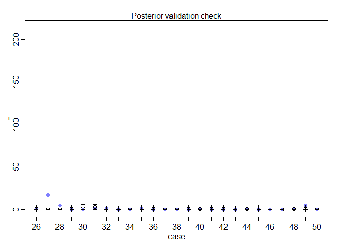<!-- -->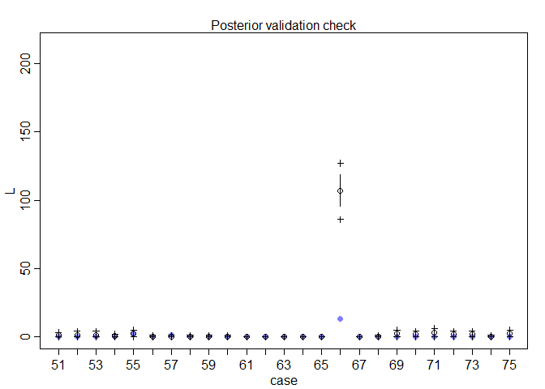<!-- -->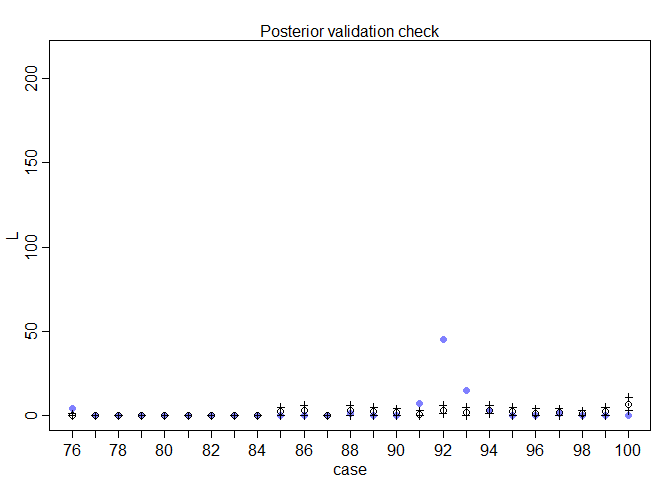<!-- -->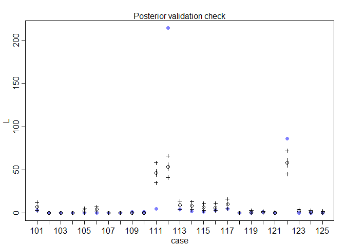<!-- -->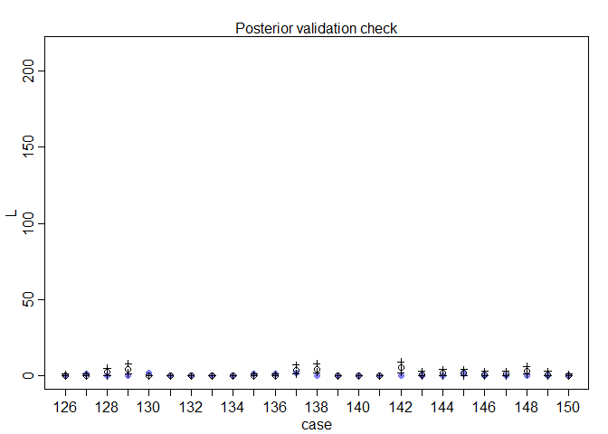<!-- -->

Some predictions are extremely off

2. Second, some species are studied much more than others. So the number of reported instances of `social_learning` could be a product of research effort. Use the `research_effort` variable, specifically its logarithm, as an additional predictor variable. Interpret the coefficient for log `research_effort`. Does this model disagree with the previous one?  


```r
m.2 <- ulam(
  alist(
    L ~ dpois(lambda),
    log(lambda) <- a + bb*B + br*R,
    c(a,bb,br) ~ dnorm(0,1)
  ), data = dat, chains = 4, cores = 4, log_lik = T, iter = 5000
)

precis(m.2)
```

```
##          mean         sd       5.5%      94.5%    n_eff     Rhat
## br  1.5402097 0.06567790  1.4354060  1.6433517 2187.449 1.001494
## bb  0.4589331 0.08332456  0.3257629  0.5918616 2540.362 1.001352
## a  -6.0101995 0.30802581 -6.4965467 -5.5227089 2367.823 1.001602
```

```r
postcheck(m.2, window=25) # 6 windows
```

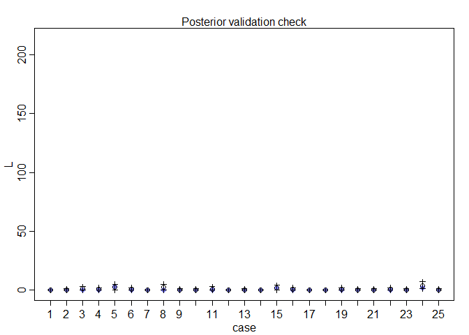<!-- -->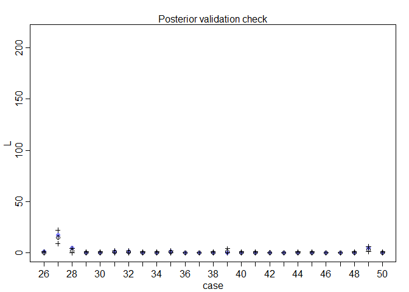<!-- -->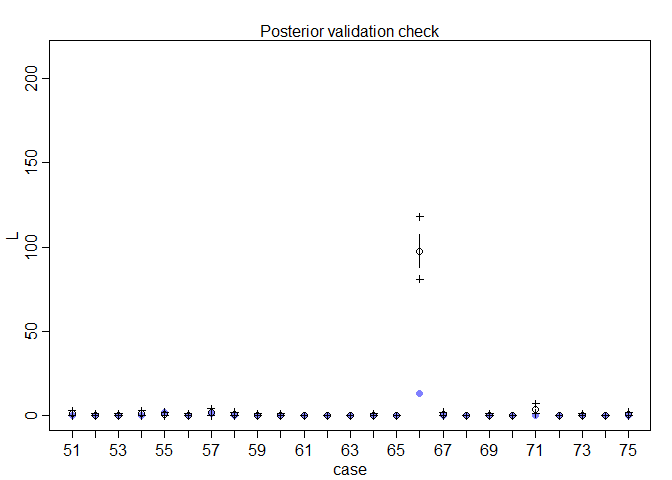<!-- -->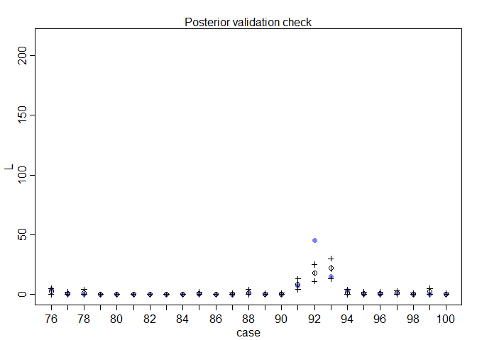<!-- -->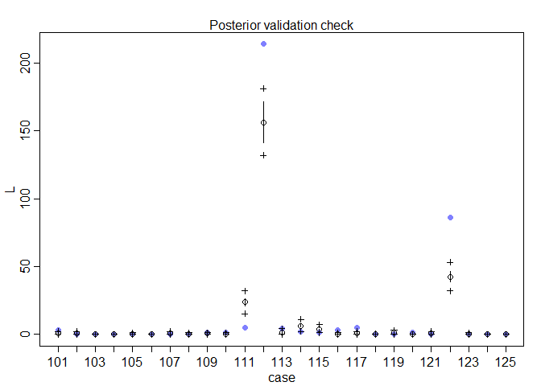<!-- -->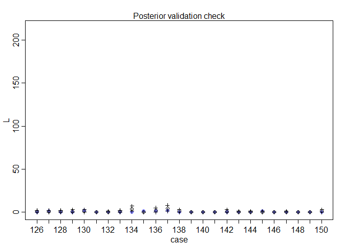<!-- -->

```r
compare(m.1,m.2)
```

```
##          WAIC     pWAIC    dWAIC       weight       SE     dSE
## m.2  566.5609  53.98003   0.0000  1.00000e+00 173.7600      NA
## m.1 1428.1741 140.15451 861.6132 7.99964e-188 476.1166 387.229
```

The second model is better in this case also saying research effort plays a larger role than brain size.

3. Third, draw a DAG to represent how you think variables `social_learning`, `brain`, and `research_effort` interact. Justify the DAG with the measured associations in the two models above (and any other model you used).


```r
library(dagitty)

# Build DAG
dag <- dagitty( "dag {
                B -> R
                R -> L
                B -> L
                }")
coordinates(dag) <- list(x = c(B=0,L=0.5,R=1), y = c(B=0,L=-0.5,R=0))
plot(dag)
```

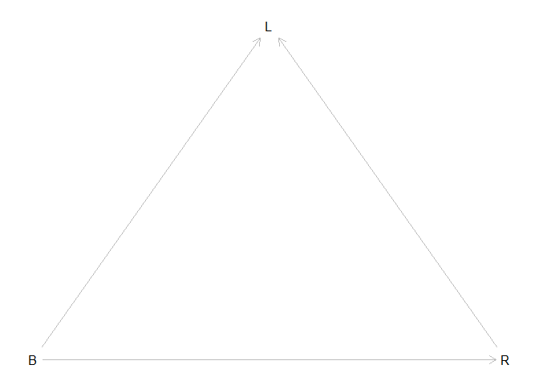<!-- -->

The bigger your brain the more social learning and the bigger your brain the more research effort leading to more social learning
