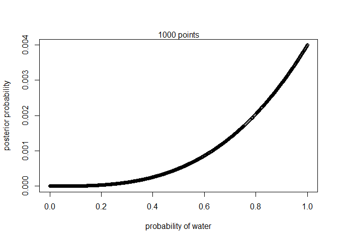
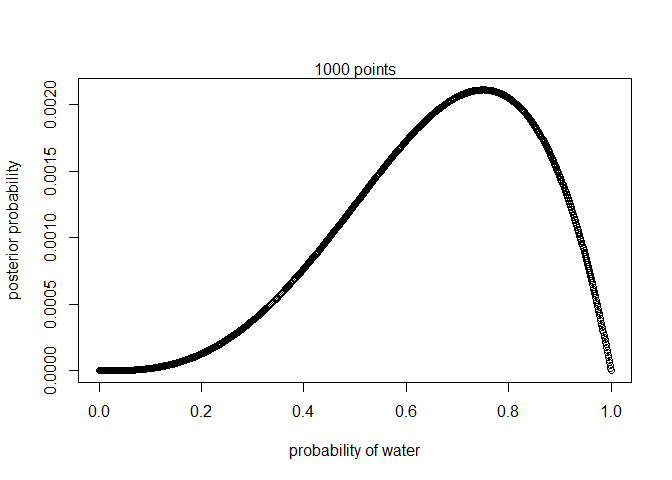
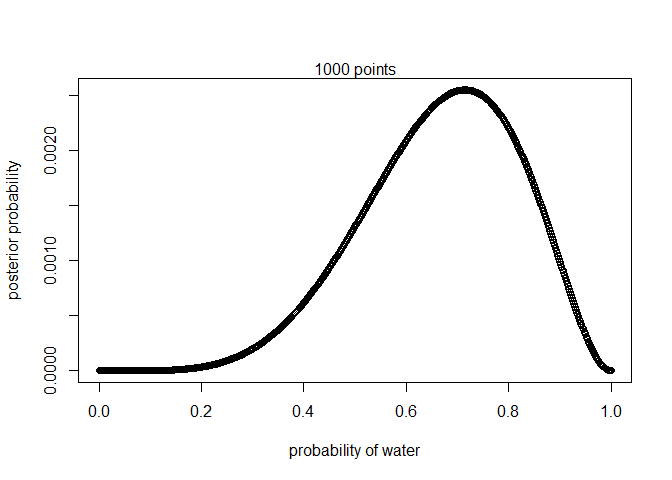
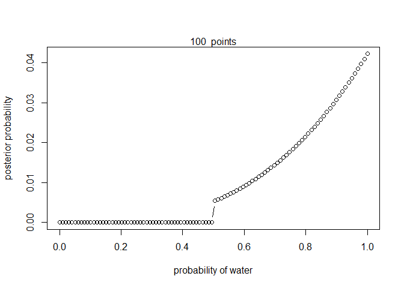
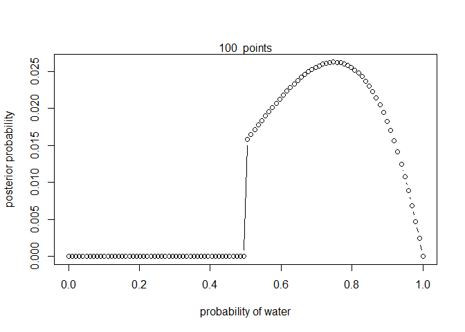
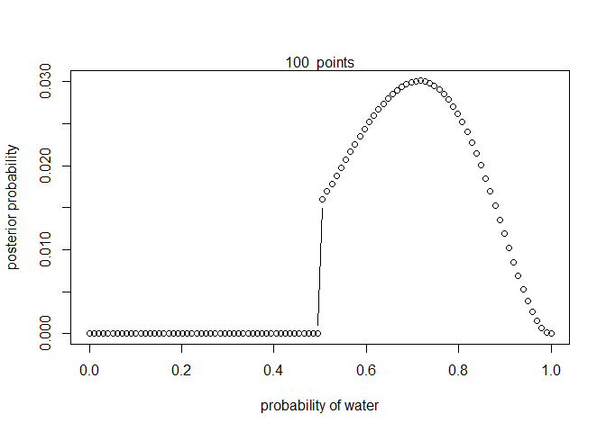

## 2E1 Which of the expressions below correspond to the statement: the probability of rain on Monday?

`(2) Pr(rain|Monday)`

## 2E2 Which of the following statements corresponds to the expression: Pr(Monday|rain)?

`(3) The probability that it is Monday, given that it is raining.`

## 2E3. Which of the expressions below correspond to the statement: the probability that it is Monday, given that it is raining?

`(1) Pr(Monday|rain)`

## 2M1. Recall the globe tossing model from the chapter. Compute and plot the grid approximate posterior distribution for each of the following sets of observations. In each case, assume a uniform prior for p.


```r
# (1) W,W,W
# define grid
p_grid <- seq( from=0 , to=1 , length.out=1000)
# define prior
prior <- rep( 1 , 1000 )
# compute likelihood at each value in grid
likelihood <- dbinom( 3 , size=3 , prob=p_grid )
# compute product of likelihood and prior
unstd.posterior <- likelihood * prior
# standardize the posterior, so it sums to 1
posterior <- unstd.posterior / sum(unstd.posterior)
sum(posterior)
```

```
## [1] 1
```

```r
plot( p_grid , posterior , type="b" ,
xlab="probability of water" , ylab="posterior probability" )
mtext( "1000 points" )
```

<!-- -->


```r
# (2) W,W,W,L
# define grid
p_grid <- seq( from=0 , to=1 , length.out=1000)
# define prior
prior <- rep( 1 , 1000 )
# compute likelihood at each value in grid
likelihood <- dbinom( 3 , size=4 , prob=p_grid )
# compute product of likelihood and prior
unstd.posterior <- likelihood * prior
# standardize the posterior, so it sums to 1
posterior <- unstd.posterior / sum(unstd.posterior)
sum(posterior)
```

```
## [1] 1
```

```r
plot( p_grid , posterior , type="b" ,
xlab="probability of water" , ylab="posterior probability" )
mtext( "1000 points" )
```

<!-- -->


```r
# (3) L,W,W,L,W,W,W
# define grid
p_grid <- seq( from=0 , to=1 , length.out=1000)
# define prior
prior <- rep( 1 , 1000 )
# compute likelihood at each value in grid
likelihood <- dbinom( 5 , size=7 , prob=p_grid )
# compute product of likelihood and prior
unstd.posterior <- likelihood * prior
# standardize the posterior, so it sums to 1
posterior <- unstd.posterior / sum(unstd.posterior)
sum(posterior)
```

```
## [1] 1
```

```r
plot( p_grid , posterior , type="b" ,
xlab="probability of water" , ylab="posterior probability" )
mtext( "1000 points" )
```

<!-- -->

## 2M2. Now assume a prior for p that is equal to zero when p < 0.5 and is a positive constant when p ≥ 0.5. Again compute and plot the grid approximate posterior distribution for each of the sets of observations in the problem just above.


```r
grid_plot <- function(N,W,Size){
  # define grid
  p_grid <- seq( from=0 , to=1 , length.out=Size)
  # define prior
  prior <- ifelse(p_grid < .5, 0, 1)
  # compute likelihood at each value in grid
  likelihood <- dbinom( W , size=N , prob=p_grid )
  # compute product of likelihood and prior
  unstd.posterior <- likelihood * prior
  # standardize the posterior, so it sums to 1
  posterior <- unstd.posterior / sum(unstd.posterior)
  sum(posterior)
  plot( p_grid , posterior , type="b" ,
  xlab="probability of water" , ylab="posterior probability" )
  mtext(paste(Size, " points"))
}
```


```r
# (1) W,W,W
grid_plot(3,3,100)
```

<!-- -->


```r
# (2) W,W,W,L
grid_plot(4,3,100)
```

<!-- -->


```r
# (3) L,W,W,L,W,W,W
grid_plot(7,5,100)
```

<!-- -->

## 2M3. Suppose there are two globes, one for Earth and one for Mars. The Earth globe is 70% covered in water. The Mars globe is 100% land. Further suppose that one of these globes—you don’t know which—was tossed in the air and produced a “land” observation. Assume that each globe was equally likely to be tossed. Show that the posterior probability that the globe was the Earth, conditional on seeing “land” (Pr(Earth|land)), is 0.23.


```r
prior <- rep(0.5,2)
ps <- c(0.7, 0)
likelihood <- dbinom(0,1, ps) # 0 for land, 1 for one toss
raw.post <- likelihood * prior
post <- raw.post/sum(raw.post)
post
```

```
## [1] 0.2307692 0.7692308
```

## 2M4. Suppose you have a deck with only three cards. Each card has two sides, and each side is either black or white. One card has two black sides. The second card has one black and one white side. The third card has two white sides. Now suppose all three cards are placed in a bag and shuffled. Someone reaches into the bag and pulls out a card and places it flat on a table. A black side is shown facing up, but you don’t know the color of the side facing down. Show that the probability that the other side is also black is 2/3. Use the counting method (Section 2 of the chapter) to approach this problem. This means counting up the ways that each card could produce the observed data (a black side facing up on the table).

3 Blacks and 3 Whites

2 Blacks have Black on other side

2/3 probability

## 2M5. Now suppose there are four cards: B/B, B/W, W/W, and another B/B. Again suppose a card is drawn from the bag and a black side appears face up. Again calculate the probability that the other side is black.

5 Blacks and 3 Whites

4 Blacks have Black on other side

4/5 probability
