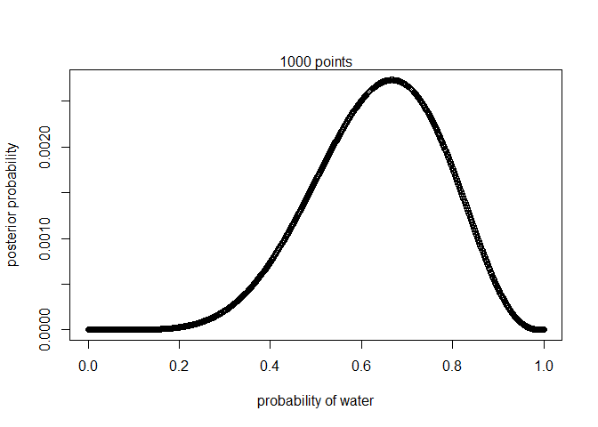
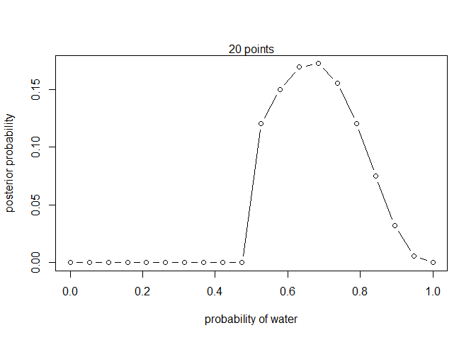
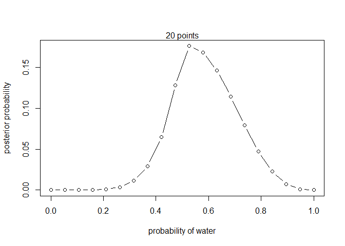
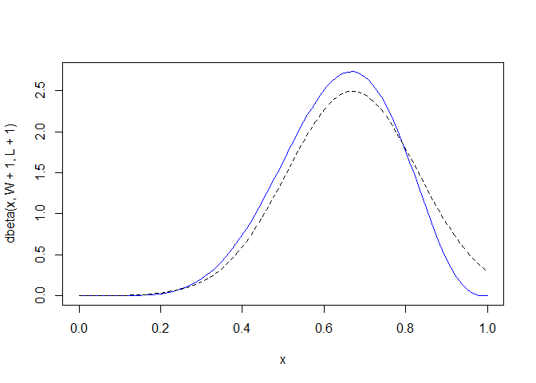
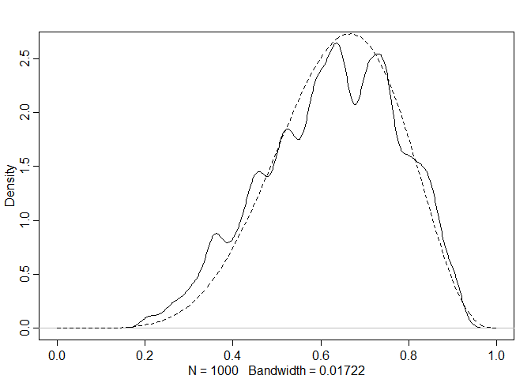

```r
ways <- c( 0 , 3 , 8 , 9 , 0 )
ways/sum(ways)
```

```
## [1] 0.00 0.15 0.40 0.45 0.00
```


```r
dbinom( 6 , size=9 , prob=0.5 )
```

```
## [1] 0.1640625
```


```r
# define grid
p_grid <- seq( from=0 , to=1 , length.out=20 )
p_grid
```

```
##  [1] 0.00000000 0.05263158 0.10526316 0.15789474 0.21052632 0.26315789
##  [7] 0.31578947 0.36842105 0.42105263 0.47368421 0.52631579 0.57894737
## [13] 0.63157895 0.68421053 0.73684211 0.78947368 0.84210526 0.89473684
## [19] 0.94736842 1.00000000
```

```r
# define prior
prior <- rep( 1 , 20 )
prior
```

```
##  [1] 1 1 1 1 1 1 1 1 1 1 1 1 1 1 1 1 1 1 1 1
```

```r
# compute likelihood at each value in grid
likelihood <- dbinom( 6 , size=9 , prob=p_grid )
likelihood
```

```
##  [1] 0.000000e+00 1.518149e-06 8.185093e-05 7.772923e-04 3.598575e-03
##  [6] 1.116095e-02 2.668299e-02 5.292110e-02 9.082698e-02 1.383413e-01
## [11] 1.897686e-01 2.361147e-01 2.666113e-01 2.714006e-01 2.450051e-01
## [16] 1.897686e-01 1.179181e-01 5.026670e-02 8.853845e-03 0.000000e+00
```

```r
# compute product of likelihood and prior
unstd.posterior <- likelihood * prior
unstd.posterior
```

```
##  [1] 0.000000e+00 1.518149e-06 8.185093e-05 7.772923e-04 3.598575e-03
##  [6] 1.116095e-02 2.668299e-02 5.292110e-02 9.082698e-02 1.383413e-01
## [11] 1.897686e-01 2.361147e-01 2.666113e-01 2.714006e-01 2.450051e-01
## [16] 1.897686e-01 1.179181e-01 5.026670e-02 8.853845e-03 0.000000e+00
```

```r
# standardize the posterior, so it sums to 1
posterior <- unstd.posterior / sum(unstd.posterior)
posterior
```

```
##  [1] 0.000000e+00 7.989837e-07 4.307717e-05 4.090797e-04 1.893887e-03
##  [6] 5.873873e-03 1.404294e-02 2.785174e-02 4.780115e-02 7.280739e-02
## [11] 9.987296e-02 1.242643e-01 1.403143e-01 1.428349e-01 1.289433e-01
## [16] 9.987296e-02 6.205890e-02 2.645477e-02 4.659673e-03 0.000000e+00
```

```r
sum(posterior)
```

```
## [1] 1
```

```r
plot( p_grid , posterior , type="b" ,
xlab="probability of water" , ylab="posterior probability" )
mtext( "20 points" )
```

<!-- -->


```r
# define grid
p_grid <- seq( from=0 , to=1 , length.out=1000)
# define prior
prior <- rep( 1 , 1000 )
# compute likelihood at each value in grid
likelihood <- dbinom( 6 , size=9 , prob=p_grid )
# compute product of likelihood and prior
unstd.posterior <- likelihood * prior
# standardize the posterior, so it sums to 1
posterior <- unstd.posterior / sum(unstd.posterior)
sum(posterior)
```

```
## [1] 1
```

```r
plot( p_grid , posterior , type="b" ,
xlab="probability of water" , ylab="posterior probability" )
mtext( "1000 points" )
```

<!-- -->


```r
# define grid
p_grid <- seq( from=0 , to=1 , length.out=20 )
p_grid
```

```
##  [1] 0.00000000 0.05263158 0.10526316 0.15789474 0.21052632 0.26315789
##  [7] 0.31578947 0.36842105 0.42105263 0.47368421 0.52631579 0.57894737
## [13] 0.63157895 0.68421053 0.73684211 0.78947368 0.84210526 0.89473684
## [19] 0.94736842 1.00000000
```

```r
# define prior
prior <- ifelse( p_grid < 0.5 , 0 , 1 )
prior
```

```
##  [1] 0 0 0 0 0 0 0 0 0 0 1 1 1 1 1 1 1 1 1 1
```

```r
# compute likelihood at each value in grid
likelihood <- dbinom( 6 , size=9 , prob=p_grid )
likelihood
```

```
##  [1] 0.000000e+00 1.518149e-06 8.185093e-05 7.772923e-04 3.598575e-03
##  [6] 1.116095e-02 2.668299e-02 5.292110e-02 9.082698e-02 1.383413e-01
## [11] 1.897686e-01 2.361147e-01 2.666113e-01 2.714006e-01 2.450051e-01
## [16] 1.897686e-01 1.179181e-01 5.026670e-02 8.853845e-03 0.000000e+00
```

```r
# compute product of likelihood and prior
unstd.posterior <- likelihood * prior
unstd.posterior
```

```
##  [1] 0.000000000 0.000000000 0.000000000 0.000000000 0.000000000
##  [6] 0.000000000 0.000000000 0.000000000 0.000000000 0.000000000
## [11] 0.189768623 0.236114658 0.266611252 0.271400562 0.245005089
## [16] 0.189768623 0.117918118 0.050266702 0.008853845 0.000000000
```

```r
# standardize the posterior, so it sums to 1
posterior <- unstd.posterior / sum(unstd.posterior)
posterior
```

```
##  [1] 0.000000000 0.000000000 0.000000000 0.000000000 0.000000000
##  [6] 0.000000000 0.000000000 0.000000000 0.000000000 0.000000000
## [11] 0.120433917 0.149846759 0.169200982 0.172240449 0.155488943
## [16] 0.120433917 0.074835031 0.031901037 0.005618965 0.000000000
```

```r
sum(posterior)
```

```
## [1] 1
```

```r
plot( p_grid , posterior , type="b" ,
xlab="probability of water" , ylab="posterior probability" )
mtext( "20 points" )
```

<!-- -->


```r
# define grid
p_grid <- seq( from=0 , to=1 , length.out=20 )
p_grid
```

```
##  [1] 0.00000000 0.05263158 0.10526316 0.15789474 0.21052632 0.26315789
##  [7] 0.31578947 0.36842105 0.42105263 0.47368421 0.52631579 0.57894737
## [13] 0.63157895 0.68421053 0.73684211 0.78947368 0.84210526 0.89473684
## [19] 0.94736842 1.00000000
```

```r
# define prior
prior <- exp( -5*abs( p_grid - 0.5 ) )
prior
```

```
##  [1] 0.0820850 0.1067952 0.1389440 0.1807706 0.2351884 0.3059877 0.3980998
##  [8] 0.5179406 0.6738573 0.8767101 0.8767101 0.6738573 0.5179406 0.3980998
## [15] 0.3059877 0.2351884 0.1807706 0.1389440 0.1067952 0.0820850
```

```r
# compute likelihood at each value in grid
likelihood <- dbinom( 6 , size=9 , prob=p_grid )
likelihood
```

```
##  [1] 0.000000e+00 1.518149e-06 8.185093e-05 7.772923e-04 3.598575e-03
##  [6] 1.116095e-02 2.668299e-02 5.292110e-02 9.082698e-02 1.383413e-01
## [11] 1.897686e-01 2.361147e-01 2.666113e-01 2.714006e-01 2.450051e-01
## [16] 1.897686e-01 1.179181e-01 5.026670e-02 8.853845e-03 0.000000e+00
```

```r
# compute product of likelihood and prior
unstd.posterior <- likelihood * prior
unstd.posterior
```

```
##  [1] 0.000000e+00 1.621311e-07 1.137270e-05 1.405116e-04 8.463432e-04
##  [6] 3.415112e-03 1.062249e-02 2.740999e-02 6.120443e-02 1.212852e-01
## [11] 1.663721e-01 1.591076e-01 1.380888e-01 1.080445e-01 7.496853e-02
## [16] 4.463138e-02 2.131613e-02 6.984257e-03 9.455483e-04 0.000000e+00
```

```r
# standardize the posterior, so it sums to 1
posterior <- unstd.posterior / sum(unstd.posterior)
posterior
```

```
##  [1] 0.000000e+00 1.714957e-07 1.202958e-05 1.486275e-04 8.952276e-04
##  [6] 3.612367e-03 1.123604e-02 2.899317e-02 6.473957e-02 1.282906e-01
## [11] 1.759816e-01 1.682976e-01 1.460647e-01 1.142851e-01 7.929868e-02
## [16] 4.720927e-02 2.254734e-02 7.387665e-03 1.000163e-03 0.000000e+00
```

```r
sum(posterior)
```

```
## [1] 1
```

```r
plot( p_grid , posterior , type="b" ,
xlab="probability of water" , ylab="posterior probability" )
mtext( "20 points" )
```

<!-- -->

```r
library(rethinking)
```

```
## Loading required package: rstan
```

```
## Loading required package: ggplot2
```

```
## Loading required package: StanHeaders
```

```
## rstan (Version 2.18.2, GitRev: 2e1f913d3ca3)
```

```
## For execution on a local, multicore CPU with excess RAM we recommend calling
## options(mc.cores = parallel::detectCores()).
## To avoid recompilation of unchanged Stan programs, we recommend calling
## rstan_options(auto_write = TRUE)
```

```
## For improved execution time, we recommend calling
## Sys.setenv(LOCAL_CPPFLAGS = '-march=native')
## although this causes Stan to throw an error on a few processors.
```

```
## Loading required package: parallel
```

```
## rethinking (Version 1.88)
```

```r
globe.qa <- quap(
alist(
W ~ dbinom( W+L ,p) , # binomial likelihood
p ~ dunif(0,1) # uniform prior
) ,
data=list(W=6,L=3) )
# display summary of quadratic approximation
precis( globe.qa )
```

```
##        mean        sd      5.5%     94.5%
## p 0.6666664 0.1571338 0.4155362 0.9177967
```


```r
# analytical calculation
W <- 6
L <- 3
curve( dbeta( x , W+1 , L+1 ) , col = 'blue', from=0 , to=1 )
# quadratic approximation
curve( dnorm( x , 0.67 , 0.16 ) , lty=2 , col = 'black' , add=TRUE )
```

<!-- -->


```r
n_samples <- 1000
p <- rep( NA , n_samples )
p[1] <- 0.5
W <- 6
L <- 3
for ( i in 2:n_samples ) {
p_new <- rnorm( 1 , p[i-1] , 0.1 )
if ( p_new < 0 ) p_new <- abs( p_new )
if ( p_new > 1 ) p_new <- 2 - p_new
q0 <- dbinom( W , W+L , p[i-1] )
q1 <- dbinom( W , W+L , p_new )
p[i] <- ifelse( runif(1) < q1/q0 , p_new , p[i-1] )
}
dens( p , xlim=c(0,1) )
curve( dbeta( x , W+1 , L+1 ) , lty=2 , add=TRUE )
```

<!-- -->

