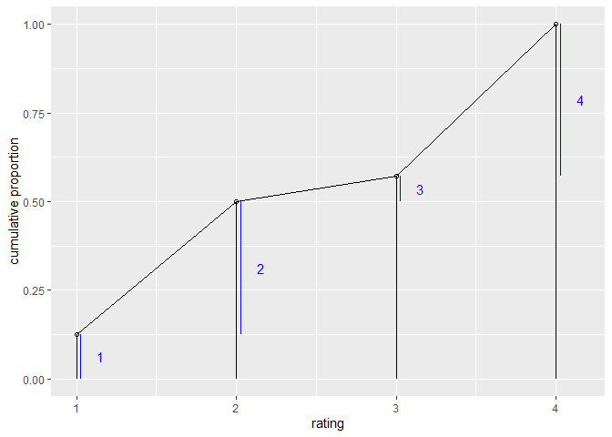
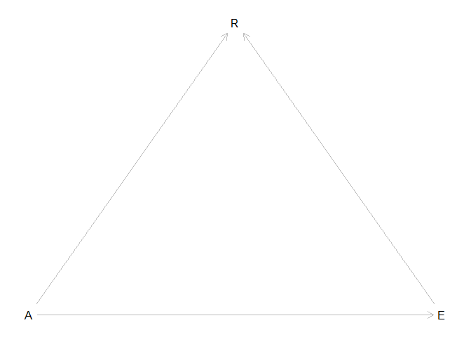
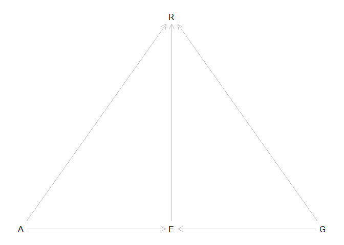

```r
library(tidyverse)
```

```
## -- Attaching packages ---------------------------------------------------------- tidyverse 1.2.1 --
```

```
## v ggplot2 3.2.1     v purrr   0.3.3
## v tibble  2.1.3     v dplyr   0.8.3
## v tidyr   1.0.0     v stringr 1.4.0
## v readr   1.3.1     v forcats 0.4.0
```

```
## -- Conflicts ------------------------------------------------------------- tidyverse_conflicts() --
## x dplyr::filter() masks stats::filter()
## x dplyr::lag()    masks stats::lag()
```

```r
library(rethinking)
```

```
## Loading required package: rstan
```

```
## Loading required package: StanHeaders
```

```
## rstan (Version 2.19.2, GitRev: 2e1f913d3ca3)
```

```
## For execution on a local, multicore CPU with excess RAM we recommend calling
## options(mc.cores = parallel::detectCores()).
## To avoid recompilation of unchanged Stan programs, we recommend calling
## rstan_options(auto_write = TRUE)
```

```
## For improved execution time, we recommend calling
## Sys.setenv(LOCAL_CPPFLAGS = '-march=native')
## although this causes Stan to throw an error on a few processors.
```

```
## 
## Attaching package: 'rstan'
```

```
## The following object is masked from 'package:tidyr':
## 
##     extract
```

```
## Loading required package: parallel
```

```
## Loading required package: dagitty
```

```
## rethinking (Version 1.92)
```

```
## 
## Attaching package: 'rethinking'
```

```
## The following object is masked from 'package:purrr':
## 
##     map
```

```
## The following object is masked from 'package:stats':
## 
##     rstudent
```

```r
options(mc.cores = parallel::detectCores())
rstan_options(auto_write = TRUE)
Sys.setenv(LOCAL_CPPFLAGS = '-march=native')
```

# Book

## 12E1. What is the difference between an ordered categorical variable and an unordered one? Define and then give an example of each.

An ordered categorical variable contains structure where one value is greater than the other. An example might be gauging the temperature of an object using (cold, cold, warm, hot) instead of the actual temperature. An unordered catergorical variable is one where there is no structure. An example would be a variable of favorite color. No color is ordered higher than the other.

## 12E2. What kind of link function does an ordered logistic regression employ? How does it differ from an ordinary logit link?

An ordered logistic regression employs the cumulative logit where it is the odds of witnessing the event and any event smaller than it in the ordering.

## 12M1. At a certain university, employees are annually rated from 1 to 4 on their productivity, with 1 being least productive and 4 most productive. In a certain department at this certain university in a certain year, the numbers of employees receiving each rating were (from 1 to 4): 12, 36, 7, 41. Compute the log cumulative odds of each rating


```r
ratings <- c(12,36,7,41)

ratings_por <- ratings  / sum(ratings)
ratings_por
```

```
## [1] 0.12500000 0.37500000 0.07291667 0.42708333
```

```r
cum_ratings <- cumsum(ratings_por)
cum_ratings
```

```
## [1] 0.1250000 0.5000000 0.5729167 1.0000000
```

```r
round( lco <- logit( cum_ratings ) , 2 )
```

```
## [1] -1.95  0.00  0.29   Inf
```

```r
names(lco) <- c("1","2","3","4")
lco
```

```
##          1          2          3          4 
## -1.9459101  0.0000000  0.2937611        Inf
```

## 12M2. Make a version of Figure 12.5 for the employee ratings data given just above.


```r
cum_ratings
```

```
## [1] 0.1250000 0.5000000 0.5729167 1.0000000
```

```r
dat <- data.frame(rating = 1:4, cum_prob = cum_ratings, probs = ratings_por)
ggplot(dat, aes(x = rating, y = cum_ratings)) +
  geom_linerange(aes(ymin = 0, ymax = cum_prob)) +
  geom_linerange(aes(x = rating + 0.025,
                     ymin = cum_prob - probs,
                     ymax = cum_prob),
                 color = "blue") +
  geom_line() +
  geom_point(shape = 1) +
  geom_text(aes(y = (2*cum_prob - probs)/2,
                label = 1:4),
            color="blue",
            position = position_nudge(x=.15)) +
  ylab("cumulative proportion")
```

<!-- -->

# PDF

## 1. In the Trolley data--`data(Trolley)`-- we saw how education level (modeled as an ordered category) is associate with responses. Is this association causal? One plausible confound is that education is also associated with age, through a causal process: People are older when they finish school than when they begin it.
## Reconsider the Trolley data in this light. Draw a DAG that represents hypothetical causal relationships among response, education, and age. Which statistical model or models do you need to evauluate the causal influence of education on responses? Fit these models to the trolley data. What do you conclude about the causal relationships among these three variables?


```r
library(dagitty)
# Build DAG
dag <- dagitty( "dag {
                A -> R
                E -> R
                A -> E
                }")
coordinates(dag) <- list(x = c(A=0,R=0.5,E=1), y = c(A=0,R=-0.5,E=0))
plot(dag)
```

<!-- -->

```r
data("Trolley")
d <- Trolley

edu_levels <- c( 6 , 1 , 8 , 4 , 7 , 2 , 5 , 3 )
d$edu_new <- as.integer(edu_levels[ d$edu ])

dat <- list(
  R = d$response ,
  action = d$action,
  intention = d$intention,
  contact = d$contact,
  E = d$edu_new,
  alpha = rep(2 , 7),
  age = standardize(d$age)
)

mdl_1 <- ulam(
  alist(
    R ~ ordered_logistic(phi , kappa),
    phi <- bE * sum(delta_j[1:E]) + bA * action + bI * intention + bC * contact + bAge * age,
    kappa ~ normal(0 , 1.5),
    c(bA, bI, bC, bE, bAge) ~ normal(0 , 1),
    vector[8]:delta_j <<- append_row(0 , delta),
    simplex[7]:delta ~ dirichlet(alpha)
  ),
  data = dat ,
  chains = 4 ,
  cores = 4 ,
  coerce_int = FALSE
)
```

```
## Cautionary note:
```

```
## Variable alpha contains only integers but is not type 'integer'. If you intend it as an index variable, you should as.integer() it before passing to ulam.
```

```
## Warning: Tail Effective Samples Size (ESS) is too low, indicating posterior variances and tail quantiles may be unreliable.
## Running the chains for more iterations may help. See
## http://mc-stan.org/misc/warnings.html#tail-ess
```

```r
precis(mdl_1, depth = 2)
```

```
##                 mean         sd        5.5%       94.5%     n_eff      Rhat
## kappa[1] -2.68225843 0.09041803 -2.81943792 -2.55684348  421.8306 1.0105868
## kappa[2] -1.99848285 0.08930953 -2.13835249 -1.87152107  423.4777 1.0101657
## kappa[3] -1.41490115 0.08817978 -1.55679497 -1.29308429  410.3575 1.0099566
## kappa[4] -0.38968380 0.08728123 -0.53304872 -0.26956594  424.6103 1.0091071
## kappa[5]  0.28093526 0.08839857  0.13306009  0.40721504  426.9948 1.0086417
## kappa[6]  1.18790915 0.08981233  1.04669995  1.30988686  435.3900 1.0092001
## bAge     -0.09952180 0.02092812 -0.13187901 -0.06402782  820.4219 1.0008079
## bE        0.23426780 0.11236358  0.04119232  0.37343963  352.6772 1.0126577
## bC       -0.96201099 0.05032569 -1.04457248 -0.87931726 1952.5271 0.9990961
## bI       -0.71847738 0.03676286 -0.77771681 -0.65928823 2087.7558 0.9990569
## bA       -0.70769278 0.04043902 -0.77274620 -0.64538959 1794.3647 1.0007983
## delta[1]  0.11201984 0.07222268  0.02305187  0.24580801 1865.2806 0.9998936
## delta[2]  0.12432261 0.07716441  0.02706976  0.26538520 2392.7936 0.9994299
## delta[3]  0.08370352 0.06042357  0.01586069  0.19193279 1302.3594 1.0007485
## delta[4]  0.06545298 0.05423172  0.01077573  0.15946353  727.0256 1.0049156
## delta[5]  0.43496782 0.14139757  0.14994689  0.62758991  483.1885 1.0056206
## delta[6]  0.08473431 0.05897463  0.01619753  0.19467090 1994.6000 1.0002539
## delta[7]  0.09479893 0.06250794  0.02002280  0.21137847 1974.3931 0.9990382
```

Education now leads to a more permissable result while age leads to less permissable. Back door may be real

## 2. Consider one more variable in the Trolley data: Gender. Suppose that gender might influence education as well as response directly. Draw a DAG now that includes response, education, age, and gender.
## Using only the DAG, is it possible that the inferences from Problem 1 are confounded by gender? If so, define any additional models you need to infer the causal influence of education on response. What do you conclude?


```r
# Build DAG
dag <- dagitty( "dag {
                A -> R
                E -> R
                A -> E
                G -> R
                G -> E
                }")
coordinates(dag) <- list(x = c(A=0,R=0.5,E=0.5,G=1), y = c(A=0,R=-0.5,E=0,G=0))
plot(dag)
```

<!-- -->

```r
dat <- list(
  R = d$response ,
  action = d$action,
  intention = d$intention,
  contact = d$contact,
  E = d$edu_new,
  alpha = rep(2 , 7),
  age = standardize(d$age),
  male = d$male
)

mdl_2 <- ulam(
  alist(
    R ~ ordered_logistic(phi , kappa),
    phi <- bE * sum(delta_j[1:E]) + bA * action + bI * intention + bC * contact + bAge * age + bM * male,
    kappa ~ normal(0 , 1.5),
    c(bA, bI, bC, bE, bAge, bM) ~ normal(0 , 1),
    vector[8]:delta_j <<- append_row(0 , delta),
    simplex[7]:delta ~ dirichlet(alpha)
  ),
  data = dat ,
  chains = 4 ,
  cores = 4 ,
  coerce_int = FALSE
)
```

```
## Cautionary note:
```

```
## Variable alpha contains only integers but is not type 'integer'. If you intend it as an index variable, you should as.integer() it before passing to ulam.
```

```r
precis(mdl_2, depth = 2)
```

```
##                  mean         sd        5.5%       94.5%     n_eff      Rhat
## kappa[1] -2.561624060 0.12861260 -2.77455165 -2.37653671  586.9237 1.0069311
## kappa[2] -1.877648035 0.12717527 -2.09843184 -1.69256815  585.4414 1.0071061
## kappa[3] -1.288749940 0.12570918 -1.50174237 -1.10454302  586.7819 1.0067597
## kappa[4] -0.244737263 0.12565631 -0.45672628 -0.06465188  595.7729 1.0070216
## kappa[5]  0.442254707 0.12665685  0.22456983  0.62830208  602.8862 1.0063087
## kappa[6]  1.368508979 0.12769785  1.15432979  1.55549490  606.7065 1.0054374
## bM        0.561497048 0.03638516  0.50280040  0.61871974 2032.4344 1.0000865
## bAge     -0.067339349 0.02297466 -0.10532306 -0.03118734  950.0876 1.0042097
## bE        0.007963889 0.17022064 -0.27111324  0.25905366  566.2467 1.0073292
## bC       -0.969531535 0.04952390 -1.04928807 -0.89114670 2060.5695 0.9986562
## bI       -0.725635357 0.03646531 -0.78168872 -0.66718825 2370.2918 1.0002902
## bA       -0.713357869 0.04006332 -0.77775487 -0.64875237 2093.2308 0.9989044
## delta[1]  0.154368301 0.09575102  0.03506410  0.32875152 1851.6602 0.9995063
## delta[2]  0.139868170 0.08944811  0.02632024  0.30614963 2201.8409 0.9999062
## delta[3]  0.133540218 0.08529814  0.02517419  0.29032353 1804.9263 1.0007368
## delta[4]  0.136086488 0.09665984  0.02164412  0.31843574 1119.5900 1.0034164
## delta[5]  0.188667135 0.15225132  0.01813843  0.46135807  593.4158 1.0074386
## delta[6]  0.117034618 0.07788690  0.02285866  0.26037884 2184.2447 1.0009512
## delta[7]  0.130435069 0.08257321  0.03011805  0.28409777 2499.0806 0.9987333
```

Education does not play a role anymore. Now both gender and age play the major role with the elderly and females providing less permissable answers.
