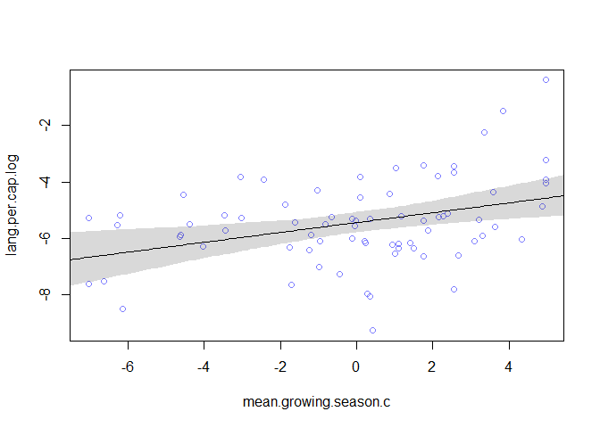
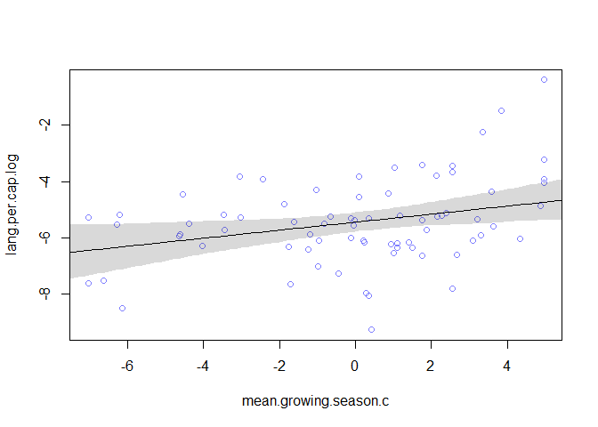
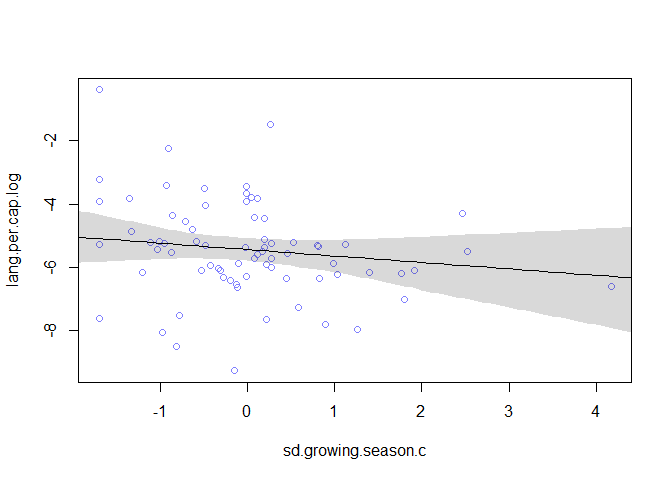
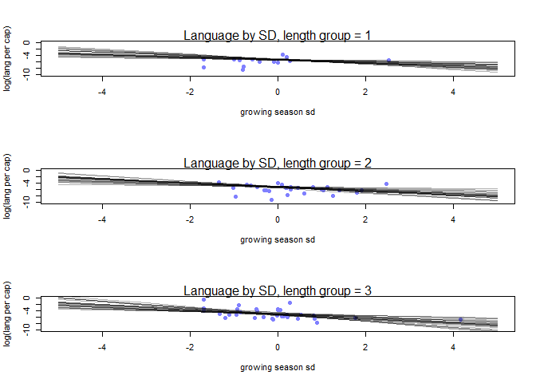

  


```r
library(tidyverse)
```

```
## -- Attaching packages ------------------------------------------------------- tidyverse 1.2.1 --
```

```
## v ggplot2 3.1.1     v purrr   0.3.2
## v tibble  2.1.3     v dplyr   0.8.1
## v tidyr   0.8.3     v stringr 1.4.0
## v readr   1.3.1     v forcats 0.4.0
```

```
## -- Conflicts ---------------------------------------------------------- tidyverse_conflicts() --
## x dplyr::filter() masks stats::filter()
## x dplyr::lag()    masks stats::lag()
```

```r
library(rethinking)
```

```
## Loading required package: rstan
```

```
## Loading required package: StanHeaders
```

```
## rstan (Version 2.18.2, GitRev: 2e1f913d3ca3)
```

```
## For execution on a local, multicore CPU with excess RAM we recommend calling
## options(mc.cores = parallel::detectCores()).
## To avoid recompilation of unchanged Stan programs, we recommend calling
## rstan_options(auto_write = TRUE)
```

```
## For improved execution time, we recommend calling
## Sys.setenv(LOCAL_CPPFLAGS = '-march=native')
## although this causes Stan to throw an error on a few processors.
```

```
## 
## Attaching package: 'rstan'
```

```
## The following object is masked from 'package:tidyr':
## 
##     extract
```

```
## Loading required package: parallel
```

```
## rethinking (Version 1.88)
```

```
## 
## Attaching package: 'rethinking'
```

```
## The following object is masked from 'package:purrr':
## 
##     map
```

### 7M1. Recall the tulips example from the chapter. Suppose another set of treatments adjusted the temperature in the greenhouse over two levels: cold and hot. The data in the chapter were collected at the cold temperature. You find none of the plants grown under the hot temperature developed any blooms at all, regardless of the water and shade levels. Can you explain this result in terms of interactions between water, shade, and temperature?

Both water and light are needed to create blooms. With more light and more water, the number of blooms increases. If there is no water or no light, no blooms will be created. Additionally this interaction between water and light is conditional on temperature where no blooms with develop under any combination of water and light conditions if the temperature is too high

### 7M2. Can you invent a regression equation that would make the bloom size zero, whenever the temperature is hot?

$$
blooms \sim (intercept + shade*water)*temperature \\
  temperature = ifelse\ temp < 25^*C,\ 1,\ 0
$$

### 7H1. Return to the data(tulips) example in the chapter. Now include the bed variable as a predictor in the interaction model. Don't interact bed with the other predictors; just include it as a main effect. Note that bed is categorical. So to use it properly, you will need to either construct dummy variables or rather an index variable, as explained in Chapter 8.


```r
data(tulips)
d <- tulips
d$blooms_std <- d$blooms / max(d$blooms)
d$water_cent <- d$water - mean(d$water)
d$shade_cent <- d$shade - mean(d$shade)
d$bed_idx <- as.numeric(d$bed)
```


```r
set.seed(537)
h2.1 <- quap(
  alist(
    blooms_std ~ dnorm( mu , sigma ) ,
    mu <- a + bw*water_cent + bs*shade_cent + bws*water_cent*shade_cent ,
    a ~ dnorm( 0.5 , 0.25 ) ,
    bw ~ dnorm( 0 , 0.25 ) ,
    bs ~ dnorm( 0 , 0.25 ) ,
    bws ~ dnorm( 0 , 0.25 ) ,
    sigma ~ dexp( 1 )
  ) ,
  data=d )
h2.2 <- quap(
  alist(
    blooms_std ~ dnorm( mu , sigma ) ,
    mu <- a[bed_idx] +  bw*water_cent + bs*shade_cent + bws*water_cent*shade_cent ,
    a[bed_idx] ~ dnorm( 0.5 , 0.25 ) ,
    bw ~ dnorm( 0 , 0.25 ) ,
    bs ~ dnorm( 0 , 0.25 ) ,
    bws ~ dnorm( 0 , 0.25 ) ,
    sigma ~ dexp( 1 )
  ) ,
  data=d )
coeftab(h2.1,h2.2)
```

```
##       h2.1    h2.2   
## a        0.36      NA
## bw       0.21    0.21
## bs      -0.11   -0.11
## bws     -0.14   -0.14
## sigma    0.12    0.11
## a[1]       NA    0.27
## a[2]       NA     0.4
## a[3]       NA    0.41
## nobs       27      27
```

```r
compare(h2.1,h2.2)
```

```
##           WAIC    pWAIC    dWAIC    weight       SE     dSE
## h2.2 -23.31259 9.801855 0.000000 0.7691807  9.89134      NA
## h2.1 -20.90521 7.181309 2.407381 0.2308193 10.99517 8.27539
```


### 7H2. Use WAIC to compare the model from 7H1 to a model that omits bed. What do you infer from this comparison? Can you reconcile the WAIC results with the posterior distribution of the bed coefficients?


```r
compare(h2.1,h2.2)
```

```
##           WAIC     pWAIC    dWAIC    weight       SE      dSE
## h2.2 -22.93010 10.027191 0.000000 0.6365903 10.08175       NA
## h2.1 -21.80891  6.733795 1.121191 0.3634097 10.58543 7.941708
```

```r
a <- extract.samples(h2.2)
par(mfrow=c(1,1))
dens(a$a[,1],col="black")
dens(a$a[,2],col="blue", add = TRUE)
dens(a$a[,3],col="red", add = TRUE)
```

<!-- -->

Including bed led to a lower WAIC and it has more weight, but the other model is well within the range of the difference. It looks like bed A had on average less blooms than beds B and C. This can also be seen in the `coeftab` table

### 7H4. The values in data(nettle) are data on language diversity in 74 nations.130 The meaning of each column is given below,  
  (1) country: Name of the country
  (2) num.lang: Number of recognized languages spoken
  (3) area: Area in square kilometers
  (4) k.pop: Population, in thousands
  (5) num.stations: Number of weather stations that provided data for the next two columns
  (6) mean.growing.season: Average length of growing season, in months
  (7) sd.growing.season: Standard deviation of length of growing season, in months
  
### Use these data to evaluate the hypothesis that language diversity is partly a product of food security. The notion is that, in productive ecologies, people don't need large social networks to buffer them against risk of food shortfalls. This means ethnic groups can be smaller and more self-sufficient, leading to more languages per capita. In contrast, in a poor ecology, there is more subsistence risk, and so human societies have adapted by building larger networks of mutual obligation to provide food insurance. This in turn creates social forces that help prevent languages from diversifying. Specifically, you will try to model the number of languages per capita as the outcome variable:


```r
data(nettle)
d <- nettle
d$lang.per.cap <- d$num.lang / d$k.pop
d$lang.per.cap.log <- log(d$lang.per.cap)
```

### Use the logarithm of this new variable as your regression outcome. (A count model would be better here, but you'll learn those later, in Chapter 11.) This problem is open ended, allowing you to decide how you address the hypotheses and the uncertain advice the modeling provides. If you think you need to use WAIC anyplace, please do. If you think you need certain priors, argue for them. If you think you need to plot predictions in a certain way, please do. Just try to honestly evaluate the main effects of both mean.growing.season and sd.growing.season, as well as their two-way interaction, as outlined in parts (a), (b), and (c) below. If you are not sure which approach to use, try several.

  (a) Evaluate the hypothesis that language diversity, as measured by log(lang.per.cap), is positively associated with the average length of the growing season, mean.growing.season. Consider log(area) in your regression(s) as a covariate (not an interaction). Interpret your results.
  

```r
d$area.log <- log(d$area)
d$area.log.c <- d$area.log - mean(d$area.log)
d$mean.growing.season.c <- d$mean.growing.season - mean(d$mean.growing.season)
d$sd.growing.season.c <- d$sd.growing.season - mean(d$sd.growing.season)
summary(d)
```

```
##        country      num.lang           area             k.pop       
##  Algeria   : 1   Min.   :  1.00   Min.   :  12189   Min.   :   102  
##  Angola    : 1   1st Qu.: 17.25   1st Qu.: 167708   1st Qu.:  3829  
##  Australia : 1   Median : 40.00   Median : 434796   Median :  9487  
##  Bangladesh: 1   Mean   : 89.73   Mean   : 880698   Mean   : 33574  
##  Benin     : 1   3rd Qu.: 93.75   3rd Qu.:1080316   3rd Qu.: 24745  
##  Bolivia   : 1   Max.   :862.00   Max.   :8511965   Max.   :849638  
##  (Other)   :68                                                      
##   num.stations    mean.growing.season sd.growing.season
##  Min.   :  1.00   Min.   : 0.000      Min.   :0.0000   
##  1st Qu.: 10.00   1st Qu.: 5.348      1st Qu.:0.9375   
##  Median : 20.50   Median : 7.355      Median :1.6900   
##  Mean   : 37.91   Mean   : 7.041      Mean   :1.6992   
##  3rd Qu.: 44.75   3rd Qu.: 9.283      3rd Qu.:2.1075   
##  Max.   :272.00   Max.   :12.000      Max.   :5.8700   
##                                                        
##   lang.per.cap       lang.per.cap.log     area.log        area.log.c      
##  Min.   :0.0000931   Min.   :-9.2814   Min.   : 9.408   Min.   :-3.52662  
##  1st Qu.:0.0019901   1st Qu.:-6.2196   1st Qu.:12.029   1st Qu.:-0.90595  
##  Median :0.0041066   Median :-5.4952   Median :12.981   Median : 0.04564  
##  Mean   :0.0206464   Mean   :-5.4566   Mean   :12.935   Mean   : 0.00000  
##  3rd Qu.:0.0100059   3rd Qu.:-4.6111   3rd Qu.:13.892   3rd Qu.: 0.95742  
##  Max.   :0.6809816   Max.   :-0.3842   Max.   :15.957   Max.   : 3.02207  
##                                                                           
##  mean.growing.season.c sd.growing.season.c
##  Min.   :-7.0415       Min.   :-1.699189  
##  1st Qu.:-1.6940       1st Qu.:-0.761689  
##  Median : 0.3135       Median :-0.009189  
##  Mean   : 0.0000       Mean   : 0.000000  
##  3rd Qu.: 2.2410       3rd Qu.: 0.408311  
##  Max.   : 4.9585       Max.   : 4.170811  
## 
```

```r
round(apply(d, 2, sd),2)
```

```
## Warning in var(if (is.vector(x) || is.factor(x)) x else as.double(x), na.rm
## = na.rm): NAs introduced by coercion
```

```
##               country              num.lang                  area 
##                    NA                144.16            1399199.16 
##                 k.pop          num.stations   mean.growing.season 
##             102226.25                 50.88                  3.14 
##     sd.growing.season          lang.per.cap      lang.per.cap.log 
##                  1.07                  0.08                  1.52 
##              area.log            area.log.c mean.growing.season.c 
##                  1.27                  1.27                  3.14 
##   sd.growing.season.c 
##                  1.07
```

```r
set.seed(678)
h4.a1 <- quap(
  alist(
    lang.per.cap.log ~ dnorm( mu , sigma ),
    mu <- a + bg*mean.growing.season.c,
    a ~ dnorm( -5 , 1 ),
    bg ~ dnorm(0,3),
    sigma ~ dunif(0,5 )
  ) ,
  data=d )
precis(h4.a1)
```

```
##             mean         sd        5.5%      94.5%
## a     -5.4446693 0.16169807 -5.70309401 -5.1862445
## bg     0.1739108 0.05246307  0.09006466  0.2577569
## sigma  1.4094273 0.11586212  1.22425725  1.5945973
```

```r
gs_seq <- seq(-8,8,.1)
mu <- link(h4.a1, data = data.frame(mean.growing.season.c = gs_seq))
mu.mean <- apply(mu, 2, mean)
mu.PI <- apply(mu, 2, PI, prob = 0.97)
plot(lang.per.cap.log ~ mean.growing.season.c, data = d, col = rangi2)
lines(gs_seq, mu.mean)
shade(mu.PI, gs_seq)
```

<!-- -->


```r
set.seed(547)
h4.a2 <- quap(
  alist(
    lang.per.cap.log ~ dnorm( mu , sigma ),
    mu <- a + bg*mean.growing.season.c + ba*area.log.c,
    a ~ dnorm( -5 , 1 ),
    bg ~ dnorm(0,3),
    ba ~ dnorm(0, 1.5),
    sigma ~ dunif(0,5 )
  ) ,
  data=d )
precis(h4.a2)
```

```
##             mean         sd        5.5%       94.5%
## a     -5.4449981 0.15945421 -5.69983667 -5.19015943
## bg     0.1440131 0.05561505  0.05512946  0.23289666
## ba    -0.2001228 0.13692046 -0.41894815  0.01870251
## sigma  1.3893576 0.11421225  1.20682435  1.57189083
```

```r
mu <- link(h4.a2, data = data.frame(mean.growing.season.c = gs_seq, area.log.c = 0))
mu.mean <- apply(mu, 2, mean)
mu.PI <- apply(mu, 2, PI, prob = 0.97)
plot(lang.per.cap.log ~ mean.growing.season.c, data = d, col = rangi2)
lines(gs_seq, mu.mean)
shade(mu.PI, gs_seq)
```

<!-- -->


```r
coeftab(h4.a1,h4.a2)
```

```
##       h4.a1   h4.a2  
## a       -5.44   -5.44
## bg       0.17    0.14
## sigma    1.41    1.39
## ba         NA    -0.2
## nobs       74      74
```

```r
compare(h4.a1,h4.a2)
```

```
##           WAIC    pWAIC      dWAIC   weight       SE      dSE
## h4.a1 267.9843 3.725100 0.00000000 0.509893 15.30355       NA
## h4.a2 268.0634 4.871461 0.07915439 0.490107 15.76746 3.762174
```

It appears that there is a positive association between growing season length and number of languages. Adding area to the model did not appear to have a significant effect.
  
  (b) Now evaluate the hypothesis that language diversity is negatively associated with the standard deviation of length of growing season, sd.growing.season. This hypothesis follows from uncertainty in harvest favoring social insurance through larger social networks and therefore fewer languages. Again, consider log(area) as a covariate (not an interaction). Interpret your results.
  

```r
set.seed(4523)
h4.b1 <- quap(
  alist(
    lang.per.cap.log ~ dnorm( mu , sigma ),
    mu <- a + bg*sd.growing.season.c,
    a ~ dnorm( -5 , 1 ),
    bg ~ dnorm(0,1),
    sigma ~ dunif(0,5 )
  ) ,
  data=d )
precis(h4.b1)
```

```
##             mean        sd       5.5%       94.5%
## a     -5.4436283 0.1675007 -5.7113267 -5.17592991
## bg    -0.3524893 0.1584254 -0.6056837 -0.09929497
## sigma  1.4614287 0.1201671  1.2693785  1.65347885
```

```r
gs_seq <- seq(-5,5,.1)
mu <- link(h4.b1, data = data.frame(sd.growing.season.c = gs_seq))
mu.mean <- apply(mu, 2, mean)
mu.PI <- apply(mu, 2, PI, prob = 0.97)
plot(lang.per.cap.log ~ sd.growing.season.c, data = d, col = rangi2)
lines(gs_seq, mu.mean)
shade(mu.PI, gs_seq)
```

<!-- -->


```r
set.seed(867)
h4.b2 <- quap(
  alist(
    lang.per.cap.log ~ dnorm( mu , sigma ),
    mu <- a + bg*sd.growing.season.c + ba*area.log.c,
    a ~ dnorm( -5 , 1 ),
    bg ~ dnorm(0,1),
    ba ~ dnorm(0, 1.5),
    sigma ~ dunif(0,5 )
  ) ,
  data=d )
precis(h4.b2)
```

```
##             mean        sd       5.5%        94.5%
## a     -5.4441881 0.1649470 -5.7078053 -5.180570908
## bg    -0.2038123 0.1830869 -0.4964205  0.088795885
## ba    -0.2402300 0.1546782 -0.4874357  0.006975576
## sigma  1.4385266 0.1182576  1.2495282  1.627525076
```

```r
mu <- link(h4.b2, data = data.frame(sd.growing.season.c = gs_seq, area.log.c = 0))
mu.mean <- apply(mu, 2, mean)
mu.PI <- apply(mu, 2, PI, prob = 0.97)
plot(lang.per.cap.log ~ sd.growing.season.c, data = d, col = rangi2)
lines(gs_seq, mu.mean)
shade(mu.PI, gs_seq)
```

<!-- -->


```r
coeftab(h4.b1,h4.b2)
```

```
##       h4.b1   h4.b2  
## a       -5.44   -5.44
## bg      -0.35   -0.20
## sigma    1.46    1.44
## ba         NA   -0.24
## nobs       74      74
```

```r
compare(h4.b1,h4.b2)
```

```
##           WAIC    pWAIC     dWAIC   weight       SE      dSE
## h4.b1 273.6344 3.989130 0.0000000 0.552047 17.09881       NA
## h4.b2 274.0523 5.485086 0.4178896 0.447953 17.05185 3.798933
```

Standard deviation of growing season length appears to be negatively associated with number of languages. Adding area did not do much to change the model. Coefficient for growing season also contains 0 in its plausibility range.
  
  (c) Finally, evaluate the hypothesis that mean.growing.season and sd.growing.season interact to synergistically reduce language diversity. The idea is that, in nations with longer average growing seasons, high variance makes storage and redistribution even more important than it would be otherwise. That way, people can cooperate to preserve and protect windfalls to be used during the droughts. These forces in turn may lead to greater social integration and fewer languages.
  

```r
set.seed(1867)
h4.c1 <- quap(
  alist(
    lang.per.cap.log ~ dnorm( mu , sigma ),
    mu <- a + bsg*sd.growing.season.c + bmg*mean.growing.season.c + bsm*mean.growing.season.c*sd.growing.season.c,
    a ~ dnorm( -5 , 1 ),
    bsg ~ dnorm(0,1),
    bmg ~ dnorm(0, 3),
    bsm ~ dnorm(0,1), 
    sigma ~ dunif(0,5 )
  ) ,
  data=d )
precis(h4.c1)
```

```
##             mean         sd        5.5%       94.5%
## a     -5.4387889 0.15022376 -5.67887544 -5.19870227
## bsg   -0.3373645 0.14254452 -0.56517820 -0.10955087
## bmg    0.1145783 0.05552482  0.02583894  0.20331771
## bsm   -0.1089040 0.04701309 -0.18403997 -0.03376796
## sigma  1.3067159 0.10742094  1.13503653  1.47839536
```


```r
coeftab(h4.a1,h4.a2,h4.b1,h4.b2,h4.c1)
```

```
##       h4.a1   h4.a2   h4.b1   h4.b2   h4.c1  
## a       -5.44   -5.44   -5.44   -5.44   -5.44
## bg       0.17    0.14   -0.35   -0.20      NA
## sigma    1.41    1.39    1.46    1.44    1.31
## ba         NA   -0.20      NA   -0.24      NA
## bsg        NA      NA      NA      NA   -0.34
## bmg        NA      NA      NA      NA    0.11
## bsm        NA      NA      NA      NA   -0.11
## nobs       74      74      74      74      74
```

```r
compare(h4.a1,h4.a2,h4.b1,h4.b2,h4.c1)
```

```
##           WAIC    pWAIC     dWAIC      weight       SE      dSE
## h4.c1 261.0288 5.677630  0.000000 0.948684479 15.78951       NA
## h4.a1 268.1791 3.844135  7.150366 0.026572932 15.54357 6.604973
## h4.a2 268.6193 5.170239  7.590486 0.021324001 16.00217 5.596487
## h4.b1 273.0978 3.700584 12.069040 0.002271763 16.93813 8.250666
## h4.b2 274.4649 5.686021 13.436157 0.001146826 17.23640 6.457345
```


```r
### Controlling for sd
d$sd_group <- cut(d$sd.growing.season.c,3, include.lowest = T, labels = F)
d$mg_group <- cut(d$mean.growing.season.c,3, include.lowest = T, labels = F)
par(mfrow=c(3,1)) # 3 plots in 1 row
for ( s in 1:3 ) {
  idx <- which( d$sd_group==s )
  plot( d$mean.growing.season.c[idx] , d$lang.per.cap.log[idx] , xlim=c(-8,8) , ylim=c(-10,0) ,
  xlab="growing season length" , ylab="log(lang per cap)" , pch=16 , col=rangi2 )
  mu <- link( h4.c1 , data=data.frame( mean.growing.season.c=-8:8, sd.growing.season.c =  s))
  for ( i in 1:25 ) lines( -8:8 , mu[i,] , col=col.alpha("black",0.3) )
  mtext(paste("Language by season length, SD group =", s))
}
```

<!-- -->


```r
### Controlling for length
par(mfrow=c(3,1)) # 3 plots in 1 row
for ( s in 1:3 ) {
  idx <- which( d$mg_group==s )
  plot( d$sd.growing.season.c[idx] , d$lang.per.cap.log[idx] , xlim=c(-5,5) , ylim=c(-10,0) ,
  xlab="growing season sd" , ylab="log(lang per cap)" , pch=16 , col=rangi2 )
  mu <- link( h4.c1 , data=data.frame( sd.growing.season.c=-5:5, mean.growing.season.c =  s))
  for ( i in 1:25 ) lines( -5:5 , mu[i,] , col=col.alpha("black",0.3) )
  mtext(paste("Language by SD, length group =", s))
}
```

<!-- -->

