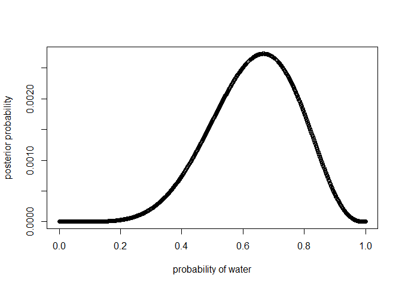
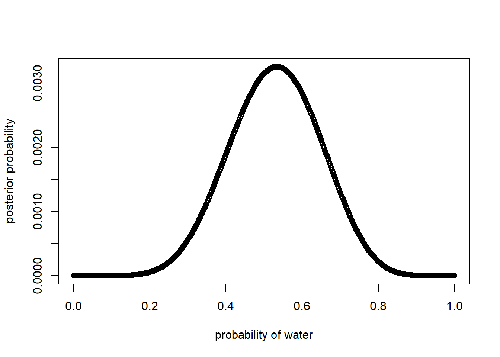
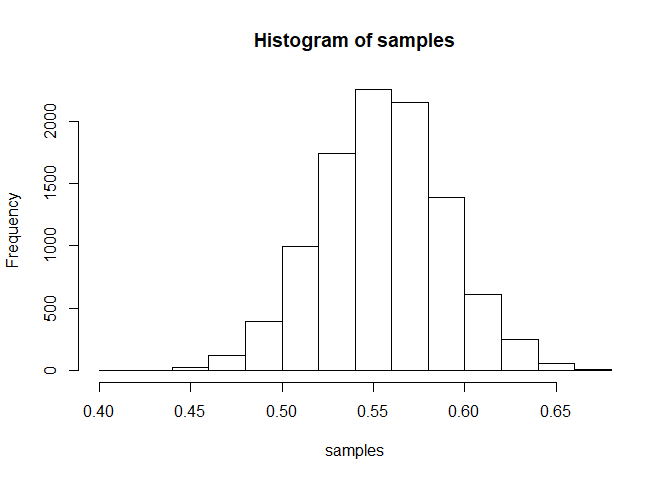
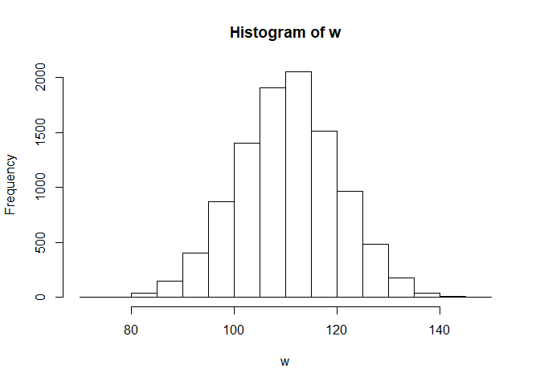
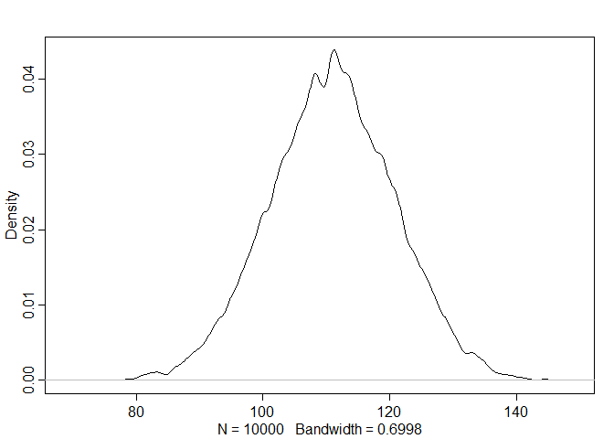
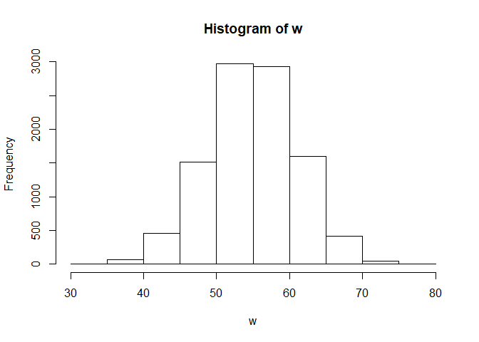
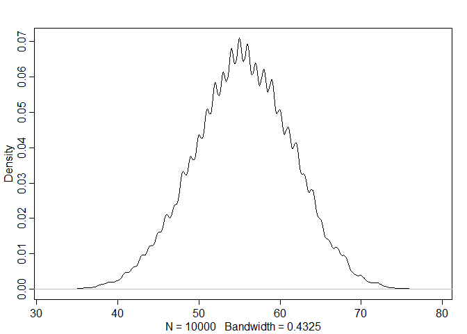
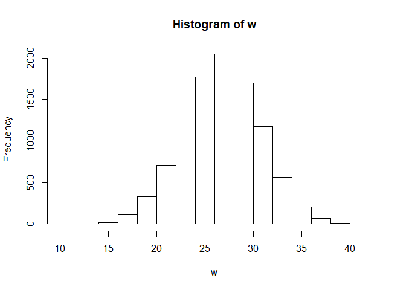
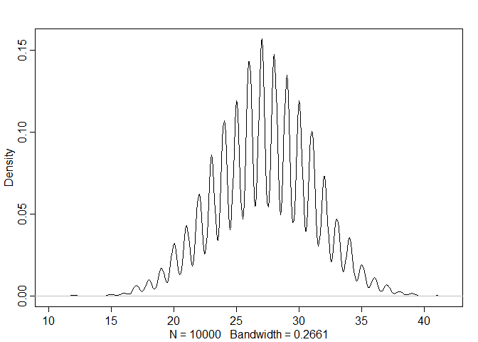

# Homework questions

## Easy


```r
library(rethinking)
```

```
## Loading required package: rstan
```

```
## Loading required package: ggplot2
```

```
## Loading required package: StanHeaders
```

```
## rstan (Version 2.18.2, GitRev: 2e1f913d3ca3)
```

```
## For execution on a local, multicore CPU with excess RAM we recommend calling
## options(mc.cores = parallel::detectCores()).
## To avoid recompilation of unchanged Stan programs, we recommend calling
## rstan_options(auto_write = TRUE)
```

```
## For improved execution time, we recommend calling
## Sys.setenv(LOCAL_CPPFLAGS = '-march=native')
## although this causes Stan to throw an error on a few processors.
```

```
## Loading required package: parallel
```

```
## rethinking (Version 1.88)
```

```r
p_grid <- seq( from=0 , to=1 , length.out=1000 )
prior <- rep( 1 , 1000 )
likelihood <- dbinom( 6 , size=9 , prob=p_grid )
posterior <- likelihood * prior
posterior <- posterior / sum(posterior)
set.seed(100)
samples <- sample( p_grid , prob=posterior , size=1e4 , replace=TRUE )
plot( p_grid , posterior , type="b" , xlab="probability of water" , ylab="posterior probability" )
```

<!-- -->

### 3E1. How much posterior probability lies below p = 0.2?

```r
# add up posterior probability where p < 0.2
sum( samples < 0.2) / 10000
```

```
## [1] 5e-04
```

### 3E2. How much posterior probability lies above p = 0.8?

```r
# add up posterior probability where p > 0.8
sum( samples > 0.8 ) / 10000
```

```
## [1] 0.1117
```

### 3E3. How much posterior probability lies between p = 0.2 and p = 0.8?

```r
# add up posterior probability where 0.2 < p < 0.8
sum( samples < 0.8 & samples > 0.2 ) / 10000
```

```
## [1] 0.8878
```

### 3E4. 20% of the posterior probability lies below which value of p?

```r
quantile( samples , 0.2 )
```

```
##       20% 
## 0.5195195
```

### 3E5. 20% of the posterior probability lies above which value of p?

```r
quantile( samples , 0.8 )
```

```
##       80% 
## 0.7567568
```

### 3E6. Which values of p contain the narrowest interval equal to 66% of the posterior probability?

```r
HPDI( samples , prob=0.66 )
```

```
##     |0.66     0.66| 
## 0.5205205 0.7847848
```

### 3E7. Which values of p contain 66% of the posterior probability, assuming equal posterior probability both below and above the interval?

```r
PI( samples , prob=0.66 )
```

```
##       17%       83% 
## 0.5005005 0.7687688
```

## Medium

### 3M1. Suppose the globe tossing data had turned out to be 8 water in 15 tosses. Construct the posterior distribution, using grid approximation. Use the same flat prior as before.

```r
p_grid <- seq( from=0 , to=1 , length.out=1000 )
prior <- rep( 1 , 1000 )
likelihood <- dbinom( 8 , size=15 , prob=p_grid )
posterior <- likelihood * prior
posterior <- posterior / sum(posterior)
plot( p_grid , posterior , type="b" , xlab="probability of water" , ylab="posterior probability" )
```

<!-- -->

### 3M2. Draw 10,000 samples from the grid approximation from above. Then use the samples to calculate the 90% HPDI for p.

```r
set.seed(100)
samples <- sample( p_grid , prob=posterior , size=1e4 , replace=TRUE )
HPDI(samples, prob = .9)
```

```
##      |0.9      0.9| 
## 0.3243243 0.7157157
```

### 3M3. Construct a posterior predictive check for this model and data. This means simulate the distribution of samples, averaging over the posterior uncertainty in p. What is the probability of observing 8 water in 15 tosses?

```r
w <- rbinom(1e4 , size= 15, prob=samples)
sum(w == 8) / 1e4
```

```
## [1] 0.1475
```

### 3M4. Using the posterior distribution constructed from the new (8/15) data, now calculate the probability of observing 6 water in 9 tosses.

```r
w <- rbinom(1e4 , size= 9, prob=samples)
sum(w == 6) / 1e4
```

```
## [1] 0.1766
```

## Hard

### Introduction

```r
library(rethinking)
data(homeworkch3)
sum(birth1) + sum(birth2)
```

```
## [1] 111
```

### 3H1. Using grid approximation, compute the posterior distribution for the probability of a birth being a boy. Assume a uniform prior probability. Which parameter value maximizes the posterior probability?

```r
p_grid <- seq( from=0 , to=1 , length.out=1000 )
prior <- rep( 1 , 1000 )
likelihood <- dbinom( 111 , size=200 , prob=p_grid )
posterior <- likelihood * prior
posterior <- posterior / sum(posterior)
plot( p_grid , posterior , type="b" , xlab="probability of boy" , ylab="posterior probability" )
```

<!-- -->

```r
p_grid[which.max(posterior)]
```

```
## [1] 0.5545546
```

### 3H2. Using the sample function, draw 10,000 random parameter values from the posterior distribution you calculated above. Use these samples to estimate the 50%, 89%, and 97% highest posterior density intervals.

```r
set.seed(100)
samples <- sample( p_grid , prob=posterior , size=1e4 , replace=TRUE )
hist(samples)
```

<!-- -->

```r
HPDI(samples, prob = 0.5)
```

```
##      |0.5      0.5| 
## 0.5315315 0.5765766
```

```r
HPDI(samples, prob = 0.89)
```

```
##     |0.89     0.89| 
## 0.4974975 0.6076076
```

```r
HPDI(samples, prob = 0.97)
```

```
##     |0.97     0.97| 
## 0.4774775 0.6276276
```

### 3H3. Use rbinom to simulate 10,000 replicates of 200 births. You should end up with 10,000 numbers, each one a count of boys out of 200 births. Compare the distribution of predicted numbers of boys to the actual count in the data (111 boys out of 200 births). There are many good ways to visualize the simulations, but the dens command (part of the rethinking package) is probably the easiest way in this case. Does it look like the model fits the data well? That is, does the distribution of predictions include the actual observation as a central, likely outcome?


```r
w <- rbinom(size = 200, n = 10000, prob = samples)
hist(w)
```

<!-- -->

```r
sum(w == 111)/10000
```

```
## [1] 0.0473
```

```r
dens(w)
```

<!-- -->

```r
mean(w)
```

```
## [1] 110.9185
```

```r
median(w)
```

```
## [1] 111
```

### 3H4. Now compare 10,000 counts of boys from 100 simulated first borns only to the number of boys in the first births, birth1. How does the model look in this light?


```r
sum(birth1)
```

```
## [1] 51
```

```r
w <- rbinom(size = 100, n = 10000, prob = samples)
hist(w)
```

<!-- -->

```r
sum(w == 51)/10000
```

```
## [1] 0.0486
```

```r
dens(w)
```

<!-- -->

```r
mean(w)
```

```
## [1] 55.4691
```

```r
median(w)
```

```
## [1] 55
```

### 3H5. The model assumes that sex of first and second births are independent. To check this assumption, focus now on second births that followed female first borns. Compare 10,000 simulated counts of boys to only those second births that followed girls. To do this correctly, you need to count the number of first borns who were girls and simulate that many births, 10,000 times. Compare the counts of boys in your simulations to the actual observed count of boys following girls. How does the model look in this light? Any guesses what is going on in these data?


```r
100 - sum(birth1)
```

```
## [1] 49
```

```r
w <- rbinom(size = 49, n = 10000, prob = samples)
hist(w)
```

<!-- -->

```r
dens(w)
```

<!-- -->

```r
mean(w)
```

```
## [1] 27.1862
```

```r
median(w)
```

```
## [1] 27
```

```r
sum(birth2[birth1 == 0])
```

```
## [1] 39
```

