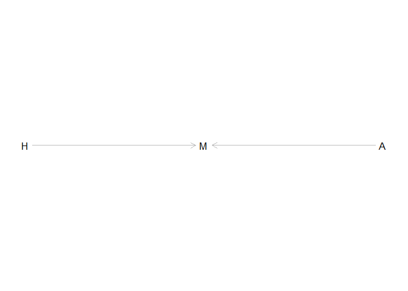
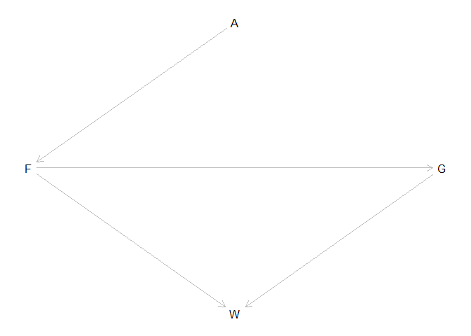
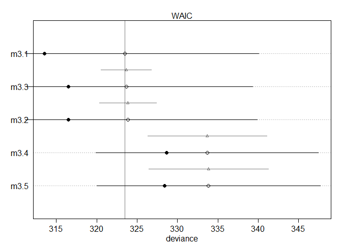
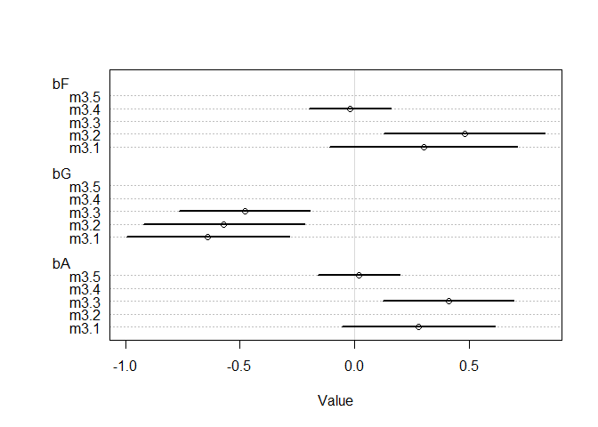

```r
library(tidyverse)
```

```
## -- Attaching packages ------------------------------------------------------- tidyverse 1.2.1 --
```

```
## v ggplot2 3.1.1     v purrr   0.3.2
## v tibble  2.1.3     v dplyr   0.8.1
## v tidyr   0.8.3     v stringr 1.4.0
## v readr   1.3.1     v forcats 0.4.0
```

```
## -- Conflicts ---------------------------------------------------------- tidyverse_conflicts() --
## x dplyr::filter() masks stats::filter()
## x dplyr::lag()    masks stats::lag()
```

```r
library(rethinking)
```

```
## Loading required package: rstan
```

```
## Loading required package: StanHeaders
```

```
## rstan (Version 2.18.2, GitRev: 2e1f913d3ca3)
```

```
## For execution on a local, multicore CPU with excess RAM we recommend calling
## options(mc.cores = parallel::detectCores()).
## To avoid recompilation of unchanged Stan programs, we recommend calling
## rstan_options(auto_write = TRUE)
```

```
## For improved execution time, we recommend calling
## Sys.setenv(LOCAL_CPPFLAGS = '-march=native')
## although this causes Stan to throw an error on a few processors.
```

```
## 
## Attaching package: 'rstan'
```

```
## The following object is masked from 'package:tidyr':
## 
##     extract
```

```
## Loading required package: parallel
```

```
## rethinking (Version 1.88)
```

```
## 
## Attaching package: 'rethinking'
```

```
## The following object is masked from 'package:purrr':
## 
##     map
```

### 1. Consider three fictional Polynesian islands. On each there is a Royal Ornithologist charged by the king with surveying the birb population. They have each found the following proportions of 5 important birb species:

||Birb A|Birb B|Birb C|Birb D|Birb E|
|---|---|---|---|---|---|
|Island 1|0.2|0.2|0.2|0.2|0.2|
|Island 2|0.8|0.1|0.05|0.025|0.025|
|Island 3|0.05|0.15|0.7|0.05|0.05|

#### Compute the entropy of each island’s birb distribution

```r
# -sum(p*log(p))
entro <- function(i) -sum(i*log(i))
dat <- data.frame(I1 = c(0.2,0.2,0.2,0.2,0.2),
                  I2 = c(0.8,0.1,0.05,0.025,0.025),
                  I3 = c(0.05,0.15,0.7,0.05,0.05)
                  )
apply(dat, 2, entro)
```

```
##        I1        I2        I3 
## 1.6094379 0.7430039 0.9836003
```

The first island has the most entropy since all its birb species are equally distributed leading to little surprise by seeing any species of birb.

#### Second, use each island’s birb distribution to predict the other two

```r
# sum( p*(log(p)-log(q)) )
Dists <- data.frame(matrix(NA, 3, 3))
KLD <- function(i,j) sum(i*(log(i)-log(j)))
for ( x in 1:3 ){
  for (y in 1:3){
    Dists[x,y] <- KLD( dat[,x], dat[,y])
  }
}
Dists
```

```
##          X1        X2        X3
## 1 0.0000000 0.9704061 0.6387604
## 2 0.8664340 0.0000000 2.0109142
## 3 0.6258376 1.8388452 0.0000000
```

```r
round(Dists,2)
```

```
##     X1   X2   X3
## 1 0.00 0.97 0.64
## 2 0.87 0.00 2.01
## 3 0.63 1.84 0.00
```

```r
round(colSums(Dists),2)
```

```
##   X1   X2   X3 
## 1.49 2.81 2.65
```

Island 1 predicts the others best because it has the least distance. This mostly is happening due to the high amount of entropy in the island

### 2. Recall the marriage, age, and happiness collider bias example from Chapter 6. Run models m6.9 and m6.10 again. Compare these two models using WAIC (or LOO, they will produce identical results). Which model is expected to make better predictions? Which model provides the correct causal inference about the influence of age on happiness? Can you explain why the answers to these two questions disagree?


```r
d <- sim_happiness( seed=1977 , N_years=1000 )
precis(d)
```

```
##                    mean        sd      5.5%     94.5%
## age        3.300000e+01 18.768883  4.000000 62.000000
## married    3.007692e-01  0.458769  0.000000  1.000000
## happiness -1.000070e-16  1.214421 -1.789474  1.789474
##                                                                                                          histogram
## age       <U+2587><U+2587><U+2587><U+2587><U+2587><U+2587><U+2587><U+2587><U+2587><U+2587><U+2587><U+2587><U+2587>
## married                           <U+2587><U+2581><U+2581><U+2581><U+2581><U+2581><U+2581><U+2581><U+2581><U+2583>
## happiness                                         <U+2587><U+2585><U+2587><U+2585><U+2585><U+2587><U+2585><U+2587>
```

```r
d2 <- d[ d$age>17 , ] # only adults
d2$A <- ( d2$age - 18 ) / ( 65 - 18 )
d2$mid <- d2$married + 1
m6.9 <- quap(
  alist(
    happiness ~ dnorm( mu , sigma ),
    mu <- a[mid] + bA*A,
    a[mid] ~ dnorm( 0 , 1 ),
    bA ~ dnorm( 0 , 2 ),
    sigma ~ dexp(1)
    ),
  data=d2 )
precis(m6.9,depth=2)
```

```
##             mean         sd       5.5%      94.5%
## a[1]  -0.2350877 0.06348986 -0.3365568 -0.1336186
## a[2]   1.2585517 0.08495989  1.1227694  1.3943340
## bA    -0.7490274 0.11320112 -0.9299447 -0.5681102
## sigma  0.9897080 0.02255800  0.9536559  1.0257600
```

```r
m6.10 <- quap(
  alist(
    happiness ~ dnorm( mu , sigma ),
    mu <- a + bA*A,
    a ~ dnorm( 0 , 1 ),
    bA ~ dnorm( 0 , 2 ),
    sigma ~ dexp(1)
    ),
  data=d2 )
precis(m6.10)
```

```
##                mean         sd       5.5%     94.5%
## a      1.649248e-07 0.07675015 -0.1226614 0.1226617
## bA    -2.728620e-07 0.13225976 -0.2113769 0.2113764
## sigma  1.213188e+00 0.02766080  1.1689803 1.2573949
```

```r
compare(m6.9,m6.10)
```

```
##           WAIC    pWAIC    dWAIC       weight       SE      dSE
## m6.9  2713.971 3.738532   0.0000 1.000000e+00 37.54465       NA
## m6.10 3101.906 2.340445 387.9347 5.768312e-85 27.74379 35.40032
```

```r
library(dagitty)
happiness_dag <- dagitty( "dag {
H -> M
A -> M
}")
impliedConditionalIndependencies( happiness_dag )
```

```
## A _||_ H
```

```r
coordinates(happiness_dag) <- list( x=c(H=0,M=1,A=2) , y=c(H=0,M=0,A=0) )
plot( happiness_dag )
```

<!-- -->

m6.9 is expected to make better predictions. m6.10 provides the correct causal inference. They disagree because m6.9 creates a collider when we condition on marrige which confounds our inference.

### 3. Reconsider the urban fox analysis from last week’s homework. Use WAIC or LOO based model comparison on five different models, each using weight as the outcome, and containing these sets of predictor variables:  
  1. avgfood + groupsize + area
  2. avgfood + groupsize
  3. groupsize + area
  4. avgfood
  5. area

### Can you explain the relative differences in WAIC scores, using the fox DAG from last week’s homework? Be sure to pay attention to the standard error of the score differences (dSE).


```r
fox_dag <- dagitty( "dag {
A -> F -> G -> W 
A -> F -> W
}")
impliedConditionalIndependencies( fox_dag )
```

```
## A _||_ G | F
## A _||_ W | F
```

```r
coordinates(fox_dag) <- list( x=c(A=1,F=0,G=2,W=1) , y=c(A=0,F=1,G=1,W=2) )
plot( fox_dag )
```

<!-- -->

```r
data(foxes)
d <- foxes
d$W <- standardize(d$weight)
d$A <- standardize(d$area)
d$F <- standardize(d$avgfood)
d$G <- standardize(d$groupsize)
head(d)
```

```
##   group avgfood groupsize area weight          W         A         F
## 1     1    0.37         2 1.09   5.02  0.4141347 -2.239596 -1.924829
## 2     1    0.37         2 1.09   2.84 -1.4270464 -2.239596 -1.924829
## 3     2    0.53         2 2.05   5.33  0.6759540 -1.205508 -1.118035
## 4     2    0.53         2 2.05   6.07  1.3009421 -1.205508 -1.118035
## 5     3    0.49         2 2.12   5.85  1.1151348 -1.130106 -1.319734
## 6     3    0.49         2 2.12   3.25 -1.0807692 -1.130106 -1.319734
##           G
## 1 -1.524089
## 2 -1.524089
## 3 -1.524089
## 4 -1.524089
## 5 -1.524089
## 6 -1.524089
```


```r
m3.1 <- quap(
  alist(
    W ~ dnorm( mu, sigma),
    mu <- a + bF*F + bG*G + bA*A,
    a ~ dnorm(0,0.2),
    c(bF,bG,bA) ~ dnorm(0,0.5),
    sigma ~ dexp(1)
  ),
  data = d)
```

```r
m3.2 <- quap(
  alist(
    W ~ dnorm( mu, sigma),
    mu <- a + bF*F + bG*G,
    a ~ dnorm(0,0.2),
    c(bF,bG) ~ dnorm(0,0.5),
    sigma ~ dexp(1)
  ),
  data = d)
```

```r
m3.3 <- quap(
  alist(
    W ~ dnorm( mu, sigma),
    mu <- a + bG*G + bA*A,
    a ~ dnorm(0,0.2),
    c(bG,bA) ~ dnorm(0,0.5),
    sigma ~ dexp(1)
  ),
  data = d)
```

```r
m3.4 <- quap(
  alist(
    W ~ dnorm( mu, sigma),
    mu <- a + bF*F,
    a ~ dnorm(0,0.2),
    bF ~ dnorm(0,0.5),
    sigma ~ dexp(1)
  ),
  data = d)
```

```r
m3.5 <- quap(
  alist(
    W ~ dnorm( mu, sigma),
    mu <- a + bA*A,
    a ~ dnorm(0,0.2),
    bA ~ dnorm(0,0.5),
    sigma ~ dexp(1)
  ),
  data = d)
```

```r
compare(m3.1,m3.2,m3.3,m3.4,m3.5)
```

```
##          WAIC    pWAIC     dWAIC      weight       SE      dSE
## m3.1 322.8847 4.656959  0.000000 0.465363694 16.27783       NA
## m3.3 323.8985 3.718565  1.013749 0.280323674 15.68240 2.899417
## m3.2 324.1284 3.859897  1.243666 0.249881396 16.13964 3.598475
## m3.4 333.4444 2.426279 10.559695 0.002370193 13.78855 7.193396
## m3.5 333.7239 2.650636 10.839215 0.002061043 13.79447 7.242069
```

```r
plot(compare(m3.1,m3.2,m3.3,m3.4,m3.5))
```

<!-- -->

```r
plot(coeftab(m3.1,m3.2,m3.3,m3.4,m3.5), pars=c("bF","bG","bA"))
```

<!-- -->

The first three models do the best and their difference in standard error is small enough that they overlap and look equal. All contain group size. The last 2 models also do similarly. Given the DAG, if you have group size you have a decent estimate of weight since both area and food are routed through it. Also in the last 2, since groupsize is removed, area has to go through food directly to weight causing the two to be similar.
