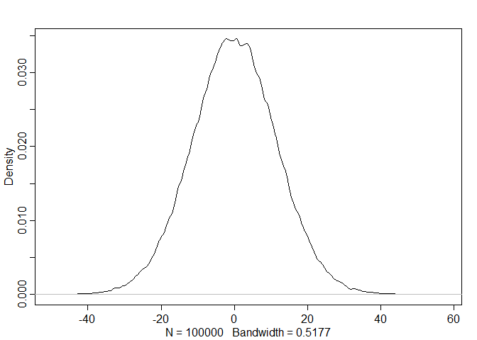

### 4E1. In the model definition below, which line is the likelihood?  
_yi ∼ Normal(µ, σ)_  
_µ ∼ Normal(0, 10)_  
_σ ∼ Uniform(0, 10)_  

**yi ∼ Normal(µ, σ)**

### 4E2. In the model definition just above, how many parameters are in the posterior distribution?

2: σ and µ

### 4E3. Using the model definition above, write down the appropriate form of Bayes’ theorem that includes the proper likelihood and priors.

Pr(µ, σ|y) = (∏iNormal(yi|µ, σ)Normal(µ|178, 20)Uniform(σ|0, 50))/(∫∫∏iNormal(yi|µ, σ)Normal(µ|178, 20)Uniform(σ|0, 50)dµdσ)

### 4E4. In the model definition below, which line is the linear model?

_yi ∼ Normal(µ, σ)_  
_µi = α + βxi_  
_α ∼ Normal(0, 10)_  
_β ∼ Normal(0, 1)_  
_σ ∼ Uniform(0, 10)_  

__µi = α + βxi__

### 4E5. In the model definition just above, how many parameters are in the posterior distribution?

3: α, β, and σ


### 4M1. For the model definition below, simulate observed heights from the prior (not the posterior).
_yi ∼ Normal(µ, σ)_  
_µ ∼ Normal(0, 10)_  
_σ ∼ Uniform(0, 10)_  


```r
library(rethinking)
```

```
## Loading required package: rstan
```

```
## Loading required package: ggplot2
```

```
## Loading required package: StanHeaders
```

```
## rstan (Version 2.18.2, GitRev: 2e1f913d3ca3)
```

```
## For execution on a local, multicore CPU with excess RAM we recommend calling
## options(mc.cores = parallel::detectCores()).
## To avoid recompilation of unchanged Stan programs, we recommend calling
## rstan_options(auto_write = TRUE)
```

```
## For improved execution time, we recommend calling
## Sys.setenv(LOCAL_CPPFLAGS = '-march=native')
## although this causes Stan to throw an error on a few processors.
```

```
## Loading required package: parallel
```

```
## rethinking (Version 1.88)
```

```r
mus <- rnorm(n = 100000, mean = 0, sd = 10)
sds <- runif(n = 100000, min = 0, max = 10)
heights <- rnorm(n = 100000, mean = mus, sd = sds)
dens(heights)
```

<!-- -->


### 4M2. Translate the model just above into a quap formula.


```r
flist <- alist(
height ~ dnorm( mu, sigma ),
mu ~ dnorm( 0, 10 ),
sigma ~ dunif( 0, 10 )
)
```

### 4M3. Translate the quap model formula below into a mathematical model definition.

```r
flist <- alist(
y ~ dnorm( mu , sigma ),
mu <- a + b*x,
a ~ dnorm( 0 , 50 ),
b ~ dunif( 0 , 10 ),
sigma ~ dunif( 0 , 50 )
)
```

yi ~ Normal(µi, σ)  
µi = α + βxi  
α ~ Normal(0,50)  
β ~ Uniform(0,10)  
σ ~ Uniform(0,50)  
