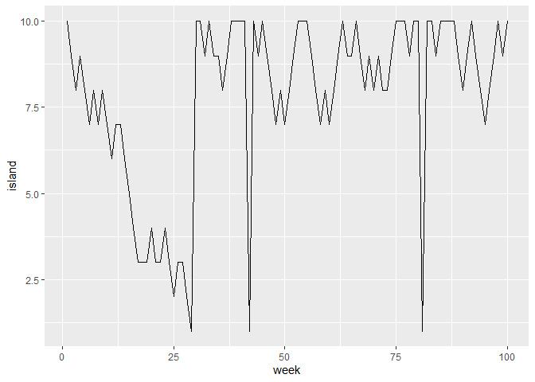
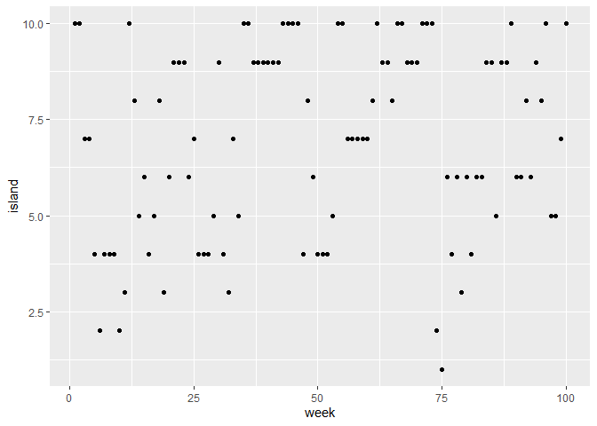
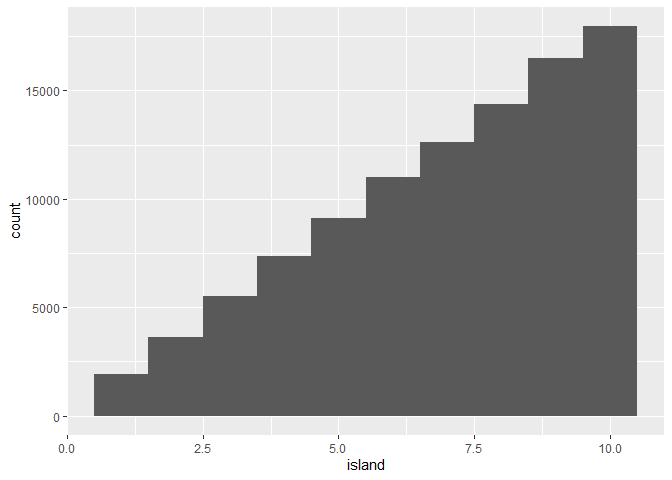
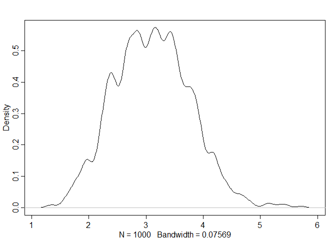

```r
library(tidyverse)
```

```
## -- Attaching packages ----------------------------------------------------------------------------------------------------------- tidyverse 1.2.1 --
```

```
## v ggplot2 3.2.1     v purrr   0.3.2
## v tibble  2.1.3     v dplyr   0.8.3
## v tidyr   0.8.3     v stringr 1.4.0
## v readr   1.3.1     v forcats 0.4.0
```

```
## -- Conflicts -------------------------------------------------------------------------------------------------------------- tidyverse_conflicts() --
## x dplyr::filter() masks stats::filter()
## x dplyr::lag()    masks stats::lag()
```

```r
library(rethinking)
```

```
## Loading required package: rstan
```

```
## Loading required package: StanHeaders
```

```
## rstan (Version 2.19.2, GitRev: 2e1f913d3ca3)
```

```
## For execution on a local, multicore CPU with excess RAM we recommend calling
## options(mc.cores = parallel::detectCores()).
## To avoid recompilation of unchanged Stan programs, we recommend calling
## rstan_options(auto_write = TRUE)
```

```
## For improved execution time, we recommend calling
## Sys.setenv(LOCAL_CPPFLAGS = '-march=native')
## although this causes Stan to throw an error on a few processors.
```

```
## 
## Attaching package: 'rstan'
```

```
## The following object is masked from 'package:tidyr':
## 
##     extract
```

```
## Loading required package: parallel
```

```
## Loading required package: dagitty
```

```
## rethinking (Version 1.90)
```

```
## 
## Attaching package: 'rethinking'
```

```
## The following object is masked from 'package:purrr':
## 
##     map
```

```r
options(mc.cores = parallel::detectCores())
rstan_options(auto_write = TRUE)
Sys.setenv(LOCAL_CPPFLAGS = '-march=native')
```

# 9 Markov Chain Monte Carlo
## 9.1. Good King Markov and His island kingdom


```r
num_weeks <- 100
positions <- rep(0,num_weeks)
current <- 10
for ( i in 1:num_weeks ) {
  # record current position
  positions[i] <- current
  # flip coin to generate proposal
  proposal <- current + sample( c(-1,1) , size=1 )
  # now make sure he loops around the archipelago
  if ( proposal < 1 ) proposal <- 10
  if ( proposal > 10 ) proposal <- 1
  # move?
  prob_move <- proposal/current
  current <- ifelse( runif(1) < prob_move , proposal , current )
}
df <- cbind.data.frame(island = positions, week = seq(1,100))
ggplot(df, aes(x=week, y=island)) +
  geom_line()
```

<!-- -->

```r
num_weeks <- 1e5
positions <- rep(0,num_weeks)
current <- 10
for ( i in 1:num_weeks ) {
  # record current position
  positions[i] <- current
  # flip coin to generate proposal
  proposal <- current + sample( c(-1,1) , size=1 )
  # now make sure he loops around the archipelago
  if ( proposal < 1 ) proposal <- 10
  if ( proposal > 10 ) proposal <- 1
  # move?
  prob_move <- proposal/current
  current <- ifelse( runif(1) < prob_move , proposal , current )
}
df <- cbind.data.frame(island = positions, week = seq(1,1e5))
ggplot(df, aes(x=island)) +
  geom_histogram()
```

```
## `stat_bin()` using `bins = 30`. Pick better value with `binwidth`.
```

<!-- -->


```r
## Any island
num_weeks <- 100
positions <- rep(0,num_weeks)
current <- 10
islands <- 1:10
for ( i in 1:num_weeks ) {
  # record current position
  positions[i] <- current
  # flip coin to generate proposal
  proposal <- sample(islands[-current], size=1 )
  # move?
  prob_move <- proposal/current
  current <- ifelse( runif(1) < prob_move , proposal , current )
}
df <- cbind.data.frame(island = positions, week = seq(1,100))
ggplot(df, aes(x=week, y=island)) +
  geom_point()
```

<!-- -->

```r
num_weeks <- 1e5
positions <- rep(0,num_weeks)
current <- 10
islands <- 1:10
for ( i in 1:num_weeks ) {
  # record current position
  positions[i] <- current
  # flip coin to generate proposal
  proposal <- sample(islands[-current], size=1 )
  # move?
  prob_move <- proposal/current
  current <- ifelse( runif(1) < prob_move , proposal , current )
}
df <- cbind.data.frame(island = positions, week = seq(1,1e5))
ggplot(df, aes(x=island)) +
  geom_histogram(bins=10)
```

<!-- -->

## 9.2. Metropolis, Gibbs, and Sadness
### 9.2.1. Gibbs sampling
### 9.2.2. High-dimensional sadness


```r
D <- 10
T <- 1e3
Y <- rmvnorm(T,rep(0,D),diag(D))
rad_dist <- function( Y ) sqrt( sum(Y^2) )
Rd <- sapply( 1:T , function(i) rad_dist( Y[i,] ) )
dens( Rd )
```

<!-- -->
