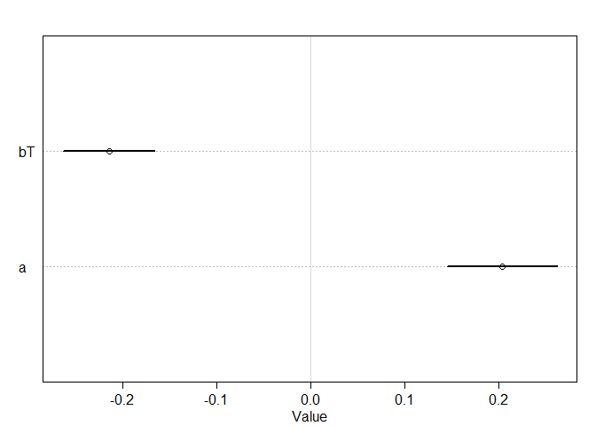
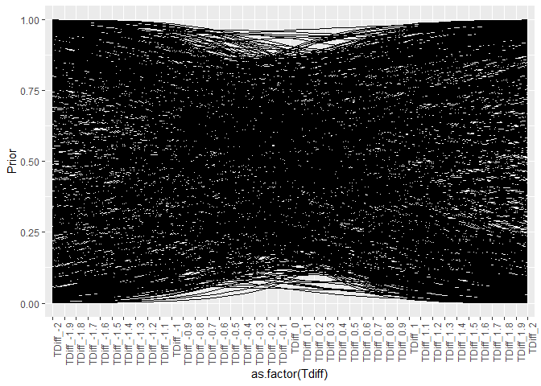
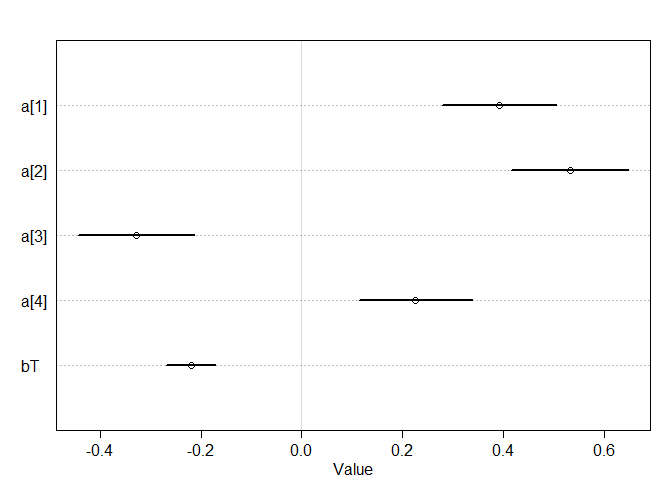
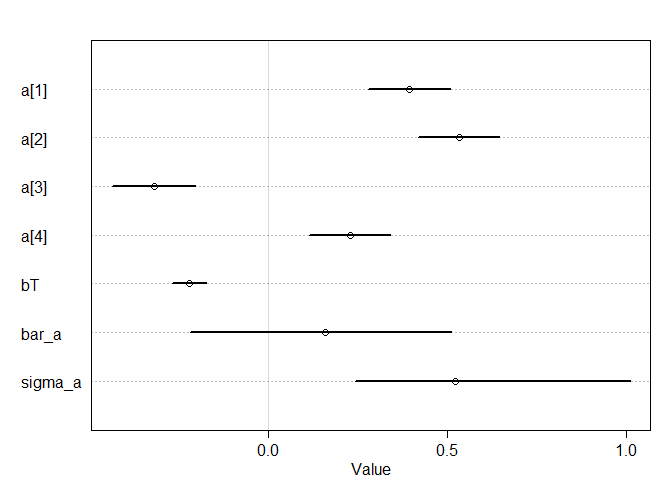
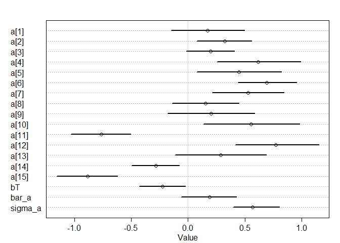
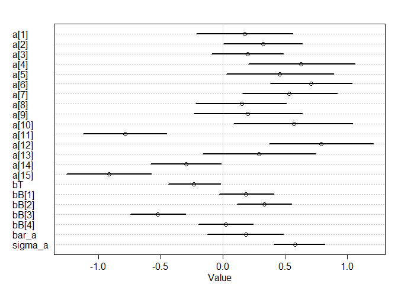

```r
library(tidyverse)
library(rethinking)
```

# Megan's Data

I've attached some data from a common garden experiment, where plants from 15 different populations were planted out (locations are shown in Figure 1 here if you're curious). One goal for the experiment was to see if temperature of origin affected performance of plants in the common garden. Here are some practice questions, very similar to Julin's from last week. The data set is big-ish. I've already sub-sampled it, but there are still 3250 observations. The models are still running quickly on my computer, but if that's not the case for you, feel free to sub-sample it further. Please let me know if you have any questions.

### 1. Fit a simple model with effects of temperature difference (temperature_diff_fall) on November germination (nov_germ). Temperature difference is already centered and scaled (i.e., negative values are the smallest temperature differences). Make sure to use the appropriate likelihood for the germination data (0 = no germ, 1  = germ).


```r
dat <- read_csv("../02_07_2020/clarkia_transplant_data.csv")
```

```
## Parsed with column specification:
## cols(
##   temperature_diff_fall = col_double(),
##   blk = col_double(),
##   nov_germ = col_double(),
##   pop = col_character(),
##   dam = col_character(),
##   sire = col_character(),
##   nov_size = col_double(),
##   mar_surv = col_double(),
##   mar_size = col_double(),
##   fruit_count = col_double(),
##   total_est_seeds = col_double(),
##   temperature_diff_annual = col_double(),
##   precip_diff_spring = col_double(),
##   first_fl_julian = col_double(),
##   last_fl_julian = col_double()
## )
```

```r
head(dat)
```

```
## # A tibble: 6 x 15
##   temperature_dif~   blk nov_germ pop   dam   sire  nov_size mar_surv mar_size
##              <dbl> <dbl>    <dbl> <chr> <chr> <chr>    <dbl>    <dbl>    <dbl>
## 1            1.19      1        0 AY    AY29  AY44        NA        0       NA
## 2            1.19      3        1 AY    AY35  AY29         5        1        2
## 3            1.67      3        0 BB    BB44  BB37        NA        0       NA
## 4            1.94      3        1 BC    BC54  BC37         1        1        6
## 5           -1.49      3        1 AR    AR37  AR46         1        0       NA
## 6            0.697     4        1 AD    AD71~ AD75~        1        0       NA
## # ... with 6 more variables: fruit_count <dbl>, total_est_seeds <dbl>,
## #   temperature_diff_annual <dbl>, precip_diff_spring <dbl>,
## #   first_fl_julian <dbl>, last_fl_julian <dbl>
```

```r
dat_list <- list(
  Germ = as.integer(dat$nov_germ),
  Tdiff = dat$temperature_diff_fall
)
  
m_1 <- ulam(
  alist(Germ ~ dbinom(1 , p) ,
        logit(p) <- a + bT*Tdiff ,
        c(a, bT) ~ dnorm(0 , 1)
        ),
  data = dat_list,
  chains = 4,
  cores = 4,
  log_lik = TRUE,
  iter=5000
)

precis(m_1, depth = 2)
```

```
##          mean         sd       5.5%      94.5%    n_eff     Rhat
## bT -0.2146113 0.03033329 -0.2639215 -0.1664504 6138.413 1.000029
## a   0.2038628 0.03638957  0.1454030  0.2620588 6334.345 1.000061
```

```r
plot(precis(m_1, depth = 2))
```

<!-- -->


2. Simulate from your priors to see if you've chosen reasonable priors, adjust them if necessary.


```r
summary(dat)
```

```
##  temperature_diff_fall      blk           nov_germ        pop           
##  Min.   :-1.5923       Min.   :1.000   Min.   :0.00   Length:3250       
##  1st Qu.:-1.0963       1st Qu.:2.000   1st Qu.:0.00   Class :character  
##  Median : 0.3377       Median :3.000   Median :1.00   Mode  :character  
##  Mean   : 0.1945       Mean   :2.505   Mean   :0.54                     
##  3rd Qu.: 1.5434       3rd Qu.:4.000   3rd Qu.:1.00                     
##  Max.   : 1.9434       Max.   :4.000   Max.   :1.00                     
##                                                                         
##      dam                sire              nov_size        mar_surv     
##  Length:3250        Length:3250        Min.   :1.000   Min.   :0.0000  
##  Class :character   Class :character   1st Qu.:3.000   1st Qu.:0.0000  
##  Mode  :character   Mode  :character   Median :3.000   Median :0.0000  
##                                        Mean   :3.176   Mean   :0.2961  
##                                        3rd Qu.:4.000   3rd Qu.:1.0000  
##                                        Max.   :5.000   Max.   :1.0000  
##                                        NA's   :2249    NA's   :582     
##     mar_size       fruit_count      total_est_seeds    temperature_diff_annual
##  Min.   : 2.000   Min.   : 0.0000   Min.   :   0.000   Min.   :-1.4734        
##  1st Qu.: 6.000   1st Qu.: 0.0000   1st Qu.:   0.000   1st Qu.:-0.5820        
##  Median : 6.000   Median : 0.0000   Median :   0.000   Median : 0.2413        
##  Mean   : 7.317   Mean   : 0.2734   Mean   :   9.064   Mean   : 0.2957        
##  3rd Qu.:10.000   3rd Qu.: 0.0000   3rd Qu.:   0.000   3rd Qu.: 1.2411        
##  Max.   :18.000   Max.   :60.0000   Max.   :1794.000   Max.   : 1.8117        
##  NA's   :2477     NA's   :631       NA's   :631                               
##  precip_diff_spring first_fl_julian last_fl_julian 
##  Min.   : 0.8207    Min.   :149.0   Min.   :155.0  
##  1st Qu.:12.0278    1st Qu.:154.0   1st Qu.:159.0  
##  Median :18.5797    Median :159.0   Median :163.0  
##  Mean   :17.6746    Mean   :159.5   Mean   :168.5  
##  3rd Qu.:23.0091    3rd Qu.:161.0   3rd Qu.:176.0  
##  Max.   :31.9469    Max.   :181.0   Max.   :216.0  
##                     NA's   :3010    NA's   :3010
```

```r
ps <- extract.prior(m_1)
```

```
## 
## SAMPLING FOR MODEL 'e0d907e3e4bcd45ca5e292b02e66a2bb' NOW (CHAIN 1).
## Chain 1: 
## Chain 1: Gradient evaluation took 0 seconds
## Chain 1: 1000 transitions using 10 leapfrog steps per transition would take 0 seconds.
## Chain 1: Adjust your expectations accordingly!
## Chain 1: 
## Chain 1: 
## Chain 1: Iteration:    1 / 2000 [  0%]  (Warmup)
## Chain 1: Iteration:  200 / 2000 [ 10%]  (Warmup)
## Chain 1: Iteration:  400 / 2000 [ 20%]  (Warmup)
## Chain 1: Iteration:  600 / 2000 [ 30%]  (Warmup)
## Chain 1: Iteration:  800 / 2000 [ 40%]  (Warmup)
## Chain 1: Iteration: 1000 / 2000 [ 50%]  (Warmup)
## Chain 1: Iteration: 1001 / 2000 [ 50%]  (Sampling)
## Chain 1: Iteration: 1200 / 2000 [ 60%]  (Sampling)
## Chain 1: Iteration: 1400 / 2000 [ 70%]  (Sampling)
## Chain 1: Iteration: 1600 / 2000 [ 80%]  (Sampling)
## Chain 1: Iteration: 1800 / 2000 [ 90%]  (Sampling)
## Chain 1: Iteration: 2000 / 2000 [100%]  (Sampling)
## Chain 1: 
## Chain 1:  Elapsed Time: 1.823 seconds (Warm-up)
## Chain 1:                1.434 seconds (Sampling)
## Chain 1:                3.257 seconds (Total)
## Chain 1:
```

```r
preds <- link(m_1,
          post = ps,
          data = list(Tdiff = seq(-2, 2, by = 0.10)))

colnames(preds) <- paste0("TDiff_",round(seq(-2, 2, by = 0.10),2))
preds <- as.data.frame(preds) %>%
  gather(key = "Tdiff", value = "Prior") %>%
  mutate(Group = rep(1:1000,41),
         Tdiff = factor(Tdiff, levels = unique(Tdiff))
  )
         

ggplot(preds, aes(x = as.factor(Tdiff), y = Prior, group = Group)) + 
  geom_line() +
  theme(axis.text.x = element_text(angle = 90, hjust = 1))
```

<!-- -->


These blocks were set up in the field, and had differences in soil depth, slope, and competitive environment. So maybe a model that includes block will describe the data better.

3. Fit a model that includes an effect of block (blk), with no pooling.


```r
dat_list <- list(
  Germ = as.integer(dat$nov_germ),
  Tdiff = dat$temperature_diff_fall,
  Block = dat$blk
)
str(dat_list)
```

```
## List of 3
##  $ Germ : int [1:3250] 0 1 0 1 1 1 1 1 1 1 ...
##  $ Tdiff: num [1:3250] 1.19 1.19 1.67 1.94 -1.49 ...
##  $ Block: num [1:3250] 1 3 3 3 3 4 3 4 1 1 ...
```

```r
m_2 <- ulam(
  alist(Germ ~ dbinom(1 , p) ,
        logit(p) <- a[Block] + bT*Tdiff,
        a[Block] ~ dnorm(0 , 0.5),
        bT ~ dnorm(0, 1)
        ),
  data = dat_list,
  chains = 4,
  cores = 4,
  log_lik = TRUE,
  iter=5000
)

precis(m_2, depth = 2)
```

```
##            mean         sd       5.5%      94.5%    n_eff      Rhat
## a[1]  0.3915904 0.07106257  0.2784158  0.5044523 14718.01 0.9999379
## a[2]  0.5335696 0.07308748  0.4156828  0.6484603 13564.32 0.9997188
## a[3] -0.3288718 0.07151492 -0.4428955 -0.2140822 16080.01 1.0001948
## a[4]  0.2256375 0.07101043  0.1142017  0.3382098 15113.23 0.9997099
## bT   -0.2201572 0.03031489 -0.2686880 -0.1710221 14754.90 0.9998759
```

```r
plot(precis(m_2, depth = 2))
```

<!-- -->


4. Fit a model that includes block, and allows partial pooling.


```r
m_3 <- ulam(
  alist(Germ ~ dbinom(1 , p) ,
        logit(p) <- a[Block] + bT*Tdiff,
        a[Block] ~ dnorm(bar_a , sigma_a),
        bT ~ dnorm(0, 1),
        bar_a ~ dnorm(0, 0.5),
        sigma_a ~ dexp(1)
        ),
  data = dat_list,
  chains = 4,
  cores = 4,
  log_lik = TRUE,
  iter=5000
)

precis(m_3, depth = 2)
```

```
##               mean         sd       5.5%      94.5%     n_eff      Rhat
## a[1]     0.3919788 0.07154061  0.2766541  0.5073275  9336.603 1.0001670
## a[2]     0.5351691 0.07369696  0.4167913  0.6516808  9438.616 1.0002222
## a[3]    -0.3184908 0.07275264 -0.4347071 -0.2037379  9339.738 0.9997434
## a[4]     0.2294914 0.06970989  0.1178035  0.3392074 10300.087 0.9996953
## bT      -0.2209753 0.03059435 -0.2700390 -0.1721651 10146.923 0.9999021
## bar_a    0.1658603 0.23621987 -0.2227302  0.5181809  5928.273 1.0003629
## sigma_a  0.5207304 0.27320632  0.2450014  1.0140401  5564.571 1.0006203
```

```r
plot(precis(m_3, depth = 2))
```

<!-- -->


The experiment included many individuals from each of the 15 populations. So, each individual is not an independent representative of a given temperature, but might be similar to other plants from that population for reasons besides temperature.

5. Build a model that accounts for this by including population (pop) and allowing partial pooling between populations A) without block, and B) with block included as in the model above. How does including population affect the temperature estimate?


```r
dat_list <- list(
  Germ = as.integer(dat$nov_germ),
  Tdiff = dat$temperature_diff_fall,
  Block = dat$blk,
  Pop = as.integer(as.factor(dat$pop))
)

m_4 <- ulam(
  alist(Germ ~ dbinom(1 , p) ,
        logit(p) <- a[Pop] + bT*Tdiff,
        a[Pop] ~ dnorm(bar_a , sigma_a),
        bT ~ dnorm(0, 1),
        bar_a ~ dnorm(0, 0.5),
        sigma_a ~ dexp(1)
        ),
  data = dat_list,
  chains = 4,
  cores = 4,
  log_lik = TRUE,
  iter=5000
)

precis(m_4, depth = 2)
```

```
##               mean        sd        5.5%       94.5%    n_eff     Rhat
## a[1]     0.1728845 0.2041974 -0.15064668  0.49555699 1520.299 1.002463
## a[2]     0.3214468 0.1511262  0.07815652  0.55999782 2652.099 1.001275
## a[3]     0.1973014 0.1307083 -0.01452649  0.40688354 7907.876 1.000397
## a[4]     0.6178616 0.2329797  0.25627813  0.98846220 1664.209 1.002041
## a[5]     0.4483902 0.2333645  0.08006066  0.82036359 1386.911 1.002449
## a[6]     0.6934456 0.1619432  0.43750386  0.95462731 3234.411 1.000679
## a[7]     0.5289515 0.2000481  0.21179844  0.84557030 1739.047 1.001858
## a[8]     0.1524845 0.1865088 -0.14155551  0.44857804 1891.766 1.001974
## a[9]     0.2037248 0.2414209 -0.17833836  0.58701535 1346.424 1.003570
## a[10]    0.5561689 0.2680494  0.13425587  0.98271176 1321.844 1.002799
## a[11]   -0.7628822 0.1638230 -1.02699272 -0.50391497 5223.257 1.001048
## a[12]    0.7723404 0.2295773  0.41564030  1.14898143 1431.780 1.002160
## a[13]    0.2881098 0.2514660 -0.11407926  0.68699650 1583.837 1.002321
## a[14]   -0.2835395 0.1305233 -0.49479081 -0.07582620 8570.544 1.000244
## a[15]   -0.8819717 0.1667828 -1.15407550 -0.61993716 3077.908 1.000607
## bT      -0.2260865 0.1276683 -0.42904134 -0.02415636 1057.225 1.003314
## bar_a    0.1878537 0.1519083 -0.05775686  0.42347366 6462.746 1.000308
## sigma_a  0.5698382 0.1317692  0.39808053  0.80145625 4945.549 1.000041
```

```r
plot(precis(m_4, depth = 2))
```

<!-- -->

```r
m_5 <- ulam(
  alist(Germ ~ dbinom(1 , p) ,
        logit(p) <- a[Pop] + bT*Tdiff + bB[Block],
        a[Pop] ~ dnorm(bar_a , sigma_a),
        bT ~ dnorm(0, 1),
        bB[Block] ~ dnorm(0, 0.25),
        bar_a ~ dnorm(0, 0.5),
        sigma_a ~ dexp(1)
        ),
  data = dat_list,
  chains = 4,
  cores = 4,
  log_lik = TRUE,
  iter=5000
)

precis(m_5, depth = 2)
```

```
##                mean        sd         5.5%       94.5%    n_eff     Rhat
## a[1]     0.17595756 0.2449929 -0.212110910  0.56249301 1437.529 1.000472
## a[2]     0.32281943 0.1983890  0.003734345  0.63637156 1878.757 1.000713
## a[3]     0.19733102 0.1813736 -0.091921818  0.48419441 1972.347 1.001129
## a[4]     0.62771221 0.2677401  0.202260647  1.05951569 1582.871 1.000917
## a[5]     0.45539309 0.2712340  0.027554234  0.88999309 1390.630 1.001055
## a[6]     0.70744699 0.2053331  0.380830804  1.03889669 1826.868 1.000504
## a[7]     0.53489156 0.2385706  0.155656183  0.91926345 1893.992 1.000529
## a[8]     0.15016653 0.2290330 -0.218899868  0.51031134 1529.431 1.000813
## a[9]     0.20155745 0.2722951 -0.233135427  0.63715190 1631.131 1.000815
## a[10]    0.56976800 0.3009639  0.086874905  1.04143117 1584.692 1.000993
## a[11]   -0.78654415 0.2104746 -1.122829510 -0.45448007 2260.505 1.000455
## a[12]    0.78801019 0.2627674  0.370397558  1.20649903 1634.341 1.000928
## a[13]    0.29109348 0.2853787 -0.161525824  0.74746361 1821.004 1.001147
## a[14]   -0.29532675 0.1800573 -0.582810836 -0.01510876 1953.634 1.001406
## a[15]   -0.91197192 0.2117587 -1.256417403 -0.57616160 2034.545 1.000953
## bT      -0.23160402 0.1313008 -0.437121550 -0.02046561 1345.631 1.001099
## bB[1]    0.18715580 0.1374879 -0.028091835  0.40705324 1449.716 1.001392
## bB[2]    0.33083561 0.1382180  0.112098678  0.55035278 1420.850 1.000977
## bB[3]   -0.52507465 0.1381290 -0.743945348 -0.30125859 1440.361 1.001394
## bB[4]    0.02394478 0.1373747 -0.195336142  0.24338640 1462.957 1.001311
## bar_a    0.18453189 0.1905655 -0.124767769  0.48649365 2169.442 1.000491
## sigma_a  0.58249510 0.1313475  0.411152965  0.81660678 4410.580 1.000144
```

```r
plot(precis(m_5, depth = 2))
```

<!-- -->


6. Compare the five models you built using WAIC. Which fits best?


```r
compare(m_1,m_2,m_3,m_4,m_5)
```

```
##         WAIC       SE     dWAIC      dSE     pWAIC       weight
## m_5 4184.873 34.01233   0.00000       NA 16.994107 1.000000e+00
## m_4 4271.140 30.04817  86.26683 17.43394 14.233812 1.850956e-19
## m_2 4355.117 24.32619 170.24436 25.70633  4.911832 1.076234e-37
## m_3 4355.251 24.28205 170.37756 25.68860  4.959969 1.006894e-37
## m_1 4436.469 16.73611 251.59571 30.12981  2.008276 2.326411e-55
```

Model 5 with pooling for population along with temperature and block effects has the lowest WAIC.

7. Plot effects of temperature difference for the average block, and also make a plot that includes the variability across blocks.

There are other complexities to this data. For example, there is also some family structure within populations (dam and sire) which could be included as hierarchical effects. There are also other response variables (November size, March survival and size, first flower date, last flower date, fruit number, estimated seed production) that might require different likelihoods (and in some cases treatment for over-dispersion or zero inflation). So if the above problems were too easy and you feel adventurous, you could try analyzing one of these responses instead of germination (you will need to filter out missing observations).
