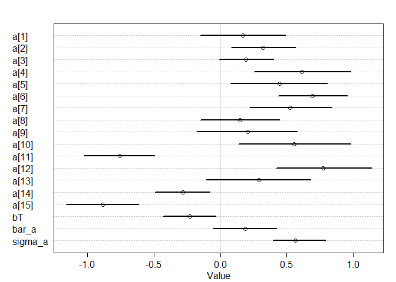

```r
library(tidyverse)
library(rethinking)
```

# Megan's Data

I've attached some data from a common garden experiment, where plants from 15 different populations were planted out (locations are shown in Figure 1 here if you're curious). One goal for the experiment was to see if temperature of origin affected performance of plants in the common garden. Here are some practice questions, very similar to Julin's from last week. The data set is big-ish. I've already sub-sampled it, but there are still 3250 observations. The models are still running quickly on my computer, but if that's not the case for you, feel free to sub-sample it further. Please let me know if you have any questions.

### 1. Fit a simple model with effects of temperature difference (temperature_diff_fall) on November germination (nov_germ). Temperature difference is already centered and scaled (i.e., negative values are the smallest temperature differences). Make sure to use the appropriate likelihood for the germination data (0 = no germ, 1  = germ).


```r
dat <- read_csv("../02_07_2020/clarkia_transplant_data.csv")
```

```
## Parsed with column specification:
## cols(
##   temperature_diff_fall = col_double(),
##   blk = col_double(),
##   nov_germ = col_double(),
##   pop = col_character(),
##   dam = col_character(),
##   sire = col_character(),
##   nov_size = col_double(),
##   mar_surv = col_double(),
##   mar_size = col_double(),
##   fruit_count = col_double(),
##   total_est_seeds = col_double(),
##   temperature_diff_annual = col_double(),
##   precip_diff_spring = col_double(),
##   first_fl_julian = col_double(),
##   last_fl_julian = col_double()
## )
```

```r
head(dat)
```

```
## # A tibble: 6 x 15
##   temperature_dif~   blk nov_germ pop   dam   sire  nov_size mar_surv mar_size
##              <dbl> <dbl>    <dbl> <chr> <chr> <chr>    <dbl>    <dbl>    <dbl>
## 1            1.19      1        0 AY    AY29  AY44        NA        0       NA
## 2            1.19      3        1 AY    AY35  AY29         5        1        2
## 3            1.67      3        0 BB    BB44  BB37        NA        0       NA
## 4            1.94      3        1 BC    BC54  BC37         1        1        6
## 5           -1.49      3        1 AR    AR37  AR46         1        0       NA
## 6            0.697     4        1 AD    AD71~ AD75~        1        0       NA
## # ... with 6 more variables: fruit_count <dbl>, total_est_seeds <dbl>,
## #   temperature_diff_annual <dbl>, precip_diff_spring <dbl>,
## #   first_fl_julian <dbl>, last_fl_julian <dbl>
```

```r
dat_list <- list(
  Germ = as.integer(dat$nov_germ),
  Tdiff = dat$temperature_diff_fall
)
  
m_1 <- ulam(
  alist(Germ ~ dbinom(1 , p) ,
        logit(p) <- a + bT*Tdiff ,
        c(a, bT) ~ dnorm(0 , 1)
        ),
  data = dat_list,
  chains = 4,
  cores = 4,
  log_lik = TRUE,
  iter=5000
)

precis(m_1, depth = 2)
```

```
##          mean         sd       5.5%      94.5%    n_eff     Rhat
## bT -0.2153853 0.03038037 -0.2637120 -0.1669212 6471.185 1.000140
## a   0.2048288 0.03623586  0.1470035  0.2635335 6144.263 1.000472
```

```r
plot(precis(m_1, depth = 2))
```

<!-- -->


2. Simulate from your priors to see if you've chosen reasonable priors, adjust them if necessary.


```r
summary(dat)
```

```
##  temperature_diff_fall      blk           nov_germ        pop           
##  Min.   :-1.5923       Min.   :1.000   Min.   :0.00   Length:3250       
##  1st Qu.:-1.0963       1st Qu.:2.000   1st Qu.:0.00   Class :character  
##  Median : 0.3377       Median :3.000   Median :1.00   Mode  :character  
##  Mean   : 0.1945       Mean   :2.505   Mean   :0.54                     
##  3rd Qu.: 1.5434       3rd Qu.:4.000   3rd Qu.:1.00                     
##  Max.   : 1.9434       Max.   :4.000   Max.   :1.00                     
##                                                                         
##      dam                sire              nov_size        mar_surv     
##  Length:3250        Length:3250        Min.   :1.000   Min.   :0.0000  
##  Class :character   Class :character   1st Qu.:3.000   1st Qu.:0.0000  
##  Mode  :character   Mode  :character   Median :3.000   Median :0.0000  
##                                        Mean   :3.176   Mean   :0.2961  
##                                        3rd Qu.:4.000   3rd Qu.:1.0000  
##                                        Max.   :5.000   Max.   :1.0000  
##                                        NA's   :2249    NA's   :582     
##     mar_size       fruit_count      total_est_seeds    temperature_diff_annual
##  Min.   : 2.000   Min.   : 0.0000   Min.   :   0.000   Min.   :-1.4734        
##  1st Qu.: 6.000   1st Qu.: 0.0000   1st Qu.:   0.000   1st Qu.:-0.5820        
##  Median : 6.000   Median : 0.0000   Median :   0.000   Median : 0.2413        
##  Mean   : 7.317   Mean   : 0.2734   Mean   :   9.064   Mean   : 0.2957        
##  3rd Qu.:10.000   3rd Qu.: 0.0000   3rd Qu.:   0.000   3rd Qu.: 1.2411        
##  Max.   :18.000   Max.   :60.0000   Max.   :1794.000   Max.   : 1.8117        
##  NA's   :2477     NA's   :631       NA's   :631                               
##  precip_diff_spring first_fl_julian last_fl_julian 
##  Min.   : 0.8207    Min.   :149.0   Min.   :155.0  
##  1st Qu.:12.0278    1st Qu.:154.0   1st Qu.:159.0  
##  Median :18.5797    Median :159.0   Median :163.0  
##  Mean   :17.6746    Mean   :159.5   Mean   :168.5  
##  3rd Qu.:23.0091    3rd Qu.:161.0   3rd Qu.:176.0  
##  Max.   :31.9469    Max.   :181.0   Max.   :216.0  
##                     NA's   :3010    NA's   :3010
```

```r
ps <- extract.prior(m_1)
```

```
## 
## SAMPLING FOR MODEL 'e0d907e3e4bcd45ca5e292b02e66a2bb' NOW (CHAIN 1).
## Chain 1: 
## Chain 1: Gradient evaluation took 0 seconds
## Chain 1: 1000 transitions using 10 leapfrog steps per transition would take 0 seconds.
## Chain 1: Adjust your expectations accordingly!
## Chain 1: 
## Chain 1: 
## Chain 1: Iteration:    1 / 2000 [  0%]  (Warmup)
## Chain 1: Iteration:  200 / 2000 [ 10%]  (Warmup)
## Chain 1: Iteration:  400 / 2000 [ 20%]  (Warmup)
## Chain 1: Iteration:  600 / 2000 [ 30%]  (Warmup)
## Chain 1: Iteration:  800 / 2000 [ 40%]  (Warmup)
## Chain 1: Iteration: 1000 / 2000 [ 50%]  (Warmup)
## Chain 1: Iteration: 1001 / 2000 [ 50%]  (Sampling)
## Chain 1: Iteration: 1200 / 2000 [ 60%]  (Sampling)
## Chain 1: Iteration: 1400 / 2000 [ 70%]  (Sampling)
## Chain 1: Iteration: 1600 / 2000 [ 80%]  (Sampling)
## Chain 1: Iteration: 1800 / 2000 [ 90%]  (Sampling)
## Chain 1: Iteration: 2000 / 2000 [100%]  (Sampling)
## Chain 1: 
## Chain 1:  Elapsed Time: 1.524 seconds (Warm-up)
## Chain 1:                1.388 seconds (Sampling)
## Chain 1:                2.912 seconds (Total)
## Chain 1:
```

```r
preds <- link(m_1,
          post = ps,
          data = list(Tdiff = seq(-2, 2, by = 0.10)))

colnames(preds) <- paste0("TDiff_",round(seq(-2, 2, by = 0.10),2))
preds <- as.data.frame(preds) %>%
  gather(key = "Tdiff", value = "Prior") %>%
  mutate(Group = rep(1:1000,41),
         Tdiff = factor(Tdiff, levels = unique(Tdiff))
  )
         

ggplot(preds, aes(x = as.factor(Tdiff), y = Prior, group = Group)) + 
  geom_line() +
  theme(axis.text.x = element_text(angle = 90, hjust = 1))
```

<!-- -->


These blocks were set up in the field, and had differences in soil depth, slope, and competitive environment. So maybe a model that includes block will describe the data better.

3. Fit a model that includes an effect of block (blk), with no pooling.


```r
dat_list <- list(
  Germ = as.integer(dat$nov_germ),
  Tdiff = dat$temperature_diff_fall,
  Block = dat$blk
)
str(dat_list)
```

```
## List of 3
##  $ Germ : int [1:3250] 0 1 0 1 1 1 1 1 1 1 ...
##  $ Tdiff: num [1:3250] 1.19 1.19 1.67 1.94 -1.49 ...
##  $ Block: num [1:3250] 1 3 3 3 3 4 3 4 1 1 ...
```

```r
m_2 <- ulam(
  alist(Germ ~ dbinom(1 , p) ,
        logit(p) <- a[Block] + bT*Tdiff,
        a[Block] ~ dnorm(0 , 0.5),
        bT ~ dnorm(0, 1)
        ),
  data = dat_list,
  chains = 4,
  cores = 4,
  log_lik = TRUE,
  iter=5000
)

precis(m_2, depth = 2)
```

```
##            mean         sd       5.5%      94.5%    n_eff      Rhat
## a[1]  0.3901953 0.07088853  0.2794023  0.5033270 13726.65 0.9997513
## a[2]  0.5348127 0.07305628  0.4183076  0.6512735 14012.23 0.9999304
## a[3] -0.3283390 0.07170915 -0.4421890 -0.2136954 16901.54 0.9998871
## a[4]  0.2270008 0.07010633  0.1150281  0.3404715 14632.41 0.9996650
## bT   -0.2208564 0.02973282 -0.2676947 -0.1732015 13161.47 1.0003876
```

```r
plot(precis(m_2, depth = 2))
```

<!-- -->


4. Fit a model that includes block, and allows partial pooling.


```r
m_3 <- ulam(
  alist(Germ ~ dbinom(1 , p) ,
        logit(p) <- a[Block] + bT*Tdiff,
        a[Block] ~ dnorm(bar_a , sigma_a),
        bT ~ dnorm(0, 1),
        bar_a ~ dnorm(0, 0.5),
        sigma_a ~ dexp(1)
        ),
  data = dat_list,
  chains = 4,
  cores = 4,
  log_lik = TRUE,
  iter=5000
)

precis(m_3, depth = 2)
```

```
##               mean         sd       5.5%      94.5%     n_eff      Rhat
## a[1]     0.3927980 0.07230355  0.2783651  0.5073145 11022.727 0.9998762
## a[2]     0.5341261 0.07134681  0.4186205  0.6465732 10221.179 0.9998970
## a[3]    -0.3202730 0.07284894 -0.4371470 -0.2050423 11027.438 0.9998304
## a[4]     0.2287736 0.07086549  0.1147863  0.3412186 10386.821 0.9996964
## bT      -0.2214396 0.03025490 -0.2703753 -0.1730414  9736.625 1.0005371
## bar_a    0.1595653 0.23461228 -0.2199748  0.5109892  6520.692 1.0010655
## sigma_a  0.5226005 0.27449815  0.2439877  1.0109448  5297.439 1.0012659
```

```r
plot(precis(m_3, depth = 2))
```

<!-- -->


The experiment included many individuals from each of the 15 populations. So, each individual is not an independent representative of a given temperature, but might be similar to other plants from that population for reasons besides temperature.

5. Build a model that accounts for this by including population (pop) and allowing partial pooling between populations A) without block, and B) with block included as in the model above. How does including population affect the temperature estimate?


```r
dat_list <- list(
  Germ = as.integer(dat$nov_germ),
  Tdiff = dat$temperature_diff_fall,
  Block = dat$blk,
  Pop = as.integer(as.factor(dat$pop))
)

m_4 <- ulam(
  alist(Germ ~ dbinom(1 , p) ,
        logit(p) <- a[Pop] + bT*Tdiff,
        a[Pop] ~ dnorm(bar_a , sigma_a),
        bT ~ dnorm(0, 1),
        bar_a ~ dnorm(0, 0.5),
        sigma_a ~ dexp(1)
        ),
  data = dat_list,
  chains = 4,
  cores = 4,
  log_lik = TRUE,
  iter=5000
)

precis(m_4, depth = 2)
```

```
##               mean        sd         5.5%       94.5%    n_eff      Rhat
## a[1]     0.1725402 0.2011184 -0.149400447  0.49143599 1953.189 1.0008961
## a[2]     0.3215489 0.1512381  0.080618154  0.56525507 2930.434 1.0007588
## a[3]     0.1943103 0.1279826 -0.007531375  0.39973407 7696.281 0.9996913
## a[4]     0.6149545 0.2305802  0.254059369  0.98342309 1591.666 1.0012722
## a[5]     0.4449646 0.2315829  0.075172539  0.80492263 1537.193 1.0015822
## a[6]     0.6912745 0.1610119  0.435652838  0.95359034 3206.940 1.0009846
## a[7]     0.5265620 0.1970918  0.218208081  0.84012626 1893.991 1.0007140
## a[8]     0.1482214 0.1876573 -0.149283997  0.44695089 1956.881 1.0018422
## a[9]     0.2038056 0.2375792 -0.177858369  0.57948192 1436.780 1.0016231
## a[10]    0.5580569 0.2661946  0.141227390  0.98103354 1381.862 1.0015376
## a[11]   -0.7573152 0.1656019 -1.024310802 -0.49521935 5803.888 1.0004503
## a[12]    0.7730755 0.2254898  0.422817663  1.13491324 1344.445 1.0016975
## a[13]    0.2894381 0.2482248 -0.107725788  0.68069702 1859.354 1.0006978
## a[14]   -0.2834586 0.1305931 -0.491822408 -0.07760710 7170.766 1.0004427
## a[15]   -0.8848888 0.1706854 -1.159166239 -0.61490396 3627.726 1.0001258
## bT      -0.2272427 0.1256989 -0.428496985 -0.03155232 1037.004 1.0021521
## bar_a    0.1863016 0.1491359 -0.057063718  0.42237760 6002.922 1.0001717
## sigma_a  0.5651374 0.1282264  0.397115544  0.79075460 4388.458 1.0009193
```

```r
plot(precis(m_4, depth = 2))
```

<!-- -->

```r
m_5 <- ulam(
  alist(Germ ~ dbinom(1 , p) ,
        logit(p) <- a[Pop] + bT*Tdiff + bB[Block],
        a[Pop] ~ dnorm(bar_a , sigma_a),
        bT ~ dnorm(0, 1),
        bB[Block] ~ dnorm(0, 0.25),
        bar_a ~ dnorm(0, 0.5),
        sigma_a ~ dexp(1)
        ),
  data = dat_list,
  chains = 4,
  cores = 4,
  log_lik = TRUE,
  iter=5000
)

precis(m_5, depth = 2)
```

```
##                mean        sd         5.5%       94.5%    n_eff      Rhat
## a[1]     0.17491848 0.2533734 -0.227961881  0.58091825 1454.707 1.0022310
## a[2]     0.31263177 0.1981415 -0.000654244  0.62716155 1764.718 1.0001027
## a[3]     0.19215097 0.1765593 -0.082782076  0.47290589 2068.099 0.9999672
## a[4]     0.62888527 0.2784142  0.188204502  1.07425939 1540.980 1.0019272
## a[5]     0.45541556 0.2788243  0.009620578  0.89353487 1366.513 1.0021224
## a[6]     0.70247708 0.2078294  0.378345342  1.03725123 1929.690 1.0009867
## a[7]     0.52282220 0.2349997  0.149103024  0.89749167 1655.386 1.0003574
## a[8]     0.14970077 0.2311784 -0.219134201  0.51585310 1570.465 1.0019433
## a[9]     0.18575235 0.2775279 -0.256520904  0.62591518 1466.558 1.0009172
## a[10]    0.55267910 0.3049991  0.068425737  1.03023476 1462.342 1.0012333
## a[11]   -0.79380655 0.2082802 -1.124929415 -0.46577011 2257.875 1.0000123
## a[12]    0.77330936 0.2661458  0.350517832  1.19212271 1528.128 1.0008047
## a[13]    0.27431862 0.2877964 -0.184088927  0.72515896 1763.562 1.0005853
## a[14]   -0.30138944 0.1794053 -0.584308463 -0.01535830 1899.482 1.0003195
## a[15]   -0.92166802 0.2088539 -1.257923069 -0.58735336 1996.258 0.9999753
## bT      -0.22721659 0.1366187 -0.443859903 -0.01539438 1297.853 1.0023251
## bB[1]    0.19413623 0.1365477 -0.024585510  0.41137686 1327.511 1.0001442
## bB[2]    0.33671431 0.1362411  0.117885003  0.55278873 1409.123 0.9999690
## bB[3]   -0.51879320 0.1359162 -0.736404524 -0.30273663 1309.664 1.0004557
## bB[4]    0.03064819 0.1354930 -0.182967770  0.24401597 1421.301 1.0001143
## bar_a    0.17798430 0.1891215 -0.127690459  0.47148204 2002.198 0.9999038
## sigma_a  0.58386503 0.1308374  0.409151752  0.81619628 4051.994 0.9999879
```

```r
plot(precis(m_5, depth = 2))
```

<!-- -->


6. Compare the five models you built using WAIC. Which fits best?


```r
compare(m_1,m_2,m_3,m_4,m_5)
```

```
##         WAIC       SE     dWAIC      dSE     pWAIC       weight
## m_5 4184.697 34.00544   0.00000       NA 16.896503 1.000000e+00
## m_4 4270.978 30.01037  86.28139 17.43307 14.134363 1.837533e-19
## m_2 4354.993 24.35314 170.29649 25.68433  4.851426 1.048544e-37
## m_3 4355.184 24.30615 170.48730 25.66926  4.931543 9.531335e-38
## m_1 4436.486 16.80227 251.78897 30.11343  2.018498 2.112131e-55
```

Model 5 with pooling for population along with temperature and block effects has the lowest WAIC.

7. Plot effects of temperature difference for the average block, and also make a plot that includes the variability across blocks.


```r
### Average block
post <- extract.samples(m_5)
str(post)
```

```
## List of 5
##  $ a      : num [1:10000, 1:15] 0.2497 0.3153 0.5053 -0.0183 0.2903 ...
##  $ bT     : num [1:10000(1d)] -0.0552 -0.364 -0.1389 -0.2803 -0.3285 ...
##  $ bB     : num [1:10000, 1:4] 0.201 -0.032 0.163 0.205 0.121 ...
##  $ bar_a  : num [1:10000(1d)] -0.243 0.478 0.242 0.155 0.297 ...
##  $ sigma_a: num [1:10000(1d)] 0.743 0.568 0.634 0.58 0.864 ...
##  - attr(*, "source")= chr "ulam posterior: 10000 samples from m_5"
```

```r
link_bar_a <- function(Tdiff){
  pred <- with(post, inv_logit(bar_a + bT*Tdiff))
  return(pred)
}

raw <- sapply( seq(-2,2,0.1) , function(i) link_bar_a( i ) )
mu <- apply( raw , 2 , mean )
ci <- apply( raw , 2 , PI )

plot( NULL , xlab="Temperature Difference" , ylab="Proportion Germinated", ylim=c(0,1), xlim=c(-2,2) )
lines( seq(-2,2,0.1) , mu )
shade( ci , seq(-2,2,0.1) )
```

<!-- -->

```r
### variability across blocks

a_sim <- with( post , rnorm( length(post$bar_a) , bar_a , sigma_a ) )
#a_sim <- cbind(a_sim, Block = sample(1:4, length(a_sim), replace = T))
link_asim <- function( Tdiff, Block ) {
  pred <- with( post , inv_logit(a_sim + bT*Tdiff + bB[,Block]))
  return(pred)
}

par(mfrow = c(2,2))
temp_range <- seq(-2,2,0.1)

for(i in 1:4){
  raw <- mapply(function(Tdiff,Block) link_asim(Tdiff,Block), temp_range, i)
  mu <- apply( raw , 2 , mean )
  ci <- apply( raw , 2 , PI )
  
  plot( NULL , xlab="Temperature Difference" , ylab="Proportion Germinated", ylim=c(0,1), xlim=c(-2,2), main = paste("Block: ",i))
  lines(temp_range, mu)
  shade(ci, temp_range)
}
```

<!-- -->
