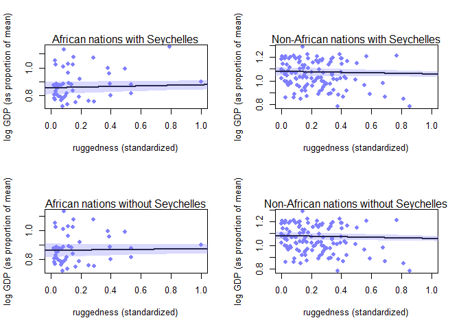

```r
library(tidyverse)
```

```
## -- Attaching packages ------------------------------------------------------- tidyverse 1.2.1 --
```

```
## v ggplot2 3.1.1     v purrr   0.3.2
## v tibble  2.1.3     v dplyr   0.8.1
## v tidyr   0.8.3     v stringr 1.4.0
## v readr   1.3.1     v forcats 0.4.0
```

```
## -- Conflicts ---------------------------------------------------------- tidyverse_conflicts() --
## x dplyr::filter() masks stats::filter()
## x dplyr::lag()    masks stats::lag()
```

```r
library(rethinking)
```

```
## Loading required package: rstan
```

```
## Loading required package: StanHeaders
```

```
## rstan (Version 2.18.2, GitRev: 2e1f913d3ca3)
```

```
## For execution on a local, multicore CPU with excess RAM we recommend calling
## options(mc.cores = parallel::detectCores()).
## To avoid recompilation of unchanged Stan programs, we recommend calling
## rstan_options(auto_write = TRUE)
```

```
## For improved execution time, we recommend calling
## Sys.setenv(LOCAL_CPPFLAGS = '-march=native')
## although this causes Stan to throw an error on a few processors.
```

```
## 
## Attaching package: 'rstan'
```

```
## The following object is masked from 'package:tidyr':
## 
##     extract
```

```
## Loading required package: parallel
```

```
## rethinking (Version 1.88)
```

```
## 
## Attaching package: 'rethinking'
```

```
## The following object is masked from 'package:purrr':
## 
##     map
```

## 7E1. For each of the causal relationships below, name a hypothetical third variable that would lead to an interaction effect.

  1. Bread dough rises because of yeast.
  
  The amount of moisture in the dough. Yeast need water, too little and bread will not rise and too much and it will not rise
  
  2. Education leads to higher income
  
  The field of study. There is a large variance in income based on field of study 
  
  3. Gasoline makes a car go
  
  The transmission, bad transmission, car no go.
  Spark plugs, spark plugs make gas go boom and boom makes car go. No spark plug no boom
  
  
## 7M3. In parts of North America, ravens depend upon wolves for their food. This is because ravens are carnivorous but cannot usually kill or open carcasses of prey. Wolves however can and do kill and tear open animals, and they tolerate ravens co-feeding at their kills. This species relationship is generally described as a “species interaction.” Can you invent a hypothetical set of data on raven population size in which this relationship would manifest as a statistical interaction? Do you think the biological interaction could be linear? Why or why not?

ravens is the size raven population  
i is a population of ravens  
W is the number of wolves  
A is the area of the wolve territory  
$$
ravens_i \sim Normal(\mu_i,\sigma) \\
\mu_i = \alpha + \beta_WW_i + \beta_AA_I + \beta_{WA}W_iA_i
$$
I believe this relationship could be linear up to a certain point. Each wolf requires a certain amount of area and each wolve provides food for a certain number of ravens. Too small of area leads to less wolves which leads to less kills which leads to less food for ravens. Too many wolves leads to less food for ravens. Wolves also hunt in packs and are territorial which will also probably affect number of ravens each pack can feed based on pack size and territory.


## 7H3. Consider again the data(rugged) data on economic development and terrain ruggedness, examined in this chapter. One of the African countries in that example, Seychelles, is far outside the cloud of other nations, being a rare country with both relatively high GDP and high ruggedness. Seychelles is also unusual, in that it is a group of islands far from the coast of mainland Africa, and its main economic activity is tourism.

## One might suspect that this one nation is exerting a strong influence on the conclusions. In this problem, I want you to drop Seychelles from the data and re-evaluate the hypothesis that the relationship of African economies with ruggedness is different from that on other continents.

  a. Begin by using map to fit just the interaction model:
  
  $$
  y_i \sim Normal(\mu_i, \sigma) \\
  u_i = \alpha + \beta_AA_i + \beta_RR_i + \beta_{AR}A_iR_i
  $$
  I don't like this format, he talks against it in the book. This section must not be updated.

## where y is log GDP per capita in the year 2000 (log of rgdppc_2000); A is cont_africa, the dummy variable for being an African nation; and R is the variable rugged. Choose your own priors. Compare the inference from this model fit to the data without Seychelles to the same model fit to the full data. Does it still seem like the effect of ruggedness depends upon continent? How much has the expected relationship changed?


```r
data(rugged)
rugged$log_gdp <- log(rugged$rgdppc_2000)
dd <- rugged[ complete.cases(rugged$rgdppc_2000), ]
dd$log_gdp_std <- dd$log_gdp / mean(dd$log_gdp)
dd$rugged_std <- dd$rugged / max(dd$rugged)
dd$cid <- ifelse( dd$cont_africa==1 , 1 , 2 )
dd.small <- dd %>% filter(country != "Seychelles")
rugged_seq <- seq( from=-0.1 , to=1.1 , length.out=30 )
dd.A1 <- dd[ dd$cont_africa==1 , ] # Africa
dd.A0 <- dd[ dd$cont_africa==0 , ] # not Africa
dd.small.A1 <- dd.small[ dd.small$cont_africa==1 , ] # Africa
dd.small.A0 <- dd.small[ dd.small$cont_africa==0 , ] # not Africa
```


```r
H3A <- quap(
  alist(
    log_gdp_std ~ dnorm( mu , sigma ) ,
    mu <- a + bA*cont_africa + bR*rugged + bAR*cont_africa*rugged ,
    a ~ dnorm( 1 , 0.1 ),
    bA ~ dnorm(0, 1),
    bR ~ dnorm( 0 , 0.3 ),
    bAR ~ dnorm(0,1),
    sigma ~ dexp( 1 )
    ) ,
  data=dd )

H3B <- quap(
  alist(
    log_gdp_std ~ dnorm( mu , sigma ) ,
    mu <- a + bA*cont_africa + bR*rugged + bAR*cont_africa*rugged ,
    a ~ dnorm( 1 , 0.1 ),
    bA ~ dnorm(0, 1),
    bR ~ dnorm( 0 , 0.3 ),
    bAR ~ dnorm(0,1),
    sigma ~ dexp( 1 )
    ) ,
  data=dd.small)
```


```r
precis(H3A, depth = 2)
```

```
##              mean          sd        5.5%        94.5%
## a      1.08064977 0.015984973  1.05510270  1.106196846
## bA    -0.22628587 0.026220319 -0.26819100 -0.184380735
## bR    -0.02281759 0.008900915 -0.03704297 -0.008592204
## bAR    0.04511428 0.015220079  0.02078965  0.069438903
## sigma  0.10947779 0.005932857  0.09999594  0.118959642
```

```r
precis(H3B, depth = 2)
```

```
##              mean          sd         5.5%        94.5%
## a      1.08073060 0.015863839  1.055377123  1.106084079
## bA    -0.21874839 0.026323667 -0.260818693 -0.176678086
## bR    -0.02285823 0.008832823 -0.036974787 -0.008741673
## bAR    0.03394558 0.016191976  0.008067676  0.059823486
## sigma  0.10862655 0.005904666  0.099189754  0.118063347
```


Relationship is weaker, but effect of ruggedness does depend on continent

  b. Now plot the predictions of the interaction model, with and without Seychelles. Does it still seem like the effect of ruggedness depends upon continent? How much has the expected relationship changed?


```r
par(mfrow=c(2,2))
plot( dd.A1$rugged_std , dd.A1$log_gdp_std , pch=16 , col=rangi2 ,
      xlab="ruggedness (standardized)" , ylab="log GDP (as proportion of mean)" ,
      xlim=c(0,1) )
mu <- link( H3A , data=data.frame( cont_africa=1 , rugged=rugged_seq ) )
mu_mean <- apply( mu , 2 , mean )
mu_ci <- apply( mu , 2 , PI , prob=0.97 )
lines( rugged_seq , mu_mean , lwd=2 )
shade( mu_ci , rugged_seq , col=col.alpha(rangi2,0.3) )
mtext("African nations with Seychelles")

plot( dd.A0$rugged_std , dd.A0$log_gdp_std , pch=16 , col=rangi2 ,
      xlab="ruggedness (standardized)" , ylab="log GDP (as proportion of mean)" ,
      xlim=c(0,1) )
mu <- link( H3A , data=data.frame( cont_africa=0 , rugged=rugged_seq ) )
mu_mean <- apply( mu , 2 , mean )
mu_ci <- apply( mu , 2 , PI , prob=0.97 )
lines( rugged_seq , mu_mean , lwd=2 )
shade( mu_ci , rugged_seq , col=col.alpha(rangi2,0.3) )
mtext("Non-African nations with Seychelles")

plot( dd.small.A1$rugged_std , dd.small.A1$log_gdp_std , pch=16 , col=rangi2 ,
      xlab="ruggedness (standardized)" , ylab="log GDP (as proportion of mean)" ,
      xlim=c(0,1) )
mu <- link( H3A , data=data.frame( cont_africa=1 , rugged=rugged_seq ) )
mu_mean <- apply( mu , 2 , mean )
mu_ci <- apply( mu , 2 , PI , prob=0.97 )
lines( rugged_seq , mu_mean , lwd=2 )
shade( mu_ci , rugged_seq , col=col.alpha(rangi2,0.3) )
mtext("African nations without Seychelles")

plot( dd.A0$rugged_std , dd.A0$log_gdp_std , pch=16 , col=rangi2 ,
      xlab="ruggedness (standardized)" , ylab="log GDP (as proportion of mean)" ,
      xlim=c(0,1) )
mu <- link( H3A , data=data.frame( cont_africa=0 , rugged=rugged_seq ) )
mu_mean <- apply( mu , 2 , mean )
mu_ci <- apply( mu , 2 , PI , prob=0.97 )
lines( rugged_seq , mu_mean , lwd=2 )
shade( mu_ci , rugged_seq , col=col.alpha(rangi2,0.3) )
mtext("Non-African nations without Seychelles")
```

<!-- -->

Does not look like Seychelles affected much
  
  c.  Finally, conduct a model comparison analysis, using WAIC. Fit three models to the data without Seychelles:
  
  $$
  Model\ 1: y_i \sim Normal(mu_i,\sigma) \\
  \mu_i = \alpha + \beta_rR_i
  $$
  
  $$
  Model\ 2: y_i \sim Normal(\mu_i,\sigma) \\
  \mu_i = \alpha + \beta_AA_i + \beta_RR_i
  $$
  
  $$
  Model\ 3 = y_i \sim Norma(\mu_i,\sigma) \\
  \mu_i = \alpha + \beta_AA_i + \beta_rR_i + \beta_{AR}A_iR_i
  $$
  

```r
H31 <- quap(
  alist(
    log_gdp_std ~ dnorm( mu , sigma ) ,
    mu <- a + bR*rugged,
    a ~ dnorm( 1 , 0.1 ),
    bR ~ dnorm( 0 , 0.3 ),
    sigma ~ dexp( 1 )
    ) ,
  data=dd.small )

H32 <- quap(
  alist(
    log_gdp_std ~ dnorm( mu , sigma ) ,
    mu <- a + bA*cont_africa + bR*rugged,
    a ~ dnorm( 1 , 0.1 ),
    bA ~ dnorm(0, 1),
    bR ~ dnorm( 0 , 0.3 ),
    sigma ~ dexp( 1 )
    ) ,
  data=dd.small )

H33 <- quap(
  alist(
    log_gdp_std ~ dnorm( mu , sigma ) ,
    mu <- a + bA*cont_africa + bR*rugged + bAR*cont_africa*rugged ,
    a ~ dnorm( 1 , 0.1 ),
    bA ~ dnorm(0, 1),
    bR ~ dnorm( 0 , 0.3 ),
    bAR ~ dnorm(0,1),
    sigma ~ dexp( 1 )
    ) ,
  data=dd.small )

compare(H31,H32,H33)
```

```
##          WAIC    pWAIC     dWAIC       weight       SE       dSE
## H33 -260.9793 4.510596  0.000000 8.193343e-01 15.18936        NA
## H32 -257.9557 3.950183  3.023687 1.806657e-01 14.27113  3.738381
## H31 -188.1808 2.539315 72.798525 1.274859e-16 13.30158 15.642351
```


## Use whatever priors you think are sensible. Plot the model-averaged predictions of this model set. Do your inferences differ from those in (b)? Why or why not?

uhh

## Use the tomato.csv (attached) data set and evaluate whether hypocotyl length ("hyp") is affected by shade ("trt"), species ("species") and their interaction.


```r
dat <- read_csv("Tomato.csv") %>% select(hyp,trt,species) %>% na.omit()
```

```
## Parsed with column specification:
## cols(
##   .default = col_double(),
##   shelf = col_character(),
##   col = col_character(),
##   acs = col_character(),
##   trt = col_character(),
##   date = col_character(),
##   species = col_character(),
##   who = col_character()
## )
```

```
## See spec(...) for full column specifications.
```

```r
head(dat)
```

```
## # A tibble: 6 x 3
##     hyp trt   species        
##   <dbl> <chr> <chr>          
## 1  19.5 H     S. pennellii   
## 2  31.3 H     S. peruvianum  
## 3  56.6 H     S. peruvianum  
## 4  35.2 H     S. chilense    
## 5  35.3 H     S. chilense    
## 6  28.7 H     S. chmielewskii
```

```r
unique(dat$trt)
```

```
## [1] "H" "L"
```

```r
unique(dat$species)
```

```
## [1] "S. pennellii"    "S. peruvianum"   "S. chilense"     "S. chmielewskii"
## [5] "S. habrochaites"
```

```r
dat$hyp_std <- scale(dat$hyp)
dat$trt_factor <- ifelse(dat$trt == "L",0,1)
dat$species_factor <- as.numeric(as.factor(dat$species))
head(dat)
```

```
## # A tibble: 6 x 6
##     hyp trt   species         hyp_std[,1] trt_factor species_factor
##   <dbl> <chr> <chr>                 <dbl>      <dbl>          <dbl>
## 1  19.5 H     S. pennellii         -1.40           1              4
## 2  31.3 H     S. peruvianum        -0.209          1              5
## 3  56.6 H     S. peruvianum         2.34           1              5
## 4  35.2 H     S. chilense           0.183          1              1
## 5  35.3 H     S. chilense           0.198          1              1
## 6  28.7 H     S. chmielewskii      -0.464          1              2
```

```r
T1 <- quap(
  alist(
    hyp_std ~ dnorm(mu,sigma),
    mu <- a[species_factor] + bT*trt_factor,
    a[species_factor] ~ dnorm(0,.5),
    bT ~ dnorm(0,1),
    sigma ~ dexp(1)
  ),
  data = dat
)
# T2 <- quap(
#   alist(
#     hyp_std ~ dnorm(mu,sigma),
#     mu <- a[species_factor] + bT[species_factor]*trt_factor,
#     a[species_factor] ~ dnorm(0,.5),
#     bT ~ dnorm(0,1),
#     sigma ~ dexp(1)
#   ),
#   data = dat
# )
# 
# compare(T1,T2)
```
