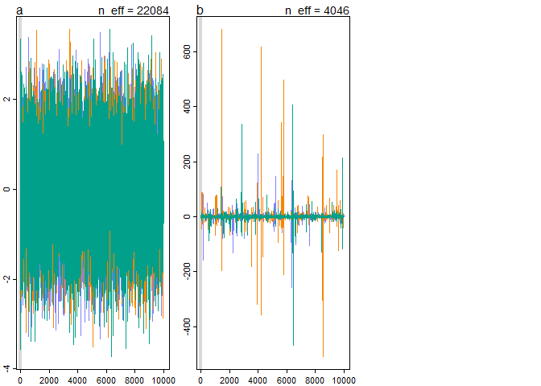
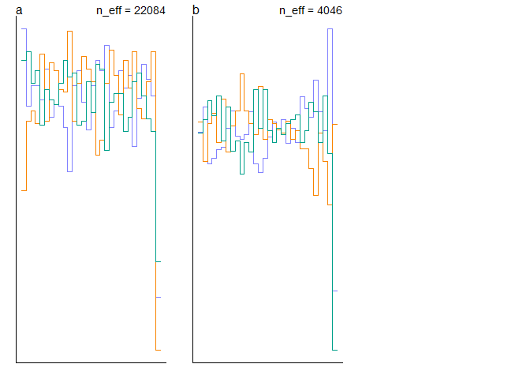
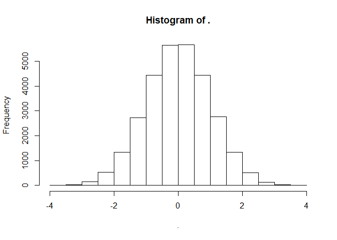
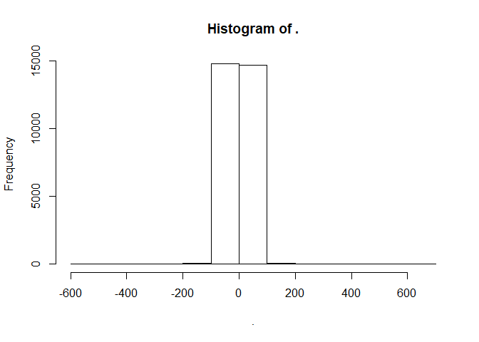
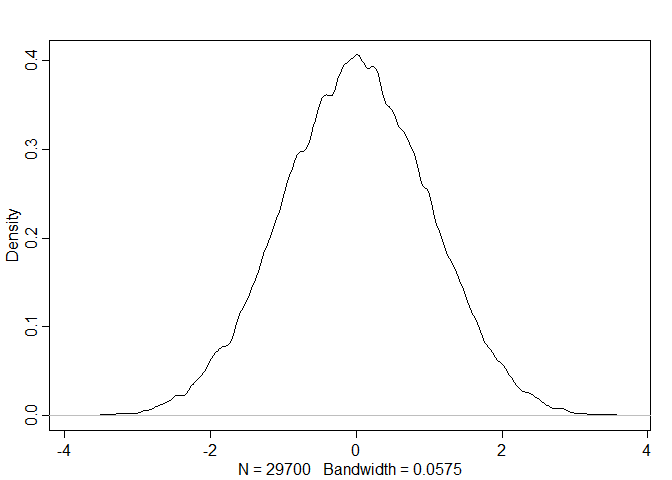
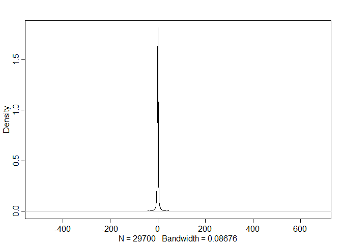
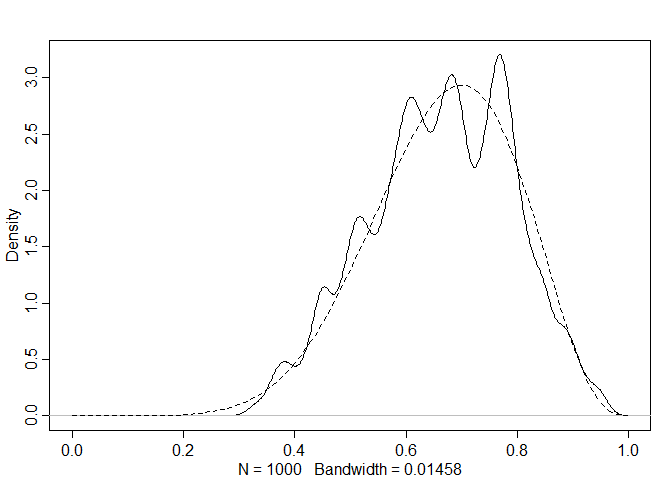

```r
library(tidyverse)
```

```
## -- Attaching packages --------------------------------------------------------------------------------------------------------------- tidyverse 1.2.1 --
```

```
## v ggplot2 3.2.1     v purrr   0.3.2
## v tibble  2.1.3     v dplyr   0.8.3
## v tidyr   0.8.3     v stringr 1.4.0
## v readr   1.3.1     v forcats 0.4.0
```

```
## -- Conflicts ------------------------------------------------------------------------------------------------------------------ tidyverse_conflicts() --
## x dplyr::filter() masks stats::filter()
## x dplyr::lag()    masks stats::lag()
```

```r
library(rethinking)
```

```
## Loading required package: rstan
```

```
## Loading required package: StanHeaders
```

```
## rstan (Version 2.19.2, GitRev: 2e1f913d3ca3)
```

```
## For execution on a local, multicore CPU with excess RAM we recommend calling
## options(mc.cores = parallel::detectCores()).
## To avoid recompilation of unchanged Stan programs, we recommend calling
## rstan_options(auto_write = TRUE)
```

```
## For improved execution time, we recommend calling
## Sys.setenv(LOCAL_CPPFLAGS = '-march=native')
## although this causes Stan to throw an error on a few processors.
```

```
## 
## Attaching package: 'rstan'
```

```
## The following object is masked from 'package:tidyr':
## 
##     extract
```

```
## Loading required package: parallel
```

```
## Loading required package: dagitty
```

```
## rethinking (Version 1.90)
```

```
## 
## Attaching package: 'rethinking'
```

```
## The following object is masked from 'package:purrr':
## 
##     map
```

```
## The following object is masked from 'package:stats':
## 
##     rstudent
```

```r
options(mc.cores = parallel::detectCores())
rstan_options(auto_write = TRUE)
Sys.setenv(LOCAL_CPPFLAGS = '-march=native')
```

# 8E3. Which sort of parameters can Hamiltonian Monte Carlo not handle? Can you explain why?

HMC can not handle discrete parameters. For HMC to work, the sampler must be able to move along a smooth surface meaning that the parameter values must have a continuous distribution.

# 8M1. Re-estimate the terrain ruggedness model from the chapter, but now using a uniform prior and an exponential prior for the standard deviation, sigma. The uniform prior should be dunif(0,10) and the exponential should be dexp(1). Do the different priors have any detectible influence on the posterior distribution?


```r
# Reloading data and transforming 
data(rugged)
d <- rugged
d$log_gdp <- log(d$rgdppc_2000)
dd <- d[ complete.cases(d$rgdppc_2000) , ]
dd$log_gdp_std <- dd$log_gdp / mean(dd$log_gdp)
dd$rugged_std <- dd$rugged / max(dd$rugged)
dd$cid <- ifelse( dd$cont_africa==1 , 1 , 2 )
dat_slim <- list(
  log_gdp_std = dd$log_gdp_std,
  rugged_std = dd$rugged_std,
  cid = as.integer( dd$cid )
)

# Run with 3 different sigmas

M8M.1a <- ulam(
  alist(
    log_gdp_std ~ dnorm( mu , sigma ) ,
    mu <- a[cid] + b[cid]*( rugged_std - 0.215 ) ,
    a[cid] ~ dnorm( 1 , 0.1 ) ,
    b[cid] ~ dnorm( 0 , 0.3 ) ,
    sigma ~ dexp( 1 )
    ) ,
data=dat_slim , cores = 8, chains=8, iter = 2000, log_lik=T)


M8M.1b <- ulam(
  alist(
    log_gdp_std ~ dnorm( mu , sigma ) ,
    mu <- a[cid] + b[cid]*( rugged_std - 0.215 ) ,
    a[cid] ~ dnorm( 1 , 0.1 ) ,
    b[cid] ~ dnorm( 0 , 0.3 ) ,
    sigma ~ dcauchy(0,1)
    ) ,
data=dat_slim , cores = 8, chains=8, iter = 2000, log_lik=T)


M8M.1c <- ulam(
  alist(
    log_gdp_std ~ dnorm( mu , sigma ) ,
    mu <- a[cid] + b[cid]*( rugged_std - 0.215 ) ,
    a[cid] ~ dnorm( 1 , 0.1 ) ,
    b[cid] ~ dnorm( 0 , 0.3 ) ,
    sigma ~ dunif(0,10)
    ) ,
data=dat_slim , cores = 8, chains=8, iter = 2000, log_lik=T)
```


```r
precis( M8M.1a , depth=2 )
```

```
##             mean          sd        5.5%       94.5%    n_eff      Rhat
## a[1]   0.8868075 0.016377659  0.86028466  0.91280333 10165.68 0.9998951
## a[2]   1.0506075 0.010313547  1.03412888  1.06708947 12918.65 0.9993332
## b[1]   0.1321338 0.075351678  0.01053162  0.25217509 11161.51 0.9999669
## b[2]  -0.1425003 0.055826224 -0.23091139 -0.05274397 11322.59 0.9996910
## sigma  0.1115453 0.006304106  0.10197708  0.12211358 11380.39 0.9994730
```

```r
precis( M8M.1b , depth=2 )
```

```
##             mean          sd         5.5%       94.5%     n_eff      Rhat
## a[1]   0.8868513 0.015938670  0.861225841  0.91213542  9592.638 0.9995620
## a[2]   1.0504657 0.009992264  1.034385994  1.06632726 10525.945 0.9998813
## b[1]   0.1324120 0.077018719  0.009999177  0.25565937  9245.581 0.9996419
## b[2]  -0.1409591 0.055677620 -0.227942434 -0.05166248  8293.073 0.9999516
## sigma  0.1117151 0.006228060  0.102137830  0.12223204 10554.426 1.0001331
```

```r
precis( M8M.1c , depth=2 )
```

```
##             mean          sd        5.5%       94.5%    n_eff      Rhat
## a[1]   0.8867353 0.016137670  0.86095495  0.91274588 10970.61 0.9999259
## a[2]   1.0503927 0.010084848  1.03419957  1.06652949 11573.76 0.9997999
## b[1]   0.1313107 0.075062702  0.01189668  0.25185956 10525.76 1.0000900
## b[2]  -0.1431724 0.056184049 -0.23299745 -0.05167731 10422.23 0.9998635
## sigma  0.1117134 0.006127051  0.10230543  0.12171187 10081.58 0.9993823
```


```r
compare(M8M.1a,M8M.1b,M8M.1c)
```

```
##             WAIC    pWAIC      dWAIC    weight       SE        dSE
## M8M.1c -259.3273 4.907443 0.00000000 0.3496949 14.57690         NA
## M8M.1b -259.2780 4.916076 0.04931487 0.3411777 14.56240 0.10631116
## M8M.1a -259.0807 5.024188 0.24661532 0.3091274 14.62775 0.06594406
```

Looking at the 3 models it does not look like the different priors had an effect on the posterior distribution. This problem is probably to illustrate that even with good and bad priors, HMC will eventually find an accurate distribution. Warm-up phase adjusts for bad priors?

# 8M2. The Cauchy and exponential priors from the terrain ruggedness model are very weak. They can be made more informative by reducing their scale. Compare the dcauchy and dexp priors for progressively smaller values of the scaling parameter. As these priors become stronger, how does each influence the posterior distribution?


```r
# dcauchy(x, location = 0, scale = 1)
dcau.1 <- ulam(
  alist(
    log_gdp_std ~ dnorm( mu , sigma ) ,
    mu <- a[cid] + b[cid]*( rugged_std - 0.215 ) ,
    a[cid] ~ dnorm( 1 , 0.1 ) ,
    b[cid] ~ dnorm( 0 , 0.3 ) ,
    sigma ~ dcauchy(0,.1)
    ) ,
data=dat_slim , cores = 8, chains=8, iter = 2000, log_lik=T)
dcau.01 <- ulam(
  alist(
    log_gdp_std ~ dnorm( mu , sigma ) ,
    mu <- a[cid] + b[cid]*( rugged_std - 0.215 ) ,
    a[cid] ~ dnorm( 1 , 0.1 ) ,
    b[cid] ~ dnorm( 0 , 0.3 ) ,
    sigma ~ dcauchy(0,.01)
    ) ,
data=dat_slim , cores = 8, chains=8, iter = 2000, log_lik=T)
dcau.001 <- ulam(
  alist(
    log_gdp_std ~ dnorm( mu , sigma ) ,
    mu <- a[cid] + b[cid]*( rugged_std - 0.215 ) ,
    a[cid] ~ dnorm( 1 , 0.1 ) ,
    b[cid] ~ dnorm( 0 , 0.3 ) ,
    sigma ~ dcauchy(0,.001)
    ) ,
data=dat_slim , cores = 8, chains=8, iter = 2000, log_lik=T)

precis( M8M.1b , depth=2 )
```

```
##             mean          sd         5.5%       94.5%     n_eff      Rhat
## a[1]   0.8868513 0.015938670  0.861225841  0.91213542  9592.638 0.9995620
## a[2]   1.0504657 0.009992264  1.034385994  1.06632726 10525.945 0.9998813
## b[1]   0.1324120 0.077018719  0.009999177  0.25565937  9245.581 0.9996419
## b[2]  -0.1409591 0.055677620 -0.227942434 -0.05166248  8293.073 0.9999516
## sigma  0.1117151 0.006228060  0.102137830  0.12223204 10554.426 1.0001331
```

```r
precis( dcau.1 , depth=2 )
```

```
##             mean          sd        5.5%      94.5%     n_eff      Rhat
## a[1]   0.8864303 0.015967669  0.86121896  0.9121524  9644.612 1.0000468
## a[2]   1.0505432 0.010076581  1.03430737  1.0667419 11866.515 0.9999509
## b[1]   0.1312189 0.075549355  0.01159729  0.2534324 10154.526 0.9996928
## b[2]  -0.1432873 0.054811289 -0.23042390 -0.0555112 10315.183 1.0003173
## sigma  0.1112725 0.006176701  0.10196307  0.1215929 11428.858 1.0003024
```

```r
precis( dcau.01 , depth=2 )
```

```
##             mean          sd        5.5%       94.5%     n_eff      Rhat
## a[1]   0.8862187 0.015936792  0.86108003  0.91189122  9524.453 1.0001526
## a[2]   1.0504245 0.010094584  1.03419485  1.06677006 11327.735 0.9995973
## b[1]   0.1307025 0.076236585  0.01152528  0.25407297  8795.139 0.9998143
## b[2]  -0.1414210 0.055986806 -0.22999942 -0.05134064  9092.577 1.0002049
## sigma  0.1110561 0.006091364  0.10188377  0.12126336 10129.618 1.0001292
```

```r
precis( dcau.001 , depth=2 )
```

```
##             mean         sd        5.5%       94.5%    n_eff      Rhat
## a[1]   0.8867989 0.01600426  0.86100474  0.91275454 10879.91 0.9995916
## a[2]   1.0505396 0.01006440  1.03425960  1.06651534 11535.90 0.9995858
## b[1]   0.1325420 0.07437226  0.01411339  0.25060368 10715.26 0.9998300
## b[2]  -0.1412848 0.05537663 -0.23035981 -0.05269519 11250.92 0.9993755
## sigma  0.1109621 0.00620323  0.10149608  0.12137719 10573.78 1.0001500
```

```r
compare(M8M.1b,dcau.1,dcau.01,dcau.001)
```

```
##               WAIC    pWAIC      dWAIC    weight       SE       dSE
## dcau.1   -259.3429 4.928586 0.00000000 0.2571375 14.70186        NA
## dcau.001 -259.3090 4.971754 0.03391418 0.2528139 14.76411 0.1288422
## M8M.1b   -259.2780 4.916076 0.06490641 0.2489265 14.56240 0.1801739
## dcau.01  -259.2143 5.022405 0.12861538 0.2411220 14.76466 0.1045327
```


```r
dxp.1 <- ulam(
  alist(
    log_gdp_std ~ dnorm( mu , sigma ) ,
    mu <- a[cid] + b[cid]*( rugged_std - 0.215 ) ,
    a[cid] ~ dnorm( 1 , 0.1 ) ,
    b[cid] ~ dnorm( 0 , 0.3 ) ,
    sigma ~ dexp(.1)
    ) ,
data=dat_slim , cores = 8, chains=8, iter = 2000, log_lik=T)
dxp.01 <- ulam(
  alist(
    log_gdp_std ~ dnorm( mu , sigma ) ,
    mu <- a[cid] + b[cid]*( rugged_std - 0.215 ) ,
    a[cid] ~ dnorm( 1 , 0.1 ) ,
    b[cid] ~ dnorm( 0 , 0.3 ) ,
    sigma ~ dexp(.01)
    ) ,
data=dat_slim , cores = 8, chains=8, iter = 2000, log_lik=T)
dxp.001 <- ulam(
  alist(
    log_gdp_std ~ dnorm( mu , sigma ) ,
    mu <- a[cid] + b[cid]*( rugged_std - 0.215 ) ,
    a[cid] ~ dnorm( 1 , 0.1 ) ,
    b[cid] ~ dnorm( 0 , 0.3 ) ,
    sigma ~ dexp(.001)
    ) ,
data=dat_slim , cores = 8, chains=8, iter = 2000, log_lik=T)

precis( M8M.1a , depth=2 )
```

```
##             mean          sd        5.5%       94.5%    n_eff      Rhat
## a[1]   0.8868075 0.016377659  0.86028466  0.91280333 10165.68 0.9998951
## a[2]   1.0506075 0.010313547  1.03412888  1.06708947 12918.65 0.9993332
## b[1]   0.1321338 0.075351678  0.01053162  0.25217509 11161.51 0.9999669
## b[2]  -0.1425003 0.055826224 -0.23091139 -0.05274397 11322.59 0.9996910
## sigma  0.1115453 0.006304106  0.10197708  0.12211358 11380.39 0.9994730
```

```r
precis( dxp.1 , depth=2 )
```

```
##             mean          sd        5.5%       94.5%     n_eff      Rhat
## a[1]   0.8868449 0.016200410  0.86113652  0.91296174  9607.147 0.9993603
## a[2]   1.0506373 0.010034867  1.03505030  1.06694022 11120.883 0.9996776
## b[1]   0.1329566 0.076781287  0.01012684  0.25426800  9925.018 0.9999040
## b[2]  -0.1424404 0.055210233 -0.23164588 -0.05404688 10002.697 0.9996962
## sigma  0.1116058 0.006222381  0.10204654  0.12190059 10023.853 0.9994654
```

```r
precis( dxp.01 , depth=2 )
```

```
##             mean          sd        5.5%      94.5%     n_eff      Rhat
## a[1]   0.8867121 0.015880302  0.86105792  0.9119328 10108.210 0.9999634
## a[2]   1.0505562 0.010101766  1.03449430  1.0667640 11585.028 0.9993621
## b[1]   0.1321172 0.076038184  0.01143659  0.2515011  9987.816 1.0000922
## b[2]  -0.1420923 0.056512103 -0.23290651 -0.0515871 10548.238 0.9998449
## sigma  0.1117249 0.006229774  0.10240091  0.1221807 10596.963 0.9998141
```

```r
precis( dxp.001 , depth=2 )
```

```
##             mean          sd        5.5%       94.5%    n_eff      Rhat
## a[1]   0.8868048 0.016011197  0.86160434  0.91266285 10281.83 0.9999176
## a[2]   1.0505990 0.010026233  1.03451594  1.06666692 11825.37 0.9994503
## b[1]   0.1315324 0.075807949  0.01009143  0.25103679 10437.16 0.9996697
## b[2]  -0.1424550 0.056616711 -0.23223414 -0.05209126 10361.97 0.9995386
## sigma  0.1115826 0.006247952  0.10225822  0.12182594 10313.16 0.9997913
```

```r
compare(M8M.1b,dxp.1,dxp.01,dxp.001)
```

```
##              WAIC    pWAIC      dWAIC    weight       SE        dSE
## M8M.1b  -259.2780 4.916076 0.00000000 0.2549056 14.56240         NA
## dxp.1   -259.2369 4.951352 0.04111803 0.2497185 14.60423 0.09324676
## dxp.01  -259.2345 4.950353 0.04355949 0.2494138 14.58291 0.07962141
## dxp.001 -259.2066 4.990778 0.07143068 0.2459622 14.62838 0.10054214
```

They are all getting the same final result

# 8H1. Run the model below and then inspect the posterior distribution and explain what it is accomplishing.


```r
mp <- ulam(
  alist(
    a ~ dnorm(0,1),
    b ~ dcauchy(0,1)
  ),
  data=list(y=1),
  start=list(a=0,b=0),
  iter=1e4, warmup=100, chains = 3, cores = 3)
```

```
## Warning: There were 16 transitions after warmup that exceeded the maximum treedepth. Increase max_treedepth above 10. See
## http://mc-stan.org/misc/warnings.html#maximum-treedepth-exceeded
```

```
## Warning: Examine the pairs() plot to diagnose sampling problems
```


```r
precis(mp, depth = 2)
```

```
##           mean        sd      5.5%    94.5%    n_eff     Rhat
## a -0.004323783  1.002262 -1.611837 1.596373 22083.71 1.000057
## b  0.378268444 22.750669 -6.136613 6.546518  4045.80 1.000385
```


```r
traceplot(mp)
```

<!-- -->


```r
trankplot(mp)
```

<!-- -->


```r
par(mfrow =c(1,1))
extract.samples(mp)$a %>% hist()
```

<!-- -->

```r
extract.samples(mp)$a %>% summary()
```

```
##      Min.   1st Qu.    Median      Mean   3rd Qu.      Max. 
## -3.728088 -0.685017 -0.001308 -0.004324  0.680430  3.564899
```

```r
extract.samples(mp)$b %>% hist()
```

<!-- -->

```r
extract.samples(mp)$b %>% summary()
```

```
##      Min.   1st Qu.    Median      Mean   3rd Qu.      Max. 
## -508.9325   -1.0210   -0.0016    0.3783    1.0057  680.8953
```

Cauchy has some massive outliers. a is sampling from the normal distribution and b is sampling from Cauchy distribution. I guess cauchy extends its tail much farther, but is also narrower at the mean.


```r
extract.samples(mp)$a %>% dens()
```

<!-- -->

```r
extract.samples(mp)$b %>% dens()
```

<!-- -->


# 8H2. Recall the divorce rate example from Chapter 5. Repeat that analysis, using map2stan this time, fitting models m5.1, m5.2, and m5.3. Use compare to compare the models on the basis of WAIC. Explain the results


```r
# load data and copy
data(WaffleDivorce)
d <- WaffleDivorce
# standardize variables
d$A <- scale( d$MedianAgeMarriage )
d$D <- scale( d$Divorce )
d$M <- scale( d$Marriage )

m5.1.quap <- quap(
  alist(
    D ~ dnorm( mu , sigma ) ,
    mu <- a + bA * A ,
    a ~ dnorm( 0 , 0.2 ) ,
    bA ~ dnorm( 0 , 0.5 ) ,
    sigma ~ dexp( 1 )
  ) , data = d)


m5.2.quap <- quap(
  alist(
    D ~ dnorm( mu , sigma ) ,
    mu <- a + bM * M ,
    a ~ dnorm( 0 , 0.2 ) ,
    bM ~ dnorm( 0 , 0.5 ) ,
    sigma ~ dexp( 1 )
  ) , data = d)

m5.3.quap <- quap(
  alist(
    D ~ dnorm( mu , sigma ) ,
    mu <- a + bM*M + bA*A ,
    a ~ dnorm( 0 , 0.2 ) ,
    bM ~ dnorm( 0 , 0.5 ) ,
    bA ~ dnorm( 0 , 0.5 ) ,
    sigma ~ dexp( 1 )
  ) , data = d)

d_slim <- list(
  A = d$A,
  D = d$D
)

m5.1.ulam <- ulam(
  alist(
    D ~ dnorm( mu , sigma ) ,
    mu <- a + bA * A ,
    a ~ dnorm( 0 , 0.2 ) ,
    bA ~ dnorm( 0 , 0.5 ) ,
    sigma ~ dexp( 1 )
  ) , data = d_slim, cores = 4, chains = 4, iter = 2000, log_lik = T)

d_slim <- list(
  A = d$A,
  D = d$D,
  M = d$M
)

m5.2.ulam <- ulam(
  alist(
    D ~ dnorm( mu , sigma ) ,
    mu <- a + bM * M ,
    a ~ dnorm( 0 , 0.2 ) ,
    bM ~ dnorm( 0 , 0.5 ) ,
    sigma ~ dexp( 1 )
  ) , data = d_slim, cores = 4, chains = 4, iter = 2000, log_lik = T)

m5.3.ulam <- ulam(
  alist(
    D ~ dnorm( mu , sigma ) ,
    mu <- a + bM*M + bA*A ,
    a ~ dnorm( 0 , 0.2 ) ,
    bM ~ dnorm( 0 , 0.5 ) ,
    bA ~ dnorm( 0 , 0.5 ) ,
    sigma ~ dexp( 1 )
  ) , data = d_slim, cores = 4, chains = 4, iter = 2000, log_lik = T )

precis( m5.1.quap )
```

```
##                mean         sd       5.5%      94.5%
## a      9.571172e-06 0.09738034 -0.1556230  0.1556422
## bA    -5.684139e-01 0.11000192 -0.7442182 -0.3926096
## sigma  7.883424e-01 0.07801543  0.6636586  0.9130261
```

```r
precis( m5.1.ulam )
```

```
##               mean         sd       5.5%      94.5%    n_eff      Rhat
## a      0.001589082 0.09956576 -0.1596676  0.1589581 3582.100 1.0012829
## bA    -0.569247106 0.11482149 -0.7483130 -0.3831045 3595.302 0.9995001
## sigma  0.821921732 0.08660063  0.6980426  0.9691079 3587.901 1.0003648
```

```r
precis( m5.2.quap )
```

```
##                mean         sd       5.5%     94.5%
## a     -2.476594e-07 0.10824646 -0.1729990 0.1729985
## bM     3.500541e-01 0.12592750  0.1487976 0.5513105
## sigma  9.102658e-01 0.08986251  0.7666482 1.0538835
```

```r
precis( m5.2.ulam )
```

```
##               mean         sd       5.5%     94.5%    n_eff      Rhat
## a     0.0007435033 0.11200036 -0.1773035 0.1785137 3597.422 0.9998526
## bM    0.3485026714 0.13254428  0.1362329 0.5646972 3085.815 1.0009962
## sigma 0.9465598124 0.09918585  0.8044441 1.1225429 3607.046 0.9995478
```

```r
precis( m5.3.quap )
```

```
##                mean         sd       5.5%      94.5%
## a     -8.691376e-08 0.09707603 -0.1551463  0.1551462
## bM    -6.538075e-02 0.15077305 -0.3063452  0.1755837
## bA    -6.135133e-01 0.15098359 -0.8548143 -0.3722124
## sigma  7.851180e-01 0.07784338  0.6607092  0.9095267
```

```r
precis( m5.3.ulam )
```

```
##               mean         sd       5.5%      94.5%    n_eff      Rhat
## a      0.002926166 0.10316281 -0.1627572  0.1645337 3334.217 1.0007801
## bM    -0.062837763 0.15708574 -0.3104187  0.1912128 2347.549 0.9998300
## bA    -0.611162985 0.15959829 -0.8596082 -0.3547312 2321.758 1.0006119
## sigma  0.826052006 0.08705083  0.6999100  0.9726445 3446.252 0.9995246
```

```r
compare(m5.1.ulam, m5.2.ulam, m5.3.ulam)
```

```
##               WAIC    pWAIC     dWAIC       weight        SE       dSE
## m5.1.ulam 125.7226 3.630828  0.000000 0.7204244940 12.680579        NA
## m5.3.ulam 127.6213 4.749953  1.898679 0.2788017788 12.778395 0.7642401
## m5.2.ulam 139.3954 3.015054 13.672753 0.0007737272  9.889107 9.2742527
```

```r
compare(m5.1.quap, m5.2.quap, m5.3.quap)
```

```
##               WAIC    pWAIC     dWAIC       weight       SE       dSE
## m5.1.quap 126.6959 4.246098  0.000000 0.7159718132 14.02262        NA
## m5.3.quap 128.5511 5.448700  1.855205 0.2831674283 14.30615  1.026027
## m5.2.quap 140.1431 3.508223 13.447164 0.0008607585 10.79943 10.290902
```

You get pretty much the same result in this case which says the second model do not carry any weight and the first model carries the most weight and has the lowest WAIC

# 8H6. Modify the Metropolis algorithm code from the chapter to write your own simple MCMC estimator for globe tossing data and model from Chapter 2.


```r
n_samples <- 1000 # 1000 tosses
p <- rep( NA , n_samples ) # Build vector
p[1] <- 0.5 # 50/50 start
W <- 7 # world 70% water
L <- 3 # world 30% land
for ( i in 2:n_samples ) {
  p_new <- rnorm( 1 , p[i-1] , 0.1 )
  if ( p_new < 0 ) p_new <- abs( p_new )
  if ( p_new > 1 ) p_new <- 2 - p_new
  q0 <- dbinom( W , W+L , p[i-1] )
  q1 <- dbinom( W , W+L , p_new )
  p[i] <- ifelse( runif(1) < q1/q0 , p_new , p[i-1] )
}
dens(p, xlim = c(0,1))
curve( dbeta( x , W+1 , L+1 ) , lty=2 , add=TRUE )
```

<!-- -->

```r
#Stolen straight from the book
```

