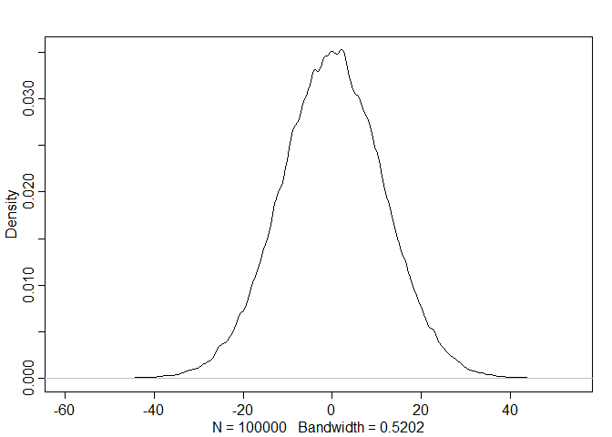
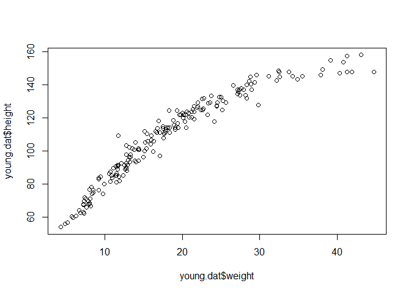
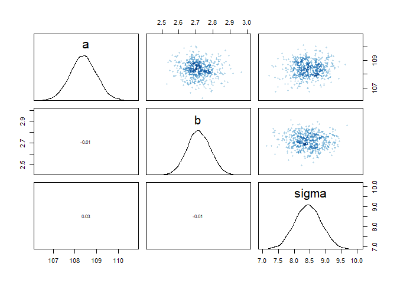
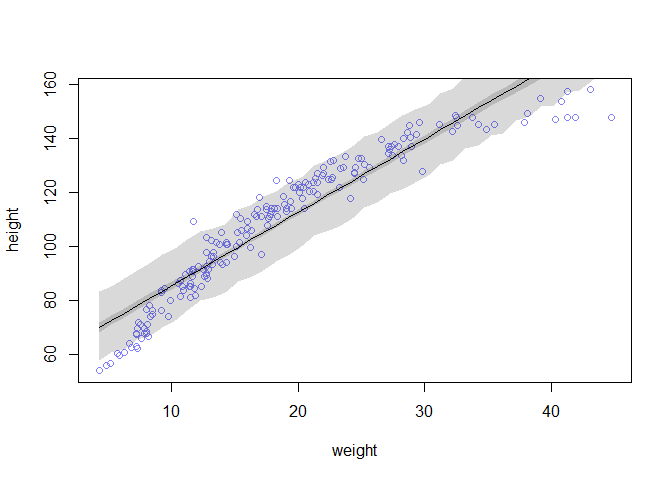
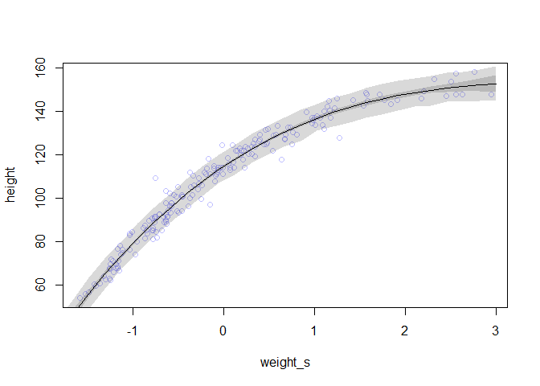

### 4E1. In the model definition below, which line is the likelihood?  
_yi ∼ Normal(µ, σ)_  
_µ ∼ Normal(0, 10)_  
_σ ∼ Uniform(0, 10)_  

**yi ∼ Normal(µ, σ)**

### 4E2. In the model definition just above, how many parameters are in the posterior distribution?

2: σ and µ

### 4E3. Using the model definition above, write down the appropriate form of Bayes’ theorem that includes the proper likelihood and priors.

Pr(µ, σ|y) = (∏iNormal(yi|µ, σ)Normal(µ|178, 20)Uniform(σ|0, 50))/(∫∫∏iNormal(yi|µ, σ)Normal(µ|178, 20)Uniform(σ|0, 50)dµdσ)

### 4E4. In the model definition below, which line is the linear model?

_yi ∼ Normal(µ, σ)_  
_µi = α + βxi_  
_α ∼ Normal(0, 10)_  
_β ∼ Normal(0, 1)_  
_σ ∼ Uniform(0, 10)_  

__µi = α + βxi__

### 4E5. In the model definition just above, how many parameters are in the posterior distribution?

3: α, β, and σ


### 4M1. For the model definition below, simulate observed heights from the prior (not the posterior).
_yi ∼ Normal(µ, σ)_  
_µ ∼ Normal(0, 10)_  
_σ ∼ Uniform(0, 10)_  


```r
library(rethinking)
```

```
## Loading required package: rstan
```

```
## Loading required package: ggplot2
```

```
## Loading required package: StanHeaders
```

```
## rstan (Version 2.18.2, GitRev: 2e1f913d3ca3)
```

```
## For execution on a local, multicore CPU with excess RAM we recommend calling
## options(mc.cores = parallel::detectCores()).
## To avoid recompilation of unchanged Stan programs, we recommend calling
## rstan_options(auto_write = TRUE)
```

```
## For improved execution time, we recommend calling
## Sys.setenv(LOCAL_CPPFLAGS = '-march=native')
## although this causes Stan to throw an error on a few processors.
```

```
## Loading required package: parallel
```

```
## rethinking (Version 1.88)
```

```r
mus <- rnorm(n = 100000, mean = 0, sd = 10)
sds <- runif(n = 100000, min = 0, max = 10)
heights <- rnorm(n = 100000, mean = mus, sd = sds)
dens(heights)
```

<!-- -->


### 4M2. Translate the model just above into a quap formula.


```r
flist <- alist(
height ~ dnorm( mu, sigma ),
mu ~ dnorm( 0, 10 ),
sigma ~ dunif( 0, 10 )
)
```

### 4M3. Translate the quap model formula below into a mathematical model definition.

```r
flist <- alist(
y ~ dnorm( mu , sigma ),
mu <- a + b*x,
a ~ dnorm( 0 , 50 ),
b ~ dunif( 0 , 10 ),
sigma ~ dunif( 0 , 50 )
)
```

yi ~ Normal(µi, σ)  
µi = α + βxi  
α ~ Normal(0,50)  
β ~ Uniform(0,10)  
σ ~ Uniform(0,50)  

### 4M4. A sample of students is measured for height each year for 3 years. After the third year, you want to fit a linear regression predicting height using year as a predictor. Write down the mathematical model definition for this regression, using any variable names and priors you choose. Be prepared to defend your choice of priors.

yi ~ Normal(µi, σ)  
µi = α + βyear_i  
α ~ Normal(170,20)  
β ~ LogNormal(0,1)  
σ ~ Uniform(0,50) 


### 4M5. Now suppose I tell you that the average height in the first year was 120 cm and that every student got taller each year. Does this information lead you to change your choice of priors? How?

yi ~ Normal(µi, σ)  
µi = α + βyear_i  
α ~ Normal(120,20)  
β ~ LogNormal(0,1)  
σ ~ Uniform(0,50) 

We now have prior knowledge to change our estimate of alpha

###4M6. Now suppose I tell you that the variance among heights for students of the same age is never more than 64cm. How does this lead you to revise your priors?

yi ~ Normal(µi, σ)  
µi = α + βyear_i  
α ~ Normal(120,20)  
β ~ LogNormal(0,1)  
σ ~ Uniform(0,8) 

We now have prior knowledge to change our estimate of sigma. sqrt(64)

## Hard.

### 4H1. The weights listed below were recorded in the !Kung census, but heights were not recorded for these individuals. Provide predicted heights and 89% intervals (either HPDI or PI) for each of these individuals. That is, fill in the table below, using model-based predictions. Individual weight expected height 89% interval

|Individual|Weight|Expected Height| 89% Interval|
|-----|-----|-----|-------------|
|1|46.95|135.88|121.76-152.03|
|2|43.72|129.52|112.76-142.83|
|3|64.78|167.02|151.08-180.49|
|4|32.59|110.19|95.12-125.39|
|5|54.63|149.1716|134.16-165.24|


```r
data(Howell1)
dat <- Howell1
weights <- c(46.95,43.72,64.78,32.59,54.63)
H1 <- quap(
alist(
height ~ dnorm( mu , sigma ) ,
mu <- a + b*( weight - mean(weight) ) ,
a ~ dnorm( 178 , 20 ) ,
b ~ dlnorm( 0 , 1 ) ,
sigma ~ dunif( 0 , 50 )
) , data=dat)

heights <- sim(H1,
               data = data.frame(weight=weights),
               n=1e3)
#head(heights)
apply( heights , 2 , mean)
```

```
## [1] 135.7878 129.6218 166.9801 110.5287 149.2798
```

```r
apply( heights , 2 , HPDI , prob=0.89 )
```

```
##           [,1]     [,2]     [,3]      [,4]     [,5]
## |0.89 122.2392 115.0809 151.3656  96.61864 134.1247
## 0.89| 153.4500 144.9013 180.8586 126.03493 163.4751
```


### 4H2. Select out all the rows in the Howell1 data with ages below 18 years of age. If you do it right, you should end up with a new data frame with 192 rows in it.


```r
young.dat <- dat[dat$age < 18, ]
```


  (a) Fit a linear regression to these data, using quap. Present and interpret the estimates. For
  every 10 units of increase in weight, how much taller does the model predict a child gets?
  

```r
plot(young.dat$height ~ young.dat$weight)
```

<!-- -->

```r
xbar <- mean(young.dat$weight)
H2 <- quap(
alist(
height ~ dnorm( mu , sigma ) ,
mu <- a + b*( weight - xbar ) ,
a ~ dnorm( 178 , 20 ) ,
b ~ dlnorm( 0 , 1 ) ,
sigma ~ dunif( 0 , 50 )
) ,
data=young.dat )
precis(H2)
```

```
##             mean         sd       5.5%      94.5%
## a     108.383306 0.60867592 107.410524 109.356088
## b       2.716501 0.06831801   2.607316   2.825687
## sigma   8.437477 0.43060968   7.749280   9.125675
```

```r
pairs(H2)
```

<!-- -->

```r
2.72*10 # 27.2 cm increase per 10 kg
```

```
## [1] 27.2
```

  (b) Plot the raw data, with height on the vertical axis and weight on the horizontal axis. Superimpose the MAP regression line and 89% HPDI for the mean. Also superimpose the 89% HPDI for predicted heights.
  

```r
post <- extract.samples(H2)
weight.seq <- seq.int(from=min(young.dat$weight), to=max(young.dat$weight), by=1)
mu <- link(H2, data=data.frame(weight=weight.seq))
mu.mean <- apply( mu , 2 , mean )
mu.HPDI <- apply( mu , 2 , HPDI , prob=0.89 )
sim <- sim(H2, data=data.frame(weight=weight.seq))
sim.HPDI <- apply(sim, 2, HPDI, prob=0.89)
plot( height ~ weight , data=young.dat , col=rangi2 )
# plot the MAP line, aka the mean mu for each weight
lines( weight.seq , mu.mean )
shade( sim.HPDI , weight.seq)
# plot a shaded region for 89% HPDI
shade( mu.HPDI , weight.seq)
```

<!-- -->


  (c) What aspects of the model fit concern you? Describe the kinds of assumptions you would change, if any, to improve the model. You don’t have to write any new code. Just explain what the model appears to be doing a bad job of, and what you hypothesize would be a better model
  
Model is very poor at predicting heights as you move to the extremes of the weight ranges.


```r
young.dat$weight_s <- ( young.dat$weight - mean(young.dat$weight) )/sd(young.dat$weight)
young.dat$weight_s2 <- young.dat$weight_s^2
young.dat$weight_s3 <- young.dat$weight_s^3
H2.2 <- quap(
alist(
height ~ dnorm( mu , sigma ) ,
mu <- a + b1*weight_s + b2*weight_s2 + b3*weight_s3 ,
a ~ dnorm( 178 , 20 ) ,
b1 ~ dlnorm( 0 , 1 ) ,
b2 ~ dnorm( 0 , 10 ) ,
b3 ~ dnorm( 0 , 10 ) ,
sigma ~ dunif( 0 , 50 )
) ,
data=young.dat )
weight.seq <- seq( from=-2.2 , to=3 , length.out=30 )
pred_dat <- list( weight_s=weight.seq , weight_s2=weight.seq^2, weight_s3=weight.seq^3 )
head(pred_dat)
```

```
## $weight_s
##  [1] -2.20000000 -2.02068966 -1.84137931 -1.66206897 -1.48275862
##  [6] -1.30344828 -1.12413793 -0.94482759 -0.76551724 -0.58620690
## [11] -0.40689655 -0.22758621 -0.04827586  0.13103448  0.31034483
## [16]  0.48965517  0.66896552  0.84827586  1.02758621  1.20689655
## [21]  1.38620690  1.56551724  1.74482759  1.92413793  2.10344828
## [26]  2.28275862  2.46206897  2.64137931  2.82068966  3.00000000
## 
## $weight_s2
##  [1] 4.840000000 4.083186683 3.390677765 2.762473246 2.198573127
##  [6] 1.698977408 1.263686088 0.892699168 0.586016647 0.343638526
## [11] 0.165564804 0.051795482 0.002330559 0.017170036 0.096313912
## [16] 0.239762188 0.447514863 0.719571938 1.055933413 1.456599287
## [21] 1.921569560 2.450844233 3.044423306 3.702306778 4.424494649
## [26] 5.210986920 6.061783591 6.976884661 7.956290131 9.000000000
## 
## $weight_s3
##  [1] -1.064800e+01 -8.250853e+00 -6.243524e+00 -4.591421e+00 -3.259953e+00
##  [6] -2.214529e+00 -1.420557e+00 -8.434468e-01 -4.486058e-01 -2.014433e-01
## [11] -6.736775e-02 -1.178794e-02 -1.125097e-04  2.249867e-03  2.989052e-02
## [16]  1.174008e-01  2.993720e-01  6.103955e-01  1.085063e+00  1.757965e+00
## [21]  2.663693e+00  3.836839e+00  5.311994e+00  7.123749e+00  9.306696e+00
## [26]  1.189543e+01  1.492453e+01  1.842860e+01  2.244223e+01  2.700000e+01
```

```r
mu <- link( H2.2 , data=pred_dat )
mu.mean <- apply( mu , 2 , mean )
mu.PI <- apply( mu , 2 , PI , prob=0.89 )
sim.height <- sim( H2.2 , data=pred_dat )
height.PI <- apply( sim.height , 2 , PI , prob=0.89 )
plot( height ~ weight_s , young.dat , col=col.alpha(rangi2,0.5) )
lines( weight.seq , mu.mean )
shade( mu.PI , weight.seq )
shade( height.PI , weight.seq )
```

<!-- -->

