### Coin flip example for Gaussian distributions

```r
library(rethinking)
```

```
## Loading required package: rstan
```

```
## Loading required package: ggplot2
```

```
## Loading required package: StanHeaders
```

```
## rstan (Version 2.18.2, GitRev: 2e1f913d3ca3)
```

```
## For execution on a local, multicore CPU with excess RAM we recommend calling
## options(mc.cores = parallel::detectCores()).
## To avoid recompilation of unchanged Stan programs, we recommend calling
## rstan_options(auto_write = TRUE)
```

```
## For improved execution time, we recommend calling
## Sys.setenv(LOCAL_CPPFLAGS = '-march=native')
## although this causes Stan to throw an error on a few processors.
```

```
## Loading required package: parallel
```

```
## rethinking (Version 1.88)
```

```r
pos <- replicate( 1000 , sum( runif(16,-1,1) ) )
hist(pos)
```

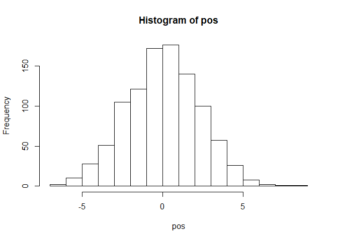<!-- -->

```r
plot(density(pos))
```

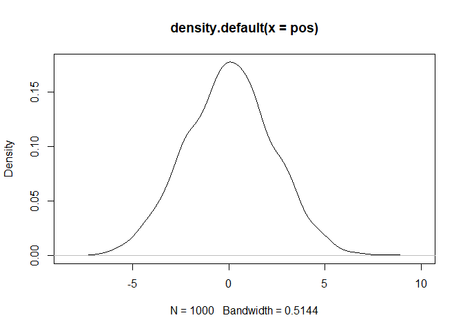<!-- -->


```r
pos <- replicate( 10000 , sum( runif(100,-1,1) ) )
hist(pos)
```

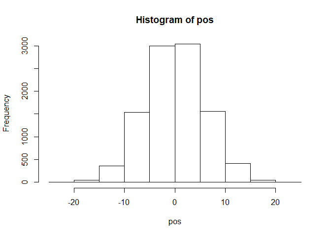<!-- -->

```r
plot(density(pos))
```

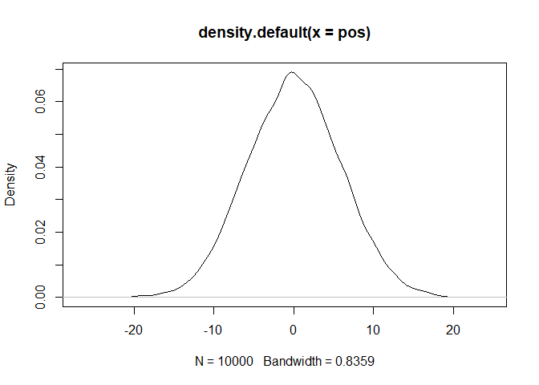<!-- -->

### 

```r
prod( 1 + runif(12,0,0.1) )
```

```
## [1] 2.249825
```

```r
growth <- replicate( 10000 , prod( 1 + runif(12,0,0.1) ) )
dens( growth , norm.comp=TRUE )
```

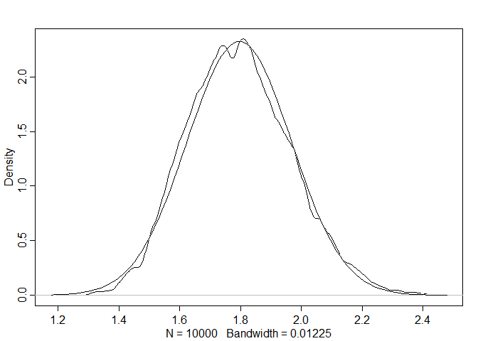<!-- -->


```r
big <- replicate( 10000 , prod( 1 + runif(12,0,0.5) ) )
small <- replicate( 10000 , prod( 1 + runif(12,0,0.01) ) )
dens( big , norm.comp=TRUE )
```

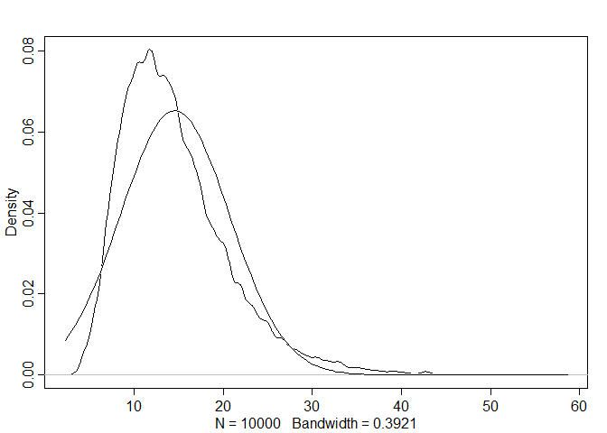<!-- -->

```r
dens( small , norm.comp=TRUE )
```

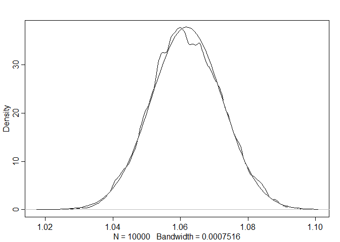<!-- -->


```r
log.big <- replicate( 10000 , log(prod(1 + runif(12,0,0.5))) )
dens( log.big , norm.comp=TRUE )
```

<!-- -->


```r
curve( exp( -x^2 ) , from=-3 , to=3 )
```

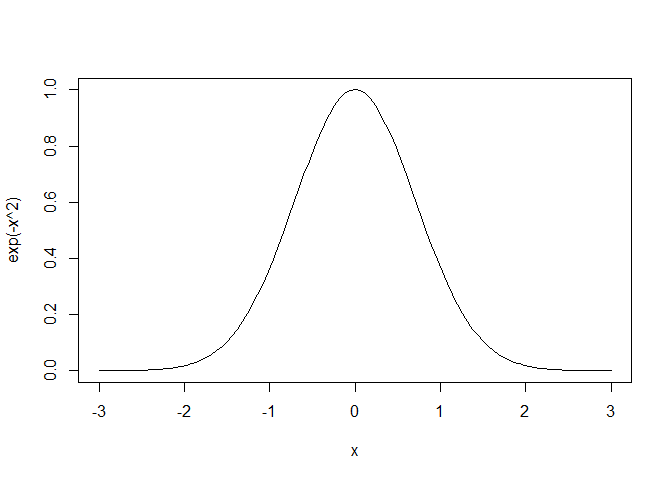<!-- -->


```r
dnorm(0,0,0.1)
```

```
## [1] 3.989423
```


```r
w <- 6; n <- 9;
p_grid <- seq(from=0,to=1,length.out=100)
posterior <- dbinom(w,n,p_grid)*dunif(p_grid,0,1)
posterior <- posterior/sum(posterior)
hist(posterior)
```

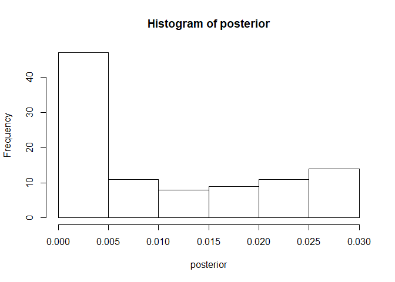<!-- -->

```r
dens(posterior)
```

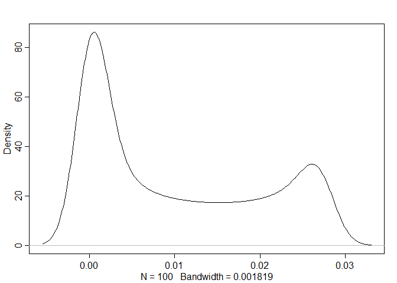<!-- -->


```r
library(rethinking)
data(Howell1)
d <- Howell1
str(d)
```

```
## 'data.frame':	544 obs. of  4 variables:
##  $ height: num  152 140 137 157 145 ...
##  $ weight: num  47.8 36.5 31.9 53 41.3 ...
##  $ age   : num  63 63 65 41 51 35 32 27 19 54 ...
##  $ male  : int  1 0 0 1 0 1 0 1 0 1 ...
```


```r
precis(d)
```

```
##               mean         sd      5.5%     94.5%
## height 138.2635963 27.6024476 81.108550 165.73500
## weight  35.6106176 14.7191782  9.360721  54.50289
## age     29.3443934 20.7468882  1.000000  66.13500
## male     0.4724265  0.4996986  0.000000   1.00000
##                                                                                                       histogram
## height <U+2581><U+2581><U+2581><U+2581><U+2581><U+2581><U+2581><U+2582><U+2581><U+2587><U+2587><U+2585><U+2581>
## weight <U+2581><U+2582><U+2583><U+2582><U+2582><U+2582><U+2582><U+2585><U+2587><U+2587><U+2583><U+2582><U+2581>
## age                                    <U+2587><U+2585><U+2585><U+2583><U+2585><U+2582><U+2582><U+2581><U+2581>
## male                           <U+2587><U+2581><U+2581><U+2581><U+2581><U+2581><U+2581><U+2581><U+2581><U+2587>
```


```r
d$height
```

```
##   [1] 151.7650 139.7000 136.5250 156.8450 145.4150 163.8300 149.2250
##   [8] 168.9100 147.9550 165.1000 154.3050 151.1300 144.7800 149.9000
##  [15] 150.4950 163.1950 157.4800 143.9418 121.9200 105.4100  86.3600
##  [22] 161.2900 156.2100 129.5400 109.2200 146.4000 148.5900 147.3200
##  [29] 137.1600 125.7300 114.3000 147.9550 161.9250 146.0500 146.0500
##  [36] 152.7048 142.8750 142.8750 147.9550 160.6550 151.7650 162.8648
##  [43] 171.4500 147.3200 147.9550 144.7800 121.9200 128.9050  97.7900
##  [50] 154.3050 143.5100 146.7000 157.4800 127.0000 110.4900  97.7900
##  [57] 165.7350 152.4000 141.6050 158.8000 155.5750 164.4650 151.7650
##  [64] 161.2900 154.3050 145.4150 145.4150 152.4000 163.8300 144.1450
##  [71] 129.5400 129.5400 153.6700 142.8750 146.0500 167.0050 158.4198
##  [78]  91.4400 165.7350 149.8600 147.9550 137.7950 154.9400 160.9598
##  [85] 161.9250 147.9550 113.6650 159.3850 148.5900 136.5250 158.1150
##  [92] 144.7800 156.8450 179.0700 118.7450 170.1800 146.0500 147.3200
##  [99] 113.0300 162.5600 133.9850 152.4000 160.0200 149.8600 142.8750
## [106] 167.0050 159.3850 154.9400 148.5900 111.1250 111.7600 162.5600
## [113] 152.4000 124.4600 111.7600  86.3600 170.1800 146.0500 159.3850
## [120] 151.1300 160.6550 169.5450 158.7500  74.2950 149.8600 153.0350
## [127]  96.5200 161.9250 162.5600 149.2250 116.8400 100.0760 163.1950
## [134] 161.9250 145.4150 163.1950 151.1300 150.4950 141.6050 170.8150
## [141]  91.4400 157.4800 152.4000 149.2250 129.5400 147.3200 145.4150
## [148] 121.9200 113.6650 157.4800 154.3050 120.6500 115.6000 167.0050
## [155] 142.8750 152.4000  96.5200 160.0000 159.3850 149.8600 160.6550
## [162] 160.6550 149.2250 125.0950 140.9700 154.9400 141.6050 160.0200
## [169] 150.1648 155.5750 103.5050  94.6150 156.2100 153.0350 167.0050
## [176] 149.8600 147.9550 159.3850 161.9250 155.5750 159.3850 146.6850
## [183] 172.7200 166.3700 141.6050 142.8750 133.3500 127.6350 119.3800
## [190] 151.7650 156.8450 148.5900 157.4800 149.8600 147.9550 102.2350
## [197] 153.0350 160.6550 149.2250 114.3000 100.9650 138.4300  91.4400
## [204] 162.5600 149.2250 158.7500 149.8600 158.1150 156.2100 148.5900
## [211] 143.5100 154.3050 131.4450 157.4800 157.4800 154.3050 107.9500
## [218] 168.2750 145.4150 147.9550 100.9650 113.0300 149.2250 154.9400
## [225] 162.5600 156.8450 123.1900 161.0106 144.7800 143.5100 149.2250
## [232] 110.4900 149.8600 165.7350 144.1450 157.4800 154.3050 163.8300
## [239] 156.2100 153.6700 134.6200 144.1450 114.3000 162.5600 146.0500
## [246] 120.6500 154.9400 144.7800 106.6800 146.6850 152.4000 163.8300
## [253] 165.7350 156.2100 152.4000 140.3350 158.1150 163.1950 151.1300
## [260] 171.1198 149.8600 163.8300 141.6050  93.9800 149.2250 105.4100
## [267] 146.0500 161.2900 162.5600 145.4150 145.4150 170.8150 127.0000
## [274] 159.3850 159.4000 153.6700 160.0200 150.4950 149.2250 127.0000
## [281] 142.8750 142.1130 147.3200 162.5600 164.4650 160.0200 153.6700
## [288] 167.0050 151.1300 147.9550 125.3998 111.1250 153.0350 139.0650
## [295] 152.4000 154.9400 147.9550 143.5100 117.9830 144.1450  92.7100
## [302] 147.9550 155.5750 150.4950 155.5750 154.3050 130.6068 101.6000
## [309] 157.4800 168.9100 150.4950 111.7600 160.0200 167.6400 144.1450
## [316] 145.4150 160.0200 147.3200 164.4650 153.0350 149.2250 160.0200
## [323] 149.2250  85.0900  84.4550  59.6138  92.7100 111.1250  90.8050
## [330] 153.6700  99.6950  62.4840  81.9150  96.5200  80.0100 150.4950
## [337] 151.7650 140.6398  88.2650 158.1150 149.2250 151.7650 154.9400
## [344] 123.8250 104.1400 161.2900 148.5900  97.1550  93.3450 160.6550
## [351] 157.4800 167.0050 157.4800  91.4400  60.4520 137.1600 152.4000
## [358] 152.4000  81.2800 109.2200  71.1200  89.2048  67.3100  85.0900
## [365]  69.8500 161.9250 152.4000  88.9000  90.1700  71.7550  83.8200
## [372] 159.3850 142.2400 142.2400 168.9100 123.1900  74.9300  74.2950
## [379]  90.8050 160.0200  67.9450 135.8900 158.1150  85.0900  93.3450
## [386] 152.4000 155.5750 154.3050 156.8450 120.0150 114.3000  83.8200
## [393] 156.2100 137.1600 114.3000  93.9800 168.2750 147.9550 139.7000
## [400] 157.4800  76.2000  66.0400 160.7000 114.3000 146.0500 161.2900
## [407]  69.8500 133.9850  67.9450 150.4950 163.1950 148.5900 148.5900
## [414] 161.9250 153.6700  68.5800 151.1300 163.8300 153.0350 151.7650
## [421] 132.0800 156.2100 140.3350 158.7500 142.8750  84.4550 151.9428
## [428] 161.2900 127.9906 160.9852 144.7800 132.0800 117.9830 160.0200
## [435] 154.9400 160.9852 165.9890 157.9880 154.9400  97.9932  64.1350
## [442] 160.6550 147.3200 146.7000 147.3200 172.9994 158.1150 147.3200
## [449] 124.9934 106.0450 165.9890 149.8600  76.2000 161.9250 140.0048
## [456]  66.6750  62.8650 163.8300 147.9550 160.0200 154.9400 152.4000
## [463]  62.2300 146.0500 151.9936 157.4800  55.8800  60.9600 151.7650
## [470] 144.7800 118.1100  78.1050 160.6550 151.1300 121.9200  92.7100
## [477] 153.6700 147.3200 139.7000 157.4800  91.4400 154.9400 143.5100
## [484]  83.1850 158.1150 147.3200 123.8250  88.9000 160.0200 137.1600
## [491] 165.1000 154.9400 111.1250 153.6700 145.4150 141.6050 144.7800
## [498] 163.8300 161.2900 154.9000 161.3000 170.1800 149.8600 123.8250
## [505]  85.0900 160.6550 154.9400 106.0450 126.3650 166.3700 148.2852
## [512] 124.4600  89.5350 101.6000 151.7650 148.5900 153.6700  53.9750
## [519] 146.6850  56.5150 100.9650 121.9200  81.5848 154.9400 156.2100
## [526] 132.7150 125.0950 101.6000 160.6550 146.0500 132.7150  87.6300
## [533] 156.2100 152.4000 162.5600 114.9350  67.9450 142.8750  76.8350
## [540] 145.4150 162.5600 156.2100  71.1200 158.7500
```


```r
d2 <- d[ d$age >= 18 , ]
```


```r
dens(d2$height)
```

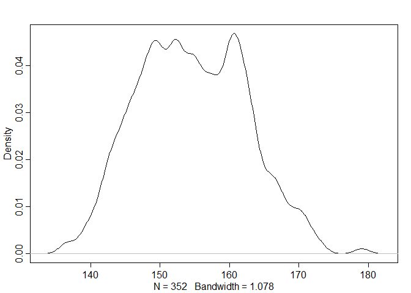<!-- -->


```r
curve( dnorm( x , 178 , 20 ) , from=100 , to=250 )
```

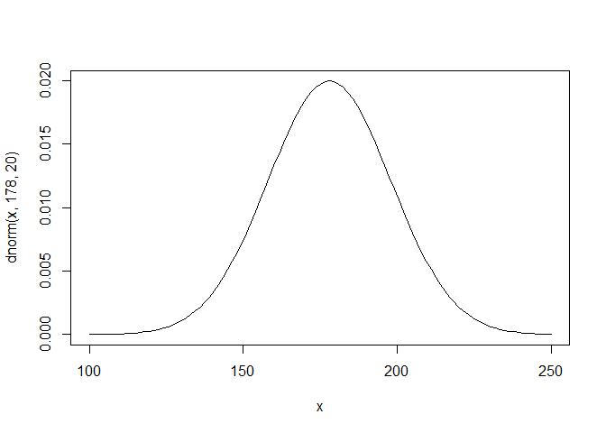<!-- -->


```r
curve( dunif( x , 0 , 50 ) , from=-10 , to=60 )
```

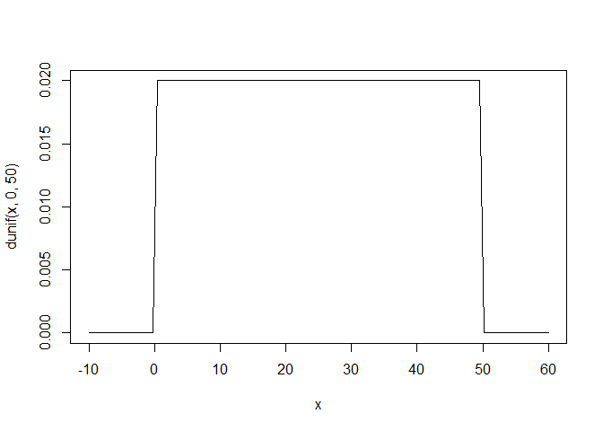<!-- -->


```r
sample_mu <- rnorm( 1e4 , 178 , 20 )
sample_sigma <- runif( 1e4 , 0 , 50 )
prior_h <- rnorm( 1e4 , sample_mu , sample_sigma )
dens( prior_h )
```

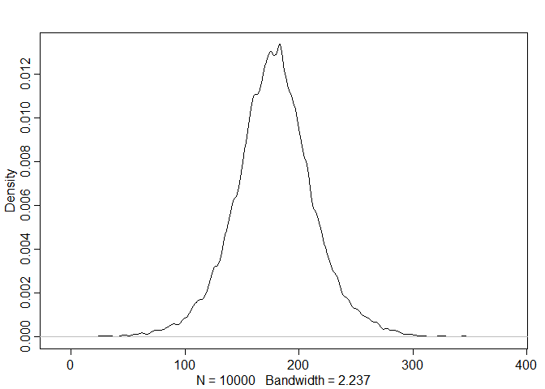<!-- -->


```r
sample_mu <- rnorm( 1e4 , 178 , 100 )
prior_h <- rnorm( 1e4 , sample_mu , sample_sigma )
dens( prior_h )
```

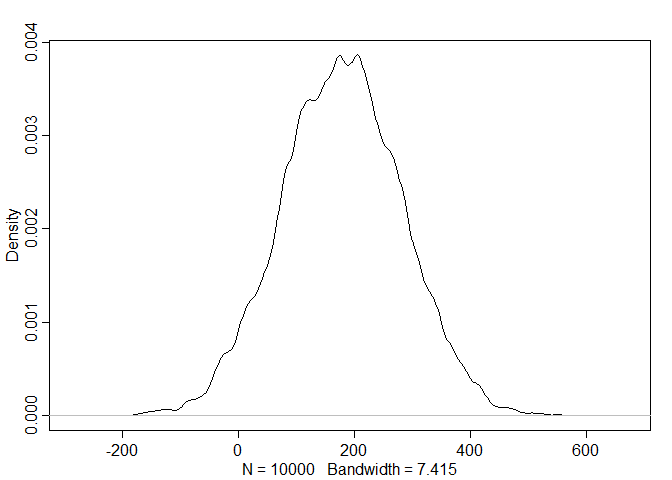<!-- -->


```r
mu.list <- seq( from=140, to=160 , length.out=200 )
sigma.list <- seq( from=4 , to=9 , length.out=200 )
post <- expand.grid( mu=mu.list , sigma=sigma.list )
post$LL <- sapply( 1:nrow(post) , function(i) sum( dnorm(
d2$height ,
mean=post$mu[i] ,
sd=post$sigma[i] ,
log=TRUE ) ) )
post$prod <- post$LL + dnorm( post$mu , 178 , 20 , TRUE ) +
dunif( post$sigma , 0 , 50 , TRUE )
post$prob <- exp( post$prod - max(post$prod) )
```


```r
contour_xyz( post$mu , post$sigma , post$prob )
```

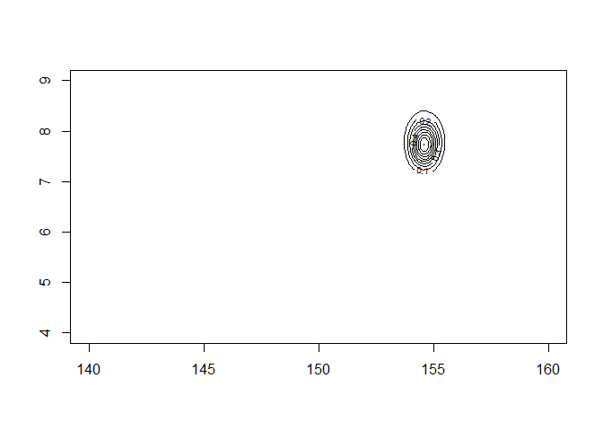<!-- -->

```r
image_xyz( post$mu , post$sigma , post$prob )
```

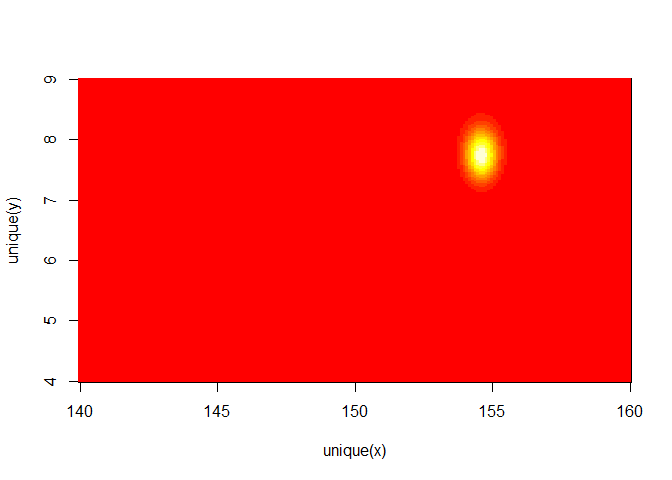<!-- -->


```r
sample.rows <- sample( 1:nrow(post) , size=1e4 , replace=TRUE ,
prob=post$prob )
sample.mu <- post$mu[ sample.rows ]
sample.sigma <- post$sigma[ sample.rows ]
plot( sample.mu , sample.sigma , cex=0.5 , pch=16 , col=col.alpha(rangi2,0.1) )
```

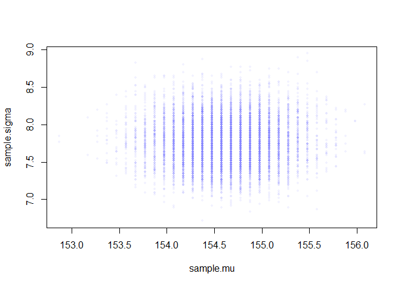<!-- -->


```r
dens( sample.mu )
```

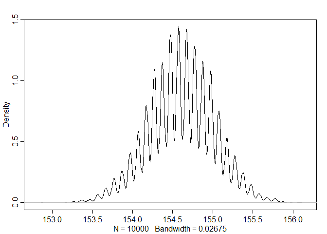<!-- -->

```r
dens( sample.sigma )
```

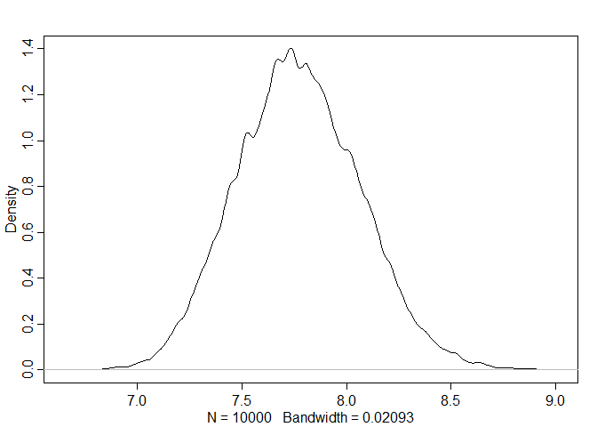<!-- -->


```r
HPDI( sample.mu )
```

```
##    |0.89    0.89| 
## 153.8693 155.1759
```

```r
HPDI( sample.sigma )
```

```
##    |0.89    0.89| 
## 7.266332 8.195980
```


```r
d3 <- sample( d2$height , size=20 )
mu.list <- seq( from=150, to=170 , length.out=200 )
sigma.list <- seq( from=4 , to=20 , length.out=200 )
post2 <- expand.grid( mu=mu.list , sigma=sigma.list )
post2$LL <- sapply( 1:nrow(post2) , function(i)
sum( dnorm( d3 , mean=post2$mu[i] , sd=post2$sigma[i] ,
log=TRUE ) ) )
post2$prod <- post2$LL + dnorm( post2$mu , 178 , 20 , TRUE ) +
dunif( post2$sigma , 0 , 50 , TRUE )
post2$prob <- exp( post2$prod - max(post2$prod) )
sample2.rows <- sample( 1:nrow(post2) , size=1e4 , replace=TRUE ,
prob=post2$prob )
sample2.mu <- post2$mu[ sample2.rows ]
sample2.sigma <- post2$sigma[ sample2.rows ]
plot( sample2.mu , sample2.sigma , cex=0.5 ,
col=col.alpha(rangi2,0.1) ,
xlab="mu" , ylab="sigma" , pch=16 )
```

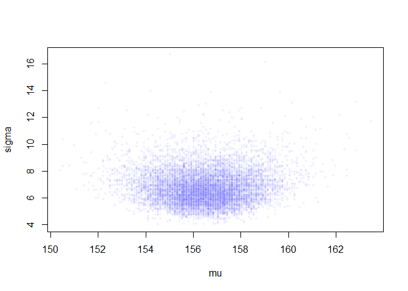<!-- -->


```r
dens( sample2.sigma , norm.comp=TRUE )
```

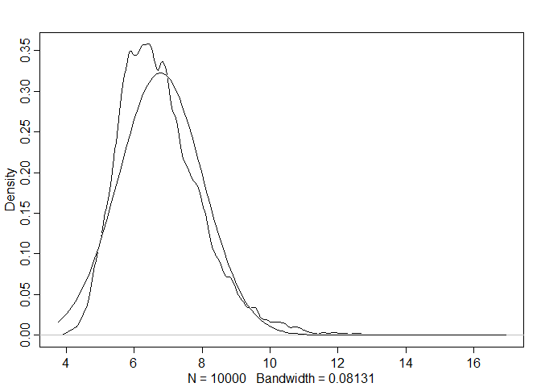<!-- -->


```r
library(rethinking)
data(Howell1)
d <- Howell1
d2 <- d[ d$age >= 18 , ]
```


```r
flist <- alist(
height ~ dnorm( mu , sigma ) ,
mu ~ dnorm( 178 , 20 ) ,
sigma ~ dunif( 0 , 50 )
)
```


```r
m4.1 <- quap( flist , data=d2 )
precis( m4.1 )
```

```
##             mean        sd       5.5%      94.5%
## mu    154.607036 0.4119932 153.948591 155.265480
## sigma   7.731306 0.2913835   7.265619   8.196993
```


```r
precis(m4.1,prob=0.95)
```

```
##             mean        sd       2.5%      97.5%
## mu    154.607036 0.4119932 153.799544 155.414527
## sigma   7.731306 0.2913835   7.160205   8.302407
```


```r
start <- list(
mu=mean(d2$height),
sigma=sd(d2$height)
)
m4.1 <- quap( flist , data=d2 , start=start )
precis( m4.1 )
```

```
##             mean        sd       5.5%      94.5%
## mu    154.607024 0.4119947 153.948576 155.265471
## sigma   7.731333 0.2913860   7.265642   8.197024
```

```r
m4.2 <- quap(
alist(
height ~ dnorm( mu , sigma ) ,
mu ~ dnorm( 178 , 0.1 ) ,
sigma ~ dunif( 0 , 50 )
) , data=d2 )
precis( m4.2 )
```

```
##            mean        sd      5.5%     94.5%
## mu    177.86375 0.1002354 177.70356 178.02395
## sigma  24.51756 0.9289235  23.03297  26.00216
```


```r
vcov( m4.1 )
```

```
##                 mu        sigma
## mu    0.1697396109 0.0002180307
## sigma 0.0002180307 0.0849058224
```


```r
diag( vcov( m4.1 ) )
```

```
##         mu      sigma 
## 0.16973961 0.08490582
```

```r
cov2cor( vcov( m4.1 ))
```

```
##                mu       sigma
## mu    1.000000000 0.001816174
## sigma 0.001816174 1.000000000
```


```r
post <- extract.samples( m4.1 , n=1e4 )
head(post)
```

```
##         mu    sigma
## 1 154.7415 7.743817
## 2 154.6348 7.873004
## 3 155.2501 7.664070
## 4 155.4417 7.881422
## 5 155.1405 7.820931
## 6 154.5748 7.405333
```


```r
precis(post)
```

```
##             mean        sd       5.5%      94.5%
## mu    154.601432 0.4158658 153.933236 155.263150
## sigma   7.728989 0.2913538   7.258475   8.198706
##                                                                                              histogram
## mu                                            <U+2581><U+2581><U+2585><U+2587><U+2582><U+2581><U+2581>
## sigma <U+2581><U+2581><U+2581><U+2581><U+2582><U+2585><U+2587><U+2587><U+2583><U+2581><U+2581><U+2581>
```


```r
library(MASS)
post <- mvrnorm( n=1e4 , mu=coef(m4.1) , Sigma=vcov(m4.1) )
```


```r
plot( d2$height ~ d2$weight )
```

<!-- -->


```r
set.seed(2971)
N <- 100 # 100 lines
a <- rnorm( N , 178 , 20 )
b <- rnorm( N , 0 , 10 )
plot( NULL , xlim=range(d2$weight) , ylim=c(-100,400) ,
xlab="weight" , ylab="height" )
abline( h=0 , lty=2 )
abline( h=272 , lty=1 , lwd=0.5 )
mtext( "b ~ dnorm(0,10)" )
xbar <- mean(d2$weight)
for ( i in 1:N ) curve( a[i] + b[i]*(x - xbar) ,
from=min(d2$weight) , to=max(d2$weight) , add=TRUE ,
col=col.alpha("black",0.2) )
```

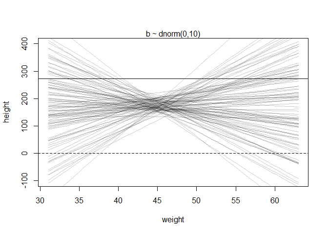<!-- -->


```r
b <- rlnorm( 1e4 , 0 , 1 )
dens( b , xlim=c(0,5) , adj=0.1 )
```

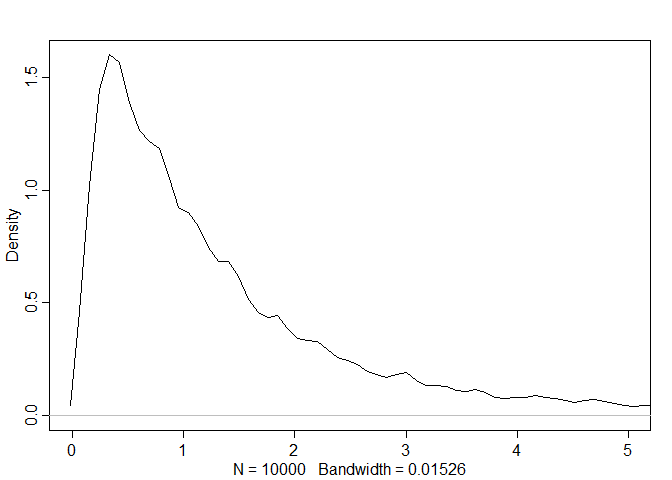<!-- -->


```r
set.seed(2971)
N <- 100 # 100 lines
a <- rnorm( N , 178 , 20 )
b <- rlnorm( N , 0 , 1 )
plot( NULL , xlim=range(d2$weight) , ylim=c(-100,400) ,
xlab="weight" , ylab="height" )
abline( h=0 , lty=2 )
abline( h=272 , lty=1 , lwd=0.5 )
mtext( "b ~ dnorm(0,10)" )
xbar <- mean(d2$weight)
for ( i in 1:N ) curve( a[i] + b[i]*(x - xbar) ,
from=min(d2$weight) , to=max(d2$weight) , add=TRUE ,
col=col.alpha("black",0.2) )
```

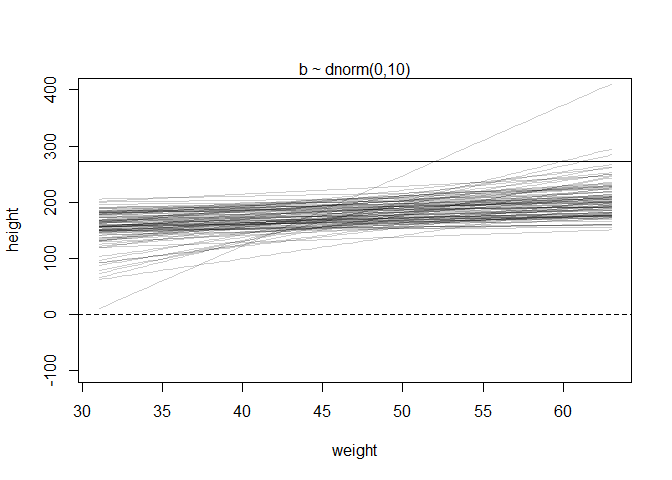<!-- -->


```r
xbar <- mean(d2$weight)
# fit model
m4.3 <- quap(
alist(
height ~ dnorm( mu , sigma ) ,
mu <- a + b*( weight - xbar ) ,
a ~ dnorm( 178 , 20 ) ,
b ~ dlnorm( 0 , 1 ) ,
sigma ~ dunif( 0 , 50 )
) ,
data=d2 )
```


```r
m4.3b <- quap(
alist(
height ~ dnorm( mu , sigma ) ,
mu <- a + exp(log_b)*( weight - xbar ),
a ~ dnorm( 178 , 100 ) ,
log_b ~ dnorm( 0 , 1 ) ,
sigma ~ dunif( 0 , 50 )
) ,
data=d2 )
```


```r
precis( m4.3 )
```

```
##              mean         sd        5.5%       94.5%
## a     154.6013671 0.27030766 154.1693633 155.0333710
## b       0.9032807 0.04192363   0.8362787   0.9702828
## sigma   5.0718809 0.19115478   4.7663786   5.3773831
```

```r
round( vcov( m4.3 ) , 3 )
```

```
##           a     b sigma
## a     0.073 0.000 0.000
## b     0.000 0.002 0.000
## sigma 0.000 0.000 0.037
```

```r
pairs(m4.3)
```

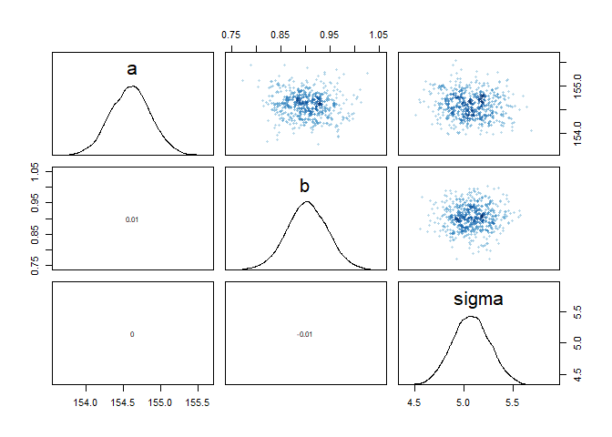<!-- -->


```r
plot( height ~ weight , data=d2 , col=rangi2 )
post <- extract.samples( m4.3 )
a_map <- mean(post$a)
b_map <- mean(post$b)
curve( a_map + b_map*(x - xbar) , add=TRUE )
```

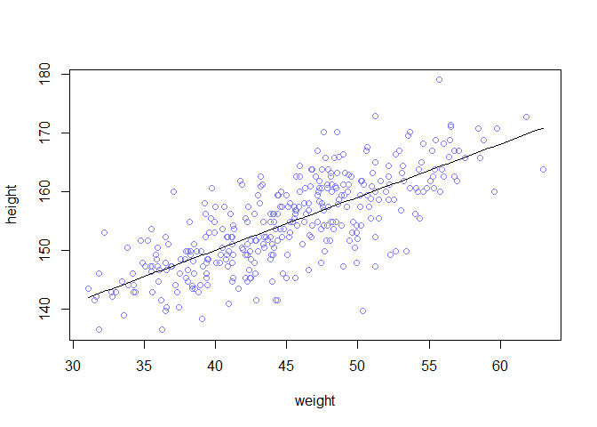<!-- -->

```r
post[1:5,]
```

```
##          a         b    sigma
## 1 154.0692 0.9536245 4.985399
## 2 154.6599 0.9698089 5.020560
## 3 154.4897 0.8284786 4.946619
## 4 154.8114 0.9047981 4.897890
## 5 154.7400 0.8213709 4.957076
```


```r
post <- extract.samples( m4.3 )
post[1:5,]
```

```
##          a         b    sigma
## 1 154.1414 0.8437991 5.049199
## 2 154.4068 0.8984859 4.738400
## 3 154.1965 0.9453762 5.248652
## 4 154.8193 0.9084742 5.500789
## 5 154.5535 0.9817791 5.031195
```


```r
N <- 10
dN <- d2[ 1:N , ]
mN <- quap(
alist(
height ~ dnorm( mu , sigma ) ,
mu <- a + b*( weight - mean(weight) ) ,
a ~ dnorm( 178 , 20 ) ,
b ~ dlnorm( 0 , 1 ) ,
sigma ~ dunif( 0 , 50 )
) , data=dN )
post <- extract.samples( mN , n=20 )
# display raw data and sample size
plot( dN$weight , dN$height ,
xlim=range(d2$weight) , ylim=range(d2$height) ,
col=rangi2 , xlab="weight" , ylab="height" )
mtext(concat("N = ",N))
# plot the lines, with transparency
for ( i in 1:20 )
curve( post$a[i] + post$b[i]*(x-mean(dN$weight)) , col=col.alpha("black",0.3) , add=TRUE )
```

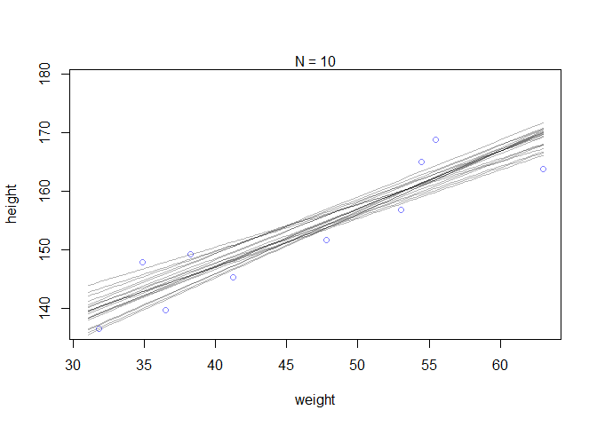<!-- -->

```r
N <- 200
dN <- d2[ 1:N , ]
mN <- quap(
alist(
height ~ dnorm( mu , sigma ) ,
mu <- a + b*( weight - mean(weight) ) ,
a ~ dnorm( 178 , 20 ) ,
b ~ dlnorm( 0 , 1 ) ,
sigma ~ dunif( 0 , 50 )
) , data=dN )
post <- extract.samples( mN , n=200 )
# display raw data and sample size
plot( dN$weight , dN$height ,
xlim=range(d2$weight) , ylim=range(d2$height) ,
col=rangi2 , xlab="weight" , ylab="height" )
mtext(concat("N = ",N))
# plot the lines, with transparency
for ( i in 1:200)
curve( post$a[i] + post$b[i]*(x-mean(dN$weight)) , col=col.alpha("black",0.3) , add=TRUE )
```

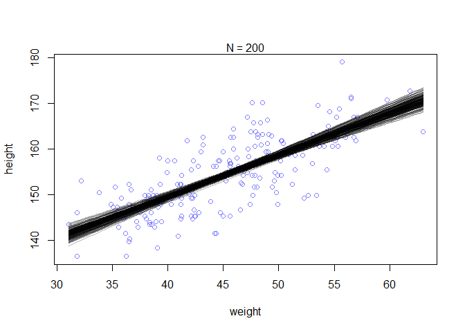<!-- -->


```r
post <- extract.samples( m4.3 )
mu_at_50 <- post$a + post$b * ( 50 - xbar )
head(mu_at_50)
```

```
## [1] 159.0426 158.9604 159.3308 159.0246 159.1691 159.5586
```


```r
dens( mu_at_50 , col=rangi2 , lwd=2 , xlab="mu|weight=50" )
```

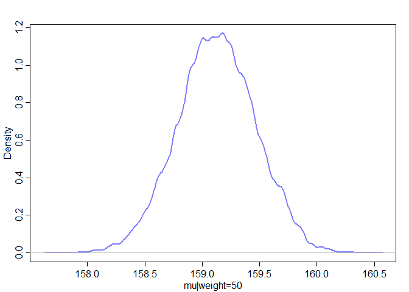<!-- -->


```r
HPDI( mu_at_50 , prob=0.89 )
```

```
##    |0.89    0.89| 
## 158.5947 159.6931
```

```r
mu <- link( m4.3 )
str(mu)
```

```
##  num [1:1000, 1:352] 157 157 157 157 157 ...
```

```r
# define sequence of weights to compute predictions for
# these values will be on the horizontal axis
weight.seq <- seq( from=25 , to=70 , by=1 )
# use link to compute mu
# for each sample from posterior
# and for each weight in weight.seq
mu <- link( m4.3 , data=data.frame(weight=weight.seq) )
str(mu)
```

```
##  num [1:1000, 1:46] 137 136 137 137 137 ...
```


```r
# use type="n" to hide raw data
plot( height ~ weight , d2 , type="n" )
# loop over samples and plot each mu value
for ( i in 1:100 )
points( weight.seq , mu[i,] , pch=16 , col=col.alpha(rangi2,0.1) )
```

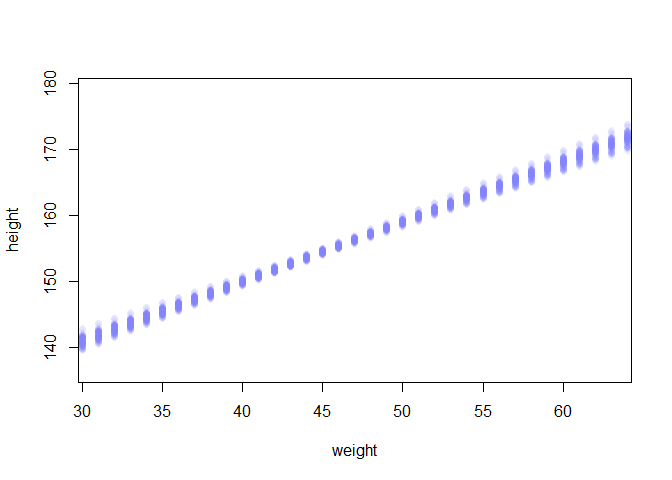<!-- -->


```r
# summarize the distribution of mu
mu.mean <- apply( mu , 2 , mean )
mu.HPDI <- apply( mu , 2 , HPDI , prob=0.89 )
```


```r
head(mu.mean)
```

```
## [1] 136.5318 137.4361 138.3404 139.2446 140.1489 141.0532
```

```r
head(mu.HPDI)[1:2,1]
```

```
##    |0.89    0.89| 
## 135.1873 137.9646
```


```r
# plot raw data
# fading out points to make line and interval more visible
plot( height ~ weight , data=d2 , col=col.alpha(rangi2,0.5) )
# plot the MAP line, aka the mean mu for each weight
lines( weight.seq , mu.mean )
# plot a shaded region for 89% HPDI
shade( mu.HPDI , weight.seq )
```

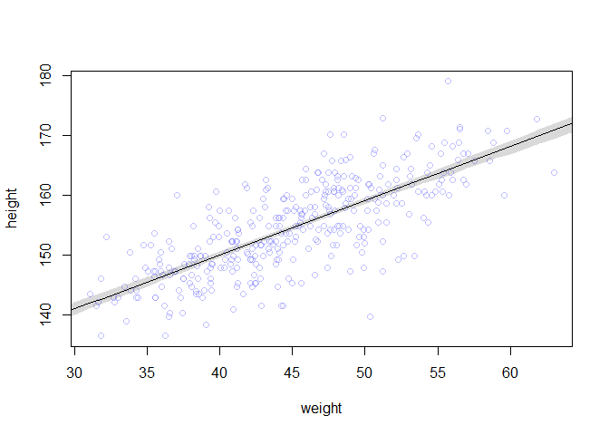<!-- -->


```r
post <- extract.samples(m4.3)
mu.link <- function(weight) post$a + post$b*( weight - xbar )
weight.seq <- seq( from=25 , to=70 , by=1 )
mu <- sapply( weight.seq , mu.link )
mu.mean <- apply( mu , 2 , mean )
mu.HPDI <- apply( mu , 2 , HPDI , prob=0.89 )
head(mu.mean)
```

```
## [1] 136.5491 137.4520 138.3549 139.2579 140.1608 141.0637
```

```r
head(mu.HPDI)[1:2,1]
```

```
##    |0.89    0.89| 
## 135.1423 137.9682
```


```r
sim.height <- sim( m4.3 , data=list(weight=weight.seq) )
str(sim.height)
```

```
##  num [1:1000, 1:46] 138 144 139 136 139 ...
```


```r
height.PI <- apply( sim.height , 2 , PI , prob=0.89 )
head(height.PI)
```

```
##         [,1]     [,2]     [,3]     [,4]     [,5]     [,6]     [,7]
## 5%  127.6512 129.1691 130.2508 130.5678 131.9568 132.3201 134.0336
## 94% 145.0824 145.3429 146.6805 147.6497 148.3341 149.8035 149.8411
##         [,8]     [,9]    [,10]    [,11]    [,12]    [,13]    [,14]
## 5%  134.4692 135.8432 136.4607 137.6424 137.9358 138.8316 140.0405
## 94% 150.9910 151.9537 152.7718 153.7050 155.0938 155.4840 156.5073
##        [,15]    [,16]    [,17]    [,18]    [,19]    [,20]    [,21]
## 5%  141.5253 141.3629 142.7540 144.1146 144.9818 145.1863 146.7766
## 94% 157.2751 157.8450 158.8266 159.8925 160.8476 161.9155 163.0495
##        [,22]    [,23]    [,24]    [,25]    [,26]    [,27]    [,28]
## 5%  147.3989 148.2248 149.4522 150.5193 151.2827 152.2498 153.2253
## 94% 163.7261 164.7606 165.3480 166.0224 167.4443 167.5369 168.9562
##        [,29]    [,30]    [,31]    [,32]    [,33]    [,34]    [,35]
## 5%  153.5363 154.7857 156.0254 156.5403 157.5447 158.0444 158.6507
## 94% 169.6767 171.0531 172.0813 173.2055 173.1264 174.1012 175.4351
##        [,36]    [,37]    [,38]    [,39]    [,40]    [,41]    [,42]   [,43]
## 5%  160.0638 160.9353 161.3751 162.7827 163.7758 164.4495 165.3398 166.369
## 94% 176.7705 177.0403 177.9956 179.0995 180.0570 180.9479 181.8325 182.971
##        [,44]    [,45]    [,46]
## 5%  166.6574 168.4606 169.1315
## 94% 183.5176 184.9440 185.0179
```


```r
# plot raw data
plot( height ~ weight , d2 , col=col.alpha(rangi2,0.5) )
# draw MAP line
lines( weight.seq , mu.mean )
# draw HPDI region for line
shade( mu.HPDI , weight.seq )
# draw PI region for simulated heights
shade( height.PI , weight.seq )
```

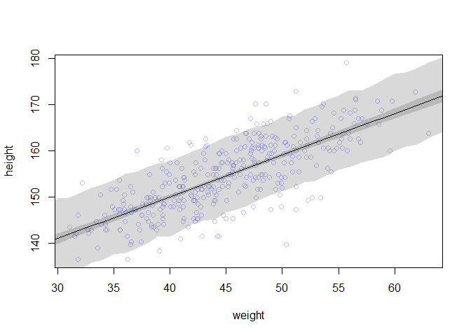<!-- -->


```r
sim.height <- sim( m4.3 , data=list(weight=weight.seq) , n=1e4 )
height.PI <- apply( sim.height , 2 , PI , prob=0.89 )
# plot raw data
plot( height ~ weight , d2 , col=col.alpha(rangi2,0.5) )
# draw MAP line
lines( weight.seq , mu.mean )
# draw HPDI region for line
shade( mu.HPDI , weight.seq )
# draw PI region for simulated heights
shade( height.PI , weight.seq )
```

<!-- -->


```r
post <- extract.samples(m4.3)
weight.seq <- 25:70
sim.height <- sapply( weight.seq , function(weight)
rnorm(
n=nrow(post) ,
mean=post$a + post$b*( weight - xbar ) ,
sd=post$sigma ) )
height.PI <- apply( sim.height , 2 , PI , prob=0.89 )
# plot raw data
plot( height ~ weight , d2 , col=col.alpha(rangi2,0.5) )
# draw MAP line
lines( weight.seq , mu.mean )
# draw HPDI region for line
shade( mu.HPDI , weight.seq )
# draw PI region for simulated heights
shade( height.PI , weight.seq )
```

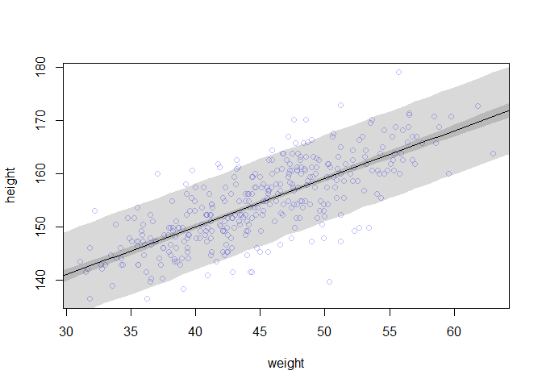<!-- -->


```r
library(rethinking)
data(Howell1)
d <- Howell1
str(d)
```

```
## 'data.frame':	544 obs. of  4 variables:
##  $ height: num  152 140 137 157 145 ...
##  $ weight: num  47.8 36.5 31.9 53 41.3 ...
##  $ age   : num  63 63 65 41 51 35 32 27 19 54 ...
##  $ male  : int  1 0 0 1 0 1 0 1 0 1 ...
```


```r
plot( d$height ~ d$weight)
```

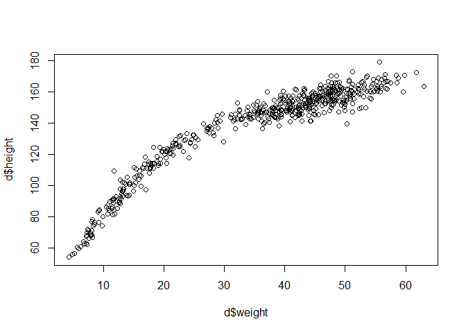<!-- -->


```r
d$weight_s <- ( d$weight - mean(d$weight) )/sd(d$weight)
d$weight_s2 <- d$weight_s^2
m4.5 <- quap(
alist(
height ~ dnorm( mu , sigma ) ,
mu <- a + b1*weight_s + b2*weight_s2 ,
a ~ dnorm( 178 , 20 ) ,
b1 ~ dlnorm( 0 , 1 ) ,
b2 ~ dnorm( 0 , 1 ) ,
sigma ~ dunif( 0 , 50 )
) ,
data=d )
precis( m4.5 )
```

```
##             mean        sd       5.5%      94.5%
## a     146.057416 0.3689754 145.467722 146.647110
## b1     21.733062 0.2888889  21.271362  22.194762
## b2     -7.803270 0.2741838  -8.241469  -7.365072
## sigma   5.774473 0.1764650   5.492448   6.056498
```


```r
weight.seq <- seq( from=-2.2 , to=2 , length.out=30 )
pred_dat <- list( weight_s=weight.seq , weight_s2=weight.seq^2 )
head(pred_dat)
```

```
## $weight_s
##  [1] -2.20000000 -2.05517241 -1.91034483 -1.76551724 -1.62068966
##  [6] -1.47586207 -1.33103448 -1.18620690 -1.04137931 -0.89655172
## [11] -0.75172414 -0.60689655 -0.46206897 -0.31724138 -0.17241379
## [16] -0.02758621  0.11724138  0.26206897  0.40689655  0.55172414
## [21]  0.69655172  0.84137931  0.98620690  1.13103448  1.27586207
## [26]  1.42068966  1.56551724  1.71034483  1.85517241  2.00000000
## 
## $weight_s2
##  [1] 4.8400000000 4.2237336504 3.6494173603 3.1170511296 2.6266349584
##  [6] 2.1781688466 1.7716527943 1.4070868014 1.0844708680 0.8038049941
## [11] 0.5650891795 0.3683234245 0.2135077289 0.1006420927 0.0297265161
## [16] 0.0007609988 0.0137455410 0.0686801427 0.1655648038 0.3043995244
## [21] 0.4851843044 0.7079191439 0.9726040428 1.2792390012 1.6278240190
## [26] 2.0183590963 2.4508442331 2.9252794293 3.4416646849 4.0000000000
```

```r
mu <- link( m4.5 , data=pred_dat )
mu.mean <- apply( mu , 2 , mean )
mu.PI <- apply( mu , 2 , PI , prob=0.89 )
sim.height <- sim( m4.5 , data=pred_dat )
height.PI <- apply( sim.height , 2 , PI , prob=0.89 )
plot( height ~ weight_s , d , col=col.alpha(rangi2,0.5) )
lines( weight.seq , mu.mean )
shade( mu.PI , weight.seq )
shade( height.PI , weight.seq )
```

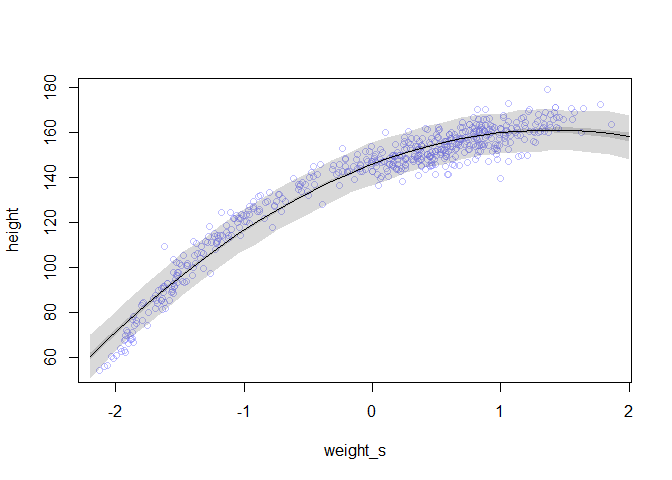<!-- -->


```r
d$weight_s3 <- d$weight_s^3
m4.6 <- quap(
alist(
height ~ dnorm( mu , sigma ) ,
mu <- a + b1*weight_s + b2*weight_s2 + b3*weight_s3 ,
a ~ dnorm( 178 , 20 ) ,
b1 ~ dlnorm( 0 , 1 ) ,
b2 ~ dnorm( 0 , 10 ) ,
b3 ~ dnorm( 0 , 10 ) ,
sigma ~ dunif( 0 , 50 )
) ,
data=d )
weight.seq <- seq( from=-2.2 , to=2 , length.out=30 )
pred_dat <- list( weight_s=weight.seq , weight_s2=weight.seq^2, weight_s3=weight.seq^3 )
head(pred_dat)
```

```
## $weight_s
##  [1] -2.20000000 -2.05517241 -1.91034483 -1.76551724 -1.62068966
##  [6] -1.47586207 -1.33103448 -1.18620690 -1.04137931 -0.89655172
## [11] -0.75172414 -0.60689655 -0.46206897 -0.31724138 -0.17241379
## [16] -0.02758621  0.11724138  0.26206897  0.40689655  0.55172414
## [21]  0.69655172  0.84137931  0.98620690  1.13103448  1.27586207
## [26]  1.42068966  1.56551724  1.71034483  1.85517241  2.00000000
## 
## $weight_s2
##  [1] 4.8400000000 4.2237336504 3.6494173603 3.1170511296 2.6266349584
##  [6] 2.1781688466 1.7716527943 1.4070868014 1.0844708680 0.8038049941
## [11] 0.5650891795 0.3683234245 0.2135077289 0.1006420927 0.0297265161
## [16] 0.0007609988 0.0137455410 0.0686801427 0.1655648038 0.3043995244
## [21] 0.4851843044 0.7079191439 0.9726040428 1.2792390012 1.6278240190
## [26] 2.0183590963 2.4508442331 2.9252794293 3.4416646849 4.0000000000
## 
## $weight_s3
##  [1] -1.064800e+01 -8.680501e+00 -6.971646e+00 -5.503208e+00 -4.256960e+00
##  [6] -3.214677e+00 -2.358131e+00 -1.669096e+00 -1.129346e+00 -7.206528e-01
## [11] -4.247912e-01 -2.235342e-01 -9.865530e-02 -3.192784e-02 -5.125261e-03
## [16] -2.099307e-05  1.611546e-03  1.799893e-02  6.736775e-02  1.679446e-01
## [21]  3.379560e-01  5.956285e-01  9.591888e-01  1.446863e+00  2.076879e+00
## [26]  2.867462e+00  3.836839e+00  5.003237e+00  6.384881e+00  8.000000e+00
```

```r
mu <- link( m4.6 , data=pred_dat )
mu.mean <- apply( mu , 2 , mean )
mu.PI <- apply( mu , 2 , PI , prob=0.89 )
sim.height <- sim( m4.6 , data=pred_dat )
height.PI <- apply( sim.height , 2 , PI , prob=0.89 )
plot( height ~ weight_s , d , col=col.alpha(rangi2,0.5) )
lines( weight.seq , mu.mean )
shade( mu.PI , weight.seq )
shade( height.PI , weight.seq )
```

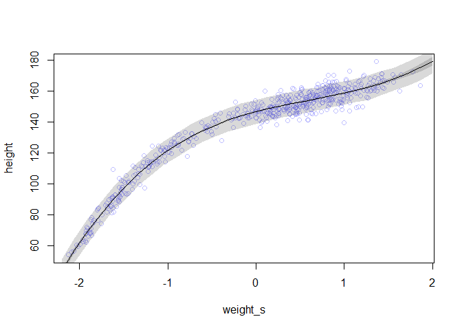<!-- -->


```r
plot( height ~ weight_s , d , col=col.alpha(rangi2,0.5) , xaxt="n" )
at <- c(-2,-1,0,1,2)
labels <- at*sd(d$weight) + mean(d$weight)
axis( side=1 , at=at , labels=round(labels,1) )
```

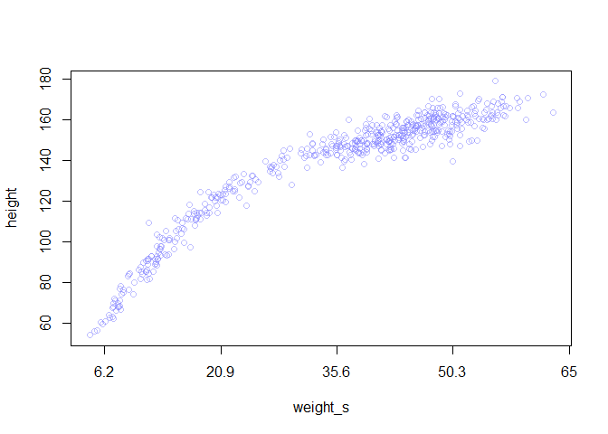<!-- -->


```r
library(rethinking)
data(cherry_blossoms)
d <- cherry_blossoms
precis(d)
```

```
##                   mean          sd      5.5%      94.5%
## year       1408.000000 350.8845964 867.77000 1948.23000
## doy         104.540508   6.4070362  94.43000  115.00000
## temp          6.141886   0.6636479   5.15000    7.29470
## temp_upper    7.185151   0.9929206   5.89765    8.90235
## temp_lower    5.098941   0.8503496   3.78765    6.37000
##                                                                                                                           histogram
## year                       <U+2587><U+2587><U+2587><U+2587><U+2587><U+2587><U+2587><U+2587><U+2587><U+2587><U+2587><U+2587><U+2581>
## doy                                                                <U+2581><U+2582><U+2585><U+2587><U+2587><U+2583><U+2581><U+2581>
## temp                                                               <U+2581><U+2583><U+2585><U+2587><U+2583><U+2582><U+2581><U+2581>
## temp_upper <U+2581><U+2582><U+2585><U+2587><U+2587><U+2585><U+2582><U+2582><U+2581><U+2581><U+2581><U+2581><U+2581><U+2581><U+2581>
## temp_lower <U+2581><U+2581><U+2581><U+2581><U+2581><U+2581><U+2581><U+2583><U+2585><U+2587><U+2583><U+2582><U+2581><U+2581><U+2581>
```


```r
plot(d$temp ~ d$year)
```

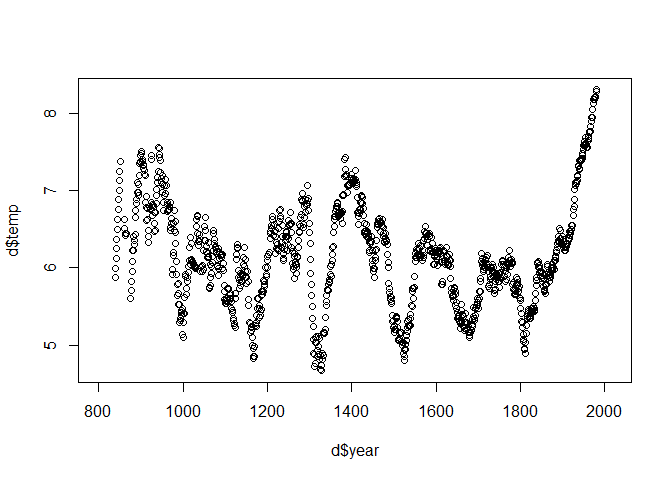<!-- -->


```r
d2 <- d[ complete.cases(d$temp) , ] # complete cases on temp
num_knots <- 15
knot_list <- quantile( d2$year , probs=seq(0,1,length.out=num_knots))
knot_list
```

```
##        0% 7.142857% 14.28571% 21.42857% 28.57143% 35.71429% 42.85714% 
##  839.0000  937.2143 1017.4286 1097.6429 1177.8571 1258.0714 1338.2857 
##       50% 57.14286% 64.28571% 71.42857% 78.57143% 85.71429% 92.85714% 
## 1418.5000 1498.7143 1578.9286 1659.1429 1739.3571 1819.5714 1899.7857 
##      100% 
## 1980.0000
```


```r
library(splines)
B <- bs(d2$year,
knots=knot_list[-c(1,num_knots)] ,
degree=3 , intercept=TRUE )
head(B)
```

```
##              1          2            3            4 5 6 7 8 9 10 11 12 13
## [1,] 1.0000000 0.00000000 0.0000000000 0.000000e+00 0 0 0 0 0  0  0  0  0
## [2,] 0.9697645 0.03006521 0.0001700700 2.206279e-07 0 0 0 0 0  0  0  0  0
## [3,] 0.9401447 0.05917776 0.0006757944 1.765023e-06 0 0 0 0 0  0  0  0  0
## [4,] 0.9111342 0.08734939 0.0015104442 5.956954e-06 0 0 0 0 0  0  0  0  0
## [5,] 0.8827268 0.11459183 0.0026672909 1.412019e-05 0 0 0 0 0  0  0  0  0
## [6,] 0.8549160 0.14091682 0.0041396056 2.757849e-05 0 0 0 0 0  0  0  0  0
##      14 15 16 17
## [1,]  0  0  0  0
## [2,]  0  0  0  0
## [3,]  0  0  0  0
## [4,]  0  0  0  0
## [5,]  0  0  0  0
## [6,]  0  0  0  0
```


```r
plot( NULL , xlim=range(d2$year) , ylim=c(0,1) , xlab="year" , ylab="basis value" )
for ( i in 1:ncol(B) ) lines( d2$year , B[,i] )
```

<!-- -->


```r
m4.7 <- quap(
alist(
T ~ dnorm( mu , sigma ) ,
mu <- a + B %*% w ,
a ~ dnorm(6,10),
w ~ dnorm(0,1),
sigma ~ dexp(1)
),
data=list( T=d2$temp , B=B ) ,
start=list( w=rep( 0 , ncol(B) ) ) )
precis(m4.7,depth=2)
```

```
##              mean          sd       5.5%      94.5%
## w[1]   0.09748016 0.267673960 -0.3303145  0.5252748
## w[2]   0.23888166 0.279071087 -0.2071278  0.6848912
## w[3]   1.20070218 0.271684981  0.7664971  1.6349072
## w[4]  -0.82198060 0.259287202 -1.2363716 -0.4075896
## w[5]   0.10175824 0.257448206 -0.3096937  0.5132102
## w[6]  -1.40469550 0.257092976 -1.8155797 -0.9938113
## w[7]   1.15649849 0.256907770  0.7459103  1.5670867
## w[8]  -1.91586141 0.256912386 -2.3264570 -1.5052658
## w[9]   2.34740542 0.256876318  1.9368674  2.7579434
## w[10] -2.32070380 0.256924578 -2.7313189 -1.9100887
## w[11]  0.93548425 0.256914797  0.5248848  1.3460837
## w[12] -1.61488213 0.257200551 -2.0259383 -1.2038260
## w[13]  0.18054002 0.257668643 -0.2312642  0.5923443
## w[14] -1.24146903 0.260466376 -1.6577446 -0.8251935
## w[15]  0.03146167 0.270382477 -0.4006618  0.4635851
## w[16]  0.99681372 0.274756838  0.5576992  1.4359282
## w[17]  2.03579025 0.268397012  1.6068400  2.4647405
## a      6.32227521 0.242765640  5.9342888  6.7102616
## sigma  0.34423760 0.007262337  0.3326310  0.3558442
```


```r
post <- extract.samples(m4.7)
w <- apply( post$w , 2 , mean )
plot( NULL , xlim=range(d2$year) , ylim=c(-2,2) ,
xlab="year" , ylab="basis * weight" )
for ( i in 1:ncol(B) ) lines( d2$year , w[i]*B[,i] )
```

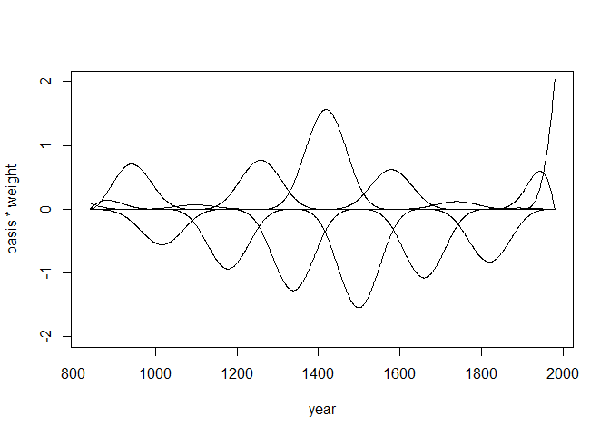<!-- -->


```r
mu <- link( m4.7 )
mu_PI <- apply(mu,2,PI,0.97)
plot( d2$year , d2$temp , col=col.alpha(rangi2,0.3) , pch=16 )
shade( mu_PI , d2$year , col=col.alpha("black",0.5) )
```

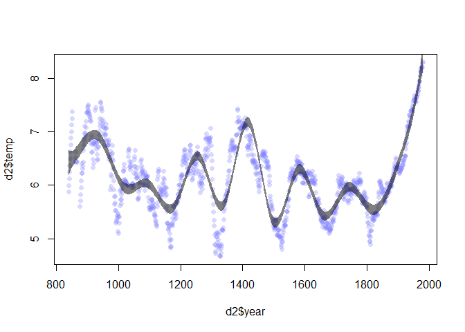<!-- -->


